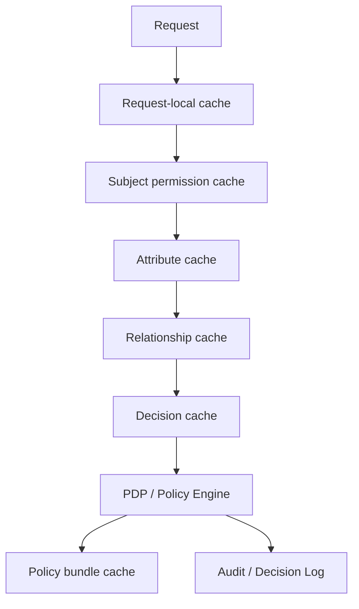

# Part 036 — Authorization Performance, Caching, and Resilience

> Goal part ini: kamu bisa membuat authorization cepat tanpa membuatnya salah. Performance authorization bukan sekadar “tambahkan cache”. Ini soal menjaga correctness, freshness, auditability, dan fail-safe behavior di bawah latency, load, outage, dan perubahan policy.

Authorization ada di hot path. Setiap request, command, query, export, worker, dan internal call butuh decision. Kalau decision lambat, seluruh sistem lambat. Kalau decision cache salah, data bocor.

Jadi pertanyaannya bukan:

```text
Should we cache authorization?
```

Pertanyaan yang benar:

```text
Which authorization fact may be cached, under what key, for how long, with which invalidation signal, with what risk if stale, and what happens when the PDP/attribute store is unavailable?
```

---

## 1. Performance Model of Authorization

Authorization decision biasanya tersusun dari beberapa fakta:

```text
Decision = f(subject, action, resource, context, policy, relationships, attributes)
```

Setiap komponen punya cost dan freshness berbeda.

| Component | Example | Cost | Freshness risk |
|---|---|---:|---:|
| Subject identity | user id, service id | Low | Low |
| Static role | system role | Low | Medium |
| Tenant membership | user in tenant | Medium | Medium |
| Object ownership | case owner | Medium | Medium |
| Assignment | investigator assigned to case | Medium | High |
| Relationship graph | folder/document sharing | High | High |
| Context | time, IP, risk score | Low-High | High |
| Policy code | Rego/Cedar/Java rule | Low-Medium | Medium |
| External PDP call | OPA/AVP/OpenFGA | Network cost | Depends |
| Database query scope | SQL predicate | Medium | Depends |

Optimization tidak boleh memperlakukan semua fakta sama.

---

## 2. Latency Budget

Sebelum cache, tentukan latency budget.

Contoh API internal:

```text
p50 total request: 40 ms
p95 total request: 120 ms
p99 total request: 250 ms
```

Authorization budget mungkin:

```text
request guard: <= 3 ms p95 local
external PDP: <= 15 ms p95
batch check: <= 50 ms p95 per 100 resources
query scoping: no additional unindexed scan
```

Kalau authorization tidak punya budget, ia akan menjadi invisible tax.

Budget perlu dipisah:

| Path | Budget | Strategy |
|---|---:|---|
| Coarse endpoint permission | sub-ms to few ms | local role/permission cache |
| Object detail read | few ms | scoped DB load + optional PDP |
| Search/list | query-dependent | authorize by query predicate |
| Batch operation | chunked | batch PDP/list objects/scoped SQL |
| Export/report | async | snapshot + recheck + scoped read |
| Admin mutation | slower acceptable | strict recheck and audit |

---

## 3. Caching Layers

Authorization caching is not one cache. It is a stack.



### 3.1 Request-Local Cache

Cache only for the current request.

Use case:

- same `canRead(case)` checked multiple times;
- mapper checks field policy repeatedly;
- service layer and DTO layer need same decision.

Risk low because lifetime is one request.

```java
public final class RequestAuthorizationCache {
    private final Map<AuthorizationCacheKey, AuthorizationDecision> decisions = new HashMap<>();

    public AuthorizationDecision getOrCompute(
        AuthorizationCacheKey key,
        Supplier<AuthorizationDecision> supplier
    ) {
        return decisions.computeIfAbsent(key, ignored -> supplier.get());
    }
}
```

Request-local cache is almost always safe if key is correct.

### 3.2 Subject Permission Cache

Cache effective roles/permissions for a subject.

Example key:

```text
subjectId + tenantId + roleVersion
```

Good for RBAC coarse permission.

Dangerous if used for object-level authorization.

```java
public record SubjectPermissionCacheKey(
    String subjectId,
    String tenantId,
    long membershipVersion,
    long roleAssignmentVersion
) {}
```

Do not key only by `subjectId` in multi-tenant systems.

### 3.3 Attribute Cache

Cache subject/resource attributes.

Examples:

- subject department;
- clearance level;
- tenant status;
- case classification;
- case state;
- assignment list.

Each attribute needs freshness class:

```java
public enum FreshnessClass {
    STATIC,          // country code, createdAt
    SLOW_CHANGING,   // department, title
    MEDIUM,          // role assignment, group membership
    HIGH_RISK,       // case assignment, account status
    REAL_TIME        // risk score, emergency lock, legal hold
}
```

You can cache `STATIC` longer than `HIGH_RISK`.

### 3.4 Relationship Cache

For ReBAC/OpenFGA/Zanzibar-style systems, relationship checks can be expensive.

Cache examples:

```text
can(user:alice, viewer, case:CASE-1) = true
listObjects(user:alice, viewer, case) = [CASE-1, CASE-2]
```

Risk:

- tuple removed but cached allow remains;
- group membership revoked but inherited access remains;
- parent folder permission changed;
- consistency token ignored.

Relationship cache must be version-aware or short-lived.

### 3.5 Decision Cache

Cache final decision.

Highest risk because it combines all facts.

Decision cache key must include every input that can affect result.

```java
public record AuthorizationDecisionCacheKey(
    String subjectId,
    String tenantId,
    String action,
    String resourceType,
    String resourceId,
    String resourceVersion,
    String policyVersion,
    String relationshipVersion,
    String attributeVersion,
    String contextFingerprint
) {}
```

If key omits a variable, stale or wrong allow can happen.

---

## 4. Cache Key Design

Bad cache key:

```text
userId + action
```

This leaks across tenant/resource/context.

Better:

```text
subjectId
+ tenantId
+ subjectVersion
+ action
+ resourceType
+ resourceId
+ resourceVersion
+ contextClass
+ policyVersion
+ decisionMode
```

For field-level decision:

```text
subjectId + tenantId + action + resourceType + resourceId + fieldSet + policyVersion
```

For list/search:

Do not cache per query blindly. Cache **scope predicates** or **accessible object set** with freshness model.

```java
public record AccessScopeCacheKey(
    String subjectId,
    String tenantId,
    String resourceType,
    String accessPurpose,
    String membershipVersion,
    String policyVersion
) {}
```

---

## 5. Cache Value Design

Do not cache only boolean.

Bad:

```java
Map<Key, Boolean> cache;
```

Better:

```java
public record CachedAuthorizationDecision(
    boolean allowed,
    String decisionId,
    String policyVersion,
    Instant decidedAt,
    Instant expiresAt,
    List<String> reasonCodes,
    List<Obligation> obligations,
    CacheRisk risk,
    Set<String> dependencyVersions
) {}
```

Why?

- audit needs decision id;
- field masking needs obligations;
- cache invalidation needs dependencies;
- fallback needs risk;
- debugging needs reason code;
- rollout needs policy version.

---

## 6. TTL Strategy

TTL is not a security model. TTL is a bounded-staleness compromise.

Example TTL matrix:

| Decision type | Suggested TTL | Notes |
|---|---:|---|
| Request-local duplicate check | request lifetime | safest |
| Static permission catalog | minutes-hours | versioned deploy |
| User role assignment | seconds-minutes | invalidate on change |
| Tenant membership | seconds-minutes | high impact in SaaS |
| Case assignment | seconds or no cache | high-risk object access |
| Account disabled | no cache or very short | revocation-critical |
| Break-glass deny | no cache | must take effect quickly |
| Policy bundle | versioned | rollout-controlled |
| External PDP allow for export | no cache or request-local | sensitive |
| Deny decisions | short TTL | avoid locking out after grant |

Common rule:

> Cache allow decisions more conservatively than deny decisions when stale allow is dangerous.

But deny caching can also hurt operations when access was just granted. Use short TTL and reason-aware caching.

---

## 7. Invalidation Models

### 7.1 TTL-only

Simple but weak.

```text
cache entry expires after 60 seconds
```

Risk: revoked access remains for up to 60 seconds.

Acceptable only if risk tolerance allows it.

### 7.2 Event-based invalidation

Emit events:

```text
RoleAssigned
RoleRevoked
TenantMembershipChanged
CaseAssignmentChanged
PolicyPublished
RelationshipTupleChanged
AccountDisabled
LegalHoldApplied
```

Then invalidate matching keys.

```java
public void onCaseAssignmentChanged(CaseAssignmentChanged event) {
    decisionCache.evictByDependency("case-assignment:" + event.caseId());
    accessScopeCache.evictSubject(event.userId(), event.tenantId());
}
```

Risk: invalidation event can be delayed/lost. Use TTL as backstop.

### 7.3 Versioned cache

Include version in cache key.

```text
user:alice roleVersion=42
case:CASE-1 assignmentVersion=17
policyVersion=2026.07.03
```

When version changes, old cache entries are naturally bypassed.

This is stronger than explicit eviction if every decision can cheaply get current version.

### 7.4 Dependency-tracked cache

Cache entry records dependencies:

```json
{
  "key": "authz:...",
  "dependencies": [
    "subject:user:alice:roles:v42",
    "case:CASE-1:assignment:v17",
    "policy:case-authz:v2026.07.03"
  ]
}
```

Evict by dependency when fact changes.

More complex, but useful for high-scale systems.

---

## 8. Freshness Budget

Define maximum stale time per risk class.

```java
public record FreshnessBudget(
    Duration maxSubjectStaleness,
    Duration maxResourceStaleness,
    Duration maxRelationshipStaleness,
    Duration maxPolicyStaleness
) {}
```

Example:

| Operation | Subject | Resource | Relationship | Policy |
|---|---:|---:|---:|---:|
| View dashboard count | 5 min | 5 min | 5 min | 15 min |
| Read case detail | 30 sec | 30 sec | 30 sec | 5 min |
| Export case | 0-5 sec | 0-5 sec | 0-5 sec | current |
| Approve enforcement action | current | current | current | current |
| Assign role | current | current | current | current |

This is more precise than “cache for 5 minutes”.

---

## 9. Fail-Open vs Fail-Closed

Authorization failure semantics must be explicit.

| Failure | Low-risk read | Sensitive read | Mutation | Admin/security action |
|---|---|---|---|---|
| PDP timeout | maybe degraded deny/limited | deny | deny | deny |
| Attribute store unavailable | maybe cached stale under budget | deny | deny | deny |
| Policy bundle unavailable | use last known good if valid | use last known good or deny | deny if no known good | deny |
| Audit sink unavailable | maybe continue with local buffer | maybe buffer | depends on regulation | often deny or buffer with alert |
| Cache unavailable | bypass cache | bypass cache | bypass cache | bypass cache |

Default for sensitive operations:

```text
fail closed
```

But fail-closed can create outage. Production-grade design distinguishes:

- fail-closed for sensitive mutation/export/admin;
- degrade to minimal safe view for non-sensitive UI;
- last-known-good policy for PDP deployment issue;
- local emergency deny rules always available;
- explicit break-glass with audit.

---

## 10. Last Known Good Policy

If external policy distribution fails, services should not instantly lose all authorization ability.

Pattern:

```text
load signed policy bundle -> validate -> activate -> keep previous valid bundle as LKG
```

If new bundle invalid:

```text
reject new bundle -> continue LKG -> alert
```

If no bundle ever loaded:

```text
fail closed
```

Java sketch:

```java
public final class PolicyBundleRegistry {
    private volatile PolicyBundle active;
    private volatile PolicyBundle lastKnownGood;

    public void activate(PolicyBundle candidate) {
        candidate.verifySignature();
        candidate.runSmokeTests();
        this.lastKnownGood = this.active;
        this.active = candidate;
    }

    public PolicyBundle currentOrThrow() {
        PolicyBundle bundle = active;
        if (bundle == null) {
            throw new PolicyUnavailableException("no active policy bundle");
        }
        return bundle;
    }
}
```

Use LKG for policy distribution failures, not for revoked user access unless freshness budget allows.

---

## 11. Circuit Breakers and Timeouts

External PDP calls need timeouts.

Bad:

```java
pdpClient.decide(request); // no timeout, no fallback, no metrics
```

Better:

```java
public AuthorizationDecision decide(AuthorizationRequest request) {
    try {
        return circuitBreaker.executeSupplier(() ->
            pdpClient.decide(request, Duration.ofMillis(30))
        );
    } catch (TimeoutException | CircuitBreakerOpenException ex) {
        return fallbackDecision(request, ex);
    }
}
```

Fallback must be policy-aware:

```java
private AuthorizationDecision fallbackDecision(AuthorizationRequest request, Exception ex) {
    if (request.risk().isSensitive()) {
        return AuthorizationDecision.indeterminateDeny(
            "PDP_UNAVAILABLE_FAIL_CLOSED",
            ex.getClass().getSimpleName()
        );
    }

    return staleCache.getIfFreshEnough(request)
        .orElseGet(() -> AuthorizationDecision.indeterminateDeny(
            "PDP_UNAVAILABLE_NO_SAFE_CACHE",
            ex.getClass().getSimpleName()
        ));
}
```

Do not hide PDP outage as normal deny. Use `INDETERMINATE_DENY` reason for observability.

---

## 12. Stampede Protection

When cache expires, many threads may recompute same decision.

Use single-flight per key:

```java
public final class SingleFlightAuthorizationCache {
    private final ConcurrentHashMap<AuthorizationCacheKey, CompletableFuture<AuthorizationDecision>> inFlight = new ConcurrentHashMap<>();

    public AuthorizationDecision getOrCompute(
        AuthorizationCacheKey key,
        Supplier<AuthorizationDecision> compute
    ) {
        CompletableFuture<AuthorizationDecision> future = inFlight.computeIfAbsent(key, k ->
            CompletableFuture.supplyAsync(() -> {
                try {
                    return compute.get();
                } finally {
                    inFlight.remove(k);
                }
            })
        );
        return future.join();
    }
}
```

Also use:

- jittered TTL;
- background refresh;
- stale-while-revalidate only for low-risk decisions;
- per-subject/resource rate limit;
- batch decision API.

---

## 13. Batch Authorization Performance

Naively checking 1000 resources one-by-one kills latency.

Bad:

```java
for (String caseId : caseIds) {
    authorization.require(subject, "case.read", ResourceRef.caseId(caseId));
}
```

Better strategies:

### 13.1 Query scoping

```sql
SELECT *
FROM cases c
WHERE c.tenant_id = :tenantId
  AND c.id = ANY(:caseIds)
  AND EXISTS (
      SELECT 1
      FROM case_assignments a
      WHERE a.case_id = c.id
        AND a.user_id = :userId
  )
```

### 13.2 Batch PDP

```java
List<AuthorizationRequest> requests = caseIds.stream()
    .map(id -> AuthorizationRequest.of(subject, "case.read", ResourceRef.caseId(id)))
    .toList();

BulkDecision decisions = authorization.decideAll(requests);
```

### 13.3 List objects / accessible set

For ReBAC:

```text
listObjects(user:alice, relation:viewer, type:case)
```

Then intersect with requested IDs.

### 13.4 Precomputed access table

```sql
case_access(user_id, case_id, permission, tenant_id, version)
```

Useful for high-read systems, but invalidation and staleness become core complexity.

---

## 14. Query Scoping and Indexing

Authorization predicate must be index-friendly.

Bad predicate:

```sql
WHERE can_access(:userId, case_id) = true
```

This can cause function scan over all cases.

Better:

```sql
WHERE tenant_id = :tenantId
  AND jurisdiction_id = ANY(:jurisdictionIds)
  AND classification <= :clearance
  AND EXISTS (... assignment indexed by user_id, case_id ...)
```

Indexes:

```sql
CREATE INDEX idx_cases_tenant_state ON cases(tenant_id, state);
CREATE INDEX idx_case_assignments_user_case ON case_assignments(user_id, case_id);
CREATE INDEX idx_cases_jurisdiction_classification ON cases(jurisdiction_id, classification);
```

Authorization performance is often database modeling performance.

---

## 15. Policy Evaluation Cost

Policy rules can accidentally become expensive.

Example expensive policy:

```text
allow if user belongs to any group that belongs to any department that has any jurisdiction that overlaps resource jurisdiction tree
```

Cost comes from:

- nested graph expansion;
- external attribute calls;
- large list membership;
- regex/string operations;
- unbounded recursion;
- per-field policy repeated per row;
- no precomputed closure.

Mitigation:

- precompute group closure;
- precompute jurisdiction closure;
- cache policy-independent attributes;
- compile policy where possible;
- batch attribute loading;
- use sets, not lists;
- cap graph traversal depth;
- use partial evaluation for query predicates;
- separate hot path policy from rare admin policy.

---

## 16. Resource Versioning

Cache correctness improves if resources have authorization-relevant version.

```java
public record CaseAuthzVersion(
    String caseId,
    long assignmentVersion,
    long classificationVersion,
    long stateVersion,
    long legalHoldVersion
) {}
```

Decision cache key includes relevant version.

When case assignment changes:

```sql
UPDATE cases
SET assignment_version = assignment_version + 1
WHERE id = :caseId;
```

Then old decision key misses automatically.

---

## 17. Subject Versioning

User authorization facts need versioning.

```java
public record SubjectAuthzVersion(
    String subjectId,
    String tenantId,
    long roleVersion,
    long groupVersion,
    long delegationVersion,
    long accountStatusVersion
) {}
```

Increment versions when:

- role assigned/revoked;
- tenant membership changes;
- group membership changes;
- account disabled;
- delegation granted/revoked;
- clearance changes;
- break-glass starts/ends.

Avoid cache keys that only use username/email.

---

## 18. Policy Versioning

Every decision should know policy version.

```java
public record PolicyIdentity(
    String engine,
    String policySet,
    String version,
    String digest
) {}
```

Decision:

```json
{
  "allowed": true,
  "decisionId": "dec-1",
  "policy": {
    "engine": "opa",
    "policySet": "case-authz",
    "version": "2026.07.03",
    "digest": "sha256:..."
  }
}
```

Use policy digest to detect exact artifact, not just semantic version label.

Cache key should include policy version/digest.

---

## 19. Deny Caching

Deny caching is not automatically safe.

Scenario:

```text
10:00 user requests case -> denied because not assigned
10:01 user assigned
10:02 cache still denies
```

This is availability/UX issue, not data leak. But for operational systems it can block urgent work.

Use reason-aware TTL:

| Deny reason | TTL |
|---|---:|
| permission missing | short |
| not assigned | very short or invalidated by assignment event |
| resource not found | short |
| account disabled | longer |
| legal hold | current/no cache |
| tenant mismatch | medium |
| policy indeterminate | no cache |

Do not cache `INDETERMINATE` as normal deny for long periods.

---

## 20. Allow Caching

Allow caching is more dangerous.

Stale allow can leak data or permit mutation.

Use stricter TTL and dependency versions.

Allow cache acceptable when:

- operation low-risk;
- facts slow-changing;
- access revocation tolerance defined;
- invalidation reliable;
- decision has no high-risk obligations;
- resource version included;
- policy version included.

Avoid allow cache for:

- export/download;
- role assignment;
- entitlement grant;
- approval;
- delete;
- cross-tenant admin;
- break-glass;
- sensitive field read.

---

## 21. Negative Space: What Not to Cache

Usually do not cache:

- raw JWT as authorization truth;
- password/account disabled status for long;
- emergency deny list;
- legal hold status;
- fraud/risk signal requiring near-real-time evaluation;
- one-time delegation token after use;
- break-glass active state;
- admin self-escalation checks;
- SoD checks for approval.

Cache metadata maybe, not decision.

---

## 22. Local vs Distributed Cache

### Local in-memory cache

Pros:

- fastest;
- no network;
- resilient to Redis outage.

Cons:

- invalidation harder;
- each instance has different state;
- memory pressure;
- stale after deployment.

### Distributed cache

Pros:

- shared across instances;
- easier centralized invalidation;
- useful for expensive graph/list results.

Cons:

- network latency;
- cache outage as dependency;
- serialization/versioning;
- multi-tenant isolation risk;
- hot key risk.

Pattern:

```text
request-local cache -> local short TTL cache -> distributed cache -> PDP/source
```

But each layer needs consistent key/version semantics.

---

## 23. Multi-Tenant Cache Isolation

Every cache key must include tenant boundary when tenant affects authorization.

Bad:

```text
authz:user:alice:case.read:CASE-1
```

Better:

```text
authz:tenant:bank-a:user:alice:case.read:case:CASE-1:policy:v1
```

Also consider:

- tenant-specific policy version;
- tenant-specific role catalog;
- tenant-specific data residency;
- tenant-specific feature entitlement;
- tenant isolation in distributed cache cluster/namespace.

For high-regulation tenants, separate cache namespace or cluster may be justified.

---

## 24. Cache Poisoning Risks

Authorization cache can be poisoned by bad keys or untrusted context.

Example:

```java
String key = subjectId + ":" + action + ":" + request.getParameter("resourceId");
```

If resource id not canonicalized, equivalent resources can bypass:

```text
CASE-1
case-1
../CASE-1
CASE-1%00
```

Normalize resource refs before keying:

```java
public record CanonicalResourceRef(String type, String id, String tenantId) {
    public CanonicalResourceRef {
        type = normalizeType(type);
        id = normalizeId(id);
        tenantId = normalizeTenant(tenantId);
    }
}
```

Never let caller-provided context decide cache namespace unchecked.

---

## 25. Observability Metrics

Track authorization metrics separately from generic API metrics.

Minimum:

```text
authz.decision.count{action,result,reason,policyVersion}
authz.decision.latency{action,pdp,cacheHit}
authz.cache.hit_rate{cacheName,decisionType}
authz.cache.stale_use{cacheName,risk}
authz.pdp.timeout.count{action}
authz.pdp.circuit.open{pdp}
authz.indeterminate.count{reason}
authz.fail_closed.count{action}
authz.policy.version.active{service,version}
authz.invalidation.lag{eventType}
authz.audit.buffer.depth
```

Important ratios:

- allow/deny ratio per endpoint;
- sudden allow spike;
- sudden deny spike;
- cache hit drop after deployment;
- stale decision usage;
- PDP p99 latency;
- invalidation lag p99;
- decision mismatch in shadow mode.

---

## 26. Decision Logging and Sampling

Do not log everything naively if traffic is huge, but do not lose sensitive decisions.

Logging policy:

| Decision | Logging |
|---|---|
| Sensitive allow | always |
| Sensitive deny | always |
| Admin action | always |
| Export/report | always |
| Normal read allow | sampled or aggregated |
| Indeterminate | always |
| Break-glass | always with alert |

Decision logs should include:

- decision id;
- subject/resource/action;
- result;
- reason code;
- policy version;
- cache hit/miss;
- stale/fresh indicator;
- PDP latency;
- correlation id;
- obligations applied;
- no raw secrets.

---

## 27. Audit Sink Resilience

If audit sink is down, what happens?

Options:

1. deny operation;
2. buffer locally and continue;
3. write to fallback durable queue;
4. continue only for low-risk operations;
5. switch to degraded mode.

For regulatory systems, high-risk operations often require durable audit.

Pattern:

```text
sensitive mutation -> authz decision -> audit write durable -> execute
```

But this increases latency and coupling. Alternative:

```text
execute in same DB transaction with audit row -> async ship audit row to SIEM
```

This is often better: durable local audit first, async central aggregation later.

---

## 28. Resilience Topologies

### 28.1 Embedded policy

Policy/evaluator in app process.

Pros:

- low latency;
- fewer network failures;
- easy request-local cache.

Cons:

- harder central policy update;
- language/runtime coupling;
- every service must ship policy runtime.

### 28.2 Sidecar PDP

App calls localhost PDP.

Pros:

- low network latency;
- standard engine per service;
- independent policy bundle management.

Cons:

- sidecar lifecycle complexity;
- local outage mode;
- duplicated PDP instances.

### 28.3 Central PDP

Services call central authorization service.

Pros:

- centralized governance;
- consistent decisions;
- simpler audit aggregation.

Cons:

- network latency;
- availability dependency;
- blast radius;
- scaling bottleneck.

### 28.4 Managed PDP

Example: managed fine-grained authorization services.

Pros:

- governance and operations offloaded;
- policy store managed;
- centralized audit.

Cons:

- network dependency;
- cost;
- data modeling constraints;
- vendor-specific semantics.

Selection rule:

> Put low-latency coarse checks near the service. Put high-governance policy where ownership and audit require central control. Do not centralize everything blindly.

---

## 29. Graceful Degradation

Graceful degradation must never become silent allow.

Examples of safe degradation:

- hide optional widgets if authorization unavailable;
- show limited dashboard counts without sensitive drilldown;
- allow user to save draft locally but not submit;
- queue request for later review but do not execute mutation;
- show cached non-sensitive data with visible stale indicator;
- disable export button server-side and client-side.

Unsafe degradation:

- allow all reads because PDP down;
- skip object-level check on cache miss;
- return full DTO because field policy unavailable;
- execute worker job because “already queued”; 
- let admin UI bypass policy during outage.

---

## 30. Hot Key and High-Cardinality Problems

Authorization cache can create hot keys.

Hot key examples:

```text
system service account checking same action thousands of times
popular public resource
large tenant admin dashboard
policy metadata key
```

High-cardinality examples:

```text
subject + resource + action + context for millions of resources
```

Mitigation:

- cache permission scope, not every decision;
- use query scoping;
- use batch/list APIs;
- use local per-instance cache for hot keys;
- precompute access sets for expensive relations;
- avoid context dimensions that explode key cardinality;
- set memory limits and eviction policy;
- use metrics per cache namespace.

---

## 31. Field-Level Authorization Performance

Field checks can explode:

```text
100 rows x 50 fields = 5000 checks
```

Do not call PDP per field per row.

Better:

```java
FieldPolicy fieldPolicy = authorization.fieldPolicy(
    subject,
    "case.read",
    ResourceType.CASE,
    context
);

rows.stream()
    .map(row -> mapper.toDto(row, fieldPolicy))
    .toList();
```

If field visibility depends on each object, group resources by policy-relevant class:

```text
PUBLIC cases -> policy A
CONFIDENTIAL assigned cases -> policy B
RESTRICTED cases -> policy C
```

Then evaluate per group, not per field per row.

---

## 32. Authorization and Pagination

Never authorize after pagination if unauthorized records are in the result set.

Bad:

```text
SELECT * FROM cases ORDER BY created_at LIMIT 20 OFFSET 0
then filter unauthorized rows
```

User gets fewer rows, counts leak, pagination broken.

Good:

```text
SELECT * FROM cases
WHERE authorization_scope_predicate
ORDER BY created_at
LIMIT 20 OFFSET 0
```

Count query must use same predicate.

```sql
SELECT count(*)
FROM cases c
WHERE c.tenant_id = :tenantId
  AND EXISTS (... access predicate ...)
```

---

## 33. Authorization and Aggregations

Aggregations can leak hidden data.

Example:

```text
total cases by violation type
```

If unauthorized cases affect counts, user infers hidden facts.

Rule:

> Aggregations must be computed over authorized dataset, not full dataset.

For sensitive small counts, consider thresholding:

```text
if count < 5, return "<5" or suppress bucket
```

This is especially important for regulatory, healthcare, finance, HR, and investigation systems.

---

## 34. Precomputed Access Tables

For high-scale object authorization, precompute access.

```sql
CREATE TABLE case_access (
    tenant_id text NOT NULL,
    case_id text NOT NULL,
    subject_id text NOT NULL,
    permission text NOT NULL,
    source text NOT NULL,
    version bigint NOT NULL,
    expires_at timestamptz,
    PRIMARY KEY (tenant_id, case_id, subject_id, permission)
);

CREATE INDEX idx_case_access_subject_permission
ON case_access(subject_id, tenant_id, permission, case_id);
```

Pros:

- fast query scoping;
- avoids graph expansion on hot path;
- easy SQL joins;
- supports search/export lists.

Cons:

- update complexity;
- stale access risk;
- large storage;
- hard with dynamic ABAC context;
- needs strong invalidation/rebuild.

Use when access graph is expensive and mostly relationship/static-attribute based.

---

## 35. Correctness Invariants

Performance optimization must preserve these:

1. Cache key contains tenant boundary.
2. Cache key contains policy version/digest.
3. Cache key contains authorization-relevant subject version.
4. Cache key contains authorization-relevant resource version.
5. Stale allow maximum duration is explicitly defined.
6. Sensitive operations do not use unsafe stale allow.
7. Indeterminate is not cached as ordinary deny for long.
8. PDP timeout produces explicit fail-closed decision for sensitive operations.
9. Field-level obligations travel with cached decision.
10. Query scoping happens before pagination/count/aggregation.
11. Audit records show cache hit/stale/policy version.
12. Cache invalidation lag is measured.

Turn these into tests.

---

## 36. Java Reference Design

```java
public interface AuthorizationService {
    AuthorizationDecision decide(AuthorizationRequest request);
    List<AuthorizationDecision> decideAll(List<AuthorizationRequest> requests);
    AccessScope scope(Subject subject, String action, ResourceType resourceType, AuthzContext context);
    FieldPolicy fieldPolicy(Subject subject, String action, ResourceType resourceType, AuthzContext context);
}
```

Layered implementation:

```java
public final class ResilientAuthorizationService implements AuthorizationService {
    private final RequestLocalCache requestLocal;
    private final AuthorizationCache decisionCache;
    private final PdpClient pdp;
    private final FallbackPolicy fallback;
    private final AuditSink audit;
    private final Clock clock;

    @Override
    public AuthorizationDecision decide(AuthorizationRequest request) {
        AuthorizationCacheKey key = AuthorizationCacheKey.from(request);

        return requestLocal.getOrCompute(key, () -> {
            Optional<AuthorizationDecision> cached = decisionCache.getFreshEnough(key, request.risk(), clock);
            if (cached.isPresent()) {
                AuthorizationDecision decision = cached.get().markCacheHit();
                audit.sampleOrLog(request, decision);
                return decision;
            }

            AuthorizationDecision decision;
            try {
                decision = pdp.decide(request);
            } catch (Exception ex) {
                decision = fallback.onPdpFailure(request, ex, decisionCache);
            }

            if (decision.cacheable()) {
                decisionCache.put(key, decision);
            }

            audit.log(request, decision);
            return decision;
        });
    }
}
```

Key idea: caching, PDP, fallback, and audit are not random helpers. They are part of the authorization contract.

---

## 37. Testing Performance and Resilience

### 37.1 Cache Key Tests

```java
@Test
void decisionCacheKeyIncludesTenantAndPolicyVersion() {
    AuthorizationDecisionCacheKey key = AuthorizationDecisionCacheKey.from(request);

    assertThat(key.tenantId()).isEqualTo("tenant-a");
    assertThat(key.policyVersion()).isNotBlank();
}
```

### 37.2 Stale Allow Tests

```java
@Test
void staleAllowNotUsedForSensitiveExport() {
    cache.put(key, allowDecisionExpiredBy(Duration.ofSeconds(1)));
    pdp.failWithTimeout();

    AuthorizationDecision decision = authorization.decide(exportRequest);

    assertThat(decision.allowed()).isFalse();
    assertThat(decision.reasonCode()).isEqualTo("PDP_UNAVAILABLE_FAIL_CLOSED");
}
```

### 37.3 Invalidation Tests

```java
@Test
void roleRevocationInvalidatesSubjectPermissionCache() {
    cache.put(permissionKeyFor("alice"), allowCaseRead());

    invalidation.handle(new RoleRevoked("alice", "tenant-a", "case_reader"));

    assertThat(cache.get(permissionKeyFor("alice"))).isEmpty();
}
```

### 37.4 Load Tests

Measure:

- p50/p95/p99 decision latency;
- cache hit rate;
- PDP QPS;
- DB query plan for scoped queries;
- invalidation lag;
- CPU cost of policy evaluation;
- memory pressure from high-cardinality cache;
- behavior under PDP outage.

---

## 38. Production Runbook

When authorization latency spikes:

1. Check PDP p99 latency.
2. Check cache hit rate drop.
3. Check policy version rollout.
4. Check attribute store/database latency.
5. Check relationship graph expansion volume.
6. Check hot action/resource/tenant.
7. Check invalidation storm.
8. Check fallback/indeterminate count.
9. Check audit sink backpressure.
10. Check recent deployment that changed cache key or policy.

When deny spike happens:

1. Compare policy version before/after.
2. Check role/membership sync.
3. Check attribute provider freshness.
4. Check PDP error/timeout count.
5. Check whether indeterminate is mapped to deny.
6. Check tenant id extraction.
7. Check resource version mismatch.
8. Check cache poisoning/canonicalization issue.

When allow spike happens:

1. Treat as security incident candidate.
2. Check policy rollout/diff.
3. Check deny rules disabled.
4. Check cache stale allow rate.
5. Check fallback accidentally fail-open.
6. Check tenant predicate missing.
7. Check relationship invalidation lag.
8. Check service account permission drift.

---

## 39. Anti-Patterns

### Anti-pattern 1 — Cache every `can()` result for 10 minutes

No risk classification. No invalidation. Stale allow waiting to happen.

### Anti-pattern 2 — Cache key misses tenant id

Classic SaaS data leak.

### Anti-pattern 3 — Fail open when PDP down

Availability becomes data breach.

### Anti-pattern 4 — Per-row remote PDP call

Latency disaster and cascading failure.

### Anti-pattern 5 — Boolean-only decision cache

Loses obligations, reason, audit, and policy version.

### Anti-pattern 6 — Invalidate by deleting all cache

Creates stampede and outage during role/policy changes.

### Anti-pattern 7 — Assume deny caching is harmless

Can break urgent operational access and hide policy sync bugs.

### Anti-pattern 8 — Audit after external side effect only

If process crashes after side effect and before audit, evidence chain breaks.

### Anti-pattern 9 — Authorization predicate not indexed

Correct policy, unusable system.

### Anti-pattern 10 — Aggregation over full dataset

Leaks hidden facts through counts.

---

## 40. Design Review Checklist

Before approving an authorization performance design:

- [ ] What is the latency budget per operation class?
- [ ] Which facts are cached: subject, attribute, relationship, final decision, scope, field policy?
- [ ] Is every cache key tenant-aware?
- [ ] Is policy version/digest included?
- [ ] Are subject/resource authorization versions included?
- [ ] What is max stale allow duration?
- [ ] Which operations never use stale allow?
- [ ] How are role/membership/relationship/policy changes invalidated?
- [ ] Is TTL only a backstop, not the primary security model?
- [ ] Are PDP timeout and attribute-store failure explicitly handled?
- [ ] Is fail-closed enforced for sensitive operations?
- [ ] Does fallback distinguish DENY from INDETERMINATE?
- [ ] Are query predicates index-friendly?
- [ ] Is authorization applied before pagination/count/aggregation?
- [ ] Are field-level obligations cached and applied?
- [ ] Are cache hit/stale/decision logs observable?
- [ ] Are load tests and chaos tests defined?
- [ ] Can an operator answer why a cached decision was used?

---

## 41. Top 1% Mental Model

Naive performance thinking says:

```text
Authorization is slow. Add Redis.
```

Mature performance/security thinking says:

```text
Authorization is a correctness function on changing facts. Cache only the facts or decisions whose staleness risk is understood, bounded, invalidated, measured, and auditable.
```

Authorization caching is not just a latency optimization. It is a distributed consistency design.

The strongest systems combine:

- request-local cache for duplicate checks;
- query scoping for list/search;
- versioned subject/resource/policy facts;
- short TTL as safety net;
- event invalidation;
- fail-closed sensitive operations;
- explicit stale decision telemetry;
- policy and cache tests as release gates.

The final rule:

> Make authorization fast by construction, not by forgetting what makes it correct.

---

## References

- OWASP Authorization Cheat Sheet — least privilege, deny by default, validate permission on every request: https://cheatsheetseries.owasp.org/cheatsheets/Authorization_Cheat_Sheet.html
- OWASP API Security 2023 — Broken Object Level Authorization: https://owasp.org/API-Security/editions/2023/en/0xa1-broken-object-level-authorization/
- Spring Security Authorization Architecture — `AuthorizationManager`: https://docs.spring.io/spring-security/reference/servlet/authorization/architecture.html
- Open Policy Agent Decision Logs: https://openpolicyagent.org/docs/management-decision-logs
- Open Policy Agent Bundles: https://openpolicyagent.org/docs/management-bundles
- Apache Kafka Documentation — security, authorization, ACLs, and event streaming model: https://kafka.apache.org/documentation/
