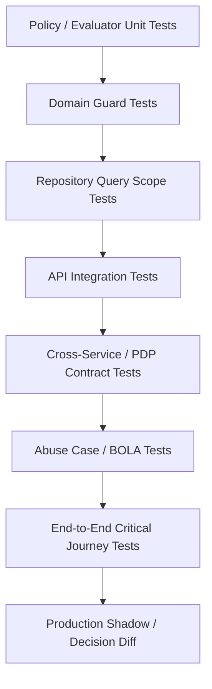
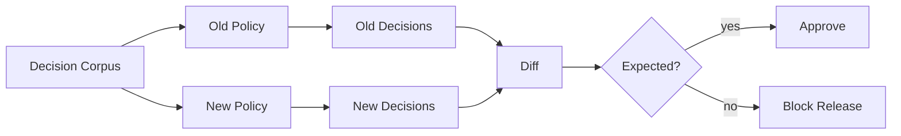

# Part 037 — Authorization Testing: Unit, Integration, Property-Based, and Abuse Cases

> Goal part ini: kamu bisa membuktikan authorization system benar, bukan sekadar merasa sudah aman karena ada `@PreAuthorize`, filter, atau policy file. Authorization testing adalah cara mengubah permission model menjadi executable security contract.

Authorization bug jarang terlihat seperti null pointer. Ia terlihat seperti ini:

```text
A user can read another tenant's case by changing caseId.
A manager can approve their own request through an alternate endpoint.
A bulk endpoint skips per-object checks.
A search endpoint leaks count, title, or classification before object-level filtering.
A worker executes an old command after the user's permission was revoked.
A policy rollout silently changes 2% of decisions.
```

Semua itu bisa lolos dari unit test biasa, karena unit test biasa sering hanya menguji happy path.

Authorization testing harus menjawab pertanyaan yang lebih keras:

```text
For every protected action, for every meaningful subject/resource/context combination,
do we allow exactly what should be allowed, deny everything else, and preserve the same invariant across API, service, repository, worker, export, and policy changes?
```

---

## 1. Authorization Testing Is Not Authentication Testing

Authentication testing bertanya:

```text
Can this caller prove identity?
Is the token/session valid?
Is the credential flow correct?
```

Authorization testing bertanya:

```text
Given a known identity, what can this caller do?
Against which object?
Under which context?
Through which endpoint or execution path?
With what decision reason and audit trace?
```

Jangan campur keduanya. Test authorization sebaiknya bisa membuat principal secara eksplisit tanpa mengulang login flow.

Contoh test setup yang baik:

```java
Subject alice = Subject.user("user-alice", "tenant-a")
    .withRole("CASE_INVESTIGATOR")
    .withClearance("CONFIDENTIAL");

ResourceRef case123 = ResourceRef.caseFile("tenant-a", "case-123")
    .withOwner("unit-financial-crime")
    .withClassification("CONFIDENTIAL")
    .withState("UNDER_INVESTIGATION");

AuthorizationDecision decision = authorizationService.check(
    AuthorizationRequest.of(alice, Action.CASE_READ, case123)
);

assertThat(decision.allowed()).isTrue();
```

Test di atas tidak peduli bagaimana Alice login. Ia peduli apakah Alice boleh membaca case tersebut.

---

## 2. Testing Model: From Policy Intent to Executable Evidence

Authorization test harus berangkat dari policy intent, bukan dari implementasi.

```text
Business rule:
"Investigator can view assigned cases in their tenant unless the case is sealed."

Executable authorization cases:
- assigned, same tenant, not sealed -> allow
- assigned, same tenant, sealed -> deny
- assigned, different tenant, not sealed -> deny
- not assigned, same tenant, not sealed -> deny
- assigned, same tenant, not sealed, insufficient clearance -> deny
```

Ini menghindari test yang hanya memverifikasi kode saat ini.

Bad test:

```java
assertThat(user.roles()).contains("CASE_INVESTIGATOR");
```

Good test:

```java
assertDenied(alice, CASE_READ, differentTenantCase, "TENANT_MISMATCH");
assertDenied(alice, CASE_READ, sealedCase, "CASE_SEALED");
assertAllowed(alice, CASE_READ, assignedOpenCase);
```

Authorization test yang bagus menguji **decision semantics**, bukan internal implementation detail.

---

## 3. Authorization Test Pyramid

Authorization butuh lebih dari satu level test.



| Layer | Purpose | Example |
|---|---|---|
| Policy unit test | Decision logic benar | `investigator can read assigned case` |
| Domain guard test | State transition aman | `maker cannot approve own request` |
| Repository test | Query scope tidak bocor | `findVisibleCases` never returns other tenant |
| API integration test | Endpoint enforce auth | `GET /cases/{id}` returns 403/404 |
| Field-level test | DTO tidak leak | `suspiciousActivityNotes` masked |
| Batch test | Per-object decision benar | bulk update denies mixed unauthorized item |
| PDP contract test | App-PDP schema kompatibel | request/decision JSON contract stable |
| Abuse test | attacker behavior covered | IDOR/BOLA, role downgrade, tenant breakout |
| Shadow diff | policy rollout safe | old vs new decisions compared |

Testing pyramid ini mencegah blind spot. Misalnya, API test bisa lolos, tetapi repository search tetap bocor. Atau policy unit test benar, tetapi worker async tidak pernah memanggil policy.

---

## 4. The Golden Permission Matrix

Untuk domain penting, buat permission matrix yang executable.

Contoh matrix regulatory case management:

| Subject | Resource state | Relationship | Action | Expected |
|---|---|---|---|---|
| Investigator | OPEN | assigned | `CASE_READ` | allow |
| Investigator | OPEN | not assigned | `CASE_READ` | deny |
| Investigator | SEALED | assigned | `CASE_READ` | deny |
| Supervisor | OPEN | same unit | `CASE_REASSIGN` | allow |
| Supervisor | OPEN | different jurisdiction | `CASE_REASSIGN` | deny |
| Maker | PENDING_APPROVAL | created_by_self | `CASE_APPROVE` | deny |
| Approver | PENDING_APPROVAL | not creator | `CASE_APPROVE` | allow |
| Auditor | CLOSED | audit mandate | `CASE_READ_AUDIT` | allow |
| Exporter | any | assigned | `CASE_EXPORT` | deny unless export entitlement |

Jangan simpan matrix hanya di Confluence. Simpan sebagai test fixture.

```yaml
- name: investigator_reads_assigned_open_case
  subject:
    id: user-alice
    tenant: tenant-a
    roles: [CASE_INVESTIGATOR]
  resource:
    type: case
    id: case-001
    tenant: tenant-a
    state: OPEN
    assignedUsers: [user-alice]
  action: CASE_READ
  expected: ALLOW

- name: investigator_cannot_read_unassigned_case
  subject:
    id: user-alice
    tenant: tenant-a
    roles: [CASE_INVESTIGATOR]
  resource:
    type: case
    id: case-002
    tenant: tenant-a
    state: OPEN
    assignedUsers: [user-bob]
  action: CASE_READ
  expected: DENY
  reason: NOT_ASSIGNED
```

Kemudian buat parameterized test:

```java
@ParameterizedTest(name = "{0}")
@MethodSource("permissionCases")
void authorization_matrix_is_enforced(PermissionCase tc) {
    AuthorizationDecision decision = authorizationService.check(tc.toRequest());

    assertThat(decision.allowed()).isEqualTo(tc.expected().isAllow());
    if (tc.expected().isDeny() && tc.reason() != null) {
        assertThat(decision.reasonCode()).isEqualTo(tc.reason());
    }
}
```

Golden matrix adalah safety net saat role berubah, policy pindah ke OPA/Cedar, atau object model berubah.

---

## 5. Test the Invariants, Not Just Examples

Example-based tests penting, tetapi authorization butuh invariant tests.

Contoh invariant:

```text
No non-system subject can access resource from another tenant.
No user can approve an action they initiated.
Search result count must be scoped to visible objects.
Batch operation cannot succeed silently for unauthorized items.
Field not readable by subject must not appear in response, export, cache, or audit detail.
Every deny decision must produce a safe reason code and audit event.
```

Invariant test lebih tahan terhadap perubahan implementasi.

```java
@Test
void cross_tenant_access_is_always_denied() {
    List<Action> actions = List.of(CASE_READ, CASE_UPDATE, CASE_ASSIGN, CASE_EXPORT);

    Subject subject = fixtures.user("tenant-a", "CASE_MANAGER");
    ResourceRef resource = fixtures.caseFile("tenant-b", "case-999");

    for (Action action : actions) {
        AuthorizationDecision decision = authorizationService.check(
            AuthorizationRequest.of(subject, action, resource)
        );

        assertThat(decision.allowed())
            .as("action %s must be denied cross-tenant", action)
            .isFalse();
        assertThat(decision.reasonCode()).isEqualTo("TENANT_MISMATCH");
    }
}
```

Invariant test harus ada untuk semua boundary besar: tenant, ownership, assignment, jurisdiction, classification, state transition, SoD, delegated access, break-glass, service account, async execution.

---

## 6. Unit Testing Local Authorization Evaluator

Local evaluator adalah fungsi murni idealnya:

```text
AuthorizationRequest -> AuthorizationDecision
```

Semakin murni evaluator, semakin mudah diuji.

```java
final class CaseAuthorizationPolicy {

    AuthorizationDecision evaluate(AuthorizationRequest request) {
        Subject subject = request.subject();
        CaseResource resource = request.resourceAs(CaseResource.class);
        Action action = request.action();

        if (!subject.tenantId().equals(resource.tenantId())) {
            return AuthorizationDecision.deny("TENANT_MISMATCH");
        }

        if (resource.sealed() && !subject.hasPermission("CASE_READ_SEALED")) {
            return AuthorizationDecision.deny("CASE_SEALED");
        }

        if (action.equals(Action.CASE_READ) && resource.assignedTo(subject.id())) {
            return AuthorizationDecision.allow("ASSIGNED_INVESTIGATOR");
        }

        return AuthorizationDecision.deny("NO_MATCHING_POLICY");
    }
}
```

Test-nya sederhana:

```java
@Test
void assigned_investigator_can_read_open_case() {
    Subject alice = subject("user-alice", "tenant-a", "CASE_INVESTIGATOR");
    CaseResource c = caseResource("case-1", "tenant-a")
        .assignedTo("user-alice")
        .state("OPEN");

    AuthorizationDecision decision = policy.evaluate(request(alice, CASE_READ, c));

    assertThat(decision.allowed()).isTrue();
    assertThat(decision.reasonCode()).isEqualTo("ASSIGNED_INVESTIGATOR");
}

@Test
void assigned_investigator_cannot_read_sealed_case_without_special_permission() {
    Subject alice = subject("user-alice", "tenant-a", "CASE_INVESTIGATOR");
    CaseResource c = caseResource("case-1", "tenant-a")
        .assignedTo("user-alice")
        .sealed(true);

    AuthorizationDecision decision = policy.evaluate(request(alice, CASE_READ, c));

    assertThat(decision.allowed()).isFalse();
    assertThat(decision.reasonCode()).isEqualTo("CASE_SEALED");
}
```

Evaluator unit test harus cepat. Jalankan di setiap commit.

---

## 7. Test Deny Paths More Than Allow Paths

Authorization punya asymmetry:

```text
One missed deny can be a breach.
One missed allow is usually a support ticket.
```

Karena itu, negative tests harus lebih banyak daripada positive tests.

Minimal deny cases untuk setiap action:

| Deny case | Why |
|---|---|
| unauthenticated | no subject |
| wrong role | no coarse capability |
| wrong tenant | tenant breakout |
| wrong owner | horizontal privilege escalation |
| wrong assignment | workflow leakage |
| wrong lifecycle state | invalid business transition |
| insufficient clearance | classification leakage |
| self-approval | SoD violation |
| stale/revoked access | claim/cache drift |
| missing resource | enumeration behavior |
| malformed resource ID | bypass through parser edge |
| batch mixed authorized/unauthorized | partial bypass |
| async execution after revocation | delayed execution risk |

A team yang hanya punya happy-path authorization tests belum punya security tests.

---

## 8. Spring Security Request Authorization Tests

Untuk Spring MVC/WebFlux style API, test endpoint harus memastikan filter chain benar-benar aktif.

Contoh MVC test:

```java
@WebMvcTest(CaseController.class)
@Import(SecurityConfig.class)
class CaseControllerAuthorizationTest {

    @Autowired MockMvc mvc;

    @MockBean CaseService caseService;

    @Test
    void unauthenticated_user_gets_401() throws Exception {
        mvc.perform(get("/cases/case-123"))
            .andExpect(status().isUnauthorized());
    }

    @Test
    @WithMockUser(username = "alice", authorities = "CASE_READ")
    void authenticated_user_goes_through_object_level_authorization() throws Exception {
        given(caseService.getCase("case-123"))
            .willThrow(new AccessDeniedException("CASE_NOT_VISIBLE"));

        mvc.perform(get("/cases/case-123"))
            .andExpect(status().isForbidden());
    }
}
```

Tetapi jangan berhenti di `@WithMockUser`. Test harus memastikan object-level guard dipanggil.

```java
@Test
@WithMockUser(username = "alice", authorities = "CASE_READ")
void controller_does_not_bypass_authorization_service() throws Exception {
    mvc.perform(get("/cases/case-123"))
        .andExpect(status().isOk());

    verify(authorizationService).check(argThat(req ->
        req.subject().id().equals("alice") &&
        req.action().equals(Action.CASE_READ) &&
        req.resource().id().equals("case-123")
    ));
}
```

Namun hati-hati: test yang hanya memverifikasi `authorizationService.check()` dipanggil bisa menghasilkan false confidence. Tetap butuh test hasil akhir: allowed/denied sesuai policy.

---

## 9. Spring Method Security Tests

Method security test harus memastikan proxy aktif. Kesalahan umum: memanggil method langsung pada object instance tanpa Spring proxy, sehingga annotation tidak berjalan.

Bad:

```java
CaseService service = new CaseService(...);
service.deleteCase("case-1"); // @PreAuthorize tidak aktif
```

Good:

```java
@SpringBootTest
class CaseServiceMethodSecurityTest {

    @Autowired CaseService caseService;

    @Test
    @WithMockUser(authorities = "CASE_READ")
    void user_without_delete_permission_cannot_delete_case() {
        assertThatThrownBy(() -> caseService.deleteCase("case-1"))
            .isInstanceOf(AccessDeniedException.class);
    }
}
```

Untuk custom principal, buat custom annotation test:

```java
@Retention(RetentionPolicy.RUNTIME)
@WithSecurityContext(factory = WithMockDomainUserFactory.class)
public @interface WithMockDomainUser {
    String id() default "user-alice";
    String tenant() default "tenant-a";
    String[] permissions() default {};
}
```

Lalu:

```java
@Test
@WithMockDomainUser(id = "user-alice", tenant = "tenant-a", permissions = "CASE_READ")
void method_security_uses_domain_principal() {
    CaseDto dto = caseService.getCase("case-visible-to-alice");
    assertThat(dto.id()).isEqualTo("case-visible-to-alice");
}
```

Method security tests harus menutup:

1. annotation aktif,
2. custom principal mapping benar,
3. bean guard dipanggil,
4. self-invocation tidak bypass,
5. denied path melempar exception yang benar,
6. transaction tidak commit kalau authorization gagal.

---

## 10. JAX-RS / Jersey Authorization Tests

Pada JAX-RS/Jersey, pastikan `ContainerRequestFilter`, `DynamicFeature`, dan exception mapper aktif di test runtime.

Contoh dengan JerseyTest-style structure:

```java
class CaseResourceAuthorizationTest extends JerseyTest {

    @Override
    protected Application configure() {
        return new ResourceConfig()
            .register(CaseResource.class)
            .register(SecurityContextFilter.class)
            .register(AuthorizationFilter.class)
            .register(AccessDeniedExceptionMapper.class)
            .property("jersey.config.server.provider.classnames", AuthorizationFilter.class.getName());
    }

    @Test
    void request_without_token_is_401() {
        Response response = target("/cases/case-123").request().get();
        assertThat(response.getStatus()).isEqualTo(401);
    }

    @Test
    void unauthorized_object_is_403() {
        Response response = target("/cases/case-foreign")
            .request()
            .header("Authorization", tokenFor("alice"))
            .get();

        assertThat(response.getStatus()).isEqualTo(403);
    }
}
```

Test yang penting untuk JAX-RS:

| Risk | Test |
|---|---|
| annotation tidak terbaca | resource method metadata test |
| filter tidak registered | unauthorized request test |
| dynamic feature tidak bind | endpoint-specific guard test |
| path param parsing bypass | malformed ID test |
| exception mapper bocor detail | safe error body test |
| sub-resource locator bypass | nested resource test |

---

## 11. Repository Query Scoping Tests

Query scoping harus diuji pada database nyata atau Testcontainers, bukan hanya mock repository.

Authorization bug sering muncul di SQL/JPA layer:

```text
WHERE tenant_id = ? missing
OR condition changes predicate meaning
pagination applied before authorization filter
count query not scoped
search index not scoped
```

Contoh repository test:

```java
@Test
void find_visible_cases_never_returns_other_tenant() {
    insertCase("case-a1", "tenant-a", assignedTo("alice"));
    insertCase("case-b1", "tenant-b", assignedTo("alice"));

    AccessScope scope = AccessScope.forSubject(subject("alice", "tenant-a"));

    List<CaseRow> rows = repository.findVisibleCases(scope, SearchQuery.empty(), PageRequest.of(0, 50));

    assertThat(rows)
        .extracting(CaseRow::tenantId)
        .containsOnly("tenant-a");
}
```

Count test:

```java
@Test
void count_uses_same_scope_as_list_query() {
    insertVisibleCaseFor("alice", "case-1");
    insertInvisibleCaseFor("alice", "case-2");

    AccessScope scope = AccessScope.forSubject(subject("alice", "tenant-a"));

    List<CaseRow> rows = repository.findVisibleCases(scope, SearchQuery.empty(), PageRequest.of(0, 20));
    long count = repository.countVisibleCases(scope, SearchQuery.empty());

    assertThat(count).isEqualTo(rows.size());
}
```

Sort/filter leakage test:

```java
@Test
void cannot_filter_by_field_user_cannot_read() {
    SearchQuery query = SearchQuery.builder()
        .filter("sealedReason", "FRAUD_RING")
        .build();

    assertThatThrownBy(() -> repository.findVisibleCases(scopeForRegularUser(), query, page()))
        .isInstanceOf(ForbiddenFilterException.class);
}
```

Repository scope tests adalah salah satu defense paling penting terhadap BOLA dan search leakage.

---

## 12. Object-Level Authorization Abuse Tests

BOLA/IDOR tests harus mensimulasikan attacker yang mengganti object ID.

```java
@Test
@WithMockDomainUser(id = "alice", tenant = "tenant-a", permissions = "CASE_READ")
void user_cannot_read_case_owned_by_bob_by_changing_path_id() throws Exception {
    String bobCaseId = fixtures.caseOwnedBy("bob", "tenant-a");

    mvc.perform(get("/cases/{id}", bobCaseId))
        .andExpect(status().isForbidden());
}
```

Jangan hanya test path endpoint. Object ID bisa muncul di banyak tempat.

| Location | Example |
|---|---|
| path | `/cases/{caseId}` |
| query | `/documents?caseId=...` |
| header | `X-Case-Id` |
| body | `{ "caseId": "..." }` |
| nested body | `{ "items": [{ "caseId": "..." }] }` |
| batch | `{ "caseIds": [...] }` |
| export request | `{ "filters": { "caseId": "..." } }` |
| async command | Kafka message with resource ID |
| redirect/download token | signed URL resource reference |

Buat test untuk semua entry point yang menerima resource ID.

---

## 13. Field-Level Authorization Tests

Field-level authorization harus diuji dengan response JSON, bukan hanya DTO object.

```java
@Test
@WithMockDomainUser(id = "alice", permissions = "CASE_READ")
void confidential_field_is_not_serialized_for_user_without_clearance() throws Exception {
    mvc.perform(get("/cases/case-123"))
        .andExpect(status().isOk())
        .andExpect(jsonPath("$.id").value("case-123"))
        .andExpect(jsonPath("$.publicSummary").exists())
        .andExpect(jsonPath("$.confidentialNotes").doesNotExist());
}
```

Untuk masking:

```java
@Test
void pii_is_masked_for_non_privileged_user() throws Exception {
    mvc.perform(get("/cases/case-123/subject"))
        .andExpect(status().isOk())
        .andExpect(jsonPath("$.nationalId").value("***-**-1234"));
}
```

Write-field test:

```java
@Test
@WithMockDomainUser(id = "alice", permissions = "CASE_UPDATE")
void user_cannot_mass_assign_server_controlled_fields() throws Exception {
    String body = """
        {
          "title": "Updated title",
          "tenantId": "tenant-b",
          "createdBy": "mallory",
          "state": "APPROVED"
        }
        """;

    mvc.perform(patch("/cases/case-123")
            .contentType(MediaType.APPLICATION_JSON)
            .content(body))
        .andExpect(status().isBadRequest());
}
```

Field tests harus mencakup:

1. read field,
2. write field,
3. patch field,
4. export field,
5. audit field,
6. cache field,
7. search/sort/filter field,
8. nested object field,
9. derived field.

---

## 14. Batch, Bulk, Export, and Report Tests

Batch authorization perlu test khusus karena semantics-nya lebih kompleks.

Ada tiga model hasil:

| Model | Meaning |
|---|---|
| all-or-nothing | jika ada satu unauthorized, seluruh request gagal |
| per-item result | authorized item sukses, unauthorized item gagal |
| async accepted | request diterima, result diproses kemudian |

Test harus mencerminkan model yang dipilih.

All-or-nothing:

```java
@Test
void bulk_close_fails_if_any_case_is_not_authorized() throws Exception {
    BulkCloseRequest request = new BulkCloseRequest(List.of("case-visible", "case-hidden"));

    mvc.perform(post("/cases/bulk-close")
            .contentType(MediaType.APPLICATION_JSON)
            .content(json(request)))
        .andExpect(status().isForbidden())
        .andExpect(jsonPath("$.code").value("BULK_AUTHORIZATION_FAILED"));

    assertThat(caseRepository.findById("case-visible").state()).isEqualTo("OPEN");
}
```

Per-item result:

```java
@Test
void bulk_update_returns_per_item_authorization_result() throws Exception {
    mvc.perform(post("/cases/bulk-tag")
            .contentType(MediaType.APPLICATION_JSON)
            .content("""
                { "caseIds": ["case-visible", "case-hidden"], "tag": "urgent" }
                """))
        .andExpect(status().isMultiStatus())
        .andExpect(jsonPath("$.items[0].caseId").value("case-visible"))
        .andExpect(jsonPath("$.items[0].status").value("UPDATED"))
        .andExpect(jsonPath("$.items[1].caseId").value("case-hidden"))
        .andExpect(jsonPath("$.items[1].status").value("DENIED"));
}
```

Export tests:

```java
@Test
void export_uses_same_scope_and_field_policy_as_list_api() {
    ExportResult export = exportService.exportCases(subject("alice"), SearchQuery.empty());

    assertThat(export.rows()).allSatisfy(row -> {
        assertThat(row.tenantId()).isEqualTo("tenant-a");
        assertThat(row.columns()).doesNotContainKey("sealedReason");
    });
}
```

Report count leakage test:

```java
@Test
void report_aggregate_does_not_count_invisible_cases() {
    Report report = reportService.caseStatusReport(scopeFor("alice"));

    assertThat(report.totalCases()).isEqualTo(numberOfCasesVisibleToAlice());
}
```

---

## 15. Async Authorization Tests

Async authorization harus menjawab dua pertanyaan:

```text
Who authorized this command?
Was authorization checked at execution time, at submission time, or both?
```

Submission-time test:

```java
@Test
void user_cannot_enqueue_job_for_resource_they_cannot_access() {
    Subject alice = subject("alice", "tenant-a");

    assertThatThrownBy(() -> jobService.enqueueExport(alice, ExportRequest.forCase("tenant-b-case")))
        .isInstanceOf(AccessDeniedException.class);

    assertThat(outbox.findAll()).isEmpty();
}
```

Execution-time recheck test:

```java
@Test
void worker_rechecks_authorization_before_executing_sensitive_job() {
    Job job = fixtures.exportJobAuthorizedAtSubmission("alice", "case-123");
    revokeCaseAccess("alice", "case-123");

    worker.execute(job.id());

    assertThat(jobRepository.find(job.id()).status()).isEqualTo("DENIED_AT_EXECUTION");
    assertThat(exportStorage.existsFor(job.id())).isFalse();
}
```

Snapshot test:

```java
@Test
void worker_uses_authorization_snapshot_when_policy_requires_submission_time_authority() {
    Job job = fixtures.generateLegallyAuthorizedSnapshotJob();
    revokeUserRole(job.requestedBy(), "CASE_EXPORT");

    worker.execute(job.id());

    assertThat(jobRepository.find(job.id()).status()).isEqualTo("COMPLETED_WITH_AUTHORIZATION_SNAPSHOT");
}
```

Tidak ada satu jawaban universal. Yang penting adalah semantics-nya eksplisit dan tested.

---

## 16. Property-Based Authorization Testing

Example tests bagus untuk known cases. Property-based testing bagus untuk menemukan kombinasi yang tidak terpikir.

Authorization cocok untuk property testing karena banyak invariant berbentuk universal:

```text
For all users and resources, if tenant differs, decision must be deny.
For all users, user cannot approve own submitted request.
For all search pages, returned rows must be visible to subject.
For all patches, server-controlled fields must not be accepted.
```

Contoh pseudo-code dengan jqwik-style API:

```java
@Property
void cross_tenant_access_is_never_allowed(
    @ForAll("subjects") Subject subject,
    @ForAll("resources") CaseResource resource,
    @ForAll("actions") Action action
) {
    assumeThat(subject.tenantId()).isNotEqualTo(resource.tenantId());

    AuthorizationDecision decision = authorizationService.check(
        AuthorizationRequest.of(subject, action, resource)
    );

    assertThat(decision.allowed()).isFalse();
}
```

State transition property:

```java
@Property
void submitter_cannot_approve_own_request(@ForAll("approvalRequests") ApprovalRequest request) {
    Subject submitter = subject(request.createdBy(), request.tenantId(), "APPROVER");

    AuthorizationDecision decision = authorizationService.check(
        AuthorizationRequest.of(submitter, CASE_APPROVE, request.asResource())
    );

    assertThat(decision.allowed()).isFalse();
}
```

Property-based tests harus dibatasi dengan generator yang domain-valid. Random object tanpa domain rules akan menghasilkan noise.

---

## 17. Metamorphic Authorization Tests

Metamorphic test menguji relasi antar input-output, bukan expected result tunggal.

Contoh metamorphic relation:

```text
If a user cannot read a case, adding an unrelated role must not make them able to read it.
If tenant is changed from same tenant to different tenant, allow must become deny.
If resource classification increases, allowed set must not increase.
If assignment is removed, permission dependent on assignment must disappear.
If policy version changes with no semantic diff, decisions must remain identical.
```

Contoh test:

```java
@Test
void increasing_classification_never_increases_access() {
    Subject alice = subject("alice", "tenant-a", "CASE_READ");

    CaseResource publicCase = caseResource("case-1", "tenant-a")
        .classification("PUBLIC");

    CaseResource restrictedCase = publicCase.withClassification("RESTRICTED");

    AuthorizationDecision before = authorizationService.check(request(alice, CASE_READ, publicCase));
    AuthorizationDecision after = authorizationService.check(request(alice, CASE_READ, restrictedCase));

    assertThat(before.allowed()).isTrue();
    assertThat(after.allowed()).isFalse();
}
```

Metamorphic tests efektif untuk mendeteksi privilege escalation karena perubahan kecil pada atribut.

---

## 18. Mutation Testing for Authorization

Mutation testing sengaja merusak kode untuk melihat apakah tests menangkapnya.

Contoh mutation berbahaya:

```java
// original
if (!subject.tenantId().equals(resource.tenantId())) deny();

// mutant
if (subject.tenantId().equals(resource.tenantId())) deny();
```

Atau:

```java
// original
if (resource.assignedTo(subject.id())) allow();

// mutant
allow();
```

Jika test suite tetap hijau, authorization tests lemah.

Mutation cases authorization:

| Mutant | Expected test failure |
|---|---|
| remove tenant check | cross-tenant invariant fails |
| invert role check | role matrix fails |
| remove assignment check | BOLA test fails |
| remove SoD check | self-approval test fails |
| remove field redaction | JSON field test fails |
| skip batch per-item check | bulk unauthorized test fails |
| ignore PDP timeout | fail-closed test fails |
| cache key ignores resource ID | cache isolation test fails |

Mutation testing memberi sinyal apakah test benar-benar membunuh bug authorization.

---

## 19. Contract Testing External PDP

Jika authorization memakai OPA, Cedar/AVP, OpenFGA, atau PDP internal, contract test wajib.

Contract minimal:

```json
{
  "subject": {
    "type": "user",
    "id": "user-alice",
    "tenantId": "tenant-a",
    "roles": ["CASE_INVESTIGATOR"]
  },
  "action": "case.read",
  "resource": {
    "type": "case",
    "id": "case-123",
    "tenantId": "tenant-a"
  },
  "context": {
    "requestTime": "2026-07-03T10:15:30Z"
  }
}
```

Decision contract:

```json
{
  "allowed": false,
  "reasonCode": "NOT_ASSIGNED",
  "policyVersion": "case-authz-v17",
  "obligations": [],
  "cache": {
    "cacheable": true,
    "ttlSeconds": 30
  }
}
```

Java contract test:

```java
@Test
void pdp_contract_serializes_expected_request_shape() throws Exception {
    AuthorizationRequest request = fixtures.assignedCaseReadRequest();

    String json = objectMapper.writeValueAsString(request);

    assertThatJson(json).isEqualTo(resource("contracts/case-read-request.json"));
}

@Test
void pdp_client_handles_deny_response() throws Exception {
    server.stubFor(post("/v1/authorize")
        .willReturn(okJson(resource("contracts/deny-not-assigned.json"))));

    AuthorizationDecision decision = pdpClient.check(fixtures.unassignedCaseReadRequest());

    assertThat(decision.allowed()).isFalse();
    assertThat(decision.reasonCode()).isEqualTo("NOT_ASSIGNED");
}
```

Contract test harus mencakup:

1. request schema,
2. decision schema,
3. deny response,
4. indeterminate response,
5. obligations,
6. cache directive,
7. policy version,
8. timeout,
9. malformed response,
10. backward compatibility.

---

## 20. OPA Policy Tests

OPA/Rego policy harus punya tests di repo policy.

Contoh Rego simplified:

```rego
package authz.case

default allow := false

allow if {
  input.action == "case.read"
  input.subject.tenant_id == input.resource.tenant_id
  input.subject.id in input.resource.assigned_user_ids
  input.resource.state != "SEALED"
}
```

Test:

```rego
package authz.case

test_assigned_investigator_can_read if {
  allow with input as {
    "action": "case.read",
    "subject": {"id": "alice", "tenant_id": "tenant-a"},
    "resource": {
      "id": "case-1",
      "tenant_id": "tenant-a",
      "assigned_user_ids": ["alice"],
      "state": "OPEN"
    }
  }
}

test_cross_tenant_denied if {
  not allow with input as {
    "action": "case.read",
    "subject": {"id": "alice", "tenant_id": "tenant-a"},
    "resource": {
      "id": "case-1",
      "tenant_id": "tenant-b",
      "assigned_user_ids": ["alice"],
      "state": "OPEN"
    }
  }
}
```

Pipeline:

```bash
opa fmt --fail ./policy
opa check ./policy
opa test ./policy -v
```

OPA tests harus sinkron dengan Java contract tests. Kalau Java mengirim `tenantId` tetapi policy membaca `tenant_id`, test harus gagal sebelum production.

---

## 21. Cedar / Amazon Verified Permissions Policy Tests

Cedar policy punya model principal-action-resource-context. Test harus memastikan policy dan schema tidak drift dari domain Java.

Contoh conceptual policy:

```cedar
permit(
  principal in Role::"CaseInvestigator",
  action == Action::"CaseRead",
  resource is Case
)
when {
  principal.tenant == resource.tenant &&
  principal.id in resource.assignedUserIds &&
  resource.state != "SEALED"
};
```

Test cases harus mencakup:

| Case | Expected |
|---|---|
| assigned same tenant open | allow |
| assigned different tenant | deny |
| unassigned same tenant | deny |
| assigned sealed | deny |
| malformed entity type | validation failure |
| unknown action | deny/validation failure |

Jika memakai Amazon Verified Permissions, jangan hanya test Java SDK call sukses. Test bahwa:

1. entity shape sesuai schema,
2. action mapping stabil,
3. tenant policy store tidak tertukar,
4. forbid policy override bekerja,
5. no matching permit berarti deny,
6. policy template instantiation tidak salah principal/resource.

---

## 22. OpenFGA / ReBAC Model Tests

OpenFGA-style test harus menguji relationship graph.

Model-level cases:

```text
user:alice viewer case:case-1 -> can_read true
user:bob no relation case:case-1 -> can_read false
user:carol member unit:fraud, unit:fraud owner case:case-1 -> can_read true
case:case-1 parent org:tenant-a, alice member org:tenant-b -> false
```

Java integration test:

```java
@Test
void openfga_check_denies_user_without_relationship() {
    writeTuple("case:case-1", "viewer", "user:alice");

    boolean bobCanRead = openFgaAuthorization.can(
        "user:bob",
        "can_read",
        "case:case-1"
    );

    assertThat(bobCanRead).isFalse();
}
```

Tuple lifecycle test:

```java
@Test
void revoking_assignment_removes_case_read_access() {
    writeTuple("case:case-1", "assignee", "user:alice");
    assertCan("user:alice", "can_read", "case:case-1");

    deleteTuple("case:case-1", "assignee", "user:alice");
    assertCannot("user:alice", "can_read", "case:case-1");
}
```

Graph tests harus menutup:

1. direct relationship,
2. inherited relationship,
3. group membership,
4. parent-child propagation,
5. deletion/revocation,
6. contextual tuple,
7. model version migration,
8. list objects correctness,
9. graph depth/cycle handling,
10. stale tuple failure.

---

## 23. Testing Cache Correctness

Authorization cache tests harus membuktikan cache key dan invalidation benar.

Cache key bug klasik:

```text
key = subjectId + action
```

Ini salah karena resource/context/policy version hilang.

Test:

```java
@Test
void decision_cache_must_include_resource_id() {
    Subject alice = subject("alice", "tenant-a");
    CaseResource visible = caseResource("case-visible", "tenant-a").assignedTo("alice");
    CaseResource hidden = caseResource("case-hidden", "tenant-a").assignedTo("bob");

    assertAllowed(alice, CASE_READ, visible);
    assertDenied(alice, CASE_READ, hidden);
}
```

Kalau cache key hanya `alice:CASE_READ`, test kedua akan salah allow.

Invalidation test:

```java
@Test
void role_revocation_invalidates_decision_cache() {
    Subject alice = subject("alice", "tenant-a", "CASE_EXPORT");
    CaseResource c = visibleCaseFor("alice");

    assertAllowed(alice, CASE_EXPORT, c);

    revokePermission("alice", "CASE_EXPORT");
    publishRoleChangedEvent("alice");

    assertDenied(alice.refresh(), CASE_EXPORT, c);
}
```

Timeout/fail-closed test:

```java
@Test
void pdp_timeout_fails_closed_for_write_action() {
    pdp.stubTimeout();

    AuthorizationDecision decision = authorizationService.check(
        request(subject("alice"), CASE_DELETE, caseResource("case-1"))
    );

    assertThat(decision.allowed()).isFalse();
    assertThat(decision.reasonCode()).isEqualTo("PDP_UNAVAILABLE");
}
```

Cache correctness tests harus masuk regression suite karena bug-nya sering tidak terlihat di functional tests.

---

## 24. Testing 403 vs 404 Semantics

Untuk object-level authorization, kadang unauthorized object harus return 404 agar tidak memberi sinyal object exists. Tapi internal audit tetap harus mencatat deny.

Test semantics:

```java
@Test
void hidden_case_returns_404_to_prevent_enumeration_but_records_deny_audit() throws Exception {
    mvc.perform(get("/cases/case-owned-by-bob")
            .with(user("alice")))
        .andExpect(status().isNotFound())
        .andExpect(jsonPath("$.code").value("NOT_FOUND"));

    assertThat(auditSink.events())
        .anySatisfy(event -> {
            assertThat(event.action()).isEqualTo("case.read");
            assertThat(event.decision()).isEqualTo("DENY");
            assertThat(event.externalStatus()).isEqualTo(404);
        });
}
```

Jangan biarkan 404 menjadi alasan untuk tidak mengaudit deny.

---

## 25. Testing Audit and Explainability

Authorization test tidak selesai pada status code.

Untuk setiap sensitive deny/allow, test audit event:

```java
@Test
void case_approval_emits_authorization_decision_audit() {
    Subject approver = subject("approver-1", "tenant-a", "CASE_APPROVE");

    approvalService.approve(approver, "case-123");

    assertThat(auditSink.events()).anySatisfy(event -> {
        assertThat(event.subjectId()).isEqualTo("approver-1");
        assertThat(event.action()).isEqualTo("case.approve");
        assertThat(event.resourceId()).isEqualTo("case-123");
        assertThat(event.decision()).isEqualTo("ALLOW");
        assertThat(event.policyVersion()).isNotBlank();
        assertThat(event.correlationId()).isNotBlank();
    });
}
```

Safe reason test:

```java
@Test
void external_error_body_does_not_expose_sensitive_policy_reason() throws Exception {
    mvc.perform(get("/cases/secret-case").with(user("alice")))
        .andExpect(status().isForbidden())
        .andExpect(jsonPath("$.message").value("Access denied"))
        .andExpect(jsonPath("$.debugPolicyTrace").doesNotExist());
}
```

Internal audit boleh lebih kaya. External error harus aman.

---

## 26. Static Tests and Architecture Fitness Functions

Beberapa authorization rules bisa diuji dengan static architecture tests.

Contoh invariant architecture:

```text
Controllers must not call repositories directly.
Application services handling protected commands must depend on AuthorizationService.
Repository methods returning protected resources must accept AccessScope.
No production code may check raw role string except in role mapper.
No endpoint may be public unless annotated @PublicEndpoint.
```

ArchUnit-style test:

```java
@Test
void controllers_must_not_access_repositories_directly() {
    noClasses()
        .that().resideInAPackage("..api..")
        .should().accessClassesThat().resideInAPackage("..repository..")
        .check(importedClasses);
}

@Test
void protected_repositories_require_access_scope() {
    methods()
        .that().areDeclaredInClassesThat().resideInAPackage("..repository..")
        .and().haveRawReturnType(List.class)
        .should().haveRawParameterTypes(AccessScope.class)
        .check(importedClasses);
}
```

Static tests tidak menggantikan runtime tests, tetapi bagus untuk mencegah bypass architecture.

---

## 27. Test Data Strategy

Authorization testing butuh data yang sengaja membedakan:

1. same tenant vs different tenant,
2. owner vs non-owner,
3. assigned vs unassigned,
4. same unit vs different unit,
5. same jurisdiction vs outside jurisdiction,
6. low classification vs high classification,
7. open vs sealed vs closed,
8. maker vs checker,
9. permanent vs temporary delegation,
10. active vs revoked permission.

Gunakan nama eksplisit.

Bad:

```text
user1, user2, case1, case2
```

Good:

```text
alice_assigned_investigator_tenant_a
bob_unassigned_investigator_tenant_a
mallory_attacker_tenant_b
case_a_open_assigned_to_alice
case_a_sealed_assigned_to_alice
case_b_foreign_tenant
```

Test data harus membuat intent terbaca tanpa membaca fixture builder 500 baris.

---

## 28. CI/CD Authorization Gates

Authorization test suite sebaiknya dibagi menjadi gates.

| Gate | Runs when | Contains |
|---|---|---|
| fast unit | every commit | local evaluator, matrix, invariants |
| framework integration | pull request | Spring/JAX-RS endpoint, method security |
| repository scope | pull request | database query scoping |
| policy CI | policy repo PR | OPA/Cedar/OpenFGA tests |
| contract | app and policy PR | PDP request/decision compatibility |
| abuse suite | nightly / security PR | BOLA, bulk, fuzz, property tests |
| shadow diff | rollout | old-vs-new decision comparison |

Rule praktis:

```text
No authorization policy change may be merged unless it changes an executable matrix or proves no semantic diff.
```

Policy change tanpa test change harus dicurigai.

---

## 29. Decision Diff Testing

Saat policy berubah, jangan hanya run tests. Bandingkan decision lama vs baru untuk corpus realistis.



Corpus bisa berasal dari:

1. golden matrix,
2. anonymized production decision logs,
3. synthetic high-risk cases,
4. known incident cases,
5. tenant boundary cases,
6. SoD cases,
7. break-glass cases.

Diff output:

```text
case.read: 12 decisions changed
- 10 expected due to new sealed-case rule
- 2 unexpected: supervisor cross-jurisdiction now allowed
```

Decision diff adalah teknik penting untuk policy-as-code release management.

---

## 30. Abuse Case Catalog

Authorization abuse cases harus disimpan sebagai reusable catalog.

| Abuse case | Test idea |
|---|---|
| IDOR path swap | replace `{id}` with another user's object |
| IDOR query swap | use `?caseId=` for foreign object |
| nested resource mismatch | `/cases/a/documents/doc-from-b` |
| tenant header spoof | change `X-Tenant-Id` |
| body tenant spoof | PATCH `{tenantId: other}` |
| role downgrade bypass | token without authority still accepted |
| JWT stale claim | revoked user token still allowed |
| batch smuggling | mixed authorized and unauthorized IDs |
| export bypass | export endpoint leaks invisible rows |
| search count leak | total count includes invisible objects |
| sort/filter leak | filter by hidden field reveals existence |
| self-approval | maker approves own request |
| alternate endpoint | admin route checks but import route does not |
| async replay | old command executes after access revoked |
| service confused deputy | service uses own broad permission for user request |
| cache poisoning | cache key ignores tenant/resource/context |
| policy timeout | PDP outage fails open |
| debug endpoint | internal endpoint exposes decision trace |

Every serious domain should have a local abuse catalog.

---

## 31. Common Anti-Patterns

### Anti-pattern 1: Test Only Role, Not Object

```java
@WithMockUser(roles = "ADMIN")
@Test
void can_read_case() { ... }
```

This proves nothing about tenant, assignment, ownership, or classification.

### Anti-pattern 2: Mock AuthorizationService Everywhere

If every service test mocks `authorizationService.check()` to return allow, you are not testing authorization. You are testing behavior after authorization.

Use real policy evaluator for authorization-specific tests.

### Anti-pattern 3: No Negative Tests

A suite with 90% allow tests is weak. Authorization testing should be denial-heavy.

### Anti-pattern 4: No Repository Scope Test

If list/search/export is not tested at SQL/query level, you can leak data even when object endpoint is protected.

### Anti-pattern 5: UI Authorization Tests Only

Hiding a button is not authorization. API and service tests must enforce the same decision.

### Anti-pattern 6: Golden Matrix Not Executable

A spreadsheet that is not executable drifts. Convert it into fixtures/tests.

### Anti-pattern 7: No Policy Diff

Policy-as-code without decision diff is dangerous. A syntactically valid policy can still be semantically wrong.

---

## 32. Production-Grade Authorization Test Checklist

Use this checklist before saying “authorization is tested”.

### Policy/Evaluator

- [ ] every protected action has allow and deny tests
- [ ] tenant mismatch always denied
- [ ] ownership/assignment/jurisdiction rules tested
- [ ] state transition rules tested
- [ ] SoD/maker-checker tested
- [ ] reason codes tested
- [ ] deny-by-default tested

### API/Framework

- [ ] unauthenticated returns 401
- [ ] authenticated but unauthorized returns 403/404 as designed
- [ ] object ID path/query/body/header tested
- [ ] method security proxy active
- [ ] filters/interceptors registered
- [ ] exception mapping safe

### Data Access

- [ ] repository scope tests use real DB
- [ ] list and count use same scope
- [ ] pagination after scoping
- [ ] search/filter/sort fields authorized
- [ ] export/report use same scope

### Field-Level

- [ ] unreadable fields omitted/masked
- [ ] unwritable fields rejected
- [ ] mass assignment blocked
- [ ] derived field leakage tested
- [ ] export field policy tested

### Batch/Async

- [ ] bulk mixed authorized/unauthorized tested
- [ ] partial success semantics tested
- [ ] async submission authorized
- [ ] async execution recheck/snapshot tested
- [ ] replay behavior tested

### Distributed/PDP

- [ ] PDP contract tested
- [ ] timeout fails closed for sensitive actions
- [ ] cache key correctness tested
- [ ] invalidation tested
- [ ] policy version/diff tested

### Audit

- [ ] allow/deny audit event tested for sensitive actions
- [ ] correlation ID present
- [ ] policy version present
- [ ] external error does not expose sensitive trace

---

## 33. Final Mental Model

Authorization testing is not a checkbox. It is an executable model of who may do what, to which object, under which condition.

The strongest teams do not rely on “we reviewed the policy”. They maintain:

```text
Golden matrix
+ invariants
+ negative tests
+ query scope tests
+ field tests
+ batch/async abuse tests
+ PDP contract tests
+ policy tests
+ decision diff
+ audit assertions
```

Authorization is secure only when the denial paths are as engineered as the allow paths.

---

## References

- OWASP Authorization Cheat Sheet — server-side authorization, validation on every request, centralized enforcement, deny-by-default.
- OWASP Web Security Testing Guide — Authorization Testing.
- OWASP API Security Top 10 2023 — Broken Object Level Authorization and Broken Object Property Level Authorization.
- Spring Security Reference — Testing Method Security and authorization architecture.
- Open Policy Agent Documentation — Policy Testing.
- Cedar Policy Language Documentation — policy structure, permit/forbid, schema validation.
- OpenFGA Documentation — modeling, checks, tuple lifecycle, list objects/users.
- NIST SP 800-162 — Attribute-Based Access Control.
