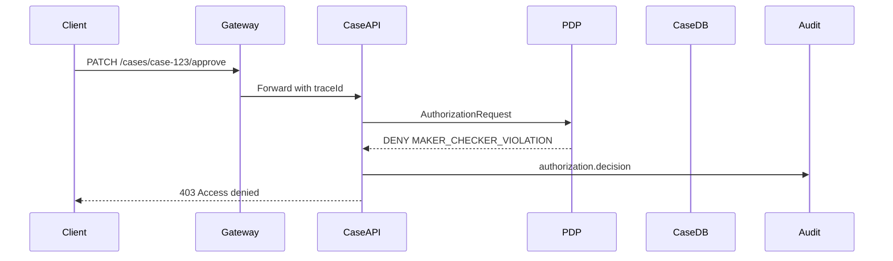
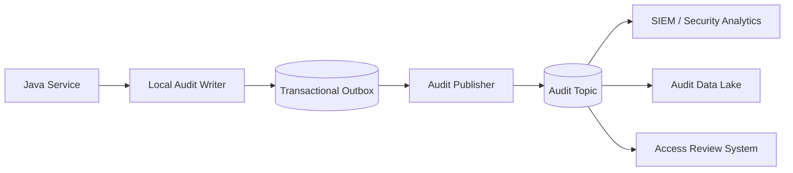

# Part 038 — Observability, Auditability, and Decision Explainability

> Goal part ini: kamu bisa membuat authorization system yang bukan hanya “mengizinkan atau menolak”, tetapi bisa menjelaskan, membuktikan, diamati, diinvestigasi, dan dipertanggungjawabkan tanpa membocorkan data sensitif.

Authorization decision adalah salah satu keputusan paling penting dalam sistem enterprise.

Ia menentukan:

```text
Can this person see this evidence?
Can this officer approve this enforcement action?
Can this service export this customer dataset?
Can this admin grant themselves access?
Can this worker execute a command that was authorized yesterday?
```

Jika jawaban authorization salah, konsekuensinya bisa berupa data breach, regulatory finding, fraud, privilege escalation, operational outage, atau loss of trust.

Karena itu, production-grade authorization membutuhkan tiga capability:

| Capability | Question |
|---|---|
| Observability | What is happening now? |
| Auditability | What happened, who did it, and why was it allowed/denied? |
| Explainability | Why did this decision happen, safely and usefully? |

Tanpa tiga hal ini, authorization system menjadi black box. Black box authorization sulit dioperasikan, sulit di-debug, dan lemah secara regulatory defensibility.

---

## 1. Logging vs Audit vs Decision Trace

Jangan campur semua event menjadi “log”. Ada perbedaan penting.

| Type | Audience | Purpose | Durability | Sensitivity |
|---|---|---|---|---|
| Application log | engineers/SRE | debugging runtime behavior | medium | medium-high |
| Security log | security/SOC | detect suspicious behavior | high | high |
| Audit log | auditors/compliance/domain ops | evidence of business/security action | very high | high |
| Authorization decision log | authz/platform/security | prove and debug decisions | high | high |
| Policy trace | policy engineers | explain rule evaluation | low-medium | very high |

Aplikasi Java sering melakukan ini:

```java
log.info("Access denied for user {}", userId);
```

Itu tidak cukup.

Production-grade authorization membutuhkan event terstruktur:

```json
{
  "eventType": "authorization.decision",
  "decisionId": "dec_01J...",
  "timestamp": "2026-07-03T10:15:30.145Z",
  "correlationId": "req_abc123",
  "subject": {
    "type": "user",
    "id": "user-alice",
    "tenantId": "tenant-a"
  },
  "actor": {
    "type": "user",
    "id": "user-alice"
  },
  "action": "case.approve",
  "resource": {
    "type": "case",
    "id": "case-123",
    "tenantId": "tenant-a"
  },
  "decision": "DENY",
  "reasonCode": "MAKER_CHECKER_VIOLATION",
  "policyVersion": "case-policy-v42",
  "pep": "case-service:CaseApprovalService.approve",
  "pdp": "opa-sidecar:bundle-2026-07-03.3",
  "latencyMs": 7,
  "externalStatus": 403
}
```

This is evidence. Not noise.

---

## 2. What an Authorization Decision Event Must Contain

Authorization decision event minimal:

| Field | Why it matters |
|---|---|
| `decisionId` | unique evidence reference |
| `timestamp` | sequence and forensic reconstruction |
| `correlationId` / `traceId` | link to request, service call, async job |
| `subject` | who/what is being authorized |
| `actor` | who initiated action, especially delegated/service flows |
| `action` | protected operation |
| `resource` | protected object reference |
| `context` summary | relevant conditions: channel, time, tenant, risk, workflow state |
| `decision` | allow/deny/indeterminate |
| `reasonCode` | stable explanation category |
| `policyVersion` | reproducibility |
| `modelVersion` | ReBAC/schema version if applicable |
| `obligations` | required follow-up behavior |
| `pep` | where enforcement happened |
| `pdp` | where decision was made |
| `latencyMs` | performance and degradation analysis |
| `cacheStatus` | hit/miss/stale/forced-refresh |
| `externalStatus` | API response semantics |

A strong event distinguishes `subject` and `actor`.

Example:

```text
Subject: service:report-worker
Actor: user:alice
Action: case.export
Resource: case-query:monthly-high-risk-report
```

This matters in delegated and async flows. The worker executed the action, but Alice caused it.

---

## 3. Decision, Reason, Obligation, Advice

Do not reduce authorization result to boolean.

```java
public enum DecisionEffect {
    ALLOW,
    DENY,
    INDETERMINATE
}

public record AuthorizationDecision(
    DecisionEffect effect,
    String reasonCode,
    String policyVersion,
    List<Obligation> obligations,
    List<Advice> advice,
    CacheDirective cache,
    AuditDirective audit,
    DecisionDiagnostics diagnostics
) {
    public boolean allowed() {
        return effect == DecisionEffect.ALLOW;
    }
}
```

Reason code answers:

```text
Which stable category explains this decision?
```

Obligation answers:

```text
What must the PEP do if it proceeds?
```

Advice answers:

```text
What helpful non-mandatory information can be returned internally?
```

Examples:

| Decision | Reason | Obligation |
|---|---|---|
| ALLOW | `ASSIGNED_INVESTIGATOR` | `REDACT_PII` |
| ALLOW | `BREAK_GLASS_APPROVED` | `ESCALATE_AUDIT` |
| DENY | `TENANT_MISMATCH` | none |
| DENY | `MAKER_CHECKER_VIOLATION` | none |
| DENY | `INSUFFICIENT_CLEARANCE` | none |
| INDETERMINATE | `PDP_TIMEOUT` | none; fail closed |

Do not expose all reason details to end users. Internal reason and external reason are different.

---

## 4. Safe External Error vs Internal Explanation

External response should be safe:

```json
{
  "code": "ACCESS_DENIED",
  "message": "Access denied",
  "correlationId": "req_abc123"
}
```

Internal audit can be precise:

```json
{
  "decision": "DENY",
  "reasonCode": "MAKER_CHECKER_VIOLATION",
  "reasonDetails": {
    "requestCreatedBy": "user-alice",
    "approver": "user-alice",
    "policyRule": "case.approve.requiresDifferentApprover"
  }
}
```

Never leak sensitive details externally:

```text
Denied because this case is SEALED due to witness-protection matter.
Denied because user lacks clearance for terrorism-financing category.
Denied because case exists in tenant-bank-secret.
Denied because policy rule high_value_customer_investigation matched.
```

External errors should avoid object enumeration and sensitive classification leakage. Internal audit must retain enough evidence for investigation.

---

## 5. Observability Model

Authorization observability answers operational questions:

```text
Are decisions fast?
Are denies increasing?
Which policy version changed deny rate?
Are PDP calls timing out?
Is cache hit ratio healthy?
Are any endpoints missing authorization decision events?
Are any users repeatedly probing object IDs?
```

Core metrics:

| Metric | Dimension |
|---|---|
| `authz_decision_total` | action, resource_type, decision, reason_code, service, policy_version |
| `authz_decision_latency_ms` | action, PDP, cache_status |
| `authz_pdp_error_total` | error_type, service, policy_version |
| `authz_cache_hit_ratio` | cache_name, action, resource_type |
| `authz_deny_rate` | tenant, action, endpoint, reason_code |
| `authz_indeterminate_total` | reason_code, PDP, service |
| `authz_obligation_failure_total` | obligation_type, service |
| `authz_break_glass_total` | tenant, actor_type, action |
| `authz_policy_diff_total` | old_version, new_version, changed_effect |

High-cardinality warning:

```text
Do not use raw user ID or resource ID as Prometheus label.
```

Use logs/traces for exact IDs. Use metrics labels for bounded dimensions.

---

## 6. Trace Authorization in Distributed Systems

Authorization decision should appear in distributed trace, but carefully.



Trace span attributes should include safe bounded values:

```text
authz.decision = DENY
authz.reason_code = MAKER_CHECKER_VIOLATION
authz.action = case.approve
authz.resource_type = case
authz.policy_version = case-policy-v42
authz.cache_status = MISS
```

Avoid:

```text
authz.resource_title = "Witness retaliation case"
authz.policy_trace = full Rego/Cedar evaluation details
authz.subject_email = alice@example.com
```

Traces are often widely accessible internally. Treat trace attributes as semi-sensitive.

---

## 7. Java Implementation: Decision Event Model

A practical Java model:

```java
public record AuthorizationDecisionEvent(
    String eventType,
    String decisionId,
    Instant timestamp,
    String correlationId,
    String traceId,
    SubjectRef subject,
    ActorRef actor,
    String action,
    ResourceRef resource,
    DecisionEffect decision,
    String reasonCode,
    String externalReasonCode,
    String policyVersion,
    String modelVersion,
    String pep,
    String pdp,
    List<String> obligations,
    String cacheStatus,
    long latencyMs,
    Integer externalStatus,
    Map<String, Object> safeContext
) {}
```

Builder example:

```java
public final class AuthorizationAuditEmitter {
    private final AuditSink auditSink;
    private final Clock clock;

    public void emit(AuthorizationRequest request,
                     AuthorizationDecision decision,
                     EnforcementMetadata enforcement) {

        AuthorizationDecisionEvent event = new AuthorizationDecisionEvent(
            "authorization.decision",
            DecisionIds.newId(),
            clock.instant(),
            enforcement.correlationId(),
            enforcement.traceId(),
            SubjectRef.from(request.subject()),
            ActorRef.from(request.actor()),
            request.action().value(),
            ResourceRef.safe(request.resource()),
            decision.effect(),
            decision.reasonCode(),
            decision.externalReasonCode(),
            decision.policyVersion(),
            decision.modelVersion(),
            enforcement.pepName(),
            decision.pdpName(),
            decision.obligations().stream().map(Obligation::type).toList(),
            decision.cache().status().name(),
            enforcement.latencyMs(),
            enforcement.externalStatus(),
            SafeContextExtractor.extract(request.context())
        );

        auditSink.write(event);
    }
}
```

Do not let each controller manually log authorization decisions. Centralize it in PEP/authorization service wrapper.

---

## 8. Structured Logging with MDC

Use MDC for correlation, but do not rely on MDC as audit storage.

```java
try (MDC.MDCCloseable ignored1 = MDC.putCloseable("correlationId", correlationId);
     MDC.MDCCloseable ignored2 = MDC.putCloseable("tenantId", tenantId)) {

    AuthorizationDecision decision = authorizationService.check(request);
    auditEmitter.emit(request, decision, metadata);

    if (!decision.allowed()) {
        throw new AccessDeniedException(decision.externalReasonCode());
    }
}
```

MDC helps connect logs. Audit event is still separate durable evidence.

Threading warning:

```text
MDC does not automatically propagate across async executors, Reactor pipelines, virtual thread boundaries, or Kafka consumers unless configured.
```

For async jobs, carry correlation and actor metadata explicitly in command/job envelope.

---

## 9. Audit Sink Design

Audit sink should not be a best-effort debug log.

Options:

| Sink | Strength | Risk |
|---|---|---|
| database table | queryable, transactional option | may affect request latency |
| Kafka topic | scalable, decoupled | delivery/ordering semantics matter |
| append-only storage | tamper resistance | query complexity |
| SIEM pipeline | security monitoring | cost/cardinality/sensitivity |
| cloud audit service | managed retention | vendor constraints |

Common production pattern:



For write operations, audit should be aligned with business transaction.

Example:

```text
If case approval commits, the authorization decision event must be durably recorded.
If authorization deny occurs before transaction starts, deny event must still be recorded in security log/audit path.
```

---

## 10. Outbox Pattern for Authorization Audit

For sensitive state-changing actions, use transactional outbox.

```sql
CREATE TABLE audit_outbox (
    id UUID PRIMARY KEY,
    event_type TEXT NOT NULL,
    aggregate_type TEXT NOT NULL,
    aggregate_id TEXT NOT NULL,
    payload JSONB NOT NULL,
    created_at TIMESTAMPTZ NOT NULL DEFAULT now(),
    published_at TIMESTAMPTZ NULL
);
```

Service example:

```java
@Transactional
public void approveCase(Subject subject, String caseId) {
    CaseFile c = caseRepository.findForUpdate(caseId);

    AuthorizationDecision decision = authorizationService.check(
        request(subject, Action.CASE_APPROVE, c.asResource())
    );

    if (!decision.allowed()) {
        auditSecurityDenyOutsideBusinessCommit(subject, caseId, decision);
        throw new AccessDeniedException("ACCESS_DENIED");
    }

    c.approveBy(subject.id());
    caseRepository.save(c);

    auditOutbox.insert(AuthorizationDecisionEventFactory.allow(subject, c, decision));
    auditOutbox.insert(CaseApprovedEventFactory.from(c, subject));
}
```

Deny events often happen without business state change. Design separate durable security event path for denies.

---

## 11. Tamper Resistance and Evidence Integrity

Audit logs are evidence. Treat them accordingly.

Controls:

1. append-only write path,
2. restricted delete/update privileges,
3. retention policy,
4. immutability or WORM storage for high-value audit,
5. checksum/hash chain for tamper evidence,
6. separation between app operators and audit administrators,
7. clock synchronization,
8. signed policy artifacts,
9. policy version included in event,
10. backup and restore validation.

Simple hash-chain concept:

```text
event_hash_n = hash(event_payload_n + previous_event_hash)
```

This does not solve all tampering problems, but makes deletion/reordering detectable if implemented correctly and anchored periodically.

Do not over-engineer before threat modeling. But do not pretend plain application logs are regulatory-grade audit evidence.

---

## 12. Reason Code Taxonomy

Reason codes should be stable, bounded, and domain meaningful.

Example taxonomy:

| Category | Reason code |
|---|---|
| identity/context | `NO_SUBJECT`, `SUBJECT_INACTIVE`, `MFA_REQUIRED` |
| tenant | `TENANT_MISMATCH`, `TENANT_SUSPENDED` |
| capability | `MISSING_PERMISSION`, `ROLE_NOT_ALLOWED` |
| relationship | `NOT_OWNER`, `NOT_ASSIGNED`, `NOT_TEAM_MEMBER` |
| state | `INVALID_RESOURCE_STATE`, `CASE_SEALED`, `CASE_CLOSED` |
| SoD | `MAKER_CHECKER_VIOLATION`, `SELF_APPROVAL_DENIED` |
| classification | `INSUFFICIENT_CLEARANCE`, `FIELD_REDACTED` |
| delegation | `DELEGATION_EXPIRED`, `DELEGATION_SCOPE_MISMATCH` |
| policy/runtime | `NO_MATCHING_POLICY`, `PDP_TIMEOUT`, `POLICY_EVALUATION_ERROR` |
| emergency | `BREAK_GLASS_REQUIRED`, `BREAK_GLASS_EXPIRED` |

Avoid reason codes like:

```text
DENIED
ERROR
RULE_17_FAILED
NOT_ALLOWED_2
```

Reason codes are part of your operating model.

---

## 13. Explainability Levels

Not every user deserves the same explanation.

| Audience | Explanation level |
|---|---|
| external API caller | generic safe error + correlation ID |
| normal end user | user-actionable but non-sensitive message |
| support operator | safe reason category and access request path |
| security analyst | full reason code, subject/resource refs, context summary |
| policy engineer | policy trace, rule IDs, input snapshot |
| auditor | evidence chain, policy version, actor, decision, obligation |

Example end-user message:

```text
You do not have access to approve this case. Ask a supervisor or request access.
```

Example support message:

```text
Denied by maker-checker rule. The requester and approver are the same user.
```

Example policy engineer trace:

```json
{
  "matchedRules": ["case.approve.requiresDifferentApprover"],
  "failedConditions": ["principal.id != resource.createdBy"],
  "inputHash": "sha256:...",
  "policyVersion": "case-policy-v42"
}
```

Do not expose policy traces broadly.

---

## 14. Redaction and Sensitive Data Handling

Authorization events often contain sensitive metadata. Log less, but enough.

Do log:

```text
subject id, tenant id, resource type, resource id, action, decision, reason code, policy version
```

Be careful with:

```text
email, full name, national ID, account number, case title, investigation category, evidence filename, full policy input, full JWT, access token, request body
```

Never log:

```text
access token
refresh token
password
client secret
private key
full Authorization header
raw PII fields
full evidence content
```

Safe resource reference:

```java
public record SafeResourceRef(String type, String id, String tenantId) {
    static SafeResourceRef from(CaseFile c) {
        return new SafeResourceRef("case", c.id(), c.tenantId());
    }
}
```

Bad:

```java
log.info("Denied access to case {}", caseFile); // toString may include sensitive fields
```

Good:

```java
log.info("Denied authorization decisionId={} subject={} action={} resourceType={} resourceId={} reason={}",
    decisionId, subject.id(), action, resource.type(), resource.id(), reasonCode);
```

---

## 15. Decision Input Snapshot: How Much to Store?

For reproducibility, you may want to store policy input. But full input may be sensitive and huge.

Options:

| Option | Use when |
|---|---|
| store no input | low risk, low audit requirement |
| store normalized safe summary | most enterprise systems |
| store hashed input | prove same input was used without exposing values |
| store encrypted full input | high assurance/debug need, strict access control |
| store input in short-lived debug trace | policy engineering only |

Recommended default:

```text
Store safe summary + input hash + policy version.
```

Example:

```json
{
  "inputSummary": {
    "subjectType": "user",
    "subjectTenant": "tenant-a",
    "action": "case.read",
    "resourceType": "case",
    "resourceTenant": "tenant-a",
    "resourceState": "SEALED",
    "relationshipHints": ["assigned"]
  },
  "inputHash": "sha256:2b4f...",
  "policyVersion": "case-policy-v42"
}
```

This is usually enough for audit and debugging without dumping raw request state.

---

## 16. Obligation Observability

If PDP returns obligations, the PEP must prove obligations were executed.

Example decision:

```json
{
  "decision": "ALLOW",
  "reasonCode": "ASSIGNED_INVESTIGATOR",
  "obligations": [
    { "type": "REDACT_FIELDS", "fields": ["nationalId", "witnessAddress"] },
    { "type": "WATERMARK_EXPORT", "value": "user-alice" }
  ]
}
```

PEP audit should record obligation execution:

```json
{
  "eventType": "authorization.obligation_applied",
  "decisionId": "dec_01J...",
  "obligationType": "REDACT_FIELDS",
  "status": "APPLIED",
  "fields": ["nationalId", "witnessAddress"]
}
```

If obligation fails:

```text
Fail closed unless the obligation is explicitly non-mandatory advice.
```

Java guard:

```java
AuthorizationDecision decision = authorizationService.check(request);

if (!decision.allowed()) {
    throw denied(decision);
}

ObligationResult result = obligationExecutor.apply(decision.obligations(), response);
if (!result.success()) {
    auditEmitter.emitObligationFailure(decision, result);
    throw new AccessDeniedException("ACCESS_DENIED");
}
```

Do not allow “authorized but redaction failed” responses.

---

## 17. Detecting Suspicious Authorization Behavior

Authorization logs can detect attacks and misuse.

Signals:

| Signal | Possible meaning |
|---|---|
| many denies for sequential IDs | object enumeration / IDOR probing |
| many tenant mismatch denies | tenant breakout attempt or bug |
| sudden deny spike after deploy | policy/config regression |
| sudden allow spike | dangerous policy expansion |
| repeated `PDP_TIMEOUT` | authz infrastructure issue |
| break-glass usage outside hours | emergency misuse |
| deny then admin grant then allow | suspicious privilege escalation |
| service account accessing unusual resource type | confused deputy or credential compromise |
| high export allow volume | data exfiltration risk |

Detection example:

```text
Alert: user has >50 TENANT_MISMATCH denies across >20 resource IDs in 10 minutes.
```

Alert quality matters. Too many noisy denies will be ignored.

---

## 18. Dashboards

Useful dashboards:

### Authorization Health

- decision latency p50/p95/p99
- PDP error rate
- cache hit/miss rate
- indeterminate count
- fail-closed count
- policy version distribution

### Security Posture

- deny rate by action/resource type
- tenant mismatch trend
- BOLA-like probing signals
- field redaction count
- denied export attempts
- break-glass usage

### Release Safety

- decisions by policy version
- allow/deny delta after rollout
- shadow evaluation diff
- reason code distribution change
- obligation failure count

### Operational Support

- top deny reason codes
- access request candidates
- user-facing 403/404 count
- most denied actions

Dashboard must not expose sensitive user/resource identifiers broadly. Drill-down should require privileged access.

---

## 19. Authorization Incident Investigation

When a possible authorization incident occurs, you need reconstructable evidence.

Questions:

```text
Who accessed what?
When?
Through which endpoint/service/job?
What policy version was active?
What attributes/relationships were used?
Was decision cached?
Was the user recently granted/revoked?
Was this human, service, or delegated execution?
Were obligations applied?
Was the response/export actually delivered?
Were similar decisions made for other resources?
```

Investigation data sources:

| Source | Purpose |
|---|---|
| authorization decision logs | allow/deny evidence |
| application logs | runtime flow |
| distributed traces | cross-service path |
| access grant history | entitlement changes |
| policy version history | rule changes |
| tuple/relationship history | ReBAC graph state |
| audit outbox/topic | durable business evidence |
| export/download logs | data movement |
| admin action logs | privilege changes |
| SIEM alerts | suspicious patterns |

If these sources cannot be correlated by `correlationId`, `decisionId`, `subjectId`, and `resourceId`, incident response becomes guesswork.

---

## 20. Access Review and Recertification Support

Authorization audit data should support periodic access review.

Questions:

```text
Who has access?
Who used access?
Who granted access?
Was access still justified?
Which roles/permissions are unused?
Which break-glass grants were used?
Which service accounts accessed high-risk resources?
```

Decision logs help distinguish:

| Access state | Meaning |
|---|---|
| assigned but never used | candidate for removal |
| frequently denied | user may need training or access correction |
| break-glass used | requires post-review |
| export permission used | requires data movement review |
| admin grant followed by sensitive read | requires escalation review |

Design audit schema so access review does not require fragile ad-hoc log parsing.

---

## 21. Break-Glass Observability

Break-glass is an intentional bypass under controlled conditions. It must be louder than normal access.

Break-glass event should include:

1. actor,
2. subject if delegated,
3. resource/action,
4. justification,
5. approval/reference if required,
6. start/end time,
7. scope,
8. decision ID,
9. policy version,
10. post-review status.

Example:

```json
{
  "eventType": "authorization.break_glass_used",
  "decisionId": "dec_01J...",
  "actor": "user-supervisor-1",
  "action": "case.read",
  "resource": "case:case-789",
  "reasonCode": "BREAK_GLASS_APPROVED",
  "justification": "urgent safety review",
  "expiresAt": "2026-07-03T12:00:00Z",
  "reviewRequired": true
}
```

Break-glass should generate alert/review workflow, not just a log line.

---

## 22. Policy Version and Artifact Provenance

Every decision should identify which policy/model decided it.

For local Java policy:

```text
policyVersion = git commit SHA or semantic policy package version
```

For OPA:

```text
policyVersion = bundle revision / ETag / signed bundle version
```

For Cedar/AVP:

```text
policyVersion = policy store version / deployment revision / schema version
```

For OpenFGA:

```text
modelVersion = authorization model ID
relationshipVersion = tuple store checkpoint/change token if available
```

This matters when a user asks:

```text
Why was access allowed last Tuesday?
```

You need to know the policy that existed last Tuesday, not today's policy.

---

## 23. Authorization Decision Replay

For high-assurance systems, support decision replay.

Replay requires:

1. policy version,
2. input snapshot or reconstructable attributes,
3. relationship state at time of decision,
4. code version/PDP version,
5. time/context,
6. deterministic evaluator or recorded nondeterministic facts.

Replay modes:

| Mode | Description |
|---|---|
| exact replay | reproduce original decision with original policy/input |
| current-policy replay | evaluate old input with current policy |
| what-if replay | evaluate changed attribute/policy scenario |
| shadow replay | compare proposed policy against historical decisions |

Do not promise exact replay if you do not store enough state. Be explicit.

---

## 24. Explainability API for Internal Tools

Internal support/security tools often need explanation.

Example endpoint:

```http
POST /internal/authorization/explain
```

Request:

```json
{
  "subjectId": "user-alice",
  "action": "case.approve",
  "resourceType": "case",
  "resourceId": "case-123"
}
```

Response:

```json
{
  "decision": "DENY",
  "reasonCode": "MAKER_CHECKER_VIOLATION",
  "explanation": "Requester and approver are the same subject.",
  "policyVersion": "case-policy-v42",
  "relatedFacts": {
    "resourceState": "PENDING_APPROVAL",
    "createdBySameSubject": true,
    "tenantMatched": true
  },
  "recommendedAction": "Ask a different approver with CASE_APPROVE permission."
}
```

Access to explain endpoint must itself be authorized and audited. Explanation can reveal sensitive facts.

---

## 25. Admin UX and Supportability

Authorization observability is not only backend logs. Admin/support UX should show useful permission diagnosis.

Example support view:

```text
User: Alice
Action: Approve case
Resource: CASE-123
Decision: Denied
Reason: Maker-checker violation
Policy version: case-policy-v42
What to do: assign a different approver
Correlation ID: req_abc123
```

Bad support UX:

```text
403 Forbidden
```

A good support UX reduces unsafe admin behavior. If support cannot explain denial, they may grant broad roles to “fix it”.

---

## 26. Handling Indeterminate Decisions

Indeterminate means the system could not decide safely.

Causes:

| Cause | Example |
|---|---|
| PDP timeout | OPA/AVP/OpenFGA unavailable |
| attribute unavailable | user department service down |
| malformed request | missing tenant/resource type |
| policy error | runtime evaluation failure |
| schema mismatch | Java sends unexpected field |
| cache corruption | cannot trust cached decision |

Default:

```text
Indeterminate => deny/fail closed for protected actions.
```

Decision event:

```json
{
  "decision": "INDETERMINATE",
  "effectiveDecision": "DENY",
  "reasonCode": "PDP_TIMEOUT",
  "failMode": "FAIL_CLOSED"
}
```

Metrics should track indeterminate separately from normal deny. A spike in `PDP_TIMEOUT` is operational incident, not user behavior.

---

## 27. Authorization Log Volume and Sampling

Authorization can happen on every request, so volume can be high.

Do not sample high-risk audit events.

Never sample:

1. sensitive write allow,
2. deny for protected actions,
3. break-glass,
4. admin role grants,
5. export/download,
6. PDP errors/indeterminate,
7. policy rollout diff,
8. cross-tenant deny,
9. service account high-risk access.

May sample:

1. low-risk repeated read allows,
2. static asset authorization,
3. health checks,
4. internal low-risk cache hits.

Even when sampling metrics/logs, preserve durable audit for legally required actions.

---

## 28. Correlation Across Service Boundaries

In microservices, each service may make its own authorization decision.

Example flow:

```text
Gateway: request-level coarse auth
Case service: object-level case auth
Document service: document relation auth
Export service: export entitlement and field policy
Storage service: signed download auth
```

Each decision should carry:

```text
traceId
correlationId
parentDecisionId if derived from earlier decision
actor/subject continuity
delegation context
```

Decision chain example:

```json
{
  "decisionId": "dec_export_2",
  "parentDecisionId": "dec_case_read_1",
  "action": "document.download",
  "resource": "document:doc-55",
  "actor": "user-alice",
  "subject": "service:export-service"
}
```

This prevents confused deputy investigations from becoming impossible.

---

## 29. Observability for Query Scoping

Query scoping usually does not call PDP per row. Still, it needs observability.

Log safe scope summary:

```json
{
  "eventType": "authorization.query_scope_applied",
  "subjectId": "user-alice",
  "action": "case.search",
  "resourceType": "case",
  "scopeType": "tenant_assignment_jurisdiction",
  "tenantId": "tenant-a",
  "policyVersion": "case-query-scope-v12",
  "returnedRows": 25,
  "totalVisibleRows": 193,
  "redactedFields": ["nationalId", "sealedReason"]
}
```

Do not log full SQL with sensitive literals unless access to logs is tightly controlled.

Important query-scope metrics:

1. returned row count distribution,
2. visible count vs raw count if computed safely,
3. scope predicate version,
4. slow scoped queries,
5. export rows by subject/action,
6. field redaction count.

---

## 30. Authorization Observability in Kafka/Workers

Worker decision event should include job metadata.

```json
{
  "eventType": "authorization.decision",
  "executionMode": "ASYNC_WORKER",
  "jobId": "job-123",
  "commandId": "cmd-456",
  "submittedAt": "2026-07-03T09:00:00Z",
  "executedAt": "2026-07-03T09:15:00Z",
  "actor": "user-alice",
  "subject": "service:export-worker",
  "action": "case.export.execute",
  "decision": "DENY",
  "reasonCode": "ACCESS_REVOKED_BEFORE_EXECUTION"
}
```

Worker observability must show:

1. authorized at submission,
2. rechecked at execution,
3. snapshot used or not,
4. actor preserved,
5. resource scope preserved,
6. output delivered or suppressed,
7. DLQ reason.

Async authorization without actor/resource trace is a future incident.

---

## 31. Performance Observability

Decision latency breakdown matters.

```text
Total authz latency = subject resolution + attribute fetch + PDP eval + relationship check + cache + audit emission
```

Emit timing where useful:

```json
{
  "latency": {
    "totalMs": 18,
    "subjectMs": 1,
    "attributeMs": 6,
    "pdpMs": 8,
    "auditMs": 3
  }
}
```

But keep metrics cardinality under control. For detailed breakdown, logs/traces are better than labels.

Latency alerts:

```text
p95 authz decision > 50ms for 10 minutes
PDP timeout rate > 1%
cache hit ratio drops from 90% to 20%
indeterminate decisions > baseline
```

Tie performance alerts to fail-closed behavior. An authorization outage may look like mass 403/500 to users.

---

## 32. Security of the Authorization Logs Themselves

Authorization logs are sensitive.

Protect them with:

1. access control,
2. least privilege,
3. purpose-bound access,
4. encryption at rest,
5. encryption in transit,
6. retention limits,
7. immutable storage for audit-grade events,
8. monitoring of log access,
9. redaction/tokenization,
10. segregation of duties.

A system can leak data through logs even if API response is correct.

Examples of log leakage:

```text
Denied access to sealed case "Witness retaliation involving John Doe".
Policy input: { full JWT, nationalId, address, evidenceNotes }
Debug trace: matched rule high_risk_customer_investigation.
```

Secure logging is part of authorization design.

---

## 33. Testing Observability and Audit

Audit/observability must be tested.

Decision event test:

```java
@Test
void denied_case_read_emits_decision_event() {
    Subject alice = subject("alice", "tenant-a");
    CaseResource hidden = caseResource("case-hidden", "tenant-a").assignedTo("bob");

    assertThatThrownBy(() -> caseService.readCase(alice, hidden.id()))
        .isInstanceOf(AccessDeniedException.class);

    assertThat(auditSink.events()).anySatisfy(event -> {
        assertThat(event.eventType()).isEqualTo("authorization.decision");
        assertThat(event.subject().id()).isEqualTo("alice");
        assertThat(event.action()).isEqualTo("case.read");
        assertThat(event.resource().id()).isEqualTo("case-hidden");
        assertThat(event.decision()).isEqualTo(DecisionEffect.DENY);
        assertThat(event.reasonCode()).isEqualTo("NOT_ASSIGNED");
        assertThat(event.policyVersion()).isNotBlank();
        assertThat(event.correlationId()).isNotBlank();
    });
}
```

Redaction test:

```java
@Test
void decision_event_does_not_contain_raw_token_or_pii() {
    AuthorizationDecisionEvent event = exerciseSensitiveDecision();

    String serialized = objectMapper.writeValueAsString(event);

    assertThat(serialized).doesNotContain("Bearer ");
    assertThat(serialized).doesNotContain("refresh_token");
    assertThat(serialized).doesNotContain("nationalId");
    assertThat(serialized).doesNotContain("fullAddress");
}
```

Obligation event test:

```java
@Test
void redaction_obligation_is_logged_as_applied() {
    CaseDto dto = caseService.readCase(subjectWithoutPiiClearance(), "case-123");

    assertThat(dto.nationalId()).isEqualTo("***-**-1234");
    assertThat(auditSink.events()).anySatisfy(event ->
        assertThat(event.eventType()).isEqualTo("authorization.obligation_applied")
    );
}
```

---

## 34. Common Anti-Patterns

### Anti-pattern 1: Boolean Decision Only

```java
boolean allowed = authorizationService.can(user, action, resource);
```

This discards reason, policy version, obligations, cacheability, and audit metadata.

### Anti-pattern 2: Logs Without Resource

```text
Access denied for user alice
```

This is not investigable.

### Anti-pattern 3: Logs With Too Much Resource

```text
Access denied for case CaseFile{id=..., title=..., notes=..., evidence=...}
```

This leaks sensitive data.

### Anti-pattern 4: External Error Leaks Internal Policy

```text
Denied because sealed witness-protection case requires tier-4 clearance.
```

Useful to attacker, harmful to confidentiality.

### Anti-pattern 5: No Policy Version

Without policy version, you cannot explain historical decisions after policy changes.

### Anti-pattern 6: No Correlation ID

Without correlation, you cannot reconstruct cross-service incidents.

### Anti-pattern 7: Audit Best-Effort Only

For sensitive writes, “we tried to log but failed silently” is unacceptable.

### Anti-pattern 8: Metrics With Raw IDs

Raw user/resource IDs as metric labels can destroy cardinality and leak sensitive data.

### Anti-pattern 9: Unprotected Explain Endpoint

An explain endpoint is itself a data exfiltration risk.

### Anti-pattern 10: Debug Trace in Production Response

Never return PDP traces to normal users.

---

## 35. Production Checklist

### Decision Event

- [ ] decision ID
- [ ] timestamp
- [ ] correlation/trace ID
- [ ] subject and actor separated
- [ ] action and resource ref
- [ ] tenant/resource type
- [ ] decision/effective decision
- [ ] reason code
- [ ] policy/model version
- [ ] PEP/PDP name
- [ ] latency/cache status
- [ ] obligations/advice summary
- [ ] safe context summary

### Safety

- [ ] no tokens/secrets logged
- [ ] PII minimized/redacted
- [ ] external error safe
- [ ] internal explanation access-controlled
- [ ] audit logs access-controlled
- [ ] retention defined
- [ ] tamper resistance threat-modeled

### Observability

- [ ] decision metrics by bounded labels
- [ ] latency metrics
- [ ] deny reason distribution
- [ ] PDP error/timeout alert
- [ ] break-glass alert
- [ ] policy rollout decision diff
- [ ] query scope observability
- [ ] async worker decision events

### Auditability

- [ ] sensitive allow decisions audited
- [ ] sensitive deny decisions audited
- [ ] admin grants audited
- [ ] break-glass audited and reviewed
- [ ] export/download audited
- [ ] policy changes linked to decisions
- [ ] decision replay strategy defined

### Explainability

- [ ] stable reason code taxonomy
- [ ] audience-specific explanation levels
- [ ] support/operator view
- [ ] policy engineer trace controlled
- [ ] explanation endpoint protected and audited

---

## 36. Final Mental Model

Authorization decision without observability is a hidden runtime behavior.

Authorization decision without auditability is weak evidence.

Authorization decision without explainability becomes operational friction.

Production-grade authorization should produce this chain:

```text
Request
-> AuthorizationRequest
-> AuthorizationDecision
-> Enforcement
-> Safe external response
-> Durable decision event
-> Metrics/traces
-> Audit evidence
-> Explainability path
```

The best authorization systems are not only strict. They are inspectable, explainable, and defensible.

---

## References

- OWASP Authorization Cheat Sheet — permission validation, centralized enforcement, deny-by-default guidance.
- OWASP Logging Cheat Sheet — security logging design, sensitive data handling, log integrity considerations.
- NIST SP 800-92 — Guide to Computer Security Log Management.
- Spring Security Reference — authorization architecture and method/request security testing.
- Open Policy Agent Documentation — decision logs, policy bundles, policy testing.
- Cedar Policy Language Documentation — permit/forbid, principal/action/resource/context model.
- OpenFGA Documentation — relationship tuples, check/list APIs, authorization model versioning.
- OpenTelemetry Semantic Conventions — traces, logs, and metrics instrumentation concepts.
