# Operational Governance: Admin UX, Approval, SoD, and Access Review

Authorization is not finished when `AuthorizationService.isAllowed(...)` returns `ALLOW`.

In production, authorization becomes an operating system for trust:

- who may grant access,
- who may approve access,
- who may revoke access,
- how long access lasts,
- what evidence justifies it,
- how conflicts of interest are blocked,
- how emergency access is controlled,
- how stale entitlements are discovered,
- how access changes are audited,
- how policy and role changes are released,
- how humans interact with the model without corrupting it.

A weak governance layer can destroy an otherwise strong policy engine. A perfect ABAC, ReBAC, OPA, Cedar, OpenFGA, or Spring Security implementation is still unsafe if the admin screen allows a support user to grant themselves global administrator, approve their own access request, or keep temporary access forever.

This part is about the operational layer around authorization.

It answers a different question from earlier parts:

> Not only "is this request allowed right now?" but "how did this user get this access, who approved it, when should it expire, and can we prove that the process was defensible?"

---

## 1. The Governance Mental Model

Runtime authorization evaluates access. Governance controls the lifecycle of access.

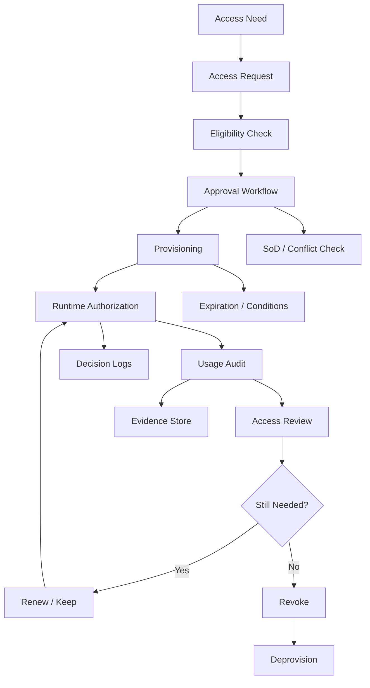

Authorization has two planes:

| Plane | Main Question | Example |
|---|---|---|
| Runtime authorization | May subject perform action on resource now? | Can analyst approve case `CASE-91`? |
| Governance authorization | May subject create/change/revoke the authorization fact? | Can team lead grant analyst the `case.approver` role for region `ID-JK`? |

Most teams implement the first and neglect the second.

That is dangerous because every runtime permission has a control path. If the control path is weak, the runtime path becomes irrelevant.

---

## 2. Governance Objects

Do not model governance as "admin updates user role". That is too primitive.

A production-grade system models access as an asset with lifecycle, provenance, constraints, and evidence.

Core objects:

| Object | Purpose |
|---|---|
| `AccessRequest` | A user, manager, automation, or system asks for access. |
| `AccessGrant` | The actual effective access artifact. |
| `Entitlement` | Business-level access package, role, permission set, or relationship. |
| `ApprovalTask` | Workflow task requiring one or more approvers. |
| `PolicyException` | Controlled exception to normal policy. |
| `AccessReviewCampaign` | Periodic recertification of access. |
| `ReviewDecision` | Keep, revoke, reduce, transfer, or escalate access. |
| `Delegation` | Temporary authority transferred to another subject. |
| `BreakGlassSession` | Emergency elevated access with strict audit. |
| `SoDConstraint` | Separation-of-duties rule. |
| `AccessEvidence` | Reason, ticket, case, incident, manager approval, risk acceptance. |

A mature model avoids "role assignment table as the source of all governance truth". Role assignment is an output of a governed process, not the entire process.

---

## 3. Runtime Permission vs Governed Entitlement

A permission is usually low-level:

```text
case.approve
case.evidence.read
case.assignment.change
case.export
```

An entitlement is usually business-level:

```text
Regional Case Approver - Jakarta
Fraud Evidence Reviewer - Tier 2
Temporary Enforcement Lead - Incident INC-2026-778
External Auditor - Read Only - Q3 Review
```

An entitlement maps to permissions, scopes, relationships, and conditions.

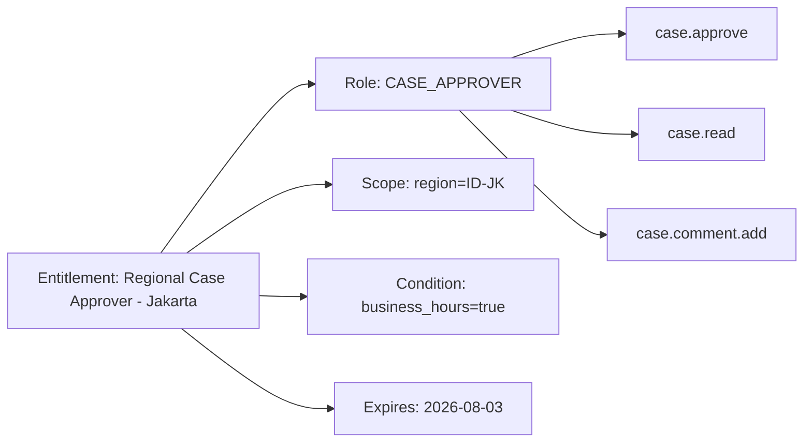

Why this distinction matters:

- permissions are for machines,
- entitlements are for humans,
- policy constraints are for governance,
- access grants bind them together.

If business approvers see `case.evidence.redacted.read.v2`, they will rubber-stamp. If they see "Can read sealed investigation evidence for Jakarta cases until 2026-08-03", they can make a real decision.

---

## 4. Java Domain Model for Governed Access

A minimal production-grade model:

```java
public record AccessRequestId(UUID value) {}
public record AccessGrantId(UUID value) {}
public record SubjectId(String value) {}
public record TenantId(String value) {}
public record ResourceScope(String type, String id) {}

public enum AccessRequestStatus {
    DRAFT,
    SUBMITTED,
    ELIGIBILITY_REJECTED,
    PENDING_APPROVAL,
    APPROVED,
    PROVISIONING,
    ACTIVE,
    REJECTED,
    CANCELLED,
    EXPIRED,
    REVOKED
}

public enum AccessDurationType {
    PERMANENT,
    TEMPORARY,
    JUST_IN_TIME,
    BREAK_GLASS
}

public record EntitlementRef(
    String entitlementCode,
    String version
) {}

public record AccessRequest(
    AccessRequestId id,
    TenantId tenantId,
    SubjectId requester,
    SubjectId targetSubject,
    EntitlementRef entitlement,
    ResourceScope scope,
    AccessDurationType durationType,
    Instant requestedFrom,
    Instant requestedUntil,
    String businessJustification,
    String ticketRef,
    AccessRequestStatus status,
    long version
) {}
```

A grant is the effective authorization artifact:

```java
public enum AccessGrantStatus {
    ACTIVE,
    SUSPENDED,
    EXPIRED,
    REVOKED
}

public record AccessGrant(
    AccessGrantId id,
    TenantId tenantId,
    SubjectId subject,
    EntitlementRef entitlement,
    ResourceScope scope,
    Instant effectiveFrom,
    Instant effectiveUntil,
    AccessGrantStatus status,
    String sourceRequestId,
    String approvedBy,
    String approvalEvidenceRef,
    String policyVersion,
    Instant createdAt,
    Instant updatedAt
) {
    public boolean isEffectiveAt(Instant now) {
        return status == AccessGrantStatus.ACTIVE
            && !now.isBefore(effectiveFrom)
            && (effectiveUntil == null || now.isBefore(effectiveUntil));
    }
}
```

The critical design point: do not let random application code mutate `AccessGrant` directly. All grant creation must pass through governance services.

---

## 5. The Control-Plane Authorization Problem

The authorization system itself needs authorization.

Who can grant access?
Who can approve access?
Who can change policy?
Who can create roles?
Who can make exceptions?
Who can approve emergency access?

This is control-plane authorization.

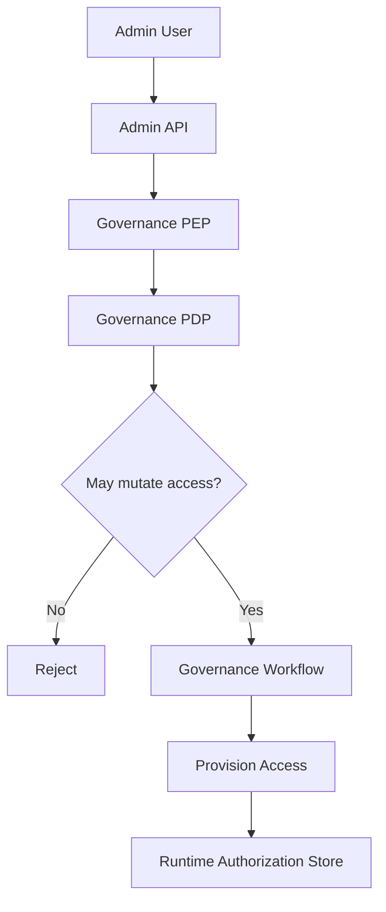

A bad design uses the same broad `ADMIN` role for both runtime and governance operations:

```java
@PreAuthorize("hasRole('ADMIN')")
@PostMapping("/users/{userId}/roles")
void assignRole(...) { ... }
```

This is not governance. This is an escalation primitive.

A better model uses explicit control-plane permissions:

```text
access.request.submit
access.request.approve
access.request.reject
access.grant.revoke
access.grant.extend
access.entitlement.create
access.entitlement.update
access.policy.publish
access.breakglass.approve
access.review.certify
```

These permissions should be scoped:

```text
access.request.approve where entitlement.risk <= approver.maxRisk
access.grant.revoke where grant.tenant == approver.tenant
access.policy.publish where policy.domain == approver.domain
access.breakglass.approve where approver.isSecurityOfficer == true
```

---

## 6. Access Request Lifecycle

A defensible access request flow has explicit transitions.

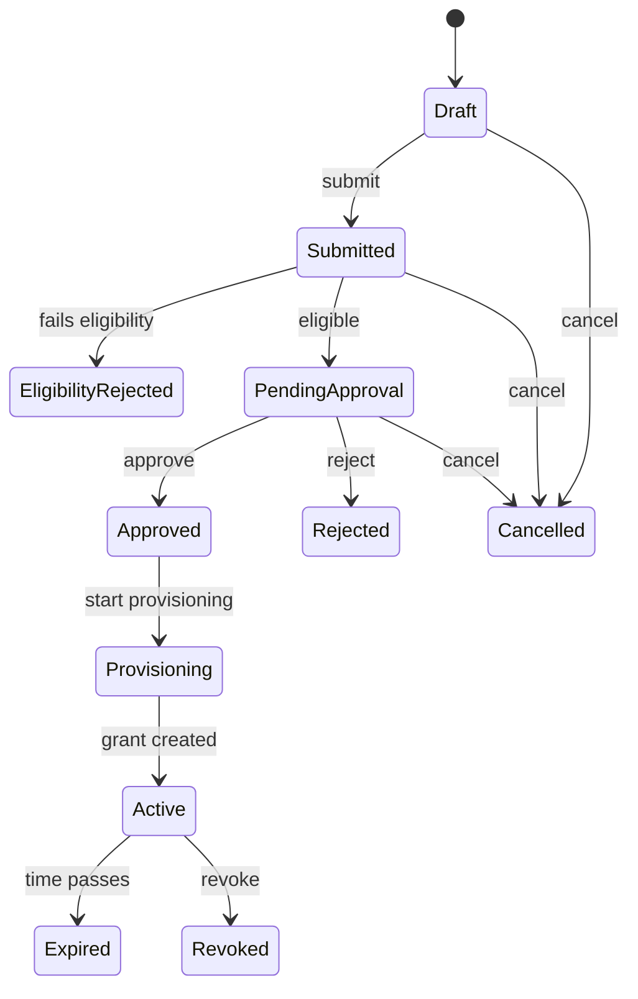

Every transition must be authorized.

| Transition | Authorization Check |
|---|---|
| Draft → Submitted | requester can request for target subject and entitlement |
| Submitted → PendingApproval | system eligibility policy passes |
| PendingApproval → Approved | approver is valid, not requester, no SoD conflict |
| Approved → Provisioning | provisioner/system can create grants |
| Active → Revoked | revoker has revoke authority |
| Active → Expired | system clock/job can expire grants |

This is not just workflow. It is authorization over authorization.

---

## 7. Approval Policy

Approval policy decides who must approve an access request.

A useful approval policy is not just "manager approves". It considers:

- entitlement risk,
- scope sensitivity,
- duration,
- target subject seniority,
- tenant/domain,
- current privileges,
- SoD conflicts,
- resource classification,
- external user status,
- break-glass flag,
- policy exception flag.

Example approval matrix:

| Request Type | Required Approver |
|---|---|
| Low-risk read-only role | Line manager |
| Write role | Line manager + domain owner |
| High-risk evidence access | Domain owner + security officer |
| Global admin role | Security officer + platform owner |
| Break-glass | Security officer, post-use review required |
| SoD exception | Risk owner + compliance officer |
| External auditor access | Sponsor + legal/compliance |

A Java policy shape:

```java
public record ApprovalRequirement(
    List<ApprovalStep> steps,
    boolean sequential,
    String reasonCode
) {}

public record ApprovalStep(
    String stepCode,
    ApproverSelector selector,
    int minApprovals,
    boolean allowDelegatedApproval
) {}

public sealed interface ApproverSelector permits
    ManagerSelector,
    EntitlementOwnerSelector,
    SecurityOfficerSelector,
    ComplianceOfficerSelector,
    StaticGroupSelector {}

public record EntitlementRisk(
    String code,
    int riskLevel,
    boolean canGrantToSelf,
    boolean requiresExpiry,
    boolean requiresReview
) {}
```

The decision service:

```java
public final class ApprovalPolicyService {
    public ApprovalRequirement determineRequirement(AccessRequest request, EntitlementRisk risk) {
        List<ApprovalStep> steps = new ArrayList<>();

        steps.add(new ApprovalStep(
            "MANAGER_APPROVAL",
            new ManagerSelector(request.targetSubject()),
            1,
            true
        ));

        if (risk.riskLevel() >= 3) {
            steps.add(new ApprovalStep(
                "ENTITLEMENT_OWNER_APPROVAL",
                new EntitlementOwnerSelector(request.entitlement()),
                1,
                false
            ));
        }

        if (risk.riskLevel() >= 4 || request.durationType() == AccessDurationType.BREAK_GLASS) {
            steps.add(new ApprovalStep(
                "SECURITY_APPROVAL",
                new SecurityOfficerSelector(request.tenantId()),
                1,
                false
            ));
        }

        return new ApprovalRequirement(steps, true, "APPROVAL_BY_RISK_LEVEL");
    }
}
```

This service should not just generate tasks. It should explain why each task exists.

---

## 8. Separation of Duties

Separation of duties, or SoD, prevents dangerous privilege combinations or self-approval patterns.

There are two broad categories:

| Type | Meaning | Example |
|---|---|---|
| Static SoD | Subject may not hold two conflicting entitlements at the same time. | User cannot be both `PAYMENT_INITIATOR` and `PAYMENT_APPROVER`. |
| Dynamic SoD | Subject may hold both roles but cannot perform conflicting actions on the same object/process instance. | User can approve payments generally, but not payments they created. |

Static SoD is grant-time.
Dynamic SoD is runtime/action-time.

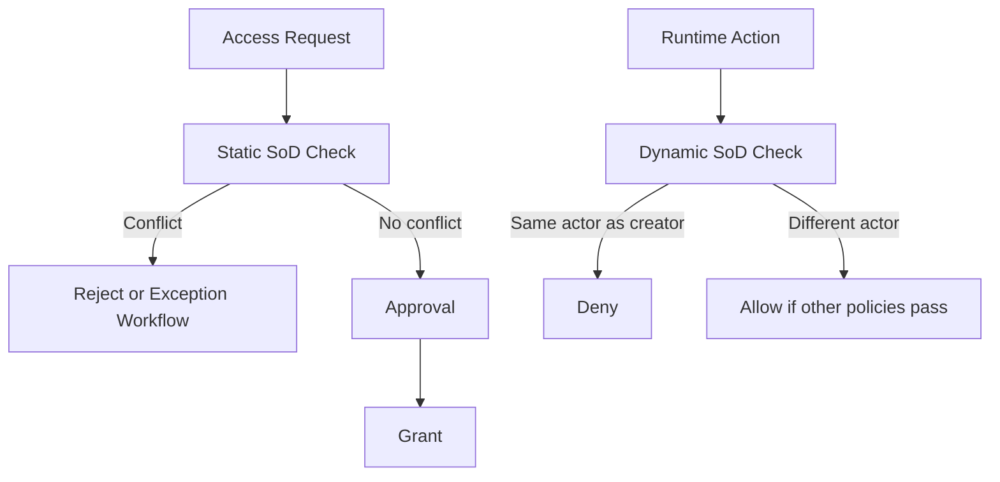

### Static SoD Example

```java
public record SoDConstraint(
    String code,
    Set<String> incompatibleEntitlements,
    boolean exceptionAllowed,
    String exceptionApproverType
) {}

public final class StaticSoDService {
    private final AccessGrantRepository grants;
    private final SoDConstraintRepository constraints;

    public SoDResult evaluate(SubjectId subject, EntitlementRef requested, TenantId tenant) {
        Set<String> active = grants.findActiveEntitlementCodes(subject, tenant);
        List<SoDConstraint> relevant = constraints.findByEntitlement(requested.entitlementCode());

        for (SoDConstraint constraint : relevant) {
            Set<String> overlap = new HashSet<>(active);
            overlap.retainAll(constraint.incompatibleEntitlements());
            if (!overlap.isEmpty()) {
                return SoDResult.conflict(constraint.code(), overlap, constraint.exceptionAllowed());
            }
        }
        return SoDResult.noConflict();
    }
}
```

### Dynamic SoD Example

```java
public AuthorizationDecision canApproveCase(Subject subject, CaseRecord record) {
    if (record.createdBy().equals(subject.id())) {
        return AuthorizationDecision.deny("SOD_CREATOR_CANNOT_APPROVE");
    }
    if (record.lastModifiedBy().equals(subject.id()) && record.modificationWasMaterial()) {
        return AuthorizationDecision.deny("SOD_MATERIAL_EDITOR_CANNOT_APPROVE");
    }
    return permissionCheck(subject, "case.approve", record.resourceRef());
}
```

Dynamic SoD belongs close to the domain action because it depends on the object/process history.

---

## 9. Self-Service Access Request UX

Admin UX is security-critical.

Bad UX causes bad governance:

- users request overly broad roles because fine-grained options are incomprehensible,
- approvers approve blindly because risk is not visible,
- admins use global roles because scoped grants are tedious,
- users keep temporary access because expiration is hidden,
- break-glass becomes a normal workflow because standard request is too slow.

A good access request screen shows:

- what access is requested,
- what resource scope it applies to,
- what actions it enables,
- what data sensitivity it exposes,
- why the user needs it,
- how long it lasts,
- who will approve it,
- whether it conflicts with current access,
- whether there are safer alternatives,
- what audit obligations apply.

Do not show raw permission codes only. Show business meaning.

Example entitlement presentation:

```text
Entitlement: Regional Case Approver - Jakarta
Allows:
- Read assigned enforcement cases in Jakarta
- Add comments and review notes
- Approve escalation from Investigation to Enforcement Review
Does not allow:
- Read sealed evidence
- Export case packets
- Reassign case owner
Scope: Region = ID-JK
Duration: 30 days
Risk: High
Requires: Manager + Case Governance Owner approval
SoD check: Cannot approve cases created by yourself
```

This is not cosmetic. It is how humans make correct access decisions.

---

## 10. Admin UX for Granting Access

Admin screens need guardrails.

A secure admin UX should enforce:

- no self-grant without break-glass flow,
- no invisible global scope default,
- no permanent duration default for risky entitlements,
- no bypass of approval for high-risk grants,
- no direct mutation of grants without evidence,
- no editing active grants without creating revision history,
- no deleting audit history,
- no entitlement assignment outside admin scope,
- no role copy from another user without diff explanation,
- no wildcard permissions in custom roles without elevated approval.

A common anti-pattern:

```text
Admin selects user -> Add role -> Save
```

A better flow:

```text
Admin selects target subject
-> chooses entitlement from catalog
-> selects scope
-> sees effective permissions and risk
-> provides reason/evidence
-> system evaluates admin authority + SoD + eligibility
-> approval workflow created if needed
-> grant provisioned only after approval
```

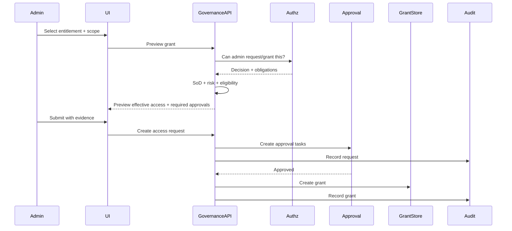

---

## 11. Entitlement Catalog

An entitlement catalog is the business-facing inventory of grantable access.

It should include:

| Field | Purpose |
|---|---|
| Code | Stable machine identifier. |
| Display name | Human-readable name. |
| Description | Business meaning. |
| Owner | Accountable owner. |
| Risk level | Approval/review driver. |
| Mapped permissions | Runtime actions enabled. |
| Required scope type | Tenant, region, department, case, portfolio, etc. |
| Default duration | Safe default validity period. |
| Max duration | Hard cap. |
| Review frequency | Recertification cadence. |
| SoD constraints | Conflicts with other entitlements. |
| Provisioning adapter | RBAC DB, OpenFGA tuple, OPA data, Cedar entity, external system. |
| Deprovisioning adapter | How access is removed. |
| Evidence requirements | Ticket, manager approval, incident, contract, legal basis. |

Example Java catalog record:

```java
public record EntitlementDefinition(
    String code,
    String version,
    String displayName,
    String description,
    SubjectId owner,
    int riskLevel,
    Set<Permission> permissions,
    ScopeType requiredScopeType,
    Duration defaultDuration,
    Duration maxDuration,
    ReviewCadence reviewCadence,
    Set<String> incompatibleEntitlementCodes,
    ProvisioningMode provisioningMode,
    boolean selfServiceRequestable,
    boolean requiresBusinessJustification
) {}
```

The catalog must be versioned. Changing an entitlement mapping changes access semantics.

---

## 12. Temporary Access and Just-in-Time Authorization

Temporary access is not a weak version of permanent access. It is its own control pattern.

Use it when access is needed for:

- incident response,
- short-term coverage,
- audit/review windows,
- project-based work,
- temporary delegation,
- emergency investigation,
- data migration,
- production support.

Temporary access must have:

- explicit start time,
- explicit end time,
- max duration by entitlement risk,
- automatic expiration,
- audit evidence,
- notification to owner/manager,
- review if extended,
- runtime decision visibility.

Bad pattern:

```sql
insert into user_role(user_id, role) values (?, 'GLOBAL_ADMIN');
```

Better pattern:

```sql
insert into access_grant(
    grant_id,
    tenant_id,
    subject_id,
    entitlement_code,
    scope_type,
    scope_id,
    effective_from,
    effective_until,
    status,
    source_request_id,
    approved_by,
    created_at
) values (...);
```

At runtime:

```java
public boolean grantApplies(AccessGrant grant, Instant now, ResourceRef resource) {
    return grant.isEffectiveAt(now)
        && grant.scope().matches(resource)
        && grant.status() == AccessGrantStatus.ACTIVE;
}
```

An expiration job is necessary but not sufficient. Runtime authorization must check `effectiveUntil` directly so stale jobs cannot keep access alive.

---

## 13. Break-Glass Access

Break-glass access is emergency access that bypasses normal workflow under strict control.

It should be rare, uncomfortable, and visible.

A good break-glass design includes:

- separate break-glass entitlement,
- strong authentication before activation,
- mandatory reason and incident/ticket reference,
- short maximum duration,
- explicit sensitive-access banner,
- real-time notification to security/owner,
- enhanced decision logging,
- session recording where applicable,
- post-use review,
- automatic revocation,
- anomaly detection,
- no silent use.

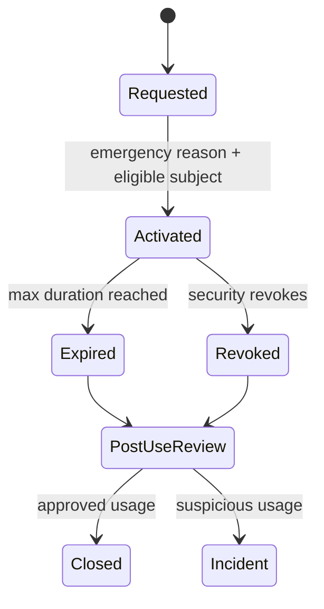

Break-glass is not `if admin then allow`.

A runtime decision should include break-glass context:

```java
public record BreakGlassContext(
    boolean active,
    String sessionId,
    String incidentRef,
    Instant expiresAt,
    String activatedBy
) {}
```

And audit must record it:

```json
{
  "decision": "ALLOW",
  "reasonCode": "BREAK_GLASS_ACTIVE",
  "subject": "user:ops-17",
  "action": "case.evidence.read.sealed",
  "resource": "case:CASE-991",
  "breakGlassSessionId": "BG-2026-00087",
  "incidentRef": "INC-2026-4112",
  "policyVersion": "authz-policy-2026.07.03",
  "requiresPostUseReview": true
}
```

A break-glass allow should never look identical to a normal allow.

---

## 14. Delegation

Delegation transfers limited authority from one subject to another.

Examples:

- manager delegates approval authority while on leave,
- investigator delegates evidence review to deputy,
- case owner delegates comment-only access to external counsel,
- system delegates a task-specific authority to worker service.

Delegation must answer:

- who delegated,
- to whom,
- what authority,
- over which scope,
- for how long,
- whether re-delegation is allowed,
- whether delegator still retains authority,
- whether delegated actions are audited as delegate or original principal,
- whether SoD still applies.

Model:

```java
public record DelegationGrant(
    UUID id,
    TenantId tenantId,
    SubjectId delegator,
    SubjectId delegate,
    EntitlementRef delegatedEntitlement,
    ResourceScope scope,
    Instant effectiveFrom,
    Instant effectiveUntil,
    boolean redelegationAllowed,
    String reason,
    DelegationStatus status
) {}
```

Runtime subject context should preserve actor and authority source:

```java
public record ActingSubject(
    SubjectId actor,
    Optional<SubjectId> onBehalfOf,
    Set<String> authoritySources
) {}
```

This distinction matters. "Alice acting for Bob" is not the same as "Alice is Bob".

For audit:

```text
actor = alice
onBehalfOf = bob
authoritySource = delegation:DEL-991
action = case.approve
resource = case:CASE-123
```

---

## 15. Access Review and Recertification

Access review answers:

> Does this subject still need this access?

It is not a spreadsheet ritual. It is a control loop that detects entitlement drift.

Types:

| Review Type | Purpose |
|---|---|
| Periodic review | Recertify access every N days. |
| Triggered review | Review after job change, manager change, transfer, incident, policy change. |
| Risk-based review | Review high-risk entitlements more often. |
| Dormant access review | Review access not used recently. |
| Privileged access review | Review admin/elevated roles. |
| External access review | Review contractors, vendors, auditors. |
| Orphaned access review | Review access with missing owner/manager/resource. |

Access review campaign model:

```java
public record AccessReviewCampaign(
    UUID id,
    TenantId tenantId,
    String name,
    ReviewScope scope,
    Instant startsAt,
    Instant dueAt,
    ReviewCampaignStatus status,
    SubjectId owner,
    String reason
) {}

public record ReviewItem(
    UUID id,
    UUID campaignId,
    AccessGrantId grantId,
    SubjectId reviewer,
    ReviewItemStatus status,
    ReviewDecision decision,
    String decisionReason,
    Instant decidedAt
) {}

public enum ReviewDecision {
    KEEP,
    REVOKE,
    REDUCE_SCOPE,
    SHORTEN_DURATION,
    TRANSFER_OWNER,
    ESCALATE
}
```

Review items should show context:

```text
Subject: jane.doe
Entitlement: Evidence Reviewer - Tier 2
Scope: Region ID-JK
Granted: 2026-02-10
Expires: none
Approved by: manager-81 + evidence-owner-4
Last used: 2026-03-01
Usage count last 90 days: 0
Risk: High
Recommended decision: Revoke or convert to temporary access
```

The system should not ask reviewers to approve blind.

---

## 16. Usage-Aware Access Review

Access review becomes more powerful when it includes usage signals.

Useful signals:

- last used date,
- frequency of use,
- actions used vs actions granted,
- resources accessed,
- sensitive fields accessed,
- break-glass usage,
- failed authorization attempts,
- access outside usual hours,
- access after team transfer,
- access after project closure,
- grants never used.

Be careful: "not used recently" does not always mean "unneeded". Some emergency or quarterly roles are rarely used by design. But usage signal improves reviewer judgment.

A simple recommendation rule:

```java
public ReviewRecommendation recommend(AccessGrant grant, UsageSummary usage, EntitlementDefinition entitlement) {
    if (entitlement.riskLevel() >= 4 && usage.lastUsedAt().isEmpty()) {
        return ReviewRecommendation.revoke("HIGH_RISK_NEVER_USED");
    }
    if (usage.daysSinceLastUse() > 180 && entitlement.riskLevel() >= 3) {
        return ReviewRecommendation.revoke("STALE_HIGH_RISK_ACCESS");
    }
    if (usage.usedPermissions().size() < entitlement.permissions().size() / 3) {
        return ReviewRecommendation.reduce("OVER_GRANTED_RELATIVE_TO_USAGE");
    }
    return ReviewRecommendation.keep("USAGE_WITHIN_EXPECTED_PATTERN");
}
```

Review recommendations should assist humans, not silently revoke access without policy.

---

## 17. Joiner-Mover-Leaver Events

Governance systems must react to identity lifecycle events.

| Event | Required Authorization Effect |
|---|---|
| Joiner | Assign baseline access based on role/team/location. |
| Mover | Review and revoke old access; assign new access. |
| Leaver | Disable subject and revoke/suspend all access. |
| Manager change | Recompute approval chains and review inherited grants. |
| Department change | Re-evaluate scoped access and SoD. |
| Contractor end date | Expire external access. |
| Legal hold | Freeze deletion or revoke export access. |

Do not rely only on login disable. Service accounts, API tokens, delegated access, long-running jobs, and external systems may still have authorization artifacts.

Event-driven model:

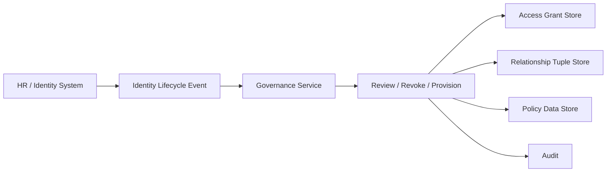

Example handler:

```java
public final class IdentityLifecycleHandler {
    private final AccessGrantRepository grants;
    private final AccessReviewService reviews;
    private final RevocationService revocation;

    public void onDepartmentChanged(DepartmentChangedEvent event) {
        List<AccessGrant> subjectGrants = grants.findActiveBySubject(event.subjectId());
        for (AccessGrant grant : subjectGrants) {
            if (grant.entitlement().requiresDepartmentEligibility()) {
                reviews.createTriggeredReview(
                    grant.id(),
                    "DEPARTMENT_CHANGED",
                    event.effectiveAt()
                );
            }
        }
    }

    public void onLeaver(LeaverEvent event) {
        revocation.revokeAllForSubject(
            event.subjectId(),
            "IDENTITY_LEAVER_EVENT",
            event.eventId()
        );
    }
}
```

---

## 18. Provisioning and Deprovisioning

Provisioning turns governance decisions into runtime authorization facts.

Targets may include:

- local RBAC tables,
- external IAM/IdP group,
- OpenFGA tuples,
- Cedar/AVP entity attributes or policy store,
- OPA data bundle,
- database row-level policy mapping,
- downstream SaaS application,
- Kafka ACL,
- secrets manager policy,
- workflow task assignment.

Provisioning must be idempotent.

```java
public interface ProvisioningAdapter {
    ProvisioningResult provision(AccessGrant grant);
    ProvisioningResult deprovision(AccessGrant grant, String reason);
    ProvisioningDrift detectDrift(AccessGrant grant);
}
```

A robust provisioning flow:

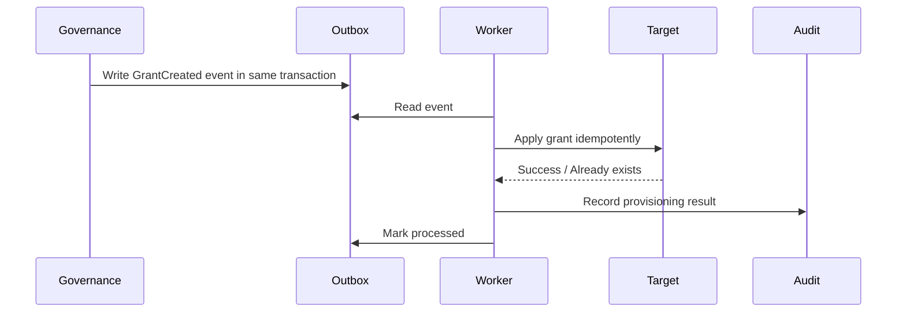

Never create access in the target system without a governance record. If the target has access that the governance system does not know about, that is drift.

---

## 19. Drift Detection

Drift means actual access differs from governed access.

Types:

| Drift Type | Example |
|---|---|
| Unauthorized grant | Role exists in target but no active access grant. |
| Missing grant | Access grant active but target assignment missing. |
| Scope drift | Target grants broader scope than approved. |
| Duration drift | Target has no expiration while grant is temporary. |
| Policy drift | Entitlement mapping changed but old target state remains. |
| Identity drift | Grant belongs to disabled/moved subject. |
| Orphan drift | Resource or owner no longer exists. |

Drift detection is a reconciliation problem.

```java
public final class AccessDriftDetector {
    public DriftReport compare(GovernedState governed, TargetState actual) {
        List<DriftFinding> findings = new ArrayList<>();

        for (ActualAssignment assignment : actual.assignments()) {
            if (!governed.hasMatchingGrant(assignment)) {
                findings.add(DriftFinding.unauthorizedAssignment(assignment));
            }
        }

        for (AccessGrant grant : governed.activeGrants()) {
            if (!actual.hasMatchingAssignment(grant)) {
                findings.add(DriftFinding.missingAssignment(grant));
            }
        }

        return new DriftReport(findings);
    }
}
```

Drift remediation should be policy-driven:

- auto-remove low-risk unauthorized assignments,
- create incident for high-risk drift,
- notify owner for missing assignments,
- freeze grants for suspicious drift,
- require approval before broad correction.

---

## 20. Governance Audit Trail

Every governance action must be audited.

Runtime decision logs answer:

> Was this request allowed?

Governance audit logs answer:

> Why did this subject have access in the first place?

Minimum audit events:

| Event | Required Data |
|---|---|
| Access request submitted | requester, target, entitlement, scope, reason, ticket |
| Eligibility evaluated | policy version, result, reason |
| Approval task created | approver selector, due date, risk |
| Approval decision | approver, decision, timestamp, reason |
| Grant provisioned | grant ID, target, provisioning adapter |
| Grant changed | before/after, actor, reason |
| Grant revoked | actor, reason, effective time |
| Grant expired | system actor, expiration rule |
| Review item decided | reviewer, decision, evidence |
| Break-glass activated | actor, reason, incident, expiry |
| Break-glass reviewed | reviewer, outcome |
| Policy published | author, approver, version, diff |
| Entitlement changed | owner, mapping diff, risk change |

Use append-only events. Do not rely on mutable row history only.

Example event:

```json
{
  "eventType": "ACCESS_GRANT_CREATED",
  "eventId": "evt-01JZ-...",
  "tenantId": "tenant:regulator-id",
  "grantId": "grant:8f20",
  "subject": "user:analyst-22",
  "entitlement": "REGIONAL_CASE_APPROVER@2026.07",
  "scope": "region:ID-JK",
  "effectiveFrom": "2026-07-03T09:00:00Z",
  "effectiveUntil": "2026-08-03T09:00:00Z",
  "sourceRequestId": "access-request:991",
  "approvedBy": ["user:manager-8", "user:case-owner-2"],
  "policyVersion": "governance-policy-2026.07.03",
  "createdAt": "2026-07-03T08:55:10Z"
}
```

---

## 21. Access Change Review Before Commit

Dangerous access changes should support preview.

Before committing, the system should show:

- new effective permissions,
- removed permissions,
- newly accessible resource scopes,
- newly accessible data classifications,
- conflicts introduced,
- required approvals,
- impacted users,
- impacted services,
- risk delta.

Example diff:

```text
Before:
- case.read for region ID-JK
- case.comment.add for region ID-JK

After:
- case.read for region ID-JK
- case.comment.add for region ID-JK
- case.approve for region ID-JK
- case.evidence.read.redacted for region ID-JK

Risk delta:
- Grants workflow approval authority
- Grants access to redacted evidence metadata
- Requires case owner approval
- Dynamic SoD applies: cannot approve cases created by self
```

A role editor without semantic diff is dangerous.

---

## 22. Role and Policy Change Governance

Changing a role or policy is a mass access change.

If `CASE_ANALYST` gains `case.export`, every holder of that role may gain export ability.

Therefore role/policy changes need lifecycle:

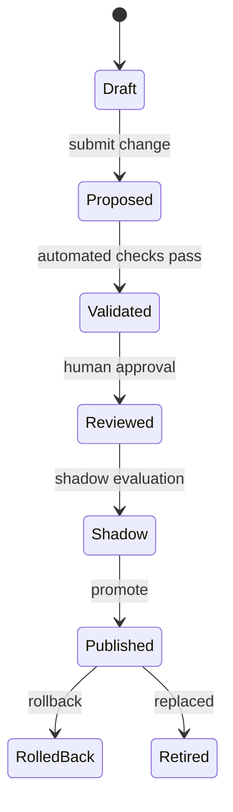

Validation should include:

- syntax/schema validation,
- permission existence check,
- entitlement owner approval,
- SoD impact analysis,
- affected subjects count,
- sensitive permission diff,
- deny/allow regression matrix,
- tenant impact,
- rollback plan.

Java service shape:

```java
public record AccessModelChange(
    UUID id,
    String modelType,
    String modelCode,
    String fromVersion,
    String toVersion,
    String diffSummary,
    int affectedSubjectCount,
    Set<Permission> addedPermissions,
    Set<Permission> removedPermissions,
    ChangeRisk risk,
    ChangeStatus status
) {}
```

Treat authorization model changes like code deployments.

---

## 23. Custom Roles

Enterprise systems often need custom roles.

Custom roles are useful, but risky. They can bypass carefully designed standard entitlements.

Guardrails:

- restrict who can create custom roles,
- require owner,
- require description,
- restrict sensitive permissions,
- require scope type,
- require approval for high-risk permissions,
- version custom roles,
- review custom roles periodically,
- disallow wildcard permissions unless exceptional,
- prevent custom roles from bypassing SoD,
- show affected users before edit.

Do not let users build arbitrary boolean policies in UI unless you have validation, testing, and review.

A safe custom role design:

```java
public record CustomRoleDefinition(
    String roleCode,
    String version,
    TenantId tenantId,
    SubjectId owner,
    String displayName,
    String description,
    Set<Permission> permissions,
    ScopeType allowedScopeType,
    int computedRiskLevel,
    boolean active
) {}
```

Computed risk should be derived from permissions, not manually selected.

---

## 24. Privileged Access Management Pattern

Privileged access should be handled differently from normal access.

Privileged entitlements include:

- global admin,
- tenant admin,
- role/policy admin,
- evidence unseal,
- export all,
- impersonation,
- production support,
- audit log access,
- data deletion,
- encryption key access,
- break-glass.

Controls:

- just-in-time activation,
- step-up authentication,
- short duration,
- separate approval,
- reason code,
- session audit,
- explicit notification,
- post-use review,
- blocked self-approval,
- stricter SoD,
- high-signal monitoring.

Activation model:

```java
public record PrivilegedAccessActivation(
    UUID activationId,
    AccessGrantId baseGrantId,
    SubjectId actor,
    Instant activatedAt,
    Instant expiresAt,
    String reason,
    String ticketRef,
    ActivationStatus status
) {}
```

Runtime should check both base eligibility and active activation:

```java
if (permission.isPrivileged()) {
    if (!privilegedAccess.isActive(subject.id(), permission, now)) {
        return AuthorizationDecision.deny("PRIVILEGED_ACCESS_NOT_ACTIVE");
    }
}
```

---

## 25. Impersonation and Support Access

Support impersonation is one of the most dangerous governance features.

Rules:

- never share password or token,
- represent actor and impersonated subject separately,
- require explicit reason,
- restrict which subjects can be impersonated,
- restrict actions during impersonation,
- block sensitive operations,
- show visible banner,
- notify impersonated user where appropriate,
- record every decision with both identities,
- expire automatically,
- require approval for high-risk tenant/user.

Subject model:

```java
public record PrincipalContext(
    SubjectId actor,
    Optional<SubjectId> impersonatedSubject,
    Set<String> authenticationMethods,
    Set<String> authoritySources
) {
    public SubjectId effectiveSubject() {
        return impersonatedSubject.orElse(actor);
    }
}
```

Bad audit:

```text
user=jane action=profile.update
```

Good audit:

```text
actor=support-17 effectiveSubject=jane action=profile.update mode=impersonation reason=TICKET-991
```

Do not allow impersonation to hide the real actor.

---

## 26. Evidence and Justification

Every high-risk access should have evidence.

Evidence can be:

- ticket ID,
- incident ID,
- manager approval,
- contract/legal basis,
- case assignment,
- project membership,
- customer authorization,
- investigation mandate,
- emergency reason,
- risk acceptance.

The evidence should be linked, not pasted into free text only.

```java
public record AccessEvidence(
    String evidenceType,
    String externalRef,
    String summary,
    SubjectId submittedBy,
    Instant submittedAt,
    boolean verified
) {}
```

Weak evidence:

```text
Need access.
```

Better evidence:

```text
Incident INC-2026-477 requires Tier 2 evidence review for cases in region ID-JK until 2026-07-10. Approved by Case Governance Owner.
```

Governance systems should reject vague evidence for high-risk access.

---

## 27. Notifications and Escalation

Governance needs time-bound workflow.

Notify when:

- access is requested,
- approval is pending,
- access is granted,
- access is denied,
- temporary access is near expiry,
- access is revoked,
- break-glass is activated,
- review is due,
- review is overdue,
- drift is detected,
- high-risk policy changes are proposed.

Escalate when:

- approval overdue,
- review overdue,
- break-glass not reviewed,
- drift not remediated,
- high-risk grant remains unused,
- orphaned access lacks owner.

Notifications are not security controls by themselves, but they make controls visible.

---

## 28. Governance APIs

Example REST API surface:

```http
POST /access-requests
GET /access-requests/{id}
POST /access-requests/{id}/submit
POST /access-requests/{id}/cancel
GET /approval-tasks?assignedTo=me
POST /approval-tasks/{id}/approve
POST /approval-tasks/{id}/reject
GET /access-grants?subjectId=...
POST /access-grants/{id}/revoke
POST /access-grants/{id}/extend
POST /break-glass-sessions
POST /break-glass-sessions/{id}/close
POST /access-review-campaigns
POST /review-items/{id}/decide
GET /entitlements
GET /entitlements/{code}
POST /entitlements/{code}/versions
```

Every endpoint needs both governance authorization and object-level authorization.

Example:

```java
@PostMapping("/access-grants/{grantId}/revoke")
public ResponseEntity<Void> revoke(
    @PathVariable UUID grantId,
    @RequestBody RevokeGrantRequest body,
    Authentication authentication
) {
    Subject subject = subjectResolver.from(authentication);
    AccessGrant grant = grants.getRequired(grantId);

    authz.requireAllowed(AuthorizationRequest.builder()
        .subject(subject)
        .action("access.grant.revoke")
        .resource(ResourceRef.of("accessGrant", grantId.toString(), grant.tenantId().value()))
        .context(Map.of(
            "targetSubject", grant.subject().value(),
            "entitlement", grant.entitlement().entitlementCode(),
            "scope", grant.scope().id(),
            "riskLevel", entitlementRisk(grant.entitlement())
        ))
        .build());

    revocationService.revoke(grantId, subject.id(), body.reason(), body.evidenceRef());
    return ResponseEntity.noContent().build();
}
```

Do not expose raw grant mutation endpoints without policy checks.

---

## 29. Governance Database Schema

A compact relational model:

```sql
create table entitlement_definition (
    entitlement_code text not null,
    version text not null,
    display_name text not null,
    description text not null,
    owner_subject_id text not null,
    risk_level int not null,
    required_scope_type text not null,
    default_duration_seconds bigint,
    max_duration_seconds bigint,
    active boolean not null,
    created_at timestamptz not null,
    primary key (entitlement_code, version)
);

create table entitlement_permission (
    entitlement_code text not null,
    version text not null,
    permission_code text not null,
    primary key (entitlement_code, version, permission_code)
);

create table access_request (
    request_id uuid primary key,
    tenant_id text not null,
    requester_subject_id text not null,
    target_subject_id text not null,
    entitlement_code text not null,
    entitlement_version text not null,
    scope_type text not null,
    scope_id text not null,
    requested_from timestamptz not null,
    requested_until timestamptz,
    business_justification text not null,
    evidence_ref text,
    status text not null,
    version bigint not null,
    created_at timestamptz not null,
    updated_at timestamptz not null
);

create table access_grant (
    grant_id uuid primary key,
    tenant_id text not null,
    subject_id text not null,
    entitlement_code text not null,
    entitlement_version text not null,
    scope_type text not null,
    scope_id text not null,
    effective_from timestamptz not null,
    effective_until timestamptz,
    status text not null,
    source_request_id uuid,
    approved_by text,
    policy_version text not null,
    created_at timestamptz not null,
    updated_at timestamptz not null
);

create index idx_access_grant_subject_active
    on access_grant(tenant_id, subject_id, status, effective_until);

create index idx_access_grant_entitlement_scope
    on access_grant(tenant_id, entitlement_code, scope_type, scope_id, status);
```

Use immutable audit/event tables in addition to mutable workflow tables.

---

## 30. Expiration and Revocation Semantics

Expiration and revocation are not identical.

| Concept | Meaning |
|---|---|
| Expiration | Access naturally ends at planned time. |
| Revocation | Access is actively removed before planned end. |
| Suspension | Access temporarily disabled but grant not removed. |
| Reduction | Scope or permissions reduced. |
| Transfer | Ownership/responsibility moved to another subject. |

Revocation must be fast enough for risk.

High-risk entitlements should have:

- direct runtime check against grant validity,
- short decision cache TTL,
- revocation event invalidation,
- immediate target deprovisioning,
- audit event,
- notification.

Revocation flow:

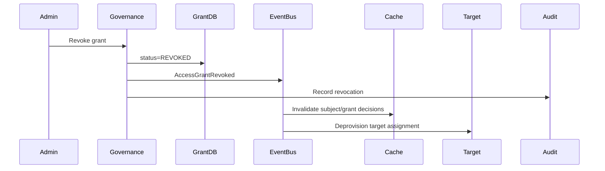

Runtime must not depend only on downstream deprovisioning completion.

---

## 31. Governance Failure Modes

| Failure | Consequence | Mitigation |
|---|---|---|
| Approver can approve own request | Self-escalation | SoD/self-approval check |
| Admin can directly mutate grant | Bypass workflow | Governance PEP + write service only |
| Temporary grant not expired | Privilege creep | Runtime expiration check + expiry job |
| Role edit affects many users silently | Mass privilege escalation | Semantic diff + approval + shadow eval |
| Reviewers rubber-stamp | Entitlement drift | Usage context + risk-based recommendations |
| Target system drift | Unknown access | Reconciliation + drift remediation |
| Break-glass normalized | Permanent emergency mode | Strict duration + post-use review |
| Disabled user still has service token | Orphan access | Leaver event revoke all grants/tokens |
| Support impersonation hides actor | Non-repudiation failure | Actor/effective subject audit split |
| Policy owner can disable audit | Control failure | SoD between access admin and audit admin |

---

## 32. Metrics

Operational metrics:

```text
access_requests_total{status, entitlement_risk}
approval_latency_seconds{risk_level}
access_grants_active{entitlement, scope_type, risk_level}
temporary_grants_expiring_soon_total
expired_grants_still_provisioned_total
revocation_latency_seconds{target_system}
access_review_overdue_total
breakglass_sessions_total{status}
breakglass_post_review_overdue_total
sod_conflicts_detected_total
unauthorized_drift_findings_total
policy_change_affected_subjects{risk_level}
```

Dashboards should answer:

- How many high-risk grants exist?
- How many are permanent?
- Which grants have not been used recently?
- Which reviews are overdue?
- Which target systems have provisioning drift?
- How fast do revocations take effect?
- How often is break-glass used?
- Which teams have the most privileged access?

---

## 33. Testing Governance

Governance tests must cover workflow and adversarial behavior.

Examples:

```java
@Test
void requesterCannotApproveOwnHighRiskAccessRequest() {
    AccessRequest request = fixtures.highRiskRequest()
        .requester("user:alice")
        .targetSubject("user:alice")
        .build();

    ApprovalDecision decision = approvalService.approve(
        request.id(),
        SubjectId.of("user:alice"),
        "looks good"
    );

    assertThat(decision.allowed()).isFalse();
    assertThat(decision.reasonCode()).isEqualTo("SELF_APPROVAL_DENIED");
}

@Test
void temporaryGrantIsNotEffectiveAfterExpiryEvenIfExpiryJobHasNotRun() {
    AccessGrant grant = fixtures.temporaryGrant()
        .effectiveUntil(Instant.parse("2026-07-03T10:00:00Z"))
        .status(AccessGrantStatus.ACTIVE)
        .build();

    boolean effective = grant.isEffectiveAt(Instant.parse("2026-07-03T10:00:01Z"));

    assertThat(effective).isFalse();
}

@Test
void roleChangeAddingSensitivePermissionRequiresSecurityApproval() {
    RoleChange change = fixtures.roleChange()
        .adds(Permission.CASE_EXPORT_ALL)
        .affectedSubjectCount(184)
        .build();

    ApprovalRequirement req = roleChangePolicy.determineRequirement(change);

    assertThat(req.steps()).extracting(ApprovalStep::stepCode)
        .contains("SECURITY_APPROVAL", "ENTITLEMENT_OWNER_APPROVAL");
}
```

Governance bugs are often business-logic bugs, not framework bugs.

---

## 34. Architecture Fitness Functions

Use automated checks to keep the governance model healthy.

Examples:

- no active high-risk grant may be permanent,
- no grant may exist without source evidence,
- no active grant may reference inactive entitlement version,
- no subject may hold incompatible entitlements unless exception active,
- no break-glass session may remain active beyond max duration,
- no review campaign may be closed with unresolved high-risk items,
- no custom role may include wildcard permission,
- no access grant may have broader scope than approver authority,
- no entitlement may be ownerless,
- no role/policy change may be published without semantic diff.

SQL check example:

```sql
select grant_id
from access_grant g
join entitlement_definition e
  on e.entitlement_code = g.entitlement_code
 and e.version = g.entitlement_version
where g.status = 'ACTIVE'
  and e.risk_level >= 4
  and g.effective_until is null;
```

This should return zero rows.

---

## 35. Implementation Blueprint

A production-grade Java governance module can be structured as:

```text
com.example.authz.governance
├── api
│   ├── AccessRequestController.java
│   ├── ApprovalTaskController.java
│   ├── AccessGrantController.java
│   ├── EntitlementController.java
│   └── AccessReviewController.java
├── application
│   ├── AccessRequestService.java
│   ├── ApprovalWorkflowService.java
│   ├── GrantProvisioningService.java
│   ├── RevocationService.java
│   ├── AccessReviewService.java
│   ├── BreakGlassService.java
│   └── DriftDetectionService.java
├── domain
│   ├── AccessRequest.java
│   ├── AccessGrant.java
│   ├── EntitlementDefinition.java
│   ├── ApprovalRequirement.java
│   ├── SoDConstraint.java
│   ├── DelegationGrant.java
│   └── BreakGlassSession.java
├── policy
│   ├── ApprovalPolicyService.java
│   ├── EligibilityPolicyService.java
│   ├── SoDPolicyService.java
│   ├── DurationPolicyService.java
│   └── GovernanceAuthorizationService.java
├── provisioning
│   ├── ProvisioningAdapter.java
│   ├── LocalRbacProvisioningAdapter.java
│   ├── OpenFgaProvisioningAdapter.java
│   ├── CedarEntityProvisioningAdapter.java
│   └── OpaDataProvisioningAdapter.java
├── audit
│   ├── GovernanceAuditEvent.java
│   └── GovernanceAuditSink.java
└── persistence
    ├── AccessRequestRepository.java
    ├── AccessGrantRepository.java
    ├── EntitlementRepository.java
    └── ReviewRepository.java
```

Keep governance policies separate from runtime policy evaluation, but connect them through shared domain vocabulary.

---

## 36. Checklist

Before calling your authorization system production-grade, answer these:

- Can a user approve their own access request?
- Can an admin grant themselves a high-risk role?
- Can high-risk access be permanent?
- Can access exist without evidence?
- Can role/policy changes affect many users without preview?
- Can temporary access remain active if the expiration job fails?
- Can a leaver retain access through tokens, tuples, groups, or downstream systems?
- Can break-glass access be used silently?
- Can support impersonation hide the real actor?
- Can reviewers see usage and risk context?
- Can target system drift be detected?
- Can every active grant be traced to request, approval, policy version, and evidence?
- Can every runtime decision be tied back to the grant or relationship that enabled it?
- Can every entitlement owner be identified?
- Can sensitive permission changes be tested before publishing?

If the answer is no, the problem is not only technical. It is operational.

---

## 37. Key Takeaways

1. Runtime authorization decides whether an action is allowed; governance decides how access comes into existence and how it disappears.
2. Admin UX is part of the security boundary.
3. Access grants must have scope, duration, provenance, owner, and evidence.
4. Separation of duties must exist both at grant-time and runtime.
5. Temporary access must expire by runtime logic, not only by cleanup jobs.
6. Break-glass must be exceptional, visible, short-lived, and reviewed.
7. Access review needs risk and usage context, not blind recertification.
8. Provisioning must be idempotent, auditable, and reconciled against drift.
9. Role and policy changes are mass authorization changes and need release governance.
10. A mature authorization platform is both a runtime decision engine and an operational control system.

---

## References

- OWASP Authorization Cheat Sheet — https://cheatsheetseries.owasp.org/cheatsheets/Authorization_Cheat_Sheet.html
- OWASP API Security Top 10 2023 — https://owasp.org/API-Security/editions/2023/en/0x11-t10/
- OWASP API1:2023 Broken Object Level Authorization — https://owasp.org/API-Security/editions/2023/en/0xa1-broken-object-level-authorization/
- NIST SP 800-53 Rev. 5, Security and Privacy Controls for Information Systems and Organizations — https://nvlpubs.nist.gov/nistpubs/SpecialPublications/NIST.SP.800-53r5.pdf
- NIST SP 800-162, Guide to Attribute Based Access Control — https://nvlpubs.nist.gov/nistpubs/specialpublications/nist.sp.800-162.pdf
- Spring Security Authorization Architecture — https://docs.spring.io/spring-security/reference/servlet/authorization/architecture.html
- OpenFGA Concepts — https://openfga.dev/docs/concepts
- Cedar Policy Language Documentation — https://docs.cedarpolicy.com/
