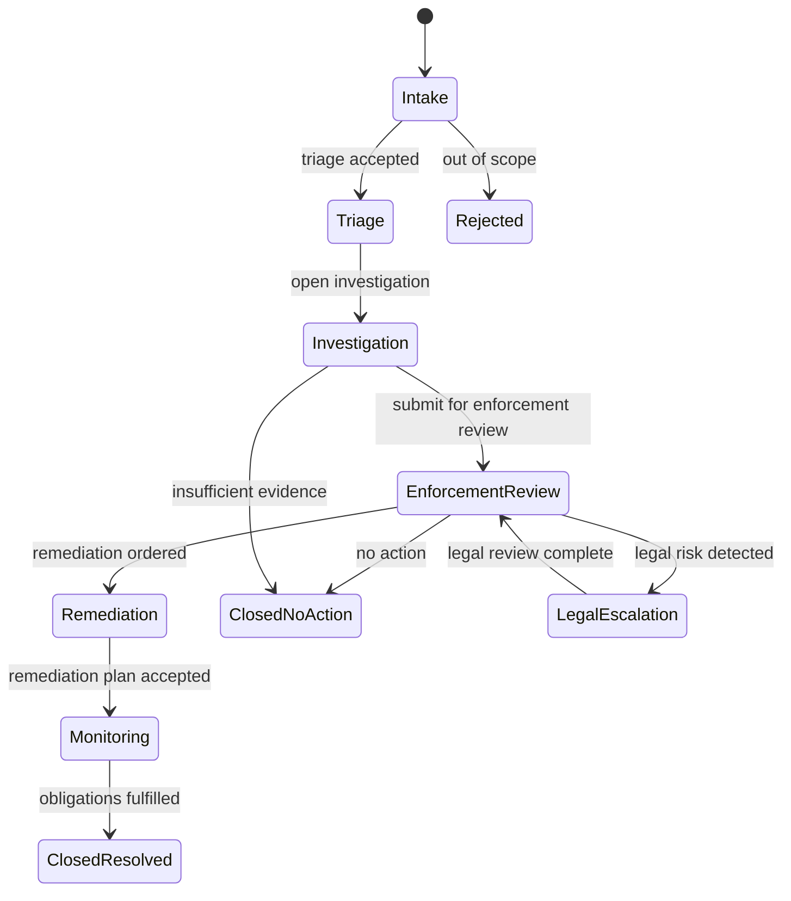
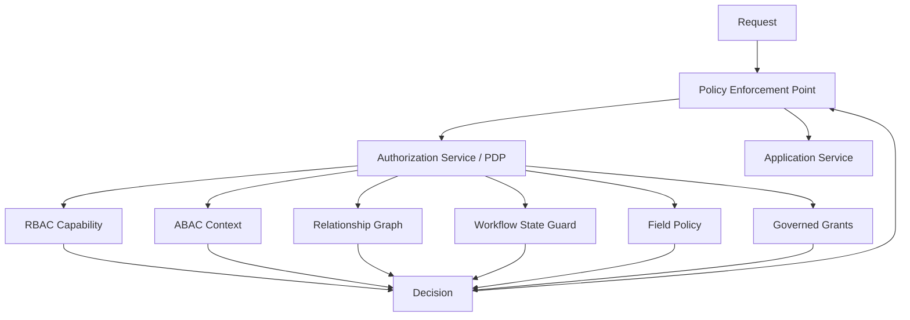
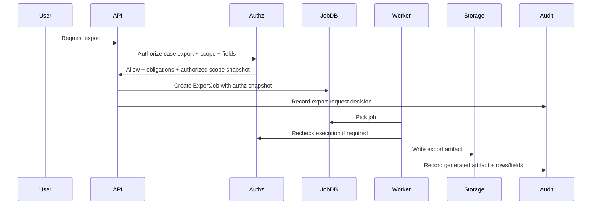
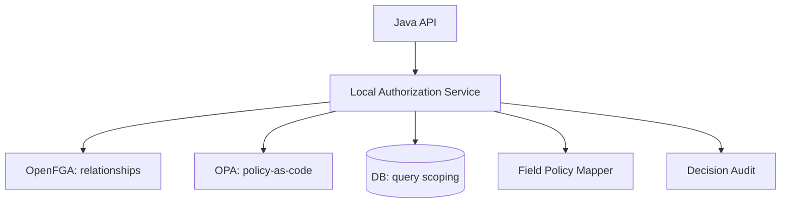
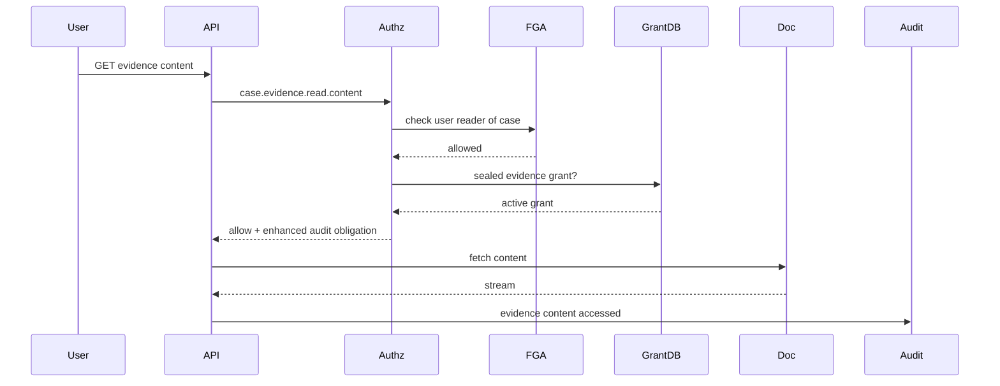
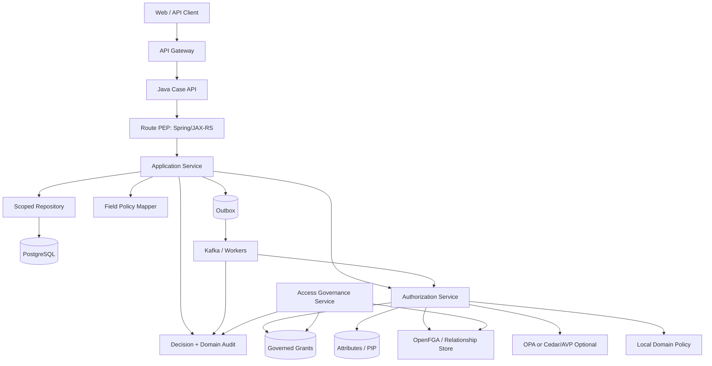

# Production-Grade Case Study: Regulatory Case Management Authorization

This final part combines the whole series into one production-grade case study.

We will design authorization for a regulatory enforcement case management platform. The system is not a toy CRUD app. It has workflow, evidence, assignment, jurisdiction, confidentiality, tenant isolation, maker-checker, audit, delegation, escalation, external participants, async jobs, exports, and operational governance.

The goal is not to memorize a pattern. The goal is to learn how a top-tier engineer thinks about authorization from first principles and turns that thinking into Java architecture.

---

## 1. Business Context

The platform supports a regulatory authority that handles enforcement cases.

Core lifecycle:



The domain has several resource types:

| Resource | Description |
|---|---|
| `Case` | Main enforcement case aggregate. |
| `Party` | Regulated entity, individual, or organization involved in a case. |
| `Evidence` | Documents, files, notes, interview transcripts, system exports. |
| `Finding` | Allegation, issue, violation, or risk finding. |
| `RemediationPlan` | Required action plan for regulated party. |
| `Task` | Workflow task assigned to users or groups. |
| `DecisionRecord` | Approval, escalation, closure, or enforcement decision. |
| `AuditEvent` | Immutable trace of actions and authorization decisions. |
| `ExportJob` | Async export/report generation request. |

The actors:

| Actor | Typical Access |
|---|---|
| Intake Officer | Create intake, view own intake queue. |
| Case Analyst | Work assigned cases, add notes/findings. |
| Senior Investigator | View and manage investigation cases in jurisdiction. |
| Enforcement Approver | Approve transitions to enforcement/remediation. |
| Legal Reviewer | Access cases escalated for legal review. |
| Evidence Custodian | Manage sealed evidence access. |
| Regional Supervisor | View cases in region, assign analysts. |
| National Supervisor | Cross-region oversight. |
| External Auditor | Time-bound read-only review access. |
| Regulated Entity User | Access only their own remediation submissions. |
| System Worker | Process jobs/events with narrow service permissions. |
| Security Officer | Break-glass approval, audit review. |
| Platform Admin | Manage technical config, not automatically view sensitive case data. |

The main authorization problem:

> A subject may perform an action only if their role/capability, relationship to the case, jurisdiction, case state, evidence classification, task assignment, delegation, conflict-of-interest rules, tenant boundary, and operational governance all allow it.

---

## 2. Security Objectives

We want these invariants:

1. A user from tenant A can never access tenant B data.
2. A subject cannot read a case unless they have a valid case relationship, scoped role, or explicit governed exception.
3. A subject cannot perform workflow transitions unless the transition is valid for the current state and the subject has transition authority.
4. A subject cannot approve a case transition they initiated or materially edited if SoD requires independent review.
5. Sensitive evidence requires evidence-specific access, not just case access.
6. Field-level data is redacted according to subject clearance and purpose.
7. Search, export, report, and async jobs are scoped by the same authorization rules as direct object access.
8. Every decision is auditable with subject, action, resource, context, policy version, reason code, and evidence.
9. Temporary, delegated, and break-glass access are visible, short-lived, and reviewable.
10. Policy changes and entitlement changes are testable and releasable safely.

---

## 3. Why Simple RBAC Fails

A naive implementation:

```java
@PreAuthorize("hasRole('CASE_ANALYST')")
@GetMapping("/cases/{caseId}")
CaseDto getCase(@PathVariable String caseId) {
    return caseService.get(caseId);
}
```

This fails because it ignores:

- tenant,
- region,
- jurisdiction,
- assignment,
- case confidentiality,
- evidence classification,
- case state,
- ownership,
- conflicts of interest,
- temporary access,
- external users,
- field redaction,
- query scoping.

Another bad implementation:

```java
if (user.hasRole("ADMIN")) {
    return caseRepository.findById(caseId).get();
}
```

This turns `ADMIN` into a data exfiltration role.

In a regulatory system, platform administration and case data authority must be separate.

---

## 4. Hybrid Authorization Model

The case study uses hybrid authorization.

| Model | Used For |
|---|---|
| RBAC | Coarse-grained capability: analyst, supervisor, approver, legal reviewer. |
| ABAC | Jurisdiction, clearance, case state, risk, time, classification, purpose. |
| ReBAC | Case assignment, team membership, party relationship, delegated access. |
| PBAC | Centralized governed rules, high-risk policy, break-glass, SoD. |
| Query scoping | Authorize list/search/export by construction. |
| Field-level authorization | Redaction, masking, writable-field control. |
| Governance | Request/approval/review/revocation of access. |



---

## 5. Domain Authorization Vocabulary

Stable vocabulary is the foundation.

Actions:

```text
case.create
case.read
case.search
case.update.metadata
case.assign
case.comment.add
case.finding.create
case.finding.update
case.transition.triage_accept
case.transition.open_investigation
case.transition.submit_enforcement_review
case.transition.approve_enforcement
case.transition.close_no_action
case.transition.escalate_legal
case.evidence.attach
case.evidence.read.metadata
case.evidence.read.content
case.evidence.read.sealed
case.evidence.redact
case.export
case.report.generate
case.breakglass.read
access.request.submit
access.request.approve
access.grant.revoke
```

Resource types:

```text
case
case:evidence
case:finding
case:task
case:decision-record
case:export-job
party
access-grant
access-request
```

Context attributes:

```text
tenantId
subjectId
subjectType
roles
groups
jurisdiction
region
department
clearanceLevel
employmentStatus
caseId
caseState
caseRegion
caseJurisdiction
caseConfidentiality
caseAssignedTeam
caseAssignedAnalyst
evidenceClassification
evidenceSealed
actionPurpose
timeOfDay
requestChannel
breakGlassSession
policyVersion
```

---

## 6. Case Aggregate

A simplified domain model:

```java
public record CaseId(String value) {}
public record TenantId(String value) {}
public record SubjectId(String value) {}

public enum CaseState {
    INTAKE,
    TRIAGE,
    INVESTIGATION,
    ENFORCEMENT_REVIEW,
    LEGAL_ESCALATION,
    REMEDIATION,
    MONITORING,
    CLOSED_NO_ACTION,
    CLOSED_RESOLVED,
    REJECTED
}

public enum ConfidentialityLevel {
    PUBLIC,
    INTERNAL,
    RESTRICTED,
    SEALED
}

public record CaseRecord(
    CaseId id,
    TenantId tenantId,
    String region,
    String jurisdiction,
    CaseState state,
    ConfidentialityLevel confidentiality,
    SubjectId createdBy,
    Optional<SubjectId> assignedAnalyst,
    Optional<String> assignedTeamId,
    Optional<SubjectId> lastMaterialEditor,
    long version
) {}
```

A resource reference:

```java
public record ResourceRef(
    String type,
    String id,
    TenantId tenantId,
    Map<String, Object> attributes
) {
    public static ResourceRef fromCase(CaseRecord c) {
        return new ResourceRef(
            "case",
            c.id().value(),
            c.tenantId(),
            Map.of(
                "region", c.region(),
                "jurisdiction", c.jurisdiction(),
                "state", c.state().name(),
                "confidentiality", c.confidentiality().name(),
                "assignedAnalyst", c.assignedAnalyst().map(SubjectId::value).orElse(""),
                "assignedTeamId", c.assignedTeamId().orElse("")
            )
        );
    }
}
```

---

## 7. Authorization Request Contract

Use a typed request that can represent runtime and governance checks.

```java
public record AuthorizationRequest(
    Subject subject,
    String action,
    ResourceRef resource,
    Map<String, Object> context,
    EvaluationOptions options
) {}

public record Subject(
    SubjectId id,
    TenantId tenantId,
    Set<String> roles,
    Set<String> groups,
    Set<String> permissions,
    Map<String, Object> attributes,
    Optional<ImpersonationContext> impersonation,
    Optional<BreakGlassContext> breakGlass
) {}

public record AuthorizationDecision(
    boolean allowed,
    String reasonCode,
    List<String> matchedPolicies,
    List<Obligation> obligations,
    CacheDirective cacheDirective,
    AuditDirective auditDirective
) {
    public static AuthorizationDecision deny(String reason) {
        return new AuthorizationDecision(
            false,
            reason,
            List.of(),
            List.of(),
            CacheDirective.noStore(),
            AuditDirective.required()
        );
    }
}
```

A decision must be explicit. Do not return `boolean` for complex authorization.

---

## 8. Read Case Authorization

Business rule:

A subject may read a case if:

- same tenant,
- case is not sealed unless subject has sealed clearance or active break-glass,
- subject has one of:
  - assigned analyst relation,
  - member of assigned team,
  - supervisor scoped to case region,
  - legal reviewer relation when case is in legal escalation,
  - external auditor grant for that scope,
  - regulated entity relation for restricted remediation view,
- field-level policy redacts sensitive fields.

Pseudo-policy:

```text
allow case.read when
    subject.tenant == case.tenant
and (
    subject is assigned analyst of case
 or subject is member of assigned team of case
 or subject has role regional_supervisor scoped to case.region
 or subject has legal_reviewer and case.state == LEGAL_ESCALATION
 or subject has active external_auditor grant scoped to case
 or subject has active break_glass session
)
and not sealed_denied
```

Java implementation:

```java
public AuthorizationDecision canReadCase(Subject subject, CaseRecord record) {
    if (!subject.tenantId().equals(record.tenantId())) {
        return AuthorizationDecision.deny("TENANT_MISMATCH");
    }

    if (record.confidentiality() == ConfidentialityLevel.SEALED
        && !subjectHasSealedAccess(subject, record)
        && subject.breakGlass().isEmpty()) {
        return AuthorizationDecision.deny("SEALED_CASE_REQUIRES_SPECIAL_ACCESS");
    }

    if (record.assignedAnalyst().filter(subject.id()::equals).isPresent()) {
        return allow("CASE_ASSIGNED_ANALYST");
    }

    if (record.assignedTeamId().filter(team -> membership.isMember(subject.id(), team)).isPresent()) {
        return allow("CASE_ASSIGNED_TEAM_MEMBER");
    }

    if (hasRegionalSupervisorAccess(subject, record.region())) {
        return allow("REGIONAL_SUPERVISOR_SCOPE");
    }

    if (record.state() == CaseState.LEGAL_ESCALATION && hasLegalReviewAccess(subject, record)) {
        return allow("LEGAL_REVIEW_RELATION");
    }

    if (governedGrantService.hasActiveGrant(subject.id(), "EXTERNAL_AUDITOR_READ", record)) {
        return allow("EXTERNAL_AUDITOR_GRANT");
    }

    if (subject.breakGlass().isPresent()) {
        return allowWithObligation("BREAK_GLASS_ACTIVE", Obligation.enhancedAudit());
    }

    return AuthorizationDecision.deny("NO_CASE_READ_RELATION");
}
```

This is easy to read, but production systems usually split this into composable policy evaluators.

---

## 9. Query Scoping for Case Search

Never implement search as `find all then filter in memory`.

Bad:

```java
List<CaseRecord> all = caseRepository.search(criteria);
return all.stream()
    .filter(c -> authz.canReadCase(subject, c).allowed())
    .toList();
```

This breaks pagination, leaks counts, wastes memory, and may load sensitive data.

Better:

```java
public interface CaseScopeCompiler {
    CaseVisibilityScope compileReadScope(Subject subject);
}

public record CaseVisibilityScope(
    TenantId tenantId,
    Set<String> allowedRegions,
    Set<String> assignedTeamIds,
    boolean includeAssignedToSelf,
    boolean includeLegalEscalations,
    boolean includeExternalAuditScope,
    boolean includeBreakGlass,
    ConfidentialityLevel maxConfidentiality
) {}
```

Repository:

```java
public Page<CaseSummaryRow> searchVisibleCases(
    Subject subject,
    CaseSearchCriteria criteria,
    Pageable pageable
) {
    CaseVisibilityScope scope = scopeCompiler.compileReadScope(subject);
    return caseRepository.search(criteria, scope, pageable);
}
```

SQL shape:

```sql
select c.case_id,
       c.title,
       c.state,
       c.region,
       c.confidentiality,
       c.updated_at
from enforcement_case c
left join case_assignment ca
  on ca.case_id = c.case_id
left join team_membership tm
  on tm.team_id = ca.team_id
 and tm.subject_id = :subject_id
where c.tenant_id = :tenant_id
  and (
        ca.assigned_subject_id = :subject_id
     or tm.subject_id is not null
     or c.region = any(:supervised_regions)
     or exists (
          select 1
          from access_grant g
          where g.subject_id = :subject_id
            and g.status = 'ACTIVE'
            and g.entitlement_code = 'EXTERNAL_AUDITOR_READ'
            and g.scope_type in ('CASE', 'REGION')
            and (g.scope_id = c.case_id or g.scope_id = c.region)
            and now() >= g.effective_from
            and (g.effective_until is null or now() < g.effective_until)
       )
  )
  and c.confidentiality <= :max_confidentiality
order by c.updated_at desc
limit :limit offset :offset;
```

Authorize by construction.

---

## 10. Field-Level Authorization

A user who may read a case may not read every field.

Case detail DTO:

```java
public record CaseDetailDto(
    String caseId,
    String title,
    String state,
    String partyName,
    String allegationSummary,
    String internalRiskScore,
    String sealedEvidenceSummary,
    String legalAdvice,
    List<EvidenceDto> evidence,
    List<FindingDto> findings
) {}
```

Field policy:

| Field | Rule |
|---|---|
| `title` | Visible to case readers. |
| `partyName` | Visible to case readers unless legally masked. |
| `allegationSummary` | Visible to assigned users and supervisors. |
| `internalRiskScore` | Visible to internal users only. |
| `sealedEvidenceSummary` | Requires sealed evidence access. |
| `legalAdvice` | Requires legal reviewer or legal privilege access. |
| `evidence.content` | Requires evidence-level authorization. |

Mapper pattern:

```java
public CaseDetailDto toDto(Subject subject, CaseRecord record, CaseData data) {
    FieldDecision fields = fieldPolicy.evaluate(subject, record);

    return new CaseDetailDto(
        record.id().value(),
        data.title(),
        record.state().name(),
        fields.canRead("partyName") ? data.partyName() : "REDACTED",
        fields.canRead("allegationSummary") ? data.allegationSummary() : "REDACTED",
        fields.canRead("internalRiskScore") ? data.internalRiskScore() : null,
        fields.canRead("sealedEvidenceSummary") ? data.sealedEvidenceSummary() : "REDACTED",
        fields.canRead("legalAdvice") ? data.legalAdvice() : "REDACTED",
        evidenceMapper.toDtos(subject, record, data.evidence()),
        findingMapper.toDtos(subject, record, data.findings())
    );
}
```

Do not rely on UI hiding. The API response must be shaped by server-side authorization.

---

## 11. Writable Field Authorization

Update endpoints need write-field policy.

Bad:

```java
caseMapper.updateEntityFromRequest(request, entity);
caseRepository.save(entity);
```

If request includes `assignedAnalyst`, `state`, `riskScore`, or `sealed`, mass assignment can bypass domain rules.

Better:

```java
public void updateCaseMetadata(Subject subject, CaseId caseId, UpdateCaseRequest request) {
    CaseRecord record = caseRepository.getRequired(caseId);

    authz.requireAllowed(subject, "case.update.metadata", ResourceRef.fromCase(record));

    WritableFieldDecision writable = fieldPolicy.writableFields(subject, record, "case.update.metadata");

    CaseUpdateCommand command = new CaseUpdateCommand();

    if (request.title().isPresent()) {
        writable.requireWritable("title");
        command.setTitle(request.title().get());
    }

    if (request.priority().isPresent()) {
        writable.requireWritable("priority");
        command.setPriority(request.priority().get());
    }

    if (request.assignedAnalyst().isPresent()) {
        writable.requireWritable("assignedAnalyst");
        throw new BadRequestException("Use assignment endpoint");
    }

    caseDomainService.updateMetadata(record, command);
}
```

State and assignment are not normal metadata. They get dedicated commands.

---

## 12. Workflow Transition Authorization

Workflow transition is both domain validation and authorization.

Example transition: `INVESTIGATION -> ENFORCEMENT_REVIEW`.

Rules:

- case must be in `INVESTIGATION`,
- subject must be assigned investigator or supervisor,
- required findings must exist,
- subject must not be under conflict-of-interest hold,
- subject must not submit if case is sealed and they lack sealed access,
- transition creates approval task for enforcement approver.

Java:

```java
public void submitForEnforcementReview(Subject subject, CaseId caseId) {
    CaseRecord record = caseRepository.getRequired(caseId);

    AuthorizationDecision decision = authz.evaluate(new AuthorizationRequest(
        subject,
        "case.transition.submit_enforcement_review",
        ResourceRef.fromCase(record),
        Map.of(
            "fromState", record.state().name(),
            "toState", CaseState.ENFORCEMENT_REVIEW.name(),
            "hasRequiredFindings", findingRepository.hasRequiredFindings(caseId),
            "lastMaterialEditor", record.lastMaterialEditor().map(SubjectId::value).orElse("")
        ),
        EvaluationOptions.defaultOptions()
    ));

    if (!decision.allowed()) {
        throw new AccessDeniedException(decision.reasonCode());
    }

    domainRules.requireTransitionAllowed(record, CaseState.ENFORCEMENT_REVIEW);
    domainRules.requireRequiredFindings(caseId);

    workflowService.submitForEnforcementReview(caseId, subject.id());
    audit.recordDecision(decision);
}
```

Do not put all state rules in authorization. Domain invariants and authorization constraints are related but not identical.

---

## 13. Maker-Checker Approval

Approving enforcement action is high-risk.

Rule:

An enforcement approver may approve if:

- same tenant,
- has `case.transition.approve_enforcement`,
- scoped to jurisdiction/region,
- case is in `ENFORCEMENT_REVIEW`,
- approver is not the submitter,
- approver is not last material editor,
- approver has no conflict relationship with regulated party,
- required evidence is available,
- legal review is complete if legal risk exists.

```java
public AuthorizationDecision canApproveEnforcement(Subject subject, CaseRecord record) {
    if (record.state() != CaseState.ENFORCEMENT_REVIEW) {
        return deny("CASE_NOT_IN_ENFORCEMENT_REVIEW");
    }

    if (!hasPermission(subject, "case.transition.approve_enforcement")) {
        return deny("MISSING_APPROVE_PERMISSION");
    }

    if (!regionScope.allows(subject, record.region())) {
        return deny("REGION_SCOPE_DENIED");
    }

    SubjectId submitter = decisionRecordRepository.findSubmitter(record.id(), "SUBMIT_ENFORCEMENT_REVIEW");
    if (subject.id().equals(submitter)) {
        return deny("SOD_SUBMITTER_CANNOT_APPROVE");
    }

    if (record.lastMaterialEditor().filter(subject.id()::equals).isPresent()) {
        return deny("SOD_MATERIAL_EDITOR_CANNOT_APPROVE");
    }

    if (conflictService.hasConflict(subject.id(), record.id())) {
        return deny("CONFLICT_OF_INTEREST");
    }

    return allow("ENFORCEMENT_APPROVER_SCOPE_AND_SOD_OK");
}
```

This is where authorization becomes business process control.

---

## 14. Evidence Authorization

Evidence requires stricter rules than case metadata.

Evidence model:

```java
public enum EvidenceClassification {
    NORMAL,
    CONFIDENTIAL,
    RESTRICTED,
    SEALED,
    LEGAL_PRIVILEGED
}

public record EvidenceRecord(
    String evidenceId,
    CaseId caseId,
    TenantId tenantId,
    EvidenceClassification classification,
    boolean sealed,
    SubjectId uploadedBy,
    Instant uploadedAt
) {}
```

Evidence access rules:

| Action | Rule |
|---|---|
| Read metadata | Case read + classification metadata visible. |
| Read content | Case read + evidence read permission + classification clearance. |
| Read sealed content | Explicit sealed evidence grant or break-glass. |
| Redact evidence | Evidence custodian or legal reviewer with specific authority. |
| Delete evidence | Usually forbidden; use retention/legal process. |
| Export evidence | Export permission + classification clearance + audit obligation. |

```java
public AuthorizationDecision canReadEvidenceContent(Subject subject, EvidenceRecord evidence, CaseRecord record) {
    AuthorizationDecision caseRead = canReadCase(subject, record);
    if (!caseRead.allowed()) {
        return deny("CASE_READ_REQUIRED_FOR_EVIDENCE");
    }

    if (!hasPermission(subject, "case.evidence.read.content")) {
        return deny("MISSING_EVIDENCE_CONTENT_PERMISSION");
    }

    if (evidence.classification() == EvidenceClassification.SEALED
        && !governedGrantService.hasActiveGrant(subject.id(), "SEALED_EVIDENCE_ACCESS", record)
        && subject.breakGlass().isEmpty()) {
        return deny("SEALED_EVIDENCE_ACCESS_REQUIRED");
    }

    if (evidence.classification() == EvidenceClassification.LEGAL_PRIVILEGED
        && !hasPermission(subject, "case.evidence.read.legal_privileged")) {
        return deny("LEGAL_PRIVILEGE_ACCESS_REQUIRED");
    }

    return allowWithObligation("EVIDENCE_ACCESS_ALLOWED", Obligation.enhancedAudit());
}
```

Evidence access should almost always produce enhanced audit logs.

---

## 15. Regulated Entity Portal Authorization

External regulated entity users are not internal users.

They may access only:

- their organization profile,
- remediation tasks assigned to their entity,
- submissions they are allowed to edit,
- public or party-visible case summaries,
- notices served to them.

They must not see internal notes, evidence, risk scores, legal advice, internal findings, or other parties.

Relationship model:

```text
organization:ORG-1#member@user:external-9
case:CASE-1#party@organization:ORG-1
case:CASE-1#remediation_submitter@organization:ORG-1#member
```

Policy:

```text
allow remediation.submit when
    user is member of organization
and organization is party of case
and case.state in [REMEDIATION, MONITORING]
and remediation window is open
```

DTO shaping must use an external view model.

Do not reuse internal case DTO and hope redaction is enough.

---

## 16. Service-to-Service Authorization

Workers and services need authorization too.

Examples:

| Service | Allowed Actions |
|---|---|
| `case-indexer` | Read authorized projection fields after case event. |
| `notification-service` | Read notification-safe fields. |
| `export-worker` | Generate export based on snapshot authorized at request time. |
| `audit-service` | Append audit events, not read all case content. |
| `workflow-engine` | Create tasks and transition workflow state through controlled commands. |
| `document-service` | Store/retrieve evidence only after domain authorization token. |

Service permissions should be narrow and purpose-bound.

Do not let internal network equal full trust.

---

## 17. Async Export Authorization

Export is high risk because it moves data out of online controls.

Flow:



Export job model:

```java
public record ExportAuthorizationSnapshot(
    SubjectId requestedBy,
    String action,
    String scopeExpression,
    Set<String> allowedFields,
    String policyVersion,
    Instant authorizedAt,
    Instant expiresAt,
    String decisionId
) {}
```

Rules:

- authorize export request before enqueue,
- store authorized scope snapshot,
- recheck for long-running/high-risk jobs,
- bind output fields to field-level policy,
- record row count and field set,
- expire download URLs,
- audit download separately from generation.

---

## 18. OpenFGA Model Option

For ReBAC-heavy case relationships, OpenFGA/Zanzibar-style model is useful.

Example model sketch:

```text
model
  schema 1.1

type user

type team
  relations
    define member: [user]

type region
  relations
    define supervisor: [user]

type organization
  relations
    define member: [user]

type case
  relations
    define assigned_analyst: [user]
    define assigned_team: [team]
    define party: [organization]
    define legal_reviewer: [user]
    define external_auditor: [user]
    define regional_supervisor: supervisor from region

    define reader: assigned_analyst or member from assigned_team or legal_reviewer or external_auditor or regional_supervisor
    define commenter: assigned_analyst or member from assigned_team
    define assignee_manager: regional_supervisor
```

Tuple examples:

```text
case:CASE-101#assigned_analyst@user:analyst-7
case:CASE-101#assigned_team@team:INV-JK-2
team:INV-JK-2#member@user:analyst-8
organization:ORG-99#member@user:external-5
case:CASE-101#party@organization:ORG-99
case:CASE-101#region@region:ID-JK
region:ID-JK#supervisor@user:supervisor-1
```

Java check:

```java
ClientCheckRequest request = new ClientCheckRequest()
    .user("user:" + subject.id().value())
    .relation("reader")
    ._object("case:" + caseId.value());

ClientCheckResponse response = openFgaClient.check(request).get();
if (!Boolean.TRUE.equals(response.getAllowed())) {
    return deny("NO_CASE_RELATIONSHIP");
}
```

OpenFGA is strong for relationship checks. It should not hold every ABAC rule. Jurisdiction, state, clearance, and evidence classification may remain in Java/PDP unless modeled with contextual conditions.

---

## 19. OPA Model Option

OPA is useful when policy logic is complex and centralized across services.

Input document:

```json
{
  "subject": {
    "id": "user:analyst-7",
    "tenant": "tenant:regulator-id",
    "roles": ["case_analyst"],
    "region": "ID-JK",
    "clearance": "RESTRICTED"
  },
  "action": "case.transition.submit_enforcement_review",
  "resource": {
    "type": "case",
    "id": "CASE-101",
    "tenant": "tenant:regulator-id",
    "region": "ID-JK",
    "state": "INVESTIGATION",
    "confidentiality": "RESTRICTED",
    "assignedAnalyst": "user:analyst-7"
  },
  "context": {
    "hasRequiredFindings": true,
    "lastMaterialEditor": "user:analyst-8",
    "businessHours": true
  }
}
```

Rego sketch:

```rego
package authz.case

default allow := false

allow if {
  input.subject.tenant == input.resource.tenant
  input.action == "case.transition.submit_enforcement_review"
  input.resource.state == "INVESTIGATION"
  input.context.hasRequiredFindings
  input.resource.assignedAnalyst == input.subject.id
}

deny_reason contains "TENANT_MISMATCH" if {
  input.subject.tenant != input.resource.tenant
}

deny_reason contains "CASE_STATE_INVALID" if {
  input.action == "case.transition.submit_enforcement_review"
  input.resource.state != "INVESTIGATION"
}
```

Java adapter:

```java
public AuthorizationDecision evaluateWithOpa(AuthorizationRequest request) {
    OpaDecisionResponse response = opaClient.query("/v1/data/authz/case", request);
    if (response.result().allow()) {
        return allow("OPA_ALLOW", response.result().matchedPolicies());
    }
    return deny(response.result().primaryDenyReason());
}
```

OPA is strong for policy-as-code, testing, and centralized decision logic. It requires disciplined input schemas and latency/failure handling.

---

## 20. Cedar / Amazon Verified Permissions Option

Cedar is useful for policy-based principal-action-resource-context authorization.

Conceptual Cedar policy:

```cedar
permit(
  principal in Role::"RegionalSupervisor",
  action == Action::"case::read",
  resource
)
when {
  principal.tenant == resource.tenant &&
  principal.region == resource.region &&
  resource.confidentiality != "SEALED"
};

forbid(
  principal,
  action == Action::"case::approve_enforcement",
  resource
)
when {
  resource.lastMaterialEditor == principal.id
};
```

Java/Amazon Verified Permissions adapter shape:

```java
public AuthorizationDecision evaluateWithAvp(AuthorizationRequest req) {
    IsAuthorizedRequest avpReq = IsAuthorizedRequest.builder()
        .policyStoreId(policyStoreId)
        .principal(entityIdentifier("User", req.subject().id().value()))
        .action(actionIdentifier(req.action()))
        .resource(entityIdentifier(req.resource().type(), req.resource().id()))
        .context(contextFrom(req.context()))
        .entities(entitiesFrom(req))
        .build();

    IsAuthorizedResponse response = verifiedPermissionsClient.isAuthorized(avpReq);

    return switch (response.decision()) {
        case ALLOW -> allow("AVP_ALLOW");
        case DENY -> deny("AVP_DENY");
    };
}
```

Cedar/AVP is strong when you need managed policy stores, Cedar policy semantics, schema validation, and application-level fine-grained authorization. You still need query scoping and data-layer design.

---

## 21. Local Java PDP Option

A local Java PDP can be best when:

- policy is tightly coupled to domain invariants,
- latency must be extremely low,
- team is not ready for external PDP operations,
- policy changes are deployed with code,
- explainability can be built in Java,
- domain model is rapidly evolving.

Structure:

```java
public interface PolicyRule {
    boolean supports(String action, String resourceType);
    RuleDecision evaluate(AuthorizationRequest request);
}

public final class CompositeAuthorizationService {
    private final List<PolicyRule> rules;

    public AuthorizationDecision evaluate(AuthorizationRequest request) {
        List<RuleDecision> decisions = rules.stream()
            .filter(r -> r.supports(request.action(), request.resource().type()))
            .map(r -> r.evaluate(request))
            .toList();

        Optional<RuleDecision> explicitDeny = decisions.stream()
            .filter(RuleDecision::explicitDeny)
            .findFirst();

        if (explicitDeny.isPresent()) {
            return AuthorizationDecision.deny(explicitDeny.get().reasonCode());
        }

        boolean allowed = decisions.stream().anyMatch(RuleDecision::allow);
        return allowed
            ? allow("LOCAL_POLICY_ALLOW")
            : AuthorizationDecision.deny("NO_MATCHING_ALLOW_POLICY");
    }
}
```

Local Java policy is not inferior. It becomes dangerous only when scattered, stringly typed, untested, or unaudited.

---

## 22. Selection Guide: Java vs OPA vs Cedar vs OpenFGA

| Need | Strong Option |
|---|---|
| Relationship graph: case/team/org/document sharing | OpenFGA/Zanzibar-style |
| Complex declarative cross-service policy | OPA |
| Managed policy store with principal/action/resource/context | Cedar / Amazon Verified Permissions |
| Domain-invariant-heavy local workflow checks | Java PDP |
| Very low latency with rich domain model | Java PDP + query scoping |
| Central governance and policy review | OPA/Cedar + policy CI/CD |
| List/search scoping | Database query scoping, possibly supported by ReBAC materialization |
| Field redaction | Java DTO/mapper policy, sometimes PDP assisted |
| Workflow transitions | Java domain service + PDP decision |

A realistic enterprise architecture may combine them:



Do not choose a tool to avoid modeling. Tooling amplifies your model, good or bad.

---

## 23. End-to-End Request Walkthrough: Read Evidence

Scenario:

`user:analyst-7` requests `GET /cases/CASE-101/evidence/EV-55/content`.

Steps:

1. API authenticates caller and builds `Subject`.
2. Evidence API loads minimal evidence metadata by ID and tenant-safe lookup.
3. Case API loads minimal case metadata.
4. PEP asks PDP for `case.evidence.read.content`.
5. PDP checks tenant match.
6. PDP checks case relationship via OpenFGA or local relationship repository.
7. PDP checks evidence classification and sealed status.
8. PDP checks active governed grant if sealed.
9. PDP checks break-glass if normal grant absent.
10. PDP returns allow/deny with obligations.
11. PEP applies obligation: enhanced audit.
12. Document service fetches content using service authorization token or signed internal request.
13. API streams content.
14. Audit records access with evidence ID, classification, subject, reason, decision ID.



---

## 24. End-to-End Request Walkthrough: Approve Enforcement

Scenario:

`user:approver-3` requests `POST /cases/CASE-101/transitions/approve-enforcement`.

Checks:

- tenant match,
- permission `case.transition.approve_enforcement`,
- region/jurisdiction scope,
- case state is `ENFORCEMENT_REVIEW`,
- subject is not submitter,
- subject is not last material editor,
- subject has no conflict with party,
- legal review complete if legal risk flag exists,
- approval action is recorded immutably.

The transition command should be idempotent and concurrency-safe.

```java
@Transactional
public void approveEnforcement(Subject subject, CaseId caseId, ApproveRequest request) {
    CaseRecord record = caseRepository.getForUpdate(caseId);

    AuthorizationDecision decision = authz.evaluate(AuthorizationRequestBuilder
        .forSubject(subject)
        .action("case.transition.approve_enforcement")
        .resource(ResourceRef.fromCase(record))
        .context(Map.of(
            "submitter", decisionRecordRepository.submitter(caseId),
            "lastMaterialEditor", record.lastMaterialEditor().map(SubjectId::value).orElse(""),
            "legalRisk", legalRiskService.hasLegalRisk(caseId),
            "legalReviewComplete", legalReviewService.isComplete(caseId)
        ))
        .build());

    decision.requireAllowed();

    caseDomainService.approveEnforcement(record, subject.id(), request.comment());
    decisionRecordRepository.append(caseId, subject.id(), "APPROVE_ENFORCEMENT", request.comment());
    audit.recordDecision(decision);
}
```

Use optimistic or pessimistic locking to avoid approving a stale state.

---

## 25. Batch Case Assignment

Scenario:

Supervisor assigns 100 cases to analyst.

Rules:

- supervisor can assign cases only in their region,
- each case must be assignable in its current state,
- analyst must be eligible for each case jurisdiction,
- sealed cases require special assignment authority,
- partial success must be explicit,
- every item result must have reason code.

API shape:

```json
{
  "targetAnalyst": "user:analyst-8",
  "caseIds": ["CASE-1", "CASE-2", "CASE-3"],
  "reason": "Rebalance Jakarta investigation queue"
}
```

Response:

```json
{
  "results": [
    {"caseId": "CASE-1", "status": "ASSIGNED"},
    {"caseId": "CASE-2", "status": "DENIED", "reasonCode": "REGION_SCOPE_DENIED"},
    {"caseId": "CASE-3", "status": "DENIED", "reasonCode": "SEALED_ASSIGNMENT_REQUIRES_SPECIAL_AUTHORITY"}
  ]
}
```

Batch authorization must not become all-or-nothing unless the business requires atomicity.

---

## 26. Audit Model

Decision audit event:

```json
{
  "eventType": "AUTHORIZATION_DECISION",
  "decisionId": "dec-01JZ...",
  "tenantId": "tenant:regulator-id",
  "subject": "user:approver-3",
  "action": "case.transition.approve_enforcement",
  "resourceType": "case",
  "resourceId": "CASE-101",
  "decision": "DENY",
  "reasonCode": "SOD_SUBMITTER_CANNOT_APPROVE",
  "matchedPolicies": ["case-approval-sod-v3"],
  "policyVersion": "authz-policy-2026.07.03",
  "requestContext": {
    "caseState": "ENFORCEMENT_REVIEW",
    "region": "ID-JK"
  },
  "correlationId": "req-...",
  "occurredAt": "2026-07-03T10:11:12Z"
}
```

For sensitive allows, log more:

```json
{
  "eventType": "SENSITIVE_DATA_ACCESS",
  "subject": "user:analyst-7",
  "action": "case.evidence.read.sealed",
  "caseId": "CASE-101",
  "evidenceId": "EV-55",
  "classification": "SEALED",
  "grantId": "grant:991",
  "breakGlassSessionId": null,
  "decisionId": "dec-01JZ..."
}
```

Audit must be useful for both security investigation and regulatory defensibility.

---

## 27. Authorization Test Matrix

A sample matrix:

| Subject | Case Relation | State | Classification | Action | Expected |
|---|---|---|---|---|---|
| Assigned analyst | assigned | Investigation | Restricted | case.read | Allow |
| Unassigned analyst same region | none | Investigation | Restricted | case.read | Deny |
| Regional supervisor | region match | Investigation | Restricted | case.assign | Allow |
| Regional supervisor | different region | Investigation | Restricted | case.assign | Deny |
| Submitter | submitted review | Enforcement Review | Restricted | approve enforcement | Deny |
| Independent approver | scoped | Enforcement Review | Restricted | approve enforcement | Allow |
| External auditor | governed grant | Any | Internal | case.read | Allow with redaction |
| External auditor | governed grant | Any | Sealed | read sealed evidence | Deny |
| Evidence custodian | scoped | Any | Sealed | read sealed evidence | Allow enhanced audit |
| Platform admin | no case relation | Any | Any | case.read | Deny |
| Break-glass security officer | active session | Any | Sealed | case.read | Allow enhanced audit |

Executable test style:

```java
@ParameterizedTest
@MethodSource("caseReadScenarios")
void caseReadPolicyMatchesMatrix(CaseReadScenario s) {
    AuthorizationDecision d = authz.evaluate(s.toRequest());
    assertThat(d.allowed()).isEqualTo(s.expectedAllowed());
    assertThat(d.reasonCode()).isEqualTo(s.expectedReasonCode());
}
```

Golden matrices should live with policy code.

---

## 28. Abuse Tests

Test attacker behavior directly.

Examples:

```text
1. Analyst changes /cases/{id} to another analyst's case.
2. External user changes organization ID in request body.
3. User requests evidence ID from a case they can read but evidence they cannot read.
4. User sorts search results by hidden risk score.
5. User filters by hidden sealed flag.
6. User submits PATCH with state=APPROVED.
7. User bulk assigns mixed-region cases.
8. User replays old export job after access revoked.
9. Worker processes job after requester access expired.
10. Support user impersonates customer and performs blocked internal action.
11. Approver approves their own submitted enforcement transition.
12. Admin edits role to include export permission without approval.
```

Authorization testing is mostly negative testing.

---

## 29. Performance Design

Latency risks:

- one PDP call per row,
- one graph check per list item,
- expensive attribute lookup,
- field policy per nested object,
- cache invalidation storms,
- policy engine network timeout,
- relationship graph expansion.

Design:

- compile query scopes for list/search,
- batch authorization for bulk operations,
- cache stable attributes with short TTL,
- do not cache high-risk allows too long,
- include policy version and grant version in cache key,
- use OpenFGA list APIs or materialized access views for listing,
- use local Java decisions for cheap domain checks,
- use external PDP for coarse decision where practical,
- measure p95/p99 authorization latency separately.

Cache key example:

```text
decision:v3:{subjectId}:{action}:{resourceType}:{resourceId}:{policyVersion}:{subjectGrantVersion}:{resourceAuthzVersion}
```

Never cache without knowing what invalidates the cache.

---

## 30. Data Model: Access Tables

Core tables:

```sql
create table enforcement_case (
    case_id text primary key,
    tenant_id text not null,
    region text not null,
    jurisdiction text not null,
    state text not null,
    confidentiality text not null,
    created_by text not null,
    assigned_analyst text,
    assigned_team_id text,
    last_material_editor text,
    version bigint not null
);

create table case_assignment (
    case_id text not null,
    subject_id text,
    team_id text,
    assignment_type text not null,
    assigned_by text not null,
    assigned_at timestamptz not null
);

create table case_conflict (
    case_id text not null,
    subject_id text not null,
    conflict_type text not null,
    active boolean not null,
    primary key (case_id, subject_id, conflict_type)
);

create table evidence_record (
    evidence_id text primary key,
    case_id text not null,
    tenant_id text not null,
    classification text not null,
    sealed boolean not null,
    uploaded_by text not null,
    uploaded_at timestamptz not null
);
```

Indexes:

```sql
create index idx_case_tenant_region_state
    on enforcement_case(tenant_id, region, state);

create index idx_case_assigned_analyst
    on enforcement_case(tenant_id, assigned_analyst);

create index idx_case_assignment_subject
    on case_assignment(subject_id, case_id);

create index idx_evidence_case_classification
    on evidence_record(case_id, classification, sealed);
```

Authorization architecture is partly database architecture.

---

## 31. API Design

Endpoint design should reflect action semantics:

```http
GET    /cases
POST   /cases
GET    /cases/{caseId}
PATCH  /cases/{caseId}/metadata
POST   /cases/{caseId}/assignments
POST   /cases/{caseId}/comments
POST   /cases/{caseId}/findings
POST   /cases/{caseId}/transitions/submit-enforcement-review
POST   /cases/{caseId}/transitions/approve-enforcement
POST   /cases/{caseId}/transitions/close-no-action
GET    /cases/{caseId}/evidence
POST   /cases/{caseId}/evidence
GET    /cases/{caseId}/evidence/{evidenceId}/content
POST   /cases/{caseId}/exports
GET    /exports/{exportJobId}
```

Avoid generic endpoints like:

```http
POST /cases/{caseId}/transition
PATCH /cases/{caseId}
POST /admin/do
```

Generic endpoints make authorization ambiguous. Specific commands make action mapping precise.

---

## 32. Spring Security Integration

Request-level route guard:

```java
@Bean
SecurityFilterChain security(HttpSecurity http) throws Exception {
    return http
        .authorizeHttpRequests(auth -> auth
            .requestMatchers(HttpMethod.GET, "/cases/**").authenticated()
            .requestMatchers("/admin/**").hasAuthority("access.admin.route")
            .anyRequest().denyAll()
        )
        .oauth2ResourceServer(oauth -> oauth.jwt(Customizer.withDefaults()))
        .build();
}
```

Application-level guard:

```java
@Service
public class CaseApplicationService {
    public CaseDetailDto getCase(Subject subject, CaseId caseId) {
        CaseRecord record = caseRepository.getRequiredTenantSafe(subject.tenantId(), caseId);
        authz.requireAllowed(subject, "case.read", ResourceRef.fromCase(record));
        CaseData data = caseDataRepository.loadCaseData(caseId);
        return caseMapper.toDto(subject, record, data);
    }
}
```

Method annotation can help, but object-level checks belong where the object context is available.

---

## 33. JAX-RS/Jersey Integration

Resource filter for route metadata:

```java
@NameBinding
@Retention(RUNTIME)
@Target({TYPE, METHOD})
public @interface RequiresAction {
    String value();
}

@Provider
@RequiresAction("")
public class AuthorizationFilter implements ContainerRequestFilter {
    @Context ResourceInfo resourceInfo;

    @Override
    public void filter(ContainerRequestContext ctx) {
        RequiresAction annotation = findAnnotation(resourceInfo);
        if (annotation == null) {
            throw new ForbiddenException("Missing authorization annotation");
        }
        // Route-level guard only. Object-level guard happens in application service.
    }
}
```

Resource:

```java
@Path("/cases")
public class CaseResource {
    @GET
    @Path("/{caseId}")
    @RequiresAction("case.read")
    public CaseDetailDto get(@PathParam("caseId") String caseId) {
        Subject subject = subjectProvider.currentSubject();
        return caseApplicationService.getCase(subject, new CaseId(caseId));
    }
}
```

Route metadata helps consistency; domain object guard still does the real work.

---

## 34. Operational Governance in the Case Study

Entitlements:

| Entitlement | Scope | Duration | Approval |
|---|---|---|---|
| Case Analyst | region/team | employment-based | manager |
| Regional Supervisor | region | employment-based | director + governance owner |
| Enforcement Approver | jurisdiction | 180 days | manager + enforcement owner |
| Sealed Evidence Reviewer | case/region | max 14 days | evidence custodian + security |
| External Auditor | case/portfolio | max 30 days | sponsor + legal/compliance |
| Break-Glass Case Reader | tenant | max 4 hours | security officer or emergency activation + post review |
| Policy Admin | domain | 90 days | platform owner + security |

Access review:

- high-risk entitlements every 30 or 90 days,
- external access every 30 days,
- dormant evidence access reviewed after 14 days of non-use,
- privileged access reviewed after every activation,
- supervisor access reviewed on department/region change.

SoD:

- submitter cannot approve same transition,
- material editor cannot approve enforcement,
- evidence uploader cannot be sole evidence verifier,
- access request requester cannot approve own high-risk access,
- policy author cannot be sole publisher for high-risk policy.

---

## 35. Failure Mode Review

| Failure | Defense |
|---|---|
| Analyst reads another analyst's case by changing ID | Object-level authorization + query scoping |
| Supervisor views different region | Region ABAC scope |
| Platform admin reads sealed evidence | Separate platform admin and data authority |
| Approver approves own submitted case | Dynamic SoD |
| External user sees internal notes | External DTO + field policy |
| Export includes hidden fields | Export field authorization snapshot |
| Worker generates export after access revoked | Execution-time recheck + snapshot expiry |
| Temporary sealed grant never expires | Runtime effectiveUntil check |
| OpenFGA tuple stale after assignment removal | Outbox + invalidation + grant version cache key |
| OPA unavailable | Fail-closed for high-risk actions |
| Role change adds export to analysts | Policy/role release governance + semantic diff |
| Break-glass used silently | Enhanced audit + notification + post-use review |
| Search count leaks sealed cases | Scoped count query |
| Sort/filter by hidden field leaks metadata | Filter/sort authorization |
| Batch endpoint partially unauthorized | Per-item decision and reason code |

---

## 36. Final Architecture



Key idea:

- gateway handles coarse request authentication and route-level blocking,
- Java service owns domain-aware authorization,
- external PDP/graph systems support but do not replace domain modeling,
- repository scoping prevents list/search leaks,
- field mapper prevents property leaks,
- governance controls how access enters and exits the system,
- audit makes decisions defensible.

---

## 37. Production Readiness Checklist

### Modeling

- [ ] Every action has a stable action code.
- [ ] Every protected resource has a resource type and ID.
- [ ] Every decision includes subject/action/resource/context.
- [ ] Permissions are not confused with roles, scopes, claims, or entitlements.
- [ ] Tenant boundary is explicit and enforced before object access.

### Enforcement

- [ ] Route-level authorization exists.
- [ ] Application-service object-level authorization exists.
- [ ] Repository query scoping exists for list/search/export.
- [ ] Field-level read policy exists.
- [ ] Field-level write policy exists.
- [ ] Async worker authorization exists.
- [ ] Admin/governance authorization exists.

### Policy

- [ ] RBAC capability model exists.
- [ ] ABAC constraints exist for state, region, jurisdiction, classification.
- [ ] ReBAC relationships exist for assignment/team/party/delegation.
- [ ] Explicit deny rules exist for SoD and conflict.
- [ ] Break-glass policy exists.
- [ ] External user policy is separate from internal user policy.

### Testing

- [ ] Golden permission matrix tests exist.
- [ ] BOLA/IDOR abuse tests exist.
- [ ] Query scoping tests exist.
- [ ] Field redaction tests exist.
- [ ] Batch/bulk tests exist.
- [ ] Async/replay tests exist.
- [ ] Cache invalidation tests exist.
- [ ] Policy diff tests exist.

### Operations

- [ ] Decisions are audited.
- [ ] Sensitive allows have enhanced audit.
- [ ] Grants have source request/evidence.
- [ ] Temporary access expires at runtime.
- [ ] Access review exists.
- [ ] Drift detection exists.
- [ ] Break-glass post-review exists.
- [ ] Role/policy changes have governance.

---

## 38. What Top Engineers Internalize

A top engineer does not ask only:

```text
Where do I put @PreAuthorize?
```

They ask:

```text
What is the protected operation?
What is the resource boundary?
What relationship or attribute proves access?
Can this be scoped in the query before data is loaded?
Can the caller infer hidden objects from count, sorting, or error behavior?
Does the same rule apply to export and async jobs?
Can the decision be audited and explained?
How does access get granted and revoked?
What happens when policy, claims, or relationship data is stale?
What fails closed?
What would an attacker mutate in the request?
What invariant can I test forever?
```

That mental model is the difference between framework-level security and system-level authorization engineering.

---

## 39. Final Summary of the Series

Across this series, we moved through:

1. authorization mental model,
2. access-control taxonomy,
3. identity/authentication/authorization boundaries,
4. PDP/PEP/PIP/PAP architecture,
5. threat modeling,
6. Java layering,
7. enforcement point patterns,
8. decision contracts,
9. domain permission modeling,
10. authorization invariants,
11. RBAC design and implementation,
12. RBAC anti-patterns,
13. ABAC modeling and implementation,
14. staleness and claim drift,
15. object-level authorization,
16. query scoping,
17. field/property-level authorization,
18. batch/bulk/export authorization,
19. Spring Security,
20. JAX-RS/Jakarta,
21. Clean Architecture/DDD/Hexagonal placement,
22. policy-as-code,
23. OPA,
24. Cedar/AVP,
25. policy release management,
26. ReBAC,
27. Zanzibar/OpenFGA,
28. hybrid authorization,
29. microservices,
30. event-driven authorization,
31. caching and resilience,
32. testing,
33. observability/audit/explainability,
34. operational governance,
35. production-grade case study.

The consistent lesson:

> Authorization is not an annotation. It is a system of models, contracts, enforcement points, data access constraints, workflow controls, runtime decisions, governance processes, and audit evidence.

---

## 40. Final Reference Architecture Decision

For the regulatory case management platform, a pragmatic production stack could be:

| Concern | Recommended Implementation |
|---|---|
| Authentication | Existing IdP/OIDC; not part of this series. |
| Route guard | Spring Security or JAX-RS filter. |
| Application authorization | Local Java `AuthorizationService`. |
| Relationship authorization | OpenFGA for case/team/org/delegation relationships. |
| Policy-as-code | OPA or Cedar/AVP for governed cross-service policy, depending on org preference. |
| Workflow state authorization | Java domain service + PDP decision context. |
| Search/list | PostgreSQL query scoping. |
| Field redaction | Java mapper/DTO policy. |
| Bulk/export | Snapshot + recheck + scoped query + enhanced audit. |
| Governance | Dedicated access governance module. |
| Audit | Append-only decision/domain/governance event store. |
| Testing | Golden matrix + abuse tests + policy tests + query tests. |
| Operations | Metrics, drift detection, revocation SLO, break-glass review. |

This is intentionally layered. No single tool solves all authorization.

---

## 41. Closing Invariants

Keep these invariants visible in code review:

```text
Invariant 1:
No tenant data may be loaded unless the tenant boundary is known.

Invariant 2:
No object returned by ID may bypass object-level authorization.

Invariant 3:
No list/search/export may rely on post-filtering as the primary authorization control.

Invariant 4:
No workflow transition may occur without both valid state transition and authorized actor.

Invariant 5:
No sensitive field may be serialized without field-level authorization.

Invariant 6:
No batch operation may hide per-item authorization failures.

Invariant 7:
No async job may execute beyond its authorization snapshot or without recheck where required.

Invariant 8:
No access grant may exist without scope, duration semantics, source, and audit evidence.

Invariant 9:
No break-glass use may be silent.

Invariant 10:
No allow decision should be impossible to explain.
```

If these hold, your authorization system has a real chance of surviving production complexity.

---

## References

- OWASP Authorization Cheat Sheet — https://cheatsheetseries.owasp.org/cheatsheets/Authorization_Cheat_Sheet.html
- OWASP API1:2023 Broken Object Level Authorization — https://owasp.org/API-Security/editions/2023/en/0xa1-broken-object-level-authorization/
- OWASP API3:2023 Broken Object Property Level Authorization — https://owasp.org/API-Security/editions/2023/en/0xa3-broken-object-property-level-authorization/
- OWASP API5:2023 Broken Function Level Authorization — https://owasp.org/API-Security/editions/2023/en/0xa5-broken-function-level-authorization/
- NIST SP 800-162, Guide to Attribute Based Access Control — https://nvlpubs.nist.gov/nistpubs/specialpublications/nist.sp.800-162.pdf
- NIST SP 800-207, Zero Trust Architecture — https://nvlpubs.nist.gov/nistpubs/specialpublications/NIST.SP.800-207.pdf
- NIST SP 800-53 Rev. 5, Security and Privacy Controls — https://nvlpubs.nist.gov/nistpubs/SpecialPublications/NIST.SP.800-53r5.pdf
- Spring Security Authorization Architecture — https://docs.spring.io/spring-security/reference/servlet/authorization/architecture.html
- Jakarta RESTful Web Services Specification — https://jakarta.ee/specifications/restful-ws/
- Open Policy Agent Documentation — https://www.openpolicyagent.org/docs/
- Cedar Policy Language Documentation — https://docs.cedarpolicy.com/
- Amazon Verified Permissions Documentation — https://docs.aws.amazon.com/verifiedpermissions/
- OpenFGA Documentation — https://openfga.dev/docs
- Zanzibar: Google's Consistent, Global Authorization System — https://research.google/pubs/zanzibar-googles-consistent-global-authorization-system/

---

# Series Completion Notice

This is the final planned part of **Learn Java Authorization Pattern**.

The series is complete at **Part 040**.
