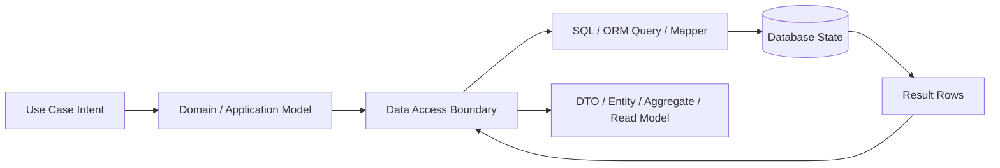
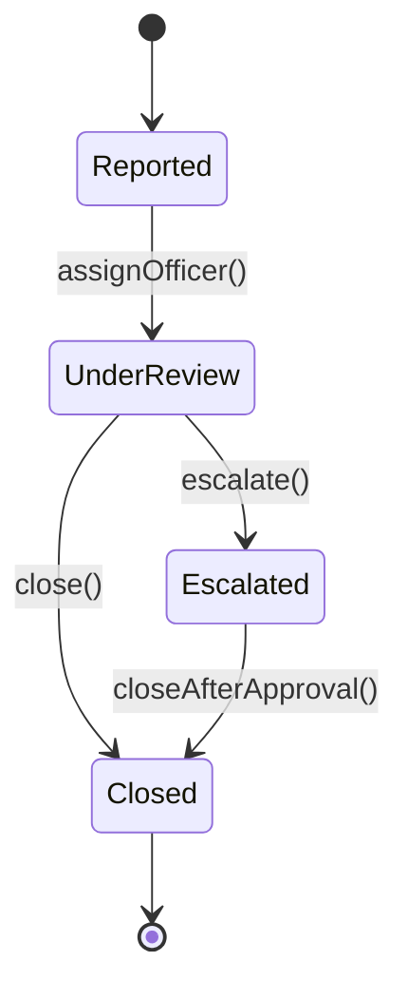
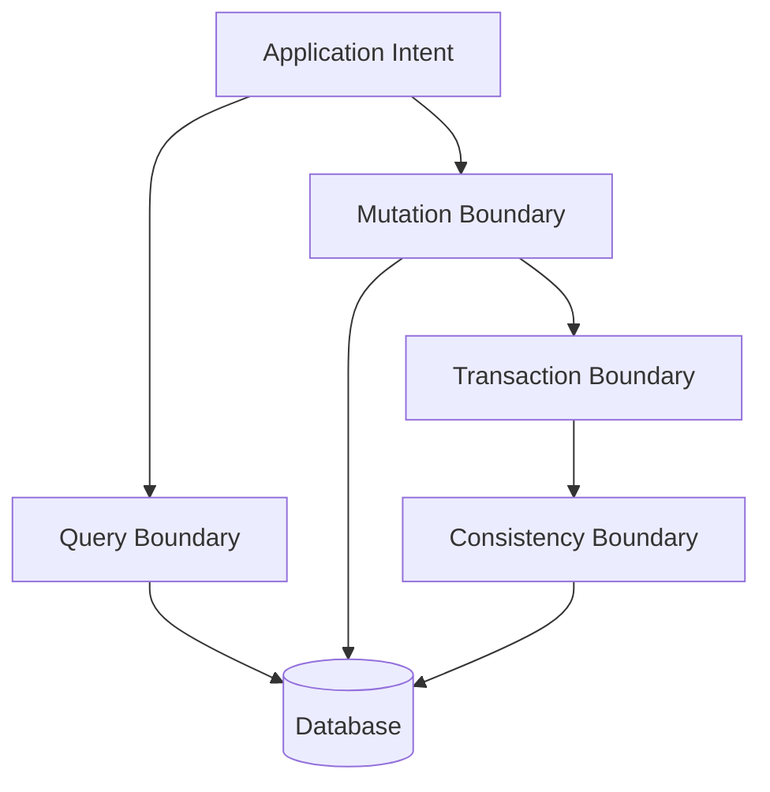
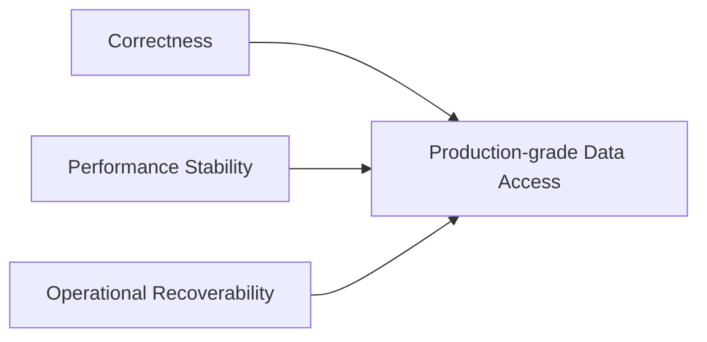
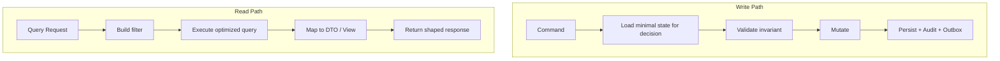
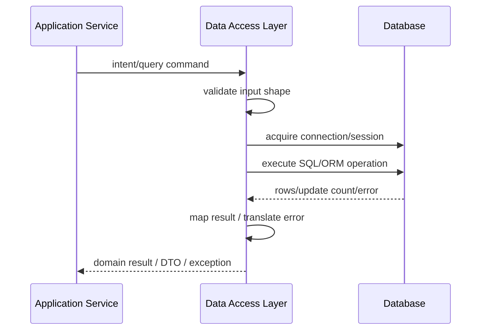
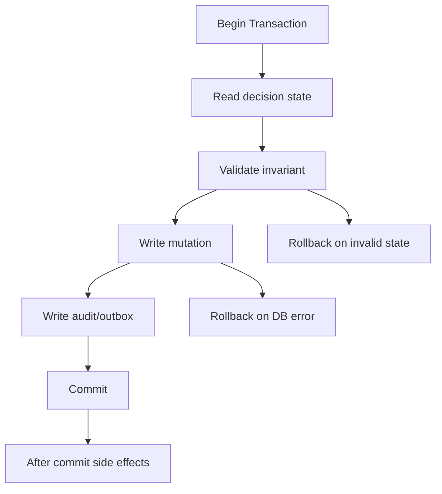
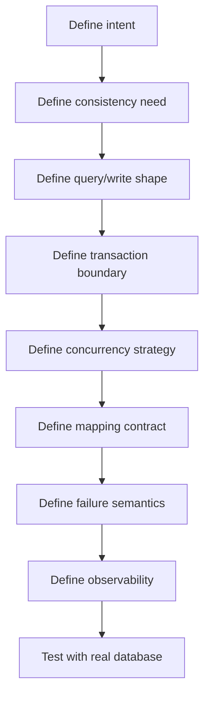

# Part 001 — Data Access Mental Model

Data access layer bukan sekadar tempat menaruh SQL, repository interface, atau method `findById`. Di sistem serius, data access adalah batas tempat aplikasi melakukan negosiasi dengan realitas eksternal: database punya state sendiri, aturan sendiri, concurrency sendiri, latency sendiri, failure mode sendiri, dan cara berpikir yang berbeda dari object graph di Java.

Kalau seorang engineer hanya melihat data access sebagai “cara mengambil data”, desainnya biasanya tampak rapi di awal tetapi rapuh saat produksi: query meledak, transaksi terlalu panjang, lock saling menunggu, retry membuat duplikasi, entity bocor ke API, dan perubahan schema menjadi berisiko.

Mental model yang benar adalah ini:

> Data access layer adalah **translation boundary** antara intent aplikasi dan perubahan state yang durable, constrained, concurrent, dan observable.

Part ini membangun fondasi. Kita belum fokus pada framework. JDBC, JPA, Hibernate, jOOQ, MyBatis, dan R2DBC hanyalah alat. Sebelum memilih alat, kita harus tahu bentuk masalahnya.

---

## 1. Core Problem: Java Object ≠ Database Fact

Di Java, kita nyaman berpikir dengan object:

```java
class CaseFile {
    CaseId id;
    CaseStatus status;
    Officer assignedOfficer;
    List<Evidence> evidence;
}
```

Namun database tidak menyimpan “object” seperti itu. Database menyimpan fakta yang dinormalisasi atau disusun dalam struktur fisik tertentu:

```sql
case_file(id, status, assigned_officer_id, version, created_at, updated_at)
evidence(id, case_file_id, type, storage_key, checksum, created_at)
officer(id, name, unit_id, active)
```

Perbedaan ini penting karena object dan database punya sifat berbeda.

| Dimensi | Java Object | Database Row / Relation |
|---|---|---|
| Identity | Reference, object equality, value equality | Primary key, natural key, unique constraint |
| Lifetime | Heap, garbage collected | Durable sampai dihapus/diubah |
| Constraint | Class invariant, validation, type system | NOT NULL, FK, CHECK, UNIQUE, trigger, transaction isolation |
| Relationship | Pointer/reference | Foreign key, join, denormalized field |
| Change | Mutasi object in-memory | SQL statement dalam transaction |
| Visibility | Thread/process-local | Shared antar session, service, job, user |
| Failure | Exception, timeout | Constraint violation, deadlock, lock wait, serialization failure, partial execution |

Kesalahan awal yang sering terjadi: engineer memaksa database mengikuti bentuk object, atau memaksa object mengikuti bentuk tabel mentah. Keduanya ekstrem.

Data access layer yang matang melakukan translasi secara eksplisit:



Yang perlu dijaga bukan “object harus sama dengan tabel”, tetapi **intent aplikasi tersampaikan ke database dengan benar, efisien, dan aman terhadap concurrency**.

---

## 2. Data Access Bukan CRUD, Tetapi State Transition

CRUD adalah interface mekanis:

- create
- read
- update
- delete

Namun sistem produksi lebih sering membutuhkan state transition:

- case dibuat dari laporan awal
- case diassign ke officer
- evidence ditambahkan
- case dieskalasi
- case ditutup
- status dibatalkan karena compliance rule gagal

Contoh CRUD yang terlihat sederhana:

```java
caseRepository.save(caseFile);
```

Namun pertanyaan production-grade-nya jauh lebih penting:

1. Apakah status boleh berubah dari `UNDER_REVIEW` ke `CLOSED`?
2. Siapa yang boleh melakukan perubahan?
3. Apakah evidence wajib lengkap sebelum case ditutup?
4. Apakah perubahan harus atomic dengan audit trail?
5. Bagaimana jika dua officer menutup case yang sama bersamaan?
6. Bagaimana jika request di-retry oleh client?
7. Bagaimana jika database commit berhasil tetapi response ke client timeout?
8. Apakah event perlu dipublish setelah commit?
9. Apakah read model perlu diupdate async?
10. Apakah query list screen boleh membaca replica yang lag?

Karena itu, data access tidak boleh dipahami sebagai “repository menyimpan entity”. Ia adalah bagian dari mekanisme state transition.

Mental model yang lebih benar:



Data access layer harus mendukung transition di atas dengan database operation yang menjaga invariant.

Contoh pola yang lebih eksplisit:

```java
public final class CloseCaseCommandHandler {
    private final CaseRepository caseRepository;
    private final AuditLogRepository auditLogRepository;

    @Transactional
    public void handle(CloseCaseCommand command) {
        CaseFile caseFile = caseRepository.getForUpdate(command.caseId());

        caseFile.close(command.reason(), command.actorId());

        caseRepository.save(caseFile);
        auditLogRepository.append(AuditLog.caseClosed(command.caseId(), command.actorId()));
    }
}
```

Di sini repository bukan pusat domain. Ia mendukung use case. Boundary transaksi ada di command handler karena operasi `close` dan audit log harus commit atau rollback bersama.

---

## 3. Empat Boundary Utama Data Access

Untuk berpikir jernih, pecah data access menjadi empat boundary.



### 3.1 Query Boundary

Query boundary menjawab: **data apa yang benar-benar dibutuhkan oleh caller?**

Bukan:

```java
CaseFile caseFile = caseRepository.findById(id);
return CaseResponse.from(caseFile);
```

Pertanyaan yang lebih tepat:

- Apakah caller butuh aggregate penuh atau hanya summary?
- Apakah query ini untuk decision-making atau display?
- Apakah stale read diterima?
- Apakah perlu lock?
- Apakah perlu join besar?
- Apakah query akan dipakai di list screen dengan pagination?
- Apakah akses ini user-facing latency-sensitive?

Contoh query boundary berbeda:

```java
interface CaseReadRepository {
    Optional<CaseDetailView> findDetail(CaseId id);
    Page<CaseListItem> search(CaseSearchFilter filter, PageRequest page);
    boolean existsOpenCaseForSubject(SubjectId subjectId);
}
```

`findDetail`, `search`, dan `existsOpenCaseForSubject` berbeda secara semantik walaupun semuanya “read”. Jangan paksa semuanya menjadi `findBy...` entity repository.

### 3.2 Mutation Boundary

Mutation boundary menjawab: **perubahan state apa yang boleh terjadi?**

Mutation bukan sekadar `update table set ...`. Mutation harus punya intent.

Lemah:

```java
void updateStatus(UUID caseId, String status);
```

Lebih kuat:

```java
void markUnderReview(CaseId caseId, OfficerId officerId);
void escalate(CaseId caseId, EscalationReason reason, ActorId actorId);
void close(CaseId caseId, CloseReason reason, ActorId actorId);
```

Mengapa lebih kuat?

Karena nama method membawa domain invariant. `updateStatus` terlalu bebas. Ia memungkinkan transisi ilegal kecuali semua validasi tersembunyi di tempat lain.

### 3.3 Transaction Boundary

Transaction boundary menjawab: **operasi mana yang harus atomic?**

Aturan dasar:

> Satu transaksi harus mencakup satu unit perubahan state yang harus benar secara bersama, bukan satu HTTP request secara membabi buta.

Contoh:

```java
@Transactional
public void assignOfficer(AssignOfficerCommand command) {
    CaseFile caseFile = caseRepository.getForUpdate(command.caseId());
    Officer officer = officerRepository.getActive(command.officerId());

    caseFile.assignTo(officer.id(), command.actorId());

    caseRepository.save(caseFile);
    auditLogRepository.append(AuditLog.officerAssigned(command.caseId(), officer.id()));
}
```

Yang masuk transaksi:

- baca state yang menentukan keputusan
- validasi invariant yang membutuhkan database state
- mutation
- audit log lokal
- outbox event jika perlu publish setelah commit

Yang biasanya tidak masuk transaksi:

- call service eksternal
- upload/download file besar
- generate report berat
- kirim email
- publish message langsung ke broker tanpa outbox
- proses CPU panjang

### 3.4 Consistency Boundary

Consistency boundary menjawab: **bagian mana dari sistem yang harus langsung konsisten, dan bagian mana boleh eventually consistent?**

Contoh dalam case management:

| Data | Consistency Requirement | Alasan |
|---|---|---|
| Case status | Strong dalam aggregate | Menentukan legal state transition |
| Audit log lokal | Strong dengan mutation | Defensibility dan traceability |
| Notification email | Eventually consistent | Tidak boleh menggagalkan perubahan utama jika email down |
| Search index | Eventually consistent | Bisa tertinggal beberapa detik |
| Analytics dashboard | Eventually consistent | Tidak mempengaruhi keputusan transaksi |
| External regulator sync | Usually eventually consistent | Butuh retry, outbox, reconciliation |

Kesalahan desain umum: semua dibuat strong consistency sehingga transaksi panjang dan rapuh, atau semuanya dibuat eventually consistent sehingga invariant utama bocor.

---

## 4. Data Access Layer Harus Menjaga Tiga Jenis Kebenaran

Production data access bukan hanya soal query berhasil. Ia harus menjaga tiga kebenaran.



### 4.1 Correctness

Correctness berarti data yang ditulis dan dibaca sesuai invariant.

Contoh invariant:

- satu case aktif per subject untuk tipe tertentu
- case tidak bisa ditutup tanpa audit log
- assignment hanya ke officer aktif
- status tidak boleh mundur tanpa alasan resmi
- evidence checksum tidak boleh berubah setelah submit
- retry request tidak boleh membuat duplikasi mutation

Correctness harus dijaga di beberapa lapisan:

| Lapisan | Contoh penjagaan |
|---|---|
| Domain/application | validasi transition, command semantic |
| Data access | query dengan lock, version check, save atomic |
| Database | unique constraint, FK, CHECK, transaction isolation |
| Operational | migration safety, audit, reconciliation |

Engineer lemah sering menaruh semua invariant di Java. Engineer matang tahu bahwa invariant tertentu harus di-*anchor* di database.

Contoh: “satu active case per subject”. Ini jangan hanya dicek dengan query lalu insert.

Rapuh:

```java
if (!caseRepository.existsActiveCase(subjectId)) {
    caseRepository.insert(newCase);
}
```

Race condition:

```txt
T1: check active case = false
T2: check active case = false
T1: insert
T2: insert
```

Lebih kuat: gunakan unique constraint atau partial unique index jika database mendukung.

```sql
create unique index uq_active_case_per_subject
on case_file(subject_id)
where status in ('REPORTED', 'UNDER_REVIEW', 'ESCALATED');
```

Lalu Java menangani constraint violation sebagai business conflict, bukan sekadar technical exception.

### 4.2 Performance Stability

Performance bukan “query cepat di laptop”. Performance stability berarti query tetap bisa diprediksi saat data membesar, concurrency naik, dan cache dingin.

Pertanyaan yang harus muncul sebelum production:

- Apakah query punya index yang sesuai?
- Apakah pagination memakai offset besar?
- Apakah list endpoint memuat entity graph penuh?
- Apakah ORM menghasilkan query yang bisa diprediksi?
- Apakah ada N+1?
- Apakah batch write memegang transaksi terlalu lama?
- Apakah query memakai function di indexed column?
- Apakah sorting deterministik?
- Apakah count query mahal?
- Apakah query plan berubah saat distribusi data berubah?

Data access layer harus membuat performance menjadi bagian dari desain, bukan optimasi belakangan.

### 4.3 Operational Recoverability

Recoverability berarti sistem bisa pulih dari failure tanpa membuat data makin rusak.

Contoh failure:

- deadlock
- serialization failure
- connection dropped setelah commit
- duplicate request dari client
- migration sebagian berhasil
- worker crash di tengah batch
- outbox event belum terkirim
- read model tertinggal
- data historis perlu diperbaiki

Data access yang baik mendukung:

- idempotency
- retry dengan batas
- resume cursor
- audit trail
- reconciliation query
- repair job
- migration rollback/forward fix
- observability per query/operation

Tanpa recoverability, sistem mungkin tampak benar sampai failure pertama.

---

## 5. Read Path dan Write Path Harus Dipikir Berbeda

Banyak codebase kacau karena read dan write dipaksa memakai model yang sama.

Write path butuh invariant, transaction, lock/version, audit, dan intent.

Read path butuh shape data, latency, pagination, filtering, sorting, dan projection.



### 5.1 Write Path Example

```java
public void escalate(EscalateCaseCommand command) {
    CaseFile caseFile = caseRepository.getForUpdate(command.caseId());

    caseFile.escalate(command.reason(), command.actorId());

    caseRepository.save(caseFile);
    auditLogRepository.append(AuditLog.caseEscalated(command.caseId(), command.reason()));
}
```

Write path characteristics:

- loads only what is needed for decision
- may lock or use optimistic version
- validates transition
- writes audit/outbox in same transaction if needed
- fails loudly on conflict

### 5.2 Read Path Example

```java
public Page<CaseListItem> search(CaseSearchFilter filter, PageRequest page) {
    return caseQueryRepository.searchCases(filter, page);
}
```

Read path characteristics:

- returns DTO/projection, not mutable aggregate
- can use joins, CTE, window functions, database-specific optimization
- should avoid accidental lazy loading
- can be served by replica/read model if stale read acceptable
- needs stable pagination semantics

The rule:

> Use write models to protect invariants. Use read models to serve questions.

---

## 6. The Shape of Data Access Choices

A mature engineer does not ask “JPA atau JDBC mana yang lebih baik?” in the abstract. The better question is:

> Untuk use case ini, abstraction mana yang membuat correctness paling mudah dijaga tanpa mengorbankan observability dan performance predictability?

| Choice | Best Fit | Risk |
|---|---|---|
| Plain JDBC | Full control, simple services, performance-sensitive operations | Boilerplate, manual mapping, error translation |
| JDBC helper/template | SQL control with less boilerplate | Still manual query ownership |
| JPA/Hibernate | Aggregate persistence, object graph, lifecycle mapping | Hidden queries, N+1, flush surprise, cascade risk |
| Spring Data JPA | Fast repository development on top of JPA | Method-name query abuse, leaky repository abstraction |
| jOOQ | SQL-first, type-safe complex queries | Schema/codegen workflow, SQL ownership discipline needed |
| MyBatis | Explicit SQL mapper, controlled mapping | XML/mapper drift, dynamic SQL complexity |
| R2DBC | Reactive/non-blocking stack | Transaction/pool/backpressure complexity, limited driver maturity per DB |
| Stored procedure | DB-owned logic, close to data, legacy integration | Harder versioning/testing, application logic split |

Part ini tidak memilih pemenang. Ia memberi mental model agar pilihan tidak ideologis.

---

## 7. Data Access Operation Anatomy

Setiap operasi data access bisa dibedah menjadi beberapa tahap.



Tahap yang sering diremehkan:

1. **Input shape**: apakah filter valid, limit bounded, sort field allowed?
2. **Connection/session acquisition**: apakah operation bisa menunggu pool selamanya?
3. **Execution**: apakah query punya timeout dan plan stabil?
4. **Update count**: apakah `update 0 rows` berarti not found, conflict, atau bug?
5. **Mapping**: apakah nullability benar?
6. **Error translation**: apakah constraint violation diterjemahkan menjadi domain conflict?
7. **Observation**: apakah operation bisa dilihat di metric/log/trace?

Contoh `update count` sebagai invariant:

```java
int updated = jdbc.update("""
    update case_file
       set status = ?, version = version + 1
     where id = ?
       and status = ?
       and version = ?
""", CLOSED, caseId, UNDER_REVIEW, expectedVersion);

if (updated == 0) {
    throw new ConcurrentCaseModificationException(caseId);
}
```

Di sini `0 rows updated` bukan sekadar angka. Itu sinyal concurrency conflict atau state transition invalid.

---

## 8. Mapping Is a Boundary, Not a Chore

Mapping sering dianggap pekerjaan membosankan. Padahal mapping menentukan apakah data database diterjemahkan dengan benar ke application semantics.

Contoh mapping mentah:

```java
new CaseFile(
    rs.getString("id"),
    rs.getString("status"),
    rs.getString("assigned_officer_id")
);
```

Masalah:

- ID masih string mentah
- status belum divalidasi sebagai enum/value object
- nullable column tidak jelas
- invalid database value bisa masuk diam-diam
- timezone handling tidak eksplisit

Mapping yang lebih kuat:

```java
private CaseFile mapCaseFile(ResultSet rs) throws SQLException {
    return CaseFile.restore(
        CaseId.from(rs.getObject("id", UUID.class)),
        CaseStatus.fromDatabaseValue(rs.getString("status")),
        OfficerId.nullable(rs.getObject("assigned_officer_id", UUID.class)),
        Version.of(rs.getLong("version")),
        InstantMapper.fromTimestamp(rs.getTimestamp("created_at"))
    );
}
```

Mapping yang baik menjawab:

- field mana wajib?
- field mana nullable?
- nilai database mana invalid?
- apakah object dibuat sebagai new domain object atau restored historical state?
- apakah timezone benar?
- apakah decimal precision aman?
- apakah enum value backward-compatible?

Jangan biarkan mapper menjadi “copy column ke field”. Mapper adalah anti-corruption boundary kecil antara database representation dan application model.

---

## 9. Error Is Part of the Contract

Data access contract tidak lengkap jika hanya mendefinisikan success path.

Contoh method:

```java
CaseFile get(CaseId id);
```

Pertanyaan yang harus jelas:

- Jika tidak ada, return apa?
- Jika database timeout, exception apa?
- Jika duplicate key, diterjemahkan menjadi apa?
- Jika optimistic lock gagal, caller harus retry atau tampilkan conflict?
- Jika query return lebih dari satu row padahal harus unique, apakah data corruption?

Kontrak yang lebih eksplisit:

```java
interface CaseRepository {
    Optional<CaseFile> findById(CaseId id);

    CaseFile getRequired(CaseId id) throws CaseNotFoundException;

    CaseFile getForUpdate(CaseId id)
        throws CaseNotFoundException, DataAccessTemporarilyUnavailableException;

    void save(CaseFile caseFile)
        throws ConcurrentCaseModificationException, DataIntegrityViolationException;
}
```

Bukan berarti semua exception harus checked exception. Yang penting adalah semantic failure jelas dan diuji.

Error kategori umum:

| Category | Example | Bias Handling |
|---|---|---|
| Not found | no row | Optional/domain exception |
| Conflict | optimistic lock fail, duplicate idempotency key | return conflict / safe retry decision |
| Integrity violation | FK/unique/check failed | bug atau business conflict tergantung constraint |
| Transient DB failure | deadlock, serialization failure, temporary network | retry dengan budget jika safe |
| Timeout | query/connection/request timeout | fail fast, observe, maybe retry at higher level |
| Corruption signal | multiple rows for unique query | alert, stop, repair |

---

## 10. Transaction Is Not a Decoration

Annotation seperti `@Transactional` sering membuat engineer lupa bahwa transaksi adalah mekanisme database nyata.

Transaksi punya biaya:

- connection dipinjam selama transaksi
- lock bisa ditahan
- MVCC version bisa dipertahankan
- rollback log/WAL bertambah
- query lain bisa terpengaruh
- timeout bisa terjadi

Transaksi juga punya batas:

- tidak otomatis membuat call eksternal atomic
- tidak otomatis membuat message broker publish atomic
- tidak menghilangkan race condition jika isolation tidak cukup
- tidak menjamin retry aman
- tidak memperbaiki query lambat

Mental model:



Rule of thumb:

> Transaction should be short, purposeful, and aligned with one consistency boundary.

---

## 11. Idempotency Is a Data Access Concern

Client retry, network timeout, gateway retry, worker retry, scheduler retry, and message redelivery are normal. Jika write operation tidak idempotent, produksi akan membuat duplikasi.

Contoh non-idempotent:

```java
public PaymentId createPayment(CreatePaymentRequest request) {
    return paymentRepository.insert(request.toPayment());
}
```

Jika request timeout setelah commit, client retry bisa membuat payment kedua.

Idempotent pattern:

```sql
create table idempotency_record (
    idempotency_key varchar(128) primary key,
    operation_type varchar(64) not null,
    resource_id uuid not null,
    request_hash varchar(128) not null,
    created_at timestamp not null
);
```

```java
@Transactional
public PaymentId createPayment(CreatePaymentCommand command) {
    Optional<IdempotencyRecord> existing = idempotencyRepository.find(command.key());
    if (existing.isPresent()) {
        existing.get().assertSameRequest(command.requestHash());
        return PaymentId.of(existing.get().resourceId());
    }

    Payment payment = Payment.create(command);
    paymentRepository.insert(payment);
    idempotencyRepository.insert(command.key(), payment.id(), command.requestHash());
    return payment.id();
}
```

Idempotency bukan hanya API concern. Ia harus di-*anchor* dalam database transaction.

---

## 12. Query Shape Is Product Behavior

Query bukan implementation detail murni. Query menentukan behavior produk.

Contoh search case:

```java
Page<CaseListItem> search(CaseSearchFilter filter, PageRequest page);
```

Keputusan query yang mempengaruhi user:

- apakah data diurutkan berdasarkan created date atau priority?
- apakah sorting stabil jika timestamp sama?
- apakah user melihat data yang baru saja diubah?
- apakah soft-deleted record muncul?
- apakah filter status memakai exact match atau group state?
- apakah pagination offset bisa membuat record duplicate/hilang saat data berubah?
- apakah timezone user mempengaruhi date filter?

Karena itu query contract harus eksplisit. Jangan biarkan behavior tersembunyi dalam repository method name panjang.

Lemah:

```java
findByStatusAndCreatedAtBetweenAndOfficerIdOrderByCreatedAtDesc(...)
```

Lebih jelas:

```java
CaseSearchResult searchOpenCasesVisibleToOfficer(
    OfficerId officerId,
    CaseSearchCriteria criteria,
    PageCursor cursor
);
```

---

## 13. Data Access Observability Starts at Design Time

Kalau operation data access tidak bisa diamati, production debugging akan menjadi tebak-tebakan.

Minimum signal:

| Signal | Why it matters |
|---|---|
| operation name | tahu use case mana lambat/error |
| query latency | deteksi query regression |
| rows returned/affected | deteksi cardinality abnormal |
| timeout count | deteksi saturation |
| lock wait/deadlock count | deteksi concurrency issue |
| retry count | deteksi transient failure meningkat |
| pool acquisition latency | deteksi database/pool pressure |
| exception category | beda conflict vs outage |

Operation name lebih berguna daripada hanya raw SQL.

Contoh log buruk:

```txt
SQL timeout: select * from case_file where id = ?
```

Contoh log lebih baik:

```txt
operation=CaseRepository.getForUpdate caseId=... outcome=timeout durationMs=3000 tx=AssignOfficer
```

Jangan log PII atau data sensitif. Tetapi log metadata yang cukup untuk diagnosis.

---

## 14. The Data Access Design Loop

Setiap data access operation sebaiknya dirancang melalui loop berikut.



Checklist singkat:

1. Apa intent operation ini?
2. Apakah read atau write?
3. Jika write, invariant apa yang harus dijaga?
4. Apakah perlu lock/version/constraint?
5. Apa boundary transaksi?
6. Apakah operation safe untuk retry?
7. Apa return shape yang paling kecil dan tepat?
8. Apa failure yang diharapkan?
9. Bagaimana operation ini muncul di metric/log/trace?
10. Apakah sudah dites dengan database nyata, bukan mock semata?

---

## 15. Mini Case Study: Assignment Case

Kita gunakan skenario sederhana: assign case ke officer.

### 15.1 Requirement

- Case harus ada.
- Case harus berstatus `REPORTED` atau `UNDER_REVIEW`.
- Officer harus aktif.
- Assignment harus tercatat di audit log.
- Jika dua assignment terjadi bersamaan, hanya satu yang menang atau perubahan harus terdeteksi.
- Jika request di-retry, hasil tidak boleh membuat audit duplicate.

### 15.2 Naive Implementation

```java
public void assign(UUID caseId, UUID officerId) {
    CaseFile caseFile = caseRepository.findById(caseId).orElseThrow();
    Officer officer = officerRepository.findById(officerId).orElseThrow();

    caseFile.setAssignedOfficerId(officer.getId());
    caseFile.setStatus("UNDER_REVIEW");

    caseRepository.save(caseFile);
    auditLogRepository.save(new AuditLog(caseId, "ASSIGNED"));
}
```

Masalah:

- tidak jelas transaction boundary
- tidak ada concurrency control
- tidak cek officer aktif
- status transition bisa illegal
- audit bisa gagal setelah case update jika transaksi tidak benar
- retry bisa membuat audit duplicate
- setter membuka mutation bebas

### 15.3 Better Implementation

```java
@Transactional
public AssignmentResult assign(AssignCaseCommand command) {
    CaseFile caseFile = caseRepository.getForUpdate(command.caseId());
    ActiveOfficer officer = officerRepository.getActive(command.officerId());

    caseFile.assignTo(officer.id(), command.actorId());

    caseRepository.save(caseFile);
    auditLogRepository.appendOnce(
        AuditLog.assignment(command.operationId(), command.caseId(), officer.id(), command.actorId())
    );

    return new AssignmentResult(caseFile.id(), caseFile.status(), caseFile.assignedOfficerId());
}
```

Data access implications:

- `getForUpdate` menyatakan locking strategy.
- `getActive` menyatakan invariant officer.
- `assignTo` menyatakan domain transition.
- `appendOnce` menyatakan idempotency/audit uniqueness.
- `@Transactional` menyatukan mutation dan audit.

### 15.4 Database Support

```sql
alter table case_file
add constraint ck_case_status
check (status in ('REPORTED', 'UNDER_REVIEW', 'ESCALATED', 'CLOSED'));

alter table case_file
add constraint fk_case_assigned_officer
foreign key (assigned_officer_id) references officer(id);

create unique index uq_audit_operation
on audit_log(operation_id);
```

Database bukan sekadar storage. Ia ikut menjaga invariant.

---

## 16. What Top Engineers Notice Early

Engineer biasa bertanya:

> Framework apa yang dipakai?

Engineer kuat bertanya:

> Apa state transition-nya? Apa invariant-nya? Apa failure mode-nya? Apa consistency boundary-nya? Apa query shape-nya? Apa yang terjadi saat retry dan concurrency?

Pertanyaan review yang harus menjadi kebiasaan:

1. Apakah method repository ini membawa intent atau hanya CRUD generik?
2. Apakah entity/domain object bocor ke read API?
3. Apakah query list memuat data terlalu banyak?
4. Apakah transaksi mencakup call eksternal?
5. Apakah update operation menangani `0 rows affected`?
6. Apakah constraint database mendukung invariant paling penting?
7. Apakah retry operation aman?
8. Apakah failure diterjemahkan menjadi semantic error?
9. Apakah mapping menjaga nullability dan enum evolution?
10. Apakah operation bisa diamati di production?

---

## 17. Practical Heuristics

Gunakan heuristic berikut sebagai pegangan awal.

### 17.1 Untuk Write Operation

- Mulai dari command intent, bukan table.
- Load state minimal yang diperlukan untuk validasi.
- Pilih optimistic lock jika conflict jarang dan UX bisa retry.
- Pilih pessimistic lock jika keputusan harus serial terhadap row tertentu.
- Gunakan unique constraint untuk invariant uniqueness.
- Gunakan transaction singkat.
- Jangan panggil service eksternal di dalam transaksi.
- Tulis audit/outbox dalam transaksi yang sama bila harus kuat.
- Perlakukan `0 rows updated` sebagai sinyal, bukan diabaikan.
- Desain idempotency sejak awal untuk operation yang bisa di-retry.

### 17.2 Untuk Read Operation

- Return projection sesuai screen/use case.
- Hindari entity graph untuk list API.
- Batasi limit dan sort field.
- Pastikan sorting deterministik.
- Gunakan keyset pagination untuk dataset besar bila cocok.
- Jangan biarkan lazy loading terjadi di serialization boundary.
- Pisahkan search/reporting query dari aggregate repository.
- Ukur rows returned dan latency.

### 17.3 Untuk Mapping

- Jangan mapping string status mentah ke domain tanpa validasi.
- Perlakukan nullable column secara eksplisit.
- Gunakan value object untuk ID penting.
- Jaga precision untuk money/decimal.
- Jaga timezone untuk timestamp.
- Jangan sembunyikan mapping kompleks di magic reflection jika correctness penting.

### 17.4 Untuk Error

- Bedakan not found, conflict, integrity violation, timeout, dan transient failure.
- Jangan retry semua error.
- Jangan retry mutation kecuali idempotent atau transaction-safe.
- Log error dengan operation name.
- Jangan expose detail SQL ke user.

---

## 18. Summary

Data access layer adalah boundary strategis, bukan folder teknis.

Mental model utama:

1. Java object dan database fact adalah dua dunia berbeda.
2. Data access harus menerjemahkan intent aplikasi ke state durable.
3. CRUD bukan model yang cukup; pikirkan state transition.
4. Read path dan write path punya kebutuhan berbeda.
5. Transaction boundary harus pendek dan bermakna.
6. Correctness membutuhkan kerja sama domain, data access, dan database constraint.
7. Idempotency, concurrency, dan failure handling adalah bagian inti data access.
8. Query shape menentukan behavior produk dan performa.
9. Mapping adalah boundary semantik.
10. Observability harus dirancang sejak awal.

Part berikutnya akan membahas tanggung jawab setiap bentuk data access component: DAO, Repository, Gateway, Unit of Work, Query Service, dan Transaction Script. Kita akan menentukan kapan masing-masing pattern tepat, bagaimana batasnya, dan bagaimana menghindari abstraksi palsu yang terlihat rapi tetapi merusak sistem.

---

## Official References

- Oracle Java SE JDBC API — `Connection`, `PreparedStatement`, `Statement`, `ResultSet`: https://docs.oracle.com/javase/8/docs/api/java/sql/package-summary.html
- Jakarta Persistence 3.2 Specification: https://jakarta.ee/specifications/persistence/3.2/
- Hibernate ORM User Guide: https://docs.hibernate.org/stable/orm/userguide/html_single/
- Spring Data JPA Reference Documentation: https://docs.spring.io/spring-data/jpa/reference/index.html
