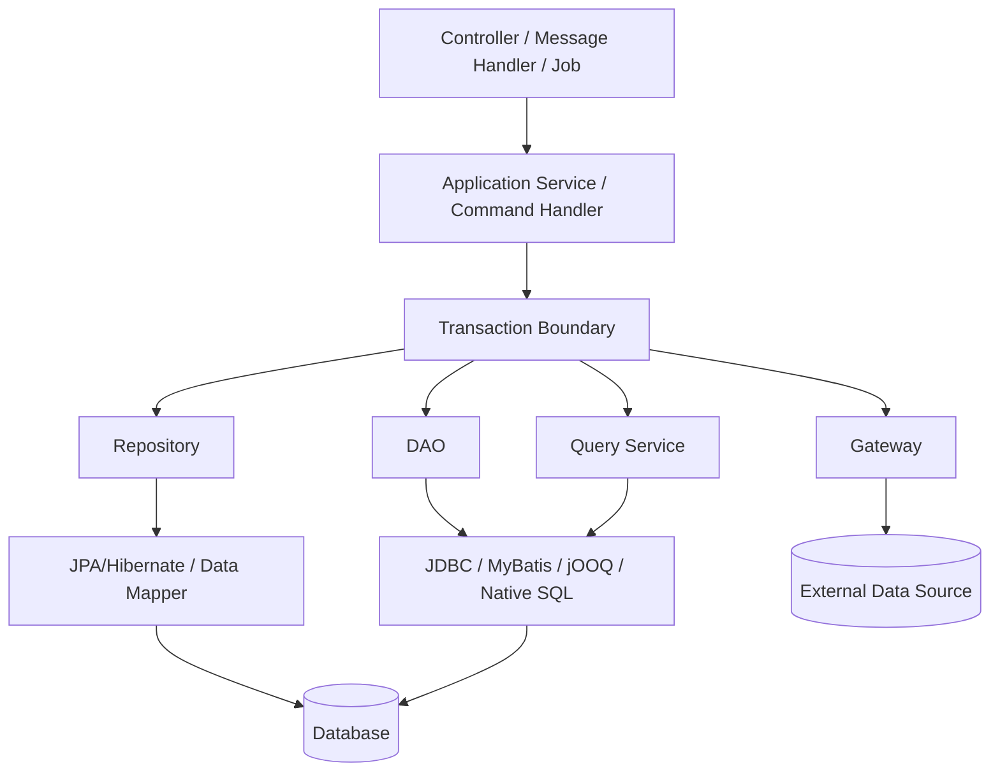
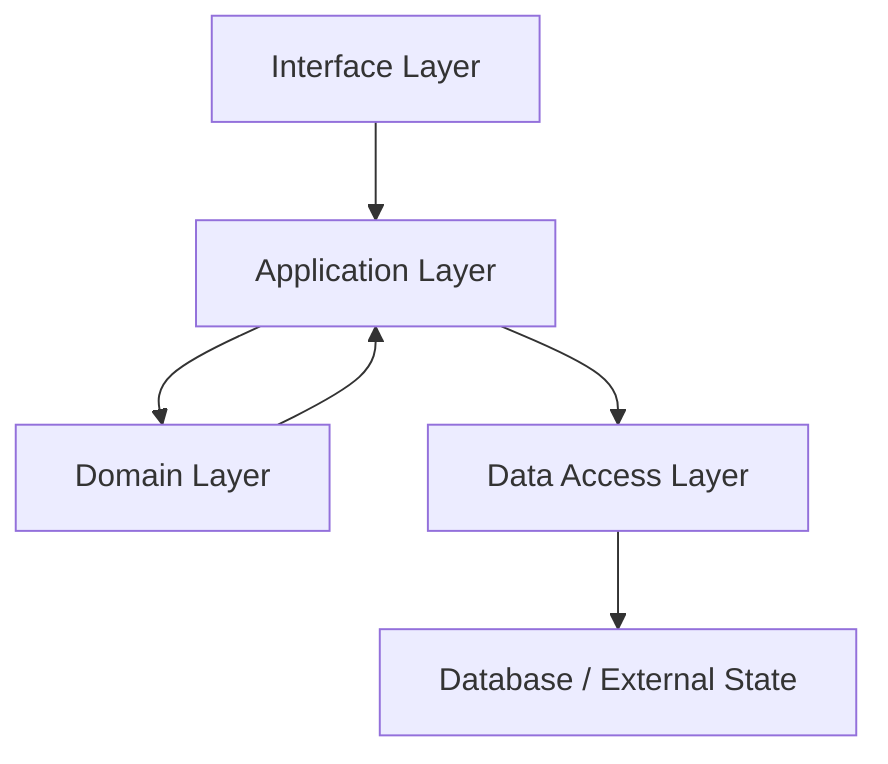
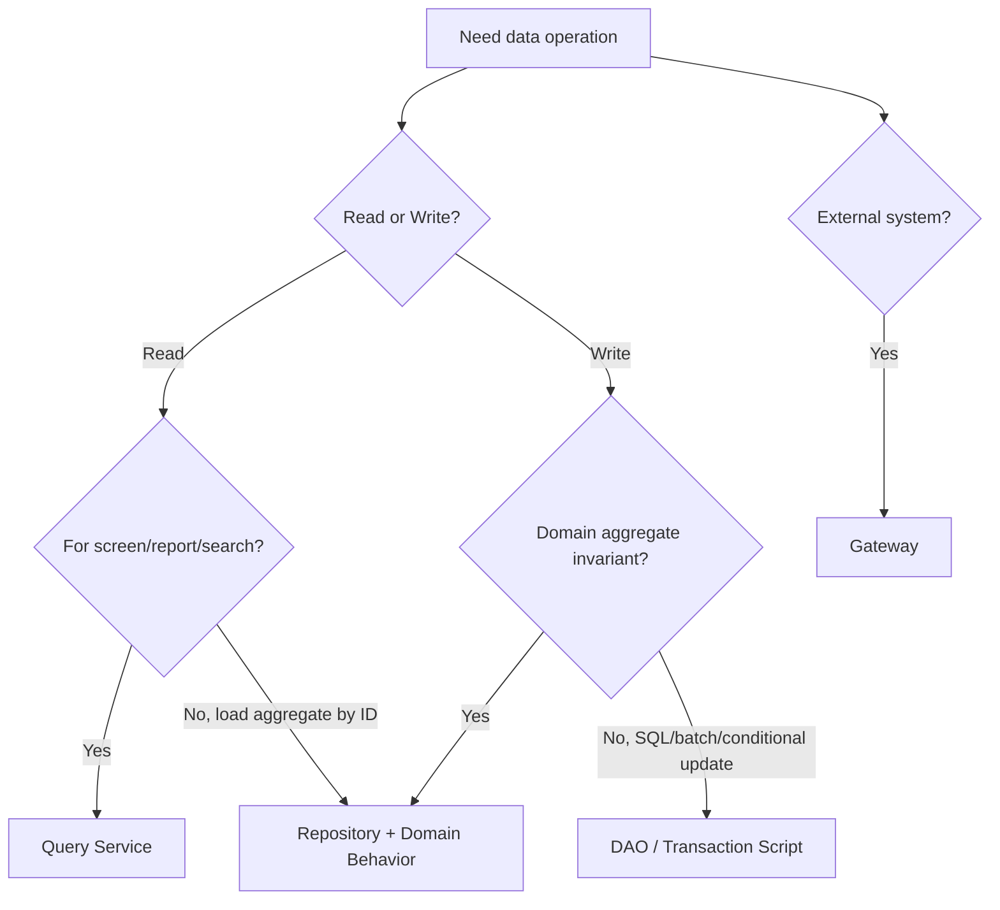

# Part 002 — Data Access Layer Responsibility

Part sebelumnya menetapkan mental model: data access adalah boundary antara intent aplikasi dan database state. Sekarang kita masuk ke pertanyaan arsitektural yang lebih praktis:

> Komponen apa saja yang boleh ada di data access layer, dan tanggung jawabnya sampai mana?

Banyak codebase Java tidak rusak karena salah memakai framework. Mereka rusak karena semua hal dimasukkan ke satu tempat bernama `Repository`.

Repository akhirnya berisi:

- query untuk screen
- mutation domain
- reporting SQL
- pagination
- authorization filter
- audit insert
- soft delete rule
- locking
- dynamic search
- export CSV
- batch job cursor
- call service lain
- mapping entity ke response

Awalnya terlihat produktif. Setelah sistem tumbuh, repository menjadi “god interface” yang tidak punya boundary.

Part ini membangun peta tanggung jawab agar setiap data access component punya alasan keberadaan.

---

## 1. Data Access Layer Bukan Satu Pattern

Tidak ada satu pattern yang cocok untuk semua akses data. Istilah seperti DAO dan Repository sering dipakai bergantian, padahal intensinya berbeda.

Kita akan pakai vocabulary berikut:

| Component | Core Responsibility |
|---|---|
| DAO | Menjalankan operasi persistence/table/query yang relatif dekat dengan database |
| Repository | Menyediakan collection-like access untuk aggregate/domain object |
| Gateway | Membungkus akses ke external data source atau boundary teknis lain |
| Query Service | Menjawab read use case dengan projection/read model |
| Unit of Work | Mengelola perubahan object dalam satu transaction/persistence context |
| Transaction Script | Mengorkestrasi satu use case secara prosedural dengan transaction boundary jelas |
| Mapper | Menerjemahkan row/entity/object antar representation |
| Specification/Query Object | Mewakili filter/predicate/query intent secara composable |

Diagram besar:



Yang penting: pattern ini bukan kasta. Ia adalah pemisahan tanggung jawab.

---

## 2. Layering yang Sehat

Layering production-grade bukan sekadar `controller -> service -> repository`. Itu terlalu kasar.

Layer yang lebih berguna:



### 2.1 Interface Layer

Contoh:

- REST controller
- GraphQL resolver
- message consumer
- scheduled job
- CLI command

Tugasnya:

- menerima input
- melakukan protocol-level validation
- menerjemahkan request ke command/query
- memanggil application layer
- mengembalikan response

Tidak boleh:

- membuka transaction database langsung
- menjalankan SQL
- memutuskan locking strategy
- mapping entity persistence ke response mentah

### 2.2 Application Layer

Contoh:

- `AssignCaseCommandHandler`
- `CloseCaseUseCase`
- `CaseSearchApplicationService`

Tugasnya:

- mengorkestrasi use case
- menentukan transaction boundary
- memanggil domain behavior
- menggunakan repository/DAO/query service
- menangani semantic failure
- memutuskan idempotency/retry policy pada level use case

Tidak boleh:

- berisi SQL detail panjang
- tahu column name kecuali sangat sengaja pada transaction script kecil
- mengembalikan entity persistence ke API secara langsung

### 2.3 Domain Layer

Tugasnya:

- menjaga invariant domain
- memodelkan state transition
- menyediakan behavior yang bermakna

Tidak boleh:

- tergantung JDBC/JPA annotation secara berlebihan jika domain ingin tetap persistence-agnostic
- memanggil repository sendiri
- membuka transaction
- melakukan query database tersembunyi

Catatan realistis: dalam JPA-heavy system, entity domain sering diberi annotation persistence. Itu bukan dosa. Yang berbahaya adalah ketika domain behavior bergantung pada lazy loading acak dan persistence context yang tidak jelas.

### 2.4 Data Access Layer

Tugasnya:

- menjalankan query dan mutation persistence
- mapping row/entity/result
- menerjemahkan error database menjadi error semantik/teknis yang dipahami application layer
- menyediakan abstraction yang cukup, bukan abstraction palsu
- menyembunyikan detail driver/framework yang tidak perlu diketahui caller

Tidak boleh:

- memegang business workflow penuh kecuali memakai transaction script secara sadar
- melakukan authorization yang seharusnya di policy layer, kecuali row-level filtering memang bagian query contract
- melakukan side effect eksternal tanpa boundary jelas

---

## 3. DAO Pattern: Dekat dengan Database, Bukan Domain Collection

DAO, atau Data Access Object, cocok ketika kita ingin operasi yang eksplisit terhadap database/query/table tanpa berpura-pura sebagai collection domain.

Contoh:

```java
public interface CaseDao {
    Optional<CaseRecord> findById(CaseId id);

    int updateStatusIfVersionMatches(
        CaseId id,
        CaseStatus expectedStatus,
        CaseStatus newStatus,
        long expectedVersion
    );

    void insert(CaseRecord record);
}
```

DAO biasanya lebih dekat dengan representation database:

```java
public record CaseRecord(
    CaseId id,
    CaseStatus status,
    OfficerId assignedOfficerId,
    long version,
    Instant createdAt,
    Instant updatedAt
) {}
```

### 3.1 Kapan DAO Tepat?

DAO tepat ketika:

- operasi sangat SQL-centric
- mapping sederhana
- kita butuh kontrol update count
- kita ingin menghindari object graph ORM
- operasi batch/bulk
- query berupa command teknis, bukan aggregate domain
- kita sedang membungkus legacy schema

Contoh yang cocok untuk DAO:

```java
int markExpiredCases(Instant cutoff, int limit);
List<CaseId> findCasesNeedingReminder(Instant now, int limit);
void insertOutboxMessage(OutboxMessageRecord record);
int claimNextJobs(WorkerId workerId, int limit);
```

### 3.2 Kapan DAO Kurang Tepat?

DAO kurang tepat jika caller membutuhkan abstraction domain seperti:

```java
CaseFile caseFile = caseRepository.getRequired(id);
caseFile.escalate(reason, actor);
caseRepository.save(caseFile);
```

DAO bisa tetap dipakai di belakang repository, tetapi caller application layer tidak selalu perlu melihat DAO.

### 3.3 DAO Responsibility Boundary

DAO boleh:

- tahu SQL/table/column
- tahu database-specific query bila memang dipilih
- mengembalikan record/projection
- menerjemahkan SQL error dasar
- expose update count jika semantic penting

DAO tidak boleh:

- berisi workflow bisnis panjang
- memutuskan use case end-to-end
- mengirim email/event eksternal
- menyembunyikan transaksi yang seharusnya dikontrol application layer
- menjadi tempat semua query aplikasi

### 3.4 DAO Example dengan Update Count

```java
public final class JdbcCaseDao implements CaseDao {
    private final DataSource dataSource;

    @Override
    public int updateStatusIfVersionMatches(
        CaseId id,
        CaseStatus expectedStatus,
        CaseStatus newStatus,
        long expectedVersion
    ) {
        String sql = """
            update case_file
               set status = ?, version = version + 1, updated_at = ?
             where id = ?
               and status = ?
               and version = ?
        """;

        try (Connection c = dataSource.getConnection();
             PreparedStatement ps = c.prepareStatement(sql)) {

            ps.setString(1, newStatus.databaseValue());
            ps.setTimestamp(2, Timestamp.from(Instant.now()));
            ps.setObject(3, id.value());
            ps.setString(4, expectedStatus.databaseValue());
            ps.setLong(5, expectedVersion);

            return ps.executeUpdate();
        } catch (SQLException e) {
            throw DataAccessErrors.translate("CaseDao.updateStatusIfVersionMatches", e);
        }
    }
}
```

Perhatikan: DAO tidak memutuskan apakah `0` berarti conflict atau not found. DAO bisa expose angka. Application layer atau repository yang lebih semantik bisa menerjemahkannya.

---

## 4. Repository Pattern: Boundary Aggregate, Bukan Query Dump

Repository memberi ilusi collection untuk aggregate/domain object.

```java
public interface CaseRepository {
    Optional<CaseFile> findById(CaseId id);
    CaseFile getRequired(CaseId id);
    CaseFile getForUpdate(CaseId id);
    void save(CaseFile caseFile);
}
```

Repository idealnya dipakai untuk write-side domain model.

```java
@Transactional
public void close(CloseCaseCommand command) {
    CaseFile caseFile = caseRepository.getForUpdate(command.caseId());
    caseFile.close(command.reason(), command.actorId());
    caseRepository.save(caseFile);
}
```

### 4.1 Repository Bukan Generic CRUD Dump

Hindari repository seperti ini:

```java
interface CaseRepository {
    CaseFile save(CaseFile entity);
    Optional<CaseFile> findById(UUID id);
    List<CaseFile> findAll();
    void deleteById(UUID id);
    List<CaseFile> findByStatusAndOfficerIdAndCreatedAtBetween(...);
    List<CaseFile> findForExportReport(...);
    List<CaseFile> findDashboardStats(...);
}
```

Masalah:

- write dan read tercampur
- entity dipakai untuk semua kebutuhan
- query screen/reporting masuk ke aggregate repository
- method tumbuh mengikuti UI
- transaction semantics tidak jelas
- `findAll` berbahaya pada dataset besar

Repository yang lebih sehat:

```java
interface CaseRepository {
    CaseFile getRequired(CaseId id);
    CaseFile getForUpdate(CaseId id);
    void save(CaseFile caseFile);
}

interface CaseQueryService {
    Page<CaseListItem> search(CaseSearchFilter filter, PageRequest page);
    Optional<CaseDetailView> findDetail(CaseId id);
}
```

### 4.2 Apa yang Boleh Ada di Repository?

Repository boleh:

- load aggregate by identity
- save aggregate
- check existence invariant yang dekat dengan aggregate
- load dengan lock/version jika bagian mutation
- translate persistence detail menjadi domain-level semantic

Repository sebaiknya tidak:

- melayani semua list screen
- return entity untuk export/report
- expose framework-specific query object ke application layer tanpa alasan
- punya ratusan method derived query
- melakukan side effect eksternal

### 4.3 Repository dan Aggregate Boundary

Jika memakai Domain-Driven Design, repository biasanya per aggregate root, bukan per table.

Contoh:

```txt
Aggregate: CaseFile
- case_file
- case_assignment_history
- case_evidence_summary
- case_decision
```

Repository:

```java
interface CaseRepository {
    CaseFile getRequired(CaseId id);
    void save(CaseFile caseFile);
}
```

Bukan:

```java
CaseFileRepository
CaseAssignmentHistoryRepository
CaseEvidenceSummaryRepository
CaseDecisionRepository
```

Itu bisa ada sebagai DAO internal, tetapi jangan semua table otomatis menjadi repository domain.

---

## 5. Gateway Pattern: Boundary ke Data Source Eksternal

Gateway membungkus akses ke sesuatu yang bukan database lokal biasa, atau data source yang punya protocol sendiri.

Contoh:

- service regulator eksternal
- object storage metadata
- search engine
- legacy SOAP service
- external master data
- vendor API
- data warehouse query endpoint

```java
public interface RegulatorCaseGateway {
    Optional<ExternalCaseSnapshot> findExternalCase(ExternalCaseId id);
    SubmissionReceipt submitDecision(CaseDecision decision);
}
```

Gateway berbeda dari repository:

| Aspect | Repository | Gateway |
|---|---|---|
| Target | Local persistence/domain aggregate | External system/data source |
| Consistency | Biasanya dalam local transaction | Tidak ikut local DB transaction |
| Failure | DB failure, constraint, lock | network, remote timeout, remote rejection |
| Contract | domain persistence | integration boundary |
| Retry | harus hati-hati tapi DB-local | wajib idempotency/circuit/bulkhead lebih eksplisit |

Gateway tidak boleh dipanggil sembarangan di dalam transaksi database jika call-nya bisa lambat atau gagal tak terkendali.

Rapuh:

```java
@Transactional
public void closeAndSubmit(CloseCaseCommand command) {
    CaseFile caseFile = caseRepository.getForUpdate(command.caseId());
    caseFile.close(command.reason(), command.actorId());
    caseRepository.save(caseFile);

    regulatorGateway.submitDecision(caseFile.decision()); // dangerous inside DB transaction
}
```

Lebih aman:

```java
@Transactional
public void close(CloseCaseCommand command) {
    CaseFile caseFile = caseRepository.getForUpdate(command.caseId());
    caseFile.close(command.reason(), command.actorId());
    caseRepository.save(caseFile);
    outboxRepository.append(RegulatorSubmissionRequested.from(caseFile));
}
```

Lalu worker memanggil gateway setelah commit.

---

## 6. Query Service: Read Use Case, Projection, dan Reporting

Query Service menjawab pertanyaan aplikasi. Ia tidak harus berpura-pura sebagai repository domain.

```java
public interface CaseQueryService {
    Optional<CaseDetailView> findDetail(CaseId id, Viewer viewer);
    Page<CaseListItem> search(CaseSearchFilter filter, PageRequest page, Viewer viewer);
    CaseDashboardSummary dashboardSummary(UnitId unitId);
}
```

Query service cocok untuk:

- list screen
- detail view dengan projection
- dashboard
- reporting ringan
- export
- search/filter dynamic
- query yang join banyak table
- query yang tidak perlu mutable aggregate

### 6.1 Mengapa Tidak Pakai Repository Saja?

Karena repository write-side punya tujuan berbeda.

Bad:

```java
List<CaseFile> findByStatusInAndOfficerUnitId(...);
```

Lalu controller melakukan mapping:

```java
return cases.stream()
    .map(CaseResponse::from)
    .toList();
```

Risiko:

- entity graph terlalu besar
- lazy loading saat serialization
- query tidak sesuai kebutuhan UI
- pagination sulit optimal
- domain object jadi read DTO

Better:

```java
Page<CaseListItem> search(CaseSearchFilter filter, PageRequest page);
```

Projection:

```java
public record CaseListItem(
    CaseId id,
    String referenceNumber,
    CaseStatus status,
    String subjectName,
    String assignedOfficerName,
    Instant lastUpdatedAt
) {}
```

### 6.2 Query Service Responsibility

Query service boleh:

- tahu shape response/read model
- menggunakan SQL kompleks
- return DTO/projection
- melakukan filtering dan sorting yang eksplisit
- memilih read replica jika acceptable
- optimize query berdasarkan use case

Query service tidak boleh:

- melakukan mutation state utama
- menyimpan domain aggregate
- menjadi tempat authorization policy penuh kecuali row visibility memang query concern
- memanggil banyak repository lalu join in-memory untuk dataset besar

### 6.3 Search Filter sebagai Contract

```java
public record CaseSearchFilter(
    Set<CaseStatus> statuses,
    Optional<OfficerId> assignedOfficerId,
    Optional<UnitId> unitId,
    Optional<DateRange> createdDateRange,
    Optional<String> keyword
) {
    public CaseSearchFilter {
        if (statuses.size() > 10) {
            throw new IllegalArgumentException("Too many statuses");
        }
        keyword.ifPresent(SearchKeyword::validate);
    }
}
```

Filter object bukan sekadar convenience. Ia mencegah query liar:

- unbounded search
- sort field arbitrary
- keyword terlalu panjang
- date range terlalu besar
- status invalid

---

## 7. Unit of Work: Mengelola Perubahan dalam Satu Boundary

Unit of Work melacak object yang berubah dan menyinkronkannya ke database dalam satu transaction.

Dalam JPA/Hibernate, konsep ini muncul melalui `EntityManager` dan persistence context. Entity yang managed bisa berubah di memory, lalu provider menyinkronkan perubahan saat flush/commit.

```java
@Transactional
public void changePriority(CaseId id, Priority priority) {
    CaseEntity entity = entityManager.find(CaseEntity.class, id.value());
    entity.setPriority(priority.name());
    // no explicit update call; flush happens later
}
```

Ini kuat tetapi bisa berbahaya jika engineer tidak paham.

### 7.1 Kekuatan Unit of Work

- mengurangi manual update
- menjaga identity map dalam persistence context
- bisa melakukan dirty checking
- memudahkan aggregate persistence
- menyatukan perubahan dalam transaction

### 7.2 Risiko Unit of Work

- update terjadi tanpa explicit repository call
- flush bisa terjadi sebelum query tertentu
- object managed berubah karena setter dipanggil di tempat tidak terduga
- transaction terlalu luas membuat banyak entity managed
- lazy loading muncul dari akses property
- cascade bisa menulis terlalu banyak row

### 7.3 Rule untuk Unit of Work

Jika memakai ORM:

- kecilkan transaction scope
- hindari entity managed keluar dari application boundary
- jangan return managed entity ke controller
- gunakan read-only projection untuk read path
- pahami kapan flush terjadi
- jangan ubah entity hanya untuk mapping response
- treat persistence context as mutable workspace, not global cache

---

## 8. Transaction Script: Pattern yang Sering Diremehkan

Transaction Script adalah pendekatan prosedural: satu function mengorkestrasi use case, menjalankan query/update, dan commit sebagai satu alur.

Banyak engineer menganggap ini “kurang OO”. Padahal untuk use case tertentu, transaction script sangat jelas dan aman.

Contoh:

```java
@Transactional
public void approveCase(ApproveCaseCommand command) {
    CaseRecord caseRecord = caseDao.getForUpdate(command.caseId());

    if (!caseRecord.status().canBeApproved()) {
        throw new InvalidCaseStateException(command.caseId(), caseRecord.status());
    }

    int updated = caseDao.approveIfVersionMatches(
        command.caseId(),
        caseRecord.version(),
        command.actorId()
    );

    if (updated != 1) {
        throw new ConcurrentCaseModificationException(command.caseId());
    }

    auditDao.insert(AuditRecord.caseApproved(command.operationId(), command.caseId(), command.actorId()));
    outboxDao.insert(OutboxRecord.caseApproved(command.caseId()));
}
```

### 8.1 Kapan Transaction Script Tepat?

- use case sederhana tetapi butuh kontrol SQL eksplisit
- legacy schema tidak cocok dengan aggregate object
- operasi batch/job
- mutation berbasis conditional update
- regulatory/audit system yang butuh query jelas
- tim ingin review SQL eksplisit

### 8.2 Kapan Transaction Script Menjadi Buruk?

- banyak rule domain kompleks tersebar dalam banyak script
- logic copy-paste antar use case
- tidak ada domain object untuk invariant penting
- method terlalu panjang
- test sulit karena terlalu banyak detail teknis

Transaction Script bukan anti-pattern. Yang anti-pattern adalah transaction script yang tidak punya struktur.

---

## 9. Mapper: Boundary Representation

Mapper menerjemahkan antar bentuk data.

Jenis mapper:

| Mapper | Dari | Ke |
|---|---|---|
| Row Mapper | `ResultSet` | Record/DTO/domain |
| Entity Mapper | JPA Entity | Domain object/DTO |
| Command Mapper | Request | Command |
| Projection Mapper | Query result | View model |
| Persistence Mapper | Domain | Insert/update record |

Contoh row mapper:

```java
public final class CaseRecordMapper {
    public CaseRecord map(ResultSet rs) throws SQLException {
        return new CaseRecord(
            CaseId.from(rs.getObject("id", UUID.class)),
            CaseStatus.fromDatabaseValue(rs.getString("status")),
            OfficerId.nullable(rs.getObject("assigned_officer_id", UUID.class)),
            rs.getLong("version"),
            rs.getTimestamp("created_at").toInstant(),
            rs.getTimestamp("updated_at").toInstant()
        );
    }
}
```

Mapper harus diuji jika:

- nullability kompleks
- enum value bisa berubah
- decimal/money
- timestamp/timezone
- JSON column
- polymorphic type
- legacy data kotor

Jangan campur mapper dengan use case orchestration. Mapper harus fokus pada translasi.

---

## 10. Specification dan Query Object

Specification atau Query Object membantu mewakili predicate/query intent secara eksplisit.

```java
public record OpenCaseAssignedToOfficer(OfficerId officerId) implements CaseSpecification {}
```

Atau filter object:

```java
public record CaseSearchCriteria(
    Set<CaseStatus> statuses,
    Optional<OfficerId> officerId,
    Optional<String> keyword,
    Sort sort,
    int limit
) {}
```

Tujuannya:

- menghindari method repository meledak
- membuat query intent bisa divalidasi
- membuat dynamic query lebih terstruktur
- mencegah arbitrary SQL/sort injection
- mendukung reuse predicate tertentu

Namun jangan overengineering. Untuk query sederhana, method eksplisit lebih jelas.

```java
findOpenCasesAssignedTo(OfficerId officerId)
```

lebih baik daripada framework specification rumit jika hanya ada satu use case.

---

## 11. Responsibility Matrix

Gunakan matrix ini saat review desain.

| Responsibility | DAO | Repository | Query Service | Gateway | Application Service |
|---|---:|---:|---:|---:|---:|
| SQL/table detail | Yes | Internal only | Yes | No/External protocol | No |
| Aggregate lifecycle | No/limited | Yes | No | No | Orchestrates |
| Read projection | Yes | Limited | Yes | Maybe | Uses |
| Business workflow | No | No | No | No | Yes |
| Transaction boundary | Usually no | No | Usually no | No | Yes |
| External API call | No | No | No | Yes | Orchestrates |
| Mapping | Yes | Yes | Yes | Yes | Limited |
| Error translation | Yes | Yes | Yes | Yes | Semantic handling |
| Locking strategy | Maybe | Yes for aggregate | Rare | No | Decides need |
| Authorization | No | No | Visibility filter only | No | Policy decision |

Important:

> Transaction boundary biasanya di application service/use case, bukan tersembunyi di DAO/repository method kecil, kecuali framework atau design sengaja mengatur sebaliknya.

---

## 12. Common Boundary Mistakes

### 12.1 Repository Mengembalikan Entity ke API

```java
@GetMapping("/cases/{id}")
public CaseEntity get(@PathVariable UUID id) {
    return caseRepository.findById(id).orElseThrow();
}
```

Masalah:

- persistence model bocor
- lazy loading saat serialization
- field internal terekspos
- response contract berubah saat entity berubah
- security risk

Better:

```java
@GetMapping("/cases/{id}")
public CaseDetailResponse get(@PathVariable UUID id) {
    return caseQueryService.findDetail(CaseId.from(id))
        .map(CaseDetailResponse::from)
        .orElseThrow(NotFoundHttpException::new);
}
```

### 12.2 Repository Menjadi Authorization Engine

```java
List<CaseFile> findAllCasesCurrentUserCanSee(User user);
```

Bisa benar jika row visibility adalah query concern. Tetapi sering kali ini mencampur policy dan persistence.

Lebih jelas:

```java
CaseVisibilityScope scope = caseAccessPolicy.scopeFor(user);
Page<CaseListItem> result = caseQueryService.search(filter, scope, page);
```

Policy menentukan scope. Query service menerjemahkan scope ke predicate.

### 12.3 DAO Membuka Transaksi Sendiri Diam-Diam

```java
public void insertAudit(AuditRecord record) {
    transactionManager.begin();
    // insert
    transactionManager.commit();
}
```

Masalah: caller mengira audit ikut transaksi use case, padahal commit sendiri.

Better:

- transaction boundary di application layer
- DAO menggunakan connection/session yang sama melalui transaction manager/framework

### 12.4 Generic Repository untuk Semua Entity

```java
interface GenericRepository<T, ID> {
    T save(T entity);
    Optional<T> findById(ID id);
    List<T> findAll();
    void delete(T entity);
}
```

Generic repository terlihat rapi, tetapi sering menghapus semantic penting:

- `getForUpdate`
- `saveWithExpectedVersion`
- `appendOnce`
- `claimNextJobs`
- `findOpenCaseForSubject`

Generic CRUD tidak cukup untuk stateful system.

---

## 13. Choosing the Right Component

Gunakan alur ini.



Decision examples:

| Use Case | Recommended Component |
|---|---|
| Load case to close it | Repository with lock/version |
| Search cases for list screen | Query Service |
| Export monthly report | Query Service or DAO with streaming |
| Claim next 100 jobs | DAO/Transaction Script |
| Insert outbox event | DAO/internal repository |
| Submit decision to regulator | Gateway |
| Load aggregate and persist domain transition | Repository |
| Run backfill | DAO + batch transaction script |
| Check if active case exists | Repository if aggregate invariant; DAO if technical check |

---

## 14. Java Package Structure

A practical package structure:

```txt
com.example.caseapp
  casefile
    application
      AssignCaseCommandHandler.java
      CloseCaseCommandHandler.java
      SearchCaseService.java
    domain
      CaseFile.java
      CaseStatus.java
      CaseId.java
      CaseRepository.java
    infrastructure
      persistence
        JpaCaseRepository.java
        JdbcCaseDao.java
        CaseRecordMapper.java
        CaseQueryJdbcService.java
      gateway
        HttpRegulatorGateway.java
    api
      CaseController.java
      CaseResponse.java
```

Alternative untuk modular monolith:

```txt
case-management
  src/main/java/.../casefile
  src/main/java/.../assignment
  src/main/java/.../audit
  src/main/java/.../outbox
```

Rule penting:

- Domain interface boleh berada di domain/application layer.
- Implementation persistence berada di infrastructure.
- Application layer bergantung pada abstraction, bukan concrete JDBC/JPA class.
- Query DTO bisa berada di application/api tergantung usage.
- Jangan membuat package berdasarkan framework saja seperti `repositories`, `services`, `controllers` untuk semua domain jika sistem besar.

---

## 15. Example: Full Responsibility Split

Use case: officer membuka halaman detail case, lalu melakukan escalate.

### 15.1 Read Detail

```java
public interface CaseDetailQueryService {
    Optional<CaseDetailView> findDetail(CaseId id, CaseVisibilityScope scope);
}
```

Implementation boleh SQL-first:

```sql
select
    c.id,
    c.reference_number,
    c.status,
    c.priority,
    o.name as assigned_officer_name,
    s.name as subject_name,
    c.updated_at
from case_file c
left join officer o on o.id = c.assigned_officer_id
join subject s on s.id = c.subject_id
where c.id = ?
  and c.unit_id in (...visible units...)
```

Return:

```java
public record CaseDetailView(
    CaseId id,
    String referenceNumber,
    CaseStatus status,
    Priority priority,
    String assignedOfficerName,
    String subjectName,
    Instant updatedAt
) {}
```

Tidak perlu load aggregate penuh jika hanya display.

### 15.2 Escalate Write

```java
@Transactional
public void escalate(EscalateCaseCommand command) {
    CaseFile caseFile = caseRepository.getForUpdate(command.caseId());

    caseAccessPolicy.assertCanEscalate(command.actor(), caseFile);

    caseFile.escalate(command.reason(), command.actor().id());

    caseRepository.save(caseFile);
    auditLogRepository.append(AuditLog.caseEscalated(command.operationId(), caseFile.id()));
    outboxRepository.append(OutboxEvent.caseEscalated(caseFile.id()));
}
```

Tanggung jawab:

| Concern | Owner |
|---|---|
| Load detail screen | Query Service |
| Visibility scope | Access Policy + Query predicate |
| State transition | Domain object |
| Transaction boundary | Application service |
| Locking | Repository method contract |
| Audit write | Audit repository/DAO |
| Outbox write | Outbox repository/DAO |
| External notification | Async worker + Gateway |

---

## 16. Testing Responsibility by Component

Boundary yang jelas membuat testing lebih masuk akal.

| Component | Test Style |
|---|---|
| Domain object | Unit test pure Java |
| Application service | Unit with fake repository or integration with test DB depending risk |
| DAO | Integration test with real database/Testcontainers |
| Repository ORM | Integration test with real database and transaction behavior |
| Query Service | Integration test verifying SQL shape/result/pagination |
| Mapper | Unit/integration depending mapping complexity |
| Gateway | Contract test/mock server/failure test |
| Migration | Migration test on clean and upgraded schema |

Jangan mock database untuk membuktikan SQL benar. Mock hanya membuktikan method dipanggil.

Untuk data access, real database test penting karena behavior seperti constraint, transaction isolation, generated key, timestamp precision, and SQL dialect tidak bisa dibuktikan oleh mock.

---

## 17. Review Checklist

Saat mereview PR data access, tanyakan:

1. Component ini DAO, Repository, Query Service, Gateway, atau Application Service?
2. Apakah namanya sesuai tanggung jawab?
3. Apakah method membawa intent atau hanya CRUD generik?
4. Apakah transaction boundary terlihat jelas?
5. Apakah read path dan write path tercampur?
6. Apakah entity persistence bocor ke API?
7. Apakah query projection cukup kecil?
8. Apakah update count diperiksa?
9. Apakah not found/conflict/timeout dibedakan?
10. Apakah invariant penting didukung database constraint?
11. Apakah external call terjadi di dalam DB transaction?
12. Apakah query service melakukan join in-memory yang akan membesar?
13. Apakah mapper menangani nullability dan enum evolution?
14. Apakah operation bisa diobservasi?
15. Apakah test memakai database nyata untuk behavior database?

---

## 18. Practical Rules of Thumb

### 18.1 DAO

Gunakan DAO ketika ingin kontrol database eksplisit.

Good DAO method names:

```java
claimPendingJobs(...)
updateStatusIfVersionMatches(...)
insertOutboxMessage(...)
findExpiredCases(...)
```

Bad DAO method names:

```java
doStuff(...)
saveEverything(...)
processCase(...)
```

### 18.2 Repository

Gunakan repository untuk aggregate lifecycle.

Good repository:

```java
CaseFile getForUpdate(CaseId id);
void save(CaseFile caseFile);
```

Bad repository:

```java
List<CaseFile> findReportDataForMonthlyDashboard(...);
```

### 18.3 Query Service

Gunakan query service untuk read model.

Good:

```java
Page<CaseListItem> search(CaseSearchFilter filter, PageRequest page);
```

Bad:

```java
List<CaseFile> searchThenControllerMapsEverything(...);
```

### 18.4 Gateway

Gunakan gateway untuk external state. Jangan sembunyikan remote call sebagai repository lokal.

Good:

```java
RegulatorSubmissionReceipt submitDecision(...);
```

Bad:

```java
regulatorRepository.save(caseFile);
```

Nama `Repository` untuk remote API sering menyesatkan karena caller mengira local persistence semantics berlaku.

---

## 19. Summary

Data access layer yang kuat bukan hasil dari satu framework, tetapi dari boundary yang jelas.

Inti part ini:

1. DAO dekat dengan database dan SQL operation.
2. Repository dekat dengan aggregate/domain lifecycle.
3. Query Service melayani read use case dan projection.
4. Gateway membungkus external data source atau remote system.
5. Unit of Work mengelola perubahan object dalam transaction/persistence context.
6. Transaction Script sah digunakan untuk use case prosedural yang butuh kontrol eksplisit.
7. Mapper adalah boundary representation, bukan pekerjaan sampingan.
8. Transaction boundary sebaiknya terlihat di application/use case layer.
9. Read path dan write path harus dipisah ketika kebutuhannya berbeda.
10. Generic CRUD abstraction sering menghapus semantic penting.

Part berikutnya akan masuk ke cara Java benar-benar berinteraksi dengan database relasional: connection, statement, result set, transaction, isolation, dan driver behavior. Itu fondasi yang membuat semua framework data access lebih mudah dipahami.

---

## Official References

- Oracle Java SE JDBC API — `Connection`, `PreparedStatement`, `Statement`, `ResultSet`: https://docs.oracle.com/javase/8/docs/api/java/sql/package-summary.html
- Jakarta Persistence 3.2 Specification: https://jakarta.ee/specifications/persistence/3.2/
- Hibernate ORM User Guide: https://docs.hibernate.org/stable/orm/userguide/html_single/
- Spring Data JPA Reference Documentation: https://docs.spring.io/spring-data/jpa/reference/index.html
