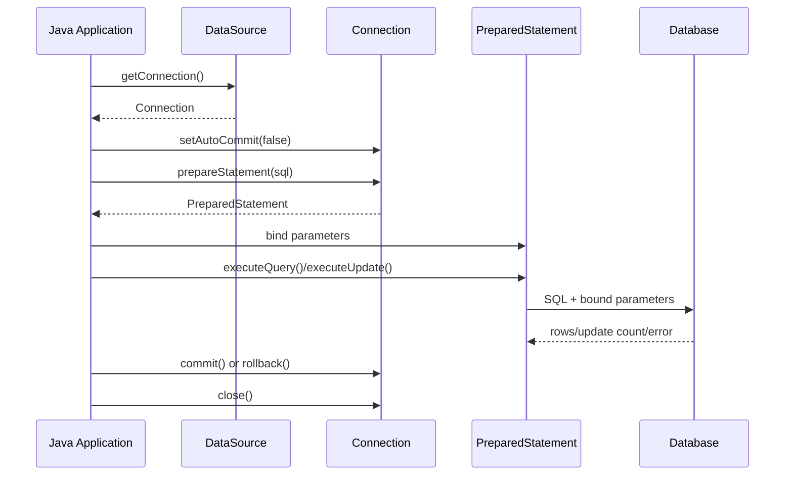
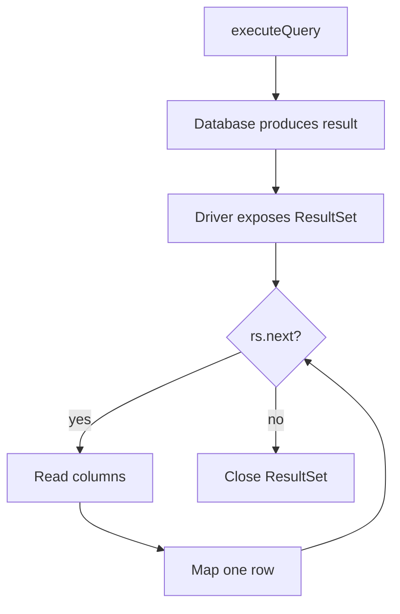
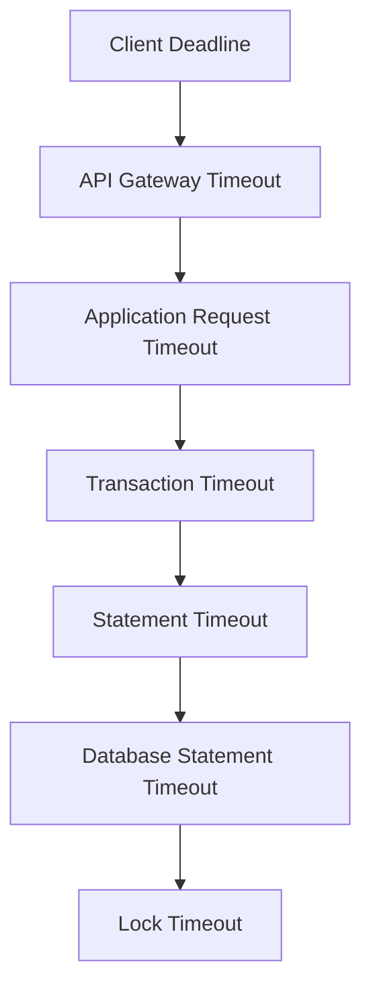
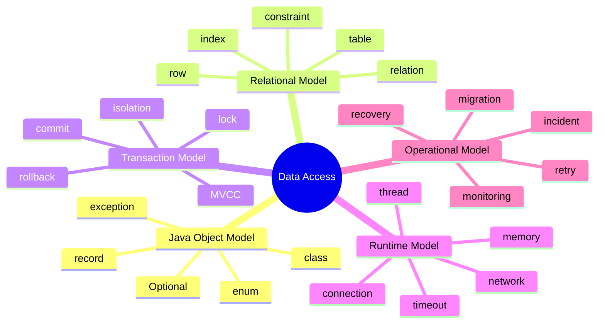

# Part 003 — Relational Access From Java

## 1. Inti Materi

Java tidak “menyimpan object ke database”. Java mengirim instruksi ke sistem lain yang punya mesin eksekusi, transaction manager, lock manager, buffer cache, query planner, storage engine, constraint engine, dan durability protocol.

Data access layer yang kuat dimulai dari mental model ini:

> Database adalah sistem stateful eksternal. Java hanya memegang handle sementara untuk berbicara dengan sistem itu.

Kalau mental model ini salah, abstraction apa pun di atasnya akan disalahgunakan. ORM akan dianggap seperti object graph biasa. Repository akan dianggap seperti collection in-memory. Transaction akan dianggap seperti annotation kosmetik. Query akan dianggap seperti function call murah.

Padahal satu operasi data access biasanya melibatkan:

1. mengambil connection dari `DataSource`,
2. membuka atau mengikuti transaction boundary,
3. mengirim SQL ke driver,
4. melakukan parameter binding,
5. menunggu database parse/plan/execute,
6. membaca hasil dari `ResultSet`,
7. mapping row menjadi object Java,
8. commit/rollback,
9. menutup resource,
10. mengembalikan connection ke pool.

Ini bukan local method call. Ini remote interaction dengan state machine yang lebih kuat daripada application process.

---

## 2. Tujuan Pembelajaran

Setelah part ini, kamu harus bisa menjelaskan:

- bagaimana Java melihat database relasional melalui JDBC primitive,
- apa perbedaan `DataSource`, `Connection`, `Statement`, `PreparedStatement`, dan `ResultSet`,
- kenapa `Connection` bukan sekadar “socket”, tetapi transaction-scoped execution context,
- kenapa `PreparedStatement` adalah default untuk query production,
- bagaimana lifecycle read/write terjadi dari perspektif Java,
- bagaimana transaction boundary terlihat di level JDBC,
- kenapa mapping `ResultSet` adalah boundary penting antara database model dan application model,
- apa saja failure mode yang wajib dipikirkan sejak awal.

---

## 3. Peta Besar: Dari Java Call ke Database State


Satu hal penting: data access layer bukan hanya “tempat query ditaruh”. Ia adalah boundary antara dua dunia:

| Dunia Java | Dunia Database |
|---|---|
| object, method, collection | relation, tuple, set, index |
| heap memory | buffer cache + disk |
| exception | SQLState/vendor code |
| thread | connection/session |
| object identity | primary key / tuple identity |
| method call | SQL protocol round trip |
| transaction annotation | physical transaction / logical transaction |
| nullable reference | SQL `NULL` dengan three-valued logic |

Data access engineer yang matang tidak mencampur dua dunia ini sembarangan. Ia membuat boundary eksplisit.

---

## 4. JDBC sebagai Primitive Dasar

Walaupun kamu memakai JPA, Hibernate, Spring Data, MyBatis, atau jOOQ, sebagian besar stack data access Java tetap berdiri di atas konsep JDBC.

JDBC menyediakan API standar untuk mengakses data source, terutama database relasional. Primitive utamanya:

| Primitive | Fungsi | Risiko Jika Salah Dipahami |
|---|---|---|
| `DataSource` | Factory/manager untuk memperoleh connection | Menganggap connection dibuat murah setiap operasi. |
| `Connection` | Session eksekusi ke database; membawa transaction state | Membocorkan connection, transaction terbuka, auto-commit tidak jelas. |
| `Statement` | Eksekusi SQL literal | SQL injection, plan tidak stabil, parameter tidak aman. |
| `PreparedStatement` | SQL dengan parameter binding | Salah binding tipe, lupa timeout, batch salah ukuran. |
| `CallableStatement` | Eksekusi stored procedure | Business logic tersembunyi, observability sulit. |
| `ResultSet` | Cursor hasil query | Memory membengkak, mapping rapuh, resource tidak tertutup. |

Minimal mental model:



---

## 5. `DataSource`: Entry Point yang Sering Diremehkan

`DataSource` adalah abstraction untuk memperoleh `Connection`. Dalam aplikasi production, `DataSource` biasanya bukan membuat physical connection baru setiap kali dipanggil. Ia biasanya terhubung dengan connection pool.

Namun di part ini, kita tidak membahas pool sebagai topik utama. Yang penting adalah invariant-nya:

> Kode aplikasi tidak boleh memperlakukan `Connection` sebagai resource bebas. Ia harus dipinjam, dipakai sebentar, lalu dikembalikan.

Contoh pola benar:

```java
public final class CustomerJdbcDao {
    private final DataSource dataSource;

    public CustomerJdbcDao(DataSource dataSource) {
        this.dataSource = Objects.requireNonNull(dataSource);
    }

    public Optional<CustomerView> findById(long customerId) throws SQLException {
        String sql = """
            select id, full_name, email, status
            from customers
            where id = ?
            """;

        try (Connection connection = dataSource.getConnection();
             PreparedStatement statement = connection.prepareStatement(sql)) {

            statement.setLong(1, customerId);

            try (ResultSet rs = statement.executeQuery()) {
                if (!rs.next()) {
                    return Optional.empty();
                }

                return Optional.of(mapCustomerView(rs));
            }
        }
    }

    private CustomerView mapCustomerView(ResultSet rs) throws SQLException {
        return new CustomerView(
            rs.getLong("id"),
            rs.getString("full_name"),
            rs.getString("email"),
            rs.getString("status")
        );
    }
}
```

Yang harus diperhatikan:

- `Connection`, `PreparedStatement`, dan `ResultSet` ditutup dengan `try-with-resources`.
- SQL eksplisit.
- Parameter tidak digabung string.
- Mapping row dipisahkan dari query execution.
- Return type memakai `Optional` karena query by ID bisa tidak menemukan data.

Pola buruk:

```java
public CustomerView findById(long customerId) throws SQLException {
    Connection connection = dataSource.getConnection();
    Statement statement = connection.createStatement();
    ResultSet rs = statement.executeQuery(
        "select * from customers where id = " + customerId
    );

    rs.next();
    return new CustomerView(
        rs.getLong("id"),
        rs.getString("full_name"),
        rs.getString("email"),
        rs.getString("status")
    );
}
```

Masalahnya:

- SQL injection risk.
- Resource leak.
- Tidak menangani row tidak ditemukan.
- `select *` membuat kontrak query tidak stabil.
- Mapping terikat ke bentuk tabel mentah.
- Tidak ada timeout.
- Tidak ada error semantics.

---

## 6. `Connection`: Execution Context, Bukan Sekadar Koneksi

`Connection` sering dianggap sekadar koneksi jaringan. Itu terlalu dangkal.

Dalam JDBC, `Connection` adalah context untuk:

- mengirim SQL,
- mengatur auto-commit,
- memulai/mengakhiri transaksi,
- commit,
- rollback,
- savepoint,
- isolation level,
- read-only hint,
- metadata access,
- statement creation.

Artinya, `Connection` memegang state.

Contoh:

```java
try (Connection connection = dataSource.getConnection()) {
    connection.setAutoCommit(false);

    try {
        debitAccount(connection, sourceAccountId, amount);
        creditAccount(connection, targetAccountId, amount);

        connection.commit();
    } catch (Exception e) {
        connection.rollback();
        throw e;
    }
}
```

Dalam contoh di atas, kedua operasi harus memakai `Connection` yang sama agar berada dalam transaksi fisik yang sama.

Anti-pattern umum:

```java
public void transfer(long from, long to, BigDecimal amount) {
    debitDao.debit(from, amount);   // opens connection A
    creditDao.credit(to, amount);   // opens connection B
}
```

Jika setiap DAO membuka connection sendiri dan tidak ada transaction coordination, operasi ini bukan satu transaksi atomik.

Correctness transaction tidak muncul dari nama method `transfer`. Correctness muncul dari boundary eksekusi yang benar.

---

## 7. Auto-Commit: Default yang Berbahaya Jika Tidak Disadari

Banyak driver/JDBC environment menggunakan auto-commit secara default. Dengan auto-commit, setiap statement dianggap sebagai transaksi sendiri.

Ini aman untuk operasi tunggal sederhana, tetapi berbahaya untuk operasi multi-step.

Contoh operasi multi-step:

```text
1. insert order
2. insert order items
3. reserve stock
4. write audit log
```

Jika auto-commit aktif, step 1 bisa commit, step 2 gagal, dan sistem masuk partial state.

Untuk operasi bisnis yang harus atomik, desainnya harus eksplisit:

```java
try (Connection connection = dataSource.getConnection()) {
    connection.setAutoCommit(false);

    try {
        long orderId = insertOrder(connection, command);
        insertOrderItems(connection, orderId, command.items());
        reserveStock(connection, command.items());
        insertAuditLog(connection, orderId, "ORDER_CREATED");

        connection.commit();
    } catch (Exception e) {
        safeRollback(connection, e);
        throw e;
    }
}
```

Dengan helper rollback:

```java
private static void safeRollback(Connection connection, Exception original) {
    try {
        connection.rollback();
    } catch (SQLException rollbackFailure) {
        original.addSuppressed(rollbackFailure);
    }
}
```

Kenapa rollback harus hati-hati?

Karena rollback sendiri bisa gagal. Network bisa putus. Connection bisa invalid. Database bisa sudah memutus session. Engineer matang tidak menganggap rollback selalu sukses secara lokal.

---

## 8. `Statement` vs `PreparedStatement`

`Statement` mengeksekusi SQL literal. `PreparedStatement` mengeksekusi SQL template dengan parameter binding.

Default production harus `PreparedStatement`, kecuali ada alasan eksplisit.

### 8.1 Buruk: String Concatenation

```java
String sql = "select id, email from users where email = '" + email + "'";
statement.executeQuery(sql);
```

Masalah:

- SQL injection.
- escaping salah.
- plan cache kurang stabil.
- tipe parameter tidak eksplisit.
- logging dan observability kacau.

### 8.2 Benar: Parameter Binding

```java
String sql = "select id, email from users where email = ?";

try (PreparedStatement ps = connection.prepareStatement(sql)) {
    ps.setString(1, email);

    try (ResultSet rs = ps.executeQuery()) {
        // map rows
    }
}
```

Parameter binding bukan hanya soal security. Ia juga soal kontrak antara Java dan database:

| Hal | Dengan Concatenation | Dengan Binding |
|---|---|---|
| Security | raw input masuk SQL | input jadi value |
| Type | implicit string formatting | driver tahu tipe parameter |
| Date/time | raw formatting rawan salah | driver handle conversion |
| Plan | SQL berubah per value | SQL shape lebih stabil |
| Readability | SQL tercampur data | SQL dan data terpisah |

---

## 9. `ResultSet`: Cursor, Bukan List

`ResultSet` sering disalahpahami sebagai list row di memory. Secara mental, anggap `ResultSet` sebagai cursor yang membaca hasil query.

Karena itu:

- ia terikat dengan `Statement`,
- `Statement` terikat dengan `Connection`,
- ketika salah satu ditutup, hasil bisa tidak lagi valid,
- membaca terlalu banyak row bisa menekan memory/network,
- mapping harus selesai sebelum resource ditutup.

Pola mapping yang sehat:

```java
public List<CustomerSummary> findActiveCustomers(int limit) throws SQLException {
    String sql = """
        select id, full_name, email
        from customers
        where status = ?
        order by id
        limit ?
        """;

    try (Connection connection = dataSource.getConnection();
         PreparedStatement ps = connection.prepareStatement(sql)) {

        ps.setString(1, "ACTIVE");
        ps.setInt(2, limit);

        try (ResultSet rs = ps.executeQuery()) {
            List<CustomerSummary> result = new ArrayList<>();
            while (rs.next()) {
                result.add(new CustomerSummary(
                    rs.getLong("id"),
                    rs.getString("full_name"),
                    rs.getString("email")
                ));
            }
            return result;
        }
    }
}
```

Mental model:



---

## 10. Row Mapping adalah Boundary Desain

Mapping bukan pekerjaan mekanis semata. Mapping adalah boundary antara database representation dan application representation.

Contoh tabel:

```sql
create table enforcement_case (
    id bigint primary key,
    case_number varchar(64) not null,
    subject_name varchar(256) not null,
    lifecycle_status varchar(32) not null,
    risk_score numeric(10, 2),
    created_at timestamp not null
);
```

DTO read model:

```java
public record CaseListItem(
    long id,
    String caseNumber,
    String subjectName,
    String statusLabel,
    BigDecimal riskScore,
    Instant createdAt
) {}
```

Mapper:

```java
private CaseListItem mapCaseListItem(ResultSet rs) throws SQLException {
    return new CaseListItem(
        rs.getLong("id"),
        rs.getString("case_number"),
        rs.getString("subject_name"),
        toStatusLabel(rs.getString("lifecycle_status")),
        rs.getBigDecimal("risk_score"),
        rs.getTimestamp("created_at").toInstant()
    );
}
```

Perhatikan: `statusLabel` bukan sekadar copy kolom. Ia adalah transformasi representation. Data access layer boleh melakukan mapping representation, tetapi hati-hati agar tidak berubah menjadi business rules engine.

Rule praktis:

| Mapping Boleh | Mapping Jangan |
|---|---|
| rename column ke field | menjalankan workflow decision |
| convert SQL type ke Java type | mengubah status bisnis tanpa use case |
| compose DTO read model | melakukan authorization logic |
| normalize enum/value object | memanggil remote service |
| handle nullable/default representation | menyimpan side effect tersembunyi |

---

## 11. Null Handling: SQL `NULL` Tidak Sama dengan Java `null`

SQL `NULL` berarti unknown/missing/not applicable tergantung model. Java `null` adalah absence of reference. Jika mapping asal-asalan, bug sulit dilacak.

Contoh problem:

```java
long closedByUserId = rs.getLong("closed_by_user_id");
```

Jika kolom `closed_by_user_id` bernilai `NULL`, `getLong` mengembalikan `0`, lalu kamu harus cek `rs.wasNull()`.

Pola lebih aman:

```java
private static Long nullableLong(ResultSet rs, String column) throws SQLException {
    long value = rs.getLong(column);
    return rs.wasNull() ? null : value;
}
```

Atau mapping ke `Optional` di boundary tertentu:

```java
public record CaseClosureInfo(
    long caseId,
    Optional<Long> closedByUserId,
    Optional<Instant> closedAt
) {}
```

Namun hati-hati: memakai `Optional` sebagai field di DTO tidak selalu disukai di semua codebase. Yang penting adalah kontrak absence harus eksplisit.

---

## 12. Type Conversion: Area Bug yang Tidak Terlihat

Relational access penuh dengan konversi tipe:

| SQL Type | Java Type Umum | Risiko |
|---|---|---|
| `bigint` | `long` / `Long` | `NULL` jadi `0` jika tidak dicek. |
| `numeric` | `BigDecimal` | precision hilang jika dipaksa `double`. |
| `varchar` | `String` | enum invalid tidak terdeteksi. |
| `timestamp` | `Instant` / `LocalDateTime` | timezone ambiguity. |
| `date` | `LocalDate` | berubah jika diperlakukan sebagai instant. |
| `boolean` | `boolean` / `Boolean` | `NULL` vs false. |
| JSON/JSONB | String / custom type | validation dan schema drift. |

Production rule:

> Jangan biarkan driver conversion diam-diam menjadi business decision.

Contoh buruk:

```java
double amount = rs.getDouble("amount");
```

Untuk uang, gunakan:

```java
BigDecimal amount = rs.getBigDecimal("amount");
```

Contoh buruk untuk timestamp:

```java
LocalDateTime createdAt = rs.getTimestamp("created_at").toLocalDateTime();
```

Bisa benar, tetapi hanya jika kamu sadar bahwa `LocalDateTime` tidak membawa timezone/offset. Untuk event time lintas service, `Instant` sering lebih eksplisit:

```java
Instant createdAt = rs.getTimestamp("created_at").toInstant();
```

---

## 13. Read Operation: Anatomy yang Benar

Sebuah read operation production-grade bukan sekadar `select`.

Ia punya elemen:

1. query purpose,
2. input contract,
3. SQL shape,
4. parameter binding,
5. limit/pagination,
6. timeout,
7. result mapping,
8. empty result semantics,
9. error translation,
10. observability.

Contoh:

```java
public List<CaseListItem> searchCases(CaseSearchFilter filter, PageRequest page) throws SQLException {
    String sql = """
        select id, case_number, subject_name, lifecycle_status, risk_score, created_at
        from enforcement_case
        where (? is null or lifecycle_status = ?)
          and (? is null or subject_name ilike ?)
        order by created_at desc, id desc
        limit ? offset ?
        """;

    try (Connection connection = dataSource.getConnection();
         PreparedStatement ps = connection.prepareStatement(sql)) {

        ps.setString(1, filter.status().orElse(null));
        ps.setString(2, filter.status().orElse(null));

        String subjectPattern = filter.subjectName()
            .map(value -> "%" + value + "%")
            .orElse(null);
        ps.setString(3, subjectPattern);
        ps.setString(4, subjectPattern);

        ps.setInt(5, page.limit());
        ps.setInt(6, page.offset());
        ps.setQueryTimeout(3);

        try (ResultSet rs = ps.executeQuery()) {
            List<CaseListItem> rows = new ArrayList<>();
            while (rs.next()) {
                rows.add(mapCaseListItem(rs));
            }
            return rows;
        }
    }
}
```

Ini bukan query terbaik untuk semua database karena dynamic predicate dengan `? is null` bisa berdampak ke plan. Namun sebagai contoh, ia menunjukkan contract yang eksplisit. Pada sistem besar, dynamic SQL builder atau jOOQ sering lebih baik untuk query kompleks.

---

## 14. Write Operation: Anatomy yang Benar

Write operation harus lebih defensif daripada read. Ia mengubah state.

Satu write operation harus menjawab:

- Apa precondition-nya?
- Apa row yang diubah?
- Apakah update count harus tepat satu?
- Bagaimana constraint violation diterjemahkan?
- Apakah operasi idempotent?
- Apakah aman di-retry?
- Apakah butuh audit trail?
- Apakah dalam transaksi yang benar?

Contoh update dengan expected row count:

```java
public void changeCaseStatus(long caseId, String fromStatus, String toStatus) throws SQLException {
    String sql = """
        update enforcement_case
        set lifecycle_status = ?, updated_at = current_timestamp
        where id = ?
          and lifecycle_status = ?
        """;

    try (Connection connection = dataSource.getConnection();
         PreparedStatement ps = connection.prepareStatement(sql)) {

        ps.setString(1, toStatus);
        ps.setLong(2, caseId);
        ps.setString(3, fromStatus);

        int updated = ps.executeUpdate();
        if (updated != 1) {
            throw new ConcurrentCaseStateChangeException(caseId, fromStatus, toStatus);
        }
    }
}
```

Kenapa `where lifecycle_status = ?` penting?

Karena update ini membawa optimistic concurrency check sederhana. Jika status sudah berubah oleh transaksi lain, operasi gagal, bukan diam-diam menimpa state.

Ini pola penting untuk workflow/regulatory/case-management system.

---

## 15. Generated Keys dan Identity Boundary

Insert sering perlu primary key hasil generate database.

```java
public long insertCase(NewCaseCommand command) throws SQLException {
    String sql = """
        insert into enforcement_case(case_number, subject_name, lifecycle_status, created_at)
        values (?, ?, ?, current_timestamp)
        """;

    try (Connection connection = dataSource.getConnection();
         PreparedStatement ps = connection.prepareStatement(sql, Statement.RETURN_GENERATED_KEYS)) {

        ps.setString(1, command.caseNumber());
        ps.setString(2, command.subjectName());
        ps.setString(3, "DRAFT");

        int inserted = ps.executeUpdate();
        if (inserted != 1) {
            throw new IllegalStateException("Expected one inserted case row, got " + inserted);
        }

        try (ResultSet keys = ps.getGeneratedKeys()) {
            if (!keys.next()) {
                throw new IllegalStateException("Database did not return generated case id");
            }
            return keys.getLong(1);
        }
    }
}
```

Production note:

- Generated key behavior bisa berbeda antar database/driver.
- Beberapa database lebih nyaman memakai `returning` clause.
- Untuk distributed systems, kadang key dibuat application-side memakai UUID/ULID/Snowflake-like ID.
- Untuk regulatory auditability, key strategy harus stabil dan bisa dijelaskan.

---

## 16. Transaction Isolation dari Perspektif Java

Java tidak menjalankan isolation. Database yang menjalankan. Java hanya meminta isolation level melalui `Connection` atau framework transaction manager.

Contoh:

```java
try (Connection connection = dataSource.getConnection()) {
    connection.setTransactionIsolation(Connection.TRANSACTION_REPEATABLE_READ);
    connection.setAutoCommit(false);

    try {
        // execute reads/writes
        connection.commit();
    } catch (Exception e) {
        connection.rollback();
        throw e;
    }
}
```

Namun isolation bukan toggle ajaib. Ia berinteraksi dengan database implementation.

Masalah yang perlu dipahami:

| Anomaly | Contoh |
|---|---|
| Dirty read | Membaca data transaksi lain yang belum commit. |
| Non-repeatable read | Membaca row yang sama dua kali, nilainya berubah. |
| Phantom read | Query range yang sama menghasilkan row tambahan/hilang. |
| Lost update | Dua transaksi membaca nilai lama, lalu update saling menimpa. |
| Write skew | Dua transaksi lolos validasi terpisah, tetapi gabungannya melanggar invariant. |

Di Java, kamu biasanya mengendalikan ini dengan kombinasi:

- transaction boundary yang benar,
- isolation level,
- unique constraint,
- foreign key,
- check constraint,
- optimistic locking,
- pessimistic locking,
- conditional update,
- retry.

Part 017–024 nanti membahas transaksi dan consistency boundary lebih dalam.

---

## 17. SQL Shape adalah Contract

SQL bukan string sementara. SQL adalah contract antara application dan database.

SQL shape mencakup:

- tabel yang disentuh,
- kolom yang dipilih,
- predicate,
- join,
- sorting,
- grouping,
- pagination,
- lock clause,
- returning/generated key behavior.

Contoh SQL rapuh:

```sql
select * from enforcement_case where subject_name like ?
```

Kenapa rapuh?

- `select *` membuat mapping tergantung perubahan schema.
- `like` bisa case-sensitive/insensitive tergantung database/collation.
- leading wildcard bisa membunuh index.
- tidak ada `order by`, hasil pagination tidak stabil.
- tidak ada limit, bisa membaca terlalu banyak row.

Lebih jelas:

```sql
select id, case_number, subject_name, lifecycle_status, created_at
from enforcement_case
where normalized_subject_name like ?
order by created_at desc, id desc
limit ?
```

Production rule:

> Setiap SQL yang dipakai aplikasi harus bisa direview seperti public API.

---

## 18. Boundary Error: Jangan Bocorkan `SQLException` Mentah ke Domain

JDBC melempar `SQLException`. Namun domain/application layer biasanya tidak boleh bergantung langsung pada vendor-specific SQL error.

Buruk:

```java
public void createUser(CreateUserCommand command) throws SQLException {
    userDao.insert(command);
}
```

Lebih baik:

```java
public void createUser(CreateUserCommand command) {
    try {
        userDao.insert(command);
    } catch (DuplicateEmailSqlException e) {
        throw new EmailAlreadyRegisteredException(command.email(), e);
    } catch (DataAccessFailureException e) {
        throw e;
    }
}
```

Atau translation di DAO:

```java
public void insertUser(CreateUserCommand command) {
    try {
        doInsert(command);
    } catch (SQLException e) {
        throw translate(e);
    }
}

private RuntimeException translate(SQLException e) {
    if (isUniqueViolation(e)) {
        return new DuplicateUserException(e);
    }
    if (isDeadlock(e)) {
        return new TransientDataAccessException(e);
    }
    return new DataAccessFailureException(e);
}
```

Error classification yang berguna:

| Error | Contoh | Biasanya Retry? |
|---|---|---|
| Constraint violation | unique/foreign key/check | Tidak, kecuali command berubah. |
| Deadlock | transaksi saling menunggu | Bisa, dengan retry terbatas. |
| Serialization failure | concurrent anomaly dicegah DB | Bisa, dengan retry transaksi. |
| Query timeout | DB lambat/plan buruk/load tinggi | Hati-hati, retry bisa memperburuk. |
| Connection failure | network/DB failover | Bisa, tergantung idempotency. |
| Syntax error | SQL salah | Tidak. Bug. |

---

## 19. Timeout adalah Bagian dari Correctness

Tanpa timeout, data access layer bisa menggantung lebih lama dari request budget.

Misalnya:

```text
HTTP timeout:        2 seconds
Service logic:       300 ms
Database query:      no timeout
Pool acquisition:    no timeout
```

Jika query macet 30 detik, request mungkin sudah gagal di client, tetapi thread dan connection masih tertahan. Ini bisa memicu cascading failure.

Di JDBC, statement timeout bisa diatur:

```java
ps.setQueryTimeout(2);
```

Namun production timeout harus selaras dari atas ke bawah:



Prinsipnya:

> Data access tidak boleh punya timeout lebih panjang dari lifecycle request yang membutuhkannya, kecuali operasi itu sengaja asynchronous dan durable.

---

## 20. Resource Lifecycle: Close Bukan Detail Kecil

Kesalahan close resource adalah salah satu penyebab bug production yang paling klasik.

Urutan resource:

```text
Connection
  └── PreparedStatement
        └── ResultSet
```

Jika `ResultSet` terbuka, statement biasanya masih terkait. Jika statement terbuka, connection masih dipakai. Jika connection tidak ditutup, pool bisa habis.

Gunakan `try-with-resources`.

Benar:

```java
try (Connection connection = dataSource.getConnection();
     PreparedStatement ps = connection.prepareStatement(sql)) {

    try (ResultSet rs = ps.executeQuery()) {
        while (rs.next()) {
            // map
        }
    }
}
```

Jangan return `ResultSet` keluar DAO:

```java
public ResultSet findRawCases() {
    // bad: caller now owns database cursor lifecycle
}
```

Kalau ingin streaming, buat contract yang jelas dan pastikan lifecycle ditutup. Namun streaming data dari DB ke luar boundary aplikasi jauh lebih sulit daripada terlihat.

---

## 21. Why Relational Access Feels Hard

Relational access terasa sulit bukan karena API-nya banyak, tetapi karena ia memaksa kita menyelaraskan beberapa model sekaligus:



Engineer biasa melihat query sebagai cara mengambil data.

Engineer kuat melihat query sebagai intersection antara:

- business invariant,
- data shape,
- physical access path,
- concurrency behavior,
- operational risk.

---

## 22. Minimal Data Access Contract yang Baik

Contoh contract lemah:

```java
List<Case> getCases(String status);
```

Masalah:

- status string bebas,
- tidak jelas limit/pagination,
- return entity atau DTO tidak jelas,
- sorting tidak jelas,
- empty result semantics tidak eksplisit,
- tidak jelas untuk screen apa,
- tidak jelas transaction expectation.

Lebih baik:

```java
public interface CaseQueryRepository {
    Page<CaseListItem> search(CaseSearchCriteria criteria, PageRequest pageRequest);
}
```

Dengan criteria:

```java
public record CaseSearchCriteria(
    Optional<CaseStatus> status,
    Optional<String> subjectName,
    Optional<Instant> createdFrom,
    Optional<Instant> createdTo
) {}
```

Dan page request:

```java
public record PageRequest(
    int limit,
    int offset,
    SortOrder sortOrder
) {
    public PageRequest {
        if (limit < 1 || limit > 200) {
            throw new IllegalArgumentException("limit must be between 1 and 200");
        }
        if (offset < 0) {
            throw new IllegalArgumentException("offset must be non-negative");
        }
    }
}
```

Kontrak yang baik membatasi kerusakan sebelum SQL dieksekusi.

---

## 23. Read Model vs Domain Model

Jangan selalu mengambil domain aggregate untuk kebutuhan read screen.

Contoh screen daftar kasus hanya butuh:

- case number,
- subject name,
- status,
- risk score,
- created date.

Tidak perlu load:

- semua attachment,
- semua officer assignment,
- semua audit log,
- semua violation details,
- semua lifecycle transitions.

Buruk:

```java
List<EnforcementCase> cases = caseRepository.findByStatus(ACTIVE);
return cases.stream()
    .map(CaseListItem::fromAggregate)
    .toList();
```

Jika aggregate besar, ini boros.

Lebih baik:

```java
List<CaseListItem> rows = caseQueryRepository.findCaseListItems(criteria, page);
```

Data access layer yang baik tidak memaksa semua query melewati model yang sama.

---

## 24. Use Case: Case Assignment dengan Conditional Update

Misalkan ada sistem case management. Case hanya boleh di-assign jika status `READY_FOR_ASSIGNMENT` dan belum punya officer.

Naive implementation:

```java
Case c = caseDao.findById(caseId);
if (!c.status().equals("READY_FOR_ASSIGNMENT")) {
    throw new InvalidStateException();
}
if (c.assignedOfficerId() != null) {
    throw new AlreadyAssignedException();
}
caseDao.assign(caseId, officerId);
```

Masalah concurrency:

- dua user membaca case bersamaan,
- keduanya melihat unassigned,
- keduanya melakukan assign,
- update terakhir menang.

Lebih aman dengan conditional update:

```java
public void assignCase(long caseId, long officerId) throws SQLException {
    String sql = """
        update enforcement_case
        set assigned_officer_id = ?,
            lifecycle_status = ?,
            updated_at = current_timestamp
        where id = ?
          and lifecycle_status = ?
          and assigned_officer_id is null
        """;

    try (Connection connection = dataSource.getConnection();
         PreparedStatement ps = connection.prepareStatement(sql)) {

        ps.setLong(1, officerId);
        ps.setString(2, "ASSIGNED");
        ps.setLong(3, caseId);
        ps.setString(4, "READY_FOR_ASSIGNMENT");

        int updated = ps.executeUpdate();
        if (updated != 1) {
            throw new CaseAssignmentConflictException(caseId);
        }
    }
}
```

Di sini SQL bukan hanya persistence. SQL menjaga invariant.

---

## 25. Invariant untuk Relational Access dari Java

Pegang invariant berikut sepanjang seri:

1. **Connection is scoped** — jangan simpan `Connection` sebagai field singleton.
2. **SQL shape is contract** — hindari `select *` untuk query aplikasi.
3. **PreparedStatement is default** — string concatenation bukan pilihan normal.
4. **ResultSet is cursor** — map di dalam lifecycle resource.
5. **Transaction boundary must be explicit** — jangan berharap atomicity muncul otomatis.
6. **Update count matters** — write operation harus memeriksa jumlah row terdampak.
7. **Timeout is correctness** — tanpa timeout, failure bisa menyebar.
8. **Mapping is boundary** — jangan bocorkan schema mentah ke seluruh aplikasi.
9. **Error must be translated** — SQL error mentah bukan bahasa domain.
10. **Database constraints are allies** — jangan validasi semua invariant hanya di Java.

---

## 26. Checklist Review Data Access Method

Gunakan checklist ini saat review method DAO/repository:

- Apakah method punya purpose yang jelas?
- Apakah input divalidasi sebelum query?
- Apakah SQL eksplisit memilih kolom yang dibutuhkan?
- Apakah parameter memakai binding, bukan concatenation?
- Apakah query punya limit/pagination jika hasil bisa besar?
- Apakah sorting deterministik?
- Apakah timeout disetel atau dikelola framework?
- Apakah resource lifecycle aman?
- Apakah mapping null/type aman?
- Apakah write memeriksa update count?
- Apakah error diterjemahkan ke exception yang bermakna?
- Apakah method tidak menyembunyikan remote call lain?
- Apakah transaction boundary jelas?
- Apakah test integration memakai database nyata atau compatible?

---

## 27. Latihan Mental Model

Ambil method data access dari codebase yang pernah kamu lihat. Jawab:

1. Apakah method itu read, write, atau mixed?
2. Siapa pemilik transaction boundary-nya?
3. Apakah SQL shape terlihat jelas?
4. Apa yang terjadi jika database lambat?
5. Apa yang terjadi jika row tidak ditemukan?
6. Apa yang terjadi jika dua user menjalankan operasi bersamaan?
7. Apa yang terjadi jika commit sukses tapi network putus sebelum response?
8. Apakah method aman di-retry?
9. Apakah hasil mapping akan rusak jika kolom baru ditambahkan?
10. Apakah exception-nya bisa dipahami oleh caller?

Jika kamu tidak bisa menjawab, data access contract-nya belum cukup eksplisit.

---

## 28. Ringkasan

Relational access from Java bukan sekadar “connect lalu query”. Ia adalah disiplin boundary design.

JDBC primitive mengajarkan hal yang tetap berlaku di abstraction lebih tinggi:

- `DataSource` memberi akses ke connection.
- `Connection` membawa execution dan transaction context.
- `PreparedStatement` memisahkan SQL shape dari parameter value.
- `ResultSet` adalah cursor yang harus dimapping dalam lifecycle resource.
- Transaction correctness bergantung pada boundary nyata, bukan nama method.
- Write correctness sering bergantung pada conditional update, constraint, dan row count.
- Error, timeout, null, type conversion, dan resource lifecycle adalah bagian dari desain, bukan detail plumbing.

Kalau fondasi ini kuat, JPA/Hibernate/jOOQ/MyBatis/Spring Data menjadi alat yang bisa dipilih secara sadar. Kalau fondasi ini lemah, framework hanya menyembunyikan masalah sampai production membukanya dengan cara yang mahal.

---

## References

- Oracle Java SE Documentation — `java.sql.Connection`
- Oracle Java SE Documentation — `java.sql.PreparedStatement`
- Oracle Java SE Documentation — `java.sql.ResultSet`
- Oracle JDBC Tutorial — Prepared Statements
- Jakarta Persistence Documentation — `EntityManager` and persistence context
