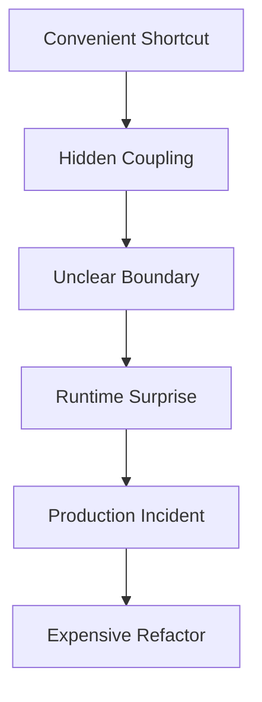
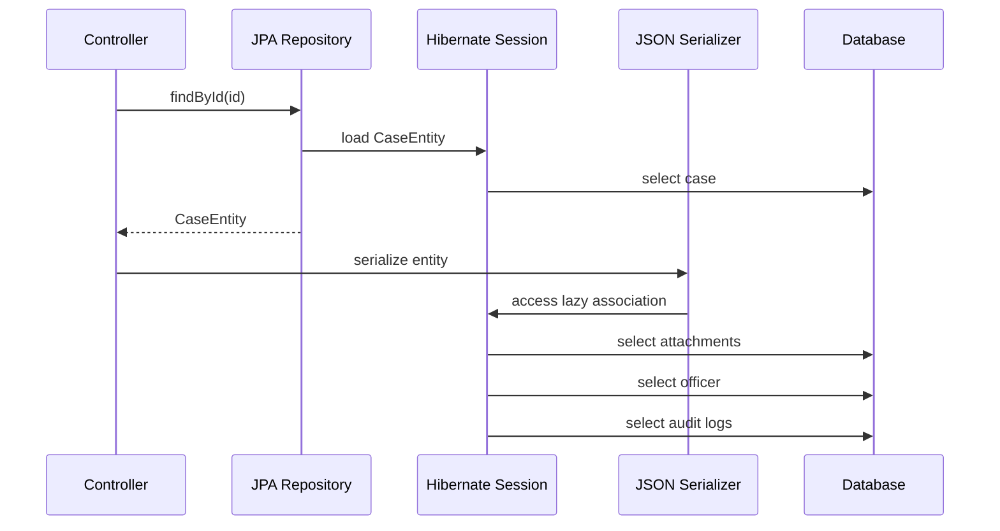
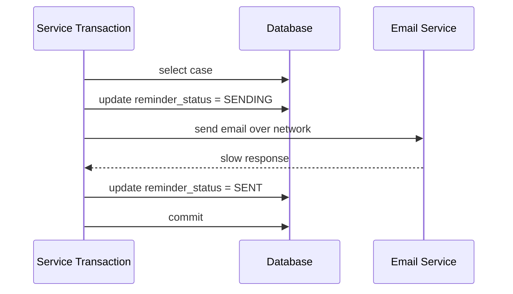

# Part 004 — Anti-Patterns That Destroy Data Layers

## 1. Inti Materi

Data access layer jarang rusak karena satu bug besar. Ia biasanya rusak karena banyak keputusan kecil yang terlihat praktis:

- “Pakai `findAll()` dulu, nanti filter di Java.”
- “Return entity saja biar gampang.”
- “Generic repository saja biar reuse.”
- “Taruh `@Transactional` di semua service.”
- “Lazy loading nanti juga jalan.”
- “Test pakai mock repository cukup.”
- “SQL-nya di-generate framework, tidak perlu dilihat.”

Keputusan seperti ini terasa cepat di awal, tetapi membangun sistem yang rapuh: query tidak terlihat, transaction boundary kabur, object graph bocor ke API, pagination lambat, testing menipu, dan incident production sulit dianalisis.

Part ini membahas anti-pattern utama yang perlu kamu kenali sejak dini.

Tujuannya bukan membuat kamu anti-framework. Tujuannya membuat kamu tidak dikendalikan framework.

---

## 2. Cara Membaca Anti-Pattern

Setiap anti-pattern akan dijelaskan dengan struktur:

- **Gejala**: seperti apa terlihat di codebase.
- **Kenapa berbahaya**: failure mode production.
- **Versi lebih baik**: pola desain yang lebih aman.
- **Review question**: pertanyaan yang bisa dipakai saat code review.

Mental model:



Anti-pattern data access hampir selalu punya bentuk yang sama: convenience lokal ditukar dengan ketidakjelasan sistemik.

---

## 3. Anti-Pattern #1 — Repository sebagai Dumping Ground

### Gejala

Repository berisi semua jenis operasi:

```java
public interface CaseRepository {
    Case save(Case c);
    Optional<Case> findById(Long id);
    List<Case> findAll();
    List<Case> findByStatus(String status);
    List<Case> findDashboardData(String officerName, String region, String riskLevel);
    List<Object[]> monthlyPerformanceReport(LocalDate from, LocalDate to);
    void assignOfficer(Long caseId, Long officerId);
    void bulkCloseCases(List<Long> caseIds);
    void updateStatusForMigration(String oldStatus, String newStatus);
}
```

Repository menjadi campuran:

- aggregate persistence,
- dashboard query,
- reporting query,
- migration helper,
- bulk command,
- workflow operation,
- admin operation.

### Kenapa Berbahaya

Repository kehilangan boundary. Caller tidak tahu method mana yang aman dipakai untuk domain transaction, mana yang untuk reporting, mana yang untuk migration.

Dampaknya:

- class/interface membengkak,
- query ownership tidak jelas,
- transaction expectation tidak jelas,
- domain method bercampur read model,
- test fixture sulit,
- perubahan kecil mempengaruhi banyak use case.

### Versi Lebih Baik

Pisahkan berdasarkan purpose:

```java
public interface CaseRepository {
    Optional<EnforcementCase> findAggregateById(CaseId id);
    void save(EnforcementCase aggregate);
}

public interface CaseQueryRepository {
    Page<CaseListItem> search(CaseSearchCriteria criteria, PageRequest page);
    Optional<CaseDetailView> findDetailView(CaseId id);
}

public interface CaseAssignmentGateway {
    AssignmentResult assignIfReady(CaseId caseId, OfficerId officerId);
}

public interface CaseReportQuery {
    List<MonthlyPerformanceRow> monthlyPerformance(LocalDate from, LocalDate to);
}
```

Bukan semua harus interface. Yang penting boundary purpose jelas.

### Review Question

> Apakah repository ini merepresentasikan satu model akses data yang koheren, atau hanya tempat semua query dibuang?

---

## 4. Anti-Pattern #2 — Generic Repository untuk Semua Entity

### Gejala

```java
public interface GenericRepository<T, ID> {
    T save(T entity);
    Optional<T> findById(ID id);
    List<T> findAll();
    void delete(T entity);
}
```

Lalu semua entity memakai pola yang sama:

```java
CustomerRepository extends GenericRepository<Customer, Long>
CaseRepository extends GenericRepository<Case, Long>
PaymentRepository extends GenericRepository<Payment, Long>
```

### Kenapa Berbahaya

Generic repository terlihat reusable, tetapi sering menghapus bahasa domain.

Tidak semua aggregate boleh:

- dihapus bebas,
- dicari semua,
- disimpan langsung,
- di-update tanpa transition,
- dimodifikasi di luar invariant.

Contoh regulatory case:

```java
caseRepository.delete(caseEntity);
```

Apakah case boleh dihapus? Dalam sistem regulatory/enforcement, biasanya tidak. Data harus retained, closed, voided, superseded, atau archived dengan audit trail. `delete` generic adalah operasi berbahaya.

### Versi Lebih Baik

Repository contract harus berbicara dalam bahasa operasi yang sah:

```java
public interface EnforcementCaseRepository {
    Optional<EnforcementCase> findOpenCase(CaseId id);
    void saveNewDraft(EnforcementCase draft);
    void saveAfterLifecycleTransition(EnforcementCase changedCase);
}
```

Atau command-specific gateway:

```java
public interface CaseClosureGateway {
    CloseCaseResult closeIfCurrentlyInReview(
        CaseId caseId,
        OfficerId officerId,
        ClosureReason reason
    );
}
```

### Review Question

> Apakah generic CRUD method ini memungkinkan operasi yang tidak sah secara domain?

---

## 5. Anti-Pattern #3 — Entity Bocor ke API/UI Layer

### Gejala

Controller langsung return JPA entity:

```java
@GetMapping("/cases/{id}")
public CaseEntity getCase(@PathVariable Long id) {
    return caseRepository.findById(id).orElseThrow();
}
```

Atau service mengirim entity ke frontend:

```java
return caseJpaRepository.findAll();
```

### Kenapa Berbahaya

Entity persistence bukan DTO API.

Jika entity bocor:

- lazy association bisa ter-trigger saat serialization,
- field internal ikut terekspos,
- API contract berubah ketika mapping database berubah,
- bidirectional association bisa infinite recursion,
- security filtering sulit,
- write model dan read model tercampur,
- persistence annotation menjadi bagian dari public contract.

Diagram kegagalan umum:



Serialization menjadi query engine tersembunyi.

### Versi Lebih Baik

Return DTO/read model eksplisit:

```java
public record CaseDetailResponse(
    String caseNumber,
    String subjectName,
    String lifecycleStatus,
    List<AttachmentSummary> attachments,
    List<AuditLogItem> auditTrail
) {}
```

Query khusus:

```java
public interface CaseDetailQuery {
    Optional<CaseDetailResponse> findCaseDetail(CaseId id, UserContext viewer);
}
```

Controller:

```java
@GetMapping("/cases/{id}")
public CaseDetailResponse getCase(@PathVariable Long id) {
    return caseDetailQuery.findCaseDetail(new CaseId(id), currentUser())
        .orElseThrow(NotFoundException::new);
}
```

### Review Question

> Apakah object yang keluar dari data access layer masih membawa persistence behavior?

---

## 6. Anti-Pattern #4 — `findAll()` lalu Filter di Java

### Gejala

```java
List<CaseEntity> activeHighRiskCases = caseRepository.findAll().stream()
    .filter(c -> c.getStatus() == ACTIVE)
    .filter(c -> c.getRiskScore().compareTo(HIGH_RISK) >= 0)
    .toList();
```

### Kenapa Berbahaya

Ini memindahkan pekerjaan database ke application memory.

Dampak:

- membaca terlalu banyak row,
- melewati index,
- membebani heap,
- memperlambat response,
- membuat pagination salah,
- race condition lebih besar karena data dibaca luas,
- query intent tidak bisa di-review oleh DBA/engineer lain.

### Versi Lebih Baik

Push predicate ke database:

```sql
select id, case_number, subject_name, risk_score
from enforcement_case
where lifecycle_status = ?
  and risk_score >= ?
order by risk_score desc, id desc
limit ?
```

Contract:

```java
List<HighRiskCaseItem> findActiveHighRiskCases(BigDecimal minimumRiskScore, int limit);
```

### Review Question

> Apakah filtering ini seharusnya dilakukan oleh database karena menyangkut predicate data?

---

## 7. Anti-Pattern #5 — Pagination Tanpa Sorting Deterministik

### Gejala

```sql
select id, case_number, subject_name
from enforcement_case
limit 50 offset 100
```

Tanpa `order by`.

Atau sorting tidak unik:

```sql
order by created_at desc
limit 50 offset 100
```

Jika banyak row punya `created_at` sama, urutan antar page bisa tidak stabil.

### Kenapa Berbahaya

User bisa melihat:

- data duplikat di page berbeda,
- data hilang saat pindah page,
- hasil berubah antar request,
- export tidak konsisten.

### Versi Lebih Baik

Tambahkan tie-breaker stabil:

```sql
order by created_at desc, id desc
limit ? offset ?
```

Untuk dataset besar, pertimbangkan keyset pagination:

```sql
where (created_at, id) < (?, ?)
order by created_at desc, id desc
limit ?
```

### Review Question

> Apakah urutan hasil tetap stabil jika ada banyak row dengan nilai sort yang sama?

---

## 8. Anti-Pattern #6 — N+1 Query sebagai “Performance Bug Biasa”

### Gejala

```java
List<CaseEntity> cases = caseRepository.findByStatus(ACTIVE);

for (CaseEntity c : cases) {
    Officer officer = c.getAssignedOfficer();
    System.out.println(officer.getName());
}
```

Satu query mengambil cases. Lalu setiap case memicu query tambahan untuk officer.

### Kenapa Berbahaya

N+1 bukan sekadar lambat. Ia adalah tanda bahwa query shape tidak sesuai dengan data yang dibutuhkan use case.

Contoh:

```text
1 query untuk 100 cases
100 query untuk assigned officer
100 query untuk latest action
100 query untuk region
= 301 query untuk satu screen
```

Di local environment mungkin masih terasa cepat. Di production dengan latency, lock, pool contention, dan traffic, ini menjadi incident.

### Versi Lebih Baik

Untuk read screen, pakai projection/query khusus:

```sql
select c.id,
       c.case_number,
       c.subject_name,
       c.lifecycle_status,
       o.display_name as assigned_officer_name
from enforcement_case c
left join officer o on o.id = c.assigned_officer_id
where c.lifecycle_status = ?
order by c.created_at desc, c.id desc
limit ?
```

DTO:

```java
public record CaseListItem(
    long id,
    String caseNumber,
    String subjectName,
    String status,
    String assignedOfficerName
) {}
```

Untuk JPA/Hibernate, gunakan fetch strategy secara sadar: fetch join, entity graph, batch fetch, atau DTO projection sesuai kebutuhan.

### Review Question

> Apakah jumlah query bertambah mengikuti jumlah row hasil query pertama?

---

## 9. Anti-Pattern #7 — Transaction Everywhere

### Gejala

Semua service method diberi transaction:

```java
@Transactional
public List<CaseListItem> searchCases(CaseSearchCriteria criteria) {
    return caseRepository.search(criteria);
}

@Transactional
public CaseDetail getCaseDetail(Long id) {
    return caseRepository.findDetail(id);
}

@Transactional
public void sendReminder(Long caseId) {
    Case c = caseRepository.findById(caseId).orElseThrow();
    emailClient.sendReminder(c);
    c.markReminderSent();
}
```

### Kenapa Berbahaya

Transaction menjadi default tanpa desain.

Dampaknya:

- transaksi read-only tidak dibedakan dari write,
- remote call terjadi di dalam transaksi,
- lock dipegang terlalu lama,
- connection tertahan saat menunggu network,
- rollback expectation kabur,
- nested transaction behavior tidak dipahami.

Contoh buruk:



Selama email call lambat, transaction dan connection tertahan.

### Versi Lebih Baik

Pisahkan durable state change dan external side effect:

```java
@Transactional
public void requestReminder(CaseId caseId) {
    caseReminderRepository.markReminderRequested(caseId);
    outboxRepository.append(new ReminderRequestedEvent(caseId));
}
```

Worker di luar transaction request:

```java
public void processReminder(ReminderRequestedEvent event) {
    emailClient.sendReminder(event.caseId());
    reminderRepository.markSent(event.caseId());
}
```

### Review Question

> Apakah ada network call, file IO, sleep, queue publish non-transactional, atau heavy computation di dalam transaction boundary?

---

## 10. Anti-Pattern #8 — Transaction Boundary di Repository, Bukan Use Case

### Gejala

Setiap repository method membuka transaksi sendiri:

```java
public void approveCase(CaseId id) {
    caseRepository.markApproved(id);       // transaction A
    auditRepository.insertApprovalLog(id); // transaction B
    taskRepository.closeTasks(id);         // transaction C
}
```

### Kenapa Berbahaya

Use case terlihat atomik, tetapi secara fisik terpecah.

Jika `markApproved` sukses, lalu `insertApprovalLog` gagal, state menjadi tidak konsisten.

### Versi Lebih Baik

Transaction boundary mengikuti use case:

```java
@Transactional
public void approveCase(CaseId id, OfficerId approver) {
    caseRepository.markApproved(id, approver);
    auditRepository.insertApprovalLog(id, approver);
    taskRepository.closeApprovalTasks(id);
}
```

Atau explicit JDBC connection passed through jika tidak memakai framework:

```java
try (Connection c = dataSource.getConnection()) {
    c.setAutoCommit(false);
    try {
        caseDao.markApproved(c, id, approver);
        auditDao.insertApprovalLog(c, id, approver);
        taskDao.closeApprovalTasks(c, id);
        c.commit();
    } catch (Exception e) {
        c.rollback();
        throw e;
    }
}
```

### Review Question

> Apakah semua state change yang harus atomik benar-benar berjalan di transaksi yang sama?

---

## 11. Anti-Pattern #9 — Read Method Mengubah State Diam-Diam

### Gejala

```java
public CaseDetail getCaseDetail(Long id) {
    CaseEntity c = caseRepository.findById(id).orElseThrow();
    c.setLastViewedAt(Instant.now());
    return mapper.toDetail(c);
}
```

Atau:

```java
public User findByToken(String token) {
    User user = userRepository.findByToken(token).orElseThrow();
    user.incrementTokenUsageCount();
    return user;
}
```

### Kenapa Berbahaya

Read path menjadi write path tersembunyi.

Dampaknya:

- read scaling sulit,
- cache tidak aman,
- transaction read-only bohong,
- audit tidak jelas,
- load tinggi karena read menghasilkan write,
- dirty checking ORM bisa flush tanpa disadari.

### Versi Lebih Baik

Pisahkan command:

```java
public CaseDetail getCaseDetail(CaseId id) {
    return caseDetailQuery.findById(id).orElseThrow();
}

public void recordCaseViewed(CaseId id, UserId viewer) {
    caseViewEventRepository.append(new CaseViewedEvent(id, viewer, clock.instant()));
}
```

Jika harus sinkron, tetap eksplisit di use case:

```java
@Transactional
public CaseDetail openCase(CaseId id, UserId viewer) {
    CaseDetail detail = caseDetailQuery.findById(id).orElseThrow();
    caseViewRepository.recordView(id, viewer, clock.instant());
    return detail;
}
```

### Review Question

> Apakah method bernama read/get/find/search melakukan write karena efek samping ORM atau update tersembunyi?

---

## 12. Anti-Pattern #10 — Mengandalkan Application Validation Saja

### Gejala

```java
if (userRepository.existsByEmail(email)) {
    throw new DuplicateEmailException(email);
}
userRepository.insert(email);
```

Tanpa unique constraint di database.

### Kenapa Berbahaya

Dua request concurrent bisa lolos `existsByEmail` bersamaan, lalu insert duplicate.

Application validation adalah UX/helper. Database constraint adalah guardrail konsistensi.

### Versi Lebih Baik

Tambahkan unique constraint:

```sql
alter table app_user
add constraint uq_app_user_email unique (email);
```

Lalu translate constraint violation:

```java
try {
    userDao.insert(email);
} catch (UniqueConstraintViolation e) {
    throw new DuplicateEmailException(email, e);
}
```

### Review Question

> Apakah invariant penting tetap benar jika dua request berjalan bersamaan?

---

## 13. Anti-Pattern #11 — Update Tanpa Expected State

### Gejala

```sql
update enforcement_case
set lifecycle_status = 'APPROVED'
where id = ?
```

### Kenapa Berbahaya

Query ini mengizinkan transisi dari status apa pun ke `APPROVED`.

Misalnya case sudah `CANCELLED`, `REJECTED`, atau `CLOSED`, query tetap bisa mengubahnya menjadi `APPROVED`.

### Versi Lebih Baik

Conditional update:

```sql
update enforcement_case
set lifecycle_status = 'APPROVED',
    approved_by = ?,
    approved_at = current_timestamp
where id = ?
  and lifecycle_status = 'UNDER_REVIEW'
```

Lalu cek update count:

```java
if (updated != 1) {
    throw new InvalidCaseTransitionException(caseId, "UNDER_REVIEW", "APPROVED");
}
```

Untuk entity ORM, gunakan optimistic locking `@Version` atau explicit state transition validation plus version check.

### Review Question

> Apakah write ini menegaskan precondition state yang diharapkan?

---

## 14. Anti-Pattern #12 — Mengabaikan Update Count

### Gejala

```java
preparedStatement.executeUpdate();
```

Tanpa mengecek hasil.

### Kenapa Berbahaya

`executeUpdate()` mengembalikan jumlah row terdampak. Untuk banyak operasi bisnis, nilai ini adalah sinyal correctness.

Jika expected one row tetapi hasil nol:

- row tidak ditemukan,
- state sudah berubah,
- optimistic condition gagal,
- tenant boundary salah,
- permission filter mencegah update.

Jika expected one row tetapi hasil lebih dari satu:

- predicate terlalu luas,
- data corruption,
- constraint kurang,
- bug query serius.

### Versi Lebih Baik

```java
int updated = ps.executeUpdate();
if (updated != 1) {
    throw new UnexpectedUpdateCountException("Expected 1 row, got " + updated);
}
```

Untuk bulk operation, expected count bisa range atau equal dengan input size, tergantung semantics.

### Review Question

> Apakah jumlah row yang berubah adalah bagian dari contract method ini?

---

## 15. Anti-Pattern #13 — SQL Tidak Bisa Direview

### Gejala

Query tersembunyi di:

- method name derivation panjang,
- ORM lazy loading,
- dynamic reflection,
- string builder tidak terstruktur,
- framework default,
- stored procedure tanpa review flow,
- log SQL dimatikan total.

Contoh method name yang sulit direview:

```java
findByStatusAndRegionAndCreatedAtBetweenAndRiskScoreGreaterThanEqualAndAssignedOfficerIdInOrderByCreatedAtDesc(...)
```

### Kenapa Berbahaya

SQL adalah unit kerja database. Jika tidak terlihat, sulit menjawab:

- tabel apa yang disentuh?
- index apa yang dipakai?
- join apa yang terjadi?
- apakah ada N+1?
- apakah query punya limit?
- apakah predicate tenant/security benar?
- apakah query stabil saat data besar?

### Versi Lebih Baik

Untuk query penting, buat SQL/DSL eksplisit:

```java
String sql = """
    select c.id, c.case_number, c.subject_name, c.lifecycle_status
    from enforcement_case c
    where c.region_id = ?
      and c.lifecycle_status = ?
      and c.created_at >= ?
      and c.created_at < ?
    order by c.created_at desc, c.id desc
    limit ?
    """;
```

Atau jOOQ DSL dengan query shape terlihat jelas.

### Review Question

> Bisakah reviewer melihat query yang benar-benar akan dijalankan tanpa menebak framework behavior?

---

## 16. Anti-Pattern #14 — Open Session in View sebagai Penutup Bau Desain

### Gejala

Lazy loading dibiarkan terbuka sampai view/controller serialization.

Tujuannya agar error lazy initialization tidak terjadi.

### Kenapa Berbahaya

Masalahnya bukan error lazy loading. Masalahnya data shape tidak dirancang.

Dengan session terbuka sampai view:

- serialization bisa memicu query,
- query terjadi di luar use case yang jelas,
- transaction boundary kabur,
- security filtering bisa terlambat,
- performance bergantung pada field yang disentuh serializer,
- API response shape mengontrol database access secara tidak langsung.

### Versi Lebih Baik

Query sesuai response shape:

```java
CaseDetailResponse response = caseDetailQuery.loadCaseDetail(caseId, viewer);
```

Entity graph/fetch join/projection dipilih di data access layer, bukan oleh serializer.

### Review Question

> Apakah database query masih bisa terjadi saat rendering/serialization response?

---

## 17. Anti-Pattern #15 — Exception Swallowing

### Gejala

```java
try {
    caseDao.updateStatus(id, status);
} catch (SQLException e) {
    log.warn("Failed to update case", e);
}
```

Atau:

```java
catch (Exception ignored) {
}
```

### Kenapa Berbahaya

State change gagal tetapi caller mengira sukses.

Dampaknya:

- data hilang,
- workflow berhenti diam-diam,
- audit trail tidak lengkap,
- retry tidak terjadi,
- incident sulit dilacak.

### Versi Lebih Baik

Translate dan propagate:

```java
try {
    caseDao.updateStatus(id, status);
} catch (SQLException e) {
    throw dataAccessExceptionTranslator.translate("update case status", sql, e);
}
```

Atau return explicit result untuk expected conflict:

```java
public sealed interface AssignmentResult {
    record Assigned() implements AssignmentResult {}
    record AlreadyAssigned() implements AssignmentResult {}
    record InvalidState(String currentState) implements AssignmentResult {}
}
```

### Review Question

> Jika write gagal, apakah caller pasti tahu dan bisa mengambil keputusan yang benar?

---

## 18. Anti-Pattern #16 — Retry Semua Error

### Gejala

```java
retryTemplate.execute(ctx -> repository.save(entity));
```

Tanpa membedakan error.

### Kenapa Berbahaya

Tidak semua error boleh di-retry.

| Error | Retry? | Alasan |
|---|---|---|
| Deadlock | Mungkin | Transient concurrency failure. |
| Serialization failure | Mungkin | DB mencegah anomaly; transaction bisa diulang. |
| Connection reset | Mungkin | Jika operasi idempotent atau outcome bisa diverifikasi. |
| Unique violation | Biasanya tidak | Input conflict, retry value sama akan gagal lagi. |
| Syntax error | Tidak | Bug kode. |
| Permission error | Tidak | Security/config issue. |
| Timeout | Hati-hati | Bisa memperburuk load jika query masih berjalan. |

### Versi Lebih Baik

Retry hanya di boundary transaksi, hanya untuk error transient, dengan budget:

```java
for (int attempt = 1; attempt <= maxAttempts; attempt++) {
    try {
        return transactionRunner.run(() -> useCase.execute(command));
    } catch (TransientDataAccessException e) {
        if (attempt == maxAttempts) {
            throw e;
        }
        sleepWithJitter(attempt);
    }
}
```

### Review Question

> Apakah operasi yang di-retry aman jika eksekusi sebelumnya sebenarnya sudah commit tetapi response gagal?

---

## 19. Anti-Pattern #17 — Mock-Based Data Access Testing Saja

### Gejala

```java
when(caseRepository.findById(1L)).thenReturn(Optional.of(case));
```

Semua test hijau karena repository di-mock.

### Kenapa Berbahaya

Mock tidak memvalidasi:

- SQL syntax,
- mapping column,
- constraint,
- transaction behavior,
- isolation behavior,
- migration compatibility,
- index/performance,
- generated keys,
- null conversion,
- database-specific behavior.

Mock berguna untuk service-level decision test, tetapi tidak cukup untuk data access correctness.

### Versi Lebih Baik

Gunakan integration test dengan database nyata/compatible untuk repository/DAO:

```java
@Test
void assignCase_shouldFail_whenCaseAlreadyAssigned() {
    // given existing row assigned to officer A
    // when assign to officer B
    // then result is conflict and row remains unchanged
}
```

Test harus memverifikasi state database setelah operasi.

### Review Question

> Test mana yang membuktikan SQL, mapping, constraint, dan transaction benar-benar bekerja?

---

## 20. Anti-Pattern #18 — Test Data Tidak Merepresentasikan Edge Case

### Gejala

Test fixture hanya happy path:

```text
1 user
1 case
1 officer
status ACTIVE
semua field non-null
```

### Kenapa Berbahaya

Production data selalu punya variasi:

- nullable column,
- old migrated row,
- deleted/archived row,
- duplicate historical value,
- high cardinality tenant,
- long text,
- timezone boundary,
- concurrent update,
- missing optional relation,
- large result set.

### Versi Lebih Baik

Fixture minimal tetapi tajam:

```text
case A: active, assigned, high risk
case B: active, unassigned, null risk score
case C: closed, assigned, old created_at
case D: migrated legacy row with missing optional metadata
case E: same created_at as case A for sorting tie-breaker
```

### Review Question

> Apakah test fixture memaksa query menghadapi data yang bisa merusak asumsi?

---

## 21. Anti-Pattern #19 — Migration dan Application Code Tidak Kompatibel

### Gejala

Deployment melakukan:

1. drop/rename column,
2. deploy aplikasi baru,
3. berharap tidak ada instance lama yang masih berjalan.

### Kenapa Berbahaya

Dalam rolling deployment, old dan new application version bisa hidup bersamaan.

Jika schema berubah secara breaking, instance lama bisa gagal.

### Versi Lebih Baik

Gunakan expand-contract:

```text
1. expand: tambah column/table baru secara backward-compatible
2. deploy app yang bisa read old + write old/new bila perlu
3. backfill data
4. switch read path
5. stop writing old column
6. contract: hapus old column setelah aman
```

### Review Question

> Apakah schema change ini kompatibel dengan versi aplikasi lama dan baru selama rolling deployment?

---

## 22. Anti-Pattern #20 — Tidak Ada Ownership untuk Query Mahal

### Gejala

Query report/dashboard lambat, tetapi tidak ada owner.

```sql
select ... banyak join ... group by ... order by ...
```

Semua orang takut mengubah karena tidak tahu siapa konsumennya.

### Kenapa Berbahaya

Query mahal tanpa owner menjadi technical debt aktif:

- index dibuat asal,
- optimization tidak terarah,
- schema change berisiko,
- data correctness tidak jelas,
- incident berulang.

### Versi Lebih Baik

Setiap query penting punya metadata minimal:

```text
Query name: CaseDashboardQuery.activeCaseSummary
Owner: Enforcement Platform Team
Use case: dashboard supervisor regional
Expected max rows: 100
SLO: p95 < 300ms
Tables: enforcement_case, officer_assignment, region
Consistency: read committed is acceptable
Pagination: keyset by created_at/id
```

### Review Question

> Siapa owner query ini, dan apa expectation latency/result size/consistency-nya?

---

## 23. Anti-Pattern #21 — Tenant/Security Predicate Tersebar Manual

### Gejala

```sql
select * from cases where id = ?
```

Di beberapa tempat ada:

```sql
and tenant_id = ?
```

Di tempat lain lupa.

### Kenapa Berbahaya

Data leak multi-tenant/security adalah salah satu failure paling serius.

Jika tenant predicate manual dan tersebar, satu query lupa bisa mengekspos data.

### Versi Lebih Baik

Buat contract yang membawa security scope:

```java
public record DataAccessScope(
    TenantId tenantId,
    UserId userId,
    Set<RegionId> allowedRegions
) {}
```

Repository/query wajib menerima scope:

```java
Optional<CaseDetail> findCaseDetail(CaseId id, DataAccessScope scope);
```

SQL:

```sql
where c.id = ?
  and c.tenant_id = ?
  and c.region_id = any (?)
```

Untuk sistem high-risk, pertimbangkan enforcement tambahan di database seperti row-level security jika cocok dengan platform.

### Review Question

> Apakah mustahil bagi query ini membaca data di luar scope user/tenant?

---

## 24. Anti-Pattern #22 — Menganggap ORM Menghapus Kebutuhan Memahami SQL

### Gejala

Engineer berkata:

> “Kita pakai ORM, jadi tidak perlu mikir SQL.”

### Kenapa Berbahaya

ORM tetap menghasilkan SQL. Database tetap menjalankan SQL. Index tetap bekerja berdasarkan predicate. Transaction tetap di database. Lock tetap nyata.

Jika SQL tidak dipahami:

- N+1 tidak terlihat,
- join explosion tidak terlihat,
- flush timing mengejutkan,
- cascade salah bisa menghapus data,
- pagination dengan fetch join bermasalah,
- dirty checking menghasilkan update tak terduga,
- cache consistency tidak dipahami.

### Versi Lebih Baik

Gunakan ORM untuk hal yang cocok:

- aggregate persistence,
- identity map,
- dirty checking yang terkontrol,
- unit of work,
- lifecycle entity.

Gunakan SQL/projection/jOOQ/native query untuk:

- read-heavy screen,
- reporting,
- complex join,
- bulk update,
- performance-sensitive query,
- database-specific optimization.

### Review Question

> Apakah kita tahu SQL apa yang dihasilkan ORM untuk use case ini?

---

## 25. Anti-Pattern #23 — Cascade Tanpa Boundary Aggregate

### Gejala

```java
@OneToMany(cascade = CascadeType.ALL)
private List<AttachmentEntity> attachments;

@ManyToOne(cascade = CascadeType.ALL)
private OfficerEntity assignedOfficer;
```

Cascade dipakai agar “save otomatis”.

### Kenapa Berbahaya

Cascade harus mencerminkan ownership lifecycle.

Case mungkin owns attachment metadata tertentu, tetapi case tidak owns officer. Officer hidup independen.

Cascade yang salah bisa:

- menyimpan object yang tidak seharusnya,
- menghapus data shared,
- memperbesar flush graph,
- membuat update tidak terduga,
- menyulitkan reasoning lifecycle.

### Versi Lebih Baik

Cascade hanya untuk child yang lifecycle-nya benar-benar dimiliki parent.

```java
@OneToMany(mappedBy = "case", cascade = CascadeType.ALL, orphanRemoval = true)
private List<CaseNoteEntity> notes;

@ManyToOne(fetch = FetchType.LAZY)
private OfficerEntity assignedOfficer;
```

### Review Question

> Jika parent dihapus/diubah, apakah child ini memang harus mengikuti secara lifecycle?

---

## 26. Anti-Pattern #24 — Bulk Operation Melalui Loop Entity

### Gejala

```java
List<CaseEntity> cases = caseRepository.findByStatus(EXPIRED);
for (CaseEntity c : cases) {
    c.closeAsExpired();
    caseRepository.save(c);
}
```

### Kenapa Berbahaya

Untuk ribuan/jutaan row:

- memory membengkak,
- query banyak,
- dirty checking mahal,
- transaction panjang,
- lock lama,
- failure resume sulit,
- audit tidak jelas.

### Versi Lebih Baik

Untuk bulk business-safe update, gunakan chunking dan conditional update:

```sql
update enforcement_case
set lifecycle_status = 'EXPIRED',
    updated_at = current_timestamp
where id = any (?)
  and lifecycle_status = 'ACTIVE'
```

Atau proses per chunk dengan cursor/resume key:

```text
while true:
  ids = find next 500 expired active case ids after last_id
  if empty: break
  update those ids conditionally
  write audit event batch
  persist checkpoint
```

### Review Question

> Apakah operasi ini tetap aman dan observable jika jumlah row 10 juta?

---

## 27. Anti-Pattern #25 — Tidak Membedakan Command Model dan Query Model

### Gejala

Satu entity/domain model dipaksa untuk semua kebutuhan:

- create,
- update,
- list screen,
- detail screen,
- export,
- report,
- audit,
- background job.

### Kenapa Berbahaya

Model menjadi terlalu besar dan tidak efisien.

Read screen butuh data pipih. Command butuh invariant. Report butuh agregasi. Audit butuh historical representation. Satu model tidak bisa optimal untuk semuanya.

### Versi Lebih Baik

Pisahkan minimal:

```text
Command model: aggregate / state transition / invariant
Query model: projection / DTO / read-optimized SQL
Report model: aggregation / denormalized / snapshot if needed
Audit model: append-only/history representation
```

### Review Question

> Apakah model ini dipakai karena cocok, atau karena sudah tersedia?

---

## 28. Anti-Pattern #26 — Data Access Layer Mengandung Business Workflow Tersembunyi

### Gejala

DAO melakukan keputusan workflow:

```java
public void updateCase(CaseEntity c) {
    if (c.getRiskScore().compareTo(new BigDecimal("80")) > 0) {
        c.setStatus("ESCALATED");
    }
    entityManager.merge(c);
}
```

### Kenapa Berbahaya

Business rule tersembunyi di persistence code.

Dampak:

- sulit diuji sebagai workflow,
- sulit diaudit,
- caller tidak sadar state berubah,
- rule tersebar,
- data access tidak reusable.

### Versi Lebih Baik

Workflow decision di domain/use case:

```java
public void updateRiskScore(CaseId id, RiskScore newScore) {
    EnforcementCase c = caseRepository.findAggregateById(id).orElseThrow();
    c.updateRiskScore(newScore);

    if (escalationPolicy.mustEscalate(c)) {
        c.escalate("Risk threshold exceeded");
    }

    caseRepository.save(c);
}
```

Repository hanya persist state yang sudah diputuskan.

### Review Question

> Apakah data access code membuat keputusan bisnis yang seharusnya terlihat di use case/domain layer?

---

## 29. Anti-Pattern #27 — Data Access Tanpa Observability

### Gejala

Saat incident, tidak bisa menjawab:

- query mana yang lambat,
- berapa row dibaca,
- berapa row diupdate,
- berapa lama acquire connection,
- berapa lama execute query,
- berapa timeout,
- error SQLState apa,
- request/use case mana yang memicu query.

### Kenapa Berbahaya

Tanpa observability, debugging menjadi spekulasi.

### Versi Lebih Baik

Minimal signal:

```text
operation_name: CaseQueryRepository.search
query_name: case_search_v2
duration_ms: 184
rows_returned: 50
tenant_id: redacted/hash
sql_state: null
result: success
```

Untuk error:

```text
operation_name: CaseAssignmentGateway.assignIfReady
result: conflict
updated_rows: 0
case_id: redacted/hash
expected_state: READY_FOR_ASSIGNMENT
```

Jangan log raw PII atau raw SQL parameter sensitif.

### Review Question

> Jika query ini menyebabkan incident, signal apa yang akan membantu kita menemukan penyebab dalam 10 menit?

---

## 30. Anti-Pattern #28 — Menyimpan Connection/EntityManager sebagai State Bebas

### Gejala

```java
public class BadDao {
    private Connection connection;

    public BadDao(DataSource dataSource) throws SQLException {
        this.connection = dataSource.getConnection();
    }
}
```

Atau memakai persistence context di luar lifecycle yang benar.

### Kenapa Berbahaya

`Connection` dan persistence context punya lifecycle. Menyimpannya sebagai state singleton bisa menyebabkan:

- leak,
- cross-request contamination,
- transaction state kacau,
- thread-safety issue,
- stale entity,
- resource exhaustion.

### Versi Lebih Baik

Acquire resource per operation/boundary:

```java
try (Connection connection = dataSource.getConnection()) {
    // use and close
}
```

Dengan framework, biarkan transaction manager mengikat resource ke thread/request boundary sesuai konfigurasi.

### Review Question

> Apakah resource data access ini hidup lebih lama daripada boundary operasi yang membutuhkannya?

---

## 31. Anti-Pattern #29 — Menganggap Read-Only Berarti Tidak Ada Risiko

### Gejala

Query read dianggap aman selalu:

```java
public List<CaseExportRow> exportAllCases() {
    return caseRepository.findAllForExport();
}
```

### Kenapa Berbahaya

Read bisa merusak sistem secara operasional:

- full table scan,
- lock/IO pressure,
- memory besar,
- connection lama tertahan,
- replica lag,
- cache eviction,
- network saturation,
- timeout cascade.

### Versi Lebih Baik

Untuk read besar:

- chunking,
- streaming dengan lifecycle jelas,
- export job asynchronous,
- read replica jika sesuai,
- rate limit,
- cursor/checkpoint,
- explicit max row,
- observability.

### Review Question

> Apakah read ini tetap aman jika tabel tumbuh 100x?

---

## 32. Anti-Pattern #30 — Menunda Data Access Design Sampai “Nanti Performance Tuning”

### Gejala

> “Yang penting jalan dulu. Performance nanti.”

### Kenapa Berbahaya

Banyak masalah data access bukan tuning, tetapi desain:

- query shape salah,
- transaction boundary salah,
- aggregate terlalu besar,
- API return entity,
- pagination salah,
- no indexable predicate,
- no ownership,
- schema change breaking,
- missing constraint.

Ini tidak bisa diperbaiki hanya dengan menambah index.

### Versi Lebih Baik

Desain minimal sejak awal:

- query purpose jelas,
- read/write model dipisah ketika perlu,
- transaction boundary eksplisit,
- constraint penting di database,
- result size dibatasi,
- SQL penting bisa direview,
- integration test ada,
- migration backward-compatible.

### Review Question

> Apakah kita sedang menunda keputusan desain yang nanti akan menjadi migrasi besar?

---

## 33. Peta Diagnosis Cepat

Gunakan tabel ini untuk membaca bau data access layer:

| Bau | Kemungkinan Masalah |
|---|---|
| Banyak `findAll()` | Predicate tidak dipush ke DB, memory risk. |
| Controller return entity | Persistence model bocor ke API. |
| Repository sangat besar | Boundary tidak jelas. |
| Semua method `@Transactional` | Transaction tidak didesain. |
| Banyak lazy query di log | N+1/data shape salah. |
| Tidak ada check update count | Write correctness lemah. |
| Query tanpa limit | Read bisa membesar tanpa kontrol. |
| Catch exception lalu log saja | Failure disembunyikan. |
| Test hanya mock repository | SQL/mapping/constraint tidak tervalidasi. |
| Migration rename/drop langsung | Rolling deployment risk. |
| SQL tidak terlihat | Reviewability rendah. |
| Bulk update via entity loop | Memory/transaction panjang. |
| Tenant predicate manual | Data leak risk. |

---

## 34. Review Rubric untuk Pull Request Data Access

Saat review PR yang menyentuh data access, jangan hanya bertanya “test hijau?”. Tanyakan:

### 34.1 Contract

- Method ini read, write, atau mixed?
- Return type-nya mewakili semantics dengan jelas?
- Apa empty result semantics-nya?
- Apa error semantics-nya?

### 34.2 Query Shape

- Kolom eksplisit atau `select *`?
- Predicate indexable?
- Sorting deterministic?
- Ada limit/pagination?
- Query count mahal?
- Join sesuai data yang dibutuhkan?

### 34.3 Transaction

- Boundary transaksi di use case yang benar?
- Ada remote call di dalam transaksi?
- Read-only/write dibedakan?
- Update count dicek?
- Retry boundary jelas?

### 34.4 Consistency

- Constraint database mendukung invariant?
- Concurrent request tetap aman?
- Expected state/version dicek?
- Idempotency dipikirkan untuk command penting?

### 34.5 Mapping

- Entity bocor keluar?
- DTO/projection sesuai use case?
- Null/type conversion aman?
- Timezone/monetary type benar?

### 34.6 Observability

- Ada operation/query name?
- Slow query bisa ditemukan?
- Error bisa diklasifikasi?
- Parameter sensitif tidak dilog?

### 34.7 Testing

- Ada integration test dengan DB nyata/compatible?
- Migration diuji?
- Constraint diuji?
- Concurrent/conflict path diuji?
- Edge case fixture cukup?

---

## 35. Mini Case Study: “Simple” Approval Flow yang Salah

### Requirement

Officer bisa approve case jika:

- case dalam status `UNDER_REVIEW`,
- officer punya permission region,
- case belum pernah approved,
- audit log harus tercatat,
- approval task harus ditutup.

### Implementasi Buruk

```java
@Transactional
public void approve(Long caseId, Long officerId) {
    CaseEntity c = caseRepository.findById(caseId).orElseThrow();

    if (!permissionService.canApprove(officerId, c.getRegionId())) {
        throw new ForbiddenException();
    }

    c.setStatus("APPROVED");
    caseRepository.save(c);

    notificationClient.notifyApproval(caseId);

    auditRepository.save(new AuditLog(caseId, officerId, "APPROVED"));
    taskRepository.closeApprovalTask(caseId);
}
```

Masalah:

- permission service mungkin remote call di dalam transaction,
- tidak ada expected state update di SQL,
- notification di dalam transaction,
- audit ditulis setelah notification,
- concurrent approval bisa menimpa,
- save entity bisa flush field lain,
- update count tidak terlihat.

### Versi Lebih Baik

```java
public void approve(ApproveCaseCommand command) {
    PermissionDecision decision = permissionService.checkApprovalPermission(
        command.officerId(),
        command.caseId()
    );

    if (!decision.allowed()) {
        throw new ForbiddenException();
    }

    transactionRunner.run(() -> {
        ApprovalResult result = caseApprovalGateway.approveIfUnderReview(
            command.caseId(),
            command.officerId()
        );

        if (result instanceof ApprovalResult.InvalidState invalid) {
            throw new InvalidCaseStateException(invalid.currentState());
        }

        auditRepository.appendApprovalLog(command.caseId(), command.officerId());
        taskRepository.closeApprovalTask(command.caseId());
        outboxRepository.append(new CaseApprovedEvent(command.caseId()));

        return null;
    });
}
```

Gateway write:

```sql
update enforcement_case
set lifecycle_status = 'APPROVED',
    approved_by = ?,
    approved_at = current_timestamp,
    updated_at = current_timestamp
where id = ?
  and lifecycle_status = 'UNDER_REVIEW'
  and approved_at is null
```

Now correctness is explicit.

---

## 36. Prinsip Pengganti Anti-Pattern

Jika harus diringkas, data access layer sehat punya prinsip berikut:

1. **Purpose over reuse** — contract spesifik lebih baik daripada generic CRUD berbahaya.
2. **Explicit query shape** — SQL penting harus bisa dilihat dan direview.
3. **DTO for reads** — jangan paksa entity untuk semua read use case.
4. **Aggregate for commands** — gunakan domain model saat invariant butuh behavior.
5. **Transaction by use case** — bukan by repository method asal.
6. **Database constraints are part of design** — bukan sekadar validasi aplikasi.
7. **Expected state in writes** — conditional update/versioning untuk workflow.
8. **No hidden side effects** — read jangan diam-diam write.
9. **Observable by default** — operasi data access harus bisa didiagnosis.
10. **Test with real database behavior** — mock tidak cukup untuk SQL correctness.

---

## 37. Latihan Review Codebase

Ambil satu repository/DAO dari codebase nyata atau latihan. Cari:

1. Method yang return entity ke layer atas.
2. Query tanpa limit.
3. Query tanpa sorting deterministic.
4. Write tanpa update count check.
5. Transaction yang membungkus remote call.
6. Repository yang berisi terlalu banyak responsibility.
7. Test yang hanya mock repository.
8. Query yang tidak bisa dilihat SQL-nya.
9. Filtering yang dilakukan di Java padahal bisa di SQL.
10. Error yang ditangkap lalu hanya di-log.

Untuk tiap temuan, tulis:

```text
Anti-pattern:
Impact:
Safer replacement:
Migration plan:
Test required:
```

Ini latihan yang sederhana tetapi sangat efektif untuk naik level sebagai engineer data access.

---

## 38. Ringkasan

Data access anti-pattern muncul ketika kita mengorbankan boundary demi convenience.

Yang paling merusak biasanya bukan query yang salah syntax, tetapi query dan repository yang salah tanggung jawab:

- entity bocor ke API,
- repository menjadi dumping ground,
- generic CRUD membuka operasi ilegal,
- transaction boundary tidak mengikuti use case,
- lazy loading membuat query tersembunyi,
- write tidak mengecek expected state,
- constraint hanya ada di Java,
- SQL tidak bisa direview,
- test tidak menyentuh database nyata,
- migration tidak kompatibel dengan deployment.

Engineer top-level tidak hanya tahu pattern. Ia tahu kapan pattern berubah menjadi anti-pattern.

Data access layer yang baik bukan yang paling “abstrak”. Ia yang paling jelas: jelas contract-nya, jelas query-nya, jelas transaction-nya, jelas failure-nya, jelas test-nya, dan jelas ownership-nya.

---

## References

- Jakarta Persistence Documentation — `EntityManager` and persistence context
- Hibernate ORM User Guide — fetching, lazy loading, and ORM behavior
- Spring Framework Documentation — declarative transaction management and `@Transactional`
- Oracle Java SE Documentation — JDBC `Connection`, `PreparedStatement`, and `ResultSet`
