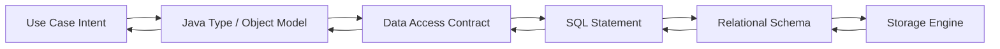
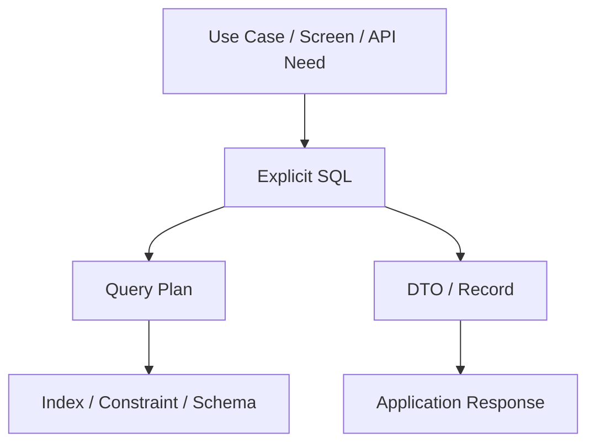
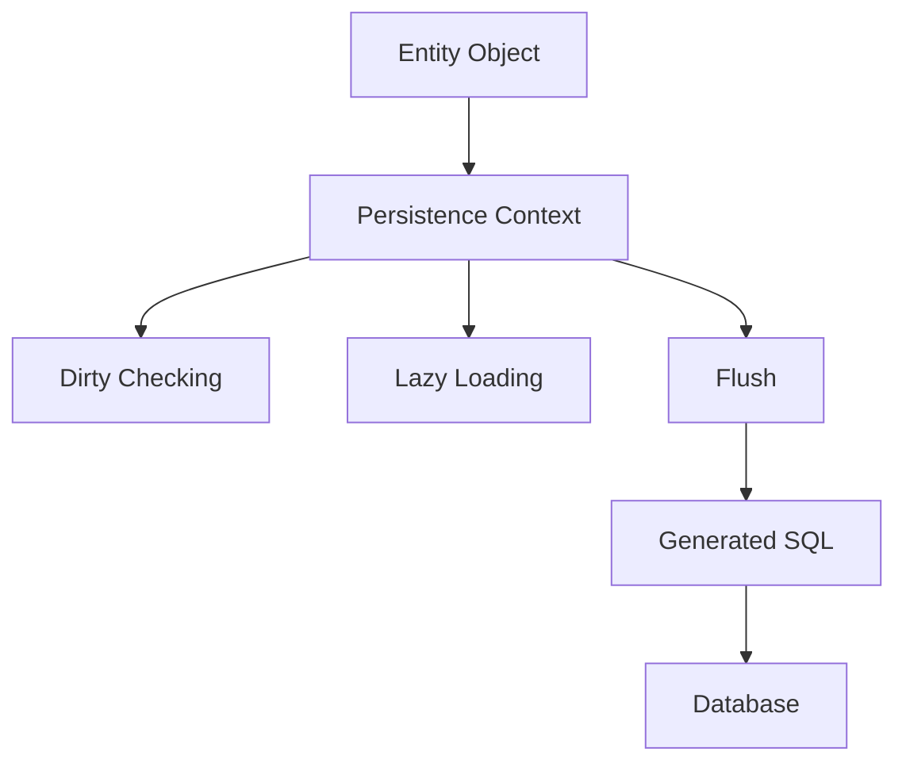
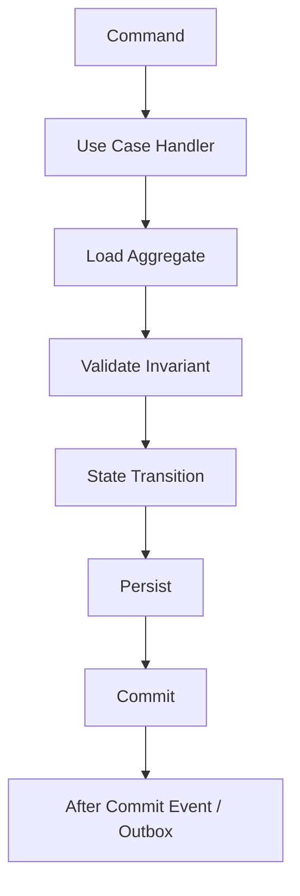
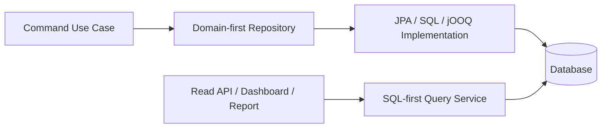
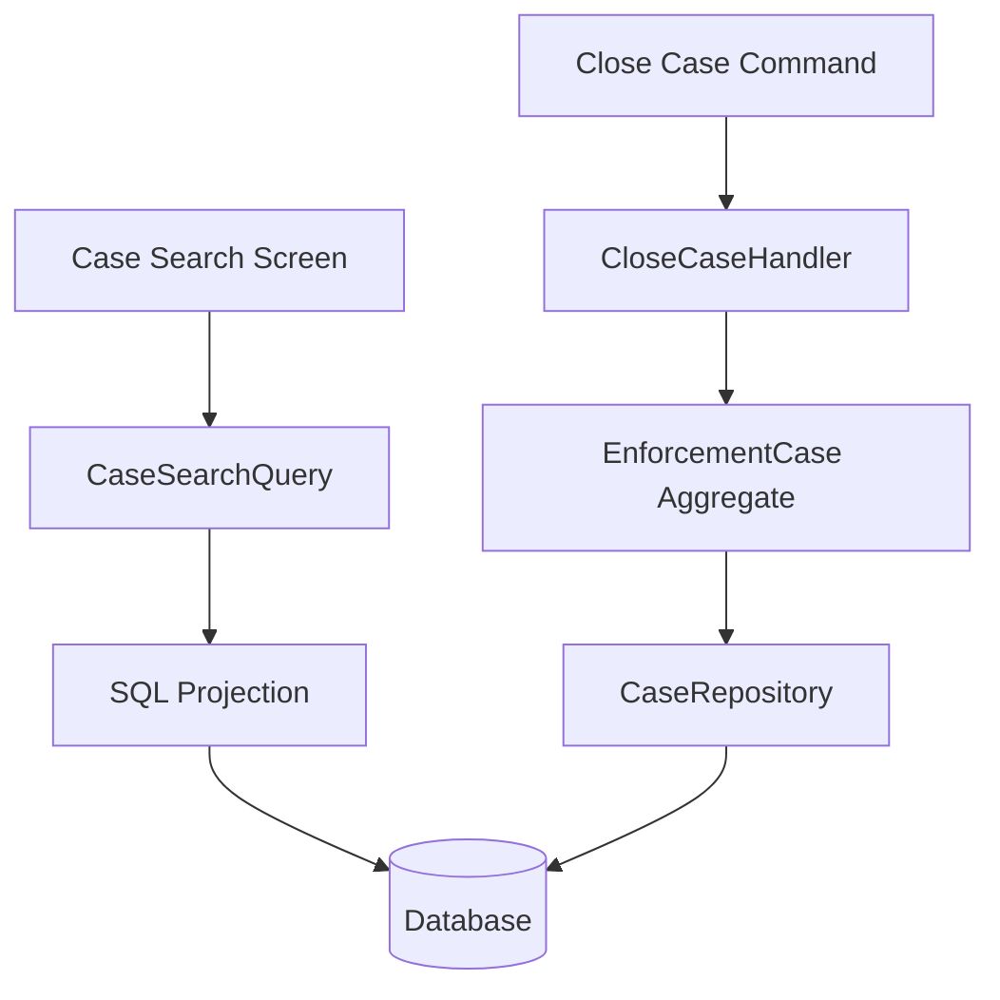

# Part 005 — SQL-First vs Object-First vs Domain-First

Data access bukan sekadar memilih library. Data access adalah keputusan tentang **siapa yang menjadi pusat desain**:

1. database dan SQL,
2. object persistence model,
3. domain/use case.

Tiga pendekatan ini sering terlihat seperti pilihan teknis, padahal sebenarnya pilihan **model kendali**. Di sistem kecil, bedanya tampak tipis. Di sistem besar, perbedaannya menentukan apakah query mudah diaudit, transaction boundary jelas, performa stabil, dan perubahan schema bisa dikendalikan.

Kita akan membedah tiga gaya:

- **SQL-first**: SQL dan bentuk data menjadi pusat.
- **Object-first**: object/entity persistence menjadi pusat.
- **Domain-first**: use case dan invariant domain menjadi pusat.

Tidak ada satu pendekatan yang selalu benar. Yang berbahaya adalah memakai satu pendekatan untuk semua masalah tanpa sadar konsekuensinya.

---

## 1. Masalah yang Sebenarnya

Saat Java application mengakses database, ia tidak hanya “mengambil data”. Ia sedang melakukan translasi antar model:



Di setiap panah ada risiko:

| Boundary | Risiko |
|---|---|
| Use case → Java object | domain rule bocor, object terlalu umum, state tidak valid |
| Java object → data access contract | repository method ambigu, return type tidak jelas |
| Contract → SQL | query tidak optimal, query tersembunyi, N+1 |
| SQL → schema | index tidak cocok, join mahal, constraint tidak cukup |
| Schema → storage | lock, IO, deadlock, contention, snapshot visibility |

Pertanyaan utama bukan “pakai ORM atau SQL?”. Pertanyaan utama adalah:

> **Lapisan mana yang paling pantas menjadi source of truth untuk bentuk data dan operasi persistence?**

---

## 2. Tiga Cara Melihat Data Access

### 2.1 SQL-first

SQL-first berarti engineer mendesain data access dari query dan schema. Java code menyesuaikan diri dengan bentuk data yang dikembalikan query.

Biasanya muncul dalam bentuk:

- JDBC manual,
- jOOQ,
- MyBatis,
- native query,
- stored procedure tertentu,
- read model/reporting query.

Mental modelnya:

```txt
Database schema + SQL semantics -> Java DTO / Record / Mapper
```

Contoh sederhana:

```java
public record CaseSummaryRow(
    long caseId,
    String caseNumber,
    String currentStatus,
    String assignedOfficer,
    Instant lastUpdatedAt
) {}
```

```sql
select
    c.id as case_id,
    c.case_number,
    s.code as current_status,
    u.display_name as assigned_officer,
    c.updated_at as last_updated_at
from enforcement_case c
join case_status s on s.id = c.status_id
left join app_user u on u.id = c.assigned_user_id
where c.agency_id = ?
order by c.updated_at desc
limit ? offset ?
```

Di sini, bentuk query adalah kontrak. Object Java hanya merepresentasikan hasil query.

### 2.2 Object-first

Object-first berarti engineer mendesain data access dari entity/object persistence model. SQL dihasilkan atau dikendalikan melalui ORM.

Biasanya muncul dalam bentuk:

- JPA,
- Hibernate,
- Spring Data JPA,
- entity graph,
- JPQL/Criteria,
- dirty checking,
- persistence context.

Mental modelnya:

```txt
Entity model + persistence context -> generated SQL -> relational schema
```

Contoh:

```java
@Entity
@Table(name = "enforcement_case")
public class EnforcementCase {

    @Id
    private Long id;

    @Column(name = "case_number", nullable = false)
    private String caseNumber;

    @ManyToOne(fetch = FetchType.LAZY)
    @JoinColumn(name = "status_id", nullable = false)
    private CaseStatus status;

    @Version
    private long version;

    protected EnforcementCase() {}

    public void assignTo(User officer) {
        if (isClosed()) {
            throw new IllegalStateException("Closed case cannot be reassigned");
        }
        this.assignedOfficer = officer;
    }
}
```

Entity adalah pusat. Query bisa eksplisit, tetapi lifecycle entity tetap dikendalikan persistence context.

### 2.3 Domain-first

Domain-first berarti engineer mendesain data access dari invariant use case dan aggregate boundary. Persistence adalah implementation detail, tetapi tidak diabaikan.

Biasanya muncul dalam bentuk:

- repository per aggregate,
- command handler,
- explicit transaction boundary,
- domain method,
- optimistic locking,
- idempotent command,
- domain event/outbox.

Mental modelnya:

```txt
Use case invariant -> aggregate transition -> persistence operation -> SQL/storage
```

Contoh:

```java
public final class AssignCaseCommandHandler {

    private final CaseRepository cases;
    private final OfficerRepository officers;
    private final TransactionRunner tx;

    public void handle(AssignCaseCommand command) {
        tx.run(() -> {
            EnforcementCase c = cases.getForUpdate(command.caseId());
            Officer officer = officers.get(command.officerId());

            c.assignTo(officer, command.assignedBy(), command.reason());

            cases.save(c);
        });
    }
}
```

Di sini yang paling penting bukan ORM atau SQL, tetapi invariant:

- case harus ada,
- officer harus valid,
- closed case tidak boleh reassigned,
- perubahan harus atomic,
- concurrency harus aman.

---

## 3. Comparison Table

| Dimensi | SQL-first | Object-first | Domain-first |
|---|---|---|---|
| Source of truth | schema/query | entity model | use case invariant |
| Cocok untuk | report, complex read, performance-sensitive query | CRUD kaya relasi, aggregate persistence sederhana-menengah | business workflow, state transition, critical write |
| Kekuatan utama | eksplisit, audit-friendly, performa terkontrol | produktif, mapping otomatis, lifecycle entity | correctness, invariant, maintainability |
| Risiko utama | procedural code, duplikasi mapping | hidden query, N+1, entity leak | overengineering, persistence mismatch |
| Query visibility | sangat tinggi | sedang-rendah jika generated | tergantung implementasi repository |
| Evolusi schema | jelas tetapi manual | bisa tersamarkan oleh mapping | harus dikawal contract repository |
| Testing | integration-heavy | integration + entity lifecycle test | use case + repository contract test |
| Best fit | read-heavy, reporting, deterministic access | domain dengan relational mapping stabil | regulated workflow, critical mutation, lifecycle-heavy domain |

---

## 4. SQL-First secara Mendalam

SQL-first dimulai dari asumsi: database bukan storage bodoh. Database punya bahasa ekspresif, optimizer, constraint, index, lock, isolation, dan fitur eksekusi yang tidak mudah direplikasi di Java.

### 4.1 Bentuk umum SQL-first



Contoh class dengan SQL-first repository:

```java
public final class CaseQueryDao {

    private final DataSource dataSource;

    public List<CaseSummaryRow> findRecentCases(long agencyId, int limit, int offset) {
        String sql = """
            select
                c.id,
                c.case_number,
                s.code,
                u.display_name,
                c.updated_at
            from enforcement_case c
            join case_status s on s.id = c.status_id
            left join app_user u on u.id = c.assigned_user_id
            where c.agency_id = ?
            order by c.updated_at desc
            limit ? offset ?
            """;

        // Mapping detail intentionally omitted here; JDBC mechanics are handled in later parts.
        return query(sql, agencyId, limit, offset);
    }
}
```

SQL-first sangat cocok ketika query itu sendiri adalah pengetahuan penting.

### 4.2 Kapan SQL-first unggul

Gunakan SQL-first ketika:

1. Query memiliki join kompleks.
2. Query adalah read model untuk UI/report/API projection.
3. Anda butuh `EXPLAIN` dan query plan yang mudah direview.
4. Bentuk output tidak sama dengan aggregate/domain entity.
5. Anda perlu window function, CTE, lateral join, recursive query, JSON function, full-text search.
6. Anda ingin query menjadi artefak reviewable.
7. Anda bekerja di sistem regulated/audited dan perlu menjelaskan persis data apa yang dibaca.

Contoh reporting query:

```sql
with latest_transition as (
    select
        case_id,
        to_status,
        changed_at,
        row_number() over (
            partition by case_id
            order by changed_at desc
        ) as rn
    from case_status_history
)
select
    c.case_number,
    lt.to_status,
    lt.changed_at,
    count(v.id) as violation_count
from enforcement_case c
join latest_transition lt on lt.case_id = c.id and lt.rn = 1
left join violation v on v.case_id = c.id
where c.agency_id = ?
group by c.case_number, lt.to_status, lt.changed_at
order by lt.changed_at desc
```

Memaksa query seperti ini ke entity graph biasanya menghasilkan desain yang lebih sulit dipahami daripada SQL eksplisit.

### 4.3 Failure mode SQL-first

SQL-first bukan tanpa biaya.

| Failure mode | Gejala | Pencegahan |
|---|---|---|
| SQL tersebar | query copy-paste di banyak class | query ownership per DAO/query object |
| Mapping rapuh | perubahan alias memecahkan mapper | explicit column alias + mapper test |
| Business rule di SQL liar | rule tersembunyi di WHERE/CASE | bedakan query filter dan domain invariant |
| Vendor lock-in tidak sadar | query sulit pindah DB | sadar memilih portability vs capability |
| Query terlalu pintar | SQL menjadi mini-application | pecah read model, materialized view, atau pipeline |

### 4.4 SQL-first yang sehat

SQL-first yang sehat punya karakter:

- query punya nama bisnis,
- parameter eksplisit,
- return type spesifik,
- mapping diuji,
- query plan bisa dilihat,
- index assumption terdokumentasi,
- failure semantics jelas.

Contoh naming yang baik:

```java
interface CaseDashboardQuery {
    List<CaseDashboardRow> findOpenCasesForSupervisor(
        AgencyId agencyId,
        SupervisorId supervisorId,
        PageWindow page
    );
}
```

Lebih baik daripada:

```java
List<Map<String, Object>> query(String sql, Object... args);
```

Yang pertama menjelaskan intent. Yang kedua hanya membuka lubang abstraksi.

---

## 5. Object-First secara Mendalam

Object-first biasanya identik dengan JPA/Hibernate. Pendekatan ini berangkat dari asumsi: application lebih produktif jika berinteraksi dengan object graph, sementara framework mengurus persistence.

### 5.1 Bentuk umum object-first



Object-first membuat banyak operasi terasa natural:

```java
@Transactional
public void closeCase(long caseId, String reason) {
    EnforcementCase c = entityManager.find(EnforcementCase.class, caseId);
    c.close(reason);
}
```

Tidak ada `update` eksplisit. Perubahan entity akan dideteksi saat flush.

### 5.2 Kapan object-first unggul

Object-first cocok ketika:

1. Entity lifecycle jelas.
2. Relasi tidak terlalu liar.
3. Use case sering melakukan load-modify-save.
4. Optimistic locking berguna.
5. Aggregate tidak terlalu besar.
6. Tim memahami persistence context dan lazy loading.
7. Anda butuh produktivitas CRUD dengan domain behavior ringan-menengah.

Contoh object-first yang wajar:

```java
@Transactional
public void changeViolationSeverity(long violationId, Severity newSeverity) {
    Violation violation = entityManager.find(Violation.class, violationId);
    violation.changeSeverity(newSeverity);
}
```

Jika `Violation` kecil, mapping stabil, dan invariant lokal, ORM bekerja baik.

### 5.3 Object-first bukan “tidak pakai SQL”

Kesalahan umum: mengira object-first membebaskan engineer dari SQL. Salah.

ORM tetap menghasilkan SQL. Bedanya, SQL itu bisa tersembunyi.

```java
List<EnforcementCase> cases = caseRepository.findByAgencyId(agencyId);

for (EnforcementCase c : cases) {
    System.out.println(c.getStatus().getCode()); // potential N+1 if status is lazy
}
```

Kode Java terlihat sederhana, tetapi query bisa menjadi:

```txt
select * from enforcement_case where agency_id = ?
select * from case_status where id = ?
select * from case_status where id = ?
select * from case_status where id = ?
...
```

Object-first yang matang tetap memperlakukan SQL sebagai realita produksi.

### 5.4 Failure mode object-first

| Failure mode | Gejala | Pencegahan |
|---|---|---|
| N+1 query | latency naik sesuai jumlah row | fetch join, projection, batch fetch, query test |
| Entity leak | API mengembalikan entity | DTO projection/read model |
| Cascade disaster | delete/update menyebar tidak sengaja | cascade minimal dan eksplisit |
| Detached confusion | perubahan object tidak tersimpan | transaction boundary jelas |
| LazyInitializationException | akses lazy di luar session | load shape eksplisit |
| Cartesian explosion | fetch join banyak collection | split query/projection |
| Accidental update | dirty checking update field tak terduga | command method sempit, read-only transaction |

### 5.5 Object-first yang sehat

Object-first sehat jika:

- entity tidak langsung dijadikan API contract,
- query shape eksplisit untuk list/detail/report,
- lazy loading tidak dibiarkan terjadi secara acak,
- transaction boundary ada di use case/service,
- aggregate size terkendali,
- mapping association didesain hati-hati,
- repository method tidak menjadi “god query factory”.

Contoh lebih aman:

```java
public interface CaseDetailViewRepository {
    CaseDetailView getCaseDetail(CaseId caseId);
}

public interface CaseCommandRepository {
    EnforcementCase getAggregate(CaseId caseId);
    void save(EnforcementCase enforcementCase);
}
```

Pisahkan read projection dan command aggregate. Jangan paksa satu entity graph melayani semua kebutuhan.

---

## 6. Domain-First secara Mendalam

Domain-first bukan berarti mengabaikan database. Domain-first berarti persistence dipilih untuk menjaga invariant, bukan untuk memuaskan framework.

### 6.1 Bentuk umum domain-first



Domain-first paling penting untuk sistem dengan lifecycle dan aturan ketat:

- case management,
- enforcement workflow,
- approval flow,
- money movement,
- inventory reservation,
- permit/license processing,
- dispute resolution,
- audit-heavy operations.

### 6.2 Domain-first dimulai dari state transition

Contoh buruk:

```java
caseRepository.updateStatus(caseId, "CLOSED");
```

Kode ini terlalu miskin. Ia tidak menjawab:

- siapa yang menutup case?
- dari status apa?
- apakah semua violation sudah resolved?
- apakah ada pending appeal?
- apakah closure reason wajib?
- apakah transition legal?
- bagaimana audit dicatat?

Domain-first membuat operasi lebih eksplisit:

```java
@Transactional
public void closeCase(CloseCaseCommand command) {
    EnforcementCase c = cases.getForUpdate(command.caseId());

    c.close(
        command.closedBy(),
        command.reason(),
        command.closedAt()
    );

    cases.save(c);
    audit.record(c.closureAuditEvent());
}
```

Kita tidak hanya mengubah field. Kita menjalankan transition yang sah.

### 6.3 Repository sebagai boundary domain

Dalam domain-first, repository bukan query dumping ground.

Repository menjawab kebutuhan aggregate:

```java
public interface EnforcementCaseRepository {
    EnforcementCase get(CaseId id);
    EnforcementCase getForUpdate(CaseId id);
    boolean existsOpenCaseForSubject(SubjectId subjectId);
    void save(EnforcementCase enforcementCase);
}
```

Perhatikan method-nya:

- `get` untuk load biasa,
- `getForUpdate` untuk command yang butuh locking,
- `existsOpenCaseForSubject` untuk invariant,
- `save` untuk persist aggregate.

Yang tidak sehat:

```java
List<EnforcementCase> findByStatusAndAgencyAndCreatedAtBetweenAndAssignedOfficerIdOrderByUpdatedAtDesc(...);
```

Itu biasanya query screen/report. Letakkan di query service, bukan repository aggregate.

### 6.4 Failure mode domain-first

| Failure mode | Gejala | Pencegahan |
|---|---|---|
| Over-abstracted repository | method terlalu generik, SQL hilang | contract spesifik use case |
| Ignoring database capability | invariant dicek hanya di memory | constraint + lock + transaction |
| Aggregate terlalu besar | load lambat, contention tinggi | pecah aggregate/read model |
| “Pure domain” naif | tidak memikirkan isolation | concurrency lab dan repository contract test |
| Too many layers | perubahan kecil menyentuh 8 class | layer hanya jika ada boundary nyata |

### 6.5 Domain-first yang sehat

Domain-first sehat jika:

- state transition jelas,
- invariant tertulis di domain/service,
- database constraint mendukung invariant,
- repository contract sempit,
- transaction boundary jelas,
- query read model dipisah,
- concurrency anomaly diuji.

Domain-first bukan anti-SQL. Justru di sistem serius, domain-first sering dipadukan dengan SQL-first untuk read model.

---

## 7. Hybrid yang Paling Sering Menang di Production

Sistem production jarang murni satu gaya. Pola yang sering sehat:



Command side:

- fokus invariant,
- transaction,
- lock,
- optimistic version,
- audit,
- idempotency.

Read side:

- fokus query shape,
- DTO projection,
- pagination,
- index,
- explain plan,
- latency.

Contoh package layout:

```txt
case-management/
  application/
    CloseCaseHandler.java
    AssignCaseHandler.java
  domain/
    EnforcementCase.java
    CaseStatus.java
    CaseTransitionPolicy.java
  persistence/
    JpaEnforcementCaseRepository.java
    SqlCaseDashboardQuery.java
    CaseRowMapper.java
  api/
    CaseController.java
    CaseDashboardController.java
```

Ini bukan CQRS berlebihan. Ini hanya pemisahan bentuk akses:

- write membutuhkan aggregate/invariant,
- read membutuhkan projection/query.

---

## 8. Heuristik Pemilihan

Gunakan tabel ini sebelum memilih stack.

| Kondisi | Pendekatan default |
|---|---|
| Endpoint list/dashboard/report | SQL-first |
| Detail page dengan banyak projection | SQL-first atau projection query |
| Simple CRUD internal admin | Object-first |
| Load-modify-save aggregate kecil | Object-first atau domain-first dengan ORM |
| State transition regulated | Domain-first |
| Mutation harus concurrency-safe | Domain-first + lock/version/constraint |
| Query memakai window function/CTE kompleks | SQL-first |
| Banyak dynamic filter | SQL-first dengan query builder/jOOQ/MyBatis atau Specification terbatas |
| Schema sering berubah | Domain-first contract + migration discipline |
| Performance perlu deterministic | SQL-first |
| Tim kuat di JPA dan domain kecil | Object-first masuk akal |
| Auditability tinggi | SQL-first for read, domain-first for write |

---

## 9. Decision Smell

### 9.1 Smell: “Semua harus Repository”

Repository bukan tempat semua query.

Jika method repository sudah seperti ini:

```java
Page<CaseEntity> findByAgencyIdAndStatusInAndCreatedAtBetweenAndAssignedOfficerIdInAndRiskScoreGreaterThanOrderByUpdatedAtDesc(...);
```

Anda mungkin sedang memakai repository untuk kebutuhan search screen. Lebih baik buat query object:

```java
public interface CaseSearchQuery {
    Page<CaseSearchRow> search(CaseSearchFilter filter, PageWindow page);
}
```

### 9.2 Smell: “Pakai native SQL berarti gagal pakai ORM”

Tidak. Native SQL bisa menjadi pilihan desain yang benar.

Yang salah adalah native SQL tersebar tanpa ownership, test, dan mapping contract.

### 9.3 Smell: “Domain-first berarti semua harus DDD murni”

Tidak. Domain-first berarti invariant memimpin desain. Anda tidak harus membuat tactical DDD lengkap untuk setiap tabel.

Untuk table konfigurasi sederhana, DAO biasa cukup.

### 9.4 Smell: “ORM akan mengurus performa”

ORM membantu mapping, bukan menggantikan pemahaman database. Query plan, index, cardinality, dan isolation tetap nyata.

---

## 10. Worked Example: Enforcement Case Search vs Close Case

Misalkan sistem punya dua requirement:

1. Supervisor melihat daftar open case dengan filter kompleks.
2. Officer menutup case dengan alasan resmi.

### 10.1 Search case: SQL-first

Search adalah read model.

```java
public record CaseSearchFilter(
    long agencyId,
    Set<String> statuses,
    LocalDate fromDate,
    LocalDate toDate,
    Long assignedOfficerId,
    Integer minRiskScore
) {}
```

```java
public record CaseSearchRow(
    long caseId,
    String caseNumber,
    String subjectName,
    String status,
    int riskScore,
    Instant updatedAt
) {}
```

Contract:

```java
public interface CaseSearchQuery {
    Page<CaseSearchRow> search(CaseSearchFilter filter, PageWindow page);
}
```

Kenapa SQL-first?

- output bukan aggregate,
- butuh filter dinamis,
- butuh pagination,
- butuh index-aware query,
- query harus mudah dioptimalkan.

### 10.2 Close case: domain-first

Close case adalah command.

```java
public record CloseCaseCommand(
    long caseId,
    long closedByUserId,
    String reason,
    Instant requestedAt
) {}
```

```java
@Transactional
public void close(CloseCaseCommand command) {
    EnforcementCase c = cases.getForUpdate(new CaseId(command.caseId()));
    User closer = users.get(new UserId(command.closedByUserId()));

    c.closeBy(closer, command.reason(), command.requestedAt());

    cases.save(c);
}
```

Kenapa domain-first?

- ada state transition,
- ada invariant,
- ada audit,
- ada concurrency risk,
- tidak boleh sekadar update status.

### 10.3 Dua gaya dalam satu bounded context



Ini desain yang jauh lebih sehat daripada memaksa semua kebutuhan ke satu `CaseRepository`.

---

## 11. Practical Rule: Design by Operation Type

Jangan mulai dari framework. Mulai dari tipe operasi.

### 11.1 Read operation

Tanyakan:

- Apakah output sama dengan aggregate?
- Apakah butuh join banyak table?
- Apakah butuh pagination?
- Apakah query akan sering dituning?
- Apakah query harus diaudit?

Jika jawaban banyak “ya”, condong ke SQL-first.

### 11.2 Write operation

Tanyakan:

- Apakah ada state transition?
- Apakah ada invariant lintas field/table?
- Apakah concurrent write bisa melanggar aturan?
- Apakah operation harus idempotent?
- Apakah audit/legal defensibility penting?

Jika jawaban banyak “ya”, condong ke domain-first.

### 11.3 Persistence operation sederhana

Tanyakan:

- Apakah hanya CRUD biasa?
- Apakah entity kecil?
- Apakah relasi sederhana?
- Apakah performance bukan hotspot?
- Apakah tim paham JPA?

Jika jawaban banyak “ya”, object-first bisa cukup.

---

## 12. Checklist Review

Gunakan checklist ini saat code review data access.

### Untuk SQL-first

- [ ] SQL punya owner class yang jelas.
- [ ] Parameter tidak dirangkai string mentah.
- [ ] Return type spesifik, bukan `Map<String, Object>` sembarangan.
- [ ] Alias column stabil.
- [ ] Query punya pagination strategy yang jelas.
- [ ] Index assumption diketahui.
- [ ] Mapping diuji dengan database nyata atau realistic fixture.
- [ ] Query plan diperiksa untuk query kritis.

### Untuk object-first

- [ ] Transaction boundary eksplisit.
- [ ] Entity tidak bocor ke API response.
- [ ] Fetch plan untuk use case jelas.
- [ ] Potensi N+1 diuji/dimonitor.
- [ ] Cascade tidak terlalu luas.
- [ ] Lazy loading tidak terjadi di view/controller secara liar.
- [ ] Update akibat dirty checking dipahami.
- [ ] Lock/version dipakai untuk write kritis.

### Untuk domain-first

- [ ] Use case command jelas.
- [ ] State transition direpresentasikan sebagai method/domain service.
- [ ] Invariant tidak hanya ada di UI.
- [ ] Constraint database mendukung invariant penting.
- [ ] Repository contract sempit dan meaningful.
- [ ] Read model tidak dipaksakan lewat aggregate.
- [ ] Concurrency behavior diuji.
- [ ] Audit/event after commit dipikirkan.

---

## 13. Kesimpulan

SQL-first, object-first, dan domain-first bukan agama. Mereka adalah alat untuk masalah yang berbeda.

Ringkasnya:

- **SQL-first** unggul ketika bentuk query, performa, projection, dan auditability adalah pusat.
- **Object-first** unggul ketika object lifecycle dan mapping entity memberi produktivitas tanpa menyembunyikan terlalu banyak biaya.
- **Domain-first** unggul ketika correctness, invariant, state transition, dan concurrency adalah pusat.

Engineer yang kuat tidak bertanya “framework apa yang paling modern?”. Ia bertanya:

> **Operasi ini butuh query control, object lifecycle, atau invariant control?**

Jawaban itulah yang menentukan pattern.

---

## References

- Oracle Java SE JDBC API — `Connection`, `PreparedStatement`, `ResultSet`: https://docs.oracle.com/javase/8/docs/api/java/sql/package-summary.html
- Jakarta Persistence Specification 3.2: https://jakarta.ee/specifications/persistence/3.2/jakarta-persistence-spec-3.2
- Hibernate ORM User Guide: https://docs.hibernate.org/stable/orm/userguide/html_single/
- jOOQ Manual — DSLContext API: https://www.jooq.org/doc/latest/manual/sql-building/dsl-context/
- jOOQ Manual — Code Generation: https://www.jooq.org/doc/latest/manual/code-generation/
- MyBatis 3 Mapper XML Files: https://mybatis.org/mybatis-3/sqlmap-xml.html
