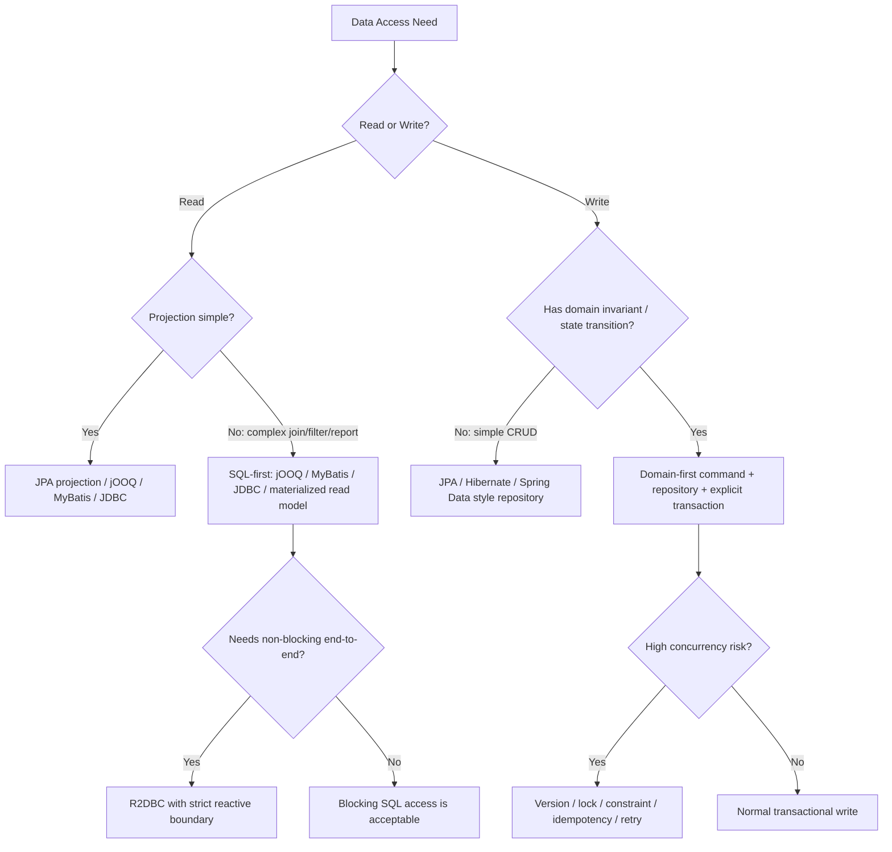
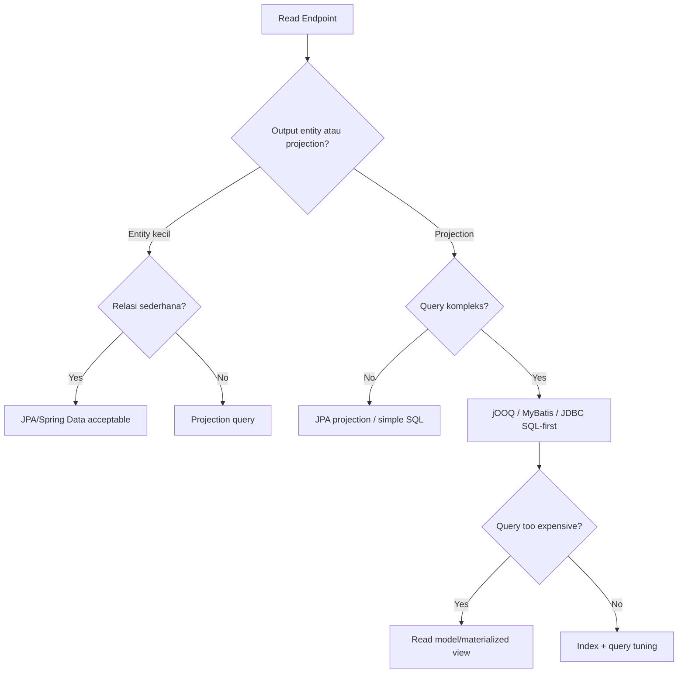
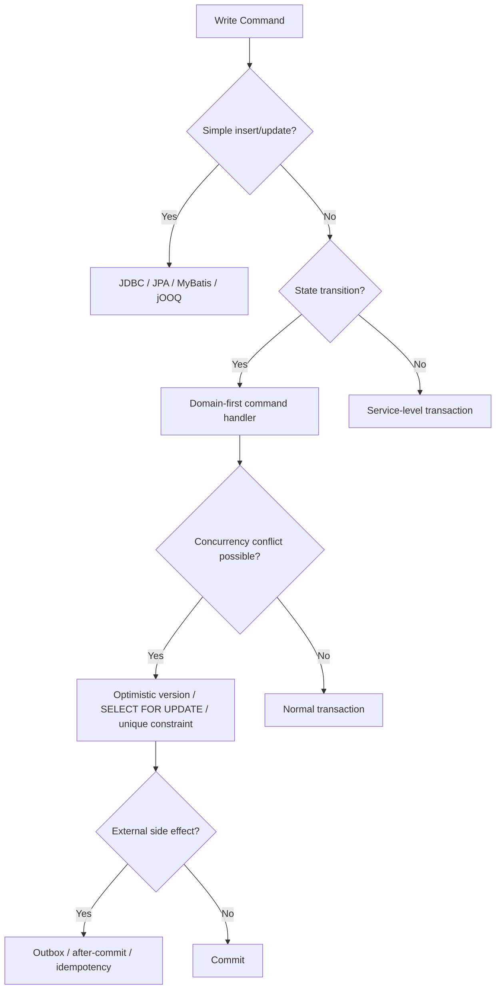
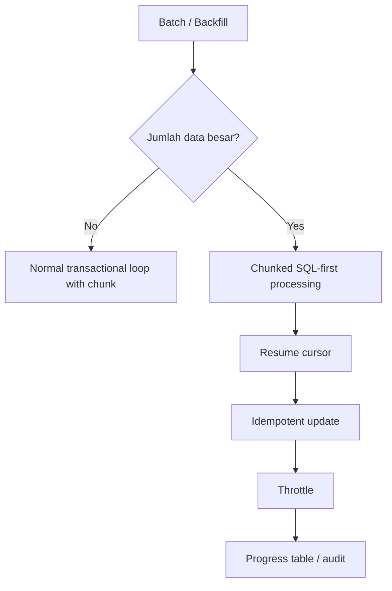

# Part 006 — Data Access Decision Framework

Part sebelumnya membedakan tiga pusat desain: SQL-first, object-first, dan domain-first. Sekarang kita ubah itu menjadi **framework keputusan**.

Tujuannya sederhana:

> Pilih data access pattern berdasarkan bentuk operasi, risiko correctness, kebutuhan performa, kemampuan tim, dan konsekuensi operasional.

Bukan berdasarkan kebiasaan, hype, atau “semua service pakai template yang sama”.

---

## 1. Decision Framework dalam Satu Gambar



Framework ini bukan diagram final architecture. Ini alat berpikir awal.

---

## 2. Prinsip Utama

Ada lima prinsip yang harus menahan semua keputusan data access.

### 2.1 Operation shape first

Mulai dari bentuk operasi:

- read list,
- read detail,
- search,
- report,
- insert,
- update command,
- state transition,
- batch import,
- backfill,
- audit lookup,
- streaming export.

Jangan mulai dari “kita pakai JPA” atau “kita pakai jOOQ”.

### 2.2 Correctness before convenience

Convenience abstraction kalah dari correctness.

Jika sebuah update bisa menyebabkan duplicate approval, lost update, double spending, stale transition, atau audit gap, maka pattern harus dikendalikan oleh transaction, lock, idempotency, dan constraint.

### 2.3 Query visibility is a feature

Untuk query penting, kemampuan melihat SQL adalah fitur. Query tersembunyi bukan berarti kompleksitas hilang; ia hanya pindah ke runtime.

### 2.4 Database is not just storage

Database punya:

- constraint,
- index,
- isolation,
- locking,
- query optimizer,
- transaction log,
- foreign key,
- unique key,
- check constraint,
- window function,
- CTE,
- server-side execution.

Data access pattern yang baik tidak menolak kemampuan ini. Ia memilih mana yang pantas dipakai.

### 2.5 Abstraction must preserve failure semantics

Abstraction yang baik bukan yang menyembunyikan database sepenuhnya. Abstraction yang baik mempertahankan semantic penting:

- not found,
- duplicate key,
- optimistic lock failure,
- timeout,
- deadlock,
- serialization failure,
- stale data,
- partial batch failure.

Jika semua error berubah menjadi `RuntimeException`, abstraction itu terlalu kasar.

---

## 3. Candidate Pattern dan Tooling

Seri ini tidak membahas semua framework secara sama rata. Kita fokus pada pattern dan kapan tool masuk akal.

### 3.1 JDBC manual

JDBC adalah primitive dasar Java untuk akses database relasional.

Gunakan ketika:

- butuh kontrol penuh,
- dependency harus minimal,
- query sedikit tetapi kritis,
- framework terlalu berat,
- ingin memahami behavior dasar,
- membuat infrastructure internal.

Hindari untuk:

- aplikasi besar dengan ratusan query tanpa helper,
- mapping kompleks tanpa abstraction,
- dynamic SQL rumit tanpa builder.

Kekuatan:

- eksplisit,
- minimal magic,
- mudah memahami call path,
- semua biaya terlihat.

Kelemahan:

- boilerplate,
- mapping manual,
- error translation manual,
- transaction composition manual.

### 3.2 JPA/Hibernate

JPA adalah specification untuk object/relational persistence. Hibernate adalah salah satu implementasi ORM yang sangat umum dipakai.

Gunakan ketika:

- domain entity cocok dengan relational mapping,
- use case banyak load-modify-save,
- aggregate tidak terlalu besar,
- relasi cukup stabil,
- optimistic locking membantu,
- tim memahami persistence context.

Hindari sebagai default untuk:

- query reporting kompleks,
- dashboard besar,
- batch write sangat besar,
- schema yang sangat denormalized,
- read model yang tidak mirip entity,
- sistem yang butuh SQL deterministik di semua endpoint.

Kekuatan:

- mapping otomatis,
- dirty checking,
- persistence context,
- entity lifecycle,
- association mapping,
- optimistic locking.

Kelemahan:

- generated SQL bisa tidak terlihat,
- N+1,
- lazy loading trap,
- cascade risk,
- flush timing membingungkan,
- entity leak.

### 3.3 Spring Data JPA style repository

Spring Data JPA memberikan repository abstraction di atas JPA.

Gunakan ketika:

- query sederhana,
- CRUD banyak,
- tim memakai Spring ecosystem,
- ingin consistent repository programming model,
- entity model cukup stabil.

Hindari ketika:

- method name menjadi sangat panjang,
- query sangat kompleks,
- repository dipakai untuk semua read model,
- query count pagination mahal tetapi tersembunyi,
- abstraction membuat SQL tidak direview.

Kekuatan:

- produktivitas,
- convention,
- pagination support,
- integration dengan transaction Spring,
- query derivation untuk kasus sederhana.

Kelemahan:

- mudah overuse,
- query method bisa misleading,
- generated count query bisa mahal,
- custom query sering tetap dibutuhkan.

### 3.4 MyBatis

MyBatis cocok untuk engineer yang ingin SQL tetap eksplisit tetapi tidak ingin menulis JDBC boilerplate penuh.

Gunakan ketika:

- SQL harus terlihat,
- mapping cukup manual tetapi terstruktur,
- dynamic SQL dibutuhkan,
- tim nyaman dengan XML/annotation mapper,
- query ownership penting.

Hindari ketika:

- tim ingin object graph lifecycle otomatis,
- domain lebih cocok dengan dirty checking,
- XML mapper menjadi dumping ground,
- dynamic SQL tumbuh tanpa test.

Kekuatan:

- SQL eksplisit,
- mapping fleksibel,
- boilerplate lebih sedikit dari JDBC,
- cocok untuk legacy schema,
- cocok untuk query yang perlu kontrol.

Kelemahan:

- bukan Unit of Work ORM seperti Hibernate,
- mapping bisa tersebar,
- refactoring SQL tetap perlu disiplin,
- dynamic SQL bisa menjadi sulit dibaca.

### 3.5 jOOQ

jOOQ cocok untuk SQL-first dengan type-safety. Code generator jOOQ dapat membentuk Java classes dari schema database, dan `DSLContext` dipakai untuk membangun query yang configured dan executable.

Gunakan ketika:

- SQL penting dan kompleks,
- type safety dibutuhkan,
- schema adalah source of truth,
- query harus readable dan composable,
- butuh fitur SQL modern,
- ingin mengurangi stringly-typed SQL.

Hindari ketika:

- tim tidak mau database-first workflow,
- schema generation pipeline belum siap,
- query sederhana semua dan JPA sudah cukup,
- vendor portability lebih penting dari SQL expressiveness.

Kekuatan:

- SQL-first,
- type-safe DSL,
- schema-aware,
- dynamic query elegan,
- cocok untuk advanced SQL,
- query masih dekat dengan SQL asli.

Kelemahan:

- learning curve,
- code generation workflow,
- SQL knowledge tetap wajib,
- license consideration untuk beberapa database/edition.

### 3.6 R2DBC

R2DBC adalah specification untuk reactive/non-blocking access ke SQL database.

Gunakan ketika:

- aplikasi end-to-end reactive,
- driver non-blocking tersedia dan matang untuk database target,
- call path tidak mencampur blocking JDBC,
- workload banyak waiting IO,
- tim paham backpressure dan reactive transaction boundary.

Hindari ketika:

- aplikasi mayoritas blocking,
- hanya ingin “lebih cepat”,
- pool/database tetap bottleneck,
- tim belum matang reactive debugging,
- library sekitar masih blocking.

Kekuatan:

- non-blocking IO,
- cocok untuk reactive stack,
- backpressure-aware model.

Kelemahan:

- kompleksitas mental lebih tinggi,
- transaction boundary berbeda,
- tidak otomatis mengurangi beban database,
- ecosystem tidak selalu sekuat JDBC untuk semua kebutuhan.

### 3.7 Stored procedure / database routine

Stored procedure bukan default, tetapi bisa tepat.

Gunakan ketika:

- operasi sangat dekat dengan data,
- perlu atomic server-side operation,
- latency round trip harus dikurangi,
- logic sudah menjadi database contract enterprise,
- permission/security model ada di database.

Hindari ketika:

- business logic menjadi sulit versioned/tested,
- deployment DB dan app tidak sinkron,
- observability buruk,
- logic bercabang besar dan sulit direview,
- tim Java tidak bisa mengubah/menguji routine dengan aman.

Kekuatan:

- dekat dengan data,
- bisa sangat efisien,
- atomic di server,
- mengurangi network round trip.

Kelemahan:

- portability rendah,
- testing/deployment lebih sulit,
- ownership kadang kabur,
- business logic bisa tersembunyi.

### 3.8 Read model / materialized view

Read model dipakai ketika kebutuhan baca tidak cocok dengan schema transaksi.

Gunakan ketika:

- query dashboard/report terlalu mahal,
- join terlalu sering,
- pagination berat,
- data perlu disajikan dengan bentuk spesifik,
- latency read lebih penting daripada freshness absolut.

Hindari ketika:

- consistency harus immediate,
- data kecil dan query biasa cukup,
- tim belum siap mengelola refresh/backfill,
- read model tidak punya ownership.

Kekuatan:

- read cepat,
- shape sesuai UI/API,
- mengurangi tekanan transactional table.

Kelemahan:

- eventual consistency,
- refresh/backfill complexity,
- storage tambahan,
- data drift risk.

---

## 4. Decision Matrix

Gunakan matrix ini sebagai starting point.

| Need | JDBC | JPA/Hibernate | Spring Data JPA | MyBatis | jOOQ | R2DBC | Stored Procedure | Read Model |
|---|---:|---:|---:|---:|---:|---:|---:|---:|
| Simple CRUD | Medium | High | High | Medium | Medium | Medium | Low | Low |
| Complex read query | Medium | Low | Low | High | High | Medium | Medium | High |
| Dynamic search | Low-Med | Medium | Medium | High | High | Medium | Low | Medium |
| Domain state transition | Medium | High | Medium | Medium | Medium | Medium | Medium | Low |
| Batch import/update | High | Low-Med | Low | High | High | Medium | High | Low |
| Reporting/dashboard | Medium | Low | Low | High | High | Medium | Medium | High |
| Full SQL visibility | High | Low-Med | Low | High | High | Medium | Medium | High |
| Type safety | Medium | Medium | Medium | Low-Med | High | Medium | Low-Med | Medium |
| Minimal magic | High | Low | Low | Medium-High | High | Medium | Medium | Medium |
| Reactive stack | Low | Low | Low | Low | Medium | High | Low | Medium |
| Legacy schema | Medium | Low-Med | Low-Med | High | High | Medium | Medium | Medium |
| Regulated auditability | High | Medium | Low-Med | High | High | Medium | Medium | High |

Interpretasi:

- “High” bukan berarti selalu pilih itu.
- “Low” bukan berarti tidak mungkin.
- Matrix hanya menyaring opsi. Keputusan final tetap melihat tim, risiko, dan operasi konkret.

---

## 5. Decision Tree Berdasarkan Operasi

### 5.1 Untuk read endpoint



Checklist read:

- Apakah endpoint butuh aggregate behavior? Biasanya tidak.
- Apakah return type bisa berupa DTO? Biasanya ya.
- Apakah pagination punya count query? Apakah count mahal?
- Apakah sort field indexed?
- Apakah join memperbanyak row?
- Apakah data freshness harus real-time?

### 5.2 Untuk write command



Checklist write:

- Apa invariant yang harus selalu benar?
- Apakah invariant bisa diproteksi constraint?
- Apakah read-before-write aman di isolation level saat ini?
- Apakah duplicate request mungkin?
- Apakah retry aman?
- Apakah side effect terjadi sebelum commit?
- Apakah audit harus atomic dengan state change?

### 5.3 Untuk batch/backfill



Checklist batch:

- Berapa row?
- Apa chunk size?
- Bagaimana resume setelah crash?
- Apakah update idempotent?
- Apakah job menahan lock terlalu lama?
- Apakah job mengganggu traffic online?
- Apakah ada progress tracking?

---

## 6. Pattern Selection by Risk

### 6.1 Risiko correctness tinggi

Contoh:

- close enforcement case,
- approve sanction,
- assign officer,
- calculate penalty,
- submit official decision,
- issue permit,
- revoke license.

Default:

```txt
Domain-first command + explicit transaction + repository contract + constraint/lock/version
```

Tool bisa JPA, JDBC, MyBatis, atau jOOQ. Pattern-nya yang penting.

### 6.2 Risiko performance tinggi

Contoh:

- search screen utama,
- dashboard supervisor,
- report export,
- public API dengan traffic tinggi,
- timeline query,
- aggregation query.

Default:

```txt
SQL-first query service + DTO projection + index-aware design + query plan review
```

Tool yang sering cocok: jOOQ/MyBatis/JDBC/native SQL.

### 6.3 Risiko evolusi schema tinggi

Contoh:

- schema sering berubah,
- rolling deployment,
- multiple service membaca table sama,
- backward compatibility penting.

Default:

```txt
Stable data access contract + migration discipline + expand-contract change
```

Tool bukan solusi utama. Kontrak dan deployment order adalah kuncinya.

### 6.4 Risiko team familiarity

Framework terbaik yang tidak dipahami tim bisa menjadi liability.

Tanyakan:

- Siapa yang bisa debug query production?
- Siapa yang paham transaction propagation?
- Siapa yang tahu cara membaca execution plan?
- Siapa yang bisa memperbaiki N+1?
- Siapa yang bisa rollback migration?

Jika jawabannya tidak jelas, pilih pattern yang lebih eksplisit dan mudah diobservasi.

---

## 7. Concrete Recommendations

### 7.1 Default stack untuk service business biasa

Untuk banyak Java backend enterprise:

```txt
Command/write:
  Domain-first service + JPA/Hibernate repository for aggregate

Read/search/report:
  SQL-first query service using jOOQ/MyBatis/native SQL projection

Migration:
  Flyway or Liquibase

Testing:
  Testcontainers-backed integration tests
```

Ini memberi keseimbangan:

- productivity untuk mutation aggregate,
- SQL control untuk read-heavy endpoint,
- migration discipline,
- test dengan database nyata.

### 7.2 Default stack untuk regulatory case management

Untuk sistem enforcement/case management yang butuh defensibility:

```txt
Critical write:
  Domain-first + explicit transaction + version/lock + audit table + idempotency

Case search/dashboard:
  SQL-first projection + explain plan + stable query contract

Case history/timeline:
  append-only history table + SQL-first read model

Reference data:
  simple DAO/JPA read-only repository

Backfill/repair:
  chunked SQL-first job + progress table
```

Hindari menjadikan JPA entity sebagai API response utama. Itu membuat regulatory output terikat ke persistence detail.

### 7.3 Default stack untuk high-throughput API

```txt
Read-heavy endpoint:
  SQL-first projection + strict timeout + small result shape

Write endpoint:
  minimal transaction + idempotency key + constraint-driven safety

Batch:
  JDBC/jOOQ batch + chunk + retry

Avoid:
  accidental lazy loading, large entity graph, open transaction during remote calls
```

### 7.4 Default stack untuk reactive service

```txt
Only choose R2DBC if:
  - web stack is reactive end-to-end
  - database driver is non-blocking and mature
  - no blocking JDBC calls are hidden in the call path
  - team can reason about reactive transaction and backpressure
```

Jika tidak, blocking JDBC dengan virtual threads atau conventional thread pool bisa lebih sederhana dan lebih reliable.

---

## 8. Red Flags dalam Pemilihan Tool

### 8.1 “Kita pakai JPA untuk semua query”

Red flag jika:

- dashboard memakai entity graph besar,
- pagination lambat,
- query count tidak direview,
- N+1 muncul berkali-kali,
- API response langsung memakai entity.

Perbaikan:

- pisahkan query service,
- gunakan DTO projection,
- pakai SQL-first untuk query kompleks.

### 8.2 “Kita pakai SQL manual di semua tempat”

Red flag jika:

- SQL copy-paste,
- mapping tidak diuji,
- transaction boundary duplikatif,
- business invariant tersebar di `WHERE`,
- tidak ada repository contract.

Perbaikan:

- centralize query ownership,
- buat mapper contract,
- gunakan transaction runner,
- pisahkan command dan query.

### 8.3 “Kita pakai reactive supaya lebih cepat”

Reactive bukan otomatis lebih cepat. Jika bottleneck adalah database CPU, lock, index, atau query plan, R2DBC tidak menyelesaikan akar masalah.

Perbaikan:

- ukur bottleneck,
- tune query,
- batasi concurrency,
- gunakan backpressure,
- pilih reactive hanya jika architecture end-to-end mendukung.

### 8.4 “Stored procedure paling aman karena dekat database”

Bisa benar, bisa salah.

Red flag jika:

- tidak ada version control yang jelas,
- deployment manual,
- test sulit,
- app dan DB logic saling tumpang tindih,
- observability rendah.

Perbaikan:

- migration-managed routine,
- integration test,
- contract jelas,
- logging/audit eksplisit.

---

## 9. Decision Worksheet

Sebelum implementasi data access baru, isi worksheet ini.

```txt
Operation name:
Operation type: read | write | batch | migration | report
Business criticality: low | medium | high
Consistency requirement: eventual | read committed ok | strict | serializable-like
Data shape: entity | projection | aggregate | report | stream
Expected cardinality:
Expected latency target:
Expected concurrency:
Failure impact:
Retry allowed: yes | no | conditional
Idempotency required: yes | no
Audit required: yes | no
Schema volatility: low | medium | high
Recommended pattern:
Recommended tool:
Testing strategy:
Observability required:
```

Contoh:

```txt
Operation name: Close enforcement case
Operation type: write
Business criticality: high
Consistency requirement: strict for case state
Data shape: aggregate
Expected cardinality: 1 case + related validation rows
Expected latency target: < 300ms p95
Expected concurrency: low-medium, conflict possible
Failure impact: illegal closure / audit defect
Retry allowed: conditional
Idempotency required: yes
Audit required: yes
Schema volatility: medium
Recommended pattern: domain-first command + explicit transaction + optimistic lock
Recommended tool: JPA repository or SQL repository, not direct status update
Testing strategy: integration test + concurrent close test + audit atomicity test
Observability required: command latency, lock failure, optimistic conflict, audit write failure
```

---

## 10. Example: Choosing for Four Operations

### 10.1 Operation A — Admin edits reference data

Requirement:

- update small lookup table,
- low traffic,
- simple validation.

Recommendation:

```txt
Pattern: object-first/simple repository
Tool: JPA/Hibernate or simple JDBC/MyBatis
Reason: low complexity, low performance risk
```

### 10.2 Operation B — Supervisor searches cases

Requirement:

- many filters,
- pagination,
- joins subject/status/officer/risk,
- high traffic screen.

Recommendation:

```txt
Pattern: SQL-first query service
Tool: jOOQ/MyBatis/native SQL
Reason: query shape matters more than entity lifecycle
```

### 10.3 Operation C — Officer closes case

Requirement:

- state transition,
- audit,
- no pending appeal,
- concurrency protection.

Recommendation:

```txt
Pattern: domain-first command
Tool: JPA aggregate repository or SQL repository
Reason: correctness and invariant matter most
```

### 10.4 Operation D — Nightly backfill risk score

Requirement:

- millions of rows,
- resumable,
- throttled,
- idempotent.

Recommendation:

```txt
Pattern: SQL-first chunked batch
Tool: JDBC batch/jOOQ/MyBatis
Reason: bulk processing needs explicit control
```

---

## 11. Tool Choice vs Architecture Choice

Jangan mencampur dua level keputusan.

| Level | Contoh keputusan |
|---|---|
| Architecture pattern | domain-first command, SQL-first query, read model, outbox |
| Implementation tool | JPA, Hibernate, jOOQ, MyBatis, JDBC, R2DBC |

Kesalahan umum:

```txt
"Kita pakai Hibernate, jadi architecture-nya repository."
```

Lebih benar:

```txt
"Operation ini adalah critical state transition. Kita pakai domain-first command. Repository implementation-nya boleh Hibernate, asalkan locking, versioning, dan audit atomic jelas."
```

Atau:

```txt
"Operation ini adalah dashboard query. Kita pakai SQL-first query service. Implementasinya jOOQ karena dynamic filter dan type-safe schema membantu."
```

Tool mengikuti pattern, bukan sebaliknya.

---

## 12. Production Readiness Gate

Sebelum data access masuk production, jawab ini.

### Correctness

- [ ] Apa invariant utama operasi ini?
- [ ] Di mana invariant ditegakkan?
- [ ] Apakah database constraint mendukungnya?
- [ ] Apa yang terjadi saat concurrent request?
- [ ] Apakah retry aman?
- [ ] Apakah duplicate request aman?

### Performance

- [ ] Berapa jumlah query per request?
- [ ] Apakah ada N+1?
- [ ] Apakah pagination count query aman?
- [ ] Apakah index mendukung filter dan sort?
- [ ] Apakah result set dibatasi?
- [ ] Apakah query timeout disetel?

### Operability

- [ ] Apakah error duplicate/deadlock/timeout bisa dibedakan?
- [ ] Apakah metrics query latency tersedia?
- [ ] Apakah slow query bisa ditelusuri ke use case?
- [ ] Apakah transaction terlalu panjang?
- [ ] Apakah migration compatible dengan rolling deploy?

### Maintainability

- [ ] Apakah query punya owner?
- [ ] Apakah repository method meaningful?
- [ ] Apakah DTO/entity boundary jelas?
- [ ] Apakah mapping test ada?
- [ ] Apakah schema change akan memecahkan compile/test?

---

## 13. Decision Anti-Pattern

### 13.1 Framework-first architecture

Gejala:

```txt
"Semua harus Spring Data repository karena standard project."
```

Masalah:

- read model dipaksa jadi entity,
- query kompleks jadi method name panjang,
- SQL visibility rendah,
- performance surprise.

Solusi:

- standard boleh, tapi exception harus didesain.
- buat policy: query kompleks harus query service.

### 13.2 Purist domain without persistence reality

Gejala:

```txt
"Domain layer tidak boleh tahu database sama sekali."
```

Masalah:

- invariant tidak aman terhadap race condition,
- uniqueness hanya dicek di memory,
- isolation tidak dipikirkan,
- lock/version dianggap detail kecil.

Solusi:

- domain tetap bersih, tetapi repository contract harus menyatakan kebutuhan concurrency.
- database constraint adalah bagian dari correctness model.

### 13.3 SQL everywhere without semantic boundary

Gejala:

```txt
"DAO bebas menjalankan query apa saja."
```

Masalah:

- business operation tidak terlihat,
- audit sulit,
- duplikasi query,
- transaksi tersebar.

Solusi:

- satu operasi bisnis punya contract jelas.
- query service untuk read, command handler untuk write.

---

## 14. Final Rule Set

Jika harus diringkas menjadi aturan operasional:

1. **List/search/report** default ke SQL-first projection.
2. **Critical write/state transition** default ke domain-first command.
3. **Simple CRUD** boleh object-first.
4. **Batch besar** default ke SQL-first chunked processing.
5. **Reactive** hanya jika end-to-end reactive dan tim siap.
6. **Stored procedure** hanya jika ownership, migration, dan testing jelas.
7. **Read model** dipakai jika query transactional schema tidak lagi masuk akal.
8. **Framework tidak boleh menentukan architecture boundary.**
9. **Data access abstraction harus menjaga failure semantics.**
10. **Query visibility, transaction boundary, dan invariant lebih penting dari code yang terlihat pendek.**

---

## 15. Kesimpulan

Decision framework ini membantu menghindari dua ekstrem:

- semua hal dipaksa ORM,
- semua hal ditulis SQL manual tanpa boundary.

Engineer top-tier tidak memilih tool karena familiar saja. Ia membaca bentuk operasi, risiko, concurrency, query shape, dan failure mode, lalu memilih pattern yang membuat sistem paling benar, paling dapat dioperasikan, dan paling mudah dievolusi.

Pertanyaan inti setiap kali membuat data access baru:

```txt
Apa pusat kendali operasi ini?

- Query shape?
- Object lifecycle?
- Domain invariant?
- Throughput batch?
- Non-blocking boundary?
- Migration safety?
```

Jawaban atas pertanyaan itu menentukan pattern. Tool hanya implementasi.

---

## References

- Oracle Java SE JDBC API — `Connection`, `PreparedStatement`, `ResultSet`: https://docs.oracle.com/javase/8/docs/api/java/sql/package-summary.html
- Jakarta Persistence Specification 3.2: https://jakarta.ee/specifications/persistence/3.2/jakarta-persistence-spec-3.2
- Hibernate ORM User Guide: https://docs.hibernate.org/stable/orm/userguide/html_single/
- Spring Data JPA Reference: https://docs.spring.io/spring-data/jpa/reference/index.html
- jOOQ Manual — DSLContext API: https://www.jooq.org/doc/latest/manual/sql-building/dsl-context/
- jOOQ Manual — Code Generation: https://www.jooq.org/doc/latest/manual/code-generation/
- MyBatis 3 Mapper XML Files: https://mybatis.org/mybatis-3/sqlmap-xml.html
- MyBatis 3 Dynamic SQL: https://mybatis.org/mybatis-3/dynamic-sql.html
- R2DBC Project: https://r2dbc.github.io/
- Flyway Migrations Documentation: https://documentation.red-gate.com/fd/migrations-271585107.html
