# Part 007 — Data Access Architecture Map

> Tujuan part ini bukan membuat diagram cantik.
>
> Tujuannya adalah membuat kamu bisa melihat **di mana data access seharusnya hidup**, siapa yang boleh melakukan query, siapa yang boleh membuka transaksi, siapa yang boleh mengubah state, dan bagaimana desain itu bertahan ketika sistem bertambah besar.

Di part sebelumnya kita sudah membahas primitive: application state, database state, query boundary, mutation boundary, dan consistency boundary. Sekarang kita naik satu level: **peta arsitektur**.

Data access layer yang buruk jarang gagal karena satu query jelek. Biasanya gagal karena boundary-nya kabur:

- controller langsung memanggil ORM entity;
- service membuat query ad-hoc;
- repository menjadi dump semua query;
- transaction boundary tersebar;
- read path dan write path dicampur;
- DTO, entity, dan domain object saling bocor;
- query shape berubah tanpa review;
- constraint database dianggap detail teknis, bukan bagian dari invariant sistem.

Engineer yang kuat tidak hanya tahu `JpaRepository`, `EntityManager`, `JdbcTemplate`, `DSLContext`, atau `SqlSession`. Engineer yang kuat tahu **di mana abstraction tersebut ditempatkan**.

---

## 1. Core Thesis

Data access architecture adalah jawaban terhadap pertanyaan berikut:

```txt
Who is allowed to read?
Who is allowed to write?
Who owns SQL?
Who owns transaction?
Who owns mapping?
Who owns consistency?
Who owns failure handling?
Who owns migration compatibility?
Who owns observability?
```

Kalau pertanyaan ini tidak dijawab secara eksplisit, sistem akan tetap berjalan, tetapi semua layer perlahan berubah menjadi lumpur.

Aplikasi yang kecil bisa bertahan dengan data access yang longgar. Aplikasi production yang dipakai banyak tim tidak bisa.

---

## 2. Primitive yang Selalu Ada

Tidak peduli kamu memakai JDBC, JPA/Hibernate, jOOQ, MyBatis, R2DBC, atau kombinasi semuanya, setiap data access architecture selalu punya primitive ini:

| Primitive | Pertanyaan Desain | Contoh Bentuk |
|---|---|---|
| Connection boundary | Kapan koneksi database dipinjam dan dikembalikan? | JDBC `Connection`, datasource, session, reactive connection |
| Transaction boundary | Operasi mana yang harus commit/rollback bersama? | `@Transactional`, programmatic transaction, explicit unit of work |
| Query boundary | Siapa yang boleh membuat query? | DAO, repository, query service, jOOQ gateway |
| Mapping boundary | Siapa yang mengubah row menjadi object? | row mapper, entity manager, result map, record mapper |
| Mutation boundary | Siapa yang boleh mengubah persistent state? | command handler, service, repository method |
| Consistency boundary | Invariant mana yang harus dijaga synchronously? | DB constraint, lock, version, transaction, unique key |
| Failure boundary | Error apa yang boleh retry, reject, atau escalate? | deadlock retry, duplicate key, timeout, constraint violation |
| Evolution boundary | Bagaimana schema berubah tanpa mematahkan app lama? | migration, expand-contract, compatibility view |

Arsitektur data access yang baik tidak menyembunyikan primitive ini. Ia membuatnya **terlihat, terbatas, dan bisa diaudit**.

---

## 3. Layer Dasar yang Direkomendasikan

Untuk sistem Java production, peta paling stabil biasanya seperti ini:

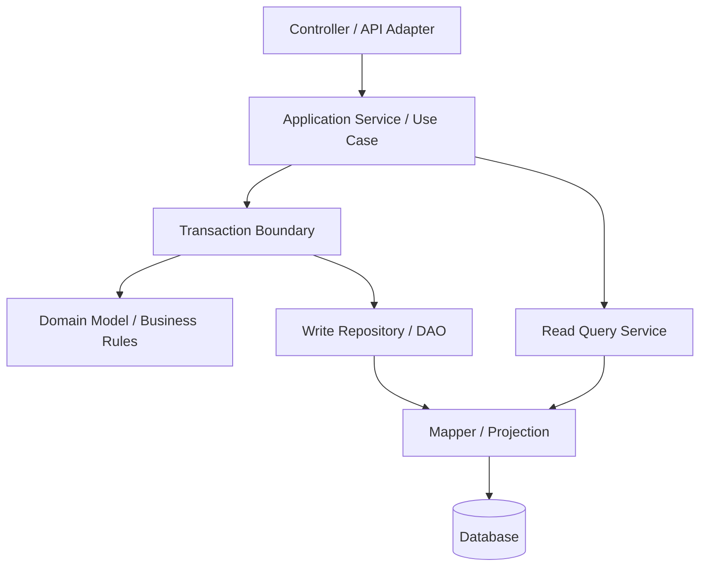

Interpretasi:

- Controller tidak boleh tahu detail SQL, entity graph, persistence context, atau transaction semantics.
- Application service/use case adalah tempat orkestrasi.
- Transaction boundary harus melekat ke use case, bukan tersebar acak di method kecil.
- Domain model menjaga invariant business.
- Repository/DAO menjaga persistence logic.
- Query service menjaga read path yang tidak cocok masuk repository aggregate.
- Mapper/projection menjaga konversi row/entity/record ke bentuk yang aman untuk keluar layer.

---

## 4. Data Access Bukan Satu Layer Tunggal

Istilah "data access layer" sering menipu. Dalam sistem serius, data access bukan satu folder `repository`.

Ia adalah gabungan beberapa sub-boundary:

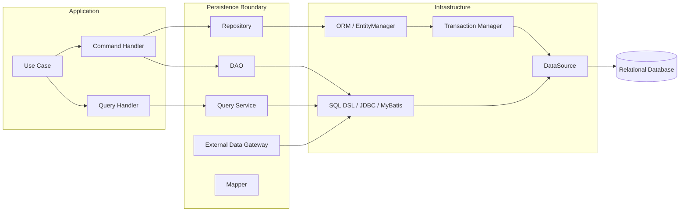

Satu aplikasi boleh memakai beberapa style sekaligus:

- JPA/Hibernate untuk aggregate persistence;
- jOOQ untuk reporting query kompleks;
- JDBC/MyBatis untuk batch bulk operation;
- native query untuk database-specific feature;
- projection/read model untuk list screen;
- stored procedure untuk operasi legacy atau dekat dengan database.

Yang penting bukan "satu framework untuk semua". Yang penting adalah **ownership dan boundary jelas**.

---

## 5. Arsitektur untuk Simple Monolith

Simple monolith cocok ketika:

- domain belum terlalu besar;
- tim kecil;
- modul belum banyak;
- query belum terlalu kompleks;
- throughput belum ekstrem;
- schema masih relatif mudah dievolusi.

Struktur minimal:

```txt
src/main/java/com/acme/caseapp/
  casefile/
    CaseFileController.java
    CaseFileService.java
    CaseFileRepository.java
    CaseFileEntity.java
    CaseFileMapper.java
  investigation/
    InvestigationController.java
    InvestigationService.java
    InvestigationRepository.java
    InvestigationEntity.java
    InvestigationMapper.java
```

Diagram:

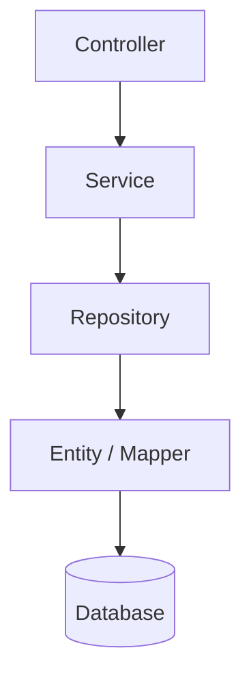

Ini cukup untuk awal, tetapi ada bahaya: repository sering berubah menjadi "semua query untuk screen X".

Contoh repository yang mulai busuk:

```java
public interface CaseFileRepository {
    Optional<CaseFile> findById(CaseFileId id);

    List<CaseFile> findOpenCasesByOfficerId(String officerId);

    List<CaseFile> findDashboardRows(
            String unitCode,
            String riskLevel,
            LocalDate from,
            LocalDate to,
            int page,
            int size);

    List<CaseFile> findExportRowsForRegulator(
            String regulatorCode,
            LocalDate from,
            LocalDate to);

    long countForDashboard(String unitCode, String riskLevel);
}
```

Masalahnya bukan jumlah method. Masalahnya adalah repository mulai mencampur:

- aggregate loading;
- dashboard query;
- export query;
- reporting query;
- regulatory view;
- pagination count;
- read-specific projection.

Lebih sehat:

```txt
casefile/
  application/
    CaseFileCommandService.java
    CaseFileQueryService.java

  domain/
    CaseFile.java
    CaseFileStatus.java
    CaseFileRepository.java

  infrastructure/
    JpaCaseFileRepository.java
    CaseFileDashboardQuery.java
    CaseFileExportQuery.java
    CaseFileRowMapper.java
```

Aturan:

- `CaseFileRepository` untuk aggregate persistence.
- `CaseFileDashboardQuery` untuk screen/query projection.
- `CaseFileExportQuery` untuk export-specific query.
- Service boleh memanggil repository dan query service, tetapi controller tidak boleh.

---

## 6. Arsitektur untuk Modular Monolith

Modular monolith adalah bentuk yang sangat kuat untuk banyak sistem enterprise. Ia menjaga satu deployable, tetapi memisahkan modul secara tegas.

```txt
src/main/java/com/acme/enforcement/
  casefile/
    api/
    application/
    domain/
    persistence/
    internal/

  sanction/
    api/
    application/
    domain/
    persistence/
    internal/

  inspection/
    api/
    application/
    domain/
    persistence/
    internal/

  shared/
    kernel/
    persistence/
    observability/
```

Peta akses:

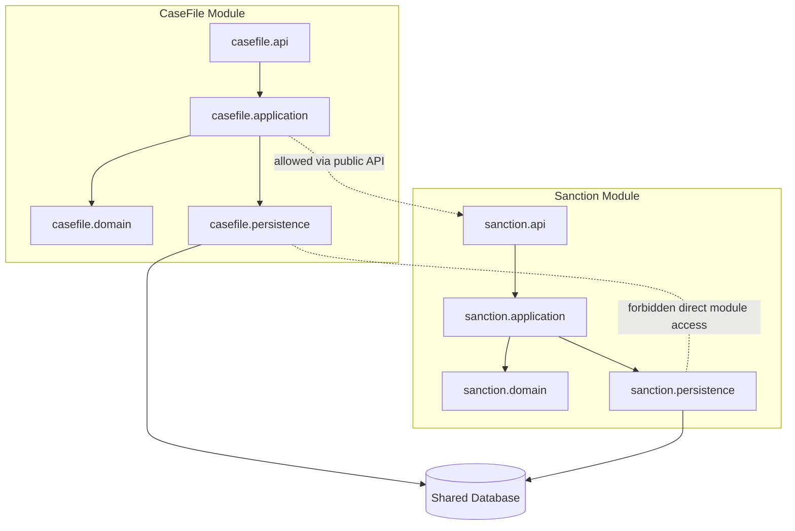

Prinsip penting:

1. Modul boleh berbagi database fisik, tetapi tidak boleh sembarang mengakses tabel milik modul lain.
2. Akses lintas modul harus lewat API/application service internal, bukan join acak antar persistence package.
3. Jika perlu query lintas modul untuk reporting, buat read model/reporting schema yang eksplisit.
4. Constraint database tetap penting, tetapi ownership tabel harus jelas.

Contoh ownership table:

| Table | Owner Module | Access Rule |
|---|---|---|
| `case_file` | casefile | write hanya oleh casefile |
| `case_assignment` | casefile | write hanya oleh casefile |
| `sanction_decision` | sanction | write hanya oleh sanction |
| `inspection_result` | inspection | write hanya oleh inspection |
| `case_dashboard_read_model` | reporting/casefile | read-optimized, rebuildable |

---

## 7. Arsitektur untuk Microservice

Microservice mengubah data access architecture secara fundamental.

Di monolith, boundary utama adalah package/module. Di microservice, boundary utama adalah **process + database ownership**.

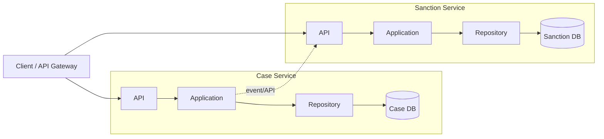

Aturan keras:

- Service lain tidak boleh query langsung database milik service ini.
- Shared database antar service biasanya merusak ownership.
- Cross-service join harus diganti dengan API composition, read model, event projection, atau materialized view yang owned.
- Transaction boundary berhenti di database service sendiri.
- Cross-service consistency harus dirancang sebagai workflow, saga, outbox/inbox, atau reconciliation.

Data access dalam microservice harus jauh lebih defensif karena local database tidak lagi menjadi satu-satunya sumber state yang dibutuhkan use case.

Contoh:

```txt
Case Service:
  owns case_file
  owns case_status_history
  publishes CaseEscalated event

Sanction Service:
  owns sanction_decision
  subscribes CaseEscalated
  stores case_snapshot_for_sanction
```

Sanction Service tidak query `case_file`. Ia menyimpan snapshot yang diperlukan untuk membuat keputusan.

---

## 8. API Backend: Read Path dan Write Path Jangan Dipaksa Sama

Banyak backend Java melayani UI/API. Di sini kesalahan umum adalah memaksa entity write model menjadi response model.

Write path:

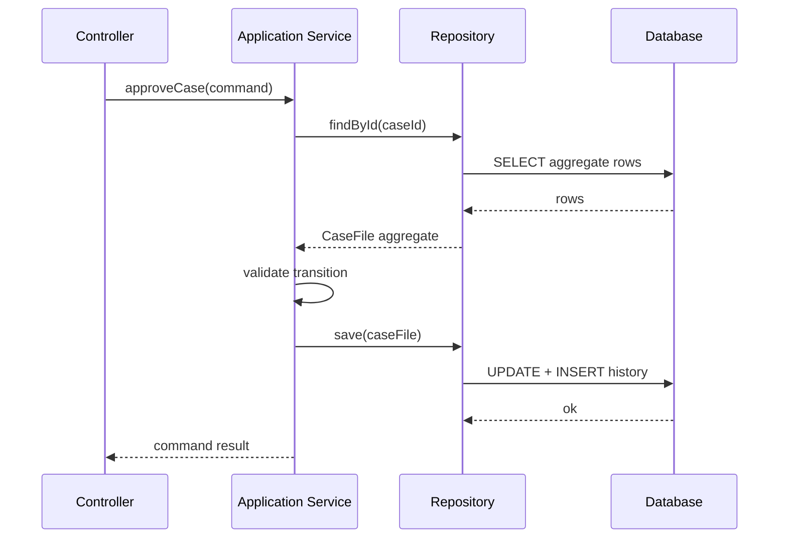

Read path:

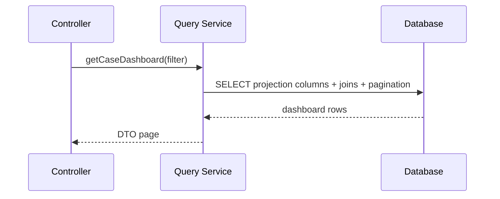

Kesimpulan:

- Write path memuat aggregate untuk menjaga invariant.
- Read path boleh memakai projection yang langsung sesuai kebutuhan view.
- Jangan memaksa dashboard memakai aggregate jika yang dibutuhkan hanya 12 kolom dari 8 tabel.
- Jangan memaksa command memakai projection jika invariant butuh full aggregate behavior.

---

## 9. Batch Worker Architecture

Batch worker berbeda dari request/response API.

Ciri-ciri batch:

- memproses banyak row;
- butuh checkpoint/resume;
- rawan memory pressure;
- rawan transaksi terlalu panjang;
- butuh chunking;
- butuh idempotency;
- butuh throttling;
- harus bisa dihentikan dan dilanjutkan.

Peta:

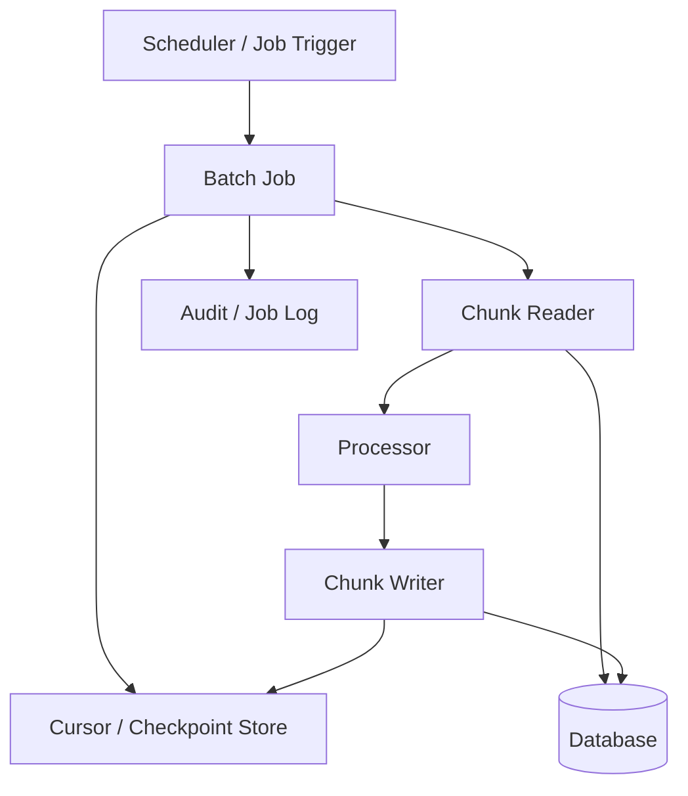

Aturan batch:

1. Jangan memuat seluruh dataset ke memory.
2. Jangan membuka satu transaksi untuk satu juta row.
3. Gunakan cursor/checkpoint yang durable.
4. Setiap chunk harus idempotent atau retry-safe.
5. Simpan audit progress.
6. Pisahkan read query, processing logic, dan write query.
7. Batasi concurrency berdasarkan kapasitas database, bukan jumlah thread yang tersedia.

Contoh contract:

```java
public interface CaseBackfillCursorStore {
    Optional<BackfillCursor> load(String jobName);
    void save(String jobName, BackfillCursor cursor);
}

public interface CaseChunkReader {
    List<CaseBackfillRow> readAfter(BackfillCursor cursor, int limit);
}

public interface CaseChunkWriter {
    ChunkWriteResult write(List<CaseBackfillCommand> commands);
}
```

---

## 10. Reporting dan Analytics Query

Reporting sering merusak OLTP data access layer.

Masalah umum:

- query dashboard memerlukan banyak join;
- filter dinamis;
- sort dinamis;
- pagination;
- aggregation;
- export besar;
- akses lintas bounded context;
- query berubah mengikuti kebutuhan business;
- user ingin "semua kolom".

Jangan paksa reporting query masuk repository aggregate.

Pola yang lebih sehat:

```txt
reporting/
  CaseAgingReportQuery.java
  OfficerWorkloadReportQuery.java
  EnforcementOutcomeReportQuery.java
  ReportExportJob.java
  ReportReadModelRefresher.java
```

Diagram:

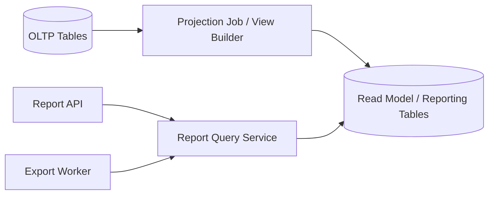

Aturan:

- OLTP repository menjaga write correctness.
- Reporting query menjaga read efficiency.
- Reporting read model boleh denormalized.
- Read model harus rebuildable.
- Export besar sebaiknya async.
- Query report harus punya ownership dan review process.

---

## 11. Package Architecture by Responsibility

Untuk sistem menengah-besar, struktur ini lebih tahan lama daripada folder berdasarkan framework:

```txt
com.acme.enforcement.casefile
  api
    CaseFileController.java
    CaseFileResponse.java
    ApproveCaseRequest.java

  application
    ApproveCaseUseCase.java
    AssignCaseUseCase.java
    CaseFileCommandService.java
    CaseFileQueryFacade.java

  domain
    CaseFile.java
    CaseFileId.java
    CaseStatus.java
    CaseFileRepository.java
    CaseTransitionPolicy.java

  persistence
    JpaCaseFileRepository.java
    CaseFileEntity.java
    CaseFileEntityMapper.java
    CaseFileDashboardQuery.java
    CaseFileHistoryQuery.java

  migration
    V202607050001__create_case_file.sql

  testfixture
    CaseFileFixture.java
```

Perhatikan: interface repository berada di `domain`, implementasi berada di `persistence`.

Ini menjaga domain tidak tergantung pada framework persistence.

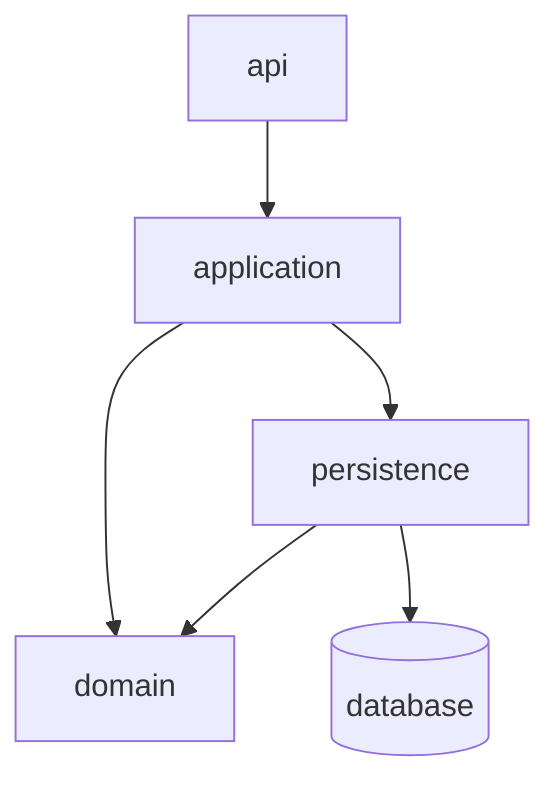

Arah dependency yang sehat:

- API bergantung ke application.
- Application bergantung ke domain.
- Persistence boleh bergantung ke domain karena ia mengimplementasikan contract domain.
- Domain tidak bergantung ke persistence framework.
- Controller tidak bergantung langsung ke entity persistence.

---

## 12. Repository vs DAO vs Query Service

### Repository

Repository sebaiknya dipakai untuk aggregate/domain object.

```java
public interface CaseFileRepository {
    Optional<CaseFile> findById(CaseFileId id);
    void save(CaseFile caseFile);
}
```

Ciri repository yang sehat:

- method-nya berbicara dalam bahasa domain;
- mengembalikan aggregate atau value object domain;
- tidak mengembalikan entity persistence ke luar;
- tidak menjadi dumping ground reporting query;
- tidak menyembunyikan operasi mahal dengan nama innocent seperti `findAll`.

### DAO

DAO cocok untuk akses tabel/row yang lebih eksplisit, terutama saat domain aggregate tidak diperlukan.

```java
public interface CaseAssignmentDao {
    List<CaseAssignmentRow> findActiveAssignments(String officerId);
    int markExpiredAssignments(Instant now, int limit);
}
```

Ciri DAO sehat:

- jujur tentang row/table orientation;
- cocok untuk JDBC/MyBatis/jOOQ;
- explicit tentang result shape;
- bagus untuk batch, maintenance, migration, repair.

### Query Service

Query service cocok untuk read path spesifik.

```java
public interface CaseDashboardQuery {
    Page<CaseDashboardRow> search(CaseDashboardFilter filter, PageRequest pageRequest);
}
```

Ciri query service sehat:

- return DTO/projection;
- query-nya boleh kompleks;
- tidak dipaksa memuat aggregate;
- bisa dioptimalkan sesuai screen/report;
- query ownership jelas.

---

## 13. Write Model vs Read Model

Salah satu mental model terpenting:

```txt
Write model exists to protect correctness.
Read model exists to serve questions efficiently.
```

Write model:

- menjaga invariant;
- menjalankan state transition;
- membutuhkan consistency;
- biasanya transactional;
- biasanya lebih kecil dan ketat;
- tidak harus nyaman untuk semua screen.

Read model:

- menjawab pertanyaan;
- boleh denormalized;
- boleh projection;
- boleh cache/rebuild;
- boleh eventual consistent jika business mengizinkan;
- tidak boleh menjadi sumber mutasi utama tanpa desain khusus.

Diagram:

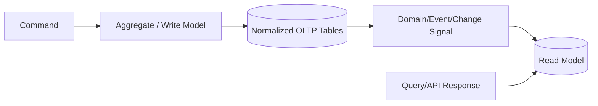

Tidak semua sistem butuh CQRS penuh. Tetapi hampir semua sistem non-trivial butuh **read/write separation secara konseptual**.

---

## 14. Transaction Ownership

Transaksi sebaiknya dimiliki oleh application use case, bukan repository kecil.

Buruk:

```java
public class CaseService {
    public void approve(CaseId id) {
        repository.markApproved(id);      // transaction A
        repository.insertHistory(id);     // transaction B
        notificationRepository.enqueue(id); // transaction C
    }
}
```

Lebih sehat:

```java
public class ApproveCaseUseCase {
    @Transactional
    public void approve(ApproveCaseCommand command) {
        CaseFile caseFile = caseFileRepository
                .findById(command.caseId())
                .orElseThrow(CaseNotFoundException::new);

        caseFile.approve(command.approvedBy(), command.reason());

        caseFileRepository.save(caseFile);
        outboxRepository.append(CaseApprovedEvent.from(caseFile));
    }
}
```

Prinsip:

- transaksi mencakup satu use case consistency boundary;
- repository tidak menentukan kapan seluruh use case commit;
- repository boleh memakai transaction yang sudah ada;
- jangan mulai transaksi baru tanpa alasan eksplisit;
- event/outbox yang harus atomic dengan perubahan state masuk transaction yang sama.

---

## 15. Mapping Ownership

Mapping adalah sumber bug yang sering diremehkan.

Pertanyaan mapping:

- apakah object ini domain object, entity persistence, DTO, projection, atau row?
- siapa yang boleh mengubahnya?
- apakah field null secara database boleh null di Java?
- apakah enum mapping backward compatible?
- apakah timestamp timezone-safe?
- apakah money/decimal precision aman?
- apakah ID type-safe atau string longgar?

Pola mapping:

```txt
Database Row
  -> Persistence Entity / Record
  -> Domain Object
  -> Application Result
  -> API DTO
```

Tidak semua sistem membutuhkan semua tahap. Tetapi setiap sistem harus tahu bentuk apa yang sedang dipakai.

Contoh pemisahan:

```java
// Domain
public final class CaseFile {
    private final CaseFileId id;
    private CaseStatus status;
    private final List<CaseEvent> events;

    public void approve(UserId approver, String reason) {
        if (!status.canMoveTo(CaseStatus.APPROVED)) {
            throw new InvalidCaseTransitionException(status, CaseStatus.APPROVED);
        }
        this.status = CaseStatus.APPROVED;
        this.events.add(CaseEvent.approved(id, approver, reason));
    }
}

// Persistence Entity
@Entity
@Table(name = "case_file")
class CaseFileEntity {
    @Id
    private UUID id;

    @Column(nullable = false)
    private String status;

    @Version
    private long version;
}

// Mapper
final class CaseFileEntityMapper {
    CaseFile toDomain(CaseFileEntity entity) {
        return new CaseFile(
                new CaseFileId(entity.getId()),
                CaseStatus.valueOf(entity.getStatus())
        );
    }
}
```

---

## 16. SQL Ownership

SQL ownership harus eksplisit.

Beberapa pilihan:

| SQL Location | Cocok Untuk | Risiko |
|---|---|---|
| Derived repository method | Query sederhana | nama method meledak, query shape tersembunyi |
| JPQL/Criteria | Entity-based query | N+1, projection rumit |
| Native SQL | DB-specific optimization | portability rendah |
| jOOQ DSL | SQL-first type-safe | butuh code generation discipline |
| MyBatis XML | SQL eksplisit dan reviewable | mapping XML bisa menyebar |
| Stored procedure | logic dekat DB/legacy | versioning/testing lebih berat |
| View/materialized view | read model stabil | migration dan refresh strategy |

Aturan review:

- query yang berdampak performance harus visible;
- query pagination harus punya count strategy;
- query list screen harus punya index strategy;
- query export harus punya streaming/chunking strategy;
- query mutasi massal harus punya idempotency dan audit strategy.

---

## 17. Data Access in Hexagonal Architecture

Dalam hexagonal architecture, database bukan pusat aplikasi. Ia adalah adapter.

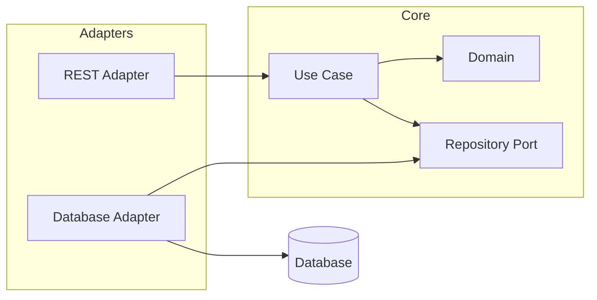

Catatan penting: "database as adapter" bukan berarti database constraint tidak penting. Constraint database tetap bagian dari correctness. Tetapi dependency source code core tidak boleh bergantung pada framework database.

---

## 18. Data Access in Layered Architecture

Layered architecture masih valid jika dependency-nya disiplin.

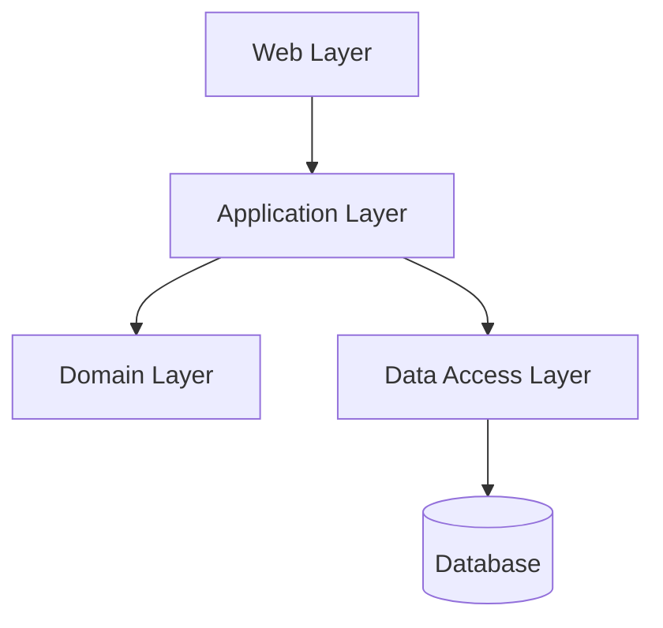

Masalah layered architecture muncul ketika:

- domain layer tidak punya behavior;
- service layer jadi procedural monster;
- data access layer menjadi global utility;
- semua layer boleh mengakses semua entity;
- transaction boundary tidak eksplisit.

Layered architecture baik jika:

- application service jelas;
- domain behavior tetap ada;
- data access contract kecil;
- read query dipisahkan;
- dependency direction dijaga.

---

## 19. Data Access in Clean Architecture

Clean architecture menekankan dependency inward.

```txt
Controller -> Use Case -> Repository Interface
Persistence Adapter -> Repository Interface
```

Contoh:

```java
public interface LoadCaseFilePort {
    Optional<CaseFile> load(CaseFileId id);
}

public interface SaveCaseFilePort {
    void save(CaseFile caseFile);
}

public final class ApproveCaseUseCase {
    private final LoadCaseFilePort loader;
    private final SaveCaseFilePort saver;

    public void handle(ApproveCaseCommand command) {
        CaseFile caseFile = loader.load(command.caseId())
                .orElseThrow(CaseNotFoundException::new);

        caseFile.approve(command.actor(), command.reason());
        saver.save(caseFile);
    }
}
```

Adapter:

```java
final class JpaCaseFilePersistenceAdapter
        implements LoadCaseFilePort, SaveCaseFilePort {

    private final CaseFileJpaRepository repository;
    private final CaseFileMapper mapper;

    @Override
    public Optional<CaseFile> load(CaseFileId id) {
        return repository.findById(id.value())
                .map(mapper::toDomain);
    }

    @Override
    public void save(CaseFile caseFile) {
        repository.save(mapper.toEntity(caseFile));
    }
}
```

Keuntungan:

- use case bisa dites tanpa database;
- persistence bisa diganti tanpa mengubah use case;
- domain tidak bergantung ke framework;
- boundary eksplisit.

Trade-off:

- lebih banyak class;
- bisa overengineering untuk CRUD sederhana;
- mapping bisa menjadi boilerplate jika tidak disiplin.

---

## 20. Data Access in Transaction Script

Transaction Script cocok untuk use case sederhana dan procedural, terutama CRUD administratif atau workflow linear.

```java
@Transactional
public void closeExpiredAssignments(Instant now) {
    List<AssignmentRow> expired = assignmentDao.findExpired(now, 500);

    for (AssignmentRow row : expired) {
        assignmentDao.markClosed(row.id(), now);
        auditDao.insert("ASSIGNMENT_CLOSED", row.id(), now);
    }
}
```

Kapan masuk akal:

- domain behavior sederhana;
- operasi dekat dengan database;
- batch/maintenance;
- admin operation;
- migration-support operation.

Kapan berbahaya:

- state transition kompleks;
- banyak invariant;
- concurrency tinggi;
- business rule tersebar;
- audit/legal defensibility penting.

Transaction Script bukan anti-pattern. Ia menjadi anti-pattern ketika dipakai untuk domain yang sebenarnya kompleks.

---

## 21. Data Access in Domain Model Pattern

Domain model cocok ketika behavior dan invariant penting.

```java
public final class EnforcementCase {
    private CaseStatus status;
    private RiskLevel riskLevel;
    private List<CaseAction> actions;

    public void escalate(UserId actor, EscalationReason reason) {
        ensureOpen();
        ensureRiskAllowsEscalation();
        status = CaseStatus.ESCALATED;
        actions.add(CaseAction.escalated(actor, reason));
    }
}
```

Repository:

```java
public interface EnforcementCaseRepository {
    Optional<EnforcementCase> findById(CaseId id);
    void save(EnforcementCase enforcementCase);
}
```

Kapan cocok:

- state transition penting;
- rule berubah tapi harus terkonsentrasi;
- audit perlu menjelaskan alasan perubahan;
- concurrency anomaly merugikan;
- domain object bukan hanya data container.

Risiko:

- ORM mapping bisa sulit;
- aggregate terlalu besar;
- lazy loading tersembunyi;
- repository dipaksa melayani query UI.

Solusi: pisahkan write aggregate dan read projection.

---

## 22. Data Access untuk Regulatory / Enforcement System

Untuk konteks regulatory/case management, data access harus bisa dipertanggungjawabkan.

Kebutuhan umum:

- audit trail immutable;
- state transition defensible;
- alasan keputusan tersimpan;
- actor dan timestamp jelas;
- data snapshot pada saat keputusan;
- idempotent workflow action;
- explicit transaction boundary;
- query report bisa direkonstruksi;
- migration aman terhadap evidence/history;
- access pattern bisa diaudit.

Peta yang disarankan:

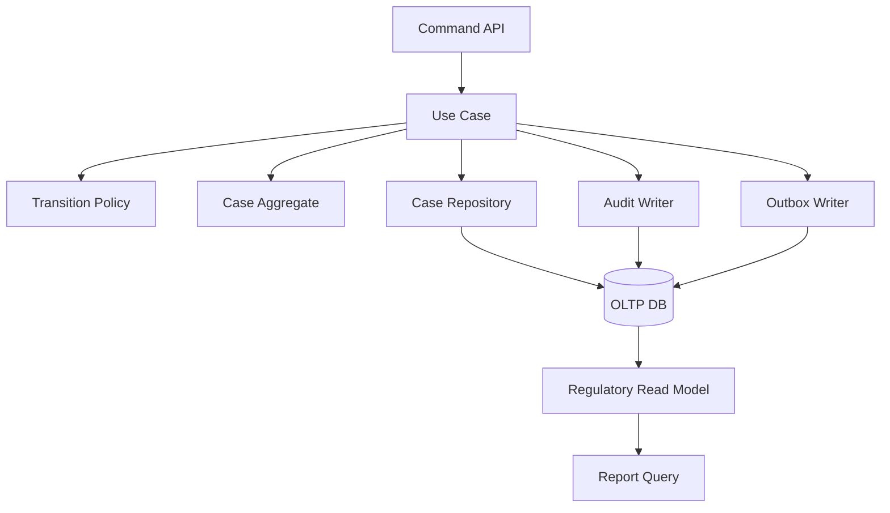

Invariant:

- state change dan audit record harus atomic;
- decision reason tidak boleh hilang;
- regulatory output harus berasal dari data yang versioned/snapshot;
- setiap mutation harus punya actor, command id, dan correlation id;
- retry tidak boleh membuat duplicate decision.

---

## 23. Choosing Architecture by System Force

Gunakan force, bukan selera framework.

| Force | Architecture Bias |
|---|---|
| CRUD sederhana | layered + repository sederhana |
| Domain invariant kuat | use case + domain model + repository |
| Query kompleks | query service + SQL-first |
| Reporting berat | read model / materialized projection |
| Batch besar | DAO/chunk reader/writer |
| Cross-service consistency | outbox/inbox + workflow |
| Audit/regulatory | explicit command, immutable history, deterministic query |
| Low latency read | projection/cache/read model |
| High write correctness | transaction + constraint + lock/version |
| Legacy DB | DAO/MyBatis/jOOQ/stored procedure adapter |
| Multi-team system | modular boundary + table ownership |

---

## 24. Data Access Flow Examples

### 24.1 Command Flow

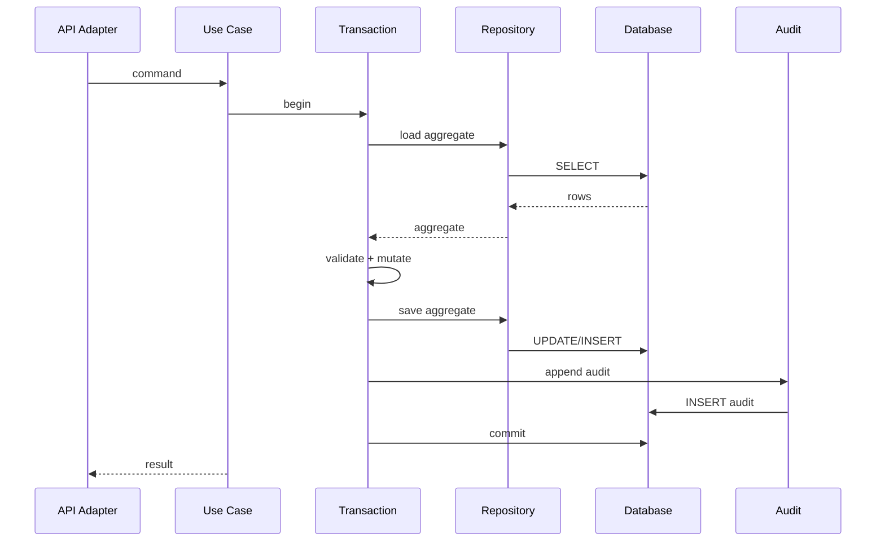

### 24.2 Query Flow

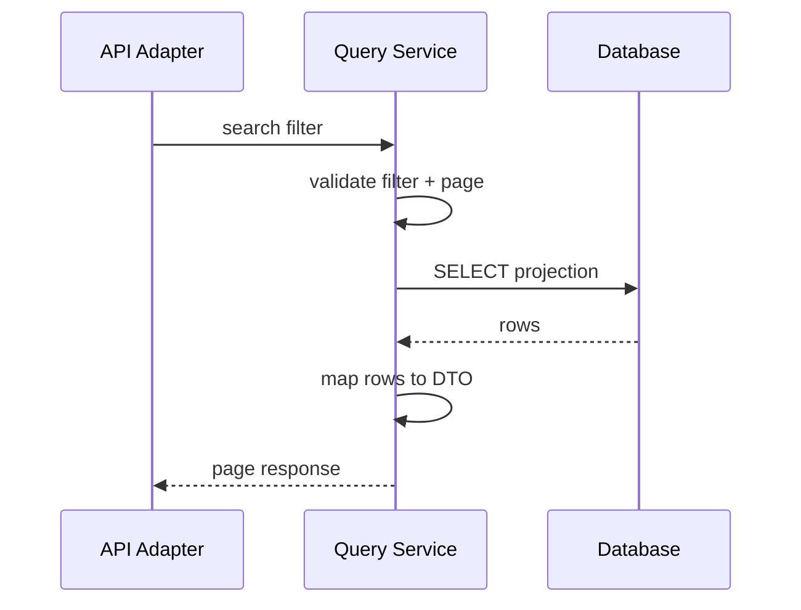

### 24.3 Batch Flow

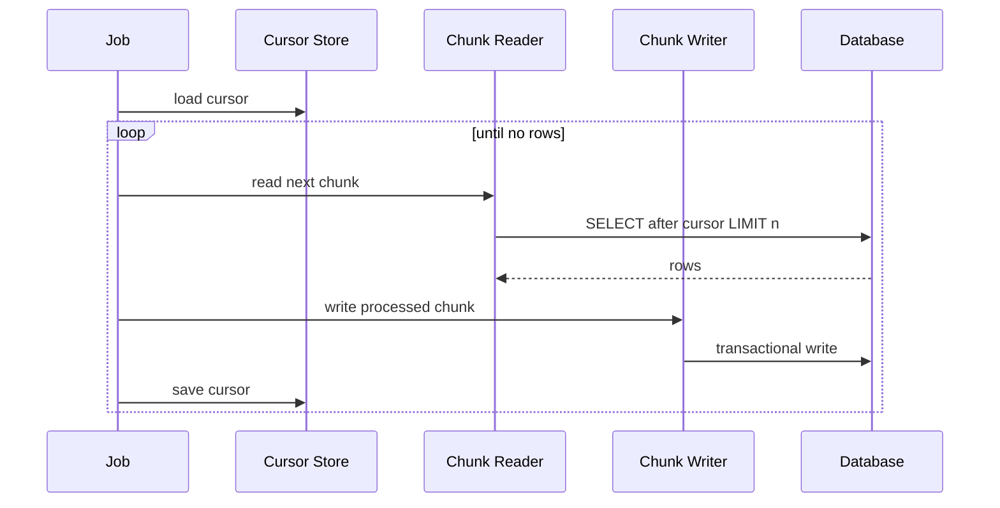

---

## 25. Architectural Smells

### Smell 1 — Controller knows persistence entity

```java
@GetMapping("/{id}")
public CaseFileEntity get(@PathVariable UUID id) {
    return repository.findById(id).orElseThrow();
}
```

Masalah:

- API contract bocor dari persistence;
- lazy loading bisa terjadi saat serialization;
- field internal ikut terekspos;
- schema change bisa mematahkan API.

### Smell 2 — Repository is report engine

```java
interface CaseRepository {
    List<CaseEntity> findByStatus(String status);
    List<CaseDashboardDto> dashboard(...);
    List<OfficerWorkloadDto> workload(...);
    List<CaseExportDto> export(...);
}
```

Masalah:

- repository kehilangan semantic;
- aggregate query dan reporting query bercampur;
- sulit review performance;
- sulit tahu query mana critical.

### Smell 3 — Transaction hidden in every repository method

```java
@Transactional
void updateStatus(...)

@Transactional
void insertHistory(...)

@Transactional
void enqueueNotification(...)
```

Masalah:

- use case terlihat atomic padahal tidak;
- rollback partial;
- invariant bisa pecah;
- retry makin sulit.

### Smell 4 — Domain object depends on ORM

```java
@Entity
public class CaseFile {
    @OneToMany(fetch = FetchType.LAZY)
    private List<CaseAction> actions;

    public void approve() {
        // business logic
    }
}
```

Ini tidak selalu salah. Tetapi untuk domain kompleks, hati-hati:

- domain behavior bisa memicu lazy loading;
- aggregate boundary mengikuti mapping, bukan invariant;
- cascade bisa menulis terlalu banyak;
- testing domain jadi butuh persistence concern.

### Smell 5 — Dynamic query built from strings everywhere

```java
String sql = "select * from case_file where 1=1 ";
if (status != null) sql += " and status = '" + status + "'";
```

Masalah:

- injection risk;
- query review sulit;
- parameter binding hilang;
- plan stability buruk;
- testing sulit.

---

## 26. Architecture Decision Matrix

| Decision | Prefer This | Avoid This |
|---|---|---|
| Simple aggregate write | Repository + transaction at use case | Controller writes entity |
| Complex dashboard read | Query service + projection SQL | Loading full aggregate graph |
| Batch repair | DAO/chunk reader/writer | ORM loop with huge persistence context |
| Regulatory state change | Command use case + audit + version/lock | Direct update without reason/audit |
| Search screen | Query object/specification/jOOQ | Dozens of derived method names |
| Cross-module read | Public query API/read model | Direct table access from other module |
| Cross-service join | Projection/event/API composition | Shared database join |
| Export large data | Async export job + streaming/chunking | Synchronous request loading all rows |
| Migration-sensitive feature | expand-contract | breaking schema change |

---

## 27. Example: Case Approval Architecture

Package:

```txt
caseapproval/
  api/
    ApproveCaseController.java
    ApproveCaseRequest.java

  application/
    ApproveCaseUseCase.java
    ApproveCaseCommand.java
    ApproveCaseResult.java

  domain/
    CaseFile.java
    CaseFileRepository.java
    CaseApprovalPolicy.java
    CaseStatus.java

  persistence/
    JpaCaseFileRepository.java
    CaseFileEntity.java
    CaseFileMapper.java
    CaseApprovalAuditDao.java
    CaseOutboxDao.java
```

Use case:

```java
public final class ApproveCaseUseCase {
    private final CaseFileRepository caseFiles;
    private final CaseApprovalAuditDao audit;
    private final CaseOutboxDao outbox;

    @Transactional
    public ApproveCaseResult approve(ApproveCaseCommand command) {
        CaseFile caseFile = caseFiles.findById(command.caseId())
                .orElseThrow(() -> new CaseFileNotFound(command.caseId()));

        caseFile.approve(command.actor(), command.reason());

        caseFiles.save(caseFile);
        audit.appendApproval(caseFile.id(), command.actor(), command.reason());
        outbox.append("CaseApproved", caseFile.id().toString(), command.commandId());

        return new ApproveCaseResult(caseFile.id(), caseFile.status());
    }
}
```

Read query:

```java
public interface CaseApprovalHistoryQuery {
    List<CaseApprovalHistoryRow> findByCaseId(CaseFileId caseId);
}
```

Controller tidak tahu entity. Controller tidak tahu transaction. Controller tidak tahu query plan. Controller tahu request dan response.

---

## 28. Example: Dashboard Architecture

```java
public record CaseDashboardFilter(
        Optional<String> unitCode,
        Optional<String> officerId,
        Optional<CaseStatus> status,
        Optional<LocalDate> openedFrom,
        Optional<LocalDate> openedTo
) {}

public record CaseDashboardRow(
        UUID caseId,
        String caseNumber,
        String status,
        String riskLevel,
        String assignedOfficer,
        Instant lastUpdatedAt
) {}

public interface CaseDashboardQuery {
    Page<CaseDashboardRow> search(CaseDashboardFilter filter, PageRequest pageRequest);
}
```

Implementation boleh memakai jOOQ/native SQL/MyBatis/JPA projection. Contract-nya tetap query-specific.

Keuntungan:

- API response tidak terikat entity;
- query bisa dioptimalkan;
- pagination bisa didesain jelas;
- index bisa direview;
- query bisa dites langsung terhadap database.

---

## 29. Example: Backfill Architecture

```java
public final class NormalizeCaseRiskBackfillJob {
    private final BackfillCursorStore cursorStore;
    private final CaseRiskBackfillReader reader;
    private final CaseRiskBackfillWriter writer;

    public void run() {
        BackfillCursor cursor = cursorStore.load("normalize-case-risk")
                .orElse(BackfillCursor.start());

        while (true) {
            List<CaseRiskBackfillRow> rows = reader.readAfter(cursor, 500);
            if (rows.isEmpty()) {
                return;
            }

            writer.write(rows.stream()
                    .map(this::normalize)
                    .toList());

            cursor = BackfillCursor.after(rows.get(rows.size() - 1).caseId());
            cursorStore.save("normalize-case-risk", cursor);
        }
    }
}
```

Jangan pakai repository aggregate untuk backfill jutaan row kecuali benar-benar butuh domain behavior per aggregate. Jika hanya transformasi data, DAO/jOOQ/MyBatis lebih eksplisit dan lebih aman dikontrol.

---

## 30. Architecture Rules of Thumb

1. **Controller never owns data access.**
2. **Use case owns transaction boundary.**
3. **Repository owns aggregate persistence.**
4. **Query service owns read projection.**
5. **DAO owns table/row-oriented operations.**
6. **Mapper owns conversion.**
7. **Database owns constraints that protect data integrity.**
8. **Migration owns schema evolution.**
9. **Observability owns evidence during production failure.**
10. **Test owns proof that mapping and query behavior are real.**

---

## 31. What Belongs Where?

| Concern | Best Home |
|---|---|
| HTTP request parsing | Controller/API adapter |
| Authentication principal extraction | API/application boundary |
| Authorization decision | Application/domain policy |
| Transaction boundary | Application use case |
| Business invariant | Domain/application policy |
| SQL text/DSL | Persistence implementation/query service |
| ORM mapping | Persistence package |
| Projection DTO | Query/application/API boundary |
| Audit append | Same transaction as command |
| Outbox append | Same transaction as command |
| Retry policy | Use case/application infrastructure |
| Pagination validation | API/application query boundary |
| Schema migration | Migration folder/tool |
| Index review | Persistence/database review |
| Query metric | Persistence instrumentation |

---

## 32. Design Exercise: Classify the Operation

Untuk setiap operasi, tentukan apakah masuk Repository, DAO, Query Service, atau Job.

| Operation | Recommended Component | Reason |
|---|---|---|
| Approve case | Use case + repository | State transition dan invariant |
| Find case by ID for editing | Repository or query service | Depends apakah butuh aggregate behavior |
| Dashboard list | Query service | Projection/read-specific |
| Export 2 million records | Async job + DAO/query service | Large result, streaming/chunking |
| Recalculate risk score for all open cases | Batch job + DAO/repository hybrid | Depends apakah domain logic required |
| Insert audit event | DAO/outbox/audit writer | Append-only persistence |
| Load entity for optimistic update | Repository | Aggregate mutation |
| Search by dynamic filters | Query object/query service | Read-specific composition |
| Repair corrupted status | Admin job + DAO + audit | Controlled mutation and evidence |

---

## 33. Architecture Review Checklist

Sebelum menerima desain data access, tanyakan:

- Apakah transaction boundary terlihat?
- Apakah command dan query dipisahkan secara wajar?
- Apakah repository hanya melayani aggregate, bukan semua screen?
- Apakah query besar punya owner?
- Apakah mapping object jelas?
- Apakah entity persistence bocor ke API?
- Apakah constraint database mendukung invariant?
- Apakah concurrency anomaly sudah dipikirkan?
- Apakah retry bisa membuat duplicate mutation?
- Apakah large read akan memakan memory?
- Apakah schema change bisa dilakukan tanpa mematahkan app lama?
- Apakah query bisa diamati di production?
- Apakah test memakai database nyata untuk mapping/query penting?
- Apakah modul lain bisa melanggar table ownership?
- Apakah audit trail atomic dengan state change?

---

## 34. Common Evolution Path

Banyak sistem sehat berevolusi seperti ini:

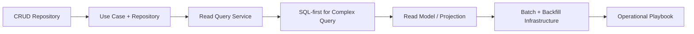

Jangan mulai dengan architecture paling kompleks. Tetapi jangan juga menunggu sampai production incident baru memisahkan read/write path.

Rule sederhana:

```txt
Start simple.
Make boundaries explicit early.
Split when forces appear.
Do not hide expensive behavior.
```

---

## 35. Mini Lab

Ambil satu fitur nyata, misalnya "approve enforcement case".

Jawab:

1. Apa command object-nya?
2. Apa aggregate yang harus dimuat?
3. Apa invariant yang harus dijaga?
4. Apakah perlu optimistic lock?
5. Apakah audit harus atomic?
6. Apakah perlu outbox event?
7. Apa response minimal?
8. Query apa yang diperlukan UI setelah command?
9. Apakah query itu harus memakai aggregate atau projection?
10. Apa failure mode-nya?
11. Apa yang terjadi jika user retry request?
12. Apa yang terjadi jika dua user approve bersamaan?
13. Apa schema migration yang dibutuhkan?
14. Apa metric yang harus terlihat?

Kalau kamu bisa menjawab ini sebelum coding, desain data access kamu biasanya akan lebih bersih.

---

## 36. Summary

Data access architecture bukan sekadar memilih framework. Ia adalah peta ownership.

Yang harus jelas:

- transaction boundary;
- query boundary;
- mutation boundary;
- mapping boundary;
- consistency boundary;
- module/service ownership;
- read/write separation;
- batch/reporting strategy;
- failure and observability strategy.

Framework hanyalah alat. Desain yang kuat dimulai dari pertanyaan: **state mana yang sedang kita baca, state mana yang sedang kita ubah, invariant apa yang harus benar, dan boundary mana yang boleh menyentuh database?**

---

## 37. References

Referensi berikut menjadi anchor faktual untuk istilah dan behavior yang akan dipakai di part-part berikutnya:

- Oracle Java SE JDBC API — `Connection`, `Statement`, `PreparedStatement`, `ResultSet`: https://docs.oracle.com/en/java/javase/21/docs/api/java.sql/module-summary.html
- Jakarta Persistence Specification 3.2: https://jakarta.ee/specifications/persistence/3.2/jakarta-persistence-spec-3.2
- Hibernate ORM User Guide: https://docs.hibernate.org/stable/orm/userguide/html_single/
- Spring Data JPA Reference: https://docs.spring.io/spring-data/jpa/reference/
- jOOQ Manual: https://www.jooq.org/doc/latest/manual/
- MyBatis 3 Mapper XML Documentation: https://mybatis.org/mybatis-3/sqlmap-xml.html
- R2DBC Specification: https://r2dbc.io/spec/
- Flyway Documentation: https://documentation.red-gate.com/fd
