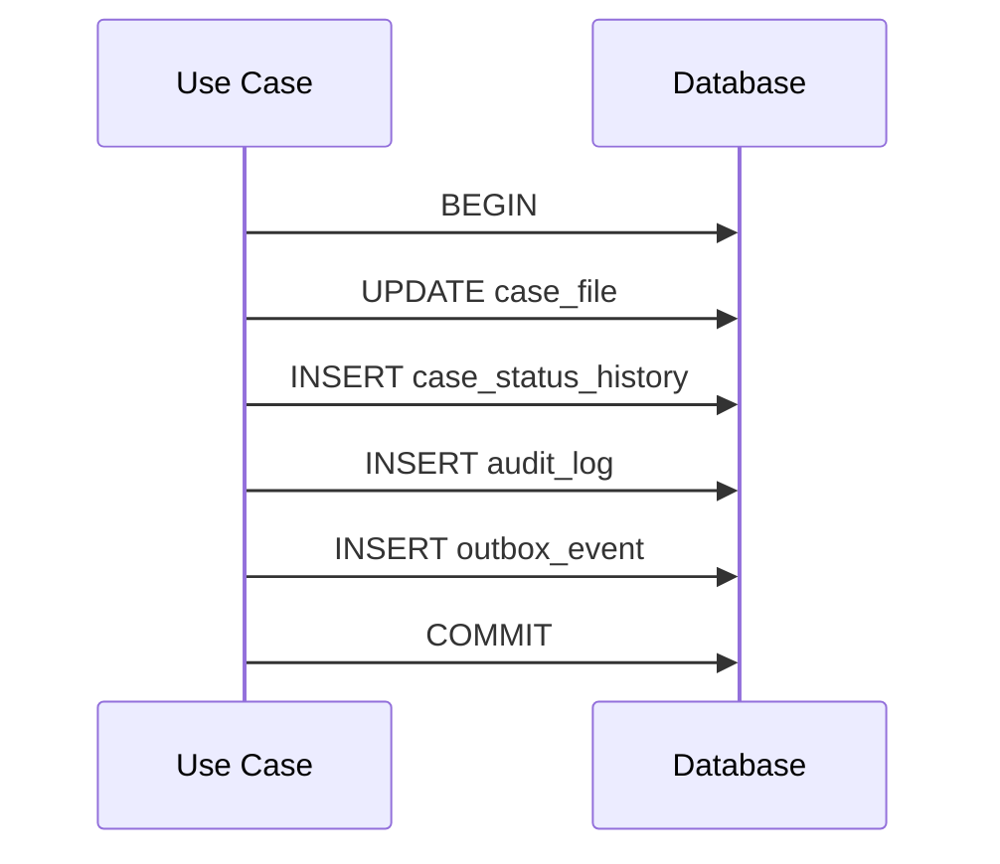
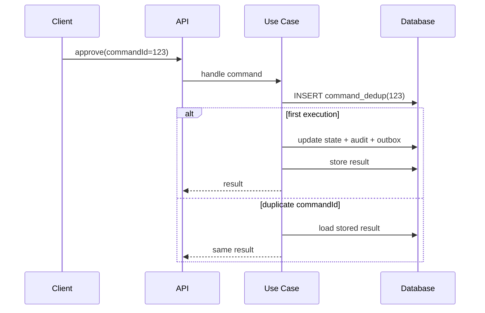
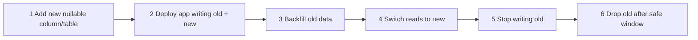
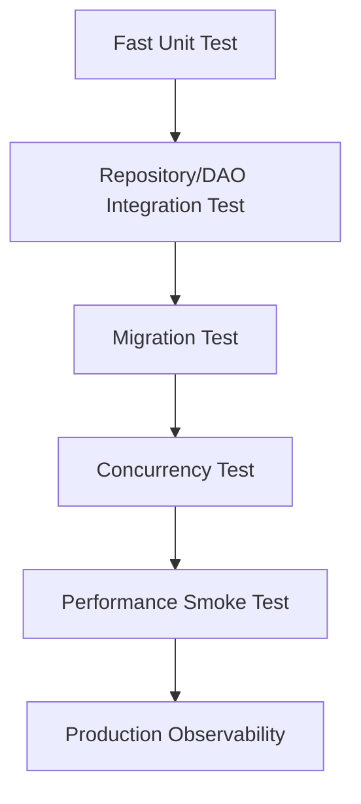

# Part 008 — Production-Grade Data Access Invariants

> Production-grade data access bukan berarti memakai framework paling populer.
>
> Production-grade berarti sistem tetap benar ketika request retry, user klik dua kali, database lambat, transaksi deadlock, deployment rolling, schema berubah, batch diulang, dan query dashboard tiba-tiba dipakai ribuan user.

Part ini adalah daftar invariant yang harus kamu pakai sebagai standar review setiap data access design.

Invariant di sini bukan "best practice" yang longgar. Invariant adalah sesuatu yang harus tetap benar walaupun sistem berada dalam kondisi buruk.

---

## 1. Core Thesis

Data access layer production-grade harus menjaga lima hal:

```txt
Correctness
Consistency
Resource safety
Performance stability
Operational evidence
```

Kalau hanya cepat tapi tidak benar, sistem berbahaya.

Kalau benar saat happy path tetapi rusak saat retry, sistem belum production-grade.

Kalau jalan di local H2 tetapi gagal di PostgreSQL/Oracle/MySQL production, test-nya tidak membuktikan cukup.

Kalau query lambat tapi tidak ada metric, log, atau trace, tim tidak punya bukti untuk memperbaiki.

---

## 2. Invariant Map

```mermaid
flowchart TD
    A[Production-Grade Data Access]

    A --> B[Correctness]
    A --> C[Transaction Discipline]
    A --> D[Idempotency]
    A --> E[Resource Safety]
    A --> F[Query Stability]
    A --> G[Schema Compatibility]
    A --> H[Observability]
    A --> I[Testability]
    A --> J[Security & Auditability]

    B --> B1[DB constraints]
    B --> B2[Domain invariant]
    B --> B3[Mapping correctness]

    C --> C1[Bounded transaction]
    C --> C2[Isolation choice]
    C --> C3[Lock/retry design]

    D --> D1[Command ID]
    D --> D2[Unique key]
    D --> D3[Replay-safe result]

    E --> E1[Connection lifecycle]
    E --> E2[Timeout]
    E --> E3[No unbounded result]

    F --> F1[Known query shape]
    F --> F2[Index compatibility]
    F --> F3[Pagination strategy]

    G --> G1[Expand-contract]
    G --> G2[Backward compatible reads]
    G --> G3[Migration test]

    H --> H1[Metrics]
    H --> H2[Logs]
    H --> H3[Tracing]

    I --> I1[Real DB integration test]
    I --> I2[Concurrency test]
    I --> I3[Migration smoke test]

    J --> J1[Prepared statement]
    J --> J2[Least privilege]
    J --> J3[Immutable audit]
```



---

## 3. Invariant 1 — Correctness Beats Convenience

Data access layer harus menjaga data tetap benar, bukan sekadar membuat coding lebih cepat.

Correctness berasal dari beberapa lapisan:

| Layer | Apa yang Dijaga |
|---|---|
| API validation | format request, required field, type shape |
| Application rule | use case allowed atau tidak |
| Domain invariant | state transition, business rule |
| Database constraint | uniqueness, foreign key, check constraint, not null |
| Transaction | atomicity antar perubahan |
| Lock/version | concurrency conflict |
| Audit | evidence bahwa keputusan terjadi dengan alasan benar |

Jangan hanya mengandalkan satu lapisan.

Contoh salah:

```java
if (!repository.existsByCaseNumber(caseNumber)) {
    repository.save(new CaseFile(caseNumber));
}
```

Di concurrency, dua request bisa melewati `exists` sebelum salah satunya insert.

Lebih sehat:

```sql
alter table case_file
add constraint uq_case_file_case_number unique (case_number);
```

Lalu Java menangani duplicate key sebagai business conflict.

```java
try {
    caseFileRepository.save(caseFile);
} catch (DuplicateCaseNumberException ex) {
    throw new CaseNumberAlreadyExists(caseFile.caseNumber());
}
```

Mental model:

```txt
Application checks improve user experience.
Database constraints protect truth.
```

---

## 4. Invariant 2 — Transaction Boundary Must Be Explicit

Transaksi adalah boundary atomicity. Ia menjawab:

```txt
Changes mana yang harus commit bersama?
Changes mana yang boleh gagal sendiri?
Side effect mana yang tidak boleh terjadi sebelum commit?
```

Contoh use case:

```txt
Approve case:
1. update case status
2. insert status history
3. insert audit record
4. append outbox event
```

Keempatnya biasanya harus satu transaksi.



Buruk:

```java
public void approve(CaseId id) {
    caseRepository.approve(id);       // transaction 1
    auditRepository.append(...);      // transaction 2
    eventPublisher.publish(...);      // external side effect
}
```

Jika audit gagal setelah status berubah, evidence rusak. Jika publish berhasil lalu DB rollback, downstream menerima event palsu.

Lebih sehat:

```java
@Transactional
public void approve(ApproveCaseCommand command) {
    CaseFile caseFile = caseRepository.load(command.caseId());
    caseFile.approve(command.actor(), command.reason());

    caseRepository.save(caseFile);
    auditRepository.append(command.auditRecord());
    outboxRepository.append(CaseApprovedEvent.from(caseFile, command.commandId()));
}
```

Aturan:

- transaction boundary ada di use case/application service;
- jangan melakukan network call external di tengah transaksi kecuali desainnya sadar risiko;
- outbox lebih aman daripada publish langsung sebelum commit;
- transaksi harus sekecil mungkin tetapi cukup untuk menjaga invariant;
- jangan menyembunyikan transaksi di method kecil jika use case butuh atomicity lebih besar.

---

## 5. Invariant 3 — Every Write Must Have a Concurrency Story

Setiap write operation harus punya jawaban untuk pertanyaan:

```txt
Apa yang terjadi jika dua request mengubah data yang sama bersamaan?
```

Pilihan umum:

| Strategy | Cocok Untuk | Risiko |
|---|---|---|
| Unique constraint | dedup, natural identity | perlu error mapping |
| Optimistic locking | update entity dengan version | conflict harus ditangani |
| Pessimistic locking | high-contention critical section | bisa deadlock/blocking |
| Serializable transaction | invariant kompleks lintas row | throughput turun |
| Application lock/lease | distributed workflow | expiry dan ownership harus ketat |
| Idempotency key | retry/double submit | key lifecycle dan replay result |

Contoh optimistic lock:

```java
@Entity
@Table(name = "case_file")
class CaseFileEntity {
    @Id
    private UUID id;

    @Version
    private long version;

    @Column(nullable = false)
    private String status;
}
```

Jika dua transaksi memuat version yang sama, salah satu commit lebih dulu. Transaksi lain akan gagal saat update karena version berubah. Itu bukan error teknis biasa; itu conflict domain/application.

Handling:

```java
try {
    approveCaseUseCase.approve(command);
} catch (OptimisticLockingFailureException ex) {
    throw new CaseWasModifiedConcurrently(command.caseId());
}
```

Untuk regulatory workflow, conflict harus jelas. Jangan silent overwrite.

---

## 6. Invariant 4 — Retry Must Not Duplicate Effects

Retry adalah bagian normal dari sistem distributed: timeout, deadlock, serialization failure, network glitch, user double-click, message redelivery.

Jika write tidak idempotent, retry membuat data rusak.

Buruk:

```java
@PostMapping("/cases/{id}/approve")
public void approve(@PathVariable UUID id) {
    approveCaseUseCase.approve(id);
}
```

Jika client timeout setelah server commit, client retry. Tanpa idempotency, bisa terjadi:

- duplicate history;
- duplicate audit;
- duplicate event;
- status transition kedua yang tidak valid;
- external notification dobel.

Lebih sehat:

```java
public record ApproveCaseCommand(
        UUID commandId,
        CaseFileId caseId,
        UserId actor,
        String reason
) {}
```

Database:

```sql
create table command_dedup (
    command_id uuid primary key,
    aggregate_id uuid not null,
    command_type text not null,
    result_payload jsonb,
    created_at timestamptz not null
);
```

Flow:



Invariant:

```txt
Same command ID + same semantic command = same durable result.
```

---

## 7. Invariant 5 — Database Constraints Are Part of Application Design

Constraint bukan sekadar DBA concern. Constraint adalah bagian dari correctness model.

Minimum yang harus dipikirkan:

| Constraint | Menjaga |
|---|---|
| `NOT NULL` | required value benar-benar required |
| `UNIQUE` | dedup, identity, idempotency |
| `FOREIGN KEY` | referential integrity |
| `CHECK` | bounded state/value |
| `EXCLUDE` / advanced constraint | range overlap, scheduling conflict |
| `VERSION` column | optimistic concurrency |
| immutable audit append rule | forensic integrity |

Contoh:

```sql
create table case_file (
    id uuid primary key,
    case_number text not null,
    status text not null,
    version bigint not null,
    created_at timestamptz not null,
    updated_at timestamptz not null,
    constraint uq_case_file_case_number unique (case_number),
    constraint chk_case_file_status check (
        status in ('DRAFT', 'OPEN', 'ESCALATED', 'APPROVED', 'CLOSED')
    )
);
```

Java enum saja tidak cukup. Aplikasi lama, migration script, admin script, atau integration path bisa menulis database tanpa melewati enum Java terbaru.

---

## 8. Invariant 6 — Mapping Must Be Deliberate

Mapping bug sering tidak terlihat sampai data production aneh.

Area mapping rawan:

- `BigDecimal` precision/scale;
- timestamp timezone;
- enum string vs ordinal;
- nullable column ke primitive Java;
- ID sebagai raw `String`;
- JSON column versioning;
- array/list ordering;
- one-to-many duplication karena join;
- lazy association saat serialization;
- database default yang tidak terlihat di entity.

Checklist mapping:

```txt
For every persisted field:
- What is the DB type?
- What is the Java type?
- Can it be null?
- Who sets it?
- Is it immutable after creation?
- Is it indexed?
- Is it part of equality?
- Is it part of audit?
- How does it evolve?
```

Contoh buruk:

```java
@Enumerated(EnumType.ORDINAL)
private CaseStatus status;
```

Jika urutan enum berubah, data lama bisa berubah makna.

Lebih aman:

```java
@Enumerated(EnumType.STRING)
@Column(nullable = false)
private CaseStatus status;
```

Untuk sistem yang butuh compatibility sangat kuat, bahkan string enum pun bisa dibungkus converter eksplisit agar unknown value bisa ditangani dengan sadar.

---

## 9. Invariant 7 — Query Shape Must Be Known

Query shape adalah bentuk nyata query yang dikirim ke database:

- tabel apa yang dibaca;
- join apa yang dilakukan;
- predicate apa yang dipakai;
- sort apa yang dipakai;
- limit/offset/cursor apa;
- kolom apa yang dipilih;
- apakah query memicu query tambahan;
- index mana yang diharapkan.

ORM abstraction tidak boleh membuat query shape tidak terlihat.

Contoh masalah:

```java
List<CaseFile> cases = caseRepository.findByStatus(OPEN);

for (CaseFile caseFile : cases) {
    System.out.println(caseFile.getAssignedOfficer().getName());
}
```

Jika `assignedOfficer` lazy, ini bisa menjadi N+1 query.

Query shape yang terlihat:

```sql
select
    c.id,
    c.case_number,
    c.status,
    o.display_name as assigned_officer_name
from case_file c
left join officer o on o.id = c.assigned_officer_id
where c.status = ?
order by c.updated_at desc
limit ? offset ?;
```

Invariant:

```txt
Critical read paths must have explicit, reviewable query shape.
```

Ini tidak berarti semua query harus native SQL. Tetapi query yang penting harus bisa diketahui, diuji, dan direview.

---

## 10. Invariant 8 — Pagination Must Be Designed, Not Added Later

Pagination bukan detail UI. Ia memengaruhi query plan, index, memory, dan consistency.

Offset pagination:

```sql
select *
from case_file
where status = 'OPEN'
order by updated_at desc
limit 50 offset 10000;
```

Masalah:

- offset besar makin mahal;
- row bisa bergeser saat data berubah;
- count query bisa lebih mahal dari data query.

Keyset/cursor pagination:

```sql
select *
from case_file
where status = 'OPEN'
  and (updated_at, id) < (?, ?)
order by updated_at desc, id desc
limit 50;
```

Lebih stabil untuk infinite scroll/high-volume list.

Aturan:

- untuk admin list kecil, offset bisa cukup;
- untuk feed besar, export, high-volume table, pertimbangkan cursor/keyset;
- setiap pagination butuh deterministic ordering;
- order by harus punya tie-breaker, biasanya ID;
- count total harus dievaluasi apakah benar-benar perlu.

---

## 11. Invariant 9 — No Unbounded Read

Unbounded read adalah salah satu pembunuh production paling umum.

Buruk:

```java
List<CaseFile> all = caseRepository.findAll();
```

Bahkan jika hari ini hanya 500 row, besok bisa 50 juta.

Invariant:

```txt
Every list query must have an explicit bound.
```

Bound bisa berupa:

- `limit`;
- pagination;
- cursor;
- date range;
- partition key;
- chunk size;
- streaming with backpressure-like control;
- async export job.

Contoh contract lebih aman:

```java
public interface OpenCaseQuery {
    Page<OpenCaseRow> search(OpenCaseFilter filter, PageRequest pageRequest);
}
```

Untuk batch:

```java
List<CaseBackfillRow> readAfter(CaseId lastSeenId, int limit);
```

---

## 12. Invariant 10 — Timeouts Must Align Across Layers

Timeout harus berurutan dan masuk akal.

Misalnya:

```txt
HTTP request timeout:       3s
Application command budget: 2.5s
Transaction timeout:        2s
Query timeout:              1.5s
Connection acquire timeout: 300ms
```

Jangan sampai query timeout 60s tetapi HTTP timeout 3s. Itu membuat server tetap bekerja setelah client menyerah.

Layer timeout:

| Layer | Contoh |
|---|---|
| Client | HTTP client timeout |
| API server | request timeout |
| Application | command deadline |
| Transaction | transaction timeout |
| SQL statement | query timeout |
| Connection acquisition | pool acquire timeout |
| Database | statement/lock timeout |
| Network | socket timeout |

Invariant:

```txt
Lower layer timeout must not outlive the business request budget without reason.
```

---

## 13. Invariant 11 — Resource Lifecycle Must Be Closed

Resource data access harus punya lifecycle jelas.

JDBC primitive:

- `Connection`;
- `PreparedStatement`;
- `ResultSet`.

Harus ditutup, biasanya via try-with-resources.

```java
try (
    Connection connection = dataSource.getConnection();
    PreparedStatement statement = connection.prepareStatement(sql)
) {
    statement.setString(1, status);

    try (ResultSet rs = statement.executeQuery()) {
        while (rs.next()) {
            // map row
        }
    }
}
```

Dengan framework, lifecycle sering dikelola, tetapi tanggung jawab desain tetap ada:

- jangan simpan entity lazy di luar transaction lalu akses kemudian;
- jangan return stream yang masih butuh connection tanpa close protocol;
- jangan buka transaction untuk operasi yang menunggu user/external service;
- jangan memproses result besar dalam satu persistence context tanpa clear/chunking.

---

## 14. Invariant 12 — Transactions Must Be Bounded

Transaksi panjang meningkatkan risiko:

- lock contention;
- deadlock;
- vacuum/undo pressure;
- connection held too long;
- timeout;
- poor failover behavior;
- user-visible latency.

Buruk:

```java
@Transactional
public void approveAndNotify(ApproveCaseCommand command) {
    CaseFile caseFile = repository.load(command.caseId());
    caseFile.approve(command.actor(), command.reason());

    externalDocumentService.generatePdf(caseFile); // network / slow
    emailClient.sendApprovalEmail(caseFile);       // external side effect

    repository.save(caseFile);
}
```

Lebih sehat:

```java
@Transactional
public void approve(ApproveCaseCommand command) {
    CaseFile caseFile = repository.load(command.caseId());
    caseFile.approve(command.actor(), command.reason());

    repository.save(caseFile);
    outbox.append(CaseApprovedEvent.from(caseFile));
}
```

PDF/email dilakukan oleh worker setelah commit.

Invariant:

```txt
Database transaction should contain database consistency work, not arbitrary slow work.
```

---

## 15. Invariant 13 — Hidden I/O Is a Design Smell

Hidden I/O adalah operasi yang tampak seperti akses memory tetapi sebenarnya memanggil database.

Contoh:

```java
caseFile.getActions().size()
caseFile.getAssignedOfficer().getName()
caseFile.getDocuments().stream().map(...)
```

Jika field lazy, kode ini bisa memicu query.

Hidden I/O berbahaya karena:

- sulit melihat performance;
- bisa terjadi di serializer;
- bisa terjadi di logger;
- bisa terjadi di domain method;
- bisa terjadi setelah transaction close;
- bisa membuat N+1.

Invariant:

```txt
Critical code path must make database access explicit.
```

Solusi:

- gunakan fetch plan eksplisit;
- gunakan projection;
- batasi lazy entity keluar persistence layer;
- jangan serialize entity langsung;
- pisahkan domain behavior dari graph loading yang tidak jelas.

---

## 16. Invariant 14 — Read Path Should Not Accidentally Mutate

ORM dengan dirty checking bisa membuat read path menulis jika entity managed diubah.

Contoh:

```java
@Transactional
public CaseDetailResponse getCaseDetail(UUID id) {
    CaseFileEntity entity = repository.findById(id).orElseThrow();

    entity.setLastViewedAt(Instant.now()); // accidental write?
    return mapper.toResponse(entity);
}
```

Jika transaksi commit, dirty checking bisa update row.

Aturan:

- read-only use case harus benar-benar read-only;
- gunakan read-only transaction hint bila relevan;
- gunakan DTO projection untuk read path;
- jangan expose managed entity ke layer yang bisa mengubahnya;
- pisahkan command dan query service.

---

## 17. Invariant 15 — Error Taxonomy Must Be Explicit

Tidak semua database error sama.

Kategori:

| Error | Bias Handling |
|---|---|
| Duplicate key | business conflict/idempotency |
| Foreign key violation | invalid reference or ordering bug |
| Check constraint violation | invalid state/value |
| Optimistic lock failure | concurrency conflict |
| Deadlock | retry candidate |
| Serialization failure | retry candidate |
| Lock timeout | retry or conflict depending use case |
| Query timeout | fail fast, maybe retry if safe |
| Connection acquisition timeout | overload/backpressure |
| Syntax error | deploy bug, never retry |
| Missing column/table | migration/deploy compatibility bug |

Buruk:

```java
catch (Exception e) {
    retry();
}
```

Lebih sehat:

```java
catch (DuplicateKeyException e) {
    throw new BusinessConflict("Case number already exists", e);
} catch (DeadlockLoserDataAccessException e) {
    throw new RetryableDataAccessFailure(e);
} catch (QueryTimeoutException e) {
    throw new TemporaryUnavailable(e);
}
```

Invariant:

```txt
Only retry operations that are safe to retry.
```

Dan retry-safe biasanya membutuhkan idempotency.

---

## 18. Invariant 16 — Observability Must Identify the Data Access Failure

Ketika production incident terjadi, kamu perlu menjawab:

- query mana yang lambat?
- endpoint/use case mana yang memicu?
- tenant/unit/user segment mana?
- pool saturated atau database lambat?
- lock wait atau CPU DB tinggi?
- query count per request berapa?
- N+1 terjadi di path mana?
- retry memperparah beban atau membantu?
- migration baru mengubah plan?
- error karena constraint atau timeout?

Minimum signal:

| Signal | Contoh |
|---|---|
| Query latency | histogram by query name |
| Query count | per request/use case |
| Connection acquire time | pool saturation indicator |
| Transaction duration | long transaction detection |
| Error taxonomy | duplicate/deadlock/timeout/constraint |
| Rows returned | unbounded read detection |
| Retry count | transient failure pressure |
| Slow query log correlation | query name/comment/correlation ID |
| Migration version | deploy compatibility |
| Outbox lag | async consistency delay |

Query naming berguna:

```sql
/* queryName=CaseDashboard.search, useCase=case-dashboard */
select ...
```

Metric naming contoh:

```txt
data_access.query.duration{query="CaseDashboard.search"}
data_access.query.rows{query="CaseDashboard.search"}
data_access.transaction.duration{use_case="ApproveCase"}
data_access.error.count{type="deadlock"}
data_access.connection.acquire.duration
```

---

## 19. Invariant 17 — Auditability Is Not Logging

Log bukan audit trail.

Log:

- bisa hilang;
- retention pendek;
- format berubah;
- tidak selalu transactional;
- tidak selalu queryable;
- tidak selalu immutable.

Audit trail:

- bagian dari domain evidence;
- transactional dengan state change;
- punya actor;
- punya timestamp;
- punya reason;
- punya before/after jika diperlukan;
- punya correlation/command ID;
- dilindungi dari update/delete sembarangan.

Contoh audit table:

```sql
create table case_audit_log (
    id uuid primary key,
    case_id uuid not null,
    command_id uuid not null,
    actor_id uuid not null,
    action text not null,
    reason text,
    previous_status text,
    new_status text,
    created_at timestamptz not null,
    constraint uq_case_audit_command unique (command_id)
);
```

Invariant:

```txt
If a decision must be defensible, it must be persisted as audit evidence, not merely logged.
```

---

## 20. Invariant 18 — Migration Must Be Backward Compatible

Production deployment sering rolling:

```txt
old app version + old schema
old app version + new schema
new app version + new schema
```

Jika migration langsung rename/drop column yang masih dibaca app lama, deployment bisa gagal.

Gunakan expand-contract:



Contoh salah:

```sql
alter table case_file rename column status to lifecycle_status;
```

Jika app lama masih membaca `status`, ia rusak.

Lebih sehat:

```sql
alter table case_file add column lifecycle_status text;

-- app version N writes both status and lifecycle_status
-- backfill lifecycle_status
-- app version N+1 reads lifecycle_status
-- later drop status
```

Invariant:

```txt
Schema migration must be compatible with at least one deployment overlap window.
```

---

## 21. Invariant 19 — Data Backfill Must Be Resumable

Backfill production tidak boleh diasumsikan selesai dalam sekali jalan.

Backfill harus:

- chunked;
- resumable;
- idempotent;
- observable;
- throttle-able;
- safe to stop;
- safe to rerun;
- auditable if it changes business data.

Cursor table:

```sql
create table backfill_cursor (
    job_name text primary key,
    last_seen_id uuid,
    processed_count bigint not null,
    updated_at timestamptz not null
);
```

Worker behavior:

```txt
load cursor
read chunk after cursor
write chunk in transaction
save cursor
repeat
```

Jangan:

```java
List<CaseFile> all = repository.findAll();
for (CaseFile c : all) {
    ...
}
```

---

## 22. Invariant 20 — Test Against the Database You Actually Use

Mock repository test tidak membuktikan:

- SQL valid;
- mapping benar;
- constraint aktif;
- transaction behavior sesuai;
- isolation anomaly;
- generated key behavior;
- timestamp precision;
- enum conversion;
- migration berhasil;
- index/query plan layak.

Gunakan real database integration test untuk query penting.

Test pyramid data access:



Contoh test target:

```txt
CaseFileRepositoryTest
- save and load aggregate
- optimistic lock conflict
- duplicate case number maps to business conflict
- status enum mapping stable

CaseDashboardQueryTest
- search filter combines correctly
- pagination deterministic
- no unbounded result
- null filter behavior
- count query returns expected result

MigrationTest
- migrate empty schema
- migrate from previous version fixture
- old/new compatibility if needed
```

---

## 23. Invariant 21 — Security Starts at Parameter Binding

SQL injection prevention bukan optional.

Buruk:

```java
String sql = "select * from case_file where case_number = '" + caseNumber + "'";
```

Lebih sehat:

```java
PreparedStatement ps = connection.prepareStatement(
        "select * from case_file where case_number = ?"
);
ps.setString(1, caseNumber);
```

Aturan:

- bind value sebagai parameter;
- jangan concatenate user input ke SQL;
- dynamic order by harus whitelist kolom;
- dynamic table name harus sangat dibatasi;
- gunakan least privilege DB user;
- pisahkan migration user dan application user jika memungkinkan;
- jangan log sensitive bind value sembarangan.

Dynamic sort aman:

```java
private static final Map<String, String> ALLOWED_SORT = Map.of(
        "updatedAt", "updated_at",
        "caseNumber", "case_number",
        "riskLevel", "risk_level"
);

String sortColumn = ALLOWED_SORT.get(request.sortBy());
if (sortColumn == null) {
    throw new InvalidSortField(request.sortBy());
}
```

---

## 24. Invariant 22 — Do Not Confuse Cache With Truth

Cache bisa membantu read performance, tetapi cache bukan sumber kebenaran kecuali didesain khusus.

Risiko cache:

- stale read;
- invalidation miss;
- race condition;
- inconsistent permission;
- cache stampede;
- memory pressure;
- wrong tenant/user scope;
- hiding database problem.

Aturan:

- tentukan TTL;
- tentukan invalidation;
- tentukan consistency expectation;
- tentukan key termasuk tenant/permission scope;
- tentukan fallback saat cache down;
- jangan cache entity managed;
- jangan pakai cache untuk menyembunyikan query buruk tanpa root cause.

---

## 25. Invariant 23 — Data Access Must Have a Capacity Model

Sebelum production, minimal tahu:

```txt
Expected QPS per endpoint
Queries per request
Rows scanned/returned
Average and p95 query latency
Transaction duration
Connection usage duration
Batch chunk size
Export volume
Migration duration
Backfill rate
```

Contoh sederhana:

```txt
Endpoint: GET /cases/dashboard
QPS p95: 80
Queries/request: 2
Rows returned: 50
Expected query p95: 120ms
DB connections consumed: short-lived
Risk: count query over large table
Mitigation: partial index + cursor pagination for deep pages
```

Jika satu request memicu 20 query, 100 QPS berarti 2000 query/detik. Data access design harus dihitung seperti sistem, bukan dirasa.

---

## 26. Invariant 24 — Large Export Is Not Normal Pagination

Export punya karakter berbeda:

- data besar;
- user tidak menunggu synchronously;
- butuh snapshot/consistency decision;
- butuh streaming/chunking;
- butuh file storage;
- butuh retry/resume;
- butuh audit siapa export apa;
- butuh privacy/data minimization.

Jangan:

```java
@GetMapping("/cases/export")
public List<CaseExportRow> export() {
    return query.exportAll();
}
```

Lebih sehat:

```txt
POST /exports/cases -> create export job
worker reads chunks
worker writes CSV/parquet/xlsx to storage
GET /exports/{id} -> status/download metadata
```

---

## 27. Invariant 25 — Every Data Access Method Needs a Semantic Contract

Method name harus menjelaskan behavior penting.

Buruk:

```java
List<CaseFile> getCases(Filter filter);
```

Lebih baik:

```java
Page<CaseDashboardRow> searchDashboardRows(
        CaseDashboardFilter filter,
        PageRequest pageRequest
);
```

Untuk write:

```java
SaveResult saveIfVersionMatches(CaseFile caseFile, long expectedVersion);
```

Untuk batch:

```java
List<CaseRepairRow> readRepairCandidatesAfter(
        CaseId lastSeenId,
        int limit
);
```

Contract harus menjawab:

- apakah bounded?
- apakah transactional?
- apakah lock?
- apakah projection?
- apakah managed entity?
- apakah streaming?
- apakah retry-safe?
- apakah result order deterministic?

---

## 28. Invariant 26 — Delete Semantics Must Be Designed

Delete bukan satu hal.

Jenis delete:

| Type | Meaning |
|---|---|
| Hard delete | row hilang |
| Soft delete | row diberi marker deleted |
| Archive | dipindah/ditandai cold |
| Redaction | sensitive field dihapus |
| Legal retention delete | sesuai policy retention |
| Logical cancellation | status berubah, data tetap |
| Tombstone | marker untuk sync/event |

Dalam regulatory system, hard delete sering berbahaya kecuali untuk data yang memang wajib dihapus karena policy privacy/retention.

Pertanyaan:

- apakah data boleh hilang?
- apakah audit harus tetap ada?
- apakah foreign key akan rusak?
- apakah read query harus exclude soft-deleted row?
- apakah unique constraint harus memperhitungkan soft delete?
- apakah event downstream perlu tombstone?

---

## 29. Invariant 27 — Multi-Tenant Data Access Must Be Impossible to Bypass Accidentally

Jika sistem multi-tenant atau multi-unit, tenant filter tidak boleh bergantung pada developer ingat menambahkan `where tenant_id = ?`.

Risk:

```sql
select * from case_file where status = 'OPEN';
```

Harusnya:

```sql
select * from case_file
where tenant_id = ?
  and status = 'OPEN';
```

Mitigasi:

- tenant-aware repository/query abstraction;
- database row-level security jika sesuai;
- composite indexes dengan tenant prefix;
- test yang memastikan query tidak bocor;
- least privilege;
- audit tenant access;
- tenant ID tidak diambil dari request body mentah, tetapi dari trusted context.

---

## 30. Invariant 28 — Regulatory Data Needs Snapshot Semantics

Untuk keputusan hukum/regulatory, data yang dipakai saat keputusan harus bisa dijelaskan di masa depan.

Masalah:

```txt
Decision made based on current company risk score.
Three months later risk score changed.
Regulator asks why decision was made.
```

Jika hanya menyimpan foreign key ke current risk score, evidence bisa berubah.

Solusi:

- decision snapshot;
- versioned reference data;
- immutable decision record;
- reason text/code;
- policy version;
- actor/correlation ID;
- input data hash jika perlu.

Contoh:

```sql
create table sanction_decision (
    id uuid primary key,
    case_id uuid not null,
    decision text not null,
    reason text not null,
    policy_version text not null,
    risk_score_snapshot numeric(10, 2) not null,
    company_status_snapshot text not null,
    decided_by uuid not null,
    decided_at timestamptz not null
);
```

---

## 31. Invariant 29 — Framework Defaults Are Not Architecture

Framework defaults berguna untuk mulai cepat, tetapi tidak boleh menggantikan keputusan desain.

Contoh default yang harus dievaluasi:

- default fetch strategy;
- default transaction propagation;
- default isolation;
- default cascade;
- default enum mapping;
- default connection pool size;
- default query timeout;
- default naming strategy;
- default batch size;
- default Open Session in View;
- default migration-on-startup behavior;
- default Jackson serialization of entity.

Prinsip:

```txt
Defaults are acceptable only after you know what they imply.
```

---

## 32. Production Readiness Checklist

Gunakan checklist ini sebelum fitur data access masuk production.

### Correctness

- [ ] Invariant business utama ditulis eksplisit.
- [ ] Constraint database mendukung invariant.
- [ ] Duplicate request tidak membuat duplicate effect.
- [ ] Concurrent update punya behavior jelas.
- [ ] Delete semantics jelas.
- [ ] Audit diperlukan/tidak sudah diputuskan.

### Transaction

- [ ] Transaction boundary ada di use case.
- [ ] Tidak ada external slow call di tengah transaksi.
- [ ] Outbox dipakai jika perlu publish setelah commit.
- [ ] Transaction duration masuk akal.
- [ ] Retry hanya untuk error yang aman.

### Query

- [ ] Query shape critical path terlihat.
- [ ] List query bounded.
- [ ] Pagination deterministic.
- [ ] Count query dievaluasi.
- [ ] N+1 dicegah.
- [ ] Index sesuai predicate dan ordering.

### Mapping

- [ ] Nullability Java sesuai DB.
- [ ] Enum mapping aman.
- [ ] Timestamp/timezone jelas.
- [ ] Numeric precision jelas.
- [ ] Entity tidak bocor ke API.
- [ ] Projection dipakai untuk read-specific path.

### Migration

- [ ] Migration backward compatible.
- [ ] Expand-contract dipakai untuk breaking change.
- [ ] Backfill resumable.
- [ ] Migration test ada.
- [ ] Rollback/forward-fix strategy jelas.

### Observability

- [ ] Query latency metric ada.
- [ ] Error taxonomy terlihat.
- [ ] Connection acquisition latency terlihat.
- [ ] Slow query bisa dikaitkan ke use case.
- [ ] Correlation ID tersedia.
- [ ] Audit bukan sekadar log.

### Testing

- [ ] Repository/DAO dites dengan DB nyata.
- [ ] Constraint violation dites.
- [ ] Optimistic lock/concurrency dites jika relevan.
- [ ] Migration dites.
- [ ] Query pagination dites.
- [ ] Large result behavior dites.

---

## 33. Review Rubric

Nilai desain dari 1 sampai 5.

| Area | 1 | 3 | 5 |
|---|---|---|---|
| Boundary | controller/service/repository campur | sebagian dipisah | command/query/transaction jelas |
| Correctness | hanya app validation | sebagian constraint | invariant multi-layer |
| Concurrency | tidak dipikirkan | optimistic/unique sebagian | conflict/retry/idempotency jelas |
| Query | hidden ORM | sebagian visible | critical query reviewable |
| Performance | asumsi | beberapa index | capacity/query plan/bounds jelas |
| Migration | breaking change | migration basic | expand-contract/backfill safe |
| Test | mock only | integration sebagian | real DB + concurrency + migration |
| Observability | log umum | metric basic | query/use case/error taxonomy jelas |
| Audit | log text | audit sebagian | transactional immutable evidence |

Target production-grade minimal: tidak boleh ada area critical di bawah 3.

---

## 34. Failure Scenario Walkthrough

### Scenario

User klik "Approve Case" dua kali karena browser timeout.

### Tanpa invariant

1. Request pertama commit status approved.
2. Audit insert berhasil.
3. Response timeout.
4. User retry.
5. Request kedua mencoba approve lagi.
6. Bisa terjadi duplicate audit, invalid transition, duplicate event, atau error 500.

### Dengan invariant

1. Command punya `commandId`.
2. `command_dedup.command_id` unique.
3. State transition memakai version.
4. Audit punya unique `command_id`.
5. Outbox punya unique semantic key.
6. Retry mengembalikan result yang sama.
7. Jika command berbeda mencoba approve case yang sudah approved, return business conflict yang jelas.

---

## 35. Mini Lab

Ambil fitur "assign case to officer".

Desain invariant:

1. Apakah satu case boleh punya lebih dari satu active assignment?
2. Constraint apa yang menjaga itu?
3. Apa yang terjadi jika dua supervisor assign bersamaan?
4. Apakah assignment butuh audit?
5. Apakah reassignment menyimpan reason?
6. Apakah notification dikirim via outbox?
7. Apakah retry command aman?
8. Apakah dashboard officer read model synchronous atau eventual?
9. Apakah query list assignment bounded?
10. Apa migration jika nanti assignment support delegation?

Contoh possible invariant:

```txt
At any time, one case may have at most one active primary officer assignment.
Every assignment change must produce an immutable audit record.
Retrying the same assignment command must not create duplicate assignment or audit.
```

Database support:

```sql
create unique index uq_case_active_primary_assignment
on case_assignment(case_id)
where ended_at is null and assignment_type = 'PRIMARY';
```

---

## 36. Summary

Production-grade data access adalah disiplin invariant.

Yang harus selalu benar:

- write operation menjaga correctness meski concurrent;
- transaction boundary eksplisit;
- retry tidak menggandakan effect;
- database constraint mendukung truth;
- mapping tidak ambigu;
- query shape critical terlihat;
- read tidak unbounded;
- timeout berlapis selaras;
- resource lifecycle aman;
- migration backward compatible;
- backfill resumable;
- test memakai database nyata;
- observability memberi bukti;
- audit adalah evidence, bukan log biasa.

Part berikutnya akan masuk ke Phase 2: **JDBC Deep Dive sebagai Primitive Dasar**, dimulai dari core API yang menjadi fondasi hampir semua data access framework Java.

---

## 37. References

Referensi berikut menjadi anchor faktual untuk API, specification, dan behavior yang akan dibahas lebih dalam di part berikutnya:

- Oracle Java SE JDBC API — module `java.sql`: https://docs.oracle.com/en/java/javase/21/docs/api/java.sql/module-summary.html
- Oracle Java SE JDBC `Connection`: https://docs.oracle.com/en/java/javase/21/docs/api/java.sql/java/sql/Connection.html
- Oracle Java SE JDBC `PreparedStatement`: https://docs.oracle.com/en/java/javase/21/docs/api/java.sql/java/sql/PreparedStatement.html
- Oracle Java SE JDBC `Statement#setFetchSize`: https://docs.oracle.com/en/java/javase/21/docs/api/java.sql/java/sql/Statement.html
- Jakarta Persistence Specification 3.2: https://jakarta.ee/specifications/persistence/3.2/jakarta-persistence-spec-3.2
- Hibernate ORM User Guide: https://docs.hibernate.org/stable/orm/userguide/html_single/
- Spring Data JPA Reference — Projections: https://docs.spring.io/spring-data/jpa/reference/repositories/projections.html
- Spring Data JPA Reference — Specifications: https://docs.spring.io/spring-data/jpa/reference/jpa/specifications.html
- jOOQ Manual: https://www.jooq.org/doc/latest/manual/
- MyBatis 3 Dynamic SQL: https://mybatis.org/mybatis-3/dynamic-sql.html
- R2DBC Specification: https://r2dbc.io/spec/
- Flyway Migration Documentation: https://documentation.red-gate.com/fd/migrations-271585107.html
