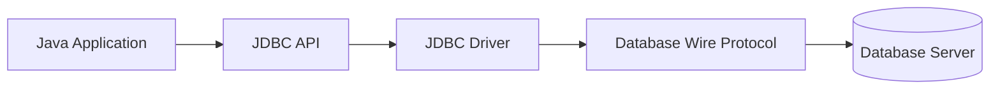
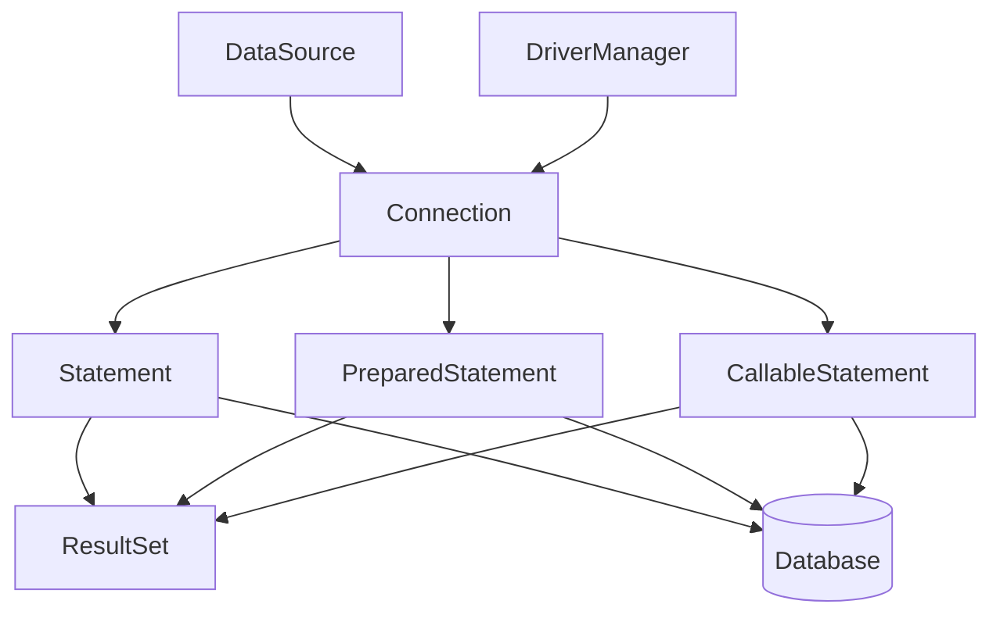
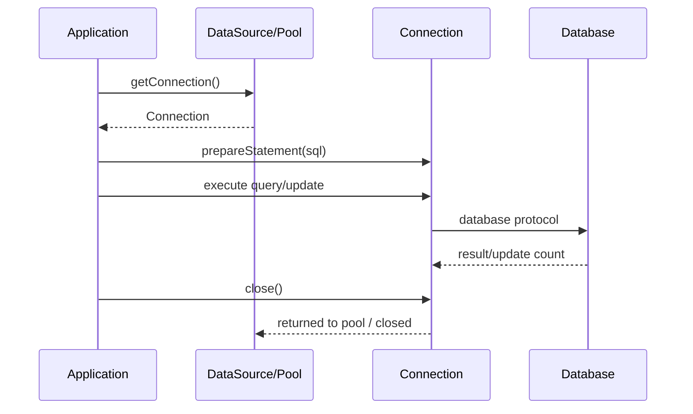
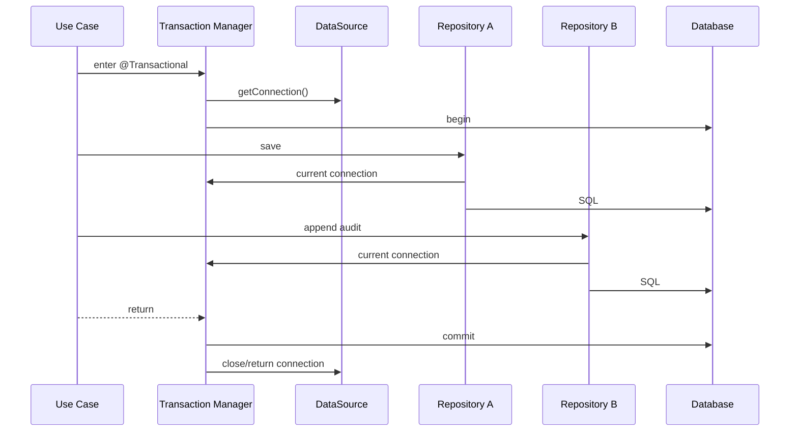

# Part 009 — JDBC Core API

> JDBC adalah lapisan paling penting yang sering dilupakan.
>
> Banyak engineer memakai JPA, Hibernate, Spring Data, MyBatis, jOOQ, atau migration tool setiap hari, tetapi ketika production incident terjadi, pertanyaannya sering kembali ke primitive JDBC:
>
> - koneksi dipinjam dari mana?
> - statement dieksekusi bagaimana?
> - transaksi dimulai kapan?
> - result set dibaca seperti apa?
> - resource ditutup kapan?
> - timeout dipasang di layer mana?
> - error database dipetakan menjadi apa?

Part ini membangun fondasi. Bukan supaya semua aplikasi harus ditulis manual dengan JDBC, tetapi supaya semua abstraction di atas JDBC bisa dibaca dengan mata yang benar.

---

## 1. Core Thesis

JDBC adalah kontrak standar Java untuk berbicara dengan database relasional.

Mental model paling sederhana:

```txt
Application
  -> JDBC API
    -> JDBC Driver
      -> Database Protocol
        -> Database Server
```

Diagram:



JDBC bukan ORM. JDBC tidak tahu domain object. JDBC tidak tahu aggregate. JDBC tidak tahu repository. JDBC hanya tahu:

- bagaimana mendapat koneksi;
- bagaimana mengirim SQL;
- bagaimana bind parameter;
- bagaimana membaca row;
- bagaimana mengontrol transaksi;
- bagaimana menangani error;
- bagaimana menutup resource.

Karena itu JDBC adalah primitive. Semua framework data access yang baik akhirnya harus menjawab pertanyaan yang sama.

---

## 2. JDBC Object Model

JDBC core API yang paling sering kamu lihat:

| API | Fungsi |
|---|---|
| `DriverManager` | Membuka koneksi langsung via URL JDBC. Umum untuk demo/tool kecil, bukan pilihan utama aplikasi server modern. |
| `DataSource` | Factory koneksi. Biasanya dibungkus connection pool dan di-inject ke aplikasi. |
| `Connection` | Sesi/logical connection ke database. Menjalankan statement dan mengelola transaction. |
| `Statement` | Mengeksekusi SQL statis tanpa parameter binding aman. Jarang direkomendasikan untuk input dinamis. |
| `PreparedStatement` | SQL dengan placeholder parameter. Primitive utama untuk query/update aman. |
| `CallableStatement` | Memanggil stored procedure/function database. |
| `ResultSet` | Cursor hasil query. Dibaca row-by-row. |
| `DatabaseMetaData` | Metadata database/driver/schema capability. |
| `ResultSetMetaData` | Metadata kolom pada hasil query. |
| `SQLException` | Error dari driver/database. Berisi SQLState, vendor code, chained exception. |

Hubungannya:



---

## 3. Why JDBC Still Matters

Kamu mungkin jarang menulis JDBC mentah. Tetapi JDBC tetap penting karena:

1. JPA/Hibernate memakai JDBC connection dan statement di bawahnya.
2. MyBatis melakukan mapping SQL ke object di atas JDBC.
3. jOOQ membangun SQL type-safe lalu mengeksekusi via JDBC.
4. Spring transaction manager mengikat JDBC connection ke transaction context.
5. Connection pool mengelola lifecycle connection JDBC.
6. Performance problem sering terlihat sebagai query latency, fetch size, batch size, statement timeout, atau connection starvation.
7. Error handling database akhirnya masuk sebagai `SQLException` atau abstraction di atasnya.
8. Resource leak sering berarti `Connection`, `Statement`, atau `ResultSet` tidak tertutup benar.

Jika kamu tidak paham JDBC, kamu bisa memakai framework tetapi sulit mendiagnosis behavior framework.

---

## 4. JDBC URL, Driver, dan Connection

Contoh membuka koneksi langsung:

```java
String url = "jdbc:postgresql://localhost:5432/enforcement";
String username = "app";
String password = "secret";

try (Connection connection = DriverManager.getConnection(url, username, password)) {
    System.out.println(connection.getAutoCommit());
}
```

Ini cukup untuk tool kecil, test sederhana, migration utility internal, atau demo. Untuk aplikasi server, lebih sehat memakai `DataSource`.

```java
public final class CaseFileDao {
    private final DataSource dataSource;

    public CaseFileDao(DataSource dataSource) {
        this.dataSource = dataSource;
    }

    public Optional<CaseFileRow> findById(UUID id) throws SQLException {
        String sql = """
            select id, case_number, status, created_at
            from case_file
            where id = ?
            """;

        try (
            Connection connection = dataSource.getConnection();
            PreparedStatement statement = connection.prepareStatement(sql)
        ) {
            statement.setObject(1, id);

            try (ResultSet rs = statement.executeQuery()) {
                if (!rs.next()) {
                    return Optional.empty();
                }

                return Optional.of(mapRow(rs));
            }
        }
    }

    private CaseFileRow mapRow(ResultSet rs) throws SQLException {
        return new CaseFileRow(
                rs.getObject("id", UUID.class),
                rs.getString("case_number"),
                rs.getString("status"),
                rs.getObject("created_at", OffsetDateTime.class)
        );
    }
}
```

Mental model:

```txt
DataSource gives Connection.
Connection creates PreparedStatement.
PreparedStatement executes SQL.
ResultSet exposes rows.
Mapper turns current row into Java object.
try-with-resources closes everything.
```

---

## 5. DriverManager vs DataSource

### DriverManager

`DriverManager` adalah entrypoint klasik JDBC. Ia membuka connection berdasarkan URL.

Cocok untuk:

- CLI kecil;
- local experiment;
- test kecil;
- one-off diagnostic utility;
- contoh pembelajaran.

Tidak ideal untuk aplikasi server karena:

- tidak merepresentasikan pooling;
- konfigurasi lifecycle lebih manual;
- sulit diintegrasikan dengan container/app framework;
- tidak ideal untuk dependency injection.

### DataSource

`DataSource` adalah abstraction factory connection. Dalam aplikasi modern, ini hampir selalu interface yang kamu injeksi.

```java
public final class JdbcCaseQuery {
    private final DataSource dataSource;

    public JdbcCaseQuery(DataSource dataSource) {
        this.dataSource = dataSource;
    }
}
```

Keuntungan:

- bisa dibungkus connection pool;
- bisa dikelola framework;
- bisa dipakai transaction manager;
- mudah diganti untuk test;
- konfigurasi tidak tersebar di DAO.

Perbedaan mental:

```txt
DriverManager:
  "Open a physical/logical database connection from this URL."

DataSource:
  "Give me a connection according to environment-managed configuration."
```

Dalam aplikasi production, hampir selalu gunakan `DataSource`.

---

## 6. Connection Is Not Just a Socket

`Connection` sering disalahpahami sebagai "koneksi fisik ke database". Dalam aplikasi pooled, object `Connection` yang kamu pegang sering adalah wrapper/proxy dari pool.

Ketika kamu memanggil:

```java
connection.close();
```

pada pooled connection, biasanya itu tidak menutup socket fisik. Ia mengembalikan connection ke pool.

Tetapi dari perspektif aplikasi, aturan tetap sama:

```txt
If you get a Connection, you must close it.
```

Jangan simpan connection sebagai field singleton:

```java
// buruk
public final class BadDao {
    private final Connection connection;

    public BadDao(Connection connection) {
        this.connection = connection;
    }
}
```

Masalah:

- connection tidak thread-safe untuk dipakai sembarang;
- transaction boundary kacau;
- resource lifecycle bocor;
- pool tidak bisa mengatur checkout/checkin;
- failure recovery sulit.

Lebih sehat:

```java
public final class GoodDao {
    private final DataSource dataSource;

    public GoodDao(DataSource dataSource) {
        this.dataSource = dataSource;
    }

    public void doWork() throws SQLException {
        try (Connection connection = dataSource.getConnection()) {
            // use connection inside method scope
        }
    }
}
```

---

## 7. Connection Lifecycle

Basic lifecycle:



Dalam code:

```java
try (Connection connection = dataSource.getConnection()) {
    // do database work
}
```

Jika memakai statement:

```java
try (
    Connection connection = dataSource.getConnection();
    PreparedStatement statement = connection.prepareStatement(sql)
) {
    // execute
}
```

Jika query menghasilkan result:

```java
try (
    Connection connection = dataSource.getConnection();
    PreparedStatement statement = connection.prepareStatement(sql);
    ResultSet rs = statement.executeQuery()
) {
    while (rs.next()) {
        // read current row
    }
}
```

Namun pola di atas dengan `ResultSet` dalam resource header hanya bisa jika `executeQuery()` tidak membutuhkan parameter setting sebelumnya. Dalam praktik, lebih sering:

```java
try (
    Connection connection = dataSource.getConnection();
    PreparedStatement statement = connection.prepareStatement(sql)
) {
    statement.setString(1, status);

    try (ResultSet rs = statement.executeQuery()) {
        while (rs.next()) {
            // map row
        }
    }
}
```

---

## 8. Statement vs PreparedStatement

### Statement

```java
try (Statement statement = connection.createStatement()) {
    ResultSet rs = statement.executeQuery(
            "select id, case_number from case_file"
    );
}
```

`Statement` cocok untuk SQL statis yang tidak menerima input. Tetapi begitu ada input, jangan concatenate string.

Buruk:

```java
String sql = "select * from case_file where case_number = '" + caseNumber + "'";
Statement statement = connection.createStatement();
ResultSet rs = statement.executeQuery(sql);
```

Masalah:

- SQL injection;
- quoting error;
- type conversion manual;
- plan reuse buruk;
- logging dan review lebih sulit.

### PreparedStatement

```java
String sql = """
    select id, case_number, status
    from case_file
    where case_number = ?
    """;

try (PreparedStatement ps = connection.prepareStatement(sql)) {
    ps.setString(1, caseNumber);

    try (ResultSet rs = ps.executeQuery()) {
        ...
    }
}
```

`PreparedStatement` adalah default untuk hampir semua query/update application-level.

---

## 9. CallableStatement

`CallableStatement` dipakai untuk stored procedure/function.

Contoh konseptual:

```java
String sql = "{ call close_expired_cases(?) }";

try (CallableStatement cs = connection.prepareCall(sql)) {
    cs.setObject(1, OffsetDateTime.now());
    cs.execute();
}
```

Kapan masuk akal:

- legacy database logic;
- performance-critical operation yang sudah ada di DB;
- batch/ETL dekat database;
- organisasi memiliki standard stored procedure;
- operasi butuh capability vendor-specific.

Risiko:

- logic tersebar antara Java dan database;
- versioning procedure harus disiplin;
- testing bisa lebih berat;
- portability turun;
- error mapping perlu jelas.

Stored procedure bukan anti-pattern. Ia menjadi problem ketika application invariant tersembunyi di tempat yang tidak direview oleh tim aplikasi.

---

## 10. ResultSet Mental Model

`ResultSet` adalah cursor, bukan list.

```java
try (ResultSet rs = statement.executeQuery()) {
    while (rs.next()) {
        String caseNumber = rs.getString("case_number");
    }
}
```

`rs.next()` menggerakkan cursor ke row berikutnya.

Diagram:

```txt
Before first row
  rs.next() -> row 1
  rs.next() -> row 2
  rs.next() -> row 3
  rs.next() -> false
After last row
```

Jangan berpikir `ResultSet` otomatis memuat semua row ke memory application. Behavior detail bisa bergantung driver, fetch size, cursor mode, dan query. Tetapi dari sisi API, kamu harus memperlakukan `ResultSet` sebagai stream row-by-row yang resource-nya harus ditutup.

---

## 11. Reading Columns

Ada dua cara utama membaca kolom:

```java
rs.getString("case_number");
rs.getString(2);
```

By name lebih readable dan lebih tahan terhadap perubahan urutan select.

```java
String sql = """
    select id, case_number, status
    from case_file
    where id = ?
    """;

UUID id = rs.getObject("id", UUID.class);
String caseNumber = rs.getString("case_number");
String status = rs.getString("status");
```

By index bisa lebih cepat secara mikro, tetapi biasanya readability lebih penting. Untuk query super-hot, ukur dulu sebelum mengorbankan clarity.

---

## 12. Null Handling

JDBC punya jebakan null, terutama untuk primitive getter.

```java
int score = rs.getInt("risk_score");
```

Jika column `risk_score` SQL `NULL`, `getInt` mengembalikan `0`. Untuk tahu apakah nilai tadi null, harus panggil:

```java
int score = rs.getInt("risk_score");
if (rs.wasNull()) {
    ...
}
```

Lebih sehat jika column nullable:

```java
Integer score = rs.getObject("risk_score", Integer.class);
```

Untuk tipe modern:

```java
OffsetDateTime createdAt = rs.getObject("created_at", OffsetDateTime.class);
UUID id = rs.getObject("id", UUID.class);
```

Aturan:

```txt
If database column can be NULL, Java type must make nullability explicit.
```

Jangan mapping nullable column ke primitive tanpa keputusan sadar.

---

## 13. Update Count

Untuk `insert`, `update`, `delete`, gunakan `executeUpdate()`.

```java
String sql = """
    update case_file
    set status = ?, updated_at = ?
    where id = ?
    """;

try (PreparedStatement ps = connection.prepareStatement(sql)) {
    ps.setString(1, "APPROVED");
    ps.setObject(2, OffsetDateTime.now());
    ps.setObject(3, caseId);

    int updated = ps.executeUpdate();

    if (updated != 1) {
        throw new IllegalStateException("Expected one row updated, got " + updated);
    }
}
```

Update count adalah signal penting.

Untuk command yang menargetkan satu row, `0` bisa berarti:

- row tidak ada;
- optimistic lock conflict;
- predicate state tidak cocok;
- tenant mismatch;
- data sudah berubah.

Jangan abaikan:

```java
ps.executeUpdate(); // buruk jika result penting
```

Lebih sehat:

```java
int rows = ps.executeUpdate();
if (rows != 1) {
    throw new CaseUpdateConflict(caseId);
}
```

---

## 14. Generated Keys

Saat insert memakai generated key:

```java
String sql = """
    insert into case_file (case_number, status, created_at)
    values (?, ?, ?)
    """;

try (PreparedStatement ps = connection.prepareStatement(
        sql,
        Statement.RETURN_GENERATED_KEYS
)) {
    ps.setString(1, caseNumber);
    ps.setString(2, "OPEN");
    ps.setObject(3, OffsetDateTime.now());

    int inserted = ps.executeUpdate();
    if (inserted != 1) {
        throw new IllegalStateException("Expected one insert");
    }

    try (ResultSet keys = ps.getGeneratedKeys()) {
        if (!keys.next()) {
            throw new IllegalStateException("No generated key returned");
        }

        long id = keys.getLong(1);
    }
}
```

Catatan:

- generated key behavior bisa berbeda antar database/driver;
- untuk PostgreSQL sering lebih eksplisit memakai `RETURNING`;
- UUID yang dibuat application-side sering lebih sederhana untuk distributed systems;
- database-generated identity punya trade-off indexing/sequence/portability.

Contoh PostgreSQL-style `RETURNING`:

```java
String sql = """
    insert into case_file (id, case_number, status, created_at)
    values (?, ?, ?, ?)
    returning id, case_number, status, created_at
    """;

try (PreparedStatement ps = connection.prepareStatement(sql)) {
    UUID id = UUID.randomUUID();
    ps.setObject(1, id);
    ps.setString(2, caseNumber);
    ps.setString(3, "OPEN");
    ps.setObject(4, OffsetDateTime.now());

    try (ResultSet rs = ps.executeQuery()) {
        if (!rs.next()) {
            throw new IllegalStateException("Insert returned no row");
        }

        CaseFileRow row = mapRow(rs);
    }
}
```

---

## 15. Auto-Commit

Secara default, JDBC connection biasanya berada dalam auto-commit mode. Artinya setiap statement commit sendiri setelah selesai.

```java
boolean autoCommit = connection.getAutoCommit();
```

Untuk transaksi manual:

```java
connection.setAutoCommit(false);

try {
    // statement 1
    // statement 2
    connection.commit();
} catch (SQLException e) {
    connection.rollback();
    throw e;
} finally {
    connection.setAutoCommit(true);
}
```

Pola manual yang lebih lengkap:

```java
Connection connection = dataSource.getConnection();
try {
    connection.setAutoCommit(false);

    updateCaseStatus(connection, command);
    insertAudit(connection, command);
    appendOutbox(connection, command);

    connection.commit();
} catch (Exception ex) {
    try {
        connection.rollback();
    } catch (SQLException rollbackEx) {
        ex.addSuppressed(rollbackEx);
    }
    throw ex;
} finally {
    try {
        connection.setAutoCommit(true);
    } finally {
        connection.close();
    }
}
```

Dalam aplikasi Spring/Jakarta EE, biasanya transaction manager mengurus ini. Tetapi mental model-nya tetap sama.

---

## 16. Transaction Isolation

JDBC memungkinkan set isolation:

```java
connection.setTransactionIsolation(Connection.TRANSACTION_READ_COMMITTED);
```

Konstanta umum:

```java
Connection.TRANSACTION_READ_UNCOMMITTED
Connection.TRANSACTION_READ_COMMITTED
Connection.TRANSACTION_REPEATABLE_READ
Connection.TRANSACTION_SERIALIZABLE
```

Jangan set isolation sembarangan di setiap DAO. Isolation adalah keputusan use case/transaction boundary.

Pertanyaan:

- apakah operasi hanya membaca?
- apakah lost update mungkin?
- apakah phantom row berbahaya?
- apakah write skew mungkin?
- apakah optimistic lock cukup?
- apakah serializable terlalu mahal?
- apakah database default sudah sesuai?

Isolation akan dibahas lebih dalam di part 018.

---

## 17. Savepoint

Savepoint memungkinkan rollback sebagian dalam satu transaksi.

```java
connection.setAutoCommit(false);

Savepoint savepoint = null;
try {
    insertMainRecord(connection);

    savepoint = connection.setSavepoint("optional_section");
    insertOptionalRecord(connection);

    connection.commit();
} catch (OptionalSectionException ex) {
    if (savepoint != null) {
        connection.rollback(savepoint);
    }
    insertFallbackRecord(connection);
    connection.commit();
} catch (Exception ex) {
    connection.rollback();
    throw ex;
}
```

Gunakan hati-hati. Savepoint bisa membuat flow sulit dipahami. Untuk sebagian besar use case, lebih baik desain transaction boundary yang jelas daripada rollback parsial kompleks.

---

## 18. Statement Timeout

JDBC `Statement` punya query timeout:

```java
statement.setQueryTimeout(2); // seconds
```

Gunanya:

- mencegah query menggantung terlalu lama;
- membantu fail fast;
- melindungi thread/connection;
- menyelaraskan dengan request timeout.

Tetapi behavior detail bisa bergantung driver/database. Untuk production, biasanya timeout juga dipasang di:

- database statement timeout;
- transaction timeout;
- connection pool acquisition timeout;
- HTTP/request timeout.

Aturan:

```txt
Timeout must be layered, not accidental.
```

---

## 19. Fetch Size

`setFetchSize` memberi hint jumlah row yang diambil dari database per round-trip/cursor fetch.

```java
statement.setFetchSize(500);
```

Gunanya:

- mengurangi memory pressure untuk result besar;
- mengontrol batch transfer row;
- membantu streaming-like processing.

Tetapi behavior berbeda antar driver. Sebagian driver butuh konfigurasi khusus agar benar-benar streaming. Jangan menganggap `setFetchSize` selalu berarti row tidak dimuat semua ke memory.

Aturan:

```txt
For large result sets, verify actual driver behavior.
```

Streaming large result akan dibahas khusus di part 016.

---

## 20. Max Rows

`setMaxRows` membatasi jumlah maksimum row yang dihasilkan statement.

```java
statement.setMaxRows(1000);
```

Namun jangan mengandalkan ini sebagai satu-satunya pagination. Lebih baik SQL jelas:

```sql
select ...
from case_file
where status = ?
order by updated_at desc
limit ?
```

Aturan:

```txt
Bound critical queries explicitly in SQL contract.
```

---

## 21. ResultSet Type and Concurrency

JDBC punya opsi result set:

```java
connection.createStatement(
        ResultSet.TYPE_FORWARD_ONLY,
        ResultSet.CONCUR_READ_ONLY
);
```

Umumnya aplikasi server memakai forward-only, read-only cursor untuk query biasa.

Opsi lain seperti scrollable/updatable result set ada, tetapi jarang cocok untuk architecture modern karena:

- behavior driver-specific;
- memory lebih mahal;
- abstraction kurang eksplisit;
- mutation lewat result set sulit direview.

Untuk write, gunakan SQL update/insert/delete yang jelas.

---

## 22. DatabaseMetaData

`DatabaseMetaData` bisa membaca capability dan metadata database.

```java
DatabaseMetaData meta = connection.getMetaData();

String product = meta.getDatabaseProductName();
String version = meta.getDatabaseProductVersion();
boolean supportsBatch = meta.supportsBatchUpdates();
```

Kapan berguna:

- tool internal;
- migration utility;
- compatibility check;
- library/framework;
- diagnostics;
- multi-database support.

Untuk application logic biasa, jangan terlalu bergantung pada metadata runtime jika deployment database sudah diketahui. Explicit configuration biasanya lebih mudah diprediksi.

---

## 23. ResultSetMetaData

`ResultSetMetaData` membaca metadata kolom hasil query.

```java
ResultSetMetaData meta = rs.getMetaData();
int columnCount = meta.getColumnCount();

for (int i = 1; i <= columnCount; i++) {
    System.out.println(meta.getColumnLabel(i));
}
```

Kapan berguna:

- generic export tool;
- SQL console;
- dynamic report engine;
- schema inspection utility;
- debugging.

Untuk query production biasa, mapping eksplisit lebih aman daripada generic reflection-based mapping.

---

## 24. SQLException Anatomy

`SQLException` membawa:

- message;
- SQLState;
- vendor-specific error code;
- cause/chained exceptions.

```java
catch (SQLException e) {
    String sqlState = e.getSQLState();
    int vendorCode = e.getErrorCode();

    throw new DataAccessFailure(sqlState, vendorCode, e);
}
```

SQLState berguna untuk klasifikasi portable-ish, tetapi vendor code sering diperlukan untuk presisi.

Contoh kategori:

| Kondisi | Handling |
|---|---|
| duplicate key | business conflict atau idempotency |
| foreign key violation | invalid reference/order bug |
| deadlock | retry candidate |
| serialization failure | retry candidate |
| syntax error | deploy bug, no retry |
| connection failure | transient/infrastructure |
| timeout | maybe retry if safe |

Spring dan framework lain sering menerjemahkan `SQLException` ke hierarchy exception yang lebih semantic. Tetapi akar faktualnya tetap error dari driver/database.

---

## 25. Chained SQLException

`SQLException` bisa punya chained exception.

```java
for (Throwable t : e) {
    log.error("SQL exception in chain", t);
}
```

Atau:

```java
SQLException next = e.getNextException();
while (next != null) {
    log.error("Next SQL exception", next);
    next = next.getNextException();
}
```

Ini penting untuk batch operation atau driver yang memberi detail tambahan.

---

## 26. try-with-resources Correctness

Pola paling aman:

```java
public List<CaseFileRow> findOpenCases(int limit) throws SQLException {
    String sql = """
        select id, case_number, status, created_at
        from case_file
        where status = ?
        order by created_at desc, id desc
        limit ?
        """;

    List<CaseFileRow> rows = new ArrayList<>();

    try (
        Connection connection = dataSource.getConnection();
        PreparedStatement ps = connection.prepareStatement(sql)
    ) {
        ps.setString(1, "OPEN");
        ps.setInt(2, limit);

        try (ResultSet rs = ps.executeQuery()) {
            while (rs.next()) {
                rows.add(mapRow(rs));
            }
        }
    }

    return rows;
}
```

Resource close order:

```txt
ResultSet closes first.
PreparedStatement closes second.
Connection closes last.
```

Ini penting karena `ResultSet` bergantung pada statement/connection.

---

## 27. DAO With Explicit Connection Parameter

Kadang kamu ingin beberapa DAO operation berbagi satu transaction manual. Polanya: method internal menerima `Connection`.

```java
public final class CaseApprovalJdbcGateway {
    private final DataSource dataSource;

    public void approve(ApproveCaseCommand command) throws SQLException {
        try (Connection connection = dataSource.getConnection()) {
            connection.setAutoCommit(false);

            try {
                updateCaseStatus(connection, command);
                insertAudit(connection, command);
                appendOutbox(connection, command);

                connection.commit();
            } catch (Exception ex) {
                connection.rollback();
                throw ex;
            } finally {
                connection.setAutoCommit(true);
            }
        }
    }

    private void updateCaseStatus(Connection connection, ApproveCaseCommand command)
            throws SQLException {
        // use same connection
    }

    private void insertAudit(Connection connection, ApproveCaseCommand command)
            throws SQLException {
        // use same connection
    }

    private void appendOutbox(Connection connection, ApproveCaseCommand command)
            throws SQLException {
        // use same connection
    }
}
```

Pola ini berguna untuk memahami manual transaction. Dalam framework, transaction manager biasanya memberi connection yang sama secara implisit dalam transaction context.

---

## 28. Transaction Manager and Connection Binding

Dalam Spring-like environment, kamu sering menulis:

```java
@Transactional
public void approve(ApproveCaseCommand command) {
    caseRepository.save(...);
    auditRepository.append(...);
}
```

Di balik layar, transaction manager mengatur:

```txt
begin transaction
bind connection/session to current thread/context
repositories participate in same transaction
commit or rollback
unbind and close/return resource
```

Diagram konseptual:



Karena itu, meskipun kamu tidak memanggil JDBC langsung, kamu tetap harus paham connection dan transaction lifecycle.

---

## 29. Row Mapping Pattern

JDBC tidak mapping otomatis. Kamu harus mapping sendiri atau memakai helper.

Contoh row mapper:

```java
@FunctionalInterface
public interface RowMapper<T> {
    T map(ResultSet rs) throws SQLException;
}
```

Reusable query helper:

```java
public final class JdbcQueryExecutor {
    private final DataSource dataSource;

    public JdbcQueryExecutor(DataSource dataSource) {
        this.dataSource = dataSource;
    }

    public <T> List<T> query(
            String sql,
            SqlBinder binder,
            RowMapper<T> mapper
    ) throws SQLException {
        List<T> result = new ArrayList<>();

        try (
            Connection connection = dataSource.getConnection();
            PreparedStatement ps = connection.prepareStatement(sql)
        ) {
            binder.bind(ps);

            try (ResultSet rs = ps.executeQuery()) {
                while (rs.next()) {
                    result.add(mapper.map(rs));
                }
            }
        }

        return result;
    }
}

@FunctionalInterface
interface SqlBinder {
    void bind(PreparedStatement ps) throws SQLException;
}
```

Usage:

```java
List<CaseFileRow> rows = executor.query(
        """
        select id, case_number, status, created_at
        from case_file
        where status = ?
        order by created_at desc
        limit ?
        """,
        ps -> {
            ps.setString(1, "OPEN");
            ps.setInt(2, 50);
        },
        rs -> new CaseFileRow(
                rs.getObject("id", UUID.class),
                rs.getString("case_number"),
                rs.getString("status"),
                rs.getObject("created_at", OffsetDateTime.class)
        )
);
```

Ini mendekati apa yang dilakukan helper seperti JdbcTemplate, tetapi kita belum membahas Spring JDBC sebagai part mandiri karena scope seri sudah disederhanakan.

---

## 30. Single Row Query Pattern

Pattern untuk query yang harus menghasilkan 0 atau 1 row:

```java
public Optional<CaseFileRow> findById(UUID id) throws SQLException {
    String sql = """
        select id, case_number, status, created_at
        from case_file
        where id = ?
        """;

    try (
        Connection connection = dataSource.getConnection();
        PreparedStatement ps = connection.prepareStatement(sql)
    ) {
        ps.setObject(1, id);

        try (ResultSet rs = ps.executeQuery()) {
            if (!rs.next()) {
                return Optional.empty();
            }

            CaseFileRow row = mapRow(rs);

            if (rs.next()) {
                throw new IllegalStateException(
                        "Expected one row for case id " + id + " but got more"
                );
            }

            return Optional.of(row);
        }
    }
}
```

Kenapa cek row kedua? Untuk query by primary key mungkin tidak perlu, tetapi untuk query yang secara logic harus unique namun constraint belum kuat, cek ini bisa menangkap data corruption lebih cepat.

---

## 31. Required Single Row Pattern

Untuk use case yang wajib menemukan row:

```java
public CaseFileRow getRequired(UUID id) throws SQLException {
    return findById(id)
            .orElseThrow(() -> new CaseFileNotFound(id));
}
```

Jangan mengembalikan `null` untuk "not found" di boundary penting. Gunakan `Optional` atau exception domain/application yang jelas.

---

## 32. Insert Pattern

```java
public void insert(CaseFileRow row) throws SQLException {
    String sql = """
        insert into case_file (
            id,
            case_number,
            status,
            created_at,
            updated_at
        )
        values (?, ?, ?, ?, ?)
        """;

    try (
        Connection connection = dataSource.getConnection();
        PreparedStatement ps = connection.prepareStatement(sql)
    ) {
        ps.setObject(1, row.id());
        ps.setString(2, row.caseNumber());
        ps.setString(3, row.status());
        ps.setObject(4, row.createdAt());
        ps.setObject(5, row.updatedAt());

        int inserted = ps.executeUpdate();

        if (inserted != 1) {
            throw new IllegalStateException("Expected one inserted row, got " + inserted);
        }
    }
}
```

Jika duplicate key mungkin terjadi, mapping error harus jelas:

```java
try {
    insert(row);
} catch (SQLException e) {
    if (isDuplicateKey(e)) {
        throw new CaseNumberAlreadyExists(row.caseNumber(), e);
    }
    throw e;
}
```

`isDuplicateKey` sebaiknya berbasis SQLState/vendor code sesuai database.

---

## 33. Update With Expected State Pattern

Untuk state transition, jangan update buta.

Buruk:

```sql
update case_file
set status = 'APPROVED'
where id = ?;
```

Lebih sehat:

```sql
update case_file
set status = 'APPROVED',
    updated_at = ?
where id = ?
  and status = 'UNDER_REVIEW';
```

Java:

```java
public void approve(UUID id, OffsetDateTime now) throws SQLException {
    String sql = """
        update case_file
        set status = ?,
            updated_at = ?
        where id = ?
          and status = ?
        """;

    try (
        Connection connection = dataSource.getConnection();
        PreparedStatement ps = connection.prepareStatement(sql)
    ) {
        ps.setString(1, "APPROVED");
        ps.setObject(2, now);
        ps.setObject(3, id);
        ps.setString(4, "UNDER_REVIEW");

        int updated = ps.executeUpdate();

        if (updated != 1) {
            throw new InvalidCaseTransitionOrConcurrentChange(id);
        }
    }
}
```

Ini adalah optimistic state check tanpa version column. Untuk banyak use case, version column lebih robust, tetapi expected-state update tetap pattern yang berguna.

---

## 34. Update With Version Pattern

```sql
update case_file
set status = ?,
    version = version + 1,
    updated_at = ?
where id = ?
  and version = ?;
```

Java:

```java
public void saveStatus(
        UUID id,
        String newStatus,
        long expectedVersion,
        OffsetDateTime now
) throws SQLException {
    String sql = """
        update case_file
        set status = ?,
            version = version + 1,
            updated_at = ?
        where id = ?
          and version = ?
        """;

    try (
        Connection connection = dataSource.getConnection();
        PreparedStatement ps = connection.prepareStatement(sql)
    ) {
        ps.setString(1, newStatus);
        ps.setObject(2, now);
        ps.setObject(3, id);
        ps.setLong(4, expectedVersion);

        int updated = ps.executeUpdate();

        if (updated == 0) {
            throw new OptimisticConflict(id, expectedVersion);
        }

        if (updated > 1) {
            throw new IllegalStateException("Primary key update affected " + updated + " rows");
        }
    }
}
```

Ini pola penting sebelum masuk ke JPA `@Version`.

---

## 35. Delete Pattern

Delete harus punya semantic.

Hard delete:

```java
int deleted = ps.executeUpdate();
if (deleted != 1) {
    throw new CaseFileNotFound(id);
}
```

Soft delete:

```sql
update case_file
set deleted_at = ?,
    deleted_by = ?,
    version = version + 1
where id = ?
  and deleted_at is null;
```

Regulatory system sering lebih aman memakai logical state/cancellation daripada hard delete.

Pertanyaan sebelum delete:

- apakah row boleh hilang?
- apakah audit dibutuhkan?
- apakah foreign key akan rusak?
- apakah data retention policy mengizinkan?
- apakah query lain harus exclude soft deleted?
- apakah unique constraint perlu partial index?

---

## 36. Batch API Preview

JDBC mendukung batch:

```java
try (PreparedStatement ps = connection.prepareStatement(sql)) {
    for (CaseFileRow row : rows) {
        ps.setObject(1, row.id());
        ps.setString(2, row.caseNumber());
        ps.setString(3, row.status());
        ps.addBatch();
    }

    int[] counts = ps.executeBatch();
}
```

Batch akan dibahas detail di part 015. Untuk sekarang cukup pahami bahwa batch adalah primitive JDBC untuk mengirim banyak operasi serupa lebih efisien, tetapi error handling partial failure harus dipikirkan.

---

## 37. Dynamic SQL Boundary

JDBC tidak memberi query builder. Jika kamu perlu SQL dinamis, jangan concatenate input mentah.

Buruk:

```java
String sql = "select * from case_file where status = '" + status + "'";
```

Lebih sehat:

```java
StringBuilder sql = new StringBuilder("""
    select id, case_number, status, created_at
    from case_file
    where 1 = 1
    """);

List<SqlParameter> params = new ArrayList<>();

if (filter.status().isPresent()) {
    sql.append(" and status = ?");
    params.add(SqlParameter.string(filter.status().get().name()));
}

if (filter.openedFrom().isPresent()) {
    sql.append(" and created_at >= ?");
    params.add(SqlParameter.object(filter.openedFrom().get()));
}

sql.append(" order by created_at desc, id desc limit ?");
params.add(SqlParameter.integer(pageSize));
```

Untuk dynamic sorting, whitelist kolom:

```java
String orderBy = switch (sort.field()) {
    case "createdAt" -> "created_at";
    case "caseNumber" -> "case_number";
    default -> throw new InvalidSortField(sort.field());
};
```

Parameter binding hanya bisa untuk value, bukan identifier seperti column/table name. Karena itu identifier dinamis harus whitelist.

---

## 38. Resource Safety Failure Modes

Common JDBC failure:

| Failure | Penyebab | Gejala |
|---|---|---|
| Connection leak | connection tidak ditutup | pool habis |
| Statement leak | statement/result tidak ditutup | cursor/resource DB menumpuk |
| Unbounded result | query tanpa limit | memory tinggi |
| Long transaction | transaksi menunggu external work | lock wait, deadlock, timeout |
| Auto-commit salah | lupa disable/enable | partial commit atau pool state rusak |
| Silent update count | tidak cek affected rows | lost update tidak terdeteksi |
| Null primitive bug | `getInt` untuk nullable | null berubah jadi 0 |
| SQL injection | string concatenation | data leak/mutation |
| Driver-specific assumption | fetch/generated key berbeda | bug antar env |

---

## 39. JDBC in Repository/DAO Architecture

JDBC cocok untuk DAO atau SQL-first query service.

```java
public interface CaseDashboardQuery {
    Page<CaseDashboardRow> search(CaseDashboardFilter filter, PageRequest page);
}

public final class JdbcCaseDashboardQuery implements CaseDashboardQuery {
    private final DataSource dataSource;

    @Override
    public Page<CaseDashboardRow> search(
            CaseDashboardFilter filter,
            PageRequest page
    ) {
        // explicit SQL + mapping
    }
}
```

Untuk repository domain:

```java
public interface CaseFileRepository {
    Optional<CaseFile> findById(CaseFileId id);
    void save(CaseFile caseFile);
}

public final class JdbcCaseFileRepository implements CaseFileRepository {
    private final DataSource dataSource;

    // load rows, map to aggregate, save changes explicitly
}
```

JDBC repository memberi kontrol tinggi, tetapi juga menambah pekerjaan:

- manual mapping;
- manual dirty detection;
- manual relationship loading;
- manual transaction participation;
- manual error translation;
- manual optimistic locking.

Karena itu JDBC mentah cocok saat kamu butuh kontrol eksplisit, bukan saat kamu ingin productivity CRUD cepat.

---

## 40. Mini Implementation: CaseFileDao

```java
public final class CaseFileDao {
    private final DataSource dataSource;

    public CaseFileDao(DataSource dataSource) {
        this.dataSource = dataSource;
    }

    public Optional<CaseFileRow> findById(UUID id) throws SQLException {
        String sql = """
            select id, case_number, status, version, created_at, updated_at
            from case_file
            where id = ?
            """;

        try (
            Connection connection = dataSource.getConnection();
            PreparedStatement ps = connection.prepareStatement(sql)
        ) {
            ps.setObject(1, id);

            try (ResultSet rs = ps.executeQuery()) {
                if (!rs.next()) {
                    return Optional.empty();
                }

                CaseFileRow row = mapRow(rs);

                if (rs.next()) {
                    throw new IllegalStateException("Duplicate case id: " + id);
                }

                return Optional.of(row);
            }
        }
    }

    public void insert(CaseFileRow row) throws SQLException {
        String sql = """
            insert into case_file (
                id, case_number, status, version, created_at, updated_at
            )
            values (?, ?, ?, ?, ?, ?)
            """;

        try (
            Connection connection = dataSource.getConnection();
            PreparedStatement ps = connection.prepareStatement(sql)
        ) {
            ps.setObject(1, row.id());
            ps.setString(2, row.caseNumber());
            ps.setString(3, row.status());
            ps.setLong(4, row.version());
            ps.setObject(5, row.createdAt());
            ps.setObject(6, row.updatedAt());

            int inserted = ps.executeUpdate();
            if (inserted != 1) {
                throw new IllegalStateException("Expected one inserted row, got " + inserted);
            }
        }
    }

    public void updateStatus(
            UUID id,
            String newStatus,
            long expectedVersion,
            OffsetDateTime now
    ) throws SQLException {
        String sql = """
            update case_file
            set status = ?,
                version = version + 1,
                updated_at = ?
            where id = ?
              and version = ?
            """;

        try (
            Connection connection = dataSource.getConnection();
            PreparedStatement ps = connection.prepareStatement(sql)
        ) {
            ps.setString(1, newStatus);
            ps.setObject(2, now);
            ps.setObject(3, id);
            ps.setLong(4, expectedVersion);

            int updated = ps.executeUpdate();
            if (updated == 0) {
                throw new OptimisticConflict(id, expectedVersion);
            }
            if (updated > 1) {
                throw new IllegalStateException("Expected one updated row, got " + updated);
            }
        }
    }

    private CaseFileRow mapRow(ResultSet rs) throws SQLException {
        return new CaseFileRow(
                rs.getObject("id", UUID.class),
                rs.getString("case_number"),
                rs.getString("status"),
                rs.getLong("version"),
                rs.getObject("created_at", OffsetDateTime.class),
                rs.getObject("updated_at", OffsetDateTime.class)
        );
    }
}

public record CaseFileRow(
        UUID id,
        String caseNumber,
        String status,
        long version,
        OffsetDateTime createdAt,
        OffsetDateTime updatedAt
) {}
```

Perhatikan:

- query bounded by primary key;
- mapping eksplisit;
- `PreparedStatement`;
- try-with-resources;
- update count dicek;
- optimistic version dipakai;
- tidak return entity framework;
- SQLException tidak ditelan.

---

## 41. What a Framework Adds Above JDBC

Framework data access biasanya menambahkan:

| Feature | JDBC Manual | Framework |
|---|---|---|
| Connection lifecycle | manual try-with-resources | managed |
| Transaction binding | manual connection sharing | declarative/programmatic transaction |
| Exception translation | manual SQLState/vendor code | typed exception hierarchy |
| Row mapping | manual mapper | mapper/helper/entity manager |
| Query building | manual string/DSL sendiri | Criteria/jOOQ/MyBatis/etc |
| Batch helper | manual addBatch | abstraction |
| Entity identity | manual | persistence context |
| Dirty checking | manual | ORM |
| Repository abstraction | manual interface | generated/custom repository |

Tetapi framework tidak menghapus primitive. Ia membungkusnya.

Ketika performance/failure muncul, kamu tetap turun ke:

- SQL;
- connection;
- statement;
- result set;
- transaction;
- lock;
- timeout;
- error code.

---

## 42. Review Checklist for JDBC Code

Sebelum menerima JDBC code:

- [ ] Menggunakan `DataSource`, bukan connection global.
- [ ] Menggunakan `PreparedStatement` untuk input.
- [ ] Semua resource ditutup dengan try-with-resources.
- [ ] Query list punya bound/pagination.
- [ ] Update count dicek.
- [ ] Nullability mapping benar.
- [ ] Timestamp/timezone mapping eksplisit.
- [ ] Error penting diterjemahkan ke semantic exception.
- [ ] Transaction boundary jelas.
- [ ] Tidak ada string concatenation user input.
- [ ] Dynamic sort/table/column memakai whitelist.
- [ ] Large result memakai strategy fetch/chunk/stream yang diverifikasi.
- [ ] Generated key behavior sesuai database.
- [ ] Test memakai database nyata untuk query penting.

---

## 43. Mini Lab

Buat DAO untuk operasi berikut:

```txt
assign case to officer
```

Constraint:

- satu case hanya boleh punya satu active primary assignment;
- assignment baru harus insert audit;
- retry command tidak boleh duplicate assignment;
- update harus gagal jika case sudah closed;
- semua write harus satu transaksi.

Pertanyaan desain:

1. Apakah cukup satu SQL update/insert, atau perlu load state dulu?
2. Unique constraint apa yang dibutuhkan?
3. Apakah memakai optimistic version pada `case_file`?
4. Apakah audit insert harus satu connection/transaction?
5. Apa update count yang valid?
6. Error duplicate key diterjemahkan menjadi apa?
7. Jika retry command ID sama, result apa yang dikembalikan?

Ini memaksa kamu memakai JDBC bukan sebagai "cara menjalankan SQL", tetapi sebagai primitive correctness.

---

## 44. Summary

JDBC core API adalah fondasi data access Java.

Yang harus kamu kuasai:

- `DataSource` sebagai sumber connection production;
- `Connection` sebagai transaction/session boundary;
- `PreparedStatement` sebagai primitive SQL aman;
- `ResultSet` sebagai cursor row-by-row;
- update count sebagai signal correctness;
- auto-commit dan transaction manual;
- timeout, fetch size, generated keys;
- resource lifecycle;
- SQL exception taxonomy;
- row mapping eksplisit;
- boundary DAO/repository/query service.

Part berikutnya akan fokus khusus ke `PreparedStatement` dan parameter binding: SQL injection, placeholder, type binding, dynamic SQL, statement reuse, batch, generated keys, dan driver-side/server-side prepare behavior.

---

## 45. References

- Oracle Java SE JDBC API — module `java.sql`: https://docs.oracle.com/en/java/javase/21/docs/api/java.sql/module-summary.html
- `java.sql.DriverManager`: https://docs.oracle.com/en/java/javase/21/docs/api/java.sql/java/sql/DriverManager.html
- `javax.sql.DataSource`: https://docs.oracle.com/en/java/javase/21/docs/api/java.sql/javax/sql/DataSource.html
- `java.sql.Connection`: https://docs.oracle.com/en/java/javase/21/docs/api/java.sql/java/sql/Connection.html
- `java.sql.Statement`: https://docs.oracle.com/en/java/javase/21/docs/api/java.sql/java/sql/Statement.html
- `java.sql.PreparedStatement`: https://docs.oracle.com/en/java/javase/21/docs/api/java.sql/java/sql/PreparedStatement.html
- `java.sql.CallableStatement`: https://docs.oracle.com/en/java/javase/21/docs/api/java.sql/java/sql/CallableStatement.html
- `java.sql.ResultSet`: https://docs.oracle.com/en/java/javase/21/docs/api/java.sql/java/sql/ResultSet.html
- `java.sql.SQLException`: https://docs.oracle.com/en/java/javase/21/docs/api/java.sql/java/sql/SQLException.html
