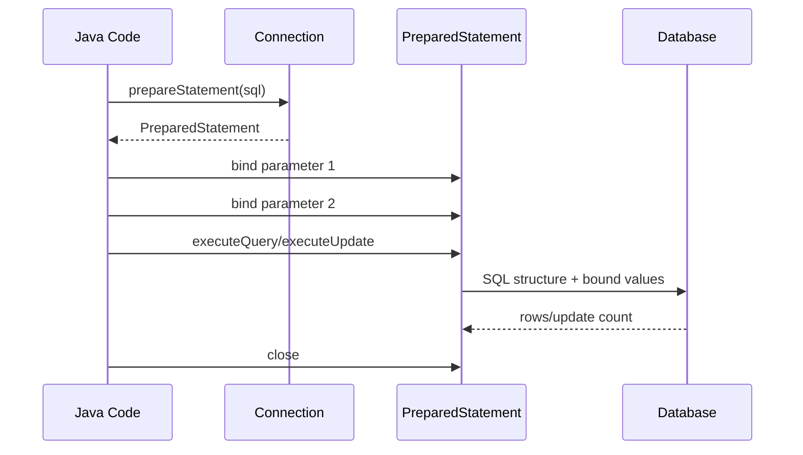

# Part 010 — PreparedStatement and Parameter Binding

> `PreparedStatement` bukan sekadar cara menghindari SQL injection.
>
> Ia adalah boundary antara **SQL structure** dan **runtime value**.
>
> Kalau boundary ini bersih, query lebih aman, lebih mudah direview, lebih mudah diuji, dan lebih stabil. Kalau boundary ini kotor, data access layer menjadi sumber security bug, production incident, dan query behavior yang sulit dijelaskan.

Part ini membahas `PreparedStatement` sebagai primitive production-grade.

---

## 1. Core Thesis

SQL punya dua bagian yang harus dipisah:

```txt
SQL structure:
  select ... from ... where status = ? order by created_at desc

Runtime value:
  status = 'OPEN'
```

`PreparedStatement` menjaga pemisahan ini.

```java
String sql = """
    select id, case_number, status
    from case_file
    where status = ?
    order by created_at desc
    limit ?
    """;

try (PreparedStatement ps = connection.prepareStatement(sql)) {
    ps.setString(1, "OPEN");
    ps.setInt(2, 50);

    try (ResultSet rs = ps.executeQuery()) {
        ...
    }
}
```

Yang boleh menjadi parameter binding:

- string value;
- number value;
- timestamp value;
- UUID/object value;
- boolean;
- date/time;
- binary;
- enum representation;
- JSON value jika driver mendukung via object/string/vendor type.

Yang tidak bisa dijadikan parameter binding secara normal:

- table name;
- column name;
- sort direction;
- SQL keyword;
- operator;
- arbitrary SQL fragment.

Karena itu dynamic identifier harus menggunakan whitelist, bukan bind parameter.

---

## 2. Why String Concatenation Is Broken

Contoh buruk:

```java
String sql = "select * from case_file where case_number = '" + caseNumber + "'";
```

Jika `caseNumber` bernilai:

```txt
ABC' or '1' = '1
```

SQL menjadi:

```sql
select * from case_file where case_number = 'ABC' or '1' = '1'
```

Ini bukan lagi query berdasarkan case number. Ini query yang bisa mengembalikan semua row.

Tetapi bahkan tanpa attacker, concatenation tetap buruk:

- quote escaping rawan salah;
- date/time formatting rawan salah;
- decimal formatting bisa locale-dependent;
- boolean representation beda antar database;
- query plan sulit stabil;
- logging value sensitif bercampur dengan SQL;
- review query sulit;
- dynamic SQL menjadi tidak terkendali.

Prepared statement bukan hanya security tool. Ia adalah **type-safe-ish boundary** antara SQL dan value.

---

## 3. PreparedStatement Lifecycle

Lifecycle:



Code:

```java
try (
    Connection connection = dataSource.getConnection();
    PreparedStatement ps = connection.prepareStatement(SQL)
) {
    bind(ps, request);

    try (ResultSet rs = ps.executeQuery()) {
        return map(rs);
    }
}
```

Rule:

```txt
Prepare.
Bind.
Execute.
Read result/update count.
Close.
```

---

## 4. Placeholder Semantics

JDBC placeholder memakai `?`.

```sql
where status = ?
  and created_at >= ?
  and created_at < ?
```

Parameter index dimulai dari 1, bukan 0.

```java
ps.setString(1, status);
ps.setObject(2, from);
ps.setObject(3, to);
```

Kesalahan umum:

```java
ps.setString(0, status); // salah
```

Urutan parameter mengikuti urutan `?` di SQL.

Untuk query panjang, parameter index mudah salah. Ada beberapa strategi:

1. Keep SQL sederhana.
2. Gunakan helper binder.
3. Gunakan named parameter abstraction.
4. Gunakan query builder/jOOQ/MyBatis jika dynamic query kompleks.
5. Tulis test integration untuk query penting.

---

## 5. Parameter Binding Is Not Text Replacement

Prepared statement tidak mengganti `?` menjadi string mentah dalam SQL seperti template engine. Driver/database memperlakukan parameter sebagai value.

Konseptual:

```txt
SQL:
  select * from case_file where case_number = ?

Value:
  ABC' or '1'='1

Database sees:
  case_number equals exact string "ABC' or '1'='1"
```

Bukan:

```sql
where case_number = 'ABC' or '1'='1'
```

Ini alasan utama prepared statement mencegah injection pada value.

---

## 6. Binding String

```java
ps.setString(1, caseNumber);
```

Untuk nullable string:

```java
if (description == null) {
    ps.setNull(1, Types.VARCHAR);
} else {
    ps.setString(1, description);
}
```

Atau:

```java
ps.setObject(1, description, Types.VARCHAR);
```

Gunakan explicit type untuk null agar driver tidak menebak secara salah.

---

## 7. Binding Numbers

```java
ps.setInt(1, pageSize);
ps.setLong(2, version);
ps.setBigDecimal(3, amount);
```

Untuk money/decimal, gunakan `BigDecimal`, bukan `double`.

Buruk:

```java
ps.setDouble(1, 100.10);
```

Lebih aman:

```java
ps.setBigDecimal(1, new BigDecimal("100.10"));
```

Checklist numeric:

- precision database cukup?
- scale database sesuai?
- Java type tidak kehilangan presisi?
- nullable numeric tidak dibaca ke primitive tanpa `wasNull`?
- comparison decimal tidak terkena rounding tidak sadar?

---

## 8. Binding Boolean

```java
ps.setBoolean(1, true);
```

Tetapi database representation bisa berbeda jika kolom bukan boolean native. Jika kolom menyimpan `Y/N`, gunakan mapping eksplisit:

```java
ps.setString(1, active ? "Y" : "N");
```

Jangan biarkan convention tersebar:

```java
public final class BooleanDbMapper {
    public static String toYn(boolean value) {
        return value ? "Y" : "N";
    }

    public static boolean fromYn(String value) {
        return switch (value) {
            case "Y" -> true;
            case "N" -> false;
            default -> throw new IllegalArgumentException("Invalid Y/N: " + value);
        };
    }
}
```

---

## 9. Binding UUID

Banyak driver modern mendukung:

```java
ps.setObject(1, uuid);
```

Untuk database yang menyimpan UUID sebagai string:

```java
ps.setString(1, uuid.toString());
```

Pilih satu representation dan konsisten:

| DB Type | Java Binding |
|---|---|
| native UUID | `setObject(uuid)` |
| `char(36)` / `varchar` | `setString(uuid.toString())` |
| binary UUID | custom byte mapping |

Jangan campur representation antar tabel tanpa alasan kuat.

---

## 10. Binding Date and Time

Java modern sebaiknya memakai `java.time`.

Contoh:

```java
ps.setObject(1, OffsetDateTime.now());
ps.setObject(2, LocalDate.now());
ps.setObject(3, Instant.now());
```

Namun support detail bisa bergantung driver/database. Untuk production, test mapping timestamp dengan database nyata.

Pertanyaan penting:

- apakah database menyimpan timezone?
- apakah application memakai UTC?
- apakah column type `timestamp` atau `timestamp with time zone`?
- apakah precision micro/nano dipotong?
- apakah comparison range inclusive/exclusive?
- apakah date-only memakai `LocalDate`, bukan midnight timestamp?

Range waktu yang sehat:

```sql
where created_at >= ?
  and created_at < ?
```

Daripada:

```sql
where date(created_at) = ?
```

Yang kedua sering merusak index karena function pada column.

---

## 11. Binding Enum

Jangan bind ordinal enum kecuali kamu benar-benar punya alasan dan migration discipline kuat.

Buruk:

```java
ps.setInt(1, status.ordinal());
```

Jika enum berubah urutan, data berubah makna.

Lebih aman:

```java
ps.setString(1, status.name());
```

Lebih robust lagi: beri database code eksplisit.

```java
public enum CaseStatus {
    DRAFT("DRAFT"),
    OPEN("OPEN"),
    UNDER_REVIEW("UNDER_REVIEW"),
    APPROVED("APPROVED"),
    CLOSED("CLOSED");

    private final String dbCode;

    CaseStatus(String dbCode) {
        this.dbCode = dbCode;
    }

    public String dbCode() {
        return dbCode;
    }

    public static CaseStatus fromDbCode(String code) {
        for (CaseStatus status : values()) {
            if (status.dbCode.equals(code)) {
                return status;
            }
        }
        throw new IllegalArgumentException("Unknown case status: " + code);
    }
}
```

Binding:

```java
ps.setString(1, status.dbCode());
```

Reading:

```java
CaseStatus status = CaseStatus.fromDbCode(rs.getString("status"));
```

---

## 12. Binding JSON

Jika database mendukung JSON/JSONB, binding bisa bervariasi.

Portable-ish approach:

```java
ps.setString(1, jsonString);
```

Vendor-specific approach bisa memakai object khusus driver.

Untuk PostgreSQL, banyak codebase memakai `PGobject`:

```java
PGobject json = new PGobject();
json.setType("jsonb");
json.setValue(payloadJson);

ps.setObject(1, json);
```

Trade-off:

- string lebih sederhana tetapi bisa butuh cast SQL;
- vendor object lebih tepat tetapi mengikat ke driver;
- JSON schema/versioning tetap harus didesain;
- jangan simpan "apa saja" tanpa contract.

SQL cast example:

```sql
insert into outbox_event (id, event_type, payload)
values (?, ?, ?::jsonb)
```

---

## 13. Binding Binary

```java
ps.setBytes(1, bytes);
```

Untuk file besar, biasanya jangan simpan langsung sebagai BLOB di OLTP table tanpa alasan kuat. Pertimbangkan object storage + metadata row.

Jika BLOB memang diperlukan:

- gunakan stream API;
- batasi ukuran;
- transaction duration;
- backup/replication impact;
- encryption/retention;
- read path streaming.

---

## 14. Binding NULL Correctly

SQL null bukan string `"null"`.

Buruk:

```java
ps.setString(1, value == null ? "null" : value);
```

Lebih sehat:

```java
if (value == null) {
    ps.setNull(1, Types.VARCHAR);
} else {
    ps.setString(1, value);
}
```

Untuk generic binder:

```java
static void setNullableString(PreparedStatement ps, int index, String value)
        throws SQLException {
    if (value == null) {
        ps.setNull(index, Types.VARCHAR);
    } else {
        ps.setString(index, value);
    }
}
```

SQL null comparison juga berbeda.

Buruk:

```sql
where deleted_at = ?
```

Jika parameter null, `deleted_at = null` tidak benar. Harus:

```sql
where deleted_at is null
```

Karena itu dynamic SQL harus aware terhadap null semantics.

---

## 15. IN Clause With Variable Parameters

Kamu tidak bisa bind satu `?` untuk list secara portable:

```sql
where id in (?) -- not generally "list of values"
```

Opsi 1: Generate placeholder sesuai ukuran list.

```java
List<UUID> ids = request.ids();

String placeholders = ids.stream()
        .map(ignored -> "?")
        .collect(Collectors.joining(", "));

String sql = """
    select id, case_number, status
    from case_file
    where id in (%s)
    """.formatted(placeholders);

try (PreparedStatement ps = connection.prepareStatement(sql)) {
    int index = 1;
    for (UUID id : ids) {
        ps.setObject(index++, id);
    }
}
```

Perhatikan:

- jika list kosong, jangan generate `in ()`;
- batasi ukuran list;
- untuk list besar, gunakan temp table, array binding, join ke staging table, atau batch query;
- terlalu banyak placeholder bisa menekan parser/plan cache/database limit.

Empty list:

```java
if (ids.isEmpty()) {
    return List.of();
}
```

Opsi 2: database-specific array binding.

PostgreSQL example concept:

```sql
where id = any (?::uuid[])
```

Ini lebih vendor-specific dan perlu driver support.

---

## 16. Dynamic WHERE Pattern

Filter optional harus tetap aman.

```java
public final class SqlBuilder {
    private final StringBuilder sql = new StringBuilder();
    private final List<ParameterBinder> binders = new ArrayList<>();

    public SqlBuilder append(String fragment) {
        sql.append(fragment);
        return this;
    }

    public SqlBuilder and(String condition, ParameterBinder binder) {
        sql.append(" and ").append(condition);
        binders.add(binder);
        return this;
    }

    public PreparedStatement prepare(Connection connection) throws SQLException {
        PreparedStatement ps = connection.prepareStatement(sql.toString());
        int index = 1;
        for (ParameterBinder binder : binders) {
            index = binder.bind(ps, index);
        }
        return ps;
    }
}

@FunctionalInterface
interface ParameterBinder {
    int bind(PreparedStatement ps, int index) throws SQLException;
}
```

Usage:

```java
SqlBuilder builder = new SqlBuilder()
        .append("""
            select id, case_number, status, created_at
            from case_file
            where tenant_id = ?
            """);

builder.and("status = ?", (ps, i) -> {
    ps.setString(i, filter.status().dbCode());
    return i + 1;
});

if (filter.openedFrom().isPresent()) {
    builder.and("created_at >= ?", (ps, i) -> {
        ps.setObject(i, filter.openedFrom().get());
        return i + 1;
    });
}

builder.append(" order by created_at desc, id desc limit ?");

builder.and("1 = 1", (ps, i) -> {
    ps.setInt(i, pageSize);
    return i + 1;
});
```

Contoh di atas menunjukkan ide, tetapi API-nya bisa diperbaiki. Untuk dynamic query serius, jOOQ/MyBatis/Criteria sering lebih tepat.

---

## 17. Dynamic ORDER BY Must Be Whitelisted

Parameter binding tidak bisa mengganti column name:

```sql
order by ? -- salah untuk identifier
```

Jika kamu bind `"created_at"`, database memperlakukannya sebagai value string, bukan nama kolom.

Gunakan whitelist:

```java
enum CaseSortField {
    CREATED_AT("created_at"),
    CASE_NUMBER("case_number"),
    RISK_LEVEL("risk_level");

    private final String column;

    CaseSortField(String column) {
        this.column = column;
    }

    public String column() {
        return column;
    }
}

enum SortDirection {
    ASC, DESC
}
```

Build SQL:

```java
String orderBy = sort.field().column();
String direction = sort.direction() == SortDirection.ASC ? "asc" : "desc";

String sql = """
    select id, case_number, status, created_at
    from case_file
    where tenant_id = ?
    order by %s %s, id %s
    limit ?
    """.formatted(orderBy, direction, direction);
```

Karena `orderBy` dan `direction` berasal dari enum internal, bukan user input mentah, ini aman secara struktur.

---

## 18. Dynamic Table Name Is Usually a Smell

Jika request user menentukan table name, hampir selalu desainnya bermasalah.

Buruk:

```java
String sql = "select * from " + request.tableName();
```

Risiko:

- SQL injection;
- bypass authorization;
- schema coupling;
- query review mustahil;
- data leak lintas domain/tenant.

Jika memang membangun admin/internal SQL tool, desain security-nya berbeda dan harus sangat terbatas.

Untuk application feature biasa, table name harus berasal dari code, bukan input.

---

## 19. LIKE Pattern Binding

Untuk `LIKE`, bind pattern sebagai value.

```java
String sql = """
    select id, case_number
    from case_file
    where lower(case_number) like ?
    """;

ps.setString(1, "%" + search.toLowerCase(Locale.ROOT) + "%");
```

Namun hati-hati:

- leading wildcard `%abc` biasanya tidak memakai index biasa;
- user input `%` dan `_` punya makna wildcard;
- escape jika ingin literal;
- full-text search mungkin lebih tepat untuk search kompleks.

Escaping example:

```java
static String escapeLike(String value) {
    return value
            .replace("\\", "\\\\")
            .replace("%", "\\%")
            .replace("_", "\\_");
}
```

SQL:

```sql
where lower(case_number) like ? escape '\'
```

Binding:

```java
ps.setString(1, "%" + escapeLike(search.toLowerCase(Locale.ROOT)) + "%");
```

---

## 20. LIMIT and OFFSET Binding

Biasanya bisa bind limit/offset:

```sql
limit ? offset ?
```

```java
ps.setInt(1, pageSize);
ps.setInt(2, offset);
```

Tetapi tetap validasi di application:

```java
int pageSize = Math.clamp(request.pageSize(), 1, 200);
int page = Math.max(request.page(), 0);
int offset = page * pageSize;
```

Jangan biarkan user meminta `limit 1000000`.

---

## 21. Cursor/Keyset Pagination Binding

```sql
select id, case_number, created_at
from case_file
where tenant_id = ?
  and status = ?
  and (
      created_at < ?
      or (created_at = ? and id < ?)
  )
order by created_at desc, id desc
limit ?
```

Binding:

```java
int i = 1;
ps.setObject(i++, tenantId);
ps.setString(i++, status.dbCode());
ps.setObject(i++, cursor.createdAt());
ps.setObject(i++, cursor.createdAt());
ps.setObject(i++, cursor.id());
ps.setInt(i++, pageSize);
```

Keyset pagination membutuhkan order deterministic. Biasanya gunakan `(created_at, id)` sebagai compound cursor.

---

## 22. Execute Query vs Execute Update vs Execute

Gunakan method yang tepat:

| Method | Untuk |
|---|---|
| `executeQuery()` | SQL yang menghasilkan `ResultSet`, biasanya `SELECT` |
| `executeUpdate()` | `INSERT`, `UPDATE`, `DELETE`, DDL tertentu, return update count |
| `execute()` | generic, bisa result set atau update count |

Contoh:

```java
try (ResultSet rs = ps.executeQuery()) {
    ...
}
```

```java
int updated = ps.executeUpdate();
```

`execute()` biasanya untuk tool/generic SQL executor, bukan DAO biasa.

---

## 23. Generated Keys With PreparedStatement

```java
String sql = """
    insert into case_file (case_number, status, created_at)
    values (?, ?, ?)
    """;

try (PreparedStatement ps = connection.prepareStatement(
        sql,
        Statement.RETURN_GENERATED_KEYS
)) {
    ps.setString(1, caseNumber);
    ps.setString(2, "OPEN");
    ps.setObject(3, now);

    int count = ps.executeUpdate();
    if (count != 1) {
        throw new IllegalStateException("Expected one inserted row");
    }

    try (ResultSet keys = ps.getGeneratedKeys()) {
        if (!keys.next()) {
            throw new IllegalStateException("No generated key returned");
        }

        long id = keys.getLong(1);
    }
}
```

Alternative explicit returning:

```sql
insert into case_file (id, case_number, status, created_at)
values (?, ?, ?, ?)
returning id, case_number, status, created_at
```

Dengan `RETURNING`, gunakan `executeQuery()`.

Trade-off:

- `RETURN_GENERATED_KEYS` lebih JDBC-style;
- `RETURNING` lebih SQL/database-specific tetapi eksplisit;
- UUID app-generated mengurangi kebutuhan generated keys;
- sequence/identity behavior perlu dipahami.

---

## 24. Reusing PreparedStatement

Dalam satu method, kamu bisa reuse prepared statement untuk banyak parameter.

```java
try (PreparedStatement ps = connection.prepareStatement(sql)) {
    for (UUID id : ids) {
        ps.setObject(1, id);

        try (ResultSet rs = ps.executeQuery()) {
            ...
        }
    }
}
```

Tetapi untuk banyak operasi sejenis, batch sering lebih tepat.

Jangan reuse `PreparedStatement` across threads. Treat statement as method-scoped resource.

---

## 25. clearParameters

Jika reuse statement dengan parameter optional, gunakan hati-hati.

```java
ps.clearParameters();
```

Tetapi biasanya lebih baik membuat binding path jelas daripada rely pada clear manual. Statement reuse yang terlalu pintar sering menjadi bug source.

---

## 26. Batch Execution

Batch insert/update:

```java
String sql = """
    insert into case_audit_log (
        id, case_id, action, actor_id, created_at
    )
    values (?, ?, ?, ?, ?)
    """;

try (PreparedStatement ps = connection.prepareStatement(sql)) {
    for (AuditRow row : rows) {
        ps.setObject(1, row.id());
        ps.setObject(2, row.caseId());
        ps.setString(3, row.action());
        ps.setObject(4, row.actorId());
        ps.setObject(5, row.createdAt());
        ps.addBatch();
    }

    int[] counts = ps.executeBatch();
}
```

Interpret update counts:

- count >= 0: affected rows;
- `Statement.SUCCESS_NO_INFO`: success but count unknown;
- `Statement.EXECUTE_FAILED`: failed, usually in `BatchUpdateException`.

Error handling:

```java
try {
    ps.executeBatch();
} catch (BatchUpdateException e) {
    int[] counts = e.getUpdateCounts();
    // inspect partial success according to driver behavior
    throw e;
}
```

Batch production considerations:

- chunk size;
- transaction size;
- partial failure;
- idempotency;
- duplicate key handling;
- memory pressure;
- driver rewrite behavior;
- generated keys with batch;
- ordering guarantees.

Part 015 akan membahas batch lebih dalam.

---

## 27. Batch Is Not Always Better

Batch mengurangi round-trip, tetapi bukan selalu jawaban.

Batch buruk jika:

- setiap row butuh rule berbeda;
- error per row harus detail;
- transaksi menjadi terlalu besar;
- lock terlalu lama;
- statement terlalu kompleks;
- database sudah saturated;
- idempotency belum siap.

Batch sehat:

```txt
Chunked.
Bounded.
Retry-safe.
Observable.
Transaction size controlled.
```

---

## 28. Server-Side Prepare vs Driver-Side Prepare

Istilah "prepared statement" bisa berarti beberapa hal tergantung driver/database:

1. Driver melakukan escaping/binding dan mengirim query.
2. Database membuat prepared statement server-side.
3. Driver menunda server-side prepare sampai statement dieksekusi beberapa kali.
4. Driver memakai client-side emulation.

Sebagai application engineer, prinsipnya:

- gunakan `PreparedStatement` untuk value binding aman;
- jangan mengasumsikan server-side plan reuse tanpa membaca driver behavior;
- ukur performance critical path;
- jangan optimasi statement cache sebelum ada kebutuhan;
- pahami database-specific plan behavior untuk query besar.

Prepared statement secara API penting untuk security dan typing. Server-side prepare adalah detail performance yang perlu diverifikasi.

---

## 29. Query Plan Stability

Prepared statement bisa membantu plan reuse, tetapi juga bisa memunculkan trade-off generic plan vs custom plan pada database tertentu.

Contoh:

```sql
select *
from case_file
where status = ?
```

Jika `status='OPEN'` mengembalikan 90% row tetapi `status='ESCALATED'` mengembalikan 0.1% row, plan optimal bisa berbeda.

Prepared statement bukan pengganti index dan query design.

Checklist:

- apakah predicate selective?
- apakah statistik database akurat?
- apakah parameter distribution skewed?
- apakah generic plan buruk?
- apakah partial index membantu?
- apakah query harus dipecah berdasarkan case tertentu?

---

## 30. Parameter Sniffing / Skew Awareness

Beberapa database punya behavior plan yang dipengaruhi parameter pertama atau cached plan. Ini bisa membuat query cepat untuk satu parameter tetapi lambat untuk parameter lain.

Contoh domain:

```txt
unit_id = central office -> 5 million cases
unit_id = small branch -> 2,000 cases
```

Query yang sama bisa butuh plan berbeda.

Mitigasi bergantung database:

- index yang tepat;
- query rewrite;
- partial index;
- statistics;
- plan hints jika benar-benar perlu;
- separate query path untuk extreme case;
- materialized/read model;
- avoid one generic query for all workload if distribution sangat skewed.

---

## 31. Query Naming and Comments

Untuk observability, tambahkan query comment pada critical query.

```sql
/* query=CaseDashboard.search */
select id, case_number, status
from case_file
where tenant_id = ?
order by updated_at desc, id desc
limit ?
```

Manfaat:

- slow query log bisa dikaitkan ke code;
- tracing lebih jelas;
- database monitoring lebih mudah;
- review production incident lebih cepat.

Jangan masukkan data sensitive di comment.

Baik:

```sql
/* query=CaseApprovalHistory.findByCaseId */
```

Buruk:

```sql
/* user=john@example.com case=ABC-123 reason=... */
```

---

## 32. Safe Logging of SQL and Parameters

Log SQL structure boleh, tetapi hati-hati dengan bind value.

Risiko bind value:

- PII;
- secrets;
- regulatory sensitive data;
- legal evidence leakage;
- log retention lebih longgar daripada data retention;
- access log lebih luas daripada database.

Pattern:

```txt
Log query name, duration, row count, error class, correlation ID.
Avoid raw parameter values unless explicitly safe and redacted.
```

Example log:

```json
{
  "event": "data_access.query",
  "query": "CaseDashboard.search",
  "durationMs": 84,
  "rows": 50,
  "tenant": "redacted-or-id",
  "correlationId": "..."
}
```

---

## 33. Error Handling With PreparedStatement

Duplicate key:

```java
try {
    ps.executeUpdate();
} catch (SQLException e) {
    if (isUniqueViolation(e)) {
        throw new DuplicateCommand(commandId, e);
    }
    throw e;
}
```

Deadlock/serialization:

```java
catch (SQLException e) {
    if (isRetryableTransactionFailure(e)) {
        throw new RetryableTransactionFailure(e);
    }
    throw e;
}
```

Do not:

```java
catch (SQLException e) {
    return false;
}
```

Unless the method contract explicitly says false means specific database condition.

---

## 34. SQLState Classification

SQLState is standardized-ish. Common categories:

| SQLState Class | Meaning |
|---|---|
| `23` | integrity constraint violation |
| `40` | transaction rollback |
| `42` | syntax error or access rule violation |
| `08` | connection exception |

But exact codes vary and vendor codes matter.

Example concept:

```java
static boolean isIntegrityConstraintViolation(SQLException e) {
    return e.getSQLState() != null && e.getSQLState().startsWith("23");
}

static boolean isTransactionRollback(SQLException e) {
    return e.getSQLState() != null && e.getSQLState().startsWith("40");
}
```

For production, define database-specific mappings for important errors.

---

## 35. PreparedStatement and Transactions

Prepared statement participates in the transaction of its connection.

```java
connection.setAutoCommit(false);

try (
    PreparedStatement updateCase = connection.prepareStatement(UPDATE_CASE);
    PreparedStatement insertAudit = connection.prepareStatement(INSERT_AUDIT)
) {
    // bind + execute update case
    // bind + execute insert audit

    connection.commit();
} catch (Exception ex) {
    connection.rollback();
    throw ex;
}
```

If each DAO method independently gets a new connection with auto-commit, operations are not atomic.

Bad:

```java
caseDao.updateStatus(id, APPROVED); // connection A, commit
auditDao.insert(...);               // connection B, commit
```

Good manual JDBC:

```java
try (Connection connection = dataSource.getConnection()) {
    connection.setAutoCommit(false);

    caseDao.updateStatus(connection, id, APPROVED);
    auditDao.insert(connection, audit);

    connection.commit();
}
```

Good framework-managed:

```java
@Transactional
public void approve(...) {
    caseRepository.updateStatus(...);
    auditRepository.insert(...);
}
```

---

## 36. PreparedStatement and Idempotency

Idempotent insert with unique command ID:

```sql
insert into command_dedup (
    command_id,
    command_type,
    aggregate_id,
    created_at
)
values (?, ?, ?, ?);
```

If duplicate key occurs, load previous result.

Java concept:

```java
try {
    insertCommandDedup(command);
    executeCommand(command);
    storeCommandResult(command);
} catch (DuplicateCommandException duplicate) {
    return loadPreviousResult(command.commandId());
}
```

The prepared statement part is simple. The architecture is not. Parameter binding prevents injection; unique constraint and transaction design provide idempotency.

---

## 37. PreparedStatement and Optimistic Update

```sql
update case_file
set status = ?,
    version = version + 1,
    updated_at = ?
where id = ?
  and version = ?;
```

Binding:

```java
int i = 1;
ps.setString(i++, newStatus.dbCode());
ps.setObject(i++, now);
ps.setObject(i++, caseId);
ps.setLong(i++, expectedVersion);

int updated = ps.executeUpdate();

if (updated == 0) {
    throw new OptimisticConflict(caseId, expectedVersion);
}
```

This is one of the most important patterns in JDBC data access.

---

## 38. PreparedStatement and Conditional Insert

Some database-specific examples exist:

PostgreSQL-style:

```sql
insert into command_dedup (command_id, created_at)
values (?, ?)
on conflict (command_id) do nothing;
```

Then:

```java
int inserted = ps.executeUpdate();

if (inserted == 0) {
    // duplicate command
}
```

Generic SQL might require catching duplicate key instead.

Trade-off:

- `on conflict`/`merge` can simplify idempotency;
- vendor-specific syntax reduces portability;
- explicit duplicate exception works broadly but can be noisier;
- choose consciously.

---

## 39. PreparedStatement and Upsert

Upsert is not one universal thing.

Vendor examples:

- PostgreSQL: `insert ... on conflict ... do update`
- MySQL: `insert ... on duplicate key update`
- SQL Server/Oracle: `merge`, with caveats
- H2: compatibility varies by mode

Questions before upsert:

- Is update always safe?
- What if existing row belongs to different semantic command?
- Should created_at remain original?
- Should version increment?
- Should audit be appended?
- Is this idempotency or true mutation?
- What happens under concurrency?

Upsert is useful, but can hide business conflict if overused.

---

## 40. Security Boundary: Value vs Structure

Most prepared statement guidance fails because people remember only "use `?`".

Correct mental model:

```txt
User-controlled values can be bound.
User-controlled SQL structure must not exist.
```

Examples:

| User Input | Safe Treatment |
|---|---|
| case number | bind value |
| status filter | validate enum + bind value |
| date range | parse/validate + bind value |
| page size | clamp + bind value |
| sort field | whitelist to internal column |
| sort direction | enum whitelist |
| table name | usually forbidden |
| arbitrary where clause | forbidden |
| raw SQL | only privileged internal tool with separate security model |

---

## 41. PreparedStatement Helper Pattern

To reduce index bugs:

```java
public final class ParameterCursor {
    private int index = 1;

    public int next() {
        return index++;
    }
}
```

Usage:

```java
ParameterCursor p = new ParameterCursor();

ps.setObject(p.next(), tenantId);
ps.setString(p.next(), status.dbCode());
ps.setObject(p.next(), from);
ps.setObject(p.next(), to);
ps.setInt(p.next(), limit);
```

Slightly better with binder methods:

```java
public final class JdbcParams {
    private int index = 1;
    private final PreparedStatement ps;

    public JdbcParams(PreparedStatement ps) {
        this.ps = ps;
    }

    public void uuid(UUID value) throws SQLException {
        ps.setObject(index++, value);
    }

    public void string(String value) throws SQLException {
        ps.setString(index++, value);
    }

    public void integer(int value) throws SQLException {
        ps.setInt(index++, value);
    }

    public void instant(Instant value) throws SQLException {
        ps.setObject(index++, value);
    }
}
```

Usage:

```java
JdbcParams params = new JdbcParams(ps);
params.uuid(tenantId);
params.string(status.dbCode());
params.instant(from);
params.instant(to);
params.integer(limit);
```

This is not mandatory, but for long SQL it reduces off-by-one mistakes.

---

## 42. Named Parameter Emulation

JDBC does not support named parameters directly. You can implement or use a framework.

Concept:

```sql
select id, case_number
from case_file
where tenant_id = :tenantId
  and status = :status
```

Framework converts to:

```sql
select id, case_number
from case_file
where tenant_id = ?
  and status = ?
```

And binds in order.

Named parameter helps readability, but it is still positional binding underneath.

---

## 43. PreparedStatement in Query Service

Example query service:

```java
public final class JdbcCaseDashboardQuery implements CaseDashboardQuery {
    private final DataSource dataSource;

    @Override
    public Page<CaseDashboardRow> search(
            CaseDashboardFilter filter,
            PageRequest page
    ) throws SQLException {
        String sql = """
            /* query=CaseDashboard.search */
            select
                c.id,
                c.case_number,
                c.status,
                c.risk_level,
                c.updated_at
            from case_file c
            where c.tenant_id = ?
              and (? is null or c.status = ?)
            order by c.updated_at desc, c.id desc
            limit ?
            offset ?
            """;

        try (
            Connection connection = dataSource.getConnection();
            PreparedStatement ps = connection.prepareStatement(sql)
        ) {
            int i = 1;
            ps.setObject(i++, filter.tenantId());

            if (filter.status().isPresent()) {
                String status = filter.status().get().dbCode();
                ps.setString(i++, status);
                ps.setString(i++, status);
            } else {
                ps.setNull(i++, Types.VARCHAR);
                ps.setNull(i++, Types.VARCHAR);
            }

            ps.setInt(i++, page.size());
            ps.setInt(i++, page.offset());

            List<CaseDashboardRow> rows = new ArrayList<>();

            try (ResultSet rs = ps.executeQuery()) {
                while (rs.next()) {
                    rows.add(mapRow(rs));
                }
            }

            return new Page<>(rows, page);
        }
    }
}
```

Note: pattern `(? is null or c.status = ?)` is convenient, but can harm index usage in some databases. For performance-critical query, dynamic SQL that includes predicate only when present can be better.

---

## 44. Static Optional Predicate vs Dynamic SQL

Convenient static SQL:

```sql
where (? is null or status = ?)
```

Pros:

- one SQL string;
- simpler code;
- fewer dynamic fragments.

Cons:

- optimizer may not use index optimally;
- generic plan can be poor;
- predicate selectivity hidden;
- repeated parameter binding.

Dynamic SQL:

```sql
where 1 = 1
-- append "and status = ?" only if present
```

Pros:

- cleaner predicate;
- better plan possibility;
- query shape matches actual filter.

Cons:

- code more complex;
- more SQL variants;
- binding index management.

Rule:

```txt
For low-volume admin query, static optional predicate may be fine.
For critical/high-volume query, prefer query shape that matches actual filter.
```

---

## 45. PreparedStatement in Command Handler

```java
public void approveCase(Connection connection, ApproveCaseCommand command)
        throws SQLException {
    String sql = """
        /* query=CaseFile.approve */
        update case_file
        set status = ?,
            version = version + 1,
            approved_by = ?,
            approved_at = ?,
            updated_at = ?
        where id = ?
          and status = ?
          and version = ?
        """;

    try (PreparedStatement ps = connection.prepareStatement(sql)) {
        OffsetDateTime now = command.now();

        int i = 1;
        ps.setString(i++, "APPROVED");
        ps.setObject(i++, command.actorId());
        ps.setObject(i++, now);
        ps.setObject(i++, now);
        ps.setObject(i++, command.caseId());
        ps.setString(i++, "UNDER_REVIEW");
        ps.setLong(i++, command.expectedVersion());

        int updated = ps.executeUpdate();

        if (updated == 0) {
            throw new CaseApprovalConflict(command.caseId());
        }

        if (updated > 1) {
            throw new IllegalStateException("Case approval updated " + updated + " rows");
        }
    }
}
```

This code encodes state transition guard in SQL predicate. It does not replace domain validation, but it protects against concurrent change.

---

## 46. PreparedStatement in Audit Insert

```java
public void insertAudit(Connection connection, CaseAuditRecord audit)
        throws SQLException {
    String sql = """
        /* query=CaseAudit.insert */
        insert into case_audit_log (
            id,
            command_id,
            case_id,
            actor_id,
            action,
            reason,
            previous_status,
            new_status,
            created_at
        )
        values (?, ?, ?, ?, ?, ?, ?, ?, ?)
        """;

    try (PreparedStatement ps = connection.prepareStatement(sql)) {
        int i = 1;
        ps.setObject(i++, audit.id());
        ps.setObject(i++, audit.commandId());
        ps.setObject(i++, audit.caseId());
        ps.setObject(i++, audit.actorId());
        ps.setString(i++, audit.action());
        ps.setString(i++, audit.reason());
        ps.setString(i++, audit.previousStatus().dbCode());
        ps.setString(i++, audit.newStatus().dbCode());
        ps.setObject(i++, audit.createdAt());

        int inserted = ps.executeUpdate();

        if (inserted != 1) {
            throw new IllegalStateException("Expected one audit row, got " + inserted);
        }
    }
}
```

Audit insert should usually be in the same transaction as the state change.

---

## 47. PreparedStatement and Outbox Insert

```java
public void appendOutbox(Connection connection, OutboxEvent event)
        throws SQLException {
    String sql = """
        /* query=Outbox.append */
        insert into outbox_event (
            id,
            aggregate_type,
            aggregate_id,
            event_type,
            event_key,
            payload,
            created_at,
            published_at
        )
        values (?, ?, ?, ?, ?, ?::jsonb, ?, null)
        """;

    try (PreparedStatement ps = connection.prepareStatement(sql)) {
        int i = 1;
        ps.setObject(i++, event.id());
        ps.setString(i++, event.aggregateType());
        ps.setString(i++, event.aggregateId());
        ps.setString(i++, event.eventType());
        ps.setString(i++, event.eventKey());
        ps.setString(i++, event.payloadJson());
        ps.setObject(i++, event.createdAt());

        int inserted = ps.executeUpdate();
        if (inserted != 1) {
            throw new IllegalStateException("Expected one outbox row, got " + inserted);
        }
    }
}
```

Outbox often uses unique semantic key to avoid duplicate event:

```sql
create unique index uq_outbox_event_key
on outbox_event(event_key);
```

---

## 48. Common Binding Bugs

| Bug | Example | Fix |
|---|---|---|
| Parameter index starts at 0 | `setString(0, x)` | Start at 1 |
| Wrong order | bind status where ID expected | use cursor/helper/tests |
| Null with wrong type | `setObject(i, null)` | `setNull(i, Types.X)` |
| Concatenated LIKE | raw user wildcard | escape if literal needed |
| Dynamic sort injection | `order by ` + request | whitelist enum |
| Empty IN list | `in ()` | return empty or special predicate |
| Huge IN list | 50k placeholders | staging table/temp table/array |
| Enum ordinal | `status.ordinal()` | stable db code |
| Date as string | formatted manually | bind `java.time` object |
| Limit unbounded | user page size raw | clamp |
| Ignored update count | no conflict detection | check count |
| Logging raw params | PII leak | redact/log query name |

---

## 49. Anti-Pattern: One Generic Query Method

```java
public List<Map<String, Object>> query(String sql, Object... params)
```

This looks flexible, but can destroy ownership:

- arbitrary SQL spreads everywhere;
- mapping becomes weak;
- no query naming;
- no semantic contract;
- no typed result;
- no review boundary;
- security harder.

A generic executor can exist inside infrastructure, but application code should expose typed query methods:

```java
List<CaseDashboardRow> search(CaseDashboardFilter filter, PageRequest page);
Optional<CaseFileRow> findById(CaseFileId id);
int markExpiredAssignments(Instant now, int limit);
```

---

## 50. Anti-Pattern: SQL Template With User Fragments

```java
String sql = """
    select *
    from case_file
    where %s
    order by %s
    """.formatted(request.whereClause(), request.orderBy());
```

This is effectively giving user a SQL console.

Unless this is a privileged internal analytics tool with separate authorization, sandboxing, and audit, do not do this.

---

## 51. Anti-Pattern: PreparedStatement But Still Injecting Structure

Prepared statement does not save this:

```java
String sql = "select * from case_file order by " + request.sortBy();

try (PreparedStatement ps = connection.prepareStatement(sql)) {
    ...
}
```

Even though you used `PreparedStatement`, SQL structure was already contaminated before prepare.

Correct:

```java
String sortColumn = allowedSortColumn(request.sortBy());

String sql = """
    select *
    from case_file
    order by %s
    """.formatted(sortColumn);
```

Where `allowedSortColumn` only returns internal constants.

---

## 52. Anti-Pattern: Catch SQLException and Continue

```java
try {
    ps.executeUpdate();
} catch (SQLException ignored) {
}
```

This is almost always unacceptable.

At minimum:

- log structured event;
- map to semantic error;
- rollback transaction if needed;
- include SQLState/vendor code;
- preserve exception as cause;
- avoid swallowing data corruption signal.

---

## 53. Anti-Pattern: Query by Concatenating Dates

```java
String sql = "where created_at >= '" + from + "'";
```

Problems:

- format mismatch;
- timezone ambiguity;
- SQL injection if string input;
- index/cast issue;
- driver type conversion bypassed.

Correct:

```java
where created_at >= ?
```

```java
ps.setObject(1, from);
```

---

## 54. Anti-Pattern: Business Logic Hidden in Dynamic SQL Fragments

```java
if (user.isSupervisor()) {
    sql.append(" and 1=1");
} else {
    sql.append(" and assigned_officer_id = ?");
}
```

This may be okay if intentionally a query policy, but can become hidden authorization logic.

Better:

- authorization decision explicit in application layer;
- data filter policy named;
- query method states access model.

Example:

```java
CaseVisibilityScope scope = caseAccessPolicy.visibilityScope(actor);

caseDashboardQuery.search(filter, scope, page);
```

Then query binds scope.

---

## 55. PreparedStatement and Least Privilege

Even with prepared statements, database user should have least privilege.

Examples:

| App Component | DB Permission |
|---|---|
| API application | select/insert/update only needed tables |
| read-only reporting | select only read model/reporting tables |
| migration tool | DDL privileges |
| batch repair job | limited update scope if possible |
| analytics | read-only replica or governed views |

Prepared statement prevents value injection. Least privilege limits blast radius if bug/compromise occurs.

---

## 56. PreparedStatement and Tenant Safety

Every tenant-scoped query should bind tenant from trusted context.

```java
String sql = """
    select id, case_number, status
    from case_file
    where tenant_id = ?
      and id = ?
    """;

ps.setObject(1, tenantContext.tenantId());
ps.setObject(2, caseId);
```

Do not trust request body for tenant ID unless the system design explicitly supports acting across tenants.

Bad:

```java
ps.setObject(1, request.tenantId());
```

Better:

```java
ps.setObject(1, authenticatedContext.tenantId());
```

For cross-tenant admin, require explicit privileged scope and audit.

---

## 57. PreparedStatement in Testing

Integration test should verify:

- parameters bind correctly;
- null behavior;
- enum mapping;
- date range;
- duplicate key handling;
- optimistic update count;
- dynamic filter combinations;
- pagination order;
- empty IN list;
- large IN list limit;
- special characters in search;
- SQL injection attempt treated as literal value.

Example test idea:

```java
@Test
void findByCaseNumberTreatsInjectionPayloadAsLiteral() {
    insertCase("ABC-001");
    insertCase("XYZ-002");

    Optional<CaseFileRow> result =
            dao.findByCaseNumber("ABC-001' or '1'='1");

    assertThat(result).isEmpty();
}
```

This test proves the query did not concatenate raw input.

---

## 58. Production Checklist

Before shipping prepared statement heavy code:

- [ ] No user-controlled SQL structure.
- [ ] All values are parameter-bound.
- [ ] Dynamic sort uses whitelist.
- [ ] Dynamic IN handles empty list.
- [ ] Large IN has limit or alternate strategy.
- [ ] Nullable parameters use correct SQL type.
- [ ] Numeric precision is safe.
- [ ] Timezone/date mapping tested.
- [ ] Enum uses stable DB code.
- [ ] Update count checked.
- [ ] Query has deterministic order if paginated.
- [ ] Query name/comment exists for critical path.
- [ ] Raw bind values are not logged unsafely.
- [ ] Error taxonomy maps important SQLState/vendor errors.
- [ ] Integration tests use real database.

---

## 59. Mini Lab

Implement `CaseAssignmentDao.assignPrimaryOfficer`.

Requirements:

```txt
Input:
- commandId
- caseId
- officerId
- actorId
- reason
- expectedCaseVersion
- timestamp

Rules:
- case must be OPEN or UNDER_REVIEW
- case must not already have active primary assignment
- write assignment row
- write audit row
- append outbox event
- duplicate commandId returns previous result
- concurrent version conflict returns business conflict
```

Design prepared statements for:

1. insert command dedup;
2. update case version/updated_at with expected version;
3. insert assignment;
4. insert audit;
5. insert outbox;
6. load previous result.

Then answer:

- which statements are in one transaction?
- which unique constraints support idempotency?
- which update counts must be exactly 1?
- which SQLState/vendor errors map to business conflict?
- how do you bind nullable reason?
- how do you avoid duplicate outbox event?

---

## 60. Summary

`PreparedStatement` adalah primitive yang memisahkan SQL structure dari runtime value.

Yang harus kamu kuasai:

- placeholder `?` dan index 1-based;
- value binding untuk string, number, UUID, time, enum, JSON, binary;
- null binding dengan type yang jelas;
- dynamic SQL yang aman;
- whitelist untuk identifier/sort;
- IN clause variable parameter;
- generated keys;
- batch execution;
- update count;
- error taxonomy;
- query naming;
- safe logging;
- idempotent insert;
- optimistic update;
- tenant-safe binding;
- integration testing terhadap database nyata.

Part berikutnya akan membahas **ResultSet Mapping Patterns**: bagaimana mengubah row menjadi DTO/domain object tanpa membuat mapping layer rapuh, tanpa entity leak, tanpa null bug, dan tanpa relationship mapping yang tidak terkendali.

---

## 61. References

- Oracle Java SE `PreparedStatement`: https://docs.oracle.com/en/java/javase/21/docs/api/java.sql/java/sql/PreparedStatement.html
- Oracle Java SE `Statement`: https://docs.oracle.com/en/java/javase/21/docs/api/java.sql/java/sql/Statement.html
- Oracle Java SE `ResultSet`: https://docs.oracle.com/en/java/javase/21/docs/api/java.sql/java/sql/ResultSet.html
- Oracle Java SE `SQLException`: https://docs.oracle.com/en/java/javase/21/docs/api/java.sql/java/sql/SQLException.html
- Oracle Java SE `BatchUpdateException`: https://docs.oracle.com/en/java/javase/21/docs/api/java.sql/java/sql/BatchUpdateException.html
- OWASP SQL Injection Prevention Cheat Sheet: https://cheatsheetseries.owasp.org/cheatsheets/SQL_Injection_Prevention_Cheat_Sheet.html
- PostgreSQL Documentation — Prepared Statements: https://www.postgresql.org/docs/current/sql-prepare.html
- PostgreSQL Documentation — `INSERT ... ON CONFLICT`: https://www.postgresql.org/docs/current/sql-insert.html
