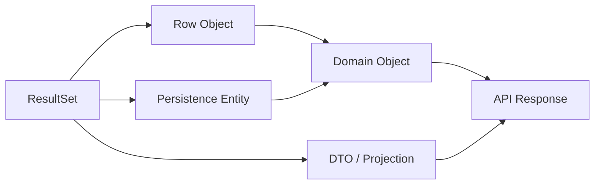

# Part 011 — ResultSet Mapping Patterns

> Query yang benar belum cukup.
>
> Setelah database mengembalikan row, masih ada satu boundary yang sangat rawan: **mapping**.
>
> Banyak bug production bukan berasal dari SQL syntax, tetapi dari mapping yang salah:
>
> - nullable column dibaca sebagai primitive;
> - enum berubah makna;
> - timestamp kehilangan timezone;
> - join menghasilkan duplicate object;
> - one-to-many mapping menggandakan parent;
> - projection bercampur dengan domain aggregate;
> - entity persistence bocor ke API;
> - column alias berubah tetapi mapper tidak gagal dengan jelas.

Part ini membahas bagaimana membaca `ResultSet` secara production-grade.

---

## 1. Core Thesis

`ResultSet` adalah representation database row. Ia bukan domain object, bukan DTO, bukan API response, dan bukan aggregate.

Mapping adalah proses eksplisit:

```txt
ResultSet row
  -> row object / projection / persistence entity
  -> domain object / aggregate
  -> application result
  -> API DTO
```

Tidak semua aplikasi butuh semua tahap. Tetapi setiap aplikasi harus tahu sedang berada di tahap mana.

Kesalahan utama mapping adalah memperlakukan semua object sebagai hal yang sama.



---

## 2. Mapping Is a Boundary, Not Boilerplate

Mapping sering dianggap boilerplate karena terlihat repetitif:

```java
return new CaseFileRow(
        rs.getObject("id", UUID.class),
        rs.getString("case_number"),
        rs.getString("status"),
        rs.getObject("created_at", OffsetDateTime.class)
);
```

Tetapi mapping sebenarnya menjaga kontrak penting:

- tipe database ke tipe Java;
- nullability;
- enum compatibility;
- timestamp/timezone semantics;
- numeric precision;
- identity;
- column alias;
- projection shape;
- domain invariant;
- failure behavior saat data corrupt.

Kalau mapping salah, domain layer menerima state palsu.

---

## 3. ResultSet Cursor Model

`ResultSet` dibaca melalui cursor.

```java
try (ResultSet rs = ps.executeQuery()) {
    while (rs.next()) {
        CaseFileRow row = mapRow(rs);
        rows.add(row);
    }
}
```

`rs.next()`:

- menggerakkan cursor;
- return `true` jika ada row;
- return `false` jika selesai.

Mapper sebaiknya **tidak** memanggil `rs.next()`.

Buruk:

```java
CaseFileRow map(ResultSet rs) throws SQLException {
    rs.next(); // buruk: mapper mengubah cursor
    ...
}
```

Lebih sehat:

```java
CaseFileRow mapCurrentRow(ResultSet rs) throws SQLException {
    return new CaseFileRow(...);
}
```

Contract mapper:

```txt
Mapper receives ResultSet positioned at a valid current row.
Mapper reads columns from that row.
Mapper does not move the cursor.
```

---

## 4. Basic Row Mapper Interface

```java
@FunctionalInterface
public interface RowMapper<T> {
    T mapRow(ResultSet rs) throws SQLException;
}
```

Usage:

```java
public List<CaseFileRow> findOpenCases(int limit) throws SQLException {
    String sql = """
        select id, case_number, status, created_at, updated_at
        from case_file
        where status = ?
        order by updated_at desc, id desc
        limit ?
        """;

    List<CaseFileRow> rows = new ArrayList<>();

    try (
        Connection connection = dataSource.getConnection();
        PreparedStatement ps = connection.prepareStatement(sql)
    ) {
        ps.setString(1, "OPEN");
        ps.setInt(2, limit);

        try (ResultSet rs = ps.executeQuery()) {
            while (rs.next()) {
                rows.add(CaseFileRowMapper.INSTANCE.mapRow(rs));
            }
        }
    }

    return rows;
}
```

Mapper:

```java
public enum CaseFileRowMapper implements RowMapper<CaseFileRow> {
    INSTANCE;

    @Override
    public CaseFileRow mapRow(ResultSet rs) throws SQLException {
        return new CaseFileRow(
                rs.getObject("id", UUID.class),
                rs.getString("case_number"),
                CaseStatus.fromDbCode(rs.getString("status")),
                rs.getObject("created_at", OffsetDateTime.class),
                rs.getObject("updated_at", OffsetDateTime.class)
        );
    }
}
```

---

## 5. Row Object vs DTO vs Domain Object

Jangan samakan semua object.

### Row Object

Row object merepresentasikan shape query/table.

```java
public record CaseFileRow(
        UUID id,
        String caseNumber,
        CaseStatus status,
        OffsetDateTime createdAt,
        OffsetDateTime updatedAt
) {}
```

Cocok untuk:

- DAO;
- persistence adapter;
- batch;
- query service internal;
- mapping intermediate.

### DTO / Projection

DTO/projection merepresentasikan kebutuhan read/API/screen.

```java
public record CaseDashboardRow(
        UUID caseId,
        String caseNumber,
        String statusLabel,
        String assignedOfficerName,
        OffsetDateTime lastUpdatedAt
) {}
```

Cocok untuk:

- dashboard;
- report;
- API read response;
- export row;
- search result.

### Domain Object

Domain object merepresentasikan behavior dan invariant.

```java
public final class CaseFile {
    private final CaseFileId id;
    private CaseStatus status;
    private long version;

    public void approve(UserId actor, String reason) {
        if (!status.canMoveTo(CaseStatus.APPROVED)) {
            throw new InvalidCaseTransition(status, CaseStatus.APPROVED);
        }
        this.status = CaseStatus.APPROVED;
    }
}
```

Cocok untuk:

- command;
- state transition;
- business invariant;
- aggregate behavior.

Aturan:

```txt
Read-specific query should map to projection.
Write-specific load should map to domain/aggregate.
Table-oriented operation may map to row object.
```

---

## 6. Column Alias Discipline

Jangan mengandalkan nama kolom ambigu dari join.

Buruk:

```sql
select c.id, o.id, c.status
from case_file c
join officer o on o.id = c.assigned_officer_id
```

Mapper:

```java
UUID id = rs.getObject("id", UUID.class); // id yang mana?
```

Lebih sehat:

```sql
select
    c.id as case_id,
    c.case_number as case_number,
    c.status as case_status,
    o.id as officer_id,
    o.display_name as officer_display_name
from case_file c
join officer o on o.id = c.assigned_officer_id
```

Mapper:

```java
UUID caseId = rs.getObject("case_id", UUID.class);
UUID officerId = rs.getObject("officer_id", UUID.class);
```

Rule:

```txt
Every joined query should alias columns according to result shape.
```

---

## 7. Mapping by Name vs Mapping by Index

By name:

```java
rs.getString("case_number");
```

Pros:

- readable;
- resilient terhadap urutan select;
- mapper jelas;
- lebih aman untuk query panjang.

By index:

```java
rs.getString(2);
```

Pros:

- bisa sedikit lebih cepat;
- berguna untuk generated/generic mapping tertentu.

Cons:

- rapuh terhadap perubahan urutan kolom;
- sulit direview;
- rawan off-by-one;
- buruk untuk join/projection kompleks.

Untuk production code umum, gunakan column label/name. Optimasi by index hanya setelah profiling dan dengan test ketat.

---

## 8. Nullability Mapping

Nullability adalah area bug besar.

### Problem with primitive getter

```java
int score = rs.getInt("risk_score");
```

Jika `risk_score` SQL `NULL`, Java menerima `0`.

Harus cek:

```java
int rawScore = rs.getInt("risk_score");
Integer score = rs.wasNull() ? null : rawScore;
```

Lebih jelas:

```java
Integer score = rs.getObject("risk_score", Integer.class);
```

### Contract

Jika column nullable:

```java
public record CaseRiskRow(
        UUID caseId,
        Integer riskScore
) {}
```

Jika column not null:

```java
public record CaseRiskRow(
        UUID caseId,
        int riskScore
) {}
```

Tetapi pastikan database punya `NOT NULL`.

Rule:

```txt
Java nullability must reflect database nullability or intentional mapping policy.
```

---

## 9. Required Column Helper

Untuk column yang secara contract wajib ada, fail fast jika null.

```java
public final class JdbcRead {
    public static String requiredString(ResultSet rs, String column)
            throws SQLException {
        String value = rs.getString(column);
        if (value == null) {
            throw new DataMappingException("Column " + column + " is required but was null");
        }
        return value;
    }

    public static <T> T requiredObject(ResultSet rs, String column, Class<T> type)
            throws SQLException {
        T value = rs.getObject(column, type);
        if (value == null) {
            throw new DataMappingException("Column " + column + " is required but was null");
        }
        return value;
    }
}
```

Usage:

```java
String caseNumber = JdbcRead.requiredString(rs, "case_number");
UUID id = JdbcRead.requiredObject(rs, "id", UUID.class);
```

Ini membuat data corruption terlihat cepat, bukan berubah menjadi `NullPointerException` jauh di layer lain.

---

## 10. Optional Column Helper

```java
public static Optional<String> optionalString(ResultSet rs, String column)
        throws SQLException {
    return Optional.ofNullable(rs.getString(column));
}

public static <T> Optional<T> optionalObject(
        ResultSet rs,
        String column,
        Class<T> type
) throws SQLException {
    return Optional.ofNullable(rs.getObject(column, type));
}
```

Catatan: jangan overuse `Optional` di record field jika tim tidak menyukai itu. Untuk boundary internal, `null` field juga bisa acceptable jika jelas. Yang penting contract-nya eksplisit.

---

## 11. Enum Mapping

Jangan mapping enum secara longgar.

Buruk:

```java
CaseStatus status = CaseStatus.valueOf(rs.getString("status"));
```

Ini boleh untuk sistem kecil, tetapi error message dan backward compatibility bisa buruk.

Lebih baik:

```java
CaseStatus status = CaseStatus.fromDbCode(
        JdbcRead.requiredString(rs, "status")
);
```

Enum:

```java
public enum CaseStatus {
    DRAFT("DRAFT"),
    OPEN("OPEN"),
    UNDER_REVIEW("UNDER_REVIEW"),
    APPROVED("APPROVED"),
    CLOSED("CLOSED");

    private static final Map<String, CaseStatus> BY_CODE =
            Arrays.stream(values())
                    .collect(Collectors.toUnmodifiableMap(
                            CaseStatus::dbCode,
                            Function.identity()
                    ));

    private final String dbCode;

    CaseStatus(String dbCode) {
        this.dbCode = dbCode;
    }

    public String dbCode() {
        return dbCode;
    }

    public static CaseStatus fromDbCode(String code) {
        CaseStatus status = BY_CODE.get(code);
        if (status == null) {
            throw new DataMappingException("Unknown case status db code: " + code);
        }
        return status;
    }
}
```

Untuk forward compatibility, kamu bisa memakai `UNKNOWN` enum jika read path harus tetap hidup ketika ada value baru. Tetapi untuk command path, unknown state biasanya harus fail fast.

---

## 12. Timestamp Mapping

Gunakan `java.time`.

```java
OffsetDateTime createdAt = rs.getObject("created_at", OffsetDateTime.class);
LocalDate dueDate = rs.getObject("due_date", LocalDate.class);
Instant eventTime = rs.getObject("event_time", Instant.class);
```

Tetapi test dengan database nyata karena driver/database punya behavior detail.

Pertanyaan:

- apakah DB column `timestamp with time zone` atau `timestamp without time zone`?
- apakah aplikasi menyimpan UTC?
- apakah precision microsecond/nanosecond dipotong?
- apakah timezone user hanya concern presentation?
- apakah audit timestamp berasal dari app clock atau database clock?

Untuk audit/regulatory, biasanya lebih aman punya standard:

```txt
Persist all instants in UTC.
Use OffsetDateTime/Instant in Java.
Convert to user timezone only at presentation boundary.
```

---

## 13. Numeric Mapping

Untuk uang, penalty, amount, interest, percentage, gunakan `BigDecimal`.

```java
BigDecimal amount = rs.getBigDecimal("penalty_amount");
```

Jangan:

```java
double amount = rs.getDouble("penalty_amount");
```

Checklist:

- precision/scale DB sesuai?
- rounding rule domain jelas?
- currency disimpan?
- percentage 0.15 berarti 15% atau 0.15%?
- display formatting tidak masuk persistence mapper.

---

## 14. ID Mapping

Raw UUID/string bisa cepat, tetapi value object membuat domain lebih aman.

Row object:

```java
public record CaseFileRow(UUID id, String caseNumber) {}
```

Domain:

```java
public record CaseFileId(UUID value) {
    public CaseFileId {
        if (value == null) {
            throw new IllegalArgumentException("CaseFileId value is required");
        }
    }
}
```

Mapping:

```java
CaseFileId id = new CaseFileId(rs.getObject("case_id", UUID.class));
```

Value object membantu mencegah:

- memakai officer ID sebagai case ID;
- mengirim tenant ID ke parameter case ID;
- kontrak method ambigu.

Trade-off:

- lebih banyak wrapper;
- mapping lebih verbose;
- framework integration butuh converter.

Untuk domain kompleks, value object ID biasanya worth it.

---

## 15. Boolean Mapping

Jika DB native boolean:

```java
boolean active = rs.getBoolean("active");
if (rs.wasNull()) {
    ...
}
```

Jika nullable:

```java
Boolean active = rs.getObject("active", Boolean.class);
```

Jika DB memakai `Y/N`:

```java
boolean active = YnBoolean.fromDb(
        JdbcRead.requiredString(rs, "active_flag")
);
```

Mapper:

```java
public final class YnBoolean {
    public static boolean fromDb(String value) {
        return switch (value) {
            case "Y" -> true;
            case "N" -> false;
            default -> throw new DataMappingException("Invalid Y/N value: " + value);
        };
    }

    public static String toDb(boolean value) {
        return value ? "Y" : "N";
    }
}
```

---

## 16. JSON Mapping

Jika column JSON digunakan, mapping harus punya contract.

Buruk:

```java
Map<String, Object> payload = objectMapper.readValue(json, Map.class);
```

Bisa acceptable untuk generic event store, tetapi untuk domain/application logic, lebih baik typed.

```java
public record CaseApprovedPayload(
        UUID caseId,
        String caseNumber,
        String approvedBy,
        OffsetDateTime approvedAt
) {}
```

Mapping:

```java
String json = JdbcRead.requiredString(rs, "payload");
CaseApprovedPayload payload = objectMapper.readValue(json, CaseApprovedPayload.class);
```

Production considerations:

- payload version;
- unknown field handling;
- required field handling;
- backward compatibility;
- PII redaction;
- schema validation if needed.

---

## 17. One Row to One Object Pattern

Simple projection:

```sql
select
    id as case_id,
    case_number,
    status,
    updated_at
from case_file
where status = ?
order by updated_at desc, id desc
limit ?
```

Mapper:

```java
public final class CaseDashboardRowMapper
        implements RowMapper<CaseDashboardRow> {

    @Override
    public CaseDashboardRow mapRow(ResultSet rs) throws SQLException {
        return new CaseDashboardRow(
                rs.getObject("case_id", UUID.class),
                rs.getString("case_number"),
                CaseStatus.fromDbCode(rs.getString("status")),
                rs.getObject("updated_at", OffsetDateTime.class)
        );
    }
}
```

Ini pattern paling aman:

```txt
One SQL row -> one Java object.
```

Untuk read path, usahakan tetap seperti ini selama bisa.

---

## 18. One-to-Many Mapping Problem

Join parent-child menghasilkan banyak row untuk satu parent.

SQL:

```sql
select
    c.id as case_id,
    c.case_number,
    c.status,
    a.id as action_id,
    a.action_type,
    a.created_at as action_created_at
from case_file c
left join case_action a on a.case_id = c.id
where c.id = ?
order by a.created_at asc, a.id asc
```

Result:

```txt
case_id | case_number | action_id
--------+-------------+----------
C1      | CASE-001    | A1
C1      | CASE-001    | A2
C1      | CASE-001    | A3
```

Kalau mapper naïve:

```java
while (rs.next()) {
    cases.add(mapCase(rs)); // menghasilkan 3 CaseFile untuk 1 case
}
```

Kamu perlu grouping.

---

## 19. One-to-Many Grouping Pattern

```java
public Optional<CaseFileDetail> findDetail(UUID caseId) throws SQLException {
    String sql = """
        select
            c.id as case_id,
            c.case_number,
            c.status,
            c.created_at as case_created_at,
            a.id as action_id,
            a.action_type,
            a.actor_id,
            a.created_at as action_created_at
        from case_file c
        left join case_action a on a.case_id = c.id
        where c.id = ?
        order by a.created_at asc, a.id asc
        """;

    try (
        Connection connection = dataSource.getConnection();
        PreparedStatement ps = connection.prepareStatement(sql)
    ) {
        ps.setObject(1, caseId);

        try (ResultSet rs = ps.executeQuery()) {
            CaseFileDetailBuilder builder = null;

            while (rs.next()) {
                if (builder == null) {
                    builder = new CaseFileDetailBuilder(
                            rs.getObject("case_id", UUID.class),
                            rs.getString("case_number"),
                            CaseStatus.fromDbCode(rs.getString("status")),
                            rs.getObject("case_created_at", OffsetDateTime.class)
                    );
                }

                UUID actionId = rs.getObject("action_id", UUID.class);
                if (actionId != null) {
                    builder.addAction(new CaseActionRow(
                            actionId,
                            rs.getString("action_type"),
                            rs.getObject("actor_id", UUID.class),
                            rs.getObject("action_created_at", OffsetDateTime.class)
                    ));
                }
            }

            return builder == null
                    ? Optional.empty()
                    : Optional.of(builder.build());
        }
    }
}
```

Builder:

```java
final class CaseFileDetailBuilder {
    private final UUID id;
    private final String caseNumber;
    private final CaseStatus status;
    private final OffsetDateTime createdAt;
    private final List<CaseActionRow> actions = new ArrayList<>();

    CaseFileDetailBuilder(
            UUID id,
            String caseNumber,
            CaseStatus status,
            OffsetDateTime createdAt
    ) {
        this.id = id;
        this.caseNumber = caseNumber;
        this.status = status;
        this.createdAt = createdAt;
    }

    void addAction(CaseActionRow action) {
        actions.add(action);
    }

    CaseFileDetail build() {
        return new CaseFileDetail(id, caseNumber, status, createdAt, List.copyOf(actions));
    }
}
```

---

## 20. Multi-Parent Grouping Pattern

Untuk banyak parent dengan child, gunakan `LinkedHashMap` agar order parent stabil.

```java
Map<UUID, CaseFileDetailBuilder> cases = new LinkedHashMap<>();

while (rs.next()) {
    UUID caseId = rs.getObject("case_id", UUID.class);

    CaseFileDetailBuilder builder = cases.computeIfAbsent(
            caseId,
            ignored -> new CaseFileDetailBuilder(
                    caseId,
                    getRequiredStringUnchecked(rs, "case_number"),
                    getStatusUnchecked(rs, "status"),
                    getRequiredObjectUnchecked(rs, "case_created_at", OffsetDateTime.class)
            )
    );

    UUID actionId = rs.getObject("action_id", UUID.class);
    if (actionId != null) {
        builder.addAction(mapAction(rs));
    }
}

List<CaseFileDetail> result = cases.values().stream()
        .map(CaseFileDetailBuilder::build)
        .toList();
```

Namun hati-hati: `computeIfAbsent` lambda tidak boleh throw checked `SQLException`, sehingga helper unchecked bisa membuat error handling lebih buruk. Kadang lebih jelas:

```java
CaseFileDetailBuilder builder = cases.get(caseId);
if (builder == null) {
    builder = mapCaseBuilder(rs);
    cases.put(caseId, builder);
}
```

Clarity lebih penting daripada cleverness.

---

## 21. Avoid Cartesian Explosion

Jika join beberapa one-to-many sekaligus:

```txt
Case has 10 actions.
Case has 5 documents.
Case has 4 comments.

One join can produce 10 * 5 * 4 = 200 rows.
```

SQL:

```sql
from case_file c
left join case_action a on ...
left join case_document d on ...
left join case_comment cm on ...
```

Ini sering menghasilkan cartesian multiplication.

Solusi:

1. Query parent + one child collection per query.
2. Load child collections separately by parent IDs.
3. Gunakan JSON aggregation jika database mendukung dan sesuai.
4. Gunakan read model denormalized.
5. Jangan memuat semua relationship jika UI tidak butuh.

Pattern two-step:

```txt
Query cases page -> 50 case IDs.
Query actions where case_id in (...)
Query documents where case_id in (...)
Assemble in memory.
```

Ini menghindari N+1 dan cartesian explosion sekaligus.

---

## 22. Two-Step Mapping Pattern

Step 1: load parent page.

```java
List<CaseSummaryRow> cases = caseQuery.findPage(filter, page);
List<UUID> caseIds = cases.stream().map(CaseSummaryRow::id).toList();
```

Step 2: load children in bulk.

```java
Map<UUID, List<CaseActionRow>> actionsByCase =
        actionQuery.findByCaseIds(caseIds);
```

Step 3: assemble.

```java
List<CaseSummaryWithActions> result = cases.stream()
        .map(c -> new CaseSummaryWithActions(
                c,
                actionsByCase.getOrDefault(c.id(), List.of())
        ))
        .toList();
```

Important:

- child query harus preserve ordering;
- empty IDs harus return empty map;
- limit parent page dulu;
- jangan load children untuk unbounded parent set.

---

## 23. Mapping Aggregate vs Projection

Aggregate mapping:

```txt
Goal: protect behavior and invariant.
Needs: identity, version, status, relevant child state.
Avoid: screen-only columns.
```

Projection mapping:

```txt
Goal: answer a read question efficiently.
Needs: exactly columns needed by screen/report.
Avoid: domain behavior.
```

Example aggregate:

```java
public final class CaseFile {
    private final CaseFileId id;
    private final CaseNumber caseNumber;
    private CaseStatus status;
    private long version;
    private final List<CaseAction> actions;

    public void approve(UserId actor, String reason) { ... }
}
```

Example projection:

```java
public record CaseDashboardRow(
        UUID caseId,
        String caseNumber,
        String statusLabel,
        String riskLevelLabel,
        String assignedOfficerName,
        OffsetDateTime lastUpdatedAt
) {}
```

Jangan load aggregate hanya untuk dashboard.

Jangan pakai dashboard projection untuk command yang butuh invariant.

---

## 24. Mapping to Immutable Records

Java records cocok untuk row/projection immutable.

```java
public record CaseFileRow(
        UUID id,
        String caseNumber,
        CaseStatus status,
        long version,
        OffsetDateTime createdAt,
        OffsetDateTime updatedAt
) {
    public CaseFileRow {
        Objects.requireNonNull(id, "id");
        Objects.requireNonNull(caseNumber, "caseNumber");
        Objects.requireNonNull(status, "status");
        Objects.requireNonNull(createdAt, "createdAt");
        Objects.requireNonNull(updatedAt, "updatedAt");
    }
}
```

Canonical constructor membuat null bug lebih cepat terlihat.

Mapper:

```java
return new CaseFileRow(
        requiredObject(rs, "id", UUID.class),
        requiredString(rs, "case_number"),
        CaseStatus.fromDbCode(requiredString(rs, "status")),
        rs.getLong("version"),
        requiredObject(rs, "created_at", OffsetDateTime.class),
        requiredObject(rs, "updated_at", OffsetDateTime.class)
);
```

---

## 25. Mapping to Mutable Builder

Untuk aggregate kompleks, builder bisa lebih jelas.

```java
public final class CaseFileBuilder {
    private CaseFileId id;
    private CaseNumber caseNumber;
    private CaseStatus status;
    private long version;
    private final List<CaseAction> actions = new ArrayList<>();

    public CaseFileBuilder id(CaseFileId id) {
        this.id = id;
        return this;
    }

    public CaseFileBuilder caseNumber(CaseNumber caseNumber) {
        this.caseNumber = caseNumber;
        return this;
    }

    public CaseFileBuilder status(CaseStatus status) {
        this.status = status;
        return this;
    }

    public CaseFileBuilder version(long version) {
        this.version = version;
        return this;
    }

    public CaseFileBuilder addAction(CaseAction action) {
        this.actions.add(action);
        return this;
    }

    public CaseFile build() {
        return CaseFile.rehydrate(id, caseNumber, status, version, actions);
    }
}
```

Gunakan factory `rehydrate` untuk membedakan object yang dibuat dari database dengan object baru dari use case.

```java
public static CaseFile rehydrate(
        CaseFileId id,
        CaseNumber caseNumber,
        CaseStatus status,
        long version,
        List<CaseAction> actions
) {
    return new CaseFile(id, caseNumber, status, version, List.copyOf(actions));
}
```

---

## 26. Rehydration vs Creation

Domain object sering punya dua jalur:

### Creation

```java
CaseFile.openNew(caseNumber, actor, now);
```

Menjalankan invariant creation:

- status awal;
- created event;
- initial assignment;
- default values.

### Rehydration

```java
CaseFile.rehydrate(id, caseNumber, status, version, actions);
```

Memuat state existing dari database. Tidak boleh membuat event baru atau mengubah created time.

Kesalahan umum:

```java
new CaseFile(...) // constructor sama untuk creation dan loading
```

Akibat:

- loading dari DB memicu default baru;
- event created dibuat ulang;
- invariant creation diterapkan pada historical state yang mungkin valid dulu;
- audit kacau.

Untuk domain kompleks, pisahkan creation dan rehydration.

---

## 27. Mapping Version for Optimistic Locking

Jika row punya version:

```sql
select id, status, version
from case_file
where id = ?
```

Mapper harus membawa version ke domain/row.

```java
long version = rs.getLong("version");
```

Domain:

```java
public final class CaseFile {
    private final CaseFileId id;
    private long version;

    public long version() {
        return version;
    }
}
```

Save:

```sql
update case_file
set status = ?,
    version = version + 1
where id = ?
  and version = ?
```

Tanpa mapping version, optimistic locking tidak bisa bekerja.

---

## 28. Mapping Audit Evidence

Audit row bukan hanya log.

```java
public record CaseAuditRow(
        UUID id,
        UUID commandId,
        UUID caseId,
        UUID actorId,
        String action,
        String reason,
        CaseStatus previousStatus,
        CaseStatus newStatus,
        OffsetDateTime createdAt
) {}
```

Mapper:

```java
public CaseAuditRow mapRow(ResultSet rs) throws SQLException {
    return new CaseAuditRow(
            requiredObject(rs, "audit_id", UUID.class),
            requiredObject(rs, "command_id", UUID.class),
            requiredObject(rs, "case_id", UUID.class),
            requiredObject(rs, "actor_id", UUID.class),
            requiredString(rs, "action"),
            rs.getString("reason"),
            CaseStatus.fromDbCode(requiredString(rs, "previous_status")),
            CaseStatus.fromDbCode(requiredString(rs, "new_status")),
            requiredObject(rs, "created_at", OffsetDateTime.class)
    );
}
```

Audit mapping harus konservatif. Jika data audit corrupt, lebih baik gagal jelas daripada menampilkan evidence palsu.

---

## 29. Mapping Error Strategy

Mapping error harus dibedakan dari not found.

Not found:

```java
Optional.empty()
```

Mapping error:

```java
throw new DataMappingException("Unknown case status db code: " + code);
```

SQL error:

```java
throw new DataAccessException(...);
```

Jangan return empty ketika mapping gagal:

```java
catch (Exception e) {
    return Optional.empty(); // buruk
}
```

Ini menyembunyikan data corruption sebagai "data tidak ada".

Taxonomy:

| Condition | Meaning | Handling |
|---|---|---|
| no row | valid absence | `Optional.empty` / not found |
| duplicate row for unique query | data corruption/constraint bug | fail fast |
| null required column | data corruption/migration bug | fail fast |
| unknown enum code | compatibility/data bug | fail fast or UNKNOWN for read-only |
| SQL exception | infrastructure/query issue | data access exception |
| JSON parse failure | payload compatibility issue | mapping exception |

---

## 30. ResultSet Mapping and Exceptions

Mapper bisa throw `SQLException`.

```java
@FunctionalInterface
public interface RowMapper<T> {
    T mapRow(ResultSet rs) throws SQLException;
}
```

Tetapi domain mapping bisa throw unchecked exception:

```java
CaseStatus.fromDbCode(code); // throws DataMappingException
```

DAO method bisa wrap:

```java
try {
    ...
} catch (SQLException e) {
    throw new JdbcDataAccessException("Failed to query case file", e);
} catch (DataMappingException e) {
    throw e;
}
```

Dalam library/framework, exception translation bisa dilakukan lebih sistematis. Yang penting: jangan hilangkan cause dan context.

---

## 31. Mapper Should Be Small and Named

Buruk:

```java
while (rs.next()) {
    rows.add(new CaseDashboardRow(
        rs.getObject("id", UUID.class),
        rs.getString("case_number"),
        rs.getString("status"),
        rs.getString("officer_name"),
        ...
    ));
}
```

Boleh untuk query sangat kecil, tetapi untuk path penting lebih baik:

```java
rows.add(CaseDashboardRowMapper.INSTANCE.mapRow(rs));
```

Mapper named:

```java
public enum CaseDashboardRowMapper implements RowMapper<CaseDashboardRow> {
    INSTANCE;

    @Override
    public CaseDashboardRow mapRow(ResultSet rs) throws SQLException {
        ...
    }
}
```

Manfaat:

- reusable;
- testable;
- query shape terdokumentasi;
- mapping error terpusat;
- review lebih mudah.

---

## 32. Mapper Should Match SQL Shape

Jika SQL select berubah, mapper harus berubah.

SQL:

```sql
select
    c.id as case_id,
    c.case_number,
    c.status,
    o.display_name as assigned_officer_name
...
```

Mapper:

```java
new CaseDashboardRow(
        rs.getObject("case_id", UUID.class),
        rs.getString("case_number"),
        CaseStatus.fromDbCode(rs.getString("status")),
        rs.getString("assigned_officer_name")
);
```

Jangan pakai mapper generic untuk query dengan semantic berbeda hanya karena column mirip.

Buruk:

```java
GenericCaseMapper.map(rs);
```

Ketika query projection berbeda, mapper generic biasanya:

- membaca kolom yang tidak ada;
- membuat field dummy;
- menyembunyikan null;
- memaksa select terlalu banyak kolom;
- mencampur domain dan read model.

---

## 33. Mapping Partial Object Is Dangerous

Partial domain object adalah smell.

```java
CaseFile caseFile = new CaseFile(id, caseNumber); // status/action missing
```

Jika object ini punya method behavior:

```java
caseFile.approve(...)
```

Apa yang terjadi jika status tidak dimuat?

Lebih baik:

- gunakan projection DTO untuk partial read;
- gunakan full aggregate untuk command;
- buat type berbeda untuk partial object.

```java
public record CaseReference(
        CaseFileId id,
        CaseNumber caseNumber
) {}
```

Bukan `CaseFile` setengah penuh.

---

## 34. Mapping for Command Load

Command load harus memuat state yang diperlukan untuk invariant.

Contoh approve case perlu:

- case ID;
- status;
- version;
- assigned officer maybe;
- risk level maybe;
- pending actions maybe;
- relevant policy snapshot maybe.

Jangan over-fetch semua data, tetapi jangan under-fetch invariant.

```java
public Optional<CaseFile> loadForApproval(CaseFileId id) {
    // load exactly what approval invariant requires
}
```

Method name boleh mencerminkan intent:

```java
loadForApproval
loadForAssignment
loadForClosure
```

Daripada satu `findById` yang kadang terlalu kecil, kadang terlalu besar.

---

## 35. Mapping for Read Projection

Read projection harus memuat hanya yang dibutuhkan.

```java
public record CaseListItem(
        UUID caseId,
        String caseNumber,
        String statusLabel,
        String officerName,
        OffsetDateTime updatedAt
) {}
```

SQL:

```sql
select
    c.id as case_id,
    c.case_number,
    c.status as status_code,
    o.display_name as officer_name,
    c.updated_at
from case_file c
left join officer o on o.id = c.assigned_officer_id
where c.tenant_id = ?
order by c.updated_at desc, c.id desc
limit ?
```

Tidak perlu:

- semua child collection;
- audit history;
- document metadata;
- internal version jika UI tidak butuh;
- hidden columns.

---

## 36. Mapping for Export

Export row berbeda dari API row.

```java
public record CaseExportRow(
        String caseNumber,
        String status,
        String assignedOfficer,
        String openedDate,
        String closedDate,
        String decisionReason
) {}
```

Pertanyaan export:

- apakah format string dilakukan di SQL, Java, atau export writer?
- timezone apa?
- apakah enum label harus localized?
- apakah PII perlu redaction?
- apakah column order stabil?
- apakah data snapshot konsisten?
- apakah result bisa streaming?

Untuk export besar, mapper harus ringan dan tidak membuat object graph besar.

---

## 37. Mapping for Batch

Batch row biasanya minimal.

```java
public record CaseRepairCandidate(
        UUID caseId,
        String currentStatus,
        OffsetDateTime lastUpdatedAt
) {}
```

Batch mapper harus:

- cepat;
- minim allocation jika volume sangat besar;
- tidak load relationship;
- membawa cursor key;
- membawa version jika update optimistic;
- tidak memformat presentation.

---

## 38. Detecting Duplicate Rows for Single Result

Untuk query yang semestinya unique:

```java
public Optional<OfficerRow> findByEmployeeNumber(String employeeNumber)
        throws SQLException {
    ...
    try (ResultSet rs = ps.executeQuery()) {
        if (!rs.next()) {
            return Optional.empty();
        }

        OfficerRow row = mapper.mapRow(rs);

        if (rs.next()) {
            throw new DataIntegrityException(
                    "Expected unique officer for employee number " + employeeNumber
            );
        }

        return Optional.of(row);
    }
}
```

Namun idealnya database unique constraint mencegah duplicate. Runtime check tetap berguna untuk menangkap mismatch antara assumption dan schema.

---

## 39. Mapping and Column Presence

Jika mapper membaca kolom yang tidak ada:

```java
rs.getString("missing_column");
```

Driver akan throw `SQLException`.

Itu baik. Fail fast.

Jangan fallback diam-diam:

```java
try {
    return rs.getString("new_column");
} catch (SQLException e) {
    return null; // buruk untuk migration compatibility kecuali explicit
}
```

Untuk expand-contract migration, lebih baik buat query/mapper versi eksplisit daripada mapper yang menebak schema runtime.

---

## 40. Mapper Versioning

Jika API/read model berubah, jangan selalu mutate mapper lama.

Contoh:

```java
CaseDashboardRowMapperV1
CaseDashboardRowMapperV2
```

Atau method berbeda:

```java
mapDashboardRow
mapDashboardRowWithRisk
```

Untuk public/export/regulatory output, mapper versioning bisa penting karena format lama masih harus bisa direproduksi.

---

## 41. Mapping and Database Defaults

Jika database mengisi default:

```sql
created_at timestamptz not null default now()
```

Setelah insert, Java object yang kamu punya mungkin belum punya value aktual jika tidak membaca balik.

Options:

1. Application sets value explicitly.
2. Database sets value, then query returns row.
3. Use `returning`.
4. Accept object incomplete and reload later.

Untuk audit/regulatory, biasanya lebih baik jelas:

- app clock untuk command time; atau
- database clock untuk persistence time; atau
- keduanya disimpan dengan semantic berbeda.

Jangan campur tanpa standard.

---

## 42. Mapping and Time Source

Example fields:

```txt
command_received_at   -> app/API time
decided_at            -> domain decision time
created_at            -> database insert time
published_at          -> outbox publication time
```

Mapping harus mempertahankan semantic ini. Jangan semua field disebut `timestamp`.

---

## 43. Mapping and Tenant Scope

Tenant ID harus dimapping jika object akan dipakai untuk authorization/scope check.

```java
public record CaseFileRow(
        UUID tenantId,
        UUID id,
        String caseNumber,
        CaseStatus status
) {}
```

Jika query sudah filter by tenant, tenant ID tetap bisa berguna untuk assertion.

```java
if (!row.tenantId().equals(context.tenantId())) {
    throw new TenantIsolationViolation(...);
}
```

Untuk critical path multi-tenant, defense-in-depth layak dipertimbangkan.

---

## 44. Mapping and Sensitive Data

Jangan mapping sensitive data jika tidak dibutuhkan.

Contoh dashboard tidak perlu:

- national ID;
- full address;
- bank account;
- confidential notes;
- investigation secret fields.

SQL projection harus minimal.

```sql
select case_number, status, updated_at
```

Bukan:

```sql
select *
```

`select *` buruk karena:

- memuat kolom tidak perlu;
- schema change bisa mengubah behavior;
- data sensitif mudah bocor;
- mapping tidak eksplisit;
- network/memory lebih besar.

Rule:

```txt
Select only columns you need and map only fields you intend to expose/use.
```

---

## 45. Mapping and `select *`

Hindari `select *` di production application query.

Masalah:

- column order berubah;
- column baru ikut terbaca;
- payload membesar;
- sensitive column bisa ikut;
- mapper by index rusak;
- query plan/index-only scan bisa terhambat;
- review sulit.

Gunakan explicit column list.

```sql
select
    id,
    case_number,
    status,
    version,
    created_at,
    updated_at
from case_file
where id = ?
```

---

## 46. Mapping and Index-Only Query

Jika read path hanya butuh beberapa column, explicit projection bisa membantu database memakai covering/index-only strategy jika index mendukung.

Example dashboard:

```sql
select id, case_number, status, updated_at
from case_file
where tenant_id = ?
order by updated_at desc, id desc
limit ?
```

Index mungkin:

```sql
create index ix_case_file_dashboard
on case_file(tenant_id, updated_at desc, id desc)
include (case_number, status);
```

Mapping minimal bukan hanya code cleanliness. Ia bisa berdampak performance.

---

## 47. Mapper Testing

Mapper bisa dites lewat integration query, bukan mock `ResultSet`.

Mocking `ResultSet` sering brittle dan tidak membuktikan driver type behavior.

Lebih baik:

```txt
insert fixture row into real database
run DAO query
assert mapped object
```

Test cases:

- normal row;
- nullable optional field;
- null required field if possible via fixture/migration test;
- unknown enum code;
- timestamp precision;
- decimal precision;
- joined row alias;
- no child rows in left join;
- multiple child rows ordering;
- duplicate row for unique query.

---

## 48. Testing SQL + Mapper Together

Contoh test konseptual:

```java
@Test
void mapsCaseDashboardRows() {
    UUID tenantId = UUID.randomUUID();

    jdbc.execute("""
        insert into officer(id, display_name)
        values (?, ?)
        """, officerId, "Ari");

    jdbc.execute("""
        insert into case_file(id, tenant_id, case_number, status, assigned_officer_id, updated_at)
        values (?, ?, ?, ?, ?, ?)
        """, caseId, tenantId, "CASE-001", "OPEN", officerId, now);

    Page<CaseDashboardRow> page = query.search(
            new CaseDashboardFilter(tenantId, Optional.of(CaseStatus.OPEN)),
            PageRequest.first(20)
    );

    assertThat(page.rows()).containsExactly(
            new CaseDashboardRow(caseId, "CASE-001", "OPEN", "Ari", now)
    );
}
```

Ini membuktikan:

- SQL valid;
- alias cocok;
- parameter binding cocok;
- mapper cocok;
- database type conversion cocok.

---

## 49. Lightweight Mapper Utility

Kamu bisa membuat utility kecil untuk mengurangi noise.

```java
public final class Rs {
    private Rs() {}

    public static String string(ResultSet rs, String column) throws SQLException {
        return rs.getString(column);
    }

    public static String requiredString(ResultSet rs, String column)
            throws SQLException {
        String value = rs.getString(column);
        if (value == null) {
            throw new DataMappingException(column + " is required");
        }
        return value;
    }

    public static UUID uuid(ResultSet rs, String column) throws SQLException {
        return rs.getObject(column, UUID.class);
    }

    public static UUID requiredUuid(ResultSet rs, String column)
            throws SQLException {
        UUID value = rs.getObject(column, UUID.class);
        if (value == null) {
            throw new DataMappingException(column + " is required");
        }
        return value;
    }

    public static OffsetDateTime offsetDateTime(ResultSet rs, String column)
            throws SQLException {
        return rs.getObject(column, OffsetDateTime.class);
    }
}
```

Usage:

```java
return new CaseFileRow(
        Rs.requiredUuid(rs, "case_id"),
        Rs.requiredString(rs, "case_number"),
        CaseStatus.fromDbCode(Rs.requiredString(rs, "status")),
        Rs.offsetDateTime(rs, "updated_at")
);
```

Jangan sampai utility menjadi mini ORM kacau. Tetap jaga explicitness.

---

## 50. Mapping with `wasNull`

Untuk tipe primitive tertentu:

```java
long version = rs.getLong("version");
if (rs.wasNull()) {
    throw new DataMappingException("version is required");
}
```

Tetapi jika column `version not null`, ini lebih sederhana:

```java
long version = rs.getLong("version");
```

Dengan asumsi schema benar. Untuk high-critical mapper, helper required bisa tetap dipakai.

Nullable long:

```java
Long retryAfterSeconds = rs.getObject("retry_after_seconds", Long.class);
```

---

## 51. Relationship Mapping: Identity Map Lite

Saat mapping graph, kamu mungkin perlu identity map sementara.

```java
Map<UUID, CaseFileBuilder> caseById = new LinkedHashMap<>();
Map<UUID, CaseAction> actionById = new HashMap<>();
```

Ini bukan ORM persistence context. Ini hanya grouping map dalam satu query operation.

Gunakan untuk:

- menghindari duplicate child;
- assemble graph;
- preserve parent identity.

Jangan simpan map ini sebagai state global.

---

## 52. Mapping Order Matters

Jika collection order meaningful, SQL harus order eksplisit.

Buruk:

```sql
select ...
from case_action
where case_id = ?
```

Tanpa order, database tidak menjamin urutan.

Lebih baik:

```sql
select ...
from case_action
where case_id = ?
order by created_at asc, id asc
```

Mapper tidak boleh mengasumsikan insertion order kecuali SQL menjamin.

---

## 53. Mapping and Pagination with Join

Hati-hati pagination pada joined one-to-many.

Buruk:

```sql
select c.*, a.*
from case_file c
left join case_action a on a.case_id = c.id
order by c.updated_at desc
limit 50
```

`limit 50` membatasi joined rows, bukan parent cases. Bisa menghasilkan hanya 10 case jika masing-masing punya 5 action.

Lebih sehat:

```sql
with page as (
    select c.id
    from case_file c
    where c.tenant_id = ?
    order by c.updated_at desc, c.id desc
    limit ?
)
select c.*, a.*
from page p
join case_file c on c.id = p.id
left join case_action a on a.case_id = c.id
order by c.updated_at desc, c.id desc, a.created_at asc;
```

Atau two-step query.

---

## 54. Mapping Database Constraint to Domain Error

Mapping bukan hanya row mapping. Error mapping juga bagian data access.

Duplicate key:

```java
catch (SQLException e) {
    if (isUniqueViolation(e, "uq_case_file_case_number")) {
        throw new CaseNumberAlreadyExists(caseNumber, e);
    }
    throw e;
}
```

Foreign key:

```java
if (isForeignKeyViolation(e)) {
    throw new ReferencedOfficerNotFound(officerId, e);
}
```

Constraint name sangat berguna. Beri nama constraint dengan jelas.

```sql
constraint uq_case_file_case_number unique (case_number)
```

---

## 55. Mapper Contract Documentation

Untuk query penting, dokumentasikan mapper contract:

```java
/**
 * Maps rows produced by CaseDashboard.search SQL.
 *
 * Required aliases:
 * - case_id UUID not null
 * - case_number text not null
 * - status text not null, CaseStatus db code
 * - assigned_officer_name text nullable
 * - updated_at timestamp with time zone not null
 *
 * Does not move ResultSet cursor.
 */
public enum CaseDashboardRowMapper implements RowMapper<CaseDashboardRow> {
    INSTANCE;
}
```

Ini berguna ketika SQL dan mapper berada di file/class berbeda.

---

## 56. When to Stop Manual Mapping

Manual JDBC mapping bagus untuk kontrol, tetapi bisa menjadi berat.

Pertimbangkan jOOQ/MyBatis/JPA/projection framework jika:

- banyak query dengan mapping repetitif;
- schema besar;
- dynamic SQL kompleks;
- join/projection banyak;
- tim sering salah index parameter/alias;
- type safety code generation membantu;
- SQL tetap ingin reviewable.

Namun jangan pindah framework untuk menghindari berpikir. Framework mapping tetap butuh contract.

---

## 57. Anti-Pattern: Entity Leak

```java
@GetMapping("/{id}")
public CaseFileEntity get(@PathVariable UUID id) {
    return repository.findById(id).orElseThrow();
}
```

Masalah:

- persistence field terekspos;
- lazy loading saat serialization;
- sensitive column bocor;
- schema change jadi API change;
- bidirectional relationship bisa infinite recursion;
- transaction boundary kabur.

Solusi:

```java
public CaseDetailResponse get(UUID id) {
    CaseDetailRow row = caseDetailQuery.getRequired(id);
    return CaseDetailResponse.from(row);
}
```

---

## 58. Anti-Pattern: Map Everything to `Map<String, Object>`

```java
List<Map<String, Object>> rows = genericQuery(sql);
```

Cocok untuk:

- SQL console;
- generic export;
- admin diagnostic;
- dynamic report tool.

Buruk untuk application logic karena:

- tidak type-safe;
- nullability tidak jelas;
- enum tidak dimapping;
- refactor sulit;
- domain invariant tidak ada;
- typo key runtime error.

Application data access sebaiknya typed.

---

## 59. Anti-Pattern: Silent Default

```java
String status = Optional.ofNullable(rs.getString("status")).orElse("OPEN");
```

Jika database status null karena bug, mapper mengubahnya menjadi `OPEN`. Ini bisa menciptakan keputusan salah.

Default hanya boleh jika memang semantic-nya jelas dan terdokumentasi.

Lebih baik fail fast:

```java
String status = requiredString(rs, "status");
```

---

## 60. Anti-Pattern: Mapper Performs Query

```java
public CaseFile mapRow(ResultSet rs) {
    Officer officer = officerDao.findById(rs.getObject("officer_id", UUID.class));
    ...
}
```

Mapper tidak boleh melakukan I/O tambahan. Ini menciptakan hidden N+1 dan boundary kacau.

Mapper harus pure terhadap current row/result set.

Jika butuh officer, join/projection atau bulk load secara eksplisit.

---

## 61. Production Checklist

Sebelum menerima mapper:

- [ ] SQL memakai explicit column list.
- [ ] Joined query punya alias jelas.
- [ ] Mapper tidak memanggil `rs.next()`.
- [ ] Mapper tidak melakukan query tambahan.
- [ ] Nullable column dimapping ke nullable/optional type.
- [ ] Required column fail fast jika null.
- [ ] Enum memakai db code stabil.
- [ ] Timestamp/timezone mapping diuji.
- [ ] Decimal memakai `BigDecimal`.
- [ ] One-to-many join digroup dengan benar.
- [ ] Pagination tidak diterapkan ke joined child row secara salah.
- [ ] Projection tidak dipakai sebagai aggregate command model.
- [ ] Partial domain object tidak dibuat.
- [ ] Sensitive field tidak dipilih jika tidak perlu.
- [ ] Mapper dan SQL dites bersama dengan database nyata.
- [ ] Data corruption tidak disembunyikan sebagai not found/default.

---

## 62. Mini Lab

Desain mapping untuk fitur:

```txt
GET /cases/{caseId}/decision-history
```

Output:

```txt
caseNumber
currentStatus
decisions:
  - decisionId
  - decisionType
  - previousStatus
  - newStatus
  - reason
  - actorDisplayName
  - decidedAt
```

Pertanyaan:

1. Apakah ini aggregate atau projection?
2. SQL column alias apa yang dipakai?
3. Bagaimana mapping jika case tidak punya decision?
4. Bagaimana order decision dijamin?
5. Apakah actor display name nullable?
6. Apakah reason nullable?
7. Apakah enum unknown harus fail atau tampil `UNKNOWN`?
8. Apakah pagination decision diperlukan?
9. Apakah data ini regulatory evidence?
10. Apakah mapper boleh memanggil `actorDao.findById`? Kenapa tidak?

---

## 63. Summary

`ResultSet` mapping adalah boundary penting antara database dan Java object.

Yang harus kamu kuasai:

- mapper tidak menggerakkan cursor;
- row object, DTO/projection, dan domain object berbeda;
- explicit column alias;
- nullability mapping;
- enum db code;
- timestamp/timezone;
- numeric precision;
- ID value object;
- one-row one-object mapping;
- one-to-many grouping;
- cartesian explosion avoidance;
- two-step bulk mapping;
- aggregate vs projection;
- rehydration vs creation;
- mapping version untuk optimistic lock;
- audit evidence mapping;
- error taxonomy;
- test SQL dan mapper bersama database nyata.

Part berikutnya masuk ke **JDBC Transaction Control**: auto-commit, commit, rollback, savepoint, transaction boundary, failure path, retry boundary, dan cara menghindari partial commit di data access layer.

---

## 64. References

- Oracle Java SE `ResultSet`: https://docs.oracle.com/en/java/javase/21/docs/api/java.sql/java/sql/ResultSet.html
- Oracle Java SE `ResultSetMetaData`: https://docs.oracle.com/en/java/javase/21/docs/api/java.sql/java/sql/ResultSetMetaData.html
- Oracle Java SE `PreparedStatement`: https://docs.oracle.com/en/java/javase/21/docs/api/java.sql/java/sql/PreparedStatement.html
- Oracle Java SE `SQLException`: https://docs.oracle.com/en/java/javase/21/docs/api/java.sql/java/sql/SQLException.html
- Jakarta Persistence Specification 3.2: https://jakarta.ee/specifications/persistence/3.2/jakarta-persistence-spec-3.2
- Hibernate ORM User Guide: https://docs.hibernate.org/stable/orm/userguide/html_single/
