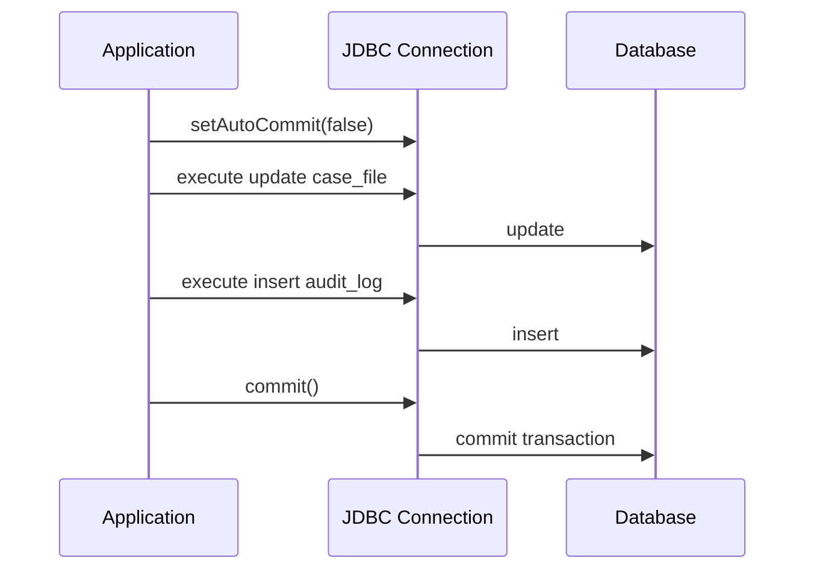
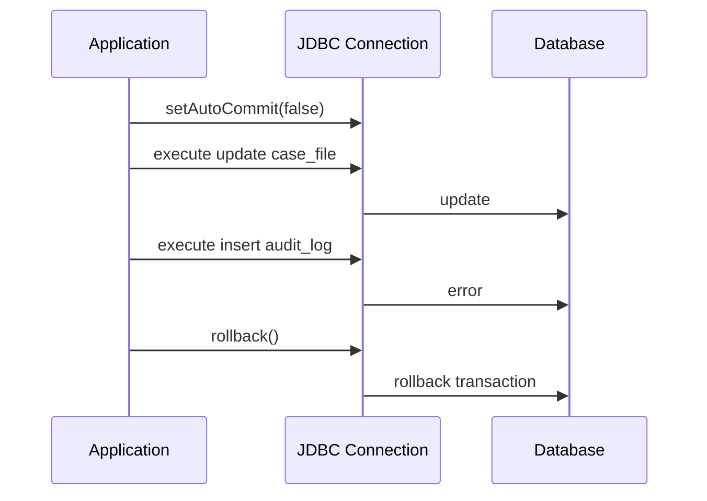
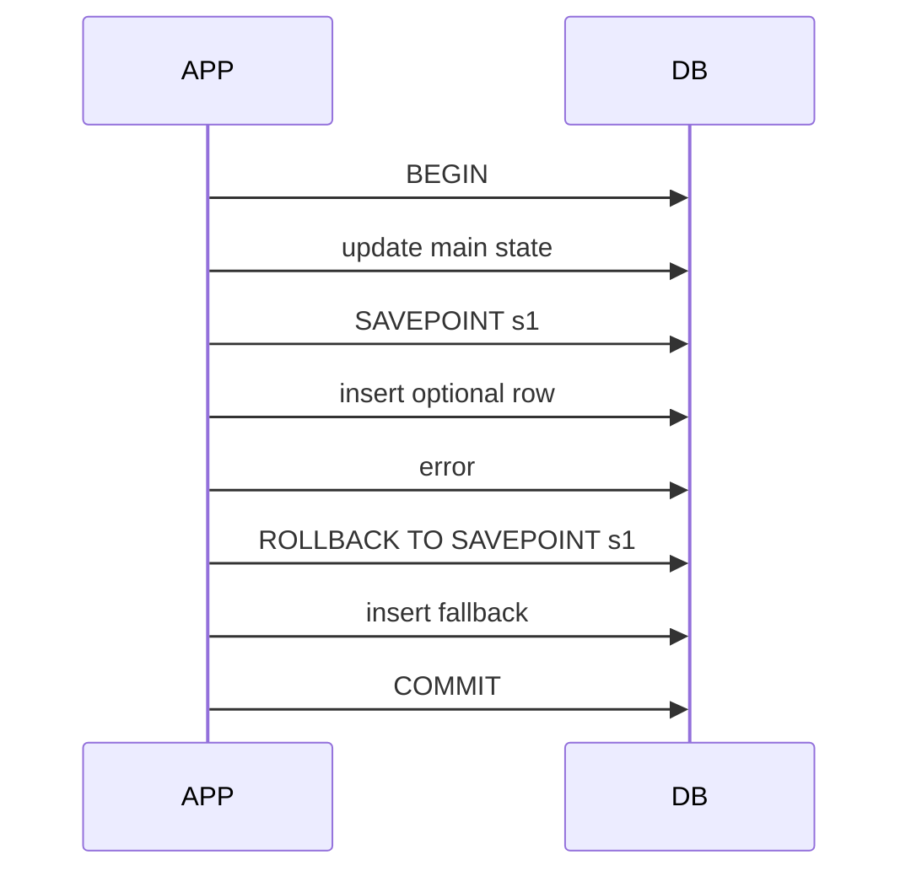

# Part 012 — JDBC Transaction Control

> Transaksi bukan anotasi.
>
> Transaksi adalah kontrak atomicity: perubahan mana yang harus berhasil bersama, gagal bersama, dan terlihat bersama.
>
> JDBC membuat kontrak itu sangat eksplisit: `setAutoCommit(false)`, `commit()`, `rollback()`, dan kadang `Savepoint`.
>
> Jika kamu paham transaksi manual JDBC, kamu akan jauh lebih tajam membaca `@Transactional`, Hibernate session, Spring transaction propagation, outbox pattern, retry policy, dan failure mode production.

Part ini membahas transaction control dari primitive paling dasar.

---

## 1. Core Thesis

Satu transaksi menjawab:

```txt
Which database changes are atomic together?
```

Dalam JDBC, transaksi melekat pada `Connection`.

```txt
Connection
  -> autoCommit false
  -> execute statement A
  -> execute statement B
  -> commit or rollback
```

Diagram:



Jika gagal:



---

## 2. Auto-Commit Mental Model

Dalam JDBC, connection biasanya mulai dalam auto-commit mode.

```java
boolean autoCommit = connection.getAutoCommit();
```

Auto-commit true berarti setiap statement adalah transaksi sendiri.

```java
connection.setAutoCommit(true);

updateCaseStatus(connection); // commit otomatis setelah statement
insertAudit(connection);      // commit otomatis setelah statement
```

Jika `updateCaseStatus` sukses dan `insertAudit` gagal, status sudah commit. Audit hilang. Ini partial commit.

Untuk use case atomic, matikan auto-commit:

```java
connection.setAutoCommit(false);

try {
    updateCaseStatus(connection);
    insertAudit(connection);
    appendOutbox(connection);

    connection.commit();
} catch (Exception e) {
    connection.rollback();
    throw e;
}
```

Rule:

```txt
Auto-commit is fine for independent single-statement operations.
Use explicit transaction for multi-statement consistency.
```

---

## 3. Transaction Belongs to Connection

Dua DAO yang masing-masing mengambil connection sendiri tidak berada dalam transaksi yang sama.

Buruk:

```java
public void approve(ApproveCaseCommand command) {
    caseDao.updateStatus(command.caseId()); // gets connection A
    auditDao.insert(command.audit());       // gets connection B
}
```

Masing-masing method mungkin benar secara lokal, tetapi use case tidak atomic.

Lebih sehat manual JDBC:

```java
public void approve(ApproveCaseCommand command) throws SQLException {
    try (Connection connection = dataSource.getConnection()) {
        connection.setAutoCommit(false);

        try {
            caseDao.updateStatus(connection, command.caseId());
            auditDao.insert(connection, command.audit());
            outboxDao.append(connection, command.event());

            connection.commit();
        } catch (Exception ex) {
            connection.rollback();
            throw ex;
        }
    }
}
```

DAO menerima `Connection`:

```java
public void updateStatus(Connection connection, CaseFileId id) throws SQLException {
    try (PreparedStatement ps = connection.prepareStatement(SQL)) {
        ...
    }
}
```

Mental model:

```txt
Same Connection = same JDBC transaction context.
Different Connection = different transaction context.
```

---

## 4. Basic Transaction Template

Manual JDBC transaction harus menangani rollback failure dan restore state.

```java
public <T> T inTransaction(SqlWork<T> work) throws SQLException {
    try (Connection connection = dataSource.getConnection()) {
        boolean previousAutoCommit = connection.getAutoCommit();
        connection.setAutoCommit(false);

        try {
            T result = work.execute(connection);
            connection.commit();
            return result;
        } catch (Exception ex) {
            rollbackQuietly(connection, ex);
            throw ex;
        } finally {
            connection.setAutoCommit(previousAutoCommit);
        }
    }
}

@FunctionalInterface
public interface SqlWork<T> {
    T execute(Connection connection) throws Exception;
}

private void rollbackQuietly(Connection connection, Exception original) {
    try {
        connection.rollback();
    } catch (SQLException rollbackFailure) {
        original.addSuppressed(rollbackFailure);
    }
}
```

Tetapi signature di atas mencampur checked `Exception`. Versi lebih bersih:

```java
@FunctionalInterface
public interface TransactionCallback<T> {
    T doInTransaction(Connection connection) throws SQLException;
}
```

```java
public <T> T transaction(TransactionCallback<T> callback) throws SQLException {
    try (Connection connection = dataSource.getConnection()) {
        boolean oldAutoCommit = connection.getAutoCommit();

        try {
            connection.setAutoCommit(false);

            T result = callback.doInTransaction(connection);

            connection.commit();
            return result;
        } catch (SQLException | RuntimeException ex) {
            rollbackSuppressing(connection, ex);
            throw ex;
        } finally {
            restoreAutoCommit(connection, oldAutoCommit);
        }
    }
}
```

Restore helper:

```java
private void restoreAutoCommit(Connection connection, boolean oldAutoCommit)
        throws SQLException {
    if (connection.getAutoCommit() != oldAutoCommit) {
        connection.setAutoCommit(oldAutoCommit);
    }
}
```

Kenapa restore penting? Dalam pooled connection, state connection harus dikembalikan bersih sebelum kembali ke pool.

Framework/pool biasanya juga reset state, tetapi jangan bergantung pada itu untuk code manual yang jelas.

---

## 5. Production-Grade Transaction Template

Template yang lebih defensif:

```java
public final class JdbcTransactionTemplate {
    private final DataSource dataSource;

    public JdbcTransactionTemplate(DataSource dataSource) {
        this.dataSource = dataSource;
    }

    public <T> T execute(TransactionOptions options, TransactionCallback<T> callback)
            throws SQLException {
        try (Connection connection = dataSource.getConnection()) {
            ConnectionState previous = ConnectionState.capture(connection);

            try {
                applyOptions(connection, options);

                T result = callback.doInTransaction(connection);

                connection.commit();
                return result;
            } catch (SQLException | RuntimeException ex) {
                rollbackSuppressing(connection, ex);
                throw ex;
            } finally {
                previous.restore(connection);
            }
        }
    }

    private void applyOptions(Connection connection, TransactionOptions options)
            throws SQLException {
        connection.setAutoCommit(false);

        if (options.isolationLevel() != null) {
            connection.setTransactionIsolation(options.isolationLevel());
        }

        if (options.readOnly() != null) {
            connection.setReadOnly(options.readOnly());
        }
    }

    private void rollbackSuppressing(Connection connection, Exception original) {
        try {
            connection.rollback();
        } catch (SQLException rollbackFailure) {
            original.addSuppressed(rollbackFailure);
        }
    }
}
```

State capture:

```java
public record ConnectionState(
        boolean autoCommit,
        int isolationLevel,
        boolean readOnly
) {
    public static ConnectionState capture(Connection connection) throws SQLException {
        return new ConnectionState(
                connection.getAutoCommit(),
                connection.getTransactionIsolation(),
                connection.isReadOnly()
        );
    }

    public void restore(Connection connection) throws SQLException {
        connection.setReadOnly(readOnly);
        connection.setTransactionIsolation(isolationLevel);
        connection.setAutoCommit(autoCommit);
    }
}
```

Options:

```java
public record TransactionOptions(
        Integer isolationLevel,
        Boolean readOnly
) {
    public static TransactionOptions readCommitted() {
        return new TransactionOptions(
                Connection.TRANSACTION_READ_COMMITTED,
                false
        );
    }

    public static TransactionOptions readOnlyReadCommitted() {
        return new TransactionOptions(
                Connection.TRANSACTION_READ_COMMITTED,
                true
        );
    }
}
```

Caveat:

- `setReadOnly` adalah hint; behavior bisa bergantung driver/database.
- Isolation support berbeda antar database.
- Restore state bisa gagal; log dan surface dengan benar.
- Dalam framework, jangan buat transaction manager sendiri kecuali kamu memang membangun infrastructure.

---

## 6. Commit Failure Is Real

Banyak engineer menganggap commit selalu sukses jika statement sebelumnya sukses. Tidak selalu.

Commit bisa gagal karena:

- network failure;
- database crash/failover;
- serialization conflict detected at commit;
- deferred constraint;
- deadlock/lock issue;
- disk/storage issue;
- connection lost.

Masalah terbesar: setelah commit failure, kadang aplikasi tidak tahu pasti apakah database commit atau rollback.

```txt
commit() throws SQLException
  -> transaction may have failed
  -> or commit may have succeeded but acknowledgment lost
```

Karena itu idempotency penting.

Jika command bisa diulang dengan command ID, aplikasi bisa recover:

```txt
client retries commandId=123
server checks command_dedup
if result exists -> return previous result
if not -> execute
```

Rule:

```txt
Commit failure requires idempotency/reconciliation mindset.
```

---

## 7. Rollback Failure Is Also Real

Rollback bisa gagal jika connection sudah putus.

```java
try {
    connection.rollback();
} catch (SQLException rollbackEx) {
    original.addSuppressed(rollbackEx);
}
```

Jangan menimpa original exception dengan rollback exception.

Buruk:

```java
catch (Exception ex) {
    connection.rollback(); // if this throws, original lost
    throw ex;
}
```

Lebih sehat:

```java
catch (Exception ex) {
    try {
        connection.rollback();
    } catch (SQLException rollbackEx) {
        ex.addSuppressed(rollbackEx);
    }
    throw ex;
}
```

Original exception menjelaskan kenapa transaksi gagal. Rollback exception adalah informasi tambahan penting.

---

## 8. Transaction Boundary at Use Case

Transaksi sebaiknya mengikuti use case consistency boundary.

Use case:

```txt
Approve case:
- update case status
- insert case status history
- insert audit log
- append outbox event
```

Semua harus satu transaksi.

```java
public ApproveCaseResult approve(ApproveCaseCommand command)
        throws SQLException {
    return tx.execute(TransactionOptions.readCommitted(), connection -> {
        CaseFileRow row = caseDao.getForUpdateOrVersionCheck(
                connection,
                command.caseId()
        );

        CaseFile caseFile = mapper.toDomain(row);
        caseFile.approve(command.actor(), command.reason());

        caseDao.update(connection, caseFile);
        statusHistoryDao.insert(connection, caseFile.latestStatusChange());
        auditDao.insert(connection, AuditRecord.from(command, caseFile));
        outboxDao.append(connection, CaseApprovedEvent.from(caseFile, command.commandId()));

        return new ApproveCaseResult(caseFile.id(), caseFile.status(), caseFile.version());
    });
}
```

Jangan transaction per DAO method jika use case butuh atomicity lintas DAO.

---

## 9. Command vs Query Transaction

Tidak semua read membutuhkan explicit transaction. Tetapi beberapa read membutuhkan consistency snapshot.

### Simple read

```java
public Optional<CaseDetailRow> findDetail(UUID id) {
    // auto-commit read may be fine
}
```

### Multi-query read requiring consistency

```java
public CaseDetailWithHistory getDetail(UUID id) {
    return tx.execute(readOnlyOptions, connection -> {
        CaseDetailRow detail = caseQuery.getDetail(connection, id);
        List<CaseHistoryRow> history = historyQuery.findByCaseId(connection, id);
        return new CaseDetailWithHistory(detail, history);
    });
}
```

Jika dua query harus melihat snapshot yang konsisten, gunakan transaction read-only dengan isolation yang sesuai.

### Command

Command hampir selalu butuh transaction jika lebih dari satu statement atau perlu concurrency guarantee.

---

## 10. Read-Only Transaction

```java
connection.setReadOnly(true);
connection.setAutoCommit(false);
```

Read-only bisa:

- memberi hint ke driver/database;
- mencegah write di beberapa database;
- membantu routing ke replica dalam framework tertentu;
- mengkomunikasikan intent.

Tetapi jangan rely blindly. Behavior berbeda.

Rule:

```txt
Use read-only transaction as intent and optimization hint, not as only safety barrier.
```

---

## 11. Isolation Level Overview

JDBC isolation constants:

```java
Connection.TRANSACTION_READ_UNCOMMITTED
Connection.TRANSACTION_READ_COMMITTED
Connection.TRANSACTION_REPEATABLE_READ
Connection.TRANSACTION_SERIALIZABLE
```

Jangan hafal definisi akademik saja. Pahami efek production.

| Isolation | Rough Meaning | Common Use |
|---|---|---|
| Read Uncommitted | bisa baca uncommitted data jika DB mendukung | jarang cocok |
| Read Committed | tiap statement melihat committed data terbaru | default umum |
| Repeatable Read | row yang dibaca stabil dalam transaksi | consistency read lebih kuat |
| Serializable | hasil seperti transaksi serial | invariant kompleks, retry needed |

Caveat: implementasi berbeda antar database. Nama isolation sama tidak selalu berarti behavior identik.

Part 018 akan mendalami isolation. Di sini fokus pada JDBC control.

---

## 12. Setting Isolation

```java
int previousIsolation = connection.getTransactionIsolation();

try {
    connection.setTransactionIsolation(Connection.TRANSACTION_SERIALIZABLE);
    connection.setAutoCommit(false);

    // work

    connection.commit();
} catch (Exception ex) {
    connection.rollback();
    throw ex;
} finally {
    connection.setTransactionIsolation(previousIsolation);
    connection.setAutoCommit(true);
}
```

Isolation sebaiknya diset sebelum transaksi dimulai. Mengubah isolation di tengah transaksi bisa tidak didukung atau berperilaku vendor-specific.

---

## 13. Transaction Timeout

JDBC `Connection` tidak punya standard direct `setTransactionTimeout`.

Timeout biasanya datang dari:

- framework transaction manager;
- statement query timeout;
- database statement timeout;
- lock timeout;
- request deadline;
- connection pool settings.

Manual JDBC bisa set statement timeout per statement:

```java
try (PreparedStatement ps = connection.prepareStatement(SQL)) {
    ps.setQueryTimeout(2);
}
```

Untuk transaction-wide timeout, kamu bisa membawa deadline sendiri:

```java
Deadline deadline = Deadline.after(Duration.ofSeconds(3));

caseDao.update(connection, command, deadline);
auditDao.insert(connection, audit, deadline);
```

DAO:

```java
ps.setQueryTimeout(deadline.remainingSecondsRoundedUp());
```

Rule:

```txt
Every transaction should have a time budget, even if enforced by surrounding framework.
```

---

## 14. Lock Timeout

Lock wait berbeda dari query execution umum.

Contoh:

```txt
Transaction A locks case_file row.
Transaction B tries to update same row.
B waits.
```

Jika tidak ada lock timeout, B bisa menunggu terlalu lama.

Lock timeout biasanya database-specific:

- PostgreSQL: `lock_timeout`, `statement_timeout`;
- MySQL/InnoDB: lock wait timeout variables;
- Oracle/SQL Server punya mekanisme sendiri.

Manual JDBC bisa menjalankan session setting, tetapi harus hati-hati restore state jika connection pooled.

```java
try (Statement st = connection.createStatement()) {
    st.execute("set local lock_timeout = '2s'");
}
```

Ini PostgreSQL-specific. Gunakan hanya dengan abstraction yang sadar database.

---

## 15. Savepoint Mental Model

Savepoint adalah checkpoint di dalam transaksi.

```java
connection.setAutoCommit(false);

Savepoint sp = connection.setSavepoint("before_optional_audit");

try {
    insertOptionalAudit(connection);
} catch (SQLException auditFailure) {
    connection.rollback(sp);
}

insertRequiredOutbox(connection);
connection.commit();
```

Diagram:



Savepoint berguna, tetapi bisa membuat flow sulit.

Gunakan untuk:

- partial failure yang benar-benar optional;
- batch item-level recovery dalam transaksi;
- complex legacy operation;
- testing nested-like behavior.

Jangan gunakan savepoint untuk menyembunyikan desain transaction boundary yang buruk.

---

## 16. Savepoint Example: Optional Metadata

```java
public void createCase(CreateCaseCommand command) throws SQLException {
    tx.execute(TransactionOptions.readCommitted(), connection -> {
        caseDao.insert(connection, command.caseFile());
        auditDao.insert(connection, command.audit());

        Savepoint metadataSavepoint = connection.setSavepoint("metadata");

        try {
            metadataDao.insertOptionalMetadata(connection, command.metadata());
        } catch (SQLException metadataFailure) {
            connection.rollback(metadataSavepoint);
            warningDao.insert(connection, WarningRecord.metadataSkipped(command.id()));
        } finally {
            connection.releaseSavepoint(metadataSavepoint);
        }

        outboxDao.append(connection, command.event());
        return null;
    });
}
```

Pertanyaan sebelum memakai savepoint:

- apakah metadata benar-benar optional?
- apakah warning record harus ada?
- apakah failure metadata boleh commit main case?
- apakah operator bisa memperbaiki nanti?
- apakah audit harus mencatat partial behavior?

Jika jawabannya tidak jelas, jangan pakai savepoint.

---

## 17. Nested Transaction Illusion

JDBC savepoint bukan distributed nested transaction penuh.

Jika inner work commit, outer rollback tetap membatalkan semua.

```txt
BEGIN
  update A
  SAVEPOINT inner
    update B
  release inner
ROLLBACK
```

Hasil: A dan B rollback.

Framework propagation seperti `NESTED` sering memakai savepoint. Berbeda dari `REQUIRES_NEW`, yang biasanya memakai transaksi/connection berbeda.

Manual JDBC:

- savepoint = rollback sebagian dalam transaksi yang sama;
- separate connection = transaksi berbeda;
- separate connection inside existing transaction bisa sangat berbahaya jika dipakai tanpa sadar.

---

## 18. Do Not Call External Services Inside Transaction

Buruk:

```java
connection.setAutoCommit(false);

updateCase(connection);
documentService.generatePdf(caseId); // network call
emailClient.send(...);               // network call
insertAudit(connection);

connection.commit();
```

Masalah:

- transaksi terbuka selama network call;
- lock ditahan lama;
- connection dipinjam lama;
- external side effect tidak rollback;
- jika commit gagal setelah email terkirim, dunia luar melihat event palsu.

Lebih sehat:

```java
connection.setAutoCommit(false);

updateCase(connection);
insertAudit(connection);
appendOutbox(connection);

connection.commit();
```

Worker setelah commit:

```txt
outbox publisher -> document generation -> email
```

Rule:

```txt
Keep transaction for database consistency work.
Move external side effects after commit through durable mechanism.
```

---

## 19. Outbox in JDBC Transaction

Outbox pattern secara JDBC:

```java
tx.execute(TransactionOptions.readCommitted(), connection -> {
    caseDao.approve(connection, command);
    auditDao.insert(connection, audit);
    outboxDao.append(connection, event);
    return result;
});
```

Jika commit sukses:

- status berubah;
- audit ada;
- outbox event ada.

Publisher membaca outbox setelah commit.

```sql
select *
from outbox_event
where published_at is null
order by created_at asc
limit ?
```

Lalu publish dan mark published dalam transaksi terpisah.

Outbox membuat event publication retryable dan tidak bergantung pada external service di tengah transaksi command.

---

## 20. Transaction and Idempotency

Transaction saja tidak cukup untuk retry-safe behavior.

Jika commit sukses tetapi response timeout, client retry.

Tanpa idempotency:

```txt
Retry executes command again.
```

Dengan idempotency:

```sql
insert into command_dedup(command_id, command_type, aggregate_id, created_at)
values (?, ?, ?, ?)
```

Dalam transaksi yang sama:

```java
tx.execute(options, connection -> {
    boolean first = commandDedupDao.tryInsert(connection, command.commandId());

    if (!first) {
        return commandDedupDao.loadResult(connection, command.commandId());
    }

    // execute mutation
    // insert audit
    // append outbox
    // store result

    return result;
});
```

Unique constraint:

```sql
create unique index uq_command_dedup_id
on command_dedup(command_id);
```

Rule:

```txt
Transaction gives atomicity.
Idempotency gives safe retry.
You usually need both.
```

---

## 21. Transaction and Optimistic Locking

Pattern:

```sql
update case_file
set status = ?,
    version = version + 1,
    updated_at = ?
where id = ?
  and version = ?;
```

In transaction:

```java
int updated = caseDao.updateWithVersion(
        connection,
        caseId,
        newStatus,
        expectedVersion,
        now
);

if (updated == 0) {
    throw new OptimisticConflict(caseId, expectedVersion);
}
```

If conflict occurs, rollback transaction.

```java
try {
    ...
} catch (OptimisticConflict ex) {
    connection.rollback();
    throw ex;
}
```

Optimistic conflict is not "database down". It is a normal concurrency outcome.

---

## 22. Transaction and Pessimistic Locking

SQL example:

```sql
select id, status, version
from case_file
where id = ?
for update;
```

JDBC:

```java
try (PreparedStatement ps = connection.prepareStatement(SQL)) {
    ps.setObject(1, caseId);

    try (ResultSet rs = ps.executeQuery()) {
        ...
    }
}
```

The row lock is held until commit/rollback.

Use when:

- high contention;
- must serialize mutation;
- optimistic retry too expensive;
- invariant requires current locked state.

Risks:

- deadlock;
- lock wait;
- transaction duration sensitivity;
- throughput reduction.

Rule:

```txt
If you lock, keep transaction short and set timeout strategy.
```

---

## 23. Transaction and Deadlock

Deadlock can happen even with correct code.

Example:

```txt
Transaction A locks case 1, then case 2.
Transaction B locks case 2, then case 1.
```

Database detects deadlock and aborts one transaction.

Handling:

- rollback;
- classify as retryable if operation idempotent;
- retry whole transaction, not only failed statement;
- use consistent lock ordering;
- keep transaction short.

Consistent ordering:

```java
List<UUID> sortedIds = ids.stream()
        .sorted()
        .toList();

for (UUID id : sortedIds) {
    lockCase(connection, id);
}
```

Retry must re-execute from beginning because transaction state is invalid after deadlock.

---

## 24. Transaction State After SQLException

After certain SQL exceptions, transaction may be marked failed depending database.

PostgreSQL, for example, treats many errors as aborting the current transaction until rollback.

Meaning:

```txt
statement fails
transaction is no longer usable
must rollback
```

Do not blindly continue after `SQLException`.

Bad:

```java
try {
    insertOptional(connection);
} catch (SQLException ignored) {
}
insertRequired(connection);
connection.commit();
```

Unless you use savepoint and know behavior.

Better:

```java
Savepoint sp = connection.setSavepoint();
try {
    insertOptional(connection);
} catch (SQLException ex) {
    connection.rollback(sp);
}
insertRequired(connection);
```

Or fail whole transaction.

---

## 25. Retry Boundary

Retry should wrap the entire transaction.

Bad:

```java
try {
    statement.executeUpdate();
} catch (DeadlockException e) {
    statement.executeUpdate(); // same transaction may be invalid
}
```

Good:

```java
public <T> T retryingTransaction(TransactionCallback<T> callback) {
    for (int attempt = 1; attempt <= maxAttempts; attempt++) {
        try {
            return tx.execute(options, callback);
        } catch (RetryableTransactionFailure ex) {
            if (attempt == maxAttempts) {
                throw ex;
            }
            sleep(backoff(attempt));
        }
    }
    throw new IllegalStateException("unreachable");
}
```

Only retry if:

- error is transient/retryable;
- operation is idempotent or safely repeatable;
- retry budget bounded;
- backoff/jitter used;
- metric emitted.

---

## 26. Transaction Retry Pseudocode

```java
public final class TransactionRetrier {
    private final JdbcTransactionTemplate tx;
    private final int maxAttempts;

    public <T> T executeWithRetry(
            TransactionOptions options,
            TransactionCallback<T> callback
    ) throws SQLException {
        SQLException lastSqlException = null;

        for (int attempt = 1; attempt <= maxAttempts; attempt++) {
            try {
                return tx.execute(options, callback);
            } catch (SQLException ex) {
                if (!isRetryable(ex) || attempt == maxAttempts) {
                    throw ex;
                }

                lastSqlException = ex;
                sleepBeforeRetry(attempt);
            }
        }

        throw lastSqlException;
    }

    private boolean isRetryable(SQLException ex) {
        String state = ex.getSQLState();
        return state != null && state.startsWith("40");
    }

    private void sleepBeforeRetry(int attempt) {
        // bounded exponential backoff + jitter
    }
}
```

This is simplified. Production code should preserve interrupt status, emit metrics, and classify vendor-specific error codes.

---

## 27. Retry and Idempotency Example

```java
public ApproveCaseResult approve(ApproveCaseCommand command)
        throws SQLException {
    return retrier.executeWithRetry(TransactionOptions.readCommitted(), connection -> {
        Optional<ApproveCaseResult> previous =
                commandDedupDao.findResult(connection, command.commandId());

        if (previous.isPresent()) {
            return previous.get();
        }

        commandDedupDao.insertStarted(connection, command);

        CaseFileRow row = caseDao.load(connection, command.caseId());
        CaseFile caseFile = mapper.toDomain(row);
        caseFile.approve(command.actor(), command.reason());

        caseDao.save(connection, caseFile);
        auditDao.insert(connection, AuditRecord.from(command, caseFile));
        outboxDao.append(connection, CaseApprovedEvent.from(command, caseFile));

        ApproveCaseResult result = ApproveCaseResult.from(caseFile);
        commandDedupDao.storeResult(connection, command.commandId(), result);

        return result;
    });
}
```

If transaction deadlocks before commit, retry repeats safely.

If transaction commits but response lost, next request loads previous result.

---

## 28. Transaction and Constraint Violations

Constraint violation should usually rollback transaction.

Example duplicate key:

```java
try {
    insertCase(connection, row);
} catch (SQLException e) {
    if (isUniqueViolation(e)) {
        throw new CaseNumberAlreadyExists(row.caseNumber(), e);
    }
    throw e;
}
```

Outer transaction template catches and rolls back.

For idempotency `tryInsert`, duplicate key may be expected. But after duplicate key in some databases, transaction may be failed unless handled with vendor-specific `on conflict do nothing` or savepoint.

Better PostgreSQL-style:

```sql
insert into command_dedup(command_id, created_at)
values (?, ?)
on conflict (command_id) do nothing
```

Then check update count.

This avoids exception-driven flow and failed transaction state.

---

## 29. Transaction and Deferred Constraints

Some constraints can be checked at commit time.

Meaning:

```txt
All statements succeeded.
commit() fails due to deferred constraint.
```

Therefore:

- commit can throw business/data error;
- exception mapping must include commit;
- don't assume statement success means transaction success;
- idempotency/retry still important.

---

## 30. Transaction and Generated Keys

Generated key insert inside transaction:

```java
connection.setAutoCommit(false);

long caseId = insertCaseAndReturnId(connection, row);
insertAudit(connection, caseId);
connection.commit();
```

If rollback occurs, generated sequence value may not be reused. That's normal. Do not rely on gapless IDs.

For regulatory numbering, if gapless sequence is required, treat it as separate business problem. Many systems should avoid requiring gapless transaction IDs because rollback/failure makes it hard and expensive.

---

## 31. Transaction and Batch

Batch inside transaction:

```java
connection.setAutoCommit(false);

try {
    insertAuditBatch(connection, auditRows);
    updateCasesBatch(connection, caseRows);
    connection.commit();
} catch (Exception ex) {
    connection.rollback();
    throw ex;
}
```

Risks:

- transaction too large;
- lock too long;
- undo/WAL pressure;
- partial batch failure classification;
- retry duplicates unless idempotent;
- memory pressure.

Chunking:

```txt
process 500 rows per transaction
commit
save cursor
repeat
```

For large batch jobs, one huge transaction is usually wrong.

---

## 32. Transaction and Cursor/Streaming Result

If you stream large result set inside transaction, connection remains occupied until stream complete.

```java
connection.setAutoCommit(false);
PreparedStatement ps = connection.prepareStatement(SQL);
ResultSet rs = ps.executeQuery();

while (rs.next()) {
    process(rs);
}

connection.commit();
```

Risks:

- long transaction;
- snapshot held;
- locks maybe held depending query/isolation;
- connection occupied;
- failure restarts large work.

Better for many cases:

- chunk by key;
- read limited page;
- process;
- commit per chunk;
- save cursor.

Streaming large result will be covered in part 016.

---

## 33. Transaction and Read-Modify-Write

Classic pattern:

```txt
select current state
validate
update
commit
```

Problem under concurrency if no lock/version.

Bad:

```java
CaseRow row = caseDao.findById(connection, id);
if (row.status() == OPEN) {
    caseDao.updateStatus(connection, id, APPROVED);
}
```

Two transactions can both read OPEN and both update.

Fix options:

1. Optimistic version in update.
2. Conditional update with expected status.
3. `select for update`.
4. Serializable isolation.
5. Unique/constraint-based invariant.

Conditional update:

```sql
update case_file
set status = 'APPROVED'
where id = ?
  and status = 'OPEN';
```

Check affected rows.

---

## 34. Transaction and Write Skew

Some invariants involve multiple rows.

Example:

```txt
At least one supervisor must remain assigned to a case.
```

Two transactions:

- T1 removes supervisor A after seeing supervisor B exists.
- T2 removes supervisor B after seeing supervisor A exists.
- Both commit.
- No supervisor remains.

This can happen under weaker isolation if not protected.

Solutions:

- serializable isolation with retry;
- explicit lock parent case row;
- constraint/model redesign;
- aggregate table counter with version;
- advisory/application lock.

Part 018/019 will go deeper. For now, know that transaction alone at default isolation may not protect multi-row invariant.

---

## 35. Transaction and Connection Pool State

Manual transaction code must not return dirty connection to pool.

Dirty state:

- autoCommit false;
- readOnly true unexpectedly;
- changed isolation;
- session variables;
- temporary tables;
- open cursors;
- locks due to uncommitted transaction.

Always:

- commit/rollback;
- restore autoCommit;
- restore isolation/readOnly if changed;
- close statements/result sets;
- close connection.

Connection pool often protects you, but production-grade code should not rely on accidental cleanup.

---

## 36. Transaction and Session Settings

Database-specific session settings can leak through pooled connections.

Example PostgreSQL:

```sql
set statement_timeout = '5s';
```

If not local/restored, next borrower may inherit.

Prefer transaction-local setting when supported:

```sql
set local statement_timeout = '5s';
```

Still, document and encapsulate.

```java
public void setLocalStatementTimeout(Connection connection, Duration timeout)
        throws SQLException {
    try (PreparedStatement ps = connection.prepareStatement(
            "set local statement_timeout = ?"
    )) {
        ps.setString(1, timeout.toMillis() + "ms");
        ps.execute();
    }
}
```

Vendor-specific code should be isolated.

---

## 37. Transaction and `close()`

If connection with active transaction is closed, behavior depends driver/pool. Many pools rollback before returning connection. But don't rely on it.

Always explicit:

```java
try {
    connection.commit();
} catch (...) {
    connection.rollback();
}
```

`close()` is not your transaction strategy.

---

## 38. Transaction Template with After-Commit Hooks?

Sometimes you want action after commit.

Manual approach:

```java
List<Runnable> afterCommit = new ArrayList<>();

try {
    connection.setAutoCommit(false);

    // DB work
    afterCommit.add(() -> metrics.increment("case.approved"));

    connection.commit();

    for (Runnable action : afterCommit) {
        action.run();
    }
} catch (Exception ex) {
    connection.rollback();
    throw ex;
}
```

But do not put critical external side effect only in memory afterCommit if it must be reliable. If process crashes after commit before action, side effect is lost.

For reliable side effects, use outbox.

After-commit hook is okay for:

- local metrics;
- cache invalidation if cache can tolerate miss/rebuild;
- non-critical notifications.

---

## 39. Transaction and Cache

Do not update cache before commit as if transaction must succeed.

Bad:

```java
updateDatabase(connection);
cache.put(key, value);
connection.commit();
```

If commit fails, cache has false value.

Better:

- update cache after commit;
- or invalidate after commit;
- or use outbox/change data capture;
- or use cache-aside with TTL.

If after-commit cache invalidation fails, system should still be correct, maybe temporarily stale depending design.

---

## 40. Transaction and Audit

Audit that proves state change should be in same transaction.

```java
updateCaseStatus(connection);
insertAudit(connection);
connection.commit();
```

If audit insert is after commit:

```java
updateCaseStatus(connection);
connection.commit();
insertAudit(otherConnection); // can fail
```

Then state changed without evidence.

For regulatory/enforcement systems, this is usually unacceptable.

Rule:

```txt
If audit is evidence of a state change, persist it atomically with the state change.
```

---

## 41. Transaction and History Table

Status history:

```sql
insert into case_status_history (
    id,
    case_id,
    previous_status,
    new_status,
    changed_by,
    changed_at,
    reason
)
values (?, ?, ?, ?, ?, ?, ?)
```

Must usually be same transaction as status update.

Potential constraint:

```sql
create unique index uq_case_status_history_command
on case_status_history(command_id);
```

This prevents duplicate history on retry.

---

## 42. Transaction and Outbox Ordering

Outbox insert in same transaction:

```txt
case update
audit insert
outbox insert
commit
```

Ordering by `created_at` alone may not be enough if timestamps equal. Add deterministic key:

```sql
order by created_at asc, id asc
```

Outbox publisher should be idempotent too because publish/mark-published can fail halfway.

---

## 43. Transaction and Partial Success Semantics

Sometimes partial success is valid.

Example batch repair:

```txt
Repair 10,000 cases.
If 37 fail due to validation, repair rest.
```

Do not use one transaction for all if partial success desired.

Design:

```txt
one chunk transaction
or one item transaction
record failure row
continue
```

Partial success must be explicit in job result.

```java
public record RepairJobResult(
        long processed,
        long succeeded,
        long failed
) {}
```

---

## 44. Transaction and Business Rejection

Business rejection is not always exceptional from transaction perspective.

Example:

```java
if (!caseFile.canApprove()) {
    return ApproveCaseResult.rejected("Case is already closed");
}
```

If no DB change was made, no rollback issue.

But if you inserted command log before validation, decide whether rejection should be persisted.

```txt
Option A: reject before transaction.
Option B: transaction records rejected command.
```

For audit/regulatory, rejected attempts may need persistence.

---

## 45. Transaction and Validation Timing

Validation layers:

1. Request validation before transaction.
2. Authorization before transaction or early inside if data needed.
3. Load current state inside transaction.
4. Validate state transition inside transaction.
5. Persist mutation.
6. Commit.

Why validate state inside transaction? Because state can change between pre-check and write.

Bad:

```java
if (caseQuery.isOpen(id)) {
    tx.execute(conn -> caseDao.approve(conn, id));
}
```

State might close between `isOpen` and `approve`.

Better:

```java
tx.execute(conn -> {
    CaseFile caseFile = caseDao.load(conn, id);
    caseFile.approve(...);
    caseDao.save(conn, caseFile);
});
```

Or conditional update with affected row check.

---

## 46. Transaction and Authorization

Authorization sometimes needs database state.

Example:

```txt
User may approve only cases assigned to their unit.
```

You can:

1. Resolve authorization scope before transaction.
2. Include scope predicate in update/select.
3. Fail if row not found under scope.

SQL:

```sql
update case_file
set status = 'APPROVED'
where id = ?
  and unit_id = ?
  and status = 'UNDER_REVIEW';
```

This prevents time-of-check/time-of-use mismatch.

---

## 47. Transaction and Multi-Tenant Safety

Tenant predicate should be part of transactional write.

```sql
update case_file
set status = ?
where tenant_id = ?
  and id = ?
  and version = ?
```

If update count is 0, could mean:

- case not found;
- wrong tenant;
- version conflict;
- state conflict.

You may need separate safe read to classify for user message, but do not leak cross-tenant existence.

---

## 48. Transaction and DDL

DDL transaction behavior varies by database.

Some databases allow transactional DDL. Some implicitly commit. Some operations cannot run inside transaction.

Migration tools handle this with database-specific logic.

Application runtime transaction should generally avoid DDL. Schema migration belongs to migration process, not request path.

---

## 49. Transaction and Isolation Testing

Concurrency bugs require concurrency tests.

Example optimistic conflict test:

```txt
Transaction A loads case version 1.
Transaction B loads case version 1.
Transaction A updates where version=1 -> success.
Transaction B updates where version=1 -> 0 rows -> conflict.
```

Test should use real database and two connections.

Pseudo:

```java
Connection a = dataSource.getConnection();
Connection b = dataSource.getConnection();

a.setAutoCommit(false);
b.setAutoCommit(false);

CaseRow rowA = dao.load(a, id);
CaseRow rowB = dao.load(b, id);

dao.updateStatus(a, id, APPROVED, rowA.version());
a.commit();

assertThrows(OptimisticConflict.class, () ->
        dao.updateStatus(b, id, REJECTED, rowB.version())
);
b.rollback();
```

---

## 50. Transaction and Test Rollback

Many tests wrap each test in transaction and rollback after.

Useful for cleanup, but can hide behavior:

- after-commit hooks do not run;
- outbox publisher not triggered;
- commit-time constraints not tested;
- transaction isolation differs from production;
- code that depends on commit visibility not tested.

For data access tests, include tests that actually commit, especially for:

- migration;
- outbox;
- generated keys;
- deferred constraints;
- transaction retry;
- concurrent visibility.

---

## 51. Manual JDBC vs Framework Transactions

Manual JDBC:

```java
connection.setAutoCommit(false);
...
connection.commit();
```

Framework:

```java
@Transactional
public void approve(...) { ... }
```

Framework adds:

- connection binding;
- propagation;
- rollback rules;
- read-only hint;
- isolation config;
- timeout config;
- exception translation;
- integration with ORM session.

But primitive remains same:

```txt
get connection/session
begin transaction
execute work
commit/rollback
cleanup
```

If framework behavior surprises you, debug with JDBC mental model.

---

## 52. Common Transaction Anti-Patterns

### Anti-pattern 1 — Transaction per repository method

```java
repository.updateStatus(...); // commits
repository.insertAudit(...);  // commits
```

Fix: transaction around use case.

### Anti-pattern 2 — External call inside transaction

```java
db update -> HTTP call -> db insert -> commit
```

Fix: outbox/after commit.

### Anti-pattern 3 — Ignored rollback failure

```java
catch (Exception ex) {
    connection.rollback();
}
```

Fix: preserve original and suppressed rollback failure.

### Anti-pattern 4 — Retry single statement after deadlock

Fix: retry whole transaction.

### Anti-pattern 5 — Not checking update count

Fix: affected rows part of correctness.

### Anti-pattern 6 — Long transaction for batch

Fix: chunk and checkpoint.

### Anti-pattern 7 — Connection state leak

Fix: restore autoCommit/isolation/readOnly/session settings.

### Anti-pattern 8 — Business conflict treated as 500

Fix: map optimistic/constraint conflict to semantic response.

---

## 53. Transaction Review Checklist

Before accepting transaction design:

- [ ] What is the use case transaction boundary?
- [ ] Which statements must commit together?
- [ ] Which side effects must happen after commit?
- [ ] Is audit atomic with state change?
- [ ] Is outbox inserted in same transaction?
- [ ] Are update counts checked?
- [ ] Is concurrency handled by version/lock/constraint/isolation?
- [ ] Is retry boundary whole transaction?
- [ ] Is operation idempotent if retried?
- [ ] Are deadlock/serialization errors classified?
- [ ] Is transaction short?
- [ ] Are external calls outside transaction?
- [ ] Are connection states restored?
- [ ] Is timeout budget clear?
- [ ] Are multi-tenant predicates included?
- [ ] Are tests using multiple connections for concurrency?

---

## 54. Example: Approve Case With Manual JDBC Transaction

```java
public final class ApproveCaseJdbcUseCase {
    private final JdbcTransactionTemplate tx;
    private final CaseFileDao caseFileDao;
    private final CaseAuditDao auditDao;
    private final OutboxDao outboxDao;
    private final CommandDedupDao commandDedupDao;

    public ApproveCaseResult approve(ApproveCaseCommand command)
            throws SQLException {
        return tx.execute(TransactionOptions.readCommitted(), connection -> {
            Optional<ApproveCaseResult> previous =
                    commandDedupDao.findApproveResult(connection, command.commandId());

            if (previous.isPresent()) {
                return previous.get();
            }

            commandDedupDao.insertStarted(connection, command.commandId());

            CaseFileRow row = caseFileDao.getById(connection, command.caseId());
            CaseFile caseFile = CaseFileMapper.toDomain(row);

            CaseStatus previousStatus = caseFile.status();
            caseFile.approve(command.actorId(), command.reason());

            caseFileDao.updateStatusWithVersion(
                    connection,
                    caseFile.id(),
                    caseFile.status(),
                    row.version()
            );

            auditDao.insert(connection, new CaseAuditRow(
                    UUID.randomUUID(),
                    command.commandId(),
                    caseFile.id().value(),
                    command.actorId().value(),
                    "APPROVE_CASE",
                    command.reason(),
                    previousStatus,
                    caseFile.status(),
                    command.now()
            ));

            outboxDao.append(connection, OutboxEvent.caseApproved(
                    command.commandId(),
                    caseFile.id(),
                    command.now()
            ));

            ApproveCaseResult result = ApproveCaseResult.from(caseFile);
            commandDedupDao.storeApproveResult(
                    connection,
                    command.commandId(),
                    result
            );

            return result;
        });
    }
}
```

Characteristics:

- idempotency checked inside transaction;
- state loaded inside transaction;
- update uses expected version;
- audit atomic;
- outbox atomic;
- result stored for retry;
- no external call inside transaction;
- commit controlled by template.

---

## 55. Example: Assign Primary Officer With Conditional Insert

Invariant:

```txt
One case can have at most one active primary officer assignment.
```

Database partial unique index:

```sql
create unique index uq_case_active_primary_assignment
on case_assignment(case_id)
where assignment_type = 'PRIMARY'
  and ended_at is null;
```

Transaction:

```java
tx.execute(TransactionOptions.readCommitted(), connection -> {
    commandDedupDao.insertOrReturnPrevious(connection, command.commandId());

    caseDao.ensureAssignableWithVersion(
            connection,
            command.caseId(),
            command.expectedCaseVersion()
    );

    assignmentDao.insertPrimaryAssignment(connection, command);

    auditDao.insert(connection, AssignmentAudit.from(command));
    outboxDao.append(connection, CaseAssignedEvent.from(command));

    commandDedupDao.storeResult(connection, command.commandId(), result);

    return result;
});
```

If unique constraint violation occurs:

- maybe another assignment won race;
- rollback;
- map to `CaseAlreadyAssigned`;
- if same command ID, dedup should return previous result.

---

## 56. Example: Read Consistent Case Detail

```java
public CaseDetailResponse getCaseDetail(CaseFileId id) throws SQLException {
    return tx.execute(TransactionOptions.readOnlyReadCommitted(), connection -> {
        CaseDetailRow detail = caseDetailQuery.getRequired(connection, id);
        List<CaseActionRow> actions = actionQuery.findByCaseId(connection, id);
        List<CaseDocumentRow> documents = documentQuery.findByCaseId(connection, id);

        return CaseDetailResponse.from(detail, actions, documents);
    });
}
```

If stronger snapshot consistency is required, use appropriate isolation. If eventual consistency is acceptable, independent reads may be fine.

---

## 57. Observability for Transactions

Metrics:

```txt
data_access.transaction.duration{use_case="ApproveCase"}
data_access.transaction.rollback.count{reason="optimistic_conflict"}
data_access.transaction.retry.count{reason="deadlock"}
data_access.transaction.commit.failure.count
data_access.transaction.rollback.failure.count
data_access.transaction.timeout.count
```

Logs should include:

- use case;
- transaction outcome;
- duration;
- error taxonomy;
- attempt number;
- correlation ID;
- command ID;
- not raw sensitive SQL parameters.

Trace spans:

```txt
ApproveCase transaction
  - CaseFile.load
  - CaseFile.update
  - Audit.insert
  - Outbox.append
  - commit
```

Commit duration can matter.

---

## 58. Transaction Failure Taxonomy

| Failure | Retry? | Notes |
|---|---|---|
| Deadlock | often yes | retry whole transaction with backoff |
| Serialization failure | often yes | operation must be idempotent |
| Optimistic conflict | usually no auto retry | return conflict or reload/merge consciously |
| Duplicate command ID | not failure | return previous result |
| Duplicate natural key | no | business conflict |
| Connection lost before commit | maybe unknown | idempotency/reconciliation |
| Commit failed | unknown outcome possible | idempotency critical |
| Syntax error | no | deploy bug |
| Migration mismatch | no | deployment compatibility bug |
| Query timeout | maybe | if safe and within budget |
| Lock timeout | maybe/conflict | depends use case |

---

## 59. Mini Lab

Implement manual JDBC transaction for:

```txt
close expired case assignments
```

Rules:

- read up to 500 expired active assignments;
- mark each assignment ended;
- insert audit for each;
- append outbox event for each;
- commit per chunk;
- save cursor after chunk;
- retry deadlock safely;
- if one row already ended by another process, skip or conflict according to design.

Questions:

1. What is the transaction boundary?
2. Is cursor saved inside same transaction as updates?
3. What update count is acceptable?
4. Should chunk use optimistic predicate `ended_at is null`?
5. What happens if commit succeeds but process crashes before next chunk?
6. How do you avoid duplicate audit/outbox on retry?
7. What metric tells you job is stuck?
8. What lock ordering prevents deadlock?

---

## 60. Summary

JDBC transaction control is explicit and unforgiving.

You must master:

- auto-commit;
- connection-scoped transaction;
- commit and rollback;
- rollback failure handling;
- commit unknown outcome;
- transaction template;
- state restoration for pooled connection;
- isolation setting;
- read-only hint;
- query/transaction timeout model;
- savepoint;
- transaction boundary at use case;
- idempotency for retry;
- optimistic/pessimistic concurrency;
- deadlock retry boundary;
- avoiding external calls inside transaction;
- audit and outbox atomicity;
- batch chunking;
- multi-tenant predicates;
- concurrency testing with real database.

Part berikutnya akan membahas **JDBC Error Handling**: `SQLException`, SQLState, vendor code, transient vs non-transient error, deadlock, timeout, constraint violation, dan bagaimana mengubah database failure menjadi semantic application outcome.

---

## 61. References

- Oracle Java SE `Connection`: https://docs.oracle.com/en/java/javase/21/docs/api/java.sql/java/sql/Connection.html
- Oracle Java SE `Savepoint`: https://docs.oracle.com/en/java/javase/21/docs/api/java.sql/java/sql/Savepoint.html
- Oracle Java SE `SQLException`: https://docs.oracle.com/en/java/javase/21/docs/api/java.sql/java/sql/SQLException.html
- Oracle Java SE `SQLTransactionRollbackException`: https://docs.oracle.com/en/java/javase/21/docs/api/java.sql/java/sql/SQLTransactionRollbackException.html
- Oracle Java SE `SQLTransientException`: https://docs.oracle.com/en/java/javase/21/docs/api/java.sql/java/sql/SQLTransientException.html
- PostgreSQL Documentation — Transaction Isolation: https://www.postgresql.org/docs/current/transaction-iso.html
- PostgreSQL Documentation — Explicit Locking: https://www.postgresql.org/docs/current/explicit-locking.html
- PostgreSQL Documentation — `SET TRANSACTION`: https://www.postgresql.org/docs/current/sql-set-transaction.html
