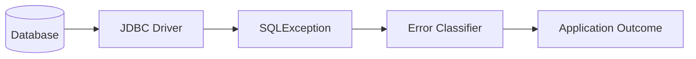
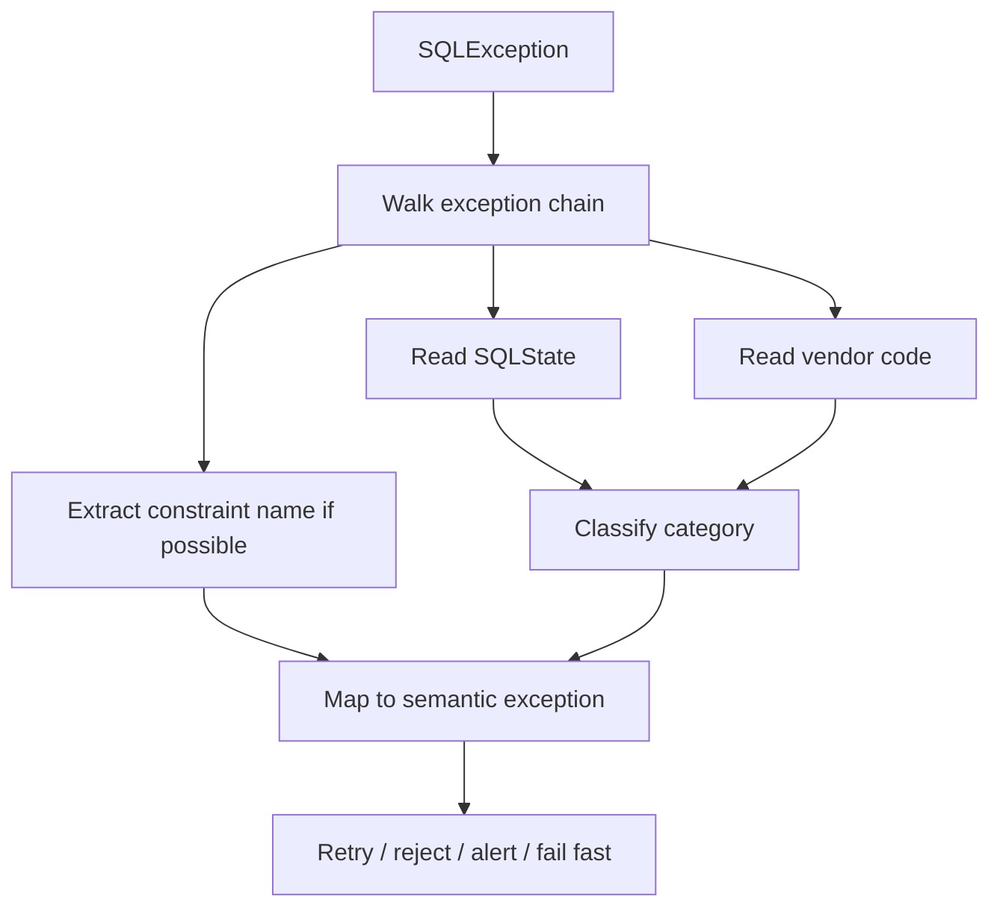
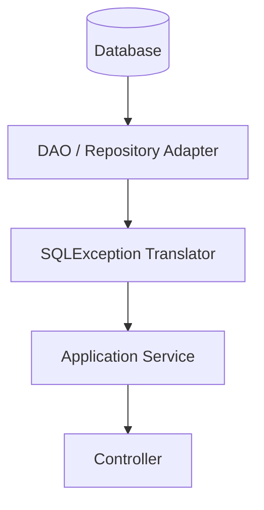

# Part 013 — JDBC Error Handling

> Error handling data access bukan `catch SQLException lalu log`.
>
> Di production, database error adalah sinyal. Sinyal itu bisa berarti:
>
> - user mengirim data duplikat;
> - request aman untuk retry;
> - transaksi kalah deadlock;
> - query timeout karena overload;
> - schema migration belum kompatibel;
> - connection pool habis;
> - database tidak reachable;
> - data corruption terjadi;
> - command sudah pernah diproses;
> - aplikasi salah deploy.
>
> Jika semua sinyal itu diperlakukan sama, sistem akan salah mengambil keputusan.

Part ini membahas cara membaca dan mengubah error JDBC menjadi outcome aplikasi yang benar.

---

## 1. Core Thesis

JDBC mengirim banyak error melalui `SQLException`. Tetapi aplikasi production tidak boleh berhenti di level itu.

Kamu harus menerjemahkan:

```txt
SQLException
  -> database condition
  -> data access category
  -> application outcome
```

Diagram:



Outcome bisa berupa:

- business conflict;
- validation/reference error;
- retryable transient failure;
- concurrency conflict;
- timeout/overload response;
- deployment bug;
- data corruption alert;
- security/authorization-safe not found;
- infrastructure unavailable.

Aplikasi yang matang tidak bertanya "apakah ada exception?". Ia bertanya "exception ini artinya apa dan apa tindakan aman berikutnya?".

---

## 2. SQLException Anatomy

`SQLException` membawa beberapa informasi penting:

```java
catch (SQLException e) {
    String message = e.getMessage();
    String sqlState = e.getSQLState();
    int vendorCode = e.getErrorCode();
    Throwable cause = e.getCause();
}
```

Fields:

| Field | Meaning |
|---|---|
| message | pesan human-readable dari driver/database |
| SQLState | kode standard-ish lima karakter |
| vendor code | kode spesifik database/driver |
| next exception | chained detail tambahan |
| cause | underlying Java exception jika ada |

Contoh logging yang berguna:

```java
private void logSqlException(String operation, SQLException e) {
    log.warn(
            "Data access failure operation={} sqlState={} vendorCode={} message={}",
            operation,
            e.getSQLState(),
            e.getErrorCode(),
            e.getMessage()
    );

    SQLException next = e.getNextException();
    while (next != null) {
        log.warn(
                "Chained SQL exception operation={} sqlState={} vendorCode={} message={}",
                operation,
                next.getSQLState(),
                next.getErrorCode(),
                next.getMessage()
        );
        next = next.getNextException();
    }
}
```

Jangan log raw bind parameter sensitif kecuali sudah direview. Log query name, operation, SQLState, vendor code, correlation ID.

---

## 3. SQLState Mental Model

SQLState biasanya lima karakter.

Dua karakter pertama adalah class.

Common class:

| SQLState Class | Category |
|---|---|
| `08` | connection exception |
| `22` | data exception |
| `23` | integrity constraint violation |
| `25` | invalid transaction state |
| `28` | invalid authorization |
| `40` | transaction rollback |
| `42` | syntax error or access rule violation |
| `53` | insufficient resources |
| `54` | program limit exceeded |
| `55` | object not in prerequisite state |
| `57` | operator intervention |
| `58` | system error |

Classifier awal:

```java
public enum SqlStateClass {
    CONNECTION_EXCEPTION("08"),
    DATA_EXCEPTION("22"),
    INTEGRITY_CONSTRAINT_VIOLATION("23"),
    INVALID_TRANSACTION_STATE("25"),
    INVALID_AUTHORIZATION("28"),
    TRANSACTION_ROLLBACK("40"),
    SYNTAX_OR_ACCESS_RULE("42"),
    INSUFFICIENT_RESOURCES("53"),
    PROGRAM_LIMIT_EXCEEDED("54"),
    OBJECT_NOT_IN_PREREQUISITE_STATE("55"),
    OPERATOR_INTERVENTION("57"),
    SYSTEM_ERROR("58"),
    UNKNOWN("");

    private final String prefix;

    SqlStateClass(String prefix) {
        this.prefix = prefix;
    }

    public static SqlStateClass from(SQLException e) {
        String state = e.getSQLState();
        if (state == null || state.length() < 2) {
            return UNKNOWN;
        }

        String prefix = state.substring(0, 2);
        for (SqlStateClass value : values()) {
            if (value.prefix.equals(prefix)) {
                return value;
            }
        }

        return UNKNOWN;
    }
}
```

SQLState membantu, tetapi jangan menganggap semua database memberi kode yang sama untuk semua kondisi penting. Vendor code dan constraint name sering tetap dibutuhkan.

---

## 4. Vendor Code and Constraint Name

SQLState memberi kategori, vendor code memberi presisi.

Contoh kondisi integrity violation:

```txt
SQLState class 23
```

Tetapi aplikasi perlu tahu apakah:

- duplicate case number;
- duplicate command ID;
- missing officer FK;
- invalid status check constraint;
- active assignment partial unique index violated.

Itu biasanya dibedakan lewat:

- vendor-specific error code;
- constraint name di message/exception detail;
- driver-specific exception class;
- SQLState specific code jika tersedia.

Karena constraint name bisa menjadi sinyal domain, beri nama constraint dengan jelas.

```sql
alter table case_file
add constraint uq_case_file_case_number unique (case_number);

alter table command_dedup
add constraint pk_command_dedup primary key (command_id);

alter table case_assignment
add constraint fk_case_assignment_officer
foreign key (officer_id) references officer(id);
```

Buruk:

```sql
constraint SYS_C008731 unique (...)
```

Ketika error muncul, sulit mapping ke domain.

---

## 5. Error Classification Pipeline

Desain pipeline:



Code skeleton:

```java
public final class JdbcErrorClassifier {
    public DataAccessFailure classify(SQLException e) {
        SqlErrorSignal signal = SqlErrorSignal.from(e);

        if (signal.isConstraint("uq_case_file_case_number")) {
            return DataAccessFailure.businessConflict(
                    "CASE_NUMBER_ALREADY_EXISTS",
                    e
            );
        }

        if (signal.sqlStateClass() == SqlStateClass.TRANSACTION_ROLLBACK) {
            return DataAccessFailure.retryableTransactionFailure(e);
        }

        if (signal.sqlStateClass() == SqlStateClass.CONNECTION_EXCEPTION) {
            return DataAccessFailure.infrastructureUnavailable(e);
        }

        if (signal.sqlStateClass() == SqlStateClass.SYNTAX_OR_ACCESS_RULE) {
            return DataAccessFailure.nonRetryableBug(e);
        }

        return DataAccessFailure.unknown(e);
    }
}
```

The classifier is part of infrastructure. Application layer should receive semantic failures, not raw database details everywhere.

---

## 6. Semantic Exception Taxonomy

Define application-facing exceptions.

```java
public abstract class DataAccessException extends RuntimeException {
    protected DataAccessException(String message, Throwable cause) {
        super(message, cause);
    }
}

public final class DuplicateCaseNumberException extends DataAccessException {
    public DuplicateCaseNumberException(String caseNumber, Throwable cause) {
        super("Case number already exists: " + caseNumber, cause);
    }
}

public final class RetryableDataAccessException extends DataAccessException {
    public RetryableDataAccessException(String message, Throwable cause) {
        super(message, cause);
    }
}

public final class NonRetryableDataAccessBugException extends DataAccessException {
    public NonRetryableDataAccessBugException(String message, Throwable cause) {
        super(message, cause);
    }
}

public final class DataAccessUnavailableException extends DataAccessException {
    public DataAccessUnavailableException(String message, Throwable cause) {
        super(message, cause);
    }
}
```

Taxonomy should support decisions:

| Exception | Retry? | User/API Outcome |
|---|---:|---|
| Duplicate natural key | no | 409 conflict |
| Duplicate command ID | no, load previous | return previous result |
| Optimistic conflict | usually no auto retry | 409 conflict / reload |
| Deadlock | yes if idempotent | retry transaction |
| Serialization failure | yes if idempotent | retry transaction |
| Query timeout | maybe | 503/timeout |
| Connection unavailable | maybe | 503 |
| Syntax/missing column | no | alert/deploy bug |
| Data mapping error | no | alert/data bug |
| Constraint check violation | usually no | bug or validation miss |
| Foreign key violation | usually no | invalid reference/order bug |

---

## 7. Constraint Violation Handling

Integrity constraint violation is not one thing.

```txt
SQLState class 23
```

Can mean:

- unique key violation;
- foreign key violation;
- not null violation;
- check constraint violation;
- exclusion constraint violation.

Mapping by constraint name:

```java
public RuntimeException mapConstraintViolation(
        SQLException e,
        String operation,
        Map<String, Supplier<RuntimeException>> constraintMappings
) {
    String constraint = extractConstraintName(e);

    Supplier<RuntimeException> mapped = constraintMappings.get(constraint);
    if (mapped != null) {
        return mapped.get();
    }

    return new DataIntegrityViolation(
            "Integrity constraint violation during " + operation
                    + ", constraint=" + constraint,
            e
    );
}
```

Usage:

```java
try {
    caseFileDao.insert(connection, row);
} catch (SQLException e) {
    if (SqlErrors.isIntegrityConstraintViolation(e)) {
        String constraint = SqlErrors.extractConstraintName(e);

        if ("uq_case_file_case_number".equals(constraint)) {
            throw new DuplicateCaseNumberException(row.caseNumber(), e);
        }

        throw new DataIntegrityViolation(
                "Unexpected constraint violation: " + constraint,
                e
        );
    }

    throw e;
}
```

Caveat: extracting constraint name is database/driver-specific. Encapsulate it.

---

## 8. Unique Violation Patterns

Unique constraint can represent different semantics.

### Natural uniqueness

```sql
constraint uq_case_file_case_number unique (case_number)
```

Outcome:

```txt
Case number already exists.
```

### Idempotency

```sql
constraint pk_command_dedup primary key (command_id)
```

Outcome:

```txt
Command already processed or in progress.
Load previous result or treat as duplicate command.
```

### Single active assignment

```sql
create unique index uq_case_active_primary_assignment
on case_assignment(case_id)
where assignment_type = 'PRIMARY'
  and ended_at is null;
```

Outcome:

```txt
Case already has active primary assignment.
```

Same database category, different application meaning.

Therefore:

```txt
Do not map all unique violations to one generic DuplicateException.
Map by constraint.
```

---

## 9. Foreign Key Violation Patterns

Foreign key violation can mean:

- user referenced non-existing entity;
- application performed write in wrong order;
- stale reference;
- tenant mismatch if FK includes tenant;
- migration/data repair issue.

Example:

```sql
constraint fk_case_assignment_officer
foreign key (officer_id) references officer(id)
```

If insert assignment fails:

```java
if (constraint.equals("fk_case_assignment_officer")) {
    throw new OfficerNotFound(officerId, e);
}
```

But be careful with information disclosure. In multi-tenant systems, returning "officer exists but not in tenant" can leak. Prefer safe message:

```txt
Officer cannot be assigned to this case.
```

Internal logs can hold detailed constraint name.

---

## 10. Not Null Violation

Not null violation usually means application bug or migration mismatch.

Example:

```txt
column created_at violates not-null constraint
```

Do not return generic 400 unless this truly came from user validation miss. Usually it means mapper/write code failed to set required field.

Mapping:

```java
throw new NonRetryableDataAccessBugException(
        "Required database column was not populated during CaseFile.insert",
        e
);
```

This should alert.

---

## 11. Check Constraint Violation

Check constraint violation can represent:

- invalid state transition reached database;
- enum code not supported;
- numeric range invalid;
- JSON/schema condition invalid;
- application validation gap.

Example:

```sql
constraint chk_case_file_status check (
    status in ('DRAFT', 'OPEN', 'UNDER_REVIEW', 'APPROVED', 'CLOSED')
)
```

If violated, probably deploy/application bug unless user directly controls status.

Better to catch before database, but keep constraint as defense.

---

## 12. Deadlock Handling

Deadlock means database detected cyclic lock dependency and aborted one transaction.

Common SQLState class:

```txt
40 - transaction rollback
```

Depending database, specific state/vendor code differs.

Handling:

1. rollback transaction;
2. classify retryable;
3. retry whole transaction;
4. use bounded attempts;
5. use backoff and jitter;
6. ensure operation idempotent;
7. emit metric;
8. investigate if frequent.

Do not retry only the failed statement.

Bad:

```java
try {
    ps.executeUpdate();
} catch (SQLException e) {
    if (isDeadlock(e)) {
        ps.executeUpdate(); // same transaction may be invalid
    }
}
```

Good:

```java
retrier.executeWithRetry(options, connection -> {
    executeWholeUseCase(connection, command);
    return result;
});
```

Deadlock mitigation:

- consistent lock ordering;
- smaller transaction;
- proper indexes;
- avoid scanning updates;
- avoid user/external wait inside transaction;
- reduce batch chunk size;
- use optimistic locking when appropriate.

---

## 13. Serialization Failure Handling

Serializable isolation may abort transaction when concurrent execution cannot be serialized.

This is often expected under contention.

Handling is similar to deadlock:

```txt
rollback -> retry whole transaction if safe
```

But retry must be bounded.

If serialization failure rate is high:

- transaction scope too large;
- workload too contentious;
- query predicates too broad;
- indexes missing;
- isolation too strong for path;
- invariant needs different design.

---

## 14. Lock Timeout Handling

Lock timeout means transaction waited too long for lock.

Possible meanings:

- expected contention;
- stuck long transaction elsewhere;
- missing index caused too many rows locked;
- migration/DDL lock;
- batch job competing with API;
- user action conflict.

Outcome depends use case:

| Use Case | Possible Handling |
|---|---|
| user command | return conflict/try again |
| internal retry-safe command | retry with backoff |
| background job | retry later/throttle |
| migration | stop and investigate |
| critical regulatory decision | fail explicitly, do not guess |

Lock timeout is not always safe to retry blindly. If transaction already made changes before timeout, rollback whole transaction then retry only if idempotent.

---

## 15. Query Timeout Handling

Query timeout means statement exceeded budget.

Could be:

- query plan bad;
- database overloaded;
- lock wait included;
- network slow;
- result too large;
- missing index;
- parameter skew;
- pool starvation indirectly;
- timeout budget too low.

Handling:

- rollback current transaction if inside transaction;
- fail fast;
- maybe retry if idempotent and transient;
- record query name/duration;
- do not unbounded retry;
- investigate slow query plan.

Never solve query timeout by simply increasing timeout without understanding why.

---

## 16. Connection Exception Handling

SQLState class `08` indicates connection exception category.

Could mean:

- database down;
- network partition;
- TLS issue;
- connection reset;
- failover;
- stale pooled connection;
- DNS problem;
- authentication issue if during connect;
- proxy/load balancer issue.

Handling:

- classify infrastructure unavailable;
- do not treat as business conflict;
- retry only with budget;
- circuit break / backpressure at higher layer;
- ensure idempotency for writes;
- expose 503-ish outcome to API caller if request cannot complete.

Connection failure during commit is special: outcome may be unknown. Use idempotency/reconciliation.

---

## 17. Connection Acquisition Timeout vs SQL Timeout

Connection acquisition timeout often comes from pool, not JDBC `SQLException` directly.

Meaning:

```txt
Application could not get a database connection from pool in time.
```

Causes:

- pool too small;
- DB slow causing connections held longer;
- connection leak;
- too many concurrent requests;
- long transactions;
- blocking external calls inside transaction;
- batch job consuming pool;
- deadlock/lock wait.

Do not classify as database query failure. It is resource saturation/backpressure.

Outcome:

- fail fast;
- shed load;
- reduce concurrency;
- inspect active connection duration;
- find leaks;
- set separate pool for batch/reporting if needed.

Even though this part focuses JDBC, application error taxonomy should include acquisition timeout.

---

## 18. Syntax Error / Missing Column / Missing Table

SQLState class `42` often means syntax/access rule issue.

Production meaning:

- deploy bug;
- migration missing;
- query incompatible with database version;
- old app/new schema mismatch;
- wrong dialect;
- typo;
- permission issue.

Do not retry.

```java
throw new NonRetryableDataAccessBugException(
        "SQL syntax/schema failure in query CaseDashboard.search",
        e
);
```

This should page/alert if in production.

If caused by rolling deploy migration incompatibility, fix process with expand-contract.

---

## 19. Invalid Authorization

Database authorization failure means application DB user lacks permission.

Possible causes:

- privilege not granted after migration;
- app connected with wrong user;
- least privilege too strict for new query;
- query tries table it should not access;
- compromised path trying unauthorized table.

Do not retry.

Alert and investigate.

---

## 20. Data Exception

SQLState class `22` can include:

- numeric value out of range;
- invalid datetime format;
- division by zero;
- invalid text representation;
- string data right truncation;
- invalid JSON/text cast depending DB.

Usually application bug or validation gap.

Example:

```txt
value too long for column case_number
```

Better to validate before DB for user experience, but DB constraint remains final protection.

Map to:

- validation error if clearly user input and safe;
- nonretryable application bug if internal field;
- migration bug if column too small for valid domain value.

---

## 21. BatchUpdateException

Batch failure has special handling.

```java
try {
    int[] counts = ps.executeBatch();
} catch (BatchUpdateException e) {
    int[] updateCounts = e.getUpdateCounts();
    SQLException next = e.getNextException();
}
```

Important:

- some rows may have succeeded before failure;
- behavior depends driver and transaction;
- if inside transaction and you rollback, partial success is undone;
- if auto-commit true, partial success may already commit;
- update counts may include `SUCCESS_NO_INFO` or `EXECUTE_FAILED`.

Rule:

```txt
Run batch inside explicit transaction unless partial commit is intentionally designed.
```

For retry:

- use idempotent keys;
- chunk;
- record progress only after commit;
- inspect failure category.

---

## 22. Chained Exceptions

Some drivers put detail in `nextException`.

Walk chain:

```java
public static List<SQLException> flatten(SQLException e) {
    List<SQLException> result = new ArrayList<>();

    SQLException current = e;
    while (current != null) {
        result.add(current);
        current = current.getNextException();
    }

    return result;
}
```

Classifier should inspect chain:

```java
for (SQLException item : flatten(e)) {
    if (isConstraintViolation(item)) {
        ...
    }
}
```

Do not only inspect top-level exception.

---

## 23. Exception Translation Boundary

Where should translation happen?

Options:

1. DAO translates SQL errors to domain/data access exceptions.
2. Infrastructure translator wraps DAO.
3. Use framework exception translation.
4. Application service catches raw and maps.

Recommended:

```txt
DAO/persistence adapter translates database-specific errors into semantic infrastructure/application exceptions.
Application service handles semantic exceptions.
Controller maps application outcome to API response.
```

Diagram:



Avoid leaking raw `SQLException` into controller.

---

## 24. Checked vs Runtime Exceptions

`SQLException` is checked. Many frameworks translate to runtime exceptions.

Manual JDBC options:

### Keep checked

```java
public CaseFileRow findById(UUID id) throws SQLException
```

Pros:

- explicit database failure;
- useful for low-level utility.

Cons:

- pollutes application signatures;
- often handled poorly;
- domain service becomes JDBC-aware.

### Translate to runtime semantic exception

```java
public CaseFileRow findById(UUID id) {
    try {
        ...
    } catch (SQLException e) {
        throw translator.translate("CaseFile.findById", e);
    }
}
```

Pros:

- application deals with semantic outcomes;
- hides JDBC detail;
- fits layered architecture.

Cons:

- must not lose cause/context;
- taxonomy must be disciplined.

For production application, semantic runtime exceptions are usually cleaner.

---

## 25. Preserving Context

Bad:

```java
throw new RuntimeException(e);
```

Better:

```java
throw new DataAccessUnavailableException(
        "Failed to load case file query=CaseFile.findById caseId=" + safeId(caseId),
        e
);
```

But do not include sensitive values.

Include:

- operation/query name;
- aggregate ID if not sensitive;
- correlation ID through logging context;
- SQLState/vendor code in log/exception metadata;
- constraint name if known;
- attempt number for retry.

Avoid:

- raw SQL with sensitive comments;
- bind values containing PII;
- secrets;
- full payload JSON.

---

## 26. Mapping to API Response

Data access error should not directly become API response. Application maps semantic exception.

Example:

| Exception | HTTP-ish Outcome |
|---|---|
| `DuplicateCaseNumberException` | 409 Conflict |
| `OptimisticConflictException` | 409 Conflict |
| `OfficerNotAssignableException` | 422/409 depending API model |
| `DataAccessUnavailableException` | 503 |
| `QueryTimeoutDataAccessException` | 504/503 |
| `NonRetryableDataAccessBugException` | 500 + alert |
| `DataMappingException` | 500 + alert |
| `CaseNotFound` | 404, but tenant-safe |

Do not expose SQLState/vendor code to end user. Keep it internal.

---

## 27. Retryability Is Not an Exception Property Alone

An error can be retryable technically, but operation may not be safe to retry.

Example:

```txt
Deadlock occurred during "send email then update DB".
```

Retrying may send duplicate email.

Retry decision needs:

```txt
error category + operation idempotency + transaction boundary + side effect model
```

Retry-safe if:

- operation has idempotency key;
- external side effects are behind outbox;
- transaction rolls back cleanly;
- retry is whole transaction;
- retry budget bounded.

Do not create classifier that says "SQLState 40 always retry" without checking operation design.

---

## 28. Retry Policy Design

A retry policy should define:

- max attempts;
- backoff;
- jitter;
- retryable categories;
- retry budget relative to request deadline;
- metrics;
- logging on final failure;
- idempotency requirement;
- no retry for business conflicts.

Example:

```java
public final class RetryPolicy {
    private final int maxAttempts;
    private final Duration baseDelay;
    private final Duration maxDelay;

    public boolean shouldRetry(DataAccessException ex, int attempt) {
        return attempt < maxAttempts
                && ex instanceof RetryableDataAccessException;
    }

    public Duration delayForAttempt(int attempt) {
        long millis = Math.min(
                maxDelay.toMillis(),
                baseDelay.toMillis() * (1L << Math.max(0, attempt - 1))
        );
        return Duration.ofMillis(jitter(millis));
    }

    private long jitter(long millis) {
        return ThreadLocalRandom.current()
                .nextLong(Math.max(1, millis / 2), millis + 1);
    }
}
```

Never infinite retry inside request path.

---

## 29. Retrying Transaction Template

```java
public final class RetryingTransactionExecutor {
    private final JdbcTransactionTemplate tx;
    private final RetryPolicy retryPolicy;

    public <T> T execute(
            TransactionOptions options,
            TransactionCallback<T> callback
    ) throws SQLException {
        int attempt = 1;

        while (true) {
            try {
                return tx.execute(options, callback);
            } catch (SQLException e) {
                DataAccessException translated =
                        translate("transaction", e);

                if (!retryPolicy.shouldRetry(translated, attempt)) {
                    throw translated;
                }

                recordRetryMetric(translated, attempt);
                sleep(retryPolicy.delayForAttempt(attempt));
                attempt++;
            }
        }
    }
}
```

If callback has non-database side effects, this pattern can duplicate them. Use only with carefully designed callback.

---

## 30. Idempotency Failure vs Duplicate Command

Duplicate command ID is usually not an error.

Flow:

```txt
insert command_dedup(command_id)
if inserted:
  process command
else:
  load previous result
```

If using `insert ... on conflict do nothing`:

```java
int inserted = commandDedupDao.tryInsert(connection, commandId);

if (inserted == 0) {
    return commandDedupDao.loadResult(connection, commandId);
}
```

If using duplicate key exception:

```java
try {
    commandDedupDao.insert(connection, commandId);
} catch (DuplicateCommandKeyException duplicate) {
    return commandDedupDao.loadResult(connection, commandId);
}
```

But beware: in some databases, a constraint exception may mark transaction failed. Use savepoint or conflict-avoidance SQL if needed.

---

## 31. Business Conflict vs Technical Failure

Optimistic conflict:

```txt
User A and User B edited same case.
User A saved first.
User B save fails version check.
```

This is not a database outage. It is business/concurrency outcome.

Duplicate case number:

```txt
Two users created same case number.
Unique constraint caught it.
```

Also not database outage.

Mapping matters:

```java
if (updated == 0) {
    throw new OptimisticConflictException(caseId);
}
```

Do not turn this into 500.

---

## 32. Unknown Commit Outcome

Write request:

1. DB commits.
2. Network fails before client receives response.
3. Application sees commit failure/connection error.
4. Client retries.

Without idempotency, duplicate effects possible.

With idempotency:

- retry finds command result;
- if command row exists but result missing, reconciliation path needed;
- outbox/audit unique key prevents duplicate side effects.

Pattern:

```txt
command_dedup:
  command_id
  status: STARTED / COMPLETED / FAILED
  result_payload
```

If duplicate command is `STARTED` for too long:

- previous transaction may have crashed before commit; or
- in-progress worker still processing; or
- commit ambiguity.

Design resolution:

- use same transaction so STARTED rolls back if mutation rolls back;
- store COMPLETED before commit;
- if duplicate sees STARTED committed, return 409/202/retry-later depending API;
- background reconciler if needed.

---

## 33. Data Mapping Error

Mapping error is not SQL exception, but belongs data access failure taxonomy.

Example:

```java
CaseStatus.fromDbCode("ARCHIVED_OLD")
```

If code unknown:

- read-only API could show `UNKNOWN` if forward compatibility required;
- command path should usually fail because state transition cannot be trusted;
- alert if unexpected.

Do not catch and return null.

```java
throw new DataMappingException(
        "Unknown case status db code while loading CaseFile aggregate: " + code
);
```

Mapping error often indicates:

- schema/data migration bug;
- app version too old for data;
- corrupt data;
- incomplete enum rollout;
- invalid admin script.

---

## 34. Error Handling in DAO Example

```java
public void insert(CaseFileRow row) {
    String sql = """
        insert into case_file (
            id, case_number, status, version, created_at, updated_at
        )
        values (?, ?, ?, ?, ?, ?)
        """;

    try (
        Connection connection = dataSource.getConnection();
        PreparedStatement ps = connection.prepareStatement(sql)
    ) {
        bindInsert(ps, row);

        int inserted = ps.executeUpdate();
        if (inserted != 1) {
            throw new DataAccessInvariantViolation(
                    "Expected one row inserted for CaseFile.insert, got " + inserted
            );
        }
    } catch (SQLException e) {
        throw translateInsertFailure(row, e);
    }
}

private RuntimeException translateInsertFailure(CaseFileRow row, SQLException e) {
    SqlErrorSignal signal = SqlErrorSignal.from(e);

    if (signal.constraintName().contains("uq_case_file_case_number")) {
        return new DuplicateCaseNumberException(row.caseNumber(), e);
    }

    if (signal.sqlStateClass() == SqlStateClass.CONNECTION_EXCEPTION) {
        return new DataAccessUnavailableException(
                "Database unavailable during CaseFile.insert",
                e
        );
    }

    return new JdbcDataAccessException(
            "Failed to insert case file",
            e
    );
}
```

---

## 35. Error Handling in Transaction Example

```java
public ApproveCaseResult approve(ApproveCaseCommand command) {
    try {
        return retryingTx.execute(TransactionOptions.readCommitted(), connection -> {
            // whole use case
        });
    } catch (DuplicateCommandException duplicate) {
        return commandResultDao.load(command.commandId())
                .orElseThrow(() -> new CommandResultMissing(command.commandId()));
    } catch (OptimisticConflictException conflict) {
        throw new CaseApprovalConflict(command.caseId(), conflict);
    } catch (RetryableDataAccessException retryExhausted) {
        throw new ServiceTemporarilyUnavailable(retryExhausted);
    }
}
```

Application layer should not inspect SQLState directly unless it is part of infrastructure.

---

## 36. Error Handling and Rollback

Inside manual transaction:

```java
try {
    connection.setAutoCommit(false);

    doWork(connection);

    connection.commit();
} catch (SQLException | RuntimeException ex) {
    rollbackSuppressing(connection, ex);
    throw translateIfNeeded(ex);
}
```

But translation can happen inside or outside. Important:

- rollback before returning failure;
- preserve original exception;
- if rollback fails, suppress it;
- do not continue transaction after unknown SQL error unless savepoint used;
- retry only after transaction ended.

---

## 37. Error Handling with Savepoint

Expected optional failure:

```java
Savepoint sp = connection.setSavepoint("optional_note");

try {
    noteDao.insertOptional(connection, note);
} catch (SQLException e) {
    if (isOptionalNoteTooLong(e)) {
        connection.rollback(sp);
        warningDao.insert(connection, warning);
    } else {
        throw e;
    }
}
```

Do not use savepoint to swallow arbitrary errors.

Good savepoint handling needs:

- specific expected exception;
- rollback to savepoint;
- compensating record if relevant;
- clear semantic reason;
- release savepoint if appropriate.

---

## 38. Error Handling in Batch

Batch insert audit:

```java
try {
    int[] counts = ps.executeBatch();
    verifyBatchCounts(counts, expectedSize);
} catch (BatchUpdateException e) {
    throw translateBatchFailure("CaseAudit.batchInsert", e);
}
```

Count verification:

```java
private void verifyBatchCounts(int[] counts, int expectedSize) {
    if (counts.length != expectedSize) {
        throw new DataAccessInvariantViolation(
                "Expected " + expectedSize + " batch counts, got " + counts.length
        );
    }

    for (int i = 0; i < counts.length; i++) {
        int count = counts[i];

        if (count == Statement.SUCCESS_NO_INFO) {
            continue;
        }

        if (count != 1) {
            throw new DataAccessInvariantViolation(
                    "Expected batch item " + i + " to affect one row, got " + count
            );
        }
    }
}
```

For partial failure, transaction strategy decides whether partial success persists.

---

## 39. Error Handling and Observability

Metrics to emit:

```txt
data_access.error.count{query="CaseFile.insert", type="unique_violation"}
data_access.error.count{query="CaseFile.update", type="optimistic_conflict"}
data_access.error.count{query="CaseDashboard.search", type="query_timeout"}
data_access.error.count{query="ApproveCase", type="deadlock"}
data_access.retry.count{use_case="ApproveCase", reason="deadlock"}
data_access.rollback.failure.count
data_access.commit.failure.count
```

Logs should include:

- operation/query name;
- error category;
- SQLState;
- vendor code;
- constraint name;
- attempt number;
- transaction outcome;
- correlation ID;
- command ID if safe;
- duration.

Do not wait for incident to add these.

---

## 40. Error Handling and Alerting

Not every error should page.

| Error | Alert? |
|---|---|
| duplicate case number | no, business metric maybe |
| optimistic conflict | no, maybe monitor rate |
| deadlock occasional | no page, monitor |
| deadlock spike | alert |
| connection unavailable | alert if sustained |
| syntax error | alert immediately |
| missing column/table | alert immediately |
| data mapping unknown enum | alert |
| rollback failure | alert |
| commit unknown | alert/reconcile |
| query timeout spike | alert |
| migration checksum/compat bug | alert |

Alert fatigue is real. Classify errors so operational response is proportional.

---

## 41. Error Handling and Security

Do not expose raw database errors to users.

Bad response:

```json
{
  "error": "duplicate key value violates unique constraint uq_case_file_case_number"
}
```

Better:

```json
{
  "code": "CASE_NUMBER_ALREADY_EXISTS",
  "message": "A case with this number already exists."
}
```

For multi-tenant or authorization-sensitive paths, be careful:

```txt
Foreign key violation officer_id
```

Could reveal whether officer exists. User-facing response:

```txt
The selected officer cannot be assigned to this case.
```

Internal log carries detail.

---

## 42. Error Handling and Regulatory Systems

For enforcement/regulatory systems, errors themselves may need evidence.

Examples:

- command rejected due to invalid transition;
- duplicate command replay;
- failed approval due to concurrent modification;
- attempted unauthorized assignment;
- failed data repair.

Do not audit every SQL timeout as domain event, but domain-relevant rejection may be audit-worthy.

Question:

```txt
Would a regulator/operator need to know this command was attempted and rejected?
```

If yes, design explicit rejected-command record.

---

## 43. Building SqlErrorSignal

A signal object centralizes extracted information.

```java
public record SqlErrorSignal(
        String sqlState,
        int vendorCode,
        SqlStateClass sqlStateClass,
        Set<String> constraintNames,
        List<String> messages
) {
    public static SqlErrorSignal from(SQLException e) {
        Set<String> constraints = new LinkedHashSet<>();
        List<String> messages = new ArrayList<>();

        SQLException current = e;
        String firstSqlState = e.getSQLState();
        int firstVendorCode = e.getErrorCode();

        while (current != null) {
            messages.add(current.getMessage());

            extractConstraintName(current.getMessage())
                    .ifPresent(constraints::add);

            current = current.getNextException();
        }

        return new SqlErrorSignal(
                firstSqlState,
                firstVendorCode,
                SqlStateClass.from(e),
                Set.copyOf(constraints),
                List.copyOf(messages)
        );
    }

    public boolean isConstraint(String name) {
        return constraintNames.contains(name);
    }
}
```

Constraint extraction from message is database-specific and imperfect. Prefer driver-specific APIs when available. Keep this code isolated.

---

## 44. Database-Specific Translators

Use interface:

```java
public interface SqlExceptionTranslator {
    DataAccessException translate(String operation, SQLException exception);
}
```

Implement per database:

```java
public final class PostgresExceptionTranslator implements SqlExceptionTranslator {
    @Override
    public DataAccessException translate(String operation, SQLException exception) {
        SqlErrorSignal signal = SqlErrorSignal.from(exception);

        if (signal.isConstraint("uq_case_file_case_number")) {
            return new DuplicateCaseNumberException("<redacted>", exception);
        }

        if (isDeadlock(signal)) {
            return new RetryableDataAccessException(
                    "Deadlock during " + operation,
                    exception
            );
        }

        if (isSerializationFailure(signal)) {
            return new RetryableDataAccessException(
                    "Serialization failure during " + operation,
                    exception
            );
        }

        if (signal.sqlStateClass() == SqlStateClass.CONNECTION_EXCEPTION) {
            return new DataAccessUnavailableException(
                    "Connection failure during " + operation,
                    exception
            );
        }

        return new JdbcDataAccessException(
                "JDBC failure during " + operation,
                exception
        );
    }
}
```

Why per database?

- constraint extraction differs;
- deadlock codes differ;
- timeout codes differ;
- exception classes differ;
- vendor code differs.

---

## 45. Testing Error Translation

Error handling must be tested with real database.

Test cases:

- duplicate key maps to specific conflict;
- foreign key maps to reference error;
- check constraint maps to validation/bug;
- optimistic update count 0 maps to conflict;
- syntax error maps to nonretryable bug;
- transaction rollback/deadlock classification if feasible;
- timeout classification if feasible;
- batch duplicate handling;
- command dedup duplicate returns previous result.

Example duplicate test:

```java
@Test
void duplicateCaseNumberMapsToBusinessConflict() {
    dao.insert(newCase("CASE-001"));

    assertThatThrownBy(() -> dao.insert(newCase("CASE-001")))
            .isInstanceOf(DuplicateCaseNumberException.class)
            .hasCauseInstanceOf(SQLException.class);
}
```

Do not only unit test classifier with fake `SQLException` if driver behavior matters. Use real constraint violation.

---

## 46. Testing Retry

Retry test needs controlled failure.

Options:

- fake transaction callback fails first attempt with retryable exception;
- integration test creates deadlock using two connections;
- database-specific test for serialization failure;
- test idempotency by invoking same command twice;
- test commit ambiguity via fault injection if infrastructure supports.

At minimum, test:

```txt
first attempt throws RetryableDataAccessException before commit
second attempt succeeds
callback called twice
result returned
metric emitted
```

And:

```txt
non-idempotent operation is not passed to retrying executor
```

That second rule is architectural, often enforced by code review/design, not just unit test.

---

## 47. Error Handling Decision Table

| Condition | Detect | Translate To | Retry? |
|---|---|---|---|
| duplicate case number | unique constraint name | business conflict | no |
| duplicate command id | unique command constraint | load previous result | no |
| optimistic version update 0 rows | update count | concurrency conflict | usually no |
| deadlock | SQLState/vendor | retryable transaction failure | yes, whole tx |
| serialization failure | SQLState/vendor | retryable transaction failure | yes, whole tx |
| lock timeout | SQLState/vendor | conflict or retryable | depends |
| query timeout | exception/SQLState/vendor | timeout/unavailable | maybe |
| connection failure | SQLState class 08 | unavailable | maybe |
| syntax error | SQLState class 42 | deploy bug | no |
| missing column | SQLState/vendor | migration bug | no |
| FK violation | constraint name | invalid reference/order bug | no |
| not null violation | constraint/SQLState | app bug/validation miss | no |
| check violation | constraint/SQLState | app bug/validation miss | no |
| batch partial failure | BatchUpdateException | batch failure | depends |
| mapping unknown enum | mapper exception | data compatibility bug | no |

---

## 48. Anti-Pattern: Catch All and Retry

```java
catch (Exception e) {
    retry();
}
```

This can:

- duplicate writes;
- hammer database during outage;
- retry syntax bugs forever;
- hide business conflicts;
- create duplicate external effects;
- increase deadlock pressure.

Retry only if classification and operation design allow it.

---

## 49. Anti-Pattern: Catch SQLException and Return Empty

```java
try {
    return findById(id);
} catch (SQLException e) {
    return Optional.empty();
}
```

This converts database failure into not found. Catastrophic.

User might see "case not found" when database is down.

Correct:

```java
catch (SQLException e) {
    throw translator.translate("CaseFile.findById", e);
}
```

---

## 50. Anti-Pattern: Ignore Update Count

```java
ps.executeUpdate();
```

For command update, this hides conflict.

Correct:

```java
int updated = ps.executeUpdate();

if (updated == 0) {
    throw new OptimisticConflict(caseId);
}

if (updated > 1) {
    throw new DataAccessInvariantViolation("Expected one row, got " + updated);
}
```

---

## 51. Anti-Pattern: Treat Constraint Violation as 500

Unique constraint is often a business outcome.

```txt
case_number already exists
```

Should become conflict, not internal server error.

But not every constraint violation is user conflict. Constraint name decides.

---

## 52. Anti-Pattern: Log and Swallow Rollback Failure

Rollback failure is serious.

```java
catch (SQLException rollback) {
    log.warn("rollback failed");
}
```

Better:

```java
original.addSuppressed(rollbackFailure);
log.error("Rollback failed after transaction failure", rollbackFailure);
```

If rollback failed, connection may be broken. Pool should discard if it detects. Surface the signal.

---

## 53. Anti-Pattern: Expose SQLState to User

SQLState is internal diagnostic data.

User-facing:

```json
{
  "code": "CASE_UPDATE_CONFLICT",
  "message": "The case was modified by another operation. Reload and try again."
}
```

Internal:

```txt
sqlState=40001 vendorCode=...
```

---

## 54. Production Checklist

Before shipping error handling:

- [ ] DAO translates `SQLException` to semantic exception.
- [ ] SQLState and vendor code preserved in logs/metadata.
- [ ] Constraint names are explicit and mapped.
- [ ] Duplicate natural key maps to business conflict.
- [ ] Duplicate command ID maps to idempotency flow.
- [ ] Update count 0 maps to conflict/not found according to contract.
- [ ] Deadlock/serialization are retryable only at whole transaction boundary.
- [ ] Retry has max attempts, backoff, jitter, and metrics.
- [ ] Query timeout maps to timeout/unavailable, not generic 500.
- [ ] Syntax/missing column maps to deploy/migration bug and alerts.
- [ ] Mapping errors are not swallowed.
- [ ] Rollback failure is suppressed and logged.
- [ ] Batch partial failure behavior is explicit.
- [ ] Raw database error not exposed to user.
- [ ] Error translation tested against real database.

---

## 55. Mini Lab

Design error handling for:

```txt
Assign primary officer to case
```

Database constraints:

```sql
uq_case_active_primary_assignment
fk_case_assignment_case
fk_case_assignment_officer
chk_case_assignment_type
uq_command_dedup_command_id
```

Map:

1. duplicate `uq_command_dedup_command_id`;
2. duplicate `uq_case_active_primary_assignment`;
3. FK officer violation;
4. FK case violation;
5. check assignment type violation;
6. deadlock;
7. connection failure during commit;
8. update case version affected 0 rows;
9. audit insert not-null violation;
10. outbox unique event key violation.

For each, decide:

- business conflict?
- idempotent replay?
- retryable?
- alert?
- user-facing response?
- internal log fields?

---

## 56. Summary

JDBC error handling is classification, not catch-all.

You must master:

- `SQLException` anatomy;
- SQLState class;
- vendor code;
- chained exceptions;
- constraint-name mapping;
- unique/FK/not-null/check violation semantics;
- deadlock and serialization retry;
- lock/query timeout handling;
- connection failure and unknown commit outcome;
- batch failure handling;
- semantic exception taxonomy;
- retry boundary;
- idempotency;
- rollback failure preservation;
- safe logging;
- API-safe error mapping;
- integration tests for real database errors.

Part berikutnya membahas **JDBC Resource Lifecycle**: connection, statement, result set, try-with-resources, leak pattern, cancellation, timeout, stream lifecycle, pooled connection state, dan bagaimana mencegah resource leak yang menghabiskan production.

---

## 57. References

- Oracle Java SE `SQLException`: https://docs.oracle.com/en/java/javase/21/docs/api/java.sql/java/sql/SQLException.html
- Oracle Java SE `SQLTransientException`: https://docs.oracle.com/en/java/javase/21/docs/api/java.sql/java/sql/SQLTransientException.html
- Oracle Java SE `SQLNonTransientException`: https://docs.oracle.com/en/java/javase/21/docs/api/java.sql/java/sql/SQLNonTransientException.html
- Oracle Java SE `SQLIntegrityConstraintViolationException`: https://docs.oracle.com/en/java/javase/21/docs/api/java.sql/java/sql/SQLIntegrityConstraintViolationException.html
- Oracle Java SE `SQLTransactionRollbackException`: https://docs.oracle.com/en/java/javase/21/docs/api/java.sql/java/sql/SQLTransactionRollbackException.html
- Oracle Java SE `BatchUpdateException`: https://docs.oracle.com/en/java/javase/21/docs/api/java.sql/java/sql/BatchUpdateException.html
- PostgreSQL Error Codes: https://www.postgresql.org/docs/current/errcodes-appendix.html
- PostgreSQL Explicit Locking: https://www.postgresql.org/docs/current/explicit-locking.html
