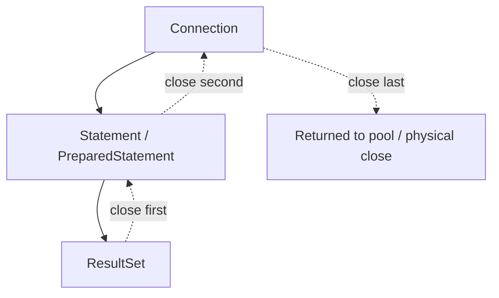
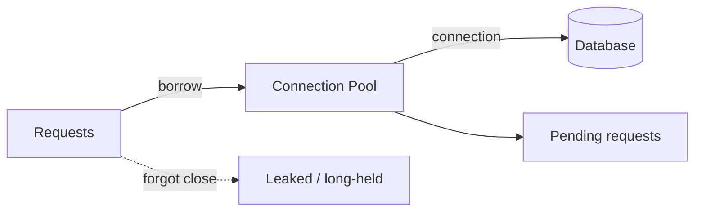
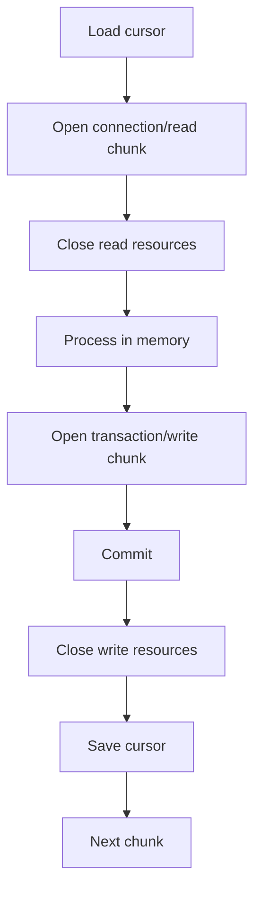

# Part 014 — JDBC Resource Lifecycle

> Resource lifecycle adalah bagian data access yang paling tidak glamor, tetapi paling sering menghancurkan production.
>
> Query benar, mapping benar, transaction benar—tetapi kalau `Connection` tidak dikembalikan, `ResultSet` tetap terbuka, stream keluar dari boundary, atau transaction menggantung, sistem akan mati pelan-pelan.
>
> Gejalanya biasanya terlihat seperti:
>
> - connection pool habis;
> - request menggantung;
> - thread menumpuk;
> - database session idle in transaction;
> - lock tidak lepas;
> - memory naik;
> - timeout meningkat;
> - retry memperparah beban;
> - batch job membuat API lambat.

Part ini membahas lifecycle resource JDBC secara disiplin.

---

## 1. Core Thesis

JDBC resource punya dependency chain:

```txt
Connection
  owns Statement / PreparedStatement
    owns ResultSet
```

Lifecycle harus mengikuti urutan:

```txt
open connection
  open statement
    open result set
    close result set
  close statement
close connection
```

Diagram:



Dalam aplikasi pooled, `connection.close()` biasanya mengembalikan connection ke pool, bukan menutup socket fisik. Tetapi aturan aplikasi tetap sama:

```txt
If you borrow it, close it.
```

---

## 2. The Three Critical Resources

| Resource | Meaning | Must Close? |
|---|---|---|
| `Connection` | transaction/session handle ke database | yes |
| `Statement` / `PreparedStatement` | SQL execution handle | yes |
| `ResultSet` | cursor/result handle | yes |

Tambahan:

- `CallableStatement`;
- stream dari BLOB/CLOB;
- generated keys `ResultSet`;
- framework cursor/stream;
- database-specific objects.

Jika resource dibuka di method, method harus menutupnya atau mengembalikan object dengan lifecycle contract yang eksplisit.

---

## 3. try-with-resources Is the Default

Pola dasar query:

```java
public Optional<CaseFileRow> findById(UUID id) {
    String sql = """
        select id, case_number, status, created_at
        from case_file
        where id = ?
        """;

    try (
        Connection connection = dataSource.getConnection();
        PreparedStatement ps = connection.prepareStatement(sql)
    ) {
        ps.setObject(1, id);

        try (ResultSet rs = ps.executeQuery()) {
            if (!rs.next()) {
                return Optional.empty();
            }

            return Optional.of(mapRow(rs));
        }
    } catch (SQLException e) {
        throw translator.translate("CaseFile.findById", e);
    }
}
```

Pola update:

```java
public void updateStatus(UUID id, CaseStatus status) {
    String sql = """
        update case_file
        set status = ?
        where id = ?
        """;

    try (
        Connection connection = dataSource.getConnection();
        PreparedStatement ps = connection.prepareStatement(sql)
    ) {
        ps.setString(1, status.dbCode());
        ps.setObject(2, id);

        int updated = ps.executeUpdate();
        if (updated != 1) {
            throw new CaseUpdateConflict(id);
        }
    } catch (SQLException e) {
        throw translator.translate("CaseFile.updateStatus", e);
    }
}
```

---

## 4. Close Order

try-with-resources closes in reverse order of declaration.

```java
try (
    Connection connection = dataSource.getConnection();
    PreparedStatement ps = connection.prepareStatement(sql);
    ResultSet rs = ps.executeQuery()
) {
    ...
}
```

Close order:

```txt
rs.close()
ps.close()
connection.close()
```

But this form only works when no parameter binding is needed before `executeQuery`.

For prepared statements with parameters:

```java
try (
    Connection connection = dataSource.getConnection();
    PreparedStatement ps = connection.prepareStatement(sql)
) {
    ps.setObject(1, id);

    try (ResultSet rs = ps.executeQuery()) {
        ...
    }
}
```

This still closes in correct order.

---

## 5. The Most Common Leak

Bad:

```java
Connection connection = dataSource.getConnection();
PreparedStatement ps = connection.prepareStatement(sql);
ResultSet rs = ps.executeQuery();

while (rs.next()) {
    ...
}

return result;
```

If exception occurs before close, resources leak.

Slightly less bad but still risky:

```java
Connection connection = null;
try {
    connection = dataSource.getConnection();
    ...
} finally {
    connection.close();
}
```

This can still leak statement/result if not carefully closed.

Use try-with-resources.

---

## 6. Connection Leak Mental Model

Connection leak means application borrowed connection and did not return it.

In pool terms:

```txt
pool size = 20
20 leaked/long-held connections
next request waits
connection acquisition timeout
system appears down
```

Diagram:



Symptoms:

- active connection count stuck high;
- idle connection count low/zero;
- pending acquisition grows;
- request latency spikes;
- database may not be busy;
- thread dump shows waiting for connection;
- leak detector logs stack trace if configured;
- "idle in transaction" sessions in DB.

A connection held too long is operationally similar to a leak.

---

## 7. Long-Held Connection Is a Soft Leak

Even if eventually closed, a connection held during slow non-DB work can exhaust pool.

Bad:

```java
try (Connection connection = dataSource.getConnection()) {
    CaseFileRow row = loadCase(connection, id);

    externalService.call(row); // holds connection while doing network I/O

    updateCase(connection, id);
}
```

Better:

```java
CaseFileRow row;
try (Connection connection = dataSource.getConnection()) {
    row = loadCase(connection, id);
}

ExternalResult result = externalService.call(row);

try (Connection connection = dataSource.getConnection()) {
    updateCaseWithResult(connection, id, result);
}
```

But if consistency requires atomic DB changes and external call, redesign with outbox/workflow. Do not hold DB connection while waiting on arbitrary network calls.

---

## 8. Transaction Holds Connection

A transaction holds a connection until commit/rollback.

```java
connection.setAutoCommit(false);
...
connection.commit();
```

During transaction:

- connection is not available to other requests;
- locks may be held;
- snapshot may be held;
- open cursors may exist;
- session state may be modified.

Keep transaction short.

Bad:

```java
@Transactional
public void approveAndGenerateReport(...) {
    updateDatabase();
    generateLargePdf(); // slow
    uploadFile();       // slow
    sendEmail();        // slow
}
```

Better:

```txt
transaction:
  update database
  insert audit
  insert outbox

after commit:
  worker generates report
  worker uploads/sends
```

---

## 9. ResultSet Lifecycle

`ResultSet` often depends on active statement and connection.

Do not return `ResultSet` from DAO:

```java
public ResultSet findOpenCases() {
    Connection c = dataSource.getConnection();
    PreparedStatement ps = c.prepareStatement(SQL);
    return ps.executeQuery(); // terrible lifecycle
}
```

Who closes statement? Who closes connection? What if caller forgets?

Better:

```java
public List<CaseRow> findOpenCases(int limit) {
    try (...) {
        try (ResultSet rs = ps.executeQuery()) {
            ...
        }
    }
}
```

Or callback pattern for streaming:

```java
public void forEachOpenCase(int limit, CaseRowConsumer consumer) {
    try (...) {
        try (ResultSet rs = ps.executeQuery()) {
            while (rs.next()) {
                consumer.accept(mapRow(rs));
            }
        }
    }
}
```

But callback must not escape row/resource.

---

## 10. Stream Returning Is Dangerous

Bad:

```java
public Stream<CaseRow> streamOpenCases() {
    Connection connection = dataSource.getConnection();
    PreparedStatement ps = connection.prepareStatement(SQL);
    ResultSet rs = ps.executeQuery();

    return StreamSupport.stream(...);
}
```

This requires caller to close stream to release DB resource. Many callers forget.

If you return stream, contract must be explicit:

```java
try (Stream<CaseRow> stream = caseQuery.streamOpenCases()) {
    stream.forEach(...);
}
```

But implementing this correctly is hard.

For most application code, prefer:

- bounded list;
- chunking;
- callback with internal lifecycle;
- batch job reader abstraction;
- framework-managed stream with documented close behavior.

---

## 11. Callback Pattern

```java
public void scanOpenCases(int fetchSize, CaseRowHandler handler) {
    String sql = """
        select id, case_number, status
        from case_file
        where status = ?
        order by id
        """;

    try (
        Connection connection = dataSource.getConnection();
        PreparedStatement ps = connection.prepareStatement(sql)
    ) {
        ps.setFetchSize(fetchSize);
        ps.setString(1, "OPEN");

        try (ResultSet rs = ps.executeQuery()) {
            while (rs.next()) {
                handler.handle(mapRow(rs));
            }
        }
    } catch (SQLException e) {
        throw translator.translate("CaseFile.scanOpenCases", e);
    }
}

@FunctionalInterface
public interface CaseRowHandler {
    void handle(CaseRow row);
}
```

Caveat: handler runs while connection/result set is open. Handler must not:

- perform slow external I/O;
- call back into same database in uncontrolled way;
- accumulate unbounded memory;
- throw unchecked exceptions without expectation.

If handler throws, try-with-resources still closes resource.

---

## 12. Chunking Pattern

Chunking often beats streaming for operational control.

```java
public List<CaseBackfillRow> readAfter(UUID lastSeenId, int limit) {
    String sql = """
        select id, status, updated_at
        from case_file
        where id > ?
        order by id
        limit ?
        """;

    ...
}
```

Job:

```java
UUID cursor = loadCursor();

while (true) {
    List<CaseBackfillRow> rows = reader.readAfter(cursor, 500);
    if (rows.isEmpty()) {
        break;
    }

    writer.writeChunk(rows);

    cursor = rows.get(rows.size() - 1).id();
    saveCursor(cursor);
}
```

Benefits:

- each query bounded;
- each transaction bounded;
- connection returned between chunks;
- progress durable;
- easier retry;
- easier throttling;
- easier observability.

For large production jobs, chunking is usually safer than one long streaming transaction.

---

## 13. Statement Lifecycle

A `PreparedStatement` should be method-scoped.

Do not store as field:

```java
public final class BadDao {
    private final PreparedStatement findById; // bad
}
```

Problems:

- tied to one connection;
- not thread-safe;
- connection lifecycle broken;
- transaction boundary broken;
- stale after connection failure;
- parameter state confusion.

Better:

```java
try (PreparedStatement ps = connection.prepareStatement(SQL)) {
    ...
}
```

Let driver/pool handle statement caching if configured. Do not manually cache statement object at DAO level.

---

## 14. Generated Keys ResultSet Lifecycle

Generated keys also return `ResultSet`.

```java
try (PreparedStatement ps = connection.prepareStatement(
        SQL,
        Statement.RETURN_GENERATED_KEYS
)) {
    ps.executeUpdate();

    try (ResultSet keys = ps.getGeneratedKeys()) {
        if (!keys.next()) {
            throw new DataAccessInvariantViolation("No generated key");
        }
        return keys.getLong(1);
    }
}
```

Do not forget to close generated keys result set.

---

## 15. CallableStatement Lifecycle

Stored procedure call:

```java
try (
    Connection connection = dataSource.getConnection();
    CallableStatement cs = connection.prepareCall("{ call close_expired_cases(?) }")
) {
    cs.setObject(1, now);
    cs.execute();
}
```

If procedure returns result sets, close them as well.

Stored procedures can hold locks/transactions internally. Understand whether procedure commits, rolls back, or participates in caller transaction depending database/procedure design.

---

## 16. BLOB/CLOB Stream Lifecycle

If reading binary/text large object:

```java
try (
    Connection connection = dataSource.getConnection();
    PreparedStatement ps = connection.prepareStatement(SQL)
) {
    ps.setObject(1, documentId);

    try (ResultSet rs = ps.executeQuery()) {
        if (!rs.next()) {
            throw new NotFound();
        }

        try (InputStream in = rs.getBinaryStream("content")) {
            process(in);
        }
    }
}
```

The stream may depend on result set/connection. Do not return `InputStream` without lifecycle contract.

For large files, often prefer object storage and store metadata in DB.

---

## 17. Pooled Connection State

When using pool, `Connection` may be wrapper.

State that can leak if not reset:

- auto-commit;
- transaction isolation;
- read-only flag;
- catalog/schema;
- session variables;
- role;
- timezone setting;
- statement timeout setting;
- lock timeout setting;
- temporary tables;
- open transaction;
- warnings;
- holdability.

Good pool should reset many things. Good application should still:

- commit/rollback explicitly;
- restore changed state when doing manual JDBC;
- prefer transaction-local settings;
- avoid arbitrary session mutation.

---

## 18. Auto-Commit State Leak

Bad:

```java
Connection connection = dataSource.getConnection();
connection.setAutoCommit(false);
// exception before reset/close
```

If pool returns connection without reset, next borrower may unexpectedly operate with auto-commit false.

Try-with-resources plus finally restore:

```java
try (Connection connection = dataSource.getConnection()) {
    boolean oldAutoCommit = connection.getAutoCommit();

    try {
        connection.setAutoCommit(false);
        ...
        connection.commit();
    } catch (Exception ex) {
        connection.rollback();
        throw ex;
    } finally {
        connection.setAutoCommit(oldAutoCommit);
    }
}
```

Framework transaction managers do this for you, but manual code must be disciplined.

---

## 19. Isolation State Leak

```java
int oldIsolation = connection.getTransactionIsolation();

try {
    connection.setTransactionIsolation(Connection.TRANSACTION_SERIALIZABLE);
    connection.setAutoCommit(false);
    ...
} finally {
    connection.setTransactionIsolation(oldIsolation);
}
```

If a connection returns to pool at serializable isolation accidentally, later operations may become slower or fail with more serialization conflicts.

---

## 20. ReadOnly State Leak

```java
boolean oldReadOnly = connection.isReadOnly();

try {
    connection.setReadOnly(true);
    ...
} finally {
    connection.setReadOnly(oldReadOnly);
}
```

If read-only leaks, later write may fail unexpectedly.

Again, pools/frameworks may reset, but explicit lifecycle is safer in infrastructure code.

---

## 21. Session Variable Leak

Database-specific:

```sql
set statement_timeout = '5s'
```

This may persist for session. In pooled connection, session persists across borrowers.

Prefer transaction-local setting if available:

```sql
set local statement_timeout = '5s'
```

Or restore explicitly:

```sql
set statement_timeout = default
```

Encapsulate:

```java
public void withLocalStatementTimeout(
        Connection connection,
        Duration timeout,
        SqlRunnable work
) throws SQLException {
    try (Statement st = connection.createStatement()) {
        st.execute("set local statement_timeout = '" + timeout.toMillis() + "ms'");
    }

    work.run();
}
```

The example is conceptually PostgreSQL-style; for production, avoid string concatenation even for settings unless value is internal and formatted safely.

---

## 22. Warnings Lifecycle

JDBC can expose warnings:

```java
SQLWarning warning = connection.getWarnings();
while (warning != null) {
    log.warn("SQL warning state={} code={} message={}",
            warning.getSQLState(),
            warning.getErrorCode(),
            warning.getMessage());
    warning = warning.getNextWarning();
}

connection.clearWarnings();
```

Most application code ignores warnings. That is usually fine, but for migration tools, diagnostic tools, or unusual database features, warnings can matter.

---

## 23. Statement Cancellation

JDBC `Statement` has `cancel()`.

```java
statement.cancel();
```

This attempts to cancel execution. Whether it works promptly depends driver/database.

Use cases:

- request cancellation;
- deadline exceeded;
- admin abort;
- worker shutdown.

Pattern with Future is tricky because JDBC is blocking.

```java
Future<?> future = executor.submit(() -> runQuery(statement));

if (!future.get(timeout, TimeUnit.SECONDS)) {
    statement.cancel();
}
```

But in modern application, prefer setting query timeout and request deadline rather than building ad-hoc cancellation per query.

---

## 24. Query Timeout Lifecycle

```java
try (PreparedStatement ps = connection.prepareStatement(SQL)) {
    ps.setQueryTimeout(2);
    ...
}
```

Timeout should be set before execution.

Timeout policy should align:

```txt
request timeout > transaction timeout > query timeout > lock timeout maybe
```

If query timeout occurs:

- statement may be canceled;
- transaction may need rollback;
- connection state may need cleanup;
- error classification matters.

Do not continue using transaction after timeout unless you know database behavior and state.

---

## 25. Resource Lifecycle Under Exception

try-with-resources closes resources even when exception thrown.

```java
try (
    Connection connection = dataSource.getConnection();
    PreparedStatement ps = connection.prepareStatement(SQL)
) {
    throw new RuntimeException("boom");
}
```

`ps.close()` and `connection.close()` are called.

If close itself fails, Java adds close exception as suppressed to original exception.

You can inspect:

```java
for (Throwable suppressed : ex.getSuppressed()) {
    log.warn("Suppressed during resource close", suppressed);
}
```

This is another reason try-with-resources is superior to manual close.

---

## 26. Suppressed Exceptions

Example:

```java
try (Resource r = open()) {
    throw new WorkException();
}
```

If `r.close()` throws, close exception becomes suppressed.

For JDBC, suppressed close exceptions can matter during incident analysis.

Logging frameworks usually log suppressed exceptions if full stack trace logged.

Do not replace exceptions carelessly and lose suppressed information.

---

## 27. Transaction Cleanup with try-with-resources

Transaction needs explicit commit/rollback plus resource close.

```java
try (Connection connection = dataSource.getConnection()) {
    boolean oldAutoCommit = connection.getAutoCommit();
    connection.setAutoCommit(false);

    try {
        doWork(connection);
        connection.commit();
    } catch (Exception ex) {
        rollbackSuppressing(connection, ex);
        throw ex;
    } finally {
        connection.setAutoCommit(oldAutoCommit);
    }
}
```

Do not rely on `connection.close()` to rollback.

---

## 28. Resource Lifecycle in DAO Composition

If use case owns transaction, DAO must not close connection it did not open.

```java
public void insert(Connection connection, AuditRow row) {
    try (PreparedStatement ps = connection.prepareStatement(SQL)) {
        ...
    }
}
```

DAO closes statement, not connection.

Rule:

```txt
The component that opens the resource owns closing it.
```

If method receives `Connection`, it should not close it.

Bad:

```java
public void insert(Connection connection, AuditRow row) {
    try (connection) { // closes caller connection - bad
        ...
    }
}
```

---

## 29. Resource Ownership Contract

Document method contract:

```java
/**
 * Uses the provided connection but does not close it.
 * Opens and closes its own PreparedStatement.
 * Participates in caller transaction.
 */
public void insert(Connection connection, AuditRow row) { ... }
```

For methods that open connection:

```java
/**
 * Borrows and closes its own connection.
 * Executes as independent auto-commit operation unless DataSource is transaction-aware.
 */
public Optional<CaseRow> findById(UUID id) { ... }
```

In framework-managed code, connection ownership may be hidden, but concept still applies.

---

## 30. Mixing Manual and Framework Lifecycle

Dangerous:

```java
@Transactional
public void approve(...) {
    try (Connection c = dataSource.getConnection()) {
        // may or may not participate in framework transaction depending DataSource/proxy
    }
}
```

In Spring, transaction-aware datasource/proxy can bind connection, but raw datasource access can bypass transaction if configured incorrectly.

Rule:

```txt
If using framework transaction management, use the framework-approved data access abstraction or transaction-aware DataSource.
```

Do not mix manual transaction and framework transaction casually.

---

## 31. Open Session in View Analogy

In ORM systems, "Open Session in View" keeps persistence session open through web rendering/serialization. JDBC equivalent would be keeping connection/result lifecycle beyond application boundary.

Risk:

- lazy loading during serialization;
- hidden DB access;
- connection held during response rendering;
- errors after business transaction;
- unpredictable query count.

For data access design, close DB resource before leaving application/service boundary unless you intentionally stream response.

---

## 32. HTTP Streaming and DB Resource

Sometimes endpoint streams DB result to HTTP response.

```txt
DB ResultSet -> HTTP response
```

This holds connection for duration of client download. If client slow, connection held long.

Risks:

- pool exhaustion;
- transaction open;
- timeout;
- partial response;
- retry complexity;
- DB cursor held;
- user cancellation.

Alternative:

- async export job;
- write file to object storage;
- return download link;
- chunk and buffer outside DB transaction.

Direct DB-to-HTTP streaming should be rare and bounded.

---

## 33. Batch Job Resource Lifecycle

Batch job should own lifecycle clearly:



Avoid:

- one connection for entire job;
- one transaction for entire dataset;
- result set open while doing slow CPU/network work;
- cursor save outside consistency boundary without thought.

---

## 34. Resource Lifecycle and Backpressure

If data access code reads rows faster than downstream can process, memory grows.

Bad:

```java
List<Row> rows = query.findAll();
for (Row row : rows) {
    slowProcess(row);
}
```

Better:

- bounded page;
- chunk processing;
- callback with controlled processing;
- queue with bounded capacity;
- separate reader/writer with backpressure;
- avoid unbounded collection.

Resource lifecycle is not only close. It includes memory lifecycle.

---

## 35. Memory Lifecycle of Result Mapping

Mapping 1 million rows into list:

```java
List<Row> rows = new ArrayList<>();
while (rs.next()) {
    rows.add(mapRow(rs));
}
```

This can exhaust heap.

Use:

- `limit`;
- chunking;
- streaming with callback;
- file writer per row;
- batch processing;
- cursor pagination.

If API returns list, enforce maximum.

```java
int limit = Math.min(request.limit(), 500);
```

---

## 36. Fetch Size Lifecycle

`setFetchSize` is hint.

```java
ps.setFetchSize(500);
```

But actual behavior depends driver/database.

For some drivers, fetch size only works:

- with auto-commit false;
- with forward-only result set;
- with specific connection properties;
- with cursor mode enabled.

Do not assume. Test memory and network behavior with production database/driver.

Part 016 will go deeper on streaming large results.

---

## 37. Cursor Holdability

JDBC supports result set holdability across commit:

```java
connection.getHoldability();
```

Most application code should avoid relying on cursor hold over commit. It is database/driver-specific and complicates lifecycle.

Simpler:

```txt
Read chunk.
Close result.
Process/write.
Commit.
Repeat.
```

---

## 38. Statement Pooling vs Resource Close

Some pools/drivers cache prepared statements. You still close your `PreparedStatement`.

```java
try (PreparedStatement ps = connection.prepareStatement(SQL)) {
    ...
}
```

Close may return statement to cache rather than physically destroy it.

Application rule unchanged:

```txt
Close statement you opened.
```

Do not keep statement open to "optimize". Let driver/pool handle caching.

---

## 39. Connection Validation

Pools validate connections. Manual JDBC utility may need validation:

```java
boolean valid = connection.isValid(2);
```

In application DAO, usually do not call `isValid` before every query. It adds overhead and pool manages stale connection detection.

If query fails due to stale connection, classify as connection failure and allow retry if safe.

---

## 40. Leak Detection

Connection pools often have leak detection. Conceptually:

```txt
If connection checked out longer than threshold, log stack trace where borrowed.
```

Use it carefully:

- threshold too low creates noise;
- threshold too high misses issue;
- long legitimate queries can trigger;
- logs must be actionable.

Leak detection is diagnostic, not substitute for correct lifecycle.

Metrics to watch:

```txt
active connections
idle connections
pending threads
connection acquisition time
connection usage duration
leak detections
transaction duration
query duration
```

---

## 41. Database-Side Diagnostics

DB can reveal resource lifecycle bugs:

| DB Symptom | Possible Cause |
|---|---|
| idle in transaction | transaction opened but not committed/rolled back |
| many active sessions same query | slow query or stuck callers |
| lock wait | long transaction/blocked update |
| open cursors high | result/statement not closed |
| temp files high | large sort/hash due query |
| connection count high | pool too large/leak |
| old snapshots | long read transaction |
| prepared statement bloat | statement caching misuse |

App and DB metrics must be correlated via query name/comment and connection/user/application name where possible.

---

## 42. Resource Lifecycle and Query Name

Add query comments:

```sql
/* query=CaseDashboard.search */
select ...
```

If database shows long-running query, you know owner.

Without query naming, incident response becomes grep archaeology.

Do not include sensitive bind values in comments.

---

## 43. Resource Lifecycle and Thread Interruption

JDBC blocking calls may not respond to thread interruption reliably.

If request is canceled:

- app thread may be interrupted;
- JDBC driver may continue query;
- connection remains busy until query returns/cancel/timeout;
- transaction may still need rollback.

Therefore set query timeout and transaction timeout. Do not rely only on thread interruption.

---

## 44. Resource Lifecycle and Application Shutdown

During shutdown:

- stop accepting new work;
- let in-flight transaction finish within grace period;
- cancel/timeout long jobs;
- close data source/pool;
- ensure batch cursor consistent;
- do not kill process mid-transaction if avoidable.

Batch workers should handle interruption:

```java
while (!shutdownRequested()) {
    processNextChunk();
}
```

Do not leave cursor advanced before chunk commit.

---

## 45. Resource Lifecycle and Virtual Threads

Virtual threads make blocking JDBC cheaper at thread level, but not at database resource level.

If 10,000 virtual threads call database and pool has 50 connections:

```txt
50 active DB connections
9,950 waiting for connection
```

Virtual threads do not remove need for:

- connection pool sizing;
- timeouts;
- backpressure;
- bounded query;
- transaction discipline.

A virtual thread waiting for DB connection is cheap, but the request still waits and may overload upstream.

---

## 46. Resource Lifecycle and Async Code

Do not wrap blocking JDBC in unbounded async executor.

Bad:

```java
CompletableFuture.supplyAsync(() -> dao.findAll());
```

If many futures start:

- pool saturates;
- executor saturates;
- memory grows;
- cancellation unclear;
- transaction context lost.

If using async with JDBC:

- bounded executor;
- separate pool if needed;
- explicit timeout;
- context propagation;
- backpressure;
- do not assume non-blocking.

---

## 47. Resource Lifecycle and R2DBC Contrast

R2DBC has different resource lifecycle, but same concepts:

- connection must be acquired/released;
- result must be consumed/canceled;
- transaction must commit/rollback;
- backpressure matters;
- timeout matters.

Do not think reactive automatically solves database resource lifecycle. It changes mechanics, not physics.

---

## 48. Safe DAO Lifecycle Template

```java
public final class SafeJdbcDao {
    private final DataSource dataSource;
    private final SqlExceptionTranslator translator;

    public List<CaseRow> findOpenCases(int limit) {
        String operation = "CaseFile.findOpenCases";

        String sql = """
            /* query=CaseFile.findOpenCases */
            select id, case_number, status, updated_at
            from case_file
            where status = ?
            order by updated_at desc, id desc
            limit ?
            """;

        try (
            Connection connection = dataSource.getConnection();
            PreparedStatement ps = connection.prepareStatement(sql)
        ) {
            ps.setQueryTimeout(2);
            ps.setString(1, "OPEN");
            ps.setInt(2, Math.min(limit, 500));

            List<CaseRow> result = new ArrayList<>();

            try (ResultSet rs = ps.executeQuery()) {
                while (rs.next()) {
                    result.add(mapRow(rs));
                }
            }

            return result;
        } catch (SQLException e) {
            throw translator.translate(operation, e);
        }
    }
}
```

Characteristics:

- bounded result;
- query name;
- timeout;
- try-with-resources;
- explicit mapping;
- exception translation;
- no resource escape.

---

## 49. Safe Transaction Lifecycle Template

```java
public <T> T execute(TransactionCallback<T> callback) {
    try (Connection connection = dataSource.getConnection()) {
        ConnectionState previous = ConnectionState.capture(connection);

        try {
            connection.setAutoCommit(false);

            T result = callback.doInTransaction(connection);

            connection.commit();
            return result;
        } catch (SQLException | RuntimeException ex) {
            rollbackSuppressing(connection, ex);
            throw translateIfSql(ex);
        } finally {
            previous.restore(connection);
        }
    } catch (SQLException e) {
        throw translator.translate("JdbcTransaction.execute", e);
    }
}
```

Review this kind of infrastructure carefully. Mistakes here affect all data access.

---

## 50. Resource Lifecycle in Repository Methods

If repository participates in caller transaction:

```java
public final class JdbcCaseFileRepository {
    public Optional<CaseFile> findById(Connection connection, CaseFileId id) {
        try (PreparedStatement ps = connection.prepareStatement(SQL)) {
            ...
        }
    }

    public void save(Connection connection, CaseFile caseFile) {
        try (PreparedStatement ps = connection.prepareStatement(SQL)) {
            ...
        }
    }
}
```

If repository opens its own connection, it owns independent lifecycle:

```java
public Optional<CaseFile> findById(CaseFileId id) {
    try (Connection connection = dataSource.getConnection()) {
        return findById(connection, id);
    }
}
```

Be explicit which method is used where.

---

## 51. Resource Lifecycle and Reusable Helper

```java
public final class JdbcExecutor {
    private final DataSource dataSource;
    private final SqlExceptionTranslator translator;

    public <T> T query(
            String operation,
            String sql,
            SqlBinder binder,
            ResultSetExtractor<T> extractor
    ) {
        try (
            Connection connection = dataSource.getConnection();
            PreparedStatement ps = connection.prepareStatement(sql)
        ) {
            binder.bind(ps);

            try (ResultSet rs = ps.executeQuery()) {
                return extractor.extract(rs);
            }
        } catch (SQLException e) {
            throw translator.translate(operation, e);
        }
    }
}

@FunctionalInterface
public interface SqlBinder {
    void bind(PreparedStatement ps) throws SQLException;
}

@FunctionalInterface
public interface ResultSetExtractor<T> {
    T extract(ResultSet rs) throws SQLException;
}
```

Use carefully. Generic helper should not hide query ownership.

---

## 52. ResultSetExtractor vs RowMapper

`RowMapper` maps current row.

```java
T mapRow(ResultSet rs)
```

`ResultSetExtractor` owns cursor traversal.

```java
T extract(ResultSet rs)
```

Use `ResultSetExtractor` for:

- single optional row;
- grouping one-to-many;
- aggregate assembly;
- custom validation of duplicate rows;
- streaming into writer.

Example:

```java
public Optional<CaseRow> extractSingle(ResultSet rs) throws SQLException {
    if (!rs.next()) {
        return Optional.empty();
    }

    CaseRow row = mapper.mapRow(rs);

    if (rs.next()) {
        throw new DataIntegrityException("Expected one row");
    }

    return Optional.of(row);
}
```

---

## 53. Resource Lifecycle and File Export

Bad:

```java
List<ExportRow> rows = query.findAllForExport();
writeCsv(rows);
```

Better:

```java
exportQuery.writeRows(filter, writer);
```

But writer processing occurs while DB resources open. If writer writes to slow network, connection held.

Better for huge export:

```txt
read chunk from DB
close DB resources
write chunk to file/storage
repeat
```

If snapshot consistency needed, design separately:

- export from read replica snapshot;
- materialized export table;
- job locks dataset version;
- transaction snapshot with acceptable duration;
- database-specific cursor export.

---

## 54. Resource Lifecycle and Large Object Export

If exporting large data:

- don't keep transaction open while uploading to remote storage;
- write local temp file then upload;
- or stage export rows in table;
- or use database copy mechanism with controlled connection;
- record job status;
- handle cancellation.

Resource lifecycle must include file handles too:

```java
try (
    BufferedWriter writer = Files.newBufferedWriter(path);
    Connection connection = dataSource.getConnection();
    PreparedStatement ps = connection.prepareStatement(SQL)
) {
    ...
}
```

Close file and DB resources deterministically.

---

## 55. Resource Lifecycle and Lock Release

Locks release on commit/rollback.

If transaction not ended:

```txt
locks remain
other transactions wait
timeout/deadlock
```

If you see lock waits, ask:

- which transaction holds lock?
- how long has connection been idle in transaction?
- what code path opened transaction?
- is external call inside transaction?
- is result set streaming slowly?
- is batch chunk too large?
- is missing index causing broad locks?

Lock lifecycle is transaction lifecycle.

---

## 56. Resource Lifecycle and `idle in transaction`

`idle in transaction` means connection started transaction and is doing nothing without commit/rollback.

Causes:

- code returned early without rollback;
- exception swallowed;
- waiting for external call;
- debugging breakpoint;
- stream not consumed;
- framework transaction scope too broad;
- manual transaction template bug.

Impact:

- locks held;
- snapshot held;
- vacuum/cleanup blocked in some DBs;
- connection occupied;
- other queries blocked.

Fix by:

- try/finally rollback;
- shorter transaction scope;
- timeout;
- no external calls inside transaction;
- monitoring.

---

## 57. Resource Lifecycle and Early Return

Manual code with early return can skip cleanup if not structured.

Bad:

```java
Connection c = dataSource.getConnection();
c.setAutoCommit(false);

if (!allowed) {
    return; // connection leaked, transaction open
}

...
```

With try-with-resources/finally:

```java
try (Connection c = dataSource.getConnection()) {
    c.setAutoCommit(false);

    try {
        if (!allowed) {
            c.rollback();
            return;
        }

        ...
        c.commit();
    } catch (Exception ex) {
        c.rollback();
        throw ex;
    }
}
```

Better: validate before transaction if possible. If validation needs DB state, keep structured cleanup.

---

## 58. Resource Lifecycle and Exception Translation Order

If you translate exception before closing resources, close still must happen.

try-with-resources:

```java
try (...) {
    ...
} catch (SQLException e) {
    throw translator.translate(operation, e);
}
```

Resources close before catch block executes? In Java, resources are closed after try block exits and before catch/finally completes. The caught exception includes suppressed close exceptions.

This is good.

Manual:

```java
try {
    ...
} catch (SQLException e) {
    throw translate(e); // finally still runs if present
} finally {
    close();
}
```

Do not put translation in a way that bypasses finally.

---

## 59. Resource Lifecycle and Metrics

Measure:

```txt
connection acquisition duration
connection usage duration
statement execution duration
result mapping duration
rows returned
transaction duration
commit duration
rollback count
open result scan duration
batch chunk duration
```

Why mapping duration? Sometimes query is fast but mapping/serialization is slow while connection remains open. Move heavy processing after closing if possible.

Example:

```txt
DB execute: 80ms
Result mapping: 2200ms
Connection held: 2280ms
```

Maybe result too large or mapper doing too much.

---

## 60. Resource Lifecycle Instrumentation

Wrapper concept:

```java
long acquiredAt = System.nanoTime();

try (Connection connection = dataSource.getConnection()) {
    long acquisitionNanos = System.nanoTime() - acquiredAt;

    long usageStart = System.nanoTime();
    try {
        return work(connection);
    } finally {
        long usageNanos = System.nanoTime() - usageStart;
        metrics.record("db.connection.usage", usageNanos);
        metrics.record("db.connection.acquire", acquisitionNanos);
    }
}
```

Do not add noisy metrics per low-level call without label discipline. Use query/use case names.

---

## 61. Resource Lifecycle Review Checklist

Before accepting JDBC code:

- [ ] Every `Connection` opened in method is closed.
- [ ] Every `PreparedStatement` opened is closed.
- [ ] Every `ResultSet` opened is closed.
- [ ] Generated keys `ResultSet` is closed.
- [ ] BLOB/CLOB stream is closed.
- [ ] DAO does not close caller-owned connection.
- [ ] Transaction always commit or rollback.
- [ ] Rollback failure is preserved.
- [ ] Auto-commit/isolation/read-only restored if changed.
- [ ] Session settings do not leak.
- [ ] No external/network call while holding connection unless explicitly justified.
- [ ] No unbounded result collected into memory.
- [ ] Stream/callback lifecycle is documented.
- [ ] Query timeout is set for critical path.
- [ ] Long batch uses chunking/checkpoint.
- [ ] Metrics can reveal acquisition/usage duration.
- [ ] Tests cover exception path cleanup if custom lifecycle code exists.

---

## 62. Anti-Pattern: Returning Resource Outside Owner

```java
public PreparedStatement prepareFindById() { ... }
public ResultSet queryCases() { ... }
public InputStream loadBlob() { ... }
```

Unless API is explicitly a low-level resource API with close contract, don't do this.

Return data, not open resource.

---

## 63. Anti-Pattern: Doing Heavy Mapping While Connection Open

```java
while (rs.next()) {
    Row row = mapRow(rs);
    expensiveJsonTransformation(row); // slow CPU while connection open
}
```

Better:

- map minimal row list within bound, close connection, transform after;
- or chunk;
- or move transformation outside DB lifecycle.

If result huge, use chunk pipeline.

---

## 64. Anti-Pattern: One Connection Per Application

```java
static Connection connection;
```

Problems:

- not thread-safe;
- stale connection;
- transaction conflicts;
- no pool;
- failure recovery bad;
- lifecycle impossible.

Use `DataSource`.

---

## 65. Anti-Pattern: Closing DataSource Per Query

```java
try (HikariDataSource ds = createDataSource()) {
    ...
}
```

DataSource/pool is application-scoped, not query-scoped.

Create pool at app startup. Close at app shutdown.

DAO should close `Connection`, not `DataSource`.

---

## 66. Anti-Pattern: Swallow Close Exception Manually

```java
try {
    rs.close();
} catch (Exception ignored) {
}
```

try-with-resources handles suppressed exceptions better.

If manual close required, log carefully.

---

## 67. Anti-Pattern: Holding Connection During User Think Time

Never:

```txt
begin transaction
show form to user
wait for submit
commit
```

Web requests are stateless. Database transaction should not span user interaction.

Use optimistic version/token:

1. GET form reads version.
2. User edits.
3. POST includes version.
4. UPDATE where version = old version.
5. Conflict if changed.

---

## 68. Anti-Pattern: Leaking Transaction Through Lazy Object

If object returned from DAO lazily loads more data later, it may require connection after boundary.

JDBC manual equivalent:

```java
class CaseFile {
    Supplier<List<Action>> lazyActions; // calls database later
}
```

This hides I/O and lifecycle.

Prefer explicit query/load method.

---

## 69. Production Incident Playbook: Pool Exhausted

Symptoms:

```txt
connection acquisition timeout
active=max
idle=0
pending high
DB CPU maybe low
```

Investigate:

1. Are connections leaked?
2. Are transactions long?
3. Are queries slow?
4. Are external calls inside transaction?
5. Are result sets streaming to slow clients?
6. Did batch/report start?
7. Did lock wait spike?
8. Did DB latency increase?
9. Did traffic increase?
10. Did pool size/config change?

Immediate mitigations:

- shed load;
- stop batch/export jobs;
- restart leaking instance if necessary;
- reduce timeout to fail fast;
- identify stack traces via leak detector;
- inspect DB sessions.

Long-term fixes:

- lifecycle cleanup;
- shorter transactions;
- chunking;
- separate pools;
- backpressure;
- query/index tuning;
- observability.

---

## 70. Production Incident Playbook: Idle in Transaction

Investigate DB sessions:

```txt
state=idle in transaction
query=last query
xact_start=long ago
application_name=service instance
```

Possible code:

- transaction started but waiting for external service;
- exception path missed rollback;
- streaming result not consumed;
- debug breakpoint;
- framework transaction around too broad method.

Fix:

- ensure rollback in catch/finally;
- move external call outside;
- set transaction timeout;
- narrow `@Transactional`;
- chunk batch;
- add metric for transaction duration.

---

## 71. Production Incident Playbook: Open Cursors / Too Many Statements

Causes:

- result sets not closed;
- statements not closed;
- streaming APIs not closed;
- generated keys result set leaked;
- procedure returns multiple results not consumed/closed.

Fix:

- try-with-resources;
- review callback/stream code;
- driver/pool statement cache settings;
- integration tests under load;
- DB cursor metrics.

---

## 72. Mini Lab

Review this code:

```java
public List<CaseRow> findCases(String status) throws SQLException {
    Connection c = dataSource.getConnection();
    PreparedStatement ps = c.prepareStatement(
        "select * from case_file where status = ?"
    );
    ps.setString(1, status);

    ResultSet rs = ps.executeQuery();

    List<CaseRow> rows = new ArrayList<>();
    while (rs.next()) {
        rows.add(map(rs));
    }

    return rows;
}
```

Find issues:

1. connection leak;
2. statement leak;
3. result set leak;
4. `select *`;
5. unbounded result;
6. no query timeout;
7. raw SQLException leak;
8. no query name;
9. no deterministic ordering;
10. no max limit.

Rewrite:

```java
public List<CaseRow> findCases(CaseStatus status, int requestedLimit) {
    int limit = Math.min(Math.max(requestedLimit, 1), 500);

    String sql = """
        /* query=CaseFile.findCasesByStatus */
        select id, case_number, status, updated_at
        from case_file
        where status = ?
        order by updated_at desc, id desc
        limit ?
        """;

    try (
        Connection c = dataSource.getConnection();
        PreparedStatement ps = c.prepareStatement(sql)
    ) {
        ps.setQueryTimeout(2);
        ps.setString(1, status.dbCode());
        ps.setInt(2, limit);

        List<CaseRow> rows = new ArrayList<>();

        try (ResultSet rs = ps.executeQuery()) {
            while (rs.next()) {
                rows.add(map(rs));
            }
        }

        return rows;
    } catch (SQLException e) {
        throw translator.translate("CaseFile.findCasesByStatus", e);
    }
}
```

---

## 73. Summary

Resource lifecycle is production reliability.

You must master:

- `Connection`, `Statement`, `PreparedStatement`, `ResultSet` ownership;
- try-with-resources;
- close order;
- connection leaks;
- long-held connection;
- transaction cleanup;
- pooled connection state restoration;
- result set/stream lifecycle;
- generated keys lifecycle;
- BLOB/CLOB stream lifecycle;
- query timeout and cancellation;
- callback vs stream vs chunking;
- no external calls while holding DB resource;
- memory lifecycle for large results;
- leak detection and DB diagnostics;
- idle-in-transaction playbook;
- instrumentation for acquire/usage/query/transaction duration.

Part berikutnya membahas **JDBC Batch and Bulk Write**: `addBatch`, `executeBatch`, chunking, generated keys, partial failure, idempotency, transaction sizing, and memory/lock pressure.

---

## 74. References

- Oracle Java SE `AutoCloseable`: https://docs.oracle.com/en/java/javase/21/docs/api/java.base/java/lang/AutoCloseable.html
- Oracle Java SE `Connection`: https://docs.oracle.com/en/java/javase/21/docs/api/java.sql/java/sql/Connection.html
- Oracle Java SE `Statement`: https://docs.oracle.com/en/java/javase/21/docs/api/java.sql/java/sql/Statement.html
- Oracle Java SE `PreparedStatement`: https://docs.oracle.com/en/java/javase/21/docs/api/java.sql/java/sql/PreparedStatement.html
- Oracle Java SE `ResultSet`: https://docs.oracle.com/en/java/javase/21/docs/api/java.sql/java/sql/ResultSet.html
- Oracle Java SE `SQLWarning`: https://docs.oracle.com/en/java/javase/21/docs/api/java.sql/java/sql/SQLWarning.html
- Oracle Java SE try-with-resources tutorial: https://docs.oracle.com/javase/tutorial/essential/exceptions/tryResourceClose.html
