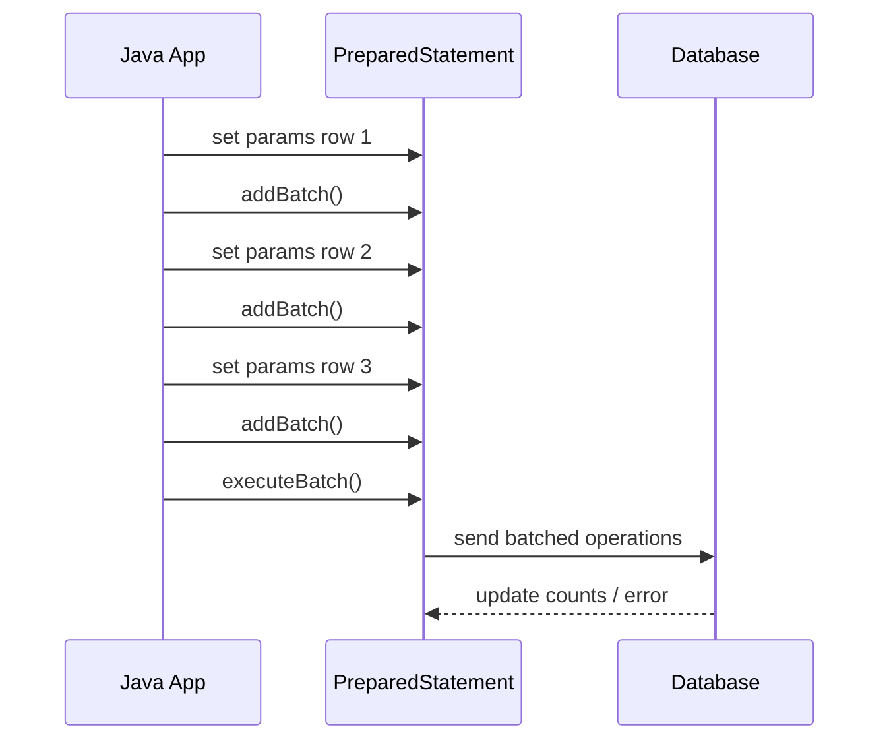
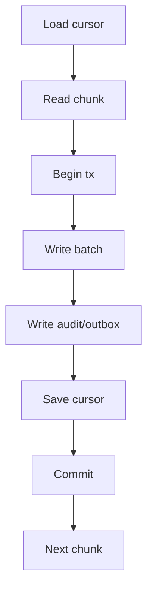
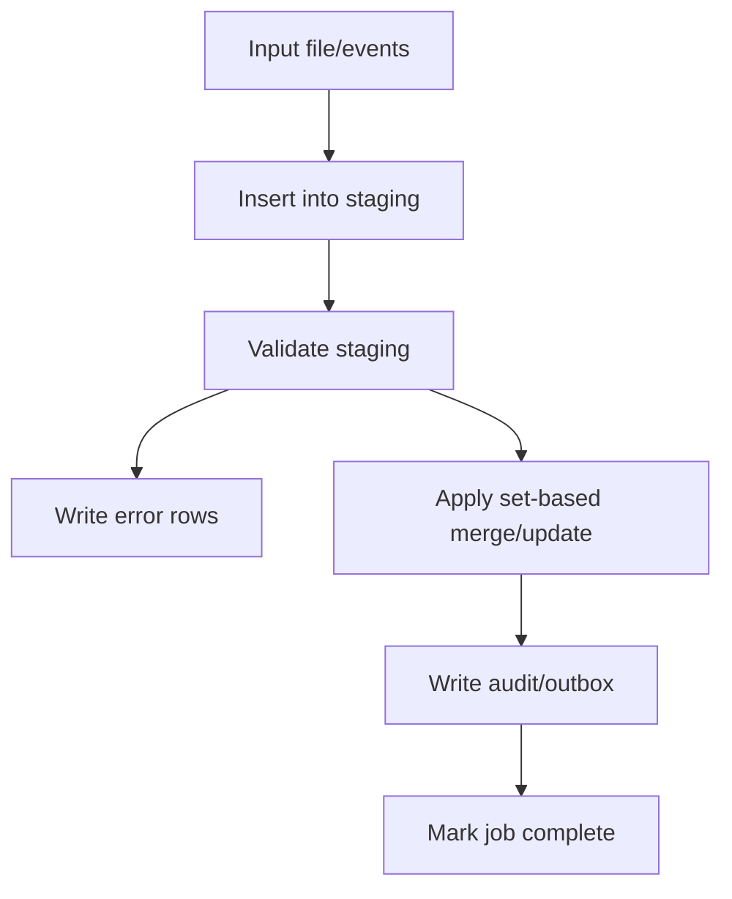

# Part 015 — JDBC Batch and Bulk Write

> Batch bukan sekadar "loop yang lebih cepat".
>
> Batch adalah perubahan cara aplikasi mengirim banyak operasi ke database, dan itu mengubah failure mode:
>
> - berapa banyak row yang masuk satu transaksi;
> - apa yang terjadi saat row ke-327 gagal;
> - apakah retry membuat duplicate;
> - apakah lock ditahan terlalu lama;
> - apakah generated key bisa dipetakan balik;
> - apakah audit/outbox ikut atomic;
> - apakah batch mempercepat sistem atau justru menekan database sampai timeout.

Part ini membahas batch dan bulk write JDBC sebagai primitive production-grade.

---

## 1. Core Thesis

JDBC batch membantu mengurangi round-trip ketika menjalankan banyak statement sejenis.

Tanpa batch:

```txt
for each row:
  send insert
  receive result
```

Dengan batch:

```txt
prepare statement once
bind row 1 -> addBatch
bind row 2 -> addBatch
bind row 3 -> addBatch
executeBatch
receive counts
```

Diagram:



Tetapi batch tidak menghapus kebutuhan desain:

```txt
Correctness first.
Then throughput.
Then convenience.
```

---

## 2. Batch vs Bulk

Istilah sering dicampur. Bedakan:

### Batch

Banyak eksekusi statement yang sama dengan parameter berbeda.

```sql
insert into case_audit_log(id, case_id, action)
values (?, ?, ?)
```

Java:

```java
for (AuditRow row : rows) {
    bind(ps, row);
    ps.addBatch();
}
ps.executeBatch();
```

### Bulk SQL

Satu statement SQL memengaruhi banyak row.

```sql
update case_assignment
set ended_at = ?
where ended_at is null
  and expires_at < ?;
```

### Multi-row Insert

Satu statement insert dengan banyak value tuple.

```sql
insert into case_audit_log(id, case_id, action)
values
  (?, ?, ?),
  (?, ?, ?),
  (?, ?, ?);
```

### Staging Table Pattern

Upload data ke staging table, lalu operasi set-based.

```sql
insert into case_repair_staging(...)
values ...

update case_file c
set risk_level = s.new_risk_level
from case_repair_staging s
where s.case_id = c.id;
```

Masing-masing punya trade-off.

---

## 3. When Batch Makes Sense

Batch cocok ketika:

- banyak row memakai statement shape yang sama;
- setiap row punya parameter berbeda;
- round-trip database menjadi bottleneck;
- operasi bisa di-chunk;
- failure handling jelas;
- idempotency disiapkan;
- transaksi per chunk masuk akal;
- database mampu menerima beban write.

Contoh:

- insert audit rows;
- insert outbox events;
- update status untuk chunk batch job;
- insert import rows;
- mark notifications as delivered;
- backfill derived column;
- persist many child rows for aggregate;
- write job progress records.

Batch tidak cocok jika:

- setiap row butuh SQL berbeda;
- error per row harus langsung dikembalikan detail ke user;
- transaksi akan terlalu besar;
- database sudah saturated;
- operation tidak idempotent;
- side effect external bercampur;
- batch hanya menyembunyikan query buruk.

---

## 4. Basic JDBC Batch Insert

```java
public void insertAuditBatch(Connection connection, List<AuditRow> rows)
        throws SQLException {
    String sql = """
        insert into case_audit_log (
            id,
            command_id,
            case_id,
            actor_id,
            action,
            reason,
            created_at
        )
        values (?, ?, ?, ?, ?, ?, ?)
        """;

    try (PreparedStatement ps = connection.prepareStatement(sql)) {
        for (AuditRow row : rows) {
            int i = 1;
            ps.setObject(i++, row.id());
            ps.setObject(i++, row.commandId());
            ps.setObject(i++, row.caseId());
            ps.setObject(i++, row.actorId());
            ps.setString(i++, row.action());
            ps.setString(i++, row.reason());
            ps.setObject(i++, row.createdAt());

            ps.addBatch();
        }

        int[] counts = ps.executeBatch();

        verifyOneRowPerBatchItem("CaseAudit.insertBatch", counts, rows.size());
    }
}
```

Count verification:

```java
private void verifyOneRowPerBatchItem(
        String operation,
        int[] counts,
        int expectedSize
) {
    if (counts.length != expectedSize) {
        throw new DataAccessInvariantViolation(
                operation + " expected " + expectedSize
                        + " update counts but got " + counts.length
        );
    }

    for (int index = 0; index < counts.length; index++) {
        int count = counts[index];

        if (count == Statement.SUCCESS_NO_INFO) {
            continue;
        }

        if (count != 1) {
            throw new DataAccessInvariantViolation(
                    operation + " item " + index
                            + " expected one affected row but got " + count
            );
        }
    }
}
```

`SUCCESS_NO_INFO` means the command succeeded but exact row count is not available.

---

## 5. Batch Update

```java
public void markAssignmentsExpired(
        Connection connection,
        List<AssignmentExpiryCommand> commands
) throws SQLException {
    String sql = """
        update case_assignment
        set ended_at = ?,
            ended_reason = ?,
            version = version + 1
        where id = ?
          and ended_at is null
          and version = ?
        """;

    try (PreparedStatement ps = connection.prepareStatement(sql)) {
        for (AssignmentExpiryCommand command : commands) {
            int i = 1;
            ps.setObject(i++, command.endedAt());
            ps.setString(i++, "EXPIRED");
            ps.setObject(i++, command.assignmentId());
            ps.setLong(i++, command.expectedVersion());

            ps.addBatch();
        }

        int[] counts = ps.executeBatch();

        for (int index = 0; index < counts.length; index++) {
            int count = counts[index];

            if (count == 0) {
                throw new OptimisticConflict(
                        commands.get(index).assignmentId(),
                        commands.get(index).expectedVersion()
                );
            }

            if (count != 1 && count != Statement.SUCCESS_NO_INFO) {
                throw new DataAccessInvariantViolation(
                        "Assignment expiry item " + index
                                + " affected " + count + " rows"
                );
            }
        }
    }
}
```

Update batch harus tetap mengecek affected rows. Batch bukan alasan untuk kehilangan correctness signal.

---

## 6. Batch Delete

Hard delete batch jarang aman untuk domain penting, tetapi berguna untuk cleanup teknis.

```java
public void deleteOutboxOlderThan(
        Connection connection,
        List<UUID> outboxIds
) throws SQLException {
    String sql = """
        delete from outbox_event
        where id = ?
          and published_at is not null
        """;

    try (PreparedStatement ps = connection.prepareStatement(sql)) {
        for (UUID id : outboxIds) {
            ps.setObject(1, id);
            ps.addBatch();
        }

        int[] counts = ps.executeBatch();
        verifyZeroOrOnePerItem("Outbox.deletePublished", counts);
    }
}
```

For cleanup, `0` might be acceptable if another worker already deleted. Contract harus eksplisit.

---

## 7. Batch Must Be Transactional by Design

Batch tanpa explicit transaction bisa menghasilkan partial commit.

Bad:

```java
try (Connection connection = dataSource.getConnection()) {
    try (PreparedStatement ps = connection.prepareStatement(SQL)) {
        for (...) {
            ps.addBatch();
        }
        ps.executeBatch(); // auto-commit behavior can be dangerous
    }
}
```

Better:

```java
try (Connection connection = dataSource.getConnection()) {
    connection.setAutoCommit(false);

    try {
        insertAuditBatch(connection, rows);
        insertOutboxBatch(connection, events);

        connection.commit();
    } catch (Exception ex) {
        rollbackSuppressing(connection, ex);
        throw ex;
    } finally {
        connection.setAutoCommit(true);
    }
}
```

Dalam framework-managed transaction, batch method menerima connection/session yang ikut transaction.

Rule:

```txt
Batch writes should almost always run inside explicit transaction.
```

Exception: jika partial commit memang sengaja, misalnya fire-and-forget independent cleanup, tetap dokumentasikan.

---

## 8. Chunking Is Mandatory for Large Batches

Jangan batch 1 juta row dalam satu `executeBatch`.

Risiko:

- memory driver/app naik;
- transaction terlalu besar;
- lock ditahan lama;
- WAL/redo/undo pressure;
- replication lag;
- rollback mahal;
- deadlock lebih mungkin;
- timeout;
- database checkpoint pressure;
- error row tunggal menggagalkan terlalu banyak work.

Chunking:

```java
public void insertInChunks(List<AuditRow> rows, int chunkSize) {
    for (int start = 0; start < rows.size(); start += chunkSize) {
        int end = Math.min(start + chunkSize, rows.size());
        List<AuditRow> chunk = rows.subList(start, end);

        tx.execute(options, connection -> {
            auditDao.insertBatch(connection, chunk);
            return null;
        });
    }
}
```

Chunk size tidak ada angka universal.

Mulai dari kisaran kecil-menengah seperti 100–1000 row, lalu ukur:

- latency per chunk;
- DB CPU/IO;
- lock duration;
- replication lag;
- memory;
- error recovery cost.

---

## 9. Chunk Commit and Cursor

Batch job harus menyimpan progress setelah chunk commit.



Cursor bisa disimpan dalam transaksi yang sama dengan write chunk jika progress harus atomic.

```java
tx.execute(options, connection -> {
    writer.writeBatch(connection, rows);
    cursorStore.save(connection, jobName, nextCursor);
    return null;
});
```

Jika cursor disimpan setelah commit dan process crash sebelum cursor save, chunk akan dibaca ulang. Itu aman hanya jika write idempotent.

Preferred mental model:

```txt
Either cursor save is atomic with chunk write,
or chunk write is idempotent and safe to replay.
```

---

## 10. Batch and Idempotency

Batch retry bisa membuat duplicate jika row key tidak stabil.

Bad:

```java
insert into case_audit_log(id, case_id, action)
values (random_uuid(), ?, ?)
```

Jika retry, random UUID berbeda, duplicate audit masuk.

Better:

- deterministic event/audit ID;
- command ID unique;
- unique semantic key;
- upsert/do nothing if duplicate;
- idempotency table.

Example audit unique key:

```sql
create unique index uq_case_audit_command_action
on case_audit_log(command_id, action);
```

Then retry duplicate can be handled.

Outbox event key:

```sql
create unique index uq_outbox_event_key
on outbox_event(event_key);
```

Event key example:

```txt
case-approved:{commandId}
assignment-expired:{assignmentId}:{endedAt}
```

---

## 11. Batch Error: BatchUpdateException

When batch fails:

```java
try {
    ps.executeBatch();
} catch (BatchUpdateException e) {
    int[] counts = e.getUpdateCounts();
    SQLException next = e.getNextException();
    throw translator.translate("CaseAudit.insertBatch", e);
}
```

Important facts:

- counts may represent successful commands before failure;
- failed item index may be inferable but not always straightforward;
- behavior can differ by driver;
- inside transaction, rollback can undo partial success;
- outside transaction, partial success may be committed.

Production response:

```txt
Run batch inside transaction.
On BatchUpdateException, rollback whole chunk.
Classify root cause.
Retry whole chunk only if safe/idempotent.
If row-level recovery needed, split chunk or use staging/validation.
```

---

## 12. Partial Failure Strategies

### Strategy A — Fail Whole Chunk

Use when all rows must be atomic.

```txt
one row fails -> rollback chunk -> classify -> retry/fail
```

Good for:

- command side effects;
- audit/outbox chunk tied to state changes;
- strict import batch;
- aggregate child insert.

### Strategy B — Bisect Chunk

Use for finding bad row in large batch.

```txt
chunk fails
split into half
try each half
repeat until bad row isolated
```

Good for:

- import validation;
- data repair;
- backfill with rare corrupt row.

### Strategy C — Row-by-Row Fallback

Use after batch failure to isolate and record row-level errors.

```txt
batch fails
rollback
try each row in its own transaction
record failed rows
```

Good for:

- user import with error report;
- non-critical repair.

### Strategy D — Staging Table + Set-Based Validation

Load raw rows into staging, then validate with SQL.

Good for:

- large imports;
- complex validation;
- row-level error report;
- reconciliation.

---

## 13. Batch Bisect Example

```java
public void writeChunkWithBisect(List<RepairCommand> commands) {
    try {
        writeBatchInTransaction(commands);
    } catch (DataAccessException ex) {
        if (commands.size() == 1) {
            recordFailed(commands.get(0), ex);
            return;
        }

        int mid = commands.size() / 2;
        writeChunkWithBisect(commands.subList(0, mid));
        writeChunkWithBisect(commands.subList(mid, commands.size()));
    }
}
```

Caution:

- only use for jobs where partial success is acceptable;
- ensure idempotency;
- avoid excessive recursion for huge chunks;
- record enough diagnostics;
- do not use inside request path casually.

---

## 14. Batch Generated Keys

Generated keys with batch are tricky.

```java
try (PreparedStatement ps = connection.prepareStatement(
        SQL,
        Statement.RETURN_GENERATED_KEYS
)) {
    for (...) {
        bind(ps, row);
        ps.addBatch();
    }

    ps.executeBatch();

    try (ResultSet keys = ps.getGeneratedKeys()) {
        while (keys.next()) {
            ...
        }
    }
}
```

Risks:

- driver behavior differs;
- ordering of keys must be verified;
- some drivers do not return all keys;
- partial failure complicates mapping keys to rows;
- performance can suffer.

Simpler alternative:

```txt
Generate IDs in application.
Bind IDs explicitly.
No need to read generated keys.
```

For distributed systems and idempotent batch, application-generated UUID/ULID-like IDs often simplify retry.

---

## 15. Application-Generated IDs

```java
AuditRow row = new AuditRow(
        UUID.randomUUID(),
        commandId,
        caseId,
        action,
        now
);
```

Benefits:

- ID known before insert;
- easier outbox/audit linking;
- easier retry/idempotency;
- no generated keys mapping;
- batch code simpler.

Trade-offs:

- random UUID index locality can be worse;
- DB sequence may be more compact;
- ID standard must be chosen carefully;
- domain may require human-readable number separately.

Do not confuse technical ID with business number.

---

## 16. Multi-Row Insert vs JDBC Batch

Multi-row insert:

```sql
insert into case_audit_log(id, case_id, action)
values
  (?, ?, ?),
  (?, ?, ?),
  (?, ?, ?)
```

Pros:

- one SQL statement;
- can be very fast;
- predictable atomicity at statement level.

Cons:

- SQL string dynamic by row count;
- parameter count limits;
- harder generated key mapping;
- error points to whole statement;
- dynamic builder needed.

JDBC batch:

```txt
same SQL + addBatch for each row
```

Pros:

- simpler API;
- stable SQL shape;
- driver may optimize;
- easier code.

Cons:

- driver-specific optimization;
- update counts nuance;
- generated keys nuance.

Choose based on database, driver, workload, and code clarity.

---

## 17. Bulk Update Single Statement

Sometimes one SQL is better than batch.

Instead of:

```java
for (UUID id : ids) {
    update case_file set status='EXPIRED' where id=?
}
```

Use:

```sql
update case_file
set status = 'EXPIRED',
    updated_at = ?
where status = 'OPEN'
  and expires_at < ?;
```

Pros:

- set-based;
- fewer round trips;
- database optimizer can work;
- simpler in many cases.

Cons:

- less per-row logic;
- affected rows may be large;
- lock many rows;
- audit per row harder;
- outbox per row harder;
- retry/idempotency needs thought.

If audit/outbox per row is required, single bulk update may not be enough unless combined with `returning`, staging table, or follow-up query.

---

## 18. Bulk Update With RETURNING

Some databases support returning affected rows.

Concept:

```sql
update case_assignment
set ended_at = ?,
    ended_reason = 'EXPIRED'
where ended_at is null
  and expires_at < ?
returning id, case_id, officer_id;
```

Then Java reads affected rows and creates audit/outbox.

Trade-off:

- powerful;
- database-specific;
- can reduce race windows;
- still needs transaction and result handling;
- large returning result needs streaming/chunking.

Portable alternative:

1. Select candidate IDs in chunk.
2. Update by IDs with expected predicate.
3. Insert audit/outbox for updated IDs.
4. Commit.
5. Repeat.

---

## 19. Staging Table Pattern

For large import/repair:



Staging table:

```sql
create table case_import_staging (
    job_id uuid not null,
    row_number int not null,
    case_number text,
    status text,
    error_code text,
    error_message text,
    primary key (job_id, row_number)
);
```

Benefits:

- row-level validation;
- restartable;
- auditable;
- set-based operations;
- error report possible;
- decouples input parsing from domain write.

Cost:

- more schema;
- cleanup strategy;
- job lifecycle;
- concurrency rules;
- migration/versioning.

---

## 20. Batch and Audit

If batch changes domain state, audit must be designed.

Option A: audit per row.

```java
stateUpdateBatch(...)
auditInsertBatch(...)
outboxInsertBatch(...)
commit
```

Option B: one job-level audit.

```txt
"Backfill risk score job updated 120,034 cases"
```

This may be insufficient for regulatory systems.

Option C: hybrid.

```txt
job-level audit + per-row technical repair history for changed rows
```

Questions:

- does each row change need actor/reason?
- can reason be same for all?
- does audit need previous and new value?
- how to avoid duplicate audit on retry?
- how to query audit later?
- how long retain job/staging details?

---

## 21. Batch and Outbox

If batch creates events, outbox insert should be atomic with row changes.

```java
tx.execute(options, connection -> {
    caseDao.updateBatch(connection, updates);
    auditDao.insertBatch(connection, audits);
    outboxDao.insertBatch(connection, events);
    return null;
});
```

Outbox event key should be unique.

```sql
create unique index uq_outbox_event_key
on outbox_event(event_key);
```

Event key examples:

```txt
case-risk-recalculated:{jobId}:{caseId}
assignment-expired:{assignmentId}:{endedAt}
case-imported:{jobId}:{rowNumber}
```

If batch retry happens, duplicate event insert should not create duplicate downstream effects.

---

## 22. Batch and Lock Pressure

Batch update can lock many rows.

Risk factors:

- chunk too large;
- update predicate not indexed;
- updating rows in inconsistent order;
- touching hot rows;
- transaction includes slow work;
- concurrent API writes;
- foreign key checks;
- triggers;
- cascading updates/deletes.

Mitigations:

- smaller chunks;
- proper indexes;
- stable ordering;
- avoid scanning update;
- process cold partitions/time windows;
- throttle batch;
- run off-peak;
- separate worker concurrency;
- use lock timeout;
- monitor lock waits.

---

## 23. Stable Ordering to Reduce Deadlock

If batch updates multiple IDs, sort them.

```java
List<CaseUpdate> sorted = updates.stream()
        .sorted(Comparator.comparing(CaseUpdate::caseId))
        .toList();
```

Why:

```txt
Transaction A updates case 1 then 2.
Transaction B updates case 2 then 1.
Deadlock possible.
```

Consistent order reduces deadlock probability.

SQL candidate query should also order:

```sql
select id
from case_file
where status = 'OPEN'
order by id
limit ?
```

---

## 24. Batch Size Tuning

No universal batch size.

For each operation measure:

- batch size;
- executeBatch latency;
- transaction duration;
- rows/second;
- DB CPU;
- DB IO;
- lock wait;
- WAL/redo generation;
- replication lag;
- memory;
- deadlock/timeout rate.

Typical tuning loop:

```txt
start 100
measure
try 250
measure
try 500
measure
try 1000
measure
stop when latency/lock/pressure worsens
```

Bigger is not always better.

---

## 25. Batch and Memory

Batch data exists in:

- application list;
- prepared statement parameter buffers;
- driver buffers;
- database receive buffers;
- transaction logs;
- indexes;
- triggers/intermediate data.

Do not accumulate all rows before writing if source is huge.

Bad:

```java
List<Row> all = readAll();
writeBatch(all);
```

Better:

```java
while (true) {
    List<Row> chunk = readNextChunk();
    if (chunk.isEmpty()) break;

    writeChunk(chunk);
}
```

---

## 26. Batch and Transaction Log Pressure

Large write transactions generate large WAL/redo/undo.

Consequences:

- replication lag;
- checkpoint pressure;
- disk IO spike;
- rollback expensive;
- recovery slower;
- other workloads affected.

Chunking protects not only app memory but database internals.

---

## 27. Batch and Index Cost

Every insert/update must maintain indexes.

If table has many indexes:

```txt
one row insert -> update many indexes
```

Batch may reveal index cost.

For backfill/update:

- update only changed rows;
- avoid touching indexed columns unnecessarily;
- consider dropping/rebuilding non-critical indexes only for controlled offline migration, not normal app flow;
- measure.

Conditional update to avoid no-op write:

```sql
update case_file
set risk_level = ?
where id = ?
  and risk_level is distinct from ?;
```

Database-specific null-safe syntax varies.

---

## 28. Batch and Triggers

Triggers can make batch slower or create side effects.

Ask:

- does trigger write audit?
- does trigger publish notification?
- does trigger update summary table?
- does trigger call external system? It should not.
- does trigger lock other rows?
- does trigger depend on row order?
- does batch need application-level audit too?

If triggers exist, include them in performance/failure model.

---

## 29. Batch and Foreign Keys

Batch insert child rows requires parent rows exist.

Foreign key violation in batch:

- may fail whole chunk;
- can be row-specific;
- might indicate input order wrong;
- might indicate stale reference;
- might indicate tenant mismatch.

For import:

1. stage rows;
2. validate parent existence with join;
3. mark invalid rows;
4. apply only valid rows.

This gives better error report than discovering FK failure inside batch.

---

## 30. Batch and Constraint Deferral

Some databases support deferred constraints. Then batch statements may succeed, commit fails.

Implication:

- commit exception must be translated;
- retry/rollback handling must include commit;
- test deferred constraint path if used.

Do not assume `executeBatch()` success means transaction success.

---

## 31. Batch and Upsert

Upsert can make batch idempotent.

PostgreSQL-style concept:

```sql
insert into command_result(command_id, result_payload, created_at)
values (?, ?::jsonb, ?)
on conflict (command_id) do nothing;
```

JDBC batch:

```java
for (CommandResult row : rows) {
    bind(ps, row);
    ps.addBatch();
}
int[] counts = ps.executeBatch();
```

Counts:

- `1` inserted;
- `0` conflict/do nothing;
- `SUCCESS_NO_INFO` depending driver.

Contract:

```txt
0 may be acceptable for idempotent duplicate.
```

Verify counts according to SQL semantics, not blindly one row each.

---

## 32. Batch with MERGE

Some databases use `MERGE`.

Concept:

```sql
merge into case_summary target
using case_summary_staging source
on target.case_id = source.case_id
when matched then update ...
when not matched then insert ...
```

Caveats:

- vendor-specific syntax/semantics;
- concurrency caveats;
- trigger behavior;
- error mapping;
- explain plan required;
- test under concurrent writes.

MERGE is powerful but should be reviewed carefully.

---

## 33. Batch and Optimistic Locking

Batch update with expected version:

```sql
update case_file
set status = ?,
    version = version + 1
where id = ?
  and version = ?;
```

If count `0`, conflict.

In batch, you need map counts to input rows.

```java
int[] counts = ps.executeBatch();

for (int index = 0; index < counts.length; index++) {
    if (counts[index] == 0) {
        CaseUpdate failed = updates.get(index);
        conflicts.add(failed.caseId());
    }
}
```

If some conflicts and some success inside same transaction, decide:

- rollback all chunk;
- commit successes and record conflicts;
- retry conflicts individually;
- reload and merge.

For command use case, rollback all is often cleaner. For repair job, partial may be acceptable.

---

## 34. Batch and Retry

Retry whole chunk if:

- failure is retryable;
- transaction rolled back;
- writes are idempotent;
- retry budget not exceeded.

Do not retry huge chunk forever.

Retry metadata:

```txt
jobName
chunkStartCursor
chunkEndCursor
attempt
errorCategory
lastFailureAt
```

If chunk repeatedly fails due to data error, retrying only increases load. Move to dead-letter/error table.

---

## 35. Batch and Backpressure

Batch worker can overwhelm database.

Controls:

- max worker concurrency;
- chunk size;
- sleep between chunks;
- adaptive throttling based on DB latency;
- stop on lock timeout spike;
- separate pool for batch;
- run schedule window;
- priority queue;
- rate limiter.

Pseudo:

```java
while (hasMore()) {
    long start = System.nanoTime();

    processOneChunk();

    Duration latency = elapsed(start);
    throttle.adjust(latency, recentErrors);
    throttle.sleepIfNeeded();
}
```

Batch is a producer of database load. Treat it like load-generating system.

---

## 36. Batch and Separate Pools

For heavy background jobs, consider separate datasource/pool.

Reason:

```txt
Batch should not consume all API connections.
```

Example:

- API pool: latency-sensitive, limited.
- Batch pool: smaller, throttled.
- Reporting pool: read-only replica maybe.

But separate pool does not create extra database capacity. It only isolates contention.

---

## 37. Batch and Observability

Metrics:

```txt
batch.chunk.duration{job="risk-backfill"}
batch.chunk.size{job="risk-backfill"}
batch.rows.written{job="risk-backfill"}
batch.rows.failed{job="risk-backfill"}
batch.retry.count{job="risk-backfill", reason="deadlock"}
batch.deadletter.count{job="risk-backfill"}
batch.cursor.lag{job="risk-backfill"}
data_access.batch.execute.duration{operation="CaseRisk.updateBatch"}
data_access.batch.error.count{operation="CaseRisk.updateBatch", type="constraint"}
```

Logs:

- job ID;
- chunk cursor;
- chunk size;
- attempt;
- operation name;
- error category;
- SQLState/vendor code;
- duration;
- rows affected.

Do not log full row payload if sensitive.

---

## 38. Batch and Query Comments

SQL comments help identify batch in database:

```sql
/* job=CaseRiskBackfill operation=CaseRisk.updateBatch */
update case_file
set risk_level = ?
where id = ?
  and version = ?
```

For chunk-level identification, do not put high-cardinality job IDs in SQL comment if it destroys query aggregation in monitoring. Prefer low-cardinality query name in SQL and job ID in application logs.

---

## 39. Batch Testing

Test with real database:

- insert batch success;
- update batch success;
- affected row count mapping;
- optimistic conflict count 0;
- duplicate key in batch;
- FK violation in batch;
- rollback on batch failure;
- retry idempotency;
- chunk cursor behavior;
- outbox/audit atomicity;
- generated keys if used;
- empty batch;
- large-ish batch smoke test.

Empty batch should be no-op:

```java
if (rows.isEmpty()) {
    return;
}
```

---

## 40. Empty Batch Handling

Do not call `executeBatch` unnecessarily for empty list.

```java
public void insertBatch(Connection connection, List<AuditRow> rows)
        throws SQLException {
    if (rows.isEmpty()) {
        return;
    }

    ...
}
```

Also define whether empty input is valid. For internal DAO, usually yes.

---

## 41. Batch With Mixed Statement Types

JDBC can batch `Statement` with multiple SQL strings:

```java
Statement st = connection.createStatement();
st.addBatch("update ...");
st.addBatch("insert ...");
st.executeBatch();
```

Avoid for application logic:

- no parameter binding;
- injection risk if dynamic;
- harder error mapping;
- harder count interpretation;
- less type-safe.

Prefer `PreparedStatement` batches for repeated shape, or explicit separate statements in transaction.

---

## 42. Batch Update Count Semantics

JDBC update count values:

| Value | Meaning |
|---:|---|
| `>= 0` | affected row count |
| `Statement.SUCCESS_NO_INFO` | command succeeded, count unknown |
| `Statement.EXECUTE_FAILED` | command failed in batch result |

But whether `EXECUTE_FAILED` appears depends driver and whether exception thrown.

Your verification must allow expected values based on SQL.

For insert with `on conflict do nothing`, `0` might be acceptable.

For optimistic update, `0` is conflict.

For delete cleanup, `0` might be acceptable.

No one-size validation.

---

## 43. Batch Contract Examples

### Insert Audit

```txt
Each item must insert exactly one row.
SUCCESS_NO_INFO acceptable only if driver cannot report.
0 is invalid.
```

### Idempotent Outbox Insert

```txt
1 means inserted.
0 means duplicate event key already existed and is acceptable for retry.
Other count invalid.
```

### Optimistic Update

```txt
1 means updated.
0 means conflict.
SUCCESS_NO_INFO is problematic because conflict detection lost.
```

If driver returns `SUCCESS_NO_INFO` for optimistic batch, you may need non-batch update or different SQL strategy when conflict detection matters.

---

## 44. Batch and Driver-Specific Optimizations

Drivers may optimize batch differently.

Examples of behavior categories:

- send many executions individually but in one round-trip;
- rewrite into multi-row insert;
- use server-side prepared execution;
- require connection property to rewrite;
- return different generated key behavior;
- return `SUCCESS_NO_INFO`.

Therefore:

```txt
Benchmark and verify with the actual driver and database version you deploy.
```

Do not assume batch performance from another database.

---

## 45. Batch and Prepared Statement Cache

Batch prepares one statement and reuses it for many parameter sets.

This is good.

But do not keep `PreparedStatement` as DAO field. It belongs to connection/method scope.

```java
try (PreparedStatement ps = connection.prepareStatement(SQL)) {
    ...
}
```

Let driver/pool statement caching handle lower-level reuse if configured.

---

## 46. Batch and Validation

Validate before batch when possible:

- required fields;
- enum values;
- string length;
- numeric range;
- tenant scope;
- duplicate input rows;
- parent existence if feasible.

But keep database constraints because validation can race.

For import, validation pipeline:

```txt
parse input
basic validation
stage rows
set-based validation against DB
apply valid rows
record invalid rows
```

---

## 47. Batch and Tenant Safety

Every batch update should include tenant/scope if applicable.

Bad:

```sql
update case_file set status = ? where id = ?
```

Better:

```sql
update case_file
set status = ?
where tenant_id = ?
  and id = ?
```

Batch bind tenant from trusted context, not row input if row input is untrusted.

For cross-tenant admin job, explicit elevated scope and audit.

---

## 48. Batch and Authorization

Batch operation often runs as system actor.

Still record:

- actor/system principal;
- reason;
- job ID;
- approval ticket/change request;
- command ID;
- row count;
- before/after if required.

Regulatory batch repair without actor/reason is hard to defend.

---

## 49. Batch and Data Repair

Repair job pattern:

```txt
identify candidates
write repair plan
review counts/sample
execute in chunks
audit each changed row or job-level evidence
write outbox if downstream state changes
record before/after
make resumable
make idempotent
```

Do not run ad-hoc SQL in production without reproducible script/job if change is material.

---

## 50. Batch and Schema Migration

Backfill after schema expansion:

```txt
add nullable column
deploy dual-write
backfill old rows in chunks
switch read
enforce not null/check later
cleanup old column
```

Batch backfill must:

- be resumable;
- avoid large transaction;
- avoid blocking API;
- be idempotent;
- be observable;
- be throttle-able;
- be safe with old and new app versions.

---

## 51. Bulk Write Review Checklist

Before shipping batch/bulk:

- [ ] Is this batch, bulk SQL, multi-row insert, or staging pattern?
- [ ] Is transaction boundary explicit?
- [ ] Is chunk size bounded?
- [ ] Is retry safe/idempotent?
- [ ] Are update counts interpreted correctly?
- [ ] Are generated keys avoided or verified?
- [ ] Are audit/outbox atomic with state changes?
- [ ] Are constraints named and mapped?
- [ ] Are tenant predicates included?
- [ ] Is lock pressure understood?
- [ ] Is ordering stable to reduce deadlock?
- [ ] Is error handling for partial failure explicit?
- [ ] Is cursor/progress saved safely?
- [ ] Are metrics/logs available?
- [ ] Is batch throttled?
- [ ] Is testing done against real DB/driver?

---

## 52. Anti-Pattern: One Huge Transaction

```java
connection.setAutoCommit(false);

for (Row row : millionRows) {
    bind(ps, row);
    ps.addBatch();
}

ps.executeBatch();
connection.commit();
```

Problems:

- memory;
- lock;
- WAL/redo;
- rollback cost;
- timeout;
- replication lag;
- hard to resume.

Fix: chunk.

---

## 53. Anti-Pattern: Batch Without Idempotency

```java
insert audit random UUID
timeout
retry
insert audit new random UUID
```

Fix:

- stable IDs;
- unique semantic keys;
- command ID;
- dedup table;
- `on conflict do nothing` where appropriate.

---

## 54. Anti-Pattern: Ignoring Batch Counts

```java
ps.executeBatch();
```

Fix:

```java
int[] counts = ps.executeBatch();
verifyCounts(counts, rows);
```

---

## 55. Anti-Pattern: Batch Job Using API Pool Without Throttle

Batch starts and consumes all connections. API times out.

Fix:

- smaller batch pool;
- worker concurrency limit;
- throttle;
- schedule;
- database load metric feedback.

---

## 56. Anti-Pattern: Row-Level Business Logic Hidden in SQL Without Audit

```sql
update case_file set status='CLOSED' where expires_at < now();
```

If status change is domain-significant, this bypasses domain/audit/outbox.

Fix:

- use domain-aware batch command;
- or set-based update with `returning` plus audit/outbox;
- or repair job with explicit evidence.

---

## 57. Example: Expire Assignments Job

Requirements:

```txt
Find active assignments where expires_at < now.
End assignments.
Insert audit per assignment.
Append outbox event per assignment.
Commit per chunk.
Retry deadlock safely.
Do not duplicate audit/outbox on retry.
```

Candidate query:

```sql
select id, case_id, officer_id, version
from case_assignment
where ended_at is null
  and expires_at < ?
order by id
limit ?
```

Transaction per chunk:

```java
public void processChunk(Instant now, int limit) {
    List<AssignmentExpiryCandidate> candidates =
            reader.readCandidates(now, limit);

    if (candidates.isEmpty()) {
        return;
    }

    retrier.execute(options, connection -> {
        assignmentDao.expireBatch(connection, candidates, now);
        auditDao.insertBatch(connection, auditsFrom(candidates, now));
        outboxDao.insertBatch(connection, eventsFrom(candidates, now));
        return null;
    });
}
```

Idempotency keys:

```txt
audit key: assignment-expired:{assignmentId}
outbox key: assignment-expired:{assignmentId}
```

If retry after rollback, no duplicates. If retry after unknown commit, unique keys protect.

---

## 58. Mini Lab

Design batch for:

```txt
Recalculate risk score for all open cases.
```

Questions:

1. How do you read candidates?
2. What is the cursor?
3. What is chunk size?
4. Is recalculation deterministic?
5. Do you update only changed scores?
6. Do you need audit per case?
7. Do you append outbox event?
8. What unique key prevents duplicate outbox?
9. How do you handle optimistic conflict?
10. How do you throttle?
11. What happens if process crashes after commit before cursor save?
12. Which metrics prove progress?

---

## 59. Summary

JDBC batch and bulk write are powerful but dangerous without correctness design.

You must master:

- `addBatch` / `executeBatch`;
- update count semantics;
- `BatchUpdateException`;
- transaction per chunk;
- chunk sizing;
- generated key caveats;
- application-generated IDs;
- idempotency keys;
- outbox/audit batching;
- optimistic update count mapping;
- lock/deadlock pressure;
- stable ordering;
- staging table pattern;
- bulk SQL vs batch trade-off;
- retry boundary;
- throttling/backpressure;
- observability;
- real database testing.

Part berikutnya membahas **JDBC Streaming Large Result**: fetch size, cursor behavior, memory safety, transaction duration, callback/stream/chunk trade-offs, and why streaming is not automatically backpressure.

---

## 60. References

- Oracle Java SE `Statement#addBatch`: https://docs.oracle.com/en/java/javase/21/docs/api/java.sql/java/sql/Statement.html#addBatch(java.lang.String)
- Oracle Java SE `PreparedStatement#addBatch`: https://docs.oracle.com/en/java/javase/21/docs/api/java.sql/java/sql/PreparedStatement.html#addBatch()
- Oracle Java SE `Statement#executeBatch`: https://docs.oracle.com/en/java/javase/21/docs/api/java.sql/java/sql/Statement.html#executeBatch()
- Oracle Java SE `BatchUpdateException`: https://docs.oracle.com/en/java/javase/21/docs/api/java.sql/java/sql/BatchUpdateException.html
- Oracle Java SE `Statement` update count constants: https://docs.oracle.com/en/java/javase/21/docs/api/java.sql/java/sql/Statement.html
- PostgreSQL `INSERT`: https://www.postgresql.org/docs/current/sql-insert.html
- PostgreSQL `UPDATE`: https://www.postgresql.org/docs/current/sql-update.html
- PostgreSQL Error Codes: https://www.postgresql.org/docs/current/errcodes-appendix.html
