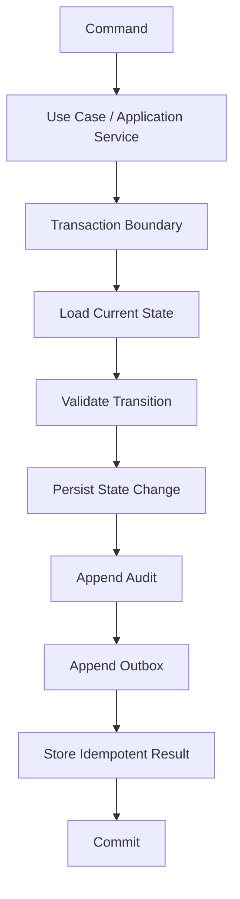
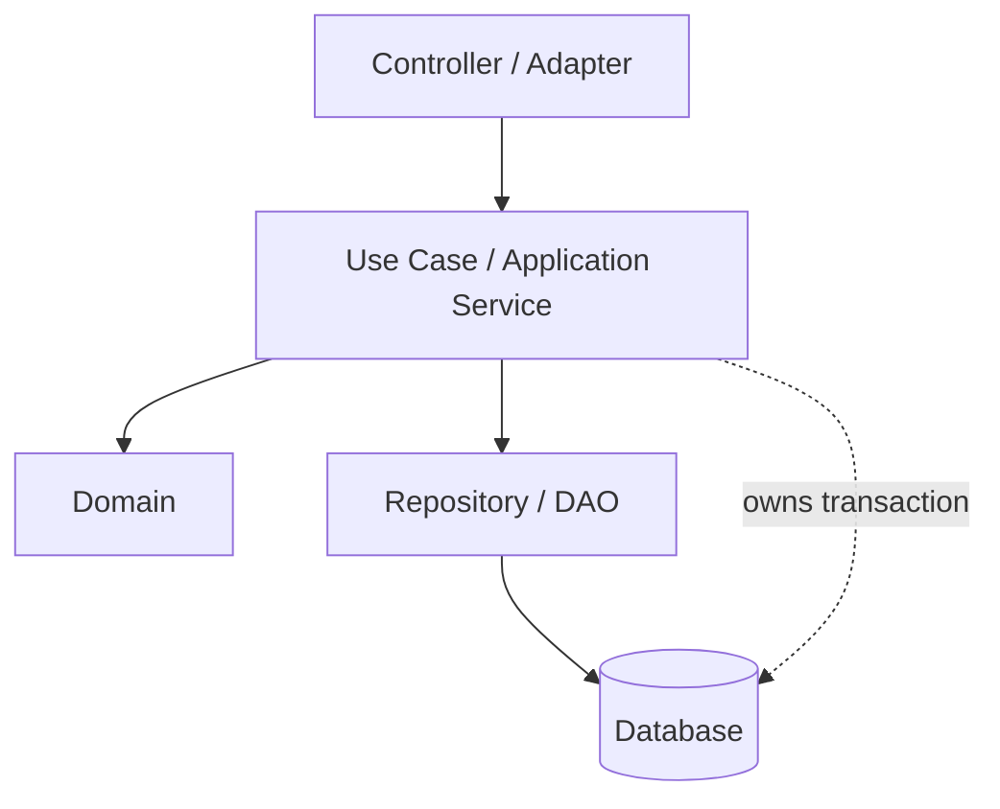
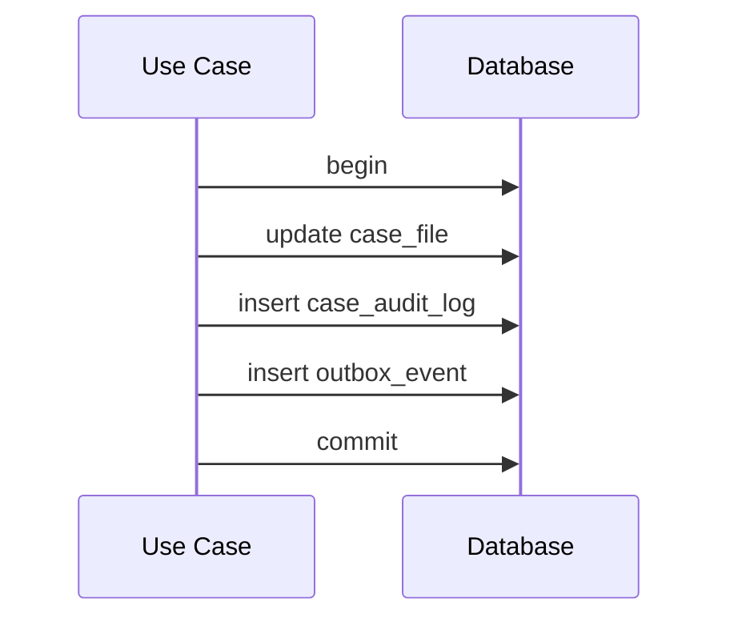

# Part 017 — Transaction Boundary Design

> Transaksi yang salah jarang langsung terlihat saat development.
>
> Ia muncul sebagai bug production:
>
> - status berubah tetapi audit tidak ada;
> - event terkirim tetapi database rollback;
> - retry membuat duplicate history;
> - dua user berhasil melakukan action yang seharusnya eksklusif;
> - repository terlihat benar tetapi use case tidak atomic;
> - batch job mengunci tabel terlalu lama;
> - async handler membaca state yang belum commit;
> - side effect eksternal terjadi di dalam transaction dan membuat connection pool habis.
>
> Transaction boundary bukan detail annotation. Ia adalah desain consistency.

Part ini membahas cara menentukan batas transaksi yang benar di Java application.

---

## 1. Core Thesis

Transaction boundary harus mengikuti **business consistency boundary**, bukan mengikuti class, repository method, framework default, atau kebiasaan menaruh `@Transactional` di semua service.

Pertanyaan utama:

```txt
Perubahan data mana yang harus commit bersama agar invariant tetap benar?
```

Jika jawabannya:

```txt
update case status
insert status history
insert audit log
append outbox event
store idempotency result
```

maka semua itu adalah satu transaction boundary.

Diagram:



Boundary yang benar membuat sistem bisa menjawab:

```txt
If this use case succeeds, what facts are durable?
If it fails, what facts must not exist?
If it is retried, what facts must not duplicate?
```

---

## 2. Transaction Boundary Is Not Repository Boundary

Repository method sering terlalu kecil untuk menjadi transaction boundary.

Buruk:

```java
public void approve(CaseId caseId, UserId actor, String reason) {
    caseRepository.updateStatus(caseId, CaseStatus.APPROVED); // tx A
    historyRepository.insert(caseId, APPROVED);               // tx B
    auditRepository.insert(caseId, actor, reason);            // tx C
}
```

Jika `auditRepository.insert` gagal, status dan history sudah commit.

Lebih benar:

```java
@Transactional
public ApproveCaseResult approve(ApproveCaseCommand command) {
    CaseFile caseFile = caseRepository.findById(command.caseId())
            .orElseThrow(() -> new CaseNotFound(command.caseId()));

    CaseStatus previous = caseFile.status();
    caseFile.approve(command.actor(), command.reason());

    caseRepository.save(caseFile);
    historyRepository.append(caseFile.id(), previous, caseFile.status(), command.actor());
    auditRepository.append(CaseAudit.approved(caseFile, command));
    outboxRepository.append(CaseApprovedEvent.from(caseFile, command.commandId()));

    return ApproveCaseResult.from(caseFile);
}
```

Repository participates in transaction. It should not own the whole use case boundary.

---

## 3. Boundary Ownership Rule

A practical rule:

```txt
The layer that knows the use case must own the transaction.
```

Controller knows HTTP. It should not own transaction.

Repository knows persistence of one aggregate/table. It usually should not own full business transaction.

Use case/application service knows the business operation. It should own transaction.



---

## 4. What Should Be Inside a Transaction?

Inside transaction:

- read current state needed for consistency;
- validate state transition against current state;
- write primary state change;
- write dependent rows that must be atomic;
- append audit evidence;
- append outbox event;
- store idempotency/dedup result;
- update local read model if it must be synchronous;
- acquire/release database locks;
- update version.

Usually outside transaction:

- external HTTP calls;
- email sending;
- message broker publish directly;
- PDF generation;
- file upload;
- slow CPU-heavy transformation;
- user interaction;
- waiting on another service;
- non-critical cache update;
- analytics tracking;
- logging.

Side effects outside transaction should be driven by durable state, usually outbox or job table.

---

## 5. Use Case Transaction Pattern

```java
public final class ApproveCaseUseCase {
    private final CaseFileRepository caseFiles;
    private final CaseAuditRepository audits;
    private final OutboxRepository outbox;
    private final CommandDedupRepository commandDedup;

    @Transactional
    public ApproveCaseResult handle(ApproveCaseCommand command) {
        Optional<ApproveCaseResult> previous =
                commandDedup.findCompletedResult(command.commandId(), ApproveCaseResult.class);

        if (previous.isPresent()) {
            return previous.get();
        }

        commandDedup.markStarted(command.commandId(), "APPROVE_CASE", command.caseId());

        CaseFile caseFile = caseFiles.findById(command.caseId())
                .orElseThrow(() -> new CaseNotFound(command.caseId()));

        CaseStatus previousStatus = caseFile.status();

        caseFile.approve(command.actor(), command.reason());

        caseFiles.save(caseFile);

        audits.append(CaseAuditRecord.statusChanged(
                command.commandId(),
                caseFile.id(),
                command.actor(),
                "APPROVE_CASE",
                previousStatus,
                caseFile.status(),
                command.reason(),
                command.now()
        ));

        outbox.append(CaseApprovedEvent.from(command.commandId(), caseFile));

        ApproveCaseResult result = ApproveCaseResult.from(caseFile);

        commandDedup.markCompleted(command.commandId(), result);

        return result;
    }
}
```

Characteristics:

- idempotency checked inside transaction;
- current state loaded inside transaction;
- domain validates transition;
- state, audit, outbox, result commit together;
- no external broker/email call inside transaction.

---

## 6. Command Handler Boundary

Command handler is often the best transaction owner.

```java
public interface CommandHandler<C, R> {
    R handle(C command);
}
```

Command handler transaction:

```java
public final class AssignOfficerCommandHandler
        implements CommandHandler<AssignOfficerCommand, AssignOfficerResult> {

    @Transactional
    @Override
    public AssignOfficerResult handle(AssignOfficerCommand command) {
        // one consistency boundary
    }
}
```

Why command handler is good:

- one command = one intent;
- command has command ID/idempotency key;
- command has actor/reason/timestamp;
- handler knows audit and outbox needs;
- handler can map concurrency conflict to business outcome;
- handler can keep transaction narrow.

---

## 7. Query Handler Boundary

Query handler transaction is different.

For simple read:

```java
public CaseDashboardPage search(CaseDashboardFilter filter, PageRequest page) {
    return dashboardQuery.search(filter, page);
}
```

No explicit transaction may be fine.

For consistent multi-query read:

```java
@Transactional(readOnly = true)
public CaseDetail getDetail(CaseId id) {
    CaseDetailHeader header = caseDetailQuery.header(id);
    List<CaseActionRow> actions = caseActionQuery.findByCaseId(id);
    List<DocumentRow> documents = documentQuery.findByCaseId(id);
    return new CaseDetail(header, actions, documents);
}
```

Question:

```txt
Must these reads be mutually consistent?
```

If yes, read-only transaction and appropriate isolation may be needed. If no, simpler independent reads may be fine.

---

## 8. Transaction Boundary and Domain Model

A domain method should not start a transaction.

Bad:

```java
public class CaseFile {
    @Transactional
    public void approve(...) {
        ...
    }
}
```

Domain object should not know persistence infrastructure.

Better:

```java
@Transactional
public void approve(ApproveCaseCommand command) {
    CaseFile caseFile = repository.findById(command.caseId()).orElseThrow();
    caseFile.approve(command.actor(), command.reason());
    repository.save(caseFile);
}
```

Domain owns rules. Application owns transaction.

---

## 9. Transaction Boundary and Repository

Repository should have methods that participate in current transaction.

```java
public interface CaseFileRepository {
    Optional<CaseFile> findById(CaseFileId id);
    void save(CaseFile caseFile);
}
```

Avoid repository methods that secretly create independent transaction for business command:

```java
@Transactional(propagation = REQUIRES_NEW)
void save(CaseFile caseFile); // dangerous as default
```

`REQUIRES_NEW` can be valid but should be rare and explicit.

Default repository should join caller transaction.

---

## 10. `REQUIRES_NEW` Is a Scalpel

Starting a new transaction inside another transaction can break atomicity.

Example:

```java
@Transactional
public void approve(...) {
    caseRepository.save(caseFile);
    auditRepository.appendRequiresNew(audit);
    throw new RuntimeException();
}
```

If outer transaction rolls back but audit committed, audit says approval happened when state did not.

Sometimes independent transaction is desired:

- write technical failure log that must survive rollback;
- reserve external sequence deliberately;
- job heartbeat;
- outbox publisher marking attempt independent of claim;
- audit rejected attempt before main operation? only if designed.

But ask:

```txt
If outer transaction rolls back, should inner fact still be true?
```

If not, do not use `REQUIRES_NEW`.

---

## 11. Transaction Boundary and Audit

Audit that proves a state change must commit with the state change.

```txt
state changed but no audit = evidence gap
audit says changed but state rollback = false evidence
```

Correct:



If audit is only operational log, separate transaction may be fine. If audit is domain/regulatory evidence, it belongs inside the transaction.

---

## 12. Transaction Boundary and Outbox

Publishing directly inside transaction is dangerous.

Bad:

```java
@Transactional
public void approve(...) {
    caseRepository.save(caseFile);
    messageBroker.publish(new CaseApproved(...)); // external side effect
}
```

If publish succeeds but DB rollback, downstream receives false event.

If DB commit succeeds but publish fails, state changes but event missing.

Better:

```java
@Transactional
public void approve(...) {
    caseRepository.save(caseFile);
    outboxRepository.append(new CaseApproved(...));
}
```

Then publisher after commit:

```txt
read outbox -> publish -> mark published
```

Outbox entry is atomic with state change.

---

## 13. Transaction Boundary and Inbox

For message consumers, use inbox/dedup.

```java
@Transactional
public void handle(Message message) {
    boolean first = inboxRepository.tryRecord(message.id());

    if (!first) {
        return;
    }

    // apply local state change
    repository.save(...);

    // append outgoing event if needed
    outbox.append(...);
}
```

If consumer crashes after commit, redelivery sees inbox record and does not duplicate.

Boundary:

```txt
record message processed + local mutation + outgoing outbox = one transaction
```

---

## 14. Transaction Boundary and Idempotency

HTTP command idempotency:

```txt
command_id unique
command started/completed result stored transactionally
mutation/audit/outbox commit with command result
```

Pattern:

```java
@Transactional
public Result handle(Command command) {
    Optional<Result> existing = commandStore.findCompleted(command.id());
    if (existing.isPresent()) {
        return existing.get();
    }

    commandStore.insertStarted(command.id());

    Result result = executeMutation(command);

    commandStore.markCompleted(command.id(), result);
    return result;
}
```

Caveat:

- if `STARTED` is committed without completed result, define behavior;
- if entire transaction rolls back, started record rolls back too;
- if command already completed, return same result;
- if same ID with different payload, reject.

Payload hash:

```sql
command_id uuid primary key,
payload_hash text not null,
status text not null,
result_payload jsonb
```

On duplicate command ID, compare hash.

---

## 15. Transaction Boundary and Retry

Retry should wrap the entire transaction, not a repository method.

```java
retryingTransaction.execute(() -> {
    return approveUseCase.handleInsideTransaction(command);
});
```

Retryable:

- deadlock;
- serialization failure;
- transient connection failure before commit;
- lock timeout maybe;
- query timeout maybe.

Not retryable automatically:

- duplicate natural key;
- optimistic conflict;
- validation failure;
- authorization failure;
- syntax/migration bug;
- mapping error.

Retry requires idempotency.

---

## 16. Boundary with External Services

Suppose approve case requires risk scoring service.

Bad:

```java
@Transactional
public void approve(...) {
    RiskScore score = riskClient.score(caseFile); // external
    caseFile.approve(score);
    repository.save(caseFile);
}
```

Risks:

- connection held during network call;
- service timeout keeps transaction open;
- retry duplicates external call;
- result may become stale.

Better options:

### Option A — Call before transaction

```java
RiskScore score = riskClient.score(input);

@Transactional
public void approveWithScore(command, score) {
    load current state
    verify score still applicable
    save
}
```

Risk: state changes between score call and transaction. Need validation.

### Option B — Async workflow

```txt
request approval
persist pending approval
outbox -> scoring requested
scoring response message -> complete approval if state still valid
```

Better for slow/external dependency.

### Option C — Cache/snapshot scoring input

Store input snapshot, score asynchronously, continue workflow.

---

## 17. Transaction Boundary and File Storage

Bad:

```java
@Transactional
public void uploadEvidence(...) {
    repository.insertMetadata(...);
    objectStorage.upload(file); // slow external I/O
    repository.markUploaded(...);
}
```

If DB rollback after upload, orphan file. If upload fails, metadata partial depending transaction.

Better patterns:

### Upload first, then transaction

```txt
upload temp object
transaction inserts metadata referencing temp/final object
after commit finalize/promote object
cleanup orphan temp on failure
```

### Transaction first with pending state

```txt
transaction creates evidence record PENDING_UPLOAD
client uploads directly
callback/command marks UPLOADED
```

### Outbox-driven processing

```txt
transaction records file request
worker handles external storage and updates state
```

No universal answer. But do not hold database transaction during large file upload.

---

## 18. Transaction Boundary and Cache

Cache update before commit can lie.

Bad:

```java
@Transactional
public void approve(...) {
    repository.save(caseFile);
    cache.put(caseFile.id(), caseFile); // before commit
}
```

If rollback, cache false.

Better:

- invalidate/update after commit;
- or outbox/change event updates cache;
- or cache-aside with TTL;
- or make cache tolerate stale data.

If cache invalidation is critical but not durable, outbox is safer.

---

## 19. Transaction Boundary and Domain Events

Domain object may record events:

```java
caseFile.approve(actor, reason);
List<DomainEvent> events = caseFile.pullEvents();
```

Application service persists state and outbox in same transaction:

```java
caseRepository.save(caseFile);
for (DomainEvent event : events) {
    outbox.append(event);
}
```

Do not publish domain events directly before commit.

In-memory event listeners inside transaction are risky if they perform external side effects.

---

## 20. Boundary in Modular Monolith

In modular monolith, a use case might touch multiple modules sharing same database.

Example:

```txt
Case module approves case.
Sanction module creates preliminary sanction record.
Audit module records decision.
```

If same database and same process, one transaction can include multiple module repositories.

But watch ownership:

```java
@Transactional
public void approveAndCreateSanction(...) {
    caseApplication.approvePart(...);
    sanctionApplication.createPart(...);
}
```

Better to define an orchestration use case than let modules call each other's repositories directly.

If modules are intended to become services later, consider outbox/event workflow rather than cross-module transaction.

---

## 21. Boundary in Microservices

Microservice cannot have local database transaction across services.

Bad mental model:

```txt
Service A DB update + Service B DB update = one transaction
```

Unless using distributed transaction, which many modern systems avoid due complexity/availability trade-offs.

Better:

- local transaction per service;
- outbox event;
- saga/workflow;
- compensation;
- reconciliation;
- explicit intermediate states.

Example:

```txt
Case Service:
  transaction: mark case ESCALATION_REQUESTED + outbox CaseEscalationRequested

Sanction Service:
  consumes event
  transaction: create sanction review + inbox record
```

Boundary is local. Business process is larger than one transaction.

---

## 22. Boundary and Saga

Saga step:

```txt
local transaction + event/command to next step
```

Do not pretend saga is one transaction.

Design states:

```txt
PENDING_APPROVAL
APPROVED
SANCTION_PENDING
SANCTION_CREATED
SANCTION_FAILED
COMPENSATION_REQUIRED
```

Data access implication:

- each state transition transactionally records audit/outbox;
- idempotency per message/command;
- retry and compensation explicit;
- read model shows intermediate state.

---

## 23. Boundary and Async Jobs

Batch job transaction boundary usually per chunk.

Bad:

```txt
one transaction for entire job
```

Better:

```txt
read chunk
transaction:
  write chunk
  audit/outbox
  save cursor
commit
repeat
```

If each row independent, transaction per row or per small chunk.

If all-or-nothing required for huge dataset, reconsider design; huge all-or-nothing transaction is operationally expensive.

---

## 24. Boundary and Outbox Publisher

Outbox publisher transaction boundary differs from command.

Typical:

1. claim events;
2. publish outside transaction or after claim;
3. mark published.

Patterns vary.

### Pattern A — Claim in transaction, publish outside, mark published

```txt
tx claim events
publish to broker
tx mark published
```

If publish succeeds but mark fails, event may republish. Downstream must be idempotent.

### Pattern B — Select without claim, publish, mark

Simpler but concurrency risk.

### Pattern C — Database lock with skip locked

```txt
tx select for update skip locked
publish while transaction open? risky if slow
mark published
commit
```

Holding transaction while publishing can be bad. Use carefully.

Outbox guarantees at-least-once, not exactly-once.

---

## 25. Boundary and Read Model Update

If read model is local and must be immediately consistent, update it in same transaction.

```java
@Transactional
public void approve(...) {
    caseRepository.save(caseFile);
    caseDashboardProjection.update(caseFile);
    audit.append(...);
}
```

If eventual consistency acceptable, update via outbox/event.

Trade-off:

| Same Transaction | Async Projection |
|---|---|
| immediate consistency | lower command latency |
| more write coupling | projection can be rebuilt |
| more locks/work in command | eventual consistency lag |
| harder schema coupling | more moving parts |

Do not update every read model synchronously by default.

---

## 26. Boundary and Denormalized Counters

Counter updates are concurrency-sensitive.

Example:

```txt
officer.open_case_count
```

Option A: update counter in same transaction as assignment.

```sql
update officer_stats
set open_case_count = open_case_count + 1
where officer_id = ?
```

Option B: derive asynchronously from events.

Option C: compute from source on read.

If counter drives business decision, synchronous/locked/consistent update may be required. If only dashboard, eventual read model may be fine.

---

## 27. Boundary and Invariant Location

Invariant can be enforced by:

- domain rule;
- SQL predicate;
- database constraint;
- lock;
- isolation level;
- unique index;
- application workflow.

Example:

```txt
One case can have only one active primary assignment.
```

Strong enforcement:

```sql
create unique index uq_case_active_primary_assignment
on case_assignment(case_id)
where assignment_type = 'PRIMARY'
  and ended_at is null;
```

Transaction:

```txt
insert assignment
if unique violation -> conflict
```

Domain pre-check improves message, DB constraint protects truth.

---

## 28. Transaction Boundary and Authorization

Authorization that depends on current DB state should be inside or enforced by write predicate.

Example:

```sql
update case_file
set status = 'APPROVED'
where id = ?
  and tenant_id = ?
  and assigned_unit_id = ?
  and status = 'UNDER_REVIEW'
  and version = ?;
```

Update count 0 can mean not found, unauthorized, stale, or invalid state. For security, user-facing response may intentionally collapse these.

Do not authorize outside transaction and then write broad update.

---

## 29. Boundary and Multi-Tenant Scope

Every transaction should carry tenant context.

```java
@Transactional
public void approve(ApproveCaseCommand command) {
    TenantId tenantId = tenantContext.requiredTenant();

    CaseFile caseFile = caseRepository.findById(tenantId, command.caseId())
            .orElseThrow(...);

    ...
    caseRepository.save(tenantId, caseFile);
}
```

SQL write predicate includes tenant:

```sql
where tenant_id = ?
  and id = ?
  and version = ?
```

This prevents cross-tenant accidental writes.

---

## 30. Boundary and Isolation Level

Transaction boundary defines scope. Isolation defines visibility/concurrency behavior within that scope.

Example:

```java
@Transactional(isolation = Isolation.READ_COMMITTED)
public void approve(...) { ... }
```

But do not think isolation alone solves all anomalies.

Many invariants need:

- unique constraint;
- version;
- lock;
- conditional update;
- serializable + retry;
- schema redesign.

Isolation level is one tool, not magic.

Part 018 goes deep.

---

## 31. Boundary and Optimistic Lock

Optimistic lock works when:

1. transaction loads version;
2. domain mutates object;
3. save updates where version = old version;
4. affected rows 0 means conflict;
5. transaction rolls back or maps conflict.

Boundary must include load and save.

```java
@Transactional
public void approve(...) {
    CaseFile caseFile = repository.findById(id).orElseThrow();
    long version = caseFile.version();

    caseFile.approve(...);

    repository.saveWithExpectedVersion(caseFile, version);
}
```

If load outside transaction and save later, conflict window is larger but version still catches. However state used for validation may be stale for too long.

---

## 32. Boundary and Pessimistic Lock

Pessimistic lock must be held only for short transaction.

```java
@Transactional
public void assignOfficer(...) {
    CaseFile caseFile = repository.findByIdForUpdate(caseId);
    caseFile.assignOfficer(...);
    repository.save(caseFile);
}
```

`for update` lock releases at commit/rollback.

Do not:

```java
lock row
call external service
wait
commit
```

---

## 33. Boundary and State Machine

For workflow/state machine systems, each transition is usually one transaction.

```txt
DRAFT -> SUBMITTED
SUBMITTED -> UNDER_REVIEW
UNDER_REVIEW -> APPROVED
APPROVED -> CLOSED
```

Transition transaction:

- load current state;
- verify transition allowed;
- persist new state;
- append transition history;
- append audit;
- append outbox;
- store command result.

This is a natural boundary.

---

## 34. Boundary and Long-Running Business Process

A business process can span days. A database transaction cannot.

Example:

```txt
case approval requires supervisor review, legal review, external document, and final decision
```

Do not hold one transaction.

Use durable states:

```txt
PENDING_SUPERVISOR_REVIEW
PENDING_LEGAL_REVIEW
PENDING_DOCUMENT
READY_FOR_FINAL_DECISION
APPROVED
```

Each transition is its own transaction.

Consistency is maintained by state machine and audit, not one giant transaction.

---

## 35. Boundary and Human Workflow

User opens form at 10:00, submits at 10:15.

Transaction boundary is not:

```txt
open form -> submit form
```

Correct:

- read form data with version;
- user edits outside transaction;
- submit command starts transaction;
- update where version matches;
- conflict if changed.

This is optimistic concurrency at human time scale.

---

## 36. Boundary and Validation

Validation before transaction:

- syntactic request validation;
- required fields;
- value format;
- basic enum parsing;
- command ID presence.

Validation inside transaction:

- current state transition;
- actor still authorized based on current assignment;
- referenced row exists;
- version matches;
- uniqueness/invariant final check;
- lock-dependent condition.

Rule:

```txt
Validate cheap/static things before transaction.
Validate state-dependent things inside transaction.
```

---

## 37. Boundary and Not Found

Load inside transaction when subsequent write depends on row.

```java
@Transactional
public void close(CaseId id) {
    CaseFile caseFile = repository.findById(id).orElseThrow();
    caseFile.close();
    repository.save(caseFile);
}
```

For security/multi-tenant, not found may include unauthorized.

Do not first query existence outside transaction then update inside without predicate.

---

## 38. Boundary and Command Result

Command result should reflect committed facts.

If result includes generated fields, ensure they are known before commit or retrieved within transaction.

```java
CaseFile caseFile = repository.save(caseFile);
ApproveCaseResult result = ApproveCaseResult.from(caseFile);
commandDedup.markCompleted(commandId, result);
```

If commit fails, result should not be returned as success. Framework returns after commit normally if proxy handles commit after method return; be aware of transaction timing.

In Spring proxy model, commit happens after method returns from transactional method but before control returns to caller outside proxy. Exceptions during commit can be thrown after method body.

Do not perform irreversible response-side effects before transaction commit.

---

## 39. Boundary and Framework Proxy Pitfall

In proxy-based transaction frameworks, self-invocation can bypass transaction.

Example:

```java
public class CaseService {
    public void apiMethod() {
        this.approveInternal(); // may not go through proxy
    }

    @Transactional
    public void approveInternal() {
        ...
    }
}
```

If transaction annotation is proxy-based, internal call may not start transaction.

Design:

- put transactional method on externally invoked bean/use case;
- avoid relying on self-invoked annotations;
- use programmatic transaction for explicitness in complex cases.

Even if your framework differs, understand transaction activation mechanism.

---

## 40. Boundary and Rollback Rules

Frameworks differ in which exceptions trigger rollback by default.

Common pattern in Spring: unchecked exceptions trigger rollback by default; checked exceptions may not unless configured.

If data access translator returns checked business exception, rollback rule may surprise.

Design:

- use runtime semantic exceptions for data access failure;
- configure rollback for checked exceptions if needed;
- do not catch exception inside transaction and return success unless intended;
- explicitly mark rollback if swallowing exception.

Example bad:

```java
@Transactional
public Result approve(...) {
    try {
        repository.save(...);
    } catch (Exception e) {
        return Result.failed(); // transaction may commit earlier writes
    }
}
```

If you catch and continue, transaction manager sees normal return.

Either rollback explicitly or structure failure before mutation.

---

## 41. Boundary and Exception Translation Timing

If repository catches SQL exception and throws semantic conflict, transaction should roll back if partial writes happened.

For pure conflict detected by update count before any other write, rollback may not matter. But consistent rule: exception from command should roll back transaction unless explicitly committed as rejected command.

Rejected command audit is a special design.

---

## 42. Boundary and Rejected Command Audit

Sometimes failed business attempt should be recorded.

Example:

```txt
User attempted to approve already closed case.
```

Options:

### No audit

Return conflict.

### Audit rejected attempt in same transaction

If transaction only inserts rejected attempt record.

### Separate audit transaction

If rejection must survive even when main mutation not performed.

Be explicit. Do not accidentally audit false facts.

Audit action names:

```txt
APPROVE_CASE_REJECTED_INVALID_STATE
APPROVE_CASE_REJECTED_UNAUTHORIZED
```

Do not record `APPROVE_CASE` if approval did not occur.

---

## 43. Boundary and Transaction Duration Budget

Every transaction should have a budget.

Example:

```txt
Approve case transaction should complete p95 < 100ms, p99 < 300ms.
```

If transaction grows to seconds:

- inspect query plan;
- remove external calls;
- reduce loaded graph;
- add index;
- split workflow;
- move read model async;
- reduce lock wait;
- tune batch size.

Transaction duration metric is essential.

---

## 44. Boundary and Query Count

Within one transaction, query count matters.

Bad approve command:

```txt
load case
lazy load actions
lazy load officer
lazy load unit
lazy load documents
update case
insert history
insert audit
insert outbox
```

If hidden lazy loading causes 50 queries, transaction duration and lock time grow.

Use explicit fetch plan/projection for command load.

---

## 45. Boundary and Lazy Loading

Lazy loading inside transaction may hide database access.

If domain method triggers lazy relationship:

```java
caseFile.approve(...)
```

and inside it accesses:

```java
actions.size()
assignedOfficer.unit()
```

Then domain method hides I/O if entity is ORM-managed.

For complex systems, prefer explicit load shape:

```java
repository.loadForApproval(caseId)
```

Then domain object has required state already.

---

## 46. Boundary and Flush Timing

ORM may flush before query or commit. That means writes can happen earlier than code visually suggests.

Example:

```java
caseFile.setStatus(APPROVED);
List<Something> rows = queryRepository.search(...); // may trigger flush first
```

Transaction boundary still controls commit, but constraint errors can appear before commit.

Design command method to avoid mixing mutation with unrelated queries.

---

## 47. Boundary and Read-Your-Writes

Inside same transaction, you generally expect to read your own writes. But ORM first-level cache, database isolation, and query mechanism can create surprises.

If you update via native SQL then read via ORM entity, persistence context may be stale.

Rule:

```txt
Do not mix direct SQL updates and ORM-managed entities in same transaction without clear synchronization.
```

If needed:

- flush/clear persistence context;
- reload;
- use one data access style per transaction path;
- isolate bulk operation.

---

## 48. Boundary and Bulk Update

Bulk update bypasses ORM entity tracking.

Example JPQL/native bulk:

```sql
update case_file set status='EXPIRED' where ...
```

If same transaction already loaded `CaseFileEntity`, it may still show old status in persistence context.

Boundary design:

- perform bulk in separate transaction;
- clear persistence context after bulk;
- avoid mixing loaded entities and bulk update;
- use DAO for batch job.

---

## 49. Boundary and Testing

Test transaction boundary with failure injection.

Cases:

1. state update succeeds, audit insert fails -> state rollback.
2. audit succeeds, outbox fails -> state and audit rollback.
3. duplicate command ID -> previous result returned.
4. optimistic conflict -> no audit/outbox.
5. deadlock retry -> no duplicate audit/outbox.
6. external side effect not called inside transaction.
7. rejected command audit behavior as designed.
8. commit failure path if infrastructure supports.

Use real DB for transaction tests when possible.

---

## 50. Boundary Test Example

```java
@Test
void rollsBackStatusWhenAuditInsertFails() {
    CaseId caseId = fixture.openCase();

    auditRepository.failNextInsert();

    assertThatThrownBy(() ->
            approveUseCase.handle(commandFor(caseId))
    ).isInstanceOf(DataAccessException.class);

    CaseFileRow row = caseQuery.get(caseId);
    assertThat(row.status()).isEqualTo(CaseStatus.UNDER_REVIEW);

    assertThat(auditQuery.findByCaseId(caseId)).isEmpty();
    assertThat(outboxQuery.findByAggregateId(caseId)).isEmpty();
}
```

This proves boundary, not just method behavior.

---

## 51. Boundary Review Checklist

Before accepting use case:

- [ ] What is the consistency boundary?
- [ ] Which writes must commit together?
- [ ] Where is transaction started?
- [ ] Is transaction owned by use case/command handler?
- [ ] Do repositories join transaction rather than start independent ones?
- [ ] Is audit atomic with state change?
- [ ] Is outbox atomic with state change?
- [ ] Are external calls outside transaction?
- [ ] Is idempotency result stored transactionally?
- [ ] Are retries whole-transaction and safe?
- [ ] Are concurrency conflicts explicit?
- [ ] Are tenant/authorization predicates inside write?
- [ ] Is transaction short?
- [ ] Are lazy loads controlled?
- [ ] Are rollback rules correct?
- [ ] Are failure-path tests present?

---

## 52. Anti-Pattern: `@Transactional` Everywhere

If every method is transactional, boundary is not designed.

Problems:

- nested transaction confusion;
- false sense of atomicity;
- long transactions;
- read paths hold resources unnecessarily;
- `REQUIRES_NEW` misuse;
- hidden rollback rules;
- self-invocation pitfalls.

Use transaction where consistency requires it.

---

## 53. Anti-Pattern: Transaction in Controller

```java
@Transactional
@PostMapping("/cases/{id}/approve")
public ResponseEntity<?> approve(...) {
    ...
}
```

Controller should parse HTTP and call use case. Transaction in controller often grows to include serialization, validation, and adapter concerns.

Better:

```java
@PostMapping("/cases/{id}/approve")
public ApproveCaseResponse approve(...) {
    return mapper.toResponse(approveCaseUseCase.handle(command));
}
```

Use case owns transaction.

---

## 54. Anti-Pattern: External Broker Publish Inside Transaction

```java
repository.save(...)
kafkaTemplate.send(...)
```

Fix outbox.

---

## 55. Anti-Pattern: Long Transaction Around Batch Whole Job

```java
@Transactional
public void runJob() {
    while (...) {
        processChunk();
    }
}
```

Fix transaction per chunk.

---

## 56. Anti-Pattern: Audit in Separate Transaction by Default

Audit can become false evidence if state rolls back.

Only separate if audit records attempt/rejection independent of state, and event name makes that clear.

---

## 57. Anti-Pattern: Read Before Transaction, Write Inside

```java
CaseFile caseFile = repository.findById(id); // no tx
validate(caseFile);

@Transactional
void save() { repository.save(caseFile); }
```

The validation used stale state. Use version/lock and revalidate inside transaction.

---

## 58. Example: Close Case Boundary

Use case:

```txt
close case
- case must be APPROVED
- no active sanctions pending
- write closed status
- write status history
- write audit
- append CaseClosed event
- store command result
```

Transaction:

```java
@Transactional
public CloseCaseResult close(CloseCaseCommand command) {
    CaseFile caseFile = caseRepository.loadForClosure(command.caseId())
            .orElseThrow(...);

    if (sanctionQuery.hasPendingSanction(command.caseId())) {
        throw new CaseCannotCloseWithPendingSanction(command.caseId());
    }

    CaseStatus previous = caseFile.status();
    caseFile.close(command.actor(), command.reason(), command.now());

    caseRepository.save(caseFile);
    statusHistory.append(...);
    audit.append(...);
    outbox.append(...);

    return CloseCaseResult.from(caseFile);
}
```

Question: should `hasPendingSanction` be protected by lock/constraint/isolation? If another transaction creates sanction concurrently, read committed may not be enough. This leads to isolation/locking design in Part 018/019.

---

## 59. Summary

Transaction boundary design is the heart of data correctness.

You must master:

- use case owns transaction;
- repository participates, usually does not own;
- audit/outbox/idempotency inside transaction;
- external side effects outside transaction;
- retry wraps whole transaction;
- domain validates current state inside transaction;
- transaction is not long-running workflow;
- human workflow uses version/conflict, not long transaction;
- module/service boundary changes transaction model;
- read model can be synchronous or async by design;
- isolation/lock/constraint support invariants;
- framework defaults and rollback rules must be understood;
- failure path tests prove boundary.

Part berikutnya membahas **Isolation Level In Practice**: read committed, repeatable read, serializable, lost update, phantom, write skew, and why isolation names are not enough without concrete invariant design.

---

## 60. References

- Oracle Java SE `Connection` transaction methods: https://docs.oracle.com/en/java/javase/21/docs/api/java.sql/java/sql/Connection.html
- Jakarta Transactions Specification: https://jakarta.ee/specifications/transactions/
- Jakarta Persistence Transactions: https://jakarta.ee/specifications/persistence/3.2/jakarta-persistence-spec-3.2
- Hibernate ORM Transactions and Concurrency: https://docs.hibernate.org/stable/orm/userguide/html_single/
- Spring Framework Transaction Management Reference: https://docs.spring.io/spring-framework/reference/data-access/transaction.html
- PostgreSQL Transaction Isolation: https://www.postgresql.org/docs/current/transaction-iso.html
- PostgreSQL Explicit Locking: https://www.postgresql.org/docs/current/explicit-locking.html
