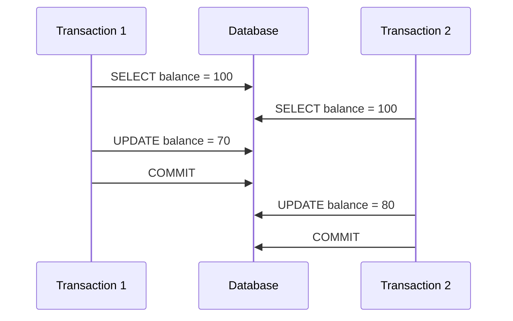
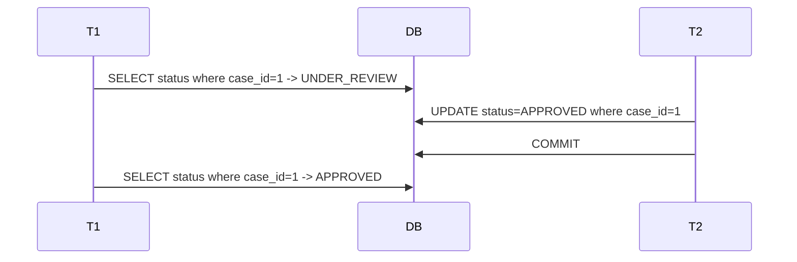
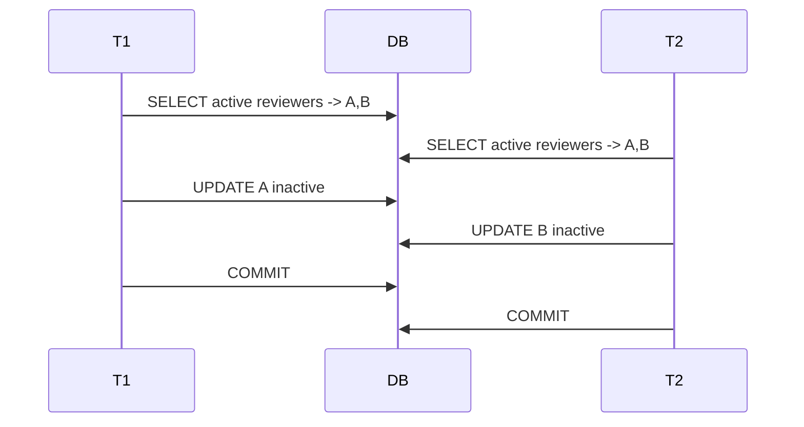

# Part 018 — Isolation Level In Practice

> Isolation level bukan hafalan interview.
>
> Di production, isolation level menentukan apakah dua transaksi yang benar secara individual bisa menghasilkan state yang salah ketika berjalan bersamaan.
>
> Masalahnya: nama isolation level tidak cukup. Implementasi database berbeda, workload berbeda, dan invariant aplikasi sering lebih kompleks daripada contoh "dirty read".
>
> Engineer yang kuat tidak bertanya "pakai isolation apa?". Ia bertanya:
>
> ```txt
> Anomaly apa yang bisa merusak invariant ini?
> Protection apa yang paling tepat: constraint, version, lock, conditional update, atau serializable?
> Jika transaksi gagal karena conflict, apakah retry aman?
> ```

Part ini membahas isolation level sebagai alat desain consistency.

---

## 1. Core Thesis

Isolation adalah seberapa besar satu transaksi dilindungi dari transaksi lain yang berjalan bersamaan.

Tetapi untuk desain aplikasi, cara berpikir yang lebih berguna:

```txt
Invariant -> Possible concurrent anomaly -> Protection strategy
```

Bukan:

```txt
Use SERIALIZABLE everywhere.
```

Isolation terlalu rendah bisa membuat data salah. Isolation terlalu tinggi tanpa retry dan capacity model bisa membuat sistem lambat/gagal under contention.

---

## 2. Transaction Interleaving Mental Model

Dua transaksi:

```txt
T1: read A
T2: read A
T1: write A
T2: write A
```

Jika tidak dikontrol, hasil akhir bisa kehilangan update.

Diagram:



T1 subtract 30, T2 subtract 20. Correct result should be 50. Final result 80 or 70 means lost update.

Isolation/concurrency design prevents this.

---

## 3. JDBC Isolation Constants

JDBC exposes:

```java
connection.setTransactionIsolation(Connection.TRANSACTION_READ_COMMITTED);
```

Constants:

```java
Connection.TRANSACTION_READ_UNCOMMITTED
Connection.TRANSACTION_READ_COMMITTED
Connection.TRANSACTION_REPEATABLE_READ
Connection.TRANSACTION_SERIALIZABLE
```

But actual behavior depends database.

Important:

```txt
Same isolation name can behave differently across databases.
```

For serious correctness, verify with target database.

---

## 4. Common Anomalies

| Anomaly | Meaning |
|---|---|
| Dirty read | read data written by uncommitted transaction |
| Non-repeatable read | same row read twice returns different committed value |
| Phantom read | repeated predicate query returns different set of rows |
| Lost update | concurrent updates overwrite each other |
| Write skew | transactions read overlapping condition then write different rows, violating invariant |
| Read skew | transaction sees inconsistent snapshot across reads |
| Predicate anomaly | invariant over a set/range violated by concurrent insert/update |
| Stale decision | command validates on old state and writes after state changed |

Dirty read is famous but often not the main production problem. Lost update and write skew are usually more relevant.

---

## 5. Dirty Read

Dirty read means reading uncommitted data.

Example:

```txt
T1 updates case status to APPROVED but has not committed.
T2 reads APPROVED.
T1 rolls back.
T2 made decision based on false state.
```

Most production relational databases avoid dirty reads at common default isolation. Many systems never intentionally use read uncommitted.

For business systems, dirty read is almost never acceptable.

---

## 6. Non-Repeatable Read

Same row read twice, different result.



At read committed, this is usually possible.

Is it bad? Depends.

For simple query, maybe fine.

For command that assumes status remains stable, use:

- optimistic version;
- `select for update`;
- conditional update;
- repeatable read/serializable;
- state transition predicate.

---

## 7. Phantom Read

Predicate query returns different set.

```txt
T1: select active assignments for case C -> none
T2: insert active assignment for case C
T2: commit
T1: select active assignments for case C -> one row
```

If invariant depends on "no active assignment exists", phantom matters.

Protection:

- unique partial index;
- lock parent row;
- serializable;
- predicate/range lock depending DB;
- insert with constraint and handle conflict.

Often the best protection is a database constraint.

---

## 8. Lost Update

Classic lost update:

```java
@Transactional
public void increaseScore(CaseId id, int delta) {
    CaseFile row = repository.findById(id).orElseThrow();
    row.setScore(row.getScore() + delta);
    repository.save(row);
}
```

Two transactions both read score 10.

- T1 writes 15.
- T2 writes 17.
- correct should be 22.

Protection options:

### Atomic SQL update

```sql
update case_file
set score = score + ?
where id = ?;
```

### Optimistic locking

```sql
update case_file
set score = ?,
    version = version + 1
where id = ?
  and version = ?;
```

### Pessimistic lock

```sql
select score
from case_file
where id = ?
for update;
```

### Serializable

May detect conflict, requires retry.

Choose based on operation.

---

## 9. Write Skew

Write skew is subtle and common.

Invariant:

```txt
At least one reviewer must remain assigned to a case.
```

Initial:

```txt
Reviewer A active.
Reviewer B active.
```

T1 removes A after checking B exists.

T2 removes B after checking A exists.

Timeline:



Final:

```txt
No active reviewer.
Invariant broken.
```

Each transaction wrote different row. Version on individual row may not catch it.

Protection:

- lock parent case row;
- serializable isolation with retry;
- materialized invariant row/counter with version;
- constraint if expressible;
- redesign state model.

---

## 10. Read Committed In Practice

Read committed usually means each statement sees committed data as of statement start. It does not mean entire transaction sees one stable snapshot.

Good for:

- many ordinary OLTP commands;
- short transactions;
- writes protected by constraints/version;
- simple reads;
- commands using conditional update.

Risks:

- non-repeatable reads;
- phantoms;
- write skew;
- stale multi-query decisions.

Read committed is often fine if you design invariants with:

- unique constraints;
- conditional updates;
- optimistic locks;
- pessimistic locks;
- correct write predicates.

Do not rely on read committed alone for set-based invariants.

---

## 11. Repeatable Read In Practice

Repeatable read generally gives stronger snapshot stability within transaction. But behavior differs.

Useful for:

- multi-query read that needs stable view;
- command that reads same row multiple times;
- report snapshot over short duration;
- reducing non-repeatable reads.

Risks:

- may still allow write skew in some MVCC systems;
- long snapshot resource cost;
- serialization-like errors in some databases;
- not substitute for constraints.

Do not assume repeatable read prevents every anomaly.

---

## 12. Serializable In Practice

Serializable aims to make concurrent transactions behave as if executed one at a time.

Benefits:

- protects broad class of anomalies;
- useful for complex set invariants;
- safer when difficult to reason.

Costs:

- transactions can abort under contention;
- retry required;
- throughput may drop;
- long transactions worse;
- query/index design still important.

Serializable without retry is incomplete.

Pattern:

```java
retryingTransaction.execute(
        TransactionOptions.serializable(),
        connection -> {
            // read predicate
            // validate invariant
            // write
            return result;
        }
);
```

If serialization failure occurs, retry entire transaction.

---

## 13. Isolation Is Not a Replacement for Constraints

Invariant:

```txt
case_number must be unique
```

Best protection:

```sql
unique(case_number)
```

Do not use:

```java
@Transactional(isolation = SERIALIZABLE)
if (!exists(caseNumber)) {
    insert(caseNumber);
}
```

Serializable may work but is heavier and still requires retry. Unique constraint is simpler, stronger, and self-documenting.

Rule:

```txt
If invariant can be expressed as a database constraint, use the constraint.
```

---

## 14. Isolation Is Not a Replacement for Idempotency

Even serializable transaction does not solve retry duplicate after unknown commit.

If client times out after commit and retries, serializable does not know command semantic.

Need:

- command ID;
- dedup table;
- unique key;
- stored result.

Isolation protects concurrent interleaving. Idempotency protects replay.

---

## 15. Isolation Is Not a Replacement for Authorization Predicate

If user can update only their tenant/unit:

```sql
update case_file
set status = ?
where id = ?
  and tenant_id = ?
  and assigned_unit_id = ?;
```

Do not rely on prior read under isolation alone.

Write predicate should carry scope.

---

## 16. Conditional Update Pattern

Many anomalies can be handled with conditional update.

Example state transition:

```sql
update case_file
set status = 'APPROVED',
    version = version + 1
where id = ?
  and status = 'UNDER_REVIEW'
  and version = ?;
```

If affected rows = 0:

- not found;
- invalid state;
- version conflict;
- tenant mismatch.

Application maps to conflict/not found safely.

Benefits:

- short;
- works under read committed;
- no explicit lock needed;
- database enforces state at write time.

---

## 17. Optimistic Lock Pattern

Load:

```sql
select id, status, version
from case_file
where id = ?;
```

Save:

```sql
update case_file
set status = ?,
    version = version + 1
where id = ?
  and version = ?;
```

If 0 rows, conflict.

Works for:

- protecting single aggregate row;
- preventing lost update;
- human edit forms;
- low/moderate contention.

Not enough for:

- invariant across multiple rows unless aggregate version row updated too;
- write skew across different rows;
- set existence unless tied to versioned parent.

---

## 18. Aggregate Version Row

To protect multi-row invariant under one aggregate, update parent version.

Example:

```txt
case_assignment rows are children of case_file.
Invariant: at most one active primary assignment.
```

Even if inserting child row, also update parent case version:

```sql
update case_file
set version = version + 1
where id = ?
  and version = ?;
```

Then insert assignment.

But for at-most-one active assignment, unique partial index is even stronger.

Aggregate version helps detect concurrent modifications to same aggregate.

---

## 19. Pessimistic Lock Pattern

```sql
select id, status, version
from case_file
where id = ?
for update;
```

Then validate and write.

Use when:

- contention high;
- must serialize modifications to aggregate;
- conflict retry expensive;
- invariant involves child rows;
- operation must see latest locked state.

Risks:

- blocking;
- deadlock;
- lock timeout;
- lower throughput;
- long transaction dangerous.

Keep transaction short.

---

## 20. Parent Row Lock for Child Invariant

Invariant:

```txt
A case must not have more than 5 active reviewers.
```

Implementation:

```sql
select id
from case_file
where id = ?
for update;

select count(*)
from case_reviewer
where case_id = ?
  and ended_at is null;

insert into case_reviewer(...);
```

Locking parent serializes all reviewer modifications for that case.

This avoids write skew on child rows if every path follows same lock discipline.

Rule:

```txt
Lock discipline must be universal. One path bypassing it breaks invariant.
```

---

## 21. Unique Constraint for Existence Invariant

Invariant:

```txt
At most one active primary officer assignment per case.
```

Best:

```sql
create unique index uq_case_active_primary_assignment
on case_assignment(case_id)
where assignment_type = 'PRIMARY'
  and ended_at is null;
```

Then concurrent inserts:

- one succeeds;
- one fails unique violation;
- map to business conflict.

No need serializable for this invariant if database supports constraint.

---

## 22. Counter Row Pattern

Invariant:

```txt
No more than N active assignments.
```

A unique constraint may not express count <= N easily.

Use parent counter row:

```sql
update case_assignment_counter
set active_count = active_count + 1,
    version = version + 1
where case_id = ?
  and active_count < ?
  and version = ?;
```

If update count 0, limit reached or conflict.

Then insert assignment.

Must be in same transaction.

Trade-off:

- counter must remain correct;
- repair/reconciliation needed;
- simpler concurrency control;
- write hotspot possible.

---

## 23. Serializable for Predicate Invariant

Invariant:

```txt
No overlapping inspection schedule for same officer.
```

If database supports exclusion constraint, use it. If not, serializable may help.

Transaction:

```txt
select schedules where officer_id=? and overlaps(new_range)
if none:
  insert schedule
commit
```

At serializable, concurrent overlapping inserts should cause serialization failure in one transaction if database implements true serializability.

Still requires retry or conflict mapping.

But database-specific behavior matters. Test.

---

## 24. Write Skew Lab: Doctor/Reviewer Example

Table:

```sql
case_reviewer(
    case_id uuid,
    reviewer_id uuid,
    active boolean
)
```

Invariant:

```txt
Every case must have at least one active reviewer.
```

Bad transaction under read committed:

```java
@Transactional
public void removeReviewer(CaseId caseId, ReviewerId reviewerId) {
    int activeCount = reviewerDao.countActive(caseId);

    if (activeCount <= 1) {
        throw new CannotRemoveLastReviewer();
    }

    reviewerDao.deactivate(caseId, reviewerId);
}
```

Two transactions both see count 2 and remove different reviewer.

Fix options:

### Parent lock

```java
caseDao.lock(caseId);
int activeCount = reviewerDao.countActive(caseId);
...
```

### Counter row

Update counter conditionally.

### Serializable

Run transaction serializable and retry/map serialization conflict.

### Constraint/model redesign

Represent primary reviewer as required FK on case, not free child set.

---

## 25. Phantom Lab: Duplicate Active Assignment

Bad:

```java
if (!assignmentDao.existsActivePrimary(caseId)) {
    assignmentDao.insertPrimary(caseId, officerId);
}
```

Two transactions both see none. Both insert.

Fix:

```sql
create unique index uq_case_active_primary_assignment
on case_assignment(case_id)
where assignment_type='PRIMARY' and ended_at is null;
```

Then:

```java
try {
    assignmentDao.insertPrimary(...);
} catch (UniqueViolation ex) {
    throw new CaseAlreadyAssigned(caseId);
}
```

Do not solve this with application check alone.

---

## 26. Lost Update Lab: Manual Edit Form

GET:

```txt
user loads case version 7
```

POST:

```sql
update case_file
set title = ?,
    description = ?,
    version = version + 1
where id = ?
  and version = ?;
```

If 0 rows:

```txt
someone else changed it
```

Return conflict and ask user to reload/merge.

Do not blindly overwrite.

---

## 27. Read Skew Lab

Transaction reads two related values:

```txt
case.status
case.audit_latest_status
```

If read committed and another transaction updates between reads:

```txt
status = APPROVED
audit latest = UNDER_REVIEW
```

Maybe impossible if audit and status are same transaction and read query joins correctly, but multi-query read can see skew.

Fix:

- single SQL join;
- read-only repeatable read transaction;
- read model updated atomically;
- tolerate eventual inconsistency if display only.

---

## 28. Isolation for Reporting

Report needs stable dataset?

Options:

- repeatable read/serializable read transaction;
- snapshot table;
- materialized view;
- cutoff timestamp;
- read replica snapshot;
- event-sourced/versioned data.

Do not run a 3-hour serializable transaction on OLTP primary casually.

For large regulatory report, snapshot/read model is often better.

---

## 29. Isolation and Long Transactions

Higher isolation + long transaction = more risk.

Risks:

- serialization failures;
- resource retention;
- blocked writes;
- old snapshots;
- lock waits;
- replication/vacuum pressure;
- pool exhaustion.

Keep high-isolation transactions short.

For long process, break into durable steps.

---

## 30. Isolation and Retry

Serializable/transaction rollback errors are normal.

Retry pattern:

```java
for (int attempt = 1; attempt <= maxAttempts; attempt++) {
    try {
        return tx.execute(serializableOptions, callback);
    } catch (SerializationFailure ex) {
        if (attempt == maxAttempts) throw ex;
        sleep(backoff(attempt));
    }
}
```

But only if callback is safe:

- no external side effect inside;
- idempotency key;
- outbox for publish;
- whole transaction retried.

---

## 31. Isolation and Side Effects

If transaction can retry, callback may run multiple times.

Bad:

```java
serializableRetry(() -> {
    emailClient.send(...);
    repository.save(...);
});
```

Retry duplicates email.

Correct:

```java
serializableRetry(() -> {
    repository.save(...);
    outbox.append(EmailRequestedEvent...);
});
```

External side effect after commit via outbox.

---

## 32. Choosing Protection Strategy

Decision matrix:

| Invariant | Best First Tool |
|---|---|
| unique natural key | unique constraint |
| no duplicate command | unique command ID |
| no lost update on row | optimistic version or atomic update |
| state transition from expected state | conditional update |
| single active child | unique partial index |
| max N children | parent lock or counter row |
| no overlapping range | exclusion constraint or serializable |
| multi-row complex predicate | serializable or explicit lock model |
| human edit conflict | version |
| high contention update | atomic SQL or pessimistic lock |
| long workflow | state machine, not transaction |
| cross-service invariant | saga/workflow/reconciliation |

---

## 33. Read Committed Plus Constraints Is Powerful

Many production systems run default read committed successfully because they do not rely on isolation alone.

They use:

- primary keys;
- unique constraints;
- foreign keys;
- check constraints;
- conditional update;
- optimistic lock;
- short transactions;
- idempotency;
- outbox.

Read committed is not weak if invariant protection is explicit.

It is weak if application does check-then-act without constraint/lock/version.

---

## 34. Isolation and ORM

JPA/Hibernate transaction isolation usually comes from datasource/transaction manager.

ORM adds:

- persistence context;
- first-level cache;
- dirty checking;
- flush timing;
- optimistic lock via `@Version`;
- pessimistic lock modes.

But database isolation still applies.

Example:

```java
@Version
private long version;
```

This protects lost update even at read committed.

Pessimistic lock:

```java
entityManager.find(CaseFile.class, id, LockModeType.PESSIMISTIC_WRITE);
```

Underlying SQL often uses locking syntax. Behavior depends database.

---

## 35. First-Level Cache vs Isolation

Inside ORM persistence context, reading same entity twice may return cached object, not fresh database read.

This can look like repeatable read at object level even if database isolation is read committed.

But queries can still see new rows, and native SQL/bulk updates can bypass cache.

Do not confuse ORM identity map with database isolation guarantee.

---

## 36. Flush and Isolation

ORM may flush before query.

Example:

```java
caseFile.setStatus(APPROVED);
List<CaseFile> open = queryOpenCases(); // flush may happen before query
```

This changes what database sees during transaction and can trigger constraints early.

Understand flush mode when reasoning about isolation.

---

## 37. Testing Isolation Anomalies

Isolation bugs require concurrent tests with multiple connections/transactions.

Pseudo lost update test:

```java
Connection t1 = ds.getConnection();
Connection t2 = ds.getConnection();

t1.setAutoCommit(false);
t2.setAutoCommit(false);

int v1 = readScore(t1, caseId);
int v2 = readScore(t2, caseId);

writeScore(t1, caseId, v1 + 10);
t1.commit();

writeScore(t2, caseId, v2 + 20);
t2.commit();

assertThat(readScore(caseId)).isEqualTo(30); // may fail without protection
```

Then add version/atomic update and prove correctness.

---

## 38. Deterministic Concurrency Test

Use latches/barriers.

```java
CyclicBarrier barrier = new CyclicBarrier(2);

Future<?> f1 = executor.submit(() ->
        tx.execute(() -> {
            int count = dao.countActiveReviewers(caseId);
            barrier.await();
            dao.deactivate(caseId, reviewerA);
        })
);

Future<?> f2 = executor.submit(() ->
        tx.execute(() -> {
            int count = dao.countActiveReviewers(caseId);
            barrier.await();
            dao.deactivate(caseId, reviewerB);
        })
);
```

This forces interleaving.

For true database behavior, use real DB, not mocks.

---

## 39. Isolation Test Caveats

Concurrency tests can be flaky if not controlled.

Control:

- use barriers;
- use separate connections;
- disable auto-commit;
- set isolation explicitly;
- use lock timeouts;
- use test data unique per test;
- clean up;
- assert final invariant;
- run on target database.

Do not assume H2 behavior matches production database.

---

## 40. Isolation and H2/Test DB Problem

In-memory test DB may have different:

- isolation semantics;
- locking model;
- constraint behavior;
- SQL dialect;
- MVCC behavior;
- `for update` behavior;
- deadlock detection;
- transaction failure state.

For isolation/concurrency, use the actual database engine via containerized integration tests.

---

## 41. Isolation and Observability

Metrics/logs:

```txt
transaction.isolation{use_case}
transaction.retry.count{reason="serialization_failure"}
transaction.deadlock.count
transaction.lock_timeout.count
optimistic_conflict.count{aggregate}
unique_violation.count{constraint}
pessimistic_lock.wait.duration
transaction.duration
```

High optimistic conflict rate may indicate:

- user contention;
- aggregate too hot;
- retry loop too aggressive;
- UI stale data;
- batch competing with API.

High serialization failure rate may indicate:

- isolation too strong for workload;
- transactions too long;
- missing indexes;
- predicate too broad.

---

## 42. Isolation and Indexes

Indexes affect concurrency.

Example:

```sql
update case_file
set status='EXPIRED'
where expires_at < ?;
```

Without index on `expires_at`, database may scan/lock far more than expected.

For predicate locks/serializable behavior, indexes can reduce conflict scope depending database.

Concurrency design includes indexing.

---

## 43. Isolation and Foreign Keys

Foreign key checks can take locks or conflict.

Batch inserting many child rows referencing parent can contend with parent deletes/updates.

Design:

- avoid deleting parent while children active;
- use soft delete/status;
- index foreign key columns;
- understand cascade behavior;
- keep transaction short.

---

## 44. Isolation and Gap/Range Locks

Some databases use range/gap locks under certain isolation levels.

Effect:

- insert into range can block;
- predicate query can lock range;
- deadlock patterns differ.

Do not design purely from abstract isolation table. Read target DB behavior and test.

---

## 45. Isolation and Advisory Locks

Some databases support advisory/application locks.

Use for:

- coarse-grained business lock;
- job singleton;
- aggregate lock not represented as row;
- migration coordination.

Risks:

- vendor-specific;
- lock lifecycle tied to session/transaction depending mode;
- can be forgotten;
- can reduce throughput;
- not visible as normal row constraint.

Prefer row locks/constraints when possible. Use advisory lock when it models problem cleanly.

---

## 46. Isolation and Distributed Locks

Distributed lock outside database can coordinate across services, but be careful:

- clock/lease expiry;
- split brain;
- lock lost while transaction continues;
- DB still source of truth;
- failure recovery.

If invariant is in database, database constraint/transaction is often more reliable than external lock.

Use distributed lock for scheduling/singleton jobs, not as first choice for row-level correctness.

---

## 47. Isolation and Eventual Consistency

Some invariants do not need synchronous isolation.

Example dashboard count:

```txt
open case count shown to manager
```

Can be eventual.

Example legal decision:

```txt
case cannot be approved twice
```

Must be synchronous.

Classify:

| Data | Consistency Need |
|---|---|
| financial/regulatory decision | strong |
| audit evidence | strong |
| idempotency | strong |
| assignment uniqueness | strong |
| dashboard count | often eventual |
| search index | eventual |
| notification sent | eventual but deduped |
| export snapshot | depends |

Do not pay serializable cost for data that can be eventual. Do not make critical invariant eventual by accident.

---

## 48. Isolation and Check-Then-Act

Anti-pattern:

```java
if (!exists(...)) {
    insert(...);
}
```

Safe only if backed by:

- unique constraint;
- lock;
- serializable + retry;
- atomic insert-if-not-exists;
- single writer.

Otherwise race.

Better:

```sql
insert ...
```

Handle unique violation.

Or:

```sql
insert ...
on conflict do nothing
```

Check affected rows.

---

## 49. Isolation and Read-Modify-Write

Anti-pattern:

```java
value = select
newValue = value + delta
update value = newValue
```

Safe if:

- row locked;
- update uses version;
- atomic update expression;
- serializable retry.

Best for counters:

```sql
update counter
set value = value + ?
where id = ?;
```

If max/min constraint:

```sql
update quota
set used = used + ?
where id = ?
  and used + ? <= limit;
```

Check affected rows.

---

## 50. Isolation and State Transition

State transition should be guarded at write.

```sql
update case_file
set status = 'APPROVED'
where id = ?
  and status = 'UNDER_REVIEW';
```

Even if application loaded status earlier, write predicate protects current truth.

If using ORM, optimistic lock or version handles broad conflict. But expected-state predicate can give clearer business semantics.

---

## 51. Isolation and Delete

Delete races:

```txt
T1 reads case exists.
T2 deletes case.
T1 updates case.
```

Protection:

- update count check;
- FK constraints;
- soft delete with version;
- status transition;
- pessimistic lock;
- tenant predicate.

Hard delete in business systems often complicates concurrency. Soft delete/status is easier to reason about.

---

## 52. Isolation and Soft Delete

Soft delete must be included in unique constraints and queries.

Example:

```sql
where deleted_at is null
```

Unique active name:

```sql
create unique index uq_case_number_active
on case_file(case_number)
where deleted_at is null;
```

Otherwise deleted row blocks recreation, or duplicate active rows appear depending design.

Concurrency still needs unique constraint.

---

## 53. Isolation and Time-Based Jobs

Job expires assignments:

```sql
where expires_at < now()
  and ended_at is null
```

Concurrent user manually ends assignment.

Protection:

```sql
update case_assignment
set ended_at = ?,
    ended_reason = 'EXPIRED'
where id = ?
  and ended_at is null;
```

If count 0, another process ended it. That may be acceptable.

Do not preselect then blindly update without predicate.

---

## 54. Isolation and Queues

Work claiming:

Bad:

```java
List<Job> jobs = select pending limit 10;
for job in jobs:
  update status=PROCESSING;
```

Two workers may select same jobs.

Better database-specific:

```sql
select id
from job
where status='PENDING'
order by created_at
limit 10
for update skip locked;
```

Then update/claim in same transaction.

Or atomic update returning.

Queue semantics require explicit locking/claiming, not just isolation assumption.

---

## 55. Isolation and Read Replica

Replica reads may be stale regardless of transaction isolation on primary.

Do not perform command validation using stale replica if write goes to primary.

Example:

```txt
read from replica: case is OPEN
write primary approve
but primary already CLOSED
```

Write predicate/version on primary must protect.

Use replica for read-only queries that tolerate lag.

---

## 56. Isolation and Clock

Time-based invariants using app clock and DB clock can differ.

Example:

```sql
where expires_at < now()
```

versus Java:

```java
Instant now = clock.instant();
where expires_at < ?
```

Choose one standard.

For transaction consistency, passing one application timestamp to all statements is often clearer.

For database-side batch, DB `now()` may be acceptable.

Audit/regulatory systems should document time source.

---

## 57. Isolation Decision Process

For each use case:

1. Identify invariant.
2. Identify rows/ranges involved.
3. Identify concurrent operations that touch same rows/ranges.
4. Identify anomaly that can break invariant.
5. Choose protection:
   - constraint;
   - conditional update;
   - optimistic lock;
   - pessimistic lock;
   - parent lock;
   - counter row;
   - serializable;
   - workflow redesign.
6. Decide retry behavior.
7. Test with real DB.
8. Add metrics.

---

## 58. Example: Assign Primary Officer

Invariant:

```txt
At most one active primary officer assignment per case.
```

Concurrent operations:

- assign primary officer;
- end primary assignment;
- reassign primary officer;
- close case.

Protection:

- unique partial index on active primary assignment;
- transaction loads/updates case version;
- insert assignment;
- audit/outbox same transaction;
- map unique violation to conflict.

Isolation:

- read committed may be enough because unique index protects invariant;
- version protects concurrent case state change;
- no serializable required unless more complex invariant.

---

## 59. Example: Remove Reviewer

Invariant:

```txt
At least one active reviewer must remain.
```

Concurrent operations:

- remove reviewer A;
- remove reviewer B;
- add reviewer;
- close case.

Protection options:

### Parent lock

```txt
lock case row for update
count active reviewers
if count <= 1 reject
deactivate reviewer
commit
```

Read committed + parent lock can work if all reviewer modifications lock parent.

### Counter row

```txt
update case_reviewer_counter
set active_count = active_count - 1
where case_id = ?
  and active_count > 1
```

Then deactivate reviewer.

### Serializable

Run check/deactivate in serializable and retry/map conflict.

Choose based on workload and schema.

---

## 60. Example: Spend Limit

Invariant:

```txt
Total approved sanction amount for case <= max allowed.
```

Naive:

```java
BigDecimal total = sanctionDao.sumApproved(caseId);
if (total.add(newAmount).compareTo(limit) <= 0) {
    sanctionDao.insertApproved(caseId, newAmount);
}
```

Two transactions can both pass.

Protection:

- parent case budget row with `remaining_amount`;
- atomic conditional update:

```sql
update case_budget
set remaining_amount = remaining_amount - ?
where case_id = ?
  and remaining_amount >= ?;
```

If update succeeds, insert sanction. If 0, limit exceeded.

This avoids sum predicate race.

---

## 61. Production Checklist

- [ ] Invariant is written explicitly.
- [ ] Concurrent operations are listed.
- [ ] Possible anomaly is identified.
- [ ] Protection strategy is chosen.
- [ ] Database constraint used where possible.
- [ ] Conditional update checks affected rows.
- [ ] Optimistic version exists for aggregate update.
- [ ] Parent lock/counter used for multi-row invariant if needed.
- [ ] Serializable used only with retry.
- [ ] Retry has idempotency and no external side effect.
- [ ] Transaction is short.
- [ ] Indexes support predicates/locks.
- [ ] Read replica not used for command truth.
- [ ] Concurrency tests use real database.
- [ ] Metrics track conflicts/retries/deadlocks.

---

## 62. Anti-Pattern: Isolation as Decoration

```java
@Transactional(isolation = SERIALIZABLE)
```

without:

- retry;
- short transaction;
- idempotency;
- understanding conflict rate;
- testing.

Serializable can fail under concurrency. That is expected.

---

## 63. Anti-Pattern: Application Check Without Constraint

```java
if (!existsCaseNumber(caseNumber)) {
    insert(caseNumber);
}
```

Fix unique constraint.

---

## 64. Anti-Pattern: Version Column But Not Checked

Having `version` column does nothing if update does not include it.

Bad:

```sql
update case_file set status=? where id=?;
```

Good:

```sql
update case_file set status=?, version=version+1 where id=? and version=?;
```

---

## 65. Anti-Pattern: Lock Too Much Too Long

```java
select * from case_file for update;
process for 30 seconds;
commit;
```

Fix:

- lock specific row;
- process outside transaction;
- use state machine;
- split work.

---

## 66. Anti-Pattern: Retry Optimistic Conflict Blindly

Optimistic conflict often means user/business conflict, not transient failure.

If auto-retry command blindly, you may approve based on new state without user seeing changes.

Retry only if operation is semantically safe to recompute.

---

## 67. Mini Lab

Use case:

```txt
A supervisor can assign a case to an officer only if the officer currently has fewer than 20 active cases.
```

Naive:

```txt
count officer active cases
if count < 20 insert assignment
```

Questions:

1. What anomaly can break this?
2. Is unique constraint enough?
3. Would read committed be enough?
4. Would optimistic lock on assignment row help?
5. Should you lock officer row?
6. Should you maintain officer workload counter?
7. Can atomic conditional update protect it?
8. What happens if assignment insert fails after counter increment?
9. What audit/outbox is required?
10. How do you test two concurrent assignments?

Possible design:

```sql
update officer_workload
set active_case_count = active_case_count + 1,
    version = version + 1
where officer_id = ?
  and active_case_count < 20;
```

If update count 1, insert assignment in same transaction. If assignment fails, rollback counter increment.

---

## 68. Summary

Isolation level matters, but invariant design matters more.

You must master:

- dirty read, non-repeatable read, phantom, lost update, write skew;
- read committed strengths and limits;
- repeatable read snapshot behavior caveats;
- serializable with retry;
- unique constraints for uniqueness/existence invariants;
- conditional updates for state transition;
- optimistic version for lost update;
- parent locks/counter rows for multi-row invariants;
- range/predicate invariants;
- retry safety and idempotency;
- ORM persistence context vs database isolation;
- real database concurrency tests.

Part berikutnya membahas **Locking Patterns**: optimistic lock, pessimistic lock, `SELECT FOR UPDATE`, advisory lock, application lock, lease lock, deadlock prevention, and when lock is the right tool versus when constraint or state machine is better.

---

## 69. References

- Oracle Java SE `Connection#setTransactionIsolation`: https://docs.oracle.com/en/java/javase/21/docs/api/java.sql/java/sql/Connection.html#setTransactionIsolation(int)
- PostgreSQL Transaction Isolation: https://www.postgresql.org/docs/current/transaction-iso.html
- PostgreSQL Explicit Locking: https://www.postgresql.org/docs/current/explicit-locking.html
- PostgreSQL Constraints: https://www.postgresql.org/docs/current/ddl-constraints.html
- Jakarta Persistence Locking and Versioning: https://jakarta.ee/specifications/persistence/3.2/jakarta-persistence-spec-3.2
- Hibernate ORM Locking: https://docs.hibernate.org/stable/orm/userguide/html_single/
- Spring Transaction Management: https://docs.spring.io/spring-framework/reference/data-access/transaction.html
