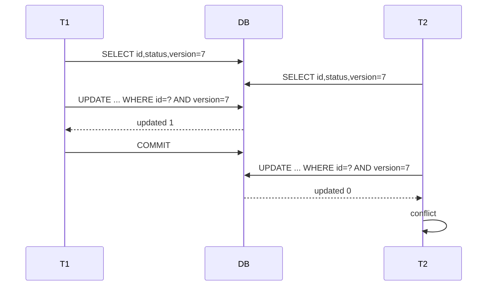
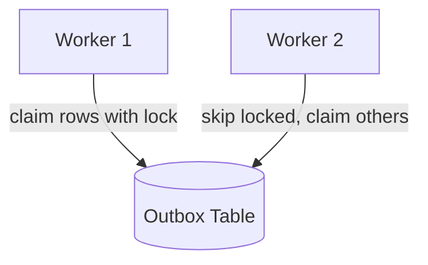

# Part 019 — Locking Patterns

> Lock adalah alat untuk membuat concurrency menjadi teratur.
>
> Tetapi lock juga bisa menjadi sumber bottleneck, deadlock, timeout, dan incident production.
>
> Engineer top-level tidak memakai lock karena panik. Ia memakai lock karena bisa menjawab:
>
> ```txt
> Invariant apa yang dilindungi?
> Resource apa yang dikunci?
> Berapa lama lock ditahan?
> Apa lock ordering-nya?
> Apa timeout-nya?
> Apa fallback ketika lock gagal?
> Apakah constraint/version lebih tepat?
> ```

Part ini membahas locking pattern dalam Java data access secara production-grade.

---

## 1. Core Thesis

Locking adalah cara membuat beberapa operasi concurrent tidak saling merusak state.

Tetapi lock bukan satu konsep tunggal.

Jenis umum:

| Pattern | Fungsi |
|---|---|
| Optimistic lock | Deteksi conflict saat write tanpa blocking awal |
| Pessimistic row lock | Mengunci row agar transaksi lain menunggu |
| Parent row lock | Mengunci aggregate root untuk melindungi child invariant |
| Predicate/range lock | Melindungi invariant pada range/set, bergantung DB/isolation |
| Advisory lock | Lock eksplisit berbasis key, biasanya vendor-specific |
| Application lock | Lock di level aplikasi/cache/distributed system |
| Lease lock | Lock dengan expiry untuk job/work ownership |
| Queue lock / claim | Mengambil work item secara aman |
| Unique constraint as lock | Constraint membiarkan DB menentukan pemenang |
| State transition lock | Expected-state update sebagai lock-free guard |

Lock yang baik harus punya scope kecil, waktu pendek, dan semantic jelas.

---

## 2. Locking Decision Framework

Sebelum memilih lock, jawab:

```txt
1. Apa invariant yang bisa rusak?
2. Apakah invariant bisa diekspresikan sebagai constraint?
3. Apakah update bisa dibuat atomic/conditional?
4. Apakah optimistic lock cukup?
5. Apakah konflik tinggi sehingga pessimistic lock lebih baik?
6. Apakah invariant lintas banyak row?
7. Apakah transaction harus menunggu atau gagal cepat?
8. Apa retry behavior-nya?
9. Apa metric yang menunjukkan lock pressure?
```

Decision matrix:

| Problem | Prefer |
|---|---|
| Unique value | unique constraint |
| Duplicate command | unique command ID / idempotency key |
| Lost update single row | optimistic lock or atomic update |
| State transition | conditional update + version |
| High-contention single aggregate | pessimistic lock maybe |
| Child invariant under aggregate | parent row lock or constraint |
| Work queue claiming | `FOR UPDATE SKIP LOCKED` / atomic claim |
| Singleton job | advisory lock / lease row |
| Cross-service workflow | state machine/saga, not DB lock |
| Long-running business process | durable state, not lock |
| External resource ownership | lease with expiry/fencing token |

---

## 3. Optimistic Lock

Optimistic lock assumes conflict is rare.

Flow:



SQL:

```sql
update case_file
set status = ?,
    version = version + 1,
    updated_at = ?
where id = ?
  and version = ?;
```

Java:

```java
int updated = ps.executeUpdate();

if (updated == 0) {
    throw new OptimisticConflict(caseId, expectedVersion);
}

if (updated > 1) {
    throw new DataAccessInvariantViolation("Expected one row, got " + updated);
}
```

Use for:

- edit form;
- aggregate update;
- human workflow;
- low/moderate contention;
- preventing lost update.

Not enough for:

- invariant across rows unless aggregate version row is updated;
- existence/range invariant;
- high-contention counter where retry rate becomes high.

---

## 4. Optimistic Lock With Domain Object

Domain carries version:

```java
public final class CaseFile {
    private final CaseFileId id;
    private CaseStatus status;
    private final long version;

    public void approve(UserId actor, String reason) {
        if (status != CaseStatus.UNDER_REVIEW) {
            throw new InvalidCaseTransition(status, CaseStatus.APPROVED);
        }
        status = CaseStatus.APPROVED;
    }

    public long version() {
        return version;
    }
}
```

Repository save:

```java
public void save(CaseFile caseFile) {
    String sql = """
        update case_file
        set status = ?,
            version = version + 1,
            updated_at = ?
        where id = ?
          and version = ?
        """;

    ...
    ps.setString(1, caseFile.status().dbCode());
    ps.setObject(2, clock.now());
    ps.setObject(3, caseFile.id().value());
    ps.setLong(4, caseFile.version());

    int updated = ps.executeUpdate();
    if (updated == 0) {
        throw new OptimisticConflict(caseFile.id(), caseFile.version());
    }
}
```

Important:

```txt
Version must be loaded and checked.
Having a version column without checking it is not optimistic locking.
```

---

## 5. JPA Optimistic Locking

With JPA:

```java
@Entity
@Table(name = "case_file")
class CaseFileEntity {
    @Id
    private UUID id;

    @Version
    private long version;

    @Column(nullable = false)
    private String status;
}
```

JPA/Hibernate uses version during update. If row was changed, optimistic lock exception occurs.

Benefits:

- standard pattern;
- integrated dirty checking;
- less manual SQL;
- good for aggregate entity.

Caveats:

- bulk JPQL/native updates can bypass version;
- detached entity merge can surprise;
- exception occurs at flush/commit, not necessarily at setter call;
- mapping to business conflict still needed;
- high conflict rate still hurts UX/performance.

---

## 6. Optimistic Lock Conflict Handling

Conflict is not always retryable.

Example human edit:

```txt
User A changes case status.
User B edits old form and saves.
```

Auto-retry may overwrite User A's change or approve with stale context.

Better:

- return conflict;
- show "case changed, reload";
- merge if business-safe;
- retry only for deterministic operations.

For background deterministic recalculation, retry may be okay:

```txt
recalculate risk score from current facts
```

For decision/action by human, conflict should usually surface.

---

## 7. Atomic Update Pattern

Sometimes no need load-modify-save.

Counter:

```sql
update case_metric
set view_count = view_count + 1
where case_id = ?;
```

Quota:

```sql
update officer_workload
set active_case_count = active_case_count + 1
where officer_id = ?
  and active_case_count < ?;
```

Java:

```java
int updated = ps.executeUpdate();

if (updated == 0) {
    throw new OfficerCapacityExceeded(officerId);
}
```

Atomic update is often better than optimistic load-update for counters.

---

## 8. Conditional State Transition

```sql
update case_file
set status = 'APPROVED',
    version = version + 1,
    approved_by = ?,
    approved_at = ?
where id = ?
  and status = 'UNDER_REVIEW'
  and version = ?;
```

This guards:

- current state;
- version;
- target row.

If `0` rows:

- not found;
- stale version;
- invalid state;
- unauthorized scope if tenant predicate included.

You can classify with a safe follow-up read if needed.

---

## 9. Unique Constraint as Lock

A unique constraint is often the best concurrency tool.

Example:

```sql
create unique index uq_case_active_primary_assignment
on case_assignment(case_id)
where assignment_type = 'PRIMARY'
  and ended_at is null;
```

Concurrent inserts:

```txt
T1 inserts active primary assignment -> success
T2 inserts active primary assignment -> unique violation
```

No explicit lock code needed.

Use for:

- uniqueness;
- idempotency key;
- single active record;
- natural key;
- dedup;
- outbox event key.

Principle:

```txt
Let the database arbitrate uniqueness.
Map losing transaction to business conflict.
```

---

## 10. Pessimistic Lock

Pessimistic lock assumes conflict is likely or conflict cannot be resolved after the fact.

SQL:

```sql
select id, status, version
from case_file
where id = ?
for update;
```

Transaction:

```java
@Transactional
public void assignOfficer(...) {
    CaseFileRow row = caseDao.findByIdForUpdate(caseId);

    validate(row);

    assignmentDao.insert(...);
    caseDao.incrementVersion(...);
}
```

Other transactions trying to update/lock same row wait until commit/rollback.

Use for:

- high-contention aggregate;
- child invariant protected by parent row;
- serializing state transitions;
- avoiding repeated optimistic conflicts;
- queue claiming with lock variants.

Risks:

- blocking;
- deadlocks;
- lock timeout;
- lower throughput;
- connection held while waiting;
- long transaction incident.

---

## 11. `SELECT FOR UPDATE` Lifecycle

Lock acquired:

```sql
select ...
for update
```

Lock released:

```txt
commit or rollback
```

Therefore transaction must be short.

Bad:

```java
tx {
    select for update case
    externalApi.call()
    update case
}
```

Good:

```java
external input prepared before transaction if safe

tx {
    select for update case
    validate current state
    update case
    audit
    outbox
}
```

If external work depends on locked state and takes long, redesign as workflow.

---

## 12. Lock Timeout

Do not let lock wait forever.

Options:

- database/session lock timeout;
- query timeout;
- transaction timeout;
- `NOWAIT` syntax if supported;
- application deadline.

Example database-specific concept:

```sql
select ...
from case_file
where id = ?
for update nowait;
```

If locked, fail immediately.

Use cases:

- user command should fail fast with "case is being modified";
- job should skip locked item;
- admin action should not hang.

Map lock timeout to:

- retry later;
- business conflict;
- temporary unavailable;
- worker skip.

---

## 13. `NOWAIT` Pattern

Concept:

```sql
select id, status
from case_file
where id = ?
for update nowait;
```

If another transaction holds lock, database returns error.

Application:

```java
try {
    CaseFileRow row = caseDao.findForUpdateNowait(caseId);
} catch (LockNotAvailable ex) {
    throw new CaseCurrentlyBeingModified(caseId, ex);
}
```

Good for interactive user operations where waiting is worse than returning conflict.

Caveat: syntax and error codes are database-specific.

---

## 14. `SKIP LOCKED` Pattern

Useful for work queues/outbox/job claiming.

Concept:

```sql
select id, payload
from outbox_event
where published_at is null
order by created_at, id
limit ?
for update skip locked;
```

Workers concurrently skip rows locked by others.

Flow:



Use for:

- outbox publisher;
- job queue;
- batch work claiming;
- inbox processing.

Caveats:

- database-specific;
- ordering approximate under contention;
- starvation possible;
- transaction must be short;
- publishing while lock held can be dangerous if slow.

Often better:

```txt
tx claim rows -> commit
publish outside -> tx mark published
```

with idempotent publish.

---

## 15. Parent Row Lock

For child invariant:

```txt
A case can have max 5 active reviewers.
```

Pattern:

```sql
select id
from case_file
where id = ?
for update;
```

Then:

```sql
select count(*)
from case_reviewer
where case_id = ?
  and ended_at is null;
```

Then insert/deactivate child.

This serializes child modifications if all code paths lock parent first.

Rule:

```txt
Lock discipline must be global.
```

If one code path inserts child without locking parent, invariant can break.

---

## 16. Lock Ordering

Deadlock prevention begins with consistent lock order.

Bad:

```txt
T1 locks case A then case B.
T2 locks case B then case A.
```

Good:

```java
List<CaseId> sorted = caseIds.stream()
        .sorted(Comparator.comparing(CaseId::value))
        .toList();

for (CaseId id : sorted) {
    caseDao.lock(id);
}
```

Order by stable key.

For multiple resource types, define hierarchy:

```txt
tenant -> case -> assignment -> audit
```

All transactions follow same order.

---

## 17. Deadlock Handling

Even with good design, deadlocks can occur.

Handling:

- rollback whole transaction;
- classify error as retryable if safe;
- retry with bounded backoff/jitter;
- emit metric;
- inspect lock graph if frequent.

Do not retry only one statement.

```java
retryingTx.execute(options, connection -> {
    // whole use case
});
```

Frequent deadlocks indicate design issue:

- inconsistent ordering;
- missing index;
- transaction too large;
- batch chunk too big;
- hot rows;
- lock escalation/range locks;
- external calls inside transaction.

---

## 18. Lock Scope: Row, Range, Table

Different operations lock different scopes.

Examples:

- `update by primary key`: row-level lock typically.
- `update where status='OPEN'`: many rows, maybe range/scan.
- `select for update` on indexed predicate: matching rows.
- unindexed predicate: may scan/lock more than expected depending database.
- DDL: can take schema/table locks.
- FK checks: can lock parent/child rows.

Indexes affect lock scope.

If update predicate is unindexed, database may examine many rows and create lock pressure.

---

## 19. Lock and Index Design

Example:

```sql
update case_assignment
set ended_at = ?
where ended_at is null
  and expires_at < ?;
```

Index:

```sql
create index ix_case_assignment_expiry
on case_assignment(expires_at)
where ended_at is null;
```

Without index:

- scan many rows;
- lock/check many rows;
- slow;
- more deadlocks/timeouts.

Locking pattern must include index review.

---

## 20. Advisory Lock

Advisory lock is an explicit lock by application-defined key, usually database-specific.

Concept:

```txt
lock("case:" + caseId)
```

Use cases:

- job singleton;
- coarse aggregate lock without row;
- migration guard;
- scheduled task coordination;
- lock on resource not represented as row.

Pros:

- flexible;
- no extra table sometimes;
- can be transaction-scoped or session-scoped depending DB.

Cons:

- vendor-specific;
- easy to misuse;
- less visible than row constraints;
- not tied to data model;
- can become global bottleneck;
- session-scoped locks dangerous with pools if not released.

Prefer transaction-scoped advisory lock if using one.

---

## 21. Advisory Lock Key Design

Key must be deterministic and scoped.

Bad:

```txt
"lock"
```

This serializes everything.

Better:

```txt
"case:" + caseId
"job:outbox-publisher"
"tenant:" + tenantId + ":billing-cycle:" + period
```

Avoid high-cardinality lock metrics labels, but lock keys themselves can be specific.

Document:

- who acquires;
- when released;
- timeout;
- fallback;
- protected invariant.

---

## 22. Lock Table Pattern

Portable alternative to advisory lock: lock table.

```sql
create table application_lock (
    lock_name text primary key,
    owner_id text not null,
    acquired_at timestamptz not null,
    expires_at timestamptz
);
```

Acquire:

```sql
insert into application_lock(lock_name, owner_id, acquired_at, expires_at)
values (?, ?, ?, ?);
```

If duplicate key, lock held.

Release:

```sql
delete from application_lock
where lock_name = ?
  and owner_id = ?;
```

Caveats:

- stale locks need expiry;
- clock source matters;
- owner/fencing required;
- transaction semantics needed;
- lock row can be hotspot.

For transaction-scoped lock, row lock can be used:

```sql
select *
from application_lock
where lock_name = ?
for update;
```

But row must exist.

---

## 23. Lease Lock

Lease is lock with expiration.

Use for:

- workers;
- scheduled jobs;
- long-ish processing where holder might crash.

Table:

```sql
create table job_lease (
    lease_name text primary key,
    owner_id text not null,
    fencing_token bigint not null,
    expires_at timestamptz not null
);
```

Acquire if expired:

```sql
update job_lease
set owner_id = ?,
    fencing_token = fencing_token + 1,
    expires_at = ?
where lease_name = ?
  and expires_at < ?;
```

If update count 1, acquired.

Fencing token prevents old holder from writing after lease lost.

---

## 24. Fencing Token

Problem:

```txt
Worker A acquires lease.
Worker A pauses.
Lease expires.
Worker B acquires lease.
Worker A resumes and writes stale output.
```

Fencing token:

- each lease acquisition increments token;
- downstream writes include token;
- storage/db rejects stale token.

Example:

```sql
update export_job
set status = ?,
    fencing_token = ?
where id = ?
  and fencing_token <= ?;
```

Or all writes check current owner token.

Without fencing, lease expiry alone is unsafe for critical writes.

---

## 25. Application Lock vs Database Lock

Application/distributed locks are tempting.

But if invariant is stored in database, database constraint/lock often better.

Example duplicate assignment:

- bad: Redis lock `case:{id}`;
- better: unique constraint on active assignment.

Why?

- DB is source of truth;
- lock and write atomicity easier;
- fewer split-brain issues;
- transaction rollback integrated.

Use external lock when resource is outside DB or coordinating work execution, not as substitute for DB invariant if DB can enforce it.

---

## 26. Queue Claiming Pattern

Work table:

```sql
create table job_task (
    id uuid primary key,
    status text not null,
    payload jsonb not null,
    claimed_by text,
    claimed_at timestamptz,
    completed_at timestamptz
);
```

Claim pattern database-specific:

```sql
select id
from job_task
where status = 'PENDING'
order by created_at, id
limit ?
for update skip locked;
```

Then:

```sql
update job_task
set status = 'PROCESSING',
    claimed_by = ?,
    claimed_at = ?
where id = ?;
```

Commit quickly.

Processing outside claim transaction, then mark complete. If worker crashes, lease/timeout resets task.

---

## 27. Claim-Then-Process vs Lock-While-Process

Do not hold DB lock while doing long processing.

Bad:

```txt
begin
select task for update
process external work for 2 minutes
update complete
commit
```

Better:

```txt
begin
claim task
commit

process external work

begin
mark complete if still owner
commit
```

Need lease/fencing/idempotency.

---

## 28. Locking and Outbox Publisher

Outbox rows:

```sql
published_at null
```

Claim rows:

```sql
update outbox_event
set claimed_by = ?,
    claimed_at = ?
where id in (...)
  and published_at is null
  and (claimed_at is null or claimed_at < ?);
```

Or `skip locked`.

Publish outside long transaction.

Mark published with ownership guard:

```sql
update outbox_event
set published_at = ?,
    claimed_by = null
where id = ?
  and claimed_by = ?;
```

If mark fails after publish, event may republish. Downstream idempotency required.

---

## 29. Lock Granularity

Coarse lock:

```txt
lock tenant
```

Pros:

- simple;
- fewer deadlocks;
- protects broad invariant.

Cons:

- low concurrency;
- one slow operation blocks many.

Fine lock:

```txt
lock case
```

Pros:

- better concurrency.

Cons:

- more complex;
- deadlock ordering important;
- may not protect cross-case invariant.

Choose smallest lock that protects invariant without making design fragile.

---

## 30. Lock Escalation

Some databases may escalate many row locks to broader locks or experience similar effects under heavy update.

Application-level implication:

- huge batch updates can block more than expected;
- chunk smaller;
- update by indexed key;
- avoid large transactions;
- monitor lock waits.

Even if DB does not literally escalate, broad scans can behave like coarse locking.

---

## 31. Lock Timeout as User Experience

For interactive command:

```txt
Case is being modified by another operation. Please retry.
```

Better than spinner for 30 seconds.

Pattern:

- set short lock timeout;
- map timeout to conflict/try later;
- include retry-after if appropriate;
- do not expose DB error.

For background job:

- skip locked or retry later;
- do not block all workers.

---

## 32. Lock Metrics

Track:

```txt
lock.wait.duration{operation}
lock.timeout.count{operation}
deadlock.count{operation}
optimistic.conflict.count{aggregate}
pessimistic.lock.acquire.count
queue.claim.count
queue.skip.locked.count
lease.acquire.success/failure
```

High lock wait means:

- transaction too long;
- hot aggregate;
- missing index;
- batch interference;
- lock order issue;
- database overloaded.

---

## 33. Lock Logging

On lock timeout/deadlock, log:

- operation/use case;
- aggregate ID if safe;
- lock type;
- attempt;
- transaction duration;
- SQLState/vendor code;
- query name;
- correlation ID;
- command ID;
- not raw sensitive payload.

If deadlocks frequent, inspect database deadlock logs/graphs.

---

## 34. Lock Testing

Concurrency test with two connections.

Pessimistic lock test:

```java
Connection t1 = ds.getConnection();
Connection t2 = ds.getConnection();

t1.setAutoCommit(false);
t2.setAutoCommit(false);

caseDao.lockForUpdate(t1, caseId);

Future<?> blocked = executor.submit(() -> {
    caseDao.lockForUpdate(t2, caseId);
});

assertThat(blocked).isNotDone();

t1.commit();

blocked.get(1, TimeUnit.SECONDS);
t2.rollback();
```

Use lock timeout to avoid hanging tests.

---

## 35. Deadlock Test

Two transactions lock resources in opposite order.

```txt
T1 locks A
T2 locks B
T1 tries B
T2 tries A
```

Test database deadlock classification and retry behavior.

Do not rely on this as normal unit test if flaky. Use integration/concurrency test suite.

---

## 36. Optimistic Lock Test

```java
CaseFile a = repository.findById(id).get();
CaseFile b = repository.findById(id).get();

a.approve(...);
repository.save(a);

b.reject(...);
assertThrows(OptimisticConflict.class, () -> repository.save(b));
```

With ORM, use separate transactions/entity managers to avoid first-level cache hiding behavior.

---

## 37. Unique Constraint Race Test

Run two concurrent inserts for same active assignment.

Expected:

- one succeeds;
- one gets business conflict;
- final active assignment count = 1;
- audit/outbox only for successful one.

This proves database constraint + error mapping.

---

## 38. Locking with ORM

JPA lock modes:

- optimistic versioning via `@Version`;
- optimistic force increment;
- pessimistic read/write;
- lock timeout hints depending provider/database.

Example:

```java
CaseFileEntity entity = entityManager.find(
        CaseFileEntity.class,
        id,
        LockModeType.PESSIMISTIC_WRITE
);
```

Caveats:

- generated SQL/provider behavior matters;
- lock timeout hints are provider/database-specific;
- lazy loading under lock can extend transaction;
- bulk update bypasses entity lock/version;
- exceptions need semantic mapping.

Always inspect SQL for critical locking path.

---

## 39. Pessimistic Lock and Fetch Graph

Do not lock huge graph accidentally.

Bad:

```java
select c
from CaseFile c
join fetch c.actions
join fetch c.documents
where c.id = :id
```

with pessimistic lock may lock/read too much or generate complex SQL.

Better:

- lock aggregate root row;
- load necessary child data separately if needed;
- keep lock scope explicit.

---

## 40. Locking and Lazy Loading

If after lock you call domain method that lazy-loads many associations, transaction stays open and lock held longer.

Use explicit load shape:

```java
repository.loadForAssignmentWithLock(caseId)
```

This method documents what is locked and loaded.

---

## 41. Locking and Bulk Update

Bulk update can lock many rows. Avoid running it in same transaction as user command unless bounded.

For batch:

- select IDs in chunk;
- update by IDs;
- commit;
- repeat.

Use `skip locked`/claim if multiple workers.

---

## 42. Locking and Read Replica

Locks on primary do not coordinate with reads on replica.

If command decision needs current state, read/lock primary.

Replica reads can be stale and cannot protect primary write invariant.

---

## 43. Locking and Cross-Service Systems

Do not hold DB lock while calling another service.

Cross-service invariant cannot be reliably protected by one service's DB lock.

Use:

- local transaction;
- outbox;
- saga;
- reservation with expiration;
- compensation;
- reconciliation;
- idempotency.

Example reservation:

```txt
Inventory service reserves item with lease.
Order service proceeds.
If payment fails, release reservation.
If timeout, reservation expires.
```

Each service owns local locks/transactions.

---

## 44. Reservation Pattern

Reservation is domain-level lock with expiry.

Table:

```sql
create table case_assignment_reservation (
    id uuid primary key,
    case_id uuid not null,
    officer_id uuid not null,
    command_id uuid not null,
    status text not null,
    expires_at timestamptz not null,
    created_at timestamptz not null,
    unique(command_id)
);
```

Use when:

- business process spans time;
- cannot hold DB transaction;
- user/system needs temporary claim;
- expiration/compensation acceptable.

Reservation must handle:

- expiry;
- confirmation;
- cancellation;
- duplicate command;
- audit;
- cleanup;
- race with final assignment.

---

## 45. Lock vs State Machine

For long workflows, state machine is better than lock.

Bad:

```txt
lock case for 2 hours until legal review done
```

Good:

```txt
case status = PENDING_LEGAL_REVIEW
legal reviewer command transitions to LEGAL_APPROVED
```

Locks protect short critical sections. State machines coordinate long business processes.

---

## 46. Lock vs Constraint

Prefer constraint when invariant is structural and always true.

| Invariant | Lock? | Constraint? |
|---|---:|---:|
| unique case number | no | yes |
| one active primary assignment | usually no | yes if DB supports partial unique |
| max 5 reviewers | maybe | hard as simple constraint |
| no overlapping date range | maybe | exclusion constraint if available |
| one command ID | no | yes |
| only valid status values | no | check constraint |

Lock is procedural. Constraint is declarative truth.

---

## 47. Lock vs Optimistic Version

Optimistic version:

- no waiting until write;
- better for low contention;
- conflict detected later;
- user may need retry/reload.

Pessimistic lock:

- waits/fails early;
- better for high contention critical section;
- can reduce wasted work;
- can cause blocking/deadlock.

Rule:

```txt
Use optimistic first for low-contention aggregate updates.
Use pessimistic when conflicts are frequent or work after read is expensive and must be serialized.
```

---

## 48. Lock vs Serializable

Serializable can protect complex predicate invariant without manual locks, but requires retry.

Manual locks can be more predictable if invariant maps to aggregate/root.

Serializable can be cleaner if:

- invariant is hard to lock manually;
- transaction is short;
- contention moderate;
- retry is safe;
- database implementation strong.

Manual locking can be better if:

- invariant has obvious parent row;
- you want clear blocking behavior;
- you need specific conflict message;
- retry cost high.

---

## 49. Lock Timeout Configuration Discipline

Timeout levels:

```txt
request deadline
transaction timeout
statement timeout
lock timeout
connection acquisition timeout
```

These must align.

Example:

```txt
request timeout: 3s
transaction timeout: 2s
lock timeout: 500ms
query timeout: 1s
connection acquire: 200ms
```

If lock timeout is 30s but request timeout 3s, application may keep DB work after client left.

---

## 50. Example: Assign Officer with Parent Lock

```java
@Transactional
public AssignOfficerResult assign(AssignOfficerCommand command) {
    CaseFileRow caseFile = caseDao.findByIdForUpdate(command.caseId())
            .orElseThrow(...);

    if (!caseFile.status().canAssignOfficer()) {
        throw new CaseCannotBeAssigned(caseFile.status());
    }

    int activeCount = assignmentDao.countActive(command.caseId());

    if (activeCount >= 5) {
        throw new TooManyActiveAssignments(command.caseId());
    }

    assignmentDao.insert(command.toAssignmentRow());
    caseDao.incrementVersion(command.caseId(), caseFile.version());
    auditDao.insert(...);
    outboxDao.append(...);

    return result;
}
```

All assignment modifications must lock case first.

If unique active primary index exists, still keep it for stronger guarantee.

---

## 51. Example: Queue Claim with Lease

```java
public List<JobTask> claim(String workerId, int limit, Instant now) {
    return tx.execute(connection -> {
        List<UUID> ids = taskDao.findClaimableIdsForUpdateSkipLocked(
                connection,
                now,
                limit
        );

        taskDao.markClaimed(connection, ids, workerId, now.plusSeconds(60));

        return taskDao.findByIds(connection, ids);
    });
}
```

Processing outside transaction:

```java
for (JobTask task : tasks) {
    process(task);
    taskDao.markCompletedIfOwner(task.id(), workerId);
}
```

If worker crashes, lease expires and another worker can claim.

Use fencing token for critical external writes.

---

## 52. Example: Singleton Scheduled Job

Lease row:

```sql
insert into job_lease(lease_name, owner_id, fencing_token, expires_at)
values ('risk-backfill', ?, 1, ?)
on conflict (lease_name) do update
set owner_id = excluded.owner_id,
    fencing_token = job_lease.fencing_token + 1,
    expires_at = excluded.expires_at
where job_lease.expires_at < ?;
```

If affected row indicates acquired, run job.

Renew periodically.

If unable to renew, stop.

Never assume scheduler uniqueness alone in distributed deployment.

---

## 53. Production Checklist

- [ ] Invariant needing lock is explicit.
- [ ] Constraint/conditional update considered first.
- [ ] Lock scope is minimal.
- [ ] Lock duration is short.
- [ ] Lock ordering defined.
- [ ] Lock timeout defined.
- [ ] Deadlock handling defined.
- [ ] Retry is safe/idempotent.
- [ ] External calls are outside lock/transaction.
- [ ] Index supports lock predicate.
- [ ] Metrics track lock wait/deadlock/conflict.
- [ ] ORM generated SQL inspected if using JPA locks.
- [ ] Tests use real database concurrency.
- [ ] Advisory/application locks have expiry/release strategy.
- [ ] Lease locks use fencing token if stale owner could write.

---

## 54. Anti-Pattern: Locking Without Invariant

```java
select ... for update
```

because "concurrency scary" is not design.

Every lock should have a named invariant.

---

## 55. Anti-Pattern: Holding Lock During External Call

```java
lock row
call service
update row
commit
```

Fix workflow/outbox/reservation.

---

## 56. Anti-Pattern: Redis Lock Protecting DB Uniqueness

If DB can enforce unique invariant, use DB constraint.

Redis lock can fail/open under network/split-brain or be bypassed by another code path. DB constraint remains final truth.

---

## 57. Anti-Pattern: No Lock Timeout

Waiting forever consumes threads/connections.

Set timeout/fail-fast strategy.

---

## 58. Anti-Pattern: Inconsistent Lock Order

Different code paths lock resources in different order.

Document and enforce order.

---

## 59. Mini Lab

Use case:

```txt
Close case only if:
- case is APPROVED
- no active assignment remains
- no pending sanction exists
- no document upload is in progress
```

Questions:

1. Which rows must be read?
2. Which invariant can be constraint?
3. Should you lock case row?
4. Should assignment/sanction/document modifications also lock case row?
5. Is read committed enough?
6. Would serializable be simpler?
7. What update predicates are needed?
8. What happens if upload starts concurrently?
9. What audit/outbox must be atomic?
10. What lock timeout should user command use?
11. How do you test the race?

---

## 60. Summary

Locking is a precision tool.

You must master:

- optimistic lock;
- version column;
- atomic update;
- conditional state transition;
- unique constraint as concurrency arbiter;
- pessimistic row lock;
- `SELECT FOR UPDATE`;
- `NOWAIT`;
- `SKIP LOCKED`;
- parent row lock;
- lock ordering;
- deadlock retry;
- advisory lock;
- lock table;
- lease lock;
- fencing token;
- queue claiming;
- lock granularity;
- index impact;
- ORM lock caveats;
- lock vs constraint/version/serializable/state machine;
- real concurrency testing.

Part berikutnya membahas **Idempotent Write Pattern**: command ID, idempotency key, unique constraint, dedup table, replay-safe result, outbox/inbox dedup, retry-safe mutation, and exactly-once illusion.

---

## 61. References

- Oracle Java SE `Connection` transaction/isolation methods: https://docs.oracle.com/en/java/javase/21/docs/api/java.sql/java/sql/Connection.html
- PostgreSQL Explicit Locking: https://www.postgresql.org/docs/current/explicit-locking.html
- PostgreSQL `SELECT` locking clauses: https://www.postgresql.org/docs/current/sql-select.html
- PostgreSQL Transaction Isolation: https://www.postgresql.org/docs/current/transaction-iso.html
- PostgreSQL Constraints: https://www.postgresql.org/docs/current/ddl-constraints.html
- Jakarta Persistence Locking: https://jakarta.ee/specifications/persistence/3.2/jakarta-persistence-spec-3.2
- Hibernate ORM User Guide — Locking: https://docs.hibernate.org/stable/orm/userguide/html_single/
- Spring Framework Transaction Management: https://docs.spring.io/spring-framework/reference/data-access/transaction.html
