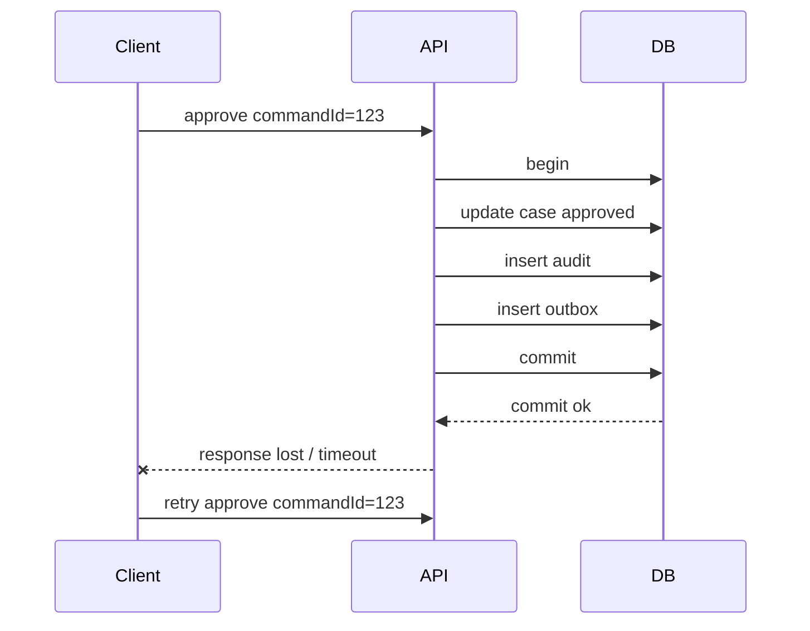
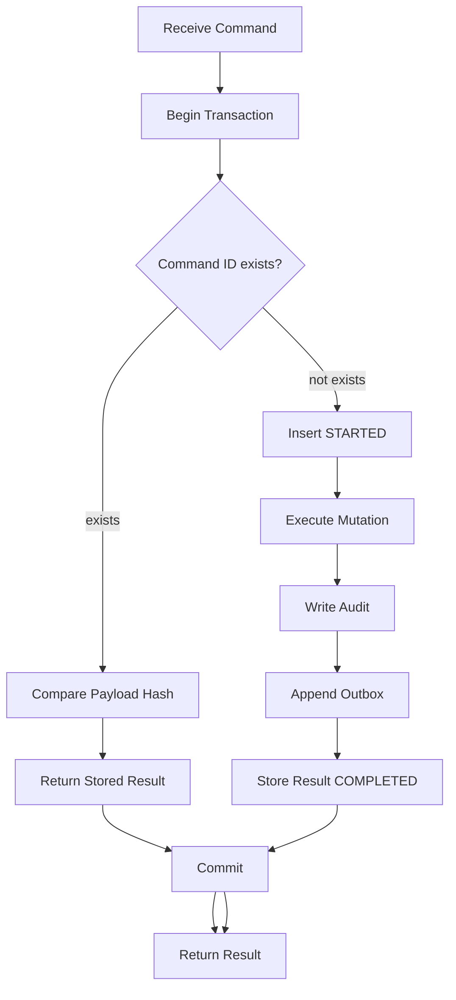

# Part 020 — Idempotent Write Pattern

> Distributed systems retry.
>
> Users double-click.
>
> Browsers timeout.
>
> Load balancers retry.
>
> Message brokers redeliver.
>
> Workers crash after commit.
>
> Networks fail after the database already committed.
>
> Jika write operation tidak idempotent, semua kondisi normal itu bisa menghasilkan duplicate state.

Part ini membahas cara mendesain write operation Java yang aman terhadap retry dan redelivery.

---

## 1. Core Thesis

Idempotent write berarti:

```txt
Executing the same semantic command more than once produces the same durable outcome as executing it once.
```

Bukan berarti method tidak dipanggil dua kali.

Bukan berarti database tidak menerima request kedua.

Bukan berarti broker tidak redeliver.

Artinya:

```txt
Duplicate execution is detected and handled without duplicate effect.
```

Example:

```txt
POST approve case commandId=abc
first call commits approval
client times out
client retries commandId=abc
server returns same approval result
no duplicate audit
no duplicate outbox event
no second state transition
```

---

## 2. Why Idempotency Is Mandatory

Failure scenario:



Without idempotency:

- duplicate audit;
- duplicate outbox event;
- invalid transition error;
- false failure to client;
- duplicate external notification;
- inconsistent user experience.

With idempotency:

- retry returns previous result;
- no duplicate effect.

---

## 3. Idempotent vs Safe vs Retryable

Terms:

| Term | Meaning |
|---|---|
| Safe operation | does not change state, like read |
| Idempotent operation | repeated same operation has same effect |
| Retryable operation | can be attempted again after failure |
| Deduplicated operation | duplicates detected by key |
| Exactly-once | often illusion across distributed boundary |

A write can be idempotent but not safe.

Example:

```txt
PUT /case/{id}/status APPROVED
```

Can be idempotent if setting same status repeatedly does not create duplicate history/events.

But if every call inserts history, it is not idempotent.

---

## 4. Idempotency Key

An idempotency key identifies one semantic command.

Examples:

```txt
commandId
requestId
messageId
eventId
businessOperationId
```

Good key properties:

- generated by caller or upstream command producer;
- stable across retries;
- unique for different semantic command;
- included in audit/outbox;
- stored with payload hash;
- scoped by actor/tenant/operation if needed;
- has retention policy.

Bad key:

```txt
random UUID generated server-side on every retry
```

That cannot deduplicate client retry.

---

## 5. Command ID Pattern

Command object:

```java
public record ApproveCaseCommand(
        UUID commandId,
        TenantId tenantId,
        CaseFileId caseId,
        UserId actorId,
        String reason,
        Instant requestedAt,
        String payloadHash
) {}
```

Rules:

- same command ID + same payload = same command;
- same command ID + different payload = reject;
- command ID stored transactionally;
- command result stored for replay.

Payload hash prevents accidental key reuse.

---

## 6. Dedup Table

Schema:

```sql
create table command_dedup (
    command_id uuid primary key,
    tenant_id uuid not null,
    command_type text not null,
    aggregate_type text not null,
    aggregate_id text not null,
    payload_hash text not null,
    status text not null,
    result_payload jsonb,
    failure_code text,
    created_at timestamptz not null,
    completed_at timestamptz
);
```

Possible status:

```txt
STARTED
COMPLETED
REJECTED
FAILED_RETRYABLE
FAILED_FINAL
```

Not every system needs all statuses. Minimal:

```txt
command_id, payload_hash, result_payload, completed_at
```

But status helps operational recovery.

---

## 7. Basic Idempotent Flow



Important:

```txt
Dedup insert, mutation, audit, outbox, and result must be in one transaction.
```

---

## 8. Insert-First Pattern

Inside transaction:

```java
public ApproveCaseResult approve(ApproveCaseCommand command) {
    return tx.execute(options, connection -> {
        CommandDedupState dedup = commandDedup.tryStart(connection, command);

        if (dedup.isDuplicate()) {
            return commandDedup.loadCompletedResult(
                    connection,
                    command.commandId(),
                    ApproveCaseResult.class
            );
        }

        ApproveCaseResult result = executeApproval(connection, command);

        commandDedup.complete(connection, command.commandId(), result);

        return result;
    });
}
```

`tryStart` can use insert with unique constraint.

PostgreSQL-style concept:

```sql
insert into command_dedup (
    command_id,
    tenant_id,
    command_type,
    aggregate_type,
    aggregate_id,
    payload_hash,
    status,
    created_at
)
values (?, ?, ?, ?, ?, ?, 'STARTED', ?)
on conflict (command_id) do nothing;
```

If affected rows = 0, duplicate.

Portable approach: insert and catch duplicate key. But duplicate exception can affect transaction state in some databases, so upsert/do-nothing or savepoint may be better.

---

## 9. Payload Hash Check

If duplicate command ID found:

```java
if (!existing.payloadHash().equals(command.payloadHash())) {
    throw new IdempotencyKeyReuseWithDifferentPayload(command.commandId());
}
```

Why?

Client bug:

```txt
commandId=123 approve case A
commandId=123 approve case B
```

Without hash check, server might return result for wrong command.

Hash should include semantic payload:

- command type;
- tenant ID;
- aggregate ID;
- actor if part of command identity;
- reason/content;
- important parameters.

Do not hash volatile headers that change across retry unless intended.

---

## 10. Replay-Safe Result

A duplicate command should return same result if completed.

Store result:

```sql
result_payload jsonb
```

Result example:

```json
{
  "caseId": "...",
  "status": "APPROVED",
  "version": 8,
  "approvedAt": "2026-07-05T10:15:30Z"
}
```

On retry:

```java
return objectMapper.readValue(existing.resultPayload(), ApproveCaseResult.class);
```

If result cannot be stored due size/sensitivity, store enough to reconstruct safely:

- aggregate ID;
- result version;
- completed timestamp;
- final status.

Then reload current state cautiously. But if current state evolved after command, replay may not match original. For strict idempotency, store result snapshot.

---

## 11. What About STARTED?

If command row is `STARTED`, cases:

1. same transaction still running but duplicate request somehow sees it only after commit;
2. previous transaction committed STARTED but failed before completing mutation due design;
3. process crashed after committing STARTED but before mutation if STARTED was separate transaction;
4. command intentionally async and still processing.

Best design for synchronous command:

```txt
STARTED is inserted in same transaction as mutation and result.
If transaction rolls back, STARTED rolls back.
If transaction commits, result is COMPLETED.
```

Then duplicate should rarely see committed STARTED unless you commit STARTED separately.

If you do commit STARTED separately, you need recovery semantics.

---

## 12. Single-Transaction Completed Pattern

Simpler table without committed STARTED:

```sql
create table command_result (
    command_id uuid primary key,
    tenant_id uuid not null,
    command_type text not null,
    payload_hash text not null,
    result_payload jsonb not null,
    completed_at timestamptz not null
);
```

Flow:

1. execute mutation;
2. insert command result with unique command ID;
3. commit.

Problem: duplicate concurrent execution may both execute mutation before result insert unless you insert dedup first or use other constraints.

Therefore for command with side effects, insert-first is safer.

---

## 13. Dedup Row as Command Lock

Insert dedup row at start acts as lock.

Concurrent same command:

- one transaction inserts;
- other waits/fails/conflicts depending DB;
- after commit, duplicate loads result.

Need decide duplicate while first in progress:

- wait for result;
- return 409/202 "in progress";
- poll;
- try again after delay.

For synchronous APIs, often duplicate request arrives after first timeout, not truly concurrent. But mobile/browser double submit can be concurrent.

---

## 14. Handling In-Progress Duplicate

Approaches:

### Return In Progress

```txt
409/202 Command is already being processed. Retry later with same key.
```

### Wait Briefly

Poll command result for short time.

Risk: ties up request thread.

### Use DB lock on command row

Duplicate waits for first transaction to finish, then reads result.

Risk: lock wait.

### Async Command Model

First request returns command accepted. Client polls command status.

Best for long operations.

---

## 15. Idempotent State Transition

State transition itself should be idempotency-aware.

Example approve:

If same command repeated after completion, return result.

If different command tries approve already approved case:

- maybe conflict;
- maybe idempotent by semantic if actor/reason same? Usually no unless command ID same.

Important distinction:

```txt
Same command retry -> idempotent replay.
Different command with same target state -> separate business operation.
```

Do not make all "approve already approved" successful unless domain says setting status is idempotent and no new audit/event needed.

---

## 16. Idempotent Insert

Create case with client-provided command ID and maybe business key.

Possible constraints:

```sql
unique(command_id)
unique(case_number)
```

Flow:

- duplicate command ID -> return same created case;
- duplicate case number with different command ID -> business conflict.

These are different.

```java
if (uniqueViolation("uq_command_id")) {
    return loadPreviousResult(commandId);
}

if (uniqueViolation("uq_case_number")) {
    throw new CaseNumberAlreadyExists(caseNumber);
}
```

---

## 17. Idempotent Update

Update with command ID:

```sql
create table case_command_history (
    command_id uuid primary key,
    case_id uuid not null,
    command_type text not null,
    result_payload jsonb not null,
    created_at timestamptz not null
);
```

Mutation:

```sql
update case_file
set status = ?,
    version = version + 1
where id = ?
  and version = ?;
```

Audit/outbox keyed by command ID.

If retry:

- command history returns result;
- mutation not repeated.

---

## 18. Idempotent Delete

Delete is tricky.

Hard delete repeated:

```txt
first delete row
second delete finds no row
```

Can be idempotent if "resource no longer exists" is acceptable.

But audit/outbox duplicate must be prevented.

Better for domain:

- soft delete/status transition;
- command ID;
- deletion audit unique by command ID;
- tombstone/outbox event unique.

If different command deletes already deleted row, return conflict or no-op depending API semantics.

---

## 19. Idempotent Batch

Batch job retry needs row-level idempotency.

Example expire assignments:

Unique audit/outbox key:

```txt
assignment-expired:{assignmentId}
```

Update predicate:

```sql
update case_assignment
set ended_at = ?,
    ended_reason = 'EXPIRED'
where id = ?
  and ended_at is null;
```

If retry after commit:

- update count 0 because already ended;
- audit insert duplicate key do nothing;
- outbox insert duplicate key do nothing.

But be careful: if assignment was ended by a different reason, update count 0 should not be treated as success blindly. Need inspect current state if semantics require.

---

## 20. Idempotent Outbox

Outbox event table:

```sql
create table outbox_event (
    id uuid primary key,
    event_key text not null,
    aggregate_type text not null,
    aggregate_id text not null,
    event_type text not null,
    payload jsonb not null,
    created_at timestamptz not null,
    published_at timestamptz,
    constraint uq_outbox_event_key unique (event_key)
);
```

Event key:

```txt
case-approved:{commandId}
case-assigned:{commandId}
assignment-expired:{assignmentId}:{expiryJobId?}
```

If command retried, same event key prevents duplicate outbox row.

For command-sourced event, `commandId` is usually best.

For deterministic batch event, row ID + event type may be enough.

---

## 21. Idempotent Inbox

Message consumer must handle redelivery.

Inbox table:

```sql
create table inbox_message (
    message_id text primary key,
    source text not null,
    received_at timestamptz not null,
    processed_at timestamptz,
    payload_hash text
);
```

Consumer:

```java
@Transactional
public void handle(EventMessage message) {
    boolean first = inbox.tryInsert(message.id(), message.source(), message.hash());

    if (!first) {
        return;
    }

    applyLocalMutation(message);
    outbox.appendIfNeeded(...);

    inbox.markProcessed(message.id());
}
```

If transaction rolls back, inbox insert rolls back and message can be retried.

If message processing commits, redelivery sees inbox and no-ops.

---

## 22. Inbox and Payload Hash

If same message ID arrives with different payload, treat as serious error.

```java
if (existing != null && !existing.payloadHash().equals(message.hash())) {
    throw new MessageIdentityViolation(message.id());
}
```

This catches producer/broker bug or ID collision.

---

## 23. Exactly-Once Illusion

Across database and message broker, "exactly once" is usually not something you should rely on at application semantic level.

Outbox + idempotent consumer gives:

```txt
at-least-once delivery + deduplication + idempotent effects
```

This is the practical production model.

Even if infrastructure provides strong guarantees, application idempotency remains valuable because:

- clients retry;
- operators replay;
- jobs rerun;
- migrations backfill;
- external APIs timeout;
- bugs happen.

---

## 24. Idempotency and External APIs

If calling external payment/document/email API, use their idempotency key if available.

Pattern:

```txt
external idempotency key = commandId or outbox event key
```

Outbox worker:

```java
externalClient.call(request, idempotencyKey=event.eventKey());
```

If worker retries after timeout, external service deduplicates.

If external service does not support idempotency, design compensation/reconciliation and avoid assuming exactly-once.

---

## 25. Idempotency Key Scope

A key may be scoped globally or by tenant/user/operation.

Global:

```sql
command_id primary key
```

Scoped:

```sql
unique(tenant_id, idempotency_key)
```

If clients generate simple keys, scope avoids collision across tenants.

But command ID UUID globally unique is simpler.

API header pattern:

```txt
Idempotency-Key: <client generated unique key>
```

Server stores with:

- tenant;
- actor;
- route/command type;
- payload hash.

---

## 26. Idempotency Retention

Dedup table grows.

Need retention policy:

| Command Type | Retention |
|---|---|
| payment/legal decision | long or permanent |
| case approval | likely long audit-linked |
| UI create request | days/weeks maybe |
| external idempotency API | based on retry window |
| message inbox | based on broker replay window |
| outbox event key | often retained with event |

Do not delete idempotency record too early if clients can retry late.

For regulatory systems, command history may be audit evidence.

---

## 27. Idempotency and Privacy

Result payload may contain sensitive data.

Options:

- store minimal result;
- encrypt payload;
- store reference to aggregate/version;
- apply retention;
- redact PII;
- separate command audit from full response.

Do not dump full API response with secrets into dedup table.

---

## 28. Idempotency and Command Payload Hash

Canonicalization matters.

If JSON payload field order differs, raw string hash changes.

Better:

- hash structured canonical command object;
- include only semantic fields;
- normalize whitespace/case if domain says equivalent;
- version hash algorithm/command schema.

Example:

```java
String payloadHash = commandHasher.hash(new ApproveCaseHashInput(
        command.tenantId(),
        command.caseId(),
        command.actorId(),
        command.reason()
));
```

Store:

```sql
payload_hash text not null
payload_schema_version int not null
```

---

## 29. Idempotency and Semantic Equality

Should these be same command?

```txt
reason = "Approved"
reason = " approved "
```

Depends domain.

Do not accidentally normalize legally meaningful text.

For regulatory reasons, exact text may matter. Then hash exact normalized transport-decoded value.

---

## 30. Idempotency and Status Code

HTTP response for duplicate completed command should generally be same semantic response as original.

If original created resource:

- first: 201 Created;
- retry: could return 200 OK or 201 with same body depending API design.

Important: no duplicate effect.

For async command:

- first: 202 Accepted;
- retry while processing: 202 with same command status;
- retry completed: 200/303/result depending API.

Be consistent.

---

## 31. Idempotency and Error Results

Should failed business validation be stored?

Example:

```txt
Approve closed case -> rejected
```

Options:

### Store rejection

Retry returns same rejection. Useful for audit.

### Do not store rejection

Retry re-evaluates current state. If state changed, result may differ.

For command semantics, storing rejection can be correct if command attempt itself is a fact.

For transient infrastructure failure, do not store as final result unless command definitely did not apply and client should retry.

---

## 32. Failure Classification for Idempotency

| Failure | Store Result? | Retry? |
|---|---|---|
| business rejection | maybe store rejected | no unless state changes matter |
| validation error before transaction | usually no or store rejected by design | client fix |
| duplicate command completed | return stored | no |
| deadlock rollback | no completed result | retry |
| serialization rollback | no completed result | retry |
| connection failure before commit | uncertain | retry with same key/reconcile |
| commit unknown | maybe command result can resolve | retry with same key |
| syntax/migration bug | no | no, alert |
| external publish failure via outbox | command still completed if outbox stored | publisher retries |

---

## 33. Idempotency and Unknown Commit Outcome

Scenario:

```txt
Transaction commits.
Connection fails before app receives confirmation.
```

If result row is in same transaction:

- retry with same command ID reads result if commit succeeded;
- if no result, previous transaction likely rolled back;
- command can execute.

This is why command result inside transaction is powerful.

---

## 34. Idempotency and Audit

Audit table should include command ID.

```sql
create table case_audit_log (
    id uuid primary key,
    command_id uuid not null,
    case_id uuid not null,
    action text not null,
    actor_id uuid not null,
    reason text,
    created_at timestamptz not null,
    constraint uq_case_audit_command_action unique(command_id, action)
);
```

Retry cannot duplicate audit.

Audit query can trace command.

---

## 35. Idempotency and Natural Idempotency

Some operations are naturally idempotent.

Example:

```sql
update notification
set read_at = coalesce(read_at, ?)
where id = ?;
```

Mark-as-read can be idempotent.

But still consider audit/outbox:

- do you emit `NotificationRead` only first time?
- do you update `read_at` on retry?
- do you need command result?

Natural state idempotency does not automatically make side effects idempotent.

---

## 36. Idempotent PUT vs POST

HTTP convention:

- PUT to known resource often idempotent.
- POST often not necessarily idempotent.

But application behavior matters more than method.

```txt
POST /cases/{id}/approve
```

Can be idempotent with command ID.

```txt
PUT /cases/{id}
```

Can be non-idempotent if every call appends history/event blindly.

Design the write, not only route verb.

---

## 37. Idempotency and UI Double Submit

User double-clicks button.

Frontend should disable button, but backend must still be safe.

Use command ID generated when form/action is prepared.

Flow:

1. UI fetches action form with command ID, or generates UUID.
2. Submit includes command ID.
3. Retry/double-click uses same command ID.
4. Backend deduplicates.

If UI generates new command ID per click, backend sees different commands. Need UI discipline or server-side dedup by semantic key if appropriate.

---

## 38. Server-Side Semantic Dedup

Sometimes clients cannot provide stable key.

You can dedup by semantic key:

```txt
approve-case:{caseId}:{actorId}:{targetStatus}
```

Risk:

- two legitimate commands with same semantic shape but different reason/time collapse incorrectly;
- hard to define equality;
- legal/audit semantics may differ.

Prefer explicit command ID.

Semantic dedup is useful for:

- event processing;
- scheduled job deterministic operations;
- outbox event key;
- batch repair row.

---

## 39. Idempotency and Message Broker Redelivery

Consumer must assume:

```txt
message can be delivered more than once
message order may not be perfect depending broker/config
consumer can crash after DB commit
producer can publish duplicate
operator can replay
```

Inbox dedup handles duplicate message ID.

But if two different messages represent same domain event, also need semantic idempotency.

Example:

```txt
CaseApproved event ID differs but aggregate version same.
```

Downstream can dedup by:

```txt
aggregate_type, aggregate_id, aggregate_version, event_type
```

if event versioning exists.

---

## 40. Idempotent Projection Update

Read model consumer:

```java
@Transactional
public void onCaseApproved(CaseApproved event) {
    if (!inbox.tryInsert(event.eventId())) {
        return;
    }

    dashboardProjection.apply(event);
}
```

Projection apply should be idempotent:

```sql
update case_dashboard
set status = ?,
    last_event_version = ?
where case_id = ?
  and last_event_version < ?;
```

If duplicate/old event arrives, update count 0.

This protects against duplicate and out-of-order older events.

---

## 41. Aggregate Version in Events

Event:

```json
{
  "eventId": "...",
  "aggregateType": "CaseFile",
  "aggregateId": "...",
  "aggregateVersion": 8,
  "eventType": "CaseApproved"
}
```

Consumer can enforce monotonic version:

```sql
update case_projection
set status = ?,
    aggregate_version = ?
where case_id = ?
  and aggregate_version < ?;
```

Or detect gap:

```txt
current version 6, event version 8 -> missing 7
```

Then trigger recovery.

---

## 42. Idempotency and Out-of-Order Events

Dedup alone does not solve ordering.

If event version 9 arrives before 8:

- dedup sees new event;
- applying 9 may skip state from 8.

Strategies:

- per-aggregate ordered processing;
- version check and gap detection;
- hold buffer;
- rebuild projection from source;
- event log replay;
- last-write-wins only if domain allows.

Idempotency and ordering are related but different.

---

## 43. Idempotency and Sagas

Saga step should be idempotent.

Example:

```txt
Reserve sanction number
```

Command ID:

```txt
sagaId + stepName
```

If orchestrator retries step, service returns same reservation.

Tables:

```sql
saga_step_dedup(
    saga_id,
    step_name,
    payload_hash,
    result_payload,
    primary key(saga_id, step_name)
)
```

Each local transaction uses step dedup + state mutation + outbox.

---

## 44. Idempotency and Compensation

Compensation can also be retried.

Example:

```txt
release reservation
```

Make release idempotent:

```sql
update reservation
set status = 'RELEASED'
where id = ?
  and status = 'ACTIVE';
```

If already released, same compensation command returns success/replayed result if same command.

But releasing a reservation that was confirmed may be conflict.

State predicate matters.

---

## 45. Idempotency and Payment-Like Operations

For money/legal/regulatory effects, never rely only on client retry behavior.

Use:

- idempotency key;
- unique business transaction ID;
- ledger entries with unique reference;
- immutable audit;
- external idempotency key;
- reconciliation job.

Ledger example:

```sql
create unique index uq_ledger_reference
on ledger_entry(reference_type, reference_id);
```

Retry inserts same reference -> duplicate detected -> load existing ledger entry.

---

## 46. Idempotency and Generated IDs

Server-generated ID after commit can be hard to replay if not stored.

If create resource:

- either client supplies resource ID/command ID;
- or store command ID -> generated resource ID mapping.

Table:

```sql
command_result(command_id, result_payload)
```

Result includes generated `caseId`.

Retry returns same `caseId`.

---

## 47. Idempotency and Upsert

Upsert can implement idempotency but can also hide conflicts.

Example safe-ish:

```sql
insert into command_dedup(command_id, payload_hash, result_payload)
values (?, ?, ?)
on conflict (command_id) do nothing;
```

Dangerous:

```sql
insert into case_file(case_number, status)
values (?, ?)
on conflict (case_number) do update set status = excluded.status;
```

This may overwrite existing case from different command.

Ask:

```txt
Is conflict same command retry or different command conflict?
```

Do not use upsert to avoid modeling conflict.

---

## 48. Idempotency and `ON CONFLICT DO NOTHING`

`do nothing` returns affected rows 0 on duplicate.

Good for:

- dedup insert;
- idempotent outbox insert;
- inbox insert;
- command start.

But if duplicate means different payload, you still need load existing and compare hash.

Pattern:

```java
int inserted = dedupDao.insertDoNothing(command);

if (inserted == 0) {
    ExistingCommand existing = dedupDao.find(command.commandId());
    existing.ensureSamePayload(command.payloadHash());
    return existing.resultOrInProgress();
}
```

---

## 49. Idempotency and Race Between Dedup and Mutation

If you only check dedup after mutation, race remains.

Bad:

```java
executeMutation();
insertCommandResult(commandId);
```

Two concurrent duplicates can both execute mutation before result insert.

Better:

```java
insert/start dedup first;
execute mutation;
store result;
```

Dedup row should guard execution.

---

## 50. Idempotency and Transaction Propagation

Dedup and mutation must be same transaction.

Bad:

```java
dedupRepository.insertRequiresNew(commandId);
mutationRepository.save(...); // fails
```

Now dedup says command started but mutation rolled back, depending status.

Could be valid for async command tracking, but needs recovery.

For simple synchronous command, keep dedup/mutation/result atomic.

---

## 51. Idempotency and Command Store Recovery

If async command store commits STARTED before work, recovery is needed.

Command table:

```sql
status: RECEIVED, PROCESSING, COMPLETED, FAILED_RETRYABLE, FAILED_FINAL
lease_owner
lease_expires_at
```

Worker claims command with lease, executes idempotently, stores result.

This becomes job/command processing system. More complex but appropriate for long-running commands.

---

## 52. Synchronous vs Asynchronous Idempotency

### Synchronous

Request completes within transaction.

```txt
dedup + mutation + result commit
response returns result
```

Good for short commands.

### Asynchronous

Request records command and returns accepted.

```txt
POST command -> command table RECEIVED
worker processes command idempotently
GET command status/result
```

Good for long commands, external dependencies, exports, heavy jobs.

Do not force long command into synchronous transaction.

---

## 53. Idempotency and Timeout Budget

If command can exceed client timeout, idempotency is essential.

But also consider async model.

If p99 command takes 20 seconds and client timeout 5 seconds:

- many retries;
- duplicate pressure;
- poor UX.

Better:

- return 202 with command ID;
- process async;
- poll status;
- notify when done.

---

## 54. Idempotency and Result Recalculation

If duplicate command returns current aggregate state instead of stored result, result may differ.

Example:

1. command approves case -> version 8.
2. later command closes case -> version 9.
3. retry approve command returns current status CLOSED.

That is not same result.

Store original command result if exact replay matters.

---

## 55. Idempotency and Audit Semantics

Duplicate retry should not create new audit event.

Different command that attempts same action may create rejected audit or conflict.

Audit records should clarify:

- `APPROVE_CASE_SUCCEEDED`;
- `APPROVE_CASE_REJECTED_INVALID_STATE`;
- `APPROVE_CASE_DUPLICATE_REPLAY` usually not domain audit, maybe technical metric.

Do not audit duplicate retry as new approval.

---

## 56. Idempotency and Observability

Metrics:

```txt
idempotency.command.started.count{type}
idempotency.command.replayed.count{type}
idempotency.key_reuse_conflict.count{type}
idempotency.in_progress.count{type}
idempotency.result_missing.count{type}
idempotency.dedup.insert.conflict.count{type}
inbox.duplicate.count{source}
outbox.duplicate_event_key.count{type}
```

Logs:

- command ID;
- command type;
- aggregate ID;
- duplicate/replay status;
- payload hash mismatch;
- result status;
- correlation ID.

Do not log sensitive payload.

---

## 57. Idempotency and Alerting

Alert on:

- payload hash mismatch;
- completed command result missing;
- high in-progress stale commands;
- duplicate key conflict spike unexpected;
- inbox duplicate spike if source unhealthy;
- outbox duplicate event key from non-retry path;
- command stuck STARTED beyond SLA.

Do not alert on normal duplicate retries at low rate.

---

## 58. Idempotency Testing

Test:

1. same command twice returns same result;
2. same command concurrent twice only applies once;
3. same command ID different payload rejected;
4. timeout/unknown commit simulated by calling again after commit;
5. duplicate audit not created;
6. duplicate outbox not created;
7. deadlock retry does not duplicate effect;
8. inbox redelivery no-ops;
9. old event version does not overwrite projection;
10. retention cleanup does not break expected retry window.

Use real database for unique constraints and transaction behavior.

---

## 59. Concurrent Idempotency Test

Pseudo:

```java
ApproveCaseCommand command = newCommand();

CyclicBarrier barrier = new CyclicBarrier(2);

Callable<ApproveCaseResult> task = () -> {
    barrier.await();
    return approveUseCase.handle(command);
};

Future<ApproveCaseResult> f1 = executor.submit(task);
Future<ApproveCaseResult> f2 = executor.submit(task);

ApproveCaseResult r1 = f1.get();
ApproveCaseResult r2 = f2.get();

assertThat(r1).isEqualTo(r2);
assertThat(auditQuery.countByCommandId(command.commandId())).isEqualTo(1);
assertThat(outboxQuery.countByEventKey("case-approved:" + command.commandId())).isEqualTo(1);
```

You may need handle one request seeing in-progress depending design.

---

## 60. Example: Approve Case Idempotent Implementation

```java
@Transactional
public ApproveCaseResult approve(ApproveCaseCommand command) {
    CommandStartResult start = commandDedup.tryStart(command);

    if (start.isDuplicate()) {
        return commandDedup.loadCompletedResult(
                command.commandId(),
                ApproveCaseResult.class
        );
    }

    CaseFile caseFile = caseRepository.findById(command.caseId())
            .orElseThrow(() -> new CaseNotFound(command.caseId()));

    CaseStatus previous = caseFile.status();

    caseFile.approve(command.actorId(), command.reason());

    caseRepository.save(caseFile);

    auditRepository.append(CaseAuditRecord.statusChanged(
            command.commandId(),
            caseFile.id(),
            command.actorId(),
            "APPROVE_CASE",
            previous,
            caseFile.status(),
            command.reason(),
            command.now()
    ));

    outboxRepository.append(new OutboxEvent(
            UUID.randomUUID(),
            "case-approved:" + command.commandId(),
            "CaseFile",
            caseFile.id().toString(),
            "CaseApproved",
            payloadJson(caseFile, command),
            command.now()
    ));

    ApproveCaseResult result = ApproveCaseResult.from(caseFile);

    commandDedup.complete(command.commandId(), result);

    return result;
}
```

The exact code depends framework, but invariant is:

```txt
dedup + mutation + audit + outbox + result = one transaction
```

---

## 61. Example SQL: Command Dedup Try Start

```sql
insert into command_dedup (
    command_id,
    tenant_id,
    command_type,
    aggregate_type,
    aggregate_id,
    payload_hash,
    status,
    created_at
)
values (?, ?, ?, ?, ?, ?, 'STARTED', ?)
on conflict (command_id) do nothing;
```

If inserted:

```txt
first execution
```

If not inserted:

```sql
select command_id, payload_hash, status, result_payload
from command_dedup
where command_id = ?;
```

Then:

- hash mismatch -> reject;
- completed -> return result;
- started -> in progress handling.

---

## 62. Example SQL: Complete Command

```sql
update command_dedup
set status = 'COMPLETED',
    result_payload = ?::jsonb,
    completed_at = ?
where command_id = ?
  and status = 'STARTED';
```

Update count must be 1.

If 0, command state changed unexpectedly. Fail/alert.

---

## 63. Example: Inbox Consumer

```java
@Transactional
public void onCaseApproved(EventMessage<CaseApprovedPayload> message) {
    InboxStartResult start = inbox.tryStart(
            message.messageId(),
            message.source(),
            message.payloadHash()
    );

    if (start.isDuplicate()) {
        return;
    }

    projection.applyCaseApproved(message.payload());

    inbox.markProcessed(message.messageId());

    outbox.appendIfThisConsumerEmits(...);
}
```

Projection update:

```sql
update case_dashboard
set status = 'APPROVED',
    aggregate_version = ?
where case_id = ?
  and aggregate_version < ?;
```

This makes duplicate/old event harmless.

---

## 64. Anti-Pattern: Random Key Per Retry

Client retries with new key every time.

Backend cannot deduplicate.

Fix:

- client generates key once per user intent;
- server returns command ID in form/session;
- mobile app persists key until response;
- message producer uses stable event ID.

---

## 65. Anti-Pattern: Idempotency Table Outside Transaction

```java
dedup.insert(commandId); // commits
mutation();             // fails
```

Now retries think command exists but no result.

Fix: same transaction, or full async command recovery model.

---

## 66. Anti-Pattern: Same Key Different Payload Accepted

This can return wrong result or corrupt user intent.

Always compare payload hash.

---

## 67. Anti-Pattern: Only Idempotent State, Duplicate Side Effects

```java
update status = APPROVED
insert audit
insert outbox
```

Status update may be idempotent but audit/outbox duplicate.

All side effects must be idempotent.

---

## 68. Anti-Pattern: Infinite Dedup Retention Without Design

Command table grows forever unintentionally.

Design retention, partitioning, archiving, or audit storage.

For regulatory systems, retention may be intentional. Then design indexes and storage.

---

## 69. Anti-Pattern: Treating Idempotency as Frontend Concern

Frontend disable button helps UX. It is not correctness.

Backend must enforce.

---

## 70. Production Checklist

- [ ] Every retryable write has command ID/idempotency key.
- [ ] Same key + different payload is rejected.
- [ ] Dedup key has unique constraint.
- [ ] Dedup/mutation/audit/outbox/result are same transaction.
- [ ] Stored result supports replay.
- [ ] Audit has command ID unique key.
- [ ] Outbox has event key unique key.
- [ ] Inbox handles message redelivery.
- [ ] External API uses idempotency key if available.
- [ ] Retry policy only retries idempotent operations.
- [ ] In-progress duplicate behavior is defined.
- [ ] Retention policy exists.
- [ ] Sensitive result payload is protected/minimized.
- [ ] Concurrent duplicate test exists.
- [ ] Unknown commit outcome can be resolved by retry with same key.
- [ ] Metrics track replay, conflict, stuck commands.

---

## 71. Mini Lab

Design idempotency for:

```txt
POST /cases/{caseId}/assign-primary-officer
```

Payload:

```json
{
  "commandId": "...",
  "officerId": "...",
  "reason": "..."
}
```

Rules:

- same command retry returns same result;
- same command ID different officer rejected;
- only one active primary assignment per case;
- assignment writes audit and outbox;
- officer capacity max 20 active cases;
- if officer capacity conflict, result should be stable for same command;
- if deadlock occurs, retry safely.

Questions:

1. What goes into payload hash?
2. What unique constraints are needed?
3. Is capacity conflict stored as rejected command?
4. How does duplicate command load previous result?
5. How do you prevent duplicate audit?
6. How do you prevent duplicate outbox?
7. How do you handle in-progress duplicate?
8. What happens if commit succeeds but HTTP response is lost?
9. What happens if worker/broker redelivers event?
10. What retention does command result need?

---

## 72. Summary

Idempotent write is mandatory for reliable Java data access in distributed systems.

You must master:

- idempotency key;
- command ID;
- payload hash;
- dedup table;
- unique constraints;
- insert-first pattern;
- replay-safe result;
- in-progress duplicate handling;
- same transaction for dedup/mutation/audit/outbox/result;
- idempotent audit/outbox keys;
- inbox dedup;
- external API idempotency keys;
- exactly-once illusion;
- async command model;
- retry classification;
- unknown commit outcome recovery;
- retention/privacy;
- concurrent duplicate testing.

Part berikutnya membahas **Concurrency Anomaly Lab**: double spending, duplicate approval, stale state transition, concurrent assignment, write skew, phantom, and how to prove fixes with real database tests.

---

## 73. References

- PostgreSQL Unique Constraints: https://www.postgresql.org/docs/current/ddl-constraints.html
- PostgreSQL `INSERT ... ON CONFLICT`: https://www.postgresql.org/docs/current/sql-insert.html
- PostgreSQL Transaction Isolation: https://www.postgresql.org/docs/current/transaction-iso.html
- Oracle Java SE `SQLException`: https://docs.oracle.com/en/java/javase/21/docs/api/java.sql/java/sql/SQLException.html
- Oracle Java SE `Connection`: https://docs.oracle.com/en/java/javase/21/docs/api/java.sql/java/sql/Connection.html
- Jakarta Persistence Versioning and Locking: https://jakarta.ee/specifications/persistence/3.2/jakarta-persistence-spec-3.2
- Hibernate ORM User Guide: https://docs.hibernate.org/stable/orm/userguide/html_single/
