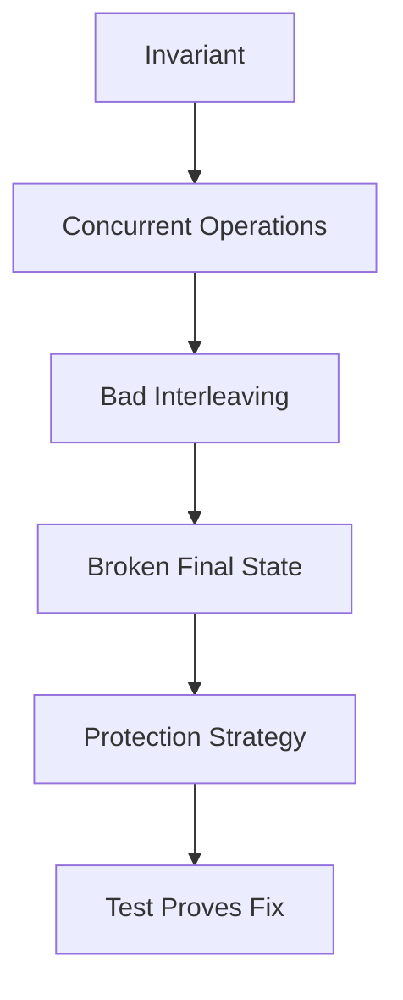
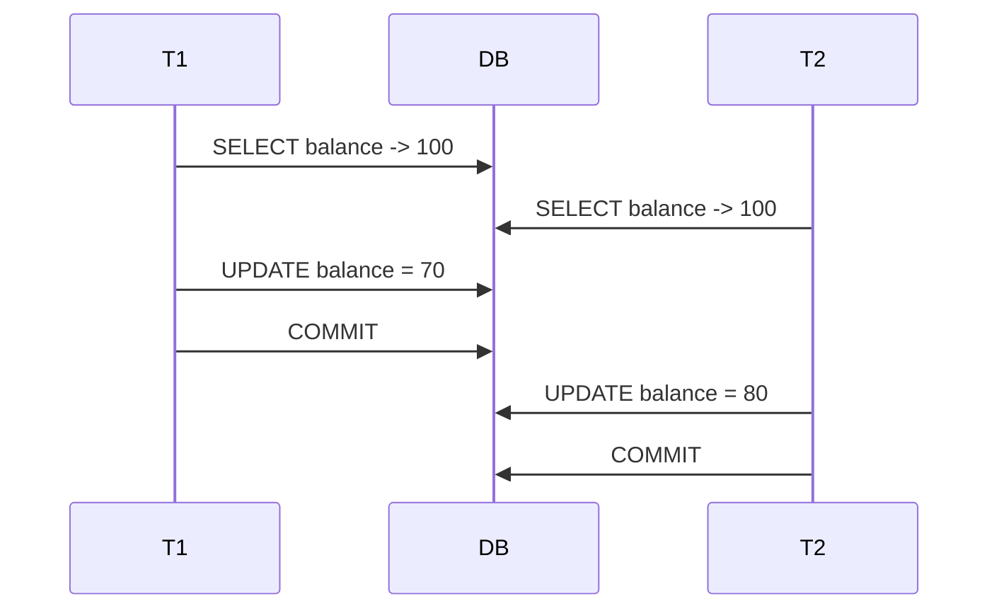
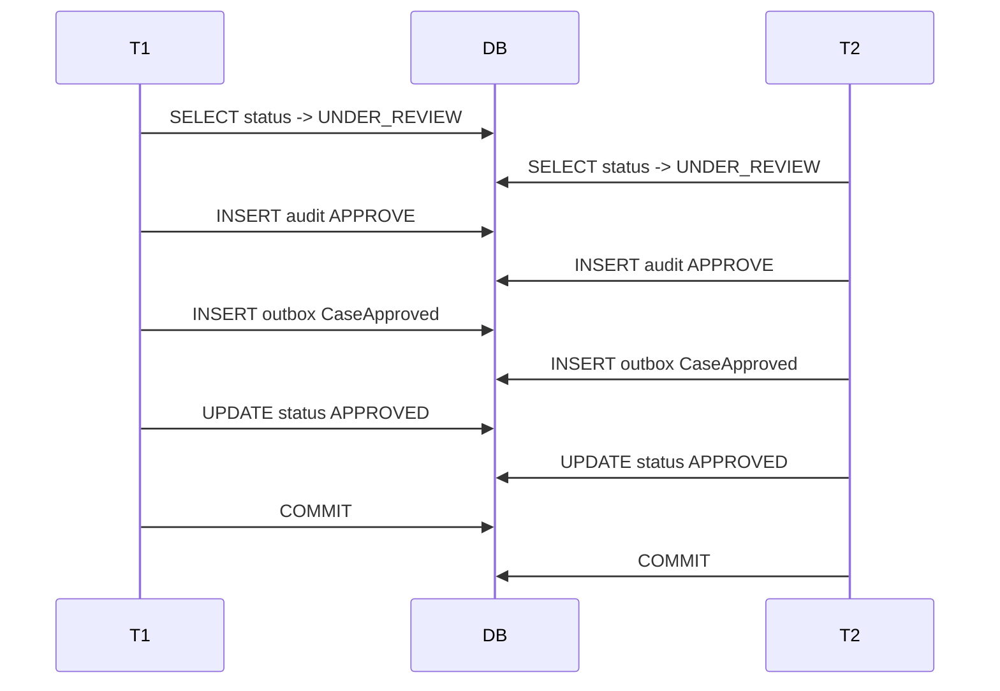

# Part 021 — Concurrency Anomaly Lab

> Concurrency bug tidak cukup dipahami dengan membaca definisi isolation level.
>
> Kamu harus bisa membuat bug itu terjadi, melihat final state yang salah, lalu membuktikan fix-nya.
>
> Engineer yang kuat bisa berkata:
>
> ```txt
> Ini anomaly-nya.
> Ini interleaving transaksinya.
> Ini schema/query yang salah.
> Ini test yang membuat bug reproducible.
> Ini fix-nya.
> Ini test yang membuktikan invariant tidak pecah lagi.
> ```

Part ini adalah lab untuk anomaly paling penting dalam data access: double spending, duplicate approval, stale transition, concurrent assignment, lost update, phantom, dan write skew.

---

## 1. Core Thesis

Concurrency anomaly harus diuji sebagai property, bukan hanya sebagai happy-path unit test.

Template berpikir:

```txt
Invariant:
  Apa yang harus selalu benar?

Concurrent operations:
  Operasi apa yang bisa berjalan bersamaan?

Bad interleaving:
  Bagaimana dua transaksi valid secara lokal bisa merusak invariant?

Protection:
  Constraint? version? conditional update? lock? serializable?

Proof:
  Test dengan dua connection/transaction yang memaksa interleaving.
```

Diagram:



---

## 2. Lab Infrastructure Mental Model

Concurrency test harus memakai:

- database nyata yang sama dengan production atau sangat dekat;
- dua connection atau dua transaction context terpisah;
- barrier/latch untuk mengontrol urutan;
- timeout agar test tidak hang;
- final invariant assertion;
- cleanup data per test;
- isolation level eksplisit jika sedang diuji.

Jangan pakai mock repository untuk anomaly. Mock tidak punya lock, isolation, deadlock, transaction state, constraint timing, atau MVCC behavior.

---

## 3. Basic Two-Connection Harness

Manual JDBC skeleton:

```java
public final class TwoConnectionHarness {
    private final DataSource dataSource;

    public TwoConnectionHarness(DataSource dataSource) {
        this.dataSource = dataSource;
    }

    public void run(TxWork left, TxWork right) throws Exception {
        try (
            Connection c1 = dataSource.getConnection();
            Connection c2 = dataSource.getConnection()
        ) {
            c1.setAutoCommit(false);
            c2.setAutoCommit(false);

            ExecutorService executor = Executors.newFixedThreadPool(2);

            Future<?> f1 = executor.submit(() -> runWork(c1, left));
            Future<?> f2 = executor.submit(() -> runWork(c2, right));

            f1.get(5, TimeUnit.SECONDS);
            f2.get(5, TimeUnit.SECONDS);

            executor.shutdownNow();
        }
    }

    private void runWork(Connection connection, TxWork work) {
        try {
            work.run(connection);
        } catch (Exception e) {
            throw new RuntimeException(e);
        }
    }

    @FunctionalInterface
    public interface TxWork {
        void run(Connection connection) throws Exception;
    }
}
```

Untuk test nyata, tambahkan:

- rollback di cleanup;
- commit/rollback eksplisit di tiap worker;
- timeout handling;
- exception capture;
- barrier.

---

## 4. Barrier Pattern

`CyclicBarrier` membuat dua transaksi berhenti pada titik yang sama.

```java
CyclicBarrier afterRead = new CyclicBarrier(2);

Future<?> t1 = executor.submit(() -> {
    tx.execute(connection -> {
        Account account = accountDao.find(connection, accountId);
        afterRead.await();

        accountDao.updateBalance(connection, accountId, account.balance() - 30);
        return null;
    });
});

Future<?> t2 = executor.submit(() -> {
    tx.execute(connection -> {
        Account account = accountDao.find(connection, accountId);
        afterRead.await();

        accountDao.updateBalance(connection, accountId, account.balance() - 20);
        return null;
    });
});
```

Kedua transaksi membaca state awal sebelum salah satu menulis.

Ini sangat berguna untuk membuat lost update terjadi.

---

## 5. CountDownLatch Pattern

`CountDownLatch` cocok untuk ordering satu arah.

Example:

```java
CountDownLatch t1Locked = new CountDownLatch(1);
CountDownLatch allowT1Commit = new CountDownLatch(1);

Future<?> t1 = executor.submit(() -> {
    tx.execute(connection -> {
        caseDao.lockForUpdate(connection, caseId);
        t1Locked.countDown();

        allowT1Commit.await();
        caseDao.updateStatus(connection, caseId, "APPROVED");
        return null;
    });
});

Future<?> t2 = executor.submit(() -> {
    t1Locked.await();

    tx.execute(connection -> {
        caseDao.tryLockForUpdate(connection, caseId);
        return null;
    });
});

allowT1Commit.countDown();
```

Gunakan timeout pada `await` agar test tidak hang selamanya.

---

## 6. Lab 1 — Lost Update

### Invariant

```txt
Balance must reflect all successful debits.
```

Initial:

```txt
account.balance = 100
```

Two commands:

```txt
T1 debit 30
T2 debit 20
```

Correct final:

```txt
50
```

Bad final:

```txt
70 or 80
```

### Bad Schema

```sql
create table account (
    id uuid primary key,
    balance numeric(19,2) not null
);
```

### Bad Code

```java
public void debit(Connection connection, UUID accountId, BigDecimal amount)
        throws SQLException {
    BigDecimal balance = findBalance(connection, accountId);

    BigDecimal newBalance = balance.subtract(amount);

    updateBalance(connection, accountId, newBalance);
}
```

Update:

```sql
update account
set balance = ?
where id = ?;
```

No version. No atomic update. No lock.

---

## 7. Lost Update Interleaving



Final `80`. T1 debit disappeared.

---

## 8. Lost Update Test

```java
@Test
void lostUpdateOccursWithoutProtection() throws Exception {
    UUID accountId = fixture.accountWithBalance("100.00");
    CyclicBarrier afterRead = new CyclicBarrier(2);

    ExecutorService executor = Executors.newFixedThreadPool(2);

    Future<?> t1 = executor.submit(() -> runTx(connection -> {
        BigDecimal balance = accountDao.findBalance(connection, accountId);
        await(afterRead);
        accountDao.updateBalance(connection, accountId, balance.subtract(new BigDecimal("30.00")));
    }));

    Future<?> t2 = executor.submit(() -> runTx(connection -> {
        BigDecimal balance = accountDao.findBalance(connection, accountId);
        await(afterRead);
        accountDao.updateBalance(connection, accountId, balance.subtract(new BigDecimal("20.00")));
    }));

    t1.get(5, TimeUnit.SECONDS);
    t2.get(5, TimeUnit.SECONDS);

    BigDecimal finalBalance = accountDao.findBalance(accountId);

    assertThat(finalBalance).isNotEqualByComparingTo("50.00");
}
```

Test ini sengaja membuktikan bug. Setelah fix, assertion harus berubah menjadi invariant benar.

---

## 9. Lost Update Fix A — Atomic Update

SQL:

```sql
update account
set balance = balance - ?
where id = ?
  and balance >= ?;
```

Java:

```java
public void debitAtomic(Connection connection, UUID accountId, BigDecimal amount)
        throws SQLException {
    String sql = """
        update account
        set balance = balance - ?
        where id = ?
          and balance >= ?
        """;

    try (PreparedStatement ps = connection.prepareStatement(sql)) {
        ps.setBigDecimal(1, amount);
        ps.setObject(2, accountId);
        ps.setBigDecimal(3, amount);

        int updated = ps.executeUpdate();

        if (updated == 0) {
            throw new InsufficientBalance(accountId);
        }

        if (updated != 1) {
            throw new DataAccessInvariantViolation("Expected one account update");
        }
    }
}
```

This is often the best for counters/balances if business rule can be expressed atomically.

---

## 10. Lost Update Fix B — Optimistic Lock

Schema:

```sql
alter table account add column version bigint not null default 0;
```

Update:

```sql
update account
set balance = ?,
    version = version + 1
where id = ?
  and version = ?;
```

If affected rows 0, conflict.

Good for human edit. For debit, atomic update is usually better because it avoids load-modify-write conflict and expresses invariant in SQL.

---

## 11. Lost Update Fix Test

```java
@Test
void atomicDebitPreservesBothUpdates() throws Exception {
    UUID accountId = fixture.accountWithBalance("100.00");
    CyclicBarrier startTogether = new CyclicBarrier(2);

    Future<?> t1 = executor.submit(() -> runTx(connection -> {
        await(startTogether);
        accountDao.debitAtomic(connection, accountId, new BigDecimal("30.00"));
    }));

    Future<?> t2 = executor.submit(() -> runTx(connection -> {
        await(startTogether);
        accountDao.debitAtomic(connection, accountId, new BigDecimal("20.00"));
    }));

    t1.get(5, TimeUnit.SECONDS);
    t2.get(5, TimeUnit.SECONDS);

    assertThat(accountDao.findBalance(accountId))
            .isEqualByComparingTo("50.00");
}
```

Now final invariant holds.

---

## 12. Lab 2 — Double Spending / Quota Overspend

### Invariant

```txt
officer.active_case_count must not exceed officer.max_active_cases
```

Initial:

```txt
active_case_count = 19
max_active_cases = 20
```

Two concurrent assignments both check count 19, both assign.

Final:

```txt
active_case_count = 21
```

### Bad Code

```java
int active = assignmentDao.countActiveByOfficer(connection, officerId);

if (active >= 20) {
    throw new OfficerCapacityExceeded(officerId);
}

assignmentDao.insert(connection, caseId, officerId);
```

This is check-then-act.

---

## 13. Double Spending Fix — Counter Row Conditional Update

Schema:

```sql
create table officer_workload (
    officer_id uuid primary key,
    active_case_count int not null,
    max_active_cases int not null,
    version bigint not null
);
```

SQL:

```sql
update officer_workload
set active_case_count = active_case_count + 1,
    version = version + 1
where officer_id = ?
  and active_case_count < max_active_cases;
```

If affected rows 0:

```txt
capacity full
```

Transaction:

```txt
update workload counter conditionally
insert assignment
audit
outbox
commit
```

If assignment insert fails, rollback counter increment.

---

## 14. Double Spending Fix Code

```java
public void reserveOfficerCapacity(Connection connection, UUID officerId)
        throws SQLException {
    String sql = """
        update officer_workload
        set active_case_count = active_case_count + 1,
            version = version + 1
        where officer_id = ?
          and active_case_count < max_active_cases
        """;

    try (PreparedStatement ps = connection.prepareStatement(sql)) {
        ps.setObject(1, officerId);

        int updated = ps.executeUpdate();

        if (updated == 0) {
            throw new OfficerCapacityExceeded(officerId);
        }

        if (updated != 1) {
            throw new DataAccessInvariantViolation("Expected one workload row update");
        }
    }
}
```

This turns a predicate over many assignments into one atomic row update.

---

## 15. Lab 3 — Duplicate Approval

### Invariant

```txt
A case approval must happen once.
Audit/outbox for approval must happen once.
```

Initial:

```txt
case.status = UNDER_REVIEW
```

Bad command:

```java
CaseFile caseFile = repository.findById(caseId);
if (caseFile.status() == UNDER_REVIEW) {
    audit.insert(APPROVE_CASE);
    outbox.insert(CaseApproved);
    repository.updateStatus(APPROVED);
}
```

Two transactions can both read `UNDER_REVIEW`, both insert audit/outbox, and both update status.

Even if final status is only APPROVED, side effects duplicate.

---

## 16. Duplicate Approval Interleaving



Broken final facts:

```txt
case approved once as state
but audit/event says approved twice
```

---

## 17. Duplicate Approval Fix

Use:

1. command ID idempotency;
2. conditional update with expected status/version;
3. unique audit/outbox key.

SQL:

```sql
update case_file
set status = 'APPROVED',
    version = version + 1,
    approved_at = ?
where id = ?
  and status = 'UNDER_REVIEW'
  and version = ?;
```

Audit unique:

```sql
create unique index uq_case_audit_command_action
on case_audit_log(command_id, action);
```

Outbox unique:

```sql
create unique index uq_outbox_event_key
on outbox_event(event_key);
```

Transaction order:

```txt
insert/start command dedup
load case/version
conditional update
if update count 0 -> conflict/rejected
insert audit
insert outbox
store command result
commit
```

---

## 18. Duplicate Approval Test

```java
@Test
void duplicateApprovalDoesNotCreateDuplicateAuditOrOutbox() throws Exception {
    CaseId caseId = fixture.underReviewCase();
    ApproveCaseCommand command = commandFor(caseId);

    CyclicBarrier startTogether = new CyclicBarrier(2);

    Callable<ApproveCaseResult> task = () -> {
        await(startTogether);
        return approveCase.handle(command);
    };

    Future<ApproveCaseResult> f1 = executor.submit(task);
    Future<ApproveCaseResult> f2 = executor.submit(task);

    ApproveCaseResult r1 = f1.get(5, TimeUnit.SECONDS);
    ApproveCaseResult r2 = f2.get(5, TimeUnit.SECONDS);

    assertThat(r1).isEqualTo(r2);
    assertThat(caseQuery.get(caseId).status()).isEqualTo(CaseStatus.APPROVED);
    assertThat(auditQuery.countByCommandId(command.commandId())).isEqualTo(1);
    assertThat(outboxQuery.countByEventKey("case-approved:" + command.commandId())).isEqualTo(1);
}
```

If design returns "in progress" for concurrent duplicate, adjust assertion. The invariant remains: no duplicate effect.

---

## 19. Lab 4 — Stale State Transition

### Invariant

```txt
A CLOSED case cannot be approved.
```

Bad flow:

```java
CaseFile caseFile = repository.findById(caseId); // outside transaction or stale
if (caseFile.status() == UNDER_REVIEW) {
    approveLater(caseFile);
}
```

Meanwhile another transaction closes case.

Then stale object approves.

---

## 20. Stale State Fix — Expected State Predicate

```sql
update case_file
set status = 'APPROVED',
    version = version + 1
where id = ?
  and status = 'UNDER_REVIEW'
  and version = ?;
```

This ensures database current state matches expected.

If 0 rows:

- state changed;
- version changed;
- not found;
- tenant mismatch.

Application returns conflict or reclassifies safely.

---

## 21. Stale State Fix Test

```java
@Test
void approvalFailsIfCaseClosedAfterLoad() {
    CaseId caseId = fixture.underReviewCase();

    CaseFile stale = repository.findById(caseId).orElseThrow();

    closeCaseUseCase.handle(closeCommand(caseId));

    stale.approve(actor, "late approval");

    assertThatThrownBy(() -> repository.save(stale))
            .isInstanceOf(OptimisticConflict.class);

    assertThat(caseQuery.get(caseId).status())
            .isEqualTo(CaseStatus.CLOSED);
}
```

With manual SQL, test update count 0.

With JPA `@Version`, use separate transactions/entity managers.

---

## 22. Lab 5 — Concurrent Assignment Phantom

### Invariant

```txt
At most one active primary assignment per case.
```

Bad code:

```java
boolean exists = assignmentDao.existsActivePrimary(connection, caseId);

if (!exists) {
    assignmentDao.insertPrimary(connection, caseId, officerId);
}
```

Two transactions both see none and insert.

---

## 23. Concurrent Assignment Fix — Unique Partial Index

```sql
create unique index uq_case_active_primary_assignment
on case_assignment(case_id)
where assignment_type = 'PRIMARY'
  and ended_at is null;
```

Then code can attempt insert and handle conflict.

```java
try {
    assignmentDao.insertPrimary(connection, assignment);
} catch (DuplicateActivePrimaryAssignment e) {
    throw new CaseAlreadyHasPrimaryOfficer(caseId, e);
}
```

Pre-check can remain for user-friendly message, but database constraint is the final guard.

---

## 24. Concurrent Assignment Test

```java
@Test
void onlyOnePrimaryAssignmentCanBeActive() throws Exception {
    CaseId caseId = fixture.openCase();
    CyclicBarrier startTogether = new CyclicBarrier(2);

    Callable<Result> assignA = () -> {
        await(startTogether);
        return assignUseCase.handle(command(caseId, officerA));
    };

    Callable<Result> assignB = () -> {
        await(startTogether);
        return assignUseCase.handle(command(caseId, officerB));
    };

    List<Future<Result>> futures = List.of(
            executor.submit(assignA),
            executor.submit(assignB)
    );

    int success = 0;
    int conflict = 0;

    for (Future<Result> future : futures) {
        try {
            future.get(5, TimeUnit.SECONDS);
            success++;
        } catch (ExecutionException e) {
            if (e.getCause() instanceof CaseAlreadyHasPrimaryOfficer) {
                conflict++;
            } else {
                throw e;
            }
        }
    }

    assertThat(success).isEqualTo(1);
    assertThat(conflict).isEqualTo(1);
    assertThat(assignmentQuery.countActivePrimary(caseId)).isEqualTo(1);
}
```

---

## 25. Lab 6 — Write Skew: Remove Last Reviewer

### Invariant

```txt
A case must have at least one active reviewer.
```

Initial:

```txt
Reviewer A active.
Reviewer B active.
```

Bad code:

```java
int count = reviewerDao.countActive(connection, caseId);

if (count <= 1) {
    throw new CannotRemoveLastReviewer(caseId);
}

reviewerDao.deactivate(connection, caseId, reviewerId);
```

Two transactions remove different reviewers. Both saw count 2. Final count 0.

---

## 26. Write Skew Test

```java
@Test
void writeSkewCanRemoveAllReviewersWithoutProtection() throws Exception {
    CaseId caseId = fixture.caseWithReviewers(reviewerA, reviewerB);
    CyclicBarrier afterCount = new CyclicBarrier(2);

    Future<?> t1 = executor.submit(() -> runTx(connection -> {
        int count = reviewerDao.countActive(connection, caseId);
        assertThat(count).isEqualTo(2);

        await(afterCount);

        reviewerDao.deactivate(connection, caseId, reviewerA);
    }));

    Future<?> t2 = executor.submit(() -> runTx(connection -> {
        int count = reviewerDao.countActive(connection, caseId);
        assertThat(count).isEqualTo(2);

        await(afterCount);

        reviewerDao.deactivate(connection, caseId, reviewerB);
    }));

    t1.get(5, TimeUnit.SECONDS);
    t2.get(5, TimeUnit.SECONDS);

    assertThat(reviewerDao.countActive(caseId)).isEqualTo(0);
}
```

This should fail after protection is added.

---

## 27. Write Skew Fix A — Parent Row Lock

Every reviewer modification locks case row.

```sql
select id
from case_file
where id = ?
for update;
```

Then count and deactivate.

```java
@Transactional
public void removeReviewer(CaseId caseId, ReviewerId reviewerId) {
    caseDao.lockForUpdate(caseId);

    int active = reviewerDao.countActive(caseId);
    if (active <= 1) {
        throw new CannotRemoveLastReviewer(caseId);
    }

    reviewerDao.deactivate(caseId, reviewerId);
    audit.append(...);
}
```

If both transactions run, one waits. Second sees updated count after first commits.

Important: all add/remove reviewer paths must lock parent.

---

## 28. Write Skew Fix B — Counter Row

```sql
update case_reviewer_counter
set active_count = active_count - 1,
    version = version + 1
where case_id = ?
  and active_count > 1;
```

If update count 0, cannot remove.

Then deactivate reviewer in same transaction.

This avoids count query race.

---

## 29. Write Skew Fix C — Serializable

Run remove reviewer transaction as serializable and retry/map serialization failure.

```java
retryingTx.execute(TransactionOptions.serializable(), connection -> {
    int active = reviewerDao.countActive(connection, caseId);
    if (active <= 1) {
        throw new CannotRemoveLastReviewer(caseId);
    }
    reviewerDao.deactivate(connection, caseId, reviewerId);
    return null;
});
```

If two transactions conflict, database should abort one under true serializability.

Requires:

- target DB supports serializable properly;
- retry logic;
- short transaction;
- test on target DB.

---

## 30. Write Skew Fix Test

With parent lock:

```java
@Test
void parentLockPreventsRemovingAllReviewers() throws Exception {
    CaseId caseId = fixture.caseWithReviewers(reviewerA, reviewerB);
    CyclicBarrier start = new CyclicBarrier(2);

    List<Future<?>> futures = List.of(
            executor.submit(() -> {
                await(start);
                removeReviewerUseCase.handle(command(caseId, reviewerA));
            }),
            executor.submit(() -> {
                await(start);
                removeReviewerUseCase.handle(command(caseId, reviewerB));
            })
    );

    int success = 0;
    int rejected = 0;

    for (Future<?> f : futures) {
        try {
            f.get(5, TimeUnit.SECONDS);
            success++;
        } catch (ExecutionException e) {
            if (e.getCause() instanceof CannotRemoveLastReviewer) {
                rejected++;
            } else {
                throw e;
            }
        }
    }

    assertThat(success).isEqualTo(1);
    assertThat(rejected).isEqualTo(1);
    assertThat(reviewerDao.countActive(caseId)).isEqualTo(1);
}
```

---

## 31. Lab 7 — Phantom in Capacity Check

Invariant:

```txt
A case can have at most 5 active secondary assignments.
```

Bad:

```java
int active = assignmentDao.countActiveSecondary(caseId);

if (active >= 5) {
    throw new TooManyAssignments();
}

assignmentDao.insertSecondary(caseId, officerId);
```

If two transactions both see active count 4, both insert. Final 6.

Fix options:

- parent lock;
- counter row conditional update;
- serializable;
- model as slots with unique constraints.

---

## 32. Slot-Based Constraint Pattern

For max N small number, create assignment slots.

```sql
create table case_assignment_slot (
    case_id uuid not null,
    slot_no int not null,
    assignment_id uuid,
    primary key(case_id, slot_no),
    check(slot_no between 1 and 5)
);
```

Assign by claiming free slot:

```sql
update case_assignment_slot
set assignment_id = ?
where case_id = ?
  and slot_no = ?
  and assignment_id is null;
```

Or insert into slot with unique `(case_id, slot_no)`.

This turns count invariant into unique slot invariant.

Trade-off:

- more schema;
- slot selection logic;
- good when max N is small and explicit.

---

## 33. Lab 8 — Outbox Duplicate Under Retry

Bad pattern:

```java
@Transactional
public void approve(...) {
    caseDao.approve(...);
    outboxDao.insert(UUID.randomUUID(), "CaseApproved", payload);
}
```

If transaction commit succeeds but response lost, retry with new command creates second event.

Fix:

```txt
event_key = case-approved:{commandId}
unique(event_key)
```

SQL:

```sql
insert into outbox_event(id, event_key, event_type, payload, created_at)
values (?, ?, ?, ?::jsonb, ?)
on conflict (event_key) do nothing;
```

But for command handler, duplicate should normally return stored result before reaching mutation.

Unique outbox key is defense-in-depth.

---

## 34. Lab 9 — Inbox Redelivery

Bad consumer:

```java
public void onCaseApproved(Event event) {
    projection.update(event);
    email.send(...);
}
```

Redelivery duplicates email/projection side effect.

Fix:

```java
@Transactional
public void onCaseApproved(Event event) {
    if (!inbox.tryInsert(event.id())) {
        return;
    }

    projection.apply(event);
    outbox.append(emailRequested(event));
}
```

External email via outbox with idempotent event key.

---

## 35. Lab 10 — Stale Read from Replica

Scenario:

```txt
T1 closes case on primary.
Replica lags.
T2 reads replica, sees UNDER_REVIEW.
T2 approves on primary.
```

Fix:

- command validation reads primary;
- write predicate on primary checks state/version;
- replica only for read paths that tolerate lag.

SQL write guard still protects:

```sql
update case_file
set status='APPROVED'
where id=?
  and status='UNDER_REVIEW'
  and version=?;
```

If primary is closed, update count 0.

---

## 36. General Concurrency Test Template

```java
public final class ConcurrentScenario {
    public static <T> List<Result<T>> runTwo(
            Callable<T> first,
            Callable<T> second
    ) {
        ExecutorService executor = Executors.newFixedThreadPool(2);
        CyclicBarrier barrier = new CyclicBarrier(2);

        Callable<T> wrappedFirst = () -> {
            barrier.await(2, TimeUnit.SECONDS);
            return first.call();
        };

        Callable<T> wrappedSecond = () -> {
            barrier.await(2, TimeUnit.SECONDS);
            return second.call();
        };

        Future<T> f1 = executor.submit(wrappedFirst);
        Future<T> f2 = executor.submit(wrappedSecond);

        try {
            return List.of(resultOf(f1), resultOf(f2));
        } finally {
            executor.shutdownNow();
        }
    }
}
```

Capture both success and exception. Assert final DB state.

---

## 37. What to Assert

Concurrency test should assert:

1. number of successful commands;
2. expected conflicts/rejections;
3. final invariant;
4. audit count;
5. outbox count;
6. command result count;
7. no duplicate active rows;
8. version increment expected;
9. no stale projection if synchronous;
10. specific exception category if important.

Do not only assert "no exception".

---

## 38. Testing With Framework Transactions

If using Spring/JPA, beware test-level transaction.

Many test frameworks wrap each test in a transaction and roll it back. That can hide commit behavior and block concurrent visibility.

For concurrency tests:

- disable test transaction for that method;
- use separate transaction templates;
- use separate entity managers;
- commit explicitly;
- avoid sharing persistence context;
- use real database.

In JPA, two threads sharing same `EntityManager` is invalid. Use separate transaction/entity manager per thread.

---

## 39. Avoid H2 for Concurrency Semantics

H2 or in-memory DB may not match production.

Concurrency behavior differs in:

- locks;
- MVCC;
- isolation;
- constraint timing;
- `for update`;
- skip locked;
- deadlock detection;
- SQL syntax.

Use Testcontainers or equivalent real DB setup for anomaly tests.

---

## 40. Deadlock Reproduction Lab

Schema:

```txt
case_file A
case_file B
```

T1:

```txt
lock A
wait
lock B
```

T2:

```txt
lock B
wait
lock A
```

One transaction should deadlock or timeout.

Test classifier maps database error to retryable transaction failure.

Fix:

- consistent lock ordering by ID;
- retry whole transaction;
- reduce lock scope.

---

## 41. Deadlock Test Skeleton

```java
@Test
void deadlockIsClassifiedRetryable() throws Exception {
    CaseId a = fixture.caseFile();
    CaseId b = fixture.caseFile();

    CountDownLatch t1LockedA = new CountDownLatch(1);
    CountDownLatch t2LockedB = new CountDownLatch(1);

    Future<?> f1 = executor.submit(() -> runTx(connection -> {
        caseDao.lockForUpdate(connection, a);
        t1LockedA.countDown();

        assertTrue(t2LockedB.await(2, TimeUnit.SECONDS));

        caseDao.lockForUpdate(connection, b);
    }));

    Future<?> f2 = executor.submit(() -> runTx(connection -> {
        caseDao.lockForUpdate(connection, b);
        t2LockedB.countDown();

        assertTrue(t1LockedA.await(2, TimeUnit.SECONDS));

        caseDao.lockForUpdate(connection, a);
    }));

    List<Throwable> failures = collectFailures(f1, f2);

    assertThat(failures)
            .anyMatch(ex -> translator.isRetryableTransactionFailure(ex));
}
```

Use timeouts to avoid hanging test suite.

---

## 42. Lock Timeout Lab

T1 locks row and sleeps.

T2 tries `nowait` or short timeout.

Expected:

- T2 gets lock-not-available/timeout;
- mapped to conflict/temporary failure;
- T1 eventually commits/rollbacks;
- no leaked transaction.

This proves user command can fail fast.

---

## 43. Serialization Failure Lab

Under serializable isolation, create write skew scenario.

Expected:

- one transaction commits;
- one fails serialization;
- retry whole transaction then either succeeds safely or business rejection occurs;
- invariant holds.

This test is highly database-specific. Use target DB.

---

## 44. Choosing the Fix

For each anomaly:

| Anomaly | Common Fix |
|---|---|
| lost update counter | atomic update |
| lost update aggregate | optimistic version |
| duplicate active row | unique constraint |
| check-then-insert phantom | unique constraint / serializable / lock |
| write skew count invariant | parent lock / counter row / serializable |
| double submit | idempotency key |
| message redelivery | inbox dedup |
| duplicate outbox | event key unique |
| stale human edit | version |
| work queue duplicate claim | `skip locked` / lease |
| long workflow race | state machine/reservation |

---

## 45. Fix Verification Matrix

| Fix | Test Proof |
|---|---|
| unique constraint | concurrent insert: one success, one conflict |
| optimistic lock | two stale saves: second conflict |
| atomic update | concurrent debit: final value correct |
| parent lock | concurrent child update: one waits/sees new state |
| counter row | concurrent capacity claim: max not exceeded |
| serializable | write skew: one aborts/retries |
| idempotency key | duplicate command: one effect, same result |
| inbox | redelivered message: one effect |
| outbox event key | retry: one event row |
| lock ordering | deadlock scenario no longer deadlocks |

---

## 46. How to Make Tests Less Flaky

- use deterministic barriers;
- use short lock timeout;
- isolate test data;
- avoid relying on sleep only;
- set transaction isolation explicitly;
- log thread/transaction steps;
- assert final state, not exact timing;
- use eventual assertions for async workers;
- keep test transaction short;
- clean up with truncation/schema reset;
- run under CI with same database image/version.

Sleep can help but should not be the only coordination.

---

## 47. Example Test Logging

Add step logs:

```java
log.info("T1 read active reviewer count={}", count);
log.info("T1 waiting at barrier");
log.info("T1 deactivating reviewer {}", reviewerA);
```

When concurrency test fails, logs reveal interleaving.

Do not log sensitive data.

---

## 48. Production Signals of Anomalies

Anomaly may appear as:

- duplicate audit event;
- impossible state transition;
- count negative;
- capacity exceeded;
- outbox duplicate;
- optimistic conflict spike;
- unique violation spike;
- reconciliation mismatch;
- user reports "I clicked once but got two";
- downstream duplicate notification;
- invariant repair job finds violations.

Build invariant checks.

---

## 49. Invariant Monitoring

SQL checks:

```sql
-- more than one active primary assignment
select case_id, count(*)
from case_assignment
where assignment_type = 'PRIMARY'
  and ended_at is null
group by case_id
having count(*) > 1;
```

```sql
-- case with no active reviewer
select c.id
from case_file c
where c.status in ('UNDER_REVIEW', 'APPROVED')
  and not exists (
      select 1
      from case_reviewer r
      where r.case_id = c.id
        and r.ended_at is null
  );
```

Run as scheduled data quality checks, especially before/after migrations.

---

## 50. Repair After Anomaly

If invariant already broken:

1. stop offending write path if active;
2. identify affected rows;
3. preserve evidence;
4. decide repair rule;
5. run idempotent repair job;
6. write audit/repair log;
7. add constraint/protection;
8. add regression test;
9. add monitor.

Do not silently clean production data without audit if domain/regulatory important.

---

## 51. Anti-Pattern: "It Never Happens"

If two users/workers can call the operation, it can happen.

Concurrency bugs may be rare under low load but catastrophic under:

- traffic spike;
- batch job;
- retry storm;
- broker redelivery;
- slow database;
- mobile double submit;
- multi-instance deployment.

---

## 52. Anti-Pattern: Only Unit Testing Domain Method

Domain method:

```java
caseFile.approve()
```

can be correct, while repository transaction is wrong.

Need integration/concurrency test for data access path.

---

## 53. Anti-Pattern: Relying on Pre-Check

```java
if (!exists) insert
```

without constraint/lock/serializable.

Pre-check is UX optimization, not correctness.

---

## 54. Anti-Pattern: Ignoring Side Effects

Final state may look correct while audit/outbox duplicated.

Always assert side effects.

---

## 55. Anti-Pattern: Testing With One Transaction

If test uses same transaction/persistence context for both operations, it may not reproduce concurrency.

Use two independent transactions.

---

## 56. Lab Assignment

Pick one use case from your system:

```txt
assign officer
approve case
close case
create sanction
expire assignment
publish outbox
process incoming event
```

Write:

1. invariant;
2. concurrent operations;
3. bad interleaving;
4. current protection;
5. missing constraint/index/version/lock;
6. concurrency test;
7. production monitor query;
8. repair strategy.

This exercise changes how you design data access.

---

## 57. Summary

Concurrency anomaly lab turns theory into proof.

You must master:

- writing invariant-first tests;
- using two connections/transactions;
- barriers/latches;
- lost update reproduction;
- double spending/quota overspend;
- duplicate approval;
- stale state transition;
- concurrent assignment phantom;
- write skew;
- deadlock reproduction;
- lock timeout test;
- idempotency duplicate test;
- real DB integration testing;
- side effect assertions;
- production invariant monitors.

Part berikutnya membahas **Transaction Retry Pattern**: retryable database failures, deadlock, serialization failure, transient connection issue, retry budget, jitter, whole-transaction retry, idempotency requirement, and why retry can corrupt data if used carelessly.

---

## 58. References

- Oracle Java SE `Connection`: https://docs.oracle.com/en/java/javase/21/docs/api/java.sql/java/sql/Connection.html
- Oracle Java SE `SQLException`: https://docs.oracle.com/en/java/javase/21/docs/api/java.sql/java/sql/SQLException.html
- PostgreSQL Transaction Isolation: https://www.postgresql.org/docs/current/transaction-iso.html
- PostgreSQL Explicit Locking: https://www.postgresql.org/docs/current/explicit-locking.html
- PostgreSQL Constraints: https://www.postgresql.org/docs/current/ddl-constraints.html
- PostgreSQL Error Codes: https://www.postgresql.org/docs/current/errcodes-appendix.html
- Jakarta Persistence Locking and Versioning: https://jakarta.ee/specifications/persistence/3.2/jakarta-persistence-spec-3.2
- Hibernate ORM User Guide — Locking and Concurrency: https://docs.hibernate.org/stable/orm/userguide/html_single/
