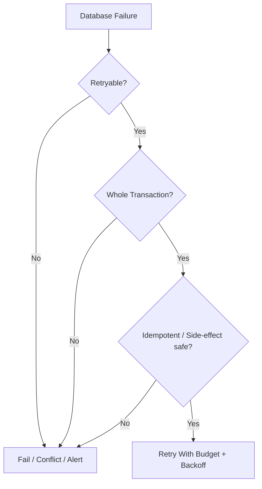

# Part 022 — Transaction Retry Pattern

> Retry adalah obat yang bisa menyembuhkan transient failure.
>
> Retry juga bisa menjadi racun:
>
> - menggandakan email;
> - menggandakan audit;
> - menggandakan payment;
> - memperparah overload;
> - mengulang command yang seharusnya conflict;
> - membuat deadlock storm;
> - menyembunyikan migration bug;
> - membuat user melihat hasil yang tidak sesuai keputusan awal.
>
> Retry transaction harus didesain, bukan ditempel.

Part ini membahas pola retry transaksi yang aman untuk Java data access.

---

## 1. Core Thesis

Retry hanya aman jika memenuhi tiga kondisi:

```txt
1. Failure benar-benar retryable.
2. Retry mengulang seluruh transaction boundary.
3. Operation idempotent / side-effect-safe.
```

Jika salah satu tidak terpenuhi, retry bisa merusak data.

Diagram:



---

## 2. What Is Retryable?

Common retryable candidates:

| Failure | Retry? | Notes |
|---|---:|---|
| deadlock | usually yes | retry whole transaction |
| serialization failure | yes | expected under serializable |
| transient connection issue before work | maybe | budgeted retry |
| lock timeout | maybe | depends UX/operation |
| query timeout | maybe | if safe and not overload |
| connection acquisition timeout | usually no immediate retry in same request | indicates saturation |
| failover/stale connection | maybe | with budget |
| optimistic conflict | usually no | business/user conflict |
| duplicate natural key | no | business conflict |
| duplicate command ID | no retry; replay result | idempotency path |
| syntax error | no | deploy bug |
| missing column/table | no | migration bug |
| not null/check violation | no | app/data bug |
| authorization failure | no | config/security issue |

Retryability is not only exception type. It includes operation semantics.

---

## 3. Retry Boundary Must Be Whole Transaction

Bad:

```java
try {
    statement.executeUpdate();
} catch (SQLException e) {
    if (isDeadlock(e)) {
        statement.executeUpdate(); // wrong
    }
}
```

After many database errors, transaction state may be invalid. Also earlier writes in same transaction may need replay consistently.

Good:

```java
retryingTransaction.execute(() -> {
    // begin tx
    // load current state
    // validate
    // write state
    // audit
    // outbox
    // commit
});
```

Retry re-runs all logic in a fresh transaction.

---

## 4. Why Statement-Level Retry Is Dangerous

Example:

```txt
insert audit succeeded
update state deadlocked
retry update only
commit
```

Maybe audit describes state transition that did not happen exactly once, or order changed.

Example transaction:

```java
auditDao.insert(connection, audit);
caseDao.updateStatus(connection, status); // deadlock
outboxDao.append(connection, event);
```

If you retry only `updateStatus`, what about audit? What if transaction is aborted? What if audit should not exist?

Correct response: rollback and retry whole command if safe.

---

## 5. Retry Requires Idempotency

If transaction is retried after unknown outcome, command may have already committed.

Idempotency handles:

```txt
commit succeeded, response lost, retry same command
```

Without idempotency, retry duplicates.

Required patterns:

- command ID;
- dedup table;
- unique audit key;
- unique outbox event key;
- inbox dedup for message consumers;
- external idempotency key for external APIs;
- no external side effect inside transaction callback.

---

## 6. Retry and External Side Effects

Never do this inside retrying transaction:

```java
retryingTx.execute(() -> {
    caseDao.approve(...);
    emailClient.send(...);
    return null;
});
```

If transaction retried, email may send multiple times.

Correct:

```java
retryingTx.execute(() -> {
    caseDao.approve(...);
    outboxDao.append(EmailRequestedEvent...);
    return null;
});
```

Outbox publisher handles external side effect with its own idempotency.

---

## 7. Retry and Domain Decisions

Some operations should not auto-retry on conflict.

Example:

```txt
User approves case based on version 7.
Another user changes case to CLOSED.
```

Optimistic conflict should surface.

Auto-retrying by reloading current state and approving anyway may violate user intent.

Retry is appropriate for transient technical failures, not semantic conflict unless operation is deterministic and domain-safe.

---

## 8. Retry Budget

Retry must be bounded.

A retry policy needs:

- max attempts;
- max total duration;
- per-attempt deadline;
- backoff;
- jitter;
- classification;
- observability.

Example:

```txt
max attempts: 3
base backoff: 50ms
max backoff: 500ms
overall deadline: request deadline minus safety margin
```

No infinite retry in request path.

---

## 9. Exponential Backoff With Jitter

Without jitter, many clients retry simultaneously and create retry storm.

Backoff:

```txt
attempt 1 -> 50ms
attempt 2 -> 100ms
attempt 3 -> 200ms
```

Jitter randomizes:

```txt
attempt 2 -> random 50..100ms
```

Java utility:

```java
public final class Backoff {
    private final Duration base;
    private final Duration max;

    public Backoff(Duration base, Duration max) {
        this.base = base;
        this.max = max;
    }

    public Duration delay(int attempt) {
        long exponential = base.toMillis() * (1L << Math.max(0, attempt - 1));
        long capped = Math.min(max.toMillis(), exponential);
        long half = Math.max(1, capped / 2);

        long jittered = ThreadLocalRandom.current().nextLong(half, capped + 1);
        return Duration.ofMillis(jittered);
    }
}
```

---

## 10. Deadline-Aware Retry

Do not start another retry if request deadline is nearly exhausted.

```java
public final class Deadline {
    private final Instant expiresAt;
    private final Clock clock;

    public boolean hasTimeFor(Duration expectedAttemptBudget) {
        return clock.instant().plus(expectedAttemptBudget).isBefore(expiresAt);
    }

    public Duration remaining() {
        return Duration.between(clock.instant(), expiresAt);
    }
}
```

Before retry:

```java
if (!deadline.hasTimeFor(minAttemptBudget)) {
    throw new RetryBudgetExhausted(lastFailure);
}
```

This prevents retry from continuing after caller already timed out.

---

## 11. Retry Policy Object

```java
public record RetryPolicy(
        int maxAttempts,
        Duration baseDelay,
        Duration maxDelay,
        Duration minAttemptBudget
) {
    public boolean canRetry(int attempt, Throwable failure, Deadline deadline) {
        return attempt < maxAttempts
                && isRetryable(failure)
                && deadline.hasTimeFor(minAttemptBudget);
    }

    public Duration delay(int nextAttempt) {
        long raw = baseDelay.toMillis() * (1L << Math.max(0, nextAttempt - 2));
        long capped = Math.min(maxDelay.toMillis(), raw);
        long lower = Math.max(1, capped / 2);
        return Duration.ofMillis(
                ThreadLocalRandom.current().nextLong(lower, capped + 1)
        );
    }

    private boolean isRetryable(Throwable failure) {
        return failure instanceof RetryableTransactionFailure;
    }
}
```

Keep retry classification separate from backoff mechanics.

---

## 12. Transaction Retrier Skeleton

```java
public final class TransactionRetrier {
    private final JdbcTransactionTemplate tx;
    private final RetryPolicy retryPolicy;
    private final Metrics metrics;
    private final Sleeper sleeper;

    public <T> T execute(
            String operation,
            TransactionOptions options,
            Deadline deadline,
            TransactionCallback<T> callback
    ) {
        Throwable lastFailure = null;

        for (int attempt = 1; attempt <= retryPolicy.maxAttempts(); attempt++) {
            try {
                return tx.execute(options, callback);
            } catch (RuntimeException ex) {
                lastFailure = ex;

                if (!retryPolicy.canRetry(attempt, ex, deadline)) {
                    throw ex;
                }

                metrics.increment("transaction.retry", Tags.of(
                        "operation", operation,
                        "attempt", String.valueOf(attempt),
                        "reason", retryReason(ex)
                ));

                sleeper.sleep(retryPolicy.delay(attempt + 1));
            }
        }

        throw new RetryBudgetExhausted(operation, lastFailure);
    }
}
```

In real code:

- preserve interrupt status;
- include checked SQL exception translation;
- avoid high-cardinality labels;
- log final failure;
- support testing without real sleep.

---

## 13. Preserve Interrupt

If sleep interrupted:

```java
try {
    Thread.sleep(delay.toMillis());
} catch (InterruptedException e) {
    Thread.currentThread().interrupt();
    throw new RetryInterrupted(e);
}
```

Do not swallow interruption.

For servers, interruption may signal shutdown/cancellation.

---

## 14. SQLException Classification

Classifier:

```java
public final class SqlRetryClassifier {
    public boolean isRetryable(SQLException e) {
        for (SQLException item : flatten(e)) {
            if (isDeadlock(item)) {
                return true;
            }

            if (isSerializationFailure(item)) {
                return true;
            }

            if (isTransientConnectionFailure(item)) {
                return true;
            }
        }

        return false;
    }

    private boolean isSerializationFailure(SQLException e) {
        return "40001".equals(e.getSQLState());
    }

    private boolean isDeadlock(SQLException e) {
        return "40P01".equals(e.getSQLState())
                || isVendorDeadlock(e);
    }
}
```

Codes vary by database. Encapsulate per DB.

SQLState class `40` is transaction rollback; many such errors are retry candidates, but not all policies should blindly retry.

---

## 15. Deadlock Retry

Deadlock:

```txt
Database aborts one transaction to break cycle.
```

Retry strategy:

- rollback;
- wait with jitter;
- retry whole transaction;
- reduce lock contention long-term.

If deadlocks frequent:

- add consistent lock ordering;
- shrink transaction;
- add indexes;
- reduce batch size;
- avoid external calls;
- inspect lock graph;
- maybe use queue/partition.

Retry treats symptom. Design fixes cause.

---

## 16. Serialization Failure Retry

At serializable isolation, serialization failure is expected under concurrent conflicts.

Pattern:

```java
retryingTx.execute(
        "RemoveReviewer",
        TransactionOptions.serializable(),
        deadline,
        connection -> {
            int active = reviewerDao.countActive(connection, caseId);
            if (active <= 1) {
                throw new CannotRemoveLastReviewer(caseId);
            }
            reviewerDao.deactivate(connection, caseId, reviewerId);
            return null;
        }
);
```

If retry sees active count now 1, it returns business rejection. That is correct.

Retry does not guarantee eventual success. It re-evaluates current truth.

---

## 17. Lock Timeout Retry

Lock timeout can mean contention.

For interactive user command:

```txt
case currently being modified
```

Maybe no retry. Fast response is better.

For background job:

```txt
skip/retry later
```

Retry policy should differ by operation.

Do not globally retry every lock timeout.

---

## 18. Query Timeout Retry

Query timeout can mean:

- transient overload;
- bad query plan;
- missing index;
- lock wait;
- result too large;
- database degraded.

Immediate retry may worsen load.

For request path, prefer fail fast unless strong reason.

For idempotent background job, retry with backoff and throttle may be okay.

If query timeout repeats, stop and alert. Do not keep hammering.

---

## 19. Connection Failure Retry

Connection failure before transaction begins may be retryable.

Connection failure during commit is tricky:

```txt
commit outcome may be unknown
```

Idempotency key is required.

Retry with same command ID can discover whether commit succeeded.

Without idempotency, do not blindly retry critical write after unknown commit.

---

## 20. Connection Acquisition Timeout

If pool acquisition times out, database/app is saturated.

Retry inside same request often makes it worse.

Better:

- fail fast;
- shed load;
- return 503;
- backpressure upstream;
- inspect pool usage;
- fix leaks/slow queries;
- separate batch pool.

Retry policy should normally not retry acquisition timeout aggressively.

---

## 21. Retry and Transaction Template

Transaction template must not reuse same connection after failure.

Bad:

```java
Connection c = dataSource.getConnection();

for retry:
  try use same c
```

Good:

```txt
attempt 1:
  get connection
  begin
  fail
  rollback
  close

attempt 2:
  get new/fresh connection
  begin
  ...
```

Each retry attempt is a new transaction lifecycle.

---

## 22. Retry and Transaction State

After SQL error, transaction may be aborted. You must rollback before retry.

In many databases, after certain statement errors:

```txt
current transaction is failed
commands ignored until rollback
```

Retrying inside same transaction is invalid.

---

## 23. Retry and Savepoint

Savepoints can recover from expected statement-level errors, not general transient transaction failure.

Example valid savepoint:

```txt
optional insert fails due known constraint -> rollback to savepoint -> continue
```

Example invalid:

```txt
deadlock -> rollback to savepoint and continue
```

For deadlock/serialization, retry whole transaction.

---

## 24. Retry and Optimistic Conflict

Optimistic conflict:

```txt
Expected version no longer current.
```

For user decisions, return conflict.

For deterministic job:

```txt
recalculate derived field from current state
```

Could retry by reloading current state.

But classify separately from transient retry.

Example:

```java
catch (OptimisticConflict ex) {
    if (operation.isDeterministicBackgroundRepair()) {
        return retryByReloading();
    }
    throw ex;
}
```

Do not hide conflicts by default.

---

## 25. Retry and Idempotency Table

During retry, first statement often checks command dedup.

```java
return retryingTx.execute("ApproveCase", options, deadline, connection -> {
    Optional<ApproveCaseResult> previous =
            commandDedup.findCompleted(connection, command.commandId());

    if (previous.isPresent()) {
        return previous.get();
    }

    commandDedup.insertStarted(connection, command);

    // mutate/audit/outbox/result
});
```

If attempt 1 committed but response failed, attempt 2 returns previous.

If attempt 1 rolled back, dedup row absent and attempt 2 executes.

---

## 26. Retry and Outbox

Outbox makes transaction retry safe for external publish.

Inside retry:

```java
outbox.append(eventKey = "case-approved:" + commandId)
```

Unique event key prevents duplicate outbox.

Publisher itself retries independently and downstream consumers deduplicate.

---

## 27. Retry and Audit

Audit unique key:

```sql
unique(command_id, action)
```

If command retried after unknown outcome, duplicate audit insert either:

- not reached because command result replayed;
- or conflict/do nothing if defensive design.

Do not create audit ID with random UUID only and no semantic uniqueness.

---

## 28. Retry and Generated IDs

If command creates resource with DB-generated ID and commit outcome unknown, retry needs to return same ID.

Store generated ID in command result in same transaction.

Alternative: application-generated ID from command.

Example:

```txt
caseId = UUID derived/generated before first attempt
```

Then retry uses same caseId.

---

## 29. Retry and Randomness

Random values inside retry callback can differ per attempt.

Examples:

- generated UUID;
- generated case number;
- random assignment;
- timestamp;
- token.

If retry should produce same semantic result, generate outside retry or store deterministically.

Bad:

```java
retryingTx.execute(() -> {
    UUID caseId = UUID.randomUUID();
    caseDao.insert(caseId, ...);
});
```

If first commit unknown, retry creates different case.

Better:

```java
UUID caseId = command.caseIdOrGeneratedOnce();
retryingTx.execute(() -> {
    caseDao.insert(caseId, ...);
});
```

For timestamp, use command timestamp if domain requires same.

---

## 30. Retry and Time

If retry recalculates `now`, audit timestamps may differ.

Use one command timestamp:

```java
ApproveCaseCommand command = new ApproveCaseCommand(..., requestedAt);
```

Inside retry, use `command.requestedAt()` for domain decision time.

Use separate persistence/published timestamps if needed, but semantics must be clear.

---

## 31. Retry and Sequence Numbers

Database sequences are often not rolled back. Retried transaction may consume gaps.

That is normal for technical IDs.

Do not require gapless sequence for retry-heavy path.

If business number must be gapless, design dedicated allocator with clear failure semantics. Often avoid gapless requirement.

---

## 32. Retry and Side-Effect-Free Callback Contract

Document retry callback contract:

```txt
The callback may execute more than once.
It must not perform non-idempotent external side effects.
All durable side effects must be in the database transaction.
External side effects must be represented as outbox records.
Random/time values must be supplied by command or be retry-safe.
```

Make this part of code review.

---

## 33. Retrier API Design

Make API make unsafe behavior obvious.

```java
public <T> T executeIdempotentCommand(
        String operation,
        CommandId commandId,
        Deadline deadline,
        TransactionCallback<T> callback
)
```

This reminds caller that retry is for idempotent command.

For non-idempotent operations, use normal transaction without retry or explicit conflict handling.

---

## 34. Retryable Unit of Work Example

```java
public ApproveCaseResult handle(ApproveCaseCommand command) {
    return transactionRetrier.execute(
            "ApproveCase",
            TransactionOptions.readCommitted(),
            Deadline.fromRequest(),
            connection -> approveInsideTransaction(connection, command)
    );
}

private ApproveCaseResult approveInsideTransaction(
        Connection connection,
        ApproveCaseCommand command
) throws SQLException {
    Optional<ApproveCaseResult> previous =
            commandDedup.findCompleted(connection, command.commandId());

    if (previous.isPresent()) {
        return previous.get();
    }

    commandDedup.insertStarted(connection, command);

    CaseFileRow row = caseDao.findById(connection, command.caseId())
            .orElseThrow(() -> new CaseNotFound(command.caseId()));

    CaseFile caseFile = CaseFileMapper.toDomain(row);
    CaseStatus previousStatus = caseFile.status();

    caseFile.approve(command.actorId(), command.reason());

    caseDao.saveWithExpectedVersion(connection, caseFile, row.version());
    auditDao.insert(connection, AuditRecord.approved(command, previousStatus, caseFile));
    outboxDao.insert(connection, OutboxEvent.caseApproved(command, caseFile));

    ApproveCaseResult result = ApproveCaseResult.from(caseFile);

    commandDedup.complete(connection, command.commandId(), result);

    return result;
}
```

All durable effects are inside transaction.

---

## 35. Retry Metrics

Track:

```txt
transaction.retry.attempt.count{operation, reason}
transaction.retry.exhausted.count{operation, reason}
transaction.retry.success_after_retry.count{operation, attempts}
transaction.deadlock.count{operation}
transaction.serialization_failure.count{operation}
transaction.lock_timeout.count{operation}
transaction.retry.skipped_deadline.count{operation}
```

Avoid labels with raw IDs.

High retry success is still signal of contention.

---

## 36. Retry Logs

Log per retry at debug/info depending rate:

```json
{
  "event": "transaction_retry",
  "operation": "ApproveCase",
  "attempt": 2,
  "reason": "deadlock",
  "delayMs": 83,
  "commandId": "...",
  "correlationId": "..."
}
```

Final exhausted at warn/error:

```json
{
  "event": "transaction_retry_exhausted",
  "operation": "ApproveCase",
  "attempts": 3,
  "reason": "serialization_failure"
}
```

Do not log sensitive payload.

---

## 37. Retry Storm

Retry storm occurs when many requests fail and retry together, increasing load.

Causes:

- DB overload;
- lock contention;
- network failure;
- deployment issue;
- bad query;
- too aggressive retry;
- no jitter;
- high max attempts.

Mitigation:

- jitter;
- bounded attempts;
- circuit breaker/load shedding;
- backpressure;
- stop retry for non-transient errors;
- fail fast on pool acquisition timeout;
- reduce worker concurrency;
- pause batch jobs.

---

## 38. Retry and Circuit Breaker

For database unavailable, retry every request can overload.

A circuit breaker/backpressure layer can:

- fail fast while DB unavailable;
- reduce concurrent attempts;
- allow probes;
- protect thread/connection pools.

But circuit breaker does not replace transaction idempotency. It controls load.

---

## 39. Retry and Bulk Jobs

Batch job retry differs from request retry.

Request retry:

```txt
small max attempts, tight deadline
```

Batch retry:

```txt
more patient, chunk-level, backoff longer, dead-letter possible
```

Batch chunk retry:

```java
for attempt in 1..max:
  try process chunk transaction
  catch retryable:
    sleep(backoff)
if exhausted:
  mark chunk failed/dead-letter
```

Do not retry whole million-row job from start if one chunk fails.

---

## 40. Retry and Chunk Cursor

If chunk transaction fails and rolls back, cursor should not advance.

If cursor advanced outside transaction before write commit, retry may skip rows.

Correct:

```txt
tx:
  write chunk
  save cursor
commit
```

Or write idempotent and recompute cursor safely.

---

## 41. Retry and Dead Letter

For batch/message processing, after retry exhausted:

- mark item/chunk failed;
- store error category;
- preserve payload reference;
- alert if needed;
- allow operator replay after fix.

Do not spin forever.

Dead-letter table:

```sql
create table job_dead_letter (
    id uuid primary key,
    job_name text not null,
    item_key text not null,
    failure_type text not null,
    failure_message text,
    payload jsonb,
    failed_at timestamptz not null
);
```

---

## 42. Retry and Message Consumers

Message broker may already retry/redeliver. Application retry must align.

Options:

- retry transaction inside consumer before returning failure;
- let broker redeliver;
- use dead-letter queue;
- inbox dedup prevents duplicate committed effects.

Avoid multiplying retries:

```txt
app retries 5 times * broker retries 10 times = 50 attempts
```

Budget across layers.

---

## 43. Retry and Outbox Publisher

Publisher flow:

```txt
read/claim events
publish
mark published
```

Retry cases:

- publish fails before broker accepts -> retry publish;
- broker accepts but response lost -> retry publish may duplicate;
- mark published fails after publish -> retry publish later duplicates.

Therefore downstream must be idempotent and event ID stable.

Outbox publisher provides at-least-once delivery.

---

## 44. Retry and External Idempotency

When calling external API:

```java
externalClient.send(request, IdempotencyKey.of(outboxEvent.eventKey()));
```

If external supports idempotency, timeout retry can be safe.

If not:

- use reconciliation;
- check status before retry;
- design compensation;
- accept at-least-once with dedup if receiver can handle;
- avoid critical non-idempotent external call.

---

## 45. Retry and Testing

Test categories:

1. retryable failure first attempt, success second;
2. retryable failure exhausted;
3. nonretryable failure not retried;
4. deadline prevents retry;
5. interrupted sleep preserves interrupt;
6. callback not called after exhausted;
7. idempotency returns previous result after simulated commit;
8. external side effect not invoked inside retry callback;
9. duplicate audit/outbox not created;
10. metrics emitted.

---

## 46. Unit Test Retrier Without Sleep

Inject `Sleeper`.

```java
public interface Sleeper {
    void sleep(Duration duration);
}
```

Test:

```java
FakeSleeper sleeper = new FakeSleeper();

TransactionRetrier retrier = new TransactionRetrier(tx, policy, sleeper);

AtomicInteger calls = new AtomicInteger();

String result = retrier.execute("op", options, deadline, connection -> {
    if (calls.incrementAndGet() == 1) {
        throw new RetryableTransactionFailure("deadlock");
    }
    return "ok";
});

assertThat(result).isEqualTo("ok");
assertThat(calls).hasValue(2);
assertThat(sleeper.delays()).hasSize(1);
```

---

## 47. Integration Test Deadlock Retry

Use real DB to trigger deadlock, or fake classifier for deterministic unit test.

Integration test goal:

- deadlock exception classified as retryable;
- transaction retried from beginning;
- final invariant correct.

Deadlock tests can be flaky. Keep in separate integration suite if needed.

---

## 48. Simulating Unknown Commit Outcome

Hard to simulate honestly without fault injection/proxy.

But you can test idempotency behavior:

1. Execute command successfully.
2. Pretend client did not receive response.
3. Execute same command again.
4. Assert same result and no duplicate side effects.

This proves retry after unknown response is safe.

---

## 49. Retry Design Review Checklist

- [ ] Which failures are retryable?
- [ ] Which failures are not retryable?
- [ ] Is retry at whole transaction boundary?
- [ ] Is operation idempotent?
- [ ] Is command ID stable across attempts?
- [ ] Are audit/outbox unique by command/event key?
- [ ] Are external side effects outside retry callback?
- [ ] Are random/time values stable or safe?
- [ ] Is max attempts bounded?
- [ ] Is backoff jittered?
- [ ] Is deadline respected?
- [ ] Is interruption handled?
- [ ] Are metrics/logs emitted?
- [ ] Is retry storm prevented?
- [ ] Are tests covering retry and duplicate replay?
- [ ] Is high conflict rate monitored?

---

## 50. Anti-Pattern: Retry Everything

```java
catch (Exception e) {
    retry();
}
```

This retries:

- validation errors;
- syntax bugs;
- duplicate key conflicts;
- authorization errors;
- data corruption;
- business conflicts.

Bad.

Classify first.

---

## 51. Anti-Pattern: Retry Without Jitter

All workers retry at same intervals and collide again.

Add jitter.

---

## 52. Anti-Pattern: Retry After Client Deadline

Work continues after user/request gave up.

Use deadline-aware retry and cancellation.

---

## 53. Anti-Pattern: Retry Non-Idempotent Write

```java
retry(() -> payment.charge(...))
```

without idempotency key.

Critical bug.

---

## 54. Anti-Pattern: Retry Only Repository Save

Use case has multiple writes. Retrying one repository call breaks atomicity.

Retry transaction/use case.

---

## 55. Anti-Pattern: Infinite Batch Retry

A bad row causes permanent failure but job retries forever.

Use dead-letter after budget.

---

## 56. Example: Retrying Serializable Remove Reviewer

```java
public void removeReviewer(RemoveReviewerCommand command) {
    transactionRetrier.execute(
            "RemoveReviewer",
            TransactionOptions.serializable(),
            Deadline.after(Duration.ofSeconds(3)),
            connection -> {
                Optional<CommandResult> previous =
                        commandDedup.findCompleted(connection, command.commandId());

                if (previous.isPresent()) {
                    return previous.get();
                }

                commandDedup.insertStarted(connection, command);

                int active = reviewerDao.countActive(connection, command.caseId());

                if (active <= 1) {
                    RemoveReviewerResult rejected =
                            RemoveReviewerResult.rejected("LAST_REVIEWER");

                    commandDedup.complete(connection, command.commandId(), rejected);
                    return rejected;
                }

                reviewerDao.deactivate(connection, command.caseId(), command.reviewerId());
                auditDao.insert(connection, AuditRecord.reviewerRemoved(command));
                outboxDao.insert(connection, OutboxEvent.reviewerRemoved(command));

                RemoveReviewerResult result = RemoveReviewerResult.removed();

                commandDedup.complete(connection, command.commandId(), result);
                return result;
            }
    );
}
```

Serialization failure retry re-evaluates active count. If another reviewer was removed, retry may now return rejection. That is correct.

---

## 57. Example: Retrying Batch Chunk

```java
public void processChunk(JobChunk chunk) {
    retryingTx.execute(
            "RiskBackfillChunk",
            TransactionOptions.readCommitted(),
            Deadline.after(Duration.ofMinutes(2)),
            connection -> {
                List<RiskUpdate> updates = calculator.calculate(chunk);

                riskDao.updateBatch(connection, updates);
                auditDao.insertBatch(connection, audits(updates));
                cursorDao.save(connection, chunk.jobId(), chunk.nextCursor());

                return null;
            }
    );
}
```

Requirements:

- updates idempotent;
- audit unique key per job/row/action;
- cursor save in same transaction;
- no external side effect;
- chunk retry budget;
- dead-letter if exhausted.

---

## 58. Example: Retry Policy Tiers

Interactive command:

```txt
max attempts: 2 or 3
base delay: 25-50ms
max delay: 200ms
deadline: request deadline
retry: deadlock/serialization only
```

Background job:

```txt
max attempts: 5
base delay: 100ms
max delay: 5s
deadline: chunk/job budget
retry: deadlock/serialization/transient connection/lock timeout maybe
```

External outbox publish:

```txt
max attempts per run: small
persistent retry schedule: exponential over minutes
idempotency key: event key
dead-letter after policy
```

Do not use one retry policy everywhere.

---

## 59. Summary

Transaction retry is a correctness-sensitive resilience pattern.

You must master:

- retry classification;
- whole-transaction retry;
- deadlock retry;
- serialization failure retry;
- lock/query/connection timeout judgment;
- idempotency requirement;
- command dedup;
- outbox/inbox safety;
- external side effect avoidance;
- stable random/time values;
- bounded attempts;
- exponential backoff;
- jitter;
- deadline awareness;
- interrupt handling;
- retry storm prevention;
- batch vs request retry;
- dead-letter;
- observability;
- testing retry and duplicate replay.

Part berikutnya membahas **Long-Running Transaction Avoidance**: split phase, status machine, reservation, compensation, durable progress, and how to model long business processes without holding database transactions.

---

## 60. References

- Oracle Java SE `SQLException`: https://docs.oracle.com/en/java/javase/21/docs/api/java.sql/java/sql/SQLException.html
- Oracle Java SE `SQLTransientException`: https://docs.oracle.com/en/java/javase/21/docs/api/java.sql/java/sql/SQLTransientException.html
- Oracle Java SE `SQLTransactionRollbackException`: https://docs.oracle.com/en/java/javase/21/docs/api/java.sql/java/sql/SQLTransactionRollbackException.html
- Oracle Java SE `Connection`: https://docs.oracle.com/en/java/javase/21/docs/api/java.sql/java/sql/Connection.html
- PostgreSQL Error Codes: https://www.postgresql.org/docs/current/errcodes-appendix.html
- PostgreSQL Transaction Isolation: https://www.postgresql.org/docs/current/transaction-iso.html
- PostgreSQL Explicit Locking: https://www.postgresql.org/docs/current/explicit-locking.html
- Spring Retry Documentation: https://docs.spring.io/spring-retry/docs/current/reference/html/
- Spring Transaction Management: https://docs.spring.io/spring-framework/reference/data-access/transaction.html
