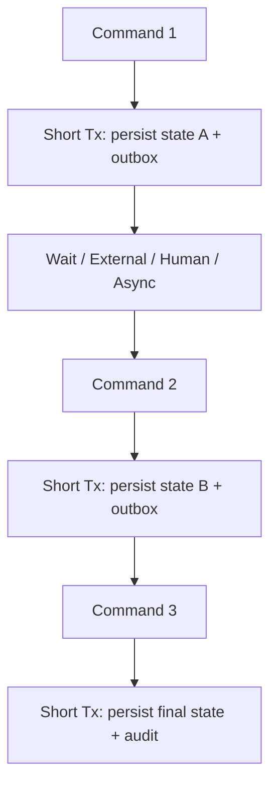
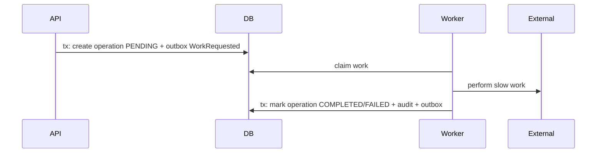
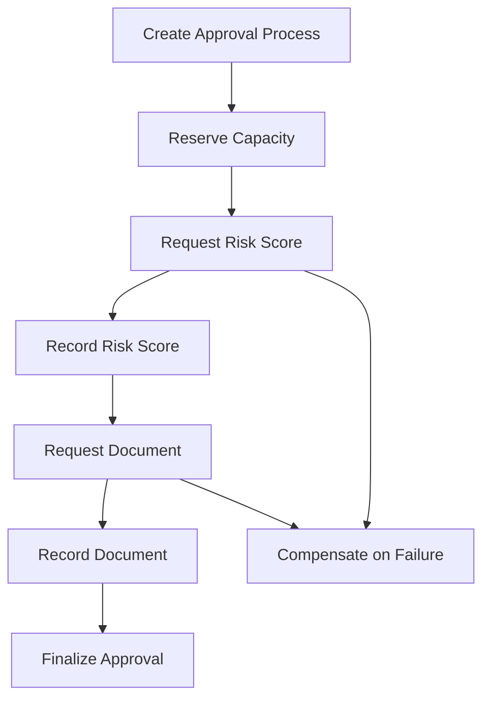

# Part 023 — Long-Running Transaction Avoidance

> Database transaction adalah alat untuk critical section yang pendek.
>
> Ia bukan alat untuk:
>
> - menunggu user;
> - menunggu service lain;
> - upload file besar;
> - generate PDF;
> - mengirim email;
> - publish message broker secara langsung;
> - memproses batch jutaan row;
> - menunggu approval multi-level selama berhari-hari.
>
> Long-running transaction biasanya terlihat "benar" secara atomicity, tetapi menghancurkan availability, throughput, lock behavior, dan operability.

Part ini membahas cara mengganti transaksi panjang dengan desain workflow yang durable.

---

## 1. Core Thesis

Transaksi database harus pendek, bounded, dan hanya mencakup perubahan state yang harus commit bersama.

Jika business process panjang, jangan memperpanjang transaksi. Pecah proses menjadi beberapa **durable state transition**.

```txt
Long business process
  !=
Long database transaction
```

Correct mental model:



Every step is durable. No transaction spans the wait.

---

## 2. What Is a Long-Running Transaction?

A long-running transaction is any transaction whose duration is dominated by work that should not hold database resources.

Examples:

```txt
transaction open for 5 seconds because external service is slow
transaction open for 2 minutes while exporting CSV
transaction open for 1 hour while batch job updates all rows
transaction open while user reviews page
transaction open while waiting for message broker response
```

Operational symptoms:

- lock waits;
- connection pool exhaustion;
- `idle in transaction`;
- old snapshots;
- replication/vacuum lag;
- deadlocks;
- timeouts;
- rollback cost;
- high transaction duration p99;
- migrations blocked;
- user-facing latency spikes.

Rule:

```txt
If transaction waits on something outside the database, suspect design bug.
```

---

## 3. Why Long Transactions Are Dangerous

Long transaction holds:

- database connection;
- transaction snapshot;
- locks if writes/`for update`;
- possibly cursor/server resources;
- application thread/virtual thread waiting;
- connection pool slot;
- undo/WAL visibility burden;
- framework persistence context;
- memory of loaded entities.

If it fails late:

- rollback is expensive;
- external side effects may already happened;
- user waits;
- retry is costly;
- deadlock probability increases.

---

## 4. The Hidden Cost of "Just Make It Transactional"

Bad:

```java
@Transactional
public void approveCaseAndNotify(ApproveCommand command) {
    CaseFile caseFile = caseRepository.findById(command.caseId()).orElseThrow();
    caseFile.approve(command.actor(), command.reason());
    caseRepository.save(caseFile);

    byte[] pdf = documentService.generateApprovalPdf(caseFile); // slow
    storageClient.upload(pdf);                                  // external
    emailClient.sendApprovalEmail(caseFile);                    // external
}
```

Problems:

- DB transaction open during PDF generation;
- DB transaction open during object storage upload;
- DB transaction open during email call;
- if email succeeds but commit fails, false notification;
- if commit succeeds but email fails, state changed without notification;
- retry may generate duplicate email/PDF;
- connection pool pressure.

Better:

```java
@Transactional
public void approveCase(ApproveCommand command) {
    CaseFile caseFile = caseRepository.findById(command.caseId()).orElseThrow();
    caseFile.approve(command.actor(), command.reason());

    caseRepository.save(caseFile);
    auditRepository.append(...);
    outboxRepository.append(CaseApprovedEvent.from(command, caseFile));
}
```

Then workers:

```txt
CaseApproved -> generate PDF
PDFGenerated -> upload
PDFUploaded -> send email
```

Each step uses short transaction.

---

## 5. Split Phase Pattern

Split a long operation into phases.

Example:

```txt
Phase 1: Accept command and record intent.
Phase 2: Perform external/slow work.
Phase 3: Confirm result in database.
```

Diagram:



No transaction spans the external call.

---

## 6. Status Machine Pattern

Represent process as durable states.

```txt
DRAFT
SUBMITTED
PENDING_RISK_SCORING
RISK_SCORED
PENDING_SUPERVISOR_REVIEW
APPROVED
REJECTED
FAILED_REQUIRES_MANUAL_REVIEW
```

Table:

```sql
create table case_approval_process (
    id uuid primary key,
    case_id uuid not null,
    command_id uuid not null,
    status text not null,
    version bigint not null,
    requested_by uuid not null,
    reason text,
    created_at timestamptz not null,
    updated_at timestamptz not null,
    constraint uq_case_approval_command unique(command_id)
);
```

Each transition:

```sql
update case_approval_process
set status = ?,
    version = version + 1,
    updated_at = ?
where id = ?
  and status = ?
  and version = ?;
```

This is a state machine with optimistic concurrency.

---

## 7. State Transition as Transaction Boundary

Example transition:

```txt
PENDING_RISK_SCORING -> RISK_SCORED
```

Transaction:

```java
@Transactional
public void recordRiskScore(RecordRiskScoreCommand command) {
    ApprovalProcess process = processRepository.findById(command.processId())
            .orElseThrow();

    process.recordRiskScore(command.score(), command.now());

    processRepository.save(process);
    auditRepository.append(ApprovalAudit.riskScored(process, command));
    outboxRepository.append(RiskScoreRecordedEvent.from(process, command));
}
```

This transaction is short.

The external scoring call happened before this command, outside DB transaction.

---

## 8. Durable Progress Pattern

For batch/job/workflow, progress must be durable.

Bad:

```java
int processed = 0;
for (Row row : rows) {
    process(row);
    processed++;
}
```

If process crashes, progress lost.

Better:

```sql
create table job_progress (
    job_name text primary key,
    cursor_value text,
    status text not null,
    updated_at timestamptz not null
);
```

Per chunk:

```java
@Transactional
public void processChunk(JobChunk chunk) {
    writer.writeRows(chunk.rows());
    progressRepository.saveCursor(chunk.nextCursor());
}
```

Cursor save in same transaction as writes prevents "written but cursor not advanced" unless writes are idempotent.

---

## 9. Reservation Pattern

Reservation replaces long lock.

Bad:

```txt
lock officer capacity until user completes assignment form
```

Better:

```txt
create reservation with expiry
user/system completes process
confirm reservation
or reservation expires/cancels
```

Schema:

```sql
create table officer_capacity_reservation (
    id uuid primary key,
    command_id uuid not null,
    officer_id uuid not null,
    case_id uuid not null,
    status text not null,
    expires_at timestamptz not null,
    confirmed_at timestamptz,
    cancelled_at timestamptz,
    created_at timestamptz not null,
    constraint uq_officer_reservation_command unique(command_id)
);
```

States:

```txt
ACTIVE
CONFIRMED
CANCELLED
EXPIRED
```

Reservation is a domain state, not a database lock.

---

## 10. Reservation Confirmation

Confirm in short transaction:

```java
@Transactional
public AssignOfficerResult confirmReservation(ConfirmReservationCommand command) {
    Reservation reservation = reservationRepository.findById(command.reservationId())
            .orElseThrow();

    reservation.confirm(command.now());

    assignmentRepository.insert(Assignment.from(reservation));
    reservationRepository.save(reservation);
    auditRepository.append(...);
    outboxRepository.append(...);

    return result;
}
```

Guard:

```sql
update officer_capacity_reservation
set status = 'CONFIRMED',
    confirmed_at = ?
where id = ?
  and status = 'ACTIVE'
  and expires_at > ?;
```

If 0 rows, reservation expired/cancelled/used.

---

## 11. Reservation Expiry

Expire reservation via job:

```sql
update officer_capacity_reservation
set status = 'EXPIRED'
where status = 'ACTIVE'
  and expires_at < ?;
```

In chunks.

If reservation holds capacity counter, release capacity in same transaction.

```java
@Transactional
public void expireReservation(ReservationId id) {
    Reservation reservation = repository.findActiveForUpdate(id).orElse(null);

    if (reservation == null || !reservation.isExpired(clock.now())) {
        return;
    }

    reservation.expire(clock.now());
    workloadRepository.release(reservation.officerId());
    repository.save(reservation);
    audit.append(...);
}
```

---

## 12. Compensation Pattern

If step B fails after step A committed, you cannot rollback A with database rollback. You need compensation.

Example:

```txt
reserve officer capacity -> external document generation fails
```

Compensation:

```txt
cancel reservation / release capacity / mark approval failed
```

Compensation is a new transaction, not undo magic.

It must be:

- explicit;
- idempotent;
- audited;
- retryable;
- safe if original step eventually succeeds late.

---

## 13. Compensation Example

Process:

```txt
PENDING_DOCUMENT_GENERATION
DOCUMENT_GENERATION_FAILED
CAPACITY_RELEASED
MANUAL_REVIEW_REQUIRED
```

Code:

```java
@Transactional
public void handleDocumentGenerationFailed(DocumentFailed event) {
    ApprovalProcess process = processRepository.findById(event.processId())
            .orElseThrow();

    if (!process.canMarkDocumentFailed(event.stepId())) {
        return; // duplicate/stale event
    }

    process.markDocumentGenerationFailed(event.reason(), event.occurredAt());

    reservationRepository.cancelIfActive(process.reservationId());
    auditRepository.append(...);
    outboxRepository.append(ApprovalRequiresManualReviewEvent.from(process));
}
```

Compensation records what happened. It does not pretend failure never happened.

---

## 14. Saga as Long Process

Saga coordinates multiple local transactions.



Every box is a short local transaction or external call boundary.

Saga state is persisted.

Do not hold one transaction across saga.

---

## 15. Workflow Table Pattern

```sql
create table workflow_instance (
    id uuid primary key,
    workflow_type text not null,
    aggregate_type text not null,
    aggregate_id text not null,
    status text not null,
    current_step text not null,
    version bigint not null,
    payload jsonb not null,
    created_at timestamptz not null,
    updated_at timestamptz not null
);
```

Step transition:

```sql
update workflow_instance
set current_step = ?,
    status = ?,
    payload = ?::jsonb,
    version = version + 1,
    updated_at = ?
where id = ?
  and version = ?
  and current_step = ?;
```

This gives durable orchestration without long transaction.

---

## 16. Outbox as Phase Boundary

At end of each transaction, append outbox event.

```java
@Transactional
public void submitCase(SubmitCaseCommand command) {
    caseFile.submit(...);
    caseRepository.save(caseFile);
    outbox.append(CaseSubmittedEvent.from(caseFile, command));
}
```

Outbox worker starts next phase:

```txt
CaseSubmittedEvent -> risk scoring worker
```

Outbox is the durable bridge from one transaction to next asynchronous step.

---

## 17. Inbox as Phase Dedup

Every async handler should dedup incoming event/command.

```java
@Transactional
public void handleRiskScoreCompleted(RiskScoreCompleted event) {
    if (!inbox.tryStart(event.eventId(), event.payloadHash())) {
        return;
    }

    process.recordRiskScore(event.score());
    processRepository.save(process);
    audit.append(...);
    outbox.append(...);
    inbox.markProcessed(event.eventId());
}
```

If message redelivers, no duplicate transition.

---

## 18. External Call Boundary

External call belongs outside transaction.

Pattern:

```txt
tx: create request row + outbox
worker: read request
external call
tx: record response
```

Request table:

```sql
create table external_request (
    id uuid primary key,
    request_key text not null unique,
    request_type text not null,
    status text not null,
    payload jsonb not null,
    response_payload jsonb,
    failure_reason text,
    created_at timestamptz not null,
    completed_at timestamptz
);
```

External request key should be idempotency key for external API.

---

## 19. File Upload Boundary

Do not hold transaction while uploading file.

Patterns:

### Pending metadata

```txt
tx: create evidence record PENDING_UPLOAD
client uploads to storage
tx: mark evidence UPLOADED with checksum/size
```

### Temporary object

```txt
upload temp object
tx: create DB record referencing object
after commit: promote/finalize object
cleanup temp on failure
```

### Worker processing

```txt
tx: record upload request
worker handles storage
tx: record result
```

Choose based on who uploads, file size, and consistency needs.

---

## 20. File Upload State Machine

```txt
PENDING_UPLOAD
UPLOADING
UPLOADED
VERIFIED
REJECTED
EXPIRED
```

Schema:

```sql
create table evidence_file (
    id uuid primary key,
    case_id uuid not null,
    status text not null,
    object_key text,
    checksum text,
    size_bytes bigint,
    uploaded_by uuid,
    expires_at timestamptz,
    version bigint not null,
    created_at timestamptz not null,
    updated_at timestamptz not null
);
```

Each state transition is short transaction.

---

## 21. PDF/Report Generation Boundary

Bad:

```java
@Transactional
public Report generateReport(...) {
    List<Row> rows = queryHugeData();
    byte[] pdf = pdfRenderer.render(rows);
    reportRepository.save(pdf);
}
```

Better:

```txt
tx: create report_run REQUESTED
worker reads chunks outside long transaction
worker writes file
tx: mark report COMPLETED with file key/hash/count
```

Report run table:

```sql
create table report_run (
    id uuid primary key,
    report_type text not null,
    requested_by uuid not null,
    filter_payload jsonb not null,
    status text not null,
    file_key text,
    file_hash text,
    row_count bigint,
    created_at timestamptz not null,
    completed_at timestamptz
);
```

---

## 22. Export Snapshot Pattern

For consistent report:

```txt
tx or statement: create snapshot/staging rows
commit
worker exports snapshot in chunks
```

Snapshot table:

```sql
create table case_export_snapshot (
    report_run_id uuid not null,
    row_no bigint not null,
    case_id uuid not null,
    case_number text not null,
    status text not null,
    decided_at timestamptz,
    primary key(report_run_id, row_no)
);
```

Exporting snapshot does not need long transaction on live tables.

---

## 23. Batch Checkpoint Pattern

Batch job:

```txt
read chunk
process chunk
tx:
  write changes
  write audit/outbox
  save checkpoint
commit
```

Checkpoint:

```sql
create table batch_job_checkpoint (
    job_name text primary key,
    cursor_value text,
    status text not null,
    updated_at timestamptz not null
);
```

If crash before commit, checkpoint not advanced. Retry chunk.

If checkpoint outside transaction, writes must be idempotent.

---

## 24. Chunk Transaction Size

Choose chunk size by measuring:

- transaction duration;
- lock duration;
- row count;
- WAL/redo pressure;
- deadlock/timeout rate;
- memory;
- replication lag;
- business atomicity.

For many jobs:

```txt
100-1000 rows per transaction is a reasonable starting experiment.
```

Not a law.

Long transaction avoidance often means "smaller chunks with durable cursor".

---

## 25. Durable Command Pattern

For long command, return immediately.

API:

```txt
POST /case-approvals
-> 202 Accepted
-> commandId/processId
```

Command table:

```sql
create table command_request (
    command_id uuid primary key,
    command_type text not null,
    status text not null,
    payload jsonb not null,
    result_payload jsonb,
    failure_code text,
    created_at timestamptz not null,
    updated_at timestamptz not null
);
```

Worker processes command.

Client polls:

```txt
GET /commands/{commandId}
```

This avoids HTTP request holding transaction/thread while long process runs.

---

## 26. Durable Command Worker

Claim command:

```sql
update command_request
set status = 'PROCESSING',
    worker_id = ?,
    lease_expires_at = ?
where command_id = ?
  and status = 'RECEIVED';
```

Process in short steps:

```java
@Transactional
public void completeStep(...) { ... }
```

If worker crashes, lease expires and command can be retried.

Use idempotency inside steps.

---

## 27. Lease and Fencing for Workers

For long worker ownership, lease alone is not enough if old worker can resume.

Use fencing token:

```sql
update command_request
set worker_id = ?,
    fencing_token = fencing_token + 1,
    lease_expires_at = ?
where command_id = ?
  and lease_expires_at < ?;
```

Every completion write checks token:

```sql
update command_request
set status = 'COMPLETED'
where command_id = ?
  and fencing_token = ?;
```

Old worker with stale token cannot overwrite new owner.

---

## 28. Long-Running Transaction Smell Checklist

Smells:

- transaction method calls HTTP client;
- transaction method sends email;
- transaction method uploads/downloads file;
- transaction method publishes message directly;
- transaction method loops over unbounded rows;
- transaction method waits for user/approval;
- transaction method sleeps;
- transaction method performs CPU-heavy report/PDF;
- transaction method has broad `@Transactional` on orchestration service;
- transaction p99 seconds/minutes;
- DB shows idle in transaction;
- lock waits under normal load.

Each smell requires redesign or explicit justification.

---

## 29. Refactoring Long Transaction

Given:

```java
@Transactional
public void processCaseApproval(...) {
    updateCase();
    callRiskService();
    generateDocument();
    uploadDocument();
    sendEmail();
}
```

Refactor:

1. Identify durable states.
2. Identify external calls.
3. Add process table/status fields.
4. Add outbox events for next steps.
5. Add worker handlers with inbox dedup.
6. Add compensation/retry policy.
7. Add audit per state transition.
8. Add API/status endpoint.
9. Add timeout/expiry handling.
10. Add monitoring.

---

## 30. Example Refactor: Case Approval

States:

```txt
REQUESTED
RISK_SCORE_REQUESTED
RISK_SCORED
DOCUMENT_REQUESTED
DOCUMENT_READY
APPROVED
REJECTED
FAILED_MANUAL_REVIEW
```

Transaction 1:

```txt
create approval process REQUESTED
append ApprovalRequested
commit
```

Worker 1:

```txt
call risk service
tx: record risk score + append RiskScored
```

Worker 2:

```txt
generate document
tx: mark document ready + append DocumentReady
```

Finalizer:

```txt
tx: approve case + audit + outbox CaseApproved + complete process
```

No transaction includes external call.

---

## 31. State Machine Transition Guard

Every transition should use expected state/version.

```sql
update approval_process
set status = ?,
    version = version + 1
where id = ?
  and status = ?
  and version = ?;
```

If update count 0:

- duplicate event;
- stale worker;
- process cancelled;
- version conflict;
- invalid transition.

Handler should be idempotent and safe.

---

## 32. Timeout and Expiry

Long workflow needs timeout.

Example:

```txt
Risk score not returned within 10 minutes -> manual review
```

Job:

```sql
select id
from approval_process
where status = 'RISK_SCORE_REQUESTED'
  and updated_at < ?
order by updated_at
limit ?;
```

Transition:

```java
@Transactional
public void markRiskScoreTimedOut(ProcessId id, Instant now) {
    ApprovalProcess process = repository.findById(id).orElseThrow();

    if (!process.isWaitingForRiskScore()) {
        return;
    }

    process.markManualReviewRequired("RISK_SCORE_TIMEOUT", now);
    repository.save(process);
    audit.append(...);
    outbox.append(...);
}
```

Timeout is a domain transition.

---

## 33. Cancellation

User/operator may cancel long workflow.

Cancellation transaction:

```java
@Transactional
public void cancelApproval(CancelApprovalCommand command) {
    ApprovalProcess process = repository.findById(command.processId())
            .orElseThrow();

    process.cancel(command.actor(), command.reason(), command.now());

    repository.save(process);
    audit.append(...);
    outbox.append(ApprovalCancelledEvent.from(process));
}
```

Workers must check state before recording result. If external response arrives after cancellation, handler ignores or records stale response without changing final state.

---

## 34. Late Response Handling

External service response can arrive late.

Handler:

```java
@Transactional
public void handleRiskScoreCompleted(RiskScoreCompleted event) {
    if (!inbox.tryInsert(event.id())) {
        return;
    }

    ApprovalProcess process = repository.findById(event.processId()).orElseThrow();

    if (!process.isWaitingForRiskScore()) {
        audit.append(ApprovalAudit.ignoredLateRiskScore(process, event));
        inbox.markProcessed(event.id());
        return;
    }

    process.recordRiskScore(event.score(), event.occurredAt());
    repository.save(process);
    outbox.append(...);
    inbox.markProcessed(event.id());
}
```

Late response is not allowed to resurrect cancelled/failed workflow unless explicitly designed.

---

## 35. Durable Failure

Do not let failure exist only in logs.

For long processes, persist failure state:

```txt
DOCUMENT_GENERATION_FAILED
EXTERNAL_SERVICE_TIMEOUT
MANUAL_REVIEW_REQUIRED
```

Failure row:

```sql
create table workflow_failure (
    id uuid primary key,
    workflow_id uuid not null,
    step_name text not null,
    failure_code text not null,
    failure_message text,
    retryable boolean not null,
    occurred_at timestamptz not null
);
```

Operators need visible state.

---

## 36. Retry Policy for Long Workflow

Short transaction retry handles DB deadlocks.

Long workflow retry handles step failure.

Step retry fields:

```sql
attempt_count int not null,
next_attempt_at timestamptz,
last_failure_code text,
last_failure_message text
```

Worker selects due attempts.

Do not block transaction while sleeping. Store `next_attempt_at`.

---

## 37. Backoff as Data

```sql
update external_request
set status = 'RETRY_SCHEDULED',
    attempt_count = attempt_count + 1,
    next_attempt_at = ?,
    last_failure_code = ?
where id = ?;
```

Scheduler later picks it up.

This is better than thread sleeping for minutes.

---

## 38. Idempotency in Long Workflow

Each step needs idempotency key.

Examples:

```txt
workflowId:stepName
commandId
eventId
externalRequestKey
```

Outbox event key:

```txt
approval-risk-score-requested:{workflowId}
approval-document-requested:{workflowId}
case-approved:{commandId}
```

Inbox message ID prevents duplicate event handling.

External API idempotency key prevents duplicate external effect.

---

## 39. Exactly-Once Illusion in Long Workflow

Long workflow crosses:

- database;
- broker;
- worker;
- external services;
- object storage;
- user actions.

Exactly-once is not a practical assumption.

Design for:

- at-least-once messages;
- duplicate command handling;
- idempotent steps;
- compensation;
- reconciliation;
- durable status.

---

## 40. Reconciliation Job

Long workflows need reconciliation.

Examples:

- external request says PROCESSING for too long;
- file uploaded but DB still PENDING;
- outbox event unpublished for too long;
- command STARTED without progress;
- reservation expired but not released;
- workflow stuck in step.

Reconciler scans durable state and repairs/alerts.

```sql
select *
from approval_process
where status in ('RISK_SCORE_REQUESTED', 'DOCUMENT_REQUESTED')
  and updated_at < ?;
```

---

## 41. Reconciliation Principles

A reconciliation job should be:

- idempotent;
- chunked;
- audited if it changes domain state;
- observable;
- safe under concurrent normal workers;
- guarded by version/status predicate;
- able to run repeatedly;
- conservative when uncertain.

It should not rely on memory of previous run.

---

## 42. Avoiding Transaction Around User Think Time

Bad legacy pattern:

```txt
begin transaction
show data to user
user edits for 15 minutes
submit
commit
```

Modern pattern:

1. Read data with version.
2. User edits outside transaction.
3. Submit command with version.
4. Transaction updates where version matches.
5. Conflict if stale.

This is optimistic concurrency for human workflow.

---

## 43. Avoiding Transaction Around Message Wait

Bad:

```java
@Transactional
public void requestAndWait(...) {
    repository.markRequested(...);
    broker.send(...);
    Response response = waitForReply(...); // transaction open
    repository.markCompleted(response);
}
```

Better:

```txt
tx: mark requested + outbox request
consumer/handler: response message -> tx mark completed
```

If request-response needed, use correlation ID and durable state.

---

## 44. Avoiding Transaction Around Locks for Long Work

Bad:

```txt
select job for update
process for 10 minutes
commit
```

Better:

```txt
tx: claim job with lease
process outside tx
tx: mark complete if owner/fencing token valid
```

Locks are short. Lease/status carries long ownership.

---

## 45. Avoiding Transaction Around Large Reads

Bad:

```txt
transaction reads 10 million rows and writes report
```

Better:

- snapshot table;
- chunking;
- async export;
- read replica;
- materialized view;
- checkpoint.

See Part 016.

---

## 46. Consistency Trade-Offs

Splitting transaction introduces intermediate states.

That is not a bug if states are explicit.

Example:

```txt
APPROVAL_REQUESTED
RISK_SCORING_PENDING
```

Users/operators can see "processing".

The alternative—pretending process is atomic while it waits on external systems—is worse.

Design UX/API around asynchronous reality.

---

## 47. API Design for Long Operations

Synchronous short command:

```txt
POST /cases/{id}/approve
-> 200 result
```

Long operation:

```txt
POST /case-approval-processes
-> 202 Accepted
{
  "processId": "...",
  "status": "REQUESTED"
}
```

Status:

```txt
GET /case-approval-processes/{processId}
```

Cancel:

```txt
POST /case-approval-processes/{processId}/cancel
```

This aligns API with durable workflow.

---

## 48. Observability

Metrics:

```txt
workflow.started.count{type}
workflow.completed.count{type}
workflow.failed.count{type, reason}
workflow.step.duration{type, step}
workflow.stuck.count{type, step}
external_request.retry.count{type}
reservation.expired.count{type}
batch.chunk.duration{job}
transaction.duration{use_case}
idle_in_transaction.count
```

Logs:

- workflow ID;
- command ID;
- step;
- transition;
- previous status;
- new status;
- attempt;
- external request key.

---

## 49. Operational Dashboard

For long workflows, dashboard should answer:

- how many running?
- how many stuck?
- oldest pending step?
- failure rate by step?
- retry count distribution?
- external service latency?
- manual review backlog?
- outbox lag?
- worker lease status?

If you cannot observe workflow state, debugging becomes guesswork.

---

## 50. Testing Long Workflow

Test:

- happy path across steps;
- duplicate event handling;
- late response after cancellation;
- timeout transition;
- compensation;
- worker crash after external call before DB update;
- worker crash after DB update before ack;
- retry exhausted;
- reservation expiry;
- idempotent command replay;
- final audit/outbox.

Use integration tests for transaction boundaries and component tests for workflow logic.

---

## 51. Failure Injection Scenarios

Inject:

1. external service timeout;
2. database deadlock during step completion;
3. message redelivery;
4. process crash after outbox append;
5. process crash after external success before DB update;
6. file upload succeeds but DB update fails;
7. cancellation races with external response;
8. worker lease expires while worker is paused.

Long-running workflow design is proven by failure cases.

---

## 52. Anti-Pattern: Sleep Inside Transaction

```java
@Transactional
public void waitAndRetry(...) {
    update();
    Thread.sleep(30_000);
    updateAgain();
}
```

Store retry schedule instead.

---

## 53. Anti-Pattern: Transaction Around External API

Already covered, but it is the most common serious bug.

External API belongs outside DB transaction.

---

## 54. Anti-Pattern: One Giant Batch Transaction

Fix chunk/checkpoint/idempotency.

---

## 55. Anti-Pattern: No Durable Failed State

If failure only logs, process disappears from operator view.

Persist failure state.

---

## 56. Anti-Pattern: Compensation Without Audit

Compensation changes business state. Audit it.

---

## 57. Anti-Pattern: Late Response Overwrites Cancelled State

Always guard by expected status/version.

---

## 58. Production Checklist

- [ ] No external I/O inside database transaction.
- [ ] No user wait inside transaction.
- [ ] No unbounded batch inside one transaction.
- [ ] Long process represented as durable states.
- [ ] Each state transition is short transaction.
- [ ] Outbox connects transaction to next async step.
- [ ] Inbox dedups step/event handling.
- [ ] Reservation used instead of long lock if needed.
- [ ] Lease/fencing used for long worker ownership.
- [ ] Compensation is explicit/idempotent/audited.
- [ ] Timeout/expiry states exist.
- [ ] Reconciliation job exists for stuck states.
- [ ] API exposes async status for long operation.
- [ ] Metrics show stuck/running/failed workflows.
- [ ] Failure injection tests cover crash/retry/late response.

---

## 59. Mini Lab

Refactor this operation:

```txt
User submits "approve case".
System must:
- validate case state;
- call risk scoring service;
- generate approval PDF;
- upload PDF;
- send notification;
- mark case approved;
- create audit;
- publish CaseApproved event.
```

Questions:

1. Which steps require short DB transaction?
2. Which steps are external?
3. What states are needed?
4. What outbox events connect steps?
5. What command/idempotency key is used?
6. What happens if risk scoring times out?
7. What happens if PDF upload succeeds but DB update fails?
8. What happens if notification sends twice?
9. What compensation exists?
10. What operator dashboard fields are required?

---

## 60. Summary

Long-running transaction avoidance is a core production skill.

You must master:

- short transaction principle;
- split phase;
- durable state machine;
- reservation;
- compensation;
- saga;
- outbox/inbox phase boundary;
- durable progress/checkpoint;
- async command model;
- lease and fencing;
- timeout/expiry transition;
- late response handling;
- reconciliation jobs;
- avoiding user/external/file/message wait inside transaction;
- observability and failure injection.

Part berikutnya membahas **Consistency Without Distributed Transaction**: local transaction, outbox, inbox, saga boundary, eventual consistency, exactly-once illusion, and how to design Java services that remain correct without 2PC.

---

## 61. References

- Oracle Java SE `Connection`: https://docs.oracle.com/en/java/javase/21/docs/api/java.sql/java/sql/Connection.html
- Jakarta Transactions Specification: https://jakarta.ee/specifications/transactions/
- Spring Framework Transaction Management: https://docs.spring.io/spring-framework/reference/data-access/transaction.html
- PostgreSQL Transaction Isolation: https://www.postgresql.org/docs/current/transaction-iso.html
- PostgreSQL Explicit Locking: https://www.postgresql.org/docs/current/explicit-locking.html
- PostgreSQL `INSERT`: https://www.postgresql.org/docs/current/sql-insert.html
- PostgreSQL `UPDATE`: https://www.postgresql.org/docs/current/sql-update.html
