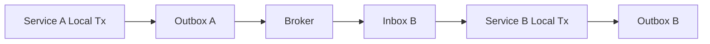

# Part 024 — Consistency Without Distributed Transaction

> Banyak sistem modern sengaja menghindari distributed transaction untuk operasi lintas service/database.
>
> Itu bukan berarti mereka menerima data kacau.
>
> Mereka mengganti atomicity global dengan:
>
> - local transaction yang kuat;
> - transactional outbox;
> - inbox/dedup consumer;
> - saga/workflow;
> - idempotency;
> - compensation;
> - reconciliation;
> - explicit intermediate states;
> - eventual consistency yang terukur.
>
> Ini bukan "lebih gampang" daripada 2PC. Ini hanya trade-off yang berbeda.

Part ini membahas bagaimana mendesain consistency tanpa distributed transaction.

---

## 1. Core Thesis

Tanpa distributed transaction, tidak ada satu commit atomic yang mencakup semua service/database/broker.

Yang bisa kamu jamin:

```txt
Within one service database:
  local transaction is atomic.

Across services:
  state converges through durable messages, idempotent handlers, and reconciliation.
```

Diagram:



Every service protects its own data. Integration is asynchronous and idempotent.

---

## 2. Why Avoid Distributed Transaction?

Distributed transaction / 2PC can provide atomic commit across participants, but often introduces:

- coordinator availability dependency;
- blocking behavior under failure;
- operational complexity;
- poor fit with message brokers/external APIs;
- cross-service coupling;
- latency;
- hard recovery;
- limited support across heterogeneous systems;
- reduced autonomy of services.

For many microservice/event-driven systems, local transaction + outbox/inbox/saga is preferred.

But trade-off:

```txt
You must explicitly model intermediate states and compensation.
```

---

## 3. Local Transaction Boundary

Each service owns its database transaction.

Example Case Service:

```java
@Transactional
public void approveCase(ApproveCaseCommand command) {
    CaseFile caseFile = repository.findById(command.caseId()).orElseThrow();

    caseFile.approve(command.actor(), command.reason());

    repository.save(caseFile);
    audit.append(...);
    outbox.append(CaseApprovedEvent.from(command, caseFile));
}
```

This local transaction guarantees:

```txt
case approved + audit + outbox event exist together
```

It does not guarantee Sanction Service has processed the event yet.

---

## 4. Transactional Outbox

Outbox table:

```sql
create table outbox_event (
    id uuid primary key,
    event_key text not null,
    aggregate_type text not null,
    aggregate_id text not null,
    aggregate_version bigint,
    event_type text not null,
    payload jsonb not null,
    headers jsonb,
    created_at timestamptz not null,
    published_at timestamptz,
    claimed_by text,
    claimed_at timestamptz,
    constraint uq_outbox_event_key unique(event_key)
);
```

Write in same transaction as state change:

```java
caseRepository.save(caseFile);
outboxRepository.append(new OutboxEvent(
        UUID.randomUUID(),
        "case-approved:" + command.commandId(),
        "CaseFile",
        caseFile.id().toString(),
        caseFile.version(),
        "CaseApproved",
        payload,
        now
));
```

If transaction commits, event is durable. If transaction rolls back, no event.

---

## 5. Outbox Publisher

Publisher loop:

```java
public void publishBatch() {
    List<OutboxEvent> events = outboxRepository.claimNextBatch(workerId, 100);

    for (OutboxEvent event : events) {
        try {
            broker.publish(event.topic(), event.key(), event.payload(), event.headers());
            outboxRepository.markPublished(event.id(), workerId, clock.now());
        } catch (Exception ex) {
            outboxRepository.markPublishFailed(event.id(), workerId, ex);
        }
    }
}
```

Important:

- publishing and marking published are not atomic with broker;
- event may be published but mark failed;
- event may be republished;
- consumers must be idempotent.

Outbox gives at-least-once delivery, not exactly-once.

---

## 6. Inbox / Idempotent Consumer

Consumer table:

```sql
create table inbox_message (
    message_id text primary key,
    source text not null,
    payload_hash text,
    received_at timestamptz not null,
    processed_at timestamptz,
    status text not null
);
```

Consumer transaction:

```java
@Transactional
public void onCaseApproved(Message<CaseApprovedPayload> message) {
    InboxStartResult start = inbox.tryStart(
            message.id(),
            message.source(),
            message.payloadHash()
    );

    if (start.isDuplicate()) {
        return;
    }

    sanctionApplication.createReviewFromCaseApproval(message.payload());

    inbox.markProcessed(message.id());
}
```

If message redelivers, inbox prevents duplicate local effect.

---

## 7. At-Least-Once Delivery

With outbox/inbox, assume:

```txt
event can be delivered more than once
event can be delayed
event can be processed after newer events
publisher can crash after publish before mark
consumer can crash after local commit before ack
operator can replay events
```

Design:

- stable event ID;
- inbox dedup;
- aggregate version if ordering matters;
- idempotent projection update;
- compensation/reconciliation.

---

## 8. Exactly-Once Illusion

"Exactly once" across database + broker + consumer is usually not the right application-level assumption.

Even if broker provides strong delivery semantics, application can still see duplicates due to:

- producer retry;
- consumer retry;
- manual replay;
- outbox mark failure;
- external API timeout;
- deployment bugs;
- duplicate commands.

Production mindset:

```txt
At-least-once transport + idempotent effects = practical reliability.
```

---

## 9. Event Identity

Event should carry stable identity.

```json
{
  "eventId": "9c6f...",
  "eventKey": "case-approved:command-123",
  "eventType": "CaseApproved",
  "aggregateType": "CaseFile",
  "aggregateId": "case-456",
  "aggregateVersion": 8,
  "occurredAt": "2026-07-05T10:15:30Z",
  "payload": {}
}
```

Consumer dedup can use `eventId`.

Semantic dedup can use `eventKey`.

Projection ordering can use `aggregateVersion`.

---

## 10. Event Key vs Event ID

`eventId`:

- unique row/message ID;
- good for inbox dedup;
- may differ if event regenerated incorrectly.

`eventKey`:

- semantic uniqueness key;
- e.g. `case-approved:{commandId}`;
- prevents duplicate outbox for same semantic event.

Use both.

---

## 11. Aggregate Version

Version helps consumers handle ordering.

Producer:

```txt
CaseFile version 8 emits CaseApproved version 8
```

Consumer projection:

```sql
update case_dashboard
set status = ?,
    aggregate_version = ?
where case_id = ?
  and aggregate_version < ?;
```

If duplicate/old event arrives, no-op.

If version gap detected, trigger rebuild or hold.

---

## 12. Ordering Is Not Guaranteed Everywhere

Even if one partition/key preserves order, cross-service workflows may still see:

- different event types on different topics;
- retries;
- replay;
- delayed messages;
- parallel consumers;
- manual backfill.

Design consumer to be robust:

- process per aggregate key when ordering required;
- store last processed version;
- detect gaps;
- no-op old events;
- rebuild projection if necessary.

---

## 13. Saga Boundary

Saga is a sequence of local transactions coordinated by messages/commands.

Example:

```txt
Case Service approves case.
Sanction Service creates sanction review.
Notification Service sends notification.
Document Service generates document.
```

There is no global transaction.

Each step:

```txt
local transaction + outbox event
```

Failure:

```txt
compensation or manual review
```

---

## 14. Choreography vs Orchestration

### Choreography

Services react to events.

```txt
CaseApproved -> Sanction Service reacts
CaseApproved -> Notification Service reacts
```

Pros:

- loose coupling;
- simple for small flows.

Cons:

- flow harder to see;
- compensation scattered;
- event storms;
- implicit dependencies.

### Orchestration

One workflow orchestrator commands steps.

```txt
ApprovalWorkflow sends CreateSanctionReview command.
Waits for SanctionReviewCreated.
Then sends GenerateDocument command.
```

Pros:

- central visibility;
- easier compensation;
- explicit state.

Cons:

- orchestrator coupling;
- more infrastructure.

Choose based on process complexity.

---

## 15. Saga State Table

```sql
create table saga_instance (
    id uuid primary key,
    saga_type text not null,
    aggregate_id text not null,
    status text not null,
    current_step text not null,
    payload jsonb not null,
    version bigint not null,
    created_at timestamptz not null,
    updated_at timestamptz not null
);
```

Step state:

```sql
create table saga_step (
    saga_id uuid not null,
    step_name text not null,
    status text not null,
    attempt_count int not null,
    last_error text,
    updated_at timestamptz not null,
    primary key(saga_id, step_name)
);
```

State transition uses expected version/status.

---

## 16. Command/Event Correlation

Every cross-service operation needs correlation.

Headers:

```json
{
  "correlationId": "...",
  "causationId": "...",
  "commandId": "...",
  "sagaId": "...",
  "tenantId": "..."
}
```

Definitions:

- correlation ID: whole business process;
- causation ID: message/command that caused this message;
- command ID: idempotency of command;
- saga ID: workflow instance;
- tenant ID: scope.

This makes tracing and dedup possible.

---

## 17. Local Transaction + Outbox Example

Case Service:

```java
@Transactional
public ApproveCaseResult approve(ApproveCaseCommand command) {
    Optional<ApproveCaseResult> previous =
            commandDedup.findCompleted(command.commandId(), ApproveCaseResult.class);

    if (previous.isPresent()) {
        return previous.get();
    }

    commandDedup.start(command);

    CaseFile caseFile = caseRepository.findById(command.caseId()).orElseThrow();
    caseFile.approve(command.actorId(), command.reason());

    caseRepository.save(caseFile);
    audit.append(CaseAudit.approved(command, caseFile));
    outbox.append(CaseApprovedEvent.of(command, caseFile));

    ApproveCaseResult result = ApproveCaseResult.from(caseFile);
    commandDedup.complete(command.commandId(), result);

    return result;
}
```

Guarantee:

```txt
If approval committed, outbox event exists.
```

---

## 18. Consumer Local Transaction Example

Sanction Service:

```java
@Transactional
public void onCaseApproved(EventEnvelope<CaseApproved> event) {
    InboxResult inboxResult = inbox.tryStart(event.eventId(), event.payloadHash());

    if (inboxResult.isDuplicate()) {
        return;
    }

    if (sanctionReviewRepository.existsBySourceEvent(event.eventId())) {
        inbox.markProcessed(event.eventId());
        return;
    }

    SanctionReview review = SanctionReview.openFromCaseApproval(event.payload());

    sanctionReviewRepository.save(review);
    audit.append(SanctionAudit.reviewOpened(event, review));
    outbox.append(SanctionReviewOpenedEvent.of(event, review));

    inbox.markProcessed(event.eventId());
}
```

Guarantee:

```txt
Message processed + local mutation + outgoing event commit together.
```

---

## 19. Idempotent Consumer by Source Event

Additional unique key:

```sql
create unique index uq_sanction_review_source_event
on sanction_review(source_event_id);
```

Even if inbox has a bug, source event unique key prevents duplicate review.

Defense-in-depth:

- inbox dedup;
- unique source event ID;
- command ID;
- aggregate version.

---

## 20. Compensation Across Services

Example:

```txt
Case approved.
Sanction review creation fails permanently.
```

Options:

- retry until fixed;
- mark Case as APPROVED_PENDING_SANCTION_REVIEW;
- create compensation event `SanctionReviewCreationFailed`;
- Case Service moves case to `APPROVED_REQUIRES_MANUAL_REVIEW`;
- operator handles.

Compensation is business decision.

It is not automatic rollback of previous service.

---

## 21. Reservation Across Services

If service A needs capacity from service B:

```txt
A requests reservation from B.
B reserves locally with expiry.
A proceeds.
A confirms or cancels reservation.
B expires if no confirmation.
```

Reservation service local transaction:

```txt
create reservation ACTIVE + outbox ReservationCreated
```

Confirm:

```txt
ACTIVE -> CONFIRMED
```

Cancel/expire:

```txt
ACTIVE -> CANCELLED/EXPIRED
```

No distributed lock.

---

## 22. Eventual Consistency

Eventual consistency means:

```txt
After all messages are delivered and processed, replicas/read models/services converge to expected state.
```

It does not mean:

```txt
Anything goes.
```

You need:

- clear source of truth;
- convergence rules;
- idempotent events;
- retry;
- reconciliation;
- monitoring lag;
- user-visible pending states.

---

## 23. Read Model Lag

If read model updates asynchronously:

```txt
command returns success
dashboard still shows old state for 2 seconds
```

Design UX/API:

- return command result from write model;
- show "processing";
- poll until projection version catches up;
- include version in response;
- for critical read-after-write, query source service;
- use synchronous projection if needed.

Do not accidentally promise immediate consistency if projection is async.

---

## 24. Read-Your-Writes in Eventual Systems

Options:

1. Return fresh result directly from command response.
2. Use source service for immediate detail read.
3. Include `expectedVersion` and wait until read model version >= expected.
4. Client-side optimistic update.
5. Synchronous local read model update.

Example:

```txt
Approve returns caseVersion=8.
Dashboard endpoint can include projectionVersion.
Client waits until projectionVersion >= 8.
```

---

## 25. Consistency Contract Documentation

For each API/event, document:

```txt
Source of truth:
  Case Service case_file table.

Command result:
  Strongly consistent after local transaction commit.

Dashboard:
  Eventually consistent, usually < 5s lag.

Events:
  At-least-once, ordered per aggregate key best-effort, consumers must be idempotent.

Retry:
  Use same commandId.
```

This avoids false assumptions by frontend/other teams.

---

## 26. Reconciliation

Reconciliation finds and repairs divergence.

Examples:

- outbox unpublished too long;
- inbox stuck processing;
- Case approved but Sanction review missing;
- read model version behind source;
- external service status differs from local state;
- reservation expired but still counted;
- duplicate projection rows.

Reconciler is normal part of eventual consistency design.

---

## 27. Reconciliation Query Example

Case approved but no sanction review:

```sql
select c.id
from case_file c
left join sanction_review_link l on l.case_id = c.id
where c.status = 'APPROVED'
  and c.approved_at < ?
  and l.case_id is null;
```

In microservices, reconciliation may call APIs or consume exported snapshots instead of cross-DB join.

Repair action must be idempotent.

---

## 28. Outbox Lag Monitoring

Outbox lag:

```sql
select max(now() - created_at)
from outbox_event
where published_at is null;
```

Metrics:

```txt
outbox.unpublished.count
outbox.oldest_unpublished.age
outbox.publish.failure.count
outbox.publish.retry.count
```

If outbox lags, downstream services become stale.

---

## 29. Inbox Lag Monitoring

Inbox status:

```sql
select status, count(*), max(now() - received_at)
from inbox_message
group by status;
```

If messages stuck PROCESSING, worker crash or bug.

Use lease/status design if processing spans outside transaction.

---

## 30. Poison Message

A message that always fails can block processing.

Strategies:

- bounded retries;
- dead-letter;
- mark failed with reason;
- alert;
- allow replay after fix;
- do not block unrelated aggregate if possible.

Consumer must distinguish:

- transient DB failure;
- validation/schema incompatible;
- unknown event version;
- missing dependency;
- bug.

---

## 31. Schema Evolution for Events

Events are contracts.

Need:

- event version;
- backward-compatible fields;
- consumers tolerate unknown fields;
- producers avoid removing/renaming fields abruptly;
- migration plan for payload changes;
- replay compatibility.

Outbox stores payload. Old events may be published/replayed after code changed.

---

## 32. Inbox Payload Hash and Version

Store:

```sql
message_id,
event_type,
event_version,
payload_hash
```

If same message ID with different hash, alert.

If event version unsupported, move to dead-letter or compatibility handler.

---

## 33. Transactional Outbox Variants

### Polling Publisher

Worker polls outbox table.

Pros:

- simple;
- portable;
- easy to inspect.

Cons:

- polling lag;
- load on DB;
- claim logic needed.

### Log Tailing / CDC

Change data capture reads DB log and publishes.

Pros:

- lower app polling;
- can be scalable;
- near-real-time.

Cons:

- operational complexity;
- connector config;
- schema/event mapping discipline;
- still need idempotent consumers.

Application design remains: write outbox in local transaction.

---

## 34. Outbox Claiming Pattern

Claim rows:

```sql
update outbox_event
set claimed_by = ?,
    claimed_at = ?
where id in (
    select id
    from outbox_event
    where published_at is null
      and (claimed_at is null or claimed_at < ?)
    order by created_at, id
    limit ?
)
returning *;
```

Database syntax varies.

Need:

- claim expiry;
- worker ID;
- retry count;
- failure reason;
- ordering policy.

---

## 35. Mark Published Race

Mark published:

```sql
update outbox_event
set published_at = ?,
    claimed_by = null
where id = ?
  and claimed_by = ?;
```

If update count 0:

- claim expired;
- another worker claimed;
- row already published;
- bug.

If event was already published externally, do not publish again if not owner. But if mark failed after publish, republish may occur later. Consumers must handle.

---

## 36. Consumer Idempotency Beyond Inbox

Inbox dedups exact message. But business effect should also be safe.

Example:

```sql
create unique index uq_review_source_case_approval
on sanction_review(source_case_id, source_case_version, review_type);
```

This prevents duplicate review if event ID differs but semantic event same.

Use semantic uniqueness for critical consumers.

---

## 37. Cross-Service Command Idempotency

If Service A sends command to Service B:

```json
{
  "commandId": "saga-123:create-sanction-review",
  "caseId": "...",
  "reason": "..."
}
```

Service B stores command dedup.

Same command retry returns same result.

Do not rely only on broker dedup.

---

## 38. Saga Step Idempotency

Saga step key:

```txt
{sagaId}:{stepName}
```

Step command:

```java
public record CreateSanctionReviewCommand(
        UUID commandId,
        UUID sagaId,
        UUID caseId,
        UUID sourceEventId
) {}
```

Service B:

- dedup command ID;
- create review if not exists;
- store result;
- outbox response event.

---

## 39. Compensation Idempotency

Compensation command:

```txt
{sagaId}:compensate:{stepName}
```

If compensation retries, it should not over-release or create duplicate audit.

State predicate:

```sql
update reservation
set status = 'CANCELLED'
where id = ?
  and status = 'ACTIVE';
```

If already cancelled, replay result.

If confirmed, compensation may not be valid. Escalate/manual review.

---

## 40. Eventual Consistency and User Experience

Expose intermediate states:

```txt
APPROVAL_PROCESSING
APPROVED_PENDING_NOTIFICATION
APPROVED_REQUIRES_MANUAL_REVIEW
```

Avoid pretending command is fully complete if downstream steps pending.

For UI:

- show progress;
- allow refresh;
- show last updated time;
- handle duplicate submit;
- show conflict clearly.

---

## 41. Consistency Without 2PC Example

Use case:

```txt
Approve case and create sanction review in another service.
```

Case Service transaction:

```txt
approve case
audit approval
outbox CaseApproved
commit
```

Sanction Service transaction:

```txt
inbox CaseApproved
create sanction review
audit review opened
outbox SanctionReviewOpened
commit
```

Case Service consumes `SanctionReviewOpened`:

```txt
inbox
link sanction review to case
mark case sanction_review_status=OPENED
commit
```

If sanction service fails, case remains `APPROVED_PENDING_SANCTION_REVIEW`, not inconsistent hidden failure.

---

## 42. Designing Source of Truth

For each fact, define owner.

| Fact | Owner |
|---|---|
| case status | Case Service |
| sanction review status | Sanction Service |
| notification delivery | Notification Service |
| document file status | Document Service |
| dashboard projection | Reporting/Read Model |

Other services store copies/projections with version/source metadata.

Do not allow multiple services to update same fact independently.

---

## 43. Projection Table Metadata

Projection should store source version.

```sql
create table case_dashboard_projection (
    case_id uuid primary key,
    status text not null,
    case_number text not null,
    source_version bigint not null,
    source_updated_at timestamptz not null,
    projected_at timestamptz not null
);
```

Update:

```sql
update case_dashboard_projection
set status = ?,
    source_version = ?,
    source_updated_at = ?,
    projected_at = ?
where case_id = ?
  and source_version < ?;
```

Old events do not overwrite newer projection.

---

## 44. Handling Missing Events

If projection detects version gap:

```txt
current version = 5
received event version = 7
missing 6
```

Options:

- hold event temporarily;
- request rebuild for aggregate;
- fetch current state from source service;
- dead-letter gap;
- use snapshot event;
- accept last-write-wins if projection only needs final state.

Critical projections should detect gaps.

---

## 45. Snapshot Event

Instead of applying every event, producer can emit snapshot/current-state event.

```json
{
  "eventType": "CaseSnapshotUpdated",
  "aggregateVersion": 8,
  "caseId": "...",
  "status": "APPROVED",
  "assignedOfficer": "..."
}
```

Consumer can upsert if version newer.

Good for read model.

Less good for audit/event sourcing where every transition matters.

---

## 46. Domain Event vs Integration Event

Domain event:

```txt
internal fact inside bounded context
```

Integration event:

```txt
contract published to other services
```

Outbox may store integration event generated from domain event.

Do not expose internal entity details casually.

Integration events require compatibility, versioning, and semantic clarity.

---

## 47. Event Payload Design

Include:

- event ID;
- event type;
- event version;
- aggregate ID;
- aggregate version;
- occurred at;
- producer service;
- tenant;
- correlation/causation IDs;
- payload with stable contract.

Avoid:

- entire database entity dump;
- sensitive fields unless required;
- lazy-loaded huge graphs;
- ambiguous enum meaning;
- fields with unclear time semantics.

---

## 48. Local Atomicity vs Global Convergence

Local atomicity:

```txt
case approved + outbox event committed
```

Global convergence:

```txt
sanction review eventually opened
dashboard eventually updated
notification eventually sent
```

Monitoring must cover both.

A system can have perfect local transaction and still fail global convergence if outbox publisher is dead.

---

## 49. Failure Matrix

| Failure | Expected Design Response |
|---|---|
| Case tx rollback | no outbox event |
| Case tx commit but publisher down | outbox lag, later publish |
| Publish succeeds but mark published fails | event may duplicate |
| Consumer receives duplicate | inbox no-op |
| Consumer fails before commit | message redelivered |
| Consumer commits but ack lost | message redelivered, inbox no-op |
| Consumer creates downstream event | outbox in same tx |
| Downstream unavailable | retry/dead-letter |
| Event schema unknown | dead-letter/compat handler |
| Saga step fails permanent | compensation/manual state |

---

## 50. Testing Without Distributed Transaction

Test:

1. local transaction rollback means no outbox.
2. local transaction commit creates outbox.
3. publisher publishes same event twice -> consumer applies once.
4. consumer crash after commit before ack -> redelivery no duplicate.
5. out-of-order event does not overwrite newer projection.
6. saga failure triggers compensation.
7. late event after cancellation ignored.
8. outbox lag metric rises when publisher stopped.
9. reconciliation repairs missing downstream state.
10. duplicate command to downstream returns same result.

---

## 51. Example Test: Duplicate Delivery

```java
@Test
void duplicateCaseApprovedEventCreatesOneSanctionReview() {
    CaseApproved event = fixture.caseApprovedEvent();

    sanctionConsumer.onCaseApproved(event);
    sanctionConsumer.onCaseApproved(event);

    assertThat(sanctionReviewQuery.countBySourceEvent(event.eventId()))
            .isEqualTo(1);

    assertThat(inboxQuery.countByMessageId(event.eventId()))
            .isEqualTo(1);
}
```

Use real DB to test unique constraints/inbox.

---

## 52. Example Test: Outbox Rollback

```java
@Test
void rollbackDoesNotCreateOutboxEvent() {
    assertThatThrownBy(() ->
            approveUseCase.approveWithInjectedFailure(command)
    ).isInstanceOf(RuntimeException.class);

    assertThat(caseQuery.get(command.caseId()).status())
            .isEqualTo(CaseStatus.UNDER_REVIEW);

    assertThat(outboxQuery.findByEventKey("case-approved:" + command.commandId()))
            .isEmpty();
}
```

This proves local atomicity.

---

## 53. Example Test: Publish Mark Failure

Simulate:

1. publisher reads event;
2. broker publish succeeds;
3. mark published fails;
4. publisher retries event;
5. consumer receives duplicate;
6. local effect once.

This proves at-least-once safety.

---

## 54. Data Repair and Reconciliation

If downstream state missing:

```java
public void reconcileApprovedCase(CaseId caseId) {
    CaseSnapshot snapshot = caseClient.getCase(caseId);

    if (snapshot.status() != APPROVED) {
        return;
    }

    createSanctionReviewIdempotently(snapshot);
}
```

Command to downstream must have deterministic command ID:

```txt
reconcile-sanction-review:{caseId}:{caseVersion}
```

Reconciliation itself is idempotent.

---

## 55. Avoiding Cross-DB Joins in Services

In microservice architecture, do not query another service's database directly to "fix" consistency.

Use:

- API;
- event stream;
- exported snapshot;
- reconciliation endpoint;
- data product/read model with ownership contract.

Direct cross-DB joins couple schemas and bypass ownership.

In modular monolith with one database, cross-module transaction may be acceptable by design. Be explicit.

---

## 56. When Distributed Transaction Might Be Acceptable

Do not be dogmatic.

Distributed transaction may be acceptable when:

- participants are homogeneous and support it well;
- scope is small;
- operational team understands it;
- latency/availability trade-off acceptable;
- business demands strict atomicity;
- alternatives are more complex/risky.

But for service-to-service + broker + external API workflows, local transaction + saga/outbox is often more operationally realistic.

---

## 57. Anti-Pattern: Publish Then Commit

```java
broker.publish(event);
database.commit();
```

If publish succeeds and commit fails, event lies.

Fix outbox.

---

## 58. Anti-Pattern: Commit Then Publish Without Outbox

```java
database.commit();
broker.publish(event);
```

If process crashes between commit and publish, event lost.

Fix outbox.

---

## 59. Anti-Pattern: Consumer Without Inbox

Duplicate delivery creates duplicate local state.

Fix inbox + unique semantic constraints.

---

## 60. Anti-Pattern: Eventual Consistency Without Status

If user sees final success but downstream still pending/failing invisibly, UX and operations suffer.

Expose pending/failure states.

---

## 61. Anti-Pattern: Compensation as Delete

Compensation should be domain transition, not silent delete.

Record:

- why compensation occurred;
- who/what caused it;
- previous state;
- new state;
- correlation ID.

---

## 62. Anti-Pattern: No Reconciliation

Outbox/inbox reduces risk but does not eliminate all divergence.

Reconciliation is part of design, not afterthought.

---

## 63. Production Checklist

- [ ] Every service has clear local transaction boundary.
- [ ] State change and outbox write are atomic.
- [ ] Outbox events have stable event ID/key.
- [ ] Publisher supports retry/claim/mark published.
- [ ] Consumers use inbox dedup.
- [ ] Consumers are idempotent beyond inbox where needed.
- [ ] Events carry aggregate version if ordering matters.
- [ ] Saga/workflow state is durable.
- [ ] Compensation is explicit and idempotent.
- [ ] Read model lag is measured.
- [ ] API documents consistency contract.
- [ ] Reconciliation jobs exist.
- [ ] Poison messages go to dead-letter.
- [ ] Event schema evolution is planned.
- [ ] Tests simulate duplicate delivery and mark-published failure.
- [ ] No publish-before-commit or commit-before-publish without outbox.

---

## 64. Mini Lab

Design consistency for:

```txt
Case Service approves a case.
Sanction Service must open a sanction review.
Document Service must generate approval letter.
Notification Service must email officer.
Dashboard must show final status.
```

Questions:

1. What is the source of truth for each fact?
2. What local transaction happens in Case Service?
3. What outbox event is emitted?
4. What is event key?
5. What does Sanction Service inbox store?
6. How is sanction review creation idempotent?
7. What if Document Service fails permanently?
8. What compensation/manual state exists?
9. How does Dashboard avoid old event overwriting new state?
10. What reconciliation job detects missing sanction review?
11. What lag metrics are required?
12. What API status should user see while downstream steps pending?

---

## 65. Summary

Consistency without distributed transaction is not weaker by default; it is more explicit.

You must master:

- local transaction boundary;
- transactional outbox;
- outbox publisher failure modes;
- inbox/idempotent consumer;
- event identity and event key;
- aggregate version;
- at-least-once delivery;
- exactly-once illusion;
- saga choreography/orchestration;
- compensation;
- reservation;
- eventual consistency contract;
- read model lag;
- reconciliation;
- dead-letter;
- event schema evolution;
- source-of-truth ownership;
- testing duplicate delivery and rollback/publish races.

This closes Phase 3. Part berikutnya masuk Phase 4: **DAO, Repository, Gateway, dan Query Object Pattern**, dimulai dengan DAO pattern modern yang benar: contract, mapping, query ownership, failure handling, and testing seam.

---

## 66. References

- Oracle Java SE `Connection`: https://docs.oracle.com/en/java/javase/21/docs/api/java.sql/java/sql/Connection.html
- Jakarta Transactions Specification: https://jakarta.ee/specifications/transactions/
- Spring Framework Transaction Management: https://docs.spring.io/spring-framework/reference/data-access/transaction.html
- PostgreSQL Transaction Isolation: https://www.postgresql.org/docs/current/transaction-iso.html
- PostgreSQL `INSERT`: https://www.postgresql.org/docs/current/sql-insert.html
- PostgreSQL `UPDATE`: https://www.postgresql.org/docs/current/sql-update.html
- PostgreSQL Constraints: https://www.postgresql.org/docs/current/ddl-constraints.html
