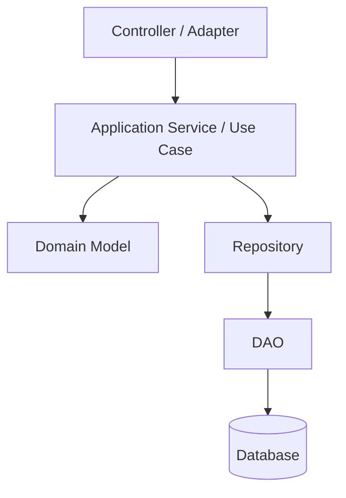

# Part 025 — DAO Pattern Done Right

> DAO sering dianggap pattern lama.
>
> Padahal di sistem Java production, DAO yang dirancang dengan baik masih sangat kuat:
>
> - SQL eksplisit;
> - mapping jelas;
> - error translation terkontrol;
> - transaction participation mudah;
> - testing seam bagus;
> - query ownership jelas;
> - performa mudah direview.
>
> Yang buruk bukan DAO. Yang buruk adalah DAO generik tanpa kontrak, DAO yang menyembunyikan transaction, DAO yang return entity bocor, dan DAO yang menjadi dumping ground semua query.

Part ini membahas DAO modern yang benar.

---

## 1. Core Thesis

DAO adalah abstraction untuk akses data yang dekat dengan storage.

DAO yang baik menjawab:

```txt
How do I execute this storage operation correctly?
```

Bukan:

```txt
What is the domain behavior?
```

Bukan:

```txt
What should the use case do?
```

Bukan:

```txt
How should API response look?
```

DAO sebaiknya dekat dengan:

- SQL;
- table/projection;
- JDBC/JPA/native query;
- row mapping;
- update count;
- constraint error mapping;
- transaction participation.

DAO bukan tempat business orchestration.

---

## 2. DAO Position in Architecture



Dalam aplikasi sederhana, use case bisa memanggil DAO langsung untuk read/query path. Tetapi untuk command domain yang kompleks, repository/domain boundary biasanya lebih sehat.

DAO bisa dipakai oleh:

- repository;
- query service;
- batch job;
- migration utility;
- projection updater;
- outbox publisher;
- report generator.

---

## 3. DAO vs Repository

DAO berorientasi persistence operation.

Repository berorientasi domain aggregate.

DAO method:

```java
Optional<CaseFileRow> findRowById(Connection connection, UUID caseId);
int updateStatusWithVersion(Connection connection, UUID caseId, String status, long version);
void insertAudit(Connection connection, CaseAuditRow row);
```

Repository method:

```java
Optional<CaseFile> findById(CaseFileId id);
void save(CaseFile aggregate);
```

DAO returns rows/projections. Repository returns aggregate/domain object.

DAO knows SQL shape. Repository knows aggregate rehydration/save semantics.

---

## 4. DAO Contract Principles

A DAO method contract should specify:

- what SQL operation it performs;
- expected cardinality;
- transaction participation;
- parameter semantics;
- return type semantics;
- update count expectations;
- error mapping;
- locking behavior;
- ordering/pagination if read;
- nullability;
- tenant/scope requirement.

Example:

```java
/**
 * Loads one case row by tenant and id.
 *
 * Contract:
 * - Uses caller-provided connection and does not close it.
 * - Participates in caller transaction.
 * - Returns Optional.empty when no row matches tenant/id.
 * - Does not lock row.
 * - Maps database status code to CaseStatus.
 * - Throws DataMappingException if required columns are null/invalid.
 */
Optional<CaseFileRow> findById(
        Connection connection,
        TenantId tenantId,
        CaseFileId caseId
);
```

This is much stronger than:

```java
Case find(Object id);
```

---

## 5. DAO Should Own SQL

DAO is where SQL should be visible and reviewable.

```java
private static final String FIND_BY_ID = """
    /* query=CaseFileDao.findById */
    select
        id,
        tenant_id,
        case_number,
        status,
        version,
        created_at,
        updated_at
    from case_file
    where tenant_id = ?
      and id = ?
    """;
```

Benefits:

- query can be reviewed;
- query can be named;
- query can be profiled;
- query shape matches mapper;
- query ownership clear;
- no hidden generated SQL surprises.

If using jOOQ/MyBatis/JPA later, same principle applies: data access component owns query shape.

---

## 6. DAO Should Not Own Use Case Transaction by Default

DAO should participate in caller transaction.

```java
public void insert(Connection connection, CaseAuditRow row) {
    try (PreparedStatement ps = connection.prepareStatement(SQL)) {
        ...
    }
}
```

It should not do this for command orchestration:

```java
public void insert(CaseAuditRow row) {
    try (Connection connection = dataSource.getConnection()) {
        connection.setAutoCommit(false);
        ...
        connection.commit();
    }
}
```

Unless method is explicitly an independent operation.

Reason:

```txt
Use case transaction often spans multiple DAOs.
```

DAO closing/committing its own connection breaks atomicity.

---

## 7. Two DAO Styles

### Connection-Passing DAO

```java
public interface CaseFileDao {
    Optional<CaseFileRow> findById(Connection connection, TenantId tenantId, CaseFileId id);
    void updateStatus(Connection connection, CaseStatusUpdate update);
}
```

Pros:

- explicit transaction participation;
- simple manual JDBC;
- easy to reason.

Cons:

- JDBC leaks into caller/repository;
- more boilerplate;
- less framework integration.

### DataSource-Owned DAO

```java
public Optional<CaseFileRow> findById(TenantId tenantId, CaseFileId id) {
    try (Connection connection = dataSource.getConnection()) {
        return findById(connection, tenantId, id);
    }
}
```

Pros:

- convenient for independent read;
- callers do not see `Connection`.

Cons:

- can accidentally break use case transaction;
- framework transaction binding must be understood.

Best practice:

```txt
Have connection-taking core methods.
Optionally provide convenience methods for independent query paths.
```

---

## 8. Example DAO Interface

```java
public interface CaseFileDao {
    Optional<CaseFileRow> findById(
            Connection connection,
            TenantId tenantId,
            CaseFileId caseId
    );

    Optional<CaseFileRow> findByIdForUpdate(
            Connection connection,
            TenantId tenantId,
            CaseFileId caseId
    );

    int updateStatusWithVersion(
            Connection connection,
            TenantId tenantId,
            CaseFileId caseId,
            CaseStatus newStatus,
            long expectedVersion,
            Instant updatedAt
    );

    void insert(
            Connection connection,
            CaseFileInsertRow row
    );
}
```

Notice:

- row-level operation;
- explicit tenant;
- explicit lock method;
- explicit expected version;
- update returns count or throws semantic conflict by contract.

---

## 9. Row Types

DAO should use row/projection types.

```java
public record CaseFileRow(
        UUID id,
        UUID tenantId,
        String caseNumber,
        CaseStatus status,
        long version,
        OffsetDateTime createdAt,
        OffsetDateTime updatedAt
) {}
```

Insert row:

```java
public record CaseFileInsertRow(
        UUID id,
        UUID tenantId,
        String caseNumber,
        CaseStatus status,
        long version,
        OffsetDateTime createdAt,
        OffsetDateTime updatedAt
) {}
```

Update command row:

```java
public record CaseStatusUpdate(
        UUID tenantId,
        UUID caseId,
        CaseStatus newStatus,
        long expectedVersion,
        OffsetDateTime updatedAt
) {}
```

Don't overload one object for everything.

---

## 10. DAO Implementation Skeleton

```java
public final class JdbcCaseFileDao implements CaseFileDao {
    private final SqlExceptionTranslator translator;

    public JdbcCaseFileDao(SqlExceptionTranslator translator) {
        this.translator = translator;
    }

    @Override
    public Optional<CaseFileRow> findById(
            Connection connection,
            TenantId tenantId,
            CaseFileId caseId
    ) {
        String operation = "CaseFileDao.findById";

        try (PreparedStatement ps = connection.prepareStatement(FIND_BY_ID)) {
            int i = 1;
            ps.setObject(i++, tenantId.value());
            ps.setObject(i++, caseId.value());

            try (ResultSet rs = ps.executeQuery()) {
                if (!rs.next()) {
                    return Optional.empty();
                }

                CaseFileRow row = CaseFileRowMapper.INSTANCE.mapRow(rs);

                if (rs.next()) {
                    throw new DataAccessInvariantViolation(
                            operation + " expected one row but got multiple"
                    );
                }

                return Optional.of(row);
            }
        } catch (SQLException e) {
            throw translator.translate(operation, e);
        }
    }
}
```

DAO closes statement/result set, not caller-owned connection.

---

## 11. SQL Query Naming

Every important query should have stable name.

```sql
/* query=CaseFileDao.findById */
select ...
```

Why:

- slow query logs;
- database monitoring;
- trace correlation;
- incident debugging;
- performance review.

Use low-cardinality query name. Do not include raw user IDs in SQL comment.

---

## 12. DAO Mapping Discipline

Mapper belongs near DAO.

```java
enum CaseFileRowMapper implements RowMapper<CaseFileRow> {
    INSTANCE;

    @Override
    public CaseFileRow mapRow(ResultSet rs) throws SQLException {
        return new CaseFileRow(
                Rs.requiredUuid(rs, "id"),
                Rs.requiredUuid(rs, "tenant_id"),
                Rs.requiredString(rs, "case_number"),
                CaseStatus.fromDbCode(Rs.requiredString(rs, "status")),
                Rs.requiredLong(rs, "version"),
                Rs.requiredOffsetDateTime(rs, "created_at"),
                Rs.requiredOffsetDateTime(rs, "updated_at")
        );
    }
}
```

Mapper should not:

- move cursor;
- call another DAO;
- perform external I/O;
- hide null/default unexpectedly;
- create partial domain aggregate;
- swallow mapping errors.

---

## 13. Expected Cardinality

DAO must enforce cardinality.

### Optional one

```java
Optional<Row> findById(...);
```

Implementation checks duplicate as invariant violation.

### Required one

```java
Row getById(...);
```

Throws not found if absent.

### Many bounded

```java
List<Row> findPage(Filter filter, PageRequest page);
```

Must have limit/order.

### Many streaming/chunk

```java
List<Row> readAfter(Cursor cursor, int limit);
```

Must have deterministic cursor/order.

Do not return unbounded list unless data size is inherently bounded and documented.

---

## 14. Update Count as Contract

Update count is correctness signal.

```java
int updated = ps.executeUpdate();

if (updated == 0) {
    throw new OptimisticConflict(caseId, expectedVersion);
}

if (updated != 1) {
    throw new DataAccessInvariantViolation(
            "Expected one case update, got " + updated
    );
}
```

DAO should not ignore update count.

For idempotent or cleanup operation, 0 may be valid. Document it.

---

## 15. Constraint Error Mapping

DAO maps database constraint to semantic failure.

```java
private RuntimeException translateInsertFailure(
        CaseFileInsertRow row,
        SQLException e
) {
    SqlErrorSignal signal = SqlErrorSignal.from(e);

    if (signal.isConstraint("uq_case_file_case_number")) {
        return new DuplicateCaseNumberException(row.caseNumber(), e);
    }

    return translator.translate("CaseFileDao.insert", e);
}
```

Constraint names become part of application contract.

Use explicit names in migrations.

---

## 16. DAO Error Translation Boundary

Raw `SQLException` should not leak everywhere.

DAO should translate to:

- `DuplicateCaseNumberException`;
- `OptimisticConflict`;
- `DataAccessUnavailableException`;
- `RetryableTransactionFailure`;
- `DataMappingException`;
- `DataAccessInvariantViolation`.

Application layer should not parse SQLState.

---

## 17. DAO and Retry

DAO should not retry by itself in most cases.

Why?

- retry boundary is use case transaction;
- DAO does not know idempotency;
- DAO does not know side effects;
- DAO cannot safely retry partial multi-DAO transaction.

DAO can classify exception as retryable. Retrier at use case/transaction level decides.

---

## 18. DAO and Locking

If method locks, say it in name.

Good:

```java
findByIdForUpdate(...)
findClaimableOutboxEventsForUpdateSkipLocked(...)
lockCaseRow(...)
```

Bad:

```java
findById(...) // secretly for update
```

Locking changes concurrency behavior. It must be visible.

---

## 19. DAO Lock Method Example

```java
private static final String FIND_BY_ID_FOR_UPDATE = """
    /* query=CaseFileDao.findByIdForUpdate */
    select
        id,
        tenant_id,
        case_number,
        status,
        version,
        created_at,
        updated_at
    from case_file
    where tenant_id = ?
      and id = ?
    for update
    """;
```

Use only in short transaction.

Document:

```txt
Locks matching row until transaction commit/rollback.
Caller must keep transaction short.
```

---

## 20. DAO Pagination Contract

Offset pagination:

```java
Page<CaseListRow> search(Filter filter, int limit, int offset);
```

May be okay for shallow UI.

For large/deep scan, use keyset:

```java
List<CaseListRow> readAfter(CaseCursor cursor, int limit);
```

DAO should expose the right pattern.

Bad:

```java
List<CaseRow> findAll();
```

unless table is bounded/system config.

---

## 21. DAO Filter Object

Avoid method explosion:

```java
List<CaseListRow> search(
        Connection connection,
        CaseSearchFilter filter,
        PageRequest page
);
```

Filter:

```java
public record CaseSearchFilter(
        TenantId tenantId,
        Optional<CaseStatus> status,
        Optional<UserId> assignedOfficer,
        Optional<LocalDate> openedFrom,
        Optional<LocalDate> openedTo
) {}
```

DAO builds SQL carefully with parameter binding and whitelist sorting.

Part 027 will go deeper into query object/specification.

---

## 22. Dynamic SQL in DAO

Good dynamic SQL:

```java
SqlBuilder sql = new SqlBuilder("""
    select id, case_number, status, updated_at
    from case_file
    where tenant_id = ?
    """);

List<SqlBinder> binders = new ArrayList<>();
binders.add(ps -> ps.setObject(1, filter.tenantId().value()));

if (filter.status().isPresent()) {
    sql.append(" and status = ?");
    binders.add(ps -> ps.setString(nextIndex(), filter.status().get().dbCode()));
}
```

Rules:

- parameters are bound, not concatenated;
- sort column whitelisted;
- limit bounded;
- query still reviewable;
- tests cover combinations.

Avoid giant generic criteria system unless needed.

---

## 23. Sorting Whitelist

Bad:

```java
sql += " order by " + request.sort();
```

SQL injection risk.

Good:

```java
public enum CaseSort {
    UPDATED_DESC("updated_at desc, id desc"),
    CREATED_ASC("created_at asc, id asc"),
    CASE_NUMBER_ASC("case_number asc, id asc");

    private final String sql;

    CaseSort(String sql) {
        this.sql = sql;
    }

    public String sql() {
        return sql;
    }
}
```

DAO:

```java
sql.append(" order by ").append(sort.sql());
```

Only enum values from server code.

---

## 24. DAO Batch Method

```java
public void insertBatch(Connection connection, List<CaseAuditRow> rows) {
    if (rows.isEmpty()) {
        return;
    }

    String operation = "CaseAuditDao.insertBatch";

    try (PreparedStatement ps = connection.prepareStatement(INSERT_SQL)) {
        for (CaseAuditRow row : rows) {
            bind(ps, row);
            ps.addBatch();
        }

        int[] counts = ps.executeBatch();
        BatchCounts.requireOnePerItem(operation, counts, rows.size());
    } catch (SQLException e) {
        throw translator.translate(operation, e);
    }
}
```

Batch contract must specify:

- transaction owned by caller;
- update count expectations;
- partial failure behavior;
- idempotency keys if relevant.

---

## 25. DAO Should Avoid Generic CRUD Trap

Generic DAO:

```java
interface Dao<T, ID> {
    T save(T entity);
    Optional<T> findById(ID id);
    List<T> findAll();
    void delete(ID id);
}
```

Looks convenient but often hides:

- query shape;
- aggregate boundary;
- transaction semantics;
- locking;
- version check;
- tenant filtering;
- read model optimization;
- business-specific constraints;
- update count behavior.

Use specific methods for important operations.

Generic helper is okay internally. Generic DAO as public abstraction is often too weak.

---

## 26. DAO Method Naming

Bad names:

```java
get()
save()
process()
doUpdate()
findData()
```

Better:

```java
findByTenantAndId
findByIdForUpdate
updateStatusWithExpectedVersion
insertAuditRecord
claimUnpublishedOutboxEvents
markOutboxPublishedIfClaimedBy
readBackfillChunkAfterId
```

Name should reveal:

- action;
- cardinality;
- lock if any;
- expected version if any;
- scope/tenant if relevant;
- intent.

---

## 27. DAO Return Types

Use:

- `Optional<T>` for optional one;
- `T` for required one, with not-found exception;
- `List<T>` for bounded collection;
- `Page<T>` / `Slice<T>` for paginated;
- `Map<K, List<V>>` for grouped child read;
- `int` for affected rows when caller decides;
- domain-specific result for claim/update.

Avoid:

- `null` for not found;
- raw `Map<String,Object>` for application logic;
- unbounded `Stream` without close contract;
- `boolean` if it hides conflict reason.

---

## 28. DAO and Tenant Scope

Tenant should be explicit.

```java
findById(Connection connection, TenantId tenantId, CaseFileId caseId)
```

SQL:

```sql
where tenant_id = ?
  and id = ?
```

Do not rely only on application context hidden in thread local unless architecture deliberately does that.

For high-safety systems, explicit tenant in method signature improves review.

---

## 29. DAO and Security

DAO is not authorization layer, but it can enforce scope predicate.

Example:

```sql
update case_file
set status = ?
where tenant_id = ?
  and id = ?
  and assigned_unit_id = ?
  and version = ?;
```

DAO method can be named:

```java
updateStatusWithinAssignedUnit(...)
```

Application authorization decision should be explicit, but SQL predicate provides race-safe enforcement.

---

## 30. DAO and `select *`

DAO should not use `select *`.

Reasons:

- hidden sensitive columns;
- mapping fragility;
- network cost;
- schema changes affect query;
- index-only opportunities lost;
- review harder.

Use explicit column list.

---

## 31. DAO and Query Plan Review

For critical DAO query, review:

- predicate columns;
- index support;
- order by support;
- limit;
- join cardinality;
- select list;
- expected row count;
- lock behavior;
- explain plan;
- slow query metrics.

DAO query names make this review possible.

---

## 32. DAO and Schema Coupling

DAO is allowed to know schema. That is its job.

But keep coupling localized.

If table column changes, DAO/mappers/tests fail in one place.

Avoid spreading SQL across controllers/services.

---

## 33. DAO and Migration Compatibility

During expand-contract migration, DAO may need old/new compatibility.

Example:

```txt
new nullable column added
dual-read/write phase
old app and new app both run
```

DAO methods should support deployment order.

Do not use `select *`.

Do not assume new column not null until migration finalized.

Use explicit versioned queries if necessary.

---

## 34. DAO and Observability

DAO should emit or support:

- query name;
- duration;
- row count;
- affected row count;
- error category;
- timeout;
- retry classification maybe at higher level.

Avoid high-cardinality labels.

Metrics example:

```txt
data_access.query.duration{query="CaseFileDao.findById"}
data_access.query.rows{query="CaseSearchDao.search"}
data_access.update.affected_rows{query="CaseFileDao.updateStatusWithVersion"}
data_access.error.count{query="CaseFileDao.insert", type="unique_violation"}
```

---

## 35. DAO Testing Strategy

DAO tests should be integration tests with real database.

Test:

- SQL syntax;
- parameter binding;
- mapping;
- nullability;
- enum conversion;
- update count;
- constraint mapping;
- transaction participation;
- lock behavior if needed;
- pagination order;
- batch counts;
- migration compatibility.

Mocking `ResultSet` is rarely enough.

---

## 36. DAO Test Example

```java
@Test
void findByIdMapsCaseFileRow() {
    TenantId tenantId = TenantId.random();
    CaseFileId caseId = CaseFileId.random();

    fixture.insertCase(
            tenantId,
            caseId,
            "CASE-001",
            "UNDER_REVIEW",
            7L
    );

    try (Connection connection = dataSource.getConnection()) {
        Optional<CaseFileRow> row =
                caseFileDao.findById(connection, tenantId, caseId);

        assertThat(row).isPresent();
        assertThat(row.get().caseNumber()).isEqualTo("CASE-001");
        assertThat(row.get().status()).isEqualTo(CaseStatus.UNDER_REVIEW);
        assertThat(row.get().version()).isEqualTo(7L);
    }
}
```

---

## 37. DAO Constraint Mapping Test

```java
@Test
void duplicateCaseNumberMapsToDomainConflict() {
    fixture.insertCase(tenantId, caseId1, "CASE-001");

    CaseFileInsertRow duplicate = new CaseFileInsertRow(
            UUID.randomUUID(),
            tenantId.value(),
            "CASE-001",
            CaseStatus.DRAFT,
            0L,
            now,
            now
    );

    assertThatThrownBy(() ->
            tx.execute(connection -> {
                caseFileDao.insert(connection, duplicate);
                return null;
            })
    ).isInstanceOf(DuplicateCaseNumberException.class);
}
```

This tests real constraint name and translator.

---

## 38. DAO Transaction Participation Test

Test rollback across DAOs:

```java
@Test
void daoParticipatesInCallerTransaction() {
    assertThatThrownBy(() ->
            tx.execute(connection -> {
                caseFileDao.insert(connection, caseRow);
                auditDao.insert(connection, invalidAuditRow); // fails
                return null;
            })
    ).isInstanceOf(DataAccessException.class);

    assertThat(caseFileQuery.find(caseRow.id())).isEmpty();
}
```

This proves DAO did not commit independently.

---

## 39. DAO Lock Test

```java
@Test
void findByIdForUpdateBlocksConcurrentUpdate() {
    // Use two connections and lock timeout.
    // T1 locks row.
    // T2 tries to update/lock.
    // Assert T2 waits or gets lock timeout according to method contract.
}
```

Lock methods deserve dedicated tests because generated SQL/syntax differs per DB.

---

## 40. DAO and Test Fixtures

Fixtures should insert data through lower-level SQL or fixture DAO.

Keep fixtures explicit and readable.

Avoid using the same DAO under test to set up expected data if that hides bug.

Example:

```java
fixture.insertCaseRaw(...)
```

Then test `caseFileDao.findById`.

---

## 41. DAO and Migration Tests

Run migrations before DAO tests.

Test current schema + DAO compatibility.

For expand-contract, test both old/new behavior if supporting rolling deployment.

Migration testing will be covered later, but DAO is where migration mismatches appear.

---

## 42. DAO and Generated SQL Frameworks

Even with jOOQ/MyBatis/JPA, DAO principles still apply:

- method contract explicit;
- query ownership visible;
- transaction boundary clear;
- mapping/projection intentional;
- update count checked;
- constraint errors mapped;
- tests use real DB.

Framework changes mechanics, not responsibility.

---

## 43. DAO in JPA Context

A JPA DAO might use `EntityManager`.

```java
public Optional<CaseFileEntity> findEntityById(UUID id) {
    return Optional.ofNullable(entityManager.find(CaseFileEntity.class, id));
}
```

But if DAO returns JPA entity, be aware:

- persistence context lifecycle;
- lazy loading;
- detached entity;
- dirty checking;
- entity leak;
- transaction boundary.

For read projection, use DTO query rather than exposing entity.

---

## 44. DAO in MyBatis Context

MyBatis mapper is DAO-like.

```java
@Mapper
public interface CaseFileMapper {
    CaseFileRow findById(@Param("tenantId") UUID tenantId, @Param("id") UUID id);
    int updateStatusWithVersion(...);
}
```

Same requirements:

- query naming;
- result map correctness;
- update count;
- error translation;
- transaction participation via session/transaction manager.

---

## 45. DAO in jOOQ Context

jOOQ DAO/query object can be type-safe.

```java
dsl.select(CASE_FILE.ID, CASE_FILE.STATUS, CASE_FILE.VERSION)
   .from(CASE_FILE)
   .where(CASE_FILE.TENANT_ID.eq(tenantId))
   .and(CASE_FILE.ID.eq(caseId))
   .fetchOptional(mapper);
```

Still:

- method contract matters;
- generated schema helps type-safety;
- SQL still needs plan review;
- transaction DSL context must be correct;
- update count checked.

---

## 46. DAO and Stored Procedures

DAO can call stored procedure.

```java
try (CallableStatement cs = connection.prepareCall("{ call close_expired_cases(?) }")) {
    cs.setObject(1, now);
    cs.execute();
}
```

Contract must state:

- procedure transaction behavior;
- result sets;
- affected rows;
- error mapping;
- lock behavior;
- idempotency;
- migration/versioning.

Stored procedure is not a free pass to hide data access complexity.

---

## 47. DAO for Outbox

Outbox DAO methods:

```java
void append(Connection connection, OutboxEventRow event);

List<OutboxEventRow> claimNextBatch(
        Connection connection,
        String workerId,
        Instant staleBefore,
        int limit
);

void markPublished(
        Connection connection,
        UUID eventId,
        String workerId,
        Instant publishedAt
);
```

Each method contract is precise.

`markPublished` should check update count and owner.

---

## 48. DAO for Inbox

Inbox DAO:

```java
InboxStartResult tryStart(
        Connection connection,
        String messageId,
        String source,
        String payloadHash,
        Instant receivedAt
);

void markProcessed(Connection connection, String messageId, Instant processedAt);
```

`tryStart` maps duplicate to result, not exception leaking everywhere.

---

## 49. DAO for Batch Job

Batch DAO:

```java
List<BackfillCandidateRow> readAfter(
        Connection connection,
        BackfillCursor cursor,
        int limit
);

void updateBatch(
        Connection connection,
        List<BackfillUpdateRow> updates
);

void saveCursor(
        Connection connection,
        JobName jobName,
        BackfillCursor cursor
);
```

Chunk transaction orchestrated by job service, not DAO.

---

## 50. DAO Code Review Checklist

- [ ] Method contract is clear.
- [ ] SQL has query name.
- [ ] SQL uses explicit column list.
- [ ] Parameters are bound.
- [ ] Sort fields are whitelisted.
- [ ] Limit is bounded.
- [ ] Tenant/scope predicate included.
- [ ] Mapper matches selected aliases.
- [ ] Cardinality enforced.
- [ ] Update count checked.
- [ ] Constraint errors mapped.
- [ ] DAO does not commit/close caller connection.
- [ ] Locking behavior visible in method name.
- [ ] No external I/O.
- [ ] No hidden retry.
- [ ] Tests use real database.

---

## 51. Anti-Pattern: Generic DAO for Everything

```java
GenericDao.save(entity)
GenericDao.findAll()
```

This tends to erase important contract.

Use specific DAO operations for critical paths.

---

## 52. Anti-Pattern: DAO Starts Transaction Internally

Breaks use case atomicity.

If DAO needs independent transaction, name it and document it.

---

## 53. Anti-Pattern: DAO Returns `ResultSet`

Resource lifecycle leak.

Return rows/projections or use callback with documented lifecycle.

---

## 54. Anti-Pattern: DAO Swallows SQLException

```java
catch (SQLException e) {
    return Optional.empty();
}
```

Converts infrastructure failure into not found.

Never.

---

## 55. Anti-Pattern: DAO Does Business Workflow

DAO should not:

- approve case;
- send notification;
- decide compensation;
- orchestrate saga.

It can execute persistence operations required by those workflows.

---

## 56. Anti-Pattern: Entity Leak from DAO to API

DAO returns entity that controller serializes.

Problems:

- lazy loading;
- sensitive field leak;
- schema becomes API;
- transaction boundary blur.

Use DTO/projection for API read.

---

## 57. Mini Lab

Design DAO for:

```txt
Assign primary officer
```

Needed operations:

- load case for assignment;
- insert assignment;
- enforce one active primary assignment;
- increment officer workload;
- insert audit;
- append outbox;
- command dedup.

Questions:

1. Which methods belong in DAO?
2. Which method locks?
3. Which method checks update count?
4. Which constraints are mapped?
5. Which methods receive caller connection?
6. Which row types are needed?
7. What query names?
8. What tests prove transaction participation?
9. What tests prove duplicate assignment conflict?
10. What should be repository/use case responsibility instead?

---

## 58. Summary

DAO is not obsolete. Bad DAO is obsolete.

A production-grade DAO:

- owns SQL/query shape;
- has explicit method contract;
- participates in caller transaction;
- maps rows/projections, not business behavior;
- enforces cardinality;
- checks update counts;
- translates SQL errors;
- names queries;
- avoids `select *`;
- handles tenant/scope predicate;
- exposes locking explicitly;
- supports batch/chunk patterns;
- is tested with real database;
- avoids generic CRUD abstraction for critical paths.

Part berikutnya membahas **Repository Pattern Done Right**: aggregate boundary, collection illusion, mutation semantics, query limitation, persistence ignorance, transaction relationship, and how repository differs from DAO in production Java systems.

---

## 59. References

- Oracle Java SE JDBC `Connection`: https://docs.oracle.com/en/java/javase/21/docs/api/java.sql/java/sql/Connection.html
- Oracle Java SE JDBC `PreparedStatement`: https://docs.oracle.com/en/java/javase/21/docs/api/java.sql/java/sql/PreparedStatement.html
- Oracle Java SE JDBC `ResultSet`: https://docs.oracle.com/en/java/javase/21/docs/api/java.sql/java/sql/ResultSet.html
- Oracle Java SE JDBC `SQLException`: https://docs.oracle.com/en/java/javase/21/docs/api/java.sql/java/sql/SQLException.html
- Jakarta Persistence Specification: https://jakarta.ee/specifications/persistence/3.2/jakarta-persistence-spec-3.2
- MyBatis Documentation: https://mybatis.org/mybatis-3/
- jOOQ Manual: https://www.jooq.org/doc/latest/manual/
