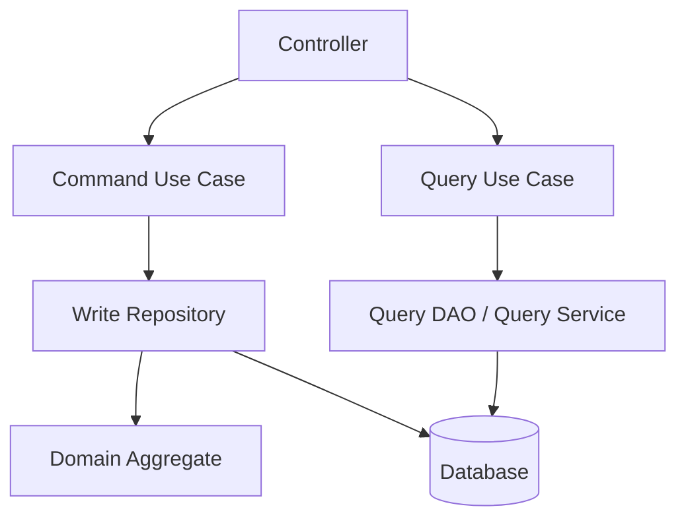

# Part 028 — Command Query Separation in Data Access

> Tidak semua read harus lewat repository.
>
> Tidak semua write harus mengembalikan aggregate.
>
> Tidak semua sistem butuh full CQRS/event sourcing.
>
> Tetapi hampir semua sistem production diuntungkan jika memisahkan:
>
> ```txt
> write path: domain correctness, transaction, invariant
> read path: projection, shape, performance, pagination
> ```
>
> Command Query Separation di data access adalah langkah pragmatis untuk membuat sistem lebih jelas dan lebih cepat tanpa langsung membangun arsitektur yang terlalu berat.

Part ini membahas pemisahan write repository dan read/query service.

---

## 1. Core Thesis

Write path dan read path punya tujuan berbeda.

Write path bertanya:

```txt
Can this command legally change state, and how do we commit it correctly?
```

Read path bertanya:

```txt
What shape of data does this screen/report/API need, and how do we fetch it efficiently?
```

Menyatukan keduanya ke satu repository generik sering menghasilkan:

- aggregate over-fetching;
- dashboard lambat;
- lazy loading;
- query method explosion;
- command invariant bocor;
- read DTO bocor ke domain;
- write transaction terlalu besar;
- API tergantung entity.

Separation membuat masing-masing path optimal untuk tujuannya.

---

## 2. CQS vs CQRS

CQS sederhana:

```txt
Command changes state.
Query returns data.
Do not mix responsibilities casually.
```

CQRS arsitektural sering berarti:

```txt
separate command model and query model,
possibly separate database/table/service,
possibly asynchronous projection.
```

Part ini fokus pada pragmatic CQS in data access:

```txt
Separate write repository from read/query service.
Maybe same database.
Maybe same schema.
Maybe separate read model later.
```

Tidak perlu langsung event sourcing.

---

## 3. Basic Shape



Write side loads aggregate.

Read side loads projection.

---

## 4. Write Repository Example

```java
public interface CaseFileRepository {
    Optional<CaseFile> loadForApproval(CaseFileId id);
    Optional<CaseFile> loadForAssignment(CaseFileId id);
    void save(CaseFile caseFile);
}
```

Used by command:

```java
@Transactional
public ApproveCaseResult approve(ApproveCaseCommand command) {
    CaseFile caseFile = caseFileRepository.loadForApproval(command.caseId())
            .orElseThrow(() -> new CaseNotFound(command.caseId()));

    caseFile.approve(command.actorId(), command.reason());

    caseFileRepository.save(caseFile);
    auditRepository.append(...);
    outboxRepository.append(...);

    return ApproveCaseResult.from(caseFile);
}
```

Goal: correctness and invariant enforcement.

---

## 5. Read Query Service Example

```java
public interface CaseDashboardQuery {
    Slice<CaseDashboardRow> search(CaseDashboardFilter filter, PageRequest page);
    CaseDetailView getDetail(CaseFileId id);
}
```

Projection:

```java
public record CaseDashboardRow(
        CaseFileId id,
        String caseNumber,
        CaseStatus status,
        Priority priority,
        String assignedOfficerName,
        Instant updatedAt
) {}
```

Read path can use optimized SQL:

```sql
select
    c.id,
    c.case_number,
    c.status,
    c.priority,
    o.display_name as assigned_officer_name,
    c.updated_at
from case_file c
left join officer o on o.id = c.assigned_officer_id
where c.tenant_id = ?
order by c.updated_at desc, c.id desc
limit ?
```

No aggregate needed.

---

## 6. Why Not Use Repository for Read Screen?

If dashboard uses repository:

```java
List<CaseFile> cases = caseFileRepository.findOpenCases(page);
return cases.stream().map(CaseDashboardRow::from).toList();
```

Problems:

- loads domain fields not needed;
- may lazy-load officer per row;
- may load child collections;
- may trigger N+1;
- domain object may enforce invariants irrelevant to display;
- pagination over aggregate graph can be hard;
- serialization might leak domain internals.

Projection query is simpler and faster.

---

## 7. Read Projection Is Not a Domain Object

DTO/projection:

```java
public record CaseDetailView(
        CaseFileId id,
        String caseNumber,
        CaseStatus status,
        List<ActionView> recentActions,
        List<DocumentView> documents
) {}
```

It should not have behavior like:

```java
approve()
assignOfficer()
close()
```

It is data shape for reading.

Domain aggregate has behavior and invariants.

Keep them separate.

---

## 8. Command Result Is Not Query Projection

Command result:

```java
public record ApproveCaseResult(
        CaseFileId caseId,
        CaseStatus status,
        long version,
        Instant approvedAt
) {}
```

It is the result of state change.

Dashboard row:

```java
public record CaseDashboardRow(...)
```

Do not force command result to be full detail view. If client needs detail after command, it can query detail endpoint or command can return minimal fresh result.

Returning huge read projection from command can bloat transaction and couple write path to UI.

---

## 9. Transaction Boundary Difference

Command usually has transaction:

```java
@Transactional
public Result handle(Command command) { ... }
```

Query may or may not.

Simple read:

```java
public Slice<Row> search(Filter filter) { ... }
```

Consistent multi-query read:

```java
@Transactional(readOnly = true)
public CaseDetailView getDetail(CaseId id) {
    Header h = query.header(id);
    List<Action> actions = query.actions(id);
    return new CaseDetailView(h, actions);
}
```

Do not put write transaction semantics on read path by default.

---

## 10. Read-Only Transaction

Read-only transaction can help:

- stable multi-query snapshot depending isolation;
- hint to framework/DB;
- prevent accidental writes in some configurations;
- group connection lifecycle.

But read-only transaction still holds resources.

Do not wrap long export in one read-only transaction unless intentionally using snapshot and aware of cost.

---

## 11. Same Database, Separate Code Path

You can use same OLTP database but separate access objects:

```txt
CaseFileRepository -> aggregate write model
CaseDashboardQueryDao -> projection read model
```

This already gives benefits.

No need separate database yet.

---

## 12. Separate Read Model Table

When read query becomes expensive:

```sql
create table case_dashboard_read_model (
    case_id uuid primary key,
    tenant_id uuid not null,
    case_number text not null,
    status text not null,
    priority text not null,
    assigned_officer_name text,
    updated_at timestamptz not null,
    source_version bigint not null
);
```

Query becomes simple:

```sql
select ...
from case_dashboard_read_model
where tenant_id = ?
  and status = ?
order by updated_at desc, case_id desc
limit ?
```

Read model can be updated:

- synchronously in same transaction;
- asynchronously via outbox/event;
- periodically rebuilt.

---

## 13. Synchronous Read Model Update

Command transaction:

```java
caseRepository.save(caseFile);
dashboardProjectionRepository.update(caseFile);
audit.append(...);
outbox.append(...);
```

Pros:

- immediate read consistency;
- simple for same database;
- query fast.

Cons:

- command transaction does more work;
- read model schema coupled to write path;
- projection bugs can break command;
- more locks/writes.

Use for small critical read models requiring immediate consistency.

---

## 14. Asynchronous Read Model Update

Command transaction:

```java
caseRepository.save(caseFile);
outbox.append(CaseUpdatedEvent.from(caseFile));
```

Projector:

```java
@Transactional
public void onCaseUpdated(CaseUpdated event) {
    if (!inbox.tryStart(event.eventId())) {
        return;
    }

    readModel.upsert(event.toDashboardRow());
    inbox.markProcessed(event.eventId());
}
```

Pros:

- command path lighter;
- projection can be rebuilt;
- read model can be separate DB;
- isolates read complexity.

Cons:

- eventual consistency;
- projection lag;
- duplicate/out-of-order event handling;
- more moving parts.

---

## 15. Choosing Sync vs Async Projection

| Need | Prefer |
|---|---|
| command response must immediately show changed dashboard | sync or query source |
| read model expensive to compute | async |
| projection bug must not block write | async |
| read model in same DB and tiny | sync okay |
| cross-service read model | async |
| regulatory command result | source/write model |
| search index | async |
| dashboard count | often async |
| authorization-critical state | source/write model or sync |

Be explicit about consistency contract.

---

## 16. Read-Your-Writes Problem

Command succeeds but async read model lags.

Options:

- return command result from write path;
- client updates UI optimistically;
- detail endpoint reads source model;
- wait until projection version >= command version;
- show "processing";
- use synchronous projection for that path.

Projection row should store source version:

```sql
source_version bigint not null
```

API can expose:

```json
{
  "caseId": "...",
  "status": "APPROVED",
  "projectionVersion": 8
}
```

---

## 17. Query Service Should Enforce Scope

Read path must still enforce tenant/security.

```java
public Slice<CaseDashboardRow> search(CurrentUser user, CaseDashboardFilter filter) {
    CaseDashboardQueryObject query = queryFactory.from(user, filter);
    return dao.search(query);
}
```

SQL:

```sql
where tenant_id = ?
  and (
      assigned_officer_id = ?
      or assigned_unit_id in (...)
  )
```

Do not fetch then filter in memory for security-sensitive data.

---

## 18. Read Query and Authorization Projection

Sometimes authorization itself needs read model.

Example:

```txt
User can see cases in their units.
Unit membership changes.
```

Read query can join user-unit table or use precomputed visibility table.

Be careful with async visibility projection. Stale authorization can leak data or hide data.

For security-critical visibility, prefer strong/source lookup or short-lag with conservative policy.

---

## 19. Command Authorization vs Query Authorization

Command authorization asks:

```txt
Can this actor perform this mutation now?
```

Query authorization asks:

```txt
Can this actor view this data?
```

They may use different data and consistency requirements.

Do not reuse dashboard visibility query to authorize write unless it is designed for current, primary-source correctness.

---

## 20. Query Service Should Not Mutate

Command-query separation means query service should not cause business state mutation.

Bad:

```java
public CaseDetailView getDetail(CaseId id) {
    caseRepository.markViewed(id); // write hidden in query
    return query.getDetail(id);
}
```

If view tracking needed, make it explicit:

```java
recordCaseViewed(command)
getDetail(query)
```

or asynchronous analytics event outside critical path.

---

## 21. Command Should Not Run Heavy Query for UI Shape

Bad:

```java
@Transactional
public CaseDetailView approveAndReturnFullDetail(...) {
    approveMutation();
    return caseDetailQuery.getDetail(caseId); // multi-join heavy query in tx
}
```

Better:

- return minimal command result;
- client queries detail after commit;
- or query detail outside transaction;
- or use projection if necessary.

Do not hold transaction open for UI formatting.

---

## 22. Write Model vs Read Model Schema

Write schema optimized for integrity:

- normalized;
- constraints;
- foreign keys;
- version;
- audit/outbox;
- transactional updates.

Read schema optimized for queries:

- denormalized;
- precomputed names/counts/statuses;
- indexed for filters/sorts;
- source version;
- rebuildable.

Trying to make one schema perfect for both can hurt both.

---

## 23. Read Model Rebuild

Async read model should be rebuildable.

Approaches:

- replay events;
- scan source tables;
- snapshot from source service;
- batch backfill;
- recreate table then swap;
- maintain version checkpoint.

Rebuild job must be:

- chunked;
- idempotent;
- observable;
- safe while live updates occur;
- version-aware.

---

## 24. Projection Idempotency

Projection update should be idempotent.

```sql
insert into case_dashboard_read_model(...)
values (...)
on conflict (case_id) do update
set
    status = excluded.status,
    priority = excluded.priority,
    assigned_officer_name = excluded.assigned_officer_name,
    source_version = excluded.source_version
where case_dashboard_read_model.source_version < excluded.source_version;
```

If duplicate event, no change. If old event, no downgrade.

Database-specific syntax varies, but principle matters.

---

## 25. Handling Projection Gaps

If events have aggregate version:

```txt
current projection version = 6
incoming event version = 8
```

Gap version 7 missing.

Options:

- fetch current snapshot from source;
- buffer event;
- mark projection stale;
- rebuild aggregate projection;
- accept last-write-wins if event is snapshot-like.

For dashboard, snapshot event with version may be enough. For audit-like projection, gaps matter.

---

## 26. Query Path Data Freshness

Document freshness:

```txt
Case detail endpoint: source DB, strongly consistent after command commit.
Dashboard endpoint: read model, eventually consistent, target lag < 5s.
Search endpoint: search index, eventually consistent, target lag < 30s.
Report export: snapshot at requested time.
```

This is engineering contract.

---

## 27. Simple CQS Package Design

```txt
casefile/
  application/
    ApproveCaseUseCase.java
    AssignOfficerUseCase.java
    CaseFileRepository.java
  domain/
    CaseFile.java
  query/
    CaseDashboardQuery.java
    CaseDetailQuery.java
    CaseDashboardRow.java
    CaseDetailView.java
  infrastructure/
    JdbcCaseFileRepository.java
    JdbcCaseDashboardQuery.java
    CaseFileDao.java
```

This separation is enough for many systems.

---

## 28. Command Use Case Example

```java
public final class AssignPrimaryOfficerUseCase {
    private final CaseFileRepository caseFiles;
    private final OfficerWorkloadRepository workloads;
    private final AuditRepository audits;
    private final OutboxRepository outbox;

    @Transactional
    public AssignOfficerResult handle(AssignOfficerCommand command) {
        CaseFile caseFile = caseFiles.loadForAssignment(command.caseId())
                .orElseThrow(() -> new CaseNotFound(command.caseId()));

        workloads.reserveCapacity(command.officerId());

        caseFile.assignPrimaryOfficer(command.officerId(), command.actorId());

        caseFiles.save(caseFile);
        audits.append(CaseAudit.officerAssigned(command, caseFile));
        outbox.append(CaseOfficerAssignedEvent.from(command, caseFile));

        return AssignOfficerResult.from(caseFile);
    }
}
```

Write side is about mutation.

---

## 29. Query Use Case Example

```java
public final class SearchCasesUseCase {
    private final CaseDashboardQuery dashboardQuery;
    private final CurrentUser currentUser;

    public Slice<CaseDashboardRow> handle(CaseDashboardSearchRequest request) {
        CaseDashboardFilter filter =
                CaseDashboardFilter.fromRequest(request, currentUser);

        return dashboardQuery.search(filter);
    }
}
```

Read side is about data shape.

No domain aggregate necessary.

---

## 30. Avoiding Overengineering CQRS

You do not need:

- separate database;
- event sourcing;
- Kafka;
- projection framework;
- command bus;
- query bus;
- complex mediator;
- distributed read models.

Start with:

```txt
separate repository interface for writes
separate query DAO/service for reads
same database
same transaction manager
```

Only add async read model when query pressure or cross-service need justifies.

---

## 31. When Full CQRS Might Be Worth It

Consider stronger CQRS when:

- read traffic much higher than write;
- read shape very different from write model;
- search/reporting needs denormalization;
- cross-service composition expensive;
- multiple read models needed;
- eventual consistency acceptable;
- rebuildable projections required;
- write model complex domain aggregate;
- independent scaling required.

But full CQRS adds operational complexity. Make trade-off explicit.

---

## 32. Command and Query Sharing Tables

Same table can support both write and read initially.

But code paths are separate.

Write repository:

```java
CaseFile loadForApproval(...)
void save(...)
```

Read query:

```java
CaseDetailView getDetail(...)
Slice<DashboardRow> search(...)
```

Even if both use `case_file`, their contracts differ.

---

## 33. Command and Query Sharing Mapper?

Be careful.

Domain mapper:

```java
CaseFileRow -> CaseFile
```

Projection mapper:

```java
ResultSet -> CaseDashboardRow
```

Do not reuse domain mapper to build DTO if it causes aggregate loading.

Keep mapping purpose-specific.

---

## 34. Query Consistency in Same Database

If query reads same OLTP tables immediately after command commit, it sees committed state.

But if query joins multiple tables updated asynchronously or separately, consistency depends.

For multi-query detail view, use read-only transaction if snapshot consistency matters.

For dashboard list, slight inconsistency may be acceptable.

---

## 35. Command Side Should Not Depend on Eventually Consistent Read Model

Bad:

```java
if (dashboardReadModel.status(caseId) == UNDER_REVIEW) {
    approve case
}
```

Read model may lag.

Command side should validate against source/write model.

---

## 36. Read Side Can Depend on Read Model

Dashboard can use read model, but show freshness if needed.

```json
{
  "items": [],
  "projectionLagMillis": 1200
}
```

or internal metrics only.

For critical operator workflows, expose stale indicators.

---

## 37. Query Service and N+1

Query service should use SQL/projection to avoid N+1.

Instead of:

```java
List<CaseFile> cases = repository.findPage(...);
for (CaseFile c : cases) {
    officerRepository.findName(c.officerId());
}
```

Use join/projection:

```sql
select c.case_number, o.display_name
from case_file c
left join officer o on o.id = c.assigned_officer_id
...
```

Read path can optimize shape.

---

## 38. Query Service and Aggregates

Sometimes query needs domain-derived computation.

Options:

1. compute in SQL/projection;
2. compute in read model;
3. load aggregate for one item detail;
4. expose domain service for pure calculation;
5. precompute on write.

Do not load thousands of aggregates for list if projection can represent result.

---

## 39. Query Service and DTO Projection

DTO projection can be:

- direct JDBC mapping;
- JPA constructor expression;
- jOOQ record mapping;
- MyBatis result map;
- database view;
- read model table.

Select based on query complexity and performance.

Part 029 will go deep on DTO projection/read model.

---

## 40. Command Query Separation and API

API endpoints can reflect separation:

```txt
POST /cases/{id}/approve        -> command
GET /cases/{id}                 -> query detail
GET /cases                      -> query list
GET /case-dashboard             -> query projection
POST /case-exports              -> command creates export job
GET /case-exports/{id}          -> query job status
```

Do not make `GET` mutate. Do not make command endpoint perform heavy read/report.

---

## 41. Command Response Design

Command response should include enough for client to continue:

```json
{
  "caseId": "...",
  "status": "APPROVED",
  "version": 8,
  "approvedAt": "..."
}
```

It does not need full dashboard list.

If command starts async process:

```json
{
  "processId": "...",
  "status": "PROCESSING"
}
```

---

## 42. Query Response Design

Query response is UI/API shape.

```json
{
  "items": [
    {
      "caseId": "...",
      "caseNumber": "CASE-001",
      "status": "APPROVED",
      "officerName": "A. Wijaya"
    }
  ],
  "hasNext": true
}
```

It can be denormalized and read-optimized.

---

## 43. Testing Command Side

Command tests assert:

- domain invariant;
- transaction rollback;
- audit/outbox;
- idempotency;
- optimistic conflict;
- constraint mapping;
- no external side effect inside transaction.

Use repository/DB integration.

---

## 44. Testing Query Side

Query tests assert:

- result shape;
- filters;
- sorting;
- pagination;
- authorization/tenant;
- mapping;
- performance smoke;
- stale/lag behavior if read model.

Do not test query side by asserting domain aggregate behavior.

---

## 45. Testing Projection Consumer

If async read model:

- event applies once;
- duplicate event no-op;
- old event no-op;
- newer event updates;
- gap detected if required;
- rebuild works;
- inbox processed in same transaction;
- projection row version correct.

---

## 46. Observability: Command Side

Metrics:

```txt
command.duration{command="ApproveCase"}
command.success.count
command.failure.count{reason}
transaction.duration{use_case}
outbox.append.count{event_type}
audit.append.count{action}
optimistic_conflict.count{aggregate}
```

---

## 47. Observability: Query Side

Metrics:

```txt
query.duration{query="CaseDashboard.search"}
query.rows{returned}
query.error.count
query.page.limit
read_model.lag{model="case_dashboard"}
projection.apply.duration{event_type}
projection.gap.count
```

Separate metrics make bottleneck diagnosis easier.

---

## 48. Operational Benefit

When dashboard slow:

- inspect query service/read model;
- not command repository.

When approval conflict spikes:

- inspect write path/concurrency.

When projection stale:

- inspect outbox/publisher/consumer.

Separation makes incidents easier to localize.

---

## 49. Migration Strategy

Start:

```txt
Repository does both command and simple query.
```

Refactor:

1. identify read methods returning DTO/list/report;
2. move to query service;
3. keep repository for aggregate behavior;
4. add projection-specific tests;
5. optimize SQL/read model;
6. keep API contract stable.

No big-bang rewrite needed.

---

## 50. Review Checklist

- [ ] Command and query responsibilities are separate.
- [ ] Write repository returns aggregate/domain object.
- [ ] Query service returns DTO/projection.
- [ ] Query service enforces tenant/authorization.
- [ ] Command side does not depend on async read model for truth.
- [ ] Read model consistency contract is documented.
- [ ] Command response is not overloaded with heavy read projection.
- [ ] Query path does not mutate business state.
- [ ] Read query avoids aggregate over-fetching.
- [ ] Async projection is idempotent/version-aware.
- [ ] Tests differ for command and query paths.
- [ ] Observability separates command/query metrics.

---

## 51. Anti-Pattern: One Repository for Everything

```java
CaseRepository.approve(...)
CaseRepository.searchDashboard(...)
CaseRepository.exportReport(...)
CaseRepository.findForDropdown(...)
CaseRepository.markViewed(...)
```

This becomes god repository.

Split by responsibility.

---

## 52. Anti-Pattern: Dashboard Through Domain Aggregate

Over-fetch, N+1, slow.

Use projection.

---

## 53. Anti-Pattern: Command Uses Stale Read Model

Write validation must use source model.

---

## 54. Anti-Pattern: Query Mutates Hidden State

GET should not change domain state.

If analytics needed, separate event/command.

---

## 55. Anti-Pattern: Full CQRS Too Early

Separate DB/projection/bus before complexity requires it can slow development.

Start with code-level CQS.

---

## 56. Anti-Pattern: Ignoring Eventual Consistency UX

If read model lags, users need understandable response/state.

---

## 57. Mini Lab

Given endpoints:

```txt
POST /cases/{id}/approve
POST /cases/{id}/assign-officer
GET /cases/{id}
GET /cases?status=&officer=&page=
GET /reports/cases/quarterly
POST /exports/cases
GET /exports/{id}
```

Classify:

1. command or query?
2. write repository or query service?
3. aggregate or projection?
4. transaction needed?
5. strong or eventual consistency?
6. same DB or read model?
7. sync or async?
8. what tests?
9. what metrics?

---

## 58. Summary

Command Query Separation in data access is a practical design skill.

You must master:

- write repository vs read query service;
- aggregate for command;
- projection for query;
- avoiding repository as dashboard/report engine;
- simple CQS before full CQRS;
- synchronous vs asynchronous read model;
- read-your-writes strategy;
- source version in projection;
- command result vs query response;
- query authorization;
- command source-of-truth validation;
- testing command and query separately;
- observability separation;
- migration from god repository to clean split.

Part berikutnya membahas **DTO Projection and Read Model**: view model, reporting query, list screen optimization, avoiding entity leak, projection mapping, denormalization, and production-grade read model design.

---

## 59. References

- Jakarta Persistence Specification: https://jakarta.ee/specifications/persistence/3.2/jakarta-persistence-spec-3.2
- Hibernate ORM User Guide: https://docs.hibernate.org/stable/orm/userguide/html_single/
- Spring Data JPA Projections: https://docs.spring.io/spring-data/jpa/reference/repositories/projections.html
- jOOQ Manual: https://www.jooq.org/doc/latest/manual/
- MyBatis Documentation: https://mybatis.org/mybatis-3/
- PostgreSQL `CREATE VIEW`: https://www.postgresql.org/docs/current/sql-createview.html
- PostgreSQL Indexes: https://www.postgresql.org/docs/current/indexes.html
