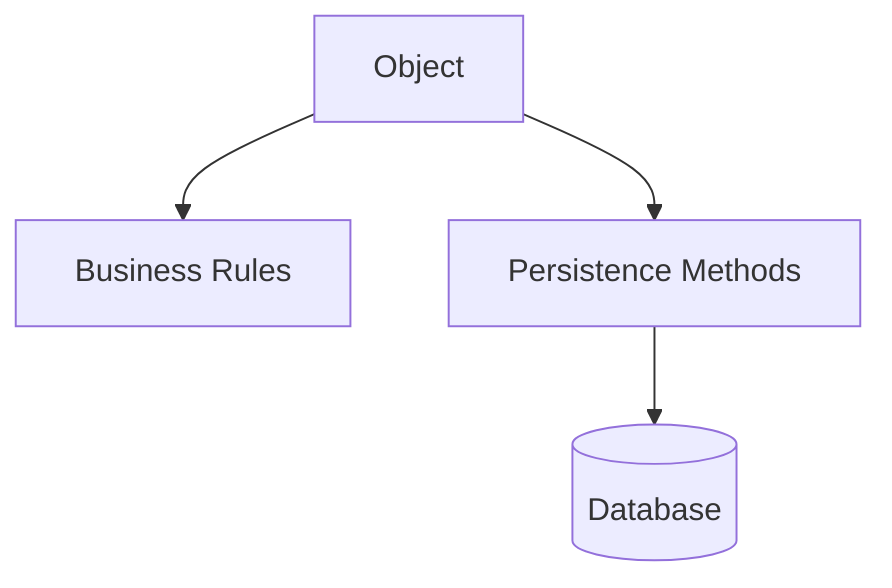
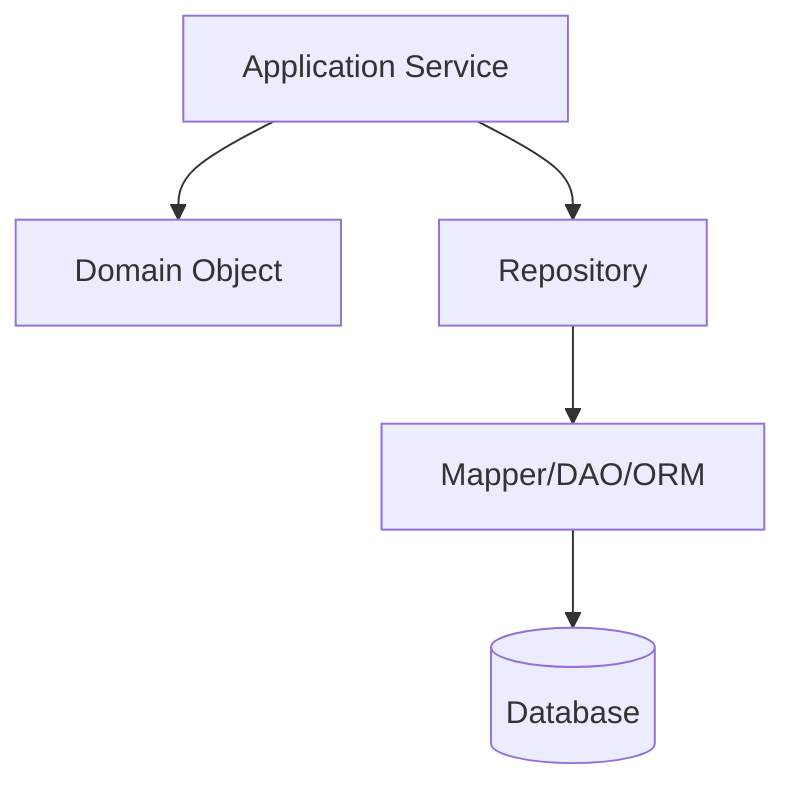

# Part 030 — Data Mapper vs Active Record

> Dua gaya persistence yang sering membentuk seluruh arsitektur aplikasi:
>
> ```txt
> Active Record:
>   object knows how to save itself.
>
> Data Mapper:
>   object is mapped to persistence by separate mapper/repository.
> ```
>
> Active Record terasa cepat dan sederhana.
>
> Data Mapper terasa lebih verbose, tetapi memberi pemisahan yang kuat untuk domain kompleks.
>
> Di Java enterprise, terutama sistem besar dengan transaction boundary, repository, ORM, audit, outbox, dan domain rules kompleks, Data Mapper biasanya lebih cocok.

Part ini membahas perbedaan, trade-off, dan implikasi production.

---

## 1. Core Thesis

Active Record menggabungkan domain object dan persistence operation.

Data Mapper memisahkan domain object dari persistence layer.

Active Record:

```java
caseFile.approve(actor, reason);
caseFile.save();
```

Data Mapper / Repository:

```java
caseFile.approve(actor, reason);
caseFileRepository.save(caseFile);
```

Perbedaan kecil secara sintaks, besar secara architecture.

---

## 2. Active Record Basic Idea

Object merepresentasikan row dan punya method persistence.

```java
public class CaseFileRecord {
    private UUID id;
    private String status;
    private long version;

    public void approve(UserId actor, String reason) {
        if (!"UNDER_REVIEW".equals(status)) {
            throw new InvalidTransition();
        }
        status = "APPROVED";
    }

    public void save() {
        Database.execute("""
            update case_file
            set status = ?, version = version + 1
            where id = ? and version = ?
            """, status, id, version);
    }

    public static CaseFileRecord find(UUID id) {
        return Database.queryOne(...);
    }
}
```

The object is both data and persistence gateway.

---

## 3. Data Mapper Basic Idea

Domain object has behavior but no persistence.

```java
public final class CaseFile {
    private final CaseFileId id;
    private CaseStatus status;
    private final long version;

    public void approve(UserId actor, String reason) {
        if (status != CaseStatus.UNDER_REVIEW) {
            throw new InvalidTransition(status, CaseStatus.APPROVED);
        }
        status = CaseStatus.APPROVED;
    }
}
```

Mapper/repository persists it:

```java
public final class JdbcCaseFileRepository implements CaseFileRepository {
    public void save(CaseFile caseFile) {
        caseFileDao.updateWithVersion(mapper.toUpdateRow(caseFile));
    }
}
```

Domain is persistence ignorant.

---

## 4. Mental Model Difference

Active Record:



Data Mapper:



Data Mapper adds layers but separates reasons to change.

---

## 5. Active Record Strengths

Active Record is good when:

- domain is simple;
- table maps closely to object;
- CRUD-heavy app;
- small team/app;
- fast prototyping;
- simple validation;
- transaction spans one record or simple association;
- persistence technology is stable;
- little need for complex domain isolation.

Advantages:

- less boilerplate;
- intuitive object persistence;
- quick development;
- easy for simple admin apps;
- low ceremony.

Active Record is not "wrong". It is a trade-off.

---

## 6. Active Record Weaknesses

As complexity grows, Active Record struggles with:

- transaction spanning multiple objects;
- aggregate boundary;
- cross-table invariants;
- audit/outbox/idempotency;
- external workflow;
- persistence-free domain tests;
- multiple persistence mechanisms;
- complex query/read model separation;
- lazy loading surprises;
- domain object coupled to database/API framework;
- hard to enforce use case transaction boundary.

The object starts knowing too much.

---

## 7. Data Mapper Strengths

Data Mapper is strong when:

- domain behavior complex;
- aggregate not equal to one table;
- transaction boundary owned by use case;
- persistence should be swappable/testable;
- read/write models separate;
- audit/outbox coordinated by application;
- idempotency and concurrency important;
- multiple DAOs compose one aggregate;
- domain should be testable without DB;
- persistence mapping is complex.

It is common in Java enterprise because these problems are common.

---

## 8. Data Mapper Weaknesses

Data Mapper costs:

- more code;
- mapping boilerplate;
- potential duplicate model classes;
- more architecture decisions;
- more upfront design;
- risk of overengineering simple CRUD;
- mapper drift if tests weak.

It is not free.

If application is simple CRUD, Data Mapper can feel heavy.

---

## 9. Java Enterprise Context

Java enterprise systems often have:

- layered architecture;
- service/use case transaction boundary;
- dependency injection;
- JPA/Hibernate or JDBC/jOOQ/MyBatis;
- repository pattern;
- DTO projections;
- audit logging;
- transaction manager;
- multi-module systems;
- strict testing;
- long-lived codebase.

These fit Data Mapper well.

Even JPA entities sometimes look like Active Record-ish data objects, but JPA itself is closer to Data Mapper/Unit of Work style than classic Active Record because persistence is handled by `EntityManager`, not `entity.save()`.

---

## 10. JPA Entity Is Not Necessarily Domain Model

JPA entity:

```java
@Entity
class CaseFileEntity {
    @Id
    UUID id;

    @Version
    long version;

    String status;
}
```

Can be used as:

### Persistence model only

Mapped to/from domain object.

### Domain model with annotations

Entity itself has domain methods.

Both are possible.

For simple systems, annotated domain entity may be acceptable.

For complex systems, separate domain object and persistence entity often avoids lazy loading/persistence leakage.

---

## 11. Active Record and Transaction Boundary

Active Record method:

```java
caseFile.approve();
caseFile.save();
audit.save();
outbox.save();
```

Who owns transaction?

If each `.save()` opens transaction, atomicity breaks.

If transaction is global/thread-bound, object persistence depends on ambient context.

Data Mapper style makes transaction orchestration clearer:

```java
@Transactional
public void approve(...) {
    CaseFile caseFile = repository.loadForApproval(id);
    caseFile.approve(...);
    repository.save(caseFile);
    auditRepository.append(...);
    outboxRepository.append(...);
}
```

Use case owns transaction.

---

## 12. Active Record and Multi-Object Transaction

Use case:

```txt
assign officer
- update case
- insert assignment
- update officer workload
- insert audit
- append outbox
```

Active Record version:

```java
caseFile.assign(officer);
caseFile.save();

officerWorkload.increment();
officerWorkload.save();

audit.save();
outbox.save();
```

If transaction not clearly external, correctness fragile.

Data Mapper:

```java
@Transactional
public void assign(...) {
    CaseFile caseFile = caseRepository.loadForAssignment(...);
    OfficerWorkload workload = workloadRepository.find(...);

    workload.reserveCapacity();
    caseFile.assignOfficer(...);

    workloadRepository.save(workload);
    caseRepository.save(caseFile);
    auditRepository.append(...);
    outboxRepository.append(...);
}
```

The atomic set is explicit.

---

## 13. Active Record and Domain Purity

Active Record object often needs:

- database connection/session;
- static finder;
- persistence annotations;
- table/column mapping;
- lazy association;
- validation/persistence callbacks;
- framework lifecycle.

Domain test may need DB or framework.

Data Mapper domain object can be tested with plain unit tests.

```java
@Test
void approvedCaseCannotBeApprovedAgain() {
    CaseFile caseFile = CaseFile.rehydrate(... APPROVED ...);

    assertThatThrownBy(() -> caseFile.approve(actor, reason))
            .isInstanceOf(InvalidCaseTransition.class);
}
```

No database needed.

---

## 14. Active Record and Query Logic

Active Record often adds finders:

```java
CaseFileRecord.findByStatus(...)
CaseFileRecord.findByOfficer(...)
CaseFileRecord.search(...)
```

The model becomes query dumping ground.

Data Mapper architecture separates:

- repository for aggregate;
- query service for DTO projection;
- DAO for SQL.

This prevents domain object from growing read/report concerns.

---

## 15. Active Record and Read Model

Dashboard projection in Active Record style may become:

```java
CaseFileRecord.findDashboardRows(...)
```

Now Active Record class knows dashboard/report SQL.

This violates single responsibility.

Better:

```java
CaseDashboardQuery.search(...)
```

Projection read path is separate.

---

## 16. Data Mapper and Boilerplate Control

Data Mapper can be verbose, but tools help:

- MapStruct;
- jOOQ code generation;
- JPA metamodel;
- MyBatis result maps;
- records for DTO/rows;
- small mappers;
- code generation for simple mappings;
- focused tests.

Do not use boilerplate as excuse to collapse architecture prematurely in complex system.

---

## 17. Active Record Works Better in Some Ecosystems

Some frameworks/languages are designed around Active Record:

- Ruby on Rails ActiveRecord;
- Laravel Eloquent;
- some lightweight Java libraries.

They provide conventions, migrations, validations, associations, callbacks.

Java enterprise historically grew around:

- JPA EntityManager;
- repositories;
- transaction managers;
- service layer;
- dependency injection;
- Data Mapper/Unit of Work.

Use ecosystem strengths.

---

## 18. Active Record in Java

Java has Active Record-inspired frameworks/libraries, but common enterprise stacks are not centered on `entity.save()`.

JPA entity lifecycle:

```java
entityManager.persist(entity);
entityManager.find(...)
transaction commit flushes changes
```

This is not classic Active Record.

Spring Data repository:

```java
repository.save(entity)
```

also separates persistence operation from entity, though entity may still contain domain behavior.

---

## 19. Data Mapper and ORM

ORM can implement Data Mapper by mapping object model to relational schema.

Hibernate/JPA:

- tracks entities in persistence context;
- flushes changes;
- handles identity map;
- maps associations;
- supports version locking.

But if JPA entity contains domain behavior, you may have a hybrid.

Hybrid can be okay if controlled.

---

## 20. Hybrid Model

Many Java apps use:

```txt
JPA Entity + Repository + Service Layer
```

Entity has some behavior:

```java
entity.approve(...)
```

Repository saves entity.

This is neither pure Active Record nor pure separated domain.

Acceptable if:

- entity behavior does not trigger hidden DB I/O unexpectedly;
- lazy loading controlled;
- transaction boundary clear;
- entity not exposed to API;
- tests cover persistence behavior;
- domain complexity moderate.

For complex domain, consider separate domain model.

---

## 21. Anemic Domain Risk

Data Mapper can degrade into:

```java
class CaseFile {
    getters/setters only
}
```

and all rules in service.

This is anemic domain model.

Data Mapper should not mean domain has no behavior.

Good:

```java
caseFile.approve(actor, reason);
```

Persistence separate:

```java
caseRepository.save(caseFile);
```

Business rule belongs in domain; persistence belongs in mapper/repository.

---

## 22. Fat Service Risk

Bad Data Mapper use:

```java
if (caseFile.getStatus() != UNDER_REVIEW) ...
caseFile.setStatus(APPROVED)
...
```

in service everywhere.

Better:

```java
caseFile.approve(actor, reason);
```

Service orchestrates transaction and collaborators. Domain enforces local rules.

---

## 23. Persistence Entity vs Domain Object

Separate classes:

```java
// domain
public final class CaseFile {
    private final CaseFileId id;
    private CaseStatus status;

    public void approve(...) { ... }
}

// persistence
@Entity
@Table(name = "case_file")
class CaseFileEntity {
    @Id UUID id;
    @Version long version;
    String status;
}
```

Mapper:

```java
CaseFile toDomain(CaseFileEntity entity);
void copyToEntity(CaseFile domain, CaseFileEntity entity);
```

Pros:

- clean domain;
- no lazy persistence leak;
- domain tests simple;
- persistence mapping isolated.

Cons:

- mapping code;
- duplicate fields;
- synchronization required.

---

## 24. When Separate Domain and Entity Is Worth It

Worth it when:

- domain behavior non-trivial;
- aggregate spans multiple tables;
- entity mapping optimized differently from domain;
- lazy loading creates bugs;
- persistence annotations pollute domain;
- multiple persistence technologies;
- domain needs strong unit tests;
- API/read projections separate;
- long-lived system with complex invariants.

Not always worth it for simple CRUD admin screen.

---

## 25. Active Record and Validation

Active Record often puts validation on entity:

```java
case.validate();
case.save();
```

This can work for field-level validation.

But state-dependent validation may need current database transaction, locks, constraints, other aggregates.

Example:

```txt
officer capacity < 20
```

This is not just object validation. It needs transaction and database guard.

Data Mapper/use case makes such boundary clearer.

---

## 26. Active Record and Callbacks

Active Record/JPA callbacks:

```java
@PrePersist
@PreUpdate
```

Can set timestamps, validate, etc.

Risks:

- hidden side effects;
- hard to test;
- no command context actor/reason;
- cannot call external services safely;
- callback order surprises;
- audit/outbox hidden.

Use callbacks for technical simple fields, not domain workflow.

---

## 27. Domain Events in Data Mapper

Domain object records events:

```java
caseFile.approve(...);
List<DomainEvent> events = caseFile.pullEvents();
```

Application persists:

```java
caseRepository.save(caseFile);
outboxRepository.appendAll(events);
```

This keeps domain expressive and persistence controlled.

Active Record might publish in `save()` callback, which risks transaction/side-effect issues.

---

## 28. Data Mapper and Testing Pyramid

Domain tests:

- no DB;
- fast;
- business rules.

Repository/mapper tests:

- real DB;
- mapping/version/constraints.

Application tests:

- transaction + audit/outbox + idempotency.

This separation is natural with Data Mapper.

Active Record often pushes more tests into integration/framework level.

---

## 29. Active Record Testing

Active Record tests often require database because behavior and persistence are coupled.

Example:

```java
case.approve();
case.save();
```

To verify behavior, save may be involved.

Can still unit test methods if separated enough, but coupling encourages DB tests.

---

## 30. Data Mapper and Dependency Direction

Clean dependency:

```txt
domain -> no infrastructure dependency
application -> repository interface
infrastructure -> repository implementation, mapper, DAO
```

Active Record often means:

```txt
domain object -> persistence infrastructure
```

This reverses dependency and makes domain depend on database/framework.

---

## 31. Active Record and Static Finders

```java
CaseFileRecord.findById(id)
```

Static finder is hard to mock/replace/test.

Repository interface is easier:

```java
caseFileRepository.findById(id)
```

Dependency injection works naturally.

Static/global database access can also make transaction context hidden.

---

## 32. Data Mapper and Transaction Manager

Data Mapper/repository fits framework transaction manager.

```java
@Transactional
public void handle(Command command) {
    ...
}
```

Repository participates.

This is idiomatic Java enterprise.

Active Record can work if it participates in same transaction/session, but boundaries may be less obvious.

---

## 33. Active Record and Concurrency

Where does optimistic version check happen?

Active Record:

```java
case.save();
```

Object must know version and SQL.

Data Mapper:

```java
repository.save(case);
```

Repository/DAO handles update count/version.

Both can work, but Data Mapper localizes database-specific concurrency code outside domain.

---

## 34. Data Mapper and Constraint Mapping

Duplicate key mapping belongs in persistence layer.

```java
catch unique constraint -> DuplicateCaseNumber
```

Domain object should not parse SQLState.

Active Record object may need to know persistence exception mapping or let it leak.

---

## 35. Active Record and Outbox

If object saves itself, where does outbox append happen?

Options:

1. object `save()` appends outbox;
2. service appends outbox separately;
3. callback appends outbox.

Option 1 couples domain object to integration event persistence.

Option 2 makes save not fully semantic.

Option 3 hides important side effect.

Data Mapper/application service:

```java
repository.save(caseFile);
outbox.append(event);
```

in same transaction is explicit.

---

## 36. Active Record and Audit

Audit needs actor/reason/command ID.

Active Record `save()` often lacks context.

If context is passed:

```java
case.save(actor, reason, commandId);
```

Persistence method grows into use case method.

Better:

```java
case.approve(actor, reason);
repository.save(case);
audit.append(Audit.approved(command, case));
```

---

## 37. Data Mapper and Multiple Tables

Aggregate:

```txt
case_file
case_assignment
case_reviewer
case_policy_snapshot
```

Data Mapper repository can load/save aggregate using multiple DAOs.

Active Record per table can struggle to enforce aggregate-level invariant without service orchestration.

At that point, Active Record becomes just table row object plus service logic, losing simplicity advantage.

---

## 38. Active Record and Inheritance/Polymorphism

Active Record can become complex with inheritance/polymorphic domain.

ORM mappings may leak into domain design.

Data Mapper can map relational shape to domain polymorphism explicitly.

But mapping complexity increases.

---

## 39. Data Mapper and Immutability

Domain object can be immutable-ish or controlled mutation.

```java
public CaseFile approve(...) {
    return new CaseFile(id, APPROVED, version, ...);
}
```

Mapper persists new state.

Active Record often encourages mutable objects tied to row state.

Java records/value objects fit Data Mapper well.

---

## 40. Active Record and Simplicity Boundary

Active Record is acceptable for:

- lookup/reference tables;
- internal admin CRUD;
- prototypes;
- low-invariant modules;
- small monolith;
- simple forms;
- scripts/tools.

Even then, be careful with transaction and API exposure.

Do not use heavyweight Data Mapper dogmatically for every table.

---

## 41. Data Mapper for Complex Core Domain

Prefer Data Mapper for:

- financial ledger;
- authorization/security policy;
- case management workflow;
- regulatory audit;
- multi-step approval;
- inventory/reservation;
- distributed event workflow;
- high-concurrency aggregate;
- complex reporting separation.

These need explicit boundaries.

---

## 42. Example: Active Record Style Case

```java
CaseFileRecord caseFile = CaseFileRecord.findById(caseId);
caseFile.approve(actor, reason);
caseFile.save();
CaseAuditRecord.create(caseFile.id(), "APPROVE", actor, reason).save();
OutboxEventRecord.create("case-approved:" + commandId, payload).save();
```

Questions:

- Are all saves one transaction?
- What if audit save fails?
- What if outbox save fails?
- Where is idempotency?
- Where is optimistic conflict mapped?
- Who owns retry?
- Does `approve` load lazy state?

These questions push you toward service + repository.

---

## 43. Example: Data Mapper Style Case

```java
@Transactional
public ApproveCaseResult approve(ApproveCaseCommand command) {
    Optional<ApproveCaseResult> previous =
            commandDedup.findCompleted(command.commandId(), ApproveCaseResult.class);

    if (previous.isPresent()) {
        return previous.get();
    }

    commandDedup.start(command);

    CaseFile caseFile = caseRepository.loadForApproval(command.caseId())
            .orElseThrow(() -> new CaseNotFound(command.caseId()));

    CaseStatus previousStatus = caseFile.status();

    caseFile.approve(command.actorId(), command.reason());

    caseRepository.save(caseFile);
    auditRepository.append(CaseAudit.approved(command, previousStatus, caseFile));
    outboxRepository.append(CaseApprovedEvent.from(command, caseFile));

    ApproveCaseResult result = ApproveCaseResult.from(caseFile);
    commandDedup.complete(command.commandId(), result);

    return result;
}
```

The consistency boundary is visible.

---

## 44. Mapping Code Example

Domain:

```java
public final class CaseFile {
    private final CaseFileId id;
    private final CaseNumber number;
    private CaseStatus status;
    private final long version;

    public void approve(UserId actor, String reason) { ... }
}
```

Row:

```java
public record CaseFileRow(
        UUID id,
        String caseNumber,
        String status,
        long version
) {}
```

Mapper:

```java
public final class CaseFileMapper {
    public CaseFile toDomain(CaseFileRow row) {
        return CaseFile.rehydrate(
                new CaseFileId(row.id()),
                new CaseNumber(row.caseNumber()),
                CaseStatus.fromDbCode(row.status()),
                row.version()
        );
    }

    public CaseFileUpdateRow toUpdateRow(CaseFile domain) {
        return new CaseFileUpdateRow(
                domain.id().value(),
                domain.status().dbCode(),
                domain.version()
        );
    }
}
```

Mapping is explicit and testable.

---

## 45. Mapper Test

```java
@Test
void mapsCaseFileRowToDomain() {
    CaseFileRow row = new CaseFileRow(
            caseId,
            "CASE-001",
            "UNDER_REVIEW",
            7L
    );

    CaseFile caseFile = mapper.toDomain(row);

    assertThat(caseFile.id().value()).isEqualTo(caseId);
    assertThat(caseFile.status()).isEqualTo(CaseStatus.UNDER_REVIEW);
    assertThat(caseFile.version()).isEqualTo(7L);
}
```

Simple but catches enum/code drift.

---

## 46. Persistence Ignorance Test

Domain rule test:

```java
@Test
void cannotApproveClosedCase() {
    CaseFile caseFile = CaseFile.rehydrate(
            id,
            number,
            CaseStatus.CLOSED,
            version
    );

    assertThatThrownBy(() -> caseFile.approve(actor, "late"))
            .isInstanceOf(InvalidCaseTransition.class);
}
```

No DB. No framework. Fast feedback.

---

## 47. Repository Integration Test

```java
@Test
void repositorySavesApprovedCaseWithVersionCheck() {
    CaseId caseId = fixture.underReviewCase(version(7));

    tx.execute(() -> {
        CaseFile caseFile = repository.loadForApproval(caseId).orElseThrow();
        caseFile.approve(actor, reason);
        repository.save(caseFile);
        return null;
    });

    CaseFileRow row = caseFileDao.findById(caseId).orElseThrow();

    assertThat(row.status()).isEqualTo(APPROVED);
    assertThat(row.version()).isEqualTo(8);
}
```

Data Mapper gives clean separation of what to test where.

---

## 48. Active Record and Migration

If database column changes, Active Record class changes. If same class is domain/API object, change ripples everywhere.

Data Mapper localizes schema change in:

- row/entity;
- mapper;
- DAO;
- migration tests.

Domain/API may remain stable.

---

## 49. Active Record and Serialization

If Active Record object is returned to API:

- persistence fields leak;
- lazy relations serialize accidentally;
- internal methods/fields exposed;
- audit/security risk.

Data Mapper architecture encourages separate response DTO.

---

## 50. Choosing Pattern Decision Matrix

| Context | Better Fit |
|---|---|
| simple CRUD admin app | Active Record/hybrid okay |
| rich domain behavior | Data Mapper |
| aggregate spans multiple tables | Data Mapper |
| heavy read projection needs | Data Mapper + query service |
| small prototype | Active Record okay |
| strict audit/outbox/idempotency | Data Mapper |
| high concurrency invariants | Data Mapper |
| framework built around Active Record | Active Record may be natural |
| Java enterprise service layer | Data Mapper/hybrid |
| domain tests without DB desired | Data Mapper |

---

## 51. Do Not Be Religious

Pattern choice is trade-off.

Bad Data Mapper can be worse than good Active Record.

Good Active Record with disciplined transaction/application service can work for moderate systems.

But as domain/data consistency complexity grows, Data Mapper gives more room to design correctly.

---

## 52. Hybrid Guidelines

If using JPA entity as domain object:

- do not expose entity to API;
- keep transaction boundary in service/use case;
- use `@Version`;
- avoid lazy loading in domain behavior;
- avoid entity callbacks for domain workflow;
- separate query projections;
- keep audit/outbox explicit;
- test with real DB;
- watch detached/merge behavior.

This hybrid is common and can be practical.

---

## 53. Data Mapper Guidelines

If using separate domain/persistence:

- keep mapping small and tested;
- avoid anemic domain;
- repository methods intent-specific;
- use DTO projections for reads;
- keep transaction in use case;
- map constraints to domain errors;
- prefer application-generated IDs for idempotency when useful;
- avoid overengineering simple modules.

---

## 54. Active Record Guidelines

If using Active Record:

- keep it for simple models;
- ensure transaction boundary external and explicit;
- do not publish external events inside `save`;
- avoid hidden callbacks for business workflow;
- do not expose directly as API response;
- use constraints/version;
- separate complex query projections;
- refactor to repository/data mapper when complexity grows.

---

## 55. Refactoring Active Record to Data Mapper

Steps:

1. Extract repository interface.
2. Move static finders to repository/DAO.
3. Move persistence methods out of entity.
4. Keep domain behavior on object.
5. Create row/entity mapper.
6. Make use case own transaction.
7. Move read queries to query service.
8. Add tests for domain and repository.
9. Add audit/outbox in application service.
10. Remove persistence dependency from domain gradually.

No need big-bang rewrite.

---

## 56. Refactoring Example

Before:

```java
CaseFileRecord caseFile = CaseFileRecord.find(caseId);
caseFile.approve(actor, reason);
caseFile.save();
```

After step 1:

```java
CaseFile caseFile = caseFileRepository.findById(caseId).orElseThrow();
caseFile.approve(actor, reason);
caseFileRepository.save(caseFile);
```

Later:

```java
CaseFileRepository implementation uses DAO/mapper.
CaseFile no longer imports persistence framework.
```

---

## 57. Review Checklist

- [ ] Does domain object know database/session?
- [ ] Who owns transaction?
- [ ] Are audit/outbox/idempotency explicit?
- [ ] Can domain rules be unit tested without DB?
- [ ] Are read projections separate?
- [ ] Are persistence entities exposed to API?
- [ ] Are lazy loads hidden in domain behavior?
- [ ] Are constraints/version handled outside domain?
- [ ] Is mapping boilerplate justified by complexity?
- [ ] Is Active Record limited to simple modules if used?
- [ ] Is hybrid JPA entity model disciplined?

---

## 58. Anti-Pattern: Active Record with Hidden Global Connection

```java
caseFile.save();
```

using static global database context makes transaction/testing opaque.

---

## 59. Anti-Pattern: Data Mapper With Anemic Domain

All rules in service, domain just getters/setters.

Keep behavior in domain.

---

## 60. Anti-Pattern: Entity as Domain as DTO as API

One class for everything becomes impossible to evolve.

Separate when complexity grows.

---

## 61. Anti-Pattern: Callback-Driven Business Workflow

`@PostPersist` sends event/email.

Use outbox/application service.

---

## 62. Anti-Pattern: Repository That Is Just Active Record Static Wrapper

```java
repository.save(entity) -> entity.save()
```

No real separation.

---

## 63. Mini Lab

Take an existing module:

```txt
CaseFile
Assignment
OfficerWorkload
Audit
Outbox
Dashboard
```

Answer:

1. Which objects are domain aggregates?
2. Which are persistence rows/entities?
3. Which are DTO projections?
4. Which class owns transaction?
5. Which class maps SQL exceptions?
6. Which class appends outbox?
7. Which class appends audit?
8. Can domain be tested without DB?
9. Are any entity classes exposed to API?
10. Would Active Record be enough here?

---

## 64. Summary

Data Mapper and Active Record are not just coding styles. They shape architecture.

You must master:

- Active Record strengths/weaknesses;
- Data Mapper strengths/weaknesses;
- domain vs persistence model;
- repository role;
- transaction boundary;
- audit/outbox/idempotency implications;
- JPA hybrid model;
- avoiding anemic domain;
- avoiding entity leak;
- mapping/test strategy;
- when Active Record is acceptable;
- why Java enterprise often prefers Data Mapper for complex systems;
- how to refactor gradually.

Part berikutnya membahas **Unit of Work, Identity Map, Lazy Loading**: persistence context, dirty checking, flush boundary, entity identity, lazy association, and how these hidden mechanisms affect correctness/performance.

---

## 65. References

- Jakarta Persistence Specification: https://jakarta.ee/specifications/persistence/3.2/jakarta-persistence-spec-3.2
- Hibernate ORM User Guide: https://docs.hibernate.org/stable/orm/userguide/html_single/
- Spring Data JPA Reference: https://docs.spring.io/spring-data/jpa/reference/
- Oracle Java SE JDBC `Connection`: https://docs.oracle.com/en/java/javase/21/docs/api/java.sql/java/sql/Connection.html
- jOOQ Manual: https://www.jooq.org/doc/latest/manual/
- MyBatis Documentation: https://mybatis.org/mybatis-3/
