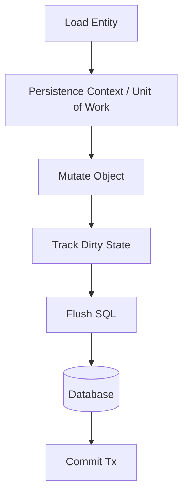

# Part 031 — Unit of Work, Identity Map, Lazy Loading

> ORM dan persistence framework modern sering membuat data access terasa "otomatis".
>
> Kamu load object, ubah field, lalu commit.
>
> Tapi di balik itu ada mekanisme kuat:
>
> - persistence context;
> - identity map;
> - dirty checking;
> - flush;
> - lazy loading;
> - cascade;
> - detached entity;
> - first-level cache;
> - transaction synchronization.
>
> Mekanisme ini bisa sangat produktif, tetapi juga bisa menjadi sumber bug paling sulit jika tidak dipahami.

Part ini membahas Unit of Work, Identity Map, Lazy Loading, dan konsekuensinya dalam Java data access production.

---

## 1. Core Thesis

Unit of Work adalah pola yang mengumpulkan perubahan object selama satu transaction/work unit, lalu menulis perubahan itu ke database secara terkoordinasi.

Identity Map memastikan satu row database direpresentasikan oleh satu object instance dalam satu persistence context.

Lazy Loading menunda pengambilan data sampai association diakses.

Ketiganya kuat, tetapi memiliki failure mode:

```txt
hidden query
unexpected update
N+1
stale object
detached entity confusion
flush before query
lazy initialization failure
memory growth
transaction boundary blur
```

Top engineer tidak hanya tahu cara memakai ORM. Ia tahu kapan ORM sedang melakukan sesuatu diam-diam.

---

## 2. Unit of Work Mental Model

Tanpa Unit of Work:

```java
caseDao.updateStatus(connection, caseId, APPROVED);
auditDao.insert(connection, audit);
outboxDao.insert(connection, event);
```

Dengan Unit of Work:

```java
CaseFileEntity caseFile = entityManager.find(CaseFileEntity.class, id);
caseFile.approve();

auditRepository.add(audit);
outboxRepository.add(event);

// flush/commit writes changes
```

Diagram:



The object change is not necessarily SQL immediately. It is tracked and flushed later.

---

## 3. Why Unit of Work Exists

Benefits:

- groups multiple changes into one transaction;
- avoids repeated manual update calls;
- preserves object identity;
- supports dirty checking;
- orders inserts/updates/deletes;
- manages cascades;
- enables first-level cache;
- reduces duplicate loads;
- supports optimistic locking;
- creates persistence abstraction.

But it introduces implicit behavior.

You must know:

```txt
When is SQL executed?
What is currently managed?
What changes will flush?
What is cached?
What is loaded lazily?
What happens at commit?
```

---

## 4. Persistence Context

In JPA/Hibernate, persistence context is the set of managed entities.

Entity states:

| State | Meaning |
|---|---|
| transient | new object, not associated with persistence context |
| managed | associated with persistence context; changes tracked |
| detached | was managed, now outside context |
| removed | scheduled for deletion |
| persisted/new | scheduled for insert |

Example:

```java
@Transactional
public void approve(UUID caseId) {
    CaseFileEntity entity = entityManager.find(CaseFileEntity.class, caseId);
    entity.setStatus("APPROVED");
}
```

No explicit `save` needed if entity is managed. Commit triggers flush.

This is powerful but can hide writes.

---

## 5. Identity Map

Within one persistence context:

```java
CaseFileEntity a = entityManager.find(CaseFileEntity.class, id);
CaseFileEntity b = entityManager.find(CaseFileEntity.class, id);

assert a == b;
```

Same row, same object instance.

Benefits:

- object identity consistency;
- avoids duplicate load;
- changes visible through both references;
- prevents conflicting in-memory copies.

Risk:

- repeated query may return cached/stale entity;
- native SQL/bulk update can bypass persistence context;
- memory grows if loading many entities;
- first-level cache can hide database changes.

---

## 6. First-Level Cache Is Not Database Isolation

Persistence context identity map can make same entity appear stable.

```java
CaseFileEntity a = entityManager.find(CaseFileEntity.class, id);
externalJdbcUpdateStatus(id, "CLOSED");
CaseFileEntity b = entityManager.find(CaseFileEntity.class, id);

assert a == b;
assert b.getStatus().equals("UNDER_REVIEW"); // stale in context
```

The persistence context returned cached entity.

This is not repeatable read guarantee. It is object cache.

If mixing ORM and direct SQL, you may need:

```java
entityManager.flush();
entityManager.clear();
```

or avoid mixing in same transaction.

---

## 7. Dirty Checking

Dirty checking detects changed managed entities.

```java
@Transactional
public void changeTitle(UUID id, String title) {
    CaseFileEntity entity = entityManager.find(CaseFileEntity.class, id);
    entity.setTitle(title);
}
```

At flush:

```sql
update case_file
set title = ?
where id = ?
```

Potential issues:

- accidental setter call causes update;
- entity loaded for read gets mutated;
- large persistence context dirty check cost;
- update includes many columns depending mapping/dynamic update;
- flush happens before query unexpectedly;
- no explicit repository `save` makes code review harder.

---

## 8. Dirty Checking and Unexpected Update

Example:

```java
@Transactional
public CaseDetailView getDetail(UUID id) {
    CaseFileEntity entity = entityManager.find(CaseFileEntity.class, id);

    entity.setLastViewedAt(clock.instant()); // accidental write in query path

    return mapper.toView(entity);
}
```

A query method now writes.

If transaction commits, update happens.

Separation rule:

```txt
Read/query path should not use managed mutable entity casually.
Use DTO projection or read-only transaction/hints.
```

---

## 9. Flush

Flush synchronizes persistence context changes to database.

Flush can happen:

- before transaction commit;
- before JPQL/Criteria query;
- manually via `entityManager.flush()`;
- before native query depending provider/context;
- when transaction manager commits.

Important:

```txt
Flush writes SQL but does not commit transaction.
```

Constraint errors may appear at flush before method end.

---

## 10. Flush Before Query

Example:

```java
@Transactional
public void approveThenSearch(UUID id) {
    CaseFileEntity caseFile = entityManager.find(CaseFileEntity.class, id);
    caseFile.setStatus("APPROVED");

    List<CaseFileEntity> openCases = entityManager.createQuery("""
        select c from CaseFileEntity c where c.status = 'OPEN'
        """, CaseFileEntity.class)
        .getResultList();
}
```

ORM may flush approval update before running query so query sees current in-transaction changes.

This can surprise:

- constraint violation thrown before expected;
- update occurs earlier;
- lock acquired earlier;
- query performance affected.

Design command methods to avoid unrelated queries after mutation.

---

## 11. Flush Boundary Discipline

Good command structure:

```java
@Transactional
public ApproveCaseResult approve(Command command) {
    CaseFileEntity entity = loadForApproval(command.caseId());

    entity.approve(command.actor(), command.reason());

    auditRepository.append(...);
    outboxRepository.append(...);

    return resultFrom(entity);
}
```

Avoid:

```java
mutate entity
run many read queries for UI
mutate more
call external service
mutate again
```

Keep transaction flow simple:

```txt
load -> validate -> mutate -> append audit/outbox -> commit
```

---

## 12. Manual Flush

Manual flush can be useful:

- detect constraint violation early;
- force insert before dependent raw SQL;
- test persistence errors;
- release memory with batch flush/clear;
- ensure DB triggers generated values.

Example batch with JPA:

```java
for (int i = 0; i < rows.size(); i++) {
    entityManager.persist(rows.get(i));

    if (i % 100 == 0) {
        entityManager.flush();
        entityManager.clear();
    }
}
```

But manual flush increases complexity. Use intentionally.

---

## 13. Clear

`clear()` detaches all managed entities.

After:

```java
entityManager.clear();
```

Previously managed entities are detached. Changes after that are not tracked unless merged.

Useful for:

- batch memory control;
- avoiding stale persistence context after bulk update;
- forcing reload;
- long processing with many entities.

Danger:

- detached entities can be modified but not saved;
- references may be stale;
- lazy associations fail if accessed outside context.

---

## 14. Detach and Detached Entity

Detached entity was once managed, but now outside persistence context.

```java
CaseFileEntity entity = tx1.find(id);
// tx ends, entity detached

entity.setStatus("APPROVED"); // no tracking

tx2.merge(entity); // complex semantics
```

Detached problems:

- stale version;
- lazy loading unavailable;
- merge can overwrite fields;
- confusing object identity;
- old data applied later.

For command, prefer reload inside transaction and apply command, not accept detached entity from web layer.

---

## 15. Merge Pitfall

`merge` copies detached state into managed entity.

If detached object is stale and missing fields, it can overwrite current data depending mapping/use.

Bad flow:

```txt
GET entity -> send to UI -> UI posts entire entity -> merge
```

If another user changed field, stale UI can overwrite.

Better:

- use command DTO;
- include version;
- load current entity;
- apply intended changes;
- optimistic lock;
- save.

```java
@Transactional
public void changeTitle(ChangeTitleCommand command) {
    CaseFileEntity entity = entityManager.find(CaseFileEntity.class, command.caseId());

    if (entity.getVersion() != command.expectedVersion()) {
        throw new OptimisticConflict();
    }

    entity.changeTitle(command.title());
}
```

---

## 16. Lazy Loading

Lazy loading defers association query until accessed.

```java
CaseFileEntity caseFile = entityManager.find(CaseFileEntity.class, id);

List<ActionEntity> actions = caseFile.getActions(); // may query here
```

Benefits:

- avoids loading unused data;
- convenient object navigation.

Risks:

- hidden queries;
- N+1;
- lazy initialization exception outside transaction;
- transaction boundary blur;
- serialization accidentally loads graph;
- performance unpredictable.

---

## 17. Lazy Loading N+1

Example:

```java
List<CaseFileEntity> cases = queryOpenCases();

for (CaseFileEntity c : cases) {
    System.out.println(c.getAssignedOfficer().getDisplayName());
}
```

SQL:

```txt
1 query for cases
N queries for officers
```

Fix:

- DTO projection with join;
- fetch join;
- entity graph;
- batch fetch;
- read model;
- explicit query.

For list screens, DTO projection is usually best.

---

## 18. Lazy Loading Outside Transaction

```java
CaseFileEntity entity = service.findCase(id); // transaction closed
return entity.getActions().size();            // lazy load fails
```

This often appears as lazy initialization exception.

Bad workaround:

```txt
Open Session in View
```

may allow lazy loading during serialization/view rendering, hiding N+1 and transaction boundary problems.

Better:

- load required data inside query/service;
- return DTO;
- use explicit fetch plan.

---

## 19. Open Session in View Caveat

Open Session in View keeps persistence context open through web request rendering.

Pros:

- avoids lazy exception.

Cons:

- hidden queries in controller/serializer/view;
- DB access after service boundary;
- N+1 in JSON serialization;
- transaction/connection lifecycle confusion;
- harder performance control.

For high-quality systems, prefer explicit query DTOs and closed persistence boundary.

---

## 20. Fetch Join

JPQL example:

```java
select c
from CaseFileEntity c
join fetch c.assignedOfficer
where c.id = :id
```

Useful for loading needed association.

Caveats:

- multiple collection fetch joins can explode rows;
- pagination with fetch join can be problematic;
- loading too much graph;
- duplicates;
- query complexity.

Use fetch join intentionally, not by default.

---

## 21. Entity Graph

JPA entity graph can specify fetch plan.

```java
EntityGraph<?> graph = entityManager.createEntityGraph(CaseFileEntity.class);
graph.addAttributeNodes("assignedOfficer");

Map<String, Object> hints = Map.of(
        "jakarta.persistence.fetchgraph", graph
);

CaseFileEntity entity = entityManager.find(CaseFileEntity.class, id, hints);
```

Useful for use-case-specific load plan.

Still must review generated SQL and graph size.

---

## 22. Batch Fetch

Batch fetch reduces N+1 by loading lazy associations in batches.

Concept:

```txt
Access officer for first case.
ORM loads officers for many cases in one query.
```

Useful for moderate association access.

But DTO projection may still be cleaner for read screens.

Batch fetch is optimization, not excuse to ignore query shape.

---

## 23. Persistence Context Memory Growth

If you load 1 million entities in one persistence context:

- memory grows;
- dirty checking slows;
- identity map huge;
- GC pressure;
- transaction too long.

For batch:

```java
int count = 0;
for (Entity entity : entities) {
    process(entity);

    if (++count % 100 == 0) {
        entityManager.flush();
        entityManager.clear();
    }
}
```

Or use JDBC/jOOQ/stateless session/read projection.

---

## 24. Read-Only Entity

For read-only operations, mark query/transaction read-only if framework supports.

Benefits may include:

- skip dirty checking;
- avoid accidental flush;
- improve performance.

But read-only is not universal magic. Verify provider behavior.

Often better: use DTO projection and no managed entity.

---

## 25. Bulk Update Bypasses Persistence Context

JPQL/native bulk:

```java
entityManager.createQuery("""
    update CaseFileEntity c
    set c.status = :expired
    where c.expiresAt < :now
    """)
    .executeUpdate();
```

This bypasses managed entities.

If same persistence context contains `CaseFileEntity`, it may be stale.

After bulk update:

```java
entityManager.clear();
```

or do bulk in separate transaction/context.

---

## 26. Native SQL With ORM

Native SQL can bypass ORM state.

Example:

```java
jdbcTemplate.update("update case_file set status='CLOSED' where id=?", id);
CaseFileEntity entity = entityManager.find(CaseFileEntity.class, id);
```

If entity already managed, status may remain old.

Rule:

```txt
Do not mix ORM-managed entity updates and direct SQL in same transaction without flush/clear discipline.
```

---

## 27. Cascades

Cascade can automatically persist/remove child entities.

```java
@OneToMany(mappedBy = "caseFile", cascade = CascadeType.ALL, orphanRemoval = true)
private List<ActionEntity> actions;
```

Useful for aggregate child lifecycle.

Risks:

- cascade delete disaster;
- unexpected child updates;
- large graph persistence;
- orphan removal on wrong collection manipulation;
- many SQL statements;
- accidental persistence of transient object graph.

Cascade should match aggregate ownership, not convenience.

---

## 28. Orphan Removal

If child removed from collection, ORM deletes it.

```java
caseFile.getActions().remove(action);
```

Can be correct for aggregate-owned child.

Danger:

- UI sends partial collection;
- mapper replaces collection;
- ORM deletes missing rows;
- data loss.

When mapping command DTO to entity, do not blindly replace child collections.

---

## 29. Collection Replacement Pitfall

Bad:

```java
entity.setAssignments(request.assignments().stream()
        .map(mapper::toEntity)
        .toList());
```

With orphan removal, missing assignments may be deleted.

Better:

- apply explicit add/remove commands;
- compare by ID;
- preserve existing children;
- validate domain operation;
- use repository method for specific mutation.

---

## 30. Entity Equality

JPA entity `equals/hashCode` is tricky.

If based on generated ID before persist, ID may be null.

If based on mutable fields, collections break.

Bad equality can cause:

- duplicate children;
- set removal failure;
- orphan removal bug;
- identity confusion.

Guideline:

- use immutable business key if truly stable;
- or carefully use ID after assigned;
- avoid putting mutable transient entities in hash sets;
- keep entity collections simple.

Domain value objects can have clean value equality.

---

## 31. Identity Map and Equality

Within persistence context, object identity often works.

Outside, two detached instances for same row may not be `==`.

Do not rely on reference equality outside persistence context.

Use domain identity (`id`) for aggregate identity.

---

## 32. Lazy Loading and Serialization

Returning entity from API can trigger lazy loading during JSON serialization.

```java
return caseFileEntity;
```

Serializer calls getters:

```txt
getActions()
getDocuments()
getOfficer()
```

This can:

- execute many queries;
- leak sensitive data;
- recurse infinitely;
- fail if session closed.

Use response DTO.

---

## 33. Transaction Boundary Blur

Lazy loading makes it unclear where data access happens.

Code appears:

```java
render(caseFile.getOfficer().getName());
```

But it may execute SQL.

Data access should be visible in query/repository layer.

For top-level engineering, hidden I/O is a smell.

---

## 34. Flush Mode

ORM flush mode controls when flush occurs.

Common modes:

- auto before query/commit;
- commit only;
- manual.

Changing flush mode can improve performance but affects correctness.

Do not globally change flush behavior without understanding query consistency.

For read-only query, read-only hints may be safer.

---

## 35. Unexpected Flush and Constraint Violation

Example:

```java
entity.setCaseNumber(duplicate);
List<CaseFileEntity> rows = querySomethingElse(); // triggers flush
```

Unique constraint violation happens during query, not commit.

This can confuse error handling.

Design command to mutate and finish. Avoid unrelated queries after mutation.

---

## 36. Persistence Context and Optimistic Lock

`@Version` is checked at flush/update.

Conflict may be thrown:

- during explicit flush;
- before query flush;
- at commit.

Application exception handling should account for commit-time failure.

Do not return irreversible response before transaction commit.

---

## 37. Commit-Time Failure

Transactional method body returns result, then transaction manager commits.

If commit fails, caller receives exception after method body.

Example:

```java
@Transactional
public Result approve(...) {
    entity.approve();
    return Result.ok(); // commit not done yet inside method body
}
```

Framework proxy commits after method returns. If commit fails, `Result.ok()` is not delivered as success normally, but avoid side effects before commit.

---

## 38. After Commit Hooks

Sometimes need action after commit.

Use framework transaction synchronization or outbox.

For reliable external side effect, outbox is preferred.

After-commit callback is not durable if process crashes after commit before callback runs.

Use after-commit for cache invalidation maybe, not critical integration event.

---

## 39. Unit of Work and Outbox

With ORM, outbox entity can be persisted in same persistence context.

```java
entityManager.persist(outboxEventEntity);
```

At flush/commit:

```txt
case update + audit insert + outbox insert
```

commit together.

Still do not publish directly in entity callback.

---

## 40. Unit of Work and Domain Events

Pattern:

```java
caseFile.approve(...);
domainEvents.add(...);

repository.save(caseFile);
outbox.append(domainEvents);
```

If using managed entity as domain object, domain events may live in transient field.

Ensure events are collected before entity detached/cleared and persisted in same transaction.

---

## 41. Persistence Context Scope

Common scopes:

| Scope | Use |
|---|---|
| transaction-scoped | typical server request/use case |
| extended | stateful conversation, rare |
| request/view-scoped | OSIV style, risky |
| application-scoped | usually wrong for entity manager |

For typical Java backend, transaction-scoped persistence context is safest.

---

## 42. Long Conversation Pattern

User edits over minutes. Do not keep persistence context open.

Use:

- DTO form;
- version field;
- submit command;
- reload entity in transaction;
- apply changes;
- optimistic lock.

This avoids extended transaction/context.

---

## 43. Unit of Work in Manual JDBC

Manual JDBC does not provide identity map/dirty checking automatically.

But use case transaction still acts as unit of work:

```java
tx.execute(connection -> {
    CaseFile caseFile = repository.loadForApproval(connection, id);
    caseFile.approve(...);
    repository.save(connection, caseFile);
    auditDao.insert(connection, audit);
    outboxDao.insert(connection, event);
});
```

Explicit saves replace dirty checking.

Pros:

- SQL visible;
- no hidden flush/lazy query.

Cons:

- more boilerplate;
- manual mapping.

---

## 44. Custom Identity Map?

You can build identity map manually, but rarely needed unless complex domain graph and no ORM.

For most JDBC/jOOQ systems:

- keep transaction methods simple;
- load what command needs;
- pass domain objects explicitly;
- save explicitly.

Do not rebuild ORM poorly.

---

## 45. When ORM Mechanisms Help

ORM Unit of Work is helpful when:

- aggregate object graph moderate;
- many small field updates;
- object identity important;
- JPA ecosystem fits;
- team understands fetch/flush/lazy behavior;
- transaction boundary clear;
- query path uses projections where needed.

It hurts when:

- large batch;
- reporting query;
- huge object graph;
- hidden lazy loading;
- mixed direct SQL;
- complex performance requirements with little visibility.

---

## 46. Production Failure Mode: N+1 After Deployment

Symptom:

- dashboard p95 jumps;
- SQL count per request increases;
- DB CPU high;
- logs show repeated select by ID.

Cause:

- new DTO field accesses lazy association;
- serializer accesses association;
- mapper loops through entity graph.

Fix:

- projection query join;
- fetch plan;
- batch fetch;
- read model;
- test query count.

---

## 47. Production Failure Mode: Unexpected Update

Symptom:

- rows updated on GET endpoint;
- audit missing;
- version increments unexpectedly.

Cause:

- managed entity mutated in read path;
- dirty checking flushes.

Fix:

- DTO projection;
- read-only transaction;
- remove mutation from query;
- disable dirty tracking for read path if possible;
- tests assert no update.

---

## 48. Production Failure Mode: Detached Entity Overwrite

Symptom:

- user changes disappear;
- stale form overwrites new data.

Cause:

- detached entity from UI merged wholesale.

Fix:

- command DTO + expected version;
- load current entity;
- apply explicit field changes;
- optimistic lock;
- reject stale update.

---

## 49. Production Failure Mode: Bulk Update Stale Context

Symptom:

- bulk job updates status;
- subsequent code reads old status in same transaction.

Cause:

- entity already managed before bulk update.

Fix:

- bulk operation separate transaction/context;
- flush/clear;
- avoid mixing entity and bulk SQL.

---

## 50. Production Failure Mode: Cascade Delete Disaster

Symptom:

- child rows deleted unexpectedly.

Cause:

- orphan removal + collection replacement;
- cascade remove too broad;
- DTO mapper overwrote collection.

Fix:

- explicit child mutation methods;
- restrict cascade;
- test collection mapping;
- avoid replacing aggregate collections from request.

---

## 51. Unit of Work Review Checklist

- [ ] Is transaction boundary clear?
- [ ] Which entities are managed?
- [ ] Could dirty checking write unexpectedly?
- [ ] Could query trigger flush?
- [ ] Are lazy associations accessed in loops?
- [ ] Is API returning entity?
- [ ] Are bulk SQL and ORM mixed?
- [ ] Is persistence context cleared in batch?
- [ ] Are detached entities merged safely?
- [ ] Are cascades aligned with aggregate ownership?
- [ ] Is orphan removal safe?
- [ ] Is read path using projections?
- [ ] Are optimistic lock exceptions mapped?
- [ ] Are commit-time failures handled?
- [ ] Is outbox persisted, not directly published?

---

## 52. Testing Hidden ORM Behavior

Tests to add:

- query count test for dashboard/detail;
- no SQL update on read endpoint;
- lazy loading not triggered during serialization because DTO used;
- optimistic conflict thrown;
- bulk update clears context;
- cascade/orphan removal only deletes intended child;
- detached stale update rejected;
- flush-time constraint mapped;
- batch flush/clear prevents memory growth.

---

## 53. Query Count Test

Use datasource proxy/logging/test utility.

Expectation:

```txt
Case detail query executes <= 4 SQL statements.
Dashboard page executes <= 2 SQL statements.
```

This catches N+1 regressions.

Do not make tests brittle for every SQL, but critical endpoints benefit from query budget.

---

## 54. No-Update Read Test

```java
@Test
void getDetailDoesNotUpdateCaseVersion() {
    CaseId id = fixture.caseFile(version(7));

    caseDetailUseCase.getDetail(id);

    assertThat(caseQuery.get(id).version()).isEqualTo(7);
}
```

This catches accidental dirty checking on read.

---

## 55. Detached Update Test

```java
@Test
void staleCommandVersionIsRejected() {
    CaseEditForm form = caseQuery.getEditForm(id); // version 7

    otherUserChangesCase(id); // version 8

    assertThatThrownBy(() ->
            editUseCase.submit(form.toCommandWithVersion7())
    ).isInstanceOf(OptimisticConflict.class);
}
```

Do not test by merging detached entity directly.

---

## 56. Anti-Pattern: Entity Everywhere

Entity used as:

- persistence model;
- domain model;
- API response;
- form input;
- projection.

This maximizes coupling.

Separate when complexity grows.

---

## 57. Anti-Pattern: Blind Merge

```java
entityManager.merge(requestBodyEntity);
```

Never for serious command path.

Use command DTO and explicit mutation.

---

## 58. Anti-Pattern: Lazy Loading as Query Strategy

"Just access getter and ORM will load it" is not a query strategy.

Use explicit fetch/projection.

---

## 59. Anti-Pattern: Cascade Everything

`CascadeType.ALL` everywhere is dangerous.

Cascade should reflect ownership lifecycle.

---

## 60. Anti-Pattern: Large Batch With Managed Entities and No Clear

Memory and dirty checking cost explode.

Use flush/clear or JDBC batch.

---

## 61. Mini Lab

Audit a JPA/Hibernate code path:

```txt
GET /cases/dashboard
POST /cases/{id}/approve
POST /cases/{id}/assign
batch expire assignments
```

For each:

1. What transaction boundary?
2. What entities become managed?
3. Is there lazy loading?
4. How many SQL statements?
5. Does dirty checking write?
6. Is there flush before query?
7. Are bulk updates mixed with entities?
8. Are cascades safe?
9. Is DTO projection used where needed?
10. What tests prove it?

---

## 62. Summary

Unit of Work, Identity Map, and Lazy Loading are powerful but must be understood.

You must master:

- persistence context;
- managed/detached/transient/removed entity states;
- identity map;
- first-level cache;
- dirty checking;
- flush and commit timing;
- flush before query;
- lazy loading;
- N+1;
- lazy initialization failure;
- fetch join/entity graph/batch fetch;
- persistence context memory growth;
- bulk update bypass;
- cascade/orphan removal;
- detached merge pitfalls;
- read path projection;
- ORM/JDBC mixing discipline;
- hidden behavior testing.

Part berikutnya membahas **Data Access Contract Design**: method naming, return type, nullability, optional, collection, stream, pagination, error semantics, and how to design contracts that prevent ambiguity.

---

## 63. References

- Jakarta Persistence Specification: https://jakarta.ee/specifications/persistence/3.2/jakarta-persistence-spec-3.2
- Hibernate ORM User Guide: https://docs.hibernate.org/stable/orm/userguide/html_single/
- Spring Framework Transaction Management: https://docs.spring.io/spring-framework/reference/data-access/transaction.html
- Spring Data JPA Reference: https://docs.spring.io/spring-data/jpa/reference/
- Oracle Java SE JDBC `Connection`: https://docs.oracle.com/en/java/javase/21/docs/api/java.sql/java/sql/Connection.html
