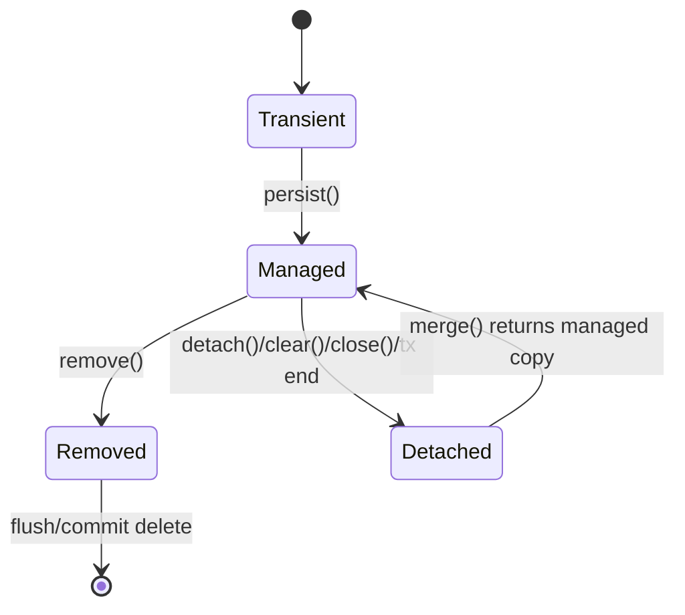

# Part 034 — EntityManager and Persistence Context

> `EntityManager` adalah API utama JPA, tetapi banyak bug production berasal dari pemahaman setengah-setengah tentangnya.
>
> Method seperti `persist`, `merge`, `flush`, `clear`, `remove`, `find`, `getReference`, `refresh`, dan `lock` tidak hanya "menyimpan entity".
>
> Mereka mengubah state object dalam persistence context, memengaruhi kapan SQL dieksekusi, kapan exception muncul, bagaimana entity menjadi managed/detached, dan apakah perubahan akan commit.
>
> Jika kamu memakai JPA/Hibernate untuk sistem production, kamu harus memahami lifecycle ini secara operasional.

Part ini membahas `EntityManager` dan persistence context dengan fokus penggunaan nyata.

---

## 1. Core Thesis

`EntityManager` mengelola persistence context.

Persistence context adalah identity map + unit of work untuk entity managed dalam scope tertentu.

Core rule:

```txt
Only managed entities are automatically dirty-checked and flushed.
```

Entity state:



Understanding these states prevents:

- accidental unsaved changes;
- stale detached merge;
- hidden updates;
- lazy loading failures;
- memory growth;
- unexpected flush timing.

---

## 2. EntityManager Responsibilities

`EntityManager` can:

- create/persist new entity;
- find entity by ID;
- return reference/proxy;
- track managed entity changes;
- remove entity;
- merge detached state;
- flush changes;
- clear/detach persistence context;
- refresh entity from database;
- lock entity;
- create JPQL/Criteria/native queries;
- expose transaction-related behavior depending environment.

It is not a repository by itself. It is lower-level persistence API.

Repository/use case wraps it with domain-specific contract.

---

## 3. Transaction-Scoped Persistence Context

Common server setup:

```txt
one persistence context per transaction
```

Example:

```java
@Transactional
public void approve(UUID id) {
    CaseFileEntity entity = entityManager.find(CaseFileEntity.class, id);
    entity.approve(...);
}
```

At transaction commit:

- flush changes;
- commit database transaction;
- persistence context ends;
- entity becomes detached outside transaction.

This is typical Spring/Jakarta backend behavior.

---

## 4. Managed Entity

Entity loaded by `find` inside active persistence context becomes managed.

```java
CaseFileEntity entity = entityManager.find(CaseFileEntity.class, id);
entity.setStatus("APPROVED");
```

No explicit `save` required. Dirty checking detects change.

Important:

```txt
Changing a managed entity is a pending write.
```

Therefore do not casually mutate managed entity in read path.

---

## 5. Transient Entity

Transient entity is new Java object unknown to `EntityManager`.

```java
CaseFileEntity entity = new CaseFileEntity(...);
```

It is not inserted unless:

```java
entityManager.persist(entity);
```

or cascade persist from managed parent.

If transaction ends without persist, no DB row.

---

## 6. `persist`

`persist` makes transient entity managed and scheduled for insert.

```java
CaseFileEntity entity = CaseFileEntity.createNew(...);
entityManager.persist(entity);
```

SQL insert may happen:

- immediately for some ID strategies;
- on flush;
- before query;
- at commit.

After `persist`, entity is managed.

Do not call `persist` for detached existing entity. That may cause duplicate key/entity exists error.

---

## 7. `find`

```java
CaseFileEntity entity =
        entityManager.find(CaseFileEntity.class, caseId);
```

Behavior:

- returns managed entity or null;
- checks persistence context first;
- may hit database if not already managed;
- respects entity mapping/fetch strategy;
- does not throw if absent.

Repository should wrap null to `Optional`.

```java
Optional.ofNullable(entityManager.find(CaseFileEntity.class, id));
```

---

## 8. First-Level Cache with `find`

```java
CaseFileEntity a = entityManager.find(CaseFileEntity.class, id);
CaseFileEntity b = entityManager.find(CaseFileEntity.class, id);

assert a == b;
```

Second call may not query database.

If database changed externally, managed entity may be stale.

Use `refresh`, `clear`, or separate transaction if you need latest DB state.

---

## 9. `getReference`

```java
CaseFileEntity ref =
        entityManager.getReference(CaseFileEntity.class, id);
```

Returns lazy proxy/reference without immediately loading row.

Useful when:

- setting FK relation without loading target;
- delete by reference;
- avoiding unnecessary select.

Example:

```java
CaseFileEntity caseRef = entityManager.getReference(CaseFileEntity.class, caseId);
CaseAssignmentEntity assignment = new CaseAssignmentEntity(...);
assignment.setCaseFile(caseRef);
entityManager.persist(assignment);
```

Caveats:

- accessing proxy may trigger select;
- if row missing, exception may occur when accessed/flushed;
- proxy behavior can surprise equals/serialization;
- not for user-facing "must exist" check unless handled.

---

## 10. `merge`

`merge` copies detached entity state into a managed instance and returns the managed instance.

```java
CaseFileEntity managed = entityManager.merge(detached);
```

Important:

```txt
The detached instance remains detached.
The returned instance is managed.
```

Bad:

```java
entityManager.merge(detached);
detached.setStatus("APPROVED"); // not tracked
```

Correct if using merge:

```java
CaseFileEntity managed = entityManager.merge(detached);
managed.setStatus("APPROVED");
```

But for command paths, avoid blind merge.

---

## 11. Merge Pitfall: Stale Overwrite

Detached entity from old UI:

```txt
version 7
title old
description old
```

Another user changes description to new, version 8.

Blind merge stale object may attempt update and optimistic lock if version present. If version not present or misused, stale overwrite can happen.

Better command pattern:

```java
@Transactional
public void changeTitle(ChangeTitleCommand command) {
    CaseFileEntity entity = entityManager.find(CaseFileEntity.class, command.caseId());

    if (entity.getVersion() != command.expectedVersion()) {
        throw new OptimisticConflict();
    }

    entity.changeTitle(command.newTitle());
}
```

Load current managed entity and apply intended changes.

---

## 12. When Merge Is Useful

`merge` can be useful for:

- simple CRUD admin with version protection;
- detached entity from controlled layer;
- synchronization of object graph when carefully modeled;
- persistence of data transfer object converted to entity with known semantics.

But for complex commands, prefer:

```txt
load managed entity -> apply command -> commit
```

This avoids stale graph overwrite.

---

## 13. `remove`

```java
CaseFileEntity entity = entityManager.find(CaseFileEntity.class, id);
entityManager.remove(entity);
```

Entity becomes removed and delete scheduled.

If entity is detached, either merge/find first.

Caution:

- cascades may delete children;
- orphan removal may trigger deletes;
- hard delete may violate FK;
- domain systems often prefer status/soft delete.

Repository should expose domain-specific delete semantics, not raw remove casually.

---

## 14. `flush`

`flush` synchronizes pending changes to database.

```java
entityManager.flush();
```

It does not commit.

Effects:

- inserts/updates/deletes sent to DB;
- constraints can fail;
- version may increment;
- generated values may become available;
- locks may be acquired;
- persistence context remains active.

Use intentionally.

---

## 15. Flush Timing

Flush may happen:

- at transaction commit;
- before JPQL/Criteria query;
- before some native queries;
- manually;
- before lock/refresh in some cases.

Example:

```java
entity.setStatus("APPROVED");

entityManager.createQuery("select c from CaseFileEntity c")
        .getResultList(); // may flush first
```

If status violates constraint, exception appears at query line.

---

## 16. Flush Mode

Flush mode controls automatic flush behavior.

Common:

```java
entityManager.setFlushMode(FlushModeType.AUTO);
entityManager.setFlushMode(FlushModeType.COMMIT);
```

`AUTO` can flush before query.

`COMMIT` delays until commit more often.

Do not change flush mode casually. It can change query consistency.

For read-only queries, use transaction/read-only hints or DTO projection rather than relying on flush mode.

---

## 17. `clear`

```java
entityManager.clear();
```

Detaches all managed entities.

Pending changes not flushed may be lost.

Use after flush in batch:

```java
if (i % batchSize == 0) {
    entityManager.flush();
    entityManager.clear();
}
```

Use after bulk update to avoid stale entities.

Do not call clear in middle of command unless you understand detached consequences.

---

## 18. `detach`

```java
entityManager.detach(entity);
```

Detaches one entity.

Useful rarely:

- prevent dirty checking of a specific entity;
- reduce persistence context memory;
- isolate read-only object.

But usually DTO projection is cleaner.

---

## 19. `refresh`

```java
entityManager.refresh(entity);
```

Reloads entity state from database, overwriting in-memory changes.

Use when:

- DB trigger/default changed values;
- direct SQL updated row;
- need current database state.

Danger:

- unsaved local changes overwritten;
- may acquire locks depending options;
- can surprise if entity graph refresh cascades.

Use sparingly.

---

## 20. `lock`

```java
entityManager.lock(entity, LockModeType.OPTIMISTIC);
entityManager.lock(entity, LockModeType.OPTIMISTIC_FORCE_INCREMENT);
entityManager.lock(entity, LockModeType.PESSIMISTIC_WRITE);
```

Uses:

- optimistic version check;
- force version increment;
- pessimistic row lock.

Locking behavior depends provider/database.

Always consider:

- transaction required;
- lock timeout;
- generated SQL;
- lock duration;
- deadlock risk.

---

## 21. `OPTIMISTIC_FORCE_INCREMENT`

Use when child/related change should increment parent version.

```java
entityManager.lock(caseFileEntity, LockModeType.OPTIMISTIC_FORCE_INCREMENT);
```

At flush/commit, parent version increments.

Useful for aggregate version semantics.

But test it, because timing/version value in memory can be provider-specific.

---

## 22. `PESSIMISTIC_WRITE`

```java
CaseFileEntity entity = entityManager.find(
        CaseFileEntity.class,
        id,
        LockModeType.PESSIMISTIC_WRITE
);
```

Often maps to `select ... for update`.

Use when:

- high contention;
- need serialize aggregate modification;
- parent row lock protects child invariant.

Cautions:

- transaction must be short;
- lock timeout configured;
- generated SQL checked;
- avoid fetching huge graph with lock.

---

## 23. Query API and Managed Results

JPQL entity query returns managed entities.

```java
List<CaseFileEntity> cases = entityManager.createQuery("""
    select c from CaseFileEntity c
    where c.status = :status
    """, CaseFileEntity.class)
    .setParameter("status", "OPEN")
    .getResultList();
```

All returned entities are managed.

If you only need DTO, use projection query.

Managed results increase persistence context size and dirty checking cost.

---

## 24. DTO Query Result

```java
List<CaseDashboardRow> rows = entityManager.createQuery("""
    select new com.example.CaseDashboardRow(
        c.id,
        c.caseNumber,
        c.status,
        c.updatedAt
    )
    from CaseFileEntity c
    where c.tenantId = :tenantId
    """, CaseDashboardRow.class)
    .setParameter("tenantId", tenantId)
    .getResultList();
```

DTOs are not managed.

Good for read path.

---

## 25. Native Query

```java
List<Object[]> rows = entityManager.createNativeQuery("""
    select id, case_number
    from case_file
    where tenant_id = ?
    """)
    .setParameter(1, tenantId)
    .getResultList();
```

Native query can be useful for vendor SQL/projection.

Cautions:

- mapping manual;
- may bypass persistence context state;
- flush may happen before query;
- result not necessarily managed unless mapped entity;
- portability reduced.

---

## 26. Bulk JPQL Update/Delete

```java
int updated = entityManager.createQuery("""
    update CaseFileEntity c
    set c.status = :expired
    where c.expiresAt < :now
    """)
    .setParameter("expired", "EXPIRED")
    .setParameter("now", now)
    .executeUpdate();
```

Bulk operations bypass persistence context and entity callbacks.

After bulk:

```java
entityManager.clear();
```

or use separate transaction.

Do not expect `@Version`/dirty checking/callback behavior exactly like entity updates unless provider/query handles it explicitly. Design/test.

---

## 27. Entity Lifecycle and Transaction Commit

At commit:

1. transaction manager triggers flush;
2. ORM sends SQL;
3. DB constraints/locks/version checks happen;
4. commit happens;
5. persistence context closes/detaches in transaction-scoped context.

Exception can occur during flush/commit after method body.

Therefore:

- do not send external side effects before commit;
- outbox instead;
- map commit-time optimistic/constraint exceptions.

---

## 28. Exception Timing

Constraint violation can occur:

- on `persist` for IDENTITY insert;
- on flush;
- before query due auto flush;
- at commit.

Optimistic conflict can occur:

- on flush;
- at commit;
- when locking.

Your error handling should not assume exception line exactly matches business method line.

---

## 29. EntityManager Is Not Thread-Safe

Do not share `EntityManager` across threads.

Bad:

```java
CompletableFuture.runAsync(() -> entityManager.find(...));
```

EntityManager/persistence context is bound to thread/transaction in typical framework setup.

For async work, start a new transaction/entity manager in that thread/task.

---

## 30. Persistence Context and Async Boundary

Managed entity cannot be safely passed to async worker.

Bad:

```java
CaseFileEntity entity = entityManager.find(...);
executor.submit(() -> process(entity));
```

Problems:

- entity detached outside transaction;
- lazy loading fails;
- stale state;
- thread safety.

Pass ID/command/event DTO instead.

Worker loads its own state in its own transaction.

---

## 31. Extended Persistence Context

Extended persistence context lives beyond transaction, usually stateful conversation.

Rare in stateless backend.

Risks:

- stale entities;
- memory growth;
- complex concurrency;
- long user think time;
- merge-like issues.

For web APIs, prefer transaction-scoped context + command DTO + version.

---

## 32. Open Session in View

OSIV keeps persistence context open through view rendering.

It can hide lazy loading errors but creates hidden SQL in controller/serializer.

Production risks:

- N+1 during JSON serialization;
- DB connection held longer;
- data access outside service boundary;
- unexpected lazy graph exposure.

Prefer explicit DTO/query service.

---

## 33. EntityManager and Repository Design

Repository should wrap `EntityManager` into domain-specific operations.

Bad use case:

```java
entityManager.find(CaseFileEntity.class, id);
```

everywhere.

Better:

```java
caseFileRepository.loadForApproval(id);
```

Repository controls:

- fetch plan;
- lock mode;
- mapping;
- error semantics;
- tenant scope.

EntityManager is infrastructure API, not application contract.

---

## 34. Persisting Audit and Outbox

Within same transaction:

```java
entityManager.persist(caseFileEntity);
entityManager.persist(auditEntity);
entityManager.persist(outboxEventEntity);
```

They flush/commit together.

Do not publish broker event here.

Outbox publisher separately reads outbox table.

---

## 35. Transaction Required Operations

Operations requiring transaction:

- persist/update/remove;
- pessimistic lock;
- flush;
- many provider-specific write operations.

Reads may run without explicit transaction depending setup, but production consistency/resource management often benefits from explicit read-only transaction for multi-query read.

Use framework transaction discipline.

---

## 36. `contains`

```java
boolean managed = entityManager.contains(entity);
```

Useful for debugging/guarding.

If false, entity is detached/transient.

Do not build application logic heavily around `contains`; better control lifecycle.

---

## 37. `isOpen`

```java
entityManager.isOpen()
```

Rarely useful in application code. Framework manages lifecycle.

If you see many checks for open/closed entity manager, architecture may be leaking infrastructure.

---

## 38. EntityManager Flush and Batch Insert

JPA batch insert requires provider settings and ID strategy compatibility.

Example loop:

```java
for (int i = 0; i < rows.size(); i++) {
    entityManager.persist(rows.get(i));

    if (i % 100 == 0) {
        entityManager.flush();
        entityManager.clear();
    }
}
```

Without flush/clear, persistence context grows.

For very large batch, JDBC batch/jOOQ may be better.

---

## 39. Persistence Context Size Monitoring

Symptoms of large context:

- high memory;
- slow flush;
- slow dirty checking;
- GC pressure;
- OOM in batch.

Design:

- keep transactions short;
- avoid loading huge entity lists;
- use pagination/chunking;
- use DTO projections;
- flush/clear batch;
- use stateless/bulk operations when appropriate.

---

## 40. EntityManager and Read-Only Query Hint

Provider-specific read-only hints can reduce dirty checking.

Example concept:

```java
query.setHint("org.hibernate.readOnly", true);
```

Use only when provider-specific behavior understood.

Portable solution: DTO projection.

---

## 41. Refresh After Database Trigger

If DB trigger sets computed column:

```java
entityManager.persist(entity);
entityManager.flush();
entityManager.refresh(entity);
```

Now entity sees trigger-generated values.

But avoid overusing triggers for core application state if app needs deterministic command result.

---

## 42. Lock Timeout Hint

JPA supports lock hints, but behavior provider/database-specific.

Concept:

```java
Map<String, Object> hints = Map.of(
    "jakarta.persistence.lock.timeout", 500
);

CaseFileEntity entity = entityManager.find(
        CaseFileEntity.class,
        id,
        LockModeType.PESSIMISTIC_WRITE,
        hints
);
```

Test on target DB/provider.

Map timeout exception to semantic result.

---

## 43. EntityManager and Multi-Tenant Context

If tenant filter applied via provider filter, ensure it is enabled for every persistence context.

Alternative: explicit query predicates.

For high-safety systems, repository methods with explicit tenant predicate are easier to review.

Tests must prove cross-tenant entity not found.

---

## 44. Persistence Context Stale Under Long Transaction

Long transaction:

```java
CaseFileEntity entity = entityManager.find(...);
// do many operations for seconds/minutes
// entity still same in context
```

Entity may be stale relative to other committed transactions depending isolation and cache.

Avoid long transactions. Use short command transactions.

---

## 45. EntityManager and Second-Level Cache

`EntityManager` first-level cache is per persistence context.

Second-level cache, if enabled, is shared/provider-managed.

This part focuses on persistence context. Second-level cache adds more consistency considerations and is covered later.

Do not enable second-level cache casually for mutable business data.

---

## 46. Production Failure Mode: Blind Merge From Request

Controller receives entity JSON and merges.

```java
entityManager.merge(requestBodyEntity);
```

Risks:

- mass assignment;
- stale overwrite;
- security field update;
- missing fields null out data;
- detached graph cascade.

Fix:

- request DTO;
- command object;
- load managed entity;
- apply explicit changes;
- version check.

---

## 47. Production Failure Mode: `getReference` Missing Row

You set association by reference:

```java
assignment.setCaseFile(entityManager.getReference(CaseFileEntity.class, missingId));
entityManager.persist(assignment);
```

Error may appear at flush as FK violation or proxy initialization exception.

If user-facing error should say "case not found", do explicit `find` first.

Use `getReference` when missing row is impossible by prior invariant or FK error acceptable as data access error.

---

## 48. Production Failure Mode: Clear Loses Changes

```java
entity.setStatus("APPROVED");
entityManager.clear();
```

If not flushed, update lost.

Use:

```java
entityManager.flush();
entityManager.clear();
```

in batch only when intended.

---

## 49. Production Failure Mode: Query Triggers Flush

A read query throws unique constraint from prior mutation.

Root cause:

```txt
auto flush before query
```

Fix:

- avoid unrelated query after mutation;
- explicitly flush at known point;
- restructure transaction;
- adjust flush mode only with care.

---

## 50. Production Failure Mode: Async Uses Closed EntityManager

Passing entity to async task causes lazy failures/stale state.

Fix: pass ID/event DTO and open new transaction in worker.

---

## 51. EntityManager Review Checklist

- [ ] Is persistence context transaction-scoped?
- [ ] Are managed entities mutated only in command path?
- [ ] Are DTO projections used for read path?
- [ ] Is `persist` used only for new entity?
- [ ] Is `merge` avoided for complex command?
- [ ] Is `remove` domain-safe?
- [ ] Are flush points understood?
- [ ] Is `clear` used only after flush or intentionally?
- [ ] Are bulk updates separated/cleared?
- [ ] Is `getReference` used only when missing row handling acceptable?
- [ ] Are lock modes explicit and tested?
- [ ] Is EntityManager not shared across threads?
- [ ] Are external side effects outside transaction?
- [ ] Are commit-time exceptions mapped?
- [ ] Are tenant filters/predicates guaranteed?

---

## 52. Testing EntityManager Behavior

Test:

- persist inserts row;
- managed entity dirty checking updates row;
- detached change not persisted;
- merge returns managed copy;
- optimistic conflict on stale version;
- flush throws constraint violation;
- clear detaches and prevents dirty checking;
- bulk update stale context cleared;
- getReference missing row behavior;
- pessimistic lock timeout;
- DTO query does not manage entity.

Use integration tests with real provider/database.

---

## 53. Managed vs Detached Test

```java
@Test
void detachedEntityChangeIsNotPersisted() {
    CaseFileEntity detached = tx.execute(() -> {
        CaseFileEntity entity = entityManager.find(CaseFileEntity.class, id);
        return entity;
    });

    detached.setStatus("APPROVED");

    CaseFileRow row = jdbcQuery.find(id);
    assertThat(row.status()).isEqualTo("UNDER_REVIEW");
}
```

Then test proper command reload.

---

## 54. Merge Test

```java
@Test
void mergeReturnsManagedCopy() {
    CaseFileEntity detached = loadDetached(id);
    detached.setTitle("Detached Title");

    tx.execute(() -> {
        CaseFileEntity managed = entityManager.merge(detached);

        assertThat(entityManager.contains(detached)).isFalse();
        assertThat(entityManager.contains(managed)).isTrue();

        managed.setTitle("Managed Title");
        return null;
    });

    assertThat(query.find(id).title()).isEqualTo("Managed Title");
}
```

Demonstrates returned instance matters.

---

## 55. Flush Constraint Test

```java
@Test
void duplicateCaseNumberFailsOnFlush() {
    tx.execute(() -> {
        entityManager.persist(caseWithNumber("CASE-001"));
        entityManager.flush();

        entityManager.persist(caseWithNumber("CASE-001"));

        assertThatThrownBy(() -> entityManager.flush())
                .isInstanceOf(PersistenceException.class);

        return null;
    });
}
```

Then ensure translator maps it at repository boundary.

---

## 56. Bulk Stale Context Test

```java
@Test
void bulkUpdateLeavesManagedEntityStaleUntilClear() {
    tx.execute(() -> {
        CaseFileEntity entity = entityManager.find(CaseFileEntity.class, id);

        entityManager.createQuery("""
            update CaseFileEntity c
            set c.status = 'CLOSED'
            where c.id = :id
            """)
            .setParameter("id", id)
            .executeUpdate();

        assertThat(entity.getStatus()).isEqualTo("UNDER_REVIEW");

        entityManager.clear();

        CaseFileEntity reloaded = entityManager.find(CaseFileEntity.class, id);
        assertThat(reloaded.getStatus()).isEqualTo("CLOSED");

        return null;
    });
}
```

This proves bulk bypass behavior.

---

## 57. Anti-Pattern: EntityManager in Controller

Controller should not orchestrate persistence context.

Use application service/repository.

---

## 58. Anti-Pattern: Blind `merge`

Already covered, but extremely common.

Do not merge request body entity.

---

## 59. Anti-Pattern: EntityManager Across Threads

Not thread-safe.

Use new transaction/entity manager in worker.

---

## 60. Anti-Pattern: `clear` as Magic Fix

`clear` can hide stale issues but detach entities and lose changes if unflushed.

Use intentionally.

---

## 61. Anti-Pattern: Native SQL Update Without Clearing

Can leave managed entity stale.

Flush/clear or separate transaction.

---

## 62. Mini Lab

For this use case:

```txt
Approve case using JPA.
Need:
- load case;
- validate status;
- update status;
- insert audit;
- append outbox;
- return result;
```

Design:

1. Which entity/entities are managed?
2. Where does transaction start?
3. Is `find` or `getReference` used?
4. Is `merge` needed?
5. When can flush happen?
6. Where can optimistic lock exception occur?
7. How is outbox persisted?
8. What should not happen in entity callback?
9. What if audit insert violates constraint?
10. How do you test rollback?

---

## 63. Summary

`EntityManager` is the operational core of JPA.

You must master:

- persistence context;
- entity states;
- managed vs detached;
- `persist`;
- `find`;
- `getReference`;
- `merge`;
- `remove`;
- `flush`;
- `clear`;
- `detach`;
- `refresh`;
- `lock`;
- flush timing;
- transaction scope;
- bulk update bypass;
- DTO query vs managed entity query;
- async/thread boundary;
- lock modes;
- commit-time exceptions;
- provider-specific hints;
- testing lifecycle behavior.

Part berikutnya membahas **Hibernate Dirty Checking and Flush** secara lebih dalam: flush mode, unexpected update, write amplification, dirty checking cost, dynamic update, read-only transaction, and how to avoid hidden persistence work.

---

## 64. References

- Jakarta Persistence Specification: https://jakarta.ee/specifications/persistence/3.2/jakarta-persistence-spec-3.2
- Hibernate ORM User Guide: https://docs.hibernate.org/stable/orm/userguide/html_single/
- Spring Framework Transaction Management: https://docs.spring.io/spring-framework/reference/data-access/transaction.html
- Spring Data JPA Reference: https://docs.spring.io/spring-data/jpa/reference/
