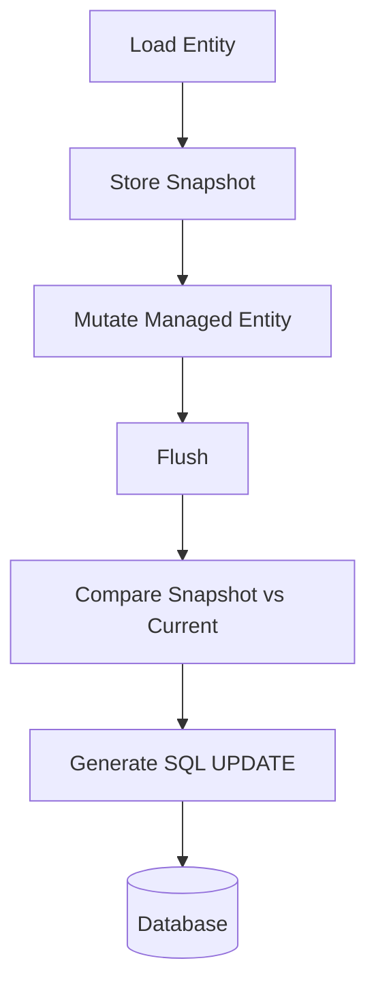

# Part 035 — Hibernate Dirty Checking and Flush

> Hibernate membuat update terlihat sederhana:
>
> ```java
> entity.setStatus(APPROVED);
> ```
>
> Lalu saat flush/commit, SQL muncul.
>
> Ini produktif, tetapi juga berbahaya jika engineer tidak tahu:
>
> - kapan entity dianggap dirty;
> - kapan flush terjadi;
> - query mana yang memicu flush;
> - kenapa GET endpoint bisa update row;
> - kenapa update SQL terlalu besar;
> - kenapa batch memakai memory besar;
> - kenapa constraint exception muncul sebelum commit;
> - kenapa read-only transaction tidak selalu berarti tidak ada write.
>
> Dirty checking dan flush adalah pusat dari perilaku Hibernate.

Part ini membahas dirty checking dan flush dengan fokus production failure modes dan desain yang aman.

---

## 1. Core Thesis

Dirty checking adalah mekanisme Hibernate untuk mendeteksi perubahan pada managed entity dan menghasilkan SQL update saat flush.

Flush adalah proses menyinkronkan persistence context ke database.

Rule utama:

```txt
Managed entity mutation is a pending write.
Flush sends pending writes to database.
Commit usually triggers flush.
```

Karena itu, kode ini:

```java
CaseFileEntity entity = entityManager.find(CaseFileEntity.class, id);
entity.setStatus("APPROVED");
```

belum tentu langsung menjalankan SQL, tetapi sudah membuat state dirty di persistence context.

---

## 2. Dirty Checking Mental Model

Saat entity diload, Hibernate menyimpan snapshot state.

```txt
Loaded snapshot:
  status = UNDER_REVIEW
  title = Old Title
  version = 7

Current entity:
  status = APPROVED
  title = Old Title
  version = 7

Dirty fields:
  status
```

Pada flush, Hibernate membandingkan current state dengan snapshot dan menghasilkan update.

Diagram:



---

## 3. Managed Entity Is the Key

Dirty checking hanya berlaku untuk managed entity.

```java
@Transactional
public void update(UUID id) {
    CaseFileEntity entity = entityManager.find(CaseFileEntity.class, id);
    entity.setTitle("New Title"); // tracked
}
```

Detached entity:

```java
CaseFileEntity entity = loadInPreviousTransaction();
entity.setTitle("New Title"); // not tracked
```

Perubahan detached tidak disimpan kecuali:

- `merge`;
- reattach/provider-specific;
- manual mapping to managed entity.

---

## 4. Flush Is Not Commit

Flush sends SQL.

Commit makes transaction durable.

Sequence:

```txt
begin transaction
load entity
mutate entity
flush -> SQL update sent, locks/constraints apply
commit -> transaction durable
```

If flush succeeds but commit fails, transaction still not durable.

Do not send external side effect after flush but before commit as if durable. Use outbox.

---

## 5. When Flush Happens

Flush can happen:

- transaction commit;
- before JPQL/Criteria query under `AUTO` flush mode;
- before native query depending provider/context;
- explicit `entityManager.flush()`;
- before lock/refresh in some scenarios;
- when transaction synchronization decides.

Example:

```java
entity.setStatus("APPROVED");

List<CaseFileEntity> open = entityManager.createQuery("""
    select c from CaseFileEntity c where c.status = 'OPEN'
    """, CaseFileEntity.class).getResultList();
```

The query may trigger flush first.

---

## 6. Why Flush Before Query Exists

Hibernate flushes before query to avoid query returning stale results relative to pending in-memory changes.

If you changed status from `OPEN` to `APPROVED`, then query for `OPEN` should not include it within same transaction.

This is helpful, but can surprise:

- constraint violation appears at query;
- update happens earlier;
- lock acquired earlier;
- batch order changes;
- query latency includes flush work.

---

## 7. Flush Mode

JPA flush modes:

```java
entityManager.setFlushMode(FlushModeType.AUTO);
entityManager.setFlushMode(FlushModeType.COMMIT);
```

`AUTO`:

- provider may flush before query and commit.

`COMMIT`:

- tries to defer flush until commit.

Hibernate also has provider-specific flush modes.

Guideline:

```txt
Do not use flush mode as a substitute for clear transaction design.
```

If query is read-only, use DTO projection/read-only transaction. If command mutates, avoid unrelated queries after mutation.

---

## 8. Unexpected Update

Common bug:

```java
@Transactional
public CaseDetailView getDetail(UUID caseId) {
    CaseFileEntity entity = entityManager.find(CaseFileEntity.class, caseId);

    entity.setLastViewedAt(clock.instant());

    return mapper.toView(entity);
}
```

A method that looks like a query updates row.

If `lastViewedAt` is intended analytics, it should be explicit command/event, not hidden in read query.

Unexpected update signs:

- version increments on GET;
- audit missing;
- update SQL in read logs;
- cache invalidation on read;
- lock contention from query endpoint.

---

## 9. Setter Side Effects

A setter call on managed entity is not harmless.

Bad mapper:

```java
public CaseDetailView toView(CaseFileEntity entity) {
    entity.normalizeStatusText(); // mutates
    return new CaseDetailView(...);
}
```

Mapping should not mutate managed entity.

If normalization needed, compute local variable.

```java
String normalized = normalize(entity.getStatusText());
```

---

## 10. Read-Only Transaction Is Not Absolute

Spring read-only transaction may set provider hints/connection flags depending configuration.

But read-only does not automatically make all managed entity mutation impossible in every setup.

Do not rely blindly.

Better for read path:

- DTO projection;
- no managed entity mutation;
- read-only query hints if appropriate;
- tests assert no update.

---

## 11. Hibernate Read-Only Entity/Query

Hibernate supports read-only hints/concepts.

Example concept:

```java
query.setHint("org.hibernate.readOnly", true);
```

Read-only entities are not dirty-checked in the same way.

Useful for large read operations.

But it is provider-specific. For portable application design, DTO projections are clearer.

---

## 12. Dirty Checking Cost

Dirty checking has cost proportional to managed entities and fields.

If persistence context contains many entities:

```txt
flush must inspect many objects
```

Problems:

- slow flush;
- high CPU;
- memory pressure;
- GC;
- transaction p99 spike.

For batch:

```java
for (int i = 0; i < items.size(); i++) {
    entityManager.persist(items.get(i));

    if (i % 100 == 0) {
        entityManager.flush();
        entityManager.clear();
    }
}
```

Or use JDBC/jOOQ batch for large operations.

---

## 13. Persistence Context Size

Do not load unbounded entities into one persistence context.

Bad:

```java
List<CaseFileEntity> all = entityManager.createQuery("""
    select c from CaseFileEntity c
    where c.status = 'OPEN'
    """, CaseFileEntity.class).getResultList();

for (CaseFileEntity c : all) {
    c.expireIfNeeded(now);
}
```

Better:

- chunk by ID;
- bulk update if safe;
- stateless processing;
- JDBC batch;
- flush/clear;
- read projection of IDs then update bounded chunk.

---

## 14. Write Amplification

Write amplification: one logical command causes too many SQL updates.

Causes:

- dirty checking on large graph;
- cascade updates;
- collection replacement;
- bidirectional association sync mistakes;
- updating parent version and many children;
- updating unchanged columns;
- entity callbacks touching fields;
- full graph merge.

Example:

```java
entityManager.merge(detachedCaseGraph);
```

can update many rows if graph considered dirty.

Review SQL, not only Java code.

---

## 15. Full-Column Update vs Dirty Field Update

Hibernate may update all mapped columns or only dirty columns depending configuration/annotations.

Default behavior often updates columns according to entity state and provider decisions.

`@DynamicUpdate` can generate update SQL with only changed columns:

```java
@DynamicUpdate
@Entity
class CaseFileEntity { ... }
```

Pros:

- less write payload;
- reduces some update conflicts on DB triggers/columns;
- avoids overwriting unchanged columns.

Cons:

- more SQL statement shapes;
- prepared statement cache impact;
- not replacement for optimistic locking;
- provider-specific annotation;
- can hide modeling issue.

Use carefully.

---

## 16. Dynamic Update Is Not Concurrency Control

Even if only dirty columns update, stale data can still be problem.

Optimistic version remains needed.

```sql
update case_file
set status = ?
where id = ?
  and version = ?
```

Without version, two users editing different fields may be okay or not depending domain. You need explicit policy.

---

## 17. Dirty Checking and `@Version`

At flush, versioned entity update includes version check.

Conceptual SQL:

```sql
update case_file
set status = ?,
    version = ?
where id = ?
  and version = ?
```

If affected rows 0, optimistic conflict.

Exception may be thrown:

- during flush;
- before query;
- at commit.

Application should map to conflict.

---

## 18. Flush-Time Constraint Violation

Example:

```java
entity.setCaseNumber("DUPLICATE");

otherQuery(); // auto flush before query
```

Unique violation occurs at `otherQuery`, not at commit.

Do not assume exception stack line identifies the real business action.

Exception translation should inspect constraint name/SQLState, not only call site.

---

## 19. Explicit Flush for Early Failure

Sometimes useful:

```java
caseRepository.add(caseFile);
entityManager.flush(); // detect duplicate case number now
```

Use cases:

- need generated ID/value before continuing;
- want constraint error before doing more DB work;
- integration test;
- batch chunk fail fast.

But explicit flush can:

- acquire locks earlier;
- increase round trips;
- complicate transaction flow;
- still not commit.

Use intentionally.

---

## 20. Flush and Outbox Event Version

If event payload needs new version, tricky.

Entity version may increment on flush.

Options:

### Compute expected version

```java
long newVersion = entity.getVersion() + 1;
outbox.append(eventWithVersion(newVersion));
```

Works if exactly one version increment expected.

### Flush before creating event

```java
entity.approve(...);
entityManager.flush();
outbox.append(eventWithVersion(entity.getVersion()));
```

But now event insert happens after first flush; still same transaction, but complexity.

### Domain owns version

Manual version handling outside ORM.

Choose and test.

---

## 21. Flush Order

Hibernate orders SQL based on entity operations, FK dependencies, batching settings, and provider behavior.

You should not rely on arbitrary flush order unless documented/tested.

If ordering matters for audit/outbox, ensure:

- same transaction;
- constraints correct;
- event payload uses intended state;
- audit does not depend on insert order except FK.

If audit row has FK to case row, insert case first is needed. ORM usually handles dependencies when associations mapped, but explicit row IDs can also solve.

---

## 22. Cascade and Flush

Cascade can cause flush to include entities you did not explicitly persist.

```java
caseFile.getAssignments().add(newAssignment);
```

If cascade persist applies, child insert happens at flush.

This is convenient but can hide side effects.

For critical operations, review cascade behavior and SQL.

---

## 23. Orphan Removal and Flush

```java
caseFile.getAssignments().clear();
```

With orphan removal, flush may delete all assignments.

This is a common production disaster when mapping request DTO replaces collection.

Avoid collection replacement. Use explicit add/remove methods.

---

## 24. Merge and Dirty Explosion

`merge` detached graph can mark many entities dirty or cascade merges.

Bad for:

- API request body entity;
- large aggregate graph;
- partial update;
- stale form.

Prefer:

```txt
load managed entity -> apply explicit command changes
```

This creates minimal dirty state.

---

## 25. Entity Callback Mutation

Callbacks can mutate fields on flush.

```java
@PreUpdate
void preUpdate() {
    updatedAt = Instant.now();
}
```

This is common.

But callback can also create unexpected dirty state if it touches fields.

Keep callbacks simple:

- timestamps;
- technical metadata.

Avoid:

- audit rows;
- outbox publish;
- external calls;
- business workflow.

---

## 26. Dirty Checking and Immutable Entity Fields

If field should not change:

```java
@Column(updatable = false)
private UUID tenantId;
```

Hibernate will not include it in update SQL.

But if Java code changes it, in-memory object differs from DB until reload. Avoid setter or make immutable.

Use constructor/static factory and no public setter.

---

## 27. Dirty Checking and Embeddables

Changing embeddable field can dirty owning entity.

```java
entity.setDecision(new DecisionSnapshot(...));
```

or mutating embeddable object if mutable.

Prefer immutable embeddables where possible.

Mutable embeddables can be tracked depending provider enhancement/snapshot mechanism but can surprise.

---

## 28. Bytecode Enhancement

Hibernate can use bytecode enhancement for more efficient dirty tracking/lazy attributes.

Benefits:

- better dirty tracking;
- lazy basic fields;
- performance improvements.

Costs:

- build/runtime configuration;
- provider-specific behavior;
- debugging complexity.

Do not depend on enhancement semantics without tests.

---

## 29. Flush and Query Count Observability

Enable SQL logging carefully in dev/test.

Track:

- number of SQL statements per request;
- update statements in read endpoints;
- flush duration;
- entity count in persistence context if available;
- slow queries;
- batch size effectiveness.

For production, use metrics/tracing rather than raw SQL logs with sensitive data.

---

## 30. Hibernate Statistics

Hibernate can expose statistics in some configurations.

Useful indicators:

- entity load count;
- entity update count;
- flush count;
- query execution count;
- collection fetch count;
- second-level cache stats if enabled.

Use in tests/performance diagnostics.

Do not enable high-overhead stats blindly in production without understanding cost.

---

## 31. Read Endpoint Update Test

```java
@Test
void caseDetailQueryDoesNotUpdateEntity() {
    CaseId caseId = fixture.caseFile(version(7));

    caseDetailService.getDetail(caseId);

    CaseFileRow row = jdbcQuery.find(caseId).orElseThrow();

    assertThat(row.version()).isEqualTo(7);
}
```

This catches accidental dirty checking in reads.

---

## 32. Query Count Test

Use datasource proxy or Hibernate statistics.

```java
@Test
void dashboardQueryDoesNotHaveNPlusOne() {
    fixture.openCases(20);

    SqlCounter.reset();

    dashboardService.search(...);

    assertThat(SqlCounter.selectCount()).isLessThanOrEqualTo(2);
}
```

This catches lazy loading regressions.

---

## 33. Flush Before Query Test

```java
@Test
void jpqlQueryFlushesPendingDuplicate() {
    assertThatThrownBy(() ->
        tx.execute(() -> {
            CaseFileEntity entity = entityManager.find(CaseFileEntity.class, id);
            entity.setCaseNumber(existingCaseNumber);

            entityManager.createQuery("""
                select c from CaseFileEntity c
                """, CaseFileEntity.class).getResultList();

            return null;
        })
    ).isInstanceOf(PersistenceException.class);
}
```

This proves exception timing.

---

## 34. Batch Flush/Clear Test

For batch processor, test memory indirectly:

- flush/clear called every N items via instrumentation;
- persistence context does not grow unbounded;
- output correct after chunk.

If using provider API, you can inspect managed count in tests, but avoid over-coupling.

---

## 35. Flush and Transaction Rollback

If flush fails, transaction should be marked rollback-only.

Do not catch flush exception and continue as if transaction usable.

Bad:

```java
try {
    entityManager.flush();
} catch (PersistenceException e) {
    // ignore
}
continueMoreWrites();
```

After serious persistence error, rollback and start new transaction if retryable.

---

## 36. Dirty Checking and Partial Update API

PATCH endpoint should not merge partial DTO into entity blindly.

Good:

```java
@Transactional
public void changePriority(ChangePriorityCommand command) {
    CaseFileEntity entity = entityManager.find(CaseFileEntity.class, command.caseId());

    if (entity.getVersion() != command.expectedVersion()) {
        throw new OptimisticConflict();
    }

    entity.changePriority(command.priority(), command.actor(), command.reason());
}
```

Only intended field changes. Dirty checking updates accordingly.

---

## 37. Flush and Validation Order

If domain validation happens after mutation but before flush, okay.

But if query triggers flush before all validation complete, invalid state can reach DB temporarily inside transaction and fail.

Design:

```txt
validate inputs
load
validate current state
mutate to valid new state
append audit/outbox
commit
```

Avoid multi-step invalid intermediate entity state before query.

---

## 38. Multi-Step Mutation Pitfall

Bad:

```java
entity.setStatus(null);
runQuery(); // flush could happen, not-null violation
entity.setStatus("APPROVED");
```

Never put managed entity into invalid intermediate state if any flush can occur.

Use method that changes state atomically:

```java
entity.approve(...);
```

---

## 39. Flush and Database Triggers

If DB trigger changes columns, entity state may not reflect until refresh.

Example:

```txt
trigger sets updated_at
```

After flush:

```java
entity.getUpdatedAt()
```

may still be old unless provider retrieves generated values.

Options:

- app sets updatedAt;
- refresh after flush;
- use generated annotations;
- avoid needing trigger-generated value in same transaction.

---

## 40. Dirty Checking in Long Transaction

Long transaction with many managed entities increases risk:

- stale decisions;
- accidental dirty state;
- large flush;
- deadlock;
- lock duration;
- memory growth.

Keep transaction short.

Long business workflow should be state machine/outbox, not long persistence context.

---

## 41. Dirty Checking and Testing Domain Methods

If JPA entity contains domain methods, unit test domain behavior without persistence when possible.

But also integration test:

- method on managed entity produces correct SQL/update;
- version increments;
- cascade/orphan behavior expected;
- constraint errors mapped.

Domain behavior correctness and persistence effect are different tests.

---

## 42. SQL Review for Dirty Checking

For important command, capture SQL:

```txt
ApproveCase:
  select case_file by id
  update case_file set status=?, approved_at=?, version=? where id=? and version=?
  insert case_audit_log
  insert outbox_event
```

If you see:

- update officer;
- select documents;
- delete assignments;
- update all columns unexpectedly;

investigate mapping/cascade/dirty state.

---

## 43. Write Amplification Debug Checklist

If one command emits too many SQL statements:

- Are lazy associations initialized?
- Is detached graph merged?
- Are collections replaced?
- Are cascades too broad?
- Are callbacks touching fields?
- Is entity graph too large?
- Are bidirectional associations synchronized wrongly?
- Is flush happening multiple times?
- Are inserts not batched due ID strategy?
- Are read queries causing auto-flush repeatedly?

---

## 44. Flush Frequency

Multiple flushes in one transaction can happen due queries.

Example:

```java
mutate A
query X -> flush A
mutate B
query Y -> flush B
commit -> flush remaining
```

This can reduce batching and increase lock duration.

Structure command to avoid query after mutation.

If additional data needed, load it before mutation.

---

## 45. Load Before Mutate Pattern

Good:

```java
CaseFileEntity caseFile = loadCase();
PolicyEntity policy = loadPolicy();
OfficerEntity officer = loadOfficer();

caseFile.approve(policy, officer, command);
audit.append(...);
outbox.append(...);
```

Bad:

```java
caseFile.approvePartial();
loadPolicy(); // triggers flush
caseFile.finishApproval();
```

---

## 46. Read-Only Projection Pattern

For query endpoints:

```java
List<CaseDashboardRow> rows = entityManager.createQuery("""
    select new com.example.CaseDashboardRow(...)
    from CaseFileEntity c
    left join c.assignedOfficer o
    where c.tenantId = :tenantId
    """, CaseDashboardRow.class)
    .setParameter("tenantId", tenantId)
    .getResultList();
```

No managed entity, no dirty checking.

---

## 47. When Dirty Checking Is a Good Fit

Dirty checking works well for:

- simple aggregate update;
- moderate object graph;
- transaction-scoped use case;
- optimistic locking;
- clear fetch plan;
- minimal side effects;
- no huge batch.

It is less ideal for:

- report/export;
- massive batch update;
- complex dynamic SQL;
- high-performance write with explicit counts;
- cross-service workflow;
- partial update from stale detached graph.

---

## 48. Dirty Checking vs Explicit SQL

Dirty checking:

```java
entity.approve();
```

Explicit SQL:

```java
update case_file
set status='APPROVED'
where id=? and status='UNDER_REVIEW' and version=?;
```

Dirty checking is object-centric. Explicit SQL can encode conditional update directly.

For critical state transition, you can still use JPA with version, but sometimes explicit SQL is clearer and more atomic.

Choose per use case.

---

## 49. Anti-Pattern: Query Method Mutates Managed Entity

Read path should not write unless explicitly a command.

---

## 50. Anti-Pattern: Blind Merge for PATCH

Can dirty many fields and overwrite stale state.

Use command DTO + managed load.

---

## 51. Anti-Pattern: Collection Clear/Repopulate

With orphan removal/cascade, can delete/reinsert many children.

Apply deltas.

---

## 52. Anti-Pattern: Ignoring Flush Exception and Continuing

Rollback transaction. Retry whole transaction if safe.

---

## 53. Anti-Pattern: Long Batch Without Flush/Clear

Persistence context grows and flush becomes expensive.

Chunk/flush/clear or use JDBC batch.

---

## 54. Anti-Pattern: Relying on Read-Only Annotation Alone

Still design read path with projections and tests.

---

## 55. Production Checklist

- [ ] Managed entity mutation only in command path.
- [ ] Query endpoints use DTO projection/read-only strategy.
- [ ] No unrelated query after mutation.
- [ ] Flush timing understood.
- [ ] Explicit flush used only intentionally.
- [ ] Flush exceptions cause rollback.
- [ ] Version conflicts mapped.
- [ ] Large batch uses flush/clear or JDBC batch.
- [ ] Merge avoided for complex commands.
- [ ] Collection replacement avoided.
- [ ] Cascades reviewed.
- [ ] SQL count/update count monitored.
- [ ] Read endpoints tested for no update.
- [ ] N+1 regression tests exist.
- [ ] Outbox used for external side effects.

---

## 56. Mini Lab

Analyze this command:

```java
@Transactional
public CaseDetailView approve(UUID id, ApproveRequest request) {
    CaseFileEntity entity = entityManager.find(CaseFileEntity.class, id);

    entity.setStatus("APPROVED");

    List<DocumentEntity> docs = documentRepository.findMissingDocuments(id);

    if (!docs.isEmpty()) {
        throw new MissingDocumentException();
    }

    auditRepository.save(...);
    emailClient.send(...);

    return detailMapper.toView(entity);
}
```

Questions:

1. Where can flush happen?
2. Can missing document query flush status before validation?
3. What happens if email sends but commit fails?
4. Could detail mapper lazy-load?
5. Could GET-like response hold transaction longer?
6. How should this be refactored?
7. What tests catch the bug?
8. Should documents be loaded before mutation?
9. Should email become outbox?
10. What should command return?

---

## 57. Summary

Dirty checking and flush are productive but must be controlled.

You must master:

- managed entity mutation;
- snapshot comparison;
- flush vs commit;
- flush before query;
- flush mode;
- unexpected update;
- read-only query strategy;
- dirty checking cost;
- persistence context size;
- write amplification;
- dynamic update;
- version conflict timing;
- constraint violation timing;
- explicit flush;
- outbox version concerns;
- cascade/orphan flush side effects;
- merge dirty explosion;
- flush exception rollback;
- SQL/query count testing.

Part berikutnya membahas **JPA Mapping Association Patterns**: one-to-many, many-to-one, many-to-many avoidance, join table, ownership, cascade, orphan removal, fetch strategy, and association modeling for production systems.

---

## 58. References

- Hibernate ORM User Guide: https://docs.hibernate.org/stable/orm/userguide/html_single/
- Jakarta Persistence Specification: https://jakarta.ee/specifications/persistence/3.2/jakarta-persistence-spec-3.2
- Spring Framework Transaction Management: https://docs.spring.io/spring-framework/reference/data-access/transaction.html
- Spring Data JPA Reference: https://docs.spring.io/spring-data/jpa/reference/
