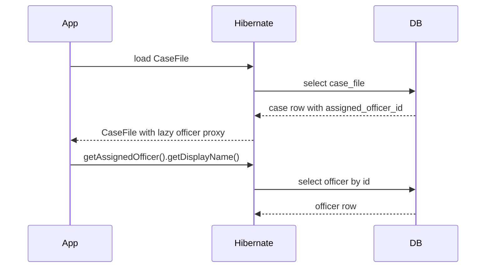

# Part 037 — Lazy Loading and N+1

> Lazy loading membuat object graph nyaman dinavigasi.
>
> Tetapi kenyamanan ini sering dibayar dengan query tersembunyi.
>
> N+1 biasanya tidak terlihat di code review:
>
> ```java
> cases.stream()
>      .map(c -> c.getAssignedOfficer().getDisplayName())
>      .toList();
> ```
>
> Kode terlihat seperti mapping biasa, padahal bisa menghasilkan:
>
> ```txt
> 1 query untuk list case
> + N query untuk officer
> ```
>
> Di production, N+1 bukan sekadar inefficiency. Ia bisa menjadi incident: DB CPU naik, latency melonjak, connection pool penuh, dan request timeout.

Part ini membahas lazy loading dan N+1 secara production-grade.

---

## 1. Core Thesis

Lazy loading adalah mekanisme menunda query sampai association/field diakses.

N+1 adalah pola ketika satu query utama diikuti N query tambahan untuk setiap row/entity.

Lazy loading bukan salah. Yang salah adalah membiarkan query tersembunyi menentukan performa endpoint.

Rule utama:

```txt
For command path:
  load exactly what invariant needs.

For read/list path:
  use DTO projection/read model, not lazy entity graph.

For detail path:
  use explicit fetch plan or section queries.

For production:
  test and monitor query count.
```

---

## 2. Lazy Loading Mental Model

Entity:

```java
@ManyToOne(fetch = FetchType.LAZY)
@JoinColumn(name = "assigned_officer_id")
private OfficerEntity assignedOfficer;
```

Usage:

```java
CaseFileEntity caseFile = entityManager.find(CaseFileEntity.class, id);

// no officer query yet
OfficerEntity officer = caseFile.getAssignedOfficer();

// accessing property may trigger SQL
String name = officer.getDisplayName();
```

Concept:



Lazy loading converts object navigation into database access.

---

## 3. Lazy Proxy

For `@ManyToOne(fetch = LAZY)`, Hibernate often returns proxy.

Proxy contains identity and loads target when needed.

Risks:

- accessing outside transaction/session fails;
- `getClass()` may show proxy class;
- serialization can trigger load;
- equals/hashCode can be tricky;
- logging/toString can trigger load;
- mapping to DTO can accidentally trigger load.

Do not pass lazy proxies outside persistence boundary.

---

## 4. Lazy Collection

For `@OneToMany`, collection is usually lazy.

```java
caseFile.getAssignments().size();
```

may execute:

```sql
select ...
from case_assignment
where case_id = ?
```

Loop over many parents:

```java
for (CaseFileEntity c : cases) {
    c.getAssignments().size();
}
```

can produce one query per case.

---

## 5. N+1 Example: Many-to-One

Code:

```java
List<CaseFileEntity> cases = entityManager.createQuery("""
    select c
    from CaseFileEntity c
    where c.status = :status
    order by c.updatedAt desc
    """, CaseFileEntity.class)
    .setParameter("status", "OPEN")
    .setMaxResults(50)
    .getResultList();

List<CaseRow> rows = cases.stream()
        .map(c -> new CaseRow(
                c.getId(),
                c.getCaseNumber(),
                c.getAssignedOfficer().getDisplayName()
        ))
        .toList();
```

SQL:

```txt
1 select cases
50 select officer by id
```

Even if second-level cache helps sometimes, design is fragile.

---

## 6. N+1 Example: One-to-Many

```java
List<CaseFileEntity> cases = queryCases();

for (CaseFileEntity c : cases) {
    int activeAssignments = c.getAssignments().stream()
            .filter(CaseAssignmentEntity::isActive)
            .toList()
            .size();
}
```

SQL:

```txt
1 select cases
N select assignments where case_id = ?
```

Worse, each collection can be large.

---

## 7. N+1 in DTO Mapper

Common hidden source:

```java
public CaseDashboardRow toRow(CaseFileEntity entity) {
    return new CaseDashboardRow(
            entity.getId(),
            entity.getCaseNumber(),
            entity.getAssignedOfficer().getDisplayName(),
            entity.getDocuments().size()
    );
}
```

Mapper looks pure, but calls lazy associations.

DTO mapper should not be responsible for fetching data.

For list dashboard, use projection query.

---

## 8. N+1 in JSON Serialization

Controller returns entity:

```java
return caseFileEntity;
```

Jackson calls getters:

```txt
getAssignedOfficer()
getAssignments()
getDocuments()
```

This can trigger many queries or fail after session closed.

Fix:

- never expose entity directly;
- return response DTO;
- disable OSIV if possible and design explicit fetch.

Annotations like `@JsonIgnore` are partial mitigation, not root solution.

---

## 9. Open Session in View Risk

OSIV keeps persistence context/session open during web view/serialization.

It hides lazy initialization exception by allowing lazy loads later.

But it moves database access to:

- controller;
- serializer;
- template rendering;
- response mapping.

Risks:

- N+1 outside service;
- connection held longer;
- unpredictable query count;
- data access after transaction boundary;
- accidental graph exposure.

High-quality backend should prefer explicit DTO/query service.

---

## 10. LazyInitializationException Is a Symptom

Exception:

```txt
could not initialize proxy - no Session
```

Bad fix:

```txt
enable OSIV
make association eager
```

Better fix:

```txt
Decide what data endpoint needs.
Load it explicitly inside query/use case.
Return DTO.
```

Lazy initialization error is telling you your data boundary is unclear.

---

## 11. EAGER Is Usually Not the Fix

Changing:

```java
@ManyToOne(fetch = FetchType.EAGER)
```

may remove one lazy exception but introduces:

- over-fetching every time entity loads;
- hidden joins/selects;
- N+1 can still occur;
- object graph explosion;
- poor control per use case.

Default to lazy for associations and explicit fetch per use case.

---

## 12. DTO Projection Strategy

For list/dashboard:

```java
List<CaseDashboardRow> rows = entityManager.createQuery("""
    select new com.example.CaseDashboardRow(
        c.id,
        c.caseNumber,
        c.status,
        o.displayName,
        c.updatedAt
    )
    from CaseFileEntity c
    left join c.assignedOfficer o
    where c.tenantId = :tenantId
    order by c.updatedAt desc, c.id desc
    """, CaseDashboardRow.class)
    .setParameter("tenantId", tenantId)
    .setMaxResults(limit)
    .getResultList();
```

Benefits:

- no managed entity graph;
- no lazy load;
- SQL shape explicit;
- fewer columns;
- better for read path.

For most list screens, projection is best fix.

---

## 13. Fetch Join Strategy

For command/detail where aggregate/entity needed:

```java
select c
from CaseFileEntity c
left join fetch c.assignedOfficer
where c.id = :id
```

Fetch join loads association in same query.

Good for:

- single aggregate with bounded associations;
- command needing association;
- detail header.

Cautions:

- collection fetch join can duplicate parent rows;
- multiple collection fetch joins cause cartesian explosion;
- pagination with collection fetch join is problematic;
- fetch join loads entity graph as managed.

---

## 14. Fetch Join Many-to-One

Many-to-one fetch join is usually safe:

```java
select c
from CaseFileEntity c
join fetch c.assignedOfficer
where c.id = :id
```

For list:

```java
select c
from CaseFileEntity c
join fetch c.assignedOfficer
where c.status = :status
```

Can still be okay if no collection join and result bounded.

But for list read, DTO projection may be better because you rarely need managed `OfficerEntity`.

---

## 15. Fetch Join One-to-Many

```java
select distinct c
from CaseFileEntity c
left join fetch c.assignments
where c.id = :id
```

Useful when:

- loading one parent;
- child collection bounded;
- command needs child state;
- no pagination.

Cautions:

- duplicate parent rows in SQL;
- `distinct` may be needed;
- large collection loaded fully;
- combining multiple collections dangerous.

---

## 16. Multiple Collection Fetch Join Explosion

```java
select c
from CaseFileEntity c
left join fetch c.assignments
left join fetch c.documents
left join fetch c.actions
where c.id = :id
```

If:

```txt
assignments = 5
documents = 10
actions = 20
```

Rows:

```txt
5 * 10 * 20 = 1000
```

for one parent.

Better:

- separate queries for sections;
- DTO detail view;
- bounded recent actions;
- read model;
- JSON aggregation only if reviewed.

---

## 17. Pagination With Fetch Join

Collection fetch join + pagination is dangerous because database paginates row result, not parent entities.

Framework may warn or paginate in memory depending provider/config.

Avoid:

```java
select c
from CaseFileEntity c
left join fetch c.assignments
order by c.updatedAt desc
```

with `setMaxResults`.

Better:

1. query page of parent IDs;
2. fetch associations for those IDs;
3. assemble result;
4. or use DTO/read model.

---

## 18. Two-Step Fetch Pattern

Step 1: page parent IDs.

```java
List<UUID> ids = entityManager.createQuery("""
    select c.id
    from CaseFileEntity c
    where c.tenantId = :tenantId
    order by c.updatedAt desc, c.id desc
    """, UUID.class)
    .setParameter("tenantId", tenantId)
    .setMaxResults(limit)
    .getResultList();
```

Step 2: fetch graph by IDs.

```java
List<CaseFileEntity> cases = entityManager.createQuery("""
    select distinct c
    from CaseFileEntity c
    left join fetch c.assignments
    where c.id in :ids
    """, CaseFileEntity.class)
    .setParameter("ids", ids)
    .getResultList();
```

Then sort in memory according to ID order.

Use for bounded pages. For read screens, projection may still be simpler.

---

## 19. Entity Graph Strategy

Entity graph specifies fetch plan.

```java
EntityGraph<CaseFileEntity> graph =
        entityManager.createEntityGraph(CaseFileEntity.class);

graph.addAttributeNodes("assignedOfficer");
graph.addSubgraph("assignments");

CaseFileEntity entity = entityManager.find(
        CaseFileEntity.class,
        id,
        Map.of("jakarta.persistence.fetchgraph", graph)
);
```

Pros:

- reusable fetch plan;
- avoids hardcoding fetch join in every query;
- good for use-case-specific load.

Cons:

- generated SQL still needs review;
- multiple collections still risky;
- provider behavior matters;
- can be overused.

---

## 20. Named Entity Graph

```java
@NamedEntityGraph(
    name = "CaseFile.forAssignment",
    attributeNodes = {
        @NamedAttributeNode("assignments")
    }
)
@Entity
class CaseFileEntity { ... }
```

Usage:

```java
EntityGraph<?> graph = entityManager.getEntityGraph("CaseFile.forAssignment");
```

Good when fetch plan is stable and reused.

Name it by use case, not by field list:

```txt
CaseFile.forAssignment
CaseFile.forClosure
```

---

## 21. Batch Fetch Strategy

Hibernate batch fetch can reduce N+1.

Concept:

```txt
When lazy association for one entity is accessed,
load same association for multiple entities in one query.
```

Example:

```txt
select officer where id in (?, ?, ?, ...)
```

instead of one query per officer.

Configuration can be global or per association/provider-specific.

Good for:

- moderate graph traversal;
- many-to-one references;
- cases where projection not convenient.

But it still relies on lazy access and should not replace explicit read query for critical endpoints.

---

## 22. Subselect Fetch Strategy

Hibernate can fetch collection for all parent entities from previous query using subselect.

Concept:

```sql
select *
from case_assignment
where case_id in (
    select id
    from case_file
    where status = 'OPEN'
)
```

Useful for some collection loading patterns.

Cautions:

- provider-specific;
- can fetch more than expected;
- depends on previous query;
- not for unbounded parent set;
- must be tested.

---

## 23. Batch Fetch vs Fetch Join vs Projection

| Problem | Prefer |
|---|---|
| dashboard/list fields | DTO projection/read model |
| single aggregate with bounded child needed | fetch join/entity graph |
| many-to-one N+1 in moderate entity use | batch fetch or projection |
| multiple collections detail view | separate section queries |
| export/report | projection/chunk |
| command needing child invariant | intent-specific load/fetch |
| large graph | avoid entity graph, use queries/chunks |

No single fetch strategy fits all.

---

## 24. Query Count Budget

For critical endpoint, define budget.

Example:

```txt
GET /case-dashboard
  <= 2 SQL statements

GET /cases/{id}/detail
  <= 5 SQL statements

POST /cases/{id}/approve
  expected SQL:
    select case
    update case
    insert audit
    insert outbox
```

Budget makes N+1 regression obvious.

---

## 25. Query Count Test

Use a SQL counter in integration tests.

```java
@Test
void dashboardDoesNotHaveNPlusOne() {
    fixture.createOpenCases(50);

    sqlCounter.reset();

    dashboardUseCase.search(filter, PageRequest.first(50));

    assertThat(sqlCounter.selectCount()).isLessThanOrEqualTo(2);
}
```

Do not assert exact SQL for every endpoint unless necessary. Budget enough to catch explosion.

---

## 26. Hibernate Statistics Test

If using Hibernate statistics:

```java
statistics.clear();

dashboardUseCase.search(...);

assertThat(statistics.getPrepareStatementCount()).isLessThanOrEqualTo(2);
```

Keep tests stable by focusing on budgets.

---

## 27. Production Detection

Signals of N+1:

- SQL count per request high;
- repeated `select ... where id=?`;
- endpoint latency grows linearly with page size;
- DB CPU high while result row count small;
- connection pool busy;
- p95/p99 worse than average;
- serializer stack appears in SQL trace;
- new field added to response before incident.

Trace query names and request IDs.

---

## 28. Logging Lazy Loads

In dev/test, SQL logging can reveal.

Look for:

```txt
select officer where id=?
select officer where id=?
select officer where id=?
...
```

In production, use sampling/tracing and avoid logging bind values if sensitive.

---

## 29. N+1 and Second-Level Cache

Second-level cache can hide N+1 for cached reference data.

But relying on cache is risky:

- cold cache still N+1;
- cache invalidation complexity;
- mutable data stale risk;
- memory pressure;
- endpoint still object-graph dependent.

Fix query shape first. Cache may be additional optimization.

---

## 30. N+1 and Reference Data

For stable small reference data, caching may be okay.

Example status code descriptions.

But for officer/user names, permissions, assignments, mutable data, prefer projection/read model or controlled cache with freshness rules.

---

## 31. Lazy Loading and Transaction Scope

Lazy load requires open persistence context/session.

If association may be accessed later, either:

- load it before leaving transaction;
- map to DTO;
- pass IDs;
- avoid entity outside transaction.

Do not return managed entity to layers that may outlive transaction.

---

## 32. Lazy Loading in Domain Method

Domain method:

```java
public void close() {
    if (!assignments.isEmpty()) {
        throw new CannotCloseWithAssignments();
    }
    status = CLOSED;
}
```

If `assignments` lazy, calling `close()` triggers DB query.

This can be acceptable if repository method `loadForClosure` intentionally loads assignments.

Better:

```java
CaseFileEntity caseFile = repository.loadForClosure(id);
caseFile.close();
```

Do not call domain method on partially loaded entity accidentally.

---

## 33. Intent-Specific Repository Load

```java
public Optional<CaseFileEntity> loadForClosure(UUID id) {
    return entityManager.createQuery("""
        select distinct c
        from CaseFileEntity c
        left join fetch c.activeAssignments
        left join fetch c.pendingSanctions
        where c.id = :id
        """, CaseFileEntity.class)
        .setParameter("id", id)
        .getResultStream()
        .findFirst();
}
```

If multiple collections are risky, load separately.

Name method by use case, not generic `findById`.

---

## 34. Separate Section Query for Detail

```java
@Transactional(readOnly = true)
public CaseDetailView getDetail(CaseId id) {
    CaseHeaderView header = headerQuery.get(id);
    List<ActionView> actions = actionQuery.recent(id, 20);
    List<DocumentView> documents = documentQuery.list(id);
    List<AssignmentView> assignments = assignmentQuery.active(id);

    return new CaseDetailView(header, actions, documents, assignments);
}
```

This avoids forcing one entity graph to satisfy view shape.

---

## 35. Lazy Loading and `toString`

Bad:

```java
@Override
public String toString() {
    return "CaseFile{" +
           "assignments=" + assignments +
           '}';
}
```

Logging entity can trigger lazy load.

Keep toString minimal:

```java
return "CaseFileEntity{id=" + id + ", status=" + status + "}";
```

---

## 36. Lazy Loading and `equals/hashCode`

Do not include associations in equality/hashCode.

Bad:

```java
return Objects.hash(id, assignments);
```

Can trigger lazy load and recursion.

Use stable identity strategy.

---

## 37. Lazy Loading and Lombok

Avoid `@Data` on JPA entities.

It generates `toString`, `equals`, `hashCode`, and setters that may include associations.

Use explicit methods or Lombok with exclusions:

```java
@Getter
@Setter(AccessLevel.PRIVATE)
@ToString(onlyExplicitlyIncluded = true)
```

Even then, be cautious.

---

## 38. N+1 in Authorization

Example:

```java
for (CaseFileEntity c : cases) {
    if (authorization.canView(user, c)) { ... }
}
```

If `canView` accesses lazy associations/roles per case, N+1.

Authorization for query should be pushed into SQL/scope predicate or precomputed visibility.

---

## 39. N+1 in Validation

Command validates many entities:

```java
for (AssignmentEntity a : caseFile.getAssignments()) {
    policy.validate(a.getOfficer().getUnit());
}
```

This can trigger nested N+1.

If command needs this, load fetch plan intentionally or query validation data directly.

---

## 40. N+1 in Batch

Batch job over entities with lazy children is dangerous.

Use:

- projection query;
- chunked direct SQL;
- batch fetch;
- explicit child query for chunk IDs;
- avoid entity graph if huge.

---

## 41. Fetch Size Is Not N+1 Fix

JDBC fetch size controls rows per network fetch for one query.

N+1 creates many queries.

Fetch size does not solve N+1. It may even hide symptoms slightly while still causing many round trips.

---

## 42. Indexes Still Matter

Fixing N+1 by join/projection can create new query plan requirements.

If you join officer:

```sql
left join officer o on o.id = c.assigned_officer_id
```

ensure FK/indexes appropriate.

If you filter child via exists, index child predicate.

Query shape and indexes must be reviewed together.

---

## 43. Read Model as N+1 Solution

If dashboard needs fields from many tables and high traffic:

```txt
case + officer + assignment count + document count + last action
```

A read model can precompute:

```sql
case_dashboard_read_model
```

Then dashboard query becomes one table/index.

Use when joins/projections become too complex or expensive.

---

## 44. N+1 Fix Decision Tree

```txt
Is this a list/read endpoint?
  -> DTO projection/read model.

Is this a single aggregate command?
  -> intent-specific load with fetch join/entity graph/separate child query.

Is collection bounded and needed?
  -> fetch join/entity graph okay.

Are multiple collections needed?
  -> section queries/read model.

Is this batch/export?
  -> projection/chunk, not lazy graph.

Is N+1 only for small reference data?
  -> projection or controlled cache/batch fetch.
```

---

## 45. Refactoring Example

Before:

```java
public List<CaseDashboardRow> dashboard() {
    return caseRepository.findOpenCases().stream()
            .map(caseMapper::toDashboardRow)
            .toList();
}
```

After:

```java
public Slice<CaseDashboardRow> dashboard(CaseDashboardQuery query) {
    return caseDashboardQuery.search(query);
}
```

SQL projection owns shape.

---

## 46. Refactoring Command Load

Before:

```java
CaseFileEntity caseFile = entityManager.find(CaseFileEntity.class, id);
caseFile.close(); // lazy loads assignments/sanctions
```

After:

```java
CaseFileEntity caseFile = caseRepository.loadForClosure(id)
        .orElseThrow();

caseFile.close();
```

Repository load contract ensures required data.

---

## 47. Testing Lazy Boundary

Test that entity does not escape.

```java
@Test
void detailEndpointReturnsDtoNotEntity() {
    CaseDetailResponse response = controller.getDetail(id);

    assertThat(response).isNotInstanceOf(CaseFileEntity.class);
}
```

More importantly, query count test and serialization test.

---

## 48. Serialization Query Test

```java
@Test
void serializingDetailResponseDoesNotHitDatabase() {
    CaseDetailResponse response = detailUseCase.getDetail(id);

    sqlCounter.reset();

    objectMapper.writeValueAsString(response);

    assertThat(sqlCounter.totalCount()).isZero();
}
```

This catches lazy entity/proxy in response.

---

## 49. OSIV Off Test

In Spring apps, test with OSIV disabled to reveal lazy boundary issues.

If endpoint fails, fix fetch/DTO rather than enabling OSIV blindly.

Production choice may vary, but explicit boundary remains best.

---

## 50. N+1 Review Checklist

- [ ] Does endpoint return entity? If yes, why?
- [ ] Does mapper access lazy association?
- [ ] Does serializer access lazy association?
- [ ] Is query count bounded?
- [ ] Is list endpoint using DTO projection?
- [ ] Are fetch joins used only for bounded associations?
- [ ] Are multiple collections fetched separately?
- [ ] Is pagination combined with collection fetch join?
- [ ] Are lazy loads happening in domain method?
- [ ] Is repository load intent-specific?
- [ ] Are batch jobs using projections/chunks?
- [ ] Are indexes reviewed for new query shape?
- [ ] Are query count tests in CI?
- [ ] Is OSIV hiding data access in web layer?

---

## 51. Anti-Pattern: Make Everything EAGER

This usually trades lazy N+1 for over-fetching and graph explosion.

---

## 52. Anti-Pattern: Entity to DTO Mapper for Large List

If mapper traverses associations, use projection query.

---

## 53. Anti-Pattern: OSIV as Architecture

OSIV may reduce exceptions but increases hidden DB access.

---

## 54. Anti-Pattern: Multiple Collection Fetch Join for Detail

Often cartesian explosion.

Use section queries.

---

## 55. Anti-Pattern: Query Count Not Tested

N+1 regressions are easy to reintroduce.

Budget critical endpoints.

---

## 56. Mini Lab

Given endpoint:

```txt
GET /cases/dashboard?status=OPEN
```

It returns:

- case number;
- status;
- assigned officer name;
- active assignment count;
- last action summary;
- document count.

Questions:

1. Would you use entity list or DTO projection?
2. Which joins/subqueries are needed?
3. Could this become read model?
4. What query count budget?
5. What indexes?
6. What fields are denormalized?
7. What if officer name changes?
8. How do you test no N+1?
9. How do you test serialization does not hit DB?
10. What production metrics detect regression?

---

## 57. Summary

Lazy loading is useful but must be controlled.

You must master:

- proxy and lazy collection behavior;
- N+1 on many-to-one and one-to-many;
- N+1 in mappers/serialization/authorization/validation;
- OSIV risks;
- eager fetch anti-pattern;
- DTO projection;
- fetch join;
- entity graph;
- batch fetch;
- subselect fetch;
- two-step fetch for pagination;
- section queries;
- read model as N+1 solution;
- query count budgets;
- serialization tests;
- production detection.

Part berikutnya membahas **Hibernate Query Patterns**: JPQL, Criteria, native query, named query, pagination, sorting, projection, tuple mapping, and how to keep query code safe and reviewable.

---

## 58. References

- Hibernate ORM User Guide: https://docs.hibernate.org/stable/orm/userguide/html_single/
- Jakarta Persistence Specification: https://jakarta.ee/specifications/persistence/3.2/jakarta-persistence-spec-3.2
- Spring Data JPA Reference: https://docs.spring.io/spring-data/jpa/reference/
