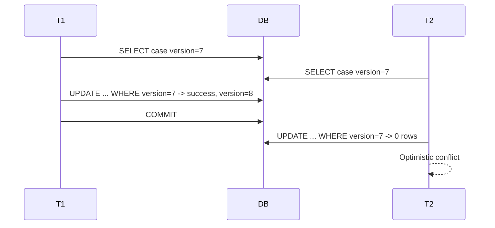

# Part 039 — JPA Locking and Versioning

> JPA memberi dua keluarga mekanisme concurrency:
>
> ```txt
> Optimistic:
>   @Version, optimistic lock, stale update detection.
>
> Pessimistic:
>   database row lock, often SELECT FOR UPDATE.
> ```
>
> Keduanya bukan dekorasi. Keduanya adalah alat untuk menjaga invariant ketika beberapa transaction bersaing mengubah data yang sama.
>
> Jika salah memilih, hasilnya bisa berupa lost update, duplicate action, deadlock, lock wait, throughput drop, atau conflict UX buruk.

Part ini membahas `@Version`, optimistic locking, pessimistic locking, lock timeout, dan retry design dalam JPA/Hibernate production.

---

## 1. Core Thesis

Concurrency control harus dipilih berdasarkan invariant dan contention pattern.

```txt
Low contention + human edit + stale update detection:
  Optimistic locking.

High contention + must serialize short critical section:
  Pessimistic locking.

Predicate/child-set invariant:
  constraint, parent lock, counter row, serializable, or explicit SQL.

Duplicate command:
  idempotency key, not just @Version.
```

JPA locking membantu, tetapi tidak menggantikan database constraints dan transaction design.

---

## 2. What `@Version` Solves

`@Version` solves stale update / lost update on a single versioned entity.

Entity:

```java
@Entity
@Table(name = "case_file")
public class CaseFileEntity {
    @Id
    private UUID id;

    @Version
    @Column(nullable = false)
    private long version;

    @Column(nullable = false)
    private String status;

    @Column(name = "updated_at", nullable = false)
    private Instant updatedAt;
}
```

Conceptual update:

```sql
update case_file
set status = ?,
    updated_at = ?,
    version = ?
where id = ?
  and version = ?;
```

If another transaction already changed version, affected rows = 0 and optimistic lock exception occurs.

---

## 3. Optimistic Locking Mental Model



Optimistic locking does not prevent concurrent reads. It detects stale write.

---

## 4. Optimistic Locking Is Not a Business Retry Button

If user edited version 7 and entity is now version 8, blindly reloading and applying same edit may violate user intent.

Example:

```txt
User approves case under state UNDER_REVIEW.
Another user closes case.
Retry reloads CLOSED and approves anyway.
```

Bad.

For human/user commands, optimistic conflict often maps to:

```txt
409 Conflict
Please reload current state.
```

For deterministic background repairs, retry may be safe if operation recalculates from current state.

---

## 5. Mapping Optimistic Exceptions

JPA/Hibernate may throw exceptions such as:

- `OptimisticLockException`;
- provider-specific stale state exceptions;
- wrapped `PersistenceException`;
- Spring `ObjectOptimisticLockingFailureException` if using Spring translation.

Repository/application should map to semantic conflict:

```java
try {
    entityManager.flush();
} catch (OptimisticLockException e) {
    throw new ConcurrentCaseModification(caseId, e);
}
```

With Spring, translation may happen at transaction boundary. Ensure API layer maps it to correct response.

---

## 6. Exception Timing

Optimistic conflict may happen:

- on explicit `flush()`;
- before JPQL query due auto-flush;
- at commit after method returns;
- when lock is requested.

Therefore do not assume conflict line is `repository.save`.

If method returns inside `@Transactional`, commit happens after method body through proxy. The caller sees exception, but external side effects inside method may already have happened if you did them.

Use outbox, not direct external calls.

---

## 7. `@Version` Field Types

Common version types:

```java
@Version
private long version;
```

or:

```java
@Version
private Long version;
```

Numeric versions are straightforward.

Timestamp versions exist but numeric version is often clearer for ordering/events.

Use version in:

- optimistic lock;
- command expected version;
- read model source version;
- event aggregate version;
- conflict response.

---

## 8. Expected Version in Command

For user edit:

```java
public record ChangeCasePriorityCommand(
        UUID commandId,
        UUID caseId,
        long expectedVersion,
        Priority newPriority,
        UUID actorId,
        Instant requestedAt
) {}
```

Use case:

```java
@Transactional
public void changePriority(ChangeCasePriorityCommand command) {
    CaseFileEntity entity = entityManager.find(CaseFileEntity.class, command.caseId());

    if (entity == null) {
        throw new CaseNotFound(command.caseId());
    }

    if (entity.getVersion() != command.expectedVersion()) {
        throw new ConcurrentCaseModification(command.caseId());
    }

    entity.changePriority(command.newPriority(), command.actorId(), command.requestedAt());
}
```

`@Version` still protects if another transaction changes after load before commit.

---

## 9. `@Version` and Detached DTO

Do not expose entity directly. Expose DTO with version.

Edit form:

```java
public record CaseEditView(
        UUID caseId,
        String title,
        Priority priority,
        long version
) {}
```

Submit includes version.

Command applies explicit changes to managed entity.

Avoid:

```java
entityManager.merge(requestBodyEntity);
```

This invites stale overwrite and mass assignment.

---

## 10. Optimistic Locking and Partial Update

For PATCH:

```java
@Transactional
public void renameCase(RenameCaseCommand command) {
    CaseFileEntity entity = entityManager.find(CaseFileEntity.class, command.caseId());

    if (entity.getVersion() != command.expectedVersion()) {
        throw new ConcurrentCaseModification(command.caseId());
    }

    entity.rename(command.newTitle(), command.actorId(), command.requestedAt());
}
```

Only intended fields change.

Do not merge partial object with nulls.

---

## 11. Optimistic Locking and Command Idempotency

`@Version` is not idempotency.

If same command retries after unknown commit:

```txt
first attempt committed version 7 -> 8
second attempt expected version 7 -> optimistic conflict
```

But correct behavior may be to replay previous success.

Therefore use command dedup:

```txt
command_id unique
store result
same command_id returns same result
```

Then optimistic lock handles different concurrent command, not duplicate retry.

---

## 12. Idempotent Command Flow With Version

```java
@Transactional
public ApproveCaseResult approve(ApproveCaseCommand command) {
    Optional<ApproveCaseResult> previous =
            commandDedup.findCompleted(command.commandId(), ApproveCaseResult.class);

    if (previous.isPresent()) {
        return previous.get();
    }

    commandDedup.start(command);

    CaseFileEntity entity = entityManager.find(CaseFileEntity.class, command.caseId());

    if (entity.getVersion() != command.expectedVersion()) {
        ApproveCaseResult rejected = ApproveCaseResult.conflict(entity.getVersion());
        commandDedup.complete(command.commandId(), rejected);
        return rejected;
    }

    entity.approve(command.actorId(), command.reason(), command.requestedAt());
    auditRepository.append(...);
    outboxRepository.append(...);

    entityManager.flush();

    ApproveCaseResult result = ApproveCaseResult.approved(entity.getId(), entity.getVersion());
    commandDedup.complete(command.commandId(), result);

    return result;
}
```

Whether conflict result is stored depends API semantics. Be consistent.

---

## 13. Parent Version for Child Changes

If aggregate changes through child table, parent version may not increment automatically.

Example:

```java
caseFile.getAssignments().add(newAssignment);
```

Depending mapping/provider, parent version may not increment unless parent dirty or forced.

If aggregate version represents any aggregate change, use one:

```java
entityManager.lock(caseFile, LockModeType.OPTIMISTIC_FORCE_INCREMENT);
```

or update parent field:

```java
caseFile.touch(updatedAt);
```

or explicit SQL.

Test version behavior.

---

## 14. `OPTIMISTIC`

```java
entityManager.lock(entity, LockModeType.OPTIMISTIC);
```

Requests optimistic version check.

Use when you read entity and want version verified at transaction end even if not modified.

Example:

```java
CaseFileEntity entity = entityManager.find(CaseFileEntity.class, id);
entityManager.lock(entity, LockModeType.OPTIMISTIC);
```

This can detect if entity changed before commit.

Use cases are less common than normal `@Version` updates.

---

## 15. `OPTIMISTIC_FORCE_INCREMENT`

```java
entityManager.lock(entity, LockModeType.OPTIMISTIC_FORCE_INCREMENT);
```

Forces version increment even if entity fields unchanged.

Use when:

- child collection changed;
- aggregate read decision should publish new version;
- parent version must advance for event/projection.

Caution:

- extra update;
- conflict risk;
- exact timing of in-memory version update provider-specific;
- can increase write contention.

---

## 16. Pessimistic Locking Mental Model

Pessimistic locking prevents concurrent transactions from modifying/locking same row simultaneously.

JPA:

```java
CaseFileEntity entity = entityManager.find(
        CaseFileEntity.class,
        id,
        LockModeType.PESSIMISTIC_WRITE
);
```

Often maps to:

```sql
select ...
from case_file
where id = ?
for update
```

Lock held until transaction commit/rollback.

---

## 17. When Pessimistic Locking Fits

Use when:

- contention is high and optimistic conflicts waste too much work;
- critical section must serialize;
- parent row lock protects child set invariant;
- job/work queue claim;
- short transaction can complete quickly;
- conflict UX prefers waiting/fail-fast.

Avoid when:

- transaction calls external services;
- user think time involved;
- list/report query;
- lock duration unbounded;
- high risk of deadlock;
- invariant better enforced by unique constraint/atomic update.

---

## 18. `PESSIMISTIC_WRITE`

```java
@Transactional
public void assignPrimaryOfficer(UUID caseId, UUID officerId) {
    CaseFileEntity caseFile = entityManager.find(
            CaseFileEntity.class,
            caseId,
            LockModeType.PESSIMISTIC_WRITE
    );

    caseFile.assignPrimaryOfficer(officerId, clock.instant());
}
```

This locks parent row.

If all code paths modifying assignments lock parent first, child invariant can be serialized.

Still use database unique constraints where possible.

---

## 19. `PESSIMISTIC_READ`

`PESSIMISTIC_READ` requests shared/read lock where supported.

Use cases are rarer in OLTP app code.

Many databases implement lock modes differently.

Do not assume exact behavior across DB. Test generated SQL and lock behavior.

Often:

- optimistic lock for read consistency;
- pessimistic write for critical modification;

are more common.

---

## 20. Lock Timeout

Without timeout, transaction may wait too long.

JPA lock timeout hint concept:

```java
Map<String, Object> hints = Map.of(
    "jakarta.persistence.lock.timeout", 500
);

CaseFileEntity entity = entityManager.find(
        CaseFileEntity.class,
        caseId,
        LockModeType.PESSIMISTIC_WRITE,
        hints
);
```

Provider/database behavior varies. Test it.

Map timeout to semantic outcome:

```txt
case is currently being modified
try again later
```

or retry for background worker.

---

## 21. Nowait / Skip Locked

JPA standard support for vendor-specific `NOWAIT`/`SKIP LOCKED` is limited and provider-specific.

For work queue/outbox claiming, native SQL or jOOQ may be clearer:

```sql
select *
from outbox_event
where published_at is null
order by created_at
for update skip locked
limit ?
```

Do not force JPA abstraction where explicit SQL is more correct.

---

## 22. Deadlock

Pessimistic locks can deadlock.

Example:

```txt
T1 locks case A, then B.
T2 locks case B, then A.
```

Database aborts one.

Prevention:

- consistent lock ordering;
- smaller transaction;
- lock parent before children consistently;
- proper indexes;
- avoid external calls inside lock;
- retry whole transaction if safe.

Deadlock retry requires idempotency/whole transaction retry.

---

## 23. Lock Ordering

If locking multiple rows:

```java
List<UUID> sortedIds = ids.stream()
        .sorted()
        .toList();

for (UUID id : sortedIds) {
    entityManager.find(CaseFileEntity.class, id, LockModeType.PESSIMISTIC_WRITE);
}
```

All code paths must use same order.

This reduces deadlock probability.

---

## 24. Pessimistic Lock and Fetch Graph

Do not lock more graph than needed.

Bad:

```java
select c
from CaseFileEntity c
left join fetch c.actions
left join fetch c.documents
where c.id = :id
```

with pessimistic write.

This may lock/read far more than needed.

Prefer:

```txt
lock parent row
query needed child rows separately if required
```

or use parent row lock + constraints.

---

## 25. Pessimistic Lock and Transaction Duration

Lock duration equals transaction duration.

Therefore inside locked transaction:

- no HTTP calls;
- no file upload;
- no email;
- no broker publish;
- no user wait;
- no large report generation;
- no sleep;
- no huge loop.

Keep critical section short.

---

## 26. Lock Scope and Database Behavior

JPA lock scope can involve provider hints and DB-specific behavior.

A JPQL query with join + lock may lock rows in multiple tables depending SQL.

Always inspect generated SQL for critical locks.

If exact lock is important, native SQL may be safer.

---

## 27. Constraint vs Lock

Do not use lock when constraint is simpler.

One active primary assignment:

```sql
create unique index uq_case_active_primary_assignment
on case_assignment(case_id)
where assignment_type = 'PRIMARY'
  and ended_at is null;
```

This protects invariant better than application pre-check.

Lock can be used to improve UX/serialization, but constraint is final guard.

---

## 28. Atomic Update vs Lock

Capacity reservation:

```sql
update officer_workload
set active_case_count = active_case_count + 1
where officer_id = ?
  and active_case_count < max_active_cases;
```

This is often better than:

```txt
select workload for update
if count < max
update
```

Atomic update is shorter and simpler.

JPA entity mutation may be less direct for this case. Use JPQL/native/DAO if needed.

---

## 29. Serializable vs Lock

Some predicate invariants are better handled by serializable isolation.

Example:

```txt
No overlapping active schedule rows.
```

Options:

- exclusion constraint if DB supports;
- serializable transaction + retry;
- explicit lock table;
- parent row lock;
- application-level reservation.

JPA lock on existing row does not lock absence/predicate unless designed.

---

## 30. `@Version` and Bulk Updates

JPQL bulk update bypasses normal dirty checking and may not handle version as entity update.

Example:

```java
entityManager.createQuery("""
    update CaseFileEntity c
    set c.status = 'EXPIRED'
    where c.expiresAt < :now
    """).executeUpdate();
```

Cautions:

- persistence context stale;
- version may not increment unless query does so;
- entity callbacks not invoked;
- optimistic lock not per entity.

For versioned bulk:

```java
update CaseFileEntity c
set c.status = :expired,
    c.version = c.version + 1
where ...
```

Test generated behavior.

---

## 31. Stale Persistence Context After Bulk

If entity already managed:

```java
CaseFileEntity entity = entityManager.find(CaseFileEntity.class, id);

bulkExpire(id);

entity.getStatus(); // stale
```

Use:

```java
entityManager.clear();
```

or separate transaction/context.

---

## 32. Locking and Read Models

Do not use read model/dashboard projection for write lock/validation.

Read model may lag and is not managed entity.

Command side should lock/validate source table/aggregate.

---

## 33. Locking and Second-Level Cache

Pessimistic locks operate on database rows.

Second-level cache does not lock DB rows.

If mutable cached entity is updated with locking, cache invalidation must be correct.

Caching consistency is covered in Part 040.

Do not assume cache solves concurrency.

---

## 34. Locking and Multi-Tenant Scope

Always include tenant/scope in lock query.

Bad:

```java
find(caseId, PESSIMISTIC_WRITE)
```

if ID alone not globally unique or tenant isolation is required.

Better repository query:

```java
select c
from CaseFileEntity c
where c.tenantId = :tenantId
  and c.id = :id
```

with lock mode.

---

## 35. Repository Contract for Lock

```java
/**
 * Loads case for assignment and locks case row until transaction end.
 * Requires active transaction.
 * May throw CaseCurrentlyLocked on lock timeout.
 */
Optional<CaseFileEntity> loadForAssignmentWithLock(CaseFileId id);
```

Locking must be visible in method name/contract.

Do not hide pessimistic lock in normal `findById`.

---

## 36. Retry Design

Retry candidates:

- deadlock;
- serialization failure;
- transient connection issue;
- maybe lock timeout for background job.

Usually do not auto-retry:

- optimistic conflict from user command;
- duplicate constraint;
- invalid state;
- authorization failure.

If retrying, retry whole transaction and ensure idempotency.

---

## 37. Retrying Pessimistic Deadlock

```java
return transactionRetrier.execute("AssignPrimaryOfficer", deadline, () -> {
    CaseFileEntity caseFile = repository.loadForAssignmentWithLock(caseId).orElseThrow();
    caseFile.assignPrimaryOfficer(officerId, now);
    audit.append(...);
    outbox.append(...);
    return result;
});
```

If deadlock occurs, transaction rolls back and whole callback retries.

Command ID/outbox event key prevents duplicate side effects.

---

## 38. Retrying Optimistic Conflict

For user edit:

```txt
Do not retry blindly.
Return conflict.
```

For background deterministic projection repair:

```java
retryByReloadingCurrentState();
```

Only if operation is safe and deterministic.

Separate `OptimisticConflict` from `RetryableTransactionFailure`.

---

## 39. Conflict UX

When optimistic conflict occurs, API can return:

```json
{
  "error": "CASE_MODIFIED",
  "message": "The case was modified by someone else.",
  "currentVersion": 8
}
```

Client can reload.

For idempotent duplicate command, return stored previous result, not conflict.

---

## 40. Lock Timeout UX

For interactive command:

```json
{
  "error": "CASE_BUSY",
  "message": "This case is currently being updated. Please try again."
}
```

For background job:

```txt
skip and retry later
```

Different operations need different lock policy.

---

## 41. Testing Optimistic Lock

```java
@Test
void staleEntitySaveFails() {
    CaseFileEntity first = tx.execute(() ->
            entityManager.find(CaseFileEntity.class, caseId));

    CaseFileEntity second = tx.execute(() ->
            entityManager.find(CaseFileEntity.class, caseId));

    tx.execute(() -> {
        CaseFileEntity managed = entityManager.merge(first);
        managed.approve(...);
        return null;
    });

    assertThatThrownBy(() ->
            tx.execute(() -> {
                CaseFileEntity managed = entityManager.merge(second);
                managed.reject(...);
                return null;
            })
    ).isInstanceOf(OptimisticConflict.class);
}
```

Better test with separate entity managers/transactions. Map provider exception at repository boundary.

---

## 42. Testing Pessimistic Lock Timeout

Two transactions:

```txt
T1 locks case row.
T2 attempts lock with short timeout.
T2 gets lock timeout.
```

Test with real DB/provider because behavior differs.

Use latches and timeouts to avoid hanging CI.

---

## 43. Testing Parent Version Increment

```java
@Test
void assignmentChangeIncrementsParentVersion() {
    long before = caseQuery.version(caseId);

    tx.execute(() -> {
        CaseFileEntity caseFile = repository.loadForAssignment(caseId).orElseThrow();
        caseFile.assignPrimaryOfficer(officerId, now);
        entityManager.lock(caseFile, LockModeType.OPTIMISTIC_FORCE_INCREMENT);
        return null;
    });

    assertThat(caseQuery.version(caseId)).isGreaterThan(before);
}
```

Adapt based on version strategy.

---

## 44. Testing Lock Ordering

Create deadlock-prone scenario and prove ordered locking avoids it.

At minimum code review:

```java
ids.stream().sorted()
```

for multi-row lock.

Integration test can be expensive/flaky; use targeted tests for critical workflows.

---

## 45. Observability

Metrics:

```txt
optimistic_conflict.count{aggregate, operation}
pessimistic_lock_timeout.count{aggregate, operation}
deadlock.count{operation}
transaction.retry.count{operation, reason}
lock.wait.duration{operation}
command.conflict.count{reason}
```

High optimistic conflict may mean:

- expected high collaboration;
- stale UI;
- bad retry behavior;
- missing idempotency;
- too broad aggregate version.

High lock timeout/deadlock means:

- transaction too long;
- lock ordering issue;
- missing index;
- high contention;
- wrong lock granularity.

---

## 46. Review Checklist

- [ ] Mutable aggregate root has `@Version`.
- [ ] User commands include expected version where needed.
- [ ] Idempotency key separate from version.
- [ ] Optimistic conflict maps to semantic conflict.
- [ ] Pessimistic lock visible in method name.
- [ ] Lock transaction is short.
- [ ] Lock timeout configured/tested if needed.
- [ ] Deadlock retry retries whole transaction.
- [ ] Multi-row locks ordered.
- [ ] Child changes increment parent version if required.
- [ ] Bulk updates handle version/stale context.
- [ ] Constraints still enforce uniqueness/invariants.
- [ ] Read models not used for command truth.
- [ ] Generated SQL/lock behavior reviewed.
- [ ] Concurrency tests use real DB.

---

## 47. Anti-Pattern: `@Version` as Idempotency

Version detects stale writes. It does not replay duplicate command result.

Use command dedup.

---

## 48. Anti-Pattern: Pessimistic Lock Around External Call

Locks held while waiting for HTTP/email/file/broker cause incidents.

Use split phase/outbox.

---

## 49. Anti-Pattern: Hidden Lock in `findById`

Name it `findByIdForUpdate` or `loadForXWithLock`.

---

## 50. Anti-Pattern: Retry Optimistic Conflict Blindly

Can apply user decision to changed state.

Return conflict unless operation safe.

---

## 51. Anti-Pattern: Bulk Update Without Version/Clear

Can bypass optimistic locking and leave stale context.

---

## 52. Anti-Pattern: Lock Instead of Constraint

Application lock/pre-check cannot beat a well-designed unique constraint for uniqueness invariant.

---

## 53. Mini Lab

Design concurrency strategy for:

```txt
Assign primary officer to case.
Rules:
- case must be OPEN or UNDER_REVIEW;
- only one active primary officer;
- officer active count must not exceed max;
- audit and outbox exactly once;
- duplicate command returns same result.
```

Questions:

1. Where is `@Version` used?
2. Does command include expected case version?
3. Is parent case row locked?
4. Which unique constraint protects active primary?
5. Is workload reserved via atomic update or entity lock?
6. What happens on optimistic conflict?
7. What happens on lock timeout?
8. What retry is allowed?
9. How is idempotency implemented?
10. What tests prove concurrency correctness?

---

## 54. Summary

JPA locking/versioning is a concurrency design tool, not an annotation checklist.

You must master:

- `@Version`;
- optimistic stale update detection;
- expected version in commands;
- idempotency vs versioning;
- `OPTIMISTIC`;
- `OPTIMISTIC_FORCE_INCREMENT`;
- pessimistic lock modes;
- lock timeout;
- deadlock and lock ordering;
- parent row lock for child invariants;
- constraints vs locks;
- atomic update vs locks;
- bulk update version caveats;
- stale persistence context;
- retry design;
- conflict UX;
- concurrency testing;
- observability.

Part berikutnya membahas **JPA Caching and Consistency**: first-level cache, second-level cache, query cache, invalidation, stale read risk, and when caching mutable entities is dangerous.

---

## 55. References

- Jakarta Persistence Specification: https://jakarta.ee/specifications/persistence/3.2/jakarta-persistence-spec-3.2
- Hibernate ORM User Guide: https://docs.hibernate.org/stable/orm/userguide/html_single/
- Spring Data JPA Locking: https://docs.spring.io/spring-data/jpa/reference/jpa/locking.html
- Spring Framework Transaction Management: https://docs.spring.io/spring-framework/reference/data-access/transaction.html
- PostgreSQL Explicit Locking: https://www.postgresql.org/docs/current/explicit-locking.html
- PostgreSQL Transaction Isolation: https://www.postgresql.org/docs/current/transaction-iso.html
