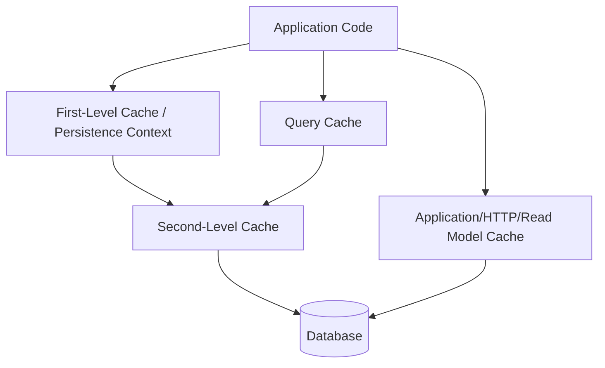

# Part 040 — JPA Caching and Consistency

> Cache bisa membuat sistem cepat.
>
> Cache juga bisa membuat sistem salah dengan sangat cepat.
>
> Di JPA/Hibernate, caching punya beberapa lapisan:
>
> - first-level cache / persistence context;
> - second-level cache;
> - query cache;
> - natural-id cache;
> - application cache;
> - HTTP/API cache;
> - read model cache.
>
> Setiap cache punya consistency model. Jika kamu tidak bisa menjelaskan kapan cache invalid, kamu belum siap menggunakannya untuk mutable business data.

Part ini membahas caching JPA/Hibernate dan consistency risk secara production-grade.

---

## 1. Core Thesis

Cache adalah duplikasi data. Duplikasi data butuh invalidation dan freshness contract.

Rule utama:

```txt
Cache read-only/reference data first.
Be very cautious caching mutable transactional entities.
Never use stale cache for command correctness.
Prefer read model/projection cache for read path.
Measure before and after.
```

Hibernate cache can improve performance, but misuse can create stale reads, memory pressure, invalidation bugs, and confusing production behavior.

---

## 2. Cache Layers



Each layer has different scope and semantics.

---

## 3. First-Level Cache

First-level cache is the persistence context identity map.

Scope:

```txt
one EntityManager / transaction-scoped context
```

Example:

```java
CaseFileEntity a = entityManager.find(CaseFileEntity.class, id);
CaseFileEntity b = entityManager.find(CaseFileEntity.class, id);

assert a == b;
```

It is always present in JPA persistence context.

It ensures identity within transaction, but can return stale state if database changed externally.

---

## 4. First-Level Cache Consistency

If entity is already managed:

```java
CaseFileEntity entity = entityManager.find(CaseFileEntity.class, id);

jdbcTemplate.update("update case_file set status='CLOSED' where id=?", id);

CaseFileEntity again = entityManager.find(CaseFileEntity.class, id);

assert again.getStatus().equals("UNDER_REVIEW"); // stale in context
```

First-level cache does not re-query automatically.

Use:

```java
entityManager.refresh(entity);
```

or:

```java
entityManager.clear();
```

or avoid mixing direct SQL and ORM in same persistence context.

---

## 5. First-Level Cache and Long Transaction

Long transaction means long-lived persistence context.

Risks:

- stale managed entities;
- memory growth;
- dirty checking cost;
- old snapshot;
- unexpected writes;
- lazy loading later;
- lock duration if writes.

Keep transaction-scoped persistence context short.

For long workflow, use durable state transitions, not extended persistence context.

---

## 6. Second-Level Cache

Second-level cache is shared across persistence contexts/session factories.

It caches entity data by ID, collection data, and sometimes natural IDs, depending configuration.

Scope:

```txt
shared across transactions and requests in same app cluster/cache provider
```

Example concept:

```java
@Cacheable
@org.hibernate.annotations.Cache(
    usage = CacheConcurrencyStrategy.READ_ONLY
)
@Entity
class CountryCodeEntity { ... }
```

Second-level cache is optional and provider/config dependent.

---

## 7. What Second-Level Cache Is Good For

Good candidates:

- read-only reference data;
- rarely changing lookup tables;
- immutable configuration data;
- small stable entities;
- natural ID lookup for stable data;
- data where stale read is acceptable and controlled.

Examples:

```txt
country codes
currency codes
static product category labels
reason code dictionary
feature flag snapshot with explicit invalidation
```

Not first candidate:

```txt
case status
account balance
officer workload
authorization membership
payment state
inventory quantity
```

---

## 8. Mutable Entity Cache Risk

Mutable entity cache requires invalidation/update strategy.

Risks:

- stale reads across nodes;
- updates outside Hibernate not invalidating cache;
- bulk/native update bypassing cache awareness;
- distributed cache delay;
- inconsistent with read replica;
- hard incident debugging.

For critical mutable business data, default answer:

```txt
Do not cache entity unless you can prove consistency requirements.
```

Use query/read model optimization instead.

---

## 9. Cache Concurrency Strategies

Hibernate supports strategies conceptually like:

- read-only;
- read-write;
- nonstrict read-write;
- transactional.

Exact behavior depends provider/cache.

High-level meaning:

| Strategy | Fit |
|---|---|
| read-only | immutable data |
| read-write | mutable data with stricter coordination |
| nonstrict read-write | mutable but stale acceptable |
| transactional | JTA/transactional cache support |

Do not choose by performance alone. Choose by consistency need and provider capability.

---

## 10. Read-Only Cache

For immutable entity:

```java
@Immutable
@Cacheable
@org.hibernate.annotations.Cache(usage = CacheConcurrencyStrategy.READ_ONLY)
@Entity
class ReasonCodeEntity { ... }
```

If data changes, you must evict/restart/reload according to process.

Read-only cache is simplest and safest.

Use for data that truly does not change during runtime or changes through controlled deployment.

---

## 11. Non-Strict Cache

Nonstrict read-write may allow stale reads for a short period.

Use only if stale read acceptable.

Example:

```txt
display label changed; stale label for seconds/minutes okay
```

Not okay for:

```txt
authorization role revoked
case already closed
balance changed
capacity count
```

Document stale tolerance.

---

## 12. Query Cache

Query cache stores query result identifiers, not usually full entity state.

If query returns entities, Hibernate may cache IDs and then load entities from second-level cache.

Enabling query cache for dynamic queries can be ineffective or harmful:

- huge number of cache keys;
- invalidation on table changes;
- stale/eviction complexity;
- memory pressure;
- low hit ratio;
- count/page queries with filters.

Use query cache sparingly for stable repeated queries over cacheable data.

---

## 13. Query Cache Anti-Pattern

Bad:

```txt
enable query cache globally for all repository searches
```

Dynamic dashboard filters:

```txt
tenant + status + keyword + sort + page
```

create many cache keys and invalidation churn.

Better:

- optimize SQL/index;
- read model;
- application cache only for explicit stable query;
- cache reference data;
- measure hit ratio.

---

## 14. Natural ID Cache

Natural ID cache maps stable natural key to entity ID.

Example:

```txt
country code "ID" -> country row id
```

Good for immutable natural keys.

Danger for mutable natural keys or tenant-scoped keys if not modeled correctly.

If business key changes, invalidation must be correct.

---

## 15. Application Cache vs ORM Cache

Application cache:

```java
@Cacheable("reasonCodes")
public List<ReasonCode> reasonCodes() { ... }
```

Pros:

- explicit method-level contract;
- easy to scope/TTL;
- can cache DTO/projection;
- decoupled from ORM entity state.

Cons:

- must manage invalidation/TTL;
- can bypass transaction state.

For many read-path optimizations, application cache of DTO/read model is clearer than second-level entity cache.

---

## 16. Cache and Command Correctness

Never use stale cache as final truth for command invariants.

Bad:

```java
if (cache.getOfficerWorkload(officerId).activeCount() < max) {
    assignCase();
}
```

This can oversubscribe.

Correct:

- database atomic update;
- lock;
- constraint;
- source table query in transaction.

Cache can be used for display/pre-check only if final DB guard exists.

---

## 17. Cache and Authorization

Authorization cache is high risk.

Stale allow can leak data or permit forbidden action.

If caching permissions:

- short TTL;
- explicit invalidation on role change;
- conservative fallback;
- versioned permission snapshot;
- audit;
- do not rely on stale cache for critical write without revalidation.

For data access query, authorization predicate should be enforced at source/read model with freshness understood.

---

## 18. Cache and Read Model

Read model itself is a kind of cache/projection.

Difference from ad hoc cache:

- stored durably;
- has source version;
- rebuild process;
- projection lag metric;
- idempotent update;
- ownership.

For complex dashboard/search, read model is often better than query cache.

---

## 19. Cache Invalidation

Classic problem:

```txt
There are only two hard things in Computer Science:
cache invalidation and naming things.
```

For each cache, answer:

1. What event invalidates it?
2. Who emits invalidation?
3. Is invalidation transactional with write?
4. What happens if invalidation message is lost?
5. Is TTL fallback present?
6. Is stale read acceptable?
7. How do we detect stale cache?
8. How do we evict manually?

If you cannot answer, do not cache critical data.

---

## 20. Updates Outside Hibernate

Second-level cache may not know about:

- direct JDBC update;
- native SQL bulk update;
- database trigger;
- another app modifying DB;
- manual DBA script;
- ETL job;
- stored procedure.

If these modify cached entity tables, cache can become stale.

Mitigations:

- evict cache after bulk/native update;
- avoid second-level cache for those entities;
- route all writes through same cache-aware layer;
- use TTL/explicit invalidation;
- operational runbook.

---

## 21. Bulk Update and Cache

JPQL/native bulk update can bypass entity lifecycle and cache coherence.

After bulk:

```java
entityManager.clear();
```

For second-level cache, evict affected regions if needed.

Concept:

```java
entityManagerFactory.getCache().evict(CaseFileEntity.class);
```

Evicting entire region can be expensive but safer.

Provider-specific APIs may offer more targeted eviction.

---

## 22. Cache Eviction API

JPA cache API concept:

```java
entityManagerFactory.getCache().evict(CaseFileEntity.class, caseId);
entityManagerFactory.getCache().evict(CaseFileEntity.class);
entityManagerFactory.getCache().evictAll();
```

Use for second-level cache if enabled.

Eviction must be part of write/bulk operation runbook.

---

## 23. Cache and Transactions

Cache updates/invalidations may happen around transaction completion depending provider.

Question:

```txt
Can other transaction see stale cache between DB commit and cache update?
```

Provider/cache strategy matters.

For critical data, avoid relying on entity cache consistency.

---

## 24. Cache and Cluster

In multi-node deployment:

```txt
Node A updates entity.
Node B has cached old entity.
```

Need distributed cache/invalidation.

Questions:

- is cache local or distributed?
- invalidation replication delay?
- network partition behavior?
- cache provider consistency?
- rolling deployment compatibility?
- serialization compatibility?

Local second-level cache for mutable data in cluster is especially risky.

---

## 25. Cache and Read Replica

If app reads from replica and cache:

- replica lag can populate stale cache;
- primary update may not invalidate replica-read cache correctly;
- read-your-writes can fail.

For command result/read-your-writes, query primary/source or version-aware read model.

---

## 26. Cache and TTL

TTL limits stale duration.

But TTL is not correctness guarantee.

Good for:

- labels;
- public config;
- non-critical derived views;
- expensive rarely changing metadata.

Bad as sole protection for:

- permissions;
- financial state;
- inventory;
- case status mutation guard.

TTL is mitigation, not invariant enforcement.

---

## 27. Cache Stampede

When cache entry expires, many requests recompute simultaneously.

Mitigation:

- request coalescing/single-flight;
- early refresh;
- jittered TTL;
- background refresh;
- small stale-while-revalidate window for safe data;
- rate limits.

For ORM second-level cache, provider behavior differs. For application cache, implement explicitly if high traffic.

---

## 28. Negative Caching

Caching "not found" can be useful for stable reference lookups.

Danger:

- newly created entity remains invisible until TTL;
- authorization changes;
- user-facing creation/read-after-write.

Use short TTL and scope carefully.

Do not negative-cache mutable aggregate not found for command paths.

---

## 29. Cache Key Design

Application cache key must include:

- tenant;
- user scope/role if data scoped;
- locale if localized;
- version if available;
- filter/sort/page for query cache;
- API version if response cached.

Missing scope in key can leak data.

Example bad:

```txt
case-dashboard:status=OPEN
```

Good:

```txt
case-dashboard:tenant=T1:userScopeHash=...:status=OPEN:sort=UPDATED_DESC:cursor=...
```

High-cardinality keys may reduce cache effectiveness.

---

## 30. Caching DTO Instead of Entity

For read endpoint:

```java
CaseDetailView view = cache.get("case-detail:" + tenantId + ":" + caseId);
```

Pros:

- no managed entity/proxy;
- stable API/read shape;
- less ORM cache complexity;
- can include source version;
- easier redaction if scoped.

Cons:

- must invalidate on source change;
- role-specific DTO key;
- potential stale view.

For read-heavy stable details, DTO cache can be practical.

---

## 31. Versioned Cache Key

If source version known:

```txt
case-detail:{caseId}:v{version}
```

Then update creates new key, old key can expire.

Useful when client/request knows expected version.

For latest view, you still need mapping from caseId -> latest version or source query.

Read model with source version often simpler.

---

## 32. Cache Aside Pattern

```java
CaseDetailView view = cache.get(key);

if (view == null) {
    view = queryDatabase(...);
    cache.put(key, view, ttl);
}

return view;
```

Risks:

- stale after update unless evicted;
- stampede;
- caching errors if not careful;
- transaction visibility issues if called inside transaction.

Do not use cache-aside for command validation unless final DB guard exists.

---

## 33. Write-Through / Write-Behind

Write-through updates cache with DB write.

Write-behind writes cache then DB async or delayed.

For OLTP business data, write-behind is dangerous unless system explicitly designed for it.

JPA/Hibernate second-level cache handles some write-through/invalidation depending strategy, but not magic for all writes.

---

## 34. Caching Reference Data

Reference data cache example:

```java
@Cacheable(cacheNames = "reasonCodes")
public List<ReasonCodeDto> getReasonCodes(Locale locale) {
    return reasonCodeQuery.findActive(locale);
}
```

Invalidation:

- deployment;
- admin update event;
- TTL;
- manual evict endpoint.

Good candidate because stale label often acceptable briefly.

---

## 35. Caching Lookup by Natural Key

```java
Optional<ReasonCode> findByCode(String code);
```

Cache key:

```txt
reason-code:{code}
```

If reason codes immutable, good.

If admin can edit/deactivate, include TTL or event invalidation.

---

## 36. Caching Mutable Aggregate Detail

If caching case detail:

- include tenant/user scope;
- include version;
- evict on case updated event;
- read-through from source/read model;
- do not use for command validation;
- measure hit ratio;
- provide manual invalidation.

Often easier to optimize query/read model first.

---

## 37. Cache and Outbox Events

Outbox events can drive cache invalidation.

Command transaction:

```txt
update case
append CaseUpdated event
commit
```

Consumer:

```txt
CaseUpdated -> evict case detail cache / update read model
```

If invalidation consumer lags, stale cache persists.

Use TTL fallback and lag metrics.

---

## 38. Cache Invalidation Ordering

If invalidation happens before commit, cache may be refilled with old DB state.

Better:

- outbox event after commit/published asynchronously;
- after-commit callback for non-durable cache eviction;
- write-through within transaction only if cache participates correctly.

For critical integration, outbox. For local cache eviction, after-commit can be okay but not durable.

---

## 39. After-Commit Cache Eviction

Framework transaction synchronization can evict after successful commit.

Good for local application cache.

Risk:

- process crashes after commit before eviction;
- other nodes not invalidated unless distributed;
- not durable.

Use with TTL or event-based invalidation for distributed systems.

---

## 40. Cache and Stale Read Incident

Typical incident:

1. Case status updated to CLOSED.
2. Dashboard/detail cache still says UNDER_REVIEW.
3. User attempts approve from stale screen.
4. Command must validate source DB and reject.
5. UI reloads current state.

If command used cached status, bug.

Thus stale read must not break source-of-truth write.

---

## 41. Measuring Cache Value

Before adding cache, measure:

- query latency;
- DB CPU/IO;
- query frequency;
- cardinality;
- hit ratio expectation;
- stale tolerance;
- invalidation cost;
- memory cost;
- complexity.

After adding cache, measure:

- hit ratio;
- latency improvement;
- eviction rate;
- stale incidents;
- cache memory;
- serialization cost;
- stampede events.

Cache with low hit ratio and high invalidation cost is net negative.

---

## 42. Cache Metrics

Metrics:

```txt
cache.hit.count{cache}
cache.miss.count{cache}
cache.eviction.count{cache, reason}
cache.load.duration{cache}
cache.size{cache}
cache.stale_detected.count{cache}
cache.invalidation.lag{cache}
hibernate.second_level_cache.hit
hibernate.second_level_cache.miss
hibernate.query_cache.hit
hibernate.query_cache.miss
```

Monitor per cache region/name.

---

## 43. Cache Debugging

When stale data suspected:

- identify source of truth row/version;
- identify cache key/region;
- check cache entry version/timestamp;
- check invalidation event/outbox lag;
- check whether update path bypassed ORM/cache;
- check multi-node propagation;
- evict manually if needed;
- add test/runbook.

Without version/timestamp in cached value, debugging is harder.

---

## 44. Cache Value Should Include Version

DTO cache:

```java
public record CachedCaseDetail(
        CaseDetailView view,
        long sourceVersion,
        Instant cachedAt
) {}
```

This helps:

- stale debugging;
- conditional refresh;
- client read-your-writes;
- metrics.

---

## 45. Cache and Tests

Test:

- cache hit after first read;
- cache evicted after update;
- stale cache not used for command validation;
- tenant/user scope included in key;
- negative cache expires;
- duplicate invalidation event harmless;
- bulk update evicts/invalidates region;
- cache disabled still works.

---

## 46. Test: Command Ignores Stale Cache

```java
@Test
void approveValidatesSourceEvenIfDetailCacheStale() {
    CaseId caseId = fixture.underReviewCase();

    caseDetailCache.put(caseId, detailWithStatus(UNDER_REVIEW, version(7)));

    closeCaseDirectlyInSource(caseId); // status CLOSED, version 8

    assertThatThrownBy(() ->
            approveUseCase.approve(command(caseId, expectedVersion(7)))
    ).isInstanceOf(ConcurrentCaseModification.class);
}
```

This proves cache cannot corrupt command.

---

## 47. Test: Eviction After Update

```java
@Test
void caseDetailCacheEvictedAfterCaseUpdated() {
    caseDetailQuery.get(caseId); // loads cache

    approveUseCase.approve(command);

    await().untilAsserted(() ->
            assertThat(cache.contains(caseDetailKey(caseId))).isFalse()
    );
}
```

If invalidation async, use eventual assertion and check outbox/invalidation consumer.

---

## 48. Test: Tenant Cache Key

```java
@Test
void cacheKeyIncludesTenant() {
    CaseId caseId = sameCaseIdInTwoTenants();

    CaseDetailView a = queryAsTenant(tenantA, caseId);
    CaseDetailView b = queryAsTenant(tenantB, caseId);

    assertThat(a.tenantId()).isEqualTo(tenantA);
    assertThat(b.tenantId()).isEqualTo(tenantB);
}
```

A cache key bug can be data leak.

---

## 49. Hibernate Cache Testing

If second-level cache enabled, test:

- second load hits cache for reference entity;
- update evicts/updates cache;
- bulk update evicts region or cache disabled;
- cache region configuration applied;
- query cache not used for dynamic unsafe queries.

Provider-specific tests may be needed.

---

## 50. When to Disable Cache

Disable/avoid second-level cache for:

- highly mutable aggregates;
- financial balances;
- authorization decisions;
- workflow status used for command;
- data updated by multiple systems;
- large entities with low reuse;
- dynamic dashboard queries;
- entities updated by bulk/native SQL often.

Use explicit projection/read model instead.

---

## 51. Safe Cache Adoption Path

1. Optimize query/index first.
2. Add DTO projection/read model if shape mismatch.
3. Cache read-only reference data.
4. Add application cache for specific stable DTO if needed.
5. Add second-level cache only for carefully selected entities.
6. Add invalidation/TTL/metrics/tests.
7. Document freshness contract.
8. Add runbook/manual eviction.

Do not start by enabling global cache.

---

## 52. Cache Review Checklist

- [ ] What data is cached?
- [ ] Is it mutable?
- [ ] Is stale read acceptable?
- [ ] Who owns invalidation?
- [ ] Does key include tenant/user scope?
- [ ] Is TTL defined?
- [ ] Is source version stored?
- [ ] Are updates outside Hibernate possible?
- [ ] Are bulk updates evicting cache?
- [ ] Is cache local or distributed?
- [ ] Are hit ratio and stale incidents measured?
- [ ] Is cache used for command validation? If yes, why safe?
- [ ] Is manual eviction possible?
- [ ] Does system work with cache disabled?
- [ ] Are tests covering invalidation and scope?

---

## 53. Anti-Pattern: Cache as Correctness Guard

Cache can accelerate reads, not enforce invariants.

---

## 54. Anti-Pattern: Enable Query Cache Globally

Dynamic query cache often hurts more than helps.

---

## 55. Anti-Pattern: Cache Mutable Entity Updated by SQL Scripts

Second-level cache will be stale unless evicted.

---

## 56. Anti-Pattern: Cache Key Without Tenant/User Scope

Data leak risk.

---

## 57. Anti-Pattern: No Cache Metrics

If you cannot observe hit/miss/stale, you cannot operate it.

---

## 58. Anti-Pattern: No Manual Eviction Runbook

Stale cache production incident needs operational escape hatch.

---

## 59. Mini Lab

Evaluate caching for:

```txt
Case detail endpoint:
- 80% reads, 20% writes;
- detail includes officer name, status, documents summary;
- case status changes frequently during workflow;
- tenant scoped;
- stale dashboard okay for 5 seconds;
- command approval must be strongly correct.
```

Questions:

1. Would you use second-level entity cache?
2. Would you use DTO cache?
3. Would you use read model?
4. What is cache key?
5. What invalidates cache?
6. What TTL?
7. What version is stored?
8. What happens if invalidation event lags?
9. How does command validate source?
10. What metrics and tests are required?

---

## 60. Summary

Caching is consistency design.

You must master:

- first-level cache;
- persistence context stale behavior;
- second-level cache;
- query cache;
- natural ID cache;
- cache concurrency strategies;
- read-only/reference cache;
- mutable entity cache risks;
- query cache pitfalls;
- application DTO cache;
- cache keys and tenant scope;
- invalidation;
- bulk update eviction;
- distributed cache issues;
- read replica interaction;
- TTL limits;
- cache stampede;
- outbox-driven invalidation;
- metrics/debugging;
- tests proving cache does not corrupt commands.

Part berikutnya membahas **Hibernate Performance Tuning**: batch fetch, JDBC batch, insert ordering, update ordering, read-only transaction, stateless session, and how to tune ORM without hiding bad architecture.

---

## 61. References

- Hibernate ORM User Guide: https://docs.hibernate.org/stable/orm/userguide/html_single/
- Jakarta Persistence Specification: https://jakarta.ee/specifications/persistence/3.2/jakarta-persistence-spec-3.2
- Spring Framework Cache Abstraction: https://docs.spring.io/spring-framework/reference/integration/cache.html
- Spring Data JPA Reference: https://docs.spring.io/spring-data/jpa/reference/
