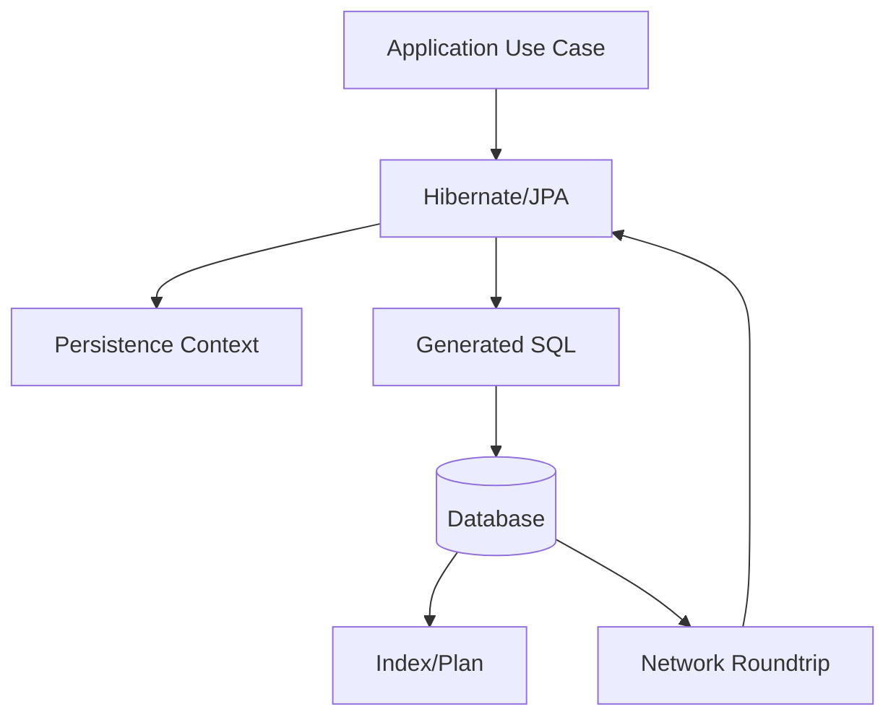

# Part 041 — Hibernate Performance Tuning

> Hibernate performance tuning bukan tentang menambahkan annotation ajaib.
>
> Tuning yang benar dimulai dari pertanyaan:
>
> - Apakah query shape sudah benar?
> - Apakah endpoint memakai entity padahal butuh DTO?
> - Apakah ada N+1?
> - Apakah transaction terlalu panjang?
> - Apakah persistence context terlalu besar?
> - Apakah batch insert/update benar-benar batching?
> - Apakah index mendukung query?
> - Apakah ORM dipakai untuk workload yang cocok?
>
> Kalau desain dasar salah, tuning hanya menunda incident.

Part ini membahas tuning Hibernate/JPA secara production-grade.

---

## 1. Core Thesis

Hibernate performance tuning harus mengikuti urutan:

```txt
1. Fix data access shape.
2. Fix query and index.
3. Fix transaction boundary.
4. Fix fetch strategy.
5. Fix batching.
6. Tune provider settings.
7. Measure again.
```

Jangan mulai dari config sebelum memahami workload.

Performance problem paling sering:

- N+1;
- over-fetching entity graph;
- unbounded result;
- missing index;
- slow count query;
- huge persistence context;
- dirty checking cost;
- no JDBC batching;
- wrong ID generation strategy;
- collection replacement;
- full graph merge;
- cache misuse.

---

## 2. Performance Tuning Mental Model

Hibernate sits between object model and SQL.



Tuning can target:

- object graph;
- persistence context size;
- SQL count;
- SQL shape;
- batching;
- fetch strategy;
- indexes;
- connection/transaction;
- cache.

Do not tune one layer blindly.

---

## 3. Baseline Before Tuning

Before changing settings, collect:

- endpoint p50/p95/p99;
- SQL count per request;
- slow SQL list;
- query plans;
- rows returned/scanned;
- entity load count;
- collection fetch count;
- flush count;
- entity update/insert count;
- transaction duration;
- connection pool wait;
- DB CPU/IO;
- GC/memory pressure.

Without baseline, tuning is guesswork.

---

## 4. First Rule: Use DTO Projection for Read Lists

Bad:

```java
List<CaseFileEntity> entities = caseRepository.findOpenCases(page);

return entities.stream()
        .map(caseMapper::toDashboardRow)
        .toList();
```

If mapper accesses associations, N+1.

Better:

```java
List<CaseDashboardRow> rows = entityManager.createQuery("""
    select new com.example.CaseDashboardRow(
        c.id,
        c.caseNumber,
        c.status,
        o.displayName,
        c.updatedAt
    )
    from CaseFileEntity c
    left join c.assignedOfficer o
    where c.tenantId = :tenantId
      and c.status = :status
    order by c.updatedAt desc, c.id desc
    """, CaseDashboardRow.class)
    .setParameter("tenantId", tenantId)
    .setParameter("status", status)
    .setMaxResults(limit)
    .getResultList();
```

No amount of batch fetch beats a clean projection for dashboard/list.

---

## 5. Second Rule: Bound Everything

Unbounded query:

```java
List<CaseFileEntity> all = query.getResultList();
```

Danger.

Use:

- page;
- slice;
- keyset cursor;
- chunk;
- stream with resource contract;
- async export job.

Even projection can kill memory if unbounded.

---

## 6. Third Rule: Query Count Budget

Define budget:

```txt
GET /cases/dashboard page 50:
  <= 2 SQL statements

GET /cases/{id}/detail:
  <= 5 SQL statements

POST /cases/{id}/approve:
  expected <= 5 SQL statements
```

Add tests for critical paths.

Tuning without query count budget lets N+1 regressions return silently.

---

## 7. Batch Fetch

Hibernate batch fetch reduces lazy N+1 by loading multiple associations in one query.

Concept:

```txt
Instead of:
  select officer where id = ?
  repeated 50 times

Use:
  select officer where id in (?, ?, ..., ?)
```

Use cases:

- many-to-one references;
- moderate entity graph traversal;
- internal command/query where DTO projection not feasible.

But batch fetch still relies on lazy access. It is not as explicit as projection.

---

## 8. Batch Fetch Configuration

Provider-specific configuration concept:

```properties
hibernate.default_batch_fetch_size=32
```

or association-level annotation:

```java
@BatchSize(size = 32)
@ManyToOne(fetch = FetchType.LAZY)
private OfficerEntity assignedOfficer;
```

For collections:

```java
@BatchSize(size = 32)
@OneToMany(mappedBy = "caseFile")
private List<CaseAssignmentEntity> assignments;
```

Choose batch size empirically:

- too small: many queries;
- too large: huge `IN` lists;
- DB parameter limits;
- memory;
- cache behavior.

Common starting values: 16, 32, 64. Measure.

---

## 9. Batch Fetch Is Not Always Better

Batch fetch can still be bad if:

- association not needed for most rows;
- collection large;
- many associations batch at once;
- IN list causes poor plan;
- memory pressure;
- read path should be projection.

Example dashboard should not rely on lazy batch fetch to get officer names. Use DTO join.

---

## 10. Subselect Fetch

Hibernate subselect fetch can load collections for parent result set in one query.

Concept:

```sql
select *
from case_assignment
where case_id in (
    select id
    from case_file
    where status = 'OPEN'
)
```

Good for:

- loading one collection for a bounded parent result;
- avoiding N+1.

Cautions:

- provider-specific;
- can fetch more rows than expected;
- sensitive to parent query;
- not for unbounded parent set;
- can surprise in complex transactions.

Use only with query count tests.

---

## 11. Fetch Join

Fetch join is explicit query-level optimization.

```java
select distinct c
from CaseFileEntity c
left join fetch c.assignments
where c.id = :id
```

Good for:

- single aggregate;
- bounded association;
- command needing child data.

Avoid:

- multiple collection fetch joins;
- pageable list with collection fetch join;
- huge child collection;
- read-only dashboard where DTO is better.

---

## 12. Entity Graph

Entity graph gives use-case-specific fetch plan.

```java
EntityGraph<CaseFileEntity> graph =
        entityManager.createEntityGraph(CaseFileEntity.class);
graph.addAttributeNodes("assignedOfficer");
graph.addSubgraph("assignments");

CaseFileEntity entity = entityManager.find(
        CaseFileEntity.class,
        id,
        Map.of("jakarta.persistence.fetchgraph", graph)
);
```

Good for repository load methods:

```java
loadForAssignment(...)
loadForClosure(...)
```

Test generated SQL.

---

## 13. JDBC Batch Inserts/Updates

Hibernate can batch DML statements.

Conceptual setting:

```properties
hibernate.jdbc.batch_size=50
```

Benefits:

- fewer network round trips;
- better insert/update throughput.

But batching only works if:

- statements are same SQL shape;
- ID generation strategy allows batching;
- flush happens after many statements;
- no interleaved queries forcing flush;
- order settings help group statements;
- persistence context not cleared too early/late.

---

## 14. ID Generation and Batching

`GenerationType.IDENTITY` often requires immediate insert to obtain generated ID, which can reduce batching.

Sequence/table/application-generated IDs can batch better.

For high-volume inserts, consider:

- application-generated UUID/ULID-like ID;
- sequence with allocation size;
- batch-friendly strategy;
- JDBC batch for pure bulk.

Do not choose ID strategy without considering insert workload.

---

## 15. Insert Ordering

Hibernate can order inserts to improve batching.

Conceptual setting:

```properties
hibernate.order_inserts=true
```

It groups inserts by entity type/SQL.

Benefit:

```txt
insert case_audit ...
insert case_audit ...
insert case_audit ...
```

instead of interleaving different entity inserts.

Caution:

- flush order changes;
- FK dependencies still considered;
- do not rely on insertion order for business semantics;
- test constraints.

---

## 16. Update Ordering

Conceptual setting:

```properties
hibernate.order_updates=true
```

Can improve batching and reduce deadlock probability by ordering updates by entity type/primary key.

Useful for batch updates.

Caution:

- not a substitute for explicit lock ordering in critical sections;
- generated SQL shapes must match;
- dynamic update may reduce batching because SQL shapes differ.

---

## 17. Dynamic Update vs Batching Trade-Off

`@DynamicUpdate` generates SQL only for dirty columns.

Pros:

- less column write;
- avoid updating unchanged fields.

Cons:

- many SQL shapes;
- less JDBC batching;
- statement cache fragmentation.

For high-volume batch updates, stable SQL shape may batch better.

For sparse updates on wide tables, dynamic update may help.

Measure.

---

## 18. Batch Insert Loop

```java
@Transactional
public void insertAuditRows(List<AuditEntity> rows) {
    for (int i = 0; i < rows.size(); i++) {
        entityManager.persist(rows.get(i));

        if (i > 0 && i % 100 == 0) {
            entityManager.flush();
            entityManager.clear();
        }
    }
}
```

This controls persistence context size.

But if `AuditEntity` is simple append-only, JDBC batch DAO may be even better.

---

## 19. Batch Update Loop

```java
@Transactional
public void expireCases(List<UUID> ids, Instant now) {
    int count = 0;

    for (UUID id : ids) {
        CaseFileEntity entity = entityManager.find(CaseFileEntity.class, id);
        entity.expire(now);

        if (++count % 100 == 0) {
            entityManager.flush();
            entityManager.clear();
        }
    }
}
```

Works for moderate batch needing domain logic.

For massive batch, prefer bulk SQL/chunked DAO.

---

## 20. Bulk JPQL Update

```java
int updated = entityManager.createQuery("""
    update CaseFileEntity c
    set c.status = :expired,
        c.updatedAt = :now,
        c.version = c.version + 1
    where c.status = :open
      and c.expiresAt < :now
    """)
    .setParameter("expired", CaseStatus.EXPIRED)
    .setParameter("open", CaseStatus.OPEN)
    .setParameter("now", now)
    .executeUpdate();
```

Pros:

- single SQL;
- fast.

Cons:

- bypasses entity lifecycle/callbacks;
- persistence context stale;
- no per-entity domain method;
- audit/outbox per row not automatic;
- version handling must be explicit.

Use for technical/bulk maintenance with clear semantics.

---

## 21. Stateless Session

Hibernate has provider-specific stateless session concept.

Use case:

- high-volume batch insert/update;
- no first-level cache;
- no dirty checking;
- less memory.

Trade-offs:

- no persistence context identity;
- no cascades/lazy loading;
- lower-level API;
- provider-specific.

For pure batch ETL/backfill, stateless session or JDBC/jOOQ may be better than normal EntityManager.

---

## 22. Read-Only Transaction

Read-only transaction can:

- communicate intent;
- let framework/provider optimize;
- avoid accidental writes in some setups;
- reduce flush/dirty checking in some configurations.

But safest read optimization is DTO projection.

Use read-only transaction for multi-query detail view requiring consistent snapshot.

Do not rely on it alone to prevent entity mutation.

---

## 23. Read-Only Query Hint

Provider-specific hint:

```java
query.setHint("org.hibernate.readOnly", true);
```

Useful for large entity read where you will not mutate.

But if you need only DTO fields, use projection.

Provider hints are tuning tools, not architecture.

---

## 24. Fetch Size

Fetch size controls how many rows JDBC fetches per round trip for a result set.

Concept:

```java
query.setHint("org.hibernate.fetchSize", 1000);
```

or JDBC statement fetch size.

Useful for large streaming/chunk queries.

Not useful for N+1 query count problem.

Do not confuse:

```txt
fetch size != fetch join != batch fetch
```

---

## 25. Streaming Large Results

If using stream:

```java
try (Stream<CaseExportRow> stream = query.getResultStream()) {
    stream.forEach(writer::write);
}
```

Need:

- transaction/session open;
- stream closed;
- fetch size;
- no huge persistence context if entity stream;
- avoid slow external writes holding DB resources too long.

Often chunked keyset read is more robust:

```java
while (true) {
    List<Row> rows = query.readAfter(cursor, 1000);
    if (rows.isEmpty()) break;
    writer.write(rows);
    cursor = rows.getLast().cursor();
}
```

---

## 26. Persistence Context Size Tuning

Symptoms:

- slow flush;
- memory high;
- GC pressure;
- OOM in batch;
- dirty checking slow.

Controls:

- smaller transaction chunks;
- DTO projection;
- flush/clear;
- stateless session;
- bulk SQL;
- avoid entity result for large read;
- avoid caching huge graph in session.

---

## 27. Avoid Full Graph Merge

Bad:

```java
entityManager.merge(detachedCaseGraph);
```

Can:

- load graph;
- dirty many entities;
- cascade merge;
- overwrite stale fields;
- produce many SQL statements.

Better:

```txt
load managed aggregate -> apply explicit command changes
```

This reduces dirty state and SQL.

---

## 28. Collection Update Tuning

Collection replacement can cause:

- delete all children;
- insert all children;
- update order columns;
- orphan removal;
- many SQL statements.

Use delta methods:

```java
addLine(...)
removeLine(...)
changeQuantity(...)
```

For large child collection, use DAO operations.

---

## 29. Index Tuning Still Matters

ORM tuning cannot fix missing index.

If query:

```sql
where tenant_id = ?
  and status = ?
order by updated_at desc, id desc
limit ?
```

Index:

```sql
create index ix_case_tenant_status_updated
on case_file(tenant_id, status, updated_at desc, id desc);
```

Review generated SQL and actual plan.

---

## 30. Count Query Tuning

Pagination count can dominate.

Options:

- `Slice` with `limit + 1`;
- optimized count query;
- approximate count;
- precomputed count in read model;
- count only when needed.

Do not blindly use `Page` if count is expensive.

---

## 31. Query Timeout

Set timeout for interactive queries.

```java
query.setHint("jakarta.persistence.query.timeout", 1000);
```

Provider/DB behavior varies. Test it.

Timeout protects system from unbounded queries, but root cause still needs index/query fix.

---

## 32. Connection Pool Is Not Hibernate Tuning

If connection pool exhausted, don't only increase pool.

Ask:

- are transactions too long?
- are queries slow?
- is there N+1?
- are external calls inside transaction?
- is export holding connection?
- are locks blocking?
- is pool size aligned with DB capacity?

Pool tuning without query/transaction tuning can overload DB.

---

## 33. Statement Cache

Stable SQL shapes can benefit statement cache.

Dynamic update and highly dynamic queries create many SQL shapes.

Trade-off:

- dynamic SQL can improve plans;
- too many shapes can reduce statement reuse.

Measure and use for critical paths.

---

## 34. Second-Level Cache as Performance Tool

Cache can help reference data but is risky for mutable entities.

Before enabling:

- is data immutable?
- hit ratio expected?
- invalidation safe?
- cluster behavior known?
- bulk updates evict cache?
- stale read acceptable?

Do not use second-level cache to hide bad query shape.

---

## 35. Query Cache Usually Not First Fix

For dynamic dashboard/search, query cache often has low hit ratio and high invalidation churn.

Prefer:

- proper index;
- DTO projection;
- read model;
- application cache for specific stable data.

---

## 36. SQL Logging in Tuning

In dev/test:

- enable SQL logs;
- include bind values only in safe environment;
- inspect statement count;
- inspect generated SQL.

In production:

- use sampling/tracing;
- avoid sensitive bind logging;
- use slow query logs;
- use metrics.

---

## 37. Hibernate Statistics

Useful counters:

- entity load count;
- entity fetch count;
- collection fetch count;
- query execution count;
- flush count;
- second-level cache hit/miss;
- prepared statement count.

Use in performance tests.

Do not enable costly statistics blindly in production unless acceptable.

---

## 38. Performance Test Data Volume

A query fast with 100 rows may fail with 10 million.

Use realistic distributions:

- tenant size;
- status cardinality;
- skewed hot tenants;
- many child rows;
- old archived data;
- realistic page sizes;
- realistic keyword selectivity.

Performance tuning without representative data misleads.

---

## 39. Explain Plan Review

For critical generated SQL:

1. capture SQL;
2. run explain/analyze in staging-like DB;
3. check index usage;
4. check rows scanned;
5. check sort spill;
6. check join order;
7. check count query;
8. check lock behavior.

Hibernate does not remove need for database plan literacy.

---

## 40. Tuning Workflow

```txt
1. Identify slow endpoint/job.
2. Capture SQL count and slow SQL.
3. Classify: N+1, slow single query, flush issue, batch issue, lock issue.
4. Fix shape: projection/fetch plan/chunk.
5. Add/adjust index.
6. Enable batching if write-heavy.
7. Add query count/performance smoke test.
8. Add metrics/alerts.
9. Re-measure.
```

---

## 41. Example: Dashboard Slow

Symptom:

```txt
GET /cases/dashboard p95 = 4s
SQL count = 101 for page 50
```

Cause:

- entity list + lazy officer + lazy counts.

Fix:

- DTO projection with join for officer;
- precomputed counts in read model or batch count query;
- index on tenant/status/updated;
- query count test <= 3.

Not:

```txt
increase connection pool
enable second-level cache for officer
```

as first fix.

---

## 42. Example: Batch Insert Slow

Symptom:

```txt
insert 100k audit rows takes too long
```

Check:

- `hibernate.jdbc.batch_size`;
- ID generation strategy;
- flush/clear interval;
- insert ordering;
- statement shape;
- transaction chunk size;
- index overhead;
- whether JDBC batch DAO better.

Often solution:

```txt
JDBC batch in chunks of 500-1000 with stable IDs
```

instead of entity persist for each row.

---

## 43. Example: Update Command Emits Too Many SQLs

Symptom:

```txt
Approve case emits 40 SQL statements.
```

Check:

- mapper touches lazy associations;
- entity callback updates children;
- cascade merge graph;
- audit collection mapped as child;
- fetch graph too broad;
- `toString` logging lazy collection;
- multiple flushes.

Fix load/mutation scope.

---

## 44. Example: Deep Page Slow

Offset:

```sql
limit 50 offset 500000
```

slow.

Fix:

- keyset pagination;
- cursor token;
- read model;
- search index;
- async export for deep traversal.

Do not try to cache every offset page.

---

## 45. Performance Review Checklist

- [ ] Endpoint uses projection when read-only list.
- [ ] Result bounded.
- [ ] Query count budget exists.
- [ ] No N+1 in mapper/serialization.
- [ ] Fetch joins are bounded and not paginated collections.
- [ ] Batch fetch used only where appropriate.
- [ ] JDBC batching enabled/tested for write-heavy path.
- [ ] ID strategy compatible with batching.
- [ ] Flush/clear used for large batch.
- [ ] Bulk update handles version/audit/outbox implications.
- [ ] Index supports generated SQL.
- [ ] Count query reviewed.
- [ ] Transaction duration measured.
- [ ] Connection pool wait monitored.
- [ ] Cache not used as first fix.
- [ ] Performance test uses realistic data.

---

## 46. Anti-Pattern: Tuning Without SQL Visibility

If you do not know generated SQL, you are not tuning. You are guessing.

---

## 47. Anti-Pattern: Increase Pool to Fix Slow Query

Can overload DB further.

Fix query/transaction first.

---

## 48. Anti-Pattern: Enable Cache Before Fixing N+1

Cache hides symptoms and adds consistency risk.

---

## 49. Anti-Pattern: Entity Graph for Dashboard

Projection/read model usually better.

---

## 50. Anti-Pattern: Huge Transaction Batch

Chunk and flush/clear or use JDBC.

---

## 51. Anti-Pattern: Count Everything Always

Use slice/keyset/approx/read model.

---

## 52. Mini Lab

Tune this endpoint:

```txt
GET /cases/dashboard?page=1&status=OPEN
Current:
- repository returns CaseFileEntity page
- mapper accesses assignedOfficer.name
- mapper calls documents.size()
- offset pagination
- Page<T> count query
- no query count test
- p95 2.8s at 50 rows
```

Tasks:

1. Identify likely SQL pattern.
2. Design DTO projection.
3. Decide how to compute document count.
4. Decide Page vs Slice.
5. Propose indexes.
6. Define query count budget.
7. Add tests.
8. Decide if read model needed.
9. Define metrics.
10. Explain why second-level cache is not first fix.

---

## 53. Summary

Hibernate performance tuning is not random config.

You must master:

- baseline measurement;
- query count budget;
- DTO projection;
- fetch join/entity graph;
- batch fetch;
- subselect fetch;
- JDBC batch;
- insert/update ordering;
- ID generation impact;
- flush/clear;
- bulk JPQL update trade-offs;
- stateless session;
- read-only transaction/query hints;
- fetch size vs N+1;
- persistence context size;
- full graph merge risk;
- collection update tuning;
- index and explain plan;
- count query cost;
- connection pool diagnosis;
- cache caution;
- realistic performance tests.

Part berikutnya membahas **ORM Failure Modes**: cartesian explosion, hidden query, detached entity confusion, cascade disaster, lazy exception, stale context, merge overwrite, and other production-grade ORM traps.

---

## 54. References

- Hibernate ORM User Guide: https://docs.hibernate.org/stable/orm/userguide/html_single/
- Jakarta Persistence Specification: https://jakarta.ee/specifications/persistence/3.2/jakarta-persistence-spec-3.2
- Spring Data JPA Reference: https://docs.spring.io/spring-data/jpa/reference/
- Spring Framework Transaction Management: https://docs.spring.io/spring-framework/reference/data-access/transaction.html
- PostgreSQL Indexes: https://www.postgresql.org/docs/current/indexes.html
