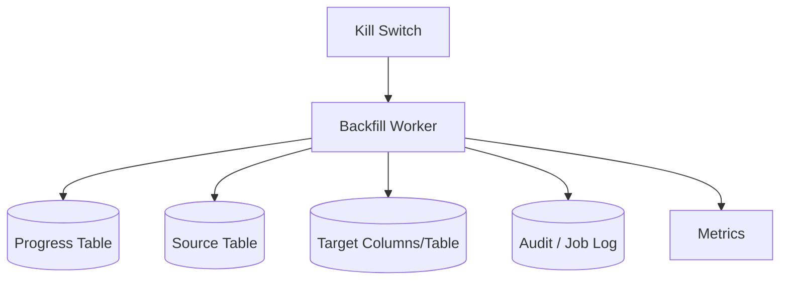

# Part 058 — Data Backfill and Repair Job

> Backfill dan repair job adalah operasi production yang sangat berbahaya jika dianggap sebagai script sekali jalan.
>
> Script seperti ini:
>
> ```sql
> update huge_table set new_col = ...
> ```
>
> bisa menyebabkan:
>
> - table lock;
> - WAL/binlog explosion;
> - replication lag;
> - connection pool starvation;
> - transaction rollback besar;
> - wrong data at scale;
> - no resume;
> - no audit;
> - no kill switch;
> - no visibility.
>
> Backfill production harus diperlakukan seperti data pipeline kecil yang aman, idempotent, resumable, throttled, observable, dan auditable.

Part ini membahas desain backfill dan repair job production-grade.

---

## 1. Core Thesis

Backfill/repair job yang baik memiliki properti:

```txt
bounded,
chunked,
idempotent,
resumable,
observable,
throttled,
auditable,
retry-safe,
cancelable,
and validated.
```

Backfill bukan hanya SQL. Backfill adalah operasi data dengan risiko bisnis.

---

## 2. Backfill vs Repair

### Backfill

Mengisi data baru berdasarkan data lama.

Example:

```txt
priority column added -> fill existing rows with NORMAL
```

### Repair

Memperbaiki data yang salah/corrupt.

Example:

```txt
case_status mismatch between old and new column
```

Backfill biasanya deterministic. Repair sering butuh audit, approval, dan domain reasoning lebih kuat.

---

## 3. When Not to Use One Big SQL

One big update may be okay for tiny table.

Not okay when:

- table large;
- update touches many rows;
- transaction log huge;
- locks long;
- replication lag sensitive;
- partial failure unacceptable;
- business logic per row;
- audit needed;
- operation may need pause/resume.

Production default for large data:

```txt
chunked job
```

---

## 4. Backfill Architecture



Worker loops:

```txt
load progress
read chunk
compute update
write idempotently
save progress
emit metrics
sleep/throttle
repeat
```

---

## 5. Progress Table

```sql
create table data_job_progress (
    job_name text primary key,
    status text not null,
    cursor_value text,
    rows_scanned bigint not null default 0,
    rows_updated bigint not null default 0,
    rows_failed bigint not null default 0,
    last_error text,
    started_at timestamp not null,
    updated_at timestamp not null,
    completed_at timestamp
);
```

Status:

```txt
READY
RUNNING
PAUSED
COMPLETED
FAILED
CANCELLED
```

Keep progress durable.

---

## 6. Job Run Table

For audit:

```sql
create table data_job_run (
    run_id uuid primary key,
    job_name text not null,
    app_version text not null,
    parameters jsonb not null,
    dry_run boolean not null,
    started_by text not null,
    started_at timestamp not null,
    completed_at timestamp,
    status text not null,
    rows_scanned bigint not null default 0,
    rows_updated bigint not null default 0,
    rows_failed bigint not null default 0
);
```

This is important for regulated/careful environments.

---

## 7. Cursor Strategy

Good cursor:

- primary key;
- monotonically increasing ID/sequence;
- `(created_at, id)`;
- stable sort key.

Avoid offset:

```sql
limit 1000 offset 1000000
```

Offset gets slower and can skip/duplicate under changes.

Cursor example:

```sql
where id > :last_id
order by id
limit :chunk_size
```

For UUID random IDs, ordering still stable but locality may be poor. You can use created_at + id if indexed.

---

## 8. Chunk Read

```sql
select id, old_status, case_status
from case_file
where id > :last_id
order by id
limit :chunk_size;
```

Chunk must be bounded.

Index should support cursor.

If filtering only rows needing work:

```sql
where case_status is null
  and id > :last_id
```

Be careful: if cursor advances past rows that later become eligible, you may miss them. Usually okay if backfill eligibility is stable after dual write, but validate.

---

## 9. Chunk Transaction Boundary

Pattern:

```txt
transaction:
  lock progress row
  read next chunk or use passed chunk
  update target rows
  save progress cursor/count
commit
sleep/throttle
```

Keep each transaction short.

Do not hold transaction while sleeping, calling external service, or writing large file.

---

## 10. Lock Progress Row

To prevent two workers same job:

```sql
select *
from data_job_progress
where job_name = ?
for update;
```

or use advisory lock/lease.

If multiple workers intentionally process partitions, design partitioned progress.

Default: one worker per job.

---

## 11. Lease-Based Worker

For distributed workers:

```sql
update data_job_progress
set claimed_by = :workerId,
    claimed_at = :now
where job_name = :jobName
  and status in ('READY', 'RUNNING')
  and (claimed_at is null or claimed_at < :staleBefore);
```

Check affected row = 1.

Lease prevents duplicate workers. Job must still be idempotent because lease can expire.

---

## 12. Idempotent Update

Backfill should be safe to rerun.

Good:

```sql
update case_file
set case_status = status
where id = :id
  and case_status is null;
```

If rerun, already-filled row not changed.

For read model:

```sql
insert ...
on conflict (case_id) do update
set ...
where read_model.source_version < excluded.source_version;
```

Old event/backfill cannot overwrite newer projection.

---

## 13. Idempotent Repair

Repair may need marker:

```sql
create table repair_marker (
    repair_name text not null,
    entity_id uuid not null,
    applied_at timestamp not null,
    primary key (repair_name, entity_id)
);
```

Then:

```txt
if marker exists, skip
apply deterministic repair
insert marker
```

Same transaction.

Use when update is not naturally idempotent.

---

## 14. Dry Run Mode

Dry run should:

- scan rows;
- compute intended changes;
- count rows;
- sample output;
- not modify target;
- emit report.

Example output:

```txt
rows_scanned=100000
rows_would_update=98234
sample_changes=[...]
estimated_duration=...
```

Dry run is required for risky repair.

---

## 15. Validation Before Write

Before repair:

- validate source condition;
- validate target state;
- validate business invariant;
- validate row belongs to tenant/scope;
- validate not already modified by newer process;
- validate expected version if needed.

Do not repair blindly.

---

## 16. Per-Row Domain Logic

If repair needs domain rules, do not write raw SQL update without understanding invariants.

Option:

- load domain snapshot;
- compute repair;
- conditional update with version;
- audit event;
- outbox if downstream must know.

For huge data, this is slower but safer.

---

## 17. Set-Based vs Row-Based Backfill

Set-based SQL:

```txt
fast, simple, less Java overhead
```

Good for deterministic simple transformation.

Row-based job:

```txt
slower, more control, audit/error isolation
```

Good for complex business repair.

Hybrid:

- select chunk in Java;
- batch update set-based for IDs;
- record audit summary.

Choose based on risk.

---

## 18. Batch Update by IDs

Read IDs:

```sql
select id
from case_file
where case_status is null
order by id
limit 1000;
```

Update:

```sql
update case_file
set case_status = status
where id in (:ids)
  and case_status is null;
```

This avoids cursor issue if eligibility changes.

Loop until no IDs.

Downside: may rescan index from start unless query/index supports condition well.

---

## 19. Cursor vs Remaining-Work Scan

### Cursor

Pros:

- predictable progress;
- no repeated scan.

Cons:

- can miss newly eligible lower IDs.

### Remaining-work scan

```sql
where case_status is null
limit 1000
```

Pros:

- eventually clears all eligible rows.

Cons:

- may repeatedly scan same index range;
- progress less linear.

For expand-contract, because live writes dual write new column, newly eligible lower IDs should not appear. Cursor works.

For repair of changing data, remaining-work scan may be safer.

---

## 20. Throttling

Controls:

- chunk size;
- sleep between chunks;
- max rows/sec;
- max DB time per minute;
- pause on DB health;
- off-peak windows.

Example:

```java
if (dbHealth.isUnhealthy()) {
    sleep(Duration.ofSeconds(30));
}
```

Simple throttle:

```txt
process 1000 rows
sleep 100ms
```

Tune based on metrics.

---

## 21. Adaptive Pause

Pause if:

- DB CPU high;
- pool pending high;
- query p99 high;
- replication lag high;
- lock wait high;
- error rate high;
- user traffic peak.

Do not let backfill compete blindly with OLTP.

---

## 22. Kill Switch

Job checks:

```sql
select status
from data_job_progress
where job_name = ?
```

If `PAUSED` or `CANCELLED`, stop after current chunk.

Do not require killing process/deploy rollback.

---

## 23. Error Isolation

If one row corrupt:

Options:

- fail entire job;
- skip and record failed row;
- move to dead-letter table;
- stop after N failures;
- require manual repair.

For backfill, often fail fast unless known dirty data expected.

For repair, dead-letter may be appropriate.

Failure table:

```sql
create table data_job_failed_row (
    job_name text not null,
    entity_id uuid not null,
    error_code text not null,
    error_message text not null,
    row_snapshot jsonb,
    failed_at timestamp not null,
    primary key (job_name, entity_id)
);
```

---

## 24. Retry Strategy

Retry transient errors:

- deadlock;
- serialization failure;
- lock timeout maybe;
- transient connection.

Retry chunk transaction, not partial row blindly.

Use:

- max attempts;
- backoff;
- jitter;
- retry budget.

If deterministic data error, do not retry forever.

---

## 25. Unknown Outcome

If transaction times out/connection drops, outcome may be unknown.

Idempotency solves rerun.

Next chunk can re-check rows:

```sql
where case_status is null
```

or repair marker.

Never assume failed attempt changed nothing unless transaction rollback confirmed.

---

## 26. Audit Trail

For risky repair, record:

- who approved;
- reason;
- run ID;
- query version;
- row count;
- before/after sample;
- affected IDs maybe in audit table;
- timestamp;
- app version.

For huge backfill, per-row audit may be too expensive. Use summary plus deterministic reproducibility if acceptable.

For business-significant changes, per-row audit/outbox may be required.

---

## 27. Outbox During Backfill

If backfill changes data that downstream systems need, emit events.

Options:

1. per-row outbox event;
2. summary event "backfill completed";
3. no event if derived/internal only;
4. rebuild downstream read models separately.

Do not silently change source-of-truth fields if downstream must react.

Event volume may be huge; design publisher capacity.

---

## 28. Version Handling

If backfill updates aggregate column, should version increment?

Depends:

- technical new column derived from existing data maybe no domain version needed;
- domain-visible state change should increment version and audit;
- read model `source_version` should only update if source changes.

Be explicit.

If Java app uses optimistic version, hidden backfill version increment can cause user conflicts. Maybe acceptable, maybe not.

---

## 29. Locking Rows

Avoid locking many rows for long.

For repair:

```sql
select ...
for update skip locked
limit 1000
```

can let multiple workers process partitions.

But use carefully:

- update same transaction;
- ensure idempotency;
- avoid blocking OLTP commands;
- lock timeout.

---

## 30. Multiple Workers

Parallel backfill can increase throughput but also DB pressure.

Use only if:

- table/index can handle;
- chunks partitioned safely;
- locks avoid duplicates;
- concurrency bounded;
- metrics show safe.

Partition strategies:

- ID ranges;
- tenant partitions;
- hash mod;
- `skip locked`.

One worker is safer initially.

---

## 31. Tenant-Based Backfill

For multi-tenant:

- process tenant by tenant;
- prioritize small tenants/canaries;
- isolate hot tenants;
- per-tenant progress;
- pause problematic tenant.

Progress table:

```txt
job_name + tenant_id
```

This improves fairness and rollback.

---

## 32. Data Quality Report

Before repair:

```sql
select issue_type, count(*)
from data_quality_case_file
group by issue_type;
```

Or create temporary report table.

For big repair, produce report first:

- what is wrong;
- how many;
- sample;
- proposed fix.

Get approval before applying.

---

## 33. Repair Plan Review

A repair should include:

- exact predicate for affected rows;
- why data wrong;
- proposed transformation;
- idempotency mechanism;
- dry run result;
- rollback/forward fix;
- audit requirement;
- expected row count;
- stop condition.

Do not run ad hoc repair from shell without review unless emergency.

---

## 34. Data Repair and Constraints

After repair, add constraint to prevent recurrence.

Example:

```txt
repair duplicate active primary assignment
then add unique partial index
```

Repair without prevention means bug can return.

---

## 35. Backfill Code Structure

```java
public final class CaseStatusBackfillJob {
    public BackfillResult run(BackfillParameters parameters) {
        while (true) {
            if (control.isPaused("case-status-backfill")) {
                return BackfillResult.paused();
            }

            BackfillChunkResult chunk = txTemplate.execute(status ->
                    processNextChunk(parameters)
            );

            metrics.record(chunk);

            if (chunk.isComplete()) {
                return BackfillResult.completed();
            }

            throttler.sleepAfter(chunk);
        }
    }
}
```

Keep orchestration explicit.

---

## 36. Process Next Chunk

```java
private BackfillChunkResult processNextChunk(BackfillParameters p) {
    Progress progress = progressDao.lock(p.jobName());

    List<CaseStatusBackfillRow> rows =
            sourceDao.readAfter(progress.cursor(), p.chunkSize());

    if (rows.isEmpty()) {
        progressDao.complete(p.jobName());
        return BackfillChunkResult.complete();
    }

    List<CaseStatusUpdate> updates = rows.stream()
            .filter(row -> row.caseStatus() == null)
            .map(this::toUpdate)
            .toList();

    int updated = targetDao.applyUpdates(updates);

    progressDao.advance(p.jobName(), rows.get(rows.size() - 1).id(), rows.size(), updated);

    return BackfillChunkResult.progress(rows.size(), updated);
}
```

Conceptual pattern. Exact implementation depends DB/tool.

---

## 37. Conditional Update DAO

```sql
update case_file
set case_status = :caseStatus
where id = :id
  and case_status is null;
```

If update count 0, row already handled by live write/backfill. That's okay if expected.

If update count >1 impossible, invariant violation.

---

## 38. Progress Save Must Be Same Transaction

If update succeeds but progress not saved, rerun repeats. This is okay if idempotent but inefficient.

If progress saved but update rolled back, rows may be skipped. Bad.

Therefore:

```txt
target update and progress advance in same transaction
```

unless using remaining-work scan that does not depend on cursor.

---

## 39. Dry Run Implementation

Dry run should not advance progress unless separate dry-run progress.

```java
if (dryRun) {
    return BackfillChunkResult.preview(rows.size(), wouldUpdateCount, samples);
}
```

Do not accidentally write/advance.

Dry run can sample:

```txt
id, old_value, new_value
```

with sensitive data redacted.

---

## 40. Validation After Completion

After job complete:

```sql
select count(*)
from case_file
where case_status is null;
```

Also:

```sql
select count(*)
from case_file
where case_status <> status;
```

or mapping-specific parity.

Only then enforce constraints/read switch.

---

## 41. Repair Verification

For repair:

- affected row count equals expected or within reviewed range;
- no remaining bad rows;
- constraints pass;
- sample after-state reviewed;
- audit row exists;
- downstream read model updated/rebuilt if needed.

Verification is part of job, not optional.

---

## 42. Observability

Metrics:

```txt
data_job.rows_scanned{job}
data_job.rows_updated{job}
data_job.rows_failed{job}
data_job.chunk.duration{job}
data_job.chunk.size{job}
data_job.lag{job}
data_job.progress.percent{job}
data_job.retry.count{job}
data_job.status{job}
data_job.throttle.sleep{job}
```

Logs:

```json
{
  "job": "case-status-backfill",
  "runId": "...",
  "cursor": "...",
  "rowsScanned": 1000,
  "rowsUpdated": 997,
  "durationMs": 220,
  "status": "RUNNING"
}
```

---

## 43. Progress Percent

For huge table, estimate total:

```sql
select reltuples estimate
```

or pre-count.

Exact count may be expensive.

Progress can be:

- cursor position;
- rows processed;
- estimated percent;
- remaining null count sampled periodically.

Be honest if estimate approximate.

---

## 44. Alerting

Alert on:

- job failed;
- job stalled;
- error rate high;
- DB pressure high;
- replication lag high;
- mismatch remains after deadline;
- progress not changing;
- rows_failed > threshold;
- job running outside allowed window.

Backfill should not be invisible.

---

## 45. Rollback / Undo

Backfill rollback often not needed if derived/idempotent.

Repair rollback may need:

- before snapshot table;
- audit log;
- inverse script;
- restore from backup;
- forward repair.

For risky repair, store before values:

```sql
create table repair_case_status_before (
    run_id uuid,
    case_id uuid,
    old_value text,
    new_value text,
    captured_at timestamp,
    primary key (run_id, case_id)
);
```

Then inverse can be generated if safe.

---

## 46. Before Snapshot

For repair:

```sql
insert into repair_case_status_before(run_id, case_id, old_value, new_value, captured_at)
select :runId, id, case_status, :newValue, now()
from case_file
where ...
```

Same transaction as repair chunk.

This is expensive but valuable for high-risk changes.

---

## 47. Sensitive Data

Job logs/audit must not leak sensitive fields.

If storing row snapshots, redact/encrypt according to policy.

Compliance matters.

---

## 48. Performance Testing

Before production:

- run on staging/prod-like data;
- measure rows/sec;
- DB CPU/IO;
- lock behavior;
- replication lag;
- chunk duration;
- rollback time for failed chunk;
- index usage.

Tune chunk size and throttle.

---

## 49. Deployment of Job Code

Backfill code version must be controlled.

Options:

- built into app but disabled by job config;
- separate worker artifact;
- one-off Kubernetes job;
- admin command.

Requirements:

- same code reviewed;
- parameters controlled;
- no ad hoc local script;
- logs/metrics captured.

---

## 50. Job Parameters

Parameters:

```json
{
  "jobName": "case-status-backfill",
  "chunkSize": 1000,
  "sleepMillis": 100,
  "tenantId": null,
  "dryRun": false,
  "maxRows": null,
  "stopAfter": "2026-07-05T18:00:00Z"
}
```

Validate parameters.

Do not allow unsafe giant chunk through typo.

---

## 51. Operational Commands

Support:

- start;
- pause;
- resume;
- cancel;
- status;
- dry run;
- set throttle;
- retry failed rows;
- export failure report.

These can be API/admin CLI/job table changes.

Protect with authorization.

---

## 52. CI Tests

Test:

- idempotent rerun;
- progress advance same transaction;
- pause respected;
- dry run no write;
- failed row recorded;
- retry transient failure;
- duplicate worker prevented;
- cursor resume;
- validation query;
- conditional update count.

Use real DB for SQL behavior.

---

## 53. Failure Scenario: Crash After Update Before Progress

If same transaction, both rollback or both commit.

If update committed but progress not, rerun should be idempotent.

But best: same transaction.

---

## 54. Failure Scenario: Cursor Advanced Too Far

If progress advanced but update did not commit, rows skipped.

Prevent by same transaction.

If happened, repair by resetting cursor or running remaining-work scan.

---

## 55. Failure Scenario: Live Writer Creates Mismatch

Dual write bug creates mismatch after backfill.

Detection:

- parity check;
- write-path test;
- mismatch metric.

Fix:

- patch writer;
- repair mismatch;
- resume parity.

---

## 56. Failure Scenario: Backfill Causes Replication Lag

Actions:

- pause job;
- reduce chunk size;
- increase sleep;
- run off-peak;
- switch reads requiring freshness to primary;
- monitor catch-up.

Replication lag can break read-after-write assumptions.

---

## 57. Checklist

- [ ] Job has owner/runbook.
- [ ] Predicate and transformation reviewed.
- [ ] Dry run available.
- [ ] Chunking bounded.
- [ ] Cursor/progress durable.
- [ ] Update idempotent.
- [ ] Progress and update same transaction.
- [ ] Throttle/kill switch exists.
- [ ] Retry budget defined.
- [ ] Error isolation strategy defined.
- [ ] Audit/snapshot strategy defined.
- [ ] Metrics/alerts exist.
- [ ] Validation query defined.
- [ ] Constraints/prevention follow repair.
- [ ] Real DB performance tested.
- [ ] Sensitive data redacted.
- [ ] Authorization for job controls.

---

## 58. Anti-Pattern: One Huge Transaction

Risky rollback, locks, logs, replication lag.

---

## 59. Anti-Pattern: No Dry Run

You learn mistakes by corrupting production.

---

## 60. Anti-Pattern: Progress Saved Outside Transaction

Can skip or repeat incorrectly.

---

## 61. Anti-Pattern: No Idempotency

Crash/retry duplicates or corrupts.

---

## 62. Anti-Pattern: No Kill Switch

Only option becomes killing process or DB session.

---

## 63. Anti-Pattern: Repair Without Constraint

Bug comes back.

---

## 64. Mini Lab

Design repair job:

```txt
Bug: some cases have two active PRIMARY assignments.
Need:
- keep newest assignment active;
- end older ones;
- audit repair;
- add unique constraint after repair;
- run safely on 50M assignments;
- support pause/resume.
```

Tasks:

1. Define detection query.
2. Define dry run report.
3. Define chunk cursor.
4. Define repair update.
5. Define before snapshot/audit.
6. Define idempotency marker.
7. Define progress table.
8. Define throttle and kill switch.
9. Define validation query.
10. Define constraint addition after repair.

---

## 65. Summary

Backfill and repair jobs are production data systems.

You must master:

- backfill vs repair;
- progress table;
- run audit;
- cursor strategy;
- chunk transaction;
- lease/single worker;
- idempotent update;
- repair marker;
- dry run;
- validation;
- set-based vs row-based;
- remaining-work scan;
- throttling;
- kill switch;
- error isolation;
- retry;
- unknown outcome;
- audit trail;
- outbox/version implications;
- locking/multiple workers;
- tenant-based progress;
- data quality report;
- operational controls;
- observability;
- rollback/before snapshot;
- performance testing;
- CI tests;
- failure scenarios.

Part berikutnya membahas **Testing Data Access Layer**: unit test, integration test, Testcontainers, transaction rollback test, fixture strategy, migration test, performance smoke test, and production readiness validation.

---

## 66. References

- PostgreSQL UPDATE: https://www.postgresql.org/docs/current/sql-update.html
- PostgreSQL Explicit Locking: https://www.postgresql.org/docs/current/explicit-locking.html
- PostgreSQL CREATE INDEX: https://www.postgresql.org/docs/current/sql-createindex.html
- Flyway Documentation: https://documentation.red-gate.com/fd
- Liquibase Documentation: https://docs.liquibase.com/
