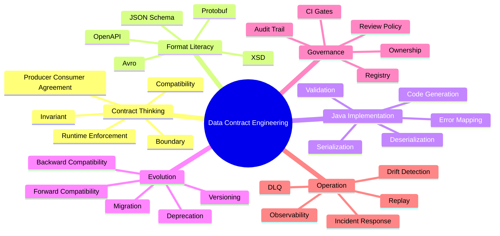
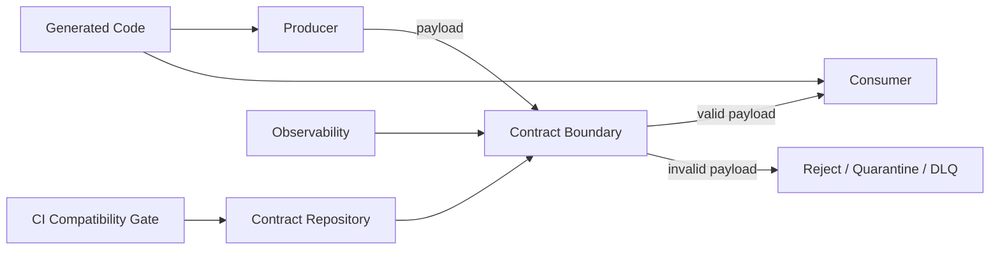
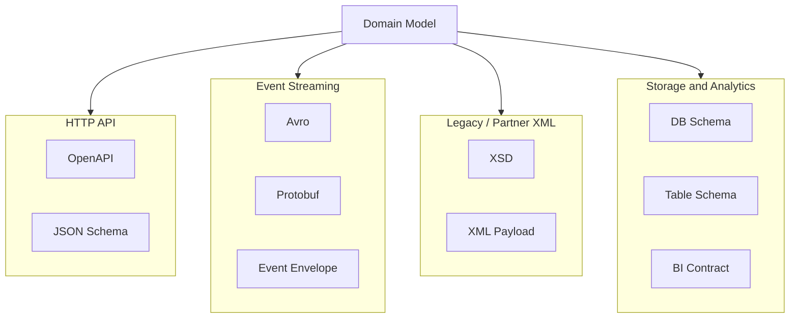
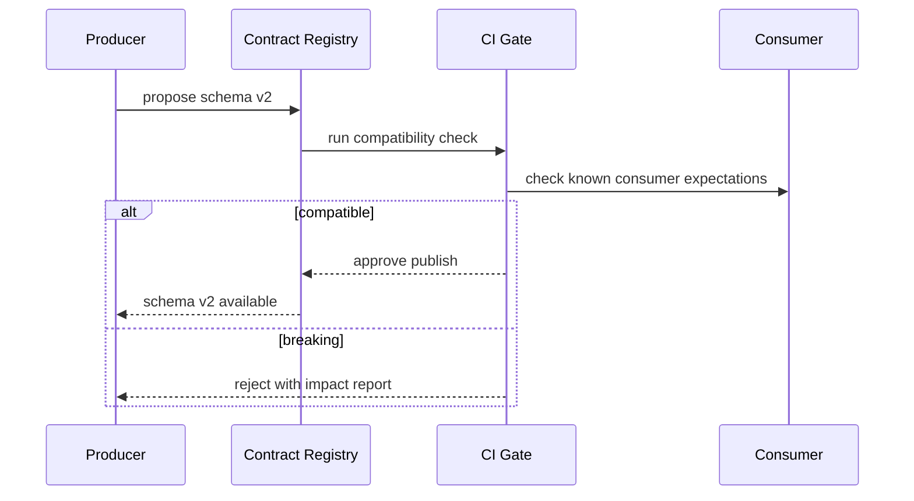
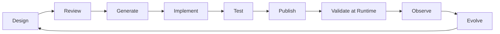
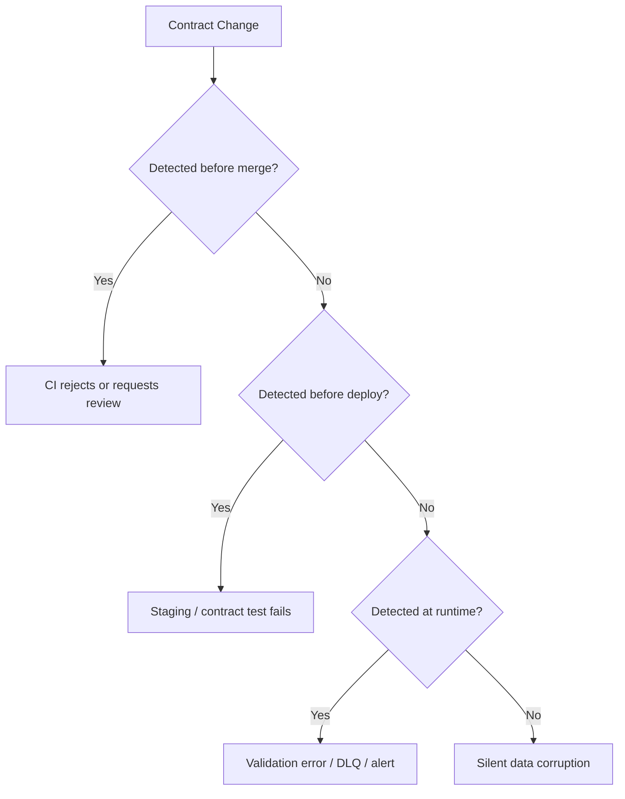
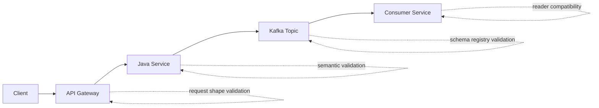
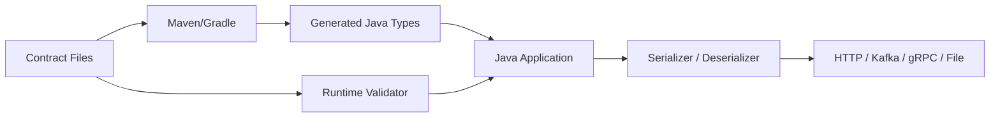

# Part 001 — Kaufman Skill Map and Contract Engineering Map

Materi ini bukan pengantar “apa itu XML/JSON/API”. Itu sudah terlalu dangkal untuk level production. Fokus kita adalah **cara berpikir dan bekerja sebagai engineer yang bertanggung jawab atas kontrak data**: kontrak yang harus hidup bertahun-tahun, dipakai banyak tim, divalidasi otomatis, berevolusi tanpa mematikan consumer, dapat diaudit, dan tetap masuk akal ketika sistem berubah.

Di enterprise system, bug kontrak jarang terlihat sebagai bug “schema”. Ia muncul sebagai:

- deployment rollback karena consumer lama tidak bisa membaca field baru;
- event pipeline macet karena enum baru tidak dikenal;
- integrasi partner gagal karena `null`, missing field, dan empty string diperlakukan beda;
- tim API mengubah response karena “cuma rename field kecil”; 
- data lake menerima data yang valid secara sintaks, tetapi salah secara bisnis;
- audit tidak bisa membuktikan versi kontrak yang berlaku saat keputusan dibuat;
- service baru menganggap OpenAPI adalah kontrak, padahal runtime tidak pernah memvalidasi response.

Top engineer tidak melihat XSD, JSON Schema, Avro, Protobuf, dan OpenAPI sebagai “format”. Mereka melihatnya sebagai **bahasa untuk mengekspresikan invariant sistem**.

---

## 1. Tujuan 20 Jam Pertama

Mengikuti prinsip Josh Kaufman, kita tidak mulai dari daftar fitur. Kita mulai dari **target performa konkret**.

Setelah 20 jam pertama, kamu harus mampu:

1. Membaca kontrak XSD, JSON Schema, Avro, Protobuf, dan OpenAPI lalu menjelaskan:
   - data shape yang dijanjikan;
   - constraint yang eksplisit;
   - constraint yang tersembunyi;
   - perubahan mana yang aman dan berbahaya;
   - siapa yang akan rusak jika kontrak berubah.

2. Mendesain kontrak baru untuk API/event/file integration dengan alasan teknis yang jelas:
   - kenapa field required atau optional;
   - kenapa enum dipakai atau tidak;
   - bagaimana versioning dilakukan;
   - bagaimana consumer lama tetap berjalan;
   - bagaimana validator dan generator masuk pipeline.

3. Membuat workflow Java production-grade:
   - schema disimpan di repo;
   - schema divalidasi di CI;
   - code generation repeatable;
   - runtime validation jelas posisinya;
   - breaking change terdeteksi sebelum merge;
   - artifact schema bisa dipromosikan antar environment.

4. Mengidentifikasi anti-pattern kontrak:
   - model domain dipakai langsung sebagai API DTO;
   - enum ditambahkan tanpa unknown-handling;
   - schema “longgar” karena takut breaking change;
   - contract versioning hanya rename URL;
   - OpenAPI terlihat rapi, tetapi implementation tidak enforce.

### Definisi skill yang kita kejar

Skill ini bukan “bisa menulis schema”. Skill ini adalah:

> Kemampuan merancang, memvalidasi, menjalankan, mengubah, dan mengoperasikan kontrak data sebagai boundary formal antar sistem dengan compatibility, governance, observability, dan risk control yang jelas.

---

## 2. Apa yang Kita Pecah Menjadi Subskill

Kaufman menyarankan memecah skill besar menjadi subskill kecil yang bisa dilatih. Untuk data contract engineering, pecahannya seperti ini.



Kita tidak belajar semua subskill dengan kedalaman yang sama di awal. Kita cari **subskill yang memberi leverage terbesar**.

### Subskill paling leverage untuk 20 jam pertama

| Subskill | Kenapa penting | Output yang harus bisa dibuat |
|---|---|---|
| Boundary modelling | Kontrak hanya berguna kalau boundary-nya benar | Diagram producer-consumer-boundary |
| Optionality/nullability | Mayoritas bug kontrak berasal dari absence semantics | Matrix `missing/null/empty/default` |
| Compatibility reasoning | Syarat utama evolusi aman | Checklist perubahan aman/berbahaya |
| Format selection | Salah format membuat sistem sulit berubah | Decision table XSD vs JSON Schema vs Avro vs Protobuf vs OpenAPI |
| Runtime validation placement | Validasi salah tempat membuat noise atau blind spot | Diagram enforcement point |
| Contract review | Schema benar belum tentu kontrak sehat | Pull request checklist |

---

## 3. Mental Model Utama: Kontrak adalah Boundary yang Dapat Dieksekusi

Banyak engineer memperlakukan contract sebagai dokumentasi. Itu penyederhanaan yang berbahaya.

Dokumentasi menjawab: “seharusnya seperti apa?”

Kontrak data menjawab:

1. **Apa yang diizinkan masuk?**
2. **Apa yang dijamin keluar?**
3. **Apa yang boleh berubah?**
4. **Siapa yang terdampak saat berubah?**
5. **Bagaimana pelanggaran ditemukan?**
6. **Apa tindakan sistem saat pelanggaran terjadi?**

Kontrak yang tidak bisa dipakai untuk validasi, generation, review, atau compatibility check hanyalah dokumen semi-formal.



Boundary yang baik punya empat sifat:

1. **Formal** — bisa dibaca mesin.
2. **Executable** — bisa divalidasi atau digenerate.
3. **Versioned** — perubahan bisa dilacak.
4. **Governed** — perubahan punya owner dan policy.

---

## 4. Contract sebagai Invariant, Bukan Sekadar Shape

Shape mengatakan:

```json
{
  "caseId": "C-2026-0001",
  "status": "OPEN"
}
```

Invariant mengatakan:

- `caseId` wajib stabil sepanjang lifecycle case.
- `status` hanya boleh bergerak mengikuti state machine tertentu.
- `OPEN` bukan sekadar string; ia menentukan allowed action.
- `caseId` mungkin public identifier, bukan database primary key.
- Field `status` harus backward-compatible terhadap consumer lama.

Schema biasanya hanya menangkap sebagian invariant. Karena itu engineer senior harus membedakan:

| Jenis invariant | Bisa diekspresikan di schema? | Contoh |
|---|---:|---|
| Structural invariant | Ya | `caseId` wajib string |
| Type invariant | Ya | `amount` decimal, bukan string bebas |
| Range invariant | Kadang | `priority` 1-5 |
| Cross-field invariant | Kadang/sulit | `closedAt` wajib ada jika `status=CLOSED` |
| Temporal invariant | Biasanya tidak | status tidak boleh mundur dari `CLOSED` ke `OPEN` |
| Referential invariant | Biasanya tidak | `officerId` harus exist di registry |
| Authorization invariant | Tidak | user hanya boleh melihat case di wilayahnya |
| Regulatory invariant | Sebagian | alasan penutupan wajib terekam untuk case enforcement |

Pelajaran penting:

> Schema adalah bagian dari kontrak, bukan seluruh kontrak.

Kontrak production-grade biasanya terdiri dari:

- schema formal;
- semantic notes;
- examples;
- compatibility rules;
- ownership metadata;
- lifecycle state;
- validation policy;
- error handling policy;
- deprecation policy;
- security/privacy classification;
- operational playbook.

---

## 5. Lima Format, Lima Cara Berpikir

Kita akan belajar lima keluarga kontrak. Jangan samakan semuanya.

| Format | Domain natural | Kekuatan utama | Risiko utama |
|---|---|---|---|
| XSD | XML enterprise, legacy integration, document exchange | Namespace, complex type, strict validation, identity constraint | Verbose, tooling modern lebih terbatas, evolusi namespace bisa berat |
| JSON Schema | JSON payload, config, event validation, document contract | Expressive validation, modular refs, cocok untuk JSON-native ecosystem | Implementasi validator bisa berbeda, dynamic refs kompleks, compatibility tidak built-in |
| Avro | Event stream, batch, data pipeline, Kafka/lake | Schema evolution kuat, binary compact, reader/writer schema resolution | Union/default/enum evolution sering disalahpahami |
| Protobuf | gRPC, binary RPC, high-performance service boundary | Compact, generated code kuat, cross-language, field tag evolution | JSON mapping dan presence semantics sering mengecoh |
| OpenAPI | HTTP API contract | Operation-level contract: path, method, request, response, security | Spec bisa drift dari implementation, generator bisa mendorong model buruk |

### Format bukan agama

Pertanyaan yang benar bukan:

> “Lebih bagus Avro atau Protobuf?”

Pertanyaan yang benar:

> “Boundary apa yang sedang dikontrak, siapa consumer-nya, bagaimana evolusinya, apa enforcement point-nya, dan tooling apa yang menjalankan kontrak itu?”

Contoh:

- HTTP public API: OpenAPI + JSON Schema discipline.
- Kafka event untuk analytics: Avro + schema registry.
- Internal low-latency RPC: Protobuf/gRPC.
- XML regulatory filing: XSD.
- Config contract: JSON Schema.

---

## 6. Contract Surface Area

Kontrak data tidak hanya berada pada API response. Ia muncul di banyak permukaan.



Setiap surface punya perubahan yang berbeda.

| Surface | Perubahan paling berisiko |
|---|---|
| Public HTTP API | Removing/renaming response field, changing status code semantics |
| Internal API | Silent generator drift, shared DTO leakage |
| Event stream | Breaking historical replay, enum addition, required field without default |
| XML partner integration | Namespace/version mismatch, strict validator rejection |
| Data lake | Type widening/narrowing, partition field change, semantic drift |
| Config schema | Default behavior change, field removal, stricter validation |

---

## 7. Producer-Consumer Thinking

Kontrak selalu berada di antara minimal dua pihak.

- **Producer** membuat data.
- **Consumer** membaca data.
- **Contract owner** menjaga aturan evolusi.
- **Platform/tooling** menjalankan validation/checking.

Kesalahan umum: producer merasa memiliki schema sepenuhnya.

Dalam sistem produksi, producer hanya memiliki **hak menambahkan kemampuan** selama tidak merusak consumer yang valid.



### Cara membaca kontrak dari sisi consumer

Consumer tidak bertanya “schema ini valid?” saja. Consumer bertanya:

- Field mana yang benar-benar saya butuhkan?
- Apa yang terjadi jika field tambahan muncul?
- Apa yang terjadi jika enum baru muncul?
- Apakah saya bisa membaca data lama dan data baru?
- Apakah default value producer sama dengan asumsi saya?
- Apakah unknown field harus diabaikan, disimpan, atau ditolak?

### Cara membaca kontrak dari sisi producer

Producer bertanya:

- Apa yang saya jamin untuk consumer lama?
- Apa yang boleh saya tambahkan tanpa koordinasi?
- Apa yang harus saya umumkan sebagai deprecation?
- Apa yang perlu dual-write/dual-read?
- Apa yang harus divalidasi sebelum publish?

---

## 8. The Contract Engineering Loop

Kontrak bukan artefak sekali buat. Ia punya loop.



### Design

Pertanyaan utama:

- Boundary apa yang sedang dibuat?
- Siapa consumer-nya?
- Apakah kontrak untuk command, query, event, document, atau config?
- Apa invariant yang harus ditangkap?
- Apa yang sengaja tidak ditangkap oleh schema?

### Review

Review kontrak berbeda dari review code.

Code review bertanya: “apakah implementation benar?”

Contract review bertanya: “apakah janji ini bisa dipertahankan?”

### Generate

Generated code harus menjadi output, bukan source of truth. Jika generated code diedit manual, pipeline rusak.

### Implement

Implementation harus mematuhi contract. Jangan biarkan model domain bocor langsung ke boundary.

### Test

Test bukan hanya unit test. Test harus mencakup:

- valid examples;
- invalid examples;
- backward compatibility;
- consumer fixtures;
- generated model round-trip;
- validation error mapping.

### Publish

Schema harus dipublish sebagai artifact yang bisa direferensikan dengan versi.

### Validate

Runtime validation harus ditempatkan secara sadar. Terlalu sedikit validasi menciptakan silent corruption. Terlalu banyak validasi di hot path bisa menciptakan latency dan noise.

### Observe

Kontrak sehat harus terlihat di telemetry:

- validation failure rate;
- unknown field frequency;
- DLQ count;
- schema version distribution;
- consumer lag karena perubahan schema;
- rejected partner payload.

### Evolve

Evolusi kontrak harus memiliki playbook. Tanpa playbook, setiap perubahan menjadi negosiasi ulang.

---

## 9. Konsep “Source of Truth”

Salah satu akar kekacauan kontrak adalah source of truth tidak jelas.

| Pendekatan | Source of truth | Cocok untuk | Risiko |
|---|---|---|---|
| Code-first | Java classes/annotations | Internal service cepat, prototyping | Contract drift, review sulit, language lock-in |
| Schema-first | XSD/JSON Schema/Avro/Proto | Event, XML, shared data model | Butuh discipline codegen |
| API-first | OpenAPI | HTTP API multi-team | Spec bisa menjadi dokumen mati |
| Contract-first | Contract package + policy + examples | Enterprise/platform | Butuh governance matang |

Seri ini mengambil posisi:

> Untuk sistem enterprise production-grade, contract harus menjadi source of truth di boundary yang stabil. Code mengikuti contract, bukan sebaliknya.

Namun ada pengecualian realistis:

- internal API yang sangat volatile mungkin boleh code-first sementara;
- migration system mungkin butuh adapter contract;
- legacy system mungkin menjadikan database schema sebagai effective contract;
- analytical contract kadang mengikuti table schema, bukan API schema.

Yang penting bukan dogma. Yang penting: **source of truth eksplisit**.

---

## 10. Contract Failure Model

Kita perlu memodelkan kegagalan sebelum memilih teknologi.



Kondisi paling berbahaya adalah **silent data corruption**. Bukan crash. Crash bisa terlihat. Silent corruption masuk ke report, decision engine, compliance workflow, dan baru ditemukan setelah keputusan bisnis/regulator dibuat.

### Contoh failure modes

| Failure mode | Contoh | Dampak |
|---|---|---|
| Structural break | `customer.id` pindah ke `customer.identity.id` | Consumer gagal parse |
| Semantic break | `status=APPROVED` berubah makna | Keputusan salah |
| Constraint break | field dulu optional jadi required | Data lama invalid |
| Enum break | enum baru tidak dikenal | Switch/case gagal |
| Precision break | decimal jadi double | Loss of money precision |
| Temporal break | event order berubah | State machine rusak |
| Identity break | ID berubah dari stable public ID ke DB ID | Correlation gagal |
| Security break | PII field baru masuk event umum | Data leakage |

---

## 11. Skill Map Praktis 20 Jam

Berikut rancangan latihan efektif. Tujuannya bukan membaca semua spesifikasi. Tujuannya membangun kemampuan operasional.

### Jam 1-2 — Boundary inventory

Ambil satu sistem nyata atau hipotetis. Buat daftar boundary:

- HTTP API;
- Kafka event;
- XML partner file;
- internal RPC;
- batch export;
- config file;
- database publication table.

Output:

```text
Boundary: Case Intake API
Producer: external portal
Consumer: case-management-service
Contract format: OpenAPI + JSON Schema
Validation: ingress request validation
Owner: case platform team
Compatibility class: public, backward-compatible required
```

### Jam 3-4 — Field semantics

Pilih 10 field. Untuk setiap field, tulis:

- type;
- required/optional;
- nullable atau tidak;
- default;
- identity semantics;
- privacy classification;
- compatibility rule.

Output contoh:

| Field | Meaning | Absence | Null | Default | Change rule |
|---|---|---|---|---|---|
| `caseId` | stable public case identifier | invalid | invalid | none | never rename/retype |
| `assignedOfficerId` | current officer | allowed if unassigned | avoid | none | add only if consumer tolerant |
| `priority` | triage priority | allowed | invalid | system-derived | enum/list evolution controlled |

### Jam 5-6 — Compare format behaviour

Model data yang sama dalam:

- JSON Schema;
- Avro;
- Protobuf;
- OpenAPI schema component;
- XSD.

Jangan mengejar kesempurnaan. Cari perbedaan mental model.

### Jam 7-8 — Compatibility drills

Ambil schema v1, buat v2:

- tambah optional field;
- hapus field;
- rename field;
- tambah enum;
- ubah required menjadi optional;
- ubah optional menjadi required;
- ubah `int` menjadi `long`;
- ubah string timestamp menjadi structured object.

Untuk setiap perubahan, jawab:

- producer lama ke consumer baru aman?
- producer baru ke consumer lama aman?
- data historis masih bisa dibaca?
- generated code berubah bagaimana?
- runtime validator akan reject apa?

### Jam 9-10 — Java codegen loop

Buat project kecil:

```text
contracts/
  openapi/case-api.yaml
  avro/case-event.avsc
  proto/case_event.proto
  json-schema/case-intake.schema.json
src/main/java/
```

Latihan:

- generate model;
- serialize/deserialize payload;
- validate invalid payload;
- fail build jika schema invalid.

### Jam 11-12 — Error mapping

Buat taxonomy error:

- syntax error;
- schema validation error;
- semantic validation error;
- authorization error;
- unsupported version;
- unknown enum;
- incompatible payload.

Output:

```json
{
  "type": "https://errors.example.com/contract/validation-error",
  "title": "Payload does not match contract",
  "status": 400,
  "contract": "case-intake-request",
  "contractVersion": "1.3.0",
  "errors": [
    {
      "path": "/subject/dateOfBirth",
      "code": "format.invalid",
      "message": "dateOfBirth must use ISO-8601 date format"
    }
  ]
}
```

### Jam 13-14 — Contract review simulation

Buat PR kontrak. Review dengan checklist:

- apakah required field baru breaking?
- apakah enum punya unknown strategy?
- apakah contoh valid/invalid ada?
- apakah PII ditandai?
- apakah backward compatibility dijalankan?
- apakah consumer penting sudah diketahui?

### Jam 15-16 — Registry and artifact publishing

Latihan publish schema ke artifact repository atau registry lokal:

```text
com.example.contracts:case-contracts:1.4.0
```

Pastikan consumer tidak copy-paste schema manual.

### Jam 17-18 — Runtime enforcement placement

Gambar enforcement point:



Diskusikan validasi mana yang wajib, mana yang sampling, mana yang hanya di CI.

### Jam 19-20 — Migration playbook

Ambil perubahan breaking dan ubah menjadi non-breaking migration:

Naive breaking change:

```text
rename customerName -> legalName
```

Safer migration:

```text
v1: customerName exists
v2: add legalName, keep customerName
v3: producer writes both
v4: consumers migrate to legalName
v5: mark customerName deprecated
v6: remove only in major version / new topic / new endpoint
```

---

## 12. Decision Framework Awal

Ketika mendesain kontrak, gunakan pertanyaan berurutan ini.

### 1. Apa jenis boundary-nya?

- command;
- query response;
- event notification;
- event-carried state transfer;
- document;
- file exchange;
- config;
- analytical dataset.

Jenis boundary menentukan format dan compatibility.

### 2. Siapa consumer-nya?

- satu service internal;
- banyak service internal;
- partner eksternal;
- public client;
- data platform;
- regulatory reporting;
- unknown future consumer.

Semakin tidak dikenal consumer, semakin konservatif evolusi kontrak.

### 3. Apakah data historis harus dibaca ulang?

Event dan file archive sering harus replay. API request biasanya tidak.

Jika historical replay penting, schema evolution bukan nice-to-have. Ia syarat utama.

### 4. Apakah payload perlu human-readable?

- debugging partner integration: XML/JSON membantu;
- high-throughput stream: Avro/Protobuf lebih masuk akal;
- public API: JSON via OpenAPI lebih umum.

### 5. Apakah schema harus express validation atau serialization?

JSON Schema unggul sebagai validation vocabulary. Avro/Protobuf unggul sebagai serialization contract. OpenAPI unggul sebagai operation contract. XSD unggul untuk XML document contract.

### 6. Siapa yang menjalankan compatibility check?

Jawaban “developer akan ingat” tidak valid untuk production-grade.

Harus ada:

- CI check;
- registry compatibility mode;
- pull request bot;
- release policy;
- consumer contract test.

---

## 13. Minimum Viable Contract Governance

Governance tidak harus birokratis. Governance minimal yang sehat:

```text
Every contract must have:
1. owner
2. version
3. format/dialect
4. compatibility class
5. examples
6. validation policy
7. change policy
8. deprecation policy
9. privacy classification
10. runtime observability point
```

Contoh metadata:

```yaml
contract:
  id: case-intake-request
  owner: case-platform-team
  format: openapi-3.2
  compatibility: backward
  lifecycle: active
  pii: contains-sensitive-data
  validation:
    ingress: strict
    egress: sampled
  deprecation:
    minimumWindowDays: 180
```

---

## 14. Anti-Pattern yang Harus Diwaspadai Sejak Awal

### Anti-pattern 1 — Shared domain model as contract

```java
@Entity
public class CaseEntity {
    @Id
    private Long id;
    private String internalWorkflowState;
    private String assignedOfficerInternalNote;
}
```

Lalu class ini dipakai langsung sebagai API response.

Masalah:

- DB concern bocor ke API;
- internal field bisa terekspos;
- rename database field menjadi breaking API change;
- consumer bergantung pada detail internal;
- security review sulit.

Prinsip:

> Domain model, persistence model, API model, dan event model boleh mirip, tetapi tidak boleh diasumsikan sama.

### Anti-pattern 2 — Optional semua agar tidak breaking

Membuat semua field optional memang mengurangi rejection, tetapi menghancurkan invariant.

```json
{
  "type": "object",
  "properties": {
    "caseId": { "type": "string" },
    "status": { "type": "string" }
  }
}
```

Jika `caseId` adalah invariant, ia harus required. Kalau tidak, downstream akan membuat validasi ulang masing-masing.

### Anti-pattern 3 — Enum tanpa unknown strategy

```java
switch (event.getStatus()) {
    case OPEN -> handleOpen(event);
    case CLOSED -> handleClosed(event);
}
```

Saat producer menambahkan `SUSPENDED`, consumer bisa gagal.

Strategi:

- unknown bucket;
- tolerant reader;
- explicit default handling;
- reference data externalization;
- compatibility gate untuk enum.

### Anti-pattern 4 — OpenAPI sebagai dokumen mati

Spec rapi, tetapi implementation response berbeda.

Solusi:

- generated interface;
- response validation in test;
- contract test;
- example validation;
- spec diff in CI.

### Anti-pattern 5 — Schema registry tanpa ownership

Registry hanya menyimpan schema, tetapi tidak tahu owner, lifecycle, consumer, atau policy. Ini menjadi “database schema”, bukan governance system.

---

## 15. Contract Engineering Maturity Model

Gunakan model ini untuk menilai organisasi atau platform.

| Level | Ciri | Risiko |
|---|---|---|
| 0 — Ad hoc | Payload by convention, no schema | Silent break everywhere |
| 1 — Documented | Wiki/OpenAPI/manual docs | Drift from implementation |
| 2 — Validated | Schema validation in build/runtime | Compatibility belum aman |
| 3 — Versioned | Contract versioning and artifact release | Governance masih manual |
| 4 — Governed | Ownership, CI gates, registry policy | Butuh observability matang |
| 5 — Observable | Drift detection, impact analysis, replay safety | Operational complexity |
| 6 — Platformized | Contract platform, self-service, policy-as-code | Butuh investment besar |

Target seri ini adalah membuat kamu mampu mendesain Level 4-6 secara realistis.

---

## 16. Java Engineer View: Di Mana Java Masuk?

Java bukan pusat kontrak, tetapi Java adalah tempat kontrak sering dijalankan.



Di Java, concern utama:

- generated code boundary;
- classpath conflicts;
- build reproducibility;
- validation performance;
- immutable DTO vs mutable generated model;
- mapping between generated contract model and domain model;
- exception mapping;
- secure parser configuration;
- schema cache lifecycle;
- testing generated artifacts.

### Prinsip Java implementation

1. **Generated model is not domain model by default.**
2. **Validation errors must become domain-friendly error responses.**
3. **Schema loading must be deterministic.**
4. **Codegen must be repeatable in CI.**
5. **Contract artifacts must be versioned like code.**
6. **Runtime enforcement must be explicit, not accidental.**

---

## 17. Latihan Part 001

### Latihan 1 — Boundary map

Pilih satu sistem yang kamu kenal. Buat tabel:

| Boundary | Producer | Consumer | Format | Validation | Compatibility |
|---|---|---|---|---|---|
|  |  |  |  |  |  |

Isi minimal 8 boundary.

### Latihan 2 — Contract failure story

Tulis satu skenario failure:

```text
Change:
Who produced it:
Who consumed it:
Why CI did not catch it:
Why runtime did/did not catch it:
Business impact:
How contract governance should prevent it:
```

### Latihan 3 — Source of truth decision

Untuk setiap boundary, tentukan source of truth:

- OpenAPI;
- JSON Schema;
- Avro schema;
- `.proto`;
- XSD;
- Java class;
- database schema;
- other.

Lalu tulis risikonya.

---

## 18. Checklist Ringkas

Sebelum lanjut ke Part 002, kamu harus bisa menjawab:

- Apa bedanya schema, contract, dan documentation?
- Boundary apa yang sedang dikontrak?
- Siapa producer dan consumer?
- Apa invariant yang harus dijaga?
- Apa format kontrak yang paling sesuai?
- Apakah source of truth eksplisit?
- Apakah compatibility policy jelas?
- Apakah runtime enforcement ada?
- Apakah observability untuk contract failure ada?
- Apakah ada owner dan deprecation policy?

Jika jawabanmu masih “tergantung”, itu normal. Yang penting kamu tahu **tergantung pada apa**.

---

## 19. Baseline Standar yang Dipakai Seri Ini

Seri ini menggunakan baseline berikut:

- JSON Schema Draft 2020-12 sebagai dialect utama untuk JSON Schema.
- OpenAPI Specification 3.2.0 sebagai baseline modern untuk HTTP API contract.
- Apache Avro 1.12.0 sebagai baseline Avro.
- Protocol Buffers proto3 dan Editions 2023/2024 sebagai baseline Protobuf modern.
- W3C XML Schema 1.0/1.1 sebagai baseline XSD, dengan catatan bahwa dukungan tooling Java terhadap fitur 1.1 perlu dicek per validator.
- Jakarta XML Binding 4.x sebagai baseline modern Jakarta namespace, dengan awareness terhadap legacy JAXB/javax ecosystem.

Referensi resmi:

- JSON Schema Specification: https://json-schema.org/specification
- JSON Schema Draft 2020-12: https://json-schema.org/draft/2020-12
- OpenAPI Specification 3.2.0: https://spec.openapis.org/oas/v3.2.0.html
- Apache Avro 1.12.0 Specification: https://avro.apache.org/docs/1.12.0/specification/
- Protocol Buffers Documentation: https://protobuf.dev/
- Protobuf Editions Overview: https://protobuf.dev/editions/overview/
- Jakarta XML Binding: https://jakarta.ee/specifications/xml-binding/

---

## 20. Ringkasan Part 001

Data contract engineering adalah disiplin untuk mengubah janji antar sistem menjadi artefak formal, executable, versioned, governed, dan observable.

Kita akan menggunakan XSD, JSON Schema, Avro, Protobuf, dan OpenAPI bukan sebagai daftar teknologi, tetapi sebagai alat untuk menjaga boundary dan invariant.

Fondasi yang harus tertanam:

1. Contract adalah boundary.
2. Schema bukan seluruh contract.
3. Format selection bergantung pada boundary.
4. Compatibility adalah design constraint, bukan aktivitas setelah rusak.
5. Runtime validation harus ditempatkan sadar.
6. Governance minimal harus ada sejak awal.
7. Java implementation harus mengikuti contract, bukan menjadikan class sebagai janji diam-diam.

Part berikutnya akan membedah definisi “data contract” secara lebih presisi: apa saja komponennya, apa bedanya dengan schema/documentation/API spec, dan bagaimana kontrak dipakai untuk mengendalikan risk di sistem produksi.
