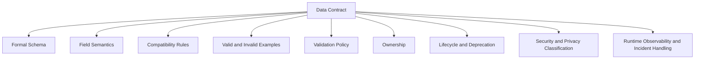
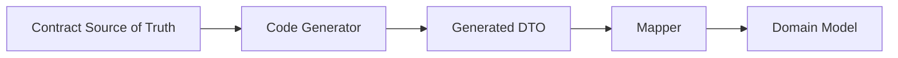
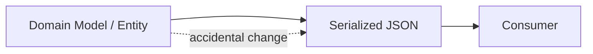
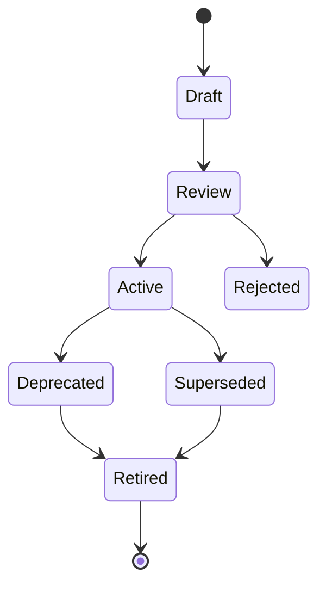
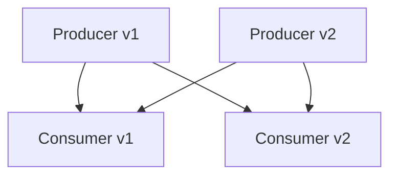
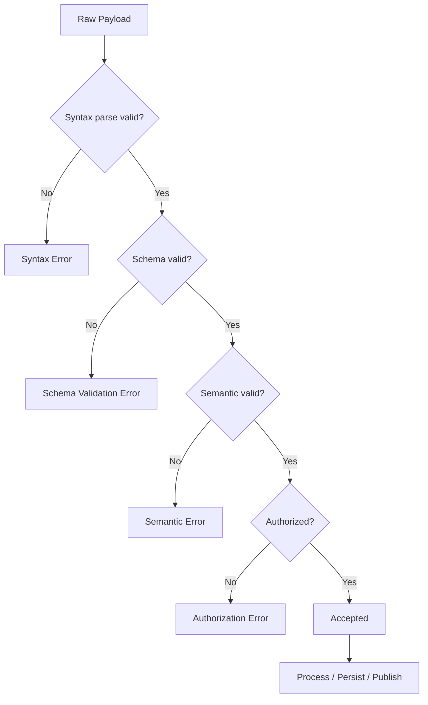
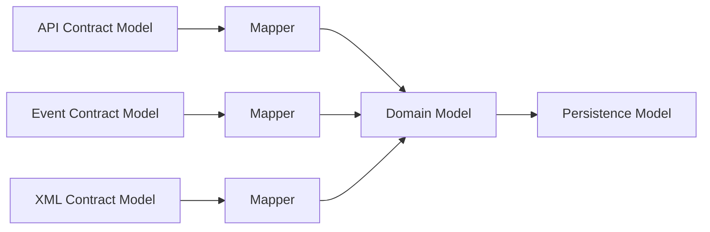
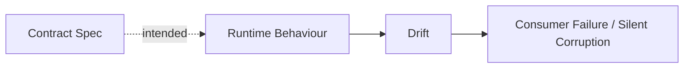
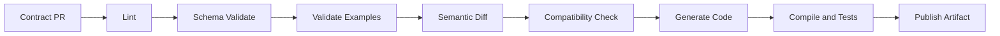

# Part 002 — What Is a Data Contract, Really?

Istilah “data contract” sering dipakai terlalu longgar. Kadang berarti Avro schema. Kadang berarti OpenAPI spec. Kadang berarti dokumen Confluence. Kadang berarti kesepakatan informal antar tim. Untuk sistem production-grade, definisi seperti itu tidak cukup.

Kita butuh definisi yang bisa dipakai untuk mendesain, mereview, menguji, menjalankan, mengubah, dan mengaudit kontrak.

Definisi kerja seri ini:

> Data contract adalah perjanjian teknis dan operasional yang eksplisit antara producer dan consumer tentang bentuk, makna, aturan perubahan, validasi, ownership, security, dan perilaku data pada sebuah boundary sistem.

Perhatikan kata-katanya:

- **perjanjian**: bukan hanya file schema;
- **teknis dan operasional**: harus bisa dijalankan dan dioperasikan;
- **eksplisit**: tidak boleh bergantung pada asumsi tribal knowledge;
- **producer dan consumer**: kontrak selalu relasional;
- **bentuk dan makna**: shape saja tidak cukup;
- **aturan perubahan**: compatibility adalah bagian kontrak;
- **validasi**: kontrak harus punya enforcement point;
- **ownership**: harus ada yang bertanggung jawab;
- **security**: data punya risiko;
- **boundary**: kontrak ada di batas, bukan di semua class internal.

---

## 1. Schema vs Data Contract

Schema adalah deskripsi formal tentang struktur data. Data contract lebih luas.



### Schema menjawab

- Field apa yang ada?
- Tipe datanya apa?
- Mana yang required?
- Format apa yang valid?
- Struktur nested-nya bagaimana?

### Data contract menjawab tambahan

- Field ini berarti apa secara bisnis?
- Apakah consumer boleh mengabaikan field baru?
- Apakah producer boleh menambahkan enum baru?
- Apakah field ini mengandung PII?
- Apa yang terjadi jika payload invalid?
- Bagaimana perubahan breaking dimigrasikan?
- Siapa yang harus approve perubahan?
- Bagaimana kita tahu implementation drift dari contract?
- Berapa lama field deprecated harus dipertahankan?

### Contoh sederhana

Schema:

```json
{
  "type": "object",
  "required": ["caseId", "status"],
  "properties": {
    "caseId": { "type": "string" },
    "status": { "type": "string", "enum": ["OPEN", "CLOSED"] }
  }
}
```

Data contract:

```yaml
id: enforcement-case-status-changed
owner: enforcement-platform-team
format: json-schema-2020-12
compatibility: backward
producer: case-management-service
consumers:
  - notification-service
  - reporting-pipeline
  - audit-ledger-service
semantics:
  caseId:
    meaning: Stable public identifier for an enforcement case.
    identity: stable-across-case-lifecycle
    pii: false
  status:
    meaning: Current externally visible lifecycle status.
    enumPolicy: new-values-require-consumer-impact-review
validation:
  publishTime: strict
  consumeTime: tolerant-reader
changePolicy:
  removeField: major-version-only
  addOptionalField: minor-version-allowed
  addRequiredField: breaking
  addEnumValue: requires-unknown-handling-review
observability:
  metric: contract.validation.failure.count
  alertThreshold: 1 percent over 10 minutes
```

File schema penting, tetapi kontrak yang production-grade harus mencakup informasi di luar schema.

---

## 2. Contract Bukan DTO

DTO adalah struktur data di kode. Contract adalah janji di boundary.

DTO bisa generated dari contract, tetapi DTO bukan contract itu sendiri.

```java
public record CaseStatusChangedDto(
    String caseId,
    String status
) {}
```

Class ini tidak menjawab:

- apakah `status` boleh nilai baru;
- apakah `caseId` stable;
- apakah `status` external atau internal;
- apakah null valid;
- apakah field baru boleh muncul;
- apakah data lama bisa dibaca;
- apakah perubahan butuh approval.

DTO sering menjadi ilusi keamanan. Karena Java typed, engineer merasa kontraknya aman. Padahal type system lokal tidak menjamin compatibility lintas versi, lintas service, lintas bahasa, lintas waktu.

### DTO boleh menjadi output contract

Flow yang sehat:



Flow yang rapuh:



Prinsip:

> DTO adalah representation. Contract adalah agreement.

---

## 3. Contract Bukan Dokumentasi

Dokumentasi bisa salah dan tetap “terlihat bagus”. Contract harus bisa dicek.

Perbandingan:

| Artefak | Bisa dibaca manusia | Bisa dibaca mesin | Bisa enforce runtime | Bisa cek compatibility | Bisa drift |
|---|---:|---:|---:|---:|---:|
| Wiki page | Ya | Tidak | Tidak | Tidak | Tinggi |
| OpenAPI tanpa test | Ya | Ya | Tidak otomatis | Sebagian | Tinggi |
| JSON Schema di repo tanpa CI | Ya | Ya | Tidak otomatis | Tidak otomatis | Sedang |
| Avro + registry compatibility | Ya | Ya | Ya | Ya | Rendah jika disiplin |
| Contract package + CI + runtime validation | Ya | Ya | Ya | Ya | Rendah |

Dokumentasi tetap penting, tetapi ia harus dihasilkan atau diverifikasi dari source of truth.

Prinsip:

> Documentation should explain the contract. It should not be the only contract.

---

## 4. Contract Bukan Hanya API

HTTP API adalah bentuk kontrak yang paling terlihat. Namun banyak failure data contract terjadi di luar API.

### Event contract

Event contract menjawab:

- event terjadi karena apa;
- apakah event notification atau state transfer;
- apakah ordering penting;
- apakah key/correlation id stabil;
- apakah event bisa direplay;
- apakah consumer boleh mengabaikan field baru;
- schema version mana yang dipakai;
- apa yang dilakukan jika payload tidak terbaca.

### File/batch contract

File contract menjawab:

- format file;
- encoding;
- header/trailer;
- schema per row;
- naming convention;
- delivery schedule;
- idempotency;
- partial failure;
- reconciliation.

### Database publication contract

Kadang table/view menjadi kontrak untuk downstream.

Kontrak harus menjawab:

- kolom mana publik;
- apakah kolom boleh rename;
- apakah type widening aman;
- apakah row deletion berarti business deletion;
- apakah historical correction diizinkan;
- apakah snapshot atau changelog.

### Config contract

Config schema adalah kontrak antara platform dan operator/developer.

- field apa yang valid;
- default apa yang aman;
- perubahan config apa yang butuh restart;
- mana secret;
- mana environment-specific;
- apa failure mode jika config invalid.

---

## 5. Komponen Data Contract Production-Grade

Minimal kontrak produksi punya 12 komponen.

### 1. Identity

Kontrak harus punya identitas stabil.

```yaml
id: case-intake-request
name: Case Intake Request
namespace: com.example.enforcement.caseintake
version: 1.4.0
```

Identity penting karena schema bisa berpindah repo, file bisa rename, dan format bisa berubah. Consumer butuh referensi stabil.

### 2. Boundary

```yaml
boundary:
  type: http-request
  direction: external-to-internal
  endpoint: POST /cases/intake
```

Jenis boundary memengaruhi validation, versioning, dan error handling.

### 3. Producer

```yaml
producer:
  service: public-case-portal
  team: citizen-platform-team
```

Producer bertanggung jawab menghasilkan payload sesuai contract.

### 4. Consumer

```yaml
consumers:
  - service: case-management-service
    usage: command-handler
  - service: audit-ledger-service
    usage: append-only-record
```

Consumer bukan hanya service yang membaca saat ini. Consumer juga bisa:

- data platform;
- auditor;
- report;
- replay job;
- partner;
- mobile client lama.

### 5. Formal schema

Schema bisa berupa:

- XSD;
- JSON Schema;
- Avro schema;
- `.proto`;
- OpenAPI document atau component.

### 6. Semantic field dictionary

Field harus punya makna.

```yaml
fields:
  caseId:
    meaning: Public case identifier assigned after intake acceptance.
    stability: immutable
    source: case-management-service
  submittedAt:
    meaning: Instant when the intake request was accepted by the platform.
    timezone: UTC
```

Tanpa semantic dictionary, schema hanya memberi shape.

### 7. Constraint model

Pisahkan constraint:

- structural;
- syntactic;
- semantic;
- cross-field;
- temporal;
- referential;
- authorization;
- regulatory.

```yaml
constraints:
  structural:
    - caseId is required
  semantic:
    - submittedAt must not be in the future beyond clock skew tolerance
  temporal:
    - CLOSED case must not return to OPEN without reopen decision record
```

### 8. Compatibility policy

```yaml
compatibility:
  mode: backward
  allowed:
    - add optional field
    - widen documentation
  disallowed:
    - remove required field
    - rename field
    - change field meaning
```

Compatibility policy harus eksplisit. Jangan mengandalkan interpretasi reviewer.

### 9. Versioning policy

```yaml
versioning:
  strategy: semantic-versioning
  major: breaking contract change
  minor: backward-compatible addition
  patch: documentation/example/non-semantic fix
```

Versioning harus disesuaikan dengan surface. Topic Kafka, URL API, package Protobuf, namespace XSD, dan Maven artifact punya mekanisme berbeda.

### 10. Validation policy

```yaml
validation:
  producer: strict
  gateway: request-only
  consumer: tolerant-reader
  egress: sampled
```

Validation policy menentukan kapan payload ditolak, diterima, dikarantina, atau hanya diamati.

### 11. Security and privacy metadata

```yaml
privacy:
  classification: contains-pii
  fields:
    subject.nationalId: restricted
    subject.email: personal-data
  retention: 7-years
```

Kontrak adalah tempat bagus untuk menaruh metadata sensitivitas karena kontrak berada di boundary aliran data.

### 12. Operational policy

```yaml
operations:
  invalidPayloadAction: reject
  quarantineTopic: case-intake-invalid-v1
  alert: contract_validation_failure_rate > 1%
  ownerOnCall: enforcement-platform-oncall
```

Jika payload invalid terjadi jam 02:00, kontrak harus membantu operator tahu tindakan yang benar.

---

## 6. Anatomy of a Contract Package

Kontrak idealnya dikemas sebagai package, bukan file tunggal.

```text
case-intake-contract/
  contract.yaml
  openapi/
    case-intake-api.yaml
  json-schema/
    case-intake-request.schema.json
  avro/
    case-intake-accepted.avsc
  examples/
    valid/
      minimal.json
      full.json
    invalid/
      missing-case-type.json
      invalid-date.json
  docs/
    field-dictionary.md
    compatibility.md
    migration.md
  tests/
    compatibility/
    validation/
  README.md
```

### Kenapa perlu package?

Karena satu file schema tidak cukup untuk menjawab:

- contoh valid/invalid;
- rule compatibility;
- lifecycle;
- owner;
- migration;
- test fixture;
- generated artifact.

### Contract package sebagai artifact

Contract package harus bisa dirilis:

```text
com.example.contracts:case-intake-contract:1.4.0
```

Consumer bisa pin versi:

```xml
<dependency>
  <groupId>com.example.contracts</groupId>
  <artifactId>case-intake-contract</artifactId>
  <version>1.4.0</version>
</dependency>
```

Atau untuk Gradle:

```kotlin
dependencies {
    implementation("com.example.contracts:case-intake-contract:1.4.0")
}
```

---

## 7. Contract Roles

Kontrak yang sehat punya role yang jelas.

| Role | Tanggung jawab |
|---|---|
| Producer owner | Menjamin data yang diproduksi sesuai kontrak |
| Consumer owner | Menyatakan kebutuhan dan tolerance consumer |
| Contract owner | Menjaga lifecycle, review, compatibility, metadata |
| Platform owner | Menyediakan registry, CI, generator, validator |
| Security/privacy reviewer | Meninjau field sensitif dan leakage risk |
| Data governance/audit | Meninjau lineage, retention, evidence |

Dalam tim kecil, satu orang bisa memegang beberapa role. Namun role tetap harus eksplisit.

### RACI sederhana

| Aktivitas | Producer | Consumer | Contract Owner | Platform | Security |
|---|---:|---:|---:|---:|---:|
| Add optional field | R | C | A | C | C jika sensitif |
| Remove field | R | A/C | A | C | C |
| Add PII field | R | C | A | C | A |
| Change compatibility mode | C | C | A | R | C |
| Publish new version | R | I | A | R | I |

R = Responsible, A = Accountable, C = Consulted, I = Informed.

---

## 8. Contract Lifecycle

Kontrak bukan hanya active/inactive. Ia punya lifecycle.



### Draft

Masih bisa berubah bebas. Tidak boleh digunakan production.

### Review

Sudah cukup stabil untuk ditinjau. Compatibility impact harus dianalisis.

### Active

Boleh digunakan production. Perubahan harus mengikuti policy.

### Deprecated

Masih didukung, tetapi tidak boleh dipakai untuk integrasi baru.

### Superseded

Ada pengganti resmi, tetapi mungkin masih ada consumer lama.

### Retired

Tidak lagi didukung. Payload lama mungkin tetap tersimpan untuk audit/replay.

---

## 9. Boundary Type Mengubah Arti Kontrak

Data yang sama bisa punya kontrak berbeda tergantung boundary.

Misalnya `Case`.

### API query response

Tujuannya memberi tampilan terbaru untuk client.

```json
{
  "caseId": "C-2026-0001",
  "status": "OPEN",
  "displayName": "Noise complaint case"
}
```

Karakteristik:

- consumer biasanya butuh backward-compatible response;
- field tambahan umumnya aman jika client tolerant;
- field removal breaking;
- pagination/error/status code bagian kontrak.

### Event

Tujuannya memberi tahu perubahan state.

```json
{
  "eventId": "evt-001",
  "eventType": "CaseStatusChanged",
  "occurredAt": "2026-07-02T10:15:30Z",
  "caseId": "C-2026-0001",
  "oldStatus": "TRIAGED",
  "newStatus": "OPEN"
}
```

Karakteristik:

- ordering dan idempotency penting;
- replay harus dipertimbangkan;
- schema evolution harus membaca data lama;
- event meaning tidak boleh berubah diam-diam.

### Command

Tujuannya meminta sistem melakukan sesuatu.

```json
{
  "caseType": "NOISE_COMPLAINT",
  "subject": {
    "name": "..."
  }
}
```

Karakteristik:

- validation cenderung strict;
- invalid command ditolak;
- idempotency penting;
- default behavior harus hati-hati.

### Document/file

Tujuannya pertukaran dokumen lengkap.

Karakteristik:

- completeness penting;
- signature/checksum mungkin penting;
- schema strict lebih masuk akal;
- version marker harus jelas.

---

## 10. Compatibility: Bagian dari Definisi Kontrak

Kontrak tanpa compatibility policy adalah kontrak yang belum selesai.

Ada empat pertanyaan dasar:

1. **Can new consumers read old data?**
2. **Can old consumers read new data?**
3. **Can old producers still send data accepted by new consumers?**
4. **Can new producers send data accepted by old consumers?**



### Backward compatibility

Consumer baru bisa membaca data lama.

Biasanya penting untuk:

- replay event lama;
- migration consumer;
- schema evolution di data lake.

### Forward compatibility

Consumer lama bisa membaca data baru.

Biasanya penting untuk:

- rolling deployment;
- event stream dengan banyak consumer;
- public clients yang tidak bisa dipaksa upgrade.

### Full compatibility

Keduanya aman.

Biasanya diinginkan, tetapi tidak selalu mudah.

### Transitive compatibility

Versi terbaru compatible bukan hanya dengan versi sebelumnya, tetapi dengan semua versi historis dalam rentang policy.

Ini penting untuk event stream yang bisa replay data bertahun-tahun.

---

## 11. Field Semantics: Tempat Banyak Kontrak Gagal

Field terlihat sederhana. Semantics tidak.

Ambil field:

```json
{
  "amount": 1000
}
```

Pertanyaan:

- 1000 apa? rupiah? cent? dollar?
- integer minor unit atau decimal major unit?
- apakah pajak termasuk?
- apakah boleh negatif?
- apakah rounding sudah dilakukan?
- currency-nya dari mana?
- precision berapa?
- apakah ini amount original atau adjusted?

Schema `type: number` tidak menjawab ini.

Kontrak sehat harus menulis:

```yaml
amount:
  meaning: Monetary amount in minor units.
  type: integer
  currencyField: currency
  negativeAllowed: false
  rounding: not-applicable
  precision: exact
```

### Field dictionary minimal

| Metadata | Contoh |
|---|---|
| meaning | Stable public case identifier |
| source | generated by case-management-service |
| ownership | case-platform-team |
| stability | immutable / mutable / derived |
| absence meaning | unknown / not-applicable / not-yet-assigned |
| null meaning | prohibited / intentionally empty |
| default | none / server-generated |
| privacy | public / internal / PII / restricted |
| compatibility | never rename / additive only / controlled enum |

---

## 12. Absence Semantics

Absence adalah salah satu topik paling penting.

Bedakan:

| Representation | Meaning possible |
|---|---|
| field missing | producer does not know / not applicable / old schema / intentionally omitted |
| `null` | known empty / cleared / not applicable / unknown |
| empty string | user entered empty / legacy system blank / invalid |
| empty array | known no items |
| default value | implied by contract / implied by code / accidental |
| zero | actual zero / default primitive / unknown encoded badly |

Setiap format memperlakukan absence berbeda:

- JSON membedakan missing dan `null`, tetapi aplikasi sering mencampurnya.
- JSON Schema bisa mengekspresikan required dan type including null.
- Avro punya default dan union dengan `null`, tetapi aturan default harus dipahami benar.
- Protobuf punya presence semantics yang berubah antara proto2, proto3, optional, dan Editions.
- XSD punya `minOccurs`, `nillable`, dan default/fixed value.
- OpenAPI mewarisi kompleksitas JSON Schema plus generator behaviour.

Prinsip:

> Jangan pernah memakai nullability sebagai keputusan teknis saja. Nullability adalah keputusan domain dan compatibility.

---

## 13. Contract Granularity

Kontrak bisa terlalu besar atau terlalu kecil.

### Terlalu besar

Satu schema `EnterpriseCustomer` dipakai untuk semua:

- API response;
- event;
- database export;
- partner file;
- internal command.

Masalah:

- field internal bocor;
- perubahan kecil berdampak luas;
- semua consumer melihat semua data;
- compatibility sulit;
- ownership kabur.

### Terlalu kecil

Setiap endpoint/event punya schema terpisah tanpa reusable concept.

Masalah:

- duplikasi;
- semantic drift;
- `customerId` punya format berbeda;
- generator menghasilkan banyak model mirip;
- governance berat.

### Prinsip granularity

Buat kontrak berdasarkan boundary dan intent, bukan berdasarkan entity database.

| Intent | Granularity sehat |
|---|---|
| Command | Request-specific schema |
| Query | View/resource representation |
| Event notification | Event-specific payload minimal |
| Event-carried state | Aggregate snapshot/event state contract |
| Partner document | Document-level schema |
| Shared primitive | Reusable schema module |

---

## 14. Contract as Risk Control

Data contract bukan hanya engineering neatness. Ia kontrol risiko.

### Risiko teknis

- consumer break;
- deployment failure;
- replay failure;
- serialization failure;
- runtime validation spike.

### Risiko data

- semantic drift;
- incomplete data;
- duplicate identity;
- stale reference data;
- precision loss.

### Risiko security/privacy

- PII leakage;
- over-sharing event payload;
- unauthorized field exposure;
- insecure parser behaviour.

### Risiko compliance/audit

- tidak tahu versi kontrak saat data diterima;
- tidak ada approval trace;
- field wajib regulasi tidak enforced;
- retention metadata tidak jelas;
- decision record tidak bisa direkonstruksi.

Kontrak production-grade mengurangi risiko dengan membuat janji sistem eksplisit dan dapat diperiksa.

---

## 15. Runtime View: Apa yang Terjadi Saat Payload Masuk?

Mari lihat ingestion flow.



Contract harus membantu membedakan error.

Jangan campur semua menjadi:

```json
{
  "error": "Bad request"
}
```

Error yang baik memberi path, code, dan contract version.

```json
{
  "type": "https://errors.example.com/contract/schema-validation",
  "title": "Payload failed schema validation",
  "status": 400,
  "contractId": "case-intake-request",
  "contractVersion": "1.4.0",
  "errors": [
    {
      "path": "/subject/dateOfBirth",
      "code": "format.date.invalid",
      "message": "Expected date in yyyy-MM-dd format"
    }
  ]
}
```

---

## 16. Tolerant Reader vs Strict Writer

Prinsip lama yang masih berguna:

- writer harus strict terhadap apa yang ia hasilkan;
- reader harus tolerant terhadap tambahan yang tidak ia pahami;
- tetapi tolerance tidak boleh menerima data yang melanggar invariant penting.

### Strict writer

Producer harus:

- hanya publish payload valid;
- tidak mengirim field deprecated tanpa alasan;
- mengisi required field;
- menjaga semantic field;
- menulis version metadata jika perlu.

### Tolerant reader

Consumer boleh:

- mengabaikan field tambahan;
- menyimpan unknown field jika format mendukung;
- fallback untuk enum unknown;
- membaca versi lama.

Consumer tidak boleh:

- diam-diam menerima identity invalid;
- mengabaikan missing required business invariant;
- menebak currency/precision;
- memproses data yang authorization context-nya tidak valid.

---

## 17. Contract and Domain Model

Domain model memodelkan aturan internal. Contract model memodelkan boundary.



### Kenapa tidak memakai satu model?

Karena lifecycle-nya berbeda.

| Model | Berubah karena |
|---|---|
| Domain model | business rule berubah |
| API model | client contract berubah |
| Event model | integration/replay need berubah |
| Persistence model | query/storage optimization berubah |
| XML partner model | partner/regulatory spec berubah |

Menyatukan semuanya mengikat perubahan yang seharusnya independen.

### Mapper bukan boilerplate buruk

Mapper sering dianggap membosankan. Namun di contract engineering, mapper adalah **anti-corruption layer**.

Ia tempat untuk:

- translate external vocabulary ke domain vocabulary;
- apply default secara eksplisit;
- reject invalid semantic state;
- protect internal model;
- isolate version migration.

---

## 18. Contract Drift

Contract drift terjadi ketika source of truth dan runtime behaviour berbeda.

Contoh drift:

- OpenAPI mengatakan `status` enum hanya `OPEN`, `CLOSED`, tetapi API mengirim `SUSPENDED`.
- JSON Schema mengatakan `caseId` required, tetapi service menerima missing field.
- Avro schema registry punya v3, tetapi producer masih publish v2 tanpa metadata jelas.
- Protobuf field marked deprecated, tetapi client baru tetap menggunakannya.
- XSD partner document berubah tanpa update schema.



### Cara mendeteksi drift

- request/response contract test;
- generated server stubs;
- schema validation in integration test;
- runtime sampling validation;
- producer payload audit;
- consumer unknown field metrics;
- schema version distribution dashboard.

---

## 19. Data Contract in CI/CD

CI/CD adalah tempat kontrak mulai menjadi engineering control.

Pipeline minimal:



### Gate yang sehat

| Gate | Tujuan |
|---|---|
| Lint | style, naming, description, consistency |
| Schema validate | memastikan schema valid menurut dialect |
| Example validate | memastikan contoh benar-benar cocok |
| Breaking change diff | mendeteksi perubahan berbahaya |
| Compatibility check | policy backward/forward/full |
| Codegen compile | memastikan generator masih bisa jalan |
| Security scan | cek field sensitif, parser risk, unsafe defaults |
| Documentation build | memastikan portal contract ter-update |

---

## 20. Contract Review Checklist

Gunakan checklist ini ketika membaca PR kontrak.

### Identity and ownership

- Apakah contract ID stabil?
- Apakah owner jelas?
- Apakah lifecycle jelas?
- Apakah version berubah sesuai jenis perubahan?

### Consumer impact

- Siapa consumer saat ini?
- Apakah ada unknown/future consumer?
- Apakah perubahan aman untuk consumer lama?
- Apakah consumer perlu migration window?

### Field design

- Apakah required field benar-benar invariant?
- Apakah optional field punya absence semantics?
- Apakah nullable dibutuhkan?
- Apakah default eksplisit?
- Apakah enum punya unknown strategy?
- Apakah time/money/identity presisi?

### Compatibility

- Apakah ada rename?
- Apakah ada type narrowing?
- Apakah ada required baru?
- Apakah enum ditambah?
- Apakah field dihapus?
- Apakah semantic berubah tanpa shape berubah?

### Runtime

- Di mana validasi dilakukan?
- Apa error response/error event?
- Apa DLQ/quarantine path?
- Apa metric/alert?

### Security and compliance

- Apakah field PII ditandai?
- Apakah data minimization dipertimbangkan?
- Apakah audit/version trace cukup?
- Apakah retention/lineage perlu metadata?

---

## 21. Example: Contract Metadata File

Berikut contoh metadata kontrak yang bisa hidup berdampingan dengan schema.

```yaml
id: case-status-changed
name: Case Status Changed Event
namespace: com.example.enforcement.case
version: 1.2.0
lifecycle: active
format:
  kind: avro
  dialect: avro-1.12
owner:
  team: enforcement-platform
  slack: '#enforcement-platform'
  onCall: enforcement-platform-primary
boundary:
  type: event
  transport: kafka
  topic: enforcement.case.status-changed.v1
producer:
  service: case-management-service
consumers:
  - service: notification-service
    criticality: medium
  - service: audit-ledger-service
    criticality: high
compatibility:
  mode: backward-transitive
  policy:
    addOptionalField: allowed
    addRequiredField: forbidden
    removeField: forbidden
    renameField: forbidden
    addEnumValue: review-required
validation:
  producer: strict
  registry: enabled
  consumer: tolerant-reader
privacy:
  classification: internal
  containsPii: false
observability:
  metrics:
    - contract.validation.failure.count
    - contract.schema.version.distribution
  dlq: enforcement.case.status-changed.dlq
changeManagement:
  deprecationWindowDays: 180
  consumerApprovalRequiredForBreakingChange: true
```

Ini belum menggantikan Avro/JSON Schema/Protobuf/OpenAPI/XSD. Ini melengkapi mereka dengan operational semantics.

---

## 22. Example: Same Data, Different Contract Meaning

Data shape:

```json
{
  "id": "123",
  "status": "ACTIVE"
}
```

Bisa berarti banyak hal.

### Sebagai user API response

`id` mungkin user public ID. `status` adalah account status yang boleh dilihat client.

### Sebagai internal event

`id` mungkin aggregate ID. `status` adalah state transition result.

### Sebagai database export

`id` mungkin surrogate key. `status` mungkin raw database enum.

### Sebagai regulatory report

`id` mungkin case number resmi. `status` mungkin kategori pelaporan yang harus mengikuti vocabulary regulator.

Shape sama. Contract berbeda.

Pelajaran:

> Jangan menilai kontrak dari payload sample saja. Nilai dari boundary, consumer, semantic, dan lifecycle.

---

## 23. Latihan Part 002

### Latihan 1 — Bedah contract palsu

Ambil schema sederhana:

```json
{
  "type": "object",
  "properties": {
    "id": { "type": "string" },
    "status": { "type": "string" },
    "createdAt": { "type": "string" }
  }
}
```

Tulis minimal 20 pertanyaan yang belum dijawab schema itu.

Contoh:

- `id` ini ID apa?
- `status` vocabulary-nya siapa yang punya?
- `createdAt` timezone apa?
- Apakah semua field required?
- Apakah consumer boleh menerima field tambahan?

### Latihan 2 — Buat contract metadata

Buat `contract.yaml` untuk satu boundary nyata:

- API request;
- event;
- XML file;
- config;
- batch export.

Isi minimal:

```yaml
id:
version:
owner:
boundary:
producer:
consumers:
format:
compatibility:
validation:
privacy:
observability:
```

### Latihan 3 — Drift analysis

Cari satu API/event/file di sistem yang kamu kenal. Jawab:

- Apa source of truth-nya?
- Apakah implementation pasti sesuai?
- Apakah ada test yang membuktikan?
- Apakah response/event sample divalidasi?
- Apakah compatibility dicek otomatis?
- Apa drift yang paling mungkin terjadi?

---

## 24. Checklist Ringkas

Kamu memahami Part 002 jika bisa menjelaskan:

- mengapa schema bukan data contract penuh;
- mengapa DTO bukan contract;
- mengapa documentation bukan contract;
- komponen minimal data contract production-grade;
- kenapa boundary type mengubah kontrak;
- kenapa compatibility harus menjadi bagian definisi;
- kenapa absence semantics penting;
- bagaimana contract drift terjadi;
- bagaimana CI/CD membuat kontrak executable;
- bagaimana contract metadata melengkapi schema formal.

---

## 25. Ringkasan Part 002

Data contract adalah agreement teknis dan operasional. Schema adalah salah satu komponennya, bukan keseluruhan.

Kontrak yang berguna di sistem produksi harus mencakup:

1. identity;
2. boundary;
3. producer;
4. consumer;
5. formal schema;
6. semantic field dictionary;
7. constraint model;
8. compatibility policy;
9. versioning policy;
10. validation policy;
11. security/privacy metadata;
12. operational policy.

Mulai Part 003, kita akan masuk ke taxonomy lima format utama: XSD, JSON Schema, Avro, Protobuf, dan OpenAPI. Fokusnya bukan “fitur apa saja”, tetapi **kapan memilih apa, kenapa, apa trade-off-nya, dan failure mode apa yang harus diantisipasi**.
