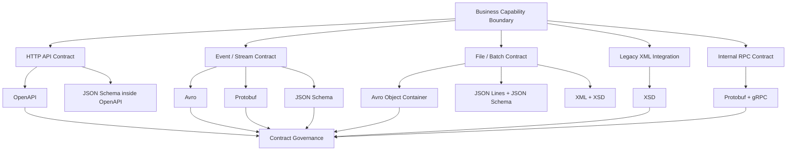
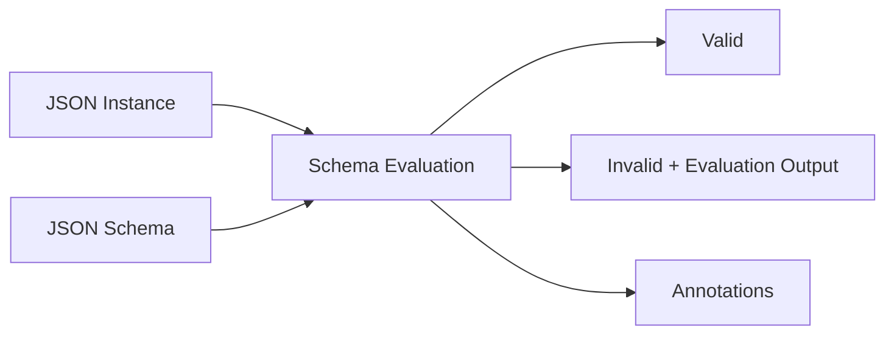
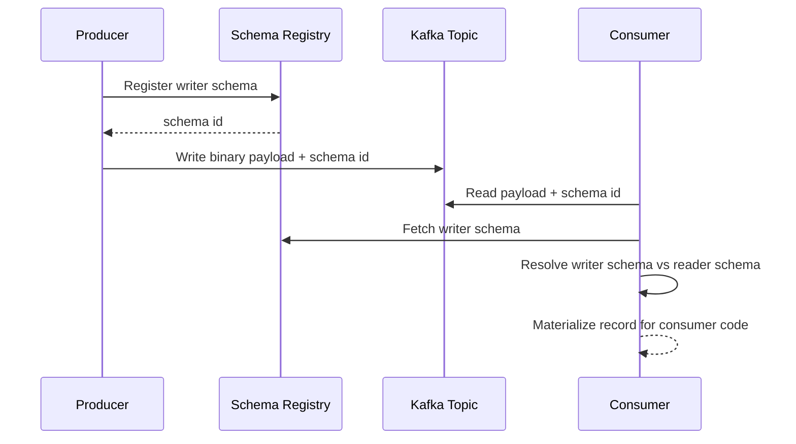
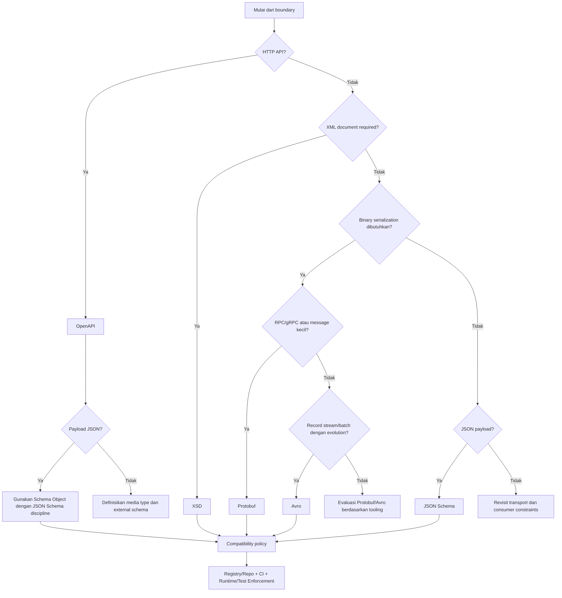

# Part 003 — Contract Taxonomy: XSD, JSON Schema, Avro, Protobuf, OpenAPI

Di part sebelumnya kita membahas bahwa data contract bukan file schema. Ia adalah **boundary agreement**: bentuk data, constraint, compatibility rule, ownership, runtime enforcement, dan konsekuensi ketika kontrak dilanggar.

Sekarang kita masuk ke pertanyaan yang sering terlihat sederhana tetapi paling sering salah dijawab:

> Untuk boundary ini, harus pakai XSD, JSON Schema, Avro, Protobuf, atau OpenAPI?

Jawaban buruk biasanya berbentuk preferensi:

- “JSON lebih modern.”
- “XML sudah legacy.”
- “Avro bagus untuk Kafka.”
- “Protobuf lebih cepat.”
- “OpenAPI sudah cukup untuk REST.”

Jawaban top engineer berbentuk **decision model**:

- boundary apa yang sedang dikontrak?
- siapa producer dan consumer-nya?
- apakah payload manusia perlu membaca langsung?
- apakah kontrak butuh binary efficiency?
- apakah schema harus ikut data?
- apakah compatibility bisa diperiksa otomatis?
- apakah evolusi data dipicu producer, consumer, atau regulator?
- apakah runtime perlu reject payload atau tolerate unknown field?
- apakah generated code menjadi source of truth atau hanya adapter?
- apakah contract artifact bisa dipromosikan antar environment?

Part ini adalah peta taksonomi. Tujuannya bukan hafal lima format, tetapi mampu memilih format dengan alasan yang tahan review.

---

## 1. Satu Kalimat untuk Setiap Format

Sebelum masuk detail, kita buat definisi kerja yang langsung berguna.

| Format | Definisi operasional |
|---|---|
| **XSD** | Bahasa kontrak untuk XML document dengan namespace, type system, occurrence constraint, identity constraint, dan model validasi yang matang untuk integrasi enterprise/legacy/regulatory. |
| **JSON Schema** | Bahasa constraint untuk JSON instance yang cocok untuk payload validation, document validation, config validation, dan reusable JSON data shape. |
| **Avro** | Format schema + serialization untuk data record, terutama event/batch/stream, dengan reader/writer schema resolution sebagai pusat evolusi. |
| **Protobuf** | IDL dan binary serialization untuk message kecil, cross-language, RPC/event, dengan field number sebagai identitas kompatibilitas wire. |
| **OpenAPI** | Interface description untuk HTTP API: endpoint, method, request, response, parameter, security, error, dan schema payload. |

Kesalahan pertama: menyamakan kelimanya sebagai “schema language”. Tidak semuanya berada di layer yang sama.



OpenAPI bukan pengganti JSON Schema. OpenAPI mendeskripsikan **API surface**. JSON Schema mendeskripsikan **JSON payload shape**. Avro dan Protobuf bukan hanya schema; keduanya mendefinisikan cara data diserialisasi dan dibaca lintas versi. XSD bukan sekadar XML validation; ia membawa namespace dan model komposisi yang kuat untuk document-centric integration.

---

## 2. Axis yang Benar untuk Membandingkan Contract Format

Jangan bandingkan format dari sintaks. Bandingkan dari axis engineering.

### 2.1 Boundary Axis

Pertanyaan pertama: kontrak ini mengamankan boundary apa?

| Boundary | Format yang biasanya kuat | Alasan |
|---|---|---|
| Public HTTP API | OpenAPI + JSON Schema discipline | Manusia, client generator, documentation, request/response lifecycle. |
| Internal HTTP API | OpenAPI atau code-first + generated spec | Tergantung governance dan jumlah consumer. |
| Async event stream | Avro / Protobuf / JSON Schema | Butuh evolution, registry, consumer isolation, replay. |
| High-volume binary RPC | Protobuf | Compact, generated code, gRPC ecosystem. |
| Enterprise XML document | XSD | Namespace, document validation, legacy integration, regulatory XML. |
| Data lake ingestion | Avro / Parquet schema / JSON Schema | Batch compatibility, evolution, analytics ingestion. |
| Config file | JSON Schema / YAML schema | Human-editable, validation errors penting. |
| Partner file exchange | XSD / JSON Schema / OpenAPI depending transport | Butuh explicit contract, examples, validation, audit. |

Boundary menentukan format lebih kuat daripada preferensi tim.

### 2.2 Human vs Machine Axis

Ada kontrak yang dibaca manusia setiap hari, ada kontrak yang hampir selalu diproses mesin.

| Format | Human readability | Machine efficiency | Typical usage |
|---|---:|---:|---|
| XML + XSD | Medium | Medium/Low | Enterprise documents, integration gateway. |
| JSON + JSON Schema | High | Medium | API payload, config, partner data. |
| Avro binary | Low | High | Kafka, stream, batch record. |
| Protobuf binary | Low | High | RPC, compact messages, internal services. |
| OpenAPI YAML/JSON | High | N/A for payload encoding | API description, docs, client/server generation. |

Catatan penting: **human-readable** bukan otomatis lebih baik. Untuk high-throughput event stream, keterbacaan payload mentah kalah penting dibanding compatibility, schema ID, replay, dan deserialization cost. Sebaliknya, untuk partner onboarding, keterbacaan spec dan error message jauh lebih bernilai daripada binary compactness.

### 2.3 Contract Expressiveness Axis

Setiap format bisa mengekspresikan constraint berbeda.

| Constraint | XSD | JSON Schema | Avro | Protobuf | OpenAPI |
|---|---:|---:|---:|---:|---:|
| Required field | Kuat | Kuat | Melalui field/default/evolution | Lemah/tergantung presence | Kuat via schema |
| Optional field | Kuat | Kuat | Union dengan `null` + default | Presence semantics | Kuat via schema |
| String pattern | Kuat | Kuat | Terbatas/custom | Tidak native sebagai validation | Via schema |
| Numeric range | Kuat | Kuat | Terbatas logical/custom | Tidak native | Via schema |
| Nested object | Kuat | Kuat | Kuat | Kuat | Kuat via schema |
| Polymorphism | Kuat tapi kompleks | Kuat tapi tricky | Union terbatas | `oneof` | `oneOf`/discriminator |
| Namespace/package | Sangat kuat | Via URI/id convention | Namespace | Package | Component namespace informal |
| Cross-field constraint | XSD 1.1 assertion | Terbatas/modern features | Tidak native | Tidak native | Terbatas |
| Wire compatibility | N/A sebagai XML text | N/A sebagai JSON text | Sangat eksplisit | Sangat eksplisit | API compatibility semantic |

Insight-nya: format dengan validation expressiveness tinggi belum tentu paling baik untuk evolution. Format dengan binary evolution kuat belum tentu cukup untuk business validation.

### 2.4 Evolution Axis

Compatibility adalah pusat data contract engineering.

| Format | Evolution unit | Identitas field | Cara evolusi umum |
|---|---|---|---|
| XSD | Namespace/type/element | QName: namespace + local name | Add optional element/attribute, namespace versioning, extension point. |
| JSON Schema | Property path + schema URI | Property name/path | Add optional property, keep old fields, avoid tightening. |
| Avro | Record field name + aliases | Field name, namespace, schema resolution | Add field with default, remove field carefully, aliases for rename. |
| Protobuf | Field number | Numeric tag | Add new field number, reserve removed fields, never reuse tags. |
| OpenAPI | Operation + request/response schema | Path/method/status/media type/schema fields | Add optional fields/endpoints, avoid changing response meaning. |

Perhatikan perbedaan krusial:

- Di JSON, nama field adalah identitas utama.
- Di Avro, nama field penting, tetapi reader/writer schema resolution memberi model evolusi yang formal.
- Di Protobuf, **field number** adalah identitas wire. Rename field bisa aman untuk wire, tetapi bisa breaking untuk JSON mapping, generated code, dokumentasi, dan consumer source code.
- Di XSD, namespace dapat menjadi boundary versi, tetapi terlalu banyak namespace versioning bisa membuat integrasi kaku.
- Di OpenAPI, compatibility bukan hanya schema. Mengubah HTTP status code, pagination behavior, security requirement, error shape, atau idempotency semantics bisa breaking walaupun schema diff terlihat aman.

---

## 3. XSD: Ketika Document Contract Lebih Penting daripada Payload Simplicity

XSD sering diremehkan karena diasosiasikan dengan legacy. Itu kesalahan. XSD kuat ketika masalahnya memang **document-centric** dan **namespace-heavy**.

### 3.1 Kapan XSD tepat

Gunakan XSD ketika:

1. Format eksternal sudah XML.
2. Partner/regulator mensyaratkan XML.
3. Dokumen butuh namespace formal.
4. Struktur dokumen kompleks dan hierarchical.
5. Validasi harus dilakukan sebelum business processing.
6. Ada kebutuhan document archival dan audit jangka panjang.
7. Ada banyak tipe reusable di domain yang stabil.
8. Ada integrasi SOAP/legacy/enterprise middleware.

Contoh domain:

- pajak dan e-invoicing;
- regulatory filing;
- insurance claims;
- banking statement/reporting;
- B2B procurement document;
- customs/import-export document;
- health data exchange berbasis XML;
- court/government filing.

### 3.2 Kekuatan XSD

XSD punya beberapa properti yang sulit ditandingi JSON Schema dalam enterprise XML integration.

#### Namespace sebagai compatibility boundary

XML namespace bukan sekadar prefix. Prefix hanya alias lokal; namespace URI adalah identitas. Ini membuat kontrak lintas organisasi lebih eksplisit.

```xml
<case:EnforcementCase
    xmlns:case="https://regulator.example/contracts/case/v1"
    xmlns:party="https://regulator.example/contracts/party/v1">
    <case:caseId>CASE-2026-0001</case:caseId>
    <party:regulatedEntityId>ENT-991</party:regulatedEntityId>
</case:EnforcementCase>
```

Di sini `caseId` dan `regulatedEntityId` bukan hanya string property. Mereka berada di namespace kontrak berbeda.

#### Occurrence constraint yang eksplisit

XSD membuat cardinality jelas:

```xml
<xs:element name="violation" type="case:ViolationType" minOccurs="1" maxOccurs="unbounded"/>
```

Ini lebih eksplisit daripada JSON array tanpa `minItems`/`maxItems`.

#### Type reuse dan composition

XSD mendukung `complexType`, `simpleType`, `include`, `import`, inheritance via extension/restriction, dan identity constraints. Untuk domain besar, ini bisa sangat berguna jika governance bagus.

### 3.3 Kelemahan XSD

XSD bermasalah ketika:

- tim tidak memahami namespace;
- schema dibuat terlalu abstrak;
- extension/restriction dipakai seperti inheritance OO;
- backward compatibility bergantung pada wildcard liar;
- XML binding langsung dijadikan domain model;
- parser security diabaikan;
- validation cost tidak dipahami;
- XSD 1.1 feature dipakai tetapi runtime validator hanya support XSD 1.0.

Anti-pattern paling umum:

```text
XSD -> generated JAXB classes -> business domain object -> JPA entity
```

Ini terlihat cepat, tetapi mencampur contract model, domain model, dan persistence model. Di sistem yang hidup lama, ini hampir selalu menjadi coupling debt.

### 3.4 XSD decision rule

Gunakan XSD jika masalahmu adalah **document validity + namespace governance + external enterprise interoperability**.

Jangan gunakan XSD hanya karena ingin “schema yang ketat” untuk JSON-era API. Untuk HTTP JSON API, OpenAPI + JSON Schema discipline biasanya lebih natural.

---

## 4. JSON Schema: Kontrak JSON yang Fleksibel tapi Mudah Disalahgunakan

JSON Schema adalah pilihan natural untuk JSON payload. Namun fleksibilitasnya membuat engineer sering membuat kontrak yang terlalu longgar atau terlalu pintar.

### 4.1 Kapan JSON Schema tepat

Gunakan JSON Schema ketika:

1. Payload utama adalah JSON.
2. Kamu butuh validation di API gateway, service boundary, config loader, atau ingestion pipeline.
3. Consumer tidak selalu menggunakan generated code.
4. Error message validasi harus manusiawi.
5. Data tetap perlu readable.
6. Kamu butuh schema composition via `$ref`.
7. Format tidak harus binary compact.

Contoh domain:

- API request/response body;
- partner JSON file exchange;
- dynamic form configuration;
- business rule configuration;
- event envelope JSON;
- validation layer sebelum mapping ke domain command;
- local configuration file.

### 4.2 Mental model JSON Schema

JSON Schema bukan “class definition”. Ia adalah kumpulan rule untuk mengevaluasi **JSON instance**.



Hal penting:

- `type` membatasi tipe JSON;
- `properties` mendeskripsikan property tertentu;
- `required` menyatakan property harus ada;
- `additionalProperties` mengontrol property ekstra;
- `$ref` menghubungkan schema;
- `oneOf`, `anyOf`, `allOf` adalah applicator, bukan inheritance;
- `format` sering berupa annotation, tidak selalu assertion tergantung validator;
- keyword behavior tergantung dialect/draft dan validator.

### 4.3 Kekuatan JSON Schema

#### Sangat cocok untuk boundary validation

Contoh request command:

```json
{
  "$schema": "https://json-schema.org/draft/2020-12/schema",
  "$id": "https://contracts.example.com/case/create-case-command.schema.json",
  "type": "object",
  "required": ["caseType", "regulatedEntityId", "receivedAt"],
  "additionalProperties": false,
  "properties": {
    "caseType": {
      "type": "string",
      "enum": ["COMPLAINT", "INSPECTION_FINDING", "SELF_REPORT"]
    },
    "regulatedEntityId": {
      "type": "string",
      "pattern": "^ENT-[0-9]{3,12}$"
    },
    "receivedAt": {
      "type": "string",
      "format": "date-time"
    },
    "summary": {
      "type": "string",
      "minLength": 1,
      "maxLength": 4000
    }
  }
}
```

Ini cocok sebagai ingress guard: reject payload sebelum masuk domain layer.

#### Composition dan reuse

```json
{
  "$defs": {
    "Money": {
      "type": "object",
      "required": ["amount", "currency"],
      "properties": {
        "amount": { "type": "string", "pattern": "^-?[0-9]+(\\.[0-9]{1,4})?$" },
        "currency": { "type": "string", "pattern": "^[A-Z]{3}$" }
      },
      "additionalProperties": false
    }
  }
}
```

Di sistem production, definisi seperti `Money`, `Address`, `PartyReference`, `Period`, dan `DecisionReference` sebaiknya menjadi library contract, bukan copy-paste.

### 4.4 Kelemahan JSON Schema

JSON Schema bisa menjadi jebakan ketika:

- `additionalProperties` dibiarkan default sehingga kontrak terlalu longgar;
- semua field optional karena takut breaking change;
- `oneOf` dipakai tanpa discriminator yang jelas;
- `$ref` menjadi graph rumit yang sulit dibundle;
- custom `format` tidak konsisten antar validator;
- schema dipakai untuk business rule yang seharusnya berada di domain service;
- schema draft berbeda antar tool;
- OpenAPI generator tidak mendukung penuh JSON Schema dialect yang digunakan.

### 4.5 JSON Schema decision rule

Gunakan JSON Schema jika masalahmu adalah **validasi JSON instance yang readable, explicit, dan bisa dijalankan di banyak boundary**.

Jangan gunakan JSON Schema untuk high-volume binary stream jika compatibility dan serialization efficiency lebih penting daripada readability.

---

## 5. Avro: Kontrak Record untuk Stream dan Batch yang Berevolusi

Avro sering dikenal sebagai “format Kafka”. Itu terlalu sempit. Avro adalah model schema + encoding untuk data record yang sangat berguna ketika writer dan reader schema bisa berbeda.

### 5.1 Kapan Avro tepat

Gunakan Avro ketika:

1. Kamu punya event stream atau batch record.
2. Data perlu compact.
3. Schema evolution adalah kebutuhan utama.
4. Producer dan consumer bisa berjalan dengan versi berbeda.
5. Schema registry bisa menjadi bagian dari platform.
6. Payload biasanya tidak perlu dibaca manusia secara mentah.
7. Record dipakai untuk data lake, ingestion, replay, CDC, atau analytics.

Contoh domain:

- Kafka event `CaseCreated`;
- CDC event dari operational DB;
- ingestion record ke data lake;
- daily regulatory report batch;
- audit event stream;
- payment transaction event;
- order lifecycle event.

### 5.2 Mental model Avro

Avro membaca data dengan dua schema:

- **writer schema**: schema yang dipakai saat data ditulis;
- **reader schema**: schema yang diharapkan consumer saat membaca.



Inilah kekuatan Avro: evolution bukan hanya convention. Ada mekanisme reader/writer schema resolution.

### 5.3 Kekuatan Avro

#### Efficient record encoding

Avro binary encoding tidak menyimpan nama field per record. Karena schema diketahui, data lebih compact dibanding JSON.

#### Schema evolution formal

Perubahan seperti add field dengan default dapat tetap dibaca consumer lama/baru jika aturan resolusi dipenuhi.

Contoh evolusi aman:

```json
{
  "type": "record",
  "name": "CaseCreated",
  "namespace": "com.example.contracts.case.v1",
  "fields": [
    { "name": "caseId", "type": "string" },
    { "name": "createdAt", "type": { "type": "long", "logicalType": "timestamp-millis" } },
    { "name": "priority", "type": "string", "default": "NORMAL" }
  ]
}
```

Jika field `priority` ditambahkan dengan default, reader yang mengharapkan field tersebut bisa membaca data lama.

#### Cocok untuk registry governance

Avro sangat cocok dengan schema registry karena:

- schema bisa didaftarkan;
- compatibility bisa dicek saat deploy;
- subject bisa mengikuti topic/event naming;
- schema ID bisa dibawa di payload envelope;
- consumer bisa resolve schema saat runtime.

### 5.4 Kelemahan Avro

Avro lemah ketika:

- manusia perlu membaca payload mentah;
- event terlalu command-like dan butuh semantic validation kompleks;
- union dipakai secara berlebihan;
- record reuse membuat coupling antar domain;
- schema registry tidak tersedia atau tidak reliable;
- default values tidak didesain dengan benar;
- logical type mapping Java tidak konsisten;
- `GenericRecord` menyebar ke business logic.

Anti-pattern:

```java
void handle(GenericRecord record) {
    var status = record.get("status").toString();
    // business logic langsung baca string field dari GenericRecord
}
```

Lebih baik mapping ke contract DTO atau domain command yang jelas.

### 5.5 Avro decision rule

Gunakan Avro jika masalahmu adalah **record-oriented data flow dengan schema evolution formal, terutama event stream dan batch**.

Jangan gunakan Avro sebagai public API contract untuk manusia kecuali ada alasan kuat.

---

## 6. Protobuf: IDL untuk Message Compact dan Cross-Language Runtime

Protobuf kuat bukan hanya karena cepat. Protobuf kuat karena ia memisahkan identitas wire dari nama field melalui field number.

### 6.1 Kapan Protobuf tepat

Gunakan Protobuf ketika:

1. Kamu butuh binary message compact.
2. Banyak bahasa pemrograman terlibat.
3. Generated code menjadi bagian workflow normal.
4. RPC/gRPC adalah transport utama.
5. Payload relatif kecil dan structured.
6. Low latency dan throughput penting.
7. Compatibility discipline bisa ditegakkan lewat field number/reserved rules.

Contoh domain:

- gRPC internal service;
- mobile/backend compact message;
- service mesh RPC;
- low-latency internal event;
- ML feature service request;
- cross-language infrastructure API.

### 6.2 Mental model Protobuf

Nama field penting bagi developer, tetapi wire identity adalah number.

```proto
message CaseCreated {
  string case_id = 1;
  string regulated_entity_id = 2;
  int64 created_at_epoch_millis = 3;
}
```

Di wire, field `case_id` diidentifikasi oleh tag `1`, bukan string `case_id`.

Ini berarti:

- rename field bisa wire-compatible;
- mengubah field number adalah breaking;
- menggunakan ulang field number lama adalah bahaya besar;
- `reserved` wajib dipakai ketika menghapus field.

```proto
message CaseCreated {
  reserved 4;
  reserved "old_status";

  string case_id = 1;
  string regulated_entity_id = 2;
  int64 created_at_epoch_millis = 3;
  string priority = 5;
}
```

### 6.3 Kekuatan Protobuf

#### Cross-language generated code

Protobuf menghasilkan class untuk Java, Go, Python, C++, C#, dan bahasa lain. Ini mengurangi interpretasi manual terhadap payload.

#### Strong wire compatibility discipline

Field number membuat evolusi lebih aman jika tim disiplin:

- jangan ubah number;
- jangan reuse number;
- jangan ubah type sembarangan;
- reserve yang dihapus;
- desain enum dengan unknown behavior;
- hati-hati dengan JSON mapping.

#### Cocok untuk gRPC

Protobuf menjadi natural jika service contract juga mendefinisikan method RPC.

```proto
service CaseCommandService {
  rpc CreateCase(CreateCaseRequest) returns (CreateCaseResponse);
}
```

### 6.4 Kelemahan Protobuf

Protobuf tidak cocok jika:

- consumer tidak mau generated code;
- public API harus mudah dieksplor manusia;
- payload perlu ad-hoc JSON validation;
- contract membutuhkan banyak business validation native;
- backward compatibility harus dipahami oleh non-engineer;
- data perlu queryable dalam bentuk mentah;
- field presence semantics tidak dipahami.

Anti-pattern:

```proto
message AnythingChanged {
  string type = 1;
  string payload_json = 2;
}
```

Ini mengubah Protobuf menjadi envelope kosong. Jika payload inti tetap JSON string tak tervalidasi, kamu kehilangan manfaat utama Protobuf.

### 6.5 Protobuf decision rule

Gunakan Protobuf jika masalahmu adalah **cross-language strongly-typed binary message dengan generated code dan compatibility berbasis field number**.

Jangan gunakan Protobuf hanya karena “lebih cepat” tanpa mempertimbangkan governance, debugging, JSON mapping, dan generated-code workflow.

---

## 7. OpenAPI: Kontrak Interface HTTP, Bukan Hanya Schema Body

OpenAPI berada di layer berbeda. Ia mendeskripsikan interaksi HTTP, bukan hanya payload.

### 7.1 Kapan OpenAPI tepat

Gunakan OpenAPI ketika:

1. Kamu punya HTTP API.
2. API perlu didokumentasikan.
3. Consumer perlu tahu endpoint, method, parameter, response, error, auth.
4. Client/server stub generation berguna.
5. Contract review dilakukan sebelum implementation.
6. API gateway atau test pipeline perlu spec.
7. Public atau partner API butuh discoverability.

Contoh domain:

- REST/HTTP public API;
- partner onboarding API;
- internal platform API;
- admin API;
- regulatory submission API;
- case management API;
- reporting API.

### 7.2 Apa yang dikontrak OpenAPI

OpenAPI mencakup:

- path;
- HTTP method;
- operation id;
- parameters;
- request body;
- response per status code;
- media type;
- schema;
- security schemes;
- examples;
- headers;
- callbacks/webhooks;
- tags dan documentation metadata.

```yaml
paths:
  /cases:
    post:
      operationId: createCase
      summary: Create a new enforcement case
      requestBody:
        required: true
        content:
          application/json:
            schema:
              $ref: '#/components/schemas/CreateCaseRequest'
      responses:
        '201':
          description: Case created
          content:
            application/json:
              schema:
                $ref: '#/components/schemas/CreateCaseResponse'
        '400':
          description: Invalid request
          content:
            application/problem+json:
              schema:
                $ref: '#/components/schemas/ProblemDetails'
```

Schema body hanya satu bagian. Mengubah `201` menjadi `200`, menghapus header, mengubah media type, atau mengganti error format bisa breaking walaupun JSON schema tidak berubah.

### 7.3 Kekuatan OpenAPI

#### Human + machine interface description

OpenAPI bisa menjadi sumber untuk:

- API docs;
- mock server;
- client SDK;
- server interface;
- request validation;
- response validation;
- API gateway policy;
- contract tests;
- breaking change checks.

#### Bagus untuk review

OpenAPI memungkinkan reviewer melihat API sebagai produk:

- apakah resource naming masuk akal?
- apakah status code sesuai?
- apakah error model konsisten?
- apakah pagination jelas?
- apakah idempotency dinyatakan?
- apakah security scheme tepat?
- apakah field required masuk akal?

### 7.4 Kelemahan OpenAPI

OpenAPI sering gagal ketika:

- spec dibuat setelah code sehingga hanya dokumentasi pasif;
- generated code menguasai domain model;
- response runtime tidak divalidasi;
- `nullable`, `oneOf`, discriminator, dan inheritance dipakai tanpa memahami generator;
- error model tidak distandardisasi;
- versioning hanya URL tanpa compatibility policy;
- API style linting tidak ada;
- spec terlalu besar dan tidak modular.

Anti-pattern:

```text
Controller -> auto-generated OpenAPI -> Swagger UI -> dianggap contract
```

Itu dokumentasi, bukan governance. Contract engineering membutuhkan quality gate dan runtime/test enforcement.

### 7.5 OpenAPI decision rule

Gunakan OpenAPI jika masalahmu adalah **HTTP interface contract**.

Jangan gunakan OpenAPI sebagai satu-satunya sumber kebenaran untuk event, batch file, atau internal domain model.

---

## 8. Decision Matrix Cepat

Gunakan tabel ini sebagai baseline review.

| Situation | Pilihan utama | Pilihan alternatif | Hindari |
|---|---|---|---|
| Public REST API JSON | OpenAPI 3.1/3.2 + disciplined schema | JSON Schema standalone untuk body | Avro/Protobuf jika consumer manusia/partner umum. |
| Internal gRPC service | Protobuf | OpenAPI jika HTTP JSON lebih sesuai | JSON Schema sebagai RPC IDL. |
| Kafka business event | Avro / Protobuf | JSON Schema jika readability prioritas | OpenAPI untuk event payload. |
| Regulatory XML submission | XSD | OpenAPI hanya untuk transport endpoint | JSON Schema jika regulator butuh XML. |
| Config file edited by humans | JSON Schema | XSD untuk XML config | Protobuf/Avro. |
| Data lake record ingestion | Avro | JSON Lines + JSON Schema | OpenAPI. |
| Partner batch file JSON | JSON Schema | Avro jika partner mendukung registry | Protobuf tanpa tooling partner. |
| Legacy SOAP integration | XSD/WSDL | Adapter ke internal JSON/Avro | Memaksakan OpenAPI langsung. |
| Mobile compact message | Protobuf | JSON + compression | XSD. |
| Audit event stream | Avro / Protobuf | JSON Schema jika audit reader human-centric | OpenAPI. |

---

## 9. Decision Flow

Berikut flow yang lebih dekat ke real design review.



Jika tim langsung memilih format sebelum menjawab boundary, keputusan biasanya prematur.

---

## 10. Compatibility Semantics per Format

Compatibility adalah bagian yang membedakan engineer biasa dengan contract engineer.

### 10.1 Add field

| Format | Aman? | Syarat |
|---|---:|---|
| XSD | Biasanya aman | Tambah optional element/attribute di posisi yang tidak merusak content model. |
| JSON Schema | Aman untuk reader toleran | Field baru optional, consumer tidak reject unknown field, atau schema lama open. |
| Avro | Aman jika default benar | Add field dengan default untuk reader baru membaca data lama. |
| Protobuf | Aman | Pakai field number baru, jangan required, perhatikan presence. |
| OpenAPI | Biasanya aman untuk response | Field response baru optional; request required baru breaking. |

### 10.2 Remove field

| Format | Risiko | Catatan |
|---|---|---|
| XSD | Tinggi | Consumer yang mengharapkan element bisa rusak. |
| JSON Schema | Tinggi | Consumer code bisa bergantung pada field walau schema tidak require. |
| Avro | Tergantung reader/writer | Field removal bisa aman jika reader tidak butuh atau punya default. |
| Protobuf | Medium/Tinggi | Jangan reuse tag; reserve field number/name. |
| OpenAPI | Tinggi | Menghapus response field sering breaking secara semantic. |

### 10.3 Rename field

| Format | Risiko | Catatan |
|---|---|---|
| XSD | Breaking | QName berubah. Bisa butuh alias/dual field/namespace strategy. |
| JSON Schema | Breaking | Nama property adalah contract identity. |
| Avro | Bisa dikelola | Gunakan aliases, tetapi jangan jadikan rename sebagai kebiasaan. |
| Protobuf | Wire-compatible jika number sama | Tapi breaking untuk source code, JSON mapping, docs, dan generated API. |
| OpenAPI | Breaking | Consumer melihat nama field/path/operation. |

### 10.4 Tighten validation

| Change | Biasanya breaking? | Kenapa |
|---|---:|---|
| optional -> required | Ya | Producer lama tidak mengirim field. |
| string bebas -> enum | Ya | Nilai lama mungkin tidak masuk enum. |
| maxLength diperkecil | Ya | Data lama bisa invalid. |
| additionalProperties true -> false | Ya | Payload lama dengan extension field jadi invalid. |
| numeric range dipersempit | Ya | Data lama bisa ditolak. |

Rule praktis:

> Producer contract boleh diperketat jika semua producer sudah dikendalikan dan data historis aman. Consumer-facing contract jangan diperketat tanpa migration playbook.

---

## 11. Cross-Format Mapping: Jangan Percaya Mapping 1:1

Banyak tim ingin satu canonical schema lalu generate XSD, JSON Schema, Avro, Protobuf, dan OpenAPI. Ini menggoda, tetapi berbahaya.

### 11.1 Mismatch utama

| Konsep | JSON Schema | Avro | Protobuf | XSD | Risiko mapping |
|---|---|---|---|---|---|
| Optional | not in `required` | union null/default | presence/default semantics | minOccurs=0 | Makna absent/null/default bisa berubah. |
| Enum | string enum | enum/string | enum numeric/name | restriction enumeration | Unknown enum behavior berbeda. |
| Decimal | string/number pattern | bytes/fixed decimal logical type | string/int/custom | decimal type | Precision hilang. |
| Timestamp | string date-time | long timestamp logical type | Timestamp message/int64 | dateTime | Timezone/precision mismatch. |
| Map | object additionalProperties | map | map | complex workaround | Key constraint beda. |
| Union | oneOf/anyOf | union | oneof | choice/substitution | Discriminator dan ambiguity beda. |

Jika kamu membuat generator lintas format, kamu harus mendefinisikan semantic model internal yang lebih kaya daripada format target. Tanpa itu, generator akan menghasilkan kontrak yang terlihat sama tetapi maknanya berbeda.

### 11.2 Contoh mismatch: optionality

JSON:

```json
{
  "type": "object",
  "properties": {
    "closedAt": { "type": ["string", "null"], "format": "date-time" }
  }
}
```

Ini mengizinkan:

```json
{}
```

Dan:

```json
{"closedAt": null}
```

Keduanya tidak selalu sama secara bisnis.

Protobuf:

```proto
message CaseStatusChanged {
  optional int64 closed_at_epoch_millis = 1;
}
```

Presence bisa diketahui, tetapi default behavior dan JSON mapping punya aturan sendiri.

Avro:

```json
{ "name": "closedAt", "type": ["null", {"type":"long", "logicalType":"timestamp-millis"}], "default": null }
```

Ada union order dan default rule.

XSD:

```xml
<xs:element name="closedAt" type="xs:dateTime" minOccurs="0" nillable="true"/>
```

`minOccurs=0` dan `xsi:nil=true` bukan hal yang sama.

Kesimpulan:

> “Optional” bukan konsep tunggal. Ia harus dipecah menjadi absent, explicit null, defaulted, unknown, not applicable, dan not yet known.

---

## 12. Format Selection by Organizational Context

Teknologi yang benar secara lokal bisa salah secara organisasi.

### 12.1 Jika tim consumer banyak dan tidak homogen

Pilih format yang mudah dikonsumsi dan didokumentasikan.

- Public/partner API: OpenAPI + examples + SDK optional.
- Partner JSON batch: JSON Schema + validation report.
- Regulator XML: XSD + sample documents + validation tool.

Jangan memaksakan Protobuf/Avro jika partner tidak punya tooling.

### 12.2 Jika platform event streaming sudah matang

Avro atau Protobuf dengan schema registry masuk akal.

Syarat minimum:

- registry high availability;
- compatibility mode jelas;
- subject naming standard;
- schema review process;
- DLQ/quarantine;
- replay playbook;
- generated artifact versioning;
- consumer impact analysis.

Tanpa ini, binary schema justru membuat debugging lebih sulit.

### 12.3 Jika domain sangat regulated

Prioritaskan auditability dan explicitness.

- Contract version harus immutable.
- Change rationale harus terekam.
- Examples harus divalidasi.
- Approval harus traceable.
- Runtime harus mencatat versi kontrak yang dipakai.
- Error handling harus defensible.

Format bisa berbeda per boundary, tetapi governance harus seragam.

---

## 13. Anti-Pattern Lintas Format

### 13.1 “One DTO everywhere”

```text
Database Entity = Domain Model = API DTO = Event Payload = Generated Schema Model
```

Ini hemat di awal, mahal di evolusi. Setiap perubahan satu layer mengguncang semua boundary.

### 13.2 “Schema as documentation only”

Spec ada, tetapi:

- tidak divalidasi di CI;
- tidak dipakai runtime;
- tidak dicek compatibility;
- tidak ada owner;
- tidak ada versioning;
- tidak ada generated artifact.

Ini bukan contract engineering. Ini dokumentasi pasif.

### 13.3 “Everything optional”

Tim membuat semua field optional supaya tidak breaking. Akibatnya:

- contract tidak memberi invariant;
- consumer harus defensive berlebihan;
- error pindah ke business logic;
- invalid data masuk storage;
- data quality runtuh.

Optionality harus dipakai untuk evolution, bukan untuk menghindari desain.

### 13.4 “Enum is safe because it is typed”

Enum justru sering breaking. Menambah enum value bisa merusak consumer yang memakai exhaustive switch.

```java
switch (status) {
    case OPEN -> handleOpen();
    case CLOSED -> handleClosed();
}
```

Jika `SUSPENDED` muncul, apa yang terjadi? Throw? Ignore? DLQ? Unknown bucket? Ini harus didesain di kontrak.

### 13.5 “Generated code is domain model”

Generated class adalah adapter contract. Domain model harus mengekspresikan behavior dan invariant bisnis. Jangan biarkan generator menentukan desain domain.

---

## 14. Production Heuristics

Gunakan heuristik ini saat review desain.

### 14.1 Pilih format berdasarkan failure mode

Pertanyaan paling penting:

> Kalau kontrak ini salah, failure-nya muncul di mana?

| Failure mode | Format/strategy yang membantu |
|---|---|
| Payload invalid harus ditolak sebelum business logic | JSON Schema, XSD, OpenAPI runtime validation. |
| Consumer lama harus tetap bisa membaca event baru | Avro/Protobuf + compatibility policy. |
| Partner harus memahami error manual | OpenAPI/JSON Schema/XSD + examples. |
| High-throughput event harus compact | Avro/Protobuf. |
| Document harus valid secara legal/regulatory | XSD atau JSON Schema dengan audit process. |
| API surface harus discoverable | OpenAPI. |

### 14.2 Jangan memilih format tanpa operating model

Format membutuhkan operating model:

| Format | Operating model minimum |
|---|---|
| XSD | Namespace policy, schema catalog, XML parser security, validation tooling. |
| JSON Schema | Dialect policy, bundling, validator standard, error mapping. |
| Avro | Schema registry, compatibility mode, subject naming, generated artifacts. |
| Protobuf | Package policy, field numbering discipline, reserved policy, generated code pipeline. |
| OpenAPI | API review, style linting, breaking change check, mock/test/doc publishing. |

Tanpa operating model, format terbaik pun menjadi file mati.

### 14.3 Bedakan “strict at ingress” dan “tolerant at read”

Sistem produksi butuh dua sikap yang tampak berlawanan:

- strict saat menerima command dari luar;
- tolerant saat membaca data lama/baru dari event atau partner yang berevolusi.

Contoh:

```text
Command API:
  reject unknown/invalid field jika risiko tinggi.

Event consumer:
  tolerate unknown field dan unknown enum jika event tidak relevan.

Regulatory filing:
  reject schema invalid, catat versi schema, simpan error evidence.
```

---

## 15. Format Choice untuk Sistem Java

Di Java, pilihan format juga memengaruhi build, runtime, dan dependency.

### 15.1 XSD di Java

Biasanya melibatkan:

- Jakarta XML Binding/JAXB;
- Xerces atau validator JAXP;
- StAX/SAX untuk streaming;
- secure XML parser configuration;
- generated classes dari XSD;
- adapter layer dari generated class ke domain model.

Cocok untuk document ingestion, bukan untuk high-frequency internal event.

### 15.2 JSON Schema di Java

Biasanya melibatkan:

- Jackson untuk JSON parsing;
- networknt JSON Schema Validator, Everit fork, atau validator lain;
- schema cache;
- validation error mapper;
- custom format/assertion;
- integration dengan OpenAPI validator.

Cocok untuk boundary validation dan config validation.

### 15.3 Avro di Java

Biasanya melibatkan:

- Avro Maven/Gradle plugin;
- `SpecificRecord` untuk typed contract;
- `GenericRecord` untuk generic pipelines;
- Confluent/Apicurio registry client;
- Kafka serializer/deserializer;
- compatibility check di CI.

Cocok untuk event stream dan batch record.

### 15.4 Protobuf di Java

Biasanya melibatkan:

- `protoc`;
- protobuf Gradle/Maven plugin;
- generated Java classes;
- gRPC plugin jika service RPC;
- buf lint/breaking check;
- package/field numbering policy.

Cocok untuk internal RPC dan compact message.

### 15.5 OpenAPI di Java

Biasanya melibatkan:

- OpenAPI Generator;
- swagger-core atau SmallRye OpenAPI untuk code-first/annotation;
- request/response validator;
- Spectral/openapi-diff untuk lint/diff;
- generated server interface atau client SDK;
- API docs publishing.

Cocok untuk HTTP API lifecycle.

---

## 16. Practical Selection Examples

### 16.1 Case intake public API

Kebutuhan:

- external consumer;
- HTTP JSON;
- documentation;
- validation;
- error model;
- examples;
- backward compatibility.

Pilihan:

```text
OpenAPI + JSON Schema discipline
```

Bukan Avro/Protobuf karena consumer eksternal perlu human-readable spec dan HTTP semantics.

### 16.2 Enforcement lifecycle event stream

Kebutuhan:

- multiple internal consumers;
- replay;
- schema evolution;
- high volume;
- registry;
- typed Java consumer.

Pilihan:

```text
Avro atau Protobuf + schema registry
```

Avro jika event diperlakukan sebagai data record dan analytics/lake integration penting. Protobuf jika event dekat dengan RPC/internal message dan cross-language generated code lebih dominan.

### 16.3 Regulatory XML filing

Kebutuhan:

- XML required;
- legal document shape;
- namespace;
- validation before acceptance;
- audit evidence.

Pilihan:

```text
XSD + secure XML validation + validation report
```

### 16.4 Internal service-to-service command

Kebutuhan:

- low latency;
- internal clients;
- generated code accepted;
- strongly typed method;
- versioned service contract.

Pilihan:

```text
Protobuf + gRPC
```

### 16.5 Dynamic workflow configuration

Kebutuhan:

- edited by platform team;
- reviewed in PR;
- readable;
- strict validation;
- no binary.

Pilihan:

```text
JSON Schema
```

---

## 17. Design Review Checklist

Sebelum menyetujui format kontrak, jawab pertanyaan ini.

### Boundary

- Boundary apa yang dikontrak?
- Producer siapa?
- Consumer siapa?
- Apakah consumer diketahui semua?
- Apakah contract public, partner, internal, atau private?

### Runtime

- Data dikirim lewat HTTP, Kafka, file, RPC, atau DB replication?
- Payload perlu dibaca manusia?
- Throughput/latency seberapa penting?
- Apakah validation dilakukan sync atau async?
- Apa yang terjadi jika invalid?

### Evolution

- Siapa yang bisa deploy lebih dulu: producer atau consumer?
- Perubahan mana yang dianggap breaking?
- Apakah compatibility bisa dicek otomatis?
- Apakah data historis perlu dibaca schema baru?
- Apakah field rename diperbolehkan?

### Governance

- Di mana schema disimpan?
- Siapa owner?
- Bagaimana review dilakukan?
- Apakah schema immutable setelah release?
- Bagaimana schema dipromosikan antar environment?

### Java implementation

- Apakah generated code dipakai?
- Apakah generated code boleh masuk domain layer?
- Apakah validator tersedia dan support dialect yang dipilih?
- Bagaimana schema cache?
- Bagaimana error mapping?

---

## 18. Ringkasan Mental Model

Jangan memilih format berdasarkan popularitas. Pilih berdasarkan **boundary + failure mode + evolution model + operating model**.

```text
XSD        -> XML document validity, namespace, enterprise/regulatory integration.
JSON Schema-> JSON instance validation, readable payload, boundary/config validation.
Avro       -> Record stream/batch, schema evolution, reader/writer resolution.
Protobuf   -> Binary cross-language message/RPC, field-number compatibility.
OpenAPI    -> HTTP API interface contract, documentation, client/server workflow.
```

Keahlian top 1% bukan mengetahui semua keyword dalam spesifikasi. Keahlian top 1% adalah tahu **konsekuensi** dari setiap keputusan kontrak.

Jika kamu memilih format, kamu juga memilih:

- cara data divalidasi;
- cara error dilaporkan;
- cara consumer berevolusi;
- cara schema direview;
- cara generated code dipakai;
- cara incident ditangani;
- cara audit membuktikan versi kontrak.

Pada part berikutnya kita akan membahas pendekatan kerja: **contract-first, code-first, schema-first, dan API-first**. Ini penting karena format yang sama bisa menghasilkan hasil yang sangat berbeda tergantung workflow engineering-nya.

---

## References

- JSON Schema Draft 2020-12: https://json-schema.org/draft/2020-12
- JSON Schema Specification: https://json-schema.org/specification
- OpenAPI Specification v3.2.0: https://spec.openapis.org/oas/v3.2.0.html
- Apache Avro 1.12.0 Specification: https://avro.apache.org/docs/1.12.0/specification/
- Apache Avro 1.12.0 Documentation: https://avro.apache.org/docs/1.12.0/
- Protocol Buffers Overview: https://protobuf.dev/overview/
- Protobuf Editions Overview: https://protobuf.dev/editions/overview/
- W3C XSD 1.1 Part 1 Structures: https://www.w3.org/TR/xmlschema11-1/
- Jakarta XML Binding 4.0: https://jakarta.ee/specifications/xml-binding/4.0/
