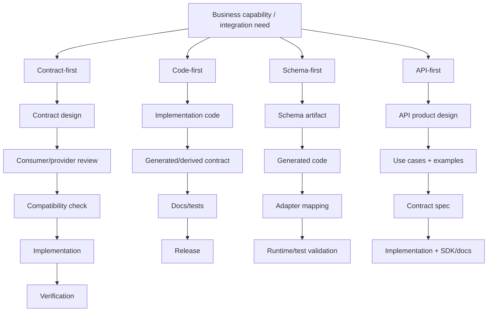
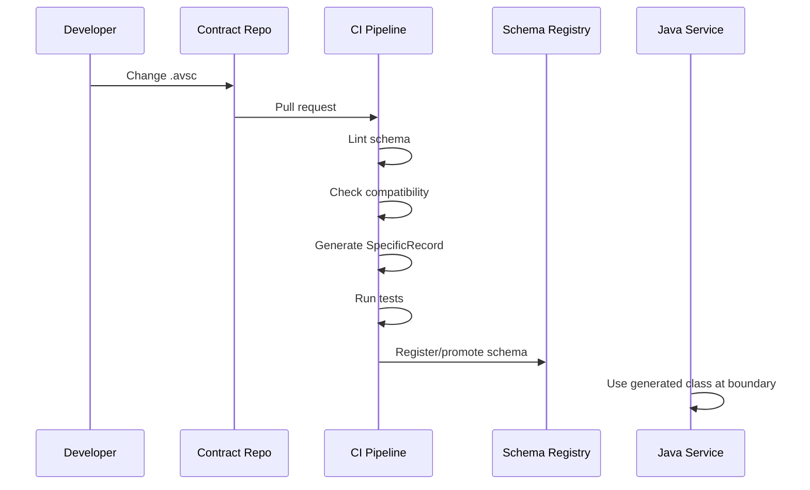
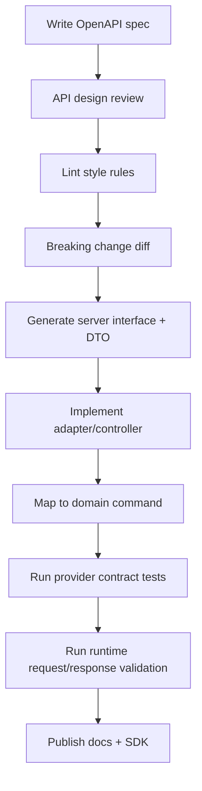
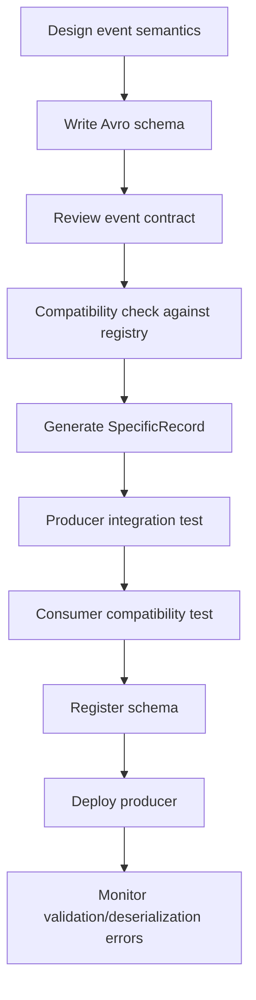
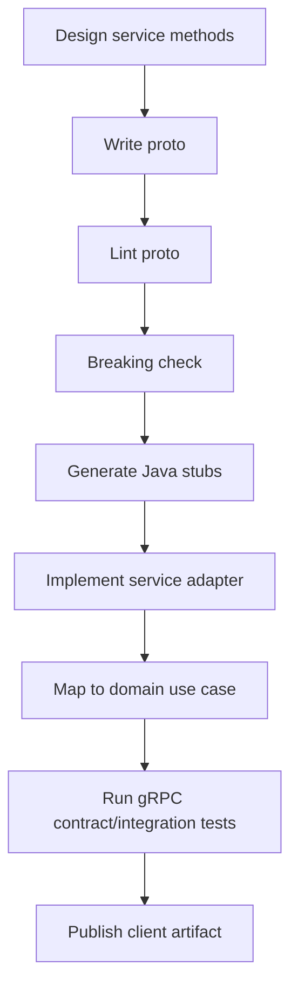
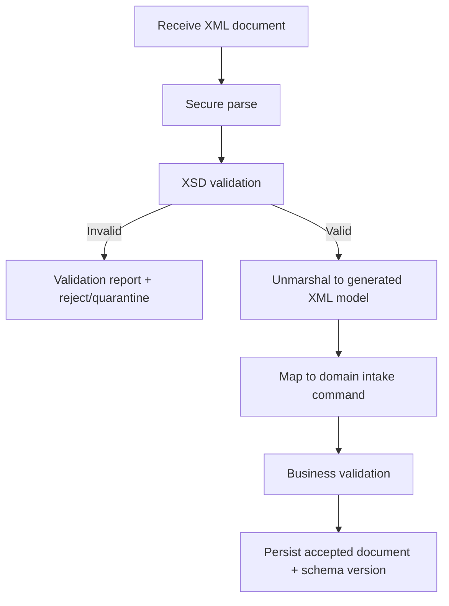
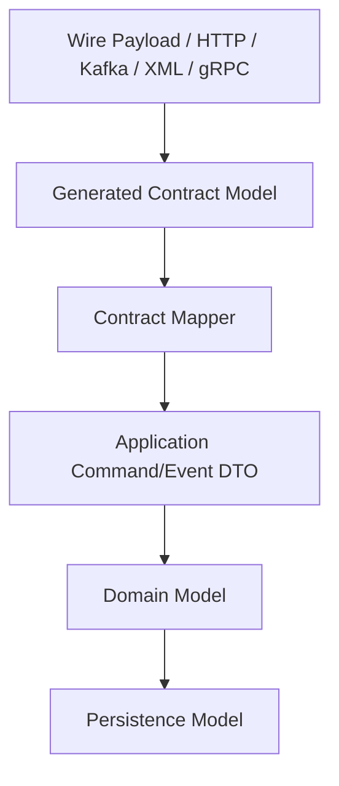
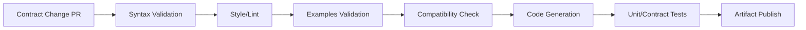
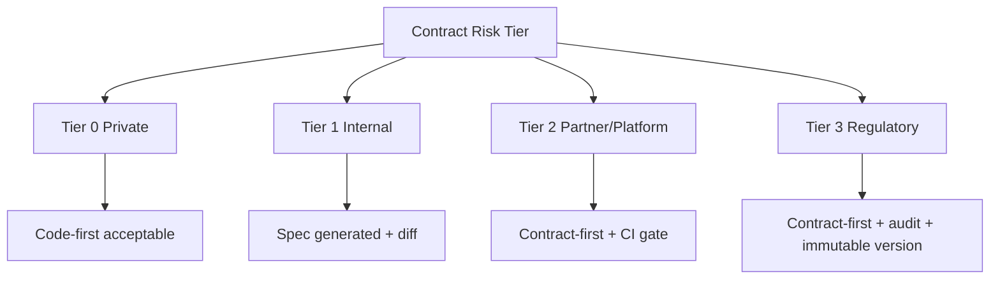

# Part 004 — Contract-First, Code-First, Schema-First, API-First

Pertanyaan “pakai format apa?” belum cukup. Dua tim bisa sama-sama memakai OpenAPI, Avro, atau Protobuf, tetapi hasil engineering-nya sangat berbeda.

Perbedaannya ada pada workflow:

- apakah kontrak didesain sebelum code?
- apakah code menjadi sumber kebenaran kontrak?
- apakah schema menjadi artifact utama?
- apakah API experience menjadi pusat desain?
- apakah CI/CD menolak breaking change?
- apakah generated code mengontrol architecture atau hanya membantu adapter?

Part ini membedah empat istilah yang sering dicampur:

1. **Contract-first**
2. **Code-first**
3. **Schema-first**
4. **API-first**

Tujuan kita bukan memilih satu agama. Tujuannya membangun workflow yang cocok untuk boundary, risiko, dan organisasi.

---

## 1. Definisi yang Tidak Ambigu

### 1.1 Contract-first

**Contract-first** berarti kontrak antar pihak disepakati, direview, dan distabilkan sebelum implementation dianggap selesai.

Kontrak bisa berupa:

- OpenAPI untuk HTTP;
- Avro schema untuk event;
- Protobuf `.proto` untuk RPC/message;
- XSD untuk XML document;
- JSON Schema untuk JSON payload;
- Pact contract untuk consumer expectation;
- kombinasi spec + examples + compatibility policy.

Yang penting bukan filenya, tetapi urutan keputusan:

```text
Design contract -> review compatibility -> generate/test -> implement -> verify runtime -> release
```

Contract-first tidak berarti implementation tidak boleh dimulai sama sekali sebelum spec final. Di sistem nyata, desain sering iteratif. Tetapi kontrak tetap menjadi artifact yang mengarahkan implementation dan menjadi quality gate.

### 1.2 Code-first

**Code-first** berarti kontrak diekstrak dari implementation code.

Contoh:

- Java controller annotation menghasilkan OpenAPI;
- Java record/class menghasilkan JSON Schema;
- JAXB annotation menghasilkan XSD;
- Protobuf jar/generated class menjadi implicit contract;
- event payload class diserialisasi lalu schema dibuat otomatis.

Workflow-nya:

```text
Implement code -> derive contract -> publish docs/spec -> test maybe -> release
```

Code-first bisa produktif untuk internal service kecil. Tetapi ia berbahaya untuk public/partner/regulatory boundary karena contract sering menjadi efek samping dari detail implementation.

### 1.3 Schema-first

**Schema-first** berarti schema formal adalah source of truth untuk data shape.

Contoh:

- `.avsc` menghasilkan Java `SpecificRecord`;
- `.proto` menghasilkan Java classes dan gRPC stubs;
- `.xsd` menghasilkan JAXB/Jakarta XML Binding classes;
- JSON Schema menghasilkan validator atau typed model;
- OpenAPI components menghasilkan DTO atau interface.

Workflow-nya:

```text
Write schema -> generate code/artifacts -> implement adapter/domain mapping -> validate compatibility -> release
```

Schema-first sering merupakan bentuk contract-first, tetapi tidak selalu. Schema-first bisa tetap buruk jika schema hanya dibuat oleh producer tanpa consumer review.

### 1.4 API-first

**API-first** berarti API diperlakukan sebagai produk dan integration surface utama, bukan byproduct dari backend implementation.

API-first biasanya mencakup:

- design review sebelum implementation;
- consistent resource model;
- error model;
- authentication/authorization semantics;
- pagination/filtering/sorting;
- idempotency;
- examples;
- SDK/doc/mock;
- consumer experience;
- lifecycle/deprecation policy.

API-first paling sering dikaitkan dengan OpenAPI, tetapi prinsipnya juga berlaku untuk gRPC API, event API, dan partner batch API.

---

## 2. Empat Pendekatan dalam Satu Diagram



Perhatikan: pendekatan ini bisa dikombinasikan.

Contoh workflow matang untuk HTTP API:

```text
API-first mindset + contract-first review + OpenAPI-first artifact + generated server interface + runtime validation
```

Contoh workflow matang untuk Kafka event:

```text
Contract-first review + schema-first Avro + registry compatibility + generated SpecificRecord + domain adapter
```

Contoh workflow matang untuk gRPC:

```text
API-first service design + schema-first Protobuf + buf breaking check + generated stubs + compatibility policy
```

---

## 3. Contract-First: Kapan Wajib, Kapan Berlebihan

### 3.1 Contract-first wajib ketika blast radius besar

Gunakan contract-first jika:

1. Consumer lebih dari satu tim.
2. Consumer tidak bisa deploy bersamaan dengan provider.
3. API/event dipakai partner eksternal.
4. Perubahan kontrak punya risiko finansial/regulatory.
5. Event perlu replay jangka panjang.
6. Data masuk data lake/reporting.
7. Ada SLA atau audit obligation.
8. Contract artifact dipakai untuk generate SDK, docs, mock, atau validator.

Di kondisi ini, implementation-first akan membuat consumer menjadi korban detail internal producer.

### 3.2 Contract-first bisa berlebihan ketika boundary private

Code-first bisa masuk akal jika:

- service masih private;
- satu tim mengontrol producer dan consumer;
- tidak ada storage/event historis;
- API bukan integration product;
- release dilakukan lockstep;
- cost governance lebih besar daripada risiko.

Namun tetap perlu minimal contract discipline:

- integration test;
- generated docs;
- semantic versioning internal;
- endpoint/payload review sebelum dipakai tim lain.

### 3.3 Output contract-first yang benar

Contract-first bukan hanya file spec. Output minimal:

| Artifact | Tujuan |
|---|---|
| Contract file | OpenAPI, XSD, JSON Schema, Avro, Protobuf. |
| Examples | Membuktikan payload valid dan menjelaskan use case. |
| Compatibility policy | Menentukan safe/breaking changes. |
| Ownership metadata | Siapa owner dan reviewer. |
| Version metadata | Versi kontrak dan lifecycle. |
| Validation strategy | Kapan dan di mana validasi dijalankan. |
| Error strategy | Apa yang terjadi jika kontrak dilanggar. |
| Generated artifacts | DTO/stub/client jika diperlukan. |
| Test suite | Provider/consumer/compatibility test. |

Tanpa ini, contract-first mudah berubah menjadi ceremony.

---

## 4. Code-First: Produktif, tapi Harus Dibatasi

Code-first sering dianggap buruk. Itu tidak adil. Code-first bisa sangat produktif jika boundary rendah risiko. Masalahnya muncul ketika code-first dipakai untuk boundary yang seharusnya stabil.

### 4.1 Contoh code-first OpenAPI di Java

```java
@Path("/cases")
@Produces(MediaType.APPLICATION_JSON)
@Consumes(MediaType.APPLICATION_JSON)
public class CaseResource {

    @POST
    public Response createCase(CreateCaseRequest request) {
        // implementation
        return Response.status(201).entity(new CreateCaseResponse(...)).build();
    }
}
```

Dengan annotation dan scanner, spec OpenAPI bisa dihasilkan dari resource class.

Keuntungan:

- cepat;
- docs mengikuti code;
- cocok untuk prototyping;
- mengurangi drift tertentu;
- developer tidak perlu menulis YAML manual.

Risiko:

- spec mewarisi struktur Java class;
- field internal bocor;
- default serialization Jackson menjadi contract tanpa sadar;
- annotation tersebar dan sulit direview sebagai satu API product;
- breaking change terlihat seperti refactor biasa;
- API style consistency sulit dijaga.

### 4.2 Kapan code-first layak

Code-first layak jika:

- API internal dan kecil;
- team maturity tinggi;
- generated spec tetap dicek lint/diff;
- DTO contract dipisah dari domain/entity;
- CI menolak breaking change;
- review tetap melihat generated OpenAPI diff;
- runtime behavior diuji terhadap spec.

Code-first tidak berarti governance-free.

### 4.3 Code-first guardrails

Jika memakai code-first, wajib punya guardrail:

1. **Dedicated contract DTO**

Jangan expose JPA entity.

```java
public record CreateCaseRequest(
    String caseType,
    String regulatedEntityId,
    OffsetDateTime receivedAt,
    String summary
) {}
```

2. **Generated spec committed atau published**

Reviewer harus bisa melihat spec diff.

3. **OpenAPI diff check**

Breaking changes harus tertangkap.

4. **Serialization config frozen**

Jackson naming strategy, date format, null inclusion, enum serialization harus dianggap bagian dari contract.

5. **Examples validated**

Example payload harus diuji valid terhadap generated spec.

6. **No domain leakage**

Domain model boleh berubah tanpa mengubah API contract.

### 4.4 Code-first failure mode

Failure mode khas:

```text
Refactor Java field name -> JSON property berubah -> mobile app rusak.
```

Atau:

```text
Tambah validation annotation @NotNull -> request field menjadi required -> partner lama gagal submit.
```

Di code-first, refactor lokal bisa menjadi contract change. Ini alasan kenapa code-first butuh diff gate.

---

## 5. Schema-First: Bagus jika Generated Code Tidak Menguasai Domain

Schema-first populer di Avro, Protobuf, XSD, dan OpenAPI-first workflow.

### 5.1 Schema-first Avro workflow



Schema-first membuat event contract eksplisit. Namun jangan biarkan generated class menjadi domain model.

Benar:

```text
Avro SpecificRecord -> Contract Mapper -> Domain Event/Command -> Business Logic
```

Salah:

```text
Avro SpecificRecord -> Business Logic langsung
```

### 5.2 Schema-first Protobuf workflow

```text
.proto -> protoc -> Java generated classes -> gRPC stubs -> service adapter -> domain use case
```

Guardrail penting:

- package name stabil;
- field numbers tidak berubah;
- removed fields di-reserve;
- enum unknown-handling jelas;
- generated classes tidak menjadi persistence model;
- breaking check dijalankan di CI.

### 5.3 Schema-first XSD workflow

```text
.xsd -> xjc/Jakarta XML Binding generated classes -> XML validator -> mapper -> domain command/document model
```

Guardrail penting:

- secure XML parsing;
- namespace policy;
- generated classes diisolasi;
- schema version dicatat;
- validation report disimpan;
- XSD 1.0/1.1 support dicek terhadap validator.

### 5.4 Schema-first OpenAPI workflow

```text
openapi.yaml -> generated server interface/client DTO -> implementation class -> request/response validation -> contract tests
```

Guardrail penting:

- generated interface boleh mengarahkan controller boundary;
- generated model tidak otomatis menjadi domain model;
- spec modular dan readable;
- lint style;
- examples valid;
- response runtime sesuai spec.

### 5.5 Kelemahan schema-first

Schema-first gagal ketika:

- schema ditulis oleh platform team tanpa feedback consumer;
- generated code sulit dibaca dan memaksa desain aneh;
- schema terlalu generic demi reuse;
- schema tidak punya examples;
- schema review hanya syntax review;
- compatibility check tidak berjalan;
- mapping layer dianggap boilerplate lalu dihapus.

Schema-first bukan tujuan akhir. Schema-first adalah cara membuat boundary explicit.

---

## 6. API-First: Lebih Luas dari OpenAPI

API-first adalah mindset produk. Ia bertanya:

> Apa pengalaman integrasi yang ingin kita berikan kepada consumer?

Bukan hanya:

> Class Java apa yang ingin kita expose?

### 6.1 API-first untuk HTTP

API-first HTTP mencakup:

- resource naming;
- operation semantics;
- status code;
- error model;
- authentication;
- authorization;
- idempotency;
- pagination;
- filtering;
- sorting;
- rate limiting;
- examples;
- deprecation;
- SDK;
- docs;
- support workflow.

OpenAPI adalah artifact penting, tetapi bukan seluruh API-first.

### 6.2 API-first untuk event

Event API juga punya consumer experience:

- event name;
- topic naming;
- event granularity;
- ordering semantics;
- delivery semantics;
- idempotency key;
- correlation ID;
- causation ID;
- schema version;
- replay policy;
- retention;
- DLQ behavior;
- consumer onboarding.

Jika tim hanya publish topic tanpa kontrak operasional, itu bukan event API yang matang.

### 6.3 API-first untuk gRPC

Untuk gRPC, API-first mencakup:

- service boundary;
- method naming;
- request/response granularity;
- error status mapping;
- deadline/cancellation behavior;
- streaming semantics;
- auth metadata;
- backward compatibility;
- generated client lifecycle.

`.proto` hanyalah artifact. API design-nya tetap perlu review.

---

## 7. Workflow Patterns Production-Grade

### 7.1 Pattern A — OpenAPI-first Java HTTP API

Cocok untuk public/partner/internal platform API.



Prinsip:

- OpenAPI file adalah source of truth.
- Generated code berada di adapter layer.
- Domain model tidak generated.
- CI memvalidasi examples dan diff.
- Response validation minimal di test, opsional di runtime production dengan sampling/strict mode tergantung cost.

Struktur repo:

```text
case-api/
  contracts/
    openapi/
      case-management-api.yaml
      components/
        schemas.yaml
        errors.yaml
        parameters.yaml
      examples/
        create-case-request.json
        create-case-response.json
  service/
    src/main/java/...
  generated/
    openapi/...
```

### 7.2 Pattern B — Avro schema-first event pipeline

Cocok untuk Kafka/data platform.



Prinsip:

- Event bukan database row dump.
- Schema evolution rule jelas.
- Default values dipikirkan.
- Subject naming disepakati.
- Consumer bisa membaca data lama.
- DLQ menyimpan schema ID dan original payload metadata.

Struktur repo:

```text
contracts/
  avro/
    case/
      CaseCreated.avsc
      CaseStatusChanged.avsc
    audit/
      AuditEntryRecorded.avsc
  compatibility/
    rules.yaml
```

### 7.3 Pattern C — Protobuf-first gRPC service

Cocok untuk internal service-to-service RPC.



Prinsip:

- Field number adalah aset jangka panjang.
- Removed fields harus reserved.
- Service method jangan terlalu chatty.
- Deadline, cancellation, dan error model harus jelas.
- Generated classes tidak masuk domain core.

### 7.4 Pattern D — XSD-first XML ingestion

Cocok untuk document intake enterprise/regulatory.



Prinsip:

- Parser security sebelum validation.
- XSD validation bukan business validation lengkap.
- Original document disimpan jika audit butuh.
- Schema version dan validation result dicatat.
- Generated JAXB model diisolasi.

### 7.5 Pattern E — JSON Schema-first configuration contract

Cocok untuk platform config/workflow/rules.

```text
json schema -> config examples -> PR validation -> config loader validation -> typed config object -> runtime use
```

Prinsip:

- Config invalid harus gagal cepat.
- Error message harus actionable.
- Schema version harus jelas.
- Defaulting harus eksplisit.
- Unknown fields sebaiknya ditolak untuk menghindari typo diam-diam.

---

## 8. Generated Code Boundary Rule

Generated code adalah alat, bukan arsitektur.

Rule utama:

> Generated code hanya boleh hidup di contract adapter layer, kecuali kamu dengan sadar menerima coupling-nya.

Layer yang disarankan:



Mengapa perlu mapper?

1. Contract field bisa berubah tanpa mengguncang domain.
2. Domain invariant bisa lebih kuat daripada schema.
3. Persistence optimization tidak bocor ke API.
4. Generated class bisa diganti tool/version.
5. Testing domain lebih bersih.

### 8.1 Mapper bukan boilerplate bodoh

Mapper adalah tempat translasi semantic:

| Contract value | Domain interpretation |
|---|---|
| missing `closedAt` | case belum ditutup atau informasi tidak dikirim? |
| `priority = "UNKNOWN"` | unknown upstream atau default fallback? |
| empty string | invalid, unknown, atau intentionally blank? |
| enum baru | reject, tolerate, map ke `UNRECOGNIZED`? |
| decimal string | convert ke `BigDecimal` dengan scale policy. |

Mapper adalah boundary reasoning. Jangan otomatis dihapus demi “clean code”.

---

## 9. Source of Truth Strategy

Setiap sistem harus menjawab: artifact mana yang menjadi source of truth?

### 9.1 Possible source of truth

| Source of truth | Cocok untuk | Risiko |
|---|---|---|
| OpenAPI file | HTTP API contract-first | YAML drift jika implementation tidak diverifikasi. |
| Java annotations | Internal code-first API | Refactor menjadi breaking change diam-diam. |
| Avro `.avsc` | Event/batch schema | Schema bagus tapi semantics event bisa miskin. |
| Protobuf `.proto` | gRPC/RPC/message | Generated code coupling, field-number mistakes. |
| XSD | XML document | Schema terlalu kompleks, validator support mismatch. |
| Pact contracts | Consumer-driven test | Hanya mencakup interaction yang dipakai consumer. |
| Database schema | Internal storage | Sangat buruk sebagai external contract source. |

Database schema hampir tidak pernah boleh menjadi source of truth untuk API/event contract. DB schema adalah storage optimization dan integrity layer, bukan integration promise.

### 9.2 Source of truth decision rule

Gunakan source of truth yang paling dekat dengan **external promise**, bukan internal convenience.

```text
HTTP promise       -> OpenAPI
JSON payload       -> JSON Schema / OpenAPI schema
Kafka event        -> Avro/Protobuf/JSON Schema in registry
XML document       -> XSD
Internal gRPC      -> Protobuf
Consumer behavior  -> Pact/consumer contract
```

---

## 10. CI/CD untuk Contract Workflow

Contract-first tanpa CI adalah dokumen niat baik. Production-grade workflow perlu quality gate.

### 10.1 Minimum CI stages



### 10.2 Apa yang dicek per format

| Format | Syntax | Lint | Example validation | Compatibility | Codegen |
|---|---:|---:|---:|---:|---:|
| OpenAPI | Yes | Yes | Yes | openapi-diff | Optional/Yes |
| JSON Schema | Yes | Convention | Yes | custom semantic diff | Optional |
| Avro | Yes | Convention | Sample record | registry/backward/full | Yes |
| Protobuf | Yes | buf/protolint | Sample message | buf breaking/custom | Yes |
| XSD | Yes | Naming/ns policy | Sample XML | custom diff/versioning | Often yes |

### 10.3 Break build or warn?

Tidak semua check harus break build. Gunakan severity.

| Severity | Contoh | Action |
|---|---|---|
| Error | Invalid schema syntax | Block merge. |
| Error | Breaking change tanpa migration approval | Block merge. |
| Error | Example invalid | Block merge. |
| Warning | Description missing | Allow with warning or style gate. |
| Warning | Field name kurang konsisten | Review required. |
| Info | New optional response field | Log diff. |

Quality gate yang terlalu keras membuat tim bypass. Quality gate yang terlalu lunak tidak memberi perlindungan. Pilih guardrail berdasarkan risiko boundary.

---

## 11. Compatibility Workflow

Contract change harus menjawab tiga pertanyaan:

1. Apakah schema baru valid?
2. Apakah schema baru compatible dengan versi lama?
3. Apakah perubahan semantic aman bagi consumer nyata?

### 11.1 Schema compatibility vs semantic compatibility

Schema compatibility tidak cukup.

Contoh OpenAPI:

```yaml
status:
  type: string
  enum: [OPEN, CLOSED]
```

Menjadi:

```yaml
status:
  type: string
  enum: [OPEN, CLOSED, SUSPENDED]
```

Schema diff mungkin melihat penambahan enum sebagai perubahan kecil. Tetapi consumer dengan exhaustive switch bisa rusak.

Contoh Avro:

```json
{ "name": "amount", "type": "string" }
```

Masih string, tetapi semantics berubah dari rupiah ke sen. Schema compatible, business breaking.

Karena itu contract review harus mencakup:

- structural compatibility;
- semantic compatibility;
- operational compatibility;
- consumer readiness.

### 11.2 Consumer impact analysis

Untuk perubahan besar, buat impact matrix.

| Consumer | Uses field? | Tolerates unknown? | Deploy required? | Risk |
|---|---:|---:|---:|---|
| case-ui | Yes | No | Yes | High |
| reporting-pipeline | Yes | Yes | No | Medium |
| audit-service | No | Yes | No | Low |
| partner-gateway | Yes | Unknown | Yes | High |

Contract engineering tidak berhenti di schema diff. Ia menyambungkan diff ke sistem nyata.

---

## 12. Review Process yang Efektif

Review kontrak bukan review formatting.

### 12.1 Checklist reviewer

Reviewer harus bertanya:

- Boundary apa yang berubah?
- Siapa consumer-nya?
- Apakah field baru benar-benar punya meaning stabil?
- Apakah field required justified?
- Apakah default value aman?
- Apakah enum future-proof?
- Apakah error behavior jelas?
- Apakah examples mencakup happy path dan edge case?
- Apakah migration/deprecation diperlukan?
- Apakah runtime validation berubah?
- Apakah observability menangkap violation?

### 12.2 Contract ADR ringan

Untuk perubahan signifikan, tulis ADR mini:

```md
# ADR: Add SUSPENDED case status

## Context
Some enforcement cases can be temporarily paused due to court injunction.

## Decision
Add SUSPENDED to CaseStatus.

## Compatibility
- Existing consumers may use exhaustive switch.
- Producer will emit SUSPENDED only after consumer readiness checklist is complete.
- Unknown status mapping added to reporting pipeline.

## Rollout
1. Release consumer tolerant handling.
2. Deploy producer with feature flag off.
3. Enable emission for internal cases.
4. Monitor unknown status metrics.
```

ADR tidak harus panjang. Yang penting reasoning dan evidence.

---

## 13. Choosing the Workflow

Gunakan matrix ini.

| Context | Recommended workflow |
|---|---|
| Public HTTP API | API-first + contract-first + OpenAPI-first. |
| Internal CRUD admin API kecil | Code-first boleh, dengan generated spec diff. |
| Kafka business event | Contract-first + schema-first Avro/Protobuf. |
| gRPC platform service | API-first + schema-first Protobuf. |
| Regulatory XML intake | Contract-first + XSD-first + validation report. |
| JSON config | Schema-first JSON Schema + PR validation. |
| Prototype satu tim | Code-first, tapi jangan publish sebagai stable contract. |
| Consumer-driven integration | Pact/code-first consumer contract + provider verification. |

---

## 14. Example: Salah vs Benar pada Java HTTP API

### 14.1 Salah: JPA entity menjadi API response

```java
@Entity
public class CaseEntity {
    @Id
    private UUID id;
    private String internalStatus;
    private String assignedOfficerUserId;
    private String internalNotes;
    private Instant createdAt;
}
```

Lalu langsung dikembalikan:

```java
@GET
@Path("/{id}")
public CaseEntity getCase(@PathParam("id") UUID id) {
    return repository.findById(id);
}
```

Masalah:

- internal field bocor;
- DB refactor menjadi API breaking change;
- lazy loading bisa bocor;
- security masking sulit;
- OpenAPI generated dari entity menyesatkan;
- contract tidak didesain.

### 14.2 Benar: Contract DTO + mapper

```java
public record CaseResponse(
    String caseId,
    String status,
    String createdAt,
    List<LinkResponse> links
) {}
```

Mapping:

```java
public final class CaseResponseMapper {
    public CaseResponse toResponse(CaseView view) {
        return new CaseResponse(
            view.caseId().value(),
            mapStatus(view.status()),
            view.createdAt().toString(),
            buildLinks(view)
        );
    }
}
```

Sekarang contract bisa stabil walaupun DB/domain berubah.

---

## 15. Example: Event Schema Workflow

### 15.1 Salah: Event dari entity snapshot

```java
public class CaseEntityChangedEvent {
    public UUID id;
    public String status;
    public String assignedOfficerUserId;
    public String internalLockVersion;
    public String databaseShard;
}
```

Masalah:

- event bocor internal storage;
- consumer bergantung pada field yang tidak semantic;
- replay sulit;
- evolution mengikuti DB, bukan domain event;
- security risk.

### 15.2 Benar: Event dari fakta domain

```json
{
  "type": "record",
  "name": "CaseAssigned",
  "namespace": "com.example.contracts.case.v1",
  "fields": [
    { "name": "eventId", "type": "string" },
    { "name": "caseId", "type": "string" },
    { "name": "assignedOfficerId", "type": "string" },
    { "name": "assignedAt", "type": { "type": "long", "logicalType": "timestamp-millis" } },
    { "name": "assignmentReason", "type": ["null", "string"], "default": null }
  ]
}
```

Ini schema-first, tetapi lebih penting: event semantics-first.

---

## 16. Hidden Assumptions yang Harus Ditantang

### 16.1 “Spec-first memperlambat delivery”

Spec-first memperlambat delivery jika prosesnya buruk. Namun untuk boundary berisiko, ia mencegah rework, incident, dan consumer breakage.

Better framing:

```text
Apakah kita ingin menemukan masalah kontrak saat PR review atau setelah consumer production rusak?
```

### 16.2 “Generated code menghilangkan kebutuhan test”

Generated code hanya membuktikan schema bisa dikompilasi. Ia tidak membuktikan:

- runtime serialization config benar;
- provider memenuhi spec;
- consumer memakai field dengan aman;
- error model benar;
- examples representatif;
- semantic compatibility aman.

### 16.3 “Kalau schema compatible, release aman”

Tidak selalu. Compatibility structural tidak menjamin compatibility semantic.

### 16.4 “Code-first selalu drift-free”

Code-first bisa mengurangi drift antara code dan generated docs, tetapi bisa membuat docs mengikuti kesalahan code. Drift-free bukan berarti design-correct.

### 16.5 “API-first hanya untuk public API”

Internal API juga punya consumer. Semakin platform-like suatu service, semakin penting API-first.

---

## 17. Operating Model Berdasarkan Risiko

Tidak semua contract butuh proses sama. Gunakan tier.

### Tier 0 — Private implementation detail

- Satu service, satu tim.
- Tidak dipakai consumer eksternal.
- Bisa code-first.
- Minimal tests.

### Tier 1 — Internal team-to-team contract

- Consumer internal diketahui.
- Butuh generated docs/spec.
- Diff check warning/error tergantung change.
- Owner jelas.

### Tier 2 — Platform/partner contract

- Banyak consumer.
- Contract-first.
- Compatibility gate wajib.
- Examples wajib.
- Deprecation policy wajib.
- Runtime/test validation wajib.

### Tier 3 — Regulatory/high-risk contract

- Audit evidence wajib.
- Version immutable.
- Approval traceable.
- Validation report retained.
- Change rationale wajib.
- Rollback/migration playbook wajib.



---

## 18. Practical Implementation Blueprint

Untuk seri ini, baseline workflow production-grade adalah:

```text
1. Define boundary and risk tier.
2. Choose contract artifact.
3. Write examples before implementation is complete.
4. Run syntax + lint + example validation.
5. Run compatibility check.
6. Generate adapter code if useful.
7. Keep generated code outside domain core.
8. Implement mapper.
9. Run provider/consumer tests.
10. Publish artifact and docs.
11. Monitor runtime violations.
```

### 18.1 Minimal repo layout

```text
contracts-platform/
  openapi/
    case-api/
      openapi.yaml
      examples/
  avro/
    case-events/
      CaseCreated.avsc
      CaseAssigned.avsc
  protobuf/
    case-rpc/
      case_command_service.proto
  xsd/
    regulatory-filing/
      filing-v1.xsd
      examples/
  json-schema/
    workflow-config/
      workflow-definition.schema.json
      examples/
  policies/
    compatibility.yaml
    naming.yaml
    review-tier.yaml
  adr/
    0001-case-status-suspended.md
```

### 18.2 Minimal CI pseudo-pipeline

```yaml
stages:
  - validate-syntax
  - lint-style
  - validate-examples
  - compatibility-check
  - generate-code
  - run-contract-tests
  - publish-artifacts
```

Prinsipnya: semua contract artifact diperlakukan seperti production code.

---

## 19. Decision Rules Final

### Gunakan contract-first jika:

- consumer penting;
- release tidak lockstep;
- data historis perlu dibaca;
- regulatory/audit risk ada;
- partner eksternal terlibat;
- blast radius besar.

### Gunakan code-first jika:

- boundary private;
- tim tunggal;
- lifecycle cepat;
- governance cost terlalu tinggi;
- generated spec tetap dicek.

### Gunakan schema-first jika:

- format memang schema-centric;
- generated code membantu;
- compatibility bisa dicek;
- adapter layer disediakan;
- schema direview sebagai artifact utama.

### Gunakan API-first jika:

- API adalah produk;
- consumer experience penting;
- docs/SDK/mock dibutuhkan;
- error/lifecycle/security harus konsisten;
- service menjadi platform capability.

---

## 20. Ringkasan Mental Model

Empat istilah ini bukan lawan mutlak.

```text
Contract-first = urutan agreement dan quality gate.
Code-first     = code sebagai sumber derivasi kontrak.
Schema-first   = schema artifact sebagai source of truth data shape.
API-first      = integration experience sebagai pusat desain.
```

Workflow terbaik biasanya kombinasi.

Untuk sistem Java production-grade, pola aman adalah:

```text
Contract/API design first
-> schema/spec as artifact
-> generated code at adapter layer
-> domain mapping explicit
-> compatibility check in CI
-> runtime/test validation
-> published docs/artifacts
-> observability on contract violations
```

Pada part berikutnya kita akan masuk ke **Java Contract Engineering Toolchain**: Maven/Gradle, generator, validator, schema registry client, OpenAPI generator, Avro/Protobuf plugin, CI hooks, dan struktur project yang repeatable.

---

## References

- OpenAPI Specification v3.2.0: https://spec.openapis.org/oas/v3.2.0.html
- OpenAPI Learn — Upgrading from 3.1 to 3.2: https://learn.openapis.org/upgrading/v3.1-to-v3.2.html
- JSON Schema Draft 2020-12: https://json-schema.org/draft/2020-12
- Apache Avro 1.12.0 Specification: https://avro.apache.org/docs/1.12.0/specification/
- Protocol Buffers Overview: https://protobuf.dev/overview/
- Protobuf Editions Overview: https://protobuf.dev/editions/overview/
- W3C XSD 1.1 Part 1 Structures: https://www.w3.org/TR/xmlschema11-1/
- Jakarta XML Binding 4.0: https://jakarta.ee/specifications/xml-binding/4.0/
- Pact Documentation: https://docs.pact.io/
