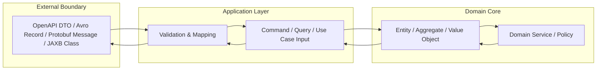
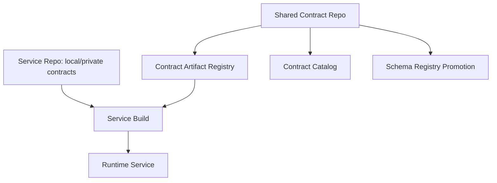
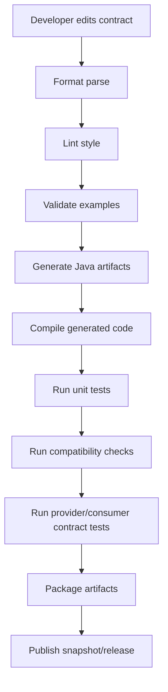
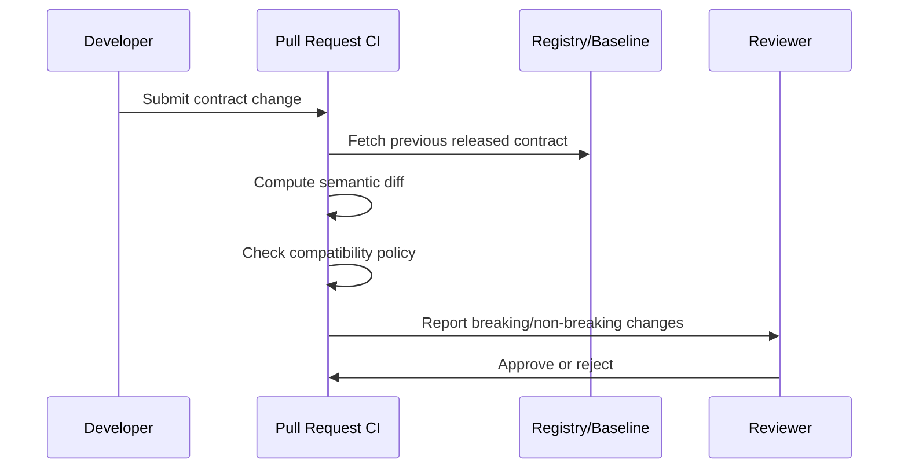
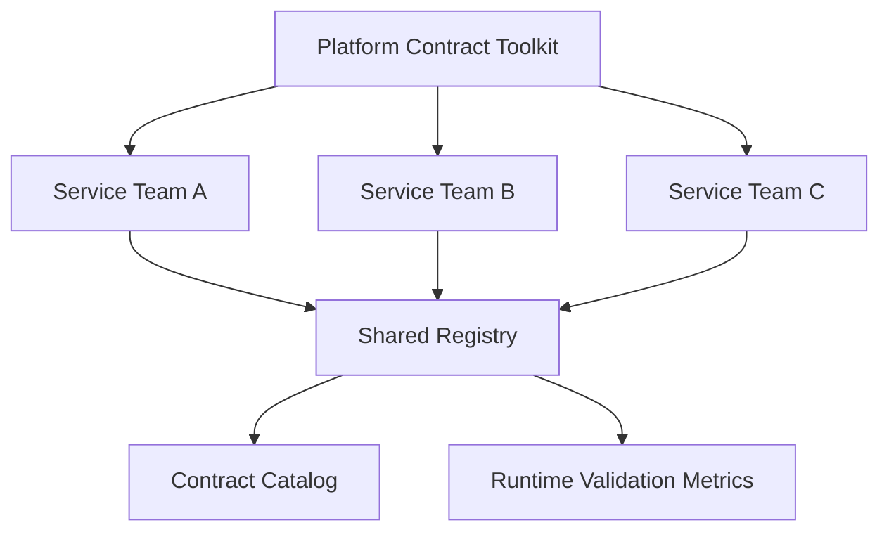
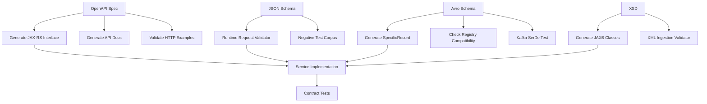

# Part 005 — Java Contract Engineering Toolchain

Kontrak data yang bagus bisa tetap gagal di produksi kalau toolchain-nya buruk.

Masalah paling umum bukan karena tim tidak tahu XSD, JSON Schema, Avro, Protobuf, atau OpenAPI. Masalahnya adalah kontrak diperlakukan sebagai file dokumentasi, bukan sebagai **artifact engineering** yang ikut build, test, release, deploy, observe, dan rollback.

Di sistem production-grade, kontrak harus punya posisi yang sama seriusnya dengan source code.

Kontrak harus:

- punya owner;
- punya version history;
- bisa divalidasi otomatis;
- bisa dibandingkan untuk breaking change;
- bisa menghasilkan artifact turunan secara deterministik;
- bisa dipakai runtime untuk enforcement;
- bisa dipakai test untuk memverifikasi provider dan consumer;
- bisa dipromosikan antar environment;
- bisa diaudit ketika terjadi incident atau sengketa data.

Part ini membangun toolchain Java untuk itu.

Kita tidak akan membahas semua library secara encyclopedic. Fokusnya adalah architecture dan workflow: bagaimana membuat kontrak menjadi bagian dari sistem engineering yang repeatable.

---

## 1. Mental Model: Contract Toolchain adalah Compiler Pipeline

Cara paling efektif memahami contract toolchain adalah melihatnya seperti compiler pipeline.

```mermaid
flowchart LR
    A[Contract Source Files] --> B[Parse]
    B --> C[Normalize]
    C --> D[Lint]
    D --> E[Semantic Validate]
    E --> F[Compatibility Check]
    F --> G[Generate Artifacts]
    G --> H[Test]
    H --> I[Publish]
    I --> J[Runtime Enforcement]
    J --> K[Telemetry & Drift Detection]
```



Kontrak bukan langsung dipakai begitu saja. Kontrak melewati tahap:

1. **Parse** — apakah file valid secara syntax?
2. **Normalize** — apakah bentuknya canonical agar diff tidak noisy?
3. **Lint** — apakah gaya desain mengikuti policy tim?
4. **Semantic validate** — apakah kontrak masuk akal secara domain dan format?
5. **Compatibility check** — apakah perubahan aman untuk consumer lama dan provider lama?
6. **Generate artifacts** — apakah Java code, docs, mocks, fixtures, dan descriptor bisa dihasilkan deterministik?
7. **Test** — apakah implementation sesuai kontrak?
8. **Publish** — apakah artifact bisa dikonsumsi tim lain?
9. **Runtime enforce** — apakah payload nyata divalidasi pada boundary?
10. **Observe** — apakah terjadi drift antara kontrak dan payload produksi?

Kalau salah satu tahap hilang, kontrak mulai berubah menjadi dokumentasi pasif.

---

## 2. Prinsip Utama: Contract Source ≠ Generated Code

Ini invariant pertama.

> **Contract source adalah authority. Generated code adalah derived artifact.**

Generated code tidak boleh menjadi tempat business logic utama.

Generated code boleh dipakai untuk:

- DTO boundary;
- serialization/deserialization;
- type-safe request/response object;
- gRPC stub;
- Avro `SpecificRecord`;
- XML binding class;
- client SDK;
- server interface;
- validation adapter.

Generated code tidak seharusnya dipakai untuk:

- aggregate domain model;
- state machine internal;
- persistence entity utama;
- business rule placement;
- workflow decision record;
- authorization model;
- long-lived internal object graph.

Kenapa?

Karena generated code berubah mengikuti kontrak eksternal. Domain model berubah mengikuti business semantics. Kedua hal ini bergerak dengan ritme berbeda.

Kalau keduanya dicampur, setiap perubahan kontrak dapat mengguncang domain core.

### 2.1 Boundary Pattern

Gunakan boundary mapping.



Rule praktis:

- generated class boleh masuk adapter layer;
- generated class boleh masuk transport layer;
- generated class boleh dipakai di integration test;
- generated class tidak masuk domain core;
- mapping eksplisit lebih baik daripada kebocoran model.

Ini terdengar seperti overhead. Di sistem kecil, iya. Di sistem enterprise, mapping layer adalah insurance terhadap contract churn.

---

## 3. Artifact Types dalam Contract Engineering

Satu kontrak source dapat menghasilkan banyak artifact.

| Source | Derived Artifact | Dipakai Oleh |
|---|---|---|
| `openapi.yaml` | Java server interface | Provider implementation |
| `openapi.yaml` | Java client SDK | Consumer service |
| `openapi.yaml` | Mock server | Consumer test |
| `openapi.yaml` | HTML docs | Developer portal |
| `schema.avsc` | Avro `SpecificRecord` | Producer/consumer Kafka |
| `schema.avsc` | Schema registry entry | Runtime serializer/deserializer |
| `message.proto` | Java message class | RPC/event payload |
| `message.proto` | gRPC stub | Client/server RPC |
| `schema.xsd` | JAXB/Jakarta XML Binding classes | XML adapter |
| `schema.xsd` | Runtime validator | XML ingestion boundary |
| `schema.json` | Validator object | JSON API/event boundary |
| `schema.json` | Example generator/test fixture | Contract test |

Artifact yang sering dilupakan:

- compatibility report;
- changelog;
- ownership metadata;
- examples;
- negative examples;
- sample payload corpus;
- generated docs;
- schema fingerprint/hash;
- SBOM/build provenance;
- validation error catalog.

Contract engineering yang matang tidak hanya menghasilkan class. Ia menghasilkan **operational surface**.

---

## 4. Repository Layout: Jangan Campur Semuanya di Satu Folder Random

Struktur repository menentukan apakah kontrak bisa dikelola dengan jelas.

### 4.1 Minimal Layout untuk Satu Service

```text
case-intake-service/
  pom.xml
  contracts/
    openapi/
      case-intake-api.yaml
    json-schema/
      intake-request.schema.json
    avro/
      case-submitted.avsc
    protobuf/
      case_command.proto
    xsd/
      legacy-case-intake.xsd
    examples/
      openapi/
      avro/
      protobuf/
      xsd/
    compatibility/
      rules.yaml
  src/
    main/
      java/
    test/
      java/
```

Cocok untuk service yang contract ownership-nya lokal dan konsumennya terbatas.

Kelemahannya: kalau kontrak dipakai banyak service, consumer harus bergantung pada repository service provider. Ini bisa membuat dependency dan release coupling menjadi berat.

### 4.2 Contract Repository Terpisah

```text
enterprise-contracts/
  pom.xml
  modules/
    case-management-contracts/
      pom.xml
      src/main/openapi/
      src/main/avro/
      src/main/proto/
      src/main/xsd/
      src/main/json-schema/
      src/test/examples/
    enforcement-contracts/
    payment-contracts/
    notification-contracts/
  policies/
    openapi-style.yaml
    json-schema-style.yaml
    protobuf-style.yaml
    avro-compatibility.yaml
  catalog/
    ownership.yaml
    lifecycle.yaml
```

Cocok untuk organisasi yang punya:

- shared event model;
- shared API platform;
- schema registry;
- generated SDK;
- banyak consumer;
- audit requirement;
- approval workflow.

Kelemahannya: kalau governance terlalu berat, repository kontrak menjadi bottleneck organisasi.

### 4.3 Hybrid Layout

Pola yang sering paling sehat:

- kontrak private tetap di service repo;
- kontrak publik/shared dipublish ke contract repo atau artifact registry;
- service repo mengonsumsi contract artifact, bukan copy-paste;
- compatibility check dijalankan di kedua sisi.



---

## 5. Maven Multi-Module Pattern untuk Contract Engineering

Untuk Java enterprise, Maven multi-module masih sangat umum karena cocok dengan artifact publishing dan dependency graph yang eksplisit.

Pola dasar:

```text
case-platform/
  pom.xml
  case-contracts/
    pom.xml
    src/main/openapi/
    src/main/avro/
    src/main/proto/
    src/main/xsd/
    src/main/json-schema/
  case-contract-generated/
    pom.xml
    target/generated-sources/...
  case-service/
    pom.xml
  case-contract-tests/
    pom.xml
```

### 5.1 Kenapa Generated Code Sebaiknya Module Terpisah?

Karena generated code punya lifecycle berbeda.

Keuntungan:

- mudah dipublish sebagai artifact versioned;
- consumer bisa bergantung pada generated client/model tanpa clone repository utama;
- implementation service tidak perlu menaruh generated source manual;
- diff code review tidak tercemar file generated;
- build cache lebih efektif;
- ownership lebih jelas.

Kelemahan:

- setup awal lebih berat;
- IDE perlu konfigurasi source generated;
- dependency management harus disiplin.

Rule praktis:

- untuk kontrak internal kecil: generated source boleh di module service;
- untuk kontrak shared atau public: generated artifact sebaiknya module/package terpisah.

---

## 6. Gradle Pattern untuk Contract Engineering

Gradle unggul jika workflow banyak task, incremental build, dan custom pipeline.

Struktur contoh:

```text
case-platform/
  settings.gradle.kts
  build.gradle.kts
  contracts/
    build.gradle.kts
    src/main/openapi/
    src/main/avro/
    src/main/proto/
    src/main/xsd/
    src/main/json-schema/
  generated-contracts/
    build.gradle.kts
  service/
    build.gradle.kts
```

Pattern task:

```text
validateContracts
lintContracts
checkCompatibility
generateOpenApi
compileProto
compileAvro
compileXsd
validateExamples
publishContracts
```

Gradle membuat pipeline seperti compiler lebih natural. Tetapi dalam organisasi Maven-heavy, Maven lebih mudah distandarkan.

Kesimpulan praktis:

- Maven bagus untuk enterprise artifact discipline;
- Gradle bagus untuk custom build graph;
- yang penting bukan tool-nya, tetapi invariant pipeline-nya.

---

## 7. Toolchain per Format

Sekarang kita bedah per format.

### 7.1 XSD Toolchain

XSD toolchain biasanya punya dua kebutuhan:

1. generate Java binding class;
2. validate XML payload terhadap schema.

Java side biasanya melibatkan:

- Jakarta XML Binding/JAXB untuk mapping XML ↔ Java object;
- XJC atau plugin build yang membungkus XJC untuk generate class dari XSD;
- `javax.xml.validation.SchemaFactory` atau Jakarta/Java XML API untuk runtime validation;
- StAX/SAX parser untuk streaming dan memory-safe processing;
- XMLUnit untuk test comparison jika diperlukan;
- secure XML parser configuration untuk mencegah XXE dan entity expansion attack.

Contoh layout:

```text
src/main/xsd/
  case-intake/v1/case-intake.xsd
  common/v1/common-types.xsd
src/test/xml/valid/
src/test/xml/invalid/
```

XSD artifact yang perlu dipublish:

- raw `.xsd`;
- generated Java binding jar;
- example XML valid;
- example XML invalid;
- namespace/version policy;
- validation error mapping.

### 7.2 JSON Schema Toolchain

JSON Schema toolchain biasanya punya kebutuhan:

1. validate JSON payload;
2. lint schema style;
3. resolve references;
4. bundle schema;
5. validate examples;
6. optionally generate DTO or docs.

Perlu hati-hati: JSON Schema validator berbeda-beda dukungan draft dan vocabulary-nya. Kalau tim memakai Draft 2020-12, validator harus benar-benar mendukung Draft 2020-12, bukan hanya Draft-07.

Layout yang sehat:

```text
src/main/json-schema/
  $schema-catalog.json
  common/
    money.schema.json
    identity.schema.json
  case/
    intake-request.schema.json
    intake-decision.schema.json
src/test/json/valid/
src/test/json/invalid/
```

JSON Schema artifact:

- raw schemas;
- bundled schemas;
- schema catalog;
- validation test corpus;
- error mapping table;
- compatibility report;
- optional generated model.

Caution:

> Jangan jadikan generated class dari JSON Schema sebagai domain model utama. JSON Schema sangat ekspresif dan tidak selalu map bersih ke Java type system.

### 7.3 Avro Toolchain

Avro toolchain biasanya berada dekat Kafka, data pipeline, CDC, atau storage format.

Kebutuhan utamanya:

- schema definition `.avsc`;
- generated `SpecificRecord` Java classes;
- serializer/deserializer;
- schema registry integration;
- compatibility check;
- sample event corpus;
- replay/backfill safety.

Layout:

```text
src/main/avro/
  com/company/case/events/CaseSubmitted.avsc
  com/company/case/events/CaseAssigned.avsc
src/test/avro/valid/
src/test/avro/compatibility/
```

Artifact:

- `.avsc` schema;
- generated Java record jar;
- registry subject metadata;
- compatibility report;
- event examples;
- consumer fixture.

Avro-specific invariant:

> Schema evolution harus diuji sebagai reader/writer resolution, bukan hanya textual diff.

Ini akan kita bahas detail di Part 016.

### 7.4 Protobuf Toolchain

Protobuf toolchain biasanya dipakai untuk:

- gRPC service;
- binary message contract;
- high-performance internal API;
- cross-language contract;
- event payload yang butuh strict binary compatibility.

Kebutuhan:

- `.proto` source;
- `protoc` compiler;
- Java generated classes;
- gRPC generated stubs jika memakai service;
- descriptor set;
- lint/breaking change checker;
- reserved field policy;
- generated docs.

Layout:

```text
src/main/proto/
  company/case/v1/case_command.proto
  company/case/v1/case_event.proto
src/test/proto/
  compatibility/
```

Artifact penting yang sering dilupakan:

- descriptor set;
- reserved fields registry;
- package naming policy;
- generated Java jar;
- generated gRPC stub jar;
- service reflection docs.

Protobuf-specific invariant:

> Field number adalah compatibility identity. Nama field penting untuk manusia dan generated API, tetapi wire compatibility sangat bergantung pada number dan type.

Ini akan kita bahas detail di Part 018–020.

### 7.5 OpenAPI Toolchain

OpenAPI toolchain biasanya punya scope paling luas karena menyentuh API design, documentation, mocks, SDK, validation, security, dan gateway.

Kebutuhan:

- OpenAPI source file;
- linting style;
- semantic validation;
- generated server interface;
- generated client SDK;
- mock server;
- request/response validation;
- docs publishing;
- breaking change detection.

Layout:

```text
src/main/openapi/
  case-intake-api.yaml
  components/
    schemas.yaml
    parameters.yaml
    responses.yaml
src/test/openapi/examples/
```

Artifact:

- OpenAPI YAML/JSON;
- generated Java API interface;
- generated client SDK;
- generated docs;
- mock server config;
- examples;
- changelog;
- compatibility report.

OpenAPI-specific invariant:

> OpenAPI bukan hanya schema model. Ia adalah contract untuk operation, method, path, status code, headers, auth, error semantics, examples, dan consumer expectation.

---

## 8. Build Lifecycle yang Disarankan

Jangan tunggu runtime untuk menemukan kontrak rusak.

Build lifecycle sebaiknya seperti ini:



Quality gate minimal:

| Gate | Tujuan |
|---|---|
| Syntax validation | File kontrak valid secara format |
| Semantic validation | Kontrak masuk akal untuk domain/format |
| Style linting | Konsistensi naming, versioning, examples |
| Example validation | Contoh payload benar-benar valid |
| Negative validation | Payload salah benar-benar ditolak |
| Code generation | Artifact turunan bisa dibuat deterministik |
| Compile generated code | Code hasil generate tidak rusak |
| Compatibility check | Perubahan aman untuk consumer/provider |
| Contract tests | Implementation sesuai kontrak |
| Publication check | Artifact bisa dikonsumsi downstream |

Semakin critical boundary-nya, semakin banyak gate yang wajib.

---

## 9. CI/CD Pipeline Reference

Pipeline untuk kontrak shared biasanya lebih ketat daripada pipeline service biasa.

```mermaid
flowchart LR
    A[Pull Request] --> B[Schema Syntax Check]
    B --> C[Style Lint]
    C --> D[Example Validation]
    D --> E[Compatibility Diff]
    E --> F[Generate Artifacts]
    F --> G[Compile & Test]
    G --> H[Review Approval]
    H --> I[Publish Contract Artifact]
    I --> J[Promote Registry Schema]
    J --> K[Publish Docs]
```



### 9.1 Pull Request Rules

Setiap PR kontrak harus menjawab:

- boundary apa yang berubah?
- field apa yang ditambah/dihapus/diubah?
- consumer mana yang terdampak?
- apakah perubahan backward-compatible?
- apakah perubahan forward-compatible?
- apakah migration path tersedia?
- apakah examples diperbarui?
- apakah generated artifact berubah deterministik?
- apakah runtime validator perlu update?
- apakah observability/error mapping perlu update?

### 9.2 Release Rules

Kontrak release bukan hanya tag Git.

Release harus menghasilkan:

- source contract artifact;
- generated Java artifact;
- docs artifact;
- compatibility report;
- changelog;
- registry promotion metadata;
- deprecation notice jika ada;
- migration guide jika breaking.

---

## 10. Versioning Artifact: Jangan Samakan Semua Version

Ada beberapa version berbeda.

| Version | Contoh | Makna |
|---|---|---|
| Contract version | `case-intake-api v1.4.0` | Versi logical kontrak |
| Artifact version | Maven `1.4.0` | Versi package yang dipublish |
| Schema registry version | Subject version `12` | Urutan registry internal |
| API version | `/v1/cases` | Versi external API surface |
| Namespace version | `urn:company:case:v1` | XML/protobuf/package boundary |
| Implementation version | service `2.31.7` | Versi binary runtime |

Anti-pattern:

```text
service version == contract version == API version == database version
```

Ini jarang benar.

Contract version harus mengikuti compatibility semantics, bukan deployment frequency.

---

## 11. Generated Code Boundary Rules

Gunakan aturan ini di code review.

### 11.1 Boleh

```text
adapter/http/generated/*
adapter/kafka/generated/*
adapter/xml/generated/*
adapter/grpc/generated/*
```

Boleh dipakai untuk:

- parse input;
- serialize output;
- generated client/server stub;
- generated validation metadata;
- tests;
- fixture construction.

### 11.2 Tidak Boleh

```text
domain/model/*
domain/service/*
workflow/state-machine/*
policy/decision/*
persistence/entity/*
```

Jangan depend langsung pada generated classes.

### 11.3 Mapper sebagai Anti-Corruption Layer

Contoh pattern:

```java
public final class CaseIntakeMapper {
    public IntakeCommand toCommand(CreateCaseRequest request) {
        return new IntakeCommand(
            new ApplicantId(request.getApplicantId()),
            new CaseType(request.getCaseType()),
            request.getSubmittedAt(),
            mapDocuments(request.getDocuments())
        );
    }
}
```

Generated DTO masuk ke mapper. Domain menerima value object.

Ini membuat domain tetap stabil walaupun kontrak eksternal berubah.

---

## 12. Local Developer Workflow

Toolchain yang bagus harus bisa dijalankan lokal.

Minimal command:

```bash
./mvnw clean verify
```

atau:

```bash
./gradlew clean check
```

Lebih baik lagi:

```bash
make contracts-check
make contracts-generate
make contracts-examples
make contracts-compatibility
```

Contoh `Makefile` sederhana:

```makefile
contracts-check:
	./mvnw -pl case-contracts verify

contracts-generate:
	./mvnw -pl case-contract-generated generate-sources

contracts-compatibility:
	./mvnw -pl case-contracts -Pcompatibility-check verify

contracts-examples:
	./mvnw -pl case-contract-tests test
```

Tujuannya bukan fanatik Makefile. Tujuannya membuat workflow mudah diulang.

Kalau developer harus mengingat 12 command manual, quality gate akan di-skip.

---

## 13. Deterministic Generation

Generated code harus deterministik.

Maksudnya:

- input sama menghasilkan output sama;
- urutan field stabil;
- timestamp tidak disisipkan sembarang;
- versi generator dipin;
- template generator dipin;
- OS/path tidak memengaruhi output;
- line ending konsisten;
- generated output tidak tergantung koneksi internet saat build normal.

Anti-pattern:

```text
CI menghasilkan generated code berbeda dari laptop developer.
```

Ini membuat PR noisy, review lemah, dan build tidak reproducible.

### 13.1 Pin Versi Tool

Gunakan property:

```xml
<properties>
  <java.version>21</java.version>
  <openapi.generator.version><!-- pinned version --></openapi.generator.version>
  <avro.version><!-- pinned version --></avro.version>
  <protobuf.version><!-- pinned version --></protobuf.version>
  <jakarta.xml.bind.version><!-- pinned version --></jakarta.xml.bind.version>
</properties>
```

Jangan memakai `latest` di build produksi.

### 13.2 Jangan Commit Generated Code Sembarangan

Ada dua strategi valid.

| Strategi | Kapan Cocok |
|---|---|
| Commit generated code | Repo kecil, reviewer ingin melihat output, build environment terbatas |
| Jangan commit generated code | Build reproducible, artifact dipublish, PR ingin bersih |

Yang buruk adalah campuran tanpa aturan.

Kalau generated code dicommit, PR harus jelas mana perubahan contract dan mana perubahan generated.
Kalau tidak dicommit, CI harus membuktikan generator bisa berjalan deterministik.

---

## 14. Contract Examples sebagai Test Corpus

Examples bukan dekorasi dokumentasi.

Examples adalah test corpus.

Struktur contoh:

```text
examples/
  valid/
    minimal.json
    full.json
    with-optional-fields.json
  invalid/
    missing-required-field.json
    invalid-money-scale.json
    unknown-enum.json
    invalid-timestamp.json
```

Setiap example harus punya tujuan.

Bad example:

```text
example1.json
example2.json
example-final.json
```

Good example:

```text
valid-case-submitted-minimal.json
valid-case-submitted-with-attachments.json
invalid-case-submitted-missing-applicant-id.json
invalid-case-submitted-negative-amount.json
```

Examples yang bagus mempercepat onboarding consumer lebih banyak daripada dokumentasi panjang.

---

## 15. Compatibility Check Placement

Compatibility check harus ditempatkan di PR, bukan setelah release.



Baseline yang dipakai bisa:

- last release tag;
- main branch;
- schema registry latest version;
- declared compatibility baseline;
- consumer contract set.

Jangan hanya diff terhadap branch terbaru jika release cadence dan branch strategy kompleks. Yang penting adalah diff terhadap kontrak yang benar-benar sudah dikonsumsi.

---

## 16. Runtime Enforcement Strategy

Build-time validation tidak cukup.

Kontrak juga perlu runtime enforcement, terutama di boundary eksternal.

| Boundary | Enforcement |
|---|---|
| HTTP ingress | request validation |
| HTTP egress | response validation, at least in staging/canary |
| Kafka producer | serialize with schema + validate event shape |
| Kafka consumer | deserialize + compatibility handling + DLQ |
| XML file ingestion | XSD validation before processing |
| JSON file ingestion | JSON Schema validation before persistence |
| gRPC | Protobuf parsing + domain validation |
| Batch import | schema validation + quarantine report |

Runtime validation mode bisa berbeda:

| Mode | Kapan Cocok |
|---|---|
| Strict reject | critical external input, regulatory payload |
| Accept with warning | migration window |
| Shadow validation | rollout validator baru |
| Sampling validation | high-volume trusted internal stream |
| Quarantine | batch/file/event ingestion |

Part 039 nanti akan membahas ini secara penuh.

---

## 17. Toolchain Failure Modes

Toolchain juga bisa menjadi sumber masalah.

### 17.1 Generator Lock-In

Tanda-tanda:

- struktur service dipaksa mengikuti generated code;
- domain logic masuk generated class;
- upgrade generator selalu breaking;
- template custom tidak terdokumentasi;
- bug generator menjadi blocker release.

Mitigasi:

- taruh generated code di adapter;
- pin versi generator;
- buat smoke test untuk generated output;
- simpan template customization secara eksplisit;
- jangan expose generated type terlalu dalam.

### 17.2 False Confidence dari Compile Success

Generated code yang berhasil compile bukan berarti kontrak bagus.

Contoh kontrak buruk yang tetap compile:

- semua field optional padahal domain butuh invariant;
- enum terlalu rigid untuk reference data volatile;
- timestamp sebagai string tanpa format policy;
- money sebagai floating point;
- OpenAPI response tanpa error model;
- Protobuf field number reuse;
- Avro union default salah;
- XSD namespace kacau.

Compile success adalah gate rendah.

### 17.3 Contract Drift

Contract drift terjadi ketika payload produksi tidak lagi sesuai kontrak.

Penyebab:

- validation hanya di test, bukan runtime;
- consumer memakai field undocumented;
- producer mengirim extra field tanpa governance;
- schema registry tidak dipakai konsisten;
- generated client sudah out-of-date;
- gateway contract berbeda dari service contract.

Mitigasi:

- runtime validation metrics;
- unknown field telemetry;
- contract version in payload/headers;
- consumer dependency inventory;
- compatibility gates;
- contract catalog.

### 17.4 Over-Governance

Governance buruk bukan hanya kurang governance. Terlalu banyak governance juga buruk.

Tanda-tanda:

- perubahan optional field kecil butuh approval arsitektur besar;
- tim membuat shadow schema di luar process;
- kontrak resmi selalu tertinggal dari implementasi;
- review fokus naming, bukan compatibility;
- pipeline lambat dan flaky.

Governance harus risk-based.

Kontrak internal low-risk tidak perlu proses yang sama dengan payload regulatory external.

---

## 18. Reference Maven Skeleton

Ini bukan template final, tetapi bentuk mental model.

```xml
<project>
  <modelVersion>4.0.0</modelVersion>

  <groupId>com.company.case</groupId>
  <artifactId>case-contracts</artifactId>
  <version>1.0.0</version>
  <packaging>jar</packaging>

  <properties>
    <maven.compiler.release>21</maven.compiler.release>
    <project.build.sourceEncoding>UTF-8</project.build.sourceEncoding>
  </properties>

  <build>
    <plugins>
      <!-- OpenAPI generation plugin goes here -->
      <!-- Avro generation plugin goes here -->
      <!-- Protobuf generation plugin goes here -->
      <!-- JAXB/XJC generation plugin goes here -->
      <!-- Contract lint/check plugins or exec wrappers go here -->
    </plugins>
  </build>
</project>
```

Kenapa tidak langsung memberi satu POM final untuk semua format?

Karena production POM bergantung pada:

- Maven vs Gradle;
- Java version;
- target framework;
- JAX-RS vs Spring;
- generator strategy;
- schema registry vendor;
- plugin version;
- internal artifact repository;
- security policy;
- OS/CI environment.

Yang harus distandarkan adalah pipeline dan boundary. Plugin bisa berganti.

---

## 19. Platform Engineering View

Di organisasi besar, setiap tim tidak seharusnya merakit toolchain dari nol.

Platform team bisa menyediakan:

- contract project archetype;
- Maven/Gradle convention plugin;
- style guide;
- compatibility checker wrapper;
- schema registry promotion tool;
- documentation publisher;
- example validation framework;
- generated SDK publishing pipeline;
- policy-as-code rules;
- dashboard ownership;
- alerting untuk runtime validation failures.

Tujuannya bukan central control. Tujuannya membuat jalan yang benar menjadi jalan paling mudah.



---

## 20. Production Checklist

Sebelum kontrak dianggap production-ready, cek ini.

### 20.1 Source and Ownership

- [ ] Kontrak punya owner.
- [ ] Lokasi source jelas.
- [ ] Naming konsisten.
- [ ] Versi jelas.
- [ ] Lifecycle jelas: draft, active, deprecated, retired.

### 20.2 Design Quality

- [ ] Required field benar-benar invariant.
- [ ] Optional field benar-benar optional.
- [ ] Nullability jelas.
- [ ] Time/money/identity jelas.
- [ ] Enum/reference data punya strategi evolusi.
- [ ] Error model jelas.
- [ ] Extension strategy jelas.

### 20.3 Build Quality

- [ ] Syntax validation otomatis.
- [ ] Lint otomatis.
- [ ] Examples valid otomatis.
- [ ] Negative examples ditolak otomatis.
- [ ] Generated code compile.
- [ ] Generator version dipin.
- [ ] Build deterministic.

### 20.4 Compatibility

- [ ] Baseline compatibility jelas.
- [ ] Breaking change detection otomatis.
- [ ] Migration path tersedia untuk breaking change.
- [ ] Consumer impact diketahui.
- [ ] Deprecation policy jelas.

### 20.5 Runtime

- [ ] Boundary validation aktif sesuai risiko.
- [ ] Validation error masuk telemetry.
- [ ] Payload invalid punya handling path.
- [ ] DLQ/quarantine tersedia bila perlu.
- [ ] Schema version/fingerprint bisa ditelusuri.

### 20.6 Governance

- [ ] Review checklist tersedia.
- [ ] Approval policy risk-based.
- [ ] Changelog dibuat.
- [ ] Release artifact dipublish.
- [ ] Contract docs dipublish.
- [ ] Audit trail tersedia.

---

## 21. Mini Case: Case Intake Contract Toolchain

Bayangkan service `case-intake-service` menerima case baru dari external portal, menerbitkan event Kafka, dan berintegrasi dengan legacy XML system.

Kontrak:

```text
OpenAPI:
  POST /cases
  GET /cases/{caseId}

JSON Schema:
  intake-request.schema.json
  intake-validation-error.schema.json

Avro:
  CaseSubmitted.avsc
  CaseRejected.avsc

XSD:
  LegacyCaseSubmission.xsd
```

Toolchain-nya:



Quality gate:

1. OpenAPI valid.
2. JSON Schema valid.
3. XSD valid.
4. Avro schema valid.
5. Examples valid.
6. Generated classes compile.
7. OpenAPI breaking diff passes.
8. Avro compatibility passes.
9. XML test corpus passes.
10. Service contract tests pass.

Ini bukan overengineering kalau data boundary penting. Ini cara membuat kontrak menjadi executable architecture.

---

## 22. Latihan Praktis

Buat satu repository latihan:

```text
contract-lab/
  pom.xml
  contracts/
    openapi/case-api.yaml
    json-schema/case-created.schema.json
    avro/CaseCreated.avsc
    proto/case_event.proto
    xsd/case-submission.xsd
    examples/
      valid/
      invalid/
```

Target:

1. Setiap kontrak punya minimal satu valid example.
2. Setiap kontrak punya minimal satu invalid example.
3. Build harus gagal jika valid example tidak valid.
4. Build harus gagal jika invalid example diterima.
5. Generated code harus compile.
6. Tidak ada generated type di domain package.
7. Tambahkan satu perubahan breaking dan pastikan CI mendeteksinya.

Output latihan:

- diagram pipeline;
- README workflow;
- contract ownership metadata;
- compatibility baseline;
- generated artifact package.

---

## 23. Ringkasan

Part ini membentuk fondasi implementation toolchain.

Poin utama:

1. Contract toolchain adalah compiler pipeline.
2. Contract source adalah authority; generated code hanya derived artifact.
3. Generated code harus dibatasi di adapter/boundary layer.
4. Repository layout menentukan governance dan coupling.
5. Maven/Gradle hanyalah orchestrator; invariant pipeline lebih penting.
6. Setiap format punya toolchain dan failure mode berbeda.
7. Examples harus menjadi test corpus.
8. Compatibility check harus terjadi di PR.
9. Runtime enforcement melengkapi build-time validation.
10. Platform engineering membuat praktik benar menjadi default.

Part berikutnya mulai masuk ke format pertama secara mendalam: **XSD Core Model for Production Contracts**.

---

## References

- JSON Schema Specification — https://json-schema.org/specification
- JSON Schema Draft 2020-12 — https://json-schema.org/draft/2020-12
- OpenAPI Specification v3.2.0 — https://spec.openapis.org/oas/v3.2.0.html
- Apache Avro 1.12.0 Specification — https://avro.apache.org/docs/1.12.0/specification/
- Apache Avro 1.12.0 Java Getting Started — https://avro.apache.org/docs/1.12.0/getting-started-java/
- Protocol Buffers Documentation — https://protobuf.dev/
- Protocol Buffers Proto3 Language Guide — https://protobuf.dev/programming-guides/proto3/
- Protocol Buffers Editions Language Guide — https://protobuf.dev/programming-guides/editions/
- Jakarta XML Binding 4.0 — https://jakarta.ee/specifications/xml-binding/4.0/
- W3C XML Schema Definition Language 1.1 Part 1 — https://www.w3.org/TR/xmlschema11-1/
- W3C XML Schema Definition Language 1.1 Part 2 — https://www.w3.org/TR/xmlschema11-2/
- OpenAPI Generator Plugins — https://openapi-generator.tech/docs/plugins
