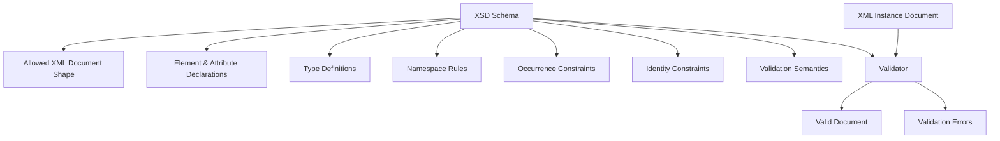
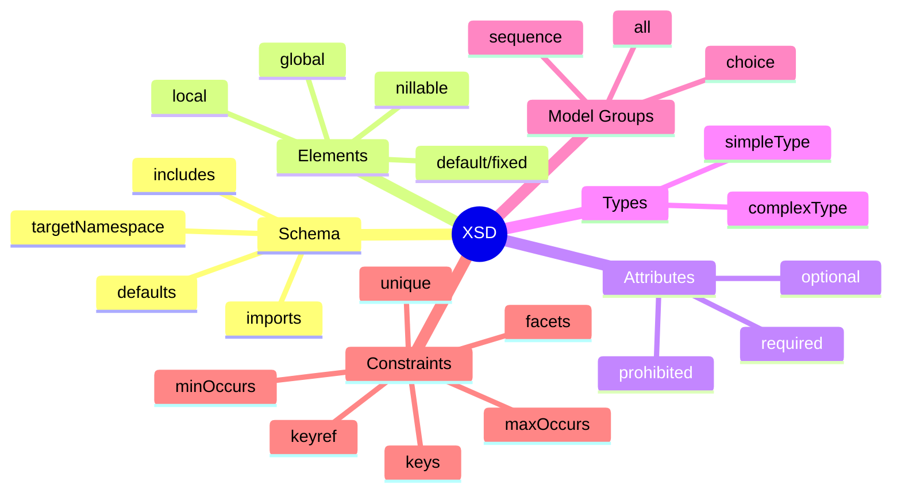
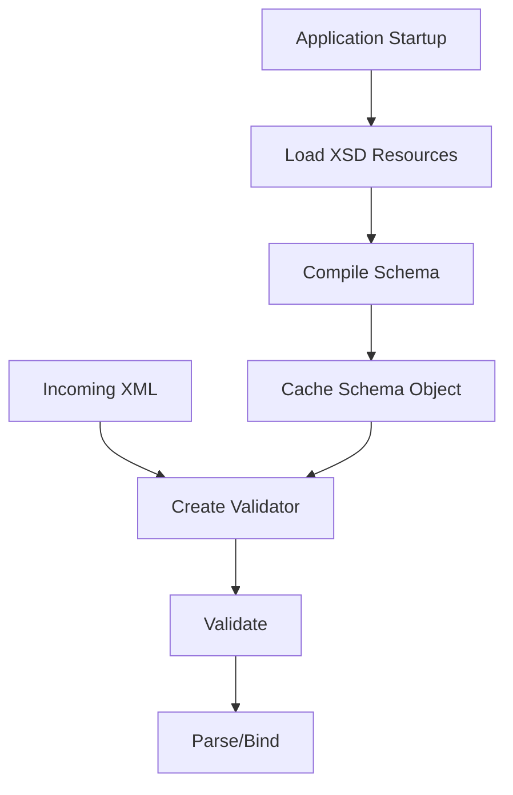
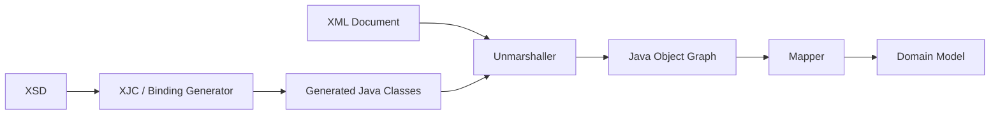
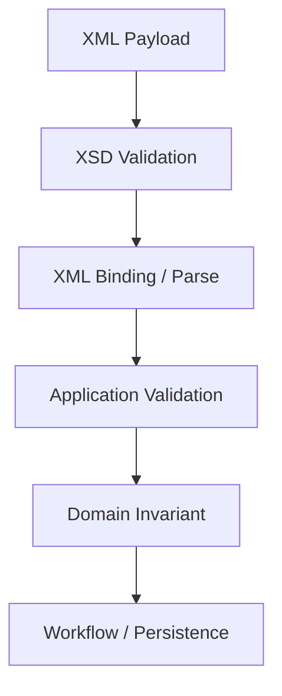

# Part 006 — XSD Core Model for Production Contracts

XSD sering dianggap teknologi lama. Itu framing yang kurang tepat.

XSD adalah teknologi matang untuk satu kategori masalah yang masih hidup di enterprise: **dokumen XML yang harus punya struktur formal, namespace, constraint, validation, dan integrasi lintas organisasi**.

Di banyak sistem perbankan, pemerintahan, insurance, telco, regulator, healthcare, supply chain, dan legacy integration, XML bukan masa lalu. XML adalah kontrak operasional yang masih menggerakkan dokumen, laporan, filing, settlement, compliance, dan B2B integration.

Kalau JSON biasanya terasa seperti object payload, XML sering lebih dekat ke **dokumen**.

Dan dokumen punya masalah berbeda:

- namespace;
- extensibility;
- mixed content;
- attribute vs element;
- canonical representation;
- identity constraint;
- ordering;
- schema import/include;
- validation error yang harus bisa dijelaskan ke pihak eksternal;
- long-lived versioning;
- compatibility terhadap consumer yang tidak bisa sering upgrade.

Part ini membangun core model XSD untuk production contracts.

Kita belum masuk pattern besar seperti Venetian Blind, Salami Slice, Garden of Eden, dan namespace governance. Itu Part 007. Di sini kita fokus pada mental model teknis.

---

## 1. Mental Model: XSD Mendeskripsikan Kelas Dokumen XML

XSD bukan hanya “validasi field”. XSD mendefinisikan **class of XML documents**.

Artinya schema menjawab:

- element apa yang boleh muncul?
- urutan element seperti apa?
- attribute apa yang boleh/must ada?
- tipe data apa yang valid?
- cardinality berapa?
- namespace apa yang berlaku?
- struktur mana yang reusable?
- constraint identitas apa yang harus unik?
- referensi antar bagian dokumen bagaimana?



XSD punya vocabulary XML sendiri. Schema ditulis dalam XML. Ini membuat XSD verbose, tetapi juga membuatnya sangat eksplisit.

---

## 2. XML Instance vs XSD Schema

Mulai dari contoh XML instance.

```xml
<case:CaseSubmission xmlns:case="urn:company:case:intake:v1">
  <case:CaseId>CASE-2026-000001</case:CaseId>
  <case:ApplicantId>APP-123</case:ApplicantId>
  <case:CaseType>LICENSING_VIOLATION</case:CaseType>
  <case:SubmittedAt>2026-07-03T10:15:30Z</case:SubmittedAt>
</case:CaseSubmission>
```

XSD minimal:

```xml
<xs:schema
    xmlns:xs="http://www.w3.org/2001/XMLSchema"
    targetNamespace="urn:company:case:intake:v1"
    xmlns:case="urn:company:case:intake:v1"
    elementFormDefault="qualified"
    attributeFormDefault="unqualified">

  <xs:element name="CaseSubmission" type="case:CaseSubmissionType"/>

  <xs:complexType name="CaseSubmissionType">
    <xs:sequence>
      <xs:element name="CaseId" type="case:CaseIdType"/>
      <xs:element name="ApplicantId" type="case:ApplicantIdType"/>
      <xs:element name="CaseType" type="case:CaseTypeType"/>
      <xs:element name="SubmittedAt" type="xs:dateTime"/>
    </xs:sequence>
  </xs:complexType>

  <xs:simpleType name="CaseIdType">
    <xs:restriction base="xs:string">
      <xs:pattern value="CASE-[0-9]{4}-[0-9]{6}"/>
    </xs:restriction>
  </xs:simpleType>

  <xs:simpleType name="ApplicantIdType">
    <xs:restriction base="xs:string">
      <xs:minLength value="1"/>
      <xs:maxLength value="64"/>
    </xs:restriction>
  </xs:simpleType>

  <xs:simpleType name="CaseTypeType">
    <xs:restriction base="xs:string">
      <xs:enumeration value="LICENSING_VIOLATION"/>
      <xs:enumeration value="REPORTING_FAILURE"/>
      <xs:enumeration value="CONSUMER_COMPLAINT"/>
    </xs:restriction>
  </xs:simpleType>

</xs:schema>
```

Perhatikan bahwa XSD tidak hanya mengatakan “ada field caseId”. Ia mengatakan:

- root element bernama `CaseSubmission`;
- root berada di namespace `urn:company:case:intake:v1`;
- struktur child mengikuti urutan `CaseId`, `ApplicantId`, `CaseType`, `SubmittedAt`;
- `CaseId` harus cocok pattern;
- `ApplicantId` punya panjang minimal/maksimal;
- `CaseType` hanya boleh nilai tertentu;
- `SubmittedAt` memakai datatype `xs:dateTime`.

Ini adalah contract yang executable.

---

## 3. XSD Building Blocks

Core XSD bisa dipahami dari beberapa komponen.



Kita bahas satu per satu.

---

## 4. `xs:schema`: Root dari Contract

`xs:schema` adalah root schema document.

```xml
<xs:schema
    xmlns:xs="http://www.w3.org/2001/XMLSchema"
    targetNamespace="urn:company:case:intake:v1"
    xmlns:case="urn:company:case:intake:v1"
    elementFormDefault="qualified"
    attributeFormDefault="unqualified">
  ...
</xs:schema>
```

Bagian penting:

| Attribute | Makna |
|---|---|
| `xmlns:xs` | Namespace untuk vocabulary XSD |
| `targetNamespace` | Namespace yang didefinisikan schema ini |
| `xmlns:case` | Prefix lokal untuk namespace target |
| `elementFormDefault` | Apakah local element harus namespace-qualified |
| `attributeFormDefault` | Apakah local attribute harus namespace-qualified |

### 4.1 `targetNamespace`

`targetNamespace` adalah identitas logical kontrak.

Contoh:

```xml
targetNamespace="urn:company:case:intake:v1"
```

Ini bukan sekadar string. Ini boundary.

Kalau dua schema memakai target namespace sama, mereka menyumbang definisi ke vocabulary yang sama.
Kalau target namespace berbeda, mereka mendefinisikan vocabulary berbeda.

Namespace menjadi penting saat:

- XML menggabungkan beberapa domain;
- satu dokumen memakai common types dari schema lain;
- versi schema coexist;
- consumer perlu membedakan `CaseId` domain A dari `CaseId` domain B.

### 4.2 Prefix Bukan Namespace

Ini sering salah.

Di XML:

```xml
<case:CaseSubmission xmlns:case="urn:company:case:intake:v1">
```

Prefix `case` bukan identitas. Namespace URI adalah identitas.

Dua dokumen ini equivalent secara namespace:

```xml
<case:CaseSubmission xmlns:case="urn:company:case:intake:v1"/>
```

```xml
<intake:CaseSubmission xmlns:intake="urn:company:case:intake:v1"/>
```

Prefix hanya alias lokal.

Rule production:

> Jangan pernah membuat logic bisnis bergantung pada prefix XML. Logic harus bergantung pada namespace URI dan local name.

---

## 5. Element Declaration

Element adalah struktur utama XML.

### 5.1 Global Element

```xml
<xs:element name="CaseSubmission" type="case:CaseSubmissionType"/>
```

Global element dideklarasikan langsung di bawah `xs:schema`.

Ciri:

- bisa menjadi root document;
- bisa direferensikan dengan `ref`;
- berada dalam target namespace;
- cocok untuk element penting/reusable.

### 5.2 Local Element

```xml
<xs:complexType name="CaseSubmissionType">
  <xs:sequence>
    <xs:element name="CaseId" type="case:CaseIdType"/>
  </xs:sequence>
</xs:complexType>
```

`CaseId` di sini local element.

Ciri:

- scope-nya hanya di dalam parent type;
- tidak bisa direferensikan global kecuali dideklarasikan global;
- lebih sederhana untuk struktur yang tidak reusable.

### 5.3 Global vs Local Design Trade-Off

| Approach | Kelebihan | Risiko |
|---|---|---|
| Banyak global elements | Reusable, mudah referensi | Namespace penuh banyak symbol, sulit dibaca |
| Banyak local elements | Encapsulation, schema lebih lokal | Reuse sulit, type duplication |
| Global types + local elements | Balance umum | Perlu naming discipline |
| Global elements + global types | Cocok untuk canonical enterprise vocab | Bisa verbose |

Pattern detail akan dibahas di Part 007.

---

## 6. Complex Type vs Simple Type

XSD punya dua keluarga type utama.

### 6.1 Simple Type

Simple type tidak punya child element atau attribute. Ia berisi nilai teks yang dibatasi.

Contoh:

```xml
<xs:simpleType name="CaseIdType">
  <xs:restriction base="xs:string">
    <xs:pattern value="CASE-[0-9]{4}-[0-9]{6}"/>
  </xs:restriction>
</xs:simpleType>
```

Simple type cocok untuk:

- ID;
- code;
- status;
- amount representation;
- date/time string;
- constrained text;
- enum;
- pattern-based value.

### 6.2 Complex Type

Complex type punya struktur:

- child elements;
- attributes;
- mixed content;
- model group;
- extension/restriction.

Contoh:

```xml
<xs:complexType name="CaseSubmissionType">
  <xs:sequence>
    <xs:element name="CaseId" type="case:CaseIdType"/>
    <xs:element name="ApplicantId" type="case:ApplicantIdType"/>
  </xs:sequence>
  <xs:attribute name="sourceSystem" type="xs:string" use="required"/>
</xs:complexType>
```

Complex type cocok untuk object/document structure.

---

## 7. Built-In Datatypes

XSD menyediakan banyak datatype built-in.

Yang sering dipakai:

| XSD Type | Makna Umum | Catatan Production |
|---|---|---|
| `xs:string` | text | terlalu longgar jika tanpa facet |
| `xs:boolean` | true/false | lexical form perlu diperhatikan |
| `xs:int` | 32-bit integer | hati-hati overflow |
| `xs:long` | 64-bit integer | cocok untuk counter besar |
| `xs:decimal` | decimal arbitrary precision | cocok untuk money jika scale diatur |
| `xs:date` | tanggal | tanpa time-of-day |
| `xs:dateTime` | timestamp | timezone semantics harus diputuskan |
| `xs:anyURI` | URI | validasi tidak sama dengan reachability |
| `xs:base64Binary` | binary base64 | hati-hati payload besar |

### 7.1 Jangan Terlalu Sering Pakai `xs:string`

Ini schema yang lemah:

```xml
<xs:element name="Amount" type="xs:string"/>
<xs:element name="SubmittedAt" type="xs:string"/>
<xs:element name="CaseStatus" type="xs:string"/>
```

Lebih baik:

```xml
<xs:simpleType name="MoneyAmountType">
  <xs:restriction base="xs:decimal">
    <xs:fractionDigits value="2"/>
    <xs:minInclusive value="0.00"/>
  </xs:restriction>
</xs:simpleType>

<xs:simpleType name="CaseStatusType">
  <xs:restriction base="xs:string">
    <xs:enumeration value="SUBMITTED"/>
    <xs:enumeration value="UNDER_REVIEW"/>
    <xs:enumeration value="CLOSED"/>
  </xs:restriction>
</xs:simpleType>
```

Kontrak yang terlalu longgar memindahkan validasi ke code. Kadang itu benar. Tetapi kalau rule adalah boundary invariant, schema harus mengekspresikannya.

---

## 8. Facets: Constraint pada Simple Type

Facet adalah constraint tambahan pada datatype.

Contoh umum:

| Facet | Contoh |
|---|---|
| `minLength` | minimal panjang string |
| `maxLength` | maksimal panjang string |
| `pattern` | regex constraint |
| `enumeration` | allowed value |
| `minInclusive` | nilai minimum termasuk |
| `maxInclusive` | nilai maksimum termasuk |
| `fractionDigits` | jumlah digit decimal fraction |
| `totalDigits` | total digit decimal |
| `whiteSpace` | normalisasi whitespace |

Contoh ID:

```xml
<xs:simpleType name="ApplicantIdType">
  <xs:restriction base="xs:string">
    <xs:minLength value="1"/>
    <xs:maxLength value="64"/>
    <xs:pattern value="[A-Z0-9\-]+"/>
  </xs:restriction>
</xs:simpleType>
```

Contoh money:

```xml
<xs:simpleType name="AmountType">
  <xs:restriction base="xs:decimal">
    <xs:totalDigits value="18"/>
    <xs:fractionDigits value="2"/>
    <xs:minInclusive value="0.00"/>
  </xs:restriction>
</xs:simpleType>
```

### 8.1 Facet adalah Business Contract

Jangan menaruh facet tanpa sadar.

Kalau `maxLength=64`, itu contract. Consumer mungkin membuat database column `VARCHAR(64)` berdasarkan itu.
Kalau besok provider butuh 128, itu perubahan contract.

Facet harus merepresentasikan invariant atau policy yang memang stabil.

---

## 9. Occurrence Constraints: `minOccurs` dan `maxOccurs`

Occurrence constraint menentukan cardinality element.

Default:

```xml
minOccurs="1"
maxOccurs="1"
```

Artinya wajib ada tepat satu.

Contoh optional:

```xml
<xs:element name="MiddleName" type="xs:string" minOccurs="0"/>
```

Contoh list:

```xml
<xs:element name="Document" type="case:DocumentType" minOccurs="0" maxOccurs="unbounded"/>
```

### 9.1 Cardinality sebagai Semantics

| XSD | Makna |
|---|---|
| `minOccurs=1 maxOccurs=1` | wajib tepat satu |
| `minOccurs=0 maxOccurs=1` | optional |
| `minOccurs=1 maxOccurs=unbounded` | wajib minimal satu item |
| `minOccurs=0 maxOccurs=unbounded` | optional list |

Jangan menyamakan optional dengan nullable. XML punya model berbeda.

- element absent: tidak ada element;
- element empty: `<Name/>` atau `<Name></Name>`;
- nilled element: `<Name xsi:nil="true"/>` jika `nillable="true"`.

Ketiganya punya semantics berbeda.

---

## 10. `nillable`: Jangan Dipakai Sembarangan

Contoh:

```xml
<xs:element name="MiddleName" type="xs:string" nillable="true"/>
```

Instance:

```xml
<case:MiddleName xsi:nil="true" xmlns:xsi="http://www.w3.org/2001/XMLSchema-instance"/>
```

`nillable=true` berarti element boleh hadir tetapi nil.

Ini berbeda dari:

```xml
<!-- MiddleName absent -->
```

### 10.1 Production Rule

Gunakan `nillable` hanya jika perbedaan antara “dikirim sebagai null” dan “tidak dikirim” penting.

Kalau tidak penting, lebih baik gunakan `minOccurs="0"`.

Nillable sering membuat binding Java lebih rumit dan memperbesar ambiguity.

---

## 11. Model Groups: `sequence`, `choice`, `all`

XSD mengatur struktur child element melalui model group.

### 11.1 `xs:sequence`

Urutan harus sesuai.

```xml
<xs:sequence>
  <xs:element name="CaseId" type="case:CaseIdType"/>
  <xs:element name="ApplicantId" type="case:ApplicantIdType"/>
  <xs:element name="SubmittedAt" type="xs:dateTime"/>
</xs:sequence>
```

Valid:

```xml
<CaseId>...</CaseId>
<ApplicantId>...</ApplicantId>
<SubmittedAt>...</SubmittedAt>
```

Tidak valid jika urutannya berubah.

XSD sequence cocok untuk dokumen canonical yang order-nya penting atau ingin stabil.

### 11.2 `xs:choice`

Salah satu dari beberapa opsi.

```xml
<xs:choice>
  <xs:element name="PersonApplicant" type="case:PersonApplicantType"/>
  <xs:element name="OrganizationApplicant" type="case:OrganizationApplicantType"/>
</xs:choice>
```

Cocok untuk polymorphism.

Caution: choice yang terlalu besar bisa membuat Java binding dan validation error sulit dibaca.

### 11.3 `xs:all`

Semua child boleh muncul dalam urutan bebas, biasanya maksimal satu.

```xml
<xs:all>
  <xs:element name="CaseId" type="case:CaseIdType"/>
  <xs:element name="ApplicantId" type="case:ApplicantIdType"/>
</xs:all>
```

Cocok untuk struktur kecil yang order tidak penting.

Di dokumen enterprise besar, `sequence` lebih sering dipilih karena deterministic representation lebih mudah untuk signing, comparison, canonicalization, dan diff.

---

## 12. Attributes vs Elements

XML punya dua tempat untuk data: attribute dan element.

```xml
<case:CaseSubmission sourceSystem="PORTAL">
  <case:CaseId>CASE-2026-000001</case:CaseId>
</case:CaseSubmission>
```

`sourceSystem` adalah attribute. `CaseId` adalah element.

### 12.1 Kapan Pakai Attribute?

Attribute cocok untuk:

- metadata pendek;
- identifier teknis;
- flag kecil;
- classification;
- source marker;
- version marker;
- data yang tidak punya struktur child.

Contoh:

```xml
<case:Attachment mediaType="application/pdf" sizeBytes="123456">
  <case:ContentRef>...</case:ContentRef>
</case:Attachment>
```

### 12.2 Kapan Pakai Element?

Element cocok untuk:

- business data utama;
- data yang bisa punya struktur;
- text panjang;
- nilai yang bisa berulang;
- nilai yang perlu extension;
- data yang mungkin punya nil/absence semantics.

Rule praktis:

> Jika data itu bagian dari business payload utama dan mungkin berkembang, gunakan element. Jika data itu metadata kecil yang menempel pada element, attribute bisa masuk akal.

### 12.3 Attribute `use`

```xml
<xs:attribute name="sourceSystem" type="xs:string" use="required"/>
```

Nilai `use`:

| Value | Makna |
|---|---|
| `optional` | boleh tidak ada |
| `required` | wajib ada |
| `prohibited` | dilarang dalam restriction |

Attribute default-nya optional.

---

## 13. Default dan Fixed Values

XSD mendukung default dan fixed value.

```xml
<xs:attribute name="version" type="xs:string" fixed="1.0"/>
```

```xml
<xs:element name="Priority" type="case:PriorityType" default="NORMAL"/>
```

### 13.1 Caution untuk Production

Default di schema bisa membingungkan karena validator/binding dapat menambahkan value default secara infoset, tergantung processing model.

Jangan pakai default untuk menyembunyikan data yang sebenarnya harus dikirim producer.

Default lebih aman untuk:

- metadata schema-level;
- backward-compatible optional value;
- transisi legacy;
- non-critical display/config value.

Untuk business-critical decision, lebih baik explicit.

---

## 14. Type Derivation: Restriction dan Extension

XSD mendukung derivation.

### 14.1 Restriction

Restriction mempersempit type.

```xml
<xs:simpleType name="ShortCodeType">
  <xs:restriction base="xs:string">
    <xs:maxLength value="16"/>
  </xs:restriction>
</xs:simpleType>
```

Restriction cocok untuk membuat type lebih spesifik.

### 14.2 Extension

Extension menambah struktur.

```xml
<xs:complexType name="AuditedCaseSubmissionType">
  <xs:complexContent>
    <xs:extension base="case:CaseSubmissionType">
      <xs:sequence>
        <xs:element name="AuditTrail" type="case:AuditTrailType"/>
      </xs:sequence>
    </xs:extension>
  </xs:complexContent>
</xs:complexType>
```

Extension terlihat seperti inheritance. Hati-hati.

Di contract design, inheritance sering membuat compatibility dan binding lebih sulit. Composition biasanya lebih mudah dipahami.

Gunakan extension jika memang cocok dengan XML vocabulary dan consumer tooling.

---

## 15. Import vs Include

Schema besar jarang berdiri sendiri.

### 15.1 `xs:include`

`include` dipakai untuk schema document lain dengan namespace yang sama.

```xml
<xs:include schemaLocation="common-types.xsd"/>
```

Gunakan saat ingin memecah satu namespace ke beberapa file.

### 15.2 `xs:import`

`import` dipakai untuk namespace berbeda.

```xml
<xs:import
    namespace="urn:company:common:v1"
    schemaLocation="../common/common-v1.xsd"/>
```

Gunakan saat schema memakai vocabulary dari domain lain.

### 15.3 Production Rule

- `include` = same namespace modularization.
- `import` = cross-namespace dependency.

Jangan memakai namespace berbeda tanpa import yang jelas.
Jangan memakai relative path yang hanya bekerja di laptop developer.

Untuk production, schema resolution harus dikontrol dengan catalog atau packaging strategy.

---

## 16. Identity Constraints: `unique`, `key`, `keyref`

XSD bisa mengekspresikan constraint yang mirip uniqueness dan reference.

Contoh: setiap document punya `DocumentId` unik.

```xml
<xs:element name="CaseSubmission" type="case:CaseSubmissionType">
  <xs:unique name="uniqueDocumentId">
    <xs:selector xpath="case:Documents/case:Document"/>
    <xs:field xpath="case:DocumentId"/>
  </xs:unique>
</xs:element>
```

Contoh reference:

```xml
<xs:key name="documentKey">
  <xs:selector xpath="case:Documents/case:Document"/>
  <xs:field xpath="case:DocumentId"/>
</xs:key>

<xs:keyref name="primaryDocumentRef" refer="case:documentKey">
  <xs:selector xpath="case:PrimaryDocument"/>
  <xs:field xpath="case:DocumentId"/>
</xs:keyref>
```

### 16.1 Kapan Gunakan Identity Constraint?

Gunakan jika constraint memang bagian dari document integrity.

Contoh cocok:

- ID item dalam dokumen harus unik;
- reference internal harus menunjuk item yang ada;
- code tertentu tidak boleh duplikat dalam satu section.

Jangan gunakan untuk rule yang membutuhkan database, external lookup, atau temporal state.

XSD validator hanya melihat satu document instance, bukan seluruh dunia.

---

## 17. Wildcards: `xs:any` dan `xs:anyAttribute`

Wildcard membuka extension point.

```xml
<xs:any namespace="##other" processContents="lax" minOccurs="0" maxOccurs="unbounded"/>
```

Makna:

- boleh ada element dari namespace lain;
- validasi dilakukan lax jika schema tersedia;
- bisa muncul 0 sampai tak terbatas.

`xs:anyAttribute` serupa untuk attribute.

### 17.1 Wildcard adalah Pisau Tajam

Wildcard berguna untuk:

- extension point B2B;
- vendor-specific metadata;
- forward compatibility;
- regulatory annex;
- gradual migration.

Risiko:

- schema terlalu longgar;
- consumer mengabaikan data penting;
- validation tidak cukup kuat;
- Java binding menghasilkan struktur sulit dipakai;
- extension menjadi tempat sampah.

Rule:

> Wildcard harus diberi policy: namespace mana yang boleh, processContents apa, dan consumer harus berperilaku bagaimana terhadap extension yang tidak dikenal.

---

## 18. XML Namespace Design

Namespace adalah salah satu bagian paling menentukan dalam XSD production design.

Contoh buruk:

```xml
targetNamespace="http://tempuri.org"
```

Contoh lebih baik:

```xml
targetNamespace="urn:company:regulatory:case-intake:v1"
```

Atau kalau organisasi memakai URL governance:

```xml
targetNamespace="https://schemas.company.com/regulatory/case-intake/v1"
```

Namespace URI tidak harus bisa diakses sebagai URL, tetapi kalau memakai URL, dokumentasi dan resolution strategy harus jelas.

### 18.1 Version in Namespace?

Untuk XSD enterprise, version dalam namespace sering digunakan.

Contoh:

```text
urn:company:case:intake:v1
urn:company:case:intake:v2
```

Kelebihan:

- v1 dan v2 bisa coexist;
- validation jelas;
- consumer tahu vocabulary berbeda;
- breaking change lebih eksplisit.

Kekurangan:

- setiap major version mengganti namespace;
- migration lebih berat;
- mapping antar versi diperlukan.

Rule praktis:

- breaking structural change: namespace major version baru;
- backward-compatible minor addition: namespace bisa tetap;
- common namespace harus lebih stabil daripada service-specific namespace.

---

## 19. Validation Model di Java

Di Java, runtime XSD validation biasanya memakai `SchemaFactory` dan `Validator`.

Contoh konseptual:

```java
SchemaFactory factory = SchemaFactory.newInstance(XMLConstants.W3C_XML_SCHEMA_NS_URI);
Schema schema = factory.newSchema(new File("case-intake.xsd"));
Validator validator = schema.newValidator();
validator.validate(new StreamSource(new File("case-submission.xml")));
```

Untuk production, jangan berhenti di contoh ini.

Perlu:

- schema caching;
- secure parser configuration;
- controlled schema resolution;
- error handler yang memetakan line/column/message;
- payload size limit;
- timeout/resource control;
- metrics;
- quarantine path;
- validation mode per boundary.

### 19.1 Schema Compilation Mahal

Compile schema bisa mahal. Jangan compile XSD setiap request.

Pattern:



Biasanya:

- `Schema` dapat di-cache;
- `Validator` dibuat per penggunaan atau dikelola hati-hati karena thread-safety harus diperiksa sesuai implementation;
- schema resources dipackage dalam artifact, bukan fetch remote saat runtime normal.

---

## 20. Secure XML Processing

XML parser punya risiko security klasik.

Risiko:

- XXE atau external entity resolution;
- entity expansion attack;
- oversized payload;
- deep nesting;
- remote schema fetching;
- DTD processing yang tidak perlu;
- XPath/XSLT injection pada proses lanjutan;
- sensitive data leakage pada validation error.

Production rule:

> Parser XML harus secure-by-default. Jangan menerima external entity atau remote schema resolution dari input tidak dipercaya.

Conceptual safeguards:

```java
factory.setFeature(XMLConstants.FEATURE_SECURE_PROCESSING, true);
```

Dan konfigurasi tambahan sesuai parser/provider yang dipakai.

Jangan copy-paste security flags tanpa test. Setiap XML stack bisa punya detail berbeda.

---

## 21. XSD dan Java Binding

XSD sering dipakai bersama JAXB/Jakarta XML Binding.

Flow:



Generated binding berguna, tetapi jangan dipakai langsung sebagai domain model.

Alasannya:

- XML ordering tidak sama dengan domain invariants;
- nullable/nillable mapping bisa rumit;
- generated class sering mutable;
- collection handling bisa berbeda dari domain preference;
- XML namespace concerns bocor ke core;
- schema evolution dapat mengubah generated API.

Gunakan mapper.

```java
public final class LegacyCaseSubmissionMapper {
    public IntakeCommand toCommand(CaseSubmissionType xml) {
        return new IntakeCommand(
            new CaseId(xml.getCaseId()),
            new ApplicantId(xml.getApplicantId()),
            CaseType.valueOf(xml.getCaseType().value()),
            xml.getSubmittedAt().toInstant()
        );
    }
}
```

---

## 22. XSD Validation vs Business Validation

XSD bisa memvalidasi struktur dan beberapa constraint, tetapi tidak semua business rule.

XSD cocok untuk:

- required/optional;
- ordering;
- datatype;
- string length;
- pattern;
- enum;
- numeric min/max;
- document-internal uniqueness;
- document-internal reference.

XSD tidak cocok untuk:

- “applicant must exist in database”;
- “case cannot be submitted after license expired unless exception approved”;
- “amount limit depends on jurisdiction and current regulation version”;
- “duplicate submission in last 24 hours”;
- “user is authorized to submit this case”.

Layering:



Jangan memaksa semua business rule ke XSD. Itu membuat schema tidak maintainable.

---

## 23. Error Reporting

Validation error adalah bagian dari contract experience.

Bad error:

```text
cvc-complex-type.2.4.a: Invalid content was found starting with element 'Foo'.
```

Better error mapping:

```json
{
  "code": "XML_SCHEMA_INVALID_ELEMENT_ORDER",
  "message": "Element 'ApplicantId' must appear before 'SubmittedAt'.",
  "location": {
    "line": 12,
    "column": 8,
    "path": "/CaseSubmission/SubmittedAt"
  },
  "schema": {
    "namespace": "urn:company:case:intake:v1",
    "version": "1"
  }
}
```

Untuk external integration, error harus:

- bisa dipahami partner;
- tidak membocorkan detail internal;
- menunjuk lokasi payload;
- membedakan syntax error vs schema error vs business error;
- punya code stabil;
- bisa diaudit.

---

## 24. Design Example: Case Submission XSD

Contoh lebih lengkap.

```xml
<xs:schema
    xmlns:xs="http://www.w3.org/2001/XMLSchema"
    xmlns:case="urn:company:case:intake:v1"
    targetNamespace="urn:company:case:intake:v1"
    elementFormDefault="qualified"
    attributeFormDefault="unqualified">

  <xs:element name="CaseSubmission" type="case:CaseSubmissionType">
    <xs:unique name="uniqueDocumentId">
      <xs:selector xpath="case:Documents/case:Document"/>
      <xs:field xpath="case:DocumentId"/>
    </xs:unique>
  </xs:element>

  <xs:complexType name="CaseSubmissionType">
    <xs:sequence>
      <xs:element name="Header" type="case:SubmissionHeaderType"/>
      <xs:element name="Applicant" type="case:ApplicantType"/>
      <xs:element name="Allegation" type="case:AllegationType" maxOccurs="unbounded"/>
      <xs:element name="Documents" type="case:DocumentsType" minOccurs="0"/>
    </xs:sequence>
    <xs:attribute name="schemaVersion" type="xs:string" fixed="1.0"/>
    <xs:attribute name="sourceSystem" type="case:SourceSystemType" use="required"/>
  </xs:complexType>

  <xs:complexType name="SubmissionHeaderType">
    <xs:sequence>
      <xs:element name="CaseId" type="case:CaseIdType"/>
      <xs:element name="SubmittedAt" type="xs:dateTime"/>
      <xs:element name="Jurisdiction" type="case:JurisdictionCodeType"/>
    </xs:sequence>
  </xs:complexType>

  <xs:complexType name="ApplicantType">
    <xs:choice>
      <xs:element name="Person" type="case:PersonApplicantType"/>
      <xs:element name="Organization" type="case:OrganizationApplicantType"/>
    </xs:choice>
  </xs:complexType>

  <xs:complexType name="PersonApplicantType">
    <xs:sequence>
      <xs:element name="ApplicantId" type="case:ApplicantIdType"/>
      <xs:element name="FullName" type="case:NonEmptyTextType"/>
      <xs:element name="DateOfBirth" type="xs:date" minOccurs="0"/>
    </xs:sequence>
  </xs:complexType>

  <xs:complexType name="OrganizationApplicantType">
    <xs:sequence>
      <xs:element name="ApplicantId" type="case:ApplicantIdType"/>
      <xs:element name="LegalName" type="case:NonEmptyTextType"/>
      <xs:element name="RegistrationNumber" type="case:NonEmptyTextType" minOccurs="0"/>
    </xs:sequence>
  </xs:complexType>

  <xs:complexType name="AllegationType">
    <xs:sequence>
      <xs:element name="AllegationCode" type="case:AllegationCodeType"/>
      <xs:element name="Description" type="case:LongTextType"/>
    </xs:sequence>
  </xs:complexType>

  <xs:complexType name="DocumentsType">
    <xs:sequence>
      <xs:element name="Document" type="case:DocumentType" maxOccurs="unbounded"/>
    </xs:sequence>
  </xs:complexType>

  <xs:complexType name="DocumentType">
    <xs:sequence>
      <xs:element name="DocumentId" type="case:DocumentIdType"/>
      <xs:element name="DocumentType" type="case:DocumentTypeCodeType"/>
      <xs:element name="ContentReference" type="xs:anyURI"/>
    </xs:sequence>
    <xs:attribute name="mediaType" type="xs:string" use="required"/>
    <xs:attribute name="sizeBytes" type="xs:long" use="optional"/>
  </xs:complexType>

  <xs:simpleType name="CaseIdType">
    <xs:restriction base="xs:string">
      <xs:pattern value="CASE-[0-9]{4}-[0-9]{6}"/>
    </xs:restriction>
  </xs:simpleType>

  <xs:simpleType name="ApplicantIdType">
    <xs:restriction base="xs:string">
      <xs:minLength value="1"/>
      <xs:maxLength value="64"/>
    </xs:restriction>
  </xs:simpleType>

  <xs:simpleType name="DocumentIdType">
    <xs:restriction base="xs:string">
      <xs:minLength value="1"/>
      <xs:maxLength value="64"/>
    </xs:restriction>
  </xs:simpleType>

  <xs:simpleType name="NonEmptyTextType">
    <xs:restriction base="xs:string">
      <xs:minLength value="1"/>
      <xs:maxLength value="256"/>
    </xs:restriction>
  </xs:simpleType>

  <xs:simpleType name="LongTextType">
    <xs:restriction base="xs:string">
      <xs:minLength value="1"/>
      <xs:maxLength value="4000"/>
    </xs:restriction>
  </xs:simpleType>

  <xs:simpleType name="SourceSystemType">
    <xs:restriction base="xs:string">
      <xs:enumeration value="PORTAL"/>
      <xs:enumeration value="BATCH"/>
      <xs:enumeration value="PARTNER_GATEWAY"/>
    </xs:restriction>
  </xs:simpleType>

  <xs:simpleType name="JurisdictionCodeType">
    <xs:restriction base="xs:string">
      <xs:pattern value="[A-Z]{2,10}"/>
    </xs:restriction>
  </xs:simpleType>

  <xs:simpleType name="AllegationCodeType">
    <xs:restriction base="xs:string">
      <xs:minLength value="1"/>
      <xs:maxLength value="64"/>
    </xs:restriction>
  </xs:simpleType>

  <xs:simpleType name="DocumentTypeCodeType">
    <xs:restriction base="xs:string">
      <xs:enumeration value="EVIDENCE"/>
      <xs:enumeration value="LICENSE"/>
      <xs:enumeration value="CORRESPONDENCE"/>
    </xs:restriction>
  </xs:simpleType>

</xs:schema>
```

### 24.1 Apa yang Bagus dari Contoh Ini?

- root element jelas;
- namespace jelas;
- header/applicant/allegation/documents dipisah;
- person vs organization memakai `choice`;
- text types dibatasi;
- IDs punya type khusus;
- source system required;
- schema version fixed;
- document ID unik dalam dokumen.

### 24.2 Apa yang Masih Perlu Diperbaiki di Production?

- enum `DocumentTypeCodeType` mungkin sebaiknya reference data eksternal;
- `mediaType` bisa dibatasi pattern atau controlled list;
- `ContentReference` perlu policy resolusi;
- `schemaVersion` sebagai fixed attribute harus sinkron dengan namespace policy;
- error mapping perlu dibuat;
- examples valid/invalid harus disiapkan;
- Java binding customization mungkin dibutuhkan;
- compatibility strategy belum didefinisikan.

Ini sengaja. Schema production bukan hanya file XSD. Ia paket kontrak.

---

## 25. Common Anti-Patterns

### 25.1 Everything Is String

```xml
<xs:element name="Amount" type="xs:string"/>
<xs:element name="Date" type="xs:string"/>
<xs:element name="Status" type="xs:string"/>
```

Ini bukan contract kuat. Ini hanya struktur XML.

### 25.2 Namespace Tidak Stabil

```xml
targetNamespace="urn:company:service:build-123"
```

Namespace tidak boleh berubah setiap build.

### 25.3 XSD Mengandung Semua Business Rule

Kalau schema mencoba memodelkan workflow state machine penuh, schema akan menjadi brittle.

Taruh boundary invariants di XSD. Taruh dynamic rules di application/domain policy.

### 25.4 Reuse Berlebihan

Common type yang terlalu generic:

```xml
<xs:complexType name="GenericCodeDescriptionType">
```

Lalu dipakai untuk semua domain. Hasilnya coupling tinggi dan semantics hilang.

Reusable type harus punya makna stabil, bukan hanya bentuk sama.

### 25.5 Wildcard Tanpa Policy

```xml
<xs:any minOccurs="0" maxOccurs="unbounded"/>
```

Ini membuat schema terlalu terbuka. Tentukan namespace dan process policy.

### 25.6 Generated JAXB Class Masuk Domain Core

Jika domain service menerima `CaseSubmissionType` langsung, XML contract bocor ke core.

Buat mapper.

---

## 26. XSD Design Heuristics

Gunakan heuristik ini saat review.

### 26.1 Field Required

Field boleh required jika:

- tanpa field itu dokumen tidak bermakna;
- semua producer realistis bisa mengirimnya;
- semua consumer boleh mengandalkannya;
- tidak ada migration risk besar;
- requirement stabil.

Kalau tidak, pertimbangkan optional + business validation contextual.

### 26.2 Enum

Enum cocok jika nilai:

- kecil;
- stabil;
- dikontrol oleh schema owner;
- perubahan jarang;
- consumer perlu switch logic.

Enum buruk jika nilai:

- sering berubah;
- berasal dari regulator eksternal;
- tenant-specific;
- jurisdiction-specific;
- butuh effective date.

Untuk itu, code list eksternal lebih baik.

### 26.3 Pattern

Pattern cocok untuk format teknis stabil.

Contoh:

- internal ID format;
- ISO-like code;
- constrained reference.

Pattern buruk untuk rule yang terlalu kompleks atau mudah berubah.

### 26.4 Namespace

Namespace harus:

- punya owner;
- punya major version policy;
- tidak berubah untuk minor compatible changes;
- tidak tergantung deployment;
- tidak memakai prefix sebagai identity.

---

## 27. Mini Exercise

Ambil XML ini:

```xml
<CaseSubmission>
  <CaseId>123</CaseId>
  <ApplicantId></ApplicantId>
  <Amount>ten dollars</Amount>
  <SubmittedAt>yesterday</SubmittedAt>
</CaseSubmission>
```

Tulis XSD yang menolak payload tersebut karena:

1. namespace tidak sesuai;
2. `CaseId` tidak sesuai pattern;
3. `ApplicantId` kosong;
4. `Amount` bukan decimal;
5. `SubmittedAt` bukan `xs:dateTime`.

Kemudian buat valid payload:

```xml
<case:CaseSubmission xmlns:case="urn:company:case:intake:v1">
  <case:CaseId>CASE-2026-000001</case:CaseId>
  <case:ApplicantId>APP-123</case:ApplicantId>
  <case:Amount>10.00</case:Amount>
  <case:SubmittedAt>2026-07-03T10:15:30Z</case:SubmittedAt>
</case:CaseSubmission>
```

Target exercise bukan menghafal syntax. Targetnya memahami bahwa XSD mendefinisikan boundary yang executable.

---

## 28. Ringkasan

XSD core model terdiri dari:

1. schema document;
2. target namespace;
3. element declarations;
4. attribute declarations;
5. simple types;
6. complex types;
7. model groups;
8. occurrence constraints;
9. datatype facets;
10. import/include;
11. identity constraints;
12. wildcard extension points;
13. validation model.

Poin production utama:

- namespace adalah identity, prefix bukan;
- XSD mendefinisikan kelas dokumen XML;
- type dan facet adalah contract, bukan dekorasi;
- optional, absent, empty, dan nil berbeda;
- sequence/choice/all punya dampak besar pada compatibility;
- generated XML binding class jangan menjadi domain model;
- XSD validation harus dilengkapi secure XML processing;
- schema harus punya examples, error mapping, version policy, dan compatibility strategy.

Part berikutnya akan membahas **XSD Design Patterns for Large Enterprise Domains**.

---

## References

- W3C XML Schema Definition Language 1.1 Part 1: Structures — https://www.w3.org/TR/xmlschema11-1/
- W3C XML Schema Definition Language 1.1 Part 2: Datatypes — https://www.w3.org/TR/xmlschema11-2/
- W3C XML Schema Part 1: Structures Second Edition — https://www.w3.org/TR/xmlschema-1/
- Jakarta XML Binding 4.0 — https://jakarta.ee/specifications/xml-binding/4.0/
- Java XML Processing Security: OWASP XML External Entity Prevention Cheat Sheet — https://cheatsheetseries.owasp.org/cheatsheets/XML_External_Entity_Prevention_Cheat_Sheet.html
