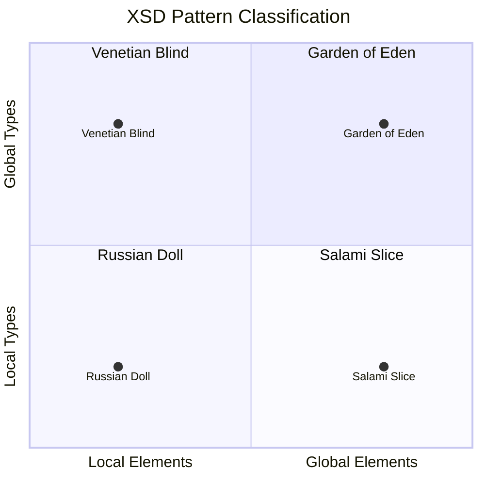
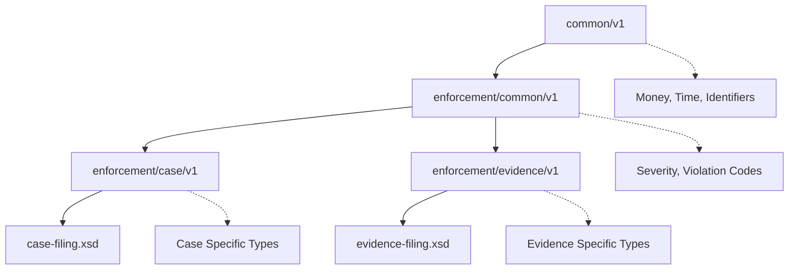
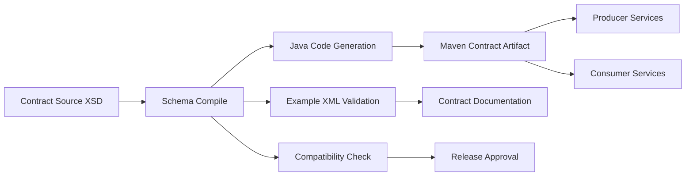

# Part 007 — XSD Design Patterns for Large Enterprise Domains

Part sebelumnya membahas core model XSD: schema, element, attribute, simple type, complex type, namespace, occurrence, identity constraint, dan validation semantics.

Sekarang kita masuk ke pertanyaan yang lebih dekat ke real system:

> Bagaimana merancang XSD untuk domain besar yang akan hidup bertahun-tahun, dipakai banyak tim, punya banyak message, dan tetap bisa berevolusi tanpa berubah menjadi monster schema?

Ini bukan soal hafal `xs:complexType`.

Ini soal **schema architecture**.

Dalam enterprise integration, XSD biasanya tidak berdiri sebagai satu file kecil. Ia menjadi bagian dari kontrak yang mengikat:

- producer;
- consumer;
- regulator;
- partner eksternal;
- batch pipeline;
- data warehouse;
- audit archive;
- generated Java model;
- validation service;
- API gateway;
- message broker;
- reporting system.

Kalau schema design buruk, dampaknya tidak hanya compile error. Dampaknya bisa berupa integrasi partner gagal, message tidak bisa direplay, audit data tidak bisa dijelaskan, schema registry berantakan, atau puluhan consumer harus deploy ulang hanya karena field baru ditambahkan dengan cara yang salah.

Part ini membahas empat pola klasik XSD design:

- Russian Doll;
- Salami Slice;
- Venetian Blind;
- Garden of Eden.

Namun kita tidak akan berhenti di definisi. Kita akan pakai pola itu sebagai vocabulary untuk memilih arsitektur schema yang sesuai dengan domain enterprise.

---

## 1. Mental Model: XSD Design Pattern Adalah Keputusan Tentang Globalitas

Empat pola utama XSD bisa dipahami dari dua pertanyaan sederhana:

1. Apakah element dideklarasikan global atau lokal?
2. Apakah type dideklarasikan global atau lokal?

Dari dua axis ini, lahirlah empat gaya desain.

| Pattern | Element Declaration | Type Declaration | Karakter Utama |
|---|---:|---:|---|
| Russian Doll | Lokal | Lokal | Simple, encapsulated, minim reuse |
| Salami Slice | Global | Lokal | Element reusable, type tersembunyi |
| Venetian Blind | Lokal | Global | Type reusable, instance XML tetap bersih |
| Garden of Eden | Global | Global | Maksimal reuse, paling modular, paling kompleks |

Visualnya:



Cara membacanya:

- **local element** berarti element hanya berlaku dalam parent tertentu;
- **global element** berarti element menjadi top-level schema component dan bisa direferensikan dari banyak tempat;
- **local type** berarti struktur type ditempel langsung pada element;
- **global type** berarti type diberi nama dan bisa direuse.

Dalam sistem kecil, pilihan ini tampak seperti preferensi gaya. Dalam sistem besar, pilihan ini menentukan:

- seberapa mudah schema dibaca;
- seberapa mudah reusable component dibuat;
- seberapa stabil generated Java class;
- seberapa sulit namespace dikelola;
- seberapa mudah schema difaktorkan ke banyak module;
- seberapa besar risiko breaking change;
- seberapa sulit onboarding tim baru;
- seberapa kompleks review kontrak.

---

## 2. Running Domain: Regulatory Case Filing XML

Kita gunakan contoh domain yang realistis: regulator menerima XML filing dari berbagai institusi. Filing ini berisi data kasus, pihak terlibat, violation, evidence, dan escalation.

Contoh instance sederhana:

```xml
<case:CaseFiling xmlns:case="https://example.gov/schema/enforcement/case/v1">
  <case:FilingHeader>
    <case:FilingId>FILING-2026-000019</case:FilingId>
    <case:SubmittedAt>2026-07-03T10:15:30Z</case:SubmittedAt>
    <case:SubmittingInstitutionId>BANK-042</case:SubmittingInstitutionId>
  </case:FilingHeader>
  <case:Case>
    <case:CaseId>CASE-2026-99181</case:CaseId>
    <case:CaseType>MARKET_ABUSE</case:CaseType>
    <case:Severity>HIGH</case:Severity>
  </case:Case>
  <case:Parties>
    <case:Party>
      <case:PartyId>P-001</case:PartyId>
      <case:PartyRole>RESPONDENT</case:PartyRole>
      <case:LegalName>PT Example Sekuritas</case:LegalName>
    </case:Party>
  </case:Parties>
</case:CaseFiling>
```

Pertanyaan desain:

- Apakah `Party` bisa dipakai ulang di message lain?
- Apakah `CaseType` harus menjadi controlled vocabulary?
- Apakah `FilingHeader` adalah common type lintas filing?
- Apakah semua element harus global?
- Apakah root element harus berbeda per message?
- Apakah namespace mengandung versi?
- Apakah schema harus mudah dibaca oleh partner eksternal?
- Apakah generated Java class harus stabil?
- Apakah kita butuh extension point untuk data partner-specific?

Jawaban terhadap pertanyaan ini menentukan pattern mana yang cocok.

---

## 3. Russian Doll Pattern

Russian Doll adalah pattern paling sederhana: semua declaration berada di dalam root element. Element dan type lokal.

Contoh:

```xml
<xs:schema
    xmlns:xs="http://www.w3.org/2001/XMLSchema"
    targetNamespace="https://example.gov/schema/enforcement/case/v1"
    xmlns:case="https://example.gov/schema/enforcement/case/v1"
    elementFormDefault="qualified">

  <xs:element name="CaseFiling">
    <xs:complexType>
      <xs:sequence>
        <xs:element name="FilingHeader">
          <xs:complexType>
            <xs:sequence>
              <xs:element name="FilingId" type="xs:string"/>
              <xs:element name="SubmittedAt" type="xs:dateTime"/>
              <xs:element name="SubmittingInstitutionId" type="xs:string"/>
            </xs:sequence>
          </xs:complexType>
        </xs:element>

        <xs:element name="Case">
          <xs:complexType>
            <xs:sequence>
              <xs:element name="CaseId" type="xs:string"/>
              <xs:element name="CaseType" type="xs:string"/>
              <xs:element name="Severity" type="xs:string"/>
            </xs:sequence>
          </xs:complexType>
        </xs:element>
      </xs:sequence>
    </xs:complexType>
  </xs:element>
</xs:schema>
```

### 3.1 Kapan Russian Doll Cocok

Gunakan Russian Doll ketika:

- schema kecil;
- hanya ada satu root document;
- reuse bukan kebutuhan utama;
- schema dipakai sebagai one-off partner contract;
- readability instance lebih penting daripada modularity;
- tim ingin meminimalkan indirection;
- schema tidak diharapkan menjadi canonical enterprise model.

Russian Doll membuat hubungan parent-child sangat jelas. Pembaca bisa melihat struktur dokumen dari atas ke bawah tanpa melompat ke type lain.

### 3.2 Kelemahan Russian Doll

Russian Doll gagal ketika domain membesar.

Masalah utamanya:

- type tidak reusable;
- perubahan satu struktur harus diduplikasi di banyak tempat;
- sulit membuat common library;
- generated Java class bisa menjadi nested/anonymous naming yang tidak stabil;
- sulit melakukan review komponen kecil;
- sulit memisahkan schema berdasarkan bounded context;
- sulit membuat compatibility diff yang granular.

Anti-pattern yang sering muncul:

```text
Satu schema file besar
  -> banyak local anonymous type
  -> field duplikat di berbagai message
  -> perubahan concept harus dilakukan manual di banyak tempat
  -> Java generated classes tidak konsisten
  -> contract review berubah menjadi baca dokumen raksasa
```

### 3.3 Rule of Thumb

Russian Doll cocok untuk **contract leaf**, bukan untuk **enterprise contract platform**.

Artinya, boleh digunakan untuk schema kecil yang stabil dan tidak butuh reuse, tetapi jangan jadikan ini pola default untuk domain besar.

---

## 4. Salami Slice Pattern

Salami Slice mendeklarasikan element secara global, tetapi type biasanya tetap lokal/anonymous.

Contoh:

```xml
<xs:schema
    xmlns:xs="http://www.w3.org/2001/XMLSchema"
    targetNamespace="https://example.gov/schema/enforcement/case/v1"
    xmlns:case="https://example.gov/schema/enforcement/case/v1"
    elementFormDefault="qualified">

  <xs:element name="CaseFiling">
    <xs:complexType>
      <xs:sequence>
        <xs:element ref="case:FilingHeader"/>
        <xs:element ref="case:Case"/>
        <xs:element ref="case:Parties" minOccurs="0"/>
      </xs:sequence>
    </xs:complexType>
  </xs:element>

  <xs:element name="FilingHeader">
    <xs:complexType>
      <xs:sequence>
        <xs:element ref="case:FilingId"/>
        <xs:element ref="case:SubmittedAt"/>
        <xs:element ref="case:SubmittingInstitutionId"/>
      </xs:sequence>
    </xs:complexType>
  </xs:element>

  <xs:element name="FilingId" type="xs:string"/>
  <xs:element name="SubmittedAt" type="xs:dateTime"/>
  <xs:element name="SubmittingInstitutionId" type="xs:string"/>

  <xs:element name="Case">
    <xs:complexType>
      <xs:sequence>
        <xs:element ref="case:CaseId"/>
        <xs:element ref="case:CaseType"/>
        <xs:element ref="case:Severity"/>
      </xs:sequence>
    </xs:complexType>
  </xs:element>

  <xs:element name="CaseId" type="xs:string"/>
  <xs:element name="CaseType" type="xs:string"/>
  <xs:element name="Severity" type="xs:string"/>
</xs:schema>
```

### 4.1 Kapan Salami Slice Cocok

Gunakan Salami Slice ketika:

- element-level reuse penting;
- element harus bisa menjadi root di beberapa dokumen;
- organisasi ingin vocabulary element yang eksplisit;
- schema digunakan oleh tool yang bekerja di element declaration level;
- struktur type tidak perlu direuse langsung.

Contoh domain:

- XML messaging yang banyak memakai `ref` ke global element;
- document assembly;
- form/schema system;
- B2B integration yang ingin vocabulary global.

### 4.2 Kelemahan Salami Slice

Salami Slice bisa membuat schema terlalu datar.

Masalah umum:

- terlalu banyak global element;
- namespace menjadi berisik;
- nama element harus unik secara global;
- risiko semantic collision meningkat;
- type reuse tetap terbatas;
- generated Java bisa menghasilkan banyak object factory entry;
- pembaca sulit melihat ownership element.

Contoh collision:

```text
Status
Amount
Date
Code
Name
Id
Type
```

Jika semua menjadi global element, nama generic ini cepat kehilangan konteks. `Status` untuk case, party, evidence, filing, dan escalation bukan konsep yang sama.

### 4.3 Rule of Thumb

Salami Slice cocok jika domain Anda memang ingin membangun **global XML vocabulary**.

Namun untuk enterprise domain modern, sering kali lebih sehat menjaga element tetap lokal dan membuat type yang reusable. Ini membawa kita ke Venetian Blind.

---

## 5. Venetian Blind Pattern

Venetian Blind menjaga element lokal, tetapi type global. Ini sering menjadi sweet spot untuk schema enterprise.

Contoh:

```xml
<xs:schema
    xmlns:xs="http://www.w3.org/2001/XMLSchema"
    targetNamespace="https://example.gov/schema/enforcement/case/v1"
    xmlns:case="https://example.gov/schema/enforcement/case/v1"
    elementFormDefault="qualified">

  <xs:element name="CaseFiling" type="case:CaseFilingType"/>

  <xs:complexType name="CaseFilingType">
    <xs:sequence>
      <xs:element name="FilingHeader" type="case:FilingHeaderType"/>
      <xs:element name="Case" type="case:CaseType"/>
      <xs:element name="Parties" type="case:PartyListType" minOccurs="0"/>
    </xs:sequence>
  </xs:complexType>

  <xs:complexType name="FilingHeaderType">
    <xs:sequence>
      <xs:element name="FilingId" type="case:FilingIdType"/>
      <xs:element name="SubmittedAt" type="xs:dateTime"/>
      <xs:element name="SubmittingInstitutionId" type="case:InstitutionIdType"/>
    </xs:sequence>
  </xs:complexType>

  <xs:complexType name="CaseType">
    <xs:sequence>
      <xs:element name="CaseId" type="case:CaseIdType"/>
      <xs:element name="CaseType" type="case:CaseCategoryType"/>
      <xs:element name="Severity" type="case:SeverityType"/>
    </xs:sequence>
  </xs:complexType>

  <xs:complexType name="PartyListType">
    <xs:sequence>
      <xs:element name="Party" type="case:PartyType" maxOccurs="unbounded"/>
    </xs:sequence>
  </xs:complexType>

  <xs:complexType name="PartyType">
    <xs:sequence>
      <xs:element name="PartyId" type="case:PartyIdType"/>
      <xs:element name="PartyRole" type="case:PartyRoleType"/>
      <xs:element name="LegalName" type="case:NonEmptyStringType"/>
    </xs:sequence>
  </xs:complexType>

  <xs:simpleType name="CaseIdType">
    <xs:restriction base="xs:string">
      <xs:pattern value="CASE-[0-9]{4}-[0-9]{5}"/>
    </xs:restriction>
  </xs:simpleType>

  <xs:simpleType name="FilingIdType">
    <xs:restriction base="xs:string">
      <xs:pattern value="FILING-[0-9]{4}-[0-9]{6}"/>
    </xs:restriction>
  </xs:simpleType>

  <xs:simpleType name="InstitutionIdType">
    <xs:restriction base="xs:string">
      <xs:pattern value="[A-Z]{3,12}-[0-9]{3,12}"/>
    </xs:restriction>
  </xs:simpleType>

  <xs:simpleType name="NonEmptyStringType">
    <xs:restriction base="xs:string">
      <xs:minLength value="1"/>
    </xs:restriction>
  </xs:simpleType>

  <xs:simpleType name="SeverityType">
    <xs:restriction base="xs:string">
      <xs:enumeration value="LOW"/>
      <xs:enumeration value="MEDIUM"/>
      <xs:enumeration value="HIGH"/>
      <xs:enumeration value="CRITICAL"/>
    </xs:restriction>
  </xs:simpleType>
</xs:schema>
```

### 5.1 Mengapa Venetian Blind Sering Menang di Enterprise

Venetian Blind memberi keseimbangan:

- instance XML tetap natural;
- element name tetap contextual;
- global namespace tidak terlalu penuh;
- type bisa direuse;
- generated Java class lebih stabil;
- common type bisa difaktorkan;
- schema diff lebih mudah;
- type-level documentation lebih kuat;
- review bisa fokus pada named component.

Perhatikan difference penting:

```xml
<xs:element name="Severity" type="case:SeverityType"/>
```

`Severity` sebagai element tetap lokal dalam konteks `CaseType`, tetapi `SeverityType` sebagai konsep bisa direuse di tempat lain.

Ini sangat sehat karena enterprise domain biasanya punya banyak concept reusable, tetapi tidak semua element harus menjadi vocabulary global.

### 5.2 Kelemahan Venetian Blind

Kelemahannya:

- lebih banyak named type;
- schema lebih verbose;
- naming discipline wajib kuat;
- over-reuse bisa terjadi;
- beginner perlu melompat antara element dan type.

Namun kelemahan ini bisa dikendalikan dengan struktur module dan naming convention.

### 5.3 Naming Convention untuk Venetian Blind

Gunakan suffix konsisten:

| Component | Naming |
|---|---|
| Root element | `CaseFiling` |
| Complex type | `CaseFilingType` |
| Simple type | `CaseIdType`, `SeverityType` |
| List type | `PartyListType` |
| Code list type | `CaseCategoryCodeType` |
| Extension point type | `ExtensionType` |
| Metadata type | `FilingMetadataType` |

Hindari nama terlalu generic:

```text
Bad:
- IdType
- CodeType
- StatusType
- DateType
- AmountType

Better:
- CaseIdType
- ViolationCodeType
- CaseLifecycleStatusType
- FilingSubmissionDateType
- MonetaryPenaltyAmountType
```

Dalam contract engineering, nama bukan kosmetik. Nama adalah defense terhadap ambiguity.

---

## 6. Garden of Eden Pattern

Garden of Eden mendeklarasikan element dan type secara global. Ini pattern paling modular, tetapi juga paling rawan over-engineering.

Contoh:

```xml
<xs:schema
    xmlns:xs="http://www.w3.org/2001/XMLSchema"
    targetNamespace="https://example.gov/schema/enforcement/case/v1"
    xmlns:case="https://example.gov/schema/enforcement/case/v1"
    elementFormDefault="qualified">

  <xs:element name="CaseFiling" type="case:CaseFilingType"/>
  <xs:element name="FilingHeader" type="case:FilingHeaderType"/>
  <xs:element name="Case" type="case:CaseType"/>
  <xs:element name="Parties" type="case:PartyListType"/>
  <xs:element name="Party" type="case:PartyType"/>
  <xs:element name="FilingId" type="case:FilingIdType"/>
  <xs:element name="SubmittedAt" type="xs:dateTime"/>
  <xs:element name="SubmittingInstitutionId" type="case:InstitutionIdType"/>

  <xs:complexType name="CaseFilingType">
    <xs:sequence>
      <xs:element ref="case:FilingHeader"/>
      <xs:element ref="case:Case"/>
      <xs:element ref="case:Parties" minOccurs="0"/>
    </xs:sequence>
  </xs:complexType>

  <xs:complexType name="FilingHeaderType">
    <xs:sequence>
      <xs:element ref="case:FilingId"/>
      <xs:element ref="case:SubmittedAt"/>
      <xs:element ref="case:SubmittingInstitutionId"/>
    </xs:sequence>
  </xs:complexType>
</xs:schema>
```

### 6.1 Kapan Garden of Eden Cocok

Gunakan Garden of Eden ketika:

- Anda membangun standard XML vocabulary;
- banyak schema perlu merujuk element yang sama;
- element-level substitution penting;
- reusable element identity diperlukan;
- schema akan dipakai lintas organisasi besar;
- extensibility via substitution group diperlukan;
- document assembly membutuhkan global element reference.

Contoh:

- government-wide XML standard;
- industry-wide reporting vocabulary;
- canonical B2B document suite;
- XML document family dengan banyak root dan reusable sections.

### 6.2 Kelemahan Garden of Eden

Kelemahannya signifikan:

- global namespace penuh;
- naming collision sulit dihindari;
- schema sulit dibaca;
- generated Java object factory bisa besar;
- terlalu banyak component yang tampak reusable padahal tidak;
- perubahan kecil bisa berdampak luas;
- governance harus kuat.

Garden of Eden tanpa governance biasanya berubah menjadi schema landfill: semua hal global, semua hal dianggap reusable, tetapi tidak ada konsep yang benar-benar terjaga.

### 6.3 Rule of Thumb

Garden of Eden cocok untuk **public vocabulary standard**, bukan untuk semua internal service contract.

Jika Anda tidak punya alasan kuat untuk global element, jangan global-kan element.

---

## 7. Pattern Selection Matrix

Gunakan matrix ini saat review schema:

| Situation | Recommended Pattern |
|---|---|
| Satu dokumen kecil, tidak reusable | Russian Doll |
| Vocabulary element global penting | Salami Slice |
| Enterprise schema dengan reusable domain types | Venetian Blind |
| Public standard dengan reusable element dan type | Garden of Eden |
| Generated Java stability penting | Venetian Blind atau Garden of Eden |
| Partner readability lebih penting daripada reuse | Russian Doll atau Venetian Blind |
| Banyak schema module lintas bounded context | Venetian Blind |
| Banyak XML document assembly via element refs | Salami Slice atau Garden of Eden |
| Namespace governance belum matang | Jangan Garden of Eden |

Default yang sehat untuk sistem enterprise modern:

> Use Venetian Blind as default, escalate to Garden of Eden only when global element reuse is explicitly justified.

---

## 8. Namespace Governance

Namespace adalah salah satu bagian XSD yang sering diremehkan. Padahal namespace adalah identity boundary.

Contoh:

```xml
targetNamespace="https://example.gov/schema/enforcement/case/v1"
```

Namespace menjawab:

- komponen ini milik domain apa?
- versi major apa?
- apakah schema ini compatible dengan versi lama?
- package Java akan dipetakan ke mana?
- apakah consumer boleh mencampur schema dari namespace berbeda?

### 8.1 Namespace Bukan URL Dokumentasi Biasa

Namespace sering berbentuk URI. Namun secara XML semantics, namespace adalah identifier, bukan kewajiban bahwa URL tersebut bisa dibuka.

Meski begitu, di production sebaiknya URI namespace bisa diarahkan ke dokumentasi manusia atau catalog schema. Ini membuat debugging dan onboarding lebih mudah.

### 8.2 Pattern Namespace Enterprise

Contoh struktur namespace:

```text
https://example.gov/schema/common/v1
https://example.gov/schema/enforcement/common/v1
https://example.gov/schema/enforcement/case/v1
https://example.gov/schema/enforcement/evidence/v1
https://example.gov/schema/enforcement/escalation/v1
```

Jangan terlalu flat:

```text
https://example.gov/schema/v1
```

Terlalu flat membuat ownership kabur.

Jangan terlalu granular:

```text
https://example.gov/schema/enforcement/case/party/address/contact/email/v1
```

Terlalu granular membuat import graph rumit.

### 8.3 elementFormDefault

Dalam enterprise schema, default yang sering dipilih:

```xml
elementFormDefault="qualified"
attributeFormDefault="unqualified"
```

Maknanya:

- element lokal tetap qualified dengan namespace;
- attribute lokal tidak perlu namespace kecuali memang global/khusus.

Contoh instance:

```xml
<case:CaseFiling xmlns:case="https://example.gov/schema/enforcement/case/v1">
  <case:Case caseVersion="1.0">
    <case:CaseId>CASE-2026-99181</case:CaseId>
  </case:Case>
</case:CaseFiling>
```

Namun jika `attributeFormDefault="unqualified"`, attribute lokal biasanya ditulis tanpa prefix:

```xml
<case:Case version="1.0">
  <case:CaseId>CASE-2026-99181</case:CaseId>
</case:Case>
```

Pilih satu gaya dan konsisten.

---

## 9. Schema Module Architecture

Schema enterprise sebaiknya tidak menjadi satu file raksasa. Pecah berdasarkan responsibility.

Contoh layout:

```text
contracts/
  xsd/
    common/
      v1/
        common-types.xsd
        common-identifiers.xsd
        common-money.xsd
        common-time.xsd
    enforcement/
      common/
        v1/
          enforcement-common-types.xsd
          enforcement-codelists.xsd
      case/
        v1/
          case-filing.xsd
          case-types.xsd
          case-identifiers.xsd
      evidence/
        v1/
          evidence-filing.xsd
          evidence-types.xsd
```

Mental model:



### 9.1 include vs import

Gunakan `xs:include` untuk schema dengan namespace yang sama.

```xml
<xs:include schemaLocation="case-types.xsd"/>
```

Gunakan `xs:import` untuk schema dengan namespace berbeda.

```xml
<xs:import
    namespace="https://example.gov/schema/common/v1"
    schemaLocation="../../common/v1/common-types.xsd"/>
```

Rule of thumb:

- `include` = same namespace modularization;
- `import` = cross-namespace dependency.

Jika semua module saling import tanpa arah jelas, berarti bounded context schema Anda belum matang.

---

## 10. Canonical Type Library

Schema enterprise biasanya membutuhkan common type library. Tapi common library adalah pedang bermata dua.

Common type yang baik:

```xml
<xs:simpleType name="CurrencyCodeType">
  <xs:restriction base="xs:string">
    <xs:pattern value="[A-Z]{3}"/>
  </xs:restriction>
</xs:simpleType>

<xs:simpleType name="IsoDateType">
  <xs:restriction base="xs:date"/>
</xs:simpleType>

<xs:simpleType name="NonEmptyStringType">
  <xs:restriction base="xs:string">
    <xs:minLength value="1"/>
  </xs:restriction>
</xs:simpleType>
```

Common type yang buruk:

```xml
<xs:simpleType name="CodeType">
  <xs:restriction base="xs:string"/>
</xs:simpleType>

<xs:simpleType name="DescriptionType">
  <xs:restriction base="xs:string"/>
</xs:simpleType>

<xs:simpleType name="AmountType">
  <xs:restriction base="xs:decimal"/>
</xs:simpleType>
```

Kenapa buruk?

Karena terlalu generic. Ia tidak membawa invariant.

`AmountType` untuk penalty, transaction, fee, tax, dan settlement mungkin punya precision, sign rule, currency rule, dan business semantics berbeda.

Common type hanya layak jika benar-benar common secara semantic, bukan hanya sama secara primitive type.

---

## 11. Controlled Vocabulary dan Code List Pattern

Banyak domain enterprise memakai code list: status, severity, violation type, party role, evidence type.

Contoh enum embedded:

```xml
<xs:simpleType name="PartyRoleType">
  <xs:restriction base="xs:string">
    <xs:enumeration value="RESPONDENT"/>
    <xs:enumeration value="COMPLAINANT"/>
    <xs:enumeration value="WITNESS"/>
    <xs:enumeration value="REGULATED_ENTITY"/>
  </xs:restriction>
</xs:simpleType>
```

Ini bagus jika value set kecil dan stabil.

Namun banyak enterprise code list berubah lebih sering daripada schema. Untuk itu, pertimbangkan pattern:

```xml
<xs:complexType name="CodeValueType">
  <xs:simpleContent>
    <xs:extension base="xs:string">
      <xs:attribute name="listId" type="xs:string" use="required"/>
      <xs:attribute name="listVersion" type="xs:string" use="optional"/>
    </xs:extension>
  </xs:simpleContent>
</xs:complexType>
```

Instance:

```xml
<case:ViolationCode listId="REG-VIOLATION-CODE" listVersion="2026.07">MKT-ABUSE-001</case:ViolationCode>
```

Trade-off:

| Approach | Strength | Weakness |
|---|---|---|
| XSD enumeration | Strict validation | Schema release needed for new value |
| External code list | Evolvable | Requires runtime validation |
| Hybrid | Good governance | More moving parts |

Untuk sistem regulatory, hybrid sering paling realistis:

- XSD memastikan shape;
- runtime validator memastikan code list validity;
- code list registry menyimpan versioned value;
- error message menyebut list dan version.

---

## 12. Extension Pattern

Schema enterprise butuh extensibility. Tapi extensibility yang salah akan menghancurkan contract.

### 12.1 Bad Extension: Unbounded Any Everywhere

```xml
<xs:any minOccurs="0" maxOccurs="unbounded" processContents="skip"/>
```

Jika ditempatkan di banyak titik, schema menjadi ilusi. Validator tidak lagi punya kontrol.

### 12.2 Better Extension: Dedicated Extension Point

```xml
<xs:complexType name="CaseFilingType">
  <xs:sequence>
    <xs:element name="FilingHeader" type="case:FilingHeaderType"/>
    <xs:element name="Case" type="case:CaseType"/>
    <xs:element name="Extensions" type="case:ExtensionContainerType" minOccurs="0"/>
  </xs:sequence>
</xs:complexType>

<xs:complexType name="ExtensionContainerType">
  <xs:sequence>
    <xs:any
        namespace="##other"
        processContents="lax"
        minOccurs="0"
        maxOccurs="unbounded"/>
  </xs:sequence>
</xs:complexType>
```

Kenapa lebih baik?

- extension punya lokasi jelas;
- core schema tetap kuat;
- extension namespace harus berbeda;
- validator bisa mencoba validasi jika schema extension tersedia;
- consumer bisa mengabaikan extension tanpa kehilangan core meaning.

### 12.3 Extension Governance

Extension point perlu aturan:

- extension tidak boleh mengubah makna field core;
- extension tidak boleh wajib untuk memproses core document;
- extension harus punya namespace sendiri;
- extension harus versioned;
- extension harus punya owner;
- extension harus terdokumentasi;
- extension tidak boleh menjadi tempat sampah untuk field yang malas dimodelkan.

---

## 13. Type Extension vs Composition

XSD mendukung derivation by extension:

```xml
<xs:complexType name="BasePartyType">
  <xs:sequence>
    <xs:element name="PartyId" type="case:PartyIdType"/>
    <xs:element name="LegalName" type="case:NonEmptyStringType"/>
  </xs:sequence>
</xs:complexType>

<xs:complexType name="RegulatedEntityPartyType">
  <xs:complexContent>
    <xs:extension base="case:BasePartyType">
      <xs:sequence>
        <xs:element name="LicenseNumber" type="case:LicenseNumberType"/>
      </xs:sequence>
    </xs:extension>
  </xs:complexContent>
</xs:complexType>
```

Ini berguna, tetapi jangan langsung berpikir seperti inheritance OOP.

Dalam contract design, composition sering lebih jelas:

```xml
<xs:complexType name="RegulatedEntityPartyType">
  <xs:sequence>
    <xs:element name="PartyIdentity" type="case:PartyIdentityType"/>
    <xs:element name="RegulatoryProfile" type="case:RegulatoryProfileType"/>
  </xs:sequence>
</xs:complexType>
```

Rule:

- gunakan extension jika relationship benar-benar substitutable;
- gunakan composition jika hanya ingin reuse structure;
- jangan pakai inheritance hanya karena ingin menghindari duplikasi kecil.

---

## 14. Substitution Group: Power Tool yang Harus Dibatasi

Substitution group memungkinkan element global menggantikan head element.

Contoh:

```xml
<xs:element name="Evidence" type="case:EvidenceType" abstract="true"/>

<xs:element name="DocumentEvidence"
            type="case:DocumentEvidenceType"
            substitutionGroup="case:Evidence"/>

<xs:element name="TransactionEvidence"
            type="case:TransactionEvidenceType"
            substitutionGroup="case:Evidence"/>
```

Container:

```xml
<xs:complexType name="EvidenceListType">
  <xs:sequence>
    <xs:element ref="case:Evidence" maxOccurs="unbounded"/>
  </xs:sequence>
</xs:complexType>
```

Instance bisa berisi concrete evidence:

```xml
<case:EvidenceList>
  <case:DocumentEvidence>...</case:DocumentEvidence>
  <case:TransactionEvidence>...</case:TransactionEvidence>
</case:EvidenceList>
```

Kapan berguna:

- polymorphic XML document;
- public extension model;
- standard vocabulary yang membolehkan domain-specific specialization.

Risiko:

- sulit dipahami consumer;
- Java binding bisa kompleks;
- compatibility analysis lebih sulit;
- global element governance wajib ketat.

Default: jangan gunakan substitution group kecuali kebutuhan polymorphism benar-benar nyata.

---

## 15. Java Code Generation Implications

Pattern XSD memengaruhi generated Java code.

### 15.1 Anonymous Type Problem

Russian Doll sering menghasilkan anonymous type naming yang tidak ideal.

Misalnya:

```text
CaseFiling.FilingHeader
CaseFiling.Case
CaseFiling.Parties.Party
```

Ini bisa nyaman untuk schema kecil, tetapi tidak bagus untuk model reusable.

### 15.2 Named Type Stability

Venetian Blind menghasilkan class lebih stabil:

```text
CaseFilingType
FilingHeaderType
CaseType
PartyType
SeverityType
```

Ini lebih cocok untuk:

- mapping layer;
- unit test;
- generated artifact versioning;
- consumer code readability;
- backward-compatible evolution.

### 15.3 Package Mapping

Namespace akan dipetakan ke Java package. Tanpa external binding, package name bisa panjang dan tidak sesuai convention.

Production setup biasanya memakai binding file:

```xml
<jaxb:bindings
    xmlns:jaxb="https://jakarta.ee/xml/ns/jaxb"
    xmlns:xs="http://www.w3.org/2001/XMLSchema"
    version="3.0">

  <jaxb:bindings schemaLocation="case-filing.xsd">
    <jaxb:schemaBindings>
      <jaxb:package name="gov.example.contract.enforcement.case.v1"/>
    </jaxb:schemaBindings>
  </jaxb:bindings>
</jaxb:bindings>
```

Part 009 akan membahas binding dan runtime validation lebih dalam.

---

## 16. Production Schema Review Checklist

Gunakan checklist ini saat review XSD:

### 16.1 Structure

- Apakah root element jelas?
- Apakah schema terlalu nested?
- Apakah type yang harus reusable sudah named?
- Apakah element yang global benar-benar perlu global?
- Apakah module boundary mengikuti domain boundary?

### 16.2 Naming

- Apakah nama type membawa semantic context?
- Apakah ada nama generic seperti `CodeType`, `StatusType`, `AmountType`?
- Apakah suffix konsisten?
- Apakah namespace konsisten?

### 16.3 Reuse

- Apakah reuse berdasarkan semantic equivalence, bukan hanya primitive similarity?
- Apakah common library terlalu besar?
- Apakah dependency graph satu arah?
- Apakah type reuse membuat coupling lintas domain?

### 16.4 Extensibility

- Apakah extension point ditempatkan secara eksplisit?
- Apakah wildcard dibatasi namespace-nya?
- Apakah `processContents` dipilih dengan sadar?
- Apakah extension tidak mengubah core semantics?

### 16.5 Java Impact

- Apakah generated classes stabil?
- Apakah package mapping jelas?
- Apakah binding customization diperlukan?
- Apakah schema pattern membuat consumer code sulit dibaca?

### 16.6 Governance

- Apakah owner schema jelas?
- Apakah version strategy jelas?
- Apakah compatibility check bisa otomatis?
- Apakah documentation cukup untuk partner eksternal?

---

## 17. Common Anti-Patterns

### 17.1 The Mega XSD

Satu file ribuan baris untuk semua hal.

Gejala:

- semua domain dalam satu namespace;
- semua type di satu file;
- review sulit;
- merge conflict sering;
- generated artifact besar;
- consumer harus mengambil semua model meski hanya butuh sebagian.

Solusi:

- pecah per bounded context;
- common library hanya untuk concept benar-benar common;
- gunakan include/import dengan arah dependency jelas.

### 17.2 Premature Canonical Model

Semua tim dipaksa memakai satu canonical type untuk concept yang sebenarnya berbeda.

Contoh:

```text
CustomerType dipakai untuk:
- banking customer;
- reporting entity;
- investigation respondent;
- beneficial owner;
- complaint submitter.
```

Kelihatannya reuse. Sebenarnya semantic coupling.

Solusi:

- pisahkan role-specific type;
- reuse hanya identity fragment jika benar-benar sama;
- explicit mapping lebih aman daripada shared mutable canonical type.

### 17.3 Generic Type Without Invariant

```xml
<xs:simpleType name="String50Type">
  <xs:restriction base="xs:string">
    <xs:maxLength value="50"/>
  </xs:restriction>
</xs:simpleType>
```

Ini technical constraint, bukan domain concept.

Lebih baik:

```xml
<xs:simpleType name="InstitutionShortNameType">
  <xs:restriction base="xs:string">
    <xs:minLength value="1"/>
    <xs:maxLength value="50"/>
  </xs:restriction>
</xs:simpleType>
```

### 17.4 Wildcard as Escape Hatch

`xs:any` dipakai karena tim belum paham domain.

Solusi:

- modelkan core field;
- extension point hanya untuk data yang benar-benar extension;
- runtime telemetry untuk melihat extension usage;
- promote extension menjadi core field jika sering dipakai.

### 17.5 Global Everything

Semua element dan type global.

Solusi:

- jadikan global element sebagai exception;
- default ke local element + global type;
- pakai Garden of Eden hanya untuk vocabulary standard.

---

## 18. Recommended Enterprise Baseline

Untuk banyak sistem enterprise Java modern yang masih memakai XML, baseline yang sehat:

```text
Pattern:
  Venetian Blind by default

Namespace:
  domain/bounded-context/major-version

Files:
  one root-message schema
  one domain-types schema
  one identifiers schema
  one codelist schema
  import common library only when semantic reuse is true

Versioning:
  same namespace for compatible minor changes
  new namespace for breaking major changes

Extensibility:
  explicit Extensions element
  xs:any namespace=##other processContents=lax

Java:
  generated classes in versioned package
  external binding file for package control
  generated code not edited manually

Governance:
  CI validates examples
  CI checks schema compile
  CI generates Java artifact
  review checklist required
```

Visual architecture:



---

## 19. Mini Exercise

Ambil schema XML internal atau contoh domain Anda. Klasifikasikan:

1. Apakah pattern-nya Russian Doll, Salami Slice, Venetian Blind, Garden of Eden, atau campuran?
2. Berapa banyak global element yang sebenarnya tidak perlu global?
3. Berapa banyak type anonymous yang seharusnya named?
4. Apakah common type benar-benar membawa invariant?
5. Apakah namespace menunjukkan ownership dan major version?
6. Apakah extension point eksplisit atau tersebar liar?
7. Apakah generated Java class akan stabil jika schema berevolusi?

Refactor satu schema kecil ke Venetian Blind.

Target hasil:

- root element tetap jelas;
- domain type named;
- simple type membawa invariant;
- extension point eksplisit;
- namespace bersih;
- contoh XML valid.

---

## 20. Ringkasan

Empat XSD design pattern bukan teori dekoratif. Mereka adalah alat untuk mengendalikan complexity.

- Russian Doll bagus untuk schema kecil dan local readability.
- Salami Slice bagus untuk global element vocabulary.
- Venetian Blind sering menjadi default terbaik untuk enterprise domain karena menyeimbangkan readability dan reuse.
- Garden of Eden kuat untuk public standard, tetapi butuh governance serius.

Prinsip paling penting:

> Reuse hanya aman jika semantic-nya sama, bukan hanya struktur XML-nya mirip.

XSD enterprise yang baik tidak mencoba membuat semua hal global, semua hal reusable, atau semua hal generic. Ia menjaga boundary, memberi nama pada invariant penting, membatasi extension, dan membuat evolution bisa dikendalikan.

Di Part 008, kita akan membahas **XSD Versioning and Compatibility**: bagaimana menambah field, mengubah type, mengelola namespace, menjaga backward compatibility, dan menjalankan migration tanpa menghancurkan consumer lama.

---

## References

- W3C XML Schema Definition Language 1.1 Part 1: Structures.
- W3C XML Schema Definition Language 1.1 Part 2: Datatypes.
- Oracle Java Technical Article: Introducing Design Patterns in XML Schemas.
- Balisage 2020: Four Basic Building Principles for XML Schemas.
