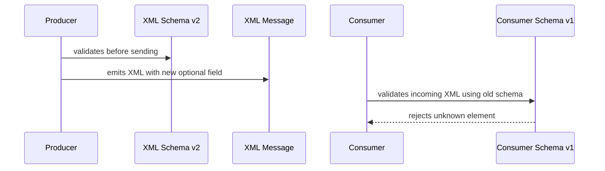
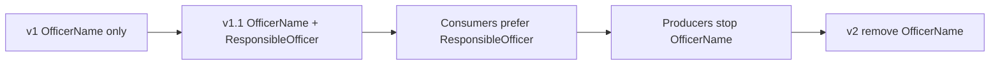
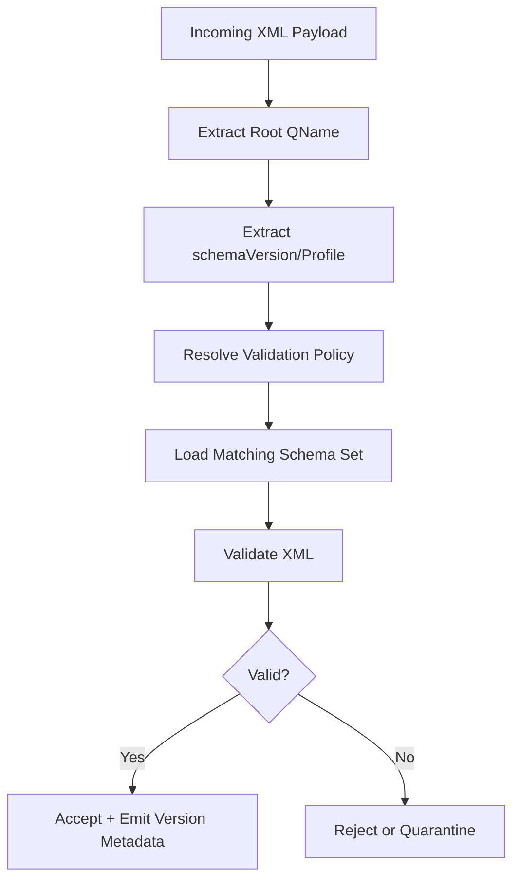
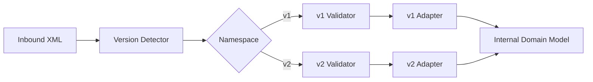
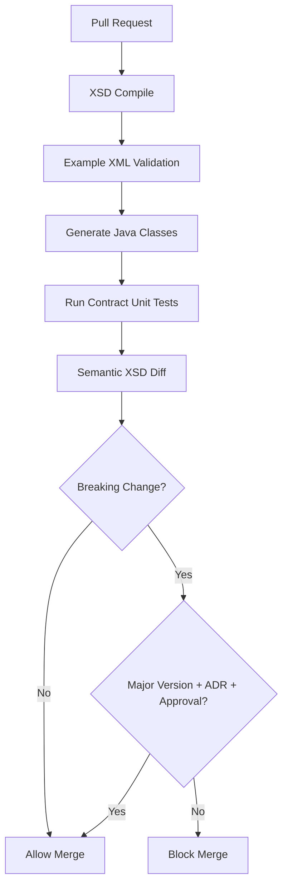

# Part 008 — XSD Versioning and Compatibility

XSD contract jarang mati cepat.

Dalam enterprise, XML schema bisa hidup lebih lama daripada aplikasi yang pertama kali membuatnya. Aplikasi berganti framework, runtime Java upgrade, deployment pindah ke Kubernetes, message broker berubah, tetapi XML filing, XML report, SOAP payload, batch document, atau regulator submission tetap berjalan.

Karena itu, pertanyaan utama bukan:

> Bagaimana membuat XSD yang valid hari ini?

Pertanyaan utama adalah:

> Bagaimana membuat XSD yang bisa berubah tanpa menghancurkan producer, consumer, archive, audit, dan partner eksternal?

Part ini membahas XSD versioning dan compatibility secara production-grade.

Kita akan fokus pada:

- mental model compatibility;
- perubahan aman dan breaking;
- namespace versioning;
- schemaVersion attribute;
- optionality;
- extension point;
- wildcard;
- migration strategy;
- Java generated code impact;
- governance CI/CD.

---

## 1. Mental Model: Compatibility Bukan Satu Dimensi

Banyak tim menyederhanakan compatibility menjadi:

> Apakah schema baru masih valid?

Itu tidak cukup.

Untuk XML contract, compatibility minimal punya lima dimensi:

| Dimension | Pertanyaan |
|---|---|
| Syntax compatibility | Apakah XML valid terhadap schema? |
| Consumer compatibility | Apakah consumer lama bisa membaca payload baru? |
| Producer compatibility | Apakah producer lama masih boleh mengirim payload lama? |
| Semantic compatibility | Apakah makna business tidak berubah diam-diam? |
| Operational compatibility | Apakah validation, archive, replay, reporting, dan audit tetap berjalan? |

Contoh:

Menambah optional element di schema baru terlihat aman secara syntax. Tapi consumer lama yang melakukan strict validation terhadap schema lama akan menolak payload yang mengandung element baru.

Jadi perubahan itu aman hanya jika salah satu benar:

- consumer lama tidak melakukan strict validation;
- schema lama punya extension point;
- payload baru tidak dikirim ke consumer lama;
- ada routing berdasarkan version;
- consumer lama sudah di-upgrade sebelum producer mengirim field baru.

Compatibility adalah relasi antar versi, bukan properti schema tunggal.

---

## 2. Producer, Consumer, Writer Schema, Reader Schema

Avro punya istilah eksplisit: writer schema dan reader schema. XSD tidak selalu memakai istilah ini, tetapi mental model-nya tetap berguna.



Masalahnya bukan schema v2 invalid. Masalahnya consumer masih memakai reader schema v1.

Dalam XSD ecosystem, Anda harus tahu:

- schema apa yang dipakai producer saat generate/validate output;
- schema apa yang dipakai consumer saat validate input;
- apakah consumer strict, lax, atau tolerant;
- apakah consumer unmarshalling langsung ke generated Java class;
- apakah unknown element ditolak sebelum application code melihat payload;
- apakah message disimpan raw sebelum validation;
- apakah schema version disimpan bersama payload.

Tanpa informasi itu, klaim “backward compatible” sering palsu.

---

## 3. Vocabulary Compatibility

Kita pakai definisi praktis:

### 3.1 Backward Compatible

Schema/consumer baru masih bisa membaca dokumen yang dibuat oleh producer lama.

```text
Old XML document -> New schema / New consumer = OK
```

Contoh: menambah optional field di schema baru biasanya backward compatible untuk consumer baru karena dokumen lama tidak punya field itu.

### 3.2 Forward Compatible

Schema/consumer lama masih bisa menerima dokumen yang dibuat oleh producer baru.

```text
New XML document -> Old schema / Old consumer = OK
```

Ini jauh lebih sulit di XSD jika schema lama strict dan tidak punya extension point.

### 3.3 Full Compatible

Kedua arah aman:

```text
Old XML -> New consumer = OK
New XML -> Old consumer = OK
```

Full compatibility di XSD memerlukan desain sejak awal: optionality, extension points, tolerant reader, atau version-aware routing.

---

## 4. XSD Change Compatibility Matrix

Matrix berikut adalah rule of thumb. Real outcome tetap bergantung pada content model, validation strategy, dan consumer behavior.

| Change | Backward? New consumer reads old XML | Forward? Old consumer reads new XML | Notes |
|---|---:|---:|---|
| Add optional element at end of sequence | Usually yes | Usually no | Old strict schema rejects unknown element unless wildcard exists |
| Add required element | No | No | Old XML missing required element; old consumer rejects new element |
| Remove optional element | Usually yes | Usually yes if producer stops sending | Breaks consumers expecting it semantically |
| Remove required element | Usually no | Usually yes syntactically for old consumer? | New producer omits field; old consumer may require it |
| Rename element | No | No | Treat as remove + add |
| Change element namespace | No | No | Different QName |
| Relax minLength/maxLength | Yes | Usually yes | Consumer business logic may still fail |
| Tighten minLength/maxLength | No | Yes for old valid subset | Old documents may become invalid |
| Add enum value | New consumer yes | Old strict consumer no | Open code list may be better |
| Remove enum value | Old docs may fail | New docs may be subset | Usually breaking |
| Change simple type from string to decimal | No | No | Lexical/value space changes |
| Increase maxOccurs | Usually yes | Old consumer may reject extra occurrences | Forward risk |
| Decrease maxOccurs | Old docs may fail | New docs likely accepted | Backward risk |
| Add attribute optional | Usually yes | Old strict schema may reject | Attributes also need extension strategy |
| Add attribute required | No | No | Old XML missing attribute |
| Change sequence order | No | No | XSD sequence is order-sensitive |
| Add alternative in choice | New consumer yes | Old consumer no | Similar to enum add |
| Add xs:any extension point | New schema yes | Does not help old schema | Must exist before extension payload appears |

The most important lesson:

> In XSD, adding optional data is not automatically forward compatible.

It is backward compatible for upgraded consumers, but old strict consumers may reject the new document.

---

## 5. The Sequence Trap

XSD `xs:sequence` is order-sensitive.

Original:

```xml
<xs:complexType name="CaseType">
  <xs:sequence>
    <xs:element name="CaseId" type="case:CaseIdType"/>
    <xs:element name="CaseType" type="case:CaseCategoryType"/>
    <xs:element name="Severity" type="case:SeverityType"/>
  </xs:sequence>
</xs:complexType>
```

Adding optional field in the middle:

```xml
<xs:complexType name="CaseType">
  <xs:sequence>
    <xs:element name="CaseId" type="case:CaseIdType"/>
    <xs:element name="InvestigationUnit" type="case:InvestigationUnitType" minOccurs="0"/>
    <xs:element name="CaseType" type="case:CaseCategoryType"/>
    <xs:element name="Severity" type="case:SeverityType"/>
  </xs:sequence>
</xs:complexType>
```

For new schema, this is valid. But it can create friction:

- producer must emit element in exact order;
- consumers doing streaming parsing may rely on old order;
- diff appears in the middle of content model;
- old validators reject the new element;
- generated Java property order changes.

Safer pattern:

```xml
<xs:complexType name="CaseType">
  <xs:sequence>
    <xs:element name="CaseId" type="case:CaseIdType"/>
    <xs:element name="CaseType" type="case:CaseCategoryType"/>
    <xs:element name="Severity" type="case:SeverityType"/>
    <xs:element name="InvestigationUnit" type="case:InvestigationUnitType" minOccurs="0"/>
  </xs:sequence>
</xs:complexType>
```

Rule:

> Add optional elements near the end of the relevant sequence unless there is a strong domain reason not to.

Even better, design future extension zones from the start.

---

## 6. Namespace Versioning Strategy

Namespace versioning is the hardest practical decision.

Example:

```text
https://example.gov/schema/enforcement/case/v1
https://example.gov/schema/enforcement/case/v2
```

Changing namespace changes QName of all elements in that namespace.

That is a major compatibility event.

### 6.1 Major Version in Namespace

Use new namespace for breaking changes:

```text
v1 -> v2
```

Examples of breaking changes:

- rename root element;
- remove required field;
- add required field;
- change namespace;
- change meaning of existing field;
- tighten constraints in a way old valid documents fail;
- split one field into many mandatory fields;
- change code list semantics;
- change document lifecycle semantics.

### 6.2 Same Namespace for Compatible Minor Changes

For compatible changes, keep namespace stable:

```text
https://example.gov/schema/enforcement/case/v1
```

Then manage schema artifact version separately:

```text
case-filing-1.1.0.xsd
case-filing-1.2.0.xsd
```

Or Maven artifact:

```xml
<groupId>gov.example.contract</groupId>
<artifactId>enforcement-case-xsd</artifactId>
<version>1.2.0</version>
```

Important:

- namespace identity = major contract family;
- artifact version = release of schema files/tooling;
- document schemaVersion = producer-declared schema release or profile.

Do not use namespace for every minor change. That creates version explosion.

---

## 7. schemaVersion Attribute Pattern

A common pattern is adding version metadata to the root element.

```xml
<case:CaseFiling
    xmlns:case="https://example.gov/schema/enforcement/case/v1"
    schemaVersion="1.2.0">
  ...
</case:CaseFiling>
```

Schema:

```xml
<xs:complexType name="CaseFilingType">
  <xs:sequence>
    <xs:element name="FilingHeader" type="case:FilingHeaderType"/>
    <xs:element name="Case" type="case:CaseType"/>
    <xs:element name="Extensions" type="case:ExtensionContainerType" minOccurs="0"/>
  </xs:sequence>
  <xs:attribute name="schemaVersion" type="case:SemanticVersionType" use="required"/>
</xs:complexType>
```

Use this carefully.

`schemaVersion` helps:

- logging;
- routing;
- audit;
- validation selection;
- support diagnostics;
- replay;
- partner incident triage.

But it does not magically make incompatible payload compatible.

Bad assumption:

```text
We added schemaVersion, so we can change anything.
```

Correct interpretation:

```text
schemaVersion tells systems what contract release produced the document.
Compatibility still depends on schema design and consumer behavior.
```

---

## 8. Version Identification Layers

A production XML contract may carry version at several layers:

| Layer | Example | Purpose |
|---|---|---|
| Namespace | `/case/v1` | Major contract identity |
| Schema artifact | `1.2.0` | Release/package version |
| Root attribute | `schemaVersion="1.2.0"` | Runtime payload declaration |
| Message profile | `profile="REGULATOR-A"` | Partner-specific profile |
| Code list version | `listVersion="2026.07"` | Controlled vocabulary release |
| Application version | producer build version | Operational traceability |

Do not collapse all versioning into one string. Each layer answers different questions.

---

## 9. Extensibility for Forward Compatibility

Forward compatibility requires old consumers to survive new data. XSD strict validation blocks unknown elements unless the old schema already allowed them.

Therefore extension points must exist before you need them.

### 9.1 Explicit Extension Container

```xml
<xs:complexType name="CaseFilingType">
  <xs:sequence>
    <xs:element name="FilingHeader" type="case:FilingHeaderType"/>
    <xs:element name="Case" type="case:CaseType"/>
    <xs:element name="Extensions" type="case:ExtensionContainerType" minOccurs="0"/>
  </xs:sequence>
</xs:complexType>

<xs:complexType name="ExtensionContainerType">
  <xs:sequence>
    <xs:any namespace="##other" processContents="lax" minOccurs="0" maxOccurs="unbounded"/>
  </xs:sequence>
</xs:complexType>
```

This allows documents to carry foreign namespace extension data.

Example:

```xml
<case:Extensions xmlns:bank="https://bank.example/schema/case-extension/v1">
  <bank:InternalRiskScore>87</bank:InternalRiskScore>
</case:Extensions>
```

Old core consumer can ignore `bank:*` if it does not need it.

### 9.2 processContents Choice

| Value | Meaning | Use |
|---|---|---|
| `strict` | Validator must find schema and validate | Strong but brittle |
| `lax` | Validate if schema available, otherwise accept | Common extension default |
| `skip` | Do not validate extension content | Flexible but risky |

For enterprise extension points, `lax` is often the pragmatic default.

But do not use `lax` as a substitute for governance. Extension payload still needs ownership, documentation, and telemetry.

---

## 10. Attribute Extension

Elements are not the only extension surface. Attributes can also need evolution.

XSD supports `xs:anyAttribute`:

```xml
<xs:complexType name="CaseType">
  <xs:sequence>
    <xs:element name="CaseId" type="case:CaseIdType"/>
    <xs:element name="CaseType" type="case:CaseCategoryType"/>
    <xs:element name="Severity" type="case:SeverityType"/>
  </xs:sequence>
  <xs:anyAttribute namespace="##other" processContents="lax"/>
</xs:complexType>
```

Use sparingly. Attributes are less visible and often abused for metadata.

Good attribute use:

- version;
- language;
- source system;
- profile;
- classification marker.

Bad attribute use:

- business data that should be elements;
- hidden flags controlling processing;
- new required semantic state;
- values that change document interpretation radically.

---

## 11. Tolerant Reader Pattern

Tolerant reader means consumer reads what it needs and ignores what it does not understand.

For XML, tolerant reader can be implemented at several levels:

### 11.1 Parser-Level Tolerance

Use streaming parser and extract known elements, ignoring unknown extension sections.

Pros:

- robust against new fields;
- efficient for large documents;
- good for routing/indexing.

Cons:

- loses full schema validation;
- application must enforce required fields;
- more manual code.

### 11.2 Schema-Level Tolerance

Design extension points with `xs:any` and `xs:anyAttribute`.

Pros:

- still schema-driven;
- unknown data has controlled location;
- good for partner-specific extension.

Cons:

- must be designed from start;
- cannot ignore arbitrary unknown fields everywhere.

### 11.3 Binding-Level Tolerance

Generated Java model may preserve unknown DOM elements depending on binding design, but this is fragile and tool-specific.

Recommendation:

> Do not rely on accidental tolerance of generated Java binding. Design explicit extension points.

---

## 12. Expand-Migrate-Contract for XSD

Breaking changes should rarely be done in one step. Use expand-migrate-contract.

Scenario:

Old field:

```xml
<case:OfficerName>Jane Doe</case:OfficerName>
```

New desired structure:

```xml
<case:ResponsibleOfficer>
  <case:OfficerId>EMP-0019</case:OfficerId>
  <case:DisplayName>Jane Doe</case:DisplayName>
</case:ResponsibleOfficer>
```

### Step 1 — Expand

Add new optional structure while keeping old field.

```xml
<xs:element name="OfficerName" type="case:NonEmptyStringType" minOccurs="0"/>
<xs:element name="ResponsibleOfficer" type="case:ResponsibleOfficerType" minOccurs="0"/>
```

Rules:

- producer may send both;
- consumer should prefer new field if present;
- validation may enforce at least one via XSD 1.1 assertion or runtime rule;
- documentation marks old field deprecated.

### Step 2 — Migrate

Upgrade producers and consumers.

- producers start sending `ResponsibleOfficer`;
- consumers read new field;
- telemetry tracks old field usage;
- partner readiness is measured;
- examples and docs are updated.

### Step 3 — Contract

Only after old usage reaches zero and deprecation period ends:

- remove old field in new major version; or
- keep old optional field indefinitely if external compatibility requires it.



This pattern avoids big-bang migration.

---

## 13. Deprecation Metadata Pattern

XSD itself does not have a universal deprecation keyword like some API description languages. But you can use annotation.

```xml
<xs:element name="OfficerName" type="case:NonEmptyStringType" minOccurs="0">
  <xs:annotation>
    <xs:documentation>
      Deprecated since 1.1.0. Use ResponsibleOfficer.DisplayName and ResponsibleOfficer.OfficerId.
      Planned removal in namespace v2 after partner migration window.
    </xs:documentation>
  </xs:annotation>
</xs:element>
```

For production, documentation alone is not enough. Add:

- contract catalog deprecation field;
- CI warning;
- usage telemetry;
- partner notification;
- migration guide;
- removal criteria.

---

## 14. XSD 1.1 Assertions for Semantic Transition

XSD 1.1 supports assertions using XPath expressions. This can enforce rules beyond XSD 1.0 content model.

Example: during migration, require at least old or new officer field.

```xml
<xs:complexType name="CaseAssignmentType">
  <xs:sequence>
    <xs:element name="OfficerName" type="case:NonEmptyStringType" minOccurs="0"/>
    <xs:element name="ResponsibleOfficer" type="case:ResponsibleOfficerType" minOccurs="0"/>
  </xs:sequence>
  <xs:assert test="exists(case:OfficerName) or exists(case:ResponsibleOfficer)"/>
</xs:complexType>
```

Be careful:

- not all validators support XSD 1.1 equally;
- Java built-in validation support is commonly centered around XSD 1.0 processors unless using specific libraries;
- assertions can make schemas harder to understand;
- complex business rules may be better in runtime validation.

Rule:

> Use XSD assertions for structural-semantic rules that are stable, cheap, and clearly part of the contract. Use application validation for contextual business rules.

---

## 15. Enum Evolution

Enums look simple but are one of the most common compatibility traps.

Original:

```xml
<xs:simpleType name="SeverityType">
  <xs:restriction base="xs:string">
    <xs:enumeration value="LOW"/>
    <xs:enumeration value="MEDIUM"/>
    <xs:enumeration value="HIGH"/>
  </xs:restriction>
</xs:simpleType>
```

Adding:

```xml
<xs:enumeration value="CRITICAL"/>
```

New consumers can validate both old and new values. Old consumers reject `CRITICAL`.

### 15.1 Closed Enum Pattern

Use XSD enumeration when:

- value set is stable;
- all consumers are version-aligned;
- unknown value must be rejected;
- strict validation is desired.

### 15.2 Open Code List Pattern

Use pattern/string + runtime code list when:

- value set changes frequently;
- regulator updates code list independently;
- partner-specific values exist;
- old consumers should tolerate unknown values;
- validation depends on effective date.

Example:

```xml
<xs:complexType name="CodeValueType">
  <xs:simpleContent>
    <xs:extension base="xs:string">
      <xs:attribute name="listId" type="xs:string" use="required"/>
      <xs:attribute name="listVersion" type="xs:string" use="optional"/>
    </xs:extension>
  </xs:simpleContent>
</xs:complexType>
```

The trade-off is clear:

- XSD enum gives compile-time strictness;
- external code list gives operational evolvability.

For regulatory systems, code list versioning is often more realistic than embedding every changing code in XSD.

---

## 16. Optionality and Requiredness

Changing optionality is dangerous.

### 16.1 Optional to Required

```xml
<!-- v1 -->
<xs:element name="PenaltyAmount" type="case:MoneyType" minOccurs="0"/>

<!-- v2 -->
<xs:element name="PenaltyAmount" type="case:MoneyType" minOccurs="1"/>
```

This breaks old documents.

### 16.2 Required to Optional

```xml
<!-- v1 -->
<xs:element name="CaseId" type="case:CaseIdType"/>

<!-- v2 -->
<xs:element name="CaseId" type="case:CaseIdType" minOccurs="0"/>
```

Syntactically, new consumer may accept more. But semantically, this may break downstream systems relying on `CaseId`.

Do not treat relaxing requiredness as always safe. It may be data quality regression.

### 16.3 Required at Business Level vs Schema Level

Some fields are conditionally required.

Example:

```text
PenaltyAmount is required only when CaseOutcome = SANCTIONED.
```

XSD 1.0 cannot express this easily. Options:

- XSD 1.1 assertion;
- Schematron;
- application validation;
- split into separate document types;
- use choice with specialized structures.

Be explicit where the rule lives.

---

## 17. Compatibility and Java Generated Code

Schema compatibility is not the same as Java source/binary compatibility.

Changing XSD can change generated Java in ways that affect code:

| XSD Change | Java Impact |
|---|---|
| Add optional element | New field/getter/setter in generated class |
| Remove element | Getter/setter disappears |
| Rename element | Old property disappears, new property appears |
| Change type | Property Java type changes |
| Change maxOccurs from 1 to many | Single property may become `List<T>` |
| Change anonymous type to named type | Class name may change |
| Change namespace | Java package may change |
| Add enum value | Enum class changes; switch statements may fail semantically |

Generated code consumers often compile against a specific contract artifact. Therefore compatibility policy must include:

- XML compatibility;
- generated source compatibility;
- Maven artifact versioning;
- package namespace stability;
- consumer rebuild strategy.

Recommended artifact policy:

```text
Major version:
  breaking schema or generated-code change

Minor version:
  backward-compatible additions

Patch version:
  documentation, examples, non-semantic fixes
```

But remember: SemVer for artifact does not replace XML namespace strategy.

---

## 18. Validation Strategy Across Versions

A production validator service should not blindly validate every payload against latest schema.

Better:



Validation policy should consider:

- root namespace;
- root element;
- schemaVersion;
- partner profile;
- effective date;
- deprecation policy;
- strict vs warning mode;
- environment.

### 18.1 Latest-Only Validation Anti-Pattern

Bad:

```text
Always validate old archived XML against latest schema.
```

Why bad?

- old valid documents may fail new constraints;
- audit replay becomes unstable;
- historical truth is overwritten by current schema;
- debugging becomes confusing.

Better:

```text
Validate document against schema version effective when document was produced, unless explicitly running migration validation.
```

Archive raw payload with version metadata.

---

## 19. Multi-Version Runtime Support

Sometimes you must support v1 and v2 simultaneously.

Architecture:



Key principle:

> Keep external contract versions at the boundary. Normalize internally.

Do not spread `if version == v1` logic across the entire application.

Use adapters:

```text
CaseFilingV1Xml -> CaseIntakeCommand
CaseFilingV2Xml -> CaseIntakeCommand
```

This prevents version logic from contaminating core domain logic.

---

## 20. Same Namespace Compatible Change: Example

Original v1.0:

```xml
<xs:complexType name="FilingHeaderType">
  <xs:sequence>
    <xs:element name="FilingId" type="case:FilingIdType"/>
    <xs:element name="SubmittedAt" type="xs:dateTime"/>
    <xs:element name="SubmittingInstitutionId" type="case:InstitutionIdType"/>
  </xs:sequence>
</xs:complexType>
```

v1.1 adds optional `SourceSystem`:

```xml
<xs:complexType name="FilingHeaderType">
  <xs:sequence>
    <xs:element name="FilingId" type="case:FilingIdType"/>
    <xs:element name="SubmittedAt" type="xs:dateTime"/>
    <xs:element name="SubmittingInstitutionId" type="case:InstitutionIdType"/>
    <xs:element name="SourceSystem" type="case:SourceSystemType" minOccurs="0"/>
  </xs:sequence>
</xs:complexType>
```

Compatibility plan:

- keep namespace `/v1`;
- release schema artifact `1.1.0`;
- add examples with and without `SourceSystem`;
- generated Java artifact minor version;
- producers may send only after target consumers are ready or old consumers tolerate extension;
- if old strict consumers exist, do not send new field to them.

This is backward-compatible for upgraded consumers, but not automatically forward-compatible for strict old consumers.

---

## 21. Breaking Change New Namespace: Example

v1:

```xml
<case:CaseFiling xmlns:case="https://example.gov/schema/enforcement/case/v1">
  <case:OfficerName>Jane Doe</case:OfficerName>
</case:CaseFiling>
```

v2:

```xml
<case:CaseFiling xmlns:case="https://example.gov/schema/enforcement/case/v2">
  <case:ResponsibleOfficer>
    <case:OfficerId>EMP-0019</case:OfficerId>
    <case:DisplayName>Jane Doe</case:DisplayName>
  </case:ResponsibleOfficer>
</case:CaseFiling>
```

This is a new contract family.

Migration plan:

- publish v2 namespace;
- keep v1 validator active;
- build v1-to-domain and v2-to-domain adapters;
- support both during transition;
- publish deprecation timeline;
- track v1 volume;
- remove only after policy allows.

Do not pretend this is a minor change.

---

## 22. Contract Diffing

A useful XSD diff tool must be semantic, not just textual.

Text diff sees:

```text
line added
line removed
```

Contract diff should classify:

```text
ADDED_OPTIONAL_ELEMENT: FilingHeader.SourceSystem
CHANGED_MIN_OCCURS: PenaltyAmount 0 -> 1
REMOVED_ENUM_VALUE: Severity.CRITICAL
CHANGED_TYPE: SubmittedAt xs:dateTime -> xs:string
RENAMED_ELEMENT: OfficerName -> ResponsibleOfficer
```

CI should fail for breaking changes unless:

- major version is bumped;
- migration plan is attached;
- owner approval exists;
- consumers are notified;
- deprecation policy is satisfied.

---

## 23. Compatibility Gate in CI/CD

A production contract repository should run checks like:



Minimum gates:

- schema well-formed;
- schema compiles;
- all examples valid;
- negative examples invalid;
- generated Java compiles;
- no forbidden namespace change;
- no required field added in minor version;
- no enum removal in minor version;
- no type tightening without approval;
- docs updated;
- changelog updated.

---

## 24. Changelog Format

Every schema release should have changelog entries designed for consumers.

Bad changelog:

```text
Updated case schema.
```

Good changelog:

```md
## 1.2.0

Compatibility: backward-compatible for upgraded consumers; not forward-compatible for strict v1.1 validators.

Added:
- Optional `FilingHeader.SourceSystem` to identify source application.
- Optional `Case.Assignment.ResponsibleUnit`.

Deprecated:
- `Case.Assignment.OfficerName`; use `ResponsibleOfficer.DisplayName`.

Runtime impact:
- Producers must not send `SourceSystem` to consumers still validating with schema artifact <= 1.1.0.
- Java generated artifact adds `getSourceSystem()` and `setSourceSystem()`.

Examples:
- `examples/case-filing-minimal-v1.2.xml`
- `examples/case-filing-full-v1.2.xml`
```

Contract changelog is not for the schema author. It is for everyone who will be paged when payloads fail.

---

## 25. Regulatory and Audit Concerns

For regulatory or enforcement systems, versioning has audit consequences.

You need to answer:

- Which schema version validated this filing?
- Which code list version was active?
- Was the field required at the time of submission?
- Was the document accepted with warning or rejected?
- Was validation rule later changed?
- Can we replay the original validation decision?
- Can we explain why a partner payload failed?

Store validation metadata:

```json
{
  "rootNamespace": "https://example.gov/schema/enforcement/case/v1",
  "rootElement": "CaseFiling",
  "declaredSchemaVersion": "1.2.0",
  "validatorSchemaArtifact": "gov.example.contract:enforcement-case-xsd:1.2.0",
  "validationMode": "STRICT",
  "validatedAt": "2026-07-03T10:16:02Z",
  "result": "ACCEPTED"
}
```

Even if your core payload is XML, operational metadata can be stored as JSON, relational rows, or event metadata. The important thing is traceability.

---

## 26. Practical Versioning Policy

A workable policy:

### 26.1 Patch Version

Allowed:

- documentation fix;
- example correction that does not change schema semantics;
- annotation improvement;
- build metadata change.

Not allowed:

- changing constraints;
- changing generated code;
- adding/removing elements.

### 26.2 Minor Version

Allowed with review:

- add optional element at compatible location;
- add optional attribute if old consumers are considered;
- relax constraint;
- add documentation;
- add new non-required type not used by existing root;
- deprecate field.

Requires caution:

- add enum value;
- add choice branch;
- widen occurrence;
- add extension point.

### 26.3 Major Version

Required for:

- namespace change;
- remove field;
- rename field;
- add required field;
- tighten constraint;
- change type incompatibly;
- reorder sequence incompatibly;
- change semantics;
- remove enum value;
- alter root element contract.

---

## 27. Decision Framework

When changing XSD, ask in this order:

1. Is this change semantic or only structural?
2. Can old XML still validate against new schema?
3. Can new XML validate against old schema?
4. Will generated Java code remain source-compatible?
5. Are old consumers strict validators?
6. Is the field required by business logic or only useful metadata?
7. Can this be modeled as optional expansion first?
8. Does this require new namespace?
9. Is there an extension point already?
10. Do we have telemetry to know who still uses old shape?
11. Is there a migration guide?
12. Is rollback possible?

If you cannot answer these, the change is not ready.

---

## 28. Mini Exercise

Take this v1 schema fragment:

```xml
<xs:complexType name="CaseOutcomeType">
  <xs:sequence>
    <xs:element name="OutcomeCode" type="case:OutcomeCodeType"/>
    <xs:element name="DecisionDate" type="xs:date"/>
    <xs:element name="OfficerName" type="case:NonEmptyStringType"/>
  </xs:sequence>
</xs:complexType>
```

New requirements:

1. `OfficerName` should become structured officer identity.
2. `OutcomeCode` has new value `REFERRED_TO_CRIMINAL_AUTHORITY`.
3. `DecisionDate` should include timezone.
4. Partner-specific notes should be allowed.

Classify each change:

- compatible minor;
- breaking major;
- needs expand-migrate-contract;
- should use extension point;
- should use runtime validation/code list.

Expected reasoning:

- `OfficerName` -> structured officer: breaking if direct replacement; use expand-migrate-contract.
- enum add: old strict consumers may reject; consider code list or readiness check.
- `xs:date` -> `xs:dateTime`: type change; likely breaking.
- partner notes: add explicit extension container; forward compatibility only if old schema already had extension point.

---

## 29. Summary

XSD versioning is difficult because XML validation is strict, namespace is identity, sequence order matters, and generated Java code often couples consumers tightly to schema shape.

Key principles:

- Keep namespace stable for compatible minor changes.
- Use new namespace for breaking major changes.
- Do not assume optional additions are forward-compatible.
- Design extension points before you need them.
- Use expand-migrate-contract for structural replacement.
- Treat enum evolution as compatibility risk.
- Validate historical documents with their historical schema.
- Keep version logic at system boundaries using adapters.
- Automate compatibility checks in CI.
- Store validation metadata for audit and replay.

The core mental model:

> XSD evolution is not about editing schema files. It is about managing a distributed compatibility contract across producer, consumer, validator, generated code, archives, and operations.

In Part 009, we will move from schema design into Java runtime: XML binding, validation, parser security, schema caching, secure processing, error mapping, and production enforcement.

---

## References

- W3C XML Schema Definition Language 1.1 Part 1: Structures.
- W3C XML Schema Definition Language 1.1 Part 2: Datatypes.
- W3C XML Schema 1.0 Part 1: Structures, Second Edition.
- Oracle Java Technical Article: Introducing Design Patterns in XML Schemas.
