# Part 009 — Java XML Binding, Validation, and Runtime Enforcement

XSD yang bagus tidak otomatis membuat sistem aman.

Kontrak XML baru benar-benar bernilai ketika kontrak itu ditegakkan di runtime:

- saat menerima payload dari partner;
- saat membaca XML dari file batch;
- saat memproses message dari queue;
- saat mengirim response;
- saat menghasilkan submission regulator;
- saat replay data lama;
- saat melakukan migration antar versi schema.

Di Java, banyak kegagalan XML production bukan karena tim tidak tahu XSD. Penyebabnya biasanya lebih rendah level:

- XML parser membuka external entity;
- schema tidak di-cache;
- JAXB context dibuat per request;
- validator tidak thread-safe tetapi dipakai bersama;
- generated class bocor ke domain model;
- unmarshalling dilakukan sebelum validation yang benar;
- error validation dibuang menjadi `400 Bad Request` generik;
- namespace salah tetapi test fixture terlalu longgar;
- consumer lama gagal membaca optional element baru;
- payload invalid tidak disimpan sehingga incident tidak bisa direkonstruksi.

Part ini membahas bagaimana menjalankan XSD contract di Java secara production-grade.

Kita tidak akan membahas XML sebagai teknologi akademik. Kita akan membahas pipeline nyata:

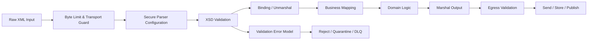

Mental model utamanya:

> XML binding adalah mapping. XSD validation adalah enforcement. Secure parser configuration adalah attack surface control. Jangan campur ketiganya seolah-olah satu hal.

---

## 1. Binding Bukan Contract Enforcement

Jakarta XML Binding membantu memetakan XML ke object Java dan object Java ke XML.

Itu berguna, tetapi binding bukan validasi penuh.

Generated class bisa menangkap sebagian struktur:

```java
public class CaseIntakeRequest {
    protected String caseNumber;
    protected XMLGregorianCalendar receivedAt;
    protected List<DocumentReference> documents;
}
```

Namun banyak invariant kontrak tidak otomatis aman hanya karena class berhasil dibuat:

| Contract Concern | Apakah Binding Cukup? | Catatan |
|---|---:|---|
| XML well-formed | Tidak | Parser yang memeriksa. |
| Namespace benar | Sebagian | Tergantung konfigurasi parser dan binding. |
| Required element | Sebagian | Bisa gagal saat unmarshal, tetapi error quality sering buruk. |
| Pattern restriction | Tidak selalu | Harus XSD validation. |
| Enumeration restriction | Sebagian | Generated enum bisa membantu, tetapi unknown handling tetap penting. |
| `xs:choice` | Sebagian | Mapping Java sering awkward. |
| Identity constraint | Tidak | Perlu XSD validation. |
| External entity blocked | Tidak | Perlu secure parser config. |
| Business invariant lintas field | Tidak | Perlu domain validation. |

Jangan jadikan unmarshalling sebagai satu-satunya validation gate.

Pipeline yang lebih sehat:

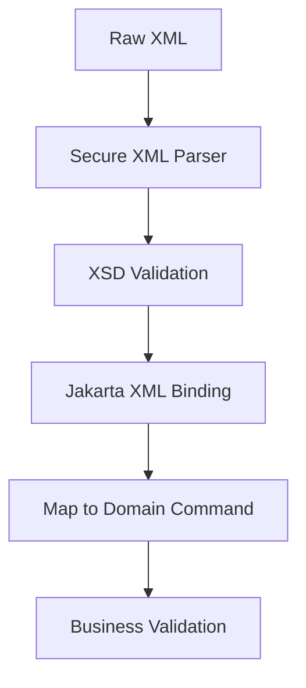

Urutan ini memisahkan lapisan:

1. **Parser guard**: apakah XML boleh diproses sama sekali?
2. **Contract validation**: apakah payload sesuai XSD?
3. **Binding**: apakah payload bisa diubah ke Java object?
4. **Domain validation**: apakah makna bisnisnya valid?

---

## 2. Java XML Processing Stack

Di Java production, Anda biasanya bertemu beberapa API XML sekaligus.

| API | Fungsi | Kapan Dipakai |
|---|---|---|
| SAX | Event-based parsing | Validasi streaming, memory rendah. |
| StAX | Pull-based streaming | Kontrol parsing granular, pipeline besar. |
| DOM | Tree in memory | Manipulasi dokumen kecil, testing, transform sederhana. |
| JAXP | Factory/configuration layer | Parser, validator, transformer configuration. |
| Jakarta XML Binding | XML ↔ Java object mapping | DTO XML, generated classes, marshalling/unmarshalling. |
| Transformer/XSLT | Transform XML | Legacy integration, canonicalization, document conversion. |
| XPath | Query XML | Rule extraction, testing, selective validation. |

Untuk contract engineering, tiga komponen paling penting adalah:

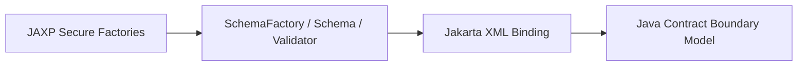

JAXP mengontrol parser dan validator. Jakarta XML Binding mengontrol object mapping.

Jangan mulai dari JAXB annotation. Mulailah dari boundary pipeline.

---

## 3. Secure XML Parsing Baseline

XML bisa membawa attack surface yang tidak terlihat di JSON biasa:

- external entity injection;
- server-side request forgery melalui external entity;
- local file disclosure;
- entity expansion bomb;
- deeply nested XML;
- oversized document;
- remote schema loading;
- XInclude abuse;
- expensive validation path.

Baseline aman:

> Untuk payload eksternal, parser harus menganggap XML sebagai untrusted input sampai terbukti aman.

Contoh konfigurasi `DocumentBuilderFactory` untuk DOM:

```java
import javax.xml.XMLConstants;
import javax.xml.parsers.DocumentBuilderFactory;

public final class SecureXmlFactories {

    public static DocumentBuilderFactory secureDocumentBuilderFactory() throws Exception {
        DocumentBuilderFactory factory = DocumentBuilderFactory.newInstance();

        factory.setNamespaceAware(true);
        factory.setXIncludeAware(false);
        factory.setExpandEntityReferences(false);

        factory.setFeature(XMLConstants.FEATURE_SECURE_PROCESSING, true);
        factory.setFeature("http://apache.org/xml/features/disallow-doctype-decl", true);
        factory.setFeature("http://xml.org/sax/features/external-general-entities", false);
        factory.setFeature("http://xml.org/sax/features/external-parameter-entities", false);
        factory.setFeature("http://apache.org/xml/features/nonvalidating/load-external-dtd", false);

        factory.setAttribute(XMLConstants.ACCESS_EXTERNAL_DTD, "");
        factory.setAttribute(XMLConstants.ACCESS_EXTERNAL_SCHEMA, "");

        return factory;
    }
}
```

Catatan penting:

- `FEATURE_SECURE_PROCESSING` adalah sinyal ke implementasi parser untuk menerapkan mode aman, tetapi jangan anggap itu cukup untuk semua attack.
- Disable DTD untuk payload eksternal kecuali ada alasan bisnis kuat.
- Jangan izinkan validator mengambil schema dari internet saat runtime.
- Batasi ukuran payload di transport layer sebelum parser membaca stream.
- Treat parser configuration sebagai security control, bukan utility detail.

Untuk StAX:

```java
import javax.xml.XMLConstants;
import javax.xml.stream.XMLInputFactory;

public final class SecureStaxFactory {

    public static XMLInputFactory secureXmlInputFactory() {
        XMLInputFactory factory = XMLInputFactory.newFactory();

        factory.setProperty(XMLInputFactory.SUPPORT_DTD, false);
        factory.setProperty("javax.xml.stream.isSupportingExternalEntities", false);
        factory.setProperty(XMLConstants.ACCESS_EXTERNAL_DTD, "");

        return factory;
    }
}
```

Tidak semua implementation mendukung semua property dengan perilaku identik. Karena itu, buat test security fixture.

Contoh fixture yang harus ditolak:

```xml
<?xml version="1.0"?>
<!DOCTYPE foo [
  <!ELEMENT foo ANY>
  <!ENTITY xxe SYSTEM "file:///etc/passwd">
]>
<foo>&xxe;</foo>
```

Test-nya tidak boleh hanya assert exception. Test harus assert bahwa application tidak melakukan network/file access, tidak expand entity, dan mengembalikan error taxonomy yang benar.

---

## 4. XSD Validation Architecture

XSD validation di Java biasanya memakai `SchemaFactory`, `Schema`, dan `Validator`.

Mental model:

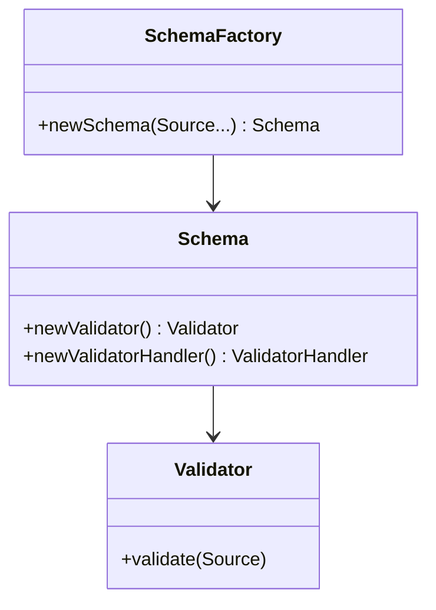

Production rule:

- `SchemaFactory`: konfigurasi dan build schema.
- `Schema`: immutable-like compiled schema object, bisa di-cache.
- `Validator`: per-use object, jangan share lintas thread.

Contoh schema loader:

```java
import javax.xml.XMLConstants;
import javax.xml.transform.Source;
import javax.xml.transform.stream.StreamSource;
import javax.xml.validation.Schema;
import javax.xml.validation.SchemaFactory;
import java.io.InputStream;
import java.util.List;

public final class XmlSchemaLoader {

    public Schema loadSchema(List<String> classpathXsdPaths) {
        try {
            SchemaFactory factory = SchemaFactory.newInstance(XMLConstants.W3C_XML_SCHEMA_NS_URI);
            factory.setFeature(XMLConstants.FEATURE_SECURE_PROCESSING, true);
            factory.setProperty(XMLConstants.ACCESS_EXTERNAL_DTD, "");
            factory.setProperty(XMLConstants.ACCESS_EXTERNAL_SCHEMA, "");

            Source[] sources = classpathXsdPaths.stream()
                .map(XmlSchemaLoader::classpathSource)
                .toArray(Source[]::new);

            return factory.newSchema(sources);
        } catch (Exception e) {
            throw new IllegalStateException("Failed to load XML schemas", e);
        }
    }

    private static Source classpathSource(String path) {
        InputStream stream = Thread.currentThread()
            .getContextClassLoader()
            .getResourceAsStream(path);

        if (stream == null) {
            throw new IllegalArgumentException("Schema not found on classpath: " + path);
        }

        StreamSource source = new StreamSource(stream);
        source.setSystemId(path);
        return source;
    }
}
```

`systemId` penting agar `xs:include` dan `xs:import` bisa diselesaikan secara deterministik.

Namun untuk production besar, jangan biarkan resolver default mengambil apa pun dari lokasi eksternal. Buat `LSResourceResolver` berbasis catalog.

---

## 5. Schema Catalog dan Resource Resolver

Kontrak XML enterprise biasanya modular:

```text
schemas/
  common/
    identity-types.xsd
    money-types.xsd
    code-list-types.xsd
  case/
    case-intake-v1.xsd
    case-document-v1.xsd
  enforcement/
    enforcement-action-v1.xsd
```

XSD memakai `xs:include` untuk namespace yang sama dan `xs:import` untuk namespace berbeda.

Masalah production:

- path relatif bisa berbeda antara lokal, CI, container, dan runtime;
- schema bisa tidak sengaja di-load dari URL remote;
- versi schema salah bisa masuk classpath;
- resolver error baru muncul saat traffic masuk.

Solusi: schema catalog.

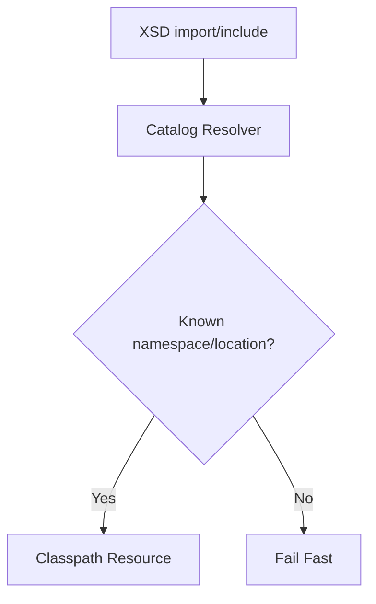

Contoh resolver sederhana:

```java
import org.w3c.dom.ls.LSInput;
import org.w3c.dom.ls.LSResourceResolver;

import java.io.InputStream;
import java.io.Reader;
import java.util.Map;

public final class ClasspathSchemaResolver implements LSResourceResolver {

    private final Map<String, String> namespaceToClasspathPath;

    public ClasspathSchemaResolver(Map<String, String> namespaceToClasspathPath) {
        this.namespaceToClasspathPath = Map.copyOf(namespaceToClasspathPath);
    }

    @Override
    public LSInput resolveResource(
        String type,
        String namespaceURI,
        String publicId,
        String systemId,
        String baseURI
    ) {
        String path = namespaceToClasspathPath.get(namespaceURI);
        if (path == null) {
            throw new IllegalArgumentException("Unknown schema namespace: " + namespaceURI);
        }

        InputStream stream = Thread.currentThread()
            .getContextClassLoader()
            .getResourceAsStream(path);

        if (stream == null) {
            throw new IllegalArgumentException("Schema resource not found: " + path);
        }

        return new SimpleLsInput(publicId, systemId, stream);
    }

    private record SimpleLsInput(
        String publicId,
        String systemId,
        InputStream byteStream
    ) implements LSInput {
        @Override public Reader getCharacterStream() { return null; }
        @Override public void setCharacterStream(Reader characterStream) {}
        @Override public InputStream getByteStream() { return byteStream; }
        @Override public void setByteStream(InputStream byteStream) {}
        @Override public String getStringData() { return null; }
        @Override public void setStringData(String stringData) {}
        @Override public String getSystemId() { return systemId; }
        @Override public void setSystemId(String systemId) {}
        @Override public String getPublicId() { return publicId; }
        @Override public void setPublicId(String publicId) {}
        @Override public String getBaseURI() { return null; }
        @Override public void setBaseURI(String baseURI) {}
        @Override public String getEncoding() { return null; }
        @Override public void setEncoding(String encoding) {}
        @Override public boolean getCertifiedText() { return false; }
        @Override public void setCertifiedText(boolean certifiedText) {}
    }
}
```

Dalam sistem besar, resolver ini sebaiknya bukan `Map<String, String>` manual, tetapi contract catalog yang di-generate dari repository schema.

---

## 6. Validation Error Model

Jangan mengembalikan error XML mentah ke client.

Error dari validator biasanya teknis:

```text
cvc-complex-type.2.4.a: Invalid content was found starting with element 'foo'.
One of '{bar}' is expected.
```

Untuk production, transform menjadi error model yang stabil:

```json
{
  "type": "CONTRACT_VALIDATION_FAILED",
  "contract": "case-intake",
  "contractVersion": "1.3.0",
  "errors": [
    {
      "code": "XML_REQUIRED_ELEMENT_MISSING",
      "path": "/CaseIntakeRequest/subject/partyId",
      "message": "Required element partyId is missing.",
      "technicalCode": "cvc-complex-type.2.4.a",
      "severity": "ERROR"
    }
  ]
}
```

Error taxonomy minimal:

| Error Type | Meaning | Handling |
|---|---|---|
| `XML_NOT_WELL_FORMED` | XML syntax rusak | Reject. |
| `XML_SECURITY_VIOLATION` | DTD/entity/external access attempt | Reject + security metric. |
| `XML_SCHEMA_NOT_FOUND` | Runtime schema/config issue | Internal error, page owner. |
| `XML_NAMESPACE_INVALID` | Namespace tidak dikenal | Reject atau route by version. |
| `XML_CONTRACT_VALIDATION_FAILED` | XSD assertion gagal | Reject/quarantine. |
| `XML_BINDING_FAILED` | Valid XML tidak bisa di-map | Bug/schema-codegen drift. |
| `XML_BUSINESS_VALIDATION_FAILED` | XSD valid tapi domain invalid | Business rejection. |

Contoh `ErrorHandler`:

```java
import org.xml.sax.ErrorHandler;
import org.xml.sax.SAXParseException;
import java.util.ArrayList;
import java.util.List;

public final class CollectingErrorHandler implements ErrorHandler {

    private final List<XmlValidationIssue> issues = new ArrayList<>();

    @Override
    public void warning(SAXParseException exception) {
        issues.add(XmlValidationIssue.warning(exception));
    }

    @Override
    public void error(SAXParseException exception) {
        issues.add(XmlValidationIssue.error(exception));
    }

    @Override
    public void fatalError(SAXParseException exception) {
        issues.add(XmlValidationIssue.fatal(exception));
    }

    public List<XmlValidationIssue> issues() {
        return List.copyOf(issues);
    }

    public boolean hasErrors() {
        return issues.stream().anyMatch(XmlValidationIssue::isErrorLike);
    }
}
```

Jangan lupa: SAX parse exception memberi line/column, bukan selalu business path. Untuk payload XML eksternal, line/column masih berguna untuk partner debugging. Untuk internal UX, path perlu dibuat dari parser event atau post-processing jika dibutuhkan.

---

## 7. Runtime Validator Service

Aplikasi besar sebaiknya tidak menaruh potongan validasi XML tersebar di controller, consumer, scheduler, dan batch job.

Buat boundary service:

```java
public interface XmlContractValidator {
    ValidationResult validate(String contractName, String version, InputStream xml);
}
```

Implementasi:

```java
import javax.xml.transform.stream.StreamSource;
import javax.xml.validation.Schema;
import javax.xml.validation.Validator;
import java.io.InputStream;

public final class DefaultXmlContractValidator implements XmlContractValidator {

    private final XmlSchemaRegistry schemaRegistry;

    public DefaultXmlContractValidator(XmlSchemaRegistry schemaRegistry) {
        this.schemaRegistry = schemaRegistry;
    }

    @Override
    public ValidationResult validate(String contractName, String version, InputStream xml) {
        Schema schema = schemaRegistry.schema(contractName, version);
        Validator validator = schema.newValidator();

        CollectingErrorHandler errorHandler = new CollectingErrorHandler();
        validator.setErrorHandler(errorHandler);

        try {
            validator.validate(new StreamSource(xml));
        } catch (Exception e) {
            return ValidationResult.fatal(contractName, version, e);
        }

        if (errorHandler.hasErrors()) {
            return ValidationResult.invalid(contractName, version, errorHandler.issues());
        }

        return ValidationResult.valid(contractName, version);
    }
}
```

`XmlSchemaRegistry` harus:

- load schema saat startup;
- fail fast jika schema invalid;
- cache `Schema` object;
- expose metadata contract name/version;
- mencegah remote schema loading;
- mendukung multiple active versions;
- publish readiness health check.

---

## 8. Jakarta XML Binding Workflow

Jakarta XML Binding dipakai untuk object mapping.

Ada dua arah:

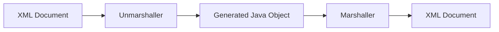

Contoh unmarshal dengan schema:

```java
import jakarta.xml.bind.JAXBContext;
import jakarta.xml.bind.Unmarshaller;
import javax.xml.validation.Schema;
import java.io.InputStream;

public final class XmlBinder<T> {

    private final JAXBContext context;
    private final Schema schema;
    private final Class<T> rootType;

    public XmlBinder(Class<T> rootType, Schema schema) {
        this.rootType = rootType;
        this.schema = schema;
        try {
            this.context = JAXBContext.newInstance(rootType);
        } catch (Exception e) {
            throw new IllegalStateException("Failed to create JAXBContext", e);
        }
    }

    public T unmarshal(InputStream xml) {
        try {
            Unmarshaller unmarshaller = context.createUnmarshaller();
            unmarshaller.setSchema(schema);
            return rootType.cast(unmarshaller.unmarshal(xml));
        } catch (Exception e) {
            throw new XmlBindingException("Failed to unmarshal XML", e);
        }
    }
}
```

Production note:

- `JAXBContext` mahal dibuat; cache per package/root model.
- `Marshaller` dan `Unmarshaller` dibuat per operation atau dipool dengan hati-hati.
- Jangan mutate global binding configuration saat request berjalan.
- Jangan expose generated JAXB class ke core domain.
- Mapping dari generated DTO ke domain command harus eksplisit.

Boundary sehat:

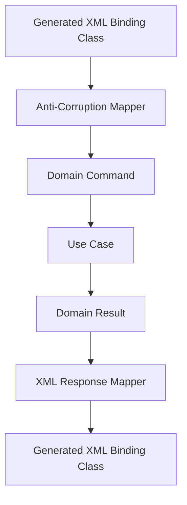

Generated class adalah transport artifact, bukan domain model.

---

## 9. Code Generation Boundary

XSD-to-Java generation sering terlihat memudahkan di awal, lalu menyulitkan saat domain berkembang.

Generated class biasanya memiliki karakteristik:

- struktur mengikuti XML, bukan business aggregate;
- naming dipengaruhi namespace dan schema style;
- `List` live object pattern;
- `XMLGregorianCalendar` muncul di domain jika tidak diisolasi;
- `JAXBElement<T>` muncul untuk optional/nillable/choice;
- package dipengaruhi binding file;
- backward incompatible Java code bisa muncul dari perubahan XSD kecil.

Prinsip:

> Generated XML classes boleh masuk adapter layer. Jangan biarkan masuk domain service, persistence model, atau public internal API.

Struktur package:

```text
com.acme.caseintake
  adapter.xml.generated.v1
  adapter.xml.generated.v2
  adapter.xml.mapper
  application
  domain
```

Mapper contoh:

```java
public final class CaseIntakeXmlMapper {

    public CaseIntakeCommand toCommand(CaseIntakeRequestXml xml) {
        return new CaseIntakeCommand(
            new CaseNumber(xml.getCaseNumber()),
            toInstant(xml.getReceivedAt()),
            xml.getSubject().stream()
                .map(this::toPartyRef)
                .toList()
        );
    }

    private Instant toInstant(XMLGregorianCalendar value) {
        return value.toGregorianCalendar().toInstant();
    }
}
```

Mapping eksplisit terlihat verbose. Tetapi verbosity ini membeli:

- domain isolation;
- migration safety;
- testability;
- auditability;
- generated-code churn containment.

---

## 10. Binding Customization

XSD design yang benar kadang tetap menghasilkan Java code yang kurang ideal.

Binding customization bisa membantu:

- package name;
- class name;
- enum name;
- date/time mapping;
- adapter;
- collection type;
- generate episode files;
- external binding files.

Contoh binding file konseptual:

```xml
<jaxb:bindings
    xmlns:jaxb="https://jakarta.ee/xml/ns/jaxb"
    xmlns:xs="http://www.w3.org/2001/XMLSchema"
    version="3.0">

    <jaxb:bindings schemaLocation="case-intake-v1.xsd">
        <jaxb:schemaBindings>
            <jaxb:package name="com.acme.caseintake.adapter.xml.generated.v1"/>
        </jaxb:schemaBindings>
    </jaxb:bindings>
</jaxb:bindings>
```

Jangan gunakan binding customization untuk menyembunyikan schema design yang buruk.

Jika schema menghasilkan Java model yang kacau, evaluasi dulu:

- apakah XSD terlalu nested;
- apakah `choice` dipakai berlebihan;
- apakah anonymous type membuat reuse buruk;
- apakah namespace governance tidak jelas;
- apakah XML mencoba menjadi domain model terlalu literal.

---

## 11. Validation Before or During Unmarshal?

Ada dua pola umum:

### Pattern A — Validate Then Unmarshal

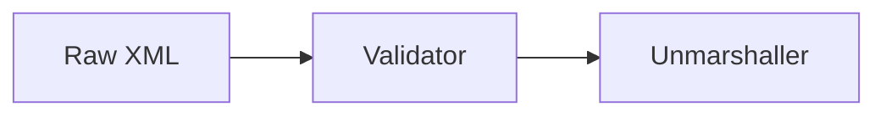

Kelebihan:

- error taxonomy lebih jelas;
- reject payload sebelum binding;
- bisa menyimpan raw invalid payload;
- validator bisa dipakai juga untuk non-JAXB consumers.

Kekurangan:

- payload bisa dibaca dua kali;
- butuh buffering atau repeatable stream;
- overhead lebih tinggi.

### Pattern B — Unmarshal with Schema

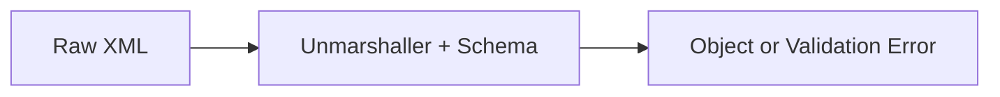

Kelebihan:

- lebih ringkas;
- satu pipeline;
- cocok untuk service kecil.

Kekurangan:

- error mapping sering lebih sulit;
- parser security tetap harus benar;
- binding dan validation failure bercampur;
- raw payload bisa hilang jika tidak ditangani.

Production recommendation:

| Context | Pattern |
|---|---|
| External partner API | Validate then unmarshal. |
| Regulator submission | Validate egress separately. |
| Internal trusted batch | Unmarshal with schema bisa cukup. |
| High-risk XML from public internet | Secure parser + validate first. |
| Streaming large document | SAX/StAX validation pipeline. |

---

## 12. Handling Large XML Documents

DOM buruk untuk dokumen besar karena memuat seluruh tree ke memory.

Untuk XML besar:

- gunakan SAX/StAX;
- validasi streaming;
- proses record per record;
- jangan convert seluruh document ke string;
- batasi payload size;
- batasi nesting depth jika memungkinkan;
- simpan raw payload di object storage jika perlu audit.

Model batch besar:

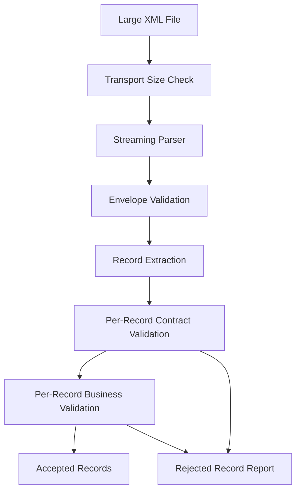

Untuk regulator filing, sering lebih berguna menolak record tertentu dan menghasilkan rejection report daripada membatalkan seluruh file. Tetapi itu tergantung aturan bisnis.

Kontrak harus eksplisit:

- apakah satu invalid record membatalkan file;
- apakah partial acceptance diizinkan;
- apakah error report punya schema sendiri;
- apakah record sequence harus dipertahankan;
- apakah checksum/file control total harus cocok.

---

## 13. Runtime Enforcement Patterns

### 13.1 Ingress Validation

Validasi saat payload masuk.

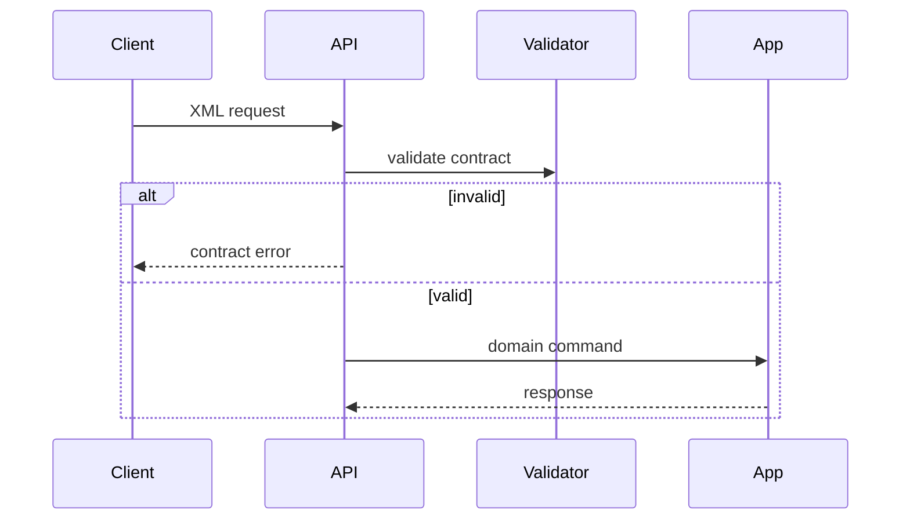

Cocok untuk:

- public API;
- partner gateway;
- file upload;
- queue consumer dari trust boundary berbeda.

### 13.2 Egress Validation

Validasi sebelum mengirim payload keluar.

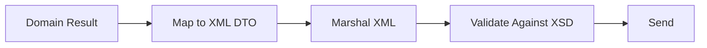

Ini penting untuk:

- regulator submission;
- partner integration;
- message publication;
- audit document generation.

Jika output invalid, itu bug internal. Jangan kirim.

### 13.3 Shadow Validation

Untuk migration:

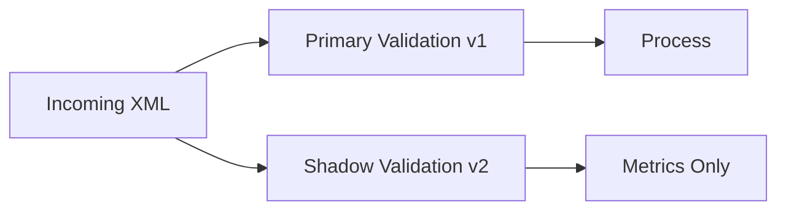

Shadow validation membantu mengukur readiness sebelum memaksa v2.

### 13.4 Quarantine

Invalid payload dari source penting jangan langsung dibuang.

Simpan:

- raw payload;
- source identity;
- received timestamp;
- contract name/version expected;
- validation errors;
- parser security errors;
- correlation ID;
- checksum;
- retention policy.

Quarantine bukan tempat sampah. Quarantine adalah workflow operasional.

---

## 14. Observability for XML Contract Enforcement

Minimal metrics:

| Metric | Meaning |
|---|---|
| `xml_contract_validation_total` | Jumlah validation attempt. |
| `xml_contract_validation_failed_total` | Jumlah validation gagal. |
| `xml_contract_validation_duration_ms` | Latency validation. |
| `xml_contract_security_violation_total` | DTD/entity/external access attempt. |
| `xml_contract_unknown_namespace_total` | Namespace tidak dikenal. |
| `xml_contract_binding_failed_total` | XML valid tetapi binding gagal. |
| `xml_contract_version_usage_total` | Versi schema yang masih dipakai. |

Log event contoh:

```json
{
  "event": "xml_contract_validation_failed",
  "contract": "case-intake",
  "expectedVersion": "1.3.0",
  "sourceSystem": "partner-alpha",
  "correlationId": "c-20260703-000091",
  "errorCount": 3,
  "firstErrorCode": "XML_REQUIRED_ELEMENT_MISSING",
  "payloadSha256": "...",
  "action": "QUARANTINED"
}
```

Jangan log full XML payload jika mengandung PII. Gunakan payload hash + secure storage pointer.

---

## 15. Testing Strategy

Test XML contract enforcement minimal punya lapisan berikut:

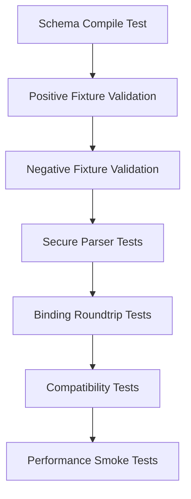

### 15.1 Schema Compile Test

Semua schema harus bisa di-compile saat build.

```java
@Test
void allSchemasShouldCompile() {
    Schema schema = schemaLoader.loadSchema(List.of(
        "schemas/common/identity-types.xsd",
        "schemas/case/case-intake-v1.xsd"
    ));

    assertNotNull(schema);
}
```

### 15.2 Positive Fixture

```text
fixtures/
  case-intake/v1/valid/minimal.xml
  case-intake/v1/valid/full.xml
  case-intake/v1/valid/extension.xml
```

### 15.3 Negative Fixture

```text
fixtures/
  case-intake/v1/invalid/missing-required-party.xml
  case-intake/v1/invalid/invalid-case-number-pattern.xml
  case-intake/v1/invalid/unknown-namespace.xml
  case-intake/v1/invalid/invalid-code-list.xml
```

### 15.4 Security Fixture

```text
fixtures/security/xxe-file-read.xml
fixtures/security/billion-laughs.xml
fixtures/security/external-dtd.xml
fixtures/security/deeply-nested.xml
```

### 15.5 Roundtrip Test

Roundtrip test berguna, tetapi jangan jadikan satu-satunya test.

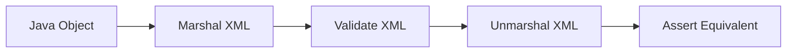

Roundtrip bisa memberi false confidence karena object yang dibuat test mungkin tidak merepresentasikan payload partner yang messy.

---

## 16. Performance Engineering

XML validation bisa mahal.

Faktor biaya:

- ukuran dokumen;
- kompleksitas schema;
- jumlah import/include;
- identity constraint;
- wildcard/lax validation;
- parser mode;
- allocation generated object;
- marshalling/unmarshalling;
- error collection;
- schema compilation.

Rule praktis:

| Object | Cache? | Thread-safe Sharing? |
|---|---:|---:|
| `Schema` | Ya | Umumnya aman untuk reuse. |
| `JAXBContext` | Ya | Reuse. |
| `Validator` | Tidak | Buat per operation. |
| `Marshaller` | Tidak | Buat per operation atau pool hati-hati. |
| `Unmarshaller` | Tidak | Buat per operation atau pool hati-hati. |
| `DocumentBuilder` | Tidak | Buat per operation. |
| `SAXParser` | Tidak | Buat per operation/pool hati-hati. |

Jangan compile schema per request.

Anti-pattern:

```java
public void handle(InputStream xml) {
    SchemaFactory factory = SchemaFactory.newInstance(XMLConstants.W3C_XML_SCHEMA_NS_URI);
    Schema schema = factory.newSchema(new File("case-intake.xsd")); // expensive per request
    Validator validator = schema.newValidator();
    validator.validate(new StreamSource(xml));
}
```

Better:

```java
public final class CaseIntakeHandler {
    private final Schema schema;

    public CaseIntakeHandler(Schema schema) {
        this.schema = schema;
    }

    public void handle(InputStream xml) throws Exception {
        Validator validator = schema.newValidator();
        validator.validate(new StreamSource(xml));
    }
}
```

Benchmark dengan data nyata. XML kecil 5 KB dan regulator XML 200 MB adalah problem yang berbeda.

---

## 17. Namespace Bugs

Banyak bug XML bukan bug field. Itu bug namespace.

Contoh XML terlihat benar:

```xml
<CaseIntakeRequest>
  <caseNumber>CASE-001</caseNumber>
</CaseIntakeRequest>
```

Tapi schema mengharapkan namespace:

```xml
<CaseIntakeRequest xmlns="https://contracts.acme.example/case/intake/1">
  <caseNumber>CASE-001</caseNumber>
</CaseIntakeRequest>
```

Tanpa namespace awareness, parser bisa memberi hasil menipu.

Rule:

- `setNamespaceAware(true)` untuk parser yang dipakai validation/binding.
- Test fixture harus menyertakan namespace produksi.
- Jangan membuat contoh XML tanpa namespace untuk schema yang namespace-qualified.
- Jangan mengandalkan prefix; prefix bisa berubah. Namespace URI yang penting.

Prefix ini equivalent:

```xml
<ci:CaseIntakeRequest xmlns:ci="https://contracts.acme.example/case/intake/1"/>
```

```xml
<x:CaseIntakeRequest xmlns:x="https://contracts.acme.example/case/intake/1"/>
```

Aplikasi yang bergantung pada string prefix rapuh.

---

## 18. Nillable, Empty, Missing

XML punya tiga state yang sering dicampur:

### Missing

```xml
<person>
</person>
```

Element tidak ada.

### Empty

```xml
<person>
  <middleName></middleName>
</person>
```

Element ada, value empty string.

### Nil

```xml
<person xmlns:xsi="http://www.w3.org/2001/XMLSchema-instance">
  <middleName xsi:nil="true"/>
</person>
```

Element ada, secara eksplisit nil.

Di Java, ketiganya bisa runtuh menjadi `null` jika mapping tidak hati-hati.

Contract policy harus eksplisit:

| State | Makna Business | Diperbolehkan? |
|---|---|---:|
| Missing | Not supplied | Ya untuk optional input. |
| Empty | Supplied but blank | Biasanya tidak untuk identifier. |
| Nil | Explicitly no value | Hanya jika semantik jelas. |

Jangan memakai `nillable="true"` sebagai default design. Pakai jika benar-benar butuh membedakan explicit null dari absent.

---

## 19. XML Date, Time, Money, and Decimal Mapping

XSD punya tipe seperti:

- `xs:date`;
- `xs:dateTime`;
- `xs:decimal`;
- `xs:integer`;
- `xs:duration`.

Java mapping default sering menghasilkan:

- `XMLGregorianCalendar`;
- `BigInteger`;
- `BigDecimal`.

Domain Java modern biasanya ingin:

- `Instant` untuk timestamp absolut;
- `LocalDate` untuk tanggal kalender;
- `OffsetDateTime` untuk timestamp dengan offset;
- `BigDecimal` untuk uang/decimal;
- value object untuk money.

Jangan ubah semua ke `String` hanya karena binding sulit.

Mapper harus menjaga invariant:

```java
public record Money(BigDecimal amount, Currency currency) {
    public Money {
        if (amount.scale() > 2) {
            throw new IllegalArgumentException("Money scale must be <= 2");
        }
        if (currency == null) {
            throw new IllegalArgumentException("Currency is required");
        }
    }
}
```

XSD bisa membatasi fraction digits, tetapi domain tetap harus menjaga rule karena data bisa masuk dari channel lain.

---

## 20. Contract Boundary Example: Case Intake XML

Contoh XSD ringkas:

```xml
<xs:schema
    xmlns:xs="http://www.w3.org/2001/XMLSchema"
    targetNamespace="https://contracts.acme.example/case/intake/1"
    xmlns="https://contracts.acme.example/case/intake/1"
    elementFormDefault="qualified"
    attributeFormDefault="unqualified">

    <xs:element name="CaseIntakeRequest" type="CaseIntakeRequestType"/>

    <xs:complexType name="CaseIntakeRequestType">
        <xs:sequence>
            <xs:element name="caseNumber" type="CaseNumberType"/>
            <xs:element name="receivedAt" type="xs:dateTime"/>
            <xs:element name="subject" type="SubjectType"/>
            <xs:element name="document" type="DocumentType" minOccurs="0" maxOccurs="unbounded"/>
        </xs:sequence>
        <xs:attribute name="schemaVersion" type="xs:string" use="required" fixed="1.0"/>
    </xs:complexType>

    <xs:simpleType name="CaseNumberType">
        <xs:restriction base="xs:string">
            <xs:pattern value="CASE-[0-9]{8}"/>
        </xs:restriction>
    </xs:simpleType>

    <xs:complexType name="SubjectType">
        <xs:sequence>
            <xs:element name="partyId" type="xs:string"/>
            <xs:element name="role" type="SubjectRoleType"/>
        </xs:sequence>
    </xs:complexType>

    <xs:simpleType name="SubjectRoleType">
        <xs:restriction base="xs:string">
            <xs:enumeration value="COMPLAINANT"/>
            <xs:enumeration value="RESPONDENT"/>
            <xs:enumeration value="WITNESS"/>
        </xs:restriction>
    </xs:simpleType>

    <xs:complexType name="DocumentType">
        <xs:sequence>
            <xs:element name="documentId" type="xs:string"/>
            <xs:element name="documentType" type="xs:string"/>
        </xs:sequence>
    </xs:complexType>
</xs:schema>
```

Runtime pipeline:

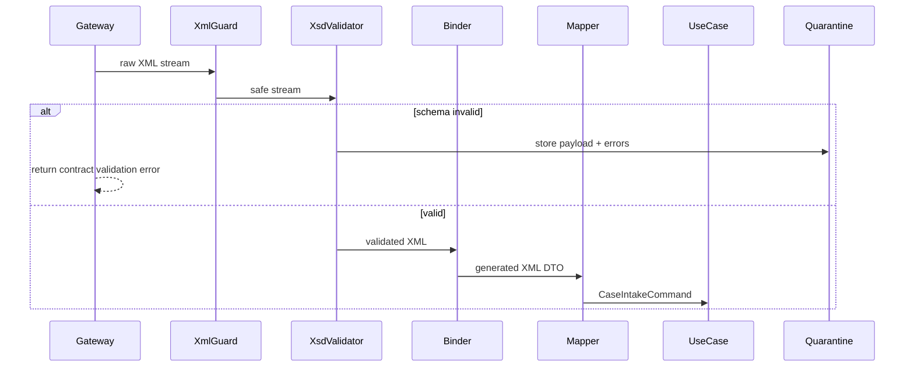

---

## 21. Common Anti-Patterns

### Anti-Pattern 1 — JAXB Class as Domain Model

Gejala:

- domain service menerima generated class;
- persistence menyimpan generated object;
- business rule membaca `JAXBElement`;
- test domain butuh XML namespace.

Dampak:

- domain coupling ke transport;
- migration sulit;
- schema change merusak business code.

### Anti-Pattern 2 — Validation Only in Controller

Gejala:

- REST endpoint validasi XML;
- batch job tidak;
- queue consumer tidak;
- scheduled replay tidak.

Dampak:

- contract enforcement tidak konsisten.

Solusi: central boundary validator.

### Anti-Pattern 3 — Remote Schema Loading

Gejala:

- schemaLocation menunjuk URL eksternal;
- runtime container melakukan HTTP fetch saat validation;
- deployment gagal jika internet tidak tersedia.

Dampak:

- supply chain risk;
- latency tidak stabil;
- outage eksternal mematikan service.

Solusi: packaged schema catalog.

### Anti-Pattern 4 — `String` Everywhere

Gejala:

- date sebagai string;
- money sebagai string;
- enum sebagai string;
- validation pindah ke regex ad-hoc.

Dampak:

- schema tidak punya kekuatan;
- error terlambat;
- domain invariant bocor.

### Anti-Pattern 5 — No Invalid Payload Retention

Gejala:

- invalid payload hanya menghasilkan log;
- log terpotong;
- PII disensor tanpa pointer;
- incident tidak bisa replay.

Solusi: quarantine dengan retention policy dan access control.

---

## 22. Production Readiness Checklist

Gunakan checklist ini sebelum XML contract boundary dianggap siap produksi.

### Schema and Build

- [ ] Semua XSD compile di CI.
- [ ] `xs:include` dan `xs:import` deterministic.
- [ ] Schema tidak mengambil dependency dari internet saat runtime.
- [ ] Generated Java code reproducible.
- [ ] Generated source tidak dimodifikasi manual.
- [ ] Binding customization versioned.

### Runtime Security

- [ ] DTD disabled untuk untrusted XML.
- [ ] External entity disabled.
- [ ] External DTD/schema access disabled.
- [ ] Payload size limit ada sebelum parsing.
- [ ] Secure processing enabled.
- [ ] XXE fixture diuji.
- [ ] Billion laughs/entity expansion fixture diuji.

### Validation

- [ ] Ingress validation jelas.
- [ ] Egress validation untuk outbound regulated/partner payload.
- [ ] Error taxonomy stabil.
- [ ] Invalid payload handling jelas: reject, quarantine, DLQ, atau partial accept.
- [ ] Multiple active versions didukung jika dibutuhkan.
- [ ] Unknown namespace behavior jelas.

### Binding

- [ ] `JAXBContext` di-cache.
- [ ] `Marshaller`/`Unmarshaller` tidak dishare unsafe.
- [ ] Generated class tidak masuk domain model.
- [ ] Mapper eksplisit tersedia.
- [ ] Date/time/decimal mapping diuji.
- [ ] `nillable`, missing, empty behavior diuji.

### Observability

- [ ] Validation success/failure metrics ada.
- [ ] Contract version usage metrics ada.
- [ ] Security violation metrics ada.
- [ ] Payload hash/correlation ID dicatat.
- [ ] PII tidak bocor di log.
- [ ] Dashboard punya breakdown by source system.

### Operations

- [ ] Quarantine/replay workflow ada.
- [ ] Owner contract jelas.
- [ ] Runbook validation incident tersedia.
- [ ] Backward compatibility test tersedia.
- [ ] Schema migration path terdokumentasi.

---

## 23. Mini Project: XML Contract Boundary Module

Buat module Maven:

```text
case-intake-xml-contract/
  pom.xml
  src/main/resources/schemas/
    common/
    case-intake-v1.xsd
  src/main/resources/bindings/
    case-intake-v1-bindings.xjb
  src/main/java/com/acme/caseintake/xml/
    XmlSchemaRegistry.java
    XmlContractValidator.java
    SecureXmlFactories.java
    CaseIntakeXmlMapper.java
  src/test/resources/fixtures/
    valid/
    invalid/
    security/
```

Target capability:

1. Compile XSD saat build.
2. Generate Jakarta XML Binding classes.
3. Validate valid fixture.
4. Reject invalid fixture.
5. Reject XXE fixture.
6. Unmarshal valid XML ke generated object.
7. Map generated object ke domain command.
8. Marshal response XML.
9. Validate outbound XML.
10. Emit validation metrics.

Acceptance criteria:

- invalid XML tidak mencapai use case;
- XML dengan external entity selalu ditolak;
- schema missing membuat service fail fast saat startup;
- generated class tidak dipakai di package `domain`;
- error response tidak membocorkan raw XML;
- validator bisa menjalankan dua versi schema aktif.

---

## 24. Mental Compression

Ingat model ini:

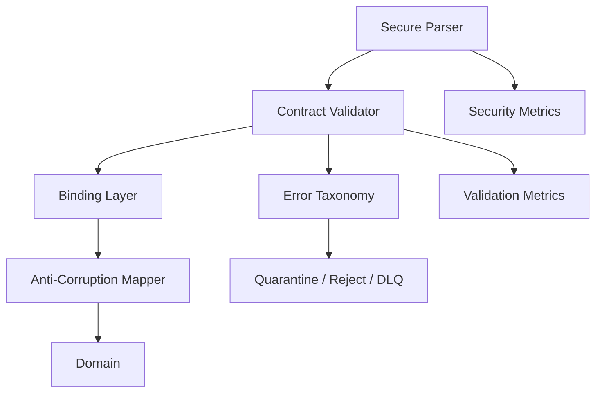

Aturan sederhananya:

1. **Parser security dulu.** Jangan validasi XML yang parser-nya masih bisa membuka file atau network.
2. **Schema validation bukan binding.** Binding hanya mapping.
3. **Generated class bukan domain.** Ia adalah adapter artifact.
4. **Cache expensive objects.** Jangan compile schema dan JAXB context per request.
5. **Treat invalid payload as operational data.** Simpan evidence dengan aman.
6. **Validate egress untuk payload penting.** Jangan kirim XML invalid ke regulator/partner.
7. **Test serangan, bukan hanya happy path.** XXE fixture wajib.

---

## 25. Rujukan Resmi dan Teknis

- Jakarta XML Binding 4.0 Specification — https://jakarta.ee/specifications/xml-binding/4.0/
- Java API for XML Processing Security Guide — https://docs.oracle.com/javase/8/docs/technotes/guides/security/jaxp/jaxp.html
- OWASP XML External Entity Prevention Cheat Sheet — https://cheatsheetseries.owasp.org/cheatsheets/XML_External_Entity_Prevention_Cheat_Sheet.html
- W3C XML Schema 1.1 Part 1: Structures — https://www.w3.org/TR/xmlschema11-1/
- W3C XML Schema 1.1 Part 2: Datatypes — https://www.w3.org/TR/xmlschema11-2/

---

## 26. Closing

Part ini menutup XSD dari sisi Java runtime enforcement.

Sampai titik ini, kita sudah punya:

- cara mendesain XSD;
- cara memversioning XSD;
- cara menjalankan XSD secara aman di Java;
- cara menghindari coupling generated code ke domain;
- cara membuat validation menjadi operational control.

Berikutnya kita masuk ke JSON Schema 2020-12.

Perubahan mental model penting:

- XSD adalah grammar-like schema untuk XML tree.
- JSON Schema adalah evaluation language untuk JSON instance.
- JSON Schema bukan hanya tipe object dan required field.
- JSON Schema punya vocabulary, dialect, applicator, annotation, assertion, reference, dan unevaluated semantics.

Itu yang akan kita bongkar di Part 010.
