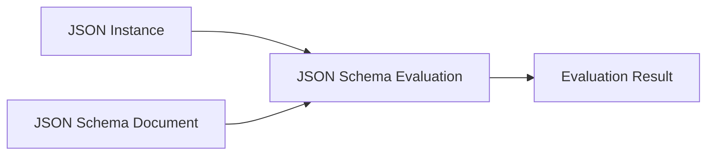
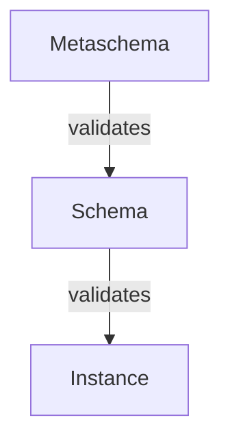
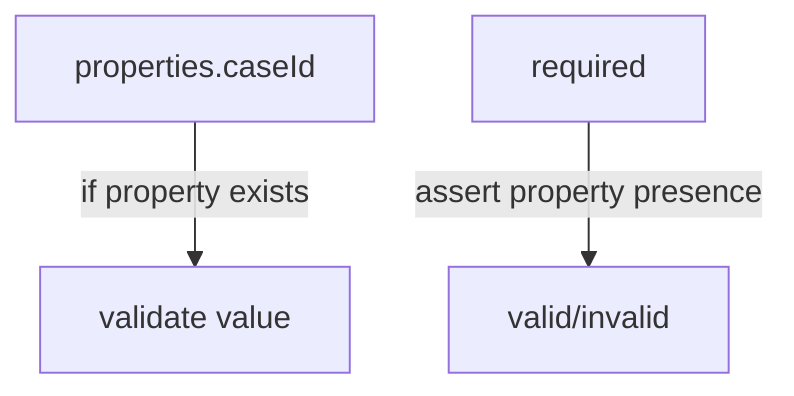
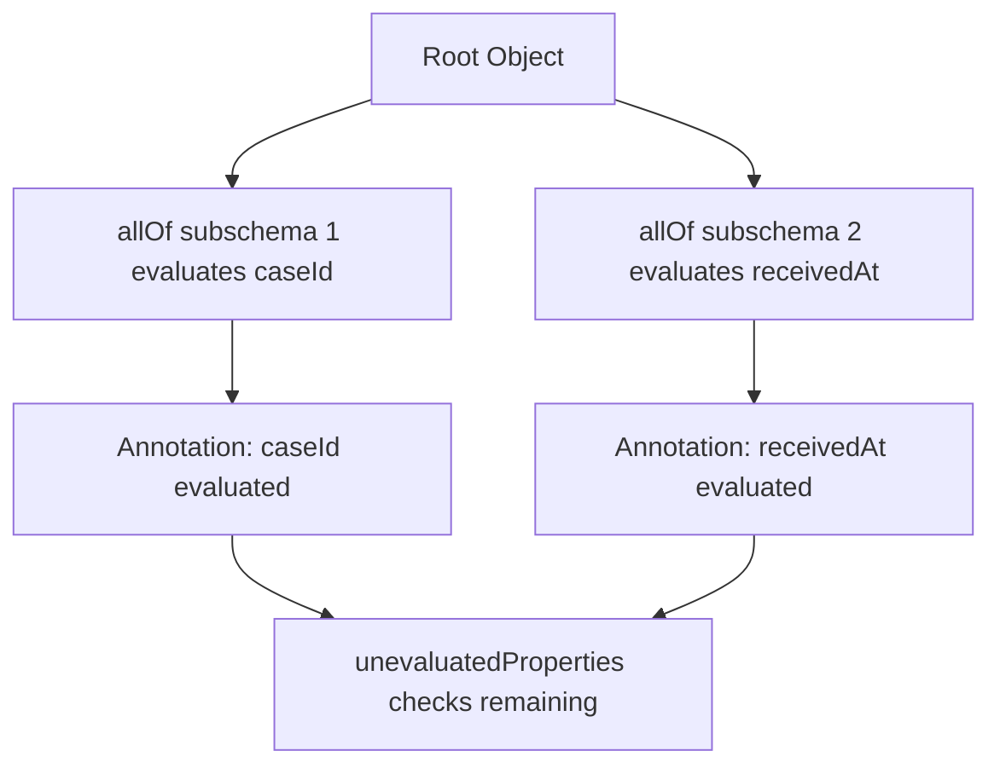
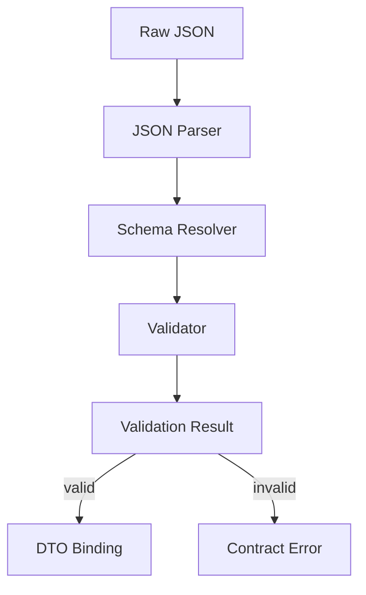
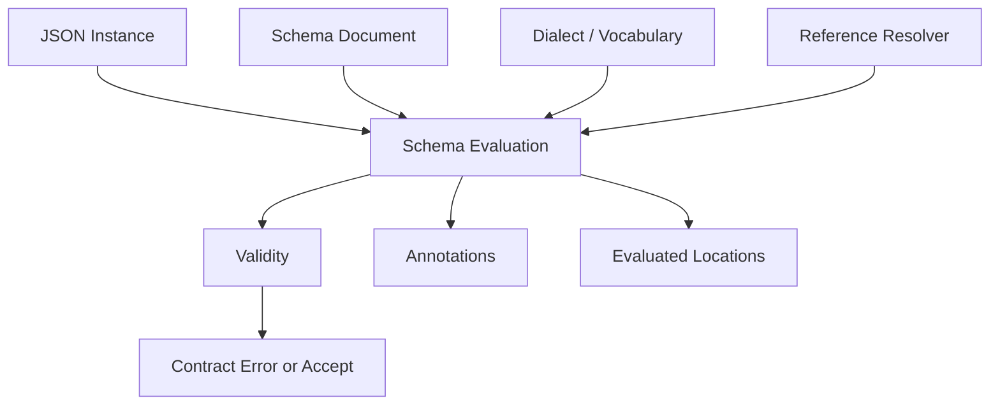

# Part 010 — JSON Schema 2020-12 Core Mental Model

Banyak engineer memakai JSON Schema seperti ini:

```json
{
  "type": "object",
  "properties": {
    "caseId": { "type": "string" }
  },
  "required": ["caseId"]
}
```

Itu valid sebagai awal.

Tapi untuk production-grade contract engineering, itu belum cukup.

JSON Schema bukan hanya daftar field. JSON Schema adalah language untuk mengevaluasi JSON instance melalui keyword, vocabulary, dialect, reference, assertion, annotation, dan applicator.

Kalau mental model-nya salah, hasilnya biasanya:

- schema tampak benar tetapi validator berbeda memberi hasil berbeda;
- `$ref` rusak saat schema dipindahkan ke package lain;
- `oneOf` dipakai untuk polymorphism tetapi error message tidak bisa dipahami;
- `additionalProperties: false` dipakai terlalu agresif lalu merusak evolusi;
- `format` dianggap selalu assertion padahal perilakunya bergantung vocabulary/implementation;
- `unevaluatedProperties` dipakai tanpa memahami annotation result;
- schema modular tidak bisa dibundle;
- OpenAPI schema disamakan 100% dengan JSON Schema padahal tooling bisa berbeda;
- Java validator gagal resolve remote reference saat production.

Part ini membangun mental model JSON Schema Draft 2020-12 dari dasar sampai cukup kuat untuk desain kontrak enterprise.

---

## 1. What JSON Schema Is

JSON Schema mendeskripsikan dan mengevaluasi JSON value.

JSON value bisa berupa:

- object;
- array;
- string;
- number;
- integer;
- boolean;
- null.

Schema juga JSON.

Contoh:

```json
{
  "$schema": "https://json-schema.org/draft/2020-12/schema",
  "$id": "https://contracts.acme.example/case-intake.schema.json",
  "type": "object",
  "required": ["caseId", "receivedAt"],
  "properties": {
    "caseId": {
      "type": "string",
      "pattern": "^CASE-[0-9]{8}$"
    },
    "receivedAt": {
      "type": "string",
      "format": "date-time"
    }
  },
  "additionalProperties": false
}
```

Ada tiga objek konseptual:



Evaluation result bukan hanya true/false. Untuk Draft 2020-12, evaluation bisa menghasilkan:

- validity;
- annotations;
- evaluated locations;
- error tree;
- reference resolution effects.

Ini penting untuk keyword seperti `unevaluatedProperties` dan `unevaluatedItems`.

---

## 2. Instance, Schema, and Metaschema

### Instance

Instance adalah JSON yang diuji.

```json
{
  "caseId": "CASE-20260703",
  "receivedAt": "2026-07-03T10:15:30Z"
}
```

### Schema

Schema adalah JSON document yang mengevaluasi instance.

```json
{
  "type": "object",
  "required": ["caseId"],
  "properties": {
    "caseId": { "type": "string" }
  }
}
```

### Metaschema

Metaschema adalah schema untuk schema.

`$schema` menunjuk dialect/metaschema yang digunakan:

```json
{
  "$schema": "https://json-schema.org/draft/2020-12/schema"
}
```

Mental model:



Dalam CI, Anda sebaiknya melakukan dua validasi:

1. schema valid terhadap metaschema;
2. instance fixtures valid/invalid terhadap schema.

Banyak tim hanya melakukan nomor 2.

---

## 3. Dialect and Vocabulary

Draft 2020-12 memperjelas bahwa JSON Schema bisa terdiri dari vocabulary.

Vocabulary adalah kumpulan keyword dengan makna tertentu.

Contoh keluarga keyword:

| Vocabulary Area | Contoh Keyword | Fungsi |
|---|---|---|
| Core | `$schema`, `$id`, `$ref`, `$defs`, `$anchor` | Identitas, reference, struktur schema. |
| Applicator | `allOf`, `anyOf`, `oneOf`, `not`, `if`, `then`, `else`, `properties`, `items` | Menerapkan subschema ke bagian instance. |
| Validation | `type`, `enum`, `const`, `minimum`, `maxLength`, `required` | Assertion validation. |
| Unevaluated | `unevaluatedProperties`, `unevaluatedItems` | Membatasi bagian yang belum dievaluasi. |
| Format Annotation | `format` | Memberi annotation format. |
| Format Assertion | `format` | Menjadikan format sebagai assertion jika vocabulary aktif. |
| Content | `contentEncoding`, `contentMediaType`, `contentSchema` | Metadata konten string. |
| Metadata | `title`, `description`, `default`, `examples`, `deprecated` | Dokumentasi/annotation. |

Kenapa ini penting?

Karena dua validator bisa berbeda perilaku jika mereka tidak mengaktifkan vocabulary yang sama, terutama pada `format`.

Contoh:

```json
{
  "type": "string",
  "format": "email"
}
```

Di beberapa validator, `format: email` bisa hanya annotation. Di validator lain atau configuration tertentu, ia bisa menjadi assertion.

Production rule:

> Jangan mengandalkan `format` untuk hard validation kecuali library dan configuration-nya dikunci dan diuji.

Jika email harus divalidasi ketat, tambahkan policy validator atau business validation eksplisit.

---

## 4. Keyword Categories: Assertion, Annotation, Applicator

Ini inti JSON Schema modern.

### Assertion Keyword

Assertion keyword menentukan valid/invalid.

Contoh:

```json
{
  "type": "string",
  "minLength": 1,
  "pattern": "^[A-Z0-9-]+$"
}
```

Jika instance melanggar, evaluation invalid.

### Annotation Keyword

Annotation keyword memberi metadata.

```json
{
  "title": "Case Identifier",
  "description": "Stable case identifier assigned by the case management platform.",
  "examples": ["CASE-20260703"]
}
```

Annotation tidak membuat instance valid/invalid.

### Applicator Keyword

Applicator keyword menerapkan subschema.

```json
{
  "type": "object",
  "properties": {
    "caseId": { "type": "string" }
  }
}
```

`properties` tidak secara langsung berkata object valid/invalid karena ada property tertentu. Ia menerapkan subschema ke property jika property itu ada.

Ini jebakan besar.

Schema berikut tidak mewajibkan `caseId`:

```json
{
  "type": "object",
  "properties": {
    "caseId": { "type": "string" }
  }
}
```

Instance ini valid:

```json
{}
```

Agar wajib:

```json
{
  "type": "object",
  "required": ["caseId"],
  "properties": {
    "caseId": { "type": "string" }
  }
}
```

Mental model:



`properties` mendeskripsikan shape. `required` mendeskripsikan presence.

---

## 5. Evaluation Model

JSON Schema evaluation adalah recursive.

Schema:

```json
{
  "type": "object",
  "required": ["caseId"],
  "properties": {
    "caseId": {
      "type": "string",
      "pattern": "^CASE-[0-9]{8}$"
    },
    "documents": {
      "type": "array",
      "items": {
        "type": "object",
        "required": ["documentId"],
        "properties": {
          "documentId": { "type": "string" }
        }
      }
    }
  }
}
```

Instance:

```json
{
  "caseId": "CASE-20260703",
  "documents": [
    { "documentId": "DOC-1" },
    { "documentId": 42 }
  ]
}
```

Evaluation path:

```mermaid
flowchart TD
    A[/ root object /] --> B[type object]
    A --> C[required caseId]
    A --> D[properties.caseId]
    D --> E[type string]
    D --> F[pattern]
    A --> G[properties.documents]
    G --> H[type array]
    G --> I[items]
    I --> J[/documents/0]
    I --> K[/documents/1]
    K --> L[documentId type string fails]
```

Error yang baik harus menyimpan:

- instance location: `/documents/1/documentId`;
- schema location: `/properties/documents/items/properties/documentId/type`;
- keyword: `type`;
- expected: `string`;
- actual: `integer` or `number` depending implementation;
- contract name/version.

Jangan hanya menyimpan message string.

---

## 6. `$id`: Schema Identity

`$id` memberikan base URI untuk schema resource.

```json
{
  "$id": "https://contracts.acme.example/common/money.schema.json"
}
```

`$id` bukan sekadar documentation. Ia mempengaruhi reference resolution.

Contoh:

```json
{
  "$id": "https://contracts.acme.example/case/case-intake.schema.json",
  "$defs": {
    "caseId": {
      "$id": "types/case-id.schema.json",
      "type": "string",
      "pattern": "^CASE-[0-9]{8}$"
    }
  }
}
```

Subschema dengan `$id` bisa menjadi resource baru dengan URI sendiri relatif terhadap base.

Production recommendation:

- gunakan absolute URI untuk root schema `$id`;
- jangan gunakan filesystem path sebagai identitas kontrak;
- buat URI stabil meskipun schema disimpan di Git/Maven/artifact repository;
- jangan mengganti `$id` tanpa memahami impact ke `$ref`;
- treat `$id` sebagai API identity.

Bad:

```json
{
  "$id": "../schemas/case-intake.json"
}
```

Better:

```json
{
  "$id": "https://contracts.acme.example/case/case-intake/1.0/schema"
}
```

URI tidak harus bisa di-fetch dari internet saat runtime. Tetapi URI harus stabil sebagai identifier.

---

## 7. `$defs` and Reuse

`$defs` menyimpan reusable subschema lokal.

```json
{
  "$defs": {
    "caseId": {
      "type": "string",
      "pattern": "^CASE-[0-9]{8}$"
    },
    "partyId": {
      "type": "string",
      "pattern": "^PTY-[0-9]{8}$"
    }
  },
  "type": "object",
  "required": ["caseId", "partyId"],
  "properties": {
    "caseId": { "$ref": "#/$defs/caseId" },
    "partyId": { "$ref": "#/$defs/partyId" }
  }
}
```

Gunakan `$defs` untuk:

- common identifier pattern;
- reusable value object;
- nested contract fragments;
- polymorphic variants;
- local composition.

Jangan masukkan seluruh enterprise type library ke satu schema besar hanya karena bisa.

Schema yang terlalu besar sulit:

- direview;
- dibundle;
- diuji;
- di-version;
- dimiliki owner yang jelas.

---

## 8. `$ref`: Reference Is Replacement-Like, But Not Textual Include

`$ref` menunjuk schema lain.

```json
{
  "$ref": "https://contracts.acme.example/common/party-id.schema.json"
}
```

Atau lokal:

```json
{
  "$ref": "#/$defs/partyId"
}
```

Mental model yang cukup aman:

> `$ref` menyebabkan evaluator mengevaluasi target schema terhadap instance location saat ini.

Bukan copy-paste textual.

Contoh:

```json
{
  "type": "object",
  "properties": {
    "partyId": {
      "$ref": "#/$defs/partyId"
    }
  },
  "$defs": {
    "partyId": {
      "type": "string",
      "pattern": "^PTY-[0-9]{8}$"
    }
  }
}
```

Instance location `/partyId` dievaluasi terhadap schema `#/$defs/partyId`.

Common pitfalls:

- `$ref` broken karena base URI berubah;
- circular reference tanpa depth control;
- remote reference di-fetch saat runtime;
- schema bundler mengubah `$id` secara salah;
- siblings of `$ref` dipahami berbeda pada draft lama vs modern;
- tooling OpenAPI dan JSON Schema berbeda perilaku.

Production rule:

- resolve semua reference di CI;
- bundle schema artifact secara deterministic;
- matikan remote fetch di runtime;
- publish schema package dengan manifest reference.

---

## 9. Anchors

`$anchor` memberi fragment name yang lebih stabil daripada JSON Pointer path.

```json
{
  "$id": "https://contracts.acme.example/common/identity.schema.json",
  "$defs": {
    "caseId": {
      "$anchor": "CaseId",
      "type": "string",
      "pattern": "^CASE-[0-9]{8}$"
    }
  }
}
```

Reference:

```json
{
  "$ref": "https://contracts.acme.example/common/identity.schema.json#CaseId"
}
```

Keuntungan anchor:

- tidak tergantung path internal `#/$defs/...`;
- lebih stabil saat refactor struktur schema;
- lebih readable.

Tetapi anchor tetap harus dikelola seperti public symbol.

Jika schema external digunakan banyak consumer, menghapus anchor adalah breaking change.

---

## 10. Boolean Schemas

JSON Schema bisa berupa boolean.

```json
true
```

Artinya semua instance valid.

```json
false
```

Artinya semua instance invalid.

Ini terlihat aneh, tapi berguna.

Contoh melarang property tertentu:

```json
{
  "type": "object",
  "properties": {
    "legacyField": false
  }
}
```

Jika `legacyField` ada, nilainya divalidasi terhadap `false`, sehingga gagal.

Contoh mengizinkan extension object apa pun:

```json
{
  "type": "object",
  "properties": {
    "extensions": true
  }
}
```

Boolean schema juga sering muncul dalam generated/bundled schema.

---

## 11. Object Shape: `properties`, `required`, `additionalProperties`

Schema object dasar:

```json
{
  "type": "object",
  "required": ["caseId", "receivedAt"],
  "properties": {
    "caseId": { "type": "string" },
    "receivedAt": { "type": "string", "format": "date-time" }
  },
  "additionalProperties": false
}
```

Makna:

- `type: object` memastikan instance object;
- `required` memastikan property ada;
- `properties` mengevaluasi property jika ada;
- `additionalProperties: false` menolak property di luar `properties` dan `patternProperties`.

Trade-off `additionalProperties: false`:

| Benefit | Cost |
|---|---|
| Menangkap typo field | Mengurangi forward compatibility. |
| Payload lebih strict | Producer tidak bisa menambah field tanpa consumer update. |
| Security lebih baik | Extension sulit. |
| Documentation jelas | Evolusi kontrak lebih berat. |

Untuk public API response, strictness bisa bagus.

Untuk event stream dengan banyak consumer, strictness bisa merusak evolusi jika consumer lama menolak field baru.

Alternatif:

```json
{
  "type": "object",
  "required": ["caseId"],
  "properties": {
    "caseId": { "type": "string" },
    "extensions": {
      "type": "object",
      "additionalProperties": true
    }
  },
  "additionalProperties": false
}
```

Artinya root object strict, tetapi extension dikurung di lokasi eksplisit.

---

## 12. `patternProperties`

`patternProperties` menerapkan subschema ke property name yang cocok regex.

Contoh metadata custom:

```json
{
  "type": "object",
  "patternProperties": {
    "^x-[a-z0-9-]+$": {
      "type": ["string", "number", "boolean", "null"]
    }
  },
  "additionalProperties": false
}
```

Payload valid:

```json
{
  "x-source-system": "legacy-case-engine",
  "x-risk-score": 87
}
```

Gunakan untuk:

- controlled extension names;
- vendor extension;
- metadata bags;
- feature flags;
- labels.

Hindari regex terlalu broad:

```json
{
  "patternProperties": {
    ".*": true
  }
}
```

Itu hampir sama dengan membiarkan semua property, tapi lebih membingungkan.

---

## 13. Arrays: `items`, `prefixItems`, `contains`

Draft 2020-12 membedakan tuple-like arrays dan list-like arrays dengan lebih jelas.

### List-like array

```json
{
  "type": "array",
  "items": {
    "type": "string"
  }
}
```

Semua item harus string.

### Tuple-like array

```json
{
  "type": "array",
  "prefixItems": [
    { "type": "string" },
    { "type": "number" }
  ],
  "items": false
}
```

Valid:

```json
["risk-score", 87]
```

Invalid:

```json
["risk-score", 87, "extra"]
```

Untuk enterprise API, tuple array sering tidak ideal karena kurang self-describing. Object biasanya lebih jelas:

```json
{
  "metricName": "risk-score",
  "value": 87
}
```

### `contains`

`contains` memastikan array memiliki minimal satu item yang cocok.

```json
{
  "type": "array",
  "contains": {
    "type": "object",
    "required": ["role"],
    "properties": {
      "role": { "const": "RESPONDENT" }
    }
  },
  "minContains": 1
}
```

Gunakan hati-hati. Error message untuk `contains` bisa sulit dipahami pengguna.

---

## 14. Composition: `allOf`, `anyOf`, `oneOf`, `not`

### `allOf`

Semua subschema harus valid.

```json
{
  "allOf": [
    { "$ref": "#/$defs/baseCase" },
    { "$ref": "#/$defs/regulatoryCase" }
  ]
}
```

`allOf` bukan inheritance. Ia intersection of constraints.

Jebakan:

```json
{
  "allOf": [
    {
      "type": "object",
      "properties": { "a": { "type": "string" } },
      "additionalProperties": false
    },
    {
      "type": "object",
      "properties": { "b": { "type": "string" } },
      "additionalProperties": false
    }
  ]
}
```

Instance `{ "a": "x", "b": "y" }` bisa gagal karena masing-masing subschema melarang property yang tidak dikenalnya.

Gunakan `unevaluatedProperties` atau desain ulang object closure.

### `anyOf`

Minimal satu subschema valid.

```json
{
  "anyOf": [
    { "required": ["email"] },
    { "required": ["phone"] }
  ]
}
```

### `oneOf`

Tepat satu subschema valid.

```json
{
  "oneOf": [
    { "$ref": "#/$defs/personParty" },
    { "$ref": "#/$defs/organizationParty" }
  ]
}
```

`oneOf` sering mahal secara error message dan performance karena validator harus memastikan hanya satu match.

Untuk polymorphism, sering lebih baik memakai discriminator field manual:

```json
{
  "oneOf": [
    {
      "type": "object",
      "required": ["partyType", "firstName", "lastName"],
      "properties": {
        "partyType": { "const": "PERSON" },
        "firstName": { "type": "string" },
        "lastName": { "type": "string" }
      }
    },
    {
      "type": "object",
      "required": ["partyType", "legalName"],
      "properties": {
        "partyType": { "const": "ORGANIZATION" },
        "legalName": { "type": "string" }
      }
    }
  ]
}
```

### `not`

Melarang schema tertentu.

```json
{
  "not": {
    "required": ["deprecatedField"]
  }
}
```

`not` berguna tetapi bisa membuat error sulit dibaca jika berlebihan.

---

## 15. Conditional Schema: `if`, `then`, `else`

Contoh:

```json
{
  "type": "object",
  "required": ["caseType"],
  "properties": {
    "caseType": { "enum": ["CIVIL", "CRIMINAL"] },
    "prosecutorId": { "type": "string" },
    "claimAmount": { "type": "number" }
  },
  "if": {
    "properties": {
      "caseType": { "const": "CRIMINAL" }
    }
  },
  "then": {
    "required": ["prosecutorId"]
  },
  "else": {
    "required": ["claimAmount"]
  }
}
```

Caveat:

`if` schema di atas valid jika `caseType` tidak ada, karena `properties.caseType` hanya berlaku jika property ada. Karena root schema sudah punya `required: ["caseType"]`, aman.

Tanpa root `required`, conditional bisa memberi hasil tak terduga.

Pattern lebih defensif:

```json
{
  "if": {
    "required": ["caseType"],
    "properties": {
      "caseType": { "const": "CRIMINAL" }
    }
  },
  "then": {
    "required": ["prosecutorId"]
  }
}
```

---

## 16. `unevaluatedProperties`

`unevaluatedProperties` adalah fitur modern yang sering disalahpahami.

Ia membatasi property yang belum dievaluasi oleh keyword lain.

Contoh yang lebih baik untuk composition:

```json
{
  "allOf": [
    {
      "type": "object",
      "properties": {
        "caseId": { "type": "string" }
      },
      "required": ["caseId"]
    },
    {
      "type": "object",
      "properties": {
        "receivedAt": { "type": "string", "format": "date-time" }
      },
      "required": ["receivedAt"]
    }
  ],
  "unevaluatedProperties": false
}
```

`caseId` dan `receivedAt` dievaluasi oleh subschema dalam `allOf`, lalu property lain ditolak.

Mental model:



Caveat:

- bergantung pada annotation/evaluation bookkeeping;
- tidak semua validator lama mendukung baik;
- error message bisa kompleks;
- bisa punya cost lebih tinggi.

Gunakan untuk composition yang butuh object closure. Jangan gunakan hanya karena terlihat modern.

---

## 17. `type`: JSON Type Semantics

JSON Schema `type` bisa string atau array.

```json
{ "type": "string" }
```

```json
{ "type": ["string", "null"] }
```

Untuk nullable field:

```json
{
  "type": "object",
  "properties": {
    "middleName": {
      "type": ["string", "null"]
    }
  }
}
```

Tapi optional dan nullable berbeda.

| Instance | Meaning |
|---|---|
| `{}` | Property absent. |
| `{ "middleName": null }` | Property present with null. |
| `{ "middleName": "" }` | Property present with empty string. |

Jika property wajib tetapi boleh null:

```json
{
  "type": "object",
  "required": ["middleName"],
  "properties": {
    "middleName": { "type": ["string", "null"] }
  }
}
```

Jika property optional tetapi jika ada harus string:

```json
{
  "type": "object",
  "properties": {
    "middleName": { "type": "string" }
  }
}
```

Jangan memakai nullable untuk menggantikan optionality.

---

## 18. `integer` and `number`

JSON hanya punya number. JSON Schema membedakan `integer` dan `number` secara semantik.

```json
{ "type": "integer" }
```

Nilai `1` valid. Nilai `1.5` invalid.

Pertanyaan praktis di Java:

- Apakah parser memetakan ke `Integer`, `Long`, `BigInteger`, `BigDecimal`, atau `Double`?
- Apakah angka besar overflow?
- Apakah decimal uang kehilangan presisi?
- Apakah generated model memakai `double` untuk money?

Untuk uang, jangan gunakan floating point.

Schema:

```json
{
  "type": "object",
  "required": ["amount", "currency"],
  "properties": {
    "amount": {
      "type": "string",
      "pattern": "^-?[0-9]+\\.[0-9]{2}$"
    },
    "currency": {
      "type": "string",
      "pattern": "^[A-Z]{3}$"
    }
  }
}
```

Mengapa amount string?

Karena JSON number tidak menyimpan scale secara reliable lintas bahasa/tooling. Untuk contract yang perlu presisi hukum/keuangan, string decimal sering lebih defensible.

Alternatif tetap bisa `number` + `multipleOf`, tetapi lintas parser perlu diuji ketat.

---

## 19. `enum` and `const`

`const`:

```json
{ "const": "PERSON" }
```

`enum`:

```json
{ "enum": ["PERSON", "ORGANIZATION"] }
```

Enum adalah compatibility hotspot.

Menambah enum value sering terlihat aman, tetapi consumer lama bisa gagal jika memakai generated enum strict.

Policy:

- untuk closed regulatory code list, enum strict bisa benar;
- untuk evolving business status, pertimbangkan string + known values annotation;
- sediakan unknown handling di Java;
- pisahkan validation layer dari business acceptance.

Pattern evolving enum:

```json
{
  "type": "string",
  "description": "Known values: OPEN, CLOSED, SUSPENDED. Consumers must tolerate unknown values."
}
```

Pattern strict enum:

```json
{
  "type": "string",
  "enum": ["OPEN", "CLOSED", "SUSPENDED"]
}
```

Tidak ada satu jawaban universal. Pilih berdasarkan ownership dan compatibility requirement.

---

## 20. Format: Annotation or Assertion?

Contoh:

```json
{
  "type": "string",
  "format": "date-time"
}
```

Dalam Draft 2020-12, format dibagi menjadi vocabulary annotation dan assertion. Implementasi bisa memperlakukan format sebagai metadata kecuali assertion diaktifkan.

Production implication:

- Jangan assume `format` selalu divalidasi.
- Test validator configuration.
- Jika `date-time` harus strict, tambahkan domain parser test.
- Jika `email` harus production-grade, gunakan dedicated validation policy.

Contoh Java boundary:

```java
public record ReceivedAt(Instant value) {
    public static ReceivedAt parse(String raw) {
        try {
            return new ReceivedAt(Instant.parse(raw));
        } catch (DateTimeParseException e) {
            throw new ContractSemanticException("receivedAt must be RFC 3339 instant", e);
        }
    }
}
```

Schema menangkap shape. Domain parser menangkap semantic precision.

---

## 21. Metadata Keywords

Metadata keyword membantu dokumentasi dan code generation:

```json
{
  "title": "Case Intake Request",
  "description": "Request submitted by an external intake channel.",
  "default": {},
  "examples": [
    {
      "caseId": "CASE-20260703",
      "receivedAt": "2026-07-03T10:15:30Z"
    }
  ],
  "deprecated": false,
  "readOnly": false,
  "writeOnly": false
}
```

Hati-hati dengan `default`.

Di JSON Schema, `default` adalah annotation. Validator tidak wajib mengisi nilai default ke instance.

Jangan desain kontrak dengan asumsi validator akan mutate payload.

Bad assumption:

```json
{
  "properties": {
    "priority": {
      "type": "string",
      "default": "NORMAL"
    }
  }
}
```

Lalu aplikasi berharap `priority` selalu ada setelah validation.

Better:

- schema mendokumentasikan default;
- mapper/application mengisi default secara eksplisit;
- test memastikan behavior.

---

## 22. Content Keywords

Content keywords mendeskripsikan string yang berisi encoded media.

```json
{
  "type": "string",
  "contentEncoding": "base64",
  "contentMediaType": "application/pdf"
}
```

Untuk payload besar, jangan embed file base64 di JSON kecuali ada alasan kuat.

Lebih baik:

```json
{
  "type": "object",
  "required": ["documentId", "mediaType", "storageRef", "sha256"],
  "properties": {
    "documentId": { "type": "string" },
    "mediaType": { "type": "string" },
    "storageRef": { "type": "string" },
    "sha256": { "type": "string", "pattern": "^[a-f0-9]{64}$" }
  }
}
```

Contract harus mengatur:

- content type;
- size limit;
- hash;
- storage reference;
- retention;
- malware scanning state;
- access policy.

Schema bisa mendeskripsikan metadata, tetapi binary lifecycle butuh platform policy.

---

## 23. Schema Document Organization

Untuk satu service kecil:

```text
schemas/
  case-intake.schema.json
```

Untuk enterprise:

```text
contracts/
  common/
    identity/
      party-id.schema.json
      case-id.schema.json
    money/
      money.schema.json
    time/
      instant.schema.json
  case/
    intake/
      case-intake-request.schema.json
      case-intake-response.schema.json
    lifecycle/
      case-status-changed-event.schema.json
```

Setiap schema root punya:

- `$schema`;
- `$id`;
- `title`;
- `description`;
- stable owner metadata jika platform mendukung;
- examples;
- versioning strategy.

Contoh metadata contract:

```json
{
  "$schema": "https://json-schema.org/draft/2020-12/schema",
  "$id": "https://contracts.acme.example/case/intake/request/1.0/schema",
  "title": "Case Intake Request",
  "description": "External request to open a regulatory case.",
  "x-contract-owner": "case-platform",
  "x-contract-version": "1.0.0",
  "type": "object"
}
```

`x-...` bukan keyword standar JSON Schema. Itu annotation custom. Pastikan tooling Anda tidak menganggapnya assertion.

---

## 24. Contract Example: Case Intake Request

Schema:

```json
{
  "$schema": "https://json-schema.org/draft/2020-12/schema",
  "$id": "https://contracts.acme.example/case/intake/request/1.0/schema",
  "title": "Case Intake Request",
  "type": "object",
  "required": ["caseId", "receivedAt", "source", "subjects"],
  "properties": {
    "caseId": {
      "$ref": "https://contracts.acme.example/common/identity/case-id/1.0/schema"
    },
    "receivedAt": {
      "type": "string",
      "format": "date-time"
    },
    "source": {
      "type": "object",
      "required": ["systemCode", "submissionId"],
      "properties": {
        "systemCode": {
          "type": "string",
          "pattern": "^[A-Z][A-Z0-9_]{2,31}$"
        },
        "submissionId": {
          "type": "string",
          "minLength": 1,
          "maxLength": 128
        }
      },
      "additionalProperties": false
    },
    "subjects": {
      "type": "array",
      "minItems": 1,
      "items": {
        "$ref": "#/$defs/subject"
      }
    },
    "extensions": {
      "type": "object",
      "additionalProperties": true
    }
  },
  "additionalProperties": false,
  "$defs": {
    "subject": {
      "type": "object",
      "required": ["partyId", "role"],
      "properties": {
        "partyId": {
          "type": "string",
          "pattern": "^PTY-[0-9]{8}$"
        },
        "role": {
          "type": "string",
          "enum": ["COMPLAINANT", "RESPONDENT", "WITNESS"]
        }
      },
      "additionalProperties": false
    }
  }
}
```

Valid instance:

```json
{
  "caseId": "CASE-20260703",
  "receivedAt": "2026-07-03T10:15:30Z",
  "source": {
    "systemCode": "PORTAL",
    "submissionId": "SUB-991"
  },
  "subjects": [
    {
      "partyId": "PTY-00000001",
      "role": "COMPLAINANT"
    }
  ]
}
```

Invalid instance:

```json
{
  "caseId": "bad",
  "receivedAt": "not-a-date",
  "source": {
    "systemCode": "portal",
    "submissionId": ""
  },
  "subjects": []
}
```

Expected error classes:

- caseId pattern failure;
- receivedAt format failure if format assertion enabled;
- systemCode pattern failure;
- submissionId minLength failure;
- subjects minItems failure.

---

## 25. Java Runtime Implications

Java JSON Schema validation boundary harus menyelesaikan:



Pertanyaan implementasi:

1. Library apa yang mendukung Draft 2020-12?
2. Apakah `$ref` external bisa di-resolve dari classpath/artifact?
3. Apakah remote fetch dimatikan di runtime?
4. Apakah `format` assertion aktif atau annotation saja?
5. Apakah error output punya instance path dan schema path?
6. Apakah validation result bisa dimapping ke API error model?
7. Apakah schema di-cache?
8. Apakah validator thread-safe?
9. Apakah payload size limit diterapkan sebelum parse?
10. Apakah unknown keyword diperlakukan sebagai annotation atau error?

Boundary interface:

```java
public interface JsonContractValidator {
    JsonValidationResult validate(
        String contractName,
        String contractVersion,
        byte[] payload
    );
}
```

Hasil validasi:

```java
public record JsonValidationIssue(
    String code,
    String instanceLocation,
    String schemaLocation,
    String keyword,
    String message
) {}
```

Jangan mengekspos message mentah library sebagai kontrak public. Message bisa berubah saat upgrade library.

---

## 26. Error Model

Error response production:

```json
{
  "type": "CONTRACT_VALIDATION_FAILED",
  "contract": "case-intake-request",
  "contractVersion": "1.0.0",
  "errors": [
    {
      "code": "JSON_PATTERN_FAILED",
      "instanceLocation": "/caseId",
      "schemaLocation": "/properties/caseId/pattern",
      "keyword": "pattern",
      "message": "caseId must match ^CASE-[0-9]{8}$"
    },
    {
      "code": "JSON_MIN_ITEMS_FAILED",
      "instanceLocation": "/subjects",
      "schemaLocation": "/properties/subjects/minItems",
      "keyword": "minItems",
      "message": "subjects must contain at least 1 item"
    }
  ]
}
```

Internal log event:

```json
{
  "event": "json_contract_validation_failed",
  "contract": "case-intake-request",
  "version": "1.0.0",
  "sourceSystem": "PORTAL",
  "correlationId": "c-20260703-00012",
  "errorCount": 2,
  "firstKeyword": "pattern",
  "payloadSha256": "..."
}
```

Error model harus stabil walaupun library validator diganti.

---

## 27. Schema Compatibility Preview

Kita akan membahas compatibility lebih lengkap di part khusus, tetapi mental model awal penting.

Perubahan umum:

| Change | Bias Compatibility | Catatan |
|---|---|---|
| Add optional property | Biasanya backward-compatible untuk tolerant consumer | Bisa breaking jika `additionalProperties: false` di consumer lama. |
| Add required property | Breaking untuk producer lama | Producer lama tidak mengirim field. |
| Remove required property | Breaking untuk consumer yang butuh field | Juga semantic breaking. |
| Widen type | Bisa forward-friendly | Java binding bisa terdampak. |
| Narrow type | Breaking | Data lama bisa invalid. |
| Add enum value | Bisa breaking | Consumer generated enum strict bisa gagal. |
| Close object with `additionalProperties: false` | Breaking | Menolak field yang sebelumnya diterima. |
| Change `$id` | Potentially breaking | `$ref` consumer bisa rusak. |
| Move `$defs` without anchor | Potentially breaking | JSON Pointer ref bisa rusak. |

Compatibility bukan hanya schema relation. Compatibility juga bergantung pada validator, generated model, consumer strictness, dan rollout order.

---

## 28. Design Heuristics

### Heuristic 1 — Required Is Expensive

Setiap required field adalah kewajiban producer.

Gunakan required untuk invariant yang benar-benar wajib agar object bermakna.

Jangan required field hanya karena UI hari ini selalu mengirimnya.

### Heuristic 2 — Close Objects Deliberately

`additionalProperties: false` bagus untuk boundary yang harus strict.

Namun untuk event atau long-lived integration, sediakan extension strategy.

### Heuristic 3 — Prefer Explicit Polymorphism

Gunakan discriminator-like field manual:

```json
{ "partyType": "PERSON" }
```

Daripada berharap validator error dari `oneOf` mudah dipahami.

### Heuristic 4 — Schema Does Not Replace Domain Validation

JSON Schema bisa memvalidasi shape. Domain tetap perlu memvalidasi state transition, ownership, permission, business calendar, duplicate detection, dan cross-entity invariant.

### Heuristic 5 — Treat `$id` as Public API

Jika schema dipakai lintas service, `$id` adalah public symbol.

### Heuristic 6 — Test Validator Configuration

Jangan hanya test schema. Test juga engine.

- Draft version;
- format assertion;
- reference resolver;
- unknown keyword behavior;
- error output;
- performance.

---

## 29. Common Anti-Patterns

### Anti-Pattern 1 — `properties` Without `required`

```json
{
  "properties": {
    "caseId": { "type": "string" }
  }
}
```

Menyangka `caseId` wajib. Padahal tidak.

### Anti-Pattern 2 — `format` as Guaranteed Validation

```json
{
  "type": "string",
  "format": "email"
}
```

Menyangka semua validator pasti reject email invalid. Belum tentu.

### Anti-Pattern 3 — `oneOf` Without Discriminator

Schema menjadi sulit debug karena beberapa subschema hampir match.

### Anti-Pattern 4 — Giant Shared Schema

Semua type enterprise masuk satu file `common.schema.json`. Akibatnya ownership kabur dan release berat.

### Anti-Pattern 5 — Runtime Remote `$ref`

Validator mengambil schema dari URL saat request. Ini supply chain dan availability risk.

### Anti-Pattern 6 — Strict Enum for Evolving Values

Menambah status baru membuat consumer lama crash.

### Anti-Pattern 7 — Generated DTO as Domain

Sama seperti XSD/JAXB problem: contract model bocor ke domain model.

---

## 30. Production Checklist

### Schema Authoring

- [ ] `$schema` eksplisit.
- [ ] `$id` absolute dan stabil.
- [ ] `title` dan `description` tersedia.
- [ ] Required field benar-benar invariant.
- [ ] Nullable dan optional dibedakan.
- [ ] `additionalProperties` dipilih sadar.
- [ ] Extension strategy jelas.
- [ ] Enum policy jelas.
- [ ] Date/time/money policy jelas.

### Reference Management

- [ ] `$ref` local dan external bisa di-resolve di CI.
- [ ] Remote fetch dimatikan di runtime.
- [ ] Schema bundle deterministic.
- [ ] Anchor public tidak dihapus sembarangan.
- [ ] Dependency schema version jelas.

### Validation Engine

- [ ] Draft 2020-12 didukung.
- [ ] Format assertion behavior diuji.
- [ ] Error output punya instance location.
- [ ] Schema di-cache.
- [ ] Payload size limit ada.
- [ ] Invalid payload handling jelas.

### Testing

- [ ] Schema valid terhadap metaschema.
- [ ] Positive fixtures tersedia.
- [ ] Negative fixtures tersedia.
- [ ] Compatibility tests tersedia.
- [ ] Polymorphism tests tersedia.
- [ ] Unknown field tests tersedia.
- [ ] Large payload tests tersedia jika relevan.

---

## 31. Mini Project: JSON Schema Contract Module

Buat module:

```text
case-intake-json-contract/
  pom.xml
  src/main/resources/contracts/
    common/
      identity/
        case-id.schema.json
        party-id.schema.json
    case/
      intake/
        case-intake-request.schema.json
  src/test/resources/fixtures/
    valid/
      minimal.json
      full.json
    invalid/
      missing-case-id.json
      bad-case-id-pattern.json
      unknown-property.json
      empty-subjects.json
```

Target:

1. Validate schema terhadap Draft 2020-12 metaschema.
2. Resolve `$ref` dari classpath.
3. Validate positive fixtures.
4. Reject negative fixtures.
5. Map validation errors ke stable error model.
6. Matikan remote reference fetch.
7. Test `format` behavior.
8. Test `additionalProperties` behavior.
9. Test optional vs nullable.
10. Publish schema artifact.

Acceptance criteria:

- build gagal jika `$ref` rusak;
- build gagal jika fixture valid menjadi invalid tanpa perubahan disengaja;
- build gagal jika fixture invalid menjadi valid tanpa review;
- runtime tidak fetch schema dari internet;
- error response tidak bergantung pada message mentah library;
- schema ID stabil.

---

## 32. Mental Compression

Ingat model ini:



Kalimat kunci:

1. `properties` tidak membuat property wajib. `required` yang membuat wajib.
2. `format` tidak selalu hard validation. Lock validator behavior.
3. `$id` adalah identity, bukan komentar.
4. `$ref` bergantung pada URI resolution. Test dan bundle.
5. `additionalProperties: false` membeli strictness tetapi menjual forward compatibility.
6. `oneOf` bukan magic polymorphism. Gunakan discriminator-like field.
7. `default` adalah annotation. Jangan berharap validator mengisi data.
8. JSON Schema validation bukan domain validation.
9. Error model harus milik platform, bukan milik library.
10. Schema harus diuji seperti code.

---

## 33. Rujukan Resmi dan Teknis

- JSON Schema Draft 2020-12 — https://json-schema.org/draft/2020-12
- JSON Schema Core Specification — https://json-schema.org/draft/2020-12/json-schema-core.html
- JSON Schema Validation Specification — https://json-schema.org/draft/2020-12/json-schema-validation.html
- JSON Schema Specification Overview — https://json-schema.org/specification
- Understanding JSON Schema — https://json-schema.org/understanding-json-schema/

---

## 34. Closing

Part ini membuka blok JSON Schema dengan mental model core.

Kita belum fokus pada pattern desain evolvable JSON secara penuh. Itu bagian berikutnya.

Setelah memahami:

- instance;
- schema;
- metaschema;
- dialect;
- vocabulary;
- assertion;
- annotation;
- applicator;
- `$id`;
- `$ref`;
- `$defs`;
- object/array/composition;
- unevaluated semantics;

kita bisa mulai mendesain JSON contract yang tidak hanya valid, tetapi juga evolvable, reviewable, testable, dan aman untuk produksi.

Part berikutnya akan membahas:

> JSON Schema Design Patterns for Evolvable JSON.

Di sana kita akan masuk ke pola desain: open vs closed object, extension slots, tagged union, polymorphism, error message strategy, versioning-aware object design, dan Java boundary mapping.
