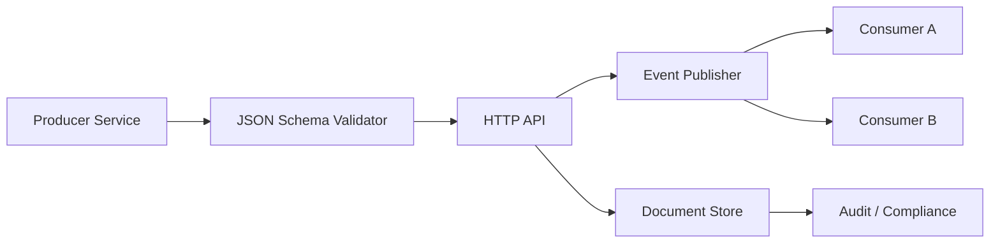
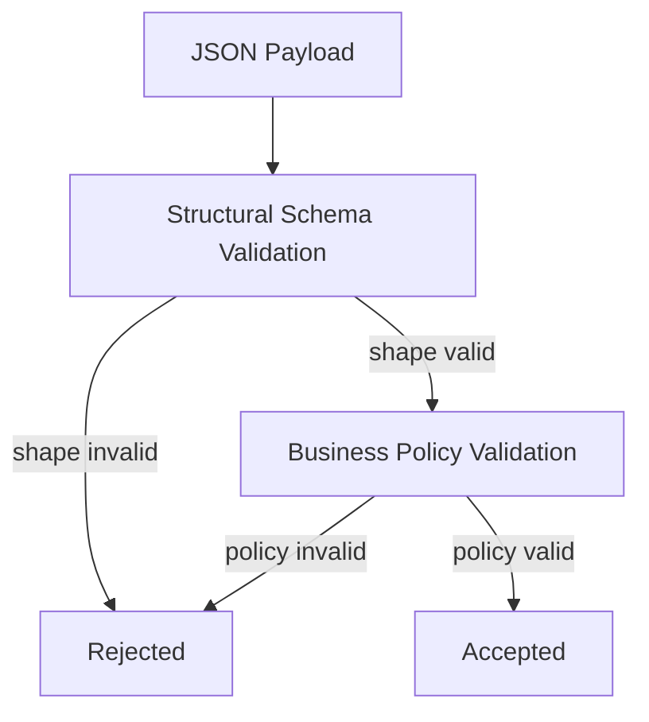
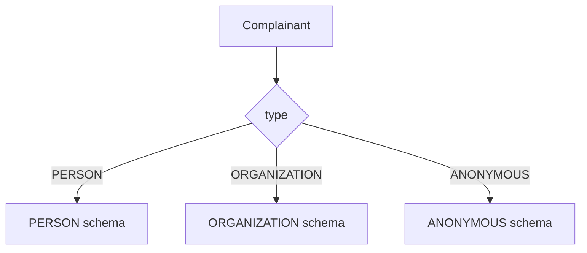
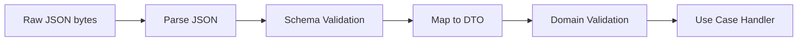

# Part 011 — JSON Schema Design Patterns for Evolvable JSON

JSON Schema sering dipakai untuk menjawab pertanyaan sederhana:

> “Payload ini valid atau tidak?”

Di production contract engineering, pertanyaannya lebih tajam:

> “Bisakah payload ini berubah tanpa merusak producer, consumer, storage, replay, audit, dan runtime validation?”

Itulah bedanya schema sebagai **validator file JSON** dan schema sebagai **kontrak hidup**.

Part ini membahas pola desain JSON Schema Draft 2020-12 untuk kontrak JSON yang bisa berevolusi. Fokusnya bukan menghafal keyword, tapi membangun struktur kontrak yang tahan perubahan.

Kita akan memakai contoh domain regulatory case intake agar pola-pola ini tidak terasa abstrak.

---

## 1. Output yang Harus Kamu Kuasai

Setelah menyelesaikan part ini, kamu harus bisa:

1. memilih kapan object harus closed, open, atau hybrid;
2. membedakan `required`, `nullable`, missing, empty, unknown, dan default;
3. mendesain field yang aman untuk ditambah, dihapus, diganti, dan didepresiasi;
4. mendesain polymorphism dengan tagged union tanpa membuat validator error menjadi kacau;
5. menggunakan `oneOf`, `anyOf`, `allOf`, `const`, `enum`, `not`, `dependentRequired`, dan `unevaluatedProperties` secara disiplin;
6. membuat extension point yang terkendali;
7. menyusun error model dan validation boundary untuk Java service;
8. menghindari schema yang valid secara sintaks tetapi rapuh secara evolusi.

Mental model utamanya:

> JSON Schema yang baik bukan schema yang paling ketat. JSON Schema yang baik adalah schema yang menegakkan invariant penting sambil memberi ruang perubahan yang disengaja.

---

## 2. The Contract Evolution Problem

JSON tampak mudah berubah karena field bisa ditambah kapan saja. Itu ilusi.

Dalam sistem nyata, perubahan kecil dapat memecahkan banyak boundary:



Contoh perubahan yang tampak kecil:

```json
{
  "caseId": "CASE-2026-0001",
  "priority": "URGENT"
}
```

Menjadi:

```json
{
  "caseId": "CASE-2026-0001",
  "priority": {
    "level": "URGENT",
    "reason": "PUBLIC_SAFETY"
  }
}
```

Bagi manusia, ini hanya membuat `priority` lebih detail.

Bagi consumer, ini breaking change karena tipe berubah dari string ke object.

Jadi prinsip pertama:

> Di JSON contract, field name adalah API. Field type adalah API. Field absence adalah API. Unknown property behavior adalah API.

---

## 3. Pattern 1 — Stable Envelope, Evolvable Payload

Untuk payload yang hidup lama, pisahkan **metadata kontrak** dari **data domain**.

```json
{
  "schemaVersion": "1.0",
  "eventId": "018ffd3b-7e93-7c52-a09d-0a1a96e8d711",
  "eventType": "case.intake.submitted",
  "occurredAt": "2026-07-03T10:15:30Z",
  "producer": "case-intake-service",
  "data": {
    "caseId": "CASE-2026-0001",
    "complainant": {
      "type": "PERSON",
      "displayName": "Jane Doe"
    }
  }
}
```

Schema:

```json
{
  "$schema": "https://json-schema.org/draft/2020-12/schema",
  "$id": "https://contracts.example.com/regulatory/events/case-intake-submitted/1.0/schema.json",
  "title": "CaseIntakeSubmittedEvent",
  "type": "object",
  "required": ["schemaVersion", "eventId", "eventType", "occurredAt", "producer", "data"],
  "properties": {
    "schemaVersion": { "const": "1.0" },
    "eventId": { "type": "string", "format": "uuid" },
    "eventType": { "const": "case.intake.submitted" },
    "occurredAt": { "type": "string", "format": "date-time" },
    "producer": { "type": "string", "minLength": 1 },
    "data": { "$ref": "#/$defs/CaseIntakeSubmittedData" }
  },
  "additionalProperties": false,
  "$defs": {
    "CaseIntakeSubmittedData": {
      "type": "object",
      "required": ["caseId", "complainant"],
      "properties": {
        "caseId": { "type": "string", "pattern": "^CASE-[0-9]{4}-[0-9]{4,}$" },
        "complainant": { "$ref": "#/$defs/Complainant" }
      },
      "additionalProperties": false
    },
    "Complainant": {
      "type": "object",
      "required": ["type", "displayName"],
      "properties": {
        "type": { "enum": ["PERSON", "ORGANIZATION", "ANONYMOUS"] },
        "displayName": { "type": "string", "minLength": 1 }
      },
      "additionalProperties": false
    }
  }
}
```

Kenapa envelope penting?

| Field | Fungsi engineering |
|---|---|
| `schemaVersion` | memudahkan routing, migration, dan debugging |
| `eventId` | idempotency dan deduplication |
| `eventType` | discriminator operasional |
| `occurredAt` | event time, bukan processing time |
| `producer` | lineage dan incident triage |
| `data` | domain payload yang bisa berubah lebih terkontrol |

Anti-pattern:

```json
{
  "caseId": "CASE-2026-0001",
  "submittedAt": "2026-07-03T10:15:30Z",
  "sourceSystem": "PORTAL"
}
```

Masalahnya bukan payload ini salah. Masalahnya ia tidak punya ruang operasional untuk replay, audit, registry, routing, debugging, dan schema evolution.

---

## 4. Pattern 2 — Required Fields Are Contract Debt

Setiap field `required` adalah komitmen jangka panjang.

Menambah required field biasanya breaking change untuk producer lama.

Schema v1:

```json
{
  "type": "object",
  "required": ["caseId"],
  "properties": {
    "caseId": { "type": "string" }
  }
}
```

Schema v2:

```json
{
  "type": "object",
  "required": ["caseId", "riskScore"],
  "properties": {
    "caseId": { "type": "string" },
    "riskScore": { "type": "number" }
  }
}
```

Payload lama gagal:

```json
{
  "caseId": "CASE-2026-0001"
}
```

Lebih aman:

```json
{
  "type": "object",
  "required": ["caseId"],
  "properties": {
    "caseId": { "type": "string" },
    "riskScore": {
      "type": "number",
      "minimum": 0,
      "maximum": 100,
      "description": "Optional during rollout. Required by business rule after risk scoring is enabled."
    }
  },
  "additionalProperties": false
}
```

Lalu enforcement requirement-nya pindah ke policy layer:



Rule praktis:

| Field type | Cocok jadi `required`? | Catatan |
|---|---:|---|
| identity field | Ya | `caseId`, `eventId`, `eventType` |
| routing field | Ya | diperlukan untuk consumer dispatch |
| audit timestamp | Ya | biasanya mandatory |
| derived field | Tidak dulu | bisa terlambat dihitung |
| optional business enrichment | Tidak | biarkan absent |
| migration field | Tidak | rollout bertahap |
| future feature field | Tidak | jangan paksa consumer lama |

Prinsip:

> Gunakan `required` untuk invariant struktural. Jangan gunakan `required` untuk memaksa kesiapan proses bisnis yang masih berubah.

---

## 5. Pattern 3 — Missing, Null, Empty, Unknown

JSON punya beberapa cara mengatakan “tidak ada”. Semua berbeda.

```json
{}
```

```json
{ "assignedOfficerId": null }
```

```json
{ "assignedOfficerId": "" }
```

```json
{ "assignedOfficerId": "UNKNOWN" }
```

Kontrak harus menjelaskan artinya.

| Bentuk | Makna umum | Risiko |
|---|---|---|
| missing | field belum disediakan | consumer harus punya default behavior |
| `null` | field sengaja kosong/tidak ada nilai | sering ambigu |
| empty string | nilai ada tapi kosong | sering bug UI/API |
| sentinel value | nilai khusus seperti `UNKNOWN` | enum/logic bisa bocor |

Lebih baik pilih salah satu secara eksplisit.

Contoh: officer belum ditugaskan.

```json
{
  "type": "object",
  "properties": {
    "assignedOfficerId": {
      "type": "string",
      "minLength": 1,
      "description": "Absent when the case has not been assigned. Null and empty string are not allowed."
    }
  },
  "additionalProperties": false
}
```

Contoh: officer sengaja boleh null.

```json
{
  "type": "object",
  "properties": {
    "assignedOfficerId": {
      "type": ["string", "null"],
      "minLength": 1
    }
  },
  "additionalProperties": false
}
```

Tapi hati-hati. `minLength` hanya berlaku ketika instance bertipe string. Untuk null, assertion string tidak berlaku.

Preferensi production:

1. gunakan **missing** untuk “belum tersedia”;
2. gunakan **null** hanya bila domain benar-benar membedakan null dari absent;
3. larang empty string untuk identifier dan enum-like value;
4. hindari sentinel value kecuali ada kebutuhan interoperability legacy.

---

## 6. Pattern 4 — Closed Object at Boundary, Open Object at Extension Point

`additionalProperties: false` populer karena terasa aman.

Tapi terlalu banyak closed object membuat evolusi sulit.

Closed object cocok untuk boundary yang stabil:

```json
{
  "type": "object",
  "required": ["caseId", "status"],
  "properties": {
    "caseId": { "type": "string" },
    "status": { "enum": ["SUBMITTED", "UNDER_REVIEW", "CLOSED"] }
  },
  "additionalProperties": false
}
```

Open object cocok untuk metadata yang memang extensible:

```json
{
  "type": "object",
  "required": ["caseId", "attributes"],
  "properties": {
    "caseId": { "type": "string" },
    "attributes": {
      "type": "object",
      "propertyNames": { "pattern": "^[a-zA-Z][a-zA-Z0-9_.-]{0,63}$" },
      "additionalProperties": {
        "type": ["string", "number", "boolean", "null"]
      }
    }
  },
  "additionalProperties": false
}
```

Hybrid object:

```json
{
  "type": "object",
  "required": ["caseId", "status"],
  "properties": {
    "caseId": { "type": "string" },
    "status": { "enum": ["SUBMITTED", "UNDER_REVIEW", "CLOSED"] },
    "extensions": {
      "type": "object",
      "propertyNames": { "pattern": "^[a-z][a-z0-9.-]+$" },
      "additionalProperties": true
    }
  },
  "additionalProperties": false
}
```

Prinsip desain:

> Jangan membuat seluruh object open karena malas mendesain. Jangan membuat seluruh object closed karena ingin terlihat aman. Buat core contract closed, dan extension point eksplisit.

---

## 7. Pattern 5 — Extension Object, Not Random Top-Level Fields

Buruk:

```json
{
  "caseId": "CASE-2026-0001",
  "status": "SUBMITTED",
  "vendorPriority": "HIGH",
  "partnerRoutingCode": "ABC",
  "temporaryUiFlag": true
}
```

Lebih baik:

```json
{
  "caseId": "CASE-2026-0001",
  "status": "SUBMITTED",
  "extensions": {
    "vendor.priority": "HIGH",
    "partner.routingCode": "ABC"
  }
}
```

Schema:

```json
{
  "type": "object",
  "required": ["caseId", "status"],
  "properties": {
    "caseId": { "type": "string" },
    "status": { "enum": ["SUBMITTED", "UNDER_REVIEW", "CLOSED"] },
    "extensions": {
      "type": "object",
      "propertyNames": {
        "pattern": "^[a-z][a-z0-9]*(\\.[a-z][a-z0-9]*)+$"
      },
      "additionalProperties": {
        "type": ["string", "number", "boolean", "null"]
      }
    }
  },
  "additionalProperties": false
}
```

Kenapa extension object lebih baik?

- top-level contract tetap stabil;
- extension bisa diaudit;
- policy bisa melarang extension tertentu;
- observability bisa menghitung extension usage;
- migration bisa mengangkat extension menjadi field resmi;
- consumer tahu mana field resmi dan mana vendor-specific.

Namun extension object punya batas:

> Extension bukan tempat membuang domain yang belum dipahami.

Jika field penting untuk routing, compliance, decision, atau storage invariant, field itu harus menjadi bagian eksplisit dari contract.

---

## 8. Pattern 6 — Tagged Union for Polymorphism

Polymorphism sering menjadi sumber schema yang sulit dibaca.

Contoh domain: complainant bisa person, organization, atau anonymous.

Buruk:

```json
{
  "name": "Jane Doe",
  "organizationName": null,
  "anonymous": false
}
```

Lebih baik: gunakan discriminator field.

```json
{
  "type": "PERSON",
  "person": {
    "fullName": "Jane Doe",
    "nationalIdLast4": "1234"
  }
}
```

```json
{
  "type": "ORGANIZATION",
  "organization": {
    "legalName": "Acme Corp",
    "registrationNumber": "REG-123"
  }
}
```

Schema tagged union:

```json
{
  "type": "object",
  "oneOf": [
    { "$ref": "#/$defs/PersonComplainant" },
    { "$ref": "#/$defs/OrganizationComplainant" },
    { "$ref": "#/$defs/AnonymousComplainant" }
  ],
  "$defs": {
    "PersonComplainant": {
      "type": "object",
      "required": ["type", "person"],
      "properties": {
        "type": { "const": "PERSON" },
        "person": {
          "type": "object",
          "required": ["fullName"],
          "properties": {
            "fullName": { "type": "string", "minLength": 1 },
            "nationalIdLast4": { "type": "string", "pattern": "^[0-9]{4}$" }
          },
          "additionalProperties": false
        }
      },
      "additionalProperties": false
    },
    "OrganizationComplainant": {
      "type": "object",
      "required": ["type", "organization"],
      "properties": {
        "type": { "const": "ORGANIZATION" },
        "organization": {
          "type": "object",
          "required": ["legalName"],
          "properties": {
            "legalName": { "type": "string", "minLength": 1 },
            "registrationNumber": { "type": "string", "minLength": 1 }
          },
          "additionalProperties": false
        }
      },
      "additionalProperties": false
    },
    "AnonymousComplainant": {
      "type": "object",
      "required": ["type"],
      "properties": {
        "type": { "const": "ANONYMOUS" }
      },
      "additionalProperties": false
    }
  }
}
```

Mermaid mental model:



Rule penting:

- selalu pakai discriminator eksplisit;
- pakai `const` agar branch tidak saling overlap;
- hindari branch yang bisa sama-sama valid;
- buat payload per variant jelas;
- jangan biarkan `oneOf` menebak dari kombinasi field yang rapuh.

---

## 9. Pattern 7 — Avoid Ambiguous `oneOf`

`oneOf` berarti **harus valid terhadap tepat satu schema**.

Ini buruk:

```json
{
  "oneOf": [
    {
      "type": "object",
      "properties": {
        "name": { "type": "string" }
      }
    },
    {
      "type": "object",
      "properties": {
        "email": { "type": "string" }
      }
    }
  ]
}
```

Payload ini valid terhadap dua branch jika tidak ada `required` atau closed object:

```json
{
  "name": "Jane",
  "email": "jane@example.com"
}
```

Akibatnya `oneOf` gagal.

Lebih baik:

```json
{
  "oneOf": [
    {
      "type": "object",
      "required": ["kind", "name"],
      "properties": {
        "kind": { "const": "NAME_ONLY" },
        "name": { "type": "string" }
      },
      "additionalProperties": false
    },
    {
      "type": "object",
      "required": ["kind", "email"],
      "properties": {
        "kind": { "const": "EMAIL_ONLY" },
        "email": { "type": "string", "format": "email" }
      },
      "additionalProperties": false
    }
  ]
}
```

Prinsip:

> `oneOf` butuh branch yang mutually exclusive. Discriminator membuat exclusivity bisa dibaca manusia dan divalidasi mesin.

---

## 10. Pattern 8 — `allOf` for Layering, Not OOP Inheritance

Banyak engineer memakai `allOf` seperti inheritance.

```json
{
  "allOf": [
    { "$ref": "#/$defs/BaseCase" },
    { "$ref": "#/$defs/EnforcementCase" }
  ]
}
```

Ini tidak salah, tapi mental model-nya harus tepat.

`allOf` berarti instance harus valid terhadap semua subschema. Ia bukan class inheritance.

Bagus untuk layering constraint:

```json
{
  "$defs": {
    "CaseIdentity": {
      "type": "object",
      "required": ["caseId"],
      "properties": {
        "caseId": { "type": "string", "pattern": "^CASE-[0-9]{4}-[0-9]{4,}$" }
      }
    },
    "CaseStatus": {
      "type": "object",
      "required": ["status"],
      "properties": {
        "status": { "enum": ["SUBMITTED", "UNDER_REVIEW", "CLOSED"] }
      }
    },
    "CaseSummary": {
      "allOf": [
        { "$ref": "#/$defs/CaseIdentity" },
        { "$ref": "#/$defs/CaseStatus" },
        {
          "type": "object",
          "properties": {
            "title": { "type": "string", "minLength": 1 }
          },
          "required": ["title"],
          "unevaluatedProperties": false
        }
      ]
    }
  }
}
```

Catatan penting:

- `additionalProperties: false` di subschema sering bentrok dengan composition;
- untuk composition Draft 2020-12, `unevaluatedProperties: false` sering lebih cocok di schema luar;
- validator harus benar-benar mendukung annotation-dependent behavior;
- error message `allOf` bisa lebih sulit dipahami, jadi buat subschema bernama jelas.

---

## 11. Pattern 9 — Controlled Enums with Escape Strategy

Enum tampak sederhana:

```json
{
  "enum": ["LOW", "MEDIUM", "HIGH"]
}
```

Tapi enum bisa menjadi salah satu sumber breaking change terbesar.

Menambah enum value dapat memecahkan consumer yang menggunakan exhaustive switch.

```java
switch (priority) {
    case "LOW" -> handleLow();
    case "MEDIUM" -> handleMedium();
    case "HIGH" -> handleHigh();
    default -> throw new IllegalArgumentException("Unknown priority: " + priority);
}
```

Strategi production:

### Opsi A — Closed enum untuk invariant keras

```json
{
  "type": "string",
  "enum": ["SUBMITTED", "UNDER_REVIEW", "CLOSED"]
}
```

Cocok untuk state machine yang benar-benar dikontrol platform.

### Opsi B — Pattern + known values annotation

```json
{
  "type": "string",
  "pattern": "^[A-Z][A-Z0-9_]{0,63}$",
  "description": "Known values: LOW, MEDIUM, HIGH. Consumers must tolerate unknown values."
}
```

Cocok untuk kode yang dikelola eksternal atau berubah cepat.

### Opsi C — Object reference data

```json
{
  "type": "object",
  "required": ["code", "label"],
  "properties": {
    "code": { "type": "string", "pattern": "^[A-Z][A-Z0-9_]{0,63}$" },
    "label": { "type": "string" },
    "version": { "type": "string" }
  },
  "additionalProperties": false
}
```

Cocok untuk regulatory code list, taxonomy, risk category, atau reference data dengan lifecycle sendiri.

Prinsip:

> Closed enum aman untuk producer. Open enum lebih aman untuk evolusi. Pilih berdasarkan siapa yang mengendalikan value space.

---

## 12. Pattern 10 — Dependent Fields for Local Business Shape

Beberapa constraint masih cocok di JSON Schema karena bersifat struktural lokal.

Contoh: jika `closureReason` ada, maka `closedAt` wajib ada.

```json
{
  "type": "object",
  "properties": {
    "status": { "enum": ["SUBMITTED", "UNDER_REVIEW", "CLOSED"] },
    "closedAt": { "type": "string", "format": "date-time" },
    "closureReason": { "type": "string", "minLength": 1 }
  },
  "dependentRequired": {
    "closureReason": ["closedAt"]
  },
  "additionalProperties": false
}
```

Untuk rule yang bergantung status:

```json
{
  "type": "object",
  "required": ["status"],
  "properties": {
    "status": { "enum": ["SUBMITTED", "UNDER_REVIEW", "CLOSED"] },
    "closedAt": { "type": "string", "format": "date-time" },
    "closureReason": { "type": "string", "minLength": 1 }
  },
  "allOf": [
    {
      "if": {
        "properties": { "status": { "const": "CLOSED" } },
        "required": ["status"]
      },
      "then": {
        "required": ["closedAt", "closureReason"]
      }
    }
  ],
  "additionalProperties": false
}
```

Gunakan schema untuk local shape rule.

Jangan gunakan schema untuk rule yang membutuhkan database, permission, external system, atau historical state.

Buruk:

> `riskScore` harus lebih tinggi dari rata-rata seluruh kasus aktif dari region yang sama.

Itu bukan tugas JSON Schema. Itu tugas business validation service.

---

## 13. Pattern 11 — Format Is Not Enough

Ini tampak valid:

```json
{
  "type": "string",
  "format": "date-time"
}
```

Namun dalam production, kamu tetap harus menentukan:

- apakah timezone wajib;
- apakah offset selain `Z` diterima;
- apakah fractional seconds diterima;
- apakah leap second diterima;
- apakah local date boleh dipakai;
- apakah consumer harus preserve original string atau normalize ke `Instant`.

Lebih eksplisit:

```json
{
  "type": "string",
  "format": "date-time",
  "description": "RFC 3339 timestamp. Must include timezone offset. Producers should emit UTC with Z. Consumers must preserve instant semantics."
}
```

Untuk identifier:

```json
{
  "type": "string",
  "pattern": "^CASE-[0-9]{4}-[0-9]{4,}$",
  "description": "Stable case identifier assigned by case registry. Not reusable."
}
```

Untuk money:

```json
{
  "type": "object",
  "required": ["amount", "currency"],
  "properties": {
    "amount": {
      "type": "string",
      "pattern": "^-?[0-9]+(\\.[0-9]{1,2})?$",
      "description": "Decimal string to avoid floating point precision loss."
    },
    "currency": {
      "type": "string",
      "pattern": "^[A-Z]{3}$"
    }
  },
  "additionalProperties": false
}
```

Prinsip:

> `format` memberi hint validasi. Contract description memberi semantic agreement. Java type mapping memberi runtime discipline.

---

## 14. Pattern 12 — Error Model as Contract

Validation error jangan hanya dilempar mentah dari library.

Buruk:

```json
{
  "error": "#/data/complainant/person/fullName: expected minLength 1"
}
```

Lebih baik:

```json
{
  "type": "https://errors.example.com/contract-validation-error",
  "title": "Contract validation failed",
  "status": 400,
  "traceId": "018ffd3b-9a75-7daa-9d18-2bc97cbe7d51",
  "schemaId": "https://contracts.example.com/regulatory/case-intake/1.0/schema.json",
  "violations": [
    {
      "path": "/data/complainant/person/fullName",
      "keyword": "minLength",
      "message": "fullName must not be empty",
      "rejectedValueCategory": "EMPTY_STRING"
    }
  ]
}
```

Schema untuk error model juga harus dikontrak:

```json
{
  "type": "object",
  "required": ["type", "title", "status", "traceId", "violations"],
  "properties": {
    "type": { "type": "string", "format": "uri" },
    "title": { "type": "string" },
    "status": { "type": "integer", "minimum": 400, "maximum": 599 },
    "traceId": { "type": "string" },
    "schemaId": { "type": "string", "format": "uri" },
    "violations": {
      "type": "array",
      "minItems": 1,
      "items": {
        "type": "object",
        "required": ["path", "keyword", "message"],
        "properties": {
          "path": { "type": "string" },
          "keyword": { "type": "string" },
          "message": { "type": "string" },
          "rejectedValueCategory": { "type": "string" }
        },
        "additionalProperties": false
      }
    }
  },
  "additionalProperties": false
}
```

Kenapa error model penting?

- client bisa menampilkan error field-level;
- producer event bisa memperbaiki payload;
- DLQ triage lebih cepat;
- audit punya bukti kenapa payload ditolak;
- monitoring bisa agregasi by keyword/path/schema.

---

## 15. Java Boundary Pattern

Jangan sebar validation call di mana-mana.

Buat boundary jelas:



Pseudo-code:

```java
public final class ContractBoundary<T> {
    private final JsonSchema schema;
    private final ObjectMapper objectMapper;
    private final Class<T> targetType;

    public T validateAndDecode(byte[] payload) {
        JsonNode node = parse(payload);
        Set<ValidationMessage> violations = schema.validate(node);

        if (!violations.isEmpty()) {
            throw ContractValidationException.from(violations);
        }

        return objectMapper.convertValue(node, targetType);
    }

    private JsonNode parse(byte[] payload) {
        try {
            return objectMapper.readTree(payload);
        } catch (IOException e) {
            throw new MalformedJsonException(e);
        }
    }
}
```

Boundary discipline:

| Layer | Tanggung jawab |
|---|---|
| raw parser | JSON well-formedness |
| schema validator | structural contract |
| mapper | DTO conversion |
| domain validator | business invariant |
| use case | state transition |

Jangan mapping ke DTO sebelum schema validation jika DTO terlalu permissive. Jangan mengandalkan annotation Java saja untuk kontrak lintas bahasa.

---

## 16. Full Example — Evolvable Case Intake Payload

```json
{
  "$schema": "https://json-schema.org/draft/2020-12/schema",
  "$id": "https://contracts.example.com/regulatory/case-intake/1.0/schema.json",
  "title": "CaseIntakeRequest",
  "type": "object",
  "required": ["requestId", "submittedAt", "source", "complainant", "allegation"],
  "properties": {
    "requestId": { "type": "string", "format": "uuid" },
    "submittedAt": {
      "type": "string",
      "format": "date-time",
      "description": "Timestamp supplied by intake channel. Must include timezone."
    },
    "source": {
      "type": "string",
      "enum": ["PORTAL", "CALL_CENTER", "EMAIL", "PARTNER_API"]
    },
    "complainant": { "$ref": "#/$defs/Complainant" },
    "allegation": { "$ref": "#/$defs/Allegation" },
    "attachments": {
      "type": "array",
      "items": { "$ref": "#/$defs/Attachment" },
      "maxItems": 50
    },
    "extensions": { "$ref": "#/$defs/Extensions" }
  },
  "additionalProperties": false,
  "$defs": {
    "Complainant": {
      "oneOf": [
        { "$ref": "#/$defs/PersonComplainant" },
        { "$ref": "#/$defs/OrganizationComplainant" },
        { "$ref": "#/$defs/AnonymousComplainant" }
      ]
    },
    "PersonComplainant": {
      "type": "object",
      "required": ["type", "person"],
      "properties": {
        "type": { "const": "PERSON" },
        "person": {
          "type": "object",
          "required": ["fullName"],
          "properties": {
            "fullName": { "type": "string", "minLength": 1 },
            "email": { "type": "string", "format": "email" },
            "phone": { "type": "string", "minLength": 3 }
          },
          "additionalProperties": false
        }
      },
      "additionalProperties": false
    },
    "OrganizationComplainant": {
      "type": "object",
      "required": ["type", "organization"],
      "properties": {
        "type": { "const": "ORGANIZATION" },
        "organization": {
          "type": "object",
          "required": ["legalName"],
          "properties": {
            "legalName": { "type": "string", "minLength": 1 },
            "registrationNumber": { "type": "string", "minLength": 1 }
          },
          "additionalProperties": false
        }
      },
      "additionalProperties": false
    },
    "AnonymousComplainant": {
      "type": "object",
      "required": ["type"],
      "properties": {
        "type": { "const": "ANONYMOUS" }
      },
      "additionalProperties": false
    },
    "Allegation": {
      "type": "object",
      "required": ["summary", "category"],
      "properties": {
        "summary": { "type": "string", "minLength": 10, "maxLength": 5000 },
        "category": {
          "type": "string",
          "pattern": "^[A-Z][A-Z0-9_]{0,63}$",
          "description": "Known categories are managed by reference data. Consumers must tolerate unknown category codes."
        },
        "occurredOn": { "type": "string", "format": "date" }
      },
      "additionalProperties": false
    },
    "Attachment": {
      "type": "object",
      "required": ["attachmentId", "fileName", "contentType", "sizeBytes"],
      "properties": {
        "attachmentId": { "type": "string", "format": "uuid" },
        "fileName": { "type": "string", "minLength": 1, "maxLength": 255 },
        "contentType": { "type": "string", "minLength": 1 },
        "sizeBytes": { "type": "integer", "minimum": 1, "maximum": 52428800 }
      },
      "additionalProperties": false
    },
    "Extensions": {
      "type": "object",
      "propertyNames": {
        "pattern": "^[a-z][a-z0-9]*(\\.[a-z][a-z0-9]*)+$"
      },
      "additionalProperties": {
        "type": ["string", "number", "boolean", "null"]
      }
    }
  }
}
```

Perhatikan desainnya:

- top-level closed;
- extension point eksplisit;
- complainant memakai tagged union;
- category tidak closed enum karena reference data bisa berubah;
- attachment dibatasi ukuran dan jumlah;
- date/time disemantikkan lewat description;
- optional field tidak dipaksa required selama tidak menjadi invariant inti.

---

## 17. Compatibility Heuristics

Checklist perubahan JSON Schema:

| Perubahan | Biasanya aman untuk producer lama? | Biasanya aman untuk consumer lama? | Catatan |
|---|---:|---:|---|
| tambah optional property | Ya | Mungkin | consumer closed parser bisa gagal |
| tambah required property | Tidak | Ya | producer lama gagal |
| hapus property optional | Mungkin | Tidak | consumer mungkin butuh field itu |
| ubah string ke object | Tidak | Tidak | breaking |
| tambah enum value | Ya | Mungkin tidak | exhaustive switch risk |
| buat object lebih closed | Tidak | Ya | producer dengan extra field gagal |
| buat object lebih open | Ya | Mungkin | consumer dapat field tak dikenal |
| tambah branch `oneOf` | Ya | Mungkin tidak | consumer lama tidak tahu variant baru |
| tambah constraint `minLength` | Tidak | Ya | producer lama bisa gagal |
| longgarkan constraint | Ya | Mungkin | consumer bisa menerima value yang tidak siap |

Prinsip:

> Compatibility harus dianalisis dari dua sisi: apakah producer lama masih bisa mengirim, dan apakah consumer lama masih bisa membaca.

---

## 18. Anti-Patterns

### 18.1 Schema as DTO Dump

```json
{
  "properties": {
    "caseId": {},
    "status": {},
    "metadata": {},
    "payload": {}
  }
}
```

Ini bukan kontrak. Ini JSON-shaped hope.

### 18.2 `additionalProperties: true` Everywhere

Schema menjadi dokumentasi longgar, bukan enforcement.

### 18.3 `additionalProperties: false` Everywhere Without Extension Strategy

Schema menjadi sulit berevolusi dan sering memaksa major version terlalu cepat.

### 18.4 Implicit Polymorphism

Menebak tipe dari kombinasi field tanpa discriminator membuat consumer dan validator rapuh.

### 18.5 Enum as Universal Code List

Tidak semua code list cocok menjadi enum. Banyak code list punya owner, lifecycle, version, effective date, dan deprecation sendiri.

### 18.6 Business Rule Overload

Schema tidak boleh menjadi mini rule engine untuk seluruh domain.

---

## 19. Production Checklist

Sebelum schema JSON dipakai production, jawab ini:

1. Apakah `$schema` dan `$id` jelas?
2. Apakah top-level object closed atau open secara sengaja?
3. Apakah extension point eksplisit?
4. Apakah setiap required field benar-benar invariant struktural?
5. Apakah null/missing/empty punya makna jelas?
6. Apakah polymorphism memakai discriminator?
7. Apakah `oneOf` branch mutually exclusive?
8. Apakah enum value bisa berubah? Jika ya, apakah consumer harus tolerate unknown?
9. Apakah date/time/money/identifier punya semantic description?
10. Apakah validation error model distandarkan?
11. Apakah Java service melakukan schema validation sebelum domain mapping?
12. Apakah compatibility change diuji di CI?
13. Apakah example valid dan invalid disimpan sebagai test fixture?
14. Apakah schema bisa dimodularisasi dan dibundle?
15. Apakah consumer behavior terhadap unknown property terdokumentasi?

---

## 20. Latihan

Gunakan domain `CaseEscalationRequested`.

Buat JSON Schema untuk payload berikut:

- `requestId` wajib UUID;
- `caseId` wajib format `CASE-yyyy-nnnn`;
- `requestedAt` wajib date-time;
- `requestedBy` wajib object dengan `userId` dan `role`;
- `targetLevel` controlled enum: `SUPERVISOR`, `LEGAL`, `EXECUTIVE`;
- `reason` minimal 20 karakter;
- `evidence` optional array max 20 item;
- `extensions` optional;
- top-level closed;
- `requestedBy.role` harus tolerate future value atau closed enum? Putuskan dan jelaskan.

Kemudian buat 5 payload invalid:

1. missing `caseId`;
2. empty `reason`;
3. unknown top-level field;
4. invalid date-time;
5. ambiguous polymorphic field jika kamu memakai union.

Tujuan latihan bukan schema-nya panjang. Tujuannya memaksa kamu memilih invariant mana yang structural, mana yang business policy, dan mana yang perlu evolusi.

---

## 21. Ringkasan

JSON Schema production-grade harus mendesain perubahan, bukan hanya mendesain bentuk data saat ini.

Mental model yang harus tertanam:

- required field adalah hutang kontrak;
- missing, null, empty, dan unknown bukan hal yang sama;
- closed object perlu extension strategy;
- polymorphism butuh discriminator;
- enum butuh ownership dan evolution strategy;
- `allOf` bukan inheritance;
- `oneOf` harus mutually exclusive;
- schema validation bukan pengganti business rule engine;
- error model adalah bagian dari kontrak;
- Java boundary harus memisahkan parse, schema validation, mapping, dan domain validation.

Di part berikutnya, kita akan membahas modularisasi JSON Schema: `$id`, `$ref`, `$defs`, `$anchor`, bundling, URI design, schema package layout, dan strategi publikasi artifact agar schema bisa hidup sebagai asset engineering, bukan file JSON acak di repository.
